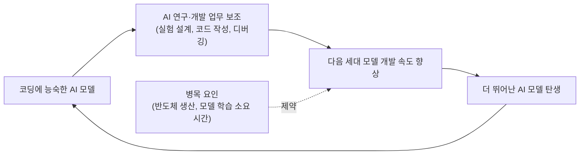
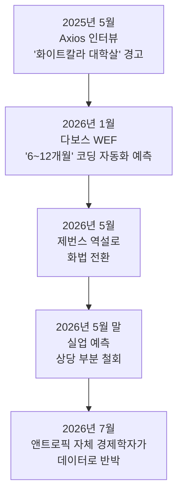
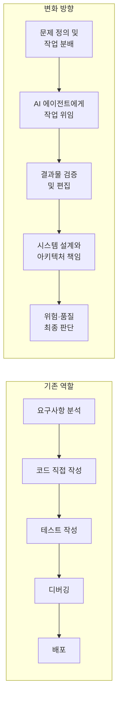

## 목차

1. 들어가며: 이 글이 다루는 것
2. 발언의 출처 — 2026년 1월 다보스 세계경제포럼 "The Day After AGI" 세션
3. 아모데이 발언의 핵심 내용 그대로 정리하기
4. "AI가 AI를 만드는 순환 고리"란 정확히 무엇인가
5. 같은 자리에서 나온 다른 예측들 — 노벨상급 지능, AGI 확률, 일자리
6. 반론 1 — 데미스 하사비스의 신중론
7. 반론 2 — 얀 르쿤과 "LLM에 중독된 업계"라는 비판
8. 반론 3 — 예측 자체에 대한 방법론적 비판
9. 다보스 이후 7개월, 실제로 무슨 일이 있었나 (2026년 8월 기준 최신 상황)
10. 개발자 역할은 실제로 어떻게 바뀌고 있나
11. 팩트체크 정리 — 확인된 사실 vs 아직 불확실한 주장
12. 정리하며
13. 참고문헌

---

## 1. 들어가며: 이 글이 다루는 것

>
> 소프트웨어 개발자의 일 대부분을 AI가 맡는 시점이 6~12개월밖에 남지 않았다는 전망이 나왔습니다. Anthropic CEO 다리오 아모데이는 AI가 소프트웨어 엔지니어의 업무 대부분, 어쩌면 처음부터 끝까지 처리할 수 있는 시점이 빠르게 다가오고 있다고 말했습니다. 여기서 더 큰 변화가 시작됩니다. AI가 코드를 잘 쓰는 수준을 넘어 다음 세대 AI를 만드는 연구와 개발까지 돕기 시작하는 겁니다. 코드 작성 테스트 디버깅 실험 설계 결과 분석 다음 개선안 제안 이 과정이 점점 자동화되면 AI 개발 속도 자체가 빨라질 수 있습니다. Anthropic도 실제로 내부 개발자들의 업무에서 AI 사용이 일하는 방식을 크게 바꾸고 있다고 보고했습니다. 중요한 건 “개발자가 사라진다”는 단순한 이야기가 아닙니다. 앞으로 개발자의 역할이 코드를 직접 많이 쓰는 사람에서 AI 에이전트에게 일을 나누고, 결과를 검증하고, 전체 시스템을 설계하는 사람으로 빠르게 이동할 가능성이 큽니다.
> 
> AI가 코드를 쓰는 변화보다 더 큰 변화는 AI가 AI를 만드는 과정에 들어오기 시작했다는 점입니다.
> 
> https://www.threads.com/share/BAq_3wypcA/
> 

공유해주신 Threads 게시글은 앤트로픽 최고경영자 다리오 아모데이가 "소프트웨어 엔지니어의 업무 대부분을 AI가 처리하는 시점이 6~12개월밖에 남지 않았다"고 말했다는 내용과, 이보다 더 중요한 변화로 "AI가 AI를 만드는 과정"이 시작되었다는 내용을 담고 있습니다. 이 발언은 실제로 존재하며, 2026년 1월 스위스 다보스에서 열린 세계경제포럼(WEF) 연례회의 기간 중 나온 것으로 확인됩니다. 다만 이 발언은 단독으로 나온 것이 아니라 구글 딥마인드 최고경영자 데미스 하사비스와 함께한 90분 안팎의 대담 세션에서 나왔고, 이후 여러 인공지능 리더들로부터 상당한 반론과 비판을 받았습니다. 또한 이 발언이 나온 지 7개월이 지난 지금(2026년 8월) 시점에서 보면, 아모데이 본인의 이야기 방식도 상당히 달라졌다는 점까지 함께 확인할 수 있었습니다. 이 문서는 원문 발언의 정확한 맥락, 함께 등장한 다른 예측들, 이에 대한 업계의 반응, 그리고 발언 이후 실제로 관찰된 변화까지를 웹 검색을 통해 교차 확인하여 정리한 것입니다. 추측이나 확인되지 않은 내용은 최대한 배제했고, 출처가 하나뿐이거나 불확실한 부분은 본문과 마지막 팩트체크 장에서 별도로 표시했습니다.

---

## 2. 발언의 출처 — 2026년 1월 다보스 세계경제포럼 "The Day After AGI" 세션

이 발언이 나온 자리는 2026년 1월 스위스 다보스에서 열린 세계경제포럼(WEF) 연례회의 기간 중 진행된 "The Day After AGI(AGI 도래 다음날)"라는 제목의 세션이었습니다[1][3][4]. 이코노미스트지 편집장 재니 민턴 베도스가 진행을 맡았고, 무대에는 구글 딥마인드 최고경영자 데미스 하사비스와 앤트로픽 최고경영자 다리오 아모데이가 함께 앉았습니다[3][4][7]. 세계에서 가장 앞서 있는 두 AI 연구소의 수장이 한 무대에 나란히 앉아 AGI(범용인공지능) 도래 이후의 세계를 논의한, 업계에서는 상당히 이례적이고 상징적인 자리였습니다.

이 세션은 세계경제포럼 공식 팟캐스트 "Radio Davos"를 통해 녹화·공개되었으며[4], 이후 파이낸셜타임스 계열을 포함한 다수의 매체가 발언을 인용 보도했습니다. 즉 이 발언은 특정 언론사의 단독 인터뷰가 아니라 다수 청중과 카메라 앞에서 공개적으로 이루어진 대담이며, 발언 원문은 여러 매체와 팟캐스트를 통해 상호 검증이 가능한 상태입니다.

---

## 3. 아모데이 발언의 핵심 내용 그대로 정리하기

아모데이가 이 자리에서 실제로 한 말은 여러 매체에서 거의 동일한 문장으로 반복 인용되고 있어 신뢰도가 높습니다. 핵심 발언은 다음과 같습니다.

먼저 그는 앤트로픽 내부의 변화를 먼저 소개했습니다. "앤트로픽 내부에는 '나는 이제 코드를 전혀 쓰지 않는다. 그냥 모델이 코드를 쓰게 하고, 나는 그걸 편집한다'고 말하는 엔지니어들이 있다"고 밝혔습니다[1][2][5]. 이어서 그는 자신의 발언 중 가장 널리 퍼진 문장을 말했습니다. "언제 일이 일어날지 정확히 알기는 항상 어렵지만, 나는 우리가 모델이 소프트웨어 엔지니어가 하는 일의 대부분, 어쩌면 전부를 처음부터 끝까지 처리하게 되는 시점으로부터 6개월에서 12개월 정도 떨어져 있다고 생각한다"는 취지의 말을 남겼습니다[1][2][6][46]. 그는 이 변화의 메커니즘도 함께 설명했는데, 코딩에 능숙한 AI 모델과 AI 연구 자체를 돕는 AI가 결합하면 다음 세대 모델을 만드는 속도 자체가 빨라지는 "순환 고리(loop)"가 만들어진다는 것이었습니다. 다만 그는 이 고리가 아직 완전히 닫히지 않았다는 점도 분명히 했습니다. "그 고리가 얼마나 빨리 닫히느냐가 문제다"라고 말하면서, 반도체 제조나 모델 학습에 걸리는 물리적 시간 같은 요소는 아직 AI가 대신할 수 없는 병목이라고 인정했습니다[2][46].

정리하면 아모데이의 주장은 크게 세 겹으로 이루어져 있습니다. 첫째는 관찰(앤트로픽 엔지니어들이 실제로 코드를 직접 쓰지 않게 되었다는 사내 사례), 둘째는 예측(6~12개월 안에 이 현상이 소프트웨어 엔지니어링 전반으로 확산될 것이라는 전망), 셋째는 그 예측을 뒷받침하는 메커니즘(코딩 잘하는 AI가 다음 AI를 만드는 데 기여하는 자기가속 고리)입니다. 이 세 겹을 구분해서 보는 것이 이후의 논쟁을 이해하는 데 중요합니다. 많은 반론은 첫 번째 관찰 자체보다는 두 번째 예측의 시점, 혹은 세 번째 메커니즘이 얼마나 강력한지에 집중되어 있기 때문입니다.

---

## 4. "AI가 AI를 만드는 순환 고리"란 정확히 무엇인가

공유해주신 게시글에서 가장 강조하고 있는 지점, 즉 "AI가 코드를 잘 쓰는 것보다 더 큰 변화는 AI가 AI를 만드는 과정에 들어오기 시작했다는 것"이라는 문장은 아모데이가 다보스에서 설명한 개념과 정확히 일치합니다. 그는 AI 랩들이 코딩에 강한 모델과 AI 연구 자체에 강한 모델을 만들면, 그 모델이 다시 다음 세대 모델을 더 빠르게 만드는 데 쓰이면서 개발 속도가 스스로 가속되는 구조가 생긴다고 설명했습니다[14]. 이는 코드 작성, 테스트, 디버깅, 실험 설계, 결과 분석, 개선안 제안이라는 연구개발 사이클 자체를 AI가 보조하거나 대신하기 시작한다는 뜻으로, 단순히 "코딩 보조 도구"의 개념을 넘어서는 이야기입니다.

이 개념을 도식으로 정리하면 다음과 같습니다.

다만 여기서 반드시 함께 짚어야 할 부분이 있습니다. 아모데이 스스로도 이 고리가 "아직 완전히 닫히지 않았다"고 밝혔다는 점입니다[2][46]. 그가 언급한 병목은 크게 두 가지로, 첫째는 반도체(칩) 제조라는 물리적 생산 공정이고 둘째는 모델 학습 자체에 걸리는 시간입니다. 즉 그의 발언은 "AI가 이미 스스로를 완전히 개선하고 있다"는 확정적 사실 진술이 아니라, "그 방향으로 가는 고리가 형성되고 있고, 그 고리가 얼마나 빨리 닫히는지가 관건"이라는 진행형·조건부 진술에 가깝습니다. 이 뉘앙스 차이는 이후 소셜미디어에서 발언이 확산되는 과정에서 종종 생략되었습니다.

---

## 5. 같은 자리에서 나온 다른 예측들 — 노벨상급 지능, AGI 확률, 일자리

이 세션에서 아모데이는 소프트웨어 엔지니어링 이야기 외에도 몇 가지 굵직한 예측을 함께 내놓았습니다. 먼저 그는 2025년 파리에서 자신이 밝혔던 "2026~2027년까지 노벨상 수상자 수준의 지적 능력을 여러 분야에서 보여주는 모델이 나올 것"이라는 예측을 여전히 유지하는지 질문받았고, "정확히 언제일지는 항상 알기 어렵지만, 그 예측이 크게 빗나가지는 않을 것 같다"고 답했습니다[17]. 이는 기존 예측을 재확인한 것으로, 새로운 주장이라기보다는 기존 입장의 반복에 가깝습니다.

노동시장에 대해서는 그가 2025년 5월 Axios와의 인터뷰에서 처음 밝혔던 "향후 1~5년 안에 신입 사원 대상 화이트칼라 일자리의 절반이 사라지고 실업률이 10~20%까지 치솟을 수 있다"는 경고를 다시 언급한 것으로 여러 매체에 보도되었습니다[6][12][14]. 이 발언은 당시 "White-Collar Bloodbath(화이트칼라 대학살)"이라는 표현으로 널리 알려졌던 것으로, 2025년 5월 Axios 인터뷰가 원출처이며[8][36][37], 이후 아모데이가 2026년 1월 "기술의 사춘기(The Adolescence of Technology)"라는 제목의 에세이에서 다시 한 번 "AI는 인간 노동의 일반적 대체재로 기능하며, 하위 숙련 노동에서 상위 숙련 노동으로 일자리 대체가 옮겨갈 것"이라는 취지로 재차 경고했다는 보도가 있습니다[28].

하사비스는 같은 자리에서 "2030년대 말까지 인간의 모든 인지 능력을 보여주는 시스템이 등장할 확률을 50%로 본다"는 기존 입장을 재확인했으며[45], 추론과 장기 기억 같은 영역에서 한두 차례의 추가적 돌파구가 필요하다고 말한 것으로 확인됩니다. 한 매체(techsambad.substack.com)는 하사비스가 "선진국에서 최대 60%에 달하는 일자리 지형 변화"를 경고했다고 전했는데, 이 수치는 다른 다수 매체에서 교차 확인되지 않아 단일 출처의 보도로 남겨두는 것이 안전합니다.

---

## 6. 반론 1 — 데미스 하사비스의 신중론

같은 무대에 있었던 하사비스는 아모데이보다 훨씬 신중한 태도를 취했습니다. 그는 코딩이나 수학처럼 결과가 "검증 가능한(verifiable)" 영역은 자동화 경로가 비교적 뚜렷하게 보이지만, 자연과학처럼 가설을 세우고 실험을 설계해야 하는 영역은 자동화가 훨씬 어렵다고 선을 그었습니다[45]. 그는 여전히 "2030년대 말까지 50% 확률"이라는 상대적으로 보수적인 시간표를 고수했고[45][11], 학부생들에게 지금 조언한다면 "이 도구들을 정말로 놀랍도록 능숙하게 다루는 사람이 되라"고 말할 것이라고 밝혔습니다[12][15]. 이는 아모데이의 "6~12개월" 시간표와는 확연히 결이 다른, 훨씬 더 긴 호흡의 전망입니다. 흥미로운 지점은 두 사람이 방향성 — AI 시스템이 스스로 AI 시스템을 만드는 고리가 얼마나 빨리 닫히느냐가 관건이라는 점 — 에는 동의하면서도, 그 속도에 대한 확신의 정도에서는 뚜렷하게 갈렸다는 것입니다[12].

---

## 7. 반론 2 — 얀 르쿤과 "LLM에 중독된 업계"라는 비판

이 논쟁에 대한 좀 더 근본적인 반론은 얀 르쿤에게서 나왔습니다. 다만 여기서 정확한 사실관계를 짚어야 합니다. 다보스 세션 당시 그는 여전히 메타 소속으로 언급되는 보도가 많았지만[11], 실제로는 이미 2025년 11월에 메타를 떠나 독자적으로 세계모델(world model) 연구를 이어가겠다고 공개 발표한 상태였고[23][26], 이후 2026년 3월 프랑스 파리에 본사를 둔 AMI 랩스(Advanced Machine Intelligence Labs)라는 스타트업을 공식 설립해 10억 달러 이상의 시드 투자를 유치했습니다[12][22][25]. 즉 다보스 세션이 열린 시점에는 르쿤이 메타에서 사실상 퇴사 절차를 밟고 있던 과도기였고, 지금(2026년 8월) 시점에서는 메타 소속이 아니라 자신의 회사 AMI 랩스를 이끌고 있다는 점을 분명히 해둘 필요가 있습니다.

르쿤의 핵심 비판은 업계 전체가 "LLM에 중독되어(LLM-pilled)" 있다는 것입니다[11]. 그는 대형언어모델이 다음 단어를 예측하는 방식으로는 물리적 세계에 대한 인과관계나 상식을 제대로 습득할 수 없으며, 진정한 범용지능에 도달하려면 영상과 감각 데이터로부터 물리 법칙을 학습하는 "세계모델" 방식이 필요하다고 주장합니다[19]. 이는 아모데이나 하사비스가 전제하고 있는 "지금의 언어모델 계열을 계속 확장하면 AGI에 도달한다"는 전제 자체에 의문을 제기하는, 가장 근본적인 층위의 반론입니다. 다만 이 반론은 "6~12개월 안에 코딩 업무가 자동화된다"는 좁은 주장을 직접 반박한다기보다는, "AI가 AI를 만드는 순환 고리가 결국 초지능으로 이어질 것"이라는 더 큰 그림에 대한 회의론에 가깝습니다.

---

## 8. 반론 3 — 예측 자체에 대한 방법론적 비판

세 번째 층위의 반론은 언어모델 연구자 허버트 로이트블랫이 제기한 것으로, 아모데이의 과거 예측(2025년 초 "3~6개월 안에 코드의 90%를, 1년 안에는 100%를 AI가 작성하게 될 것") 자체의 논리 구조를 문제 삼습니다[9]. 그는 이 예측이 몇 가지 검증되지 않은 전제 위에 서 있다고 지적합니다. 이미 코드의 90% 이상이 AI로 작성되고 있다는 전제, 문제의 마지막 10%가 처음 10%만큼 쉬울 것이라는 전제, 앞으로 필요한 모든 코드를 이미 지금의 모델이 생성할 수 있다는 전제, 그리고 소프트웨어 개발이 곧 코드를 작성하는 행위 그 자체라는 전제가 그것입니다[9]. 이런 종류의 비판은 앤트로픽 발표 자체를 부정한다기보다는, "쉬운 90%가 빠르게 끝났다고 해서 어려운 10%도 같은 속도로 끝난다는 보장은 없다"는 소프트웨어 공학계의 오래된 경험칙(이른바 파레토 원리의 역설)을 상기시키는 성격이 강합니다.

---

## 9. 다보스 이후 7개월, 실제로 무슨 일이 있었나 (2026년 8월 기준 최신 상황)

여기서부터는 공유해주신 게시글에는 담기지 않았지만, 지금 시점(2026년 8월)에서 가장 중요하게 짚어야 할 부분입니다. 다보스 발언 이후 반년 넘게 시간이 흐르면서, 아모데이 본인의 화법도 상당히 달라졌다는 점이 여러 매체를 통해 확인됩니다.

첫째, 2026년 5월 5일 뉴욕에서 열린 앤트로픽의 금융 서비스 관련 브리핑에서 아모데이는 JP모건체이스 최고경영자 제이미 다이먼과 나란히 무대에 올랐는데, 이 자리에서 그는 노동시장 이야기를 할 때 "화이트칼라 대학살" 같은 파국적 표현 대신 경제학의 "제번스 역설(Jevons Paradox, 기술이 효율화되면 오히려 그 기술에 대한 총수요가 늘어난다는 개념)"이라는 훨씬 완화된 틀을 사용했습니다[11]. 다만 그는 동시에 "AI는 이전의 기술 변화보다 훨씬 빠르게 움직이고 있어서, 시스템에 평소보다 큰 부담이 걸리면 예상치 못한 이상 현상과 큰 혼란이 나타날 수 있다"는 단서도 함께 달았습니다[11].

둘째, 2026년 5월 26일 포춘지 보도에 따르면 아모데이와 오픈AI 최고경영자 샘 알트먼 두 사람 모두 "AI가 일자리를 파괴할 것"이라는 기존의 강한 경고를 상당 부분 되돌리는 발언을 내놓았습니다. 알트먼은 "AI의 경제적 영향에 대해 상당히 틀렸었다"고 인정했고, 아모데이는 "예전에는 화이트칼라 일자리의 50%가 사라질 수 있다고 했지만, 이제는 오히려 자동화가 사람들이 하는 업무의 총량을 늘릴 수도 있다"는 취지로 입장을 바꾼 것으로 보도되었습니다[10].

셋째, 그리고 가장 구체적인 반박은 앤트로픽 내부에서 나왔습니다. 2026년 7월 24일 포춘지 보도에 따르면 앤트로픽의 수석 경제학자 피터 매크로리가 X(옛 트위터)에 장문의 분석 글을 올려, AI 노출도가 높은 직군에서 실업률이 상대적으로 더 악화되었다는 증거가 실제 데이터에는 나타나지 않는다고 주장했습니다[9]. 이는 아모데이가 2025년 11월 CBS 60분 인터뷰에서 밝혔던 "AI가 일반적 노동 대체재로 작동하고 있다"는 주장과 정면으로 배치되는 내용으로, 같은 회사 내부에서 최고경영자의 공개 경고와 수석 경제학자의 데이터 분석이 서로 다른 결론을 내리고 있는 흥미로운 상황이 만들어졌습니다[9].

이 세 가지 사실을 종합하면, "6~12개월 안에 소프트웨어 엔지니어링 대부분을 AI가 담당하게 된다"는 좁은 의미의 코딩 자동화 예측 자체는 다보스 이후 별도로 철회되거나 수정되었다는 보도는 확인되지 않았지만, 그 예측과 짝을 이루던 "대규모 실업" 서사는 아모데이 본인에 의해 상당히 완화되었다는 점이 분명해 보입니다. 이는 게시글이 인용한 발언을 접할 때 함께 알아두면 유용한, 시간이 지나며 드러난 후속 맥락입니다.

---

## 10. 개발자 역할은 실제로 어떻게 바뀌고 있나

발언의 시점 예측이 맞고 틀리고를 떠나, 방향성 자체는 이미 상당수 매체와 실무자들이 공감하는 부분이기도 합니다. 여러 보도는 개발자의 역할이 코드를 한 줄 한 줄 직접 작성하는 사람에서, 문제를 정의하고, AI가 만든 결과물을 검증하며, 전체 시스템의 아키텍처와 위험을 책임지는 사람으로 이동하고 있다고 공통적으로 지적합니다[6][44]. 이런 흐름은 자연어로 지시하면 AI가 실제 작동하는 애플리케이션을 만들어주는 이른바 "바이브 코딩" 방식의 확산과도 맞물려 있습니다[40].

다만 이러한 역할 이동이 "개발자가 필요 없어진다"는 뜻은 아니라는 점이 여러 논평에서 함께 강조됩니다. 오히려 검증, 아키텍처 판단, 보안 검토, 책임 소재라는 인간 고유의 역할이 더 중요해진다는 해석이 우세합니다[44]. 이는 이 대화방을 이용하시는 분께서 평소 다루시는 "AI 성숙도" 논의, 즉 AI가 초안을 빠르게 만들어내는 것과 그 결과물이 실제 운영 환경에서 안정적으로 동작하는 것 사이에는 여전히 간극이 있다는 문제의식과도 맞닿아 있는 지점입니다.

---

## 11. 팩트체크 정리 — 확인된 사실 vs 아직 불확실한 주장

**명확히 확인된 사실**

다리오 아모데이가 2026년 1월 다보스 세계경제포럼의 "The Day After AGI" 세션에서 "모델이 소프트웨어 엔지니어가 하는 일의 대부분, 어쩌면 전부를 처음부터 끝까지 처리하게 되는 시점까지 6~12개월 남았다"는 취지로 말한 것은 다수의 독립된 매체와 세계경제포럼 자체 팟캐스트를 통해 교차 확인됩니다. "앤트로픽 내부에 코드를 더 이상 직접 쓰지 않는다고 말하는 엔지니어가 있다"는 발언, "코딩에 강한 AI와 AI 연구를 돕는 AI가 결합해 다음 세대 모델 개발을 가속하는 순환 고리가 있으며, 다만 아직 완전히 닫히지는 않았다"는 발언, "반도체 제조와 모델 학습 시간이 병목"이라는 발언 역시 마찬가지로 다수 출처에서 일치합니다. 같은 자리에서 하사비스가 "2030년대 말까지 AGI 도달 확률 50%"라는 기존 입장을 재확인한 것, 그리고 하사비스가 아모데이보다 신중한 태도를 보인 것도 확인됩니다.

**출처는 있으나 단일 매체 의존도가 높아 유보적으로 봐야 할 부분**

하사비스가 "선진국 일자리의 최대 60%가 지형 변화를 겪을 것"이라 말했다는 내용은 techsambad.substack.com이라는 개인 뉴스레터 성격의 매체 하나에서만 확인되며, 세계경제포럼 공식 팟캐스트나 포춘·파이낸셜타임스 등 주요 매체 보도에서는 이 구체적 수치가 교차 확인되지 않았습니다. "METR이 2026년까지 최상위 AI 모델이 인간의 20시간 작업을 안정적으로 수행할 것으로 예측했다"는 내용 역시 단일 매체(quasa.io)에서만 확인되어, 정확한 수치나 방법론은 METR 원문을 직접 확인하는 것이 안전합니다.

**시간이 지나며 달라졌거나 논쟁이 진행 중인 부분**

"소프트웨어 엔지니어링 업무의 6~12개월 내 자동화"라는 좁은 의미의 예측 자체가 이후 공식적으로 철회되었다는 보도는 확인되지 않았습니다. 그러나 이 예측과 흔히 함께 언급되는 "대규모 실업" 전망에 대해서는, 아모데이 본인이 2026년 5월 이후 어조를 상당히 누그러뜨렸고, 앤트로픽 소속 수석 경제학자가 2026년 7월 실제 고용 데이터에서는 AI 노출도와 실업률 악화 사이의 상관관계가 뚜렷하게 나타나지 않는다는 분석을 내놓았다는 점이 여러 매체를 통해 확인됩니다. 즉 "코딩이 자동화되는 속도"에 대한 예측과 "그로 인해 사람이 대량 실직한다"는 예측은 서로 다른 명제이며, 후자에 대한 확신은 발언 당사자 스스로도 시간이 지나며 약해졌다고 보는 것이 정확합니다.

**아직 검증 불가능한 영역**

"6~12개월"이라는 시한 자체는 2026년 1월을 기준으로 하면 2026년 7월에서 2027년 1월 사이가 되며, 지금(2026년 8월) 시점에서는 아직 그 구간의 초입에 불과해 예측의 적중 여부를 판단하기에는 이릅니다. 아모데이가 2025년 초에 내놓았던 "1년 안에 코드 100%를 AI가 작성"이라는 훨씬 이른 예측에 대해서도, "이미 상당 부분 실현되었다"는 평가(quasa.io)와 "애초에 전제 자체가 틀렸다"는 비판(로이트블랫)이 공존하고 있어, 이 역시 단정하기보다는 상반된 해석이 함께 존재한다는 점을 밝혀두는 것이 정확합니다.

---

## 12. 정리하며

다리오 아모데이의 다보스 발언은 실제로 있었던 발언이며, 인용된 핵심 문장들도 정확합니다. 다만 그 발언은 하나의 확정된 사실 선언이라기보다는, "그렇게 될 수도 있다고 보는 이유"와 "아직 그렇게 되지 않은 이유(병목)"를 함께 밝힌 조건부 전망에 가깝습니다. 같은 무대에 있던 하사비스는 방향은 동의하면서도 시간표에 대해서는 훨씬 신중했고, 이미 메타를 떠나 독자 노선을 걷고 있던 얀 르쿤은 애초에 지금의 언어모델 확장 전략 자체에 근본적인 의문을 제기했습니다. 그리고 발언 이후 반년 넘게 지난 지금 시점에서 보면, 코딩 자동화라는 좁은 예측보다 훨씬 널리 확산되었던 "대규모 실업" 서사 쪽은 발언 당사자 본인과 그의 회사 내부 경제학자에 의해서도 상당 부분 재검토되고 있습니다. 게시글의 메시지, 즉 AI가 코드를 잘 쓰는 것을 넘어 다음 세대 AI를 만드는 연구·개발 과정 자체에 관여하기 시작했다는 지적은 아모데이 본인의 설명과 정확히 일치하는 핵심 포인트이며, 이 부분이야말로 이 발언에서 가장 눈여겨볼 지점이라 할 수 있습니다.

---

## 13. 참고문헌

[1] Entrepreneur, "Anthropic CEO Says AI Could Replace Software Engineers in 6 to 12 Months" — https://www.entrepreneur.com/business-news/ai-ceo-says-software-engineers-could-be-replaced-in-months/502087

[2] Yahoo Finance(Benzinga), "Anthropic CEO Predicts AI Models Will Replace Software Engineers In 6-12 Months" — https://finance.yahoo.com/news/anthropic-ceo-predicts-ai-models-233113047.html

[3] Fortune, "AI luminaries at Davos clash over how close human-level intelligence really is" — https://fortune.com/2026/01/23/deepmind-demis-hassabis-anthropic-dario-amodei-yann-lecun-ai-davos

[4] World Economic Forum, Radio Davos 팟캐스트, "The day after AGI" — https://www.weforum.org/podcasts/radio-davos/episodes/ai-agi-dario-amodei-demis-hassabis/

[5] Startuppedia, "Anthropic CEO Dario Amodei says AI could replace Software Engineers in 6 to 12 months" — https://startuppedia.in/trending/anthropic-ceo-dario-amodei-says-ai-could-replace-software-engineers-in-6-to-12-months-11084158

[6] 365iwebdesign, "Anthropic CEO: Software Developers Have 6-12 Months Left | Davos 2026" — https://www.365iwebdesign.co.uk/news/2026/01/24/anthropic-ceo-davos-developers-6-months/

[7] Medium(evoailabs), "The Day After AGI: Inside the Minds of AI's Titans at Davos 2026" — https://medium.com/@evoailabs/the-day-after-agi-inside-the-minds-of-ais-titans-at-davos-2026-78e9d0d5d08e

[8] Axios, "Behind the Curtain: A white-collar bloodbath" (2025.5.28) — https://www.axios.com/2025/05/28/ai-jobs-white-collar-unemployment-anthropic

[9] Fortune, "Anthropic's head of economics just explained why we haven't seen a white-collar bloodbath — yet" (2026.7.24) — https://fortune.com/2026/07/24/anthropic-peter-mccrory-dario-amodei-why-hasnt-it-killed-jobs/

[10] Fortune, "Sam Altman and Dario Amodei are both walking back their AI jobs apocalypse prophecies as they eye blockbuster IPOs" (2026.5.26) — https://fortune.com/2026/05/26/sam-altman-dario-amodei-walking-back-ai-jobs-apocalypse-prophecies-ipo/

[11] Fortune, "Dario Amodei spent last year warning of an AI white-collar bloodbath. Now he's changing the narrative" (2026.5.5) — https://fortune.com/2026/05/05/dario-amodei-jevons-paradox-will-ai-wipe-out-white-collar-jobs/

[12] Quantum Zeitgeist, "World Models, The Complete Guide To LeCun's $1bn LLM Bet" — https://quantumzeitgeist.com/world-models-lecun-post-llm/

[13] TechBuzz, "Meta loses AI godfather as Yann LeCun exits for startup" — https://www.techbuzz.ai/articles/meta-loses-ai-godfather-as-yann-lecun-exits-for-startup

[14] teamday.ai, "Amodei vs Hassabis: The Day After AGI (Davos 2026)" — https://www.teamday.ai/ai/amodei-hassabis-davos-day-after-agi

[15] abZ Global, "The Day After AGI: What Demis Hassabis and Dario Amodei said at The World Economic Forum" — https://abz.global/web-development-blog/the-day-after-agi-what-demis-hassabis-and-dario-amodei-said-at-the-world-economic-forum

[16] diginomica, "Davos 2026 - the day after AGI arrives means crisis and crazy stuff! Actually no, that's 2026!" — https://diginomica.com/davos-2026-day-after-agi-arrives-means-crisis-and-crazy-stuff-actually-no-thats-2026

[17] aletteraday(Substack), "Letters #314/315: Demis Hassabis and Dario Amodei (2026/2025)" (대담 발췌록) — https://aletteraday.substack.com/p/letters-314315-demis-hassabis-and

[18] quasa.io, "Dario Amodei's Bold Forecast: AI on the Brink of Revolutionizing Software Engineering" — https://quasa.io/media/dario-amodei-s-bold-forecast-ai-on-the-brink-of-revolutionizing-software-engineering

[19] Herbert Roitblat(Substack), "AI to replace programmers?" — https://herbertroitblat.substack.com/p/ai-to-replace-programmers

[20] BuildFastWithAI, "Why Did Yann LeCun Leave Meta to Raise $1.03B? (2026)" — https://www.buildfastwithai.com/blogs/yann-lecun-ami-labs-world-models

[21] The420.in, "'Six to 12 Months and Coding Could Be Over': Anthropic CEO's Prediction Sparks Unease Across Tech Industry" — https://the420.in/dario-amodei-ai-coding-jobs-wef-davos-warning/

[22] thehighstreetjournal.com, "Anthropic CEO Dario Amodei Predicts Major Shift in Software Engineering Jobs" — https://thehighstreetjournal.com/anthropics-amodei-software-engineering/

---

*본 문서는 2026년 8월 12일 기준으로 웹 검색을 통해 확인 가능한 공개 보도를 종합해 작성되었으며, 원문 발언을 직접 청취하고 싶으신 경우 [4]의 세계경제포럼 공식 팟캐스트를 참고하시는 것을 권장합니다.*
