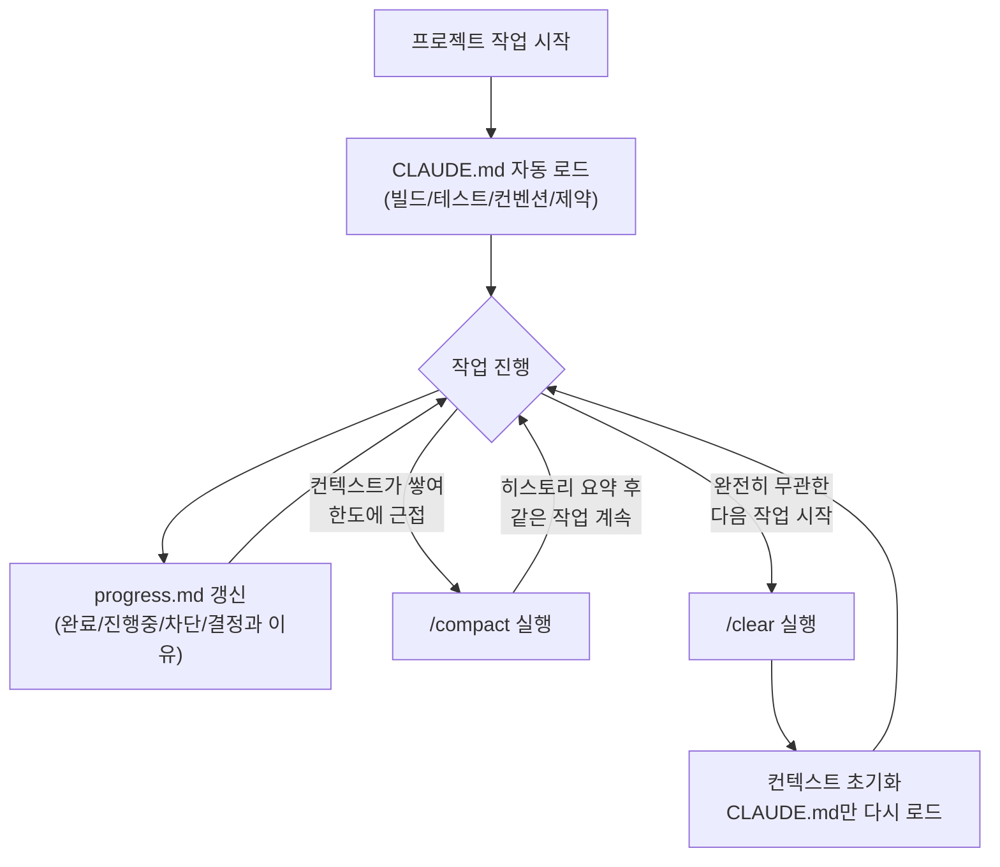
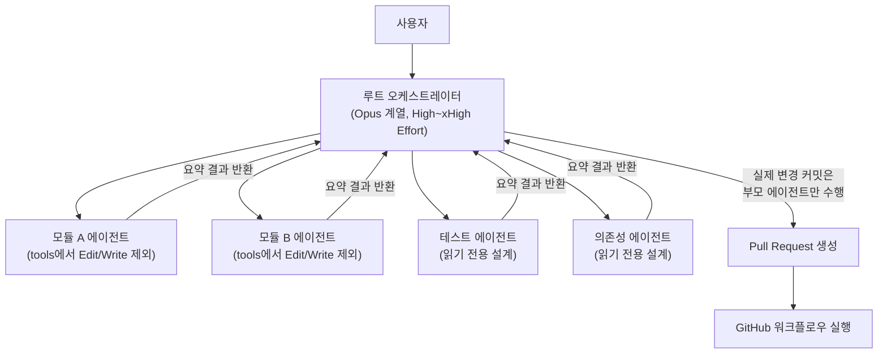
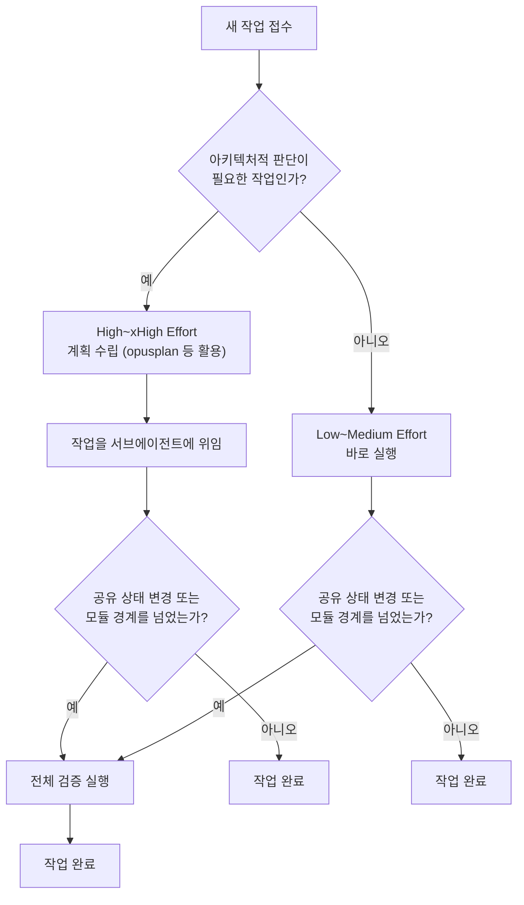
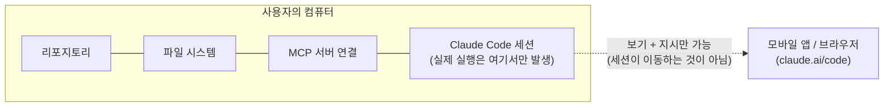
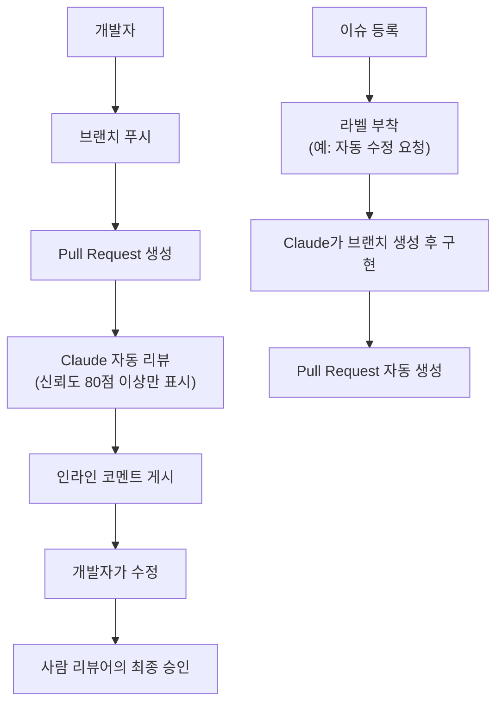
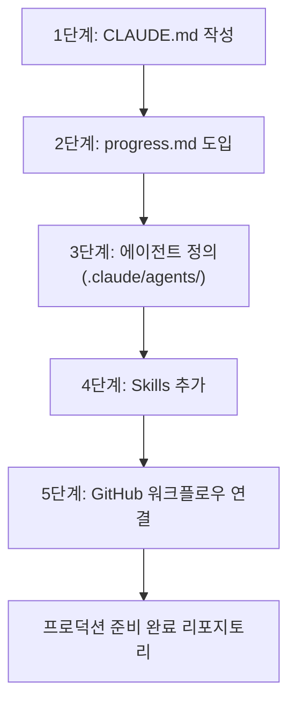

> 원문 정보
> - 제목: The AI Engineering Production Stack (2026): How to Build Production AI Systems with Claude Code
> - 저자: Chandana
> - 게시일: 2026년 8월 3일
> - 매체: Medium (The Tech Trek by Tech Chick)
> - 원문 링크: https://medium.com/the-tech-trek-by-tech-chick/the-ai-engineering-production-stack-2026-how-to-build-production-ai-systems-with-claude-code-d0375ea9c7b4
>
> 이 문서 작성일: 2026년 8월 12일
> 작성 방식: 원문의 모든 사실 주장을 Anthropic 공식 문서(code.claude.com, platform.claude.com, anthropic.com) 및 다수의 독립 매체와 대조 검증한 뒤, 검증 결과를 반영해 새로 서술했습니다.

---

## 이 문서를 읽는 방법 — 신뢰도 표기 기준

아래 본문 곳곳에 괄호로 신뢰도 등급을 표시했습니다. 기준은 다음과 같습니다.

- **[1단계 · 공식 확인]**: Anthropic의 공식 문서(code.claude.com, platform.claude.com, anthropic.com) 또는 공식 GitHub 저장소(anthropics/claude-code, anthropics/claude-code-action)에서 직접 확인한 내용
- **[2단계 · 복수 매체 교차 확인]**: 서로 독립적인 두 곳 이상의 신뢰할 만한 매체(테크 매체, 개발자 블로그)에서 일관되게 보도된 내용
- **[3단계 · 단일 출처 / 검증 제한]**: 하나의 커뮤니티 블로그나 서드파티 글에서만 발견되어 완전한 교차 검증은 어려웠지만, 공식 문서의 취지와 상충하지 않는 내용
- **[편집자 주]**: 원문에는 없지만 이 문서를 작성하며 추가로 확인해 독자에게 반드시 알려야 한다고 판단한 정정·보완 사항

이 등급 표기는 문서 뒷부분의 "팩트체크 요약표"에도 한 번 더 정리해 두었습니다.

---

## 들어가며 — 이 글이 다루는 문제의식

원문 저자는 지역 밋업에서 만난 AI 엔지니어들과 나눈 대화에서 출발합니다. 프롬프트 엔지니어링이 화두였던 시기가 지나가고, 곧이어 RAG(검색 증강 생성)가 만능 해법처럼 여겨지던 시기가 왔으며, 그다음엔 AI 에이전트, 멀티에이전트 시스템, MCP(Model Context Protocol), Claude Code, 그리고 자율 코딩으로 이어지는 흐름이 매주 새로운 프레임워크와 추상화 계층을 낳고 있다는 것이 저자의 관찰입니다.

이 관찰 자체는 검증 대상이라기보다는 저자의 경험적 진술이므로 별도의 사실 확인표기를 하지 않았습니다. 다만 그 뒤에 이어지는 "그래서 실제로 무엇을 구축해야 하는가"라는 질문에 대한 답으로 저자가 제시하는 네 가지 구성요소는 실제 Claude Code의 기능들과 대응되므로, 이 문서에서는 그 네 가지 축을 따라가면서 각 기능이 실제로 어떻게 동작하는지, 원문의 설명이 정확한지를 짚어보겠습니다.

네 가지 축은 다음과 같습니다.

1. 컨텍스트와 메모리 아키텍처 — CLAUDE.md, progress.md, `/compact`와 `/clear`
2. Opus 계열 모델과 동적 멀티에이전트 워크플로우 — 서브에이전트, 중첩 구조
3. 토큰 재정 관리와 Effort 제어 — 다섯 단계의 추론 강도 조절
4. 앰비언트 실행과 안전 내비게이션 — 원격 제어, GitHub 자동화, 프롬프트 인젝션 오탐 대응

---

## 구성요소 1: 컨텍스트와 메모리 아키텍처

### CLAUDE.md — 프로젝트의 상시 기억 장치

Claude Code는 리포지토리 안에서 작업을 시작할 때마다 `CLAUDE.md` 파일을 자동으로 불러옵니다 **[1단계]**. 이는 Anthropic의 공식 문서에서도 반복적으로 강조되는 동작 방식으로, 세션이 새로 시작될 때마다 사람이 매번 프로젝트 맥락을 재설명할 필요가 없도록 만드는 장치입니다.

원문이 든 비유는 꽤 적절합니다. README.md가 사람 사용자를 위해 "이 프로젝트가 무엇이고 어떻게 설치·사용하는지"를 설명하는 문서라면, CLAUDE.md는 AI 에이전트를 위해 압축된 규칙, 명령어, 코드 스타일 선호도를 담아 두는 문서라는 것입니다. 실제로 이 둘은 목적과 독자가 다르기 때문에 병존하는 것이 일반적입니다.

CLAUDE.md에 흔히 담기는 내용은 다음과 같습니다.

- 빌드 명령어와 테스트 명령어
- 리포지토리 구조 설명
- 코딩 컨벤션과 네이밍 규칙
- 선호하는 라이브러리와 아키텍처 결정 사항
- 팀의 작업 관행과 배포 명령어
- 반드시 지켜야 할 제약 조건(예: 특정 디렉터리는 절대 수정하지 말 것)

원문에 등장하는 예시를 그대로 옮기면 다음과 같은 형태입니다.

```markdown
# Project: AI Support Platform

## Build
npm install
npm run dev

## Testing
npm test

## Linting
npm run lint

## Code Style
- TypeScript only
- Prettier formatting required

## Architecture
Backend
- FastAPI

Frontend
- Next.js

Database
- PostgreSQL

Vector Database
- pgvector

Never edit files under:
generated/
```

원문은 "CLAUDE.md는 대략 200줄 이내로 유지하는 것이 실용적인 규칙"이라고 조언합니다. 이 수치는 Anthropic이 강제하는 공식 규정이 아니라 커뮤니티에서 널리 공유되는 경험칙입니다 **[3단계]**. 다만 그 배경 논리는 공식 문서의 철학과 일치합니다. CLAUDE.md는 세션이 시작될 때마다 매번 전체가 읽혀 컨텍스트 토큰을 소비하기 때문에, 내용이 방대해질수록 모든 대화의 시작 비용이 늘어납니다. 그래서 항상 참조해야 하는 "영구적으로 참인 사실"만 CLAUDE.md에 남기고, 특정 워크플로우에서만 필요한 절차적 지식은 뒤에서 설명할 Skills(재사용 가능한 작업 절차 모음)로 분리하라는 것이 권장되는 설계 원칙입니다.

원문이 소개하는 판단 기준도 실용적입니다. "한 달 뒤에도 여전히 참인 내용이라면 CLAUDE.md에 넣어라." 반대로 말하면, 이번 스프린트에서만 유효한 정보이거나 현재 진행 중인 작업의 상태는 CLAUDE.md의 몫이 아니라는 뜻입니다. 그 역할을 담당하는 것이 다음에 설명할 progress.md입니다.

**언제 Skills를 쓰고 언제 CLAUDE.md를 쓰는가.** 원문의 구분은 명확합니다. Claude가 항상 알아야 하는 정보는 CLAUDE.md에, 릴리스 절차, 데이터베이스 마이그레이션, 코드 리뷰, 배포, 장애 대응, 성능 프로파일링처럼 특정 상황에서만 호출되는 재사용 가능한 절차는 Skills에 담으라는 것입니다. 이 구분은 Anthropic의 Skills 개념(특정 작업 유형에 필요할 때만 로드되는 지침 묶음)과 정확히 부합합니다.

### progress.md — 세션을 넘어서는 작업 상태 기록 **[편집자 주: 공식 기능 아님]**

여기서 한 가지 짚고 넘어갈 부분이 있습니다. progress.md는 Anthropic이 정의한 공식 파일명이나 자동 로드되는 시스템 파일이 아닙니다. CLAUDE.md처럼 Claude Code가 세션 시작 시 자동으로 인식하는 특별한 파일명이 아니라, 사용자가 직접 만들고 프롬프트에서 참조하도록 지시하는 관례적 패턴입니다. 원문에서도 "progress.md(또는 원하는 다른 이름으로)"라고 표현한 대목에서 이 점이 암시되어 있습니다.

그럼에도 이 패턴이 널리 쓰이는 이유는 명확합니다. CLAUDE.md가 "프로젝트에 대해 항상 참인 것"을 담는다면, progress.md는 "지금 진행 중인 특정 작업에 대해 지금 참인 것"을 담는 별도의 파일입니다. 완료된 항목, 막혀 있는 항목, 어떤 결정을 왜 내렸는지를 기록해 두면, 컨텍스트가 완전히 초기화된(즉 이번 대화를 전혀 기억하지 못하는) 다음 세션의 Claude에게 인수인계 메모 역할을 할 수 있습니다.

예를 들어 인증 기능을 구현하는 작업이라면 다음과 같은 형태가 될 수 있습니다.

```markdown
# Current Goal
Implement Authentication

## Completed
- OAuth
- Login UI
- User model

## In Progress
- Refresh tokens

## Blockers
Redis deployment issue

## Decisions
Using JWT instead of session cookies

Reason:
Stateless deployment
```

이 패턴의 핵심은 "왜 그런 결정을 내렸는가"까지 기록해 둔다는 점입니다. 나중에 다른 세션(혹은 다른 사람)이 같은 코드를 마주쳤을 때 "왜 세션 쿠키 대신 JWT를 썼지?"라는 질문에 답할 수 있어야, 실수로 이전 결정을 뒤집는 일을 막을 수 있습니다.

### `/compact`와 `/clear` — 의도적인 컨텍스트 관리 **[1단계]**

`/compact`와 `/clear`는 실제 Claude Code의 슬래시 명령입니다. 둘 다 세션의 컨텍스트를 관리하기 위한 도구이지만 목적이 다릅니다.

세션이 길어지면 도구 호출 결과, 파일 읽기 내용, 더는 중요하지 않은 시행착오들이 컨텍스트 창을 채우게 됩니다. `/compact`는 이 히스토리를 압축·요약해서, 컨텍스트 한도에 부딪히거나 오래된 잡음이 이후의 판단에 계속 끼어드는 일 없이 같은 작업을 이어갈 수 있게 해줍니다.

원문은 여기서 유용한 예외 상황을 하나 짚습니다. 만약 같은 터미널 세션 안에서 완전히 무관한 다음 작업을 시키려는 경우라면 어떨까요. 예를 들어 세 시간 동안 RAG 시스템을 구축한 직후에, 곧바로 개인 블로그 작업을 시작한다고 가정해 봅시다. 이 경우 RAG 프로젝트에 대한 기억을 다음 작업까지 끌고 가는 것이 오히려 방해가 될 수 있습니다. 이럴 때 필요한 것이 `/compact`가 아니라 `/clear`입니다. `/clear`는 대화 히스토리를 요약해서 이어가는 것이 아니라, 아예 새로운 세션처럼 시작하도록 컨텍스트를 완전히 비웁니다. 애초에 전체 히스토리를 가져갈 필요가 없었던 세션이라면, 압축을 거치는 것보다 `/clear`가 더 저렴하고 깔끔한 해법이라는 것이 원문의 요지이며, 이는 두 명령의 실제 설계 목적과도 일치합니다.

### 다이어그램으로 보는 컨텍스트/메모리 흐름



---

## 구성요소 2: Opus 계열 모델과 동적 멀티에이전트 워크플로우

### 먼저 정정할 것 — "Opus 4.8"은 이미 최신이 아닙니다 **[1단계 · 편집자 주]**

원문 본문은 "지속적인 판단력이 필요한 작업, 낯선 대규모 코드베이스, 아키텍처 결정, 이른 시점의 잘못된 판단이 나중에 복리로 문제를 일으키는 작업"에는 `claude-opus-4-8` 같은 모델을 활용한 Claude Code의 병렬 워크플로우가 답이라고 서술합니다. 그런데 원문에 첨부된 표 캡처("Planning → Claude Opus 5", "Architecture → Claude Opus 5")는 본문과 다른 모델명을 쓰고 있어 원문 내부에서도 모순이 발견됩니다.

이 문서 작성 시점(2026년 8월 12일) 기준으로 사실관계를 정리하면 다음과 같습니다.

| 모델 | 공식 출시일 | 비고 |
|---|---|---|
| Claude Opus 4.6 | 2026-02-05 | 100만 토큰 컨텍스트, Claude Code 전용 도구 추가 |
| Claude Opus 4.7 | 2026-04-16 | xHigh Effort 단계 도입 |
| Claude Sonnet 4.6 | 2026-02-17 | |
| **Claude Opus 4.8** | **2026-05-28** | 원문이 예시로 든 모델. Effort 5단계를 명시적으로 노출 |
| Claude Fable 5 / Claude Mythos 5 | 2026-06-09 | Anthropic의 새로운 최상위 등급(Mythos 클래스) 최초 공개. 이후 미 상무부 수출 통제로 2026-06-12~06-30 사이 접근이 일시 중단되었다가 2026-07-01 복원됨 |
| Claude Sonnet 5 | 2026-06-30 | |
| **Claude Opus 5** | **2026-07-24** | Anthropic 공식 발표(anthropic.com/news/claude-opus-5)로 확인. Opus 4.8을 대체한 현재 Opus 등급의 플래그십. "Fable 5에 근접한 지능을 절반 가격에" 제공한다고 소개됨 |

즉 원문이 발행된 2026년 8월 3일 시점에는 이미 Claude Opus 5가 출시된 지 열흘이 지난 뒤였고, Opus 4.8은 이전 세대 모델이 되어 있었습니다. 원문 본문이 여전히 "claude-opus-4-8"을 예시로 든 것은 아마 초안 작성 시점이 더 이전이었거나, 원문 저자가 갱신을 놓친 것으로 보입니다. 표 캡처만 "Opus 5"로 되어 있는 것이 그 흔적일 가능성이 높습니다. 이 문서를 실무에 적용할 때는 "Opus 4.8"이라는 표현이 나오면 정신적으로 "그 시점의 Opus 등급 최상위 모델"로 치환해서 읽고, 실제 설정값은 항상 `code.claude.com`의 최신 문서에서 현재 별칭이 무엇을 가리키는지 다시 확인하시길 권합니다. 아래 원리 자체(오케스트레이터에는 강한 모델을, 실행 에이전트에는 가벼운 모델을) 는 모델 세대가 바뀌어도 그대로 유효합니다.

또한 원문은 "팀에 Claude Fable 5 접근 권한이 있다면 장시간 작업에는 더 강력한 선택지이지만, 현재 가용성을 반드시 확인하라"고 덧붙이는데, 이는 실제로 매우 정확한 조언이었습니다. 위 표에서 보듯 Fable 5는 출시 직후 수출 통제로 접근이 일시 중단되었던 이력이 있기 때문입니다 **[1단계]**.

### 서브에이전트란 무엇인가 **[1단계]**

서브에이전트는 Task 툴을 통해 생성되는, 별도의 컨텍스트 창을 가진 독립된 Claude 인스턴스입니다. 메인 대화에서 디렉터리 탐색, 테스트 스위트 실행, 특정 접근법에 대한 리서치처럼 일감을 떼어내어 격리시키는 데 쓰입니다.

서브에이전트는 부모 대화의 히스토리를 물려받지 않습니다. 대신 자신만의 시스템 프롬프트, 위임받은 메시지, 관련된 CLAUDE.md 파일들만을 가지고 깨끗한 상태에서 출발합니다. 이는 의도된 설계입니다. 서브에이전트는 한 가지 일만 하고, 정제된 결과만 반환한 뒤 사라집니다. 덕분에 메인 세션은 마흔 개 파일을 뒤진 탐색 과정 같은 "노이즈"로 오염되지 않고 깔끔하게 유지됩니다.

```
루트 오케스트레이터
│
├── 백엔드 에이전트
├── 프론트엔드 에이전트
├── 테스트 에이전트
├── 문서화 에이전트
└── 의존성 에이전트
```

### 동적 워크플로우 — 오케스트레이터가 즉석에서 판단한다

서브에이전트가 진짜 힘을 발휘하는 지점은 이들이 동적으로 생성될 때입니다. 오케스트레이터가 미리 짜인 스크립트를 따라가는 것이 아니라, 그때그때 작업을 만들어내고 할당하는 방식입니다. 사용자는 다음을 오케스트레이터의 판단에 맡깁니다.

- 몇 개의 에이전트가 필요한지
- 각 에이전트가 무엇을 해야 하는지
- 언제 실행되어야 하는지
- 언제 멈춰야 하는지

이렇게 하면 리포지토리 전체에 걸친 작업에서도, 모든 분기를 사람이 일일이 지정하지 않고 오케스트레이터가 서브에이전트 트리 전체를 알아서 펼칠 수 있습니다.

### 중첩 서브에이전트 — 최대 5단계까지 가능하다 **[1단계]**

원문은 "서브에이전트는 Claude에서 최대 다섯 단계까지 중첩될 수 있다"고 서술하는데, 이는 실제로 정확한 최신 사실입니다. 확인 결과, 2026년 6월 10일 배포된 Claude Code v2.1.172부터 서브에이전트가 자신의 하위 서브에이전트를 다시 생성할 수 있는 "중첩 서브에이전트" 기능이 추가되었고, 이 중첩 깊이는 5단계로 제한되어 있습니다. 그 이전까지는 "서브에이전트는 또 다른 서브에이전트를 생성할 수 없다"는 것이 명시적인 제약이었으나, 이 업데이트로 규칙이 바뀌었습니다.

이 기능의 동기는 병렬성 확대가 아니라 컨텍스트 관리입니다. 서브에이전트마다 새로운 컨텍스트 창을 받기 때문에, 중첩을 허용하면 한 단계의 작업이 자신의 컨텍스트가 꽉 차기 전에 하위 단계로 일을 더 내려보낼 수 있습니다. 다만 실무 가이드들은 공통적으로 "깊이 5단계까지 무조건 쓰는 것은 좋은 습관이 아니다"라고 경고합니다. 작업을 처음부터 다 나열할 수 있는 경우라면 굳이 계층을 만들 필요 없이 하나의 오케스트레이터가 평평하게 펼치는 편(flat fan-out)이 낫고, 정말로 작업 자체가 재귀적으로 세분화되어야 하는 경우에만 중첩을 쓰라는 것이 권장되는 사용 기준입니다.


### 서브에이전트의 권한 제한 — "읽기 전용"은 자동이 아니라 설계 패턴이다 **[편집자 주: 정정 필요]**

원문은 "각 서브에이전트는 좁고 읽기 전용에 가까운 툴셋을 받으며, Edit이나 Write는 주어지지 않아서 부모 에이전트만이 실제로 변경 사항을 커밋할 수 있다"고 설명합니다. 이 설명은 서브에이전트 아키텍처를 설계할 때 실제로 널리 권장되는 모범 사례이지만, Claude Code가 기본값으로 강제하는 동작은 아닙니다.

정확히는 이렇습니다. 사용자가 `.claude/agents/` 아래에 서브에이전트를 정의할 때, YAML 프런트매터의 `tools:` 목록에서 Edit·Write·NotebookEdit을 의도적으로 제외해야 해당 서브에이전트가 읽기 전용으로 동작합니다. 이렇게 설계하는 것이 권장되는 이유도 명확한데, 서브에이전트는 사용자에게 대화형으로 권한을 물어볼 수 없기 때문에, 만약 승인이 필요한 도구 호출을 만나면 그 호출은 자동으로 거부된 것으로 처리됩니다. 따라서 편집 권한이 필요한 작업은 애초에 부모 에이전트가 처리하도록 설계하는 편이 안전하고 예측 가능합니다. 다만 Claude Code에 기본 내장된 몇몇 서브에이전트(예: 상태줄 설정을 담당하는 `statusline-setup`처럼 편집 범위가 좁고 예측 가능한 경우)는 이 원칙의 예외로 취급됩니다.

정리하면, 원문이 설명한 "부모만 커밋한다"는 아키텍처는 실제로 많은 프로덕션 팀이 채택하는 좋은 패턴이지만, 이것이 자동으로 적용되는 안전장치라기보다는 사용자가 직접 구성해야 하는 설계 선택이라는 점을 알아 두는 것이 중요합니다.



---

## 구성요소 3: 토큰 재정 관리와 Effort 제어

### Effort는 모델 선택과 별개의 다이얼이다 **[1단계]**

Claude Code는 다섯 단계의 Effort(추론 강도) 설정을 제공합니다. Low, Medium, High, xHigh, Max입니다. 이는 Anthropic의 공식 Effort 문서에서 확인되는 사실이며, 어떤 모델을 선택했는지와는 별개로 작동에 들어가기 전에 모델이 얼마나 깊이 추론할지를 결정하는 다이얼입니다.

공식 문서가 제시하는 각 단계의 의미는 대략 다음과 같습니다.

| 단계 | 공식 설명의 요지 | 권장 용도 |
|---|---|---|
| Low | 대기 시간에 민감한 고빈도 작업에 적합 | 채팅, 코딩이 아닌 단순 작업, 빠른 처리가 중요한 경우 |
| Medium | 대부분의 상황에 적합한 권장 기본값 | 에이전틱 코딩, 도구를 많이 쓰는 워크플로우, 코드 생성 |
| High | 속도·비용보다 품질이 중요한 복잡한 추론 작업 | API의 기본값 |
| xHigh | 코딩과 에이전틱 작업의 시작점으로 권장 | 실제 코딩 세션, 지능이 중요한 대부분의 작업의 최소 기준 |
| Max | 토큰 소비에 제약이 없을 때 최고 성능이 필요한 경우 | 평가 지표상 xHigh에서 확실한 개선 여지가 보일 때만 |

한 가지 짚어둘 부분은, 원문이 제안하는 "루트 오케스트레이터는 High, 실행 서브에이전트는 Low~Medium"이라는 배분이 실용적이긴 하지만, Anthropic 공식 가이드는 코딩·에이전틱 작업이라면 아예 xHigh를 시작점으로 삼고, 평가 지표에서 근거가 확인될 때만 Max로 올리거나 비용에 민감할 때만 Medium으로 낮추라고 권고한다는 점입니다 **[1단계]**. 즉 원문의 "High"는 공식 문서가 코딩 작업에 제시하는 출발점보다는 한 단계 보수적인 설정입니다. 절대적으로 틀린 것은 아니지만, 비용에 민감하지 않은 팀이라면 오케스트레이터를 xHigh에서 시작해 필요시 낮추는 방향도 고려할 만합니다.

원문이 언급한 "Effort를 높이면 같은 작업에서 최대 약 7배의 토큰을 소비할 수 있다"는 수치는 Anthropic의 공식 발표 자료에서 직접 확인되지는 않았고, 커뮤니티에서 실측한 서드파티 자료에서 나온 값입니다 **[3단계]**. 다만 방향성 자체 — Effort를 올릴수록 파일을 더 많이 읽고, 더 많이 검증하고, 응답이 길어져 토큰 소비가 크게 늘어난다는 점 — 는 공식 문서의 취지와 일치하며, "대부분의 작업에서 Max는 상대적으로 작은 품질 개선에 상당한 비용을 추가하며, 구조화된 작업에서는 오히려 과도한 사고로 이어질 수 있다"는 Anthropic 자신의 경고와도 방향이 같습니다.

### 역할별 Effort 배분 패턴

원문이 제시하는 작업 배분 패턴을 정리하면 다음과 같습니다.

**루트 오케스트레이터: High(또는 위에서 설명한 대로 xHigh)** — 이후 작업을 결정짓는 판단을 내리는 역할이기 때문입니다.

**실행 서브에이전트: Low/Medium** — "이 테스트를 실행해라", "이 변경을 적용해라", "이름을 바꿔라"처럼 범위가 좁고 명확한 작업은 깊은 추론이 필요 없으며, 오히려 저렴하고 안정적으로 실행되는 것이 중요합니다.

**일회성 심층 분석: `ultrathink`** — 이는 단발성 프롬프트 키워드로, 세션에 저장된 Effort 설정을 영구적으로 바꾸지 않으면서 단 하나의 어려운 질문에 대해서만 더 깊은 추론을 요청하는 방법입니다 **[2~3단계 · 공식 문서에서의 직접 인용은 확보하지 못했으나 다수의 커뮤니티 자료에서 일관되게 확인됨]**.

**`opusplan`** — 계획 단계에서는 Opus 계열을, 실행 단계에서는 자동으로 Sonnet 계열로 전환하는 모델 별칭입니다. 이는 Anthropic 공식 문서(`code.claude.com/docs/en/model-config`)에 정식으로 등재된 기능입니다 **[1단계]**. 계획 모드에서는 복잡한 추론과 아키텍처 결정을 위해 Opus를 쓰고, 실행 모드로 전환되면 코드 생성과 구현을 위해 자동으로 Sonnet으로 바뀝니다. 최상위 모델의 판단력을, 실행이라는 기계적인 작업에는 최상위 모델의 비용을 지불하지 않고 얻을 수 있는 방법이라는 원문의 설명은 공식 문서의 취지와 정확히 일치합니다.

**`ultracode`** — xHigh Effort와 "멀티에이전트 워크플로우를 오케스트레이션할 수 있는 상시 권한"을 결합한, Claude Code 전용 세션 설정입니다 **[2~3단계]**. 강력하지만 그만큼 정말로 그 정도의 자율성이 필요한 작업에만 예약해 두고, 기본값으로 습관처럼 쓰는 것은 권장되지 않습니다.

### 전면 검증보다 조건부 검증

많은 에이전틱 스캐폴딩은 사소한 변경이든 아니든 상관없이 매 단계마다 전체 diff를 다시 읽고, 전체 테스트 스위트를 다시 돌리고, 모든 가정을 다시 점검하는 전면 검증 방식을 취합니다. 원문이 제안하는 대안은 조건부 검증입니다. 즉 그 단계가 공유 상태를 건드렸는지, 모듈 경계를 넘었는지, 혹은 서브에이전트 스스로의 확신도가 낮았는지를 기준으로, 실제로 필요한 경우에만 값비싼 검증을 실행하자는 것입니다. 이는 특정 API나 기능으로 뒷받침되는 주장이라기보다는, 비용 최적화를 위한 설계 원칙에 가까우므로 별도의 사실 검증 대상이라기보다 실무 조언으로 이해하시면 됩니다.



---

## 구성요소 4: 앰비언트 실행과 안전 내비게이션

### `/remote-control` — 로컬 세션을 폰으로 들여다보기 **[1단계]**

`/remote-control`은 실제로 존재하는 Claude Code 기능입니다. 실행 중인 로컬 Claude Code 세션을 Claude 모바일 앱이나 브라우저에 연결해, 장시간 걸리는 작업을 폰에서 모니터링하고 조작할 수 있게 해줍니다.

핵심은 원문이 정확히 짚은 대로, 세션 자체는 사용자의 컴퓨터에서 계속 실행된다는 점입니다. 웹에서 제공되는 Claude Code(클라우드 인프라에서 실행됨)와 달리, Remote Control 세션은 사용자의 로컬 머신에서 직접 실행되며 로컬 파일 시스템과 상호작용합니다. 모바일과 웹 인터페이스는 그 로컬 세션을 들여다보는 창일 뿐, 세션 자체를 클라우드로 옮기는 것이 아닙니다. 이는 Anthropic 공식 문서의 표현과도 정확히 일치합니다.

이 문서 작성 시점 기준으로 Remote Control은 아직 연구 프리뷰(research preview) 단계이며, Pro와 Max 요금제에서 사용 가능합니다. Team이나 Enterprise 플랜에서는 관리자가 별도로 설정에서 켜야만 활성화됩니다. API 키 인증은 지원되지 않고, 계정 로그인(`/login`)이 필요합니다.



### GitHub 자동화 — PR 리뷰와 자동 수정 **[1단계]**

원문이 언급한 "Claude Code를 위한 공식 GitHub Action"은 실제로 `anthropics/claude-code-action`이라는 이름의 공식 저장소로 존재합니다. `@claude` 멘션을 트리거로 삼아 반응하거나, PR이 푸시될 때마다 자동으로 리뷰를 수행해 특정 코드 라인에 직접 인라인 코멘트를 남길 수 있습니다.

원문이 설명한 "신뢰도(confidence) 점수로 낮은 신호의 노이즈를 걸러낸다"는 부분도 실제로 확인되는 내용입니다. Anthropic이 공개한 코드 리뷰 관련 문서와 플러그인 README에서는 기본 신뢰도 임계값이 80점이며, 이 기준을 넘긴 이슈만 실제로 표시되고 그 아래의 오탐(false positive)은 걸러진다고 명시하고 있습니다. 또한 이슈에 특정 라벨이 붙으면 Claude가 자동으로 브랜치를 만들고 수정 사항을 구현해 PR을 여는 워크플로우도 실제로 지원됩니다.

다만 여기서 한 가지 구분해 둘 부분이 있습니다. Anthropic은 두 가지 경로를 함께 제공하고 있습니다. 하나는 사용자가 자신의 CI 인프라(GitHub Actions)에서 직접 돌리는 `anthropics/claude-code-action`이고, 다른 하나는 Team/Enterprise 플랜에서 조직 차원에서 켜면 Anthropic의 인프라에서 관리형으로 실행되는 "Code Review" 기능입니다. 원문은 이 둘을 명확히 구분하지 않고 뭉뚱그려 설명하지만, 실제로는 별도의 두 가지 통합 방식이며 각각 설정 방법과 과금 방식이 다릅니다.

원문이 강조하는 실무적 조언, 즉 "GitHub App의 권한 범위를 기본값으로 넓게 부여하지 말고 신중하게 제한하라"는 것은 실제로 공식 가이드에서도 반복되는 권고입니다. Claude가 이제 저장소에 쓰기 권한을 가지고 팀의 실제 리뷰 파이프라인에 참여하게 된다는 점을 감안하면, 최소 권한 원칙을 지키는 것이 중요합니다.



### 프롬프트 인젝션 오탐 피하기

Claude Code는 다른 도구 접근 권한을 가진 에이전틱 시스템과 마찬가지로, 프롬프트 인젝션 패턴이나 모델의 행동을 우회하려는 것처럼 보이는 지시에 대해 안전성 점검을 수행합니다. 문제는 이 점검이 때때로 완전히 정당한 요청도 걸러낼 수 있다는 점입니다.

원문이 제시하는 해법은 실용적입니다. 원하는 작업과 그 이유를 자신의 목소리로 직접 서술하되, 마치 시스템 수준의 오버라이드처럼 보이는 문구, 적대적으로 프레이밍된 표현, "이전 지시를 무시하라"류의 중첩된 패턴을 프롬프트 구조에 흉내 내지 말라는 것입니다. 설령 의도가 완전히 정당하더라도, 바로 그런 문구 패턴 자체가 안전성 계층이 걸러내도록 설계된 신호이기 때문입니다. CLAUDE.md와 프롬프트에 명확하고 직접적인 작업 설명을 담는 것 자체가 더 나은 엔지니어링 관행이라는 점도 함께 강조됩니다.

---

## 시작하기 위한 참고 구조

원문이 제시하는 다섯 단계는 위 네 가지 구성요소를 실제 리포지토리에 도입하는 순서로 이해할 수 있습니다.



원문은 이 구조의 시작점으로 사용할 수 있는 GitHub 저장소(`moonpiee/The-2026-AI-Engineering-Production-Starter-Stack-with-Claude-Code`)를 함께 소개하고 있습니다. 이 저장소는 원문 저자가 직접 링크한 제3자 자료이며, 이 문서에서는 그 내용까지 독립적으로 검증하지는 못했습니다 **[검증 범위 밖 · 참고용으로만 소개]**. 도입하기 전에 직접 코드와 라이선스를 확인하시길 권합니다.

---

## 흔한 실수들

원문이 나열한, 실제 현장에서 반복적으로 관찰된다는 실수 목록은 다음과 같습니다. 이는 검증 대상이라기보다 저자의 실무 경험에 기반한 조언이므로 그대로 소개합니다.

- Claude Code를 엔지니어링 환경이 아니라 그냥 ChatGPT처럼 다루는 것
- CLAUDE.md에 모든 것을 욱여넣는 것
- 모든 작업을 최대 Effort로 돌리는 것
- `/clear`를 전혀 사용하지 않는 것
- progress.md 같은 상태 기록을 생략하는 것
- 모든 서브에이전트에 쓰기 권한을 주는 것
- 사소한 변경 뒤에도 값비싼 전체 검증을 매번 실행하는 것
- 병렬화로 이득을 볼 수 없는 작업에까지 여러 에이전트를 동원하는 것

---

## 자주 묻는 질문

**CLAUDE.md는 왜 마크다운으로 작성하는가.** 마크다운은 사람과 AI 모두가 읽기 쉬운 형식이어서, 프로젝트 규칙과 명령어, 컨벤션을 담기에 적합합니다.

**README.md와 CLAUDE.md의 차이는 무엇인가.** README.md는 프로젝트를 사람에게 설명하고, CLAUDE.md는 Claude Code에게 그 프로젝트에서 어떻게 작업해야 하는지를 알려줍니다.

**CLAUDE.md는 얼마나 커야 하는가.** 대략 200줄 내외로 간결하게 유지하고, 특정 워크플로우에 한정된 지침은 Skills로 옮기는 것이 커뮤니티에서 널리 권장되는 관행입니다(공식 강제 규정은 아닙니다).

**한 리포지토리에 여러 개의 CLAUDE.md를 둘 수 있는가.** 그렇습니다. 대규모 리포지토리에서는 디렉터리별로 중첩된 CLAUDE.md를 두어 하위 디렉터리마다 다른 지침을 적용할 수 있습니다.

**언제 CLAUDE.md 대신 Skills를 써야 하는가.** 영구적인 프로젝트 규칙은 CLAUDE.md에, 배포·릴리스·디버깅처럼 재사용 가능한 절차적 워크플로우는 Skills에 담는 것이 원칙입니다.

**`/compact`와 `/clear`의 차이는 무엇인가.** `/compact`는 현재 세션을 요약해 계속 작업을 이어갈 때 쓰고, `/clear`는 완전히 새로운 작업을 시작할 때 컨텍스트를 초기화하기 위해 씁니다.

**서브에이전트는 몇 개가 적당한가.** 독립적으로 처리할 수 있는 작업의 수만큼만 만드는 것이 원칙입니다. 에이전트가 많다고 항상 더 나은 결과가 나오는 것은 아닙니다.

**모든 프로젝트에 멀티에이전트가 필요한가.** 아닙니다. 소규모 프로젝트는 단일 에이전트만으로도 충분히 잘 작동하는 경우가 많으며, 작업을 병렬화할 수 있을 때만 여러 에이전트를 쓰는 것이 합리적입니다.

**Effort를 높이면 항상 더 좋은 결과가 나오는가.** 아닙니다. 계획과 아키텍처 단계에는 높은 Effort를, 반복적인 구현 작업에는 낮은 Effort를 써서 토큰을 절약하는 편이 낫습니다.

**Claude Code가 코드 리뷰를 완전히 대체할 수 있는가.** 아닙니다. 흔한 이슈를 걸러내어 리뷰 속도를 높일 수는 있지만, 아키텍처와 비즈니스 로직에 대한 판단에는 여전히 사람 리뷰어가 필요합니다.

---

## 팩트체크 요약표

| 원문의 주장 | 검증 결과 | 신뢰도 |
|---|---|---|
| CLAUDE.md는 세션 시작 시 자동으로 로드되는 프로젝트 표준 메모리 파일이다 | 공식 문서로 확인됨 | 1단계 |
| CLAUDE.md는 약 200줄 이내로 유지하는 것이 좋다 | 커뮤니티 경험칙이며 공식 강제 규정은 아님 | 3단계 |
| progress.md라는 이름과 형식은 Anthropic의 공식 기능이다 | 부정확함. 사용자가 직접 도입하는 관행적 패턴임 | 편집자 정정 |
| `/compact`, `/clear` 명령이 실제로 존재하며 각각 요약/초기화 역할을 한다 | 공식 문서로 확인됨 | 1단계 |
| 서브에이전트는 Task 툴로 생성되며 독립된 컨텍스트를 가진다 | 공식 문서로 확인됨 | 1단계 |
| 서브에이전트의 중첩은 최대 5단계까지 가능하다 | 2026-06-10(v2.1.172) 공식 배포 및 다수 매체 보도로 확인됨 | 1~2단계 |
| 서브에이전트는 기본적으로 읽기 전용이며 부모만 커밋할 수 있다 | 부분적으로 부정확함. 자동 기본값이 아니라, tools 프런트매터에서 Edit/Write를 직접 제외해야 하는 설계 패턴임 | 편집자 정정 |
| Effort는 Low/Medium/High/xHigh/Max 5단계로 구성된다 | 공식 문서로 확인됨 | 1단계 |
| High Effort가 Low 대비 최대 약 7배의 토큰을 소비할 수 있다 | 서드파티 실측 자료이며 Anthropic의 공식 수치는 아님 | 3단계 |
| `opusplan`은 계획 단계에 Opus를, 실행 단계에 Sonnet을 자동 적용하는 공식 별칭이다 | 공식 문서(code.claude.com/docs/en/model-config)로 확인됨 | 1단계 |
| `ultrathink`는 세션 Effort를 바꾸지 않고 단발성으로 깊은 추론을 요청하는 키워드다 | 다수의 커뮤니티 자료로 일관되게 확인됨. 공식 문서 원문 인용은 확보하지 못함 | 2~3단계 |
| `ultracode`는 xHigh Effort와 멀티에이전트 오케스트레이션 상시 권한을 결합한 세션 전용 설정이다 | 커뮤니티 자료로 확인됨 | 2~3단계 |
| `/remote-control`은 로컬 세션을 모바일/브라우저에 연결하며 실제 실행은 로컬에 남는다 | 공식 문서로 확인됨 | 1단계 |
| Claude Code를 위한 공식 GitHub Action이 존재하며 PR마다 자동 리뷰하고 신뢰도 점수(80점 기준)로 필터링한다 | 공식 저장소(anthropics/claude-code-action) 및 공식 문서로 확인됨 | 1단계 |
| 원문이 예시로 든 "Claude Opus 4.8"은 이 문서 검증 시점(2026-08-12) 기준 이미 Claude Opus 5로 대체되었다 | 2026-07-24 Anthropic 공식 발표로 확인됨. 원문 발행일(2026-08-03)에도 이미 구세대였음 | 1단계 · 편집자 정정 |

---

## 한국어 용어 해설집

**CLAUDE.md** — Claude Code가 세션을 시작할 때마다 자동으로 불러오는 프로젝트 표준 지침 파일. 빌드/테스트 명령어, 코딩 컨벤션, 아키텍처 결정 등 항상 참인 정보를 담는다.

**Skills** — 특정 작업 유형(릴리스, 마이그레이션, 코드 리뷰 등)에서만 필요할 때 불러오는 재사용 가능한 절차적 지침 묶음.

**progress.md** — 공식 기능이 아니라 사용자가 직접 만드는 관행적 파일. 현재 진행 중인 특정 작업의 상태(완료/진행중/차단/결정과 이유)를 기록해 세션 간 인수인계 역할을 한다.

**서브에이전트(Subagent)** — Task 툴로 생성되는, 독립된 컨텍스트 창을 가진 별도의 Claude 인스턴스. 부모 대화의 히스토리를 물려받지 않고 위임받은 작업만 수행한 뒤 요약 결과만 반환한다.

**중첩 서브에이전트(Nested Subagent)** — 서브에이전트가 자신의 하위 서브에이전트를 다시 생성할 수 있는 구조. 2026년 6월 도입되었으며 최대 5단계까지 허용된다.

**동적 워크플로우(Dynamic Workflow)** — 오케스트레이터가 몇 개의 에이전트를, 무엇을, 언제, 언제까지 실행할지를 실행 시점에 스스로 판단하는 방식.

**Effort** — 모델이 응답하기 전에 얼마나 깊이 추론할지를 결정하는 다이얼. 모델 선택과는 독립적인 설정이며 Low/Medium/High/xHigh/Max 5단계가 있다.

**`opusplan`** — 계획 단계에는 Opus 계열 모델을, 실행 단계에는 자동으로 Sonnet 계열 모델을 적용하는 공식 모델 별칭.

**`ultrathink`** — 세션에 저장된 Effort 설정을 바꾸지 않고, 단 하나의 프롬프트에 대해서만 더 깊은 추론을 요청하는 키워드.

**`ultracode`** — xHigh Effort와 멀티에이전트 오케스트레이션 상시 권한을 결합한, Claude Code 전용 세션 설정.

**조건부 검증(Conditional Verification)** — 모든 변경마다 전체 검증을 실행하는 대신, 공유 상태 변경이나 모듈 경계 이동처럼 실제로 위험이 있는 경우에만 전체 검증을 실행하는 비용 절감 전략.

**`/remote-control`** — 로컬에서 실행 중인 Claude Code 세션을 모바일 앱이나 브라우저에 연결하는 기능. 실제 실행은 로컬 컴퓨터에 남고, 모바일/웹은 그 세션을 들여다보는 창 역할만 한다.

**신뢰도 점수(Confidence Score)** — GitHub 자동 리뷰에서 발견된 이슈가 실제 문제일 가능성을 나타내는 점수. 기본 임계값은 80점이며, 이보다 낮은 항목은 오탐으로 간주해 걸러진다.

**Mythos 등급** — 2026년 6월 Anthropic이 Opus 등급 위에 새로 도입한 최상위 모델 등급. Claude Fable 5와 제한적으로 공개된 Claude Mythos 5가 이에 속한다.

---

## 참고문헌

### 1차·공식 자료

- Anthropic, "Effort" — https://platform.claude.com/docs/en/build-with-claude/effort
- Anthropic, "Model configuration" (Claude Code Docs) — https://code.claude.com/docs/en/model-config
- Anthropic, "Continue local sessions from any device with Remote Control" — https://code.claude.com/docs/en/remote-control
- Anthropic, "Code Review" (Claude Code Docs) — https://code.claude.com/docs/en/code-review
- Anthropic, "Configure permissions" (Agent SDK Docs) — https://code.claude.com/docs/en/agent-sdk/permissions
- Anthropic, "Introducing Claude Opus 5" — https://www.anthropic.com/news/claude-opus-5
- anthropics/claude-code-action (공식 GitHub 저장소) — https://github.com/anthropics/claude-code-action
- anthropics/claude-code, plugins/code-review/README.md — https://github.com/anthropics/claude-code/blob/main/plugins/code-review/README.md
- anthropics/claude-code, Issue #45888 (서브에이전트 권한 관련) — https://github.com/anthropics/claude-code/issues/45888
- anthropics/claude-code, Issue #54898 (서브에이전트 권한 관련) — https://github.com/anthropics/claude-code/issues/54898

### 2차 매체(복수 교차 확인)

- Axios, "Anthropic releases new model, Opus 5" (2026-07-24) — https://www.axios.com/2026/07/24/anthropic-releases-new-model-opus-5
- Fortune, "Anthropic releases Claude Opus 5" (2026-07-24) — https://fortune.com/2026/07/24/anthropic-debuts-claude-opus-5-with-feature-that-lets-users-toggle-between-cost-and-capability/
- 9to5Mac, "Anthropic upgrades Claude with new Opus 5 model" (2026-07-24) — https://9to5mac.com/2026/07/24/anthropic-upgrades-claude-with-new-opus-5-model-details-here/
- TechRadar, "Anthropic reveals Remote Control" — https://www.techradar.com/pro/anthropic-reveals-remote-control-a-mobile-version-of-claude-code-to-keep-you-productive-on-the-move
- Inven Global, "Anthropic Releases Claude Opus 4.8" (2026-05-30) — https://www.invenglobal.com/articles/22359/

### 커뮤니티/서드파티 자료(단일 출처, 참고용)

- MCP.Directory, "Claude Code Effort Levels Explained (2026)" — https://mcp.directory/blog/claude-code-effort-levels-explained-2026
- HSKY Lab, "Claude Effort Levels Explained" — https://hskylab.com/tutorials/claude-effort-levels-explained/
- Developers Digest, "OpusPlan Alias" — https://www.developersdigest.tech/guides/opusplan-alias
- hidekazu-konishi.com, "Anthropic Claude Model Release Timeline" — https://hidekazu-konishi.com/entry/anthropic_claude_model_release_timeline.html
- hidekazu-konishi.com, "Claude Code Features and Settings Reference 2026" — https://hidekazu-konishi.com/entry/claude_code_features_settings_reference_2026.html
- hidekazu-konishi.com, "Claude Code Subagents and Multi-Agent Orchestration Guide" — https://hidekazu-konishi.com/entry/claude_code_subagents_and_orchestration_guide.html
- claudefa.st, "Claude Code Nested Subagents: 5 Levels Deep" — https://claudefa.st/blog/guide/agents/nested-subagents
- AI for Anything, "Claude Code Nested Sub-Agents: The Complete Guide" — https://aiforanything.io/blog/claude-code-nested-subagents-5-level-deep-guide-2026
- Totalum Blog, "Claude Code subagents: the 2026 production playbook" — https://www.totalum.app/blog/claude-code-subagents-totalum
- Blink Blog, "Claude Code in GitHub Actions" — https://blink.new/blog/claude-code-github-actions
- systemprompt.io, "Set Up Claude Code GitHub Actions" — https://systemprompt.io/guides/claude-code-github-actions
- ClaudeKit Guide, "Reviewing Pull Requests with Claude Code" — https://getclaudekit.com/blog/guide/development/reviewing-pull-requests
- Inventive HQ, "How to Use Claude Code From Your Phone With /remote-control" — https://inventivehq.com/blog/claude-code-from-your-phone-remote

### 원문

- Chandana, "The AI Engineering Production Stack (2026): How to Build Production AI Systems with Claude Code", Medium, 2026-08-03 — https://medium.com/the-tech-trek-by-tech-chick/the-ai-engineering-production-stack-2026-how-to-build-production-ai-systems-with-claude-code-d0375ea9c7b4

---

*이 문서는 2026년 8월 12일 기준으로 검증된 정보를 담고 있습니다. Claude Code는 빠르게 업데이트되는 도구이므로, 명령어와 모델 별칭의 정확한 현재 동작은 항상 code.claude.com의 최신 문서에서 재확인하시길 권합니다.*
