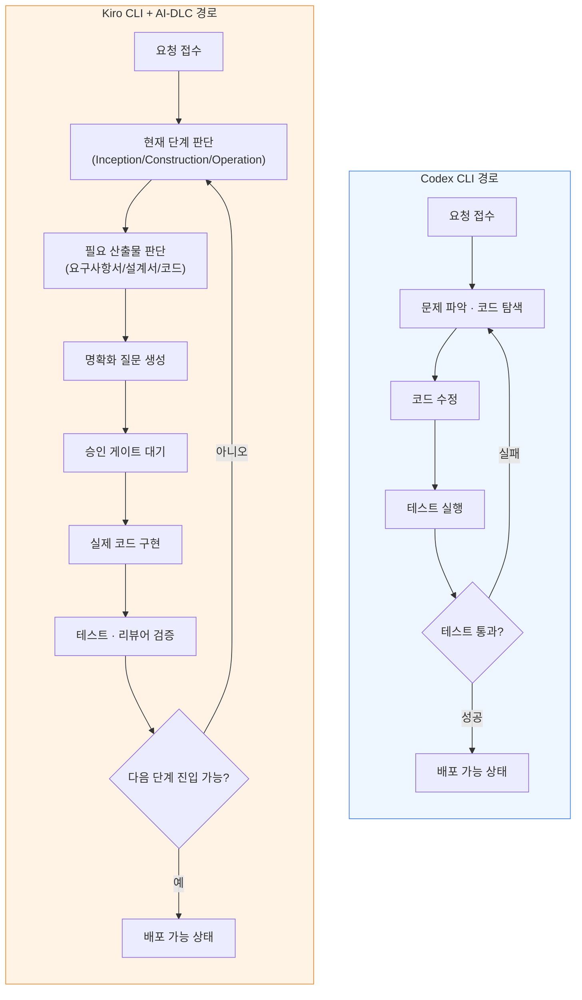
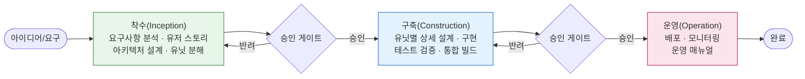

## 관련글

[**Codex에서 Kiro로 기기변경하면서 느낀 재미있는 사실**](https://www.facebook.com/share/p/1DZFczPM6j/)

## 목차

1. 이 글이 다루는 것
2. 원문이 전하는 경험: Codex에서 Kiro로 넘어가며 일어난 일
3. 배경지식 ① — Codex CLI와 GPT-5.6 세 모델(Sol·Terra·Luna)
4. 배경지식 ② — Kiro와 AWS AI-DLC 방법론
5. 배경지식 ③ — 두 도구는 실제로 무엇이 다른가
6. 배경지식 ④ — "하네스 엔지니어링(Harness Engineering)"이라는 관점
7. 저자의 핵심 통찰: "Cognitive Budget(인지 예산)"이라는 가설
8. 도식으로 보는 두 경로의 차이
9. 저자의 경험을 뒷받침하는 외부 근거
10. 검증되지 않은 부분과 유의할 점
11. 이 글이 남기는 질문
12. 참고자료

---

## 1. 이 글이 다루는 것

이 문서는 한 개발자가 코딩 작업 환경을 OpenAI의 **Codex CLI**에서 AWS의 **Kiro CLI**로 옮기면서 겪은 경험을 정리한 짧은 단상(斷想)을, 관련 배경지식과 함께 아주 상세하게 풀어 설명하는 자료다. 원문은 하나의 짧은 에세이 형태였지만, 그 안에는 2026년 현재 AI 코딩 에이전트 생태계에서 가장 중요하게 논의되는 개념 하나가 압축되어 있다. 바로 **"에이전트의 성능은 모델 하나로 결정되지 않는다"** 는 것, 그리고 **"모델을 감싸는 작업 환경(Harness)이 실질적인 결과를 좌우한다"** 는 것이다.

원문 저자는 같은 회사의 같은 세대 모델(OpenAI GPT-5.6 계열)을 사용했음에도, 그 모델을 어떤 도구와 워크플로 안에서 돌리느냐에 따라 결과가 크게 달라지는 경험을 했다. 이 글에서는 저자의 경험을 있는 그대로 정리하고, 그 경험이 실제로 업계에서 논의되고 있는 어떤 흐름과 맞닿아 있는지를 최신 자료를 바탕으로 짚어본다. 다만 원문에 등장하는 "OREO"라는 프로젝트명은 외부에 공개된 정보로 확인할 수 없는, 저자 개인(혹은 소속 조직)의 내부 프로젝트로 보인다는 점을 미리 밝혀둔다. 이 부분은 저자의 개인적인 경험담으로 다루고, 객관적으로 검증 가능한 사실과는 구분해서 서술한다.

---

## 2. 원문이 전하는 경험: Codex에서 Kiro로 넘어가며 일어난 일

저자는 최근 코딩 작업 환경을 Codex에서 Kiro CLI로 바꾸었다. 처음에는 결과의 차이를 단순히 "모델의 차이"라고 생각했지만, "OREO"라는 내부 프로젝트에 기능 하나를 추가하는 과정에서 생각이 바뀌었다.

Kiro CLI에서는 AWS의 AI-DLC 방식에 따라 요구사항을 정리하고, 질문하고, 설계하고, 구현하고, 검증하는 흐름을 따르게 된다. 그런데 이 흐름 안에서 GPT-5.6의 최상위 모델인 **Sol**을 쓰지 않으면 작업이 매끄럽게 이어지지 않았고, 어떤 순간에는 이전 세대인 GPT-5.5보다도 못하다고 느껴질 정도였다고 한다.

반면 Codex CLI에서는 GPT-5.6의 하위 모델인 **Luna** 하나만으로도 문제를 찾아내고, 코드를 수정하고, 테스트를 돌리고, 결국 배포까지 이어가는 것이 가능했다. 저자는 이 지점에서 의문을 품었다. Luna가 Kiro 환경에서 갑자기 코딩 실력이 떨어질 이유는 없기 때문이다.

이 의문은 질문 자체를 바꾸는 계기가 되었다. "어떤 모델이 더 좋은가?"라는 질문 대신 "같은 모델을 어떤 Harness(작업 환경)가 사용하느냐?"라는 질문으로 옮겨간 것이다. 저자는 이를 다음과 같은 구조로 요약한다.

> Model(모델) × Context(맥락) × Tools(도구) × Harness(작업 환경) × Verification(검증)

이 다섯 가지 요소의 조합이 실제 결과를 만든다는 것이다.

저자가 관찰한 핵심적인 차이는 이렇다. Codex 환경에서는 모델의 추론(reasoning) 대부분이 코드 자체에 집중된다. 문제를 찾고, 관련 코드를 읽고, 수정하고, 테스트하고, 실패하면 다시 고치고, 다시 검증하는 식으로 코딩이라는 단일 축에 자원이 몰린다.

반면 Kiro와 AI-DLC를 함께 쓰는 환경에서는 모델이 코드만 이해하면 되는 게 아니다. 지금 전체 워크플로 중 어느 단계에 있는지, 어떤 산출물(artifact)이 필요한지, 어떤 질문을 먼저 사람에게 던져야 하는지, 사람의 승인 게이트(approval gate)를 통과했는지, 리뷰어 역할을 거쳐야 하는지, 다음 단계로 넘어가도 되는지까지 모델이 계속 판단해야 한다. 저자는 이 상황을 두고, 같은 Luna라도 실제 코딩에 쓸 수 있는 "인지적 여력(cognitive budget)"이 달라진다고 표현했다.

저자는 이것이 AI-DLC 자체가 나쁘다는 뜻이 아니라고 분명히 밝힌다. 오히려 그 반대다. AI-DLC는 개발을 단순한 코드 생성이 아니라, 요구사항·설계·검증·승인·학습이 연결된 하나의 소프트웨어 생산 과정으로 만든다는 점에서 의미가 있다. 문제는 이 모든 과정을 상대적으로 가벼운 모델 하나에 동시에 맡길 때 생긴다. 강한 모델은 이 복잡성을 감당할 여력이 있지만, 가벼운 모델은 워크플로를 수행하는 데 자원을 쓰느라 정작 코딩에 쓸 여력이 줄어들 수 있다는 것이다.

여기서 저자는 흥미로운 결론에 도달한다. "Sol이 Luna보다 코딩을 잘한다"는 단순한 비교보다, "Luna+Codex"와 "Luna+Kiro+AI-DLC"가 사실상 같은 이름을 가진 서로 다른 개발 환경이라는 결론이 더 중요하다는 것이다. 사용자는 같은 모델 이름을 보고 있지만, 실제로는 전혀 다른 시스템과 상호작용하고 있다는 이야기다.

저자는 이 차이를 놓치면 벤치마크 점수만 보게 된다고 지적한다. 하지만 현장에서 중요한 것은 벤치마크 점수가 아니라, 요구사항을 던졌을 때 실제 저장소(repository)를 이해하고, 기존 코드를 건드리고, 테스트를 통과하고, 실패를 다시 고쳐서, 마지막으로 배포 가능한 결과까지 만들어주는가라는 실전 완결성이다.

결론적으로 저자는 개발자가 던져야 할 질문이 "어떤 모델이 제일 좋은가?"에서 "우리 코드베이스에서 어떤 Agent Harness가 가장 높은 확률로 작업을 끝까지 완성시키는가?"로 바뀌어야 한다고 말한다. AI 코딩 시대에는 모델을 고르는 것이 아니라 "모델이 일하는 방식을 고르는 것"이 더 중요해지고 있다는 것이 이 글의 결론이다.

---

## 3. 배경지식 ① — Codex CLI와 GPT-5.6 세 모델(Sol·Terra·Luna)

저자의 경험을 이해하려면 먼저 GPT-5.6이라는 모델 패밀리의 구조를 알아야 한다.

OpenAI는 2026년 7월 9일 GPT-5.6을 ChatGPT, Codex, API 전반에 정식 출시(GA)했다[1]. 이전까지는 단일 플래그십 모델을 내놓던 방식과 달리, GPT-5.6은 처음부터 세 개의 등급으로 나뉜 "패밀리" 형태로 설계되었다[2]. 세 모델은 각각 다음과 같은 성격을 가진다.

- **Sol**: 깊은 추론(deep reasoning)에 특화된 플래그십 모델. 복잡한 아키텍처 판단이나 어려운 엔지니어링 작업에 적합하다[1][3].
- **Terra**: 성능과 비용의 균형을 잡은 모델로, 이전 세대인 GPT-5.5 수준의 성능을 대략 절반 가격에 제공한다는 평가를 받는다[3][4].
- **Luna**: 속도와 비용 효율을 극대화한 모델로, 대량의 작업을 빠르고 저렴하게 처리하는 데 최적화되어 있다[1][4].

세 모델은 동일한 인터페이스와 컨텍스트 사양을 공유하기 때문에, Codex 설정에서 모델 ID만 바꾸면 동일한 작업 파이프라인 안에서 세 모델을 자유롭게 오갈 수 있다[5]. Codex CLI에서는 `codex --model gpt-5.6-sol`처럼 모델명을 직접 지정하거나, 세션 중에 `/model` 명령으로 전환할 수 있다[5].

흥미로운 부분은 세 모델 사이의 벤치마크 격차와 가격 격차가 상당히 비대칭적이라는 점이다. 한 분석에 따르면, OpenAI가 공개한 장기 전문 업무 평가(Agents' Last Exam)에서 Sol과 Luna의 점수 차이는 3.3점에 불과하지만, 2026년 7월 30일 가격 인하 이후 두 모델의 가격 차이는 입력·출력 토큰 기준 25배에 달한다[3]. 즉 Luna는 Sol에 비해 성능 손실은 상대적으로 작은 반면 비용은 훨씬 저렴하다는 뜻이며, 이 때문에 많은 실무 가이드는 "우선 Terra로 시작하고, 신뢰성이 중요하면 Sol로, 처리량과 비용이 중요하면 Luna로 옮기라"고 권한다[5][6].

Codex CLI 자체에는 Ultra라는 실행 모드도 있다. 이는 하나의 작업을 여러 서브에이전트로 나누어 병렬로 처리한 뒤 다시 합치는 방식으로, OpenAI에 따르면 Ultra 모드는 Terminal-Bench 2.1 점수를 88.8%에서 91.9%로 끌어올린다[1][7]. 다만 이 모드는 토큰과 비용 사용량이 커지기 때문에 한 파일을 고치는 작은 작업보다는 광범위한 리팩터링처럼 독립적으로 나눌 수 있는 작업에 적합하다고 설명된다[1][6][7].

정리하면, Codex CLI는 "코드를 직접 다루는 에이전트 실행기"의 성격이 강하고, 그 위에서 Sol·Terra·Luna라는 세 가지 등급의 모델을 상황에 맞게 골라 쓰는 구조다. 저자가 Codex에서 Luna 하나만으로도 문제를 찾고 고치고 배포까지 이어갔다는 경험은, Codex라는 실행 환경 자체가 모델의 추론 자원을 코드 작업에 최대한 집중시키는 구조이기 때문일 가능성이 있다.

---

## 4. 배경지식 ② — Kiro와 AWS AI-DLC 방법론

### 4-1. Kiro란 무엇인가

Kiro는 AWS가 내놓은 에이전트형 개발 도구 제품군의 이름이다. Kiro는 기존의 Amazon Q Developer를 잇는 공식 후속 제품으로, Amazon Q Developer의 지원 종료일은 2027년 4월 30일로 예고되어 있다[8]. 사용자 입장에서는 크게 두 가지 형태로 Kiro를 만나게 된다.

하나는 **Kiro IDE**로, VS Code(정확히는 오픈소스 기반 Code OSS)를 포크해서 만든 독립 에디터다. 여기에 명세 기반 개발(spec-driven development), 에이전트 훅(hook), 자동화 등 에이전트형 개발 기능이 통합되어 있다[8][9]. 다른 하나는 **Kiro CLI**로, 기존 편집기를 그대로 쓰면서 터미널에서 채팅·코드 생성·에이전트 워크플로를 실행할 수 있는 도구다[9]. 이 Kiro CLI는 원래 Amazon Q Developer CLI였던 것이 2025년 11월의 업데이트를 거쳐 이름과 브랜드가 Kiro CLI로 바뀐 것으로, 실행 명령도 기존 `q` / `q chat`에서 `kiro-cli`로 변경되었다[10]. Kiro 제품군 전체는 2026년 5월 7일 정식 출시(GA)되었다[4].

Kiro의 핵심 특징은 "명세 기반 개발"이다. 다른 대다수의 AI 코딩 도구가 코드를 작성하면 AI가 다음 줄을 자동완성하는 방식으로 작동하는 것과 달리, Kiro는 사용자가 자연어로 원하는 기능을 설명하면 코드를 쓰기 전에 먼저 구조화된 요구사항(requirements.md), 설계(design.md), 작업 목록(tasks.md) 문서를 EARS라는 형식 표기법으로 생성한다[4]. 이 과정이 바로 다음 절에서 다룰 AI-DLC 방법론과 맞닿아 있다.

### 4-2. AI-DLC란 무엇인가

AI-DLC(AI-Driven Development Life Cycle)는 AWS가 제안한 개발 방법론의 이름이다. 이는 특정 제품에 종속되지 않는 오픈소스 방법론으로 설계되었으며, 실행 도구로는 Claude Code, Kiro, Codex 등 다양한 AI 개발 도구 가운데 자유롭게 선택할 수 있다[11]. 즉 AI-DLC는 "도구"가 아니라 "일하는 절차"에 가깝다.

AI-DLC가 지향하는 방향은 AI에게 개발을 전부 맡기는 이른바 "바이브 코딩"도 아니고, 사람이 개발하고 AI가 일부만 보조하는 방식도 아니다. AI가 실행을 담당하고 사람은 각 단계마다 결과를 검토하고 승인하는 구조를 통해 속도와 품질, 보안을 함께 확보하려는 접근이다[11].

AI-DLC는 하나의 반복 주기를 "볼트(Bolt)"라고 부르며, 이는 애자일의 스프린트와 비슷한 개념이다. 각 볼트는 프로젝트 규모에 따라 유연하게 적응하며, 대체로 다음 세 단계로 구성된다[11][12][13].

첫 번째는 **착수(Inception)** 단계다. 무엇을 만들 것인지를 정의하는 단계로, 이해관계자의 요구를 수집하고 명확화 질문을 통해 요구사항을 구체화하며, 사용자 관점의 스토리를 작성하고, 전체 시스템의 논리적 아키텍처와 도메인 모델을 설계하고, 독립적으로 개발 가능한 작업 단위(Unit)로 시스템을 쪼갠다[14][12].

두 번째는 **구축(Construction)** 단계다. 어떻게 만들 것인지를 결정하고 실제로 구현하는 단계로, 각 유닛의 상세 기능·컴포넌트를 설계하고, 실제 구현 코드를 생성한 뒤 테스트 코드로 검증하는 사이클을 유닛 단위로 반복하고, 모든 유닛이 끝나면 통합 빌드 단계로 넘어가 애초의 요구사항이 올바르게 구현되었는지 확인한다[13][15].

세 번째는 **운영(Operation)** 단계로, 실제 배포와 운영에 관한 산출물을 다루는 단계다.

AI-DLC의 핵심 요소로는 이전 단계의 결정이 다음 단계로 이어지도록 하는 맥락(Context) 관리, 사람의 승인을 거쳐야 다음 단계로 진행할 수 있는 **승인 게이트(Approval Gate)**, 그리고 모든 변경 사항을 기록하는 **감사 추적(Audit Trail)** 이 꼽힌다[11]. 또한 11개의 전문화된 AI 에이전트가 설계, 개발, 테스트 등 역할을 나누어 수행하며, 코드뿐 아니라 요구사항 정의서, 설계 문서, 운영 매뉴얼까지 함께 생성한다는 점도 특징이다[11].

여기서 중요한 것은, AI-DLC 환경에서 모델이 다루는 산출물이 코드만이 아니라는 사실이다. 요구사항 정의서, 페르소나와 사용자 스토리, 아키텍처 설계 문서, 작업 단위 실행 계획서, 기능·비기능 상세 설계, 인프라 구성(IaC) 설계 문서 등이 각 단계마다 체계적으로 요구된다[16]. 저자가 원문에서 "지금 어느 단계인지, 어떤 artifact가 필요한지, 어떤 질문을 먼저 해야 하는지" 계속 판단해야 한다고 표현한 부분이 바로 이 지점과 정확히 맞아떨어진다.

### 4-3. AI-DLC Workflows라는 실행 엔진

AI-DLC라는 방법론을 실제로 각 도구 위에서 실행할 수 있게 해주는 오픈소스 도구가 `aidlc-workflows`다. 2025년 11월 AWS 블로그를 통해 공개된 v1은 규칙 파일(rule file) 기반으로, 핵심 워크플로 문서를 각 하네스의 설정 디렉터리에 복사해 넣는 방식으로 작동했으며 8개 하네스를 지원했지만 단계 관리는 대부분 LLM의 판단에 의존했다[17].

2026년 6월 18일 프리뷰로 공개된 v2는 네이티브 TypeScript로 완전히 재작성되어, 결정론적(deterministic) 엔진과 상태 관리 기능을 갖추게 되었다[17]. 이후 약 5주 만에 정식 버전(GA)에 도달했고, 이 글을 쓰는 시점 기준 최신 버전은 v2.5.5로, Kiro CLI, Claude Code, Codex CLI, 그리고 v2.4.6부터 추가된 opencode까지 총 5개 하네스를 지원한다[18]. v2.2.0에서 추가된 "적응형 워크플로(Adaptive Workflows)" 기능은 컴포저(composer) 에이전트가 자연어 입력에서 작업 범위를 스스로 추론해 실행/생략(EXECUTE/SKIP) 표를 동적으로 만들어내는 기능이다[18].

---

## 5. 배경지식 ③ — 두 도구는 실제로 무엇이 다른가

지금까지의 배경을 종합하면, Codex CLI와 "Kiro CLI + AI-DLC"의 근본적인 차이가 좀 더 분명해진다.

Codex CLI는 기본적으로 사용자의 요청을 받아 코드를 직접 다루는 데 집중된 실행 루프를 가진 도구다. 문제 파악, 코드 읽기, 수정, 테스트, 재수정, 재검증이라는 좁고 깊은 반복이 중심이다.

반면 Kiro CLI 위에서 AI-DLC 워크플로를 실행하면, 모델은 코드를 다루는 것과 별개로 "지금 이 프로젝트가 착수 단계인지 구축 단계인지, 이번에 필요한 산출물이 요구사항 문서인지 설계 문서인지 코드인지, 사람에게 확인받아야 할 애매한 지점이 있는지, 승인 게이트를 통과했는지, 다음 유닛으로 넘어가도 되는지"까지 판단해야 하는 절차형 워크플로 위에 얹혀 있다. 이는 AI-DLC가 원래 지향하는 목표—코드뿐 아니라 요구사항, 설계, 검증, 승인, 학습까지 연결된 소프트웨어 생산 과정을 만드는 것[11]—을 달성하기 위한 구조적 특징이지, 결함이 아니다.

다만 이 구조가 요구하는 것은 "코딩 능력"만이 아니라 "워크플로를 스스로 오케스트레이션하는 능력"이다. 그리고 이 오케스트레이션 부담이 모델의 등급에 따라 다르게 감당된다는 것이, 다음 절에서 다룰 저자의 핵심 통찰이자 실제로 외부 자료에서도 확인되는 현상이다.

---

## 6. 배경지식 ④ — "하네스 엔지니어링(Harness Engineering)"이라는 관점

저자가 "Model × Context × Tools × Harness × Verification"이라는 공식으로 정리한 생각은, 2026년 들어 AI 업계에서 본격적으로 자리 잡은 "하네스 엔지니어링"이라는 개념과 정확히 맞닿아 있다.

하네스(harness)는 원래 말의 힘을 원하는 방향과 속도로 전환시켜주는 마구(馬具)를 뜻하는 단어다. 아무리 강한 말이라도 마구 없이는 밭을 갈 수 없듯, 아무리 뛰어난 모델이라도 그것을 실제 작업 결과로 이끄는 장치 없이는 원하는 성과를 내기 어렵다는 비유에서 이 용어가 왔다[19][20].

Anthropic의 정의를 인용하면, 하네스 엔지니어링은 "사용자의 요청과 에이전트의 최종 출력 사이에 있는 모든 것, 언어 모델 자체를 제외한 모든 것"을 설계하는 기술이다[21]. 소프트웨어 설계 분야의 저명한 저자 마틴 파울러(Martin Fowler)는 이를 "AI 에이전트를 위한 소프트웨어 아키텍처 설계 분야"로 규정했으며[21], LangChain은 이를 "Agent = Model + Harness"라는 공식으로 요약한다[21].

이 개념이 단순한 수사가 아니라는 것은 실제 수치로도 확인된다. LangChain이 자사의 코딩 에이전트에 하네스 최적화만을 적용했을 때, Terminal Bench 2.0 벤치마크 점수가 52.8%에서 66.5%로, 13.7퍼센트포인트나 개선되었다는 사례가 보고되었다[21]. 이때 핵심 변수로 꼽힌 것이 계획(planning), 자기검증(self-verification), 로컬 컨텍스트 자동 주입이었다[21]. 즉 모델 자체는 그대로 둔 채 그것을 감싸는 환경만 바꿔도 성능이 크게 달라질 수 있다는 것이다.

OpenAI는 하네스 엔지니어링을 세 가지 기둥으로 설명한다고 알려져 있다[22]. 첫째는 **컨텍스트 엔지니어링**으로, 에이전트 입장에서 컨텍스트 안에 없는 정보는 존재하지 않는 것과 같기 때문에 문서·규칙·컨벤션을 저장소 안에 기계가 읽을 수 있는 형태로 옮겨야 한다는 것이다. 둘째는 **아키텍처적 제약**으로, 에이전트에게 자유를 많이 줄수록 오히려 예측 불가능한 결과가 나오기 때문에 적절한 제약이 필요하다는 것이다. 셋째는 **피드백 루프**로, 에이전트가 스스로 결과를 검증할 수 있는 장치를 두는 것이다[22].

이 관점에서 보면 저자의 경험은 "같은 모델이라도 하네스가 다르면 다른 에이전트"라는, 업계에서 이미 상당히 구체화되어 있는 논의의 개인적 재발견에 가깝다. 다만 저자가 독특하게 짚은 지점은, 하네스의 차이가 단순히 "도구의 편의성" 문제가 아니라 **모델이 코딩이라는 본연의 작업에 쓸 수 있는 추론 자원의 총량**을 좌우한다는 것이다. 이는 다음 절에서 더 자세히 다룬다.

---

## 7. 저자의 핵심 통찰: "Cognitive Budget(인지 예산)"이라는 가설

원문에서 저자가 제시하는 설명의 핵심은, 모델이 한 번의 세션에서 쓸 수 있는 추론 자원(즉 사고에 쓸 수 있는 "예산")이 고정되어 있고, 이 예산이 워크플로 관리와 코딩 작업 사이에 나뉘어 쓰인다는 것이다. Codex처럼 워크플로 관리 부담이 적은 환경에서는 예산 대부분이 코딩에 투입될 수 있지만, Kiro+AI-DLC처럼 단계 판단·산출물 관리·승인 게이트 통과 여부까지 모델이 스스로 챙겨야 하는 환경에서는 같은 예산 중 상당 부분이 "지금 무엇을 해야 하는가"를 판단하는 데 소모된다는 것이다.

이 설명은 미리 밝혀둘 필요가 있는 지점에서, **엄밀한 학술적 검증을 거친 정량적 개념이라기보다 저자 개인이 관찰을 바탕으로 세운 가설**이다. "인지 예산"이라는 표현 자체가 업계에서 표준화된 용어는 아니며, 이 문서에서 검색한 범위 안에서는 이 정확한 개념을 정면으로 측정한 벤치마크나 논문은 확인되지 않았다. 따라서 이는 저자의 직관적 설명 틀로 다루는 것이 정확하다.

다만 이 가설을 뒷받침할 만한 정황 근거는 실제로 존재한다. 다음 절에서 다루듯, AI-DLC를 Kiro 위에서 돌릴 때 모델의 등급에 따라 워크플로 이행의 충실도 자체가 달라진다는 보고가 별도로 존재하기 때문이다.

---

## 8. 도식으로 보는 두 경로의 차이

아래 다이어그램은 저자가 설명한 두 작업 경로에서, 모델의 추론 자원이 어디에 얼마나 배분되는지를 개념적으로 정리한 것이다. 실제 비율을 측정한 수치가 아니라, 원문의 서술을 구조화한 개념도임을 밝힌다.

이 그림에서 알 수 있듯, Codex 경로는 코드-테스트 축을 중심으로 짧게 순환하는 구조인 반면, Kiro+AI-DLC 경로는 코드 작업(K6~K7)에 도달하기 전에 워크플로 상태 판단(K2~K5)이라는 별도의 층을 거쳐야 한다. 저자의 가설에 따르면 이 앞단의 판단 과정 자체가 모델의 추론 자원을 소모하며, 이 소모분을 감당할 여력이 상대적으로 부족한 하위 등급 모델(Luna)에서는 코딩 품질이 저하되는 것으로 나타난다는 것이다.

다음 다이어그램은 AI-DLC 방법론 자체의 3단계 구조를, 승인 게이트와 함께 정리한 것이다[11][12][13].

---

## 9. 저자의 경험을 뒷받침하는 외부 근거

여기서부터는 이 문서를 작성하며 실제로 확인한, 저자의 경험과 맞아떨어지는 외부 자료를 소개한다. 이 자료들은 저자의 관찰이 완전히 개인적인 우연이 아니라, AI-DLC를 실제로 운용해본 다른 사례들에서도 반복적으로 나타나는 패턴일 가능성을 뒷받침한다.

가장 직접적인 근거는 AI-DLC Workflows v2를 여러 하네스에 설치해 검증한 기술 블로그 기사다. 이 기사는 "AI-DLC는 Kiro 위에서 Claude Opus 4.8과 함께 쓸 때 가장 잘 작동하며, 이는 유료 Kiro 플랜을 필요로 한다"고 전제한 뒤, "상대적으로 약한 모델에서는 컨덕터(conductor, 워크플로를 조율하는 에이전트)가 선택적 단계 절차—리뷰어 패스나 학습 의례(learnings ritual)—를 건너뛰거나 승인 게이트를 서둘러 통과시켜버리는 경우가 있다"고 명시적으로 보고한다[17].

이는 저자가 원문에서 서술한 현상—AI-DLC 환경에서 상위 모델(Sol)이 아니면 흐름이 매끄럽게 이어지지 않는다는 경험—과 구조적으로 정확히 일치한다. 모델의 등급이 낮아질수록 AI-DLC라는 절차형 워크플로의 세부 단계를 충실히 이행하는 능력 자체가 떨어진다는 것이, 저자 한 사람의 주관적 인상이 아니라 별도의 검증 기사에서도 독립적으로 관찰되었다는 뜻이다.

또한 하네스 엔지니어링 관련 자료들이 공통적으로 강조하는 지점—"모델이 아무리 강력해도 그것을 감싸는 시스템이 없으면 매번 다른 결과를 낸다"[19]—는 저자가 "Luna+Codex"와 "Luna+Kiro+AI-DLC"를 사실상 다른 AI라고 표현한 부분과 정확히 같은 결을 가진다.

정리하면, 저자의 핵심 주장인 "①같은 모델이라도 하네스에 따라 결과가 크게 달라진다"는 부분은 업계 자료로 뒷받침되는 잘 정립된 현상이며, "②그 이유가 워크플로 오케스트레이션 부담이 모델의 코딩 자원을 잠식하기 때문"이라는 설명 역시, 비록 "인지 예산"이라는 표현 자체는 저자의 조어이지만 그 실체(약한 모델이 워크플로 절차를 제대로 못 챙긴다는 관찰)는 외부 검증 사례와 부합한다.

---

## 10. 검증되지 않은 부분과 유의할 점

이 문서를 작성하며 원문의 내용 중 외부적으로 확인할 수 없었던 부분을 명확히 밝혀둔다.

첫째, 원문에 등장하는 **"OREO"** 라는 이름은 코딩 프로젝트, 오픈소스 저장소, AWS 제품 등 어떤 공개된 자료로도 확인되지 않았다. 검색 결과 상 이 이름과 관련해 나오는 것은 과자 브랜드 오레오, 안드로이드 오레오 운영체제, 분산 트랜잭션 프레임워크 등 전혀 무관한 항목들뿐이었다. 따라서 OREO는 저자 개인 혹은 소속 조직의 비공개 내부 프로젝트명으로 판단하는 것이 합리적이며, 이 프로젝트의 구체적인 내용이나 규모, 실제로 어떤 기능이 추가되었는지는 원문 저자만이 알고 있는 정보다. 이 문서에서는 이를 검증된 사실이 아닌 저자의 1인칭 경험담으로만 다루었다.

둘째, "GPT-5.6 Sol을 쓰지 않으면 이상하게 결과가 잘 이어지지 않았다", "GPT-5.5보다도 못하다고 느껴지는 순간도 있었다"는 서술은 저자 개인의 정성적 체감이며, 정량적으로 측정되거나 재현 가능한 형태로 공개된 벤치마크는 아니다. 같은 조건에서 다른 사용자가 동일한 결과를 재현할 수 있는지는 알 수 없다.

셋째, "인지 예산(cognitive budget)"이라는 개념은 이 문서의 6절에서 밝혔듯 저자의 직관적 설명 틀이며, 이를 직접적으로 측정하거나 검증한 학술 자료나 벤치마크는 이번 조사 범위에서 확인되지 않았다. 다만 이와 유사한 현상—워크플로 복잡도가 모델 성능에 미치는 영향—을 보고하는 사례는 존재하며, 이는 9절에서 소개했다.

넷째, GPT-5.6의 출시 시점에 관해서는 자료마다 약간의 표현 차이가 있었다. Codex GA는 2026년 7월 9일로 여러 자료에서 일관되게 확인되었고[1], 이보다 앞선 6월 26일에는 약 20개 파트너사를 대상으로 한 제한적 프리뷰가 있었다는 자료도 있다[6][23]. 이 문서에서는 두 시점을 구분해 표기했다.

---

## 11. 이 글이 남기는 질문

저자의 단상은 결국 하나의 실용적인 제언으로 수렴한다. "어떤 모델이 제일 좋은가"라는 질문은 벤치마크 표를 보는 것으로 어느 정도 답할 수 있지만, "우리 코드베이스에서, 우리가 쓰는 워크플로 안에서, 어떤 조합이 작업을 실제로 끝까지 완성시키는가"라는 질문은 벤치마크만으로는 답할 수 없다는 것이다.

이는 2026년 현재 하네스 엔지니어링이라는 분야가 형성되고 있는 이유이기도 하다. 모델의 성능이 상향 평준화될수록, 차별화 지점은 모델 자체보다 그 모델을 감싸는 컨텍스트 설계, 도구 연결, 검증 루프, 그리고 워크플로 구조로 옮겨간다는 것이 업계의 대체적인 흐름이다[19][21][22]. 저자의 표현을 빌리면, 다음 세대의 개발 생산성 경쟁은 "누가 더 좋은 모델을 갖고 있는가"가 아니라 "누가 모델을 더 잘 일하게 만드는가"에서 갈릴 수 있다는 것이다.

다만 이 결론을 받아들이더라도, 어떤 작업에는 AI-DLC처럼 무겁지만 체계적인 워크플로가 필요하고, 어떤 작업에는 Codex처럼 가볍고 직접적인 실행 루프가 더 맞을 수 있다는 점은 여전히 남는 판단의 영역이다. 저자 역시 AI-DLC 자체를 부정하지 않았듯, 이 글의 함의는 "어떤 하네스가 절대적으로 우월하다"는 것이 아니라 "모델과 하네스의 궁합을 함께 설계해야 한다"는 쪽에 가깝다.

---

## 12. 참고자료

[1] Codex에서 GPT-5.6 사용법, apidog.com, 2026년 7월 (https://apidog.com/blog/gpt-5-6-codex/)

[2] GPT-5.6 Sol, Terra, and Luna: What OpenAI's Three-Tier Model Family Means for Codex CLI Workflows, Codex Knowledge Base, 2026년 7월 5일 (https://codex.danielvaughan.com/2026/07/01/gpt-5-6-sol-terra-luna-codex-cli-model-selection-tiered-reasoning-cache-breakpoints/)

[3] GPT-5.6 Sol vs Terra vs Luna: Which Tier Should You Actually Use?, Vellum, 2026년 8월 (https://www.vellum.ai/blog/gpt-5-6-sol-terra-luna-explained)

[4] AWS Kiro IDE: Complete Launch Guide 2026, pingax.com, 2026년 6월 28일 (https://pingax.com/kiro-aws-launch-announcement/)

[5] GPT-5.6 in Codex: Choosing Sol, Terra, or Luna, XAI Router, 2026년 7월 10일 (https://xairouter.com/en/blog/codex-gpt-5-6-xai-router/)

[6] GPT-5.6 Sol, Terra, Luna: Skills Setup for Codex CLI, agensi.io, 2026년 7월 (https://www.agensi.io/learn/gpt-5-6-sol-terra-luna-skills-guide)

[7] GPT-5.6 Codex App Guide: Sol, Terra, Luna, Max & Ultra, API Gateway, 2026년 7월 (https://llm-agent.cc/en/blog/gpt-5-6-codex-app-coding-agent-review-en)

[8] Migrating from Amazon Q Developer, Kiro 공식 문서 (https://kiro.dev/docs/upgrade-guides/migrating-from-q-developer/)

[9] Understanding AWS Q Developer, Q CLI, CodeWhisperer, and Kiro, Medium (https://medium.com/@rongalinaidu/understanding-aws-q-developer-q-cli-codewhisperer-and-kiro-fc8d6f7e6075)

[10] Amazon Q Developer CLI から Kiro CLI へ, AWS Japan Blog (https://aws.amazon.com/jp/blogs/news/kiroweeeeeeek-in-japan-day-6-amazon-q-developer-cli-to-kiro-cli)

[11] "AI가 코드는 짜도 개발은 못 끝낸다"…AWS가 꺼낸 'AI-DLC' 해법, VentureSquare (https://www.venturesquare.net/1099138)

[12] [AWS Summit Seoul 2026] 생성형 AI 시대의 새로운 개발 방법론: AI-DLC, NDS Cloud Tech Blog, 2026년 6월 11일 (https://tech.cloud.nongshim.co.kr/blog/aws/ai/3930/)

[13] CJ올리브영의 AI 협업 개발 프로세스 구축, AI-DLC 실전 도입 사례, AWS 기술 블로그, 2026년 5월 19일 (https://aws.amazon.com/ko/blogs/tech/cj-oliveyoung-aidlc-tech-blog/)

[14] AI-DLC 기반 웅진씽크빅 북큐레이터 AI 에이전트 구축, AWS 기술 블로그 (https://aws.amazon.com/ko/blogs/tech/aws-aidlc-woongjinthinkbig-tech-blog)

[15] AI-DLC 를 팀 프로젝트에 적용하기, AWS 기술 블로그, 2026년 5월 22일 (https://aws.amazon.com/ko/blogs/tech/aidlc-armiq-subagent-customskills/)

[16] Agentic AI 기반 플랫폼 – 7주만에 기획부터 배포까지, Part1, AWS 기술 블로그, 2026년 2월 9일 (https://aws.amazon.com/ko/blogs/tech/agentic-ai-foundation-platform-part1/)

[17] I tried installing AI-DLC Workflows v2 on Kiro CLI / Claude Code / Codex CLI, DevelopersIO, 2026년 6월 18일 (https://dev.classmethod.jp/en/articles/aidlc-workflows-v2-install-kiro-claude-codex/)

[18] Tried running the newly GA'd AI-DLC Workflows v2.5.5 with Kiro CLI, DevelopersIO (https://dev.classmethod.jp/en/articles/aidlc-workflows-v2-ga-kiro-cli/)

[19] 하네스 엔지니어링이란? — 뜻부터 실전 예시까지 완벽 정리, GPTers, 2026년 4월 13일 (https://www.gpters.org/nocode/post/what-harness-engineering-complete-gP3o5gHfMud3Ms9)

[20] 하네스 엔지니어링이란? AI 에이전트를 프로덕션에 넣는 기술, QANDA AX 블로그, 2026년 3월 27일 (https://ax.qanda.ai/blogs/harness-engineering)

[21] 상동, QANDA AX 블로그

[22] Harness Engineering: AI 코딩 에이전트를 위한 환경 설계, Dale Seo Engineering Blog, 2026년 3월 13일 (https://daleseo.com/harness-engineering/)

[23] GPT-5.6 Sol, Terra, and Luna: What OpenAI's Three-Tier Model Family Means for Codex CLI Workflows, Codex Knowledge Base (동일 자료, 2026년 6월 26일 프리뷰 언급)

---

*이 문서는 사용자가 제공한 원문 단상과 2026년 8월 기준 웹 검색 결과를 바탕으로 작성되었습니다. 원문의 "OREO" 프로젝트 및 저자 개인의 체감 경험은 외부적으로 검증되지 않은 1인칭 서술임을 다시 한 번 밝힙니다.*
