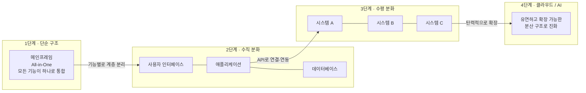

## 목차

1. 프롤로그 — 속도의 시대에 던지는 질문
2. 바이브코딩이란 무엇인가 — 정의와 2026년의 좌표
3. 숫자로 보는 바이브코딩의 명암 — 생산성 논쟁의 전말
4. 화려한 시작, 흔들리는 뒤편 — AI가 잘하는 일과 못하는 일
5. 보이지 않는 것을 그리는 힘 — 아키텍처란 무엇인가
6. IT 시스템 진화의 네 단계 — 단순 구조에서 클라우드·AI까지
7. 왜 지금, 아키텍처인가 — 두 흐름이 만나는 지점
8. 역할별로 다시 보는 아키텍처 — 개발자, 기획자, 컨설턴트, 관리자
9. 에필로그 — 화이트보드 8미터가 남긴 것
10. 참고 자료

---

## 1. 프롤로그 — 속도의 시대에 던지는 질문

2026년의 개발 현장을 한마디로 요약하면 "말로 시키면 코드가 나온다"는 문장으로 충분할지도 모른다. 몇 년 전만 해도 개발자가 한 줄 한 줄 타이핑하던 자리를, 이제는 자연어로 던진 요구사항 한 문단이 대신 채운다. 이 새로운 개발 방식에는 이미 이름이 붙어 있다. 바이브코딩(Vibe Coding)이다.

그런데 재미있는 역설이 하나 있다. 코드를 만드는 일이 이렇게 쉬워졌는데도, 정작 그 코드가 어디에 놓이고 어떤 역할을 하는지 설명할 수 있는 사람은 오히려 줄어들고 있다는 점이다. AI가 실행 가능한 코드를 순식간에 뽑아내는 동안, 그 코드가 전체 시스템의 어느 지점에서 어떤 흐름을 만들고 있는지를 머릿속에 그리는 능력은 점점 희소해지고 있다.

이 글은 이런 질문에서 출발한다. AI가 코드를 대신 짜주는 시대에, 왜 사람은 여전히 "아키텍처"를 공부해야 하는가. 마침 최근 소개받은 공상휘 저자의 [**『아키텍처는 진화한다』**](https://www.yes24.com/product/goods/192470678)(인사이트)라는 책이 이 질문에 대한 하나의 답을 던지고 있었다. 저자는 생물학을 전공한 뒤 우연히 IT 업계에 발을 들여 개발자, 프로젝트 관리자, 데이터 컨설턴트, 시스템 아키텍트, 솔루션 아키텍트를 두루 거친 인물로, 20여 년간 금융·통신·반도체·제조·공공 분야의 실제 프로젝트에서 시스템이 변화해 온 과정을 지켜봐 왔다. 그가 신입사원 교육에서 매번 8미터짜리 화이트보드에 시스템의 진화 과정을 손으로 그려가며 강의했던 이야기는, 지금 이 시대에 더 묵직하게 다가온다.

이 글에서는 그 책이 던지는 문제의식을 뼈대로 삼아, 2026년 현재 바이브코딩 생태계에서 실제로 벌어지고 있는 일들을 짚어보려 한다. 통계와 연구 결과, 실무자들의 경험담을 함께 살피면서, "왜 지금 아키텍처인가"라는 질문에 최대한 근거 있게 답해보고자 한다.

---

## 2. 바이브코딩이란 무엇인가 — 정의와 2026년의 좌표

바이브코딩은 자연어 프롬프트를 통해 애플리케이션의 아키텍처와 비즈니스 로직을 대규모 언어 모델이 직접 작성하게 하는 개발 방법론으로 설명된다[1]. 개발자가 일일이 컴포넌트를 나누고 상태 관리 코드를 타이핑하는 대신, 시스템의 요구사항과 데이터 흐름을 텍스트로 정의하면 AI가 그 맥락을 기반으로 실행 가능한 코드를 만들어내는 방식이다[1]. 이 용어 자체는 2025년 초 AI 연구자 안드레이 카르파티(Andrej Karpathy)가 대중화시킨 것으로 알려져 있으며, 그해 콜린스 사전이 올해의 단어로 선정할 만큼 빠르게 화제가 됐다[26].

이 흐름은 이제 통계로도 뚜렷하게 확인된다. 2026년 기준으로 미국 개발자의 92%가 AI 코딩 도구를 매일 사용하고, 신규 코드의 약 41%가 AI로 생성되며, 포춘 500대 기업의 87%가 AI 코딩 플랫폼을 도입했다는 조사 결과가 있다[5]. 바이브코딩 관련 시장 규모는 2026년 47억 달러에서 2027년 123억 달러로 성장할 것으로 전망되며, 연평균 성장률은 38%에 달한다는 분석도 나온다[5]. 다른 조사에서도 개발자의 84%가 AI 도구를 사용 중이거나 사용할 계획이라는 수치가 확인된다[26].

이 변화의 파급력은 전문 개발자 집단에만 머물지 않는다. 한 플랫폼 사용자의 63%가 비개발자였다는 조사처럼, 창업가나 마케터, 1인 기업가가 프롬프트만으로 프로토타입과 업무 자동화 도구를 직접 만드는 사례가 늘고 있다[3]. 뉴욕타임스의 한 기자는 이런 흐름을 "나만을 위한 소프트웨어"라는 표현으로 요약하기도 했다[3]. 인도 뭄바이에서 시작한 모바일 앱 특화 바이브코딩 플랫폼 이머전트(Emergent)가 190개국 500만 사용자와 연 매출 5000만 달러를 달성한 사례, 코드베이스 전체에 미치는 영향을 분석하고 조직의 코딩 관행과 아키텍처 표준을 학습해 일관된 품질을 유지하는 이른바 "룰스 시스템"으로 대형 기업 고객을 확보한 스타트업 사례 등은, 바이브코딩이 이미 개인의 취미를 넘어 산업 지형을 바꾸는 자본의 흐름이 되었음을 보여준다[2].

---

## 3. 숫자로 보는 바이브코딩의 명암 — 생산성 논쟁의 전말

바이브코딩을 둘러싼 이야기는 대체로 "빨라졌다"는 쪽으로 흐르기 쉽다. 그러나 실제 연구 데이터는 훨씬 복잡하고 흥미로운 그림을 보여준다.

2025년 7월, AI 안전성 연구기관 METR은 무작위 대조 실험(RCT)이라는 엄격한 방법론으로 흥미로운 결과를 발표했다. 평균 5년 경력을 가진 숙련 오픈소스 개발자 16명이 자신에게 익숙한 대규모 프로젝트에서 246개의 실제 작업을 수행하도록 하고, 절반은 AI 도구 사용을 허용하고 절반은 금지했다. 연구진은 애초에 AI가 속도를 높여줄 것으로 예상했지만, 실제 결과는 AI 사용이 허용된 경우 작업 완료 시간이 오히려 19% 더 길어지는 것으로 나타났다[6]. 더 흥미로운 지점은, 작업을 마친 개발자들조차 스스로는 AI 덕분에 20% 더 빨라졌다고 믿었다는 사실이다[6]. 체감과 실측 사이의 간극이 이토록 컸다는 점이 이 연구가 큰 반향을 일으킨 이유였다.

다만 이 이야기는 여기서 끝나지 않는다. 2026년에 들어서면서 METR 연구진은 스스로 방법론의 한계를 인정했다. AI로부터 가장 큰 이득을 보는 개발자일수록 "AI를 쓰지 않는" 실험 조건에 참여하기를 거부하는 경향이 있었고, 이 때문에 표본 자체가 왜곡되었을 가능성이 제기된 것이다[7]. 흥미롭게도 같은 연구팀이 2026년 초 다시 측정했을 때는 오히려 18%의 생산성 향상이 관측되었다는 보고도 있다[7]. 즉 "AI가 개발자를 느리게 만드는가, 빠르게 만드는가"라는 질문에 대한 답은 여전히 유동적이며, 도구의 발전 속도와 측정 시점, 작업의 성격에 따라 크게 달라진다는 것이 지금까지 가장 정직한 결론에 가깝다.

이 데이터에서 얻을 수 있는 실질적인 통찰은 따로 있다. 여러 조사를 종합하면 AI 코딩 도구는 새로 시작하는 프로젝트(그린필드)나 테스트 코드 생성, 반복적인 리팩토링 같은 단순 작업에서는 확실한 이득을 보여주지만, 이미 방대하고 복잡한 기존 코드베이스, 즉 개발자가 이미 깊은 맥락을 갖고 있는 환경에서는 오히려 검증과 수정에 드는 시간이 이득을 상쇄해버리는 경향이 뚜렷하다는 점이다. 요컨대 AI는 "빈 도화지 위에 빠르게 그리는 일"에는 강하지만, "이미 그려진 복잡한 그림의 문맥을 이해하고 다음 붓질을 신중하게 결정하는 일"에는 아직 사람의 판단을 크게 대체하지 못하고 있다.

---

## 4. 화려한 시작, 흔들리는 뒤편 — AI가 잘하는 일과 못하는 일

바이브코딩을 실제로 겪어본 실무자들의 후기는 통계보다 더 생생하게 이 문제를 보여준다. 한 8년 차 AI 엔지니어는 데이터를 업로드하면 자동으로 전처리하고 모델을 학습시켜 결과를 시각화해주는 웹앱을 만들어달라는 프롬프트 하나로, 10분 만에 실행 가능한 스크립트를 받아냈다고 회고한다[10]. 여기까지는 분명 놀라운 경험이었다. 그러나 문제는 그 다음이었다. 이미 만들어진 스크립트에 기능을 하나씩 추가하려는 순간부터 일이 꼬이기 시작했다는 것이다[10].

이런 경험은 예외적인 사례가 아니다. 2026년 시점에 나온 여러 실무 분석은 공통적으로 비슷한 패턴을 지적한다. AI가 만든 코드는 한 곳에서는 매우 깔끔한 인증 로직을 작성해놓고, 다른 함수에서는 보안 취약점을 남기는 식으로 품질이 들쭉날쭉할 수 있다는 것이다[9]. 더 까다로운 점은 이런 코드가 겉보기에는 매우 그럴듯하다는 사실이다. 에러도 나지 않고, 테스트도 통과하고, 코드 리뷰 화면에서도 꽤 깔끔해 보인다. 문제는 몇 달이 지난 뒤에야 드러난다. 아키텍처 경계가 조용히 무너져 있거나, 특정 의존성의 라이선스가 상용 환경에 맞지 않거나, 보안 수정을 반영하기 어려운 구조가 되어 있거나, 새로 합류한 팀원이 이 코드가 왜 이런 모양이 되었는지 전혀 알지 못하는 상황을 마주하게 된다는 것이다[9].

이 현상을 다르게 표현하면 이렇다. AI는 "일단 작동하는 상태"까지는 놀랍도록 빠르게 도달하지만, 그 결과물이 전체 시스템과 조화를 이루고 장기적으로 유지보수가 가능한 상태인지는 별개의 문제라는 것이다. 실제로 국내의 한 개발 전문 블로그는 이 변화를 이렇게 요약한다. 구현의 장벽은 낮아졌지만 그만큼 더 많은 맥락 이해와 구조 판단이 요구되는 환경으로 바뀌었고, 속도는 빨라졌지만 설계와 의사결정의 중요성은 오히려 더 커졌다는 것이다[4]. 반복적인 구현은 AI가 맡을 수 있어도 설계와 판단까지 대신해주지는 않기 때문에, 결국 바이브코딩 시대의 경쟁력은 도구 숙련도가 아니라 구조를 이해하고 결과를 검증할 수 있는 기본기에서 나온다는 지적이다[4].

기업 차원에서는 이 문제가 거버넌스 이슈로 확장된다. AI 에이전트를 배포하기 전 점검해야 할 사항을 다룬 한 보고서는, AI 에이전트가 만들어내는 기술 부채는 사후에 해결하려 할수록 비용이 급격히 늘어나는 특성이 있다고 경고한다[8]. AI 에이전트는 데이터옵스, 데이터 관리, 머신러닝 모델, 웹 서비스 기능이 결합된 복합적인 구조이기 때문에, 이미 플랫폼 엔지니어링 모범 사례를 적용해온 조직이라 해도 새로운 아키텍처와 보안 요건이 추가로 요구된다는 것이다[8]. 그래서 이 보고서는 아키텍트와 딜리버리 책임자가 명확한 설계 원칙을 정의하고 조직 내에 공유해야 한다는 점을 핵심 체크리스트로 제시한다[8].

정리하면, 바이브코딩이 만들어내는 문제는 "AI가 코드를 못 짠다"는 것이 아니다. 오히려 AI는 코드를 너무 잘 짜서, 그 결과물이 시스템 전체에 어떤 영향을 미치는지 판단할 사람이 없으면 위험 신호조차 눈에 띄지 않게 된다는 점이 핵심이다.

---

## 5. 보이지 않는 것을 그리는 힘 — 아키텍처란 무엇인가

여기서 다시 『아키텍처는 진화한다』의 문제의식으로 돌아가 볼 필요가 있다. 저자는 지은이의 글에서 소프트웨어라는 것이 본질적으로 눈에 보이지 않는다는 점을 강조한다. 코드 한 줄이 어떤 경로로 데이터를 옮기고, 어느 계층을 거쳐 사용자에게 닿는지는 머릿속에 추상적인 그림 없이는 가늠하기 어렵다는 것이다. 시스템 전체를 이해한다는 것은 결국 이 보이지 않는 구조를 자기 안에서 그려낼 수 있느냐의 문제로 귀결된다고 저자는 말한다.

저자가 책의 제목에 "진화"라는 단어를 선택한 이유도 눈여겨볼 만하다. 발전이나 퇴보 같은 표현도 변화를 가리키지만, 진화라는 단어에는 한번 일어난 변화가 과거 상태로 되돌아갈 수 없는 구조적 전환이라는 무게가 실려 있다는 것이다. 생물학을 전공한 저자는 단세포 생명체가 기관을 갖춘 개체로 분화하고, 다세포 생명체가 모여 더 큰 군집을 이루듯, IT 시스템도 하나의 통합된 구조에서 데이터베이스와 미들웨어와 애플리케이션 계층이 분리되고, 분화된 시스템들이 다시 연결되고 통합되어 기업 전체의 정보 흐름을 만들어내는 과정을 20여 년간 현장에서 반복적으로 목격했다고 말한다.

프롤로그에서 저자가 던지는 질문은 이 시대와 정확히 맞닿아 있다. "코딩은 잘하지만 시스템을 보는 관점이 부족하다"는 평가를 받아본 개발자라면 누구나 한 번쯤 부딪히는 보이지 않는 벽이 있다는 것이다. 공들여 작성한 코드는 안정적으로 동작하지만, 시스템 성능이 느려지거나 클라우드 전환을 논의하는 자리에서는 쉽게 의견을 내지 못하는 순간 말이다. 저자는 이것이 단순한 지적이 아니라 한 단계 다른 시야가 필요하다는 신호라고 짚는다.

특히 눈여겨볼 대목은, 저자가 이미 AI 기반 개발 도구의 급속한 발전을 프롤로그에서 정면으로 다루고 있다는 점이다. 실시간으로 코드를 생성하고 오류를 수정하는 도구들이 개발 생산성을 크게 높이고 있고 이 흐름은 앞으로 더 가속화될 것이라고 인정하면서도, 저자는 시스템의 맥락을 이해하고 구조적 판단을 내리는 일은 여전히 사람의 영역이라고 단언한다. 어떤 구조가 조직과 서비스에 적합한지, 기존 시스템을 어떻게 진화시킬지, 새로운 기술 도입이 전체 아키텍처에 어떤 영향을 미칠지 판단하려면 기술적 맥락을 이해하고 상상력을 발휘해야 한다는 것이다. 그리고 저자는 여기서 한 걸음 더 나아가, 기술이 발전할수록 시스템 전체를 바라보는 능력의 중요성은 오히려 커진다고 강조한다.

이 지점이 바로 이 책이 2026년 지금 다시 소환될 만한 이유다. 저자가 관찰한 최근 IT 환경의 변화, 즉 클라우드 네이티브 구조, 마이크로서비스 아키텍처, 데이터 플랫폼 확대, AI 기반 서비스 확산이 동시에 진행되면서 시스템 간 연결성과 의존성이 크게 늘었다는 진단은, 앞서 살펴본 바이브코딩 시대의 기술 부채 문제와 정확히 같은 궤도 위에 있다. 기술의 수명 주기는 짧아지고, 개발자와 기획자와 관리자 사이의 역할 경계도 흐려지면서, 저자는 시스템에 대한 구조적 이해가 이제 선택적 전문 영역이 아니라 협업의 기본 역량이자 필수적 공통 언어가 되었다고 결론짓는다.

---

## 6. IT 시스템 진화의 네 단계 — 단순 구조에서 클라우드·AI까지

책은 이 진화의 흐름을 네 단계로 정리해서 보여준다. 이 구조를 다이어그램으로 다시 정리하면 다음과 같다.

1단계는 단순 구조다. 메인프레임 시대처럼 모든 기능이 하나의 시스템에 통합되어 있는 상태를 말한다. 2단계는 수직 분화다. 사용자 인터페이스, 애플리케이션, 데이터베이스가 기능별 계층으로 나뉘기 시작하는 단계다. 데이터베이스를 별도 계층으로 분리하자는 발상, 미들웨어를 두어 트랜잭션을 관리하자는 발상은 모두 이 단계에서 등장한 것들이다. 3단계는 수평 분화다. 여러 시스템이 API를 통해 서로 연결되고 협력하는 구조로 확장되는 단계로, 시스템 A와 B와 C가 개별적으로 운영되던 것에서 벗어나 서로 연동하며 기업 전체의 정보 흐름을 만들어내는 시기다. 4단계는 클라우드와 AI가 결합되는 단계로, 클라우드 위에서 자원을 사용한 만큼만 비용을 내는 발상이 현실이 되고, 시스템이 유연하고 확장 가능한 구조로 다시 한번 진화하는 국면이다.

저자는 이 진화 패턴을 아는 것이 아키텍처 이해의 핵심이라고 말한다. 데이터베이스를 별도 계층으로 분리하자는 발상, 미들웨어를 두어 트랜잭션을 관리하자는 발상, 클라우드 위에서 자원을 사용한 만큼만 비용을 내자는 발상은 모두 기술 원리를 깊이 이해한 누군가의 머릿속에서 먼저 그려진 뒤에야 현실이 되었다는 것이다. 각 계층이 어떤 문제를 풀기 위해 분리되었는지, 그 배경의 기술 원리가 무엇인지를 먼저 손에 쥐고 있어야, 맥락이 받쳐주는 상상력이 다음 구조를 그려내는 힘이 된다고 저자는 강조한다. 맥락이 없는 상상은 막연한 추측에 머물지만, 기술적 맥락 위에서 발휘되는 상상은 실제로 다음 구조를 설계할 수 있는 힘이 된다는 것이다.

---

## 7. 왜 지금, 아키텍처인가 — 두 흐름이 만나는 지점

지금까지 살펴본 두 가지 흐름을 나란히 놓아보면, 이 글의 제목이 던지는 질문에 대한 답이 자연스럽게 드러난다.

한쪽에는 구현의 장벽을 극적으로 낮춘 바이브코딩이 있다. 자연어 한 문단으로 실행 가능한 코드가 몇 분 안에 만들어지고, 개발자가 아닌 사람도 자신만의 소프트웨어를 직접 빚어낼 수 있는 시대다. 이 자체는 분명 생산성의 진보이며, 되돌릴 필요도 없고 되돌릴 수도 없는 변화다.

다른 한쪽에는 그 결과물이 쌓여가면서 드러나는 문제들이 있다. 겉으로는 완벽해 보이는 코드 안에 조용히 무너진 아키텍처 경계, 몇 달 뒤에야 발견되는 라이선스 리스크와 보안 취약점, 왜 이렇게 짜여 있는지 아무도 설명하지 못하는 코드베이스. 이런 문제들은 AI의 코드 생성 능력이 부족해서 생기는 것이 아니다. 오히려 그 반대에 가깝다. AI가 국지적으로는 매우 그럴듯한 해법을 너무 쉽게 만들어내기 때문에, 그 해법이 전체 구조와 조화를 이루는지 판단할 사람이 없으면 문제가 겉으로 드러나기까지 시간이 걸릴 뿐이다.

이 두 흐름이 만나는 지점에 정확히 아키텍처적 사고가 놓여 있다. AI 코딩 도구를 다루는 여러 실무 분석이 공통적으로 도달하는 결론도 같은 방향을 가리킨다. 구현의 장벽이 낮아질수록 오히려 더 많은 맥락 이해와 구조 판단이 요구되는 환경으로 바뀌고 있다는 것, 그리고 속도가 빨라질수록 설계와 의사결정의 중요성은 커진다는 것이다[4]. 기업들이 AI 에이전트를 도입하면서 아키텍트와 딜리버리 책임자에게 명확한 설계 원칙을 정의하고 공유하도록 요구하는 것[8]도, 결국 같은 문제의식에서 나온 대응이다.

『아키텍처는 진화한다』가 담고 있는 메시지도 결국 이 지점으로 수렴한다. 저자는 이 책이 다루는 것과 다루지 않는 것을 분명히 구분한다. 특정 프로그래밍 언어의 문법, 벤더별 제품 기능 비교, 운영 매뉴얼 수준의 지침은 이 책의 범위 밖이라는 것이다. 저자가 전하고자 하는 것은 사용법이 아니라 구조가 형성된 이유와 변화의 흐름이라고 밝힌다. 이는 AI 시대에 더 큰 의미를 갖는 구분이다. 특정 언어의 문법이나 특정 도구의 사용법은 이제 AI가 즉시 대신 알려줄 수 있는 영역이 되었지만, 왜 이런 구조가 필요했는지, 이 구조가 앞으로 어떻게 진화해야 하는지를 판단하는 능력은 여전히, 그리고 앞으로 더욱, 사람의 몫으로 남는다.

---

## 8. 역할별로 다시 보는 아키텍처 — 개발자, 기획자, 컨설턴트, 관리자

저자는 이 책이 닿기를 바라는 독자층을 구체적으로 그린다. 입사 후 몇 해를 보내며 자신의 코드가 전체 시스템 어디쯤 놓여 있는지 궁금해지기 시작한 개발자, 특정 솔루션을 오래 다루어왔지만 그 솔루션이 고객사의 전체 아키텍처에서 어떤 위치를 차지하는지 궁금했던 엔지니어, 아키텍트라는 역할로 한 발 더 나아가고 싶지만 어디서부터 공부해야 할지 가늠이 서지 않는 시니어 개발자, 고객의 IT 환경을 짧은 시간 안에 파악하고 제안으로 이어가야 하는 컨설턴트와 기술영업 담당자, 조직의 시스템을 운영하며 개선 방향을 모색해야 하는 IT 기획자와 관리자가 그들이다.

이 목록을 2026년의 바이브코딩 현실에 겹쳐보면 각 역할의 무게가 더 선명해진다.

개발자에게는 AI가 만들어준 코드를 검증하고, 그것이 전체 아키텍처 경계를 침범하지 않는지 판단할 책임이 새로 생겼다. 책을 읽고 나면 자신이 작성한 코드가 전체 시스템에서 어떤 역할을 하는지 명확히 설명할 수 있고, 아키텍처 논의 자리에서 왜 이 계층을 분리해야 하는가와 같은 구조적 질문을 던지고 현실적인 대안을 제시할 수 있게 된다는 것이 저자의 설명이다. 이는 곧 AI가 대신할 수 없는, 검증자이자 판단자로서의 개발자 역할과 정확히 일치한다.

기획자와 PM에게는 시스템 개선 논의를 구조적 관점에서 이해하는 역량이 요구된다. 저자는 이들이 시스템 개선 논의를 구조 관점에서 이해할 수 있게 된다고 말한다. 바이브코딩이 비개발자에게도 프로토타입 제작의 자유를 준 지금, 기획자가 최소한의 구조적 감각을 갖추지 않으면 겉보기에 완성된 프로토타입과 실제로 서비스 가능한 시스템 사이의 간극을 가늠하기 어렵다.

컨설턴트와 기술영업 담당자에게는 고객 환경을 더 빠르게 파악하는 능력이 필요하다. 저자 역시 이들을 명시적인 독자층으로 꼽는다. 클라이언트의 시스템이 왜 지금의 모습이 되었는지 그 진화 경로를 읽어낼 수 있어야, AI 기반 제안이 실제로 그 조직의 아키텍처와 맞는지 판단할 수 있기 때문이다.

기술 관리자에게는 기존 아키텍처의 맥락 속에서 어떤 신기술을 도입할지 판단하는 역할이 주어진다. AI 에이전트 도입을 검토하는 기업들에게 아키텍트와 딜리버리 책임자가 설계 원칙을 명확히 정의해야 한다는 요구가 나오는 것[8]도 이와 같은 맥락이다.

마지막으로 저자는 IT 비전공자에게도 이 책이 의미 있게 읽히기를 바란다고 밝힌다. 업무용 소프트웨어가 어떻게 돌아가는지 막연히 궁금해하던 현업 실무자나, 클라우드와 AI가 업무에 들어오는 모습을 보며 그 바탕 구조를 이해하고 싶었던 일반 독자에게도 이 책은 열려 있다는 것이다. 다만 전문 용어가 한 번에 소화되지 않을 수는 있지만, 데이터의 상식적 원리와 지켜야 할 원칙에 공감한다면 전문가가 시스템을 바라보는 기본적인 맥락은 이해한 셈이라고 저자는 말한다. 이후로는 일상적으로 쓰는 소프트웨어의 구성과 작동 방식에 질문을 던지는 습관을 잃지 않는 것으로 충분하다는 것이다.

---

## 9. 에필로그 — 화이트보드 8미터가 남긴 것

저자는 지은이의 글에서 왜 슬라이드 대신 8미터짜리 화이트보드를 고집했는지 설명한다. 슬라이드는 한 장씩 넘어가면서 앞 장면을 지우지만, 화이트보드 위에서는 처음 그린 작은 사각형 하나가 마지막 순간까지 남아 있다는 것이다. 단순한 한 칸의 시스템이 분화하고 연결되고 확장되는 과정이 한눈에 펼쳐져야, 청중이 "흩어져 있던 조각들이 처음으로 한 줄로 꿰어졌다"고 느낄 수 있었다고 저자는 말한다.

이 비유는 지금 이 시대에 유독 설득력이 있다. AI가 순식간에 만들어주는 코드 조각들은 각각 독립적으로는 완벽해 보일 수 있다. 그러나 그 조각들이 하나의 화이트보드 위에서, 즉 하나의 일관된 구조 위에서 어떻게 이어지는지를 그려낼 수 있는 사람이 없다면, 그 조각들은 결국 흩어진 채로 남는다. 저자가 20년의 경험을 3시간 만에 한 편의 이야기로 정리했다는 어느 시니어 엔지니어의 감상을 인용한 것도 같은 맥락이다. 아키텍처를 이해한다는 것은 결국 흩어진 기술의 조각들을 하나의 이야기, 하나의 진화 서사로 엮어내는 능력이라는 것이다.

바이브코딩이 만들어주는 것은 개별 조각들이다. 그 조각들을 어디에 놓을지, 왜 그 자리여야 하는지, 다음에는 무엇으로 이어져야 하는지를 그려내는 화이트보드는 여전히, 그리고 아마도 상당 기간 동안, 사람의 몫으로 남을 것이다. 저자의 표현을 빌리면, 소프트웨어는 본질적으로 보이지 않는다. 그 보이지 않는 구조를 자기 안에서 그려낼 수 있느냐가, 결국 AI 시대에도 변하지 않는 질문으로 남아 있다.

---

## 10. 참고 자료

[1] 2026 바이브코딩 최고의 툴 TOP 10 총정리, brunch.co.kr, 2026.03
https://brunch.co.kr/@b8f8683a622d44b/228

[2] 바이브코딩 시대, 누가 앞서가나…AI 코딩 스타트업 지형도 2026, 와우테일, 2026.04.13
https://wowtale.net/2026/04/13/256991/

[3] 바이브 코딩 완벽 가이드 2026 | AI로 코딩하는 새로운 시대가 열렸다, apptics.co.kr, 2026.02.06
https://apptics.co.kr/%EB%B0%94%EC%9D%B4%EB%B8%8C-%EC%BD%94%EB%94%A9-%EC%99%84%EB%B2%BD-%EA%B0%80%EC%9D%B4%EB%93%9C-2026-ai%EB%A1%9C-%EC%BD%94%EB%94%A9%ED%95%98%EB%8A%94-%EC%83%88%EB%A1%9C%EC%9A%B4-%EC%8B%9C%EB%8C%80/

[4] 2026 바이브 코딩 툴 5가지 추천: AI 코딩 툴로 달라진 개발자의 역할, 코드트리 블로그, 2026.02.25
https://www.codetree.ai/blog/ko/2026-%EB%B0%94%EC%9D%B4%EB%B8%8C-%EC%BD%94%EB%94%A9-%ED%88%B4-5%EA%B0%80%EC%A7%80-%EC%B6%94%EC%B2%9C-ai-%EC%BD%94%EB%94%A9-%ED%88%B4%EB%A1%9C-%EB%8B%AC%EB%9D%BC%EC%A7%84-%EA%B0%9C%EB%B0%9C%EC%9E%90

[5] 바이브 코딩이란? 2026년 개발 방식의 대전환, WebPiki, 2026.03.21
https://webpiki.com/blog/vibe-coding-guide-2026

[6] Measuring the Impact of Early-2025 AI on Experienced Open-Source Developer Productivity, arXiv:2507.09089 (METR), 2025.07
https://arxiv.org/abs/2507.09089

[7] AI Coding Productivity Study Data: What METR, McKinsey, and GitHub Found in 2026, Value Add VC, 2026.07.10
https://valueaddvc.com/blog/ai-coding-productivity-study-data-what-metr-mckinsey-and-github-actually-found-in-2026

[8] AI 에이전트 배포 전 기업이 점검해야 할 10가지 필수 기준, CIO Korea, 2026.02.11
https://www.cio.com/article/4130558/ai-%EC%97%90%EC%9D%B4%EC%A0%84%ED%8A%B8-%EB%B0%B0%ED%8F%AC-%EC%A0%84%EC%97%90-%EC%A0%90%EA%B2%80%ED%95%A0-10%EA%B0%80%EC%A7%80-%ED%95%84%EC%88%98-%EA%B8%B0%EC%A4%80.html

[9] 2026년의 AI 코딩 도구: 생산성만으로는 더 이상 충분하지 않다, we0.ai, 2026.07.08
https://we0.ai/ko/articles/ai-coding-tools-2026-productivity-compliance

[10] 8년차 AI 엔지니어는 왜 바이브코딩을 포기했나?, NDS Cloud Tech Blog, 2026.03.10
https://tech.cloud.nongshim.co.kr/blog/aws/ai/3854/

[11] 『아키텍처는 진화한다 — 데이터 중심으로 읽는 IT 시스템의 변화 원리』, 공상휘 지음, 인사이트
(프롤로그 "왜 지금 아키텍처인가"와 지은이의 글에서 발췌·요약. 사용자가 제공한 도서 촬영본을 원문 그대로 인용하지 않고 문단 단위로 재구성함)

---

### 사실 확인 메모

이 글에 인용된 통계와 연구 결과는 위 참고 자료 [1]~[10]에 명시된 출처를 기준으로 작성했으며, 조사 기관이나 매체에 따라 수치가 다르게 보고되는 경우(특히 METR의 생산성 측정치가 2025년 19% 저하에서 2026년 18% 향상으로 뒤바뀐 사례)는 본문에서 그 변화 과정을 그대로 밝혀두었다. 책의 내용은 사용자가 제공한 프롤로그 및 지은이의 글 발췌본을 근거로 요약·재구성한 것이며, 책 전체를 읽지 않은 상태에서 다루지 않은 장(1부~4부 본문)의 세부 내용에 대해서는 추측하지 않았다. 이 글에서 다루지 않은 부분(예: 책의 구체적인 장별 목차, 개별 기술 요소에 대한 상세 설명)은 사용자가 제공한 자료에 포함되어 있지 않아 서술하지 않았다.
