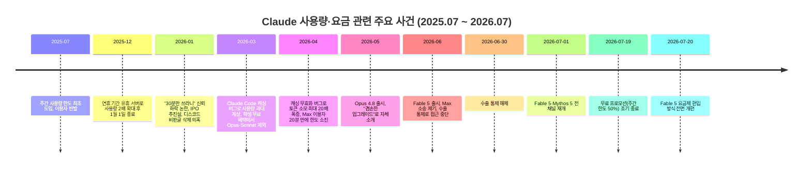

## 이 글을 시작하기 전에

> 
> 진지하게 고민된다. Fable5가 결국 알잘딱은 여전히 최고지만, 너무 사용량을 적게 제공하고 비싸다. Opus5는 희대의 망작으로 돌아와서 게임개발 같은상황에서는 진짜 구조 파괴도 너무 잦아져서 스트레스 받는다.
> 
> 나는 마케팅실무, 마케팅툴, 블렌더, 언리얼 기반의 게임제작 등 다양한 도메인에서 활용을 하고 있는데, 웹기반+일반사무작업에서나 Opus를 요새 깔짝쓰게되고 대부분의 업무에서는 gpt를 활용하게 되고 있다.
> 
> 솔직히 리셋때문에 계속 쓰니까 gpt 특유의 손 많이 가는 느낌도 어떻게 하네싱하면 되는지 감도 잡았다보니 사실상 클로드를 gpt 다쓰면 쓰는 그림으로 가고 있다. 진지하게 fable5의 비용이나 유저 간보기식 클로드의 반년 동안의 행보까지 겹쳐봤을 때 구독을 gpt에 2개 하는 것도 고민을 많이 하게 된다.
> 
>  https://www.threads.com/share/_1rblebWv/
> 

공유해주신 `threads.com/share/_1rblebWv` 링크는 Threads 측이 자동화된 도구의 접근을 막아두고 있어, 해당 게시물의 원문을 직접 열람하지는 못했습니다. 대신 본문에 직접 남겨주신 내용 — Fable 5의 비용과 사용량, Opus 4.8의 코딩 안정성, 마케팅·블렌더·언리얼 기반 게임 제작이라는 세 가지 업무 영역, 그리고 GPT로의 실질적 이동 — 을 하나하나 검증 가능한 최신 자료와 대조하며 정리했습니다. 검증된 사실과 개인적 체감·주관적 평가는 구분해서 표시했으니, 마지막 장의 "사실관계 정리"를 함께 참고해 주시면 좋겠습니다.

---

## 목차

1. 지금 벌어지고 있는 일: 세 모델, 세 가지 불만
2. Claude Fable 5란 무엇이고 왜 "비싸다"는 평가가 나오는가
3. 반년간 이어진 Claude 사용량 논쟁 타임라인
4. Claude Opus 4.8: 벤치마크는 오르는데 왜 실사용에서는 답답한가
5. 마케팅·블렌더·언리얼 워크플로우에서 체감되는 문제
6. GPT로 옮겨가는 실무자들, 무엇이 다른가
7. 구독 구조를 다시 짤 때 따져볼 것들
8. 사실관계 정리: 검증된 것과 확인되지 않은 것

---

## 1장. 지금 벌어지고 있는 일: 세 모델, 세 가지 불만

정리하신 상황을 그대로 옮기면 이렇습니다. 최상위 모델인 Fable 5는 성능 자체는 여전히 최고 수준이라고 인정하면서도 사용량이 지나치게 적고 비용이 부담스럽다는 평가, 그 아래 주력 모델인 Opus 4.8은 오히려 이전보다 코드 구조를 깨뜨리는 빈도가 늘어 게임 개발 같은 복잡한 작업에서 스트레스를 유발한다는 평가, 그리고 그 결과로 웹 기반 사무 작업에서만 Opus를 가볍게 쓰고 대부분의 실무는 GPT로 넘어가고 있다는 흐름입니다. 여기에 GPT 특유의 잦은 리셋과 손이 많이 가는 특성에도 나름의 대응 요령이 생겼다는 점, 그리고 지난 半年 동안 Anthropic이 사용자를 대하는 방식 자체에 대한 피로가 겹쳐 있다는 맥락도 담겨 있었습니다.

이 세 가지는 서로 다른 이야기처럼 보이지만, 실제로는 하나로 이어져 있습니다. Fable 5의 가격 정책, Opus 4.8의 릴리스 성격, 그리고 지난 반년간 반복된 사용량 관련 논란은 모두 Anthropic이 폭증하는 컴퓨팅 수요와 수익성 사이에서 균형을 잡으려 시도해 온 과정에서 나온 결과물입니다. 아래에서 각각을 순서대로 짚어보겠습니다.

---

## 2장. Claude Fable 5란 무엇이고 왜 "비싸다"는 평가가 나오는가

Fable 5는 2026년 6월 9일 공개된 모델로, Anthropic이 Opus보다 위에 새로 만든 "Mythos급" 티어의 첫 일반 공개판입니다. 같은 기반 모델을 승인된 소수 조직에만 배포한 버전이 Mythos 5이고, 여기에 생물학·사이버보안·모델 자체 연구개발(R&D) 영역에서 추가 안전장치를 얹어 일반 사용자에게 연 것이 Fable 5입니다.[1][3]

가격만 놓고 보면 체감이 왜 이렇게 큰지 이해가 됩니다. API 기준으로 Fable 5는 입력 100만 토큰당 10달러, 출력 100만 토큰당 50달러인데, 이는 Opus 4.8의 정확히 두 배입니다. TechCrunch는 이 가격이 경쟁 모델인 GPT-5.5 입력 토큰 가격의 두 배에 해당한다고 지적하기도 했습니다.[1] 여기에 잘 알려지지 않은 변수가 하나 더 있는데, Fable 5는 새로운 토크나이저를 사용해서 같은 분량의 텍스트라도 이전 Claude 모델보다 약 30% 더 많은 토큰으로 계산됩니다. 즉 표시 가격이 두 배여도 실제 체감 비용은 그 이상으로 올라갈 수 있다는 뜻입니다.[2]

| 항목 | Opus 4.8 | Fable 5 |
|---|---|---|
| 입력 100만 토큰당 | 5달러 | 10달러 |
| 출력 100만 토큰당 | 25달러 | 50달러 |
| 토크나이저 특성 | 기존 방식 | 동일 텍스트 기준 약 30% 더 많은 토큰 소모[2] |

구독 플랜 안에서의 취급도 사용량이 적다는 체감을 뒷받침합니다. Max 플랜, Team 프리미엄 시트, 좌석형 Enterprise 프리미엄 시트에서는 주간 사용 한도의 최대 50%까지만 Fable 5로 쓸 수 있고, 그 한도를 넘기면 별도의 사용 크레딧을 결제하거나 다른 모델로 전환해야 합니다. 게다가 Fable 5는 같은 주간 한도를 다른 모델보다 훨씬 빠르게 소모하는 특성이 있습니다.[4][5] 실제로 IT 매체 BleepingComputer는 월 100달러짜리 Max 구독이 고강도 테스트에서 단 9분 만에 한도가 소진됐다고 보도했고, 개발자 사이먼 윌리슨(Simon Willison)은 Max 구독 범위 안에서 하루에 110달러어치 토큰을 써버렸다고 공개적으로 밝혔습니다.[2]

이런 반응 때문에 커뮤니티에서는 "일상 작업은 Sonnet 5로, 성능 격차가 결과물에서 실제로 드러나는 어려운 작업에만 Fable 5를 선별적으로 쓰라"는 조언이 반복해서 나오고 있습니다. 정리하면 Fable 5의 절대적인 성능은 인정받고 있지만, 비용과 접근성 측면에서는 물음표가 계속 남아 있는 상태입니다.[4] "알잘딱은 최고지만 사용량이 너무 적고 비싸다"는 평가는 이런 배경에서 나온, 근거가 명확한 판단이라고 볼 수 있습니다.

---

## 3장. 반년간 이어진 Claude 사용량 논쟁 타임라인

Fable 5 하나만 놓고 보면 단발성 이슈처럼 보이지만, 지난 반년의 흐름을 놓고 보면 패턴이 보입니다. 2025년 7월 이용자의 주간 한도를 갑작스럽게 도입한 것을 시작으로, 사용량과 관련된 크고 작은 논란이 거의 매달 반복되어 왔습니다.

이 타임라인에서 몇 가지 사건은 짚고 넘어갈 필요가 있습니다.

**2026년 1월, "30분만 쓰라니" 사태.** 연휴 기간 기업 고객의 휴가로 남는 서버 용량을 활용해 일시적으로 사용량을 두 배로 늘렸다가 1월 1일자로 보너스 이벤트를 종료하자, Max 플랜 구독자들 사이에서 "토큰 한도가 30분 만에 소진됐다"는 글이 쏟아졌습니다. 이 과정에서 일각에서는 Anthropic이 기업공개(IPO)를 앞두고 비용을 절감하려는 것 아니냐는 의혹이 제기됐고, 디스코드 채널 관리자가 비판 글을 삭제하고 있다는 주장까지 나오며 파장이 커졌습니다. Anthropic 측은 삭제·검열 의혹을 부인하고 커뮤니티 정책 위반에 따른 조치였다고 해명했습니다.[18]

**2026년 3~4월, 캐싱 버그로 인한 한도 급감.** Claude Code 내부에서 프롬프트 캐싱을 무효화하는 버그가 발견되면서, 특정 조건이 맞물리면 캐시가 깨져 토큰 소모량이 최대 20배까지 폭증하는 문제가 보고됐습니다. 월 200달러짜리 Max 플랜 사용자조차 단 20분 만에 사용량 제한에 걸리는 사례가 이어졌고, Anthropic도 "사용자들이 예상보다 훨씬 빠르게 한도에 도달하고 있다"는 사실을 인정하며 최우선 과제로 조사에 나섰습니다.[16][17]

**2026년 6월 14일, Max 플랜 집단소송.** 워싱턴 D.C.에 거주하는 이용자 칼 칸(Karl Kahn)이 캘리포니아 북부지방법원에 Anthropic을 상대로 제기한 소송입니다. Max 5x(월 100달러)와 Max 20x(월 200달러) 플랜이 각각 Pro 대비 5배, 20배의 사용량을 제공한다고 광고했지만 실제로는 Max 5x가 약 3.5배, Max 20x가 6~8배 수준에 그친다는 것이 핵심 주장입니다. 소장에는 Max 20x가 "50% 절약"이라는 표현으로 소비자를 유인했다는 주장도 포함돼 있습니다. 이 소송은 집단소송(class action) 지위를 요청한 상태이며, 이 글을 쓰는 시점 기준으로 아직 최종 판결이 나지 않았습니다.[19][20]

**2026년 6월 12~30일, Fable 5·Mythos 5 접근 중단.** 미국 상무부의 수출 통제 요건을 준수하기 위해 외국 국적자의 접근을 실시간으로 걸러내기 어렵다는 이유로, Anthropic은 전 사용자를 대상으로 Fable 5와 Mythos 5 접근을 일시 중단했습니다. 6월 30일 상무부가 관련 통제를 해제하면서 7월 1일부터 Claude.ai, Claude Code, 코워크 등 전 채널에서 재개됐습니다.

이렇게 늘어놓고 보면, "지난 반년간 사용자를 간보는 듯한 행보"라는 인상이 완전히 근거 없는 감정만은 아니라는 점을 알 수 있습니다. 다만 이 사건들이 모두 "의도적으로 사용자를 속이려는 정책"이었다고 단정할 근거는 없다는 점도 함께 짚어야 합니다. 캐싱 버그처럼 명백한 기술적 결함이 원인인 경우도 있고, 소송은 아직 진행 중이라 법원의 최종 판단이 나오지 않았습니다. "체감상 신뢰가 떨어졌다"는 것은 합리적인 개인적 평가이지만, "회사가 고의로 사용량을 부풀려 팔았다"는 것은 현재로서는 원고 측의 주장이지 확정된 사실은 아닙니다.

---

## 4장. Claude Opus 4.8: 벤치마크는 오르는데 왜 실사용에서는 답답한가

Opus 4.8은 2026년 5월 28일 공개된 모델로, Opus 4.7을 기반으로 코딩·에이전트 작업·추론 능력을 한 단계 끌어올린 점진적 업데이트(포인트 릴리스)입니다. 흥미로운 점은 Anthropic 스스로 이 모델을 "겸손하지만 체감할 수 있는 개선(modest but tangible improvement)"이라고 소개했다는 것입니다. 자사 모델을 이렇게 낮춰 소개하는 경우는 업계에서 드문 일입니다.[7]

벤치마크 수치만 보면 개선은 분명합니다. 실제 오픈소스 저장소의 GitHub 이슈를 처음부터 끝까지 해결하는 SWE-bench Pro에서 Opus 4.8은 69.2%를 기록해 전작보다 4.9%포인트, GPT-5.5보다 10.6%포인트 앞섰습니다. 자신이 작성한 코드의 결함을 지적 없이 그냥 넘기는 빈도도 전작 대비 약 4배 줄어, Anthropic은 이 모델을 "가장 정직한 모델"이라고 표현하기도 했습니다.[8][7] 반면 터미널에서 명령을 직접 치고 에러를 해결하는 Terminal-Bench 2.1에서는 GPT-5.5가 78.2%로 여전히 1위를 지켰고, Opus 4.8은 66.1%에서 74.6%로 크게 따라붙었지만 순위를 뒤집지는 못했습니다.[8]

정리하면 작업의 종류에 따라 우열이 갈립니다. 여러 파일을 동시에 건드리는 저장소 단위의 실무형 개발이나 에이전트가 스스로 오래 작업을 이어가야 하는 자율 작업에서는 Opus 4.8이 유리하고, 셸 명령을 빠르게 조합하는 단발성 터미널 작업에서는 GPT-5.5도 충분히 경쟁력이 있다는 것이 여러 비교 분석의 공통된 결론입니다.[9]

그런데 벤치마크와 별개로, 실사용 커뮤니티의 반응은 출시 직후부터 갈렸습니다. 코딩이 좋아졌다는 반응과 오히려 답답해졌다는 반응이 동시에 나오는 현상이 관측됐고, 실무 진영에서는 출시와 함께 Claude Code에서 "thinking 블록을 수정할 수 없다"는 오류가 발생해 장시간 세션이 끊기는 문제가 보고되기도 했습니다.[19][10] 이런 엇갈린 평가가 왜 나오는지에 대한 한 가지 설명은, Opus 4.8이 이전 모델보다 훨씬 더 자율적으로 동작하도록 설계됐다는 점에 있습니다. 공식 프롬프팅 가이드에 따르면 Opus 4.8은 작업·의도·제약 조건을 처음부터 명확하게 지정해줄 때 성능을 최대로 발휘하도록 만들어졌고, 반대로 여러 차례에 걸쳐 모호하게 지시가 누적되는 방식으로 쓰면 토큰 효율성뿐 아니라 결과물의 품질도 떨어지는 경향이 있다고 명시돼 있습니다.[6] 즉 이전 버전에 맞춰져 있던 작업 방식이나 코드 리뷰 습관을 그대로 유지하면, 모델이 바뀐 것 이상으로 체감 성능이 떨어지는 것처럼 느껴질 여지가 있다는 것입니다.

---

## 5장. 마케팅·블렌더·언리얼 워크플로우에서 체감되는 문제

여기서부터는 조심스럽게 짚어야 할 부분입니다. Opus 4.8을 언리얼 엔진 기반 게임 제작이나 블렌더 작업에 활용할 때 구조 파괴가 유독 잦아졌다는 보고는, 공개된 자료를 통해 별도로 확인되는 사례가 없습니다. Anthropic의 공식 발표나 주요 매체의 리뷰는 대부분 웹 애플리케이션·백엔드 리팩토링·오픈소스 저장소 수정 같은 일반적인 소프트웨어 개발 시나리오를 기준으로 작성돼 있고, 3D 콘텐츠 제작 파이프라인이나 게임 엔진 특유의 씬 그래프·에셋 참조 구조에 대한 별도의 벤치마크나 사용기는 확인되지 않았습니다.

다만 앞장에서 짚은 두 가지 구조적 특성은 게임 개발 워크플로우에서 왜 문제가 더 도드라질 수 있는지를 설명해줄 수 있는 단서는 됩니다. 첫째, Opus 4.8은 이전 모델보다 자율성이 높아진 만큼, 작업 범위와 제약을 처음부터 정확히 지정해주지 않으면 모델이 스스로 판단해서 손대는 범위가 넓어지는 경향이 있습니다. 블렌더의 노드 그래프나 언리얼의 블루프린트·레벨 구조처럼 파일 하나가 여러 시스템에 걸쳐 참조되는 환경에서는, 코드 텍스트만 보고 안전하다고 판단한 변경이 실제로는 씬이나 에셋 참조 관계를 깨뜨릴 위험이 상대적으로 큽니다. 둘째, 이런 도구들은 Git 기반의 텍스트 diff만으로 변경 사항을 완전히 검증하기 어려운 바이너리·씬 파일 구조를 포함하는 경우가 많아서, 코드 결함을 4배 더 잘 잡아낸다는 Opus 4.8의 개선점이 게임 개발 파이프라인에서는 상대적으로 덜 발휘될 가능성도 있습니다. 이 두 가지는 논리적으로 설명이 가능한 가설이며, 실제로 그렇다고 확정할 수 있는 정량적 근거는 아직 없다는 점을 분명히 해 둡니다.

반대로 검증되는 사실은, GPT-5.5·5.6 계열이 터미널 중심의 단발성 작업이나 범용적인 도구 활용에서 상대적으로 강점을 보인다는 점입니다.[9][11] 마케팅 실무처럼 문서 작성·데이터 정리·다양한 SaaS 툴 연동이 뒤섞인 업무, 그리고 블렌더·언리얼처럼 명령이 파편적이고 반복적인 작업에서는 "한 번에 큰 리팩토링을 자율적으로 수행하는" Opus 4.8의 설계 철학보다, 짧고 명확한 지시에 즉각 반응하는 방식이 오히려 더 잘 맞는다고 느껴질 수 있습니다. GPT 특유의 "리셋이 잦고 손이 많이 간다"는 특성이, 역설적으로 세밀한 통제가 필요한 작업에서는 장점으로 작용했을 가능성이 있다는 뜻입니다.

---

## 6장. GPT로 옮겨가는 실무자들, 무엇이 다른가

2026년 하반기 현재 AI 모델 시장을 정리한 여러 비교 자료들의 공통된 결론은, 만능 1등 모델은 없고 작업의 종류가 정답을 결정한다는 것입니다. 코딩과 긴 호흡의 작업은 Claude, 에이전트·범용성·가성비의 조합은 GPT-5.6, 멀티모달과 대량 처리는 제미나이라는 식으로 큰 지형도가 그려지고 있습니다.[11]

구독료 자체는 업계 전반이 비슷한 수준으로 수렴하고 있습니다. 2026년 7월 기준 ChatGPT Plus, Claude Pro, Google AI Pro, Perplexity Pro가 모두 월 20달러 안팎에 맞춰져 있고, 저가형 진입 장벽으로 OpenAI는 8달러짜리 ChatGPT Go를, Google은 10달러 미만의 AI Plus를 각각 운영하고 있습니다. 반대로 헤비 유저를 위한 100~200달러대 프리미엄 티어도 공통적으로 등장했습니다.[14] 다만 무료 이용자 입장에서는 2025년 8월 무료 티어에서 GPT-4o가 제거되면서 유료 전환 압박이 커진 것도 사실이고, 학생 할인 측면에서는 Claude가 2026년 3월부터 Opus·Sonnet 모델을 무료 학생 혜택에서 제외해 자동 모드의 경량 모델만 쓸 수 있게 제한한 변화도 있었습니다.[12][13]

이 맥락에서 "GPT를 두 개 구독하는 것도 고민된다"는 선택은 숫자로만 보면 아주 이상한 결정은 아닙니다. GPT Plus 두 계정을 굴려도 월 40달러 수준이라 Claude Max 한 계정(100~200달러)보다 오히려 저렴하고, 무엇보다 잦은 리셋이라는 단점에 이미 대응 방법을 익힌 상태라면 체감 손해가 크지 않을 수 있습니다. 다만 이 경우 두 계정 사이의 컨텍스트 공유, 프로젝트 히스토리 관리, 그리고 마케팅·블렌더·언리얼처럼 서로 다른 성격의 작업을 계정 두 개로 어떻게 분리 운용할 것인지에 대한 워크플로우 설계가 별도로 필요합니다. 이는 순수하게 비용 문제라기보다 운영 방식의 문제에 가깝습니다.

---

## 7장. 구독 구조를 다시 짤 때 따져볼 것들

지금까지의 내용을 종합하면, 구독을 재구성할 때 확인해볼 만한 지점은 크게 세 가지로 정리됩니다.

첫째는 작업 유형별 실제 소요 비용입니다. Fable 5는 판단이 필요한 어려운 문제에만 선별적으로 쓰고, 반복적인 실행 작업은 Opus나 Sonnet급으로 내리는 "판단은 비싼 모델, 실행은 싼 모델" 전략이 커뮤니티에서 이미 표준처럼 자리잡고 있습니다. 지금 겪고 계신 것처럼 웹·사무 작업에서만 Opus를 가볍게 쓰는 패턴이라면, 애초에 Fable 5나 Max 플랜의 고비용 구조가 필요하지 않을 가능성도 있습니다.[4]

둘째는 도구별 강점의 재확인입니다. 3장·5장에서 짚었듯, 저장소 단위의 대규모 자율 작업은 Claude 계열이, 짧고 명확한 지시에 즉각 반응해야 하는 파편적 작업은 GPT 계열이 상대적으로 강점을 보인다는 것이 현재까지 검증 가능한 자료들의 공통된 방향입니다. 마케팅 실무와 블렌더·언리얼 작업이 후자에 가깝다면, 지금 자연스럽게 GPT 비중이 늘고 있는 흐름은 도구 선택 관점에서 합리적인 결과로 볼 수 있습니다.

셋째는 신뢰 문제와 성능 문제를 분리해서 판단하는 것입니다. Max 플랜 집단소송과 반년간의 사용량 관련 논란은 Anthropic의 커뮤니케이션과 정책 운영에 대한 신뢰 문제이고, Opus 4.8이 특정 작업에서 답답하게 느껴지는 것은 별개의 성능·적합성 문제입니다. 두 가지가 겹쳐서 "총체적으로 지쳤다"는 감정으로 이어지는 것은 자연스럽지만, 실제 구독 결정을 내릴 때는 두 축을 나눠서 "이 문제는 요금제를 바꾸면 해결되는가, 아니면 다른 모델로 옮겨야 해결되는가"를 따로 물어보는 편이 더 명확한 답을 줄 수 있습니다.

---

## 8장. 사실관계 정리: 검증된 것과 확인되지 않은 것

**검증된 사실**
- Fable 5는 2026년 6월 9일 출시됐고, API 가격은 입력 100만 토큰당 10달러, 출력 50달러로 Opus 4.8의 정확히 두 배다.[1]
- Fable 5는 새 토크나이저로 인해 같은 텍스트도 약 30% 더 많은 토큰으로 계산된다.[2]
- Max 플랜 등에서 Fable 5는 주간 한도의 최대 50%까지만 무료로 쓸 수 있고, 다른 모델보다 한도를 빠르게 소모한다.[4][5]
- Fable 5·Mythos 5는 2026년 6월 12일 수출 통제 문제로 전 사용자 접근이 중단됐고, 6월 30일 통제 해제 후 7월 1일 재개됐다.
- Opus 4.8은 2026년 5월 28일 출시된 점진적 업데이트로, Anthropic 스스로 "겸손한 개선"이라 표현했다. SWE-bench Pro 등 일부 벤치마크는 개선됐지만 Terminal-Bench에서는 GPT-5.5에 여전히 뒤처진다.[7][8]
- 2026년 6월 14일 Max 5x·20x 플랜의 사용량 과장 광고를 이유로 집단소송이 제기됐으며, 이 글 작성 시점 기준 최종 판결은 나오지 않았다.[19][20]
- 2025년 7월 주간 한도 도입 이후 2026년 1월, 3월, 4월에 걸쳐 사용량 관련 크고 작은 논란이 반복됐다.[16][17][18]

**확인되지 않은 것 (개인 경험·주관적 평가로 남겨둘 부분)**
- Opus 4.8이 언리얼 엔진·블렌더 기반 게임 제작에서 구조 파괴를 유독 자주 일으킨다는 주장은, 공개된 벤치마크나 매체 보도로는 별도 확인이 되지 않는다. 게임·3D 파이프라인에 특화된 공식 평가 자료 자체가 아직 없기 때문이다.
- Anthropic의 지난 반년 행보가 "의도적으로 사용자를 간보는" 정책이었는지는 검증 불가능한 해석의 영역이다. 캐싱 버그처럼 기술적 결함이 원인으로 확인된 사례와, 소송처럼 아직 법적 판단이 나지 않은 사안이 섞여 있다.
- GPT로 실무 대부분이 이동한 것이 장기적으로 더 나은 선택인지는 순수하게 개인의 워크플로우와 비용 감수성에 달린 문제로, 일반화된 정답은 없다.

---

## 참고문헌

[1] Yellow News, "Claude Fable 5, Opus의 두 배 가격…6월 22일까지는 무료 유지" — https://yellow.com/ko/news/claude-fable-5-opus%EC%9D%98-%EB%91%90-%EB%B0%B0-%EA%B0%80%EA%B2%A9%E2%80%A66%EC%9B%94-22%EC%9D%BC%EA%B9%8C%EC%A7%80%EB%8A%94-%EB%AC%B4%EB%A3%8C-%EC%9C%A0%EC%A7%80

[2] 퀀텀점프클럽, "Claude Fable 5 요금제 편입 총정리: 2026년 7월 20일부터 이렇게 달라집니다" — https://qjc.app/blog/anthropic-fable-availability

[3] 오픈위키, "클로드 Fable 5 사용법과 요금" — https://wikidocs.net/blog/@openwiki/22388/

[4] platform.flow.team, "클로드 Fable 5 완벽 정리 2026" — https://platform.flow.team/blog/claude-fable-5-guide-2026

[5] Anthropic 지원 센터, "당신의 플랜에서 Claude Fable 5" — https://support.claude.com/en/articles/15424964-claude-fable-5-on-your-plan

[6] Claude Platform Docs, "Claude Opus 4.8 프롬프팅" — https://platform.claude.com/docs/ko/build-with-claude/prompt-engineering/prompting-claude-opus-4-8

[7] 박재홍의 실리콘밸리, "Claude Opus 4.8, '겸손한 업그레이드'가 던지는 진짜 질문" — https://wikidocs.net/blog/@jaehong/15318/

[8] gpters, "Claude OPUS 4.8 업데이트 총정리" — https://www.gpters.org/news/post/claude-opus-48-update-wyVStTQfuxkBa5m

[9] 인사이트 브리지, "클로드 오퍼스 4.8 코딩, GPT-5.5보다 진짜 나은가 따져봤습니다" — https://wikidocs.net/blog/@insightbridge/17294/

[10] Threads(@choi.openai), Opus 4.8 실사용 평가 스레드 — https://www.threads.com/@choi.openai (커뮤니티 반응 요약, 원문 직접 인용 아님)

[11] 오픈위키, "AI 모델 비교 2026: 클로드·GPT·제미나이·그록" — https://wikidocs.net/blog/@openwiki/23256/

[12] GamsGo, "클로드 할인 완벽 가이드 2026" — https://www.gamsgo.com/ko/blog/%ED%81%B4%EB%A1%9C%EB%93%9C-%ED%95%A0%EC%9D%B8

[13] 다사자, "ChatGPT·AI 구독 싸게 쓰는 법 총정리 — 2026년 3월 최신" — https://dasaja.co.kr/saja_guide/30

[14] nextplatform, "GPT, Gemini, Claude 요금제 비교 (2026년 2/4분기)" — https://nextplatform.net/gpt-vs-gemini-vs-claude-subcription-plan-comparison/

[15] 뉴스1, "'돈냈는데 30분만 쓰라니'…클로드 토큰 논란에 앤트로픽 신뢰 뚝" — https://www.news1.kr/it-science/general-it/6032972

[16] Threads(@choi.openai), Max 사용자 20분 만에 한도 소진 스레드 — https://www.threads.com/@choi.openai (커뮤니티 반응 요약)

[17] 박재홍의 실리콘밸리, "Claude Code 사용량 한도, 왜 이렇게 빨리 소진되나" — https://wikidocs.net/blog/@jaehong/10472/

[18] 뉴스1, 위 15번과 동일 기사 — https://www.news1.kr/it-science/general-it/6032972

[19] Engadget, "Anthropic hit with lawsuit over its Claude Max usage limits" — https://www.engadget.com/2194626/anthropic-hit-with-lawsuit-over-its-claude-max-usage-limits/

[20] TechTimes, "Claude Max Lawsuit Accuses Anthropic of Overselling 20x Usage as Credit Caps Begin" — https://www.techtimes.com/articles/318442/20260615/claude-max-lawsuit-accuses-anthropic-overselling-20x-usage-credit-caps-begin.htm

[21] Anthropic, Fable 5·Mythos 5 접근 재개 공식 성명 — https://www.anthropic.com/news/fable-mythos-access
