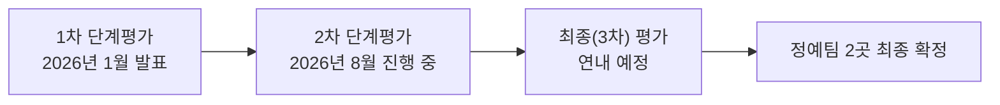

*작성 기준일: 2026년 8월 13일*

## 관련글

[**'국가대표 AI' 국민 오디션 — 독파모 2차 평가, 무엇을 보여줬나**](https://k82022603.github.io/posts/%EA%B5%AD%EA%B0%80%EB%8C%80%ED%91%9C-ai-%EA%B5%AD%EB%AF%BC-%EC%98%A4%EB%94%94%EC%85%98-%EB%8F%85%ED%8C%8C%EB%AA%A8-2%EC%B0%A8-%ED%8F%89%EA%B0%80,-%EB%AC%B4%EC%97%87%EC%9D%84-%EB%B3%B4%EC%97%AC%EC%A4%AC%EB%82%98/)

---

## 목차

1. 들어가며 — 독파모 프로젝트란 무엇인가
2. 1차 단계평가 되짚어보기 — 네이버의 이변과 모티프의 합류
3. 2차 단계평가의 구조 — 무엇이 달라졌나
4. 2차 평가 참가 4개사와 모델 소개
5. 논란의 핵심 ① — AAII 9개 지표, 회사마다 다른 반영률
6. 논란의 핵심 ② — 체급이 다른 모델들을 어떻게 비교할 것인가
7. 논란의 핵심 ③ — 전문가·국민평가가 벤치마크 편차를 상쇄할 수 있는가
8. '벤치맥싱' 의혹과 4개사의 반박
9. 최신 동향 — AAII 점수 공개와 발표 임박
10. 앞으로의 일정
11. 정리 및 시사점
12. 사실관계 확인 노트
13. 참고자료

---

## 1. 들어가며 — 독파모 프로젝트란 무엇인가

독파모는 '독자 AI 파운데이션 모델(Independent AI Foundation Model)' 프로젝트의 앞 글자를 딴 줄임말이다. '파운데이션'이 영어 'Foundation'을 소리 나는 대로 옮긴 말인 만큼 한자어는 아니며, 순수하게 정부·업계에서 통용되는 사업명 약칭이다. 정부가 해외 빅테크에 대한 의존도를 낮추고 국내 기술로 세계 수준의 자체 대규모언어모델을 확보하기 위해 추진하는 국가 전략 사업으로, 과학기술정보통신부와 정보통신산업진흥원(NIPA)이 주관한다.[11] 사업 초기에는 국산 AI 모델의 성능을 끌어올려 공공서비스와 산업의 AI 전환(AX)을 뒷받침하는 것이 핵심 목표였고, 정부가 정예팀에 지원하기로 한 규모는 약 5,300억 원 수준으로 알려져 있다.[5]

이 프로젝트가 시작된 이후 AI 업계의 패러다임 자체가 크게 바뀌었다는 점도 짚어둘 필요가 있다. 빅테크를 중심으로 에이전틱 AI가 빠르게 확산되면서 실제 업무와 생산 현장에 AI를 투입해 생산성을 높이려는 흐름이 강해졌고, 여기에 더해 미국 정부가 앤트로픽의 최상위 모델에 대한 수출 통제를 단행하고 중국 역시 AI 통제 가능성을 내비치는 등 대외 환경의 불확실성도 커졌다. 이런 배경 속에서 정부는 독자 모델 확보, 이른바 '소버린(주권) AI' 역량 구축의 중요성이 초기 구상보다 한층 커졌다고 보고 있으며, 배경훈 부총리 겸 과학기술정보통신부 장관도 추가 투자 필요성을 강조해온 것으로 전해진다.[5]

독파모는 한 번의 평가로 끝나는 사업이 아니라 여러 단계를 거치며 참가팀을 압축해 나가는 구조로 설계돼 있다. 아래 그림은 지금까지 확인된 단계별 흐름을 정리한 것이다.

## 2. 1차 단계평가 되짚어보기 — 네이버의 이변과 모티프의 합류

2차 평가를 제대로 이해하려면 1차 단계평가 결과를 먼저 짚어볼 필요가 있다. 1차 평가에는 네이버클라우드, 업스테이지, SK텔레콤, NC AI, LG AI연구원 등 5개사가 참여했다.[9][31] 평가는 벤치마크 40점, 전문가 평가 35점, 사용자 평가 25점의 100점 만점 구조로 진행됐으며, 성능뿐 아니라 산업 현장 활용 가능성, 비용 효율성, 파급효과 등을 종합적으로 살폈다.[31]

결과는 이변으로 기록됐다. 통과가 유력해 보였던 네이버(네이버클라우드)가 탈락한 것이다. 원인은 모델의 '독자성' 논란이었다. 즉 처음부터 자체적으로 개발한 모델인지 여부를 둘러싼 검증에서 문제가 제기됐고, NC AI와 함께 2차 진출에 실패했다.[9] 당시 류제명 과기정통부 2차관은 브리핑에서 LG AI연구원이 90.2점으로 최고점을 받았고 5개 정예팀의 평균 점수는 79.7점이었다고 밝혔다. 다만 기업별 세부 점수는 기업이 입을 수 있는 피해를 고려해 공개하지 않기로 했다고 설명했다.[9]

이렇게 SK텔레콤, 업스테이지, LG AI연구원 3개사만 남게 되자 정부는 공석이 된 자리를 추가 공모로 채우기로 했고, 이 절차를 거쳐 모티프테크놀로지스가 새롭게 합류했다.[9][5] 이로써 2차 단계평가는 LG AI연구원, SK텔레콤, 업스테이지, 모티프테크놀로지스 4개 팀 체제로 진행되게 됐다.

## 3. 2차 단계평가의 구조 — 무엇이 달라졌나

1차 평가가 모델 자체의 기술적 완성도와 '독자 개발 여부'를 검증하는 데 무게를 뒀다면, 2차 평가는 실제 업무를 수행하는 AI 에이전트로서의 역량과 산업 현장 적용 가능성, 개방성과 생태계 확장성에 초점을 맞추고 있다.[2][20] 배점 구조 자체의 큰 틀, 즉 벤치마크 40점·전문가 평가 35점·사용자 평가 25점이라는 100점 만점 체계는 1차와 마찬가지로 유지됐다.[7]

가장 눈에 띄는 변화는 '국민평가단'의 신설이다. 정부는 성별과 연령대 비율을 인구통계에 맞춰 구성한 일반 국민 200명을 평가단으로 선정해, 8월 8일부터 11일까지 4개 팀의 모델을 직접 사용해보고 절대평가 방식으로 점수를 매기도록 했다.[7][17] 이 국민평가 결과는 기존의 벤치마크·전문가 평가 점수와 합산돼 최종 사용자 평가 점수를 구성하게 된다.[2] 즉 2차 평가에서 '사용자 평가 25점'은 전문가평가 성격과 일반 국민 체감도가 함께 반영되는 항목으로 확장된 셈이다.

벤치마크 40점의 내부 구성도 좀 더 세분화됐다. 40점 가운데 25점은 글로벌 지표인 아티피셜 애널리시스 인텔리전스 인덱스(AAII, Artificial Analysis Intelligence Index)가 차지하고, 나머지 15점은 한국지능정보사회진흥원(NIA)이 만든 자체 벤치마크가 차지하는 것으로 알려졌다.[1][3] 특히 이번에는 각 기업이 자체적으로 AAII 평가를 의뢰해 결과를 제시하던 기존 관행과 달리, 정부가 직접 Artificial Analysis 측에 평가를 의뢰해 국내 4개 모델을 동일한 잣대로 채점하도록 한 점이 특징이다.[3]

## 4. 2차 평가 참가 4개사와 모델 소개

4개 팀은 서로 다른 기술 전략을 앞세우고 있다. LG AI연구원은 모델 규모 자체를 크게 키우는 전략을 택했다. 2차 평가에 제출한 'K-엑사원 2.0(K-EXAONE 2.0)'은 총 매개변수 약 7,500억 개(750B) 규모로, 1차 모델(236B) 대비 3배 이상 확장됐으며 국내 참가 모델 중 가장 크다. 회사 측 설명에 따르면 24개 벤치마크 지표 평균 점수가 1차 당시 63.3점에서 70.1점으로 올랐고, 코딩과 에이전틱 코딩 관련 지표는 약 30% 개선됐다고 한다.[20]

SK텔레콤은 산업 현장 실증과 운영 효율성에 방점을 찍었다. 매개변수 약 6,880억 개(688B) 규모의 'A.X K2'에는 긴 문맥에서 필요한 정보만 골라내는 자체 기술인 'SGA(Sparse Gated Attention)' 아키텍처가 적용됐다.[9]

업스테이지는 총 매개변수 약 2,500억 개(250B) 규모의 'Solar Open 2'를 내세웠다. 다만 MoE(전문가 혼합) 구조를 채택해 실제 추론 시 활성화되는 매개변수는 약 15억 개 수준으로 훨씬 작다.[3] 업스테이지는 기업들이 AI를 도입할 때 느끼는 장벽을 낮추는 효율성을 경쟁력으로 제시하고 있다.[9]

가장 늦게 합류한 모티프테크놀로지스는 매개변수 약 3,140억 개(314B) 규모의 MoE 모델 '모티프 3'를 선보였다. 회사 측은 30명 규모의 조직이 약 5개월 동안 GPU 700여 장으로 프리뷰 모델을 만들었다고 설명하며, 글로벌 선도 모델과의 기술 격차를 3~5개월 수준까지 좁혔다고 밝혔다.[14][12] 다만 지금까지 공개된 결과는 최종 제출 모델이 아닌 프리뷰 모델 기준이라는 점, 국민 대상 서비스나 산업 적용 사례가 다른 팀보다 상대적으로 구체성이 낮다는 점은 약점으로 지적된다.[12]

## 5. 논란의 핵심 ① — AAII 9개 지표, 회사마다 다른 반영률

이번 2차 평가를 둘러싼 첫 번째 쟁점은 AAII 벤치마크의 반영 방식이다. 정부가 참고한 AAII(v4.1.1 기준)는 GDPval-AA v2, 타우3(τ³)-뱅킹, 터미널벤치(Terminal-Bench) 2.1, 사이코드(SciCode), 인류의 마지막 시험(HLE), GPQA 다이아몬드, CritPt, AA-Omniscience, AA-LCR 등 총 9개 세부 지표로 구성된다.[1]

그런데 4개사가 공개한 테크 리포트를 기준으로 보면 이 9개 지표를 모두 반영해 성과를 공개한 곳은 모티프테크놀로지스의 '모티프 3'가 유일했다. 나머지는 K-엑사원 2.0이 6개, 솔라 오픈 2가 5개, A.X K2가 4개 순으로 지표 반영 개수가 적었으며, 특히 A.X K2의 반영률이 가장 낮은 것으로 나타났다.[1]

문제는 단순히 반영된 지표 개수의 차이만이 아니다. 이번 2차 평가가 에이전트 업무 수행 능력에 특히 비중을 둔 만큼, 관련성이 높은 지표로는 GDPval-AA v2, 타우3-뱅킹, 그리고 에이전틱 코딩 성격의 터미널벤치 2.1이 대표적으로 꼽힌다. 그러나 이 세 지표조차 4개사가 같은 방식으로 보고하지 않아 단순 비교가 어렵다는 지적이 나온다. A.X K2는 이 세 지표에 대한 확인 자체가 어려웠고, 나머지 3개 모델도 타우3-뱅킹을 제외하면 GDPval-AA v2는 어떤 곳은 Elo 점수로 어떤 곳은 절대 점수로, 터미널벤치는 v2.1 버전과 '하드(Hard)' 버전으로 각기 다르게 보고해 대조 자체가 쉽지 않았다.[1]

아래 표는 관련 보도에서 확인된 지표별 반영 여부와 점수를 정리한 것이다.

| 벤치마크 | A.X K2 | 모티프 3 | 솔라 오픈 2 | K-엑사원 2.0 |
|---|---|---|---|---|
| GDPval-AA v2 | 미반영 | 반영 | 반영 | 미반영 |
| τ³-뱅킹 | 미반영 | 반영 | 반영 | 반영 |
| 터미널벤치 v2.1 | 미반영 | 반영 | 하드 버전만 반영 | 반영 |
| SciCode | 반영 | 반영 | 미반영 | 반영 |
| HLE | 반영 | 반영 | 반영 | 반영 |
| GPQA 다이아몬드 | 반영 | 반영 | 반영 | 반영 |
| CritPt | 미반영 | 반영 | 미반영 | 미반영 |
| AA-Omniscience | 미반영 | 반영 | 미반영 | 미반영 |
| AA-LCR | 반영 | 반영 | 반영 | 반영 |
| **9개 중 반영 개수** | **4/9** | **9/9** | **5/9** | **6/9** |

세부 점수를 보면 τ³-뱅킹에서는 모티프 3가 35.3점, 솔라 오픈 2가 19.6점, K-엑사원 2.0이 14.2점을 기록했고 A.X K2는 확인되지 않았다. 터미널벤치에서는 모티프 3가 v2.1 기준 74.9점, K-엑사원 2.0이 v2.1 기준 43.8점을 받은 반면 솔라 오픈 2는 하드 버전 기준 28.3점으로 보고돼 같은 선상에서 비교하기 어렵다. GDPval-AA v2 역시 모티프 3는 38.7점으로, 솔라 오픈 2는 1128이라는 Elo 점수로 보고돼 척도 자체가 달랐다.[1]

안광섭 세종대 겸임교수는 이런 현상에 대해, 이미 상위 모델들이 상향평준화돼 변별력이 떨어지는 수학 관련 지표나 한국어 지식처럼 국내 모델이 상대적으로 유리한 지표에는 보고가 몰리는 반면, 정작 산업 현장 투입 여부를 가늠할 수 있는 에이전틱 성격의 지표는 상대적으로 적게 보고되는 경향이 있다고 평가했다.[1]

다만 이 분석에는 한계도 있다. 각 사가 공개한 것은 테크 리포트이며, 실제로 정부에 제출한 성과 보고서의 내용과는 다를 수 있다. 또 AAII 9개 지표 가운데 이번 2차 평가에서 정확히 어디까지를 '공통 필수 반영 항목'으로 지정했는지도 아직 명확히 확인되지 않은 부분이라는 게 전문가들의 설명이다.[1]

## 6. 논란의 핵심 ② — 체급이 다른 모델들을 어떻게 비교할 것인가

두 번째 쟁점은 비교 대상, 즉 비교군 설정의 일관성 문제다. 우선 4개사 모델 자체의 매개변수 규모부터 큰 차이가 있다. LG AI연구원의 K-엑사원 2.0이 약 750B로 국내 최대 규모이고, SK텔레콤의 A.X K2가 약 688B, 모티프테크놀로지스의 모티프 3가 약 314B, 업스테이지의 솔라 오픈 2가 총 250B(활성 매개변수는 약 15억 개)로 가장 작다.[3] 모델 크기를 키운 쪽이 상대적으로 최적화에 쓸 시간이 부족해 벤치마크 점수가 낮게 나올 수 있다는 우려도 업계에서 제기된다.[3]

해외 모델과의 비교 기준을 정하는 방식에서도 회사마다 차이가 드러났다. 업스테이지는 솔라 오픈 2의 비교군을 '총 매개변수 320B 미만' 모델로 명시적으로 한정한 반면, 모티프테크놀로지스는 자체 모델(314B)보다 최대 5배 가량 큰 1.6T급 모델인 '딥시크-V4 프로'까지 비교군에 포함시키는 등 체급 기준을 잡는 방식 자체가 회사마다 달랐다.[1] 또한 활성 매개변수 규모가 40B 수준으로 비교적 유사한 최신 모델인 'GLM-5.2' 대신, 한 세대 이전 모델인 'GLM-5.1'을 비교 대상으로 반영한 사례도 눈에 띄는 대목으로 지적됐다.[1]

업계 관계자는 실제 산업 현장에서는 단순 성능 점수 외에 토큰 처리 효율, 응답 속도, 운영 비용 같은 요소도 중요한 평가 기준이 된다고 지적한다. 다만 각 기업이 처리량 개선 정도를 자사의 이전 세대 모델이나 자체 아키텍처와의 비교로만 제시하는 경우가 많다 보니, 실제 과제 하나를 처리하는 데 드는 비용이나 토큰 소모량을 외부에서 가늠하기는 쉽지 않다는 의견도 나온다.[1][3]

## 7. 논란의 핵심 ③ — 전문가·국민평가가 벤치마크 편차를 상쇄할 수 있는가

벤치마크 지표의 반영 방식과 비교군 설정에 이런 편차가 있다 보니, 결국 전문가 평가(35점)와 사용자 평가(25점)가 이를 얼마나 보완할 수 있는지가 중요한 변수로 떠오른다. 그러나 이 두 항목 역시 논란에서 자유롭지 않다. 국민평가단 선정 절차와 평가 척도 등을 둘러싸고 잡음이 있었던 것으로 전해지며, 벤치마크 단계에서 생긴 편차를 이 항목들이 얼마나 상쇄할 수 있을지는 결과가 나와야 가늠할 수 있다는 게 업계의 대체적인 시각이다.[1]

실제로 국민평가단에 참여한 이들의 반응을 다룬 보도를 보면, 상용화 전인 국산 모델을 일반 이용자가 직접 체험해볼 수 있었다는 점에는 호응이 컸던 반면, 일부 평가자들 사이에서는 한국어 특화 성능이 기대에 못 미친다는 의견과 함께 안전성 측면의 개선이 필요하다는 목소리도 있었던 것으로 전해진다.[8] 산업 현장 적용성, 개방성과 파생 모델 개발 등 생태계 확장성도 주요 평가 요소인 만큼, 결국은 벤치마크·전문가·사용자라는 다차원 평가를 종합적으로 지켜봐야 한다는 것이 전문가들의 공통된 의견이다.[1]

여기에 더해 사업 목표 자체의 기준점이 모호하다는 지적도 있다. 독파모 사업의 애초 목표는 '6개월 이내 출시된 최신 국제 AI 모델 대비 95% 이상의 성능'을 확보하는 것이었는데, 여기서 말하는 '최신 국제 AI 모델'을 오픈웨이트 모델로 한정할 것인지, 아니면 폐쇄형 프론티어 모델까지 포함할 것인지에 대한 기준이 아직 공개되지 않았다는 것이다.[1][3] 안광섭 교수는 1차 평가 대비 성능이 크게 발전한 것은 사실이라고 인정하면서도, 이 기준을 어떻게 잡느냐에 따라 성과에 대한 해석이 크게 달라질 수 있다고 짚었다. 예컨대 프론티어급 최상위 모델인 '클로드 오퍼스 5'를 기준으로 삼는지, 오픈웨이트 모델인 'GLM-5.2'를 기준으로 삼는지에 따라 95% 달성 여부에 대한 평가가 달라질 수 있다는 설명이다.[1]

## 8. '벤치맥싱' 의혹과 4개사의 반박

2차 평가 결과 발표를 앞두고 이른바 '벤치맥싱(benchmaxxing)' 의혹도 불거졌다. 벤치맥싱이란 벤치마크 테스트 점수를 인위적으로 끌어올리기 위해 관련 데이터를 미리 의도적으로 학습시키는 행위를 가리키는 말로, 이 경우 벤치마크 점수는 높더라도 실제 범용 성능은 그에 미치지 못할 수 있다는 점이 문제로 지적된다.[2]

의혹이 제기된 배경은 지난달 서울에서 열린 국제머신러닝학회(ICML 2026)에서 애프터쿼리, 스케일AI, 머코어(Mercor) 등 AI 사후학습용 데이터·평가 지원을 전문으로 하는 미국 업체들이 일부 독파모 참여사와 접촉한 정황이 포착됐다는 업계 일각의 문제 제기였다. 이들 업체는 AI 모델의 사후학습(post-training)용 데이터 제공이나 성능 평가·개선을 지원하는 것으로 알려져 있어, 이를 통해 특정 벤치마크 점수가 인위적으로 올라갔을 수 있다는 의혹으로 이어졌다.[2]

이에 대해 SK텔레콤은 8월 12일 A.X K2를 개발하는 과정에서 AI 모델 성능을 객관적으로 평가하기 위해 벤치마크 오염 방지를 가장 중요하게 고려했다며 의혹을 부인했고, LG AI연구원과 업스테이지, 모티프테크놀로지스도 관련 의혹을 모두 부인한 것으로 전해진다.[2] 다만 실제로 이들 업체와 계약이 체결됐는지, 계약이 있었다 하더라도 해당 데이터가 실제 모델 학습이나 최종 점수에 반영됐는지는 아직 확인된 바 없다.[2]

정부 측 입장도 확인할 수 있다. 과학기술정보통신부는 외부에서 데이터를 구매하는 행위 자체는 독파모 사업이 요구하는 '독자성' 기준과는 무관하며, 사업에서 금지하고 있는 핵심 기술·서비스 개발 외주 용역에도 해당하지 않는다고 밝혔다. 또한 설령 벤치마크 과적합 문제가 있더라도 전문가·이용자 평가를 병행하기 때문에 이를 통해 보완될 수 있다는 입장을 밝힌 것으로 전해진다.[2] 익명을 요구한 한 업계 관계자 역시, 벤치마크 점수만으로 성능을 매겼다면 벤치맥싱이 문제가 될 수 있었겠지만 이번 독파모 평가는 전문가·사용자 평가 비중이 크기 때문에 설령 벤치맥싱이 있었더라도 최종 순위를 뒤집을 만큼 결정적인 변수는 아닐 것이라는 견해를 밝혔다.[2]

## 9. 최신 동향 — AAII 점수 공개와 발표 임박

가장 최근 확인된 소식은 AAII 평가 점수의 공개 일정이다. 정부가 글로벌 AI 평가기관 Artificial Analysis에 의뢰한 국내 4개 모델의 AAII 평가 결과가 8월 13일 공개될 예정이며, 정확한 공개 시점은 Artificial Analysis 측의 준비 상황에 따라 결정되는 것으로 전해진다.[3] 앞서 설명한 것처럼 AAII 점수는 벤치마크 40점 가운데 25점, 즉 전체 100점 만점 가운데 25%를 차지하기 때문에 최종 순위에 상당한 영향을 미칠 수 있는 변수로 꼽힌다.[3]

과기정통부 관계자는 통상 AAII 평가는 각 기업이 개별적으로 의뢰해 진행하는 것이 일반적이지만, 이번에는 정부가 Artificial Analysis에 직접 평가를 의뢰함으로써 동일한 글로벌 기준으로 국내 모델들을 비교할 수 있게 됐다고 설명했다.[3] 다만 정부는 심사 결과가 공식 발표되기 전까지 특정 결과를 긍정적이거나 부정적으로 미리 해석하는 것은 적절하지 않다는 신중한 입장을 밝히고 있으며, AAII 평가가 전체 평가 기준의 일부일 뿐 최종 결과가 AAII 점수만으로 결정되는 것은 아니라는 점도 함께 강조했다.[3]

정부는 8월 12일까지 국내 AI 모델에 대한 독파모 심사를 마친 상태로 전해지며, 관련 업계에서는 2차 평가 결과가 이르면 이번 주 중 발표될 것으로 예상하고 있다.[1][3] 다만 본 문서를 작성하는 시점까지 4개 팀 중 어느 팀이 탈락하는지에 대한 공식 발표는 확인되지 않았다는 점을 분명히 해둘 필요가 있다.

## 10. 앞으로의 일정

2차 평가를 통해 현재 4개 팀 가운데 1개 팀이 탈락하고 3개 팀이 남게 되면, 이후 연말께 최종 평가를 거쳐 이 3개 팀 중 2개 팀이 독파모 프로젝트의 최종 정예팀으로 확정될 예정이다.[7] 당초 이 최종 2개 팀 선정은 내년 2월로 예정돼 있었으나, 정부가 프로젝트 추진 속도를 높이기로 하면서 연내에 전체 일정을 마무리하는 방향으로 조정된 것으로 전해진다.[6]

1차 평가 당시의 선례를 참고하면, 평가 결과에 대해 참여 기업들이 이의를 제기할 수 있는 절차도 마련돼 있다. 1차 평가 때는 결과 발표 이후 10일간의 이의제기 기간을 거쳐 최종 결과가 확정됐으며, 이의제기가 없을 경우 행정 절차를 단축해 다음 단계를 더 빠르게 진행할 수 있도록 하겠다는 것이 정부의 방침이었다.[9] 2차 평가에서도 유사한 절차가 적용될 가능성이 있으나, 이 부분이 이번 2차 평가에도 동일하게 적용되는지는 아직 별도로 확인되지 않았다.

정부는 독파모 프로젝트를 발판 삼아 의료, 보안 등 다양한 핵심 산업 분야에 특화된 모델 개발까지 계획하고 있는 것으로 전해진다.[27]

## 11. 정리 및 시사점

지금까지 살펴본 내용을 종합하면, 독파모 2차 평가를 둘러싼 논란은 크게 세 갈래로 정리할 수 있다. 첫째는 AAII 9개 세부 지표 가운데 어떤 지표를, 어떤 방식으로 반영했는지가 회사마다 제각각이어서 특히 산업 현장 투입 여부를 가늠하는 데 중요한 에이전틱 지표에서 비교가 쉽지 않다는 점이다. 둘째는 매개변수 규모가 최소 250B에서 최대 750B까지 벌어져 있는 상황에서, 해외 비교 모델을 어떤 체급으로 설정할지에 대한 일관된 기준이 부족하다는 점이다. 셋째는 이런 벤치마크 단계의 편차를 전문가 평가와 새로 도입된 국민평가단 평가가 얼마나 보완할 수 있을지, 그리고 애초 목표였던 '95% 성능' 기준이 정확히 무엇을 기준점으로 삼는지가 아직 투명하게 공개되지 않았다는 점이다.

여기에 더해 벤치맥싱 의혹까지 제기됐지만, 4개사 모두 이를 부인했고 정부 역시 설령 문제가 있더라도 전문가·이용자 평가로 상당 부분 보완될 수 있는 구조라고 설명하고 있다. 결국 이런 여러 논란에도 불구하고 결과의 신뢰도를 가늠할 진짜 시험대는 조만간 공식 발표될 2차 평가 결과, 그리고 그 결과가 어떤 세부 배점과 근거를 바탕으로 도출됐는지가 얼마나 투명하게 공개되느냐에 달려 있다고 할 수 있다.

## 12. 사실관계 확인 노트

이 문서를 작성하면서 확인한 사실과, 아직 공식적으로 확정되지 않았거나 해석의 여지가 있는 부분을 구분해 정리한다.

**확인된 사실**: 2차 평가의 배점 구조(벤치마크 40·전문가 35·사용자 25), AAII가 벤치마크 40점 중 25점을 차지한다는 점, 8월 8일부터 11일까지 국민평가단 200명이 운영된 점, 4개 참가사와 각 모델명·매개변수 규모, 1차 평가에서 네이버클라우드와 NC AI가 탈락하고 모티프테크놀로지스가 추가 합류한 경위, 벤치맥싱 의혹에 대해 4개사가 모두 부인했다는 점은 여러 언론 보도에서 일관되게 확인된다.

**아직 불확실하거나 추가 확인이 필요한 부분**: 2차 평가의 공식 결과, 즉 4개 팀 중 어느 팀이 탈락하는지는 이 문서 작성 시점까지 공식 발표되지 않았다. AAII 9개 지표 중 이번 평가에서 정확히 어디까지를 '공통 필수 반영 항목'으로 지정했는지는 확인되지 않았으며, 기사에서 인용된 각사 지표 반영 현황은 정부에 제출된 공식 성과 보고서가 아니라 각사가 대외에 공개한 테크 리포트를 기준으로 한 분석이라는 점에 유의할 필요가 있다. 아울러 '6개월 이내 최신 국제 AI 모델 대비 95% 성능'이라는 목표의 비교 기준(오픈웨이트 한정 여부, 프론티어 모델 포함 여부)도 정부가 명시적으로 공개하지 않은 상태다. 참고로 검색 과정에서 발견된 8월 12일자 이데일리 기사 한 건은 현재 진행 중인 평가를 '3차 평가'로 표기했으나, 같은 기사 본문에서 설명하는 배점 구조(벤치마크 40·전문가 35·사용자 25)와 '4개 팀 중 1곳 탈락'이라는 내용은 다른 다수 언론이 '2차 평가'로 일관되게 보도한 내용과 정확히 일치한다. 이 때문에 해당 표기는 다수 보도와 어긋나는 표기상의 오류일 가능성이 높다고 판단해, 이 문서에서는 다수 보도를 따라 '2차 평가'로 통일해 서술했다.

## 13. 참고자료

[1] AI타임스, "발표 임박한 독파모 2차 평가...'평가 방식·비교 기준 보완 필요'", https://www.aitimes.com/news/articleView.html?idxno=213859

[2] AI타임스, "독파모 4개사, '벤치맥싱' 의혹 일축..."평가 보완책으로 영향 미미"", https://www.aitimes.com/news/articleView.html?idxno=213840

[3] 이데일리, "AAII 평가점수 13일 공개…'독파모' 최종 심사 변수로", https://www.edaily.co.kr/News/Read?mediaCodeNo=257&newsId=06199206645546664

[5] 비즈워치, "더 묵직해진 독파모, 4파전에서 3파전으로", https://news.bizwatch.co.kr/article/mobile/2026/08/04/0005

[6] 헤럴드경제, "윤곽 드러나는 국가대표AI…독파모 2차 평가 '결전의 달'", https://biz.heraldcorp.com/article/10828634

[7] 한국일보, "국민이 직접 '국가대표 AI' 써본다…독파모 2차 평가 시작", https://www.hankookilbo.com/news/article/A2026080714410004972

[8] ZDNet Korea, "국가대표 AI 먼저 써 봤더니...'취지 환영, 이용 유인·안전성은 과제'", https://zdnet.co.kr/view/?no=20260810110700

[9] 아시아경제, "독자성 기준에 갈린 운명…네이버클라우드·NC AI '독파모' 2차 진출 실패", https://view.asiae.co.kr/article/2026011517240601130

[11] 바이라인네트워크, "독파모 2차 단계평가 8일 시작…국민평가단 200명이 'K-AI' 평가", https://byline.network/2026/08/0806-3/

[12] 디지털데일리, "독파모 2차 평가 임박…4社 채비 마무리 '규모 경쟁 끝…사용성이 판 가른다'", https://www.ddaily.co.kr/page/view/2026073110410557656

[14] 서울파이낸스, "모티프, 글로벌 오픈소스 LLM 3위···독파모 2차 평가 반전 이룰까", https://www.seoulfn.com/news/articleView.html?idxno=633777

[20] AI타임스, "독파모 2차 평가 개막...SKT·LG·업스테이지·모티프 '4파전'", https://www.aitimes.com/news/articleView.html?idxno=213512

[27] 디지털데일리, "독파모 2차 평가 임박…4社 채비 마무리", https://www.ddaily.co.kr/page/view/2026073110410557656

[31] 네이트뉴스(아시아경제 재배포), "독자성 기준에 갈린 운명…네이버클라우드·NC AI '독파모' 2차 진출 실패", https://news.nate.com/view/20260115n32730
