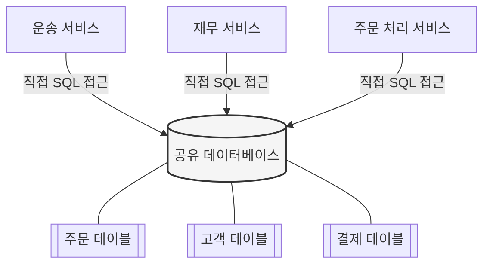
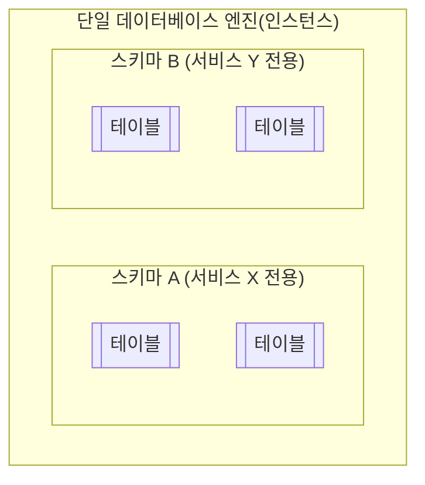
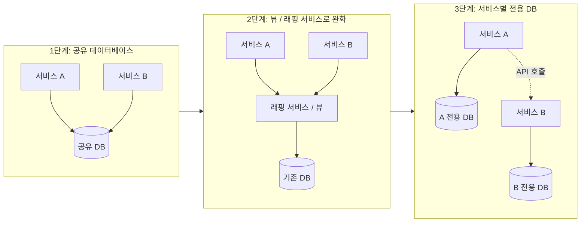

> 이 문서는 샘 뉴먼(Sam Newman)의 저서 *Monolith to Microservices*(한국어판 『마이크로서비스 도입, 이렇게 한다』, 책만/Onlybook, 2021년 출간) 4장 "데이터베이스 분해"에서 다루는 주제를 바탕으로, 해당 개념을 독자가 이해하기 쉽도록 필자가 직접 풀어서 재구성하고 2026년 8월 현재 업계 동향까지 함께 정리한 자료입니다. 책의 문장을 그대로 옮긴 것이 아니라, 마이크로서비스 아키텍처 커뮤니티(Chris Richardson의 microservices.io, 여러 기술 블로그 등)에서 공통적으로 통용되는 개념과 용어를 바탕으로 필자가 새로 서술했습니다. 원서의 정확한 문장이나 그림을 확인하고 싶다면 반드시 원서 또는 정식 번역서를 참고하시기 바랍니다.

---

## 1. 들어가며 — 이 주제가 왜 중요한가

모놀리스(monolith, 단일 거대 애플리케이션)를 마이크로서비스로 전환하는 작업에서 가장 어려운 부분은 코드를 나누는 일이 아니라 **데이터베이스를 나누는 일**이라고 흔히 이야기합니다. 코드는 함수와 클래스 단위로 비교적 깔끔하게 잘라낼 수 있지만, 데이터베이스는 수십 개의 테이블이 외래키(foreign key)와 조인(join)으로 촘촘하게 얽혀 있고, 오랜 세월 동안 여러 팀이 손을 대면서 누구도 전체 구조를 정확히 파악하지 못하는 경우가 많기 때문입니다.

그럼에도 불구하고 마이크로서비스 아키텍처가 약속하는 핵심 가치 — 서비스별 독립 배포, 독립 확장, 팀 간 자율성 — 를 제대로 실현하려면 결국 데이터베이스 분해라는 난제를 피해갈 수 없습니다. 서비스는 나뉘었는데 데이터베이스가 하나로 남아있다면, 겉모습만 마이크로서비스이고 실제로는 "분산된 모놀리스(distributed monolith)"가 되어버리기 때문입니다.

이 문서에서는 다음 내용을 순서대로 다룹니다.

1. 왜 여러 서비스가 하나의 데이터베이스를 공유하면 문제가 생기는지
2. 결합도(coupling)라는 개념으로 그 문제를 어떻게 설명할 수 있는지
3. "스키마"와 "데이터베이스"라는 용어가 실무에서 왜 자주 혼용되는지
4. 데이터베이스 분리가 왜 생각보다 훨씬 어려운 작업인지
5. 실무에서 사용되는 점진적 분해 패턴들
6. 공유 데이터베이스가 예외적으로 허용될 수 있는 상황
7. 2026년 현재 업계에서 이 문제를 다루는 최신 흐름(Saga, CQRS, 이벤트 소싱 등)

---

## 2. 모놀리스는 왜 데이터베이스를 공유하게 되는가

전통적인 3계층(프레젠테이션-비즈니스 로직-데이터) 구조의 모놀리스 애플리케이션은 애초에 "하나의 데이터베이스"를 전제로 설계됩니다. 초기에는 이 방식이 매우 편리합니다. 트랜잭션 하나로 여러 테이블을 한꺼번에 안전하게 갱신할 수 있고, 조인을 이용해 복잡한 질의를 데이터베이스 엔진에 위임할 수 있으며, 데이터 정합성(무결성)을 데이터베이스 자체가 보장해주기 때문입니다.

문제는 조직이 이 모놀리스를 여러 개의 마이크로서비스로 쪼개기 시작하면서 발생합니다. 코드는 배송(운송) 서비스, 재무 서비스, 주문 처리 서비스 등으로 나뉘었지만, 이 서비스들이 여전히 하나의 물리적 데이터베이스 안에 있는 동일한 테이블 집합에 직접 접근하는 상황이 매우 흔하게 벌어집니다. 아래 그림은 이런 전형적인 상황을 나타냅니다.

겉으로는 세 개의 독립된 서비스처럼 보이지만, 실제로는 데이터베이스라는 하나의 공유 자원을 통해 서로 강하게 얽혀 있는 구조입니다. 이 상태를 흔히 **공유 데이터베이스 안티패턴(shared database anti-pattern)** 이라고 부릅니다.

---

## 3. 결합도(Coupling)라는 렌즈로 문제를 바라보기

왜 공유 데이터베이스가 나쁜 것인지 직관적으로는 알아도, 그 이유를 구체적으로 설명하기는 쉽지 않습니다. 이때 유용한 개념이 바로 **결합도**입니다. 소프트웨어 아키텍처에서 결합도는 보통 세 가지 측면으로 나누어 이야기합니다.

| 결합도 유형 | 의미 | 공유 데이터베이스에서 나타나는 모습 |
|---|---|---|
| 도메인 결합도(domain coupling) | 한 서비스가 다른 서비스의 비즈니스 개념·행동에 의존하는 정도 | 여러 서비스가 "주문"이라는 같은 개념을 각자 다르게 해석하며 같은 테이블을 조작 |
| 시간적 결합도(temporal coupling) | 한 서비스의 처리가 다른 서비스의 처리 시점에 얽매이는 정도 | 동시 접근 시 락(lock) 경합, 트랜잭션 대기 등이 서비스 간 응답 시간에 영향 |
| 구현 결합도(implementation coupling) | 내부 구현 세부사항이 외부에 노출되어 그 세부사항이 바뀌면 다른 쪽도 깨지는 정도 | 테이블 스키마(컬럼명, 타입, 관계)가 사실상 여러 서비스의 "공개 API"가 되어버림 |

세 가지 결합도 중에서도 공유 데이터베이스 상황에서 가장 두드러지는 것은 **구현 결합도**입니다. 데이터베이스 스키마는 원래 해당 서비스만 알아야 하는 내부 구현 세부사항인데, 여러 서비스가 같은 테이블을 직접 읽고 쓰다 보면 그 스키마 자체가 사실상 서비스 간 공개 계약(contract)이 되어버립니다. 그 결과 어느 한 팀이 컬럼 이름을 바꾸거나 테이블 구조를 리팩터링하려 해도, 그 변경이 어떤 다른 서비스에 영향을 미칠지 아무도 확신할 수 없는 상황이 벌어집니다.

---

## 4. 공유 데이터베이스가 실제로 만들어내는 문제들

공유 데이터베이스 구조에서는 다음과 같은 문제들이 함께 나타나는 경향이 있습니다.

**첫째, 정보 은닉(information hiding)이 무너집니다.** 원래 마이크로서비스의 핵심 원칙 중 하나는 "각 서비스가 자신의 데이터를 캡슐화하고, 외부에는 API를 통해서만 접근을 허용한다"는 것입니다. 그런데 데이터베이스를 공유하면 어떤 데이터를 외부에 공개하고 어떤 데이터를 숨길지 스스로 결정할 기회 자체가 사라집니다. 다른 팀이 내 테이블에 어떤 조인을 걸어놓았는지, 어떤 컬럼에 의존하고 있는지 파악할 방법이 마땅치 않기 때문입니다.

**둘째, 데이터에 대한 "소유권"이 모호해집니다.** 여러 서비스가 같은 테이블을 변경할 수 있다면, 그 데이터를 다루는 비즈니스 로직은 어디에 있어야 할까요? 한 곳에 모여 있지 않고 여러 서비스에 흩어져 있다면, 이는 비즈니스 로직의 응집도(cohesion)가 떨어지고 있다는 신호입니다. 마이크로서비스를 "하나 이상의 상태 머신(state machine)을 캡슐화한 것"으로 바라보는 관점에서 보면, 상태를 변경하는 로직이 시스템 전체에 흩어져 있을수록 그 상태 머신이 올바르게 동작하는지 검증하기가 점점 어려워집니다.

**셋째, 서비스 간 변경이 강하게 얽힙니다.** 세 개의 서비스가 동일한 주문 데이터를 직접 변경할 수 있다면, 그 데이터의 처리 방식(비즈니스 규칙)을 바꿔야 할 때 관련된 모든 서비스를 동시에, 신중하게 수정해야 합니다. 이는 독립 배포라는 마이크로서비스의 핵심 이점을 정면으로 훼손하는 결과로 이어집니다.

---

## 5. 헷갈리기 쉬운 용어부터 정리: 스키마 vs 데이터베이스

이 주제를 다루다 보면 "데이터베이스"라는 단어가 두 가지 다른 의미로 섞여 쓰이는 것을 자주 보게 됩니다. 정확히 말하면 다음과 같이 구분할 수 있습니다.

- **스키마(schema)**: 관련된 테이블들의 논리적으로 분리된 집합. 데이터가 실제로 담기는 논리적 경계입니다.
- **데이터베이스 엔진(database engine)**: PostgreSQL, MySQL, Oracle 같은 실제 소프트웨어 인스턴스. 하나의 엔진 안에 여러 개의 스키마가 동시에 존재할 수 있습니다.

즉, "데이터베이스가 다운됐다"는 말은 보통 데이터베이스 엔진(서버) 자체의 장애를 의미하지만, "이 서비스는 자체 데이터베이스를 가진다"는 말은 대개 논리적으로 격리된 스키마를 가진다는 의미로 쓰입니다. 아래 그림처럼 하나의 데이터베이스 엔진 안에서도 스키마 A와 스키마 B가 논리적으로 완전히 분리되어 있을 수 있습니다.

이렇게 개념을 구분하는 이유는, "서비스마다 데이터베이스를 따로 둔다"는 원칙이 반드시 "서비스마다 별도의 물리 서버를 둔다"는 뜻이 아니기 때문입니다. 하나의 엔진 안에서 스키마만 논리적으로 분리해도 목적을 상당 부분 달성할 수 있습니다. 다만 AWS DynamoDB처럼 애초에 스키마 개념이 없고 테이블 단위로만 접근을 통제하는 NoSQL 데이터베이스도 있으므로, 클라우드 제공자의 데이터베이스 서비스를 사용할 때는 그 서비스가 논리적 격리를 어떤 방식으로 제공하는지(예: 역할 기반 접근 제어) 미리 확인해야 합니다.

---

## 6. 왜 데이터베이스 분리는 "그냥 하면 되는" 일이 아닌가

이론적으로는 각 서비스가 처음부터 독립된 스키마를 갖는 것이 가장 이상적입니다. 그러나 현실에서는 대부분 이미 존재하는 거대한 모놀리스 데이터베이스에서 출발하게 되며, 그 데이터베이스는 처음부터 독립적으로 나뉘도록 설계되지 않았습니다. 데이터베이스 분해 작업이 어려운 이유는 대략 다음과 같이 정리할 수 있습니다.

- **트랜잭션 무결성이 깨진다**: 한 트랜잭션 안에서 여러 테이블을 원자적으로 갱신하던 로직이, 테이블이 서로 다른 서비스·데이터베이스로 나뉘는 순간 더 이상 하나의 트랜잭션으로 처리할 수 없게 됩니다.
- **참조 무결성(외래키)이 깨진다**: 데이터베이스 엔진이 자동으로 보장해주던 외래키 제약이 서비스 경계를 넘어서면 더 이상 성립하지 않습니다. 이제는 애플리케이션 코드가 그 정합성을 책임져야 합니다.
- **조인이 불가능해진다**: 물리적으로 분리된 데이터베이스 사이에서는 SQL 조인을 쓸 수 없으므로, 여러 서비스의 데이터를 조합해야 하는 조회는 애플리케이션 레벨에서 여러 번의 API 호출로 재구성해야 합니다.
- **지연 시간(latency)이 늘어난다**: 로컬 데이터베이스 조인 한 번이면 끝나던 조회가, 네트워크를 오가는 여러 번의 서비스 호출로 바뀌면서 응답 속도가 느려질 수 있습니다.
- **새로운 장애 모드가 생긴다**: 예전에는 데이터베이스 하나만 살아있으면 됐지만, 이제는 데이터를 나눠 가진 여러 서비스가 각각 정상 동작해야 전체 기능이 정상적으로 완결됩니다.

이런 이유로, 데이터베이스 분해는 "일단 스키마부터 무조건 나누고 보자"는 식으로 접근하면 실패하기 쉽습니다. 오히려 대부분의 실무 가이드는 **코드(서비스 경계)를 먼저 나누고, 데이터베이스는 그 이후 단계적으로 분리**하는 순서를 권장합니다. 처음부터 완벽하게 분리하지 못하더라도, 최소한 상황이 더 나빠지지 않도록 막아주는 중간 단계 패턴들을 활용하면서 점진적으로 나아가는 편이 현실적입니다.

---

## 7. 점진적으로 데이터베이스를 분리하는 실전 패턴들

데이터베이스 분해는 한 번에 끝내는 이벤트가 아니라 여러 단계를 거치는 여정에 가깝습니다. 업계에서 널리 통용되는 대표적인 중간 단계 패턴들을 정리하면 다음과 같습니다.

### 7-1. 데이터베이스 뷰(Database View) 패턴
데이터베이스 엔진이 제공하는 뷰 기능을 이용해, 외부 서비스에게는 필요한 컬럼만 골라 보여주고 나머지 테이블 구조는 숨기는 방식입니다. 실제 테이블을 재구성하지 않고도 어느 정도 정보 은닉 효과를 얻을 수 있지만, 뷰 역시 결국 같은 데이터베이스 엔진 안에 존재하므로 근본적인 결합을 완전히 없애지는 못합니다. 스키마를 물리적으로 분리하기 전 단계의 임시 완화책으로 자주 사용됩니다.

### 7-2. 데이터베이스 래핑 서비스(Database Wrapping Service) 패턴
공유 테이블에 직접 접근하던 여러 서비스들 앞에, 그 데이터에 대한 접근을 전담하는 서비스를 하나 세우는 방식입니다. 다른 서비스들은 더 이상 데이터베이스에 직접 SQL을 날리지 않고, 이 래핑 서비스가 제공하는 API를 통해서만 데이터를 주고받습니다. 이렇게 하면 나중에 실제 데이터 저장 방식을 바꾸더라도(예: 다른 데이터베이스로 이전) API 계약만 유지하면 되므로 변경의 파급 범위가 줄어듭니다. 모놀리스 자체를 "데이터 접근 계층"으로 삼아, 모놀리스가 아직 소유한 데이터에 대해서는 API를 통해서만 접근하도록 강제하는 방식도 같은 맥락의 접근입니다.

### 7-3. 데이터베이스 애즈 어 서비스(Database-as-a-Service, DaaS) 인터페이스 패턴
반대로, 애초부터 여러 소비자(consumer)를 위해 설계되고 관리되는 조회 전용 데이터베이스를 하나의 "서비스"로 취급하고 정식으로 외부에 공개하는 방식입니다. 데이터의 소유자가 명확하고, 그 데이터의 변경 관리(버전 관리, 하위 호환성 유지)를 데이터 소유 팀이 전담한다는 전제가 성립할 때 채택할 수 있는 패턴입니다.

### 7-4. 다중 스키마 저장소(Multischema Storage) 패턴
새로운 기능이나 데이터는 처음부터 새 스키마에 저장하되, 기존 데이터는 당분간 예전 모놀리스 스키마에 남겨두고 계속 참조하는 방식입니다. 한 번에 모든 것을 옮기지 않고, 새로 생기는 것부터 점진적으로 분리해나가는 절충안입니다.

### 7-5. 최종 목표 — 서비스별 전용 데이터베이스(Database per Service)
위의 중간 단계들을 거쳐 최종적으로 도달하는 형태는, 각 서비스가 자신의 데이터를 온전히 소유하고 다른 어떤 서비스도 그 데이터 저장소에 직접 접근하지 못하게 하는 구조입니다. 다른 서비스가 그 데이터를 필요로 한다면 반드시 소유 서비스가 제공하는 API를 호출하거나, 소유 서비스가 발행하는 이벤트를 구독하는 방식으로만 접근해야 합니다.

아래 표는 각 패턴을 적용 시점과 트레이드오프 관점에서 비교한 것입니다.

| 패턴 | 언제 유용한가 | 한계 |
|---|---|---|
| 데이터베이스 뷰 | 빠르게 정보 은닉을 흉내내고 싶을 때 | 물리적 결합은 그대로 남음 |
| 데이터베이스 래핑 서비스 | 아직 데이터를 완전히 옮길 수 없을 때 | 별도 서비스 운영 부담 추가 |
| DaaS 인터페이스 | 데이터 소유자가 명확하고 다수 소비자에게 공식적으로 데이터를 제공할 때 | 데이터 소유 팀의 책임과 변경 관리 부담이 커짐 |
| 다중 스키마 저장소 | 신규 기능부터 점진적으로 분리하고 싶을 때 | 과도기 동안 신·구 데이터가 혼재 |
| 서비스별 전용 데이터베이스 | 최종 목표 상태 | 트랜잭션·조인·참조 무결성을 애플리케이션이 직접 책임져야 함 |

---

## 8. 공유 데이터베이스가 예외적으로 허용되는 경우

지금까지의 설명만 보면 공유 데이터베이스는 무조건 피해야 할 것처럼 보이지만, 실무에서는 다음 두 가지 상황에서만큼은 예외적으로 허용될 수 있다고 보는 시각이 일반적입니다.

첫째, **읽기 전용 정적 참조 데이터**를 다루는 경우입니다. 국가 통화 코드, 우편번호 조회 테이블처럼 구조가 매우 안정적이고 변경이 드물며, 변경 자체도 엄격하게 통제되는 성격의 데이터라면, 여러 서비스가 이를 공유해서 읽더라도 실질적인 결합 문제가 크게 발생하지 않습니다.

둘째, **처음부터 여러 소비자를 위해 설계·관리되는 조회용 데이터 종단점**으로 데이터베이스를 공식적으로 노출하는 경우입니다. 이는 위에서 설명한 DaaS 인터페이스 패턴에 해당하며, 이때는 "우연히 공유되고 있는" 데이터베이스가 아니라 "의도적으로 서비스처럼 설계된" 데이터베이스라는 점이 중요한 차이입니다.

그 외의 상황에서는 대체로 서비스별 데이터 소유를 지향하는 방향이 선호됩니다. 다만 기존 모놀리스로 시작하는 조직이라면 스키마가 처음부터 독립적으로 나뉘어 있지 않은 것이 당연하므로, 분리 작업에 시간이 너무 오래 걸리거나 시스템의 특히 민감한 부분을 건드려야 하는 경우에는 앞서 소개한 중간 단계 패턴들을 활용해 최소한 상황이 더 악화되지 않도록 막아두고, 이후 더 나은 구조로 나아갈 발판을 마련하는 현실적인 접근이 권장됩니다.

---

## 9. 2026년 현재 업계는 이 문제를 어떻게 다루고 있는가

샘 뉴먼의 책이 처음 출간된 2019~2020년 이후로도 "서비스별 전용 데이터베이스(database per service)"는 여전히 마이크로서비스 데이터 관리의 정석으로 자리잡고 있습니다. 다만 최근 논의들을 보면 몇 가지 흐름이 뚜렷해지고 있습니다.

**첫째, "서비스마다 반드시 별도의 물리 서버를 둔다"는 오해가 계속 교정되고 있습니다.** 최근 실무 가이드들은 이 패턴의 진짜 목적이 물리적으로 서버를 나누는 것이 아니라 데이터 소유권을 통한 서비스 자율성 확보에 있다는 점을 강조합니다. 즉 앞서 설명한 것처럼 하나의 엔진 안에서 스키마 단위로 분리하는 것도 충분히 유효한 구현 방식으로 인정받고 있습니다.

**둘째, 이 패턴을 보완하는 기법들이 표준 조합으로 자리잡았습니다.** 서비스 간 트랜잭션을 하나로 묶을 수 없다는 문제를 보완하기 위해 여러 단계의 로컬 트랜잭션과 보상 트랜잭션을 연결하는 사가(Saga) 패턴이, 여러 서비스에 흩어진 데이터를 조합해서 조회해야 하는 문제를 보완하기 위해 명령과 조회의 책임을 분리하는 CQRS(Command Query Responsibility Segregation) 패턴이, 그리고 현재 상태 대신 상태 변화 이력 자체를 기록해 다른 서비스들이 그 이력을 구독할 수 있게 하는 이벤트 소싱(event sourcing)이 자주 함께 언급됩니다.

**셋째, 데이터베이스를 어떻게 나눌지에 대한 선택지가 좀 더 세분화되어 논의되고 있습니다.** 서비스마다 완전히 별도의 데이터베이스 인스턴스를 두는 방식과, 하나의 데이터베이스 안에서 서비스별로 스키마만 나누는 방식, 그리고 심지어 하나의 스키마 안에서도 테이블 단위 접근 권한만 서비스별로 분리하는 방식(private-tables-per-service)까지, 조직의 규모와 운영 역량에 맞춰 다양한 수준의 격리를 선택할 수 있다는 관점이 널리 받아들여지고 있습니다.

**넷째, Netflix나 Amazon과 같은 대규모 서비스 사례가 여전히 이 패턴의 효과를 보여주는 참고 사례로 자주 인용됩니다.** 이들 기업은 서비스별로 워크로드 특성에 맞는 데이터베이스 기술(관계형/비관계형 등)을 선택적으로 사용하고, 데이터베이스 격리를 통해 한 서비스의 장애가 전체 시스템으로 번지지 않도록 하는 구조를 취하고 있다고 알려져 있습니다.

정리하면, 2026년 현재까지도 "여러 서비스가 하나의 데이터베이스를 직접 공유하는 구조는 피하고, 데이터 소유권을 서비스 단위로 명확히 하라"는 큰 원칙 자체는 변하지 않았으며, 다만 그 원칙을 구현하는 구체적인 방법과 이를 보완하는 패턴들(Saga, CQRS, 이벤트 소싱)에 대한 실무 노하우가 훨씬 정교해졌다고 볼 수 있습니다.

---

## 10. 실무에 적용할 때 점검해볼 것들

데이터베이스 분해를 실제로 진행하려는 팀이라면, 다음과 같은 질문들을 스스로 던져보는 것이 도움이 됩니다. 지금 분리하려는 데이터가 정말로 읽기 전용의 안정적인 참조 데이터인지, 아니면 자주 바뀌고 여러 비즈니스 규칙이 얽혀 있는 핵심 데이터인지 먼저 구분해볼 필요가 있습니다. 또한 지금 당장 물리적으로 데이터베이스를 나누는 것이 무리라면, 데이터베이스 뷰나 래핑 서비스처럼 상황을 악화시키지 않으면서 시간을 벌어주는 중간 단계 패턴을 먼저 도입하는 것이 현실적입니다. 그리고 분리 이후에는 예전처럼 조인 한 번으로 끝나던 조회가 여러 번의 API 호출이나 이벤트 구독으로 바뀐다는 점을 감안해, 지연 시간과 데이터 정합성(특히 최종적 일관성, eventual consistency)에 대한 새로운 설계가 필요하다는 점도 미리 고려해야 합니다.

---

## 11. 용어 정리 (한글 glossary)

| 용어 | 설명 |
|---|---|
| 모놀리스(Monolith) | 여러 기능이 하나의 배포 단위로 묶여 있는 단일 애플리케이션 |
| 결합도(Coupling) | 한 컴포넌트의 변경이 다른 컴포넌트에 영향을 주는 정도 |
| 정보 은닉(Information Hiding) | 컴포넌트의 내부 구현 세부사항을 외부로부터 감추는 설계 원칙 |
| 스키마(Schema) | 관련 테이블들의 논리적으로 분리된 집합 |
| 데이터베이스 엔진(Database Engine) | 실제로 데이터를 저장·관리하는 소프트웨어(예: PostgreSQL, MySQL) |
| 참조 무결성(Referential Integrity) | 외래키 등을 통해 테이블 간 관계의 정합성을 보장하는 것 |
| 트랜잭션 무결성(Transactional Integrity) | 여러 작업을 원자적(all-or-nothing)으로 처리해 정합성을 유지하는 것 |
| 상태 머신(State Machine) | 특정 상태와 그 상태를 변화시키는 규칙들의 집합으로 시스템을 모델링하는 방식 |
| 사가(Saga) | 분산 트랜잭션을 여러 개의 로컬 트랜잭션과 보상 트랜잭션으로 나누어 처리하는 패턴 |
| CQRS | 데이터를 변경하는 명령(Command)과 조회(Query)의 책임을 분리하는 패턴 |
| 이벤트 소싱(Event Sourcing) | 현재 상태 대신 상태를 변화시킨 이벤트의 이력을 저장하는 방식 |
| 최종적 일관성(Eventual Consistency) | 즉시는 아니더라도 시간이 지나면 데이터가 일관된 상태로 수렴한다는 보장 |

---

## 12. 참고 자료 및 출처

이 문서는 아래 자료들을 참고하여 일반적으로 통용되는 개념을 필자가 재구성한 것입니다. 원문 그대로의 표현이 필요하다면 아래 원출처를 직접 확인하시기 바랍니다.

**1차 출처 (원서/번역서 서지 정보)**
- Sam Newman, *Monolith to Microservices: Evolutionary Patterns to Transform Your Monolith*, O'Reilly Media, 2019~2020 — https://samnewman.io/books/monolith-to-microservices/
- 샘 뉴먼, 『마이크로서비스 도입, 이렇게 한다』(한국어판), 책만(Onlybook), 2021

**업계 참고 자료 (2026년 기준 동향 확인)**
- Chris Richardson, "Pattern: Database per service", microservices.io — https://microservices.io/patterns/data/database-per-service.html
- GeeksforGeeks, "Database Per Service Pattern for Microservices" (2026년 6월 갱신) — https://www.geeksforgeeks.org/system-design/database-per-service-pattern-for-microservices/
- Reintech, "Go Microservices Architecture: Patterns and Best Practices 2026" — https://reintech.io/blog/go-microservices-architecture-patterns-best-practices-2026
- dasroot.net, "Database per Service: Patterns, Challenges, and Implementation Strategies" (2026년 3월) — https://dasroot.net/posts/2026/03/database-per-service-patterns-challenges-implementation/

> **사실 확인 안내**: 위 자료 중 원서·번역서 서지 정보는 출판사 공식 페이지 및 서점(교보문고 등) 정보로 교차 확인된 사실입니다. 업계 동향 관련 내용은 여러 기술 블로그의 공통된 서술을 종합한 것이며, 구체적인 수치(예: 특정 기업의 내부 성과 지표)는 출처의 신뢰도가 명확히 검증되지 않아 이 문서에는 포함하지 않았습니다. 특정 기업(Netflix, Amazon 등)의 사례는 공개적으로 널리 알려진 아키텍처 특징을 일반적인 수준에서 소개한 것이며, 해당 기업의 내부 시스템 세부사항을 직접 검증한 것은 아닙니다.
