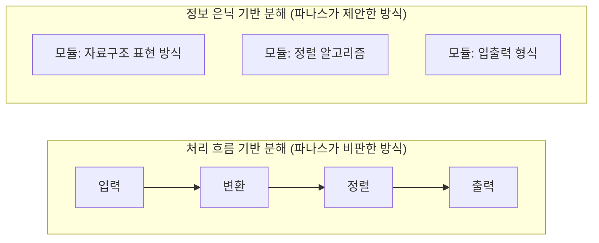
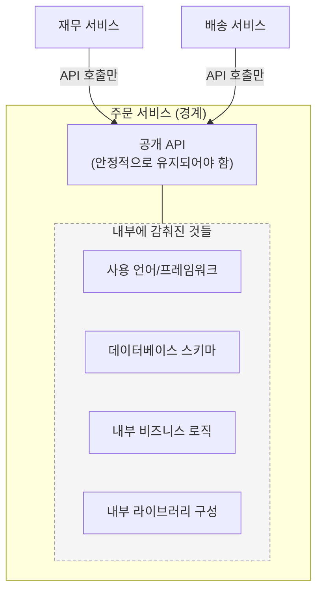
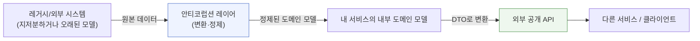

> 이 문서는 소프트웨어 설계 원칙인 "정보 은닉(information hiding)"이 마이크로서비스 아키텍처에서 왜 그토록 중요하게 다뤄지는지, 그리고 실무에서 이를 어떻게 지키고 어떻게 무너뜨리게 되는지를 정리한 자료입니다. 데이비드 파나스(David Parnas)의 고전적 논문에서 출발해, 오늘날 마이크로서비스 설계에 이 원칙이 어떻게 적용되는지까지 이어서 설명합니다.

---

## 1. 들어가며 — 왜 지금 다시 "정보 은닉"인가

마이크로서비스 아키텍처를 다루는 글이나 책을 보면 거의 예외 없이 "결합도를 낮추고 응집도를 높여라", "각 서비스는 자신의 데이터를 캡슐화해야 한다"는 조언이 등장합니다. 이런 조언들의 뿌리를 거슬러 올라가면 결국 하나의 원칙으로 수렴합니다. 바로 **정보 은닉**입니다.

흥미로운 점은 이 개념이 마이크로서비스라는 용어가 생기기 훨씬 전인 1972년에 이미 정립되었다는 사실입니다. 즉 마이크로서비스는 정보 은닉이라는 오래된 원칙을 네트워크로 분리된 서비스 단위에 적용한 하나의 실천 방법이라고 볼 수 있습니다. 이 문서에서는 이 원칙이 어디에서 왔고, 마이크로서비스에서 구체적으로 무엇을 의미하며, 어떻게 하면 이를 지킬 수 있는지 순서대로 살펴봅니다.

---

## 2. 정보 은닉의 기원 — 데이비드 파나스의 1972년 통찰

정보 은닉이라는 개념은 소프트웨어 엔지니어 데이비드 파나스가 1972년에 발표한 논문 "On the Criteria to Be Used in Decomposing Systems into Modules"(시스템을 모듈로 분해할 때 사용해야 할 기준에 관하여)에서 처음 정식화되었습니다. 이 논문은 다섯 페이지 남짓한 짧은 글이지만, 소프트웨어 아키텍처 역사에서 가장 많이 인용되는 논문 중 하나로 꼽힙니다.

파나스가 이 논문에서 던진 질문은 단순합니다. "시스템을 여러 모듈로 나눌 때, 어떤 기준으로 나누는 것이 가장 좋은가?" 당시 널리 쓰이던 방식은 처리 흐름(flowchart)을 따라 시스템을 순차적인 단계별로 나누는 것이었습니다. 입력 → 변환 → 정렬 → 출력처럼 처리 순서에 따라 모듈을 나누는 방식입니다. 파나스는 이 방식이 겉보기에는 자연스러워 보이지만, 실제로는 설계 결정이 바뀔 때마다 여러 모듈을 동시에 고쳐야 하는 취약한 구조를 만든다고 지적했습니다.

파나스가 대안으로 제시한 기준은 처리 순서가 아니라 **"바뀔 가능성이 있는 설계 결정"** 을 기준으로 모듈을 나누라는 것이었습니다. 각 모듈은 하나의 설계 결정(예: 특정 자료구조를 어떻게 표현할지, 특정 알고리즘을 무엇으로 구현할지)을 그 내부에 완전히 감추고, 외부에는 안정적인 인터페이스만 노출해야 한다는 것입니다. 이렇게 설계하면 훗날 그 결정이 실제로 바뀌더라도, 영향을 받는 범위가 해당 모듈 하나로 국한됩니다. 이것이 바로 정보 은닉의 핵심입니다.

처리 흐름 기반 분해에서는 자료구조 하나만 바뀌어도 입력, 변환, 정렬, 출력 모듈 전부를 손봐야 할 수 있습니다. 반면 정보 은닉 기반 분해에서는 자료구조에 대한 결정이 "자료구조 표현 방식" 모듈 하나에 갇혀 있으므로, 그 결정이 바뀌어도 다른 모듈은 영향을 받지 않습니다.

---

## 3. 정보 은닉이 가져다주는 3가지 이점

파나스는 정보 은닉을 지키며 시스템을 설계했을 때 얻을 수 있는 이점을 크게 세 가지로 정리했습니다.

**첫째, 개발 시간이 단축됩니다.** 각 모듈의 내부가 다른 모듈과 독립적으로 감춰져 있으므로, 여러 팀이 서로의 내부 구현을 몰라도 동시에 병렬로 개발을 진행할 수 있습니다.

**둘째, 제품의 유연성이 높아집니다.** 어떤 모듈의 내부 구현을 완전히 갈아엎어야 하는 상황이 오더라도, 그 모듈이 외부에 제공하는 인터페이스만 그대로 유지된다면 나머지 시스템은 전혀 영향을 받지 않습니다.

**셋째, 시스템을 이해하기 쉬워집니다.** 개발자가 시스템 전체를 한꺼번에 이해하지 않아도, 관심 있는 모듈 하나만 놓고 그 인터페이스와 동작을 이해하는 것으로 충분합니다. 이는 곧 시스템이 더 잘 설계되고, 더 잘 이해된 상태로 유지된다는 뜻입니다.

이 세 가지 이점은 50여 년이 지난 지금도 마이크로서비스 아키텍처가 추구하는 목표와 정확히 일치합니다. 서비스별 독립 배포(개발 시간 단축), 서비스별 독립적인 기술 스택과 리팩터링 자유도(유연성), 그리고 팀이 자신이 담당한 서비스에만 집중해도 되는 인지 부하 감소(이해 용이성)가 바로 그것입니다.

---

## 4. 정보 은닉을 마이크로서비스에 대입하면

객체지향 프로그래밍에서는 정보 은닉이 클래스의 `private` 필드나 캡슐화(encapsulation)라는 형태로 구현됩니다. 클래스 내부의 필드와 메서드 구현은 감추고, `public` 메서드만 외부에 노출하는 방식입니다. 마이크로서비스는 이 개념을 한 단계 더 큰 단위, 즉 프로세스와 네트워크 경계까지 확장한 것이라고 볼 수 있습니다.

마이크로서비스에서 "모듈"에 해당하는 것은 서비스 그 자체이고, "인터페이스"에 해당하는 것은 그 서비스가 외부에 공개하는 API(REST, gRPC, 이벤트 등)입니다. 그리고 "감춰야 할 설계 결정"에 해당하는 것은 다음과 같은 것들입니다.

- 어떤 프로그래밍 언어와 프레임워크로 구현했는가
- 데이터를 어떤 데이터베이스에, 어떤 테이블/스키마 구조로 저장하는가
- 내부적으로 어떤 알고리즘이나 비즈니스 규칙 세부 로직을 사용하는가
- 내부에서 다른 어떤 하위 컴포넌트나 라이브러리를 호출하는가

이런 세부사항들이 API 뒤에 안전하게 감춰져 있다면, 팀은 이 내부 구현을 자유롭게 바꿀 수 있습니다. 데이터베이스를 교체하거나, 언어를 바꾸거나, 내부 로직을 리팩터링하더라도 API 계약만 그대로 유지된다면 그 서비스를 소비하는 다른 서비스들은 아무 영향을 받지 않아야 합니다. 이것이 바로 마이크로서비스가 독립적으로 배포되고 진화할 수 있는 근본적인 이유입니다.

---

## 5. 무엇을 숨기고 무엇을 노출할 것인가 — 판단 기준

정보 은닉을 실천할 때 가장 어려운 질문은 "그래서 정확히 무엇을 숨기고 무엇을 공개해야 하는가"입니다. 파나스가 제시한 휴리스틱은 **"바뀔 가능성이 높은 것", "구현하기 어렵거나 복잡한 것"을 우선적으로 숨기라**는 것입니다. 이를 마이크로서비스 설계에 적용하면 다음과 같은 기준으로 정리할 수 있습니다.

| 구분 | 예시 | 처리 방향 |
|---|---|---|
| 자주 바뀔 가능성이 높은 것 | 데이터베이스 스키마, 내부 알고리즘, 사용 라이브러리 버전 | 반드시 숨긴다 |
| 서비스의 존재 이유이자 안정적으로 유지해야 할 것 | 비즈니스 능력(capability) 자체, 핵심 도메인 개념 | API로 명확히 노출한다 |
| 다른 서비스가 반드시 알아야 하는 것 | 요청/응답 데이터 형식, 오류 코드, 이벤트 스키마 | 명시적 계약(contract)으로 노출하고 버전 관리한다 |
| 우연히 노출되기 쉬운 것 | 내부 테이블 구조가 그대로 드러나는 API 응답, 내부 예외 메시지 그대로 반환 | 의도적으로 걸러내고 별도의 외부용 모델로 변환한다 |

핵심은 "외부에서 알아야 서비스를 올바르게 사용할 수 있는 정보는 전부 제공하되, 그 이상은 아무것도 제공하지 않는다"는 균형입니다. 너무 적게 노출하면 서비스를 사용하는 쪽이 불편해지고, 너무 많이 노출하면(특히 내부 구현이 그대로 드러나면) 나중에 자유롭게 바꿀 수 없는 서비스가 되어버립니다.

---

## 6. 정보 은닉이 무너지는 대표적인 패턴들

실무에서는 다음과 같은 상황들이 정보 은닉을 조용히 무너뜨리는 대표적인 원인으로 꼽힙니다.

**공유 데이터베이스.** 여러 서비스가 같은 데이터베이스 테이블에 직접 접근하면, 그 테이블의 스키마 자체가 사실상 여러 서비스가 함께 의존하는 공개 계약이 되어버립니다. 어느 한 서비스가 컬럼 하나를 바꾸는 순간 다른 서비스들이 예고 없이 깨질 수 있습니다. 이는 정보 은닉이 깨지는 가장 흔하고 근본적인 원인입니다.

**내부 모델을 그대로 API 응답으로 반환하는 경우.** 데이터베이스 엔티티나 내부 도메인 객체를 별도의 변환 과정 없이 그대로 API 응답으로 직렬화해서 내보내면, 내부 자료구조가 사실상 외부 API 명세가 되어버립니다. 이후 내부 모델을 리팩터링하려 할 때마다 API를 사용하는 모든 소비자에게 영향을 주게 됩니다.

**섀도 API(shadow API)와 좀비 API.** 공식적으로 관리되지 않는 채로 방치된 엔드포인트, 또는 더 이상 쓰이지 않아야 하는데 여전히 살아있는 엔드포인트는 의도치 않게 내부 세부사항을 계속 외부에 노출시키는 통로가 됩니다. 이런 API는 트래픽 기반 모니터링만으로는 잘 발견되지 않기 때문에, 코드 기반으로 API 목록을 지속적으로 점검하는 절차가 필요하다는 지적이 최근 보안 업계에서도 자주 나옵니다.

**너무 수다스러운(chatty) API 설계.** 하나의 비즈니스 요청을 처리하기 위해 소비자가 그 서비스의 내부 처리 순서를 알아야만 호출할 수 있도록 API가 잘게 쪼개져 있다면, 이는 내부 처리 흐름이 API 설계에 그대로 새어나온 것입니다. 소비자는 그 서비스의 내부 동작 순서에 원치 않게 결합됩니다.

**기술 계층 기준으로 서비스를 나누는 경우.** 데이터베이스 담당 서비스, API 담당 서비스, 알림 담당 서비스처럼 기술적 계층을 기준으로 서비스를 쪼개면, 하나의 비즈니스 기능을 완결하기 위해 여러 서비스가 서로의 내부 사정을 속속들이 알아야 하는 강한 결합이 발생하기 쉽습니다. 최근 실무 가이드들도 이 방식이 마이크로서비스에서 흔히 나타나는 대표적인 실수 중 하나라고 지적하고 있습니다.

---

## 7. 정보 은닉을 지키기 위한 실전 기법들

### 7-1. 바운디드 컨텍스트(Bounded Context)로 경계 정하기
도메인 주도 설계(DDD)의 바운디드 컨텍스트 개념은 "이 경계 안에서는 하나의 도메인 모델과 하나의 용어 체계(ubiquitous language)만 통용된다"는 원칙입니다. 서비스 경계를 기술적 계층이 아니라 비즈니스 능력 단위로 정하면, 하나의 비즈니스 개념(예: "주문")에 대한 세부 구현을 그 경계 안에 자연스럽게 가둘 수 있습니다.

### 7-2. 계약 우선(API-First / Contract-First) 설계
구현 코드를 작성하기 전에 API 명세(OpenAPI 등)부터 합의하고 고정하는 방식입니다. 이렇게 하면 내부 구현이 어떻게 바뀌든 먼저 합의된 계약만 지키면 되므로, 내부와 외부의 경계가 처음부터 명확해집니다. 이 방식은 프런트엔드와 백엔드가 명세만 가지고 병렬로 개발을 진행할 수 있게 해준다는 부수적인 이점도 있습니다.

### 7-3. 소비자 주도 계약 테스트(Consumer-Driven Contract Testing)
서비스를 사용하는 소비자 쪽이 "나는 이런 형태의 응답을 기대한다"는 계약을 정의하고, 서비스 제공자가 그 계약을 깨지 않는지 자동으로 검증하는 테스트 기법입니다. 내부 구현을 바꾸더라도 외부에 노출된 계약이 실제로 유지되고 있는지를 지속적으로 확인할 수 있습니다.

### 7-4. 안티코럽션 레이어(Anti-Corruption Layer)
다른 서비스(특히 레거시 시스템)의 내부 모델이 내 서비스 안으로 그대로 스며들지 않도록, 그 사이에 변환 계층을 두는 패턴입니다. 외부 시스템의 데이터 모델이 바뀌거나 지저분하더라도, 그 영향이 내 서비스 내부까지 전파되지 않도록 막아주는 역할을 합니다.

### 7-5. 응답 전용 모델(DTO)과 내부 모델의 분리
데이터베이스 엔티티나 내부 도메인 객체를 API 응답에 직접 노출하지 않고, 외부용으로 별도로 설계된 데이터 전송 객체(DTO)를 거쳐 반환하는 방식입니다. 이렇게 하면 내부 모델을 자유롭게 리팩터링해도 외부 계약에는 영향이 없습니다.

### 7-6. API 인벤토리 관리와 지속적인 점검
서비스가 많아질수록 어떤 API가 실제로 존재하고, 누가 소유하고 있으며, 어떤 데이터가 오가는지 조직 차원에서 지속적으로 파악하는 절차가 필요합니다. 방치된 API는 그 자체로 의도치 않은 정보 노출 통로가 될 수 있기 때문입니다.

---

## 8. 정보 은닉, 결합도, 응집도의 관계

정보 은닉은 결국 **결합도를 낮추는 수단**입니다. 한 서비스의 내부 세부사항이 잘 감춰져 있을수록, 다른 서비스가 그 세부사항에 의존할 방법 자체가 없어지므로 결합도는 자연스럽게 낮아집니다. 반대로 **응집도**는 "함께 바뀌어야 할 것들이 실제로 함께 모여 있는 정도"를 의미하는데, 정보 은닉의 기준(바뀔 가능성이 있는 결정을 하나의 모듈에 모은다)은 사실 응집도를 높이는 기준과 정확히 같은 논리를 공유합니다. 즉 정보 은닉을 잘 지키는 설계는 자연스럽게 낮은 결합도와 높은 응집도를 동시에 달성하는 경향이 있습니다.

이 세 가지 개념(정보 은닉, 결합도, 응집도)은 서로 다른 각도에서 같은 목표를 설명하는 것이라고 이해하면 실무에서 훨씬 판단하기 쉬워집니다. "이 API를 이렇게 설계하면 결합도가 높아지지 않을까?"라는 질문과 "이 정보를 노출하면 나중에 자유롭게 바꾸지 못하게 되지 않을까?"라는 질문은 사실상 같은 질문입니다.

---

## 9. 2026년 현재 실무에서 강조되는 지점들

정보 은닉이라는 원칙 자체는 50여 년 전과 달라지지 않았지만, 서비스 수가 수십, 수백 개로 늘어난 오늘날의 대규모 마이크로서비스 환경에서는 이를 지키기 위한 운영상의 과제가 더 커졌습니다. 최근 논의에서 특히 강조되는 부분은 다음과 같습니다.

첫째, API가 조직 내에서 얼마나 많이 생겨나는지 스스로 파악하지 못하는 문제, 즉 방치되거나 문서화되지 않은 API가 늘어나는 문제가 보안·거버넌스 관점에서 중요하게 다뤄지고 있습니다. 트래픽만 관찰해서는 찾아내기 어려운 API가 있기 때문에, 코드베이스 자체를 지속적으로 스캔해 API 목록을 관리하는 접근이 함께 필요하다는 지적이 나옵니다.

둘째, 계약 우선 설계가 단순한 권장 사항을 넘어 표준적인 개발 절차로 자리잡는 추세입니다. 명세를 먼저 확정하고, 그 명세로부터 모의 서버를 생성해 프런트엔드 팀이 곧바로 개발을 시작할 수 있게 하며, 구현이 끝난 뒤에는 그 구현이 명세와 정확히 일치하는지 검증하는 계약 테스트를 실행하는 흐름이 널리 퍼지고 있습니다.

셋째, 서비스 경계를 기술 계층이 아니라 비즈니스 능력 단위로 나누는 도메인 주도 설계 접근이 여전히 마이크로서비스 설계의 핵심 방법론으로 강조되고 있으며, 처음부터 지나치게 잘게 나누기보다는 소수의 핵심 도메인부터 시작해 점진적으로 경계를 다듬어가는 방식이 권장되고 있습니다.

---

## 10. 실무 점검 체크리스트

정보 은닉이 잘 지켜지고 있는지 스스로 점검하고 싶다면, 다음과 같은 질문들을 서비스별로 던져보는 것이 도움이 됩니다. 이 서비스의 데이터베이스에 다른 서비스가 직접 접근할 방법이 있는지, API 응답에 데이터베이스 테이블 구조나 내부 예외 메시지가 그대로 노출되고 있지는 않은지, 이 서비스의 내부 구현 언어나 프레임워크를 통째로 바꾸더라도 API 계약만 지키면 다른 서비스가 전혀 영향을 받지 않는 구조인지, 그리고 현재 운영 중인 API 중에 누구도 소유권을 명확히 갖고 있지 않거나 문서화되지 않은 것이 있지는 않은지 주기적으로 확인해볼 필요가 있습니다.

---

## 11. 용어 정리 (한글 glossary)

| 용어 | 설명 |
|---|---|
| 정보 은닉(Information Hiding) | 모듈의 내부 구현 세부사항을 외부로부터 감추고 안정적인 인터페이스만 노출하는 설계 원칙 |
| 캡슐화(Encapsulation) | 객체지향 프로그래밍에서 정보 은닉을 구현하는 구체적인 방법(데이터와 메서드를 하나로 묶고 접근을 제한) |
| 결합도(Coupling) | 한 컴포넌트의 변경이 다른 컴포넌트에 영향을 주는 정도 |
| 응집도(Cohesion) | 함께 바뀌어야 할 요소들이 실제로 하나의 모듈 안에 모여 있는 정도 |
| 바운디드 컨텍스트(Bounded Context) | 도메인 주도 설계에서, 하나의 도메인 모델과 용어 체계가 일관되게 적용되는 경계 |
| 유비쿼터스 랭귀지(Ubiquitous Language) | 특정 바운디드 컨텍스트 안에서 개발자와 비즈니스 이해관계자가 공통으로 사용하는 용어 체계 |
| 안티코럽션 레이어(Anti-Corruption Layer) | 외부 시스템의 모델이 내 시스템 내부로 그대로 스며들지 않도록 막는 변환 계층 |
| 계약 우선 설계(Contract-First / API-First) | 구현보다 API 명세를 먼저 확정하고 이를 기준으로 개발을 진행하는 방식 |
| 소비자 주도 계약 테스트(Consumer-Driven Contract Testing) | API 소비자가 정의한 기대치를 기준으로 제공자의 구현을 자동 검증하는 테스트 기법 |
| 섀도 API(Shadow API) | 조직이 공식적으로 인지·관리하지 못한 채 방치되어 있는 API 엔드포인트 |
| DTO(Data Transfer Object) | 내부 도메인 모델과 분리된, 외부와의 데이터 교환 전용 객체 |

---

## 12. 참고 자료 및 출처

이 문서는 아래 자료들을 참고해 개념을 재구성했습니다. 원문 그대로의 표현이 필요하다면 아래 원출처를 직접 확인하시기 바랍니다.

**정보 은닉 원전 및 해설**
- David L. Parnas, "On the Criteria to Be Used in Decomposing Systems into Modules," *Communications of the ACM*, Dec. 1972
- Cornell University CS, "Information Hiding and Encapsulation" 강의자료 — https://www.cs.cornell.edu/courses/JavaAndDS/files/infoHiding.pdf
- Embedded Artistry, "Information Hiding" — https://embeddedartistry.com/fieldmanual-terms/information-hiding/

**마이크로서비스와 정보 은닉/API 설계 관련 최신 자료 (2026년 기준)**
- DEV Community, Viacheslav Zinovev, "Enhancing Microservice Boundary Design: Principles and Strategies" — https://dev.to/postamentovich/enhancing-microservice-boundary-design-principles-and-strategies-2p30
- AppSentinels, "Continuous API Discovery in Microservices for 2026" — https://appsentinels.ai/blog/continuous-api-discovery-in-microservices-for-2026/
- DigitalApplied, "API-First Development: Microservices Architecture" (2026년 1월) — https://www.digitalapplied.com/blog/api-first-development-microservices-architecture-guide
- TekRecruiter, "Top 10 Microservices Architecture Best Practices for 2026" — https://www.tekrecruiter.com/post/top-10-microservices-architecture-best-practices-for-2026

> **사실 확인 안내**: 파나스의 1972년 논문 및 그 핵심 주장(설계 결정 기준 모듈화, 3가지 이점)은 소프트웨어 공학계에서 폭넓게 검증되고 인용되는 정설로, 여러 독립적인 2차 해설 자료를 통해 교차 확인했습니다. 2026년 실무 동향 관련 서술은 여러 기술 블로그의 공통된 논조를 종합한 것이며, 특정 기업이나 제품에 대한 구체적 성과 수치는 출처의 신뢰도가 명확히 검증되지 않아 이 문서에는 포함하지 않았습니다.
