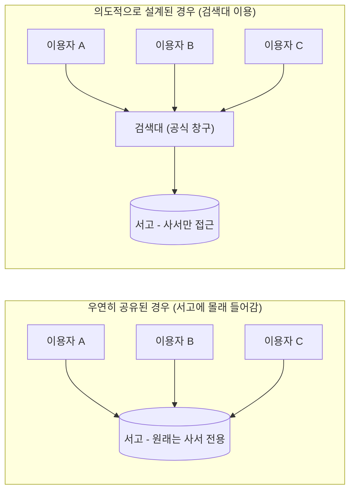
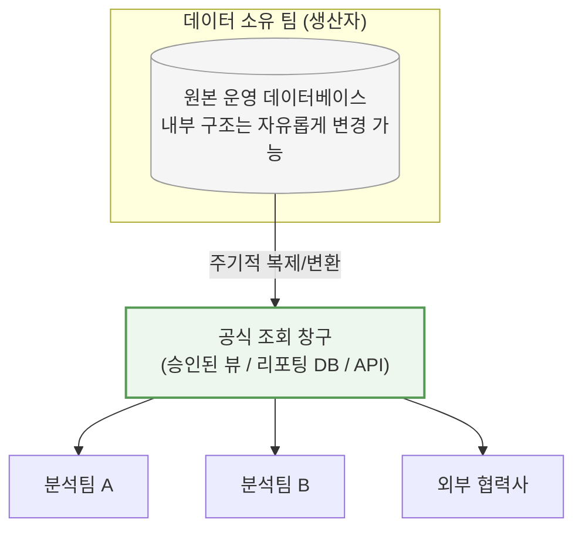

> 이 문서는 앞선 자료에서 잠깐 언급했던 문장, "처음부터 여러 소비자를 위해 설계·관리되는 조회용 데이터 종단점으로 데이터베이스를 공식적으로 노출하는 경우"가 실제로 무엇을 뜻하는지, 쉬운 비유와 실제 사례를 통해 풀어서 설명합니다.

---

## 1. 한 문장으로 먼저 정리하면

같은 "데이터베이스를 여러 곳에서 함께 쓰는" 상황이라도, **어쩌다 보니 공유하게 된 것**과 **처음부터 여러 사람이 쓰도록 작정하고 만든 것**은 완전히 다른 이야기입니다. 이 문서는 후자, 즉 "일부러 설계해서 공개한 데이터베이스"에 관한 이야기입니다.

---

## 2. 비유로 먼저 감을 잡아보기 — 도서관 이야기

도서관을 떠올려 보겠습니다.

- **서고(書庫)**: 사서만 들어갈 수 있는 공간입니다. 책이 어떤 순서로, 어떤 분류법으로, 어떤 선반에 꽂혀 있는지는 사서만 압니다. 사서는 이 배치를 언제든 자기 마음대로 바꿀 수 있습니다.
- **열람실 / 검색대**: 누구나 들어와서 책을 찾아볼 수 있는 공간입니다. 도서관은 이 공간을 "일반 이용자를 위해" 처음부터 설계해두었습니다. 검색대의 사용법은 함부로 바뀌지 않습니다. 바뀐다면 미리 안내문을 붙여둡니다.

만약 어느 날 이용자 여러 명이 사서 몰래 서고 안으로 들어가 직접 책을 뒤지기 시작했다고 생각해봅시다. 사서는 이제 선반 배치를 마음대로 바꿀 수 없습니다. 이용자들이 그 배치에 익숙해져 있고, 배치를 바꾸면 이용자들이 혼란에 빠지기 때문입니다. 이것이 바로 앞선 문서에서 설명한 **"우연히 공유되고 있는 데이터베이스"** 의 모습입니다. 서비스마다 각자 서고(데이터베이스)에 직접 들어가 테이블을 뒤지다 보니, 정작 데이터를 관리해야 할 팀이 구조를 바꾸지 못하게 되어버린 상황입니다.

반대로 열람실과 검색대는 도서관이 **"이용자들을 위해 의도적으로 만든" 창구**입니다. 서고 내부 배치가 어떻게 바뀌든, 검색대에서 책 제목을 입력하면 위치를 찾아주는 방식 자체는 그대로 유지됩니다. 이것이 바로 이 문서에서 설명할 **"의도적으로 서비스처럼 설계된 데이터베이스"**, 즉 데이터베이스 애즈 어 서비스(Database-as-a-Service, DaaS) 인터페이스 패턴입니다.

---

## 3. 소프트웨어 세계에서는 이게 어떤 모습일까

소프트웨어로 옮겨보면 두 상황은 이렇게 다릅니다.

| 구분 | 우연히 공유된 데이터베이스 | 의도적으로 설계된 데이터베이스 서비스(DaaS) |
|---|---|---|
| 시작 계기 | "일단 편하니까" 여러 서비스가 같은 테이블에 직접 접속 | 처음부터 "이 데이터를 여러 곳에서 조회할 것"을 전제로 설계 |
| 데이터 소유자 | 누구인지 불명확함 | 명확한 소유 팀이 존재함 |
| 쓰기(write) 권한 | 여러 서비스가 제각각 데이터를 바꿈 | 소유 팀만 쓰고, 나머지는 읽기 전용 |
| 구조 변경 | 누구 하나가 손대면 다른 곳이 예고 없이 깨짐 | 소유 팀이 버전 관리·공지를 하며 안전하게 바꿈 |
| 접근 범위 | 통제되지 않음 (누가 어떤 테이블을 쓰는지 모름) | 접근 권한과 조회 가능 범위가 명확히 정해져 있음 |

즉 겉으로 보이는 "여러 서비스가 하나의 데이터베이스를 들여다본다"는 그림은 똑같아 보여도, **누가 소유하고, 누가 쓸 수 있고, 어떻게 변경을 관리하는지**에 따라 완전히 다른 이야기가 됩니다.

---

## 4. 실제로 이런 패턴은 어디서 쓰이고 있을까 — 사례로 살펴보기

### 사례 1. 정부의 공공데이터 개방 서비스

기상청 날씨 정보, 우편번호 검색, 통계청 통계 자료처럼 정부 기관이 운영하는 공공데이터포털의 여러 API들은 이 패턴을 아주 잘 보여주는 예입니다. 기상청 내부에는 당연히 훨씬 복잡한 원본 데이터베이스가 있을 것입니다. 하지만 국민이나 기업이 그 원본 데이터베이스에 직접 접속하는 일은 없습니다. 대신 기상청은 "이 API로 이러이러한 형식의 데이터를 조회할 수 있다"는 조회 전용 창구를 처음부터 여러 소비자(수많은 앱과 서비스들)를 염두에 두고 설계해서 공개합니다. 내부 데이터베이스 구조가 아무리 바뀌어도, 이 API의 사용법(계약)은 함부로 바뀌지 않도록 관리됩니다. 이것이 바로 의도적으로 설계된 조회용 데이터 종단점입니다.

### 사례 2. 회사 안에서 운영되는 "리포팅 전용 복제본"

많은 회사에서는 실제 서비스가 쓰는 운영 데이터베이스와, 경영진·분석팀이 보고서나 대시보드를 만들 때 조회하는 데이터베이스를 따로 둡니다. 운영 데이터베이스는 실시간으로 주문이 들어오고 바뀌는 곳이라 여기에 여러 분석팀이 무거운 집계 질의를 마구 날리면 서비스 자체가 느려지거나 장애가 날 수 있습니다. 그래서 회사들은 데이터를 주기적으로 복제해 별도의 "리포팅용 데이터베이스"를 만들고, 이 복제본을 분석팀들에게 공식적으로 개방합니다. 이 복제본은 처음부터 "여러 분석팀이 함께 조회할 것"을 전제로 만들어졌고, 원본 운영 데이터베이스의 스키마가 바뀌더라도 리포팅용 데이터베이스의 형태는 별도로 관리되는 경우가 많습니다.

### 사례 3. 클라우드 데이터 웨어하우스의 "승인된 뷰(authorized view)"

구글 클라우드의 빅쿼리(BigQuery) 같은 대규모 데이터 분석 플랫폼에서는, 데이터를 만든 팀(생산자)이 원본 테이블을 직접 공개하지 않고 그 위에 "승인된 뷰"라는 조회 전용 창구를 만들어 다른 팀들에게 제공하는 방식을 공식적으로 권장합니다. 이렇게 하면 소비자 팀은 SQL로 편하게 데이터를 조회할 수 있으면서도, 원본 테이블의 내부 구조나 최적화 방식은 생산자 팀이 자유롭게 손볼 수 있습니다. 승인된 뷰라는 창구만 그대로 유지된다면, 소비자 쪽은 뒤에서 무슨 일이 일어나는지 전혀 몰라도 됩니다.

### 사례 4. "데이터 메시(Data Mesh)"의 데이터 프로덕트 개념

최근 여러 대규모 조직에서 채택하는 데이터 메시라는 접근 방식은 이 개념을 조직 전체의 원칙으로 확장한 것입니다. 각 부서(도메인)가 자신이 가진 데이터를 다른 부서에 그냥 던져주는 것이 아니라, 마치 하나의 "제품"을 만들듯이 잘 다듬어서 조회 전용 API, 테이블, 파일 등의 형태로 공식 제공합니다. 이때 그 데이터를 만든 부서가 데이터의 품질과 안정성에 대한 책임(소유권)을 명확히 지도록 하는 것이 핵심 원칙 중 하나로 강조되고 있습니다.

---

## 5. 이 패턴이 "제대로" 작동하려면 갖춰야 할 조건

앞의 사례들을 살펴보면 공통점이 보입니다. 단순히 "여러 명이 조회할 수 있게 열어뒀다"는 사실만으로는 이 패턴이라고 부를 수 없습니다. 다음 조건들이 함께 갖춰져 있어야 진짜 의미의 데이터베이스 서비스라고 할 수 있습니다.

- **소유자가 명확합니다.** 이 데이터를 누가 책임지고 관리하는지 물었을 때 망설임 없이 대답할 수 있어야 합니다.
- **읽기 전용으로 제공됩니다.** 소비자는 데이터를 조회만 할 수 있고, 마음대로 바꿀 수는 없습니다. 데이터를 바꾸는 권한은 오직 소유 팀에게만 있습니다.
- **계약처럼 관리됩니다.** 조회 형식(스키마)이 바뀔 때는 사전 공지, 버전 관리, 하위 호환성 유지 같은 절차를 거칩니다. 마치 API를 관리하듯이 이 조회 창구도 신중하게 관리됩니다.
- **내부 구조와 분리되어 있습니다.** 소유 팀은 원본 데이터베이스의 내부 구조(테이블 이름, 컬럼, 인덱스 등)를 조회 창구와 별개로 자유롭게 바꿀 수 있습니다. 조회 창구의 겉모습만 그대로 유지하면 됩니다.

이 네 가지 중 하나라도 빠져 있다면, 그것은 의도적으로 설계된 서비스가 아니라 그냥 "우연히 여러 명이 접근하게 된 데이터베이스"에 가깝습니다.

---

## 6. 그렇다면 아무 데이터나 이렇게 공개해도 될까

그렇지는 않습니다. 이 패턴이 잘 어울리는 데이터와 그렇지 않은 데이터가 있습니다.

**잘 어울리는 경우**는 다음과 같습니다. 자주 바뀌지 않는 참고용 데이터(예: 우편번호, 국가 코드, 환율 기준 정보), 여러 팀이 공통으로 필요로 하는 집계·분석용 데이터, 그리고 처음부터 "많은 사람이 조회할 것"이라는 목적이 뚜렷한 데이터가 여기에 해당합니다.

**잘 어울리지 않는 경우**는, 자주 바뀌고 여러 비즈니스 규칙이 복잡하게 얽혀 있는 핵심 거래 데이터입니다. 예를 들어 "지금 이 순간 이 주문이 결제 대기 상태인지, 배송 준비 상태인지"처럼 실시간으로 계속 변하고 여러 조건에 따라 의미가 달라지는 데이터는, 단순 조회 창구로 던져놓기보다는 그 데이터를 다루는 서비스가 API를 통해 직접 응답하도록 만드는 편이 훨씬 안전합니다. 이런 데이터를 함부로 조회 전용으로 열어두면, 소비자들이 그 순간의 스냅숏만 보고 잘못된 판단을 내릴 위험이 있습니다.

---

## 7. 이 패턴을 쓸 때 흔히 하는 실수

이 패턴을 도입했다가 다시 "우연히 공유된 데이터베이스" 상태로 되돌아가는 경우도 적지 않습니다. 흔히 나타나는 실수는 다음과 같습니다.

처음에는 조회 전용으로 시작했지만, 시간이 지나며 몇몇 팀이 "급하니까 잠깐만"이라며 직접 쓰기 권한을 요청해 허용해버리는 경우가 있습니다. 이렇게 되면 소유권이 다시 흐려지기 시작합니다. 또한 조회 창구의 형식을 바꿀 때 사전 공지나 버전 관리 없이 그냥 바꿔버리는 경우도 흔합니다. 이렇게 되면 소비자 입장에서는 예고 없이 서비스가 깨지는 것과 다를 바 없는 경험을 하게 됩니다. 마지막으로, 소비자가 계속 늘어나는데도 누가 이 창구를 쓰고 있는지 파악하지 못하는 경우도 있습니다. 이럴 경우 나중에 정말로 형식을 바꿔야 할 때, 누구에게 영향이 가는지조차 알 수 없어 변경 자체가 두려운 일이 되어버립니다.

---

## 8. 정리

한 문장으로 다시 정리하면 이렇습니다. **여러 곳에서 같은 데이터베이스를 들여다보고 있다는 사실 자체는 문제가 아닙니다. 문제는 그것이 "우연"이냐 "의도"냐입니다.** 소유자가 분명하고, 읽기 전용으로 제공되고, 계약처럼 신중하게 관리되는 조회 창구라면, 이는 오히려 데이터를 여러 팀이 효율적으로 재사용할 수 있게 해주는 실용적인 방법입니다. 반대로 소유자도 불분명하고 아무나 쓰고 바꿀 수 있는 상태라면, 그것은 이름만 다를 뿐 앞선 문서에서 설명한 공유 데이터베이스 안티패턴과 정확히 같은 문제를 안고 있는 것입니다.

---

## 9. 용어 정리 (한글 glossary)

| 용어 | 설명 |
|---|---|
| DaaS 인터페이스 패턴 (Database-as-a-Service) | 데이터베이스를 처음부터 여러 소비자를 위한 조회 전용 서비스로 의도적으로 설계·관리하는 방식 |
| 읽기 전용(Read-only) | 데이터를 조회만 할 수 있고 변경은 할 수 없는 접근 권한 |
| 승인된 뷰(Authorized View) | 원본 테이블을 직접 공개하지 않고, 조회 전용으로 허용된 형태만 보여주는 뷰 |
| 리포팅 데이터베이스(Reporting Database) | 실시간 운영 데이터베이스와 분리해, 분석·보고용으로 별도 운영하는 복제 데이터베이스 |
| 데이터 메시(Data Mesh) | 각 부서(도메인)가 자신의 데이터를 제품처럼 관리하고 공식적으로 공유하는 조직·아키텍처 접근 방식 |
| 데이터 프로덕트(Data Product) | 데이터 메시 접근에서, 소유 팀이 품질과 안정성을 책임지고 공식 제공하는 데이터 단위 |
| 소유권(Ownership) | 어떤 데이터를 누가 관리하고 변경할 책임을 지는지에 대한 명확한 귀속 |

---

## 10. 참고 자료 및 출처

- Google Cloud Architecture Center, "Build data products in a data mesh" (승인된 뷰를 통한 데이터 공개 권장 내용) — https://docs.cloud.google.com/architecture/build-data-products-data-mesh
- Martin Fowler, Zhamak Dehghani, "Data Mesh Principles and Logical Architecture" — https://martinfowler.com/articles/data-mesh-principles.html
- datamesh-architecture.com, "Data Mesh Architecture: Designing Data Products" — https://www.datamesh-architecture.com/data-product-canvas
- 공공데이터포털(data.go.kr) — 정부 공공데이터 개방 API 서비스 일반 안내 (기관별 API 목록 및 이용 방식은 포털에서 직접 확인 가능)

> **사실 확인 안내**: 정부 공공데이터포털이나 사내 리포팅 데이터베이스에 관한 서술은 업계에서 널리 통용되는 일반적인 운영 방식을 예시로 소개한 것이며, 특정 기관·기업의 내부 시스템 구조를 실제로 검증한 것은 아닙니다. 데이터 메시와 승인된 뷰 관련 내용은 구글 클라우드 및 마틴 파울러(Martin Fowler)의 공식 아티클을 근거로 확인했습니다.
