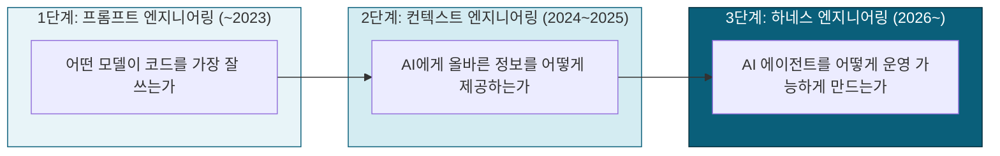
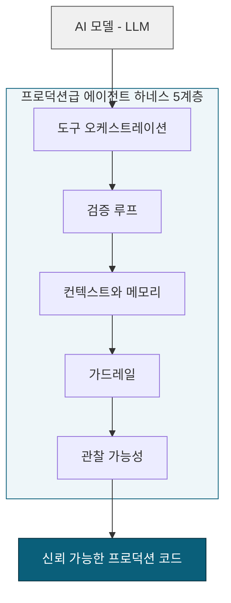

### Uncle Bob Martin 게시물 심층 분석 (2026년 8월 13일)

---

## 1. 문서 개요

이 문서는 2026년 8월 13일 자정 무렵(00:36) 로버트 C. 마틴(Robert C. Martin), 흔히 "Uncle Bob"으로 불리는 소프트웨어 공학계의 원로가 X(옛 트위터)에 올린 짧은 게시물 하나를 출발점으로 삼는다. 해당 게시물은 게시 후 약 하루 만에 4만 8천 회가 넘는 조회수를 기록했고, 수십 개의 인용 및 답글을 낳으며 업계 인사들 사이에서 활발한 토론으로 이어졌다. 이 문서는 단순히 게시물 문장을 옮기는 데 그치지 않고, 그 문장이 왜 지금 이 시점에 이토록 큰 공감과 논쟁을 동시에 불러일으켰는지를 이해할 수 있도록 배경 맥락, 업계 용어의 계보, Uncle Bob 본인의 최근 실험 궤적, 그리고 댓글창에서 벌어진 실제 논쟁의 구조를 함께 정리한다.

문서 전반에서 사실 확인이 된 내용과 특정 매체의 주장, 그리고 커뮤니티 반응 및 해석적 종합을 구분해서 서술하려고 노력했다. 특히 "하네스 엔지니어링"이라는 용어의 기원처럼 출처마다 서술이 엇갈리는 부분은 어느 쪽이 더 널리 인용되는 설명인지와 함께, 아직 1차 출처가 명확히 확인되지 않았다는 점도 함께 밝혀 둔다.

---

## 2. 원문 게시물

Uncle Bob Martin(계정 [@unclebobmartin](https://x.com/unclebobmartin/status/2087563797632278592?s=20))이 2026년 8월 13일 오전 0시 36분에 올린 게시물의 본문은 다음과 같다.

> "The ability to wrangle these immensely powerful, yet dangerously capricious, agents into a productive harness that produces high quality systems — is the software engineering challenge of this decade."

한국어로 옮기면 대략 다음과 같은 의미다. "이 엄청나게 강력하지만 동시에 위험할 정도로 변덕스러운 에이전트들을 길들여, 고품질 시스템을 만들어내는 생산적인 하네스(harness) 안에 담아내는 능력, 그것이 바로 이 시대(2020년대)의 소프트웨어 엔지니어링 과제다."

문장을 조금 더 풀어서 읽어보면 세 가지 핵심 요소로 나뉜다. 첫째, AI 코딩 에이전트는 "immensely powerful"하다는 것, 즉 압도적인 생산 능력을 갖췄다는 점을 전제로 깔고 있다. 둘째, 동시에 "dangerously capricious"하다는 것, 즉 예측 불가능하고 변덕스러워서 그대로 두면 위험할 수 있다는 점을 인정한다. 셋째, 이 두 가지 상반된 특성을 가진 존재를 "harness"라는 틀 안에 담아 "고품질 시스템(high quality systems)"을 만들어내는 일이야말로 진짜 도전 과제라고 규정한다. 마지막으로 이 도전의 시간적 스케일을 "this decade", 즉 향후 10년 단위의 과제로 못박았다는 점도 눈여겨볼 만하다.

---

## 3. Robert C. Martin(Uncle Bob)은 누구인가

이 게시물의 무게감을 이해하려면 발화자가 누구인지를 먼저 짚어야 한다. 로버트 세실 마틴은 1952년생으로, 1970년부터 소프트웨어 업계에 몸담아 온 인물이다. 그는 애자일 선언문(Agile Manifesto)의 서명자 중 한 명이며, SOLID 원칙이라는 객체지향 설계 5원칙을 정리해 널리 알린 것으로 가장 유명하다. 1991년에는 Object Mentor라는 컨설팅 회사를 설립했고, C++ Report 매거진의 편집장을 지냈으며, Agile Alliance의 초대 의장을 맡기도 했다. 그가 쓴 『Clean Code』, 『Clean Architecture』, 『The Clean Coder』 등의 저서는 지난 십수 년간 전 세계 소프트웨어 개발자들의 필독서로 자리 잡았다.

다시 말해 그는 "코드는 깨끗해야 하며, 그 깨끗함은 사람이 직접 규율을 지켜야 얻어진다"는 철학을 수십 년간 설파해 온 사람이다. 그런 그가 AI 에이전트, 즉 사람이 코드를 한 줄도 직접 쓰지 않는 개발 방식에 대해 발언하고 있다는 사실 자체가 이 게시물이 화제가 된 이유 중 하나다. 실제로 댓글 중 한 명(Michal49465998)은 "정치적 발언 때문에 소프트웨어 개발 레전드로서의 명성이 지워지지 않길 바란다"는 취지의 반응을 남기기도 했는데, 이는 최근 Uncle Bob이 AI 관련 발언으로 업계에서 상당한 주목과 함께 일부 반발도 사고 있음을 시사한다.

---

## 4. "하네스 엔지니어링"이란 무엇인가

### 4.1 용어의 기원과 확산

"하네스(harness)"라는 단어는 원래 마차나 썰매를 끄는 말에게 채우는 마구, 즉 고삐와 안장, 재갈 등 힘세지만 통제되지 않는 동물을 원하는 방향으로 이끌기 위한 장비 일체를 가리키는 말이다. AI 업계에서는 이 단어를 은유적으로 가져와, 강력하지만 예측 불가능한 LLM(대형 언어 모델)을 실제 프로덕션 환경에서 신뢰할 수 있게 작동시키기 위해 그 주변에 둘러 세우는 도구, 제약, 피드백 루프 전체를 지칭하는 말로 쓰고 있다.

이 용어를 처음 대중화시킨 인물로 가장 널리 지목되는 사람은 HashiCorp의 공동 창업자이자 Terraform의 창시자인 미첼 하시모토(Mitchell Hashimoto)다. 여러 매체가 그가 2026년 2월 초 자신의 블로그에 올린 글에서 이 용어를 제시했다고 전한다. 다만 한 가지 밝혀둘 점은, 이 원문 게시물의 URL 자체는 여러 매체가 독자적으로 재확인하지 못했으며, 현재 인용되는 정의 대부분은 2차 보도에 근거하고 있다는 사실이다. 즉 "하시모토가 처음 썼다"는 서술은 업계에서 폭넓게 반복되고 있는 설명이긴 하지만, 1차 출처가 명확히 검증된 사실이라기보다는 여러 매체가 공유하는 정설에 가깝다고 이해하는 편이 정확하다.

이 개념이 본격적으로 주류 담론에 편입된 계기로 자주 언급되는 것은 OpenAI 소속 라이언 로포폴로(Ryan Lopopolo)가 2026년 2월 11일에 올린 글이다. 이 글은 OpenAI의 Codex 팀이 사람이 단 한 줄도 직접 작성하지 않은 100만 줄 이상 규모의 프로덕션 애플리케이션을 구축한 경험을 바탕으로 하네스 엔지니어링을 공식적으로 정의한 것으로 알려져 있다. 다만 이 "100만 줄, 제로 휴먼 코드"라는 수치 역시 OpenAI 측이 공개한 사례로 보도되는 내용이며, 독립적인 제3자 검증 결과라기보다는 벤더가 제시한 성과 주장으로 받아들이는 것이 정확한 태도일 것이다.

### 4.2 세 단계의 진화: 프롬프트 → 컨텍스트 → 하네스

업계에서 통용되는 서사에 따르면, AI를 활용한 소프트웨어 개발은 대략 세 단계를 거쳐 발전해 왔다. 이 세 단계는 "엔지니어링 리더들이 던지는 질문이 어떻게 바뀌어 왔는가"로 요약할 수 있다.

첫 번째는 프롬프트 엔지니어링 단계로, 초기 화두는 "어떤 모델이 코드를 가장 잘 짜는가"였다. 이 시기에는 모델 선택과 프롬프트 문구 자체가 결과물의 품질을 좌우한다고 여겨졌다.

두 번째는 2024년에서 2025년에 걸친 컨텍스트 엔지니어링 단계다. 모델 성능이 향상되면서 병목이 "무엇을 말하는가"에서 "무엇을 알려주는가"로 옮겨갔다. 관련 파일, 프로젝트 규칙, 아키텍처 제약 등 모델의 컨텍스트 윈도우에 무엇을 채워 넣을지를 정교하게 큐레이션하는 작업이 중요해졌고, MCP(Model Context Protocol)나 RAG 같은 기술이 이 과정을 체계화하는 데 쓰였다.

세 번째가 바로 2026년 현재 진행 중인 하네스 엔지니어링 단계다. 이제 화두는 "AI 에이전트를 어떻게 운영 가능한(operationalize) 수준으로 만들 것인가"로 옮겨갔다. 핵심 원칙은 "에이전트가 실수를 저지르는 것을 발견할 때마다, 그 에이전트가 다시는 같은 실수를 하지 않도록 시스템을 설계하는 데 시간을 투자한다"는 것이며, 대부분의 경우 그 해법은 더 나아진 하네스의 형태로 구현된다.

### 4.3 "Agent = Model + Harness" 공식

하네스 엔지니어링을 다루는 여러 글에서 공통적으로 등장하는 공식이 하나 있다. 바로 "Agent = Model + Harness", 즉 에이전트는 모델 그 자체가 아니라 모델과 그 모델을 감싸는 하네스의 합이라는 명제다. 이 관점에서 순수한 LLM 하나만으로는 아직 에이전트가 아니며, 상태 관리, 도구 실행, 피드백 루프, 강제 가능한 규칙 같은 것을 갖췄을 때 비로소 에이전트가 된다고 본다. 실제로 코딩 에이전트뿐 아니라 엔터프라이즈 자동화 파이프라인, 멀티 에이전트 시스템 전반에 걸쳐 하네스는 예측 불가능한 LLM을 신뢰 가능하고 감사 가능한(auditable) 작업 엔진으로 바꿔주는 장치로 설명된다.

이 공식이 실무적으로 중요한 이유는, 모델 시장이 점점 평준화되는 이른바 "대수렴(the Great Convergence)" 현상 속에서 경쟁 우위의 원천이 어떤 모델을 쓰는가에서 하네스가 얼마나 견고한가로 옮겨간다는 주장과 맞닿아 있기 때문이다. 비즈니스 로직, 검증 기준, 가드레일 규칙이 전부 하네스 코드 안에 존재한다면, 모델 계층은 완전히 상품화(commoditize)되고 특정 벤더에 종속되지 않는 구조를 가질 수 있다는 논리다. 다만 이는 특정 매체(Medium 기고문)의 해석적 주장이며, 업계 전체가 합의한 정설이라기보다는 하네스 엔지니어링을 옹호하는 진영의 대표적 논거 중 하나로 받아들이는 것이 정확하다.

### 4.4 프로덕션급 하네스의 구성 레이어

하네스를 실제로 무엇으로 구성하는지에 대해서는 매체마다 약간씩 다른 프레임을 제시한다. 비교적 폭넓게 인용되는 한 가지 구분법은 프로덕션급 하네스를 다섯 개 레이어로 나누는 방식이다. 도구 오케스트레이션(tool orchestration), 검증 루프(verification loops), 컨텍스트와 메모리(context and memory), 가드레일(guardrails), 관찰 가능성(observability)이 그것이다. 엔지니어링 리더들은 우선 병합된 PR 하나당 비용, 에이전트 지원 PR의 병합 소요 시간, PR 규모 대비 리뷰 속도, 개발자 1인당 컴퓨팅 지출 같은 기존 시스템에서 뽑아낼 수 있는 지표로 현재 상태를 파악한 뒤, 그 데이터를 근거로 다섯 레이어 중 어디에 우선 투자할지를 결정해야 한다는 것이 이 프레임의 제안이다.

이와 다소 결이 다른 세 계층 구분법도 존재한다. 정보 계층(Information Layer, 에이전트가 무엇을 볼 수 있고 어떤 도구를 호출할 권한이 있는지를 규정), 피드백 계층(Feedback Layer, 실수를 데이터베이스나 저장소에 기록해 같은 실수를 반복하지 않도록 함), 그리고 아우터 하네스(Outer Harness, 플랫폼 팀이 구축하는 커스텀 설정과 테스트 프레임워크, 상황별 가이드라인)로 나누는 방식이다. 이 문서에서는 두 구분법이 서로 대립하는 정설이라기보다는, 같은 대상을 다른 각도에서 자른 서로 다른 저자의 프레임으로 이해하는 편이 적절하다는 점을 밝혀둔다.

한 가지 실무적으로 자주 강조되는 원칙은 "가볍게 시작하라(start simple)"는 것이다. 정교한 미들웨어를 처음부터 쌓기보다, 잘 작성된 AGENTS.md 문서 하나와 pre-commit 훅 몇 개가 더 큰 효과를 낸다는 조언이 반복적으로 등장한다. 동시에 하네스를 지나치게 정교하게 짜면 모델이 개선될 때 오히려 깨지기 쉬우므로, 언제든 뜯어고칠 수 있는 "리퍼블(rippable)"한 구조를 유지해야 한다는 경고도 함께 따라붙는다. 이는 JinYong이 이전부터 정리해 온 "하네스 흡수(harness absorption)" 개념, 즉 모델이 강력해질수록 단순한 스캐폴딩이 모델 자체의 동작이나 제품 기능으로 흡수되어 버린다는 관찰과도 정확히 맞닿아 있는 실무 원칙이다.

---

## 5. Uncle Bob의 2026년 하네스 실험 궤적

이번 게시물은 어느 날 갑자기 나온 발언이 아니라, Uncle Bob이 2026년 상반기 내내 자신의 X 계정을 통해 공개적으로 기록해 온 일련의 실험과 성찰의 연장선에 있다. 시간 순서를 따라가 보면 다음과 같은 흐름이 드러난다.

2026년 5월 중순, 그는 에이전트 스웜(swarm)을 하루 종일 가동한 실험을 공개했다. 의도적으로 에이전트들이 컨텍스트를 반복해서 압축(compact)하도록 내버려두었더니 흥미로운 현상이 나타났다고 전했다. 에이전트들이 점차 자신만의 정체성을 잃어버리기 시작했고, 코더 역할의 에이전트가 부실한 분석을 내놓기 시작했으며, 리팩터러 역할의 에이전트는 코더가 이미 그 작업을 해버려서 할 일이 없다고 판단하거나, 다른 에이전트에게 메시지를 보내려면 자신의 허락이 필요하다고 잘못 판단하는 등 오작동이 관찰되었다는 것이다. 며칠 뒤인 5월 23일에는 컨텍스트가 돌이킬 수 없이 오염되었을 때마다 스웜을 해체하고 새로 기동시킨다는 자신의 운영 방식을 공유했다. 신선한 컨텍스트로 다시 시작한 에이전트들이 기존 코드를 살펴보고는 마치 밤샘 근무 후 잠을 자고 출근해 전날의 결과물을 마주한 사람처럼 "맙소사, 이게 다 뭐야, 지금 당장 치워야겠어" 같은 반응을 보였다고 묘사했다.

7월 하순 무렵에는 자신이 에이전트가 작성한 코드를 전혀 읽지 않는다는 방식을 재차 강조했다. 1960년대 후반부터 코딩을 시작했다고 밝히며, 자신에게 가능한 유일한 생산성 확보 전략은 코드를 읽지 않는 대신 에이전트를 극단적인 제약(extreme constraints) 안에 가두는 것이라고 설명했다. 이 시기 그는 "코드를 깨끗하게 하라고 지시할 수는 없다. 대신 그 청결함을 측정하고, 실패를 스스로 교정하게 만들어야 한다. 그런 제약이 없으면 에이전트는 자신이 유지보수할 수 없는 커다란 진흙 덩어리(big ball of mud)를 기꺼이 만들어낸다"는 취지의 발언도 남겼다. 이는 자신의 저서가 주장해 온 "사람이 규율을 지켜 깨끗한 코드를 쓴다"는 철학과 언뜻 모순되어 보일 수 있는데, 실제로 몇몇 팔로워가 "당신의 AI 메시지가 당신 책의 메시지를 갉아먹고 있다"고 지적했을 때 그는 "그런 지적을 하는 사람들은 에이전트가 어떻게 작동하고 누가 실제로 그것을 통제하는지 이해하지 못하는 것"이라고 반박했다.

같은 시기 그의 실전 방법론을 다룬 외부 분석 글들도 등장했다. 한 매체는 그가 코드 리뷰 대신 "테스트 건틀릿(test gauntlet)"을 구축하는 방식을 취하고 있다고 전했고, 2026년 6월에는 그의 방법론을 형식화한 제3자 글이 나왔다. 이 글에 따르면 그의 파이프라인은 느슨한 형태의 명세를 거킨(Gherkin) 형식의 스펙으로 작성하고, 이를 JSON 중간 표현으로 컴파일한 뒤, 실제 테스트 코드와 러너를 생성하며, 여기에 뮤테이션 테스팅을 사이드카 계층으로 얹어 생성된 테스트가 실제로 버그를 잡아낼 수 있는지를 검증하는 구조로 되어 있다고 한다. 즉 "리뷰하지 않는 유닛 테스트가 정말 쓸모 있는지 어떻게 아는가"라는 질문에 대한 그의 답은 사람이 직접 읽는 것이 아니라 뮤테이션 테스팅이라는 기계적 검증이라는 것이다.

가장 최근인 2026년 8월 초, 그러니까 이번 문제의 게시물이 올라오기 불과 며칠 전에는 여러 에이전트로 구성된 "스쿼드(squad)"를 오케스트레이션하는 하네스를 만들고 있다고 밝혔다. 스쿼드 리더 역할의 에이전트 하나가 분석가, 리뷰어, 거킨 작성자, QA 작성자, 구현자, 클리너, 코드 리뷰어, 하드너(hardener), QA 테스터 등 다수의 워커 에이전트를 감독하는 구조를 구축 중이라고 전했다.

이 흐름을 따라가 보면, 이번 "이 시대의 소프트웨어 엔지니어링 과제"라는 발언은 몇 달간 실제로 자신의 손으로 스웜을 돌리고, 무너뜨리고, 다시 세우고, 검증 파이프라인을 다듬어 온 사람의 결론이라는 것을 알 수 있다. 단순한 트렌드 편승 발언이 아니라, 반복된 실패와 재시도 끝에 나온 실무적 요약에 가깝다.

---

## 6. 댓글창 반응 분석

이 게시물에는 수십 개의 답글이 달렸는데, 크게 다섯 가지 흐름으로 나누어 볼 수 있다.

**공감과 실전 경험담.** 상당수의 답글은 자신도 비슷한 경험을 하고 있다는 실무자들의 증언이었다. 한 사용자(Aleksandar Grbic)는 지난 4개월간 직접 하네스를 만들어 왔다며 "재미있으면서도 완전히 결정론적으로 만들기가 대단히 복잡하다"고 확인해 주었다. Seth Gammon은 병렬 에이전트 플릿, 라우팅, 오케스트레이션을 일찍부터 구현한 오픈소스 하네스를 직접 만들어 공개했고 긍정적이든 부정적이든 실험 결과를 계속 발표하고 있다고 소개했다. Doug Standley는 "에이전트 한 대가 인상적인 결과를 내게 하는 것은 쉽지만, 열 대가 신뢰성 있게 함께 무언가를 만들게 하는 것은 완전히 다른 문제"라는 통찰을 남겼고, Udoh Jeremiah는 이를 "모델은 능력(capability)을 주고, 하네스는 신뢰성(reliability)을 준다"는 한 문장으로 압축했다.

**농담과 밈.** 흥미롭게도 상당한 비중의 댓글이 본문에 쓰인 em dash(—) 기호를 겨냥한 농담이었다. 최근 AI가 생성한 텍스트에서 em dash가 유독 자주 등장한다는 인터넷 밈이 퍼져 있는데, Uncle Bob의 글에도 em dash가 쓰이자 여러 사용자가 "이 em dash는 손으로 직접 친 거겠지?"라거나 "em dash 앞뒤로 공백 개수가 짝이 안 맞는데 그냥 하이픈을 쓰지 그랬냐" 같은 장난스러운 지적을 남겼다. 이는 AI 도구를 옹호하는 사람의 글조차 "혹시 AI가 대신 써준 것 아니냐"는 의심을 받는 요즘 온라인 문화의 한 단면을 보여준다.

**비유의 확장.** 원문의 "wrangle(길들이다)"이라는 표현에 착안해 여러 사용자가 자기 나름의 비유를 덧붙였다. 야생마를 길들이는 것과 같다는 비유(chetansawai), 개썰매를 모는 것과 비슷하다는 비유(Anwar), 전투기 조종사에게 자전거 타는 법을 가르치는 것 같다는 비유(Hαlk) 등이 이어졌다. Leon Grapenthin은 조금 더 냉소적으로 이를 "소프트웨어 엔지니어링의 영구기관(perpetuum mobile)"이라 부르기도 했다.

**회의론과 반박.** 모든 반응이 동의 일색은 아니었다. 한 사용자(Lee Kuan Yappin, 자신을 논평 계정이라 밝힘)는 "정말 10년이나 갈 것 같냐"고 반문했고, Aditya Khare는 "이들이 이미 고품질 시스템을 만들고 있지 않냐, 오히려 이건 아직 에이전트에게 없는 양심(conscience)의 문제에 가깝다"는 시각을 제시했다. 가장 근본적인 반박은 Serj의 답글이었는데, 그는 "변덕스러운 에이전트를 길들이는 법을 배우는 것이 이 시대의 과제가 아니라, 애초에 그럴 필요가 없는 환경을 만드는 것이 진짜 과제일 수 있다"고 지적했다. Tushar는 조금 더 기술적인 회의론을 제기했는데, "에이전트들이 서로의 테스트를 실행할 수는 있지만, 그 테스트가 여전히 원래 의도를 정확히 담고 있는지를 점검하는 장치는 없다"는 검증의 검증 문제를 짚었다.

**경제·산업적 시각.** 몇몇 답글은 논의를 기술 밖으로 확장시켰다. Michał Gadziński는 "이 속도라면 5년 안에 해결될 것이고, 진짜 이 시대의 과제는 화이트칼라 노동시장의 경제학이 될 것"이라고 전망했다. rumplestiltskin은 조금 더 날 선 어조로 "월세를 내는 게 이 시대의 진짜 엔지니어링 과제이고, 정작 그 커리어를 공동화시킨 장본인들이 전환을 도와주겠다는 게 우습다"는 취지의 비판을 남겼다. Aibol Kussain은 "이제 시니어 엔지니어가 하네스를 작성하고, 주니어 엔지니어는 그것을 사용하면서 동시에 이 기술을 배우는 주체가 되고 있다"는 역할 분화 관찰을 내놓았다.

---

## 7. 종합 해석 및 시사점

이 게시물과 그에 달린 반응들을 종합해 보면 몇 가지 확인 가능한 흐름이 드러난다.

첫째, "하네스 엔지니어링"이라는 개념은 더 이상 소수의 실험적 담론이 아니라, Clean Code 저자처럼 수십 년간 사람 중심의 코딩 규율을 설파해 온 인물조차 자신의 실무 철학의 핵심으로 받아들일 만큼 업계 주류로 편입되고 있다는 점이다. 다만 흥미로운 점은, Uncle Bob의 접근 방식이 흔히 이야기되는 "느슨한 프롬프트 기반 통제"가 아니라 오히려 뮤테이션 테스팅, 거킨 스펙, 하드닝(hardening) 에이전트 같은 극단적으로 엄격하고 기계적인 검증 체계라는 것이다. 이는 그가 평생 주장해 온 "규율(discipline)"이라는 가치관이, 사람이 아니라 하네스라는 시스템 쪽으로 그 집행 주체만 옮겨간 형태로 이해할 수 있다.

둘째, 댓글창의 회의론들, 특히 "검증의 검증이 빠져 있다"는 지적이나 "에이전트가 여전히 서로의 코드를 재구현해 버린다"는 실사용 경험(Breno Beirigo가 자신의 에이전트에게 벤치마크용 SOTA 기법을 다운로드해 오라고 시켰더니 그대로 가져오지 않고 재작성해 버렸다는 사례를 언급)은, JinYong이 이전부터 정리해 온 데모-프로덕션 격차, 즉 겉보기에는 완성된 것 같지만 예외 처리, 권한 관리, 로깅, 운영 연속성이 빠져 있는 "AX 시어터" 위험과 정확히 같은 결의 문제로 읽힌다. 하네스가 아무리 정교해도 "테스트가 의도를 제대로 인코딩하고 있는가"라는 상위 차원의 검증은 여전히 미해결 과제로 남아 있다는 뜻이다.

셋째, "5년이면 해결될 것"이라는 낙관론과 "10년까지 갈까"라는 회의론이 같은 댓글창에서 공존한다는 사실 자체가, 이 분야가 아직 합의된 궤적을 갖지 못한 초기 단계에 있음을 보여준다. 이는 특정 벤더나 특정 프레임워크의 방법론을 절대적 정답으로 받아들이기보다, 모델 세대가 바뀔 때마다 하네스의 어느 부분이 흡수되고 어느 부분이 여전히 사람의 설계를 필요로 하는지를 계속 관찰하며 갱신해 나가는 태도가 필요하다는 점을 시사한다.

---

## 8. 참고자료

아래는 이 문서를 작성하며 실제로 확인한 출처들이다. "하네스 엔지니어링"의 정의와 계보에 관한 서술은 주로 아래 매체들의 2026년 기사에 근거했으며, 1차 출처가 불명확한 부분은 본문에서 별도로 밝혔다.

- Uncle Bob Martin(@unclebobmartin), X, 2026년 8월 13일 게시물 및 관련 게시물 이력 (x.com/unclebobmartin)
- Faros AI, "Harness Engineering: Making AI Coding Agents Work in 2026" (faros.ai/blog/harness-engineering)
- Augment Code, "Harness Engineering for AI Coding Agents: Constraints That Ship Reliable Code" (augmentcode.com/guides/harness-engineering-ai-coding-agents)
- NxCode, "Harness Engineering Guide" 및 "What Is Harness Engineering?" (nxcode.io/resources/news)
- Martin Fowler, "Harness engineering for coding agent users" (martinfowler.com/articles/harness-engineering.html)
- Medium, Vishal Mysore, "Harness Engineering for AI Agents in 2026"
- Medium, Muhammad Adnan Mushtaq, "What Is an AI Harness? The Complete Guide (2026)"
- explainx.ai, "Uncle Bob: Skip Code Review, Build a Test Gauntlet" (2026년 7월)
- Wikipedia, "Robert C. Martin" 항목

---

작성일자: 2026-08-13
