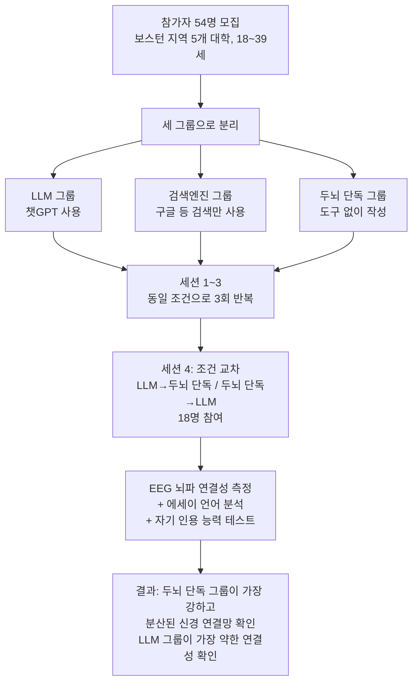

## 이 글의 출처

이번에 살펴볼 내용은 퍼블리싱 플랫폼 Vocal Media의 Futurism 채널에 "Behind the Tech"라는 필명으로 게재된 에세이, 「I Caught My MIT Students Using ChatGPT to Write Fiction. What Happened Next Changed My Classroom Forever(나는 MIT 학생들이 챗GPT로 소설을 쓰고 있다는 걸 알아챘다. 그 이후 벌어진 일이 내 강의실을 영원히 바꿔놓았다)」이다. 2026년 5월 11일경 게재되었으며, 부제는 "AI는 지면 위에 '죽은 완벽함(dead perfection)'을 만들어낼 수 있지만, 그것은 글쓰기가 본래 우리에게 가르쳐야 할 단 한 가지, 즉 '생각하는 법'을 죽이고 있다"는 문장이다. 필자는 2017년부터 MIT에서 소설 창작을 가르쳐온 인물로 자신을 소개하고 있으며, 같은 시기 AI 트렌드를 다루는 뉴스레터 「Rethinking the Hype Cycle」에서도 이 글이 별도로 인용되며 화제가 되었다.

글의 제목에 등장하는 "죽은 완벽함"이라는 표현은 필자가 직접 만든 말이 아니라, 19세기 영국 시인 앨프리드 테니슨(Alfred Lord Tennyson)의 극시 「모드(Maud)」(1855년, 1부 2장 6행)에서 따온 구절이다. 원문은 다음과 같다.

> "Faultily faultless, icily regular, splendidly null, Dead perfection, no more."
> (흠잡을 데 없이 흠잡을 데 없고, 얼음처럼 규칙적이며, 화려하게 공허한, 죽은 완벽함, 그뿐.)

테니슨의 시에서 이 문장은 겉보기에는 나무랄 데 없이 아름답지만 어떤 생기도, 결점도, 개성도 없는 여성을 묘사하는 대목이다. 완벽하지만 텅 비어 있다는 역설적 이미지 때문에, 이 구절은 최근 몇 년 사이 AI가 생성한 글을 비평하는 자리에서 자주 인용되는 표현이 되었다. 이 문서에서는 이 에세이의 내용을 사건의 흐름에 따라 상세히 풀어 설명하고, 필자가 근거로 제시한 실증 연구를 별도로 검증하여 사실관계를 명확히 구분해 정리한다.

---

## 사건의 전말: 두 편의 소설, 그리고 정적

필자는 2017년부터 MIT에서 소설 창작 워크숍을 가르쳐 왔다고 밝힌다. 수강생 대부분은 영문학도가 아니라 공학도다. 방정식을 풀 때는 늘 정답이 하나로 정해져 있는 세계에 익숙한 학생들에게, 정답이 없는 소설 쓰기는 공포에 가까운 과제라고 필자는 설명한다.

지난 학기 첫 워크숍을 위해 학생 두 명이 제출한 단편소설을 열어 본 순간, 필자는 뭔가 이상하다는 느낌을 받았다. 문장은 지나치게 매끈했고, 은유는 지나치게 깔끔하게 맞아떨어졌으며, 모든 인물의 서사는 마치 수학 증명처럼 빈틈없이 마무리되어 있었다. 필자는 이 어색한 완벽함을 앞서 소개한 테니슨의 시구로 표현했다. "흠잡을 데 없이 흠잡을 데 없고, 얼음처럼 규칙적이며, 화려하게 공허한, 죽은 완벽함, 그뿐."

필자는 수업 시간에 이 문장을 소리 내어 읽은 뒤 학생들에게 말했다. "AI가 이걸 썼네요." 교실에는 라디에이터가 째깍거리는 소리만 들릴 만큼 정적이 흘렀고, 이내 눈물을 보이는 학생이 나왔다.

한 학생은 초고를 "문법 검사"를 위해 챗GPT에 입력했다고 고백했다. 그런데 문법 검사에 그치지 않고 챗GPT가 문장 단위 교정을 제안했고, 다음에는 구조 자체를 손보기 시작했으며, 결국 이야기 전체를 다시 써 주었다는 것이다. 이 학생은 부정행위를 하려던 의도가 아니라 "바보처럼 보일까 봐" 두려웠을 뿐이라고 말했다. 다른 학생은 지금까지 단 한 번도 소설을 써 본 적이 없었고, 아이디어는 있었지만 어디서부터 시작해야 할지 몰랐다고 답했다. 필자가 "왜 나에게 도움을 청하지 않았느냐"고 묻자 그는 그저 어깨를 으쓱했을 뿐이었다.

---

## 학생들의 반문, 그리고 그 안에 담긴 진짜 질문

고백 이후 교실에서는 본격적인 토론이 시작됐다. 학생들은 다음과 같은 질문을 던졌다.

- "AI가 우리 아이디어를 바탕으로 이야기를 써 주는 게 왜 나쁜가요?"
- "MIT가 AI의 발상지 아닌가요? 우리가 왜 이런 논쟁을 하고 있는 거죠?"
- "AI의 존재 목적 자체가 지루한 노동에서 우리를 해방시키는 것 아닌가요?"

필자는 이 질문들이 틀린 질문은 아니라고 인정하면서도, 학생들이 글쓰기라는 행위 자체의 본질을 놓치고 있다고 지적한다.

---

## 핵심 주장: 글쓰기는 원래 쉬워서는 안 된다

이 에세이의 중심 논지는 다음 문장으로 요약된다. "우리는 글쓰기를 문장을 만들어내는 행위라고 생각하지만, 사실은 그렇지 않다. 글쓰기란 지속적인 주의력을 통해 인내심을 훈련하는 과정이며, 스스로 말하도록 강제함으로써 자신이 무엇을 생각하는지 알아가는 과정이다."

필자는 거대언어모델(LLM)이 이러한 활동의 '겉모습'은 흉내 낼 수 있지만 그 활동 자체를 대체할 수는 없다고 주장한다. 과제로 제출하는 완성된 소설 자체보다 더 중요한 것은, 뒤엉킨 채 형체를 갖추지 못한 생각을 언어로 힘겹게 빚어내는 그 과정에서 일어나는 변화라는 것이다.

이를 설명하기 위해 필자는 인상적인 비유를 사용한다. AI는 "죽은 완벽함"을 준다. 반면 학생의 글쓰기는 그보다 나은 것, 즉 "이제 막 걸음마를 배우는 망아지"를 준다. 문장은 비틀거리고 다리는 후들거리지만, 그 서투름 속에서 미래의 우아함이 될 씨앗을 볼 수 있다는 것이다. 비틀거림을 없애 버리면 배움 자체도 함께 사라진다고 필자는 강조한다.

---

## 근거로 제시된 연구: MIT 미디어랩의 "인지 부채" 실험

필자는 자신의 주장을 뒷받침하기 위해 "2025년 MIT 미디어랩 연구"를 인용하며, 챗GPT를 사용해 에세이를 쓴 학생들이 그렇지 않은 학생들보다 낮은 신경 연결성을 보였다고 서술한다. 이 부분은 실제 존재하는 연구를 가리키는 것으로 확인되었으며, 검증 결과는 다음과 같다.

이 연구는 나탈리야 코스미나(Nataliya Kosmyna) 등 MIT 미디어랩 및 웰즐리·매사추세츠 미술대학 소속 연구진 8명이 공동 저술한 논문 「Your Brain on ChatGPT: Accumulation of Cognitive Debt when Using an AI Assistant for Essay Writing Task」로, 2025년 6월 10일 arXiv에 사전공개(preprint) 형태로 게재되었다(arXiv:2506.08872). 보스턴 지역 5개 대학에서 모집한 18~39세 참가자 54명을 대상으로, 4개월에 걸쳐 4회의 세션 동안 에세이 작성 과제를 수행하게 하고 뇌파(EEG)를 측정한 실험이다.

연구진이 보고한 핵심 결과는 다음과 같다. 세션 1~3에서 두뇌 단독 그룹이 가장 강하고 넓게 분산된 신경 연결망을 보인 반면, 검색엔진 그룹은 중간 수준, LLM 그룹은 가장 약한 연결성을 보였다. 세션 4에서 LLM 사용을 중단하고 두뇌 단독 조건으로 전환한 참가자들은 여전히 알파·베타파 연결성이 낮게 나타나 이전의 영향이 남아 있음을 시사했다. 반대로 두뇌 단독에서 LLM 조건으로 전환한 참가자들은 검색엔진 그룹과 유사한 수준의 기억 회상 및 후두-두정엽·전전두엽 활성화를 보였다. 자신이 쓴 글에 대한 소유감은 LLM 그룹에서 가장 낮았고 두뇌 단독 그룹에서 가장 높았으며, LLM 그룹은 자신이 방금 쓴 글을 정확히 인용하는 데도 어려움을 겪었다.

다만 이 연구를 인용할 때 반드시 함께 짚어야 할 사실관계가 있다. 이 논문은 2026년 5월 기준으로도 여전히 정식 동료평가(peer review)를 거치지 않은 arXiv 사전공개 논문 상태이며, MIT 미디어랩 프로젝트 페이지 자체에서도 "동료평가를 거치지 않았으므로 모든 결론은 예비적(preliminary) 결과로서 신중하게 다뤄져야 한다"고 명시하고 있다. 또한 표본이 54명(4차 세션은 18명)으로 규모가 작고 보스턴 인근 명문대생이라는 특정 집단에 국한되어 일반화에 한계가 있다는 점도 연구진 스스로 인정한 한계다.

이와 별도로 2026년 초, 빈 대학교(University of Vienna) 소속 심리학 연구자 밀로시 스탄코비치(Miloš Stanković) 등이 이 논문에 대한 공식 코멘트 논문을 arXiv에 게재했다(arXiv:2601.00856). 이들은 코스미나 연구팀의 시도 자체는 높이 평가하면서도, 표본 크기, EEG 방법론, 재현 가능성 등에서 방법론적으로 더 보수적으로 해석될 여지가 있다고 지적하며 정식 동료평가 출판을 위해 보완이 필요한 지점들을 제시했다. 즉 "AI가 뇌를 나쁘게 만든다"는 식의 단정적 해석에는 학계 내에서도 이견이 존재하는 상태다.

---

## 오웰의 비유: "속 빈 서평가"가 되는 워크숍

필자는 조지 오웰이 실제로 글을 읽지 않으면서도 서평을 찍어내는 서평가들을 비판했던 사례를 언급하며, AI로 쓴 글이 넘쳐나는 창작 워크숍에서도 같은 현상이 벌어진다고 지적한다. AI가 생성한 소설로 가득한 워크숍에서는 모든 참여자가 그 "속 빈 서평가"가 되어버린다는 것이다. 실제로 사고하는 과정 없이 사고의 형태만을 수행하게 된다는 뜻이다.

이러한 문제의식 위에서 필자는 이제 자신의 수업 방침을 분명히 밝힌다. "나는 여러분의 AI를 원하지 않는다. 나는 '여러분의' 언어를 원한다. 여러분의 목소리, 여러분의 분투, 여러분의 실패를 원한다. 워크숍이 제 기능을 하려면 그 방 안에 '작가'가 있어야 하기 때문이다."

필자는 AI로 소설을 쓰는 것이 단지 나쁜 소설 한 편을 만들어내는 데서 그치지 않는다고 강조한다. 그것은 글쓰기와 씨름하는 데 필요한 근육 자체를 약화시키는 결과를 낳는다는 것이다. 필자가 우려하는 것은 AI가 작가를 대체하리라는 두려움이 아니라, 우리가 자기 자신을 드러내는 마찰(friction)을 손쉽게 건너뛰는 데 익숙해지고 있다는 사실이다.

---

## 사건 이후: 워크숍은 어떻게 바뀌었나

그날 밤 이후 필자의 워크숍 운영 방식은 달라졌다. 이제 학생들은 좌절감에 대해, 저항하는 초고에 대해 더 솔직하게 이야기를 나눈다. 구조와 퇴고를 가르치는 것은 여전하지만, 생각과 언어 사이의 간극, 그리고 그 간극이 왜 중요한지에 더 많은 시간을 할애한다.

필자는 글을 다음과 같은 문장으로 마무리한다. "생각을 언어로 옮기려는 여러분의 분투는 실패가 아니다. 그것은 여러분이 성장하고 있다는 증거다. 특히 그 언어가 실패할 때조차 그렇다. 우리는 기계에 맞서는 벽을 세우는 것이 아니다. 우리는 저작권(authorship)의 성역을 지키고 있다. 지면 위에 있는 모든 것, 그리고 아직 지면 위에 오르지 않은 모든 것이 실재하는 한 사람에게 귀속되는 공간을 지키는 것이다. 그리고 그것이야말로 그 어떤 알고리즘도 흉내 낼 수 없는 것이다."

---

## 이 글을 둘러싼 반응

이 에세이는 게재 이후 AI와 교육을 다루는 여러 뉴스레터에서 함께 소개되며 화제가 됐다. 예컨대 AI 트렌드 뉴스레터 「Rethinking the Hype Cycle」 2026년 5월 21일자 뉴스레터는 이 이야기를 소개하며, 케냐 출신 작가 마커스 올랑(Marcus Olang)이 "챗GPT가 왜 자신처럼 글을 쓰는가"라는 주제로 쓴 별도의 반박성 에세이를 나란히 소개했다. 올랑은 "내 글은 기계의 산물이 아니다. 그것은 나의 역사의 산물이며, 식민 지배 유산의 메아리이자, 혹독한 교육의 결과이며, 내 나라의 공용어를 완벽히 익히기 위해 필요했던 노력의 증거다"라고 말하며, AI와 비슷하게 정제된 문체를 쓴다는 이유만으로 특정 배경을 가진 화자들의 글쓰기가 AI로 의심받는 현상에 문제를 제기했다. 두 글을 나란히 보면, "AI 같은 문체"에 대한 판단이 항상 간단하지만은 않다는 점을 알 수 있다.

한편 이 에세이가 커뮤니티 사이트 MetaFilter에도 공유되면서 반응은 엇갈렸다. 일부 댓글은 필자의 문제의식에 공감했지만, 다른 댓글들은 필자를 "참기 힘든 현학자"로 표현하거나, 창작 워크숍 교사들이 "늘 격앙된 상태에 갇혀 있는 것 같다"며 다소 냉소적인 반응을 보이기도 했다. 즉 이 글이 던진 메시지에 모두가 동의한 것은 아니며, AI 시대의 글쓰기 교육을 둘러싼 논쟁이 여전히 진행형이라는 점을 보여준다.

---

## 사실관계 정리표

| 구분 | 내용 | 검증 상태 |
|---|---|---|
| 글의 존재와 게재처 | Vocal Media의 Futurism 채널, 필명 "Behind the Tech", 2026년 5월 게재 | 원문 확인됨 |
| 테니슨 인용구 | 「모드」(1855) 1부 2장에서 인용, 원문 그대로 일치 | 원문 대조로 확인됨 |
| 교실에서 있었던 구체적 사건(학생 고백, 눈물, 대화 내용 등) | 필자 1인칭 서술에 전적으로 의존 | 필자 본인의 증언일 뿐, 제3자 검증 불가 — 실명·소속 학과 등 특정 정보 없이 익명 서술된 에세이임에 유의 |
| "2025년 MIT 미디어랩 연구에서 LLM 사용 학생의 신경 연결성이 낮게 나타났다"는 서술 | 코스미나 등(2025)의 실제 연구 결과와 부합 | 연구 자체는 실재하며 결과도 일치하나, 해당 논문은 2026년 5월 현재도 동료평가 미완료 상태의 사전공개 논문이며 방법론적 비판(스탄코비치 외, 2026)이 제기된 상태 |
| "인지 오프로드", "실행기능 약화" 등 관련 우려 | 코스미나 연구를 포함한 인지 아웃소싱 연구 계열에서 폭넓게 다뤄지는 주제 | 개념 자체는 여러 연구에서 논의되나, 이 에세이에서는 출처를 구체적으로 명시하지 않은 일반적 서술로 제시됨 |
| 오웰의 서평가 비유 | 조지 오웰이 실제로 유사한 취지의 비평을 남긴 바 있음(정확한 원출처는 이 에세이에서 명시되지 않음) | 비유의 취지는 오웰의 문제의식과 부합하나, 특정 원문 출처는 에세이 내 미기재 |

---

## 이 사례가 시사하는 것

이 에세이가 전하는 메시지를 한 문장으로 압축하면, "AI는 결과물을 완벽하게 만들 수는 있어도, 그 결과물에 이르기까지의 사고 과정까지 대신해 줄 수는 없으며, 바로 그 과정이야말로 글쓰기 교육이 실제로 훈련시키고자 하는 대상"이라는 것이다. 이는 비단 소설 창작 수업에만 국한되는 이야기가 아니다. 보고서, 코드, 강의안 등 어떤 형태의 결과물이든 AI를 활용해 만들어내는 모든 작업에는 같은 질문이 따라붙는다. 결과물의 완성도와, 그 결과물을 만드는 과정에서 얻어지는 역량 사이에는 반드시 상충 관계가 존재하는가, 아니면 두 가지를 함께 취할 방법이 있는가 하는 질문이다.

동시에 이 사례는 AI 관련 담론을 다룰 때 유념해야 할 지점도 함께 보여준다. 개인의 생생한 경험담이 주는 설득력과, 그 경험담이 인용하는 과학적 근거가 실제로 뒷받침하는 범위 사이에는 종종 간극이 있다는 점이다. 코스미나 연구가 보여준 결과는 실재하지만 아직 예비적 단계이며 학계 내에서도 방법론적 이견이 있다. 이런 연구를 인용할 때는 "AI가 뇌를 망가뜨린다"는 식의 단정적 결론보다는, 도구를 언제·어떻게 사용하느냐에 따라 학습 효과가 달라질 수 있다는 조건부 결론으로 받아들이는 편이 현재로서는 더 정확한 태도라고 할 수 있다.

---

작성일: 2026년 8월 14일
