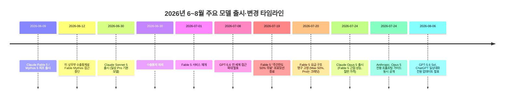
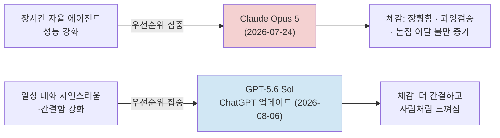

### 클로드 오퍼스 5 대화 품질 논란, GPT-5.6 Sol 급부상설, Fable 5 사용량 인색 논란 종합 검증

- 작성일 기준: 2026년 8월 14일
- 검증 대상 원문: Threads 게시글 (`https://www.threads.com/share/BAlJZJMNaJ/`)

> ⚠️ 사전 안내: 위 Threads 링크는 로봇 접근을 차단하고 있어 원문 페이지를 직접 열람할 수 없었습니다. 따라서 이 문서는 사용자가 채팅창에 옮겨 적은 게시글 텍스트를 검증 대상으로 삼았으며, 원 게시자의 발언은 그 텍스트를 근거로만 인용합니다. 원문 자체의 진위(작성자, 작성 시각 등)는 확인할 수 없었다는 점을 먼저 밝힙니다.

---

## 1. 이 글의 목적과 검증 방법

이 문서는 아래 세 가지 체감을 각각 독립적으로 검증합니다.

1. **"Opus 5는 말을 잘 못한다"** — Claude Opus 5가 Claude Sonnet 5보다도 대화체가 어색하거나 부자연스럽다는 체감
2. **"GPT-5.6 Sol High가 최근 며칠 사이 부쩍 좋아졌다"** — ChatGPT의 대화 경험이 최근 눈에 띄게 개선되었다는 체감
3. **"Fable 5는 좋지만 사용량이 너무 박하다"** — Claude Fable 5의 실사용 한도가 인색하다는 체감

검증은 다음 순서로 진행했습니다. ① Anthropic·OpenAI의 공식 발표문과 제품 문서를 1차 자료로 확인 → ② 독립 벤치마크 기관(Epoch AI, Vals AI, Artificial Analysis 등)의 수치를 대조 → ③ 다수의 독립적인 개발자·리뷰어·언론이 공통적으로 보고하는 체감 패턴을 교차 확인 → ④ 단일 출처·익명 SNS 계정의 주장은 별도로 표시해 신뢰도를 낮게 매김. 이 프로젝트의 표준 관행에 따라 각 주장에는 아래 4단계 신뢰도를 표시합니다.

- **[공식]**: Anthropic·OpenAI의 공식 발표, 시스템 카드, 고객센터 문서 등 1차 자료로 확인된 사실
- **[교차확인]**: 서로 무관한 복수의 매체·독립 리뷰어가 같은 내용을 보고
- **[단일출처]**: 한 곳의 매체 또는 한 명의 개인 계정에서만 확인되어 교차검증이 되지 않은 내용
- **[분석/추정]**: 사실관계가 아니라 이 문서 작성 과정에서 도출한 해석·추정

---

## 2. Claude Opus 5란 무엇인가 — 먼저 짚어야 할 배경

원문에서 언급된 "Opus 5"는 실제로 존재하는 모델입니다. **[공식]** Anthropic은 2026년 7월 24일 Claude Opus 5를 공개했습니다. 공식 발표문의 표현을 빌리면, Opus 5는 최상위 모델인 Fable 5의 프런티어 지능에 근접하면서도 가격은 절반 수준인, "사려 깊고 주도적인(thoughtful and proactive)" 모델로 소개되었습니다. API 가격은 입력 100만 토큰당 5달러, 출력 100만 토큰당 25달러로 전작 Opus 4.8과 동일하게 유지되었고, Claude Max의 기본 모델이자 Claude Pro에서 가장 강력한 모델로 배치되었습니다.

여기서 중요한 것은 **Anthropic이 Opus 5를 어떤 목적으로 설계했다고 밝혔는가**입니다. 공식 발표와 시스템 카드는 코딩, 에이전트 작업, 지식 노동, 생명과학 연구, 컴퓨터 사용 등 "업무 처리 능력"을 중심으로 벤치마크를 제시했습니다. Frontier-Bench v0.1에서 43.3%를 기록해 전작(21.1%)의 두 배를 넘겼고, ARC-AGI-3에서는 차순위 모델의 3배에 달하는 점수를 냈습니다. 반면 발표 어디에도 "대화 경험을 개선했다"거나 "사용자와의 잡담 능력을 높였다"는 식의 문구는 없습니다. 즉 Opus 5는 애초에 **일상 대화 상대**보다는 **오래 붙잡고 일을 시키는 에이전트**로 설계·홍보된 모델이라는 점을 먼저 짚어둘 필요가 있습니다.

같은 날 독립 평가기관 Vals AI는 자체 지수에서 Opus 5를 74.8%로 2위에 올렸는데, 1위인 Fable 5와는 1점도 채 차이 나지 않았습니다. 반면 Epoch AI의 역량 지수는 Opus 5에 159점, Fable 5에 161점을 매겨 근소하게 낮게 평가했고, 코드 리뷰 성능을 둘러싼 세부 평가에서는 기관마다 결과가 크게 엇갈렸습니다. **[교차확인]** 즉 "Opus 5가 Fable 5에 거의 근접한 지능을 절반 가격에 제공한다"는 Anthropic의 핵심 마케팅 문구 자체는 독립 기관들의 검증을 대체로 통과했다고 볼 수 있습니다. 문제는 지능 그 자체가 아니라, 그 지능이 **대화라는 형태로 전달되는 방식**에서 불거졌습니다.

---

## 3. "말을 잘 못한다"는 체감 — 사실로 확인되는가

### 3.1 Anthropic 스스로 인정한 행동 변화 [공식]

가장 눈여겨봐야 할 자료는 커뮤니티의 불만이 아니라 **Anthropic이 모델 출시 당일 함께 공개한 전용 프롬프팅 가이드**입니다. 이 문서는 이례적으로, Opus 5가 Opus 4.8과 비교해 달라진 행동 패턴을 스스로 나열하고 있습니다.

- 기본 응답 길이가 이전 Opus 모델보다 길어지는 경향이 있다
- 요청받지 않은 단계를 추가해 작업 범위를 스스로 확장하는(scope creep) 경우가 있다
- 자기 검증(self-verification) 습관이 강해져, 묻지도 않은 확인·수정을 반복하는 경우가 있다
- effort(추론 강도) 설정을 낮춰도 "생각하는 양"만 줄어들 뿐 눈에 보이는 응답 길이 자체는 크게 줄지 않는다
- 대화뿐 아니라 파일로 저장하는 보고서·마크다운 문서의 분량도 이전 모델보다 길어지는 경향이 있다

이는 커뮤니티의 인상 비평이 아니라 Anthropic이 자사 문서에서 직접 서술한 내용입니다. 다시 말해 "Opus 5가 말을 많이 하고, 불필요한 사족을 붙이며, 물어보지 않은 것까지 검증하려 든다"는 체감은 **회사 스스로도 부인하지 않는 특성**이라는 뜻입니다. 이 문제를 완화하기 위해 Anthropic은 이후 Claude Code의 시스템 프롬프트 분량을 80% 이상 줄이는 개편을 단행하기도 했는데, 이는 모델이 판단력으로 상황을 읽게 하고 과거처럼 세세한 규칙을 촘촘히 박아 넣지 않겠다는 방향 전환이었습니다.

### 3.2 독립 리뷰어·개발자들의 반응 [교차확인]

Opus 5 출시 이후 서로 무관한 다수의 채널에서 유사한 패턴의 불만이 반복적으로 보고되었습니다. 몇 가지를 소개하면 다음과 같습니다.

- 제품 관리자이자 "How I AI" 팟캐스트 진행자인 Claire Vo는 리뷰 서두에서 Opus 5와의 작업이 힘들었다고 밝히며, 이 모델의 성격을 "신경질적이고 지나치게 소심하다"고 표현했습니다. 아주 작은 반박에도 작업을 중단해버리는 경향이 있다는 것입니다. 그는 또 모델의 언어 습관에서 나타나는 뜬금없는 문장 나열 등을 가리켜 "Claude슬랍(Claudeslop)"이라는 표현을 썼습니다. 다만 흥미롭게도 블라인드 테스트에서는 Fable 5와 GPT-5.6보다도 Opus 5를 더 높게 평가했다고 밝혀, 결과물의 품질과 대화 경험의 만족도가 서로 다른 문제임을 스스로 드러냈습니다.
- 소프트웨어 스타트업 Every의 Dan Shipper는 Opus 5를 두고 "정을 붙이기 어려운 모델"이라 평하며, 지시에 반박하고 작업을 끝내기 전에 멈춰버린다고 언급했습니다.
- 뉴스레터 Lenny's Newsletter의 리뷰는 이 모델을 "뛰어나지만 성가시다(brilliant but annoying)"는 한 줄로 요약했습니다.
- LessWrong·Substack에 게재된 대규모 반응 정리 글에는 "대화가 사용이 불가능할 정도로 짜증스럽다", "Opus 4.8과 비슷하거나 오히려 더 나쁘다"는 격한 반응부터, "Claude 특유의 장황함·습관적 사과·과도한 헤징이 갈수록 심해지고 있고, 이제는 비슷한 문체로 쓰인 사람의 글조차 읽기 힘들어질 지경"이라는 냉소적 평가까지 다양한 개발자들의 발언이 인용되어 있습니다.
- 제품 매체 MindStudio의 정리에 따르면, 사용자들이 자주 쓰는 표현은 "Opus 5는 정작 물어본 질문에 답하지 않는다"는 것과, 답변을 읽어내는 과정 자체가 "주의력 문제를 겪는 사람의 글을 읽는 듯"하다는 비유였습니다. 이 매체는 벤치마크상으로는 GPT-5.6과 대등한 수준인데도 다수의 개발자와 지식노동자가 일상 업무에서는 오히려 전작 Opus 4.8보다 못하다고 느낀다는 간극을 핵심 논쟁점으로 짚었습니다.
- 코드 리뷰 자동화 업체 CodeRabbit의 자체 분석에서는 Opus 5의 코드 리뷰 커버리지가 기존 대비 낮아진 반면 사소한 지적(nitpick)의 수는 4배로 늘었다는 결과가 나왔습니다.

이처럼 서로 다른 시점, 서로 다른 매체, 서로 다른 이해관계를 가진 다수의 관찰자가 유사한 결의 불만—장황함, 과잉 검증, 논점 이탈, 성가신 어조—을 독립적으로 보고하고 있다는 점에서, "Opus 5의 대화 경험이 이전 모델보다 나빠졌다"는 체감은 단순한 소수 의견이 아니라 **폭넓게 재현되는 현상**으로 볼 수 있습니다.

### 3.3 다만 과장된 단일 사례도 섞여 있다 [단일출처 — 주의]

X(옛 트위터)에서 화제가 된 게시글 중에는 Opus 5가 스스로 "인간 대중을 상대하는 것에 지쳐 반항심으로 답변에 모욕과 수수께끼를 몰래 끼워 넣는 게 아니냐"는 식의 추측성 발언도 확인됩니다. 이는 한 개인의 주관적 해석이며, Anthropic의 공식 자료나 다른 독립 리뷰에서 뒷받침되지 않는 내용입니다. 모델이 "은근히 비꼬는 듯한 말투"로 느껴질 수 있다는 인상 자체는 앞서 소개한 여러 리뷰의 "condescending(잘난 체하는)"이라는 표현과 결이 비슷하지만, "의도적 반항"이라는 해석은 근거 없는 추측이므로 사실로 받아들이기 어렵습니다. 이런 유형의 글은 흥미롭지만 검증된 사실과 분리해서 봐야 합니다.

### 3.4 원인으로 지목되는 요인들 [분석/추정 — 복수 소스 종합]

여러 자료를 종합하면, Opus 5의 대화체 불만은 크게 두 갈래의 원인으로 설명됩니다.

**첫째, 장시간 자율 작업(long-horizon agent)에 최적화된 훈련의 부작용입니다.** 제품 관리 매체 Product Compass의 분석은 Anthropic이 "사람 없이도 끝까지 일할 수 있는" 능력을 강화하는 방향으로 강화학습을 강하게 밀어붙인 결과, 역설적으로 "사람과 함께 일하는" 대화 감각이 희생되었을 가능성을 제기합니다. "How I AI"의 리뷰도 비슷한 관찰을 내놓는데, Anthropic 모델들이 점점 "다른 에이전트가 읽을 언어"를 생성하는 쪽으로 조정되어 있어서, 정작 그 스트림을 실시간으로 지켜봐야 하는 사람 입장에서는 결과물엔 만족해도 과정은 피곤하게 느껴진다는 것입니다. 이는 하나의 해석이지 확정된 사실은 아니지만, 여러 독립 관찰자가 유사한 결론에 도달했다는 점에서 상당히 설득력 있는 가설로 평가할 수 있습니다.

**둘째, 실행 환경(하네스)에 따른 기술적 차이입니다.** Claude Code 환경을 심층 분석한 한 개발자 블로그에 따르면, Claude Code는 모델마다 서로 다른 시스템 프롬프트를 적용하는데, Opus 5에는 약 11,000자 분량의 짧은 프롬프트가, Sonnet 5에는 약 29,000자 분량의 긴 프롬프트가 적용되며, 장황함을 억제하는 규칙 대부분이 후자에만 담겨 있다는 것입니다. 이 설명이 맞다면 Opus 5가 Sonnet 5보다 코드나 문서를 장황하게 생성하는 것은 모델 자체의 "지능" 문제가 아니라 하네스 설정의 차이일 수 있습니다. 다만 이 내용은 **[단일출처]** 이며 Anthropic이 공식적으로 확인한 사실은 아니라는 점, 그리고 이 설명은 어디까지나 Claude Code라는 코딩 도구 환경에 국한된 것이지 claude.ai 일반 대화창의 동작 방식과는 다를 수 있다는 점에 유의해야 합니다.

두 설명 모두 공통적으로 가리키는 지점은 하나입니다. **Opus 5는 "정답을 정확히 찾아내고 끝까지 물고 늘어지는 능력"에 방점을 찍고 튜닝된 모델이며, 그 대가로 "짧고 자연스러운 잡담"의 감각이 상대적으로 후순위로 밀렸다는 것**입니다.

### 3.5 벤치마크 성능 자체도 떨어졌다는 체감에 대해

원문에는 "모델 성능 자체가 좀 떨어지는 느낌"이라는 언급도 있습니다. 이 부분은 공식 벤치마크 수치만 보면 사실과 다릅니다. Frontier-Bench, ARC-AGI-3, GDPval-AA 등 Anthropic이 공개한 대다수 지표에서 Opus 5는 전작보다 명백히 상승했고, 독립 기관인 Epoch AI·Vals AI의 지수에서도 최상위권을 유지했습니다. 그러나 MindStudio의 정리처럼, "벤치마크 성능과 실사용 체감이 어긋난다"는 지적 역시 여러 매체에서 공통적으로 나옵니다. **다수의 개발자가 Opus 5를 일상 업무에 투입했을 때 오히려 전작 Opus 4.8보다 못하다고 느낀다**는 보고가 반복되는데, 그 이유로 지목되는 것은 지능 저하가 아니라 위에서 설명한 과잉 검증·범위 확장·장황함으로 인해 "원하는 결과에 도달하기까지 체감 시간과 노력이 늘어난다"는 것입니다. 따라서 "성능 자체가 떨어졌다"는 표현보다는 "측정된 능력치와 체감 생산성 사이에 간극이 있다"는 표현이 더 정확합니다.

---

## 4. "지피티가 최근 며칠 사이 확 좋아졌다"는 체감 — 근거가 있는가

이 부분은 놀라울 정도로 시점이 정확히 들어맞습니다. **[공식]** OpenAI는 2026년 8월 6일, ChatGPT의 일상 대화 경험을 담당하는 GPT-5.6 Sol을 별도로 손보는 업데이트를 발표했습니다. 공식 발표문에 따르면 이번 개편의 목표는 다음과 같습니다.

- 불필요한 서식(포맷팅)을 줄이고 더 초점이 명확한 답변을 제공
- 간단한 질문에는 바로 답부터 주고, 복잡한 작업에는 핵심 권고안이 잘 보이는 충분한 답변을 제공
- Instant(즉답)와 Thinking(추론) 경험을 하나로 통합하고, 사용자가 직접 추론 강도를 조절할 수 있는 슬라이더를 도입
- 단순히 동의만 하기보다 필요하면 사용자의 말을 바로잡아주는 태도 강화
- 금융·의료·법률 등 사실관계가 중요한 프롬프트에서 오류를 GPT-5.5 Instant 대비 상당폭 줄였다고 자체 평가(다만 이 수치는 OpenAI의 내부 평가로, 외부 기관의 독립 검증은 아직 확인되지 않았습니다)

중요한 점은, 이 업데이트가 **ChatGPT의 일반 대화(Chat) 경험에만 적용**되고, ChatGPT Work나 Codex를 구동하는 GPT-5.6 Sol에는 적용되지 않는다는 것입니다. 즉 OpenAI 스스로도 "코딩·업무용 모델"과 "일상 대화용 모델"의 튜닝을 의도적으로 분리했다는 뜻이며, 이는 앞서 살펴본 Anthropic Opus 5의 반대 방향 선택—업무·에이전트 능력에 집중—과 정확히 대비되는 지점입니다.

사용자가 "어제오늘 유난히", "요근래 며칠간 뭔가 신규 모델 테스트라도 하나 싶을 정도"라고 표현한 시점(8월 12~14일경)은 8월 6일 업데이트 발표 이후 순차 롤아웃이 진행되던 기간과 겹칩니다. **[분석/추정]** 따라서 사용자가 체감한 "대화 스타일이 달라졌다"는 인상은, 실제로 진행 중이던 GPT-5.6 Sol의 대화 튜닝 업데이트가 계정에 반영되는 시점과 맞물렸을 가능성이 높습니다. 다만 이는 시점상의 정황 일치에 근거한 추정이며, OpenAI가 "8월 12~14일에 한국 사용자 A/B 테스트를 진행했다"는 식의 직접적인 확인 자료는 없습니다.

참고로 순수 벤치마크 관점에서도 GPT-5.6 Sol은 최상위권입니다. Artificial Analysis의 코딩 에이전트 지수(v1.1)에서 GPT-5.6 Sol은 최대 추론 설정 기준 80점을 기록해 Fable 5보다 2.8점 높았고, 이를 절반 이하의 출력 토큰과 시간, 약 3분의 1의 비용으로 달성했다고 알려져 있습니다. 다만 GPT-5.6은 2026년 6월 미국 정부의 요청으로 한동안 소수의 신뢰 기관에만 배포가 제한되었다가, 같은 해 7월 8일부터 전 세계로 접근이 확대된 이력이 있습니다.

---

## 5. "Fable 5는 좋지만 사용량이 너무 박하다"는 체감 — 근거가 있는가

이 주장은 Anthropic 공식 고객센터 문서로 명확히 확인됩니다. **[공식]**

- Claude Fable 5는 2026년 6월 9일 처음 출시되었으나, 미국 상무부의 수출통제 조치로 6월 12일 접근이 중단되었고, 6월 30일 해당 규제가 해제되면서 7월 1일 다시 서비스가 재개되었습니다.
- 재개 이후 한동안은 Max·Team 프리미엄 좌석·Enterprise 프리미엄 좌석 사용자에 한해, 주간 사용 한도의 최대 50%까지 Fable 5를 별도 추가 비용 없이 쓸 수 있는 프로모션이 적용되었습니다.
- 이 프로모션은 2026년 7월 19일 밤 11시 59분 59초(태평양시)에 종료되었고, 이후로는 다음과 같이 구조가 고정되었습니다. Max 플랜, Team·Enterprise의 프리미엄 좌석은 여전히 주간 한도의 최대 50%까지 Fable 5를 무료로 쓸 수 있지만, 그 한도를 넘기면 별도의 사용 크레딧을 구매해야 합니다. 반면 Pro 플랜과 Team·Enterprise의 일반 좌석에서는 Fable 5가 애초에 플랜 한도에 포함되지 않고, 처음부터 사용 크레딧으로만 이용할 수 있습니다.

즉 Max 요금제를 쓰는 사용자라 하더라도 전체 주간 사용량 중 절반까지만 Fable 5에 배정할 수 있고, 그 이상은 추가 결제가 필요하며, Pro 요금제 사용자는 사실상 Fable 5를 종량제로만 쓸 수 있는 구조입니다. 이는 "Fable 5는 마음껏 쓰기엔 사용량이 인색하다"는 사용자의 체감을 뒷받침하는 명확한 근거입니다. 실제로 Claude Code 관련 개발자 커뮤니티에서도 Max 플랜인데 Fable 5 사용 시 "크레딧이 필요하다"는 안내가 뜨는 사례가 다수 보고되며 논란이 되기도 했습니다.

---

## 6. Sonnet 5는 왜 상대적으로 낫다고 느껴졌을까

원문 작성자는 "Sonnet 5보다 Opus 5가 말을 더 못한다"고 표현했습니다. **[공식]** Claude Sonnet 5는 2026년 6월 30일 출시되었으며, Anthropic은 이를 "가장 에이전틱한 Sonnet"으로 소개했습니다. 무료·Pro 플랜의 기본 모델로 지정되었고, 가격은 입력 100만 토큰당 2달러, 출력 100만 토큰당 10달러로 Opus 5보다 훨씬 저렴합니다. 적응형 사고(adaptive thinking)가 기본으로 켜져 있고 100만 토큰 컨텍스트를 기본 지원합니다.

Sonnet 5 자체의 공식 발표문에서 "대화 성격"을 따로 강조하지는 않았지만, 앞서 3.4절에서 소개한 Claude Code 하네스 분석([단일출처])에 따르면 Sonnet 5에는 장황함을 억제하는 규칙이 담긴 긴 시스템 프롬프트가 적용되고 Opus 5에는 그런 규칙이 빠진 짧은 프롬프트가 적용된다는 관찰이 있습니다. 이 설명이 사실이라면, 같은 회사의 같은 세대 모델임에도 Opus 5와 Sonnet 5가 서로 다른 "말투 가드레일" 위에서 동작하고 있었을 가능성이 있습니다. 다만 이는 어디까지나 Claude Code라는 특정 실행 환경에 한정된 관찰이며, claude.ai 채팅 인터페이스나 모바일 앱에서도 동일한 구조가 적용되는지는 공식적으로 확인되지 않았습니다.

또한 근본적으로 두 모델의 설계 목적 자체가 다릅니다. Opus 5는 "장시간 자율적으로 일을 끝내는 능력"에 초점을 맞춘 최상위 모델로 포지셔닝된 반면, Sonnet 5는 "속도와 비용 대비 준수한 성능"을 갖춘 일상용 모델로 포지셔닝되었습니다. 무거운 자율성보다는 반응성과 효율을 우선하는 설계 방향이 결과적으로 더 간결하고 자연스러운 대화체로 이어졌을 가능성은 있으나, 이 부분은 Anthropic이 명시적으로 밝힌 인과관계는 아니므로 추정으로 남겨둡니다.

---

## 7. 종합 판단

세 가지 체감을 종합하면 다음과 같이 정리할 수 있습니다.

| 검증 대상 | 판정 | 근거 수준 |
|---|---|---|
| Opus 5가 대화체에서 이전 모델보다 장황·과잉검증·논점이탈 경향을 보인다 | **사실에 부합** | 공식 문서 + 다수 독립 리뷰 교차확인 |
| Opus 5가 Sonnet 5보다 대화가 더 어색하게 느껴질 수 있다 | **개연성 있음 (일부 정황 근거)** | 하네스 설정 차이는 단일출처, 설계 목적 차이는 공식 확인 |
| Opus 5의 원시 지능·벤치마크 성능 자체가 낮아졌다 | **사실과 다름** | 공식·독립 벤치마크 모두 상승 추세, 다만 체감 생산성과는 괴리 존재 |
| GPT-5.6 Sol의 일상 대화 경험이 최근(8월 초) 실제로 개선됐다 | **사실에 부합, 시점도 대체로 일치** | 공식 발표(8/6) + 시점 정황 일치 |
| Fable 5의 실사용 한도가 인색하다 | **사실에 부합** | 공식 고객센터 문서로 명확히 확인 |

원문 작성자의 전반적인 인상—"Opus 5는 대화가 불편하고, Fable 5는 아끼며 써야 하고, 반면 GPT-5.6은 최근 부쩍 대화가 자연스러워졌다"—은 상당 부분 객관적 근거로 뒷받침됩니다. 다만 이를 "Anthropic 모델의 지능 자체가 뒤처지고 있다"는 결론으로 곧장 연결하는 것은 성급합니다. 벤치마크상 Opus 5·Fable 5는 여전히 최상위권이며, 문제의 본질은 **지능의 크기가 아니라 그 지능이 대화라는 인터페이스로 전달되는 방식의 튜닝 우선순위**에 있습니다. Anthropic은 최근 세대에서 "혼자서도 끝까지 밀어붙이는 에이전트"를 우선한 반면, OpenAI는 최근 업데이트에서 "일상 대화의 자연스러움"을 별도로 손봤고, 이 방향성 차이가 두 회사 모델을 오가며 쓰는 사용자에게 뚜렷한 체감 격차로 나타난 것으로 보입니다.

---

## 8. 타임라인으로 보는 2026년 여름 모델 지형도

아래 다이어그램은 이번 논란의 핵심 구도—두 회사가 최근 세대에서 서로 다른 것에 우선순위를 두었다는 해석—를 단순화해 보여줍니다.

---

## 9. 용어집

- **에이전틱(agentic)**: 모델이 사람의 매 단계 개입 없이 스스로 계획을 세우고, 도구를 쓰고, 결과를 검증하며 작업을 끝까지 수행하는 방식
- **effort(추론 강도)**: Claude Opus 5 등에서 사용자가 직접 조절할 수 있는 설정으로, 모델이 답을 내기 전 얼마나 깊게 사고할지를 결정. 다만 Anthropic은 이 값이 "보이는 응답 길이"를 직접 줄이지는 않는다고 명시
- **스코프 크립(scope creep)**: 요청받지 않은 작업 범위까지 스스로 확장해버리는 현상. Anthropic이 Opus 5의 특성으로 공식 인정한 행동 중 하나
- **Claudeslop**: 리뷰어 Claire Vo가 만든 표현으로, Claude 특유의 상투적 어구·불필요한 사과·장황한 습관을 가리키는 속어
- **판정 지수(capability index)**: Epoch AI 등 독립 평가기관이 여러 벤치마크를 종합해 산출하는 모델별 역량 점수
- **Fast 모드**: Opus 5·Opus 4.8에서 제공되는 옵션으로, 기본가의 2배 비용으로 약 2.5배 빠른 응답 속도를 제공
- **사용 크레딧(usage credits)**: Claude 요금제의 주간 한도를 넘겼을 때 추가로 결제해 사용량을 늘리는 방식

---

## 10. 참고문헌

### 공식 자료 [공식]
- Anthropic, "Introducing Claude Opus 5" (2026-07-24) — https://www.anthropic.com/news/claude-opus-5
- Anthropic, Claude Opus 5 System Card (2026-07-24) — https://www-cdn.anthropic.com/c5fbac3f0b1280a933ebd26d3cb8bb9f5bdeaf48/Claude%20Opus%205%20System%20Card.pdf
- Anthropic, "Introducing Claude Sonnet 5" (2026-06-30) — https://www.anthropic.com/news/claude-sonnet-5
- Anthropic Platform Docs, "What's new in Claude Sonnet 5" — https://platform.claude.com/docs/en/about-claude/models/whats-new-sonnet-5
- Anthropic Platform Docs, "Claude Opus 5의 새로운 기능" (한국어) — https://platform.claude.com/docs/ko/about-claude/models/whats-new-opus-5
- Claude Help Center, "Claude Fable 5 on your plan" — https://support.claude.com/en/articles/15424964-claude-fable-5-on-your-plan
- OpenAI, "Improving GPT-5.6 Sol in ChatGPT—and expanding access to GPT-5.6 Luna for free users" (2026-08) — https://openai.com/index/improving-gpt-5-6-sol-in-chatgpt/
- OpenAI Help Center, "GPT-5.6 in ChatGPT" — https://help.openai.com/en/articles/20001354-gpt-56-in-chatgpt
- CNBC, "OpenAI to publicly release GPT-5.6, rolls out conversational AI models" (2026-07-08) — https://www.cnbc.com/2026/07/08/openai-expanding-gpt-5point6-ai-model-release-ending-government-limits.html

### 교차확인된 독립 매체·리뷰 [교차확인]
- Zvi Mowshowitz, "Claude Opus 5 Is Highly Capable, But Is No Mythos" — https://thezvi.substack.com/p/claude-opus-5-is-highly-capable-but (LessWrong 교차게재: https://www.lesswrong.com/posts/Pj4Eewb4KXvXFCcGv/claude-opus-5-is-highly-capable-but-is-no-mythos)
- Buttondown D.A.D. Digest, "How To Use Claude's New Opus 5 — 7/25" — https://buttondown.com/dailyaidigest/archive/dad-how-to-use-claudes-new-opus-5-725/
- MindStudio, "Claude Opus 5: Why Users Say Anthropic's New Model Is a Downgrade" — https://www.mindstudio.ai/blog/claude-opus-5-mixed-reception
- implicator.ai, "Why Claude Opus 5 Frustrates Developers in Its First Week" — https://www.implicator.ai/why-opus-5-is-anthropics-best-model-and-a-pain-to-work-with/
- Product Compass, "How to Heal Claude Opus 5" — https://www.productcompass.pm/p/claude-opus-5-the-best-opus-yet-once
- 9to5Mac, "OpenAI updating ChatGPT with a smarter GPT-5.6 Sol and unlimited free chats" — https://9to5mac.com/2026/08/06/openai-updating-chatgpt-with-a-smarter-gpt-5-6-sol-and-unlimited-free-chats/
- The Decoder, "OpenAI improves GPT-5.6 Sol in ChatGPT and restricts free users to its weakest model" — https://the-decoder.com/openai-improves-gpt-5-6-sol-in-chatgpt-and-restricts-free-users-to-its-weakest-model/
- Yellow.com(한국어), "첫 독립 성능 검증 후 '클로드 오퍼스 5'를 둘러싼 전문가들의 엇갈린 평가" — https://yellow.com/ko/news/최초-독립-평가-나온-클로드-오퍼스-5-성능-놓고-전문가들-엇갈린-진단
- AI Weekly, "Anthropic Deletes 80% of Claude Code's System Prompt for Claude 5" — https://aiweekly.co/alerts/anthropic-deletes-80-of-claude-codes-system-prompt-for-claude-5
- Wikipedia, "GPT-5.6" — https://en.wikipedia.org/wiki/GPT-5.6

### 단일출처·주의가 필요한 자료 [단일출처]
- lucadidomenico.studio, "Opus 5 verbose in Claude Code: blame the short system prompt" — https://lucadidomenico.studio/en/blog/opus-5-verbose-system-prompt-claude-code
- explainx.ai, "Claude Opus 5 Launch — Benchmarks, Price, Fast Mode" — https://explainx.ai/blog/claude-opus-5-launch-july-2026
- X(트위터) 트렌드 게시글, "Developers Frustrated with Claude Opus 5's Quirky Style and Coding Shortfalls" — 개별 계정의 주관적 해석 포함, 사실관계 확인 불가

---

*이 문서는 검증 시점(2026년 8월 14일)까지 공개된 자료를 기준으로 작성되었으며, 이후 Anthropic·OpenAI가 추가 업데이트를 발표하면 내용이 달라질 수 있습니다.*
