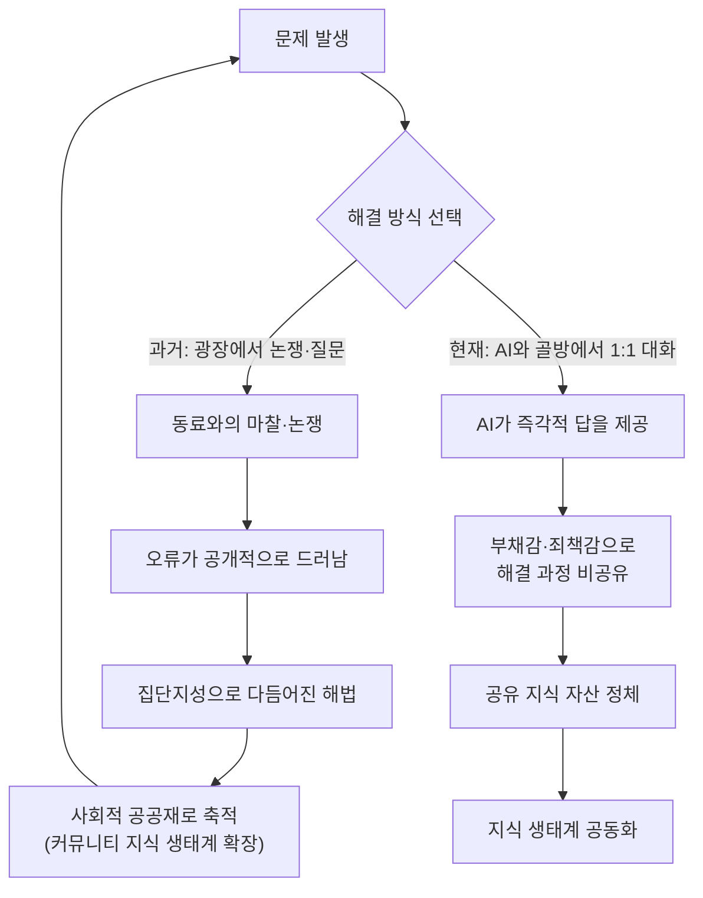

## 이 글이 다루는 문제

이번에 살펴볼 내용은 생성형 AI가 개인의 지적 역량뿐 아니라 사회 전체가 공유해온 "지식 생태계" 자체를 어떻게 침식시키는지를 다룬 글의 한 장(章)이다. 원문의 제목은 "공유 지식의 붕괴: 밀폐된 대화가 치르는 사회적 비용"이며, 앞서 살펴본 두 편의 글(MIT 창작 글쓰기 교실 사례, 바이브 코딩의 보안 취약점 사례)과 마찬가지로 "죽은 완벽함"이라는 표현을 다시 등장시키며, 이번에는 그 죽은 완벽함이 개인을 넘어 사회의 지식 공유 구조 자체를 무너뜨리는 지점까지 논의를 확장한다.

글의 핵심 주장은 이렇다. 인류의 지식 환경은 본래 사람들이 서로 부딪히고 오류를 드러내며 함께 다듬어가는 개방적이고 동태적인 선순환 구조였는데, 생성형 AI가 사람들을 각자의 "골방"으로 밀어 넣어 AI와의 일대일 밀폐된 대화만 남기면서 이 선순환 고리가 끊어지고 있다는 것이다. 이 문서에서는 원문의 논지를 순서대로 따라가며, 원문이 근거로 언급한 "다론 아제몰루 MIT 교수의 지식 붕괴(Knowledge Collapse)" 개념과 스택오버플로 통계를 실제 자료로 검증하고, 검증되지 않은 서술은 별도로 표시한다.

## 원래 지식 생태계는 어떻게 작동했는가

원문은 먼저 AI 이전의 지식 생산 구조를 설명한다. 인간이 문제를 해결하는 과정에서 한계에 부딪히거나 새로운 오류를 발견하면, 온라인 커뮤니티나 조직의 협업 인프라스트럭처라는 "광장"에 나와 그 질문을 던졌다. 이 과정은 결코 편하지 않았다. 서로 논쟁하고 노하우를 다투듯 공유하는 시끄럽고 고통스러운 과정이었다. 그러나 원문은 바로 그 고통스럽고 시끄러운 소통의 부산물이야말로 사회적 공공재로 축적되어 지식 생태계를 계속 풍성하게 갱신해온 원동력이었다고 짚는다. 이는 앞서 다룬 두 편의 글에서 반복적으로 등장한 원칙, 즉 "마찰과 어려움 자체가 학습과 지식 형성의 필수 요소"라는 주장을 개인 차원을 넘어 사회 전체의 지식 생태계 차원으로 확장한 것이다.

## 생성형 AI가 끊어버린 순환고리

원문은 생성형 AI의 등장이 이 선순환 고리를 "단숨에" 끊어버렸다고 진단한다. 사람들이 광장으로 나와 동료와 함께 머리를 맞대고 고민하던 지적 연대의 자리를, 이제는 "골방"에서 AI와 일대일로 나누는 밀폐된 대화가 대체하고 있다는 것이다. 그 결과로 원문이 지목하는 두 가지 붕괴 현상은 다음과 같다.

첫째, "이로부터 심각한 지식 공개의 고갈 현상이 발생한다"는 것이다. 문제를 해결한 개인은 자신이 스스로 사유를 거쳐 결과물을 도출한 것이 아니라 AI를 통해 즉각적인 답을 얻었다는 무의식적 부채감, 혹은 자신이 지름길을 사용했다는 죄책감 때문에 그 해결 과정과 맥락을 타인과 공유하지 않게 된다. 결국 개인이 AI를 통해 얻는 즉각적인 생산성 향상이라는 단기적이고 개인적인 이득을 취하는 사이, 사회 전체가 새로운 지식을 생산하고 축적하던 동태적 메커니즘은 서서히 멈춰버린다.

둘째, 조직 차원에서는 "동료의 서툰 질문을 함께 고민하고 오류를 수정해주며 전체의 지적 역량을 상향 평준화해온 배움 공동체의 붕괴", 즉 지적 커뮤니케이션의 공동화(空洞化)로 이어진다고 진단한다. 각자가 저마다의 AI 비서와만 대화하는 고립된 섬이 됨으로써, 조직과 사회가 가진 지식의 외형은 겉보기에 화려해 보일지언정 내부는 급격히 황폐화되고 있다는 것이다. 원문은 이를 두고 시스템의 효율성을 극대화하기 위해 도입한 인공지능이 역설적으로 그 시스템을 지탱해주던 공동의 지식 기반 자체를 스스로 무너뜨리고 있다고 요약한다.

## 실증적 근거: 다론 아제몰루의 "지식 붕괴" 모델

원문이 언급한 "다론 아제몰루 MIT 경제학과 교수가 경고한 지식 붕괴(Knowledge Collapse)"는 실제로 존재하는, 그것도 매우 비중 있는 연구를 정확히 가리키고 있다. 다론 아제몰루는 MIT의 최고위 교수직인 인스티튜트 프로페서(Institute Professor)이며, 2024년 노벨 경제학상을 사이먼 존슨, 제임스 로빈슨과 공동 수상한 인물이다. 그는 2026년 2월, MIT의 딩원 콩(Dingwen Kong), 아수만 오즈다을라르(Asuman Ozdaglar)와 공동으로 「AI, Human Cognition and Knowledge Collapse(AI, 인간의 인지, 그리고 지식 붕괴)」라는 논문을 미국경제연구소(NBER) 워킹페이퍼(No. w34910)로 발표했다.

이 논문의 핵심 모델은 원문의 논지와 정확히 겹친다. 연구진은 사회의 성공적인 의사결정이 공동체 차원에서 공유되는 일반 지식과, 개인이 처한 맥락에 특화된 지식이라는 두 요소가 상호 보완적으로 결합될 때 이뤄진다고 전제한다. 그런데 인간이 비용을 들여 스스로 학습하는 행위는 자기 자신을 위한 사적 신호뿐 아니라, 공동체의 일반 지식 저량에 누적되는 "옅은 공공 신호"까지 동시에 만들어내는 특성, 즉 경제학에서 말하는 "범위의 경제"를 갖는다. 문제는 에이전틱 AI가 각 개인의 맥락에 특화된 추천을 제공하며 이 학습 행위 자체를 대체해버린다는 데 있다. 인간의 노력이 AI로 충분히 대체 가능하고 AI의 정확도가 일정 임계치를 넘어서면, 이 모델이 도달하는 유일하게 안정적인 균형 상태는 사회 전체의 일반 지식이 결국 0으로 수렴하는 "지식 붕괴" 상태라는 것이 논문의 결론이다. 아무도 실수를 저지르길 원해서가 아니라, 개인 각자의 합리적 선택이 누적되어 만들어내는 구조적 결과라는 점에서 이 논문은 이를 하나의 "외부성(externality)" 문제로 규정한다.

다만 이 논문은 AI 사용을 전면 금지해야 한다고 주장하지는 않는다. 오히려 흥미로운 지점은, 인간이 생산한 일반 지식을 더 효과적으로 취합하고 공유하는 능력을 키우는 쪽은 명확하게 사회 후생을 높이고 지식 붕괴에 대한 저항력을 키워준다는 결론이다. 즉 문제의 해법은 AI를 안 쓰는 것이 아니라, 개인이 AI에게 판단을 완전히 위임(delegation)하는 방식과 AI로 자신의 사고를 강화(enhancement)하는 방식을 구분해 후자를 지향하는 데 있다는 것이 이 연구 계열의 공통된 결론이다.

한 가지 덧붙일 사실관계는, "지식 붕괴"라는 용어 자체는 아제몰루의 2026년 논문이 처음 만든 말은 아니라는 점이다. 이 개념은 앤드루 J. 피터슨(Andrew J. Peterson)이 2024년 발표한 논문 「AI and the Problem of Knowledge Collapse」에서 먼저 제시됐으며, AI가 학습 데이터의 중심부로 정보를 수렴시켜 인간이 접하는 지식의 다양성을 좁힐 수 있다는 문제의식을 다뤘다. 아제몰루의 2026년 논문은 이 개념을 정교한 동태적 경제모형으로 확장해 훨씬 큰 학술적 주목을 받은 후속 연구로 이해하는 것이 정확하다.

## 숫자로 확인되는 지식 공유의 실용적 쇠퇴

원문은 "생성형 AI 등장과 함께 글로벌 개발자 커뮤니티 스택오버플로(Stack Overflow) 등에서 트래픽과 답변 등록 수가 급감했다"고 언급하는데, 이 서술 역시 실제 통계로 뒷받침된다. 개발자 샘 로즈(Sam Rose)가 2026년 1월 4일 공개한 데이터 시각화에 따르면, 스택오버플로의 월간 신규 질문 수는 2014년 정점에 20만 건을 넘었으나 2025년 말에는 5만 건에도 못 미치는 수준으로 떨어져, 약 75%가 감소하며 15년간의 성장분을 사실상 지워버렸다. 이러한 흐름은 챗GPT가 출시된 2022년 11월 이후 뚜렷하게 가속화됐으며, 관련 업계 조사에 따르면 개발자의 84%가 이미 개발 과정에 AI 도구를 사용하고 있고 이 중 81.4%는 구체적으로 오픈AI의 GPT 계열 모델을 사용하는 것으로 나타났다. 검색하고, 여러 답변을 읽어 비교하고, 응답을 기다리던 "커뮤니티 지식 탐색" 행태가 "AI에게 직접 묻기"로 완전히 대체된 셈이다.

## 지적 프레카리아트의 등장: FOMO와 속도 경쟁

원문은 이러한 구조 변화가 지식 노동자 개인에게 강력한 심리적 동인으로 작용한다고 짚는다. 바로 뒤처짐에 대한 공포, FOMO(Fear Of Missing Out)다. 매일 아침 전례 없는 양의 비즈니스 트렌드와 기술 보고서가 쏟아지는 상황에서 속도를 따라가지 못하면 도태된다는 공포감이, 정보의 파도에 빠르게 죽지 않기 위해 빠른 요약 획득이라는 선택을 사실상 무한 경쟁 체제 속 인간의 적응 방식으로 강제한다는 것이다. 원문은 이 적응 양식이 가져올 결과를 다음과 같이 우려한다. 스스로 사유의 뼈대를 세우고 질문을 던지며 AI를 도구로서 지배하는 극소수의 "기획자 엘리트"와, 사유 근육이 완전히 퇴화해 AI가 내어주는 "죽은 완벽함"의 지시와 요약본을 기계적으로 복사해 붙여넣는 "프롬프트 프롤레타리아" 사이의 지적 계급 불평등이 점차 고착화될 수 있다는 것이다. 기계의 평균값에 스스로 생각하는 주권마저 빼앗긴 이들은 결국 지식 생태계의 하층민으로 전락할 위험에 처해 있다고 원문은 결론짓는다.

## 사유의 포기가 낳는 시스템적 위기

원문은 이러한 사유의 포기를 "생존 전략"으로 규정하면서도, 이것이 기존의 경영학적 관점에서 신뢰받아온 효율성 중심의 패러다임과 정면으로 충돌한다고 지적한다. 시스템의 압박과 발밑에 밀려 인간이 생각하기를 멈춘 순간, 기업이 자랑하던 혁신의 유전자와 독창성은 흔적 없이 소멸한다는 것이다. 원문은 이 모든 논의를 관통하는 본질이 기술 자체의 고도화가 아니라, 기계의 손에 인간 지능 고유의 가치와 주권을 어떻게 보존할 것인가를 둘러싼 실존적 투쟁이라는 문장으로 마무리한다.

## 사실관계 정리표

| 항목 | 원문의 서술 | 검증 결과 |
|---|---|---|
| 다론 아제몰루 MIT 교수의 "지식 붕괴" 경고 | MIT 경제학과 교수가 경고한 개념으로 소개 | 실제 존재. 아제몰루는 MIT 인스티튜트 프로페서이자 2024년 노벨 경제학상 공동 수상자이며, 2026년 2월 딩원 콩·아수만 오즈다을라르와 함께 NBER 워킹페이퍼(No. w34910) 「AI, Human Cognition and Knowledge Collapse」를 발표함. 다만 "지식 붕괴"라는 용어 자체는 앤드루 피터슨이 2024년 먼저 제시했으며, 아제몰루의 논문은 이를 정교한 경제모형으로 확장한 후속 연구임 |
| 아제몰루 논문의 결론 | (원문에는 결론의 구체적 내용은 언급되지 않음, 문서 작성 과정에서 보강) | 인간 노력이 AI로 충분히 대체되고 AI 정확도가 임계치를 넘으면 사회의 일반 지식이 0으로 수렴하는 균형 상태(지식 붕괴)에 도달할 수 있다는 이론적 모델을 제시. 다만 일반 지식의 취합·공유 역량을 높이면 후생이 개선되고 붕괴에 대한 저항력이 커진다는 결론도 함께 제시함 |
| 스택오버플로 트래픽·답변 등록 급감 | 구체적 수치 없이 "실추락"으로만 서술 | 실제로 확인됨. 샘 로즈의 2026년 1월 4일 데이터 시각화에 따르면 월간 신규 질문 수가 2014년 20만 건 이상에서 2025년 말 5만 건 미만으로 약 75% 감소. 개발자의 84%가 AI 도구를 사용 중이라는 업계 조사도 함께 확인됨 |
| "프롬프트 프롤레타리아", "기획자 엘리트" 등 계급 구분 | 원문이 제시하는 핵심 개념 | 외부 학술 문헌에서 확인되는 공식 용어가 아니라 원문 저자가 만든 비유적 개념으로 판단됨. 다만 그 밑바탕이 되는 "AI 위임과 AI 강화의 구분이 학습 결과를 가른다"는 문제의식 자체는 아제몰루 논문 및 여러 실증 연구가 공유하는 방향과 일치함 |
| FOMO가 지식 노동자의 행동을 강제한다는 서술 | 원문의 해석적 주장 | 원문 저자의 분석적 견해로, 별도의 정량적 실증 자료가 제시되지는 않음. 다만 정보 과잉 환경에서의 속도 경쟁이라는 현상 자체는 여러 산업 보고서에서 폭넓게 논의되는 주제임 |

## 정리하며

이 글이 짚는 문제는 앞서 살펴본 두 편의 글과 결이 다르면서도 정확히 연결된다. MIT 창작 글쓰기 교실의 사례가 "개인이 생각하는 힘을 잃어간다"는 문제를, 바이브 코딩 사례가 "이해 없는 결과물이 구체적 손해로 이어진다"는 문제를 다뤘다면, 이 글은 그 두 문제가 사회 전체로 확장됐을 때 무엇이 무너지는지를 짚는다. 바로 사람들이 서로 부딪히고 논쟁하며 함께 다듬어온 공유 지식이라는 공공재 자체다. 다론 아제몰루의 연구가 정교한 경제모형으로 보여주듯, 그리고 스택오버플로의 트래픽 붕괴가 현실의 숫자로 보여주듯, 이 흐름은 이미 진행 중인 구조적 변화이며, 그 해법 역시 AI 사용을 금지하는 데 있지 않다. 관건은 AI에게 사고를 통째로 위임하는 방식과 AI로 사고를 강화하는 방식 중 어느 쪽을 개인과 조직이 선택하느냐에 달려 있다.

---

작성일: 2026년 8월 14일
