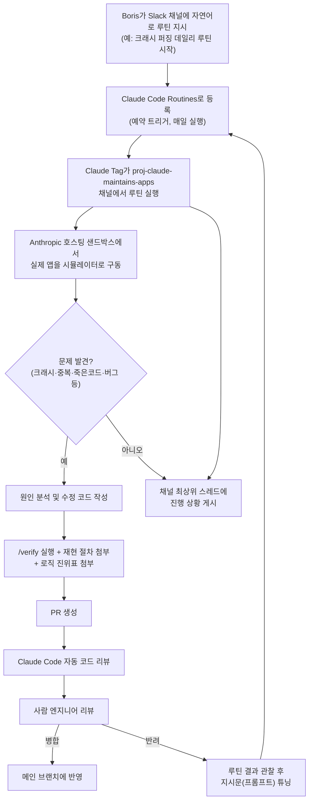

>- 작성 기준일: 2026년 8월 15일
>- 원출처: Boris Cherny(@bcherny)의 X(트위터) 게시물, LinkedIn 게시물, Threads 게시물 (2026년 8월 중순 게시, 내용 상호 일치 확인됨)

> 
> https://x.com/bcherny/status/2088014489438621990
> 
> A weird experiment I've been trying the last few weeks is having Claude take over day-to-day maintenance of our apps. Seeing early signs of life that this might be possible.
> 
> The setup is straightforward: we have a Slack channel called proj-claude-maintains-apps. In it, Claude Tag runs a bunch of daily routines across iOS, Android, Desktop, web, CLI, and Agent SDK:
> 
> - Crash fuzzer: open the app in a simulator and tap around to find ways to crash it, then root cause and fix the crashes
> - Dup unifier: scans the codebase for similar-yet-slightly-divergent abstractions, and puts up PRs to unify them
> - Dead-code remover: removes statically unreachable code, and adds logging to suspected dead code to check if it's really dead and if so, remove it the next day
> - Abstraction police: fixes leaky abstractions
> - a bunch more..
>
> Results have been surprisingly positive. Over the last few weeks, these routines have opened 388 PRs across our repos, 180 of which we merged after Claude Code Review + human review. We're now thinking about how to streamline this to make merging these kinds of mechanical changes easier.
> 
> Claude generally gets these PRs right on the first shot, and if it doesn't, we ask Claude to tune its routines so it's better the next day. Sometimes it takes a few days of tuning. 
> 
> To try a similar workflow, ask Claude Code or Tag, or create some routines directly at claude.ai/code/routines. A few of the actual prompts I used below.
> 
> Has anyone experimented with similar workflows?
> 

---

## 1. 들어가며 — 무슨 일이 있었는가

2026년 8월 중순, Claude Code의 창시자이자 Anthropic의 Claude Code 총괄인 Boris Cherny가 자신의 소셜미디어 계정에 흥미로운 실험 결과를 공유했습니다. 내용을 한 문장으로 요약하면, **"Claude에게 회사 앱들의 일상적인 유지보수 업무를 통째로 맡겨봤더니, 몇 주 만에 388개의 풀리퀘스트(PR)를 스스로 만들어냈고, 그중 180개가 실제로 병합(merge)되었다"** 는 것입니다. 병합률로 따지면 약 46%에 해당합니다.

Cherny는 이 결과를 "이게 정말로 가능할 수도 있겠다는 초기 신호(early signs of life)"라고 표현했습니다. 그는 완성된 성공 사례를 자랑하는 톤이 아니라, 아직 검증 중인 실험을 담담하게 공유하는 태도를 취했고, 실제로 전체 PR의 절반 이상이 병합되지 못했다는 사실도 숨기지 않았습니다.

이 문서는 이 게시물의 내용을 하나하나 뜯어보면서, ①실제로 어떤 구조로 돌아갔는지, ②Claude가 수행한 11가지(또는 그 이상의) 유지보수 루틴이 각각 무엇을 하는지, ③이것이 어떤 Anthropic 제품 기능 위에서 작동하는지, ④이 사례가 "에이전트형 AI가 실제 업무를 얼마나 대신할 수 있는가"라는 더 큰 질문에 어떤 의미를 갖는지를 최대한 사실에 근거하여 설명합니다.

---

## 2. 발화자 소개 — Boris Cherny는 누구인가

Boris Cherny는 Anthropic에서 Claude Code를 만든 엔지니어로, 사내에서 Claude Code 관련 실험을 가장 활발하게 공유하는 인물 중 한 명입니다. 그는 평소에도 자신의 실제 Claude Code 사용법, 슬래시 커맨드 구성, CLAUDE.md 작성 방식 등을 소셜미디어에 공개해왔고, 이번 게시물 역시 그런 연장선에 있는 실전 공유였습니다. 그의 계정은 X에서 인증 배지가 있는 계정으로, Anthropic의 공식 발표가 아니라 담당 엔지니어 개인의 실험 보고 형태로 게시되었다는 점을 먼저 짚어둘 필요가 있습니다. 즉 이 내용은 Anthropic의 공식 제품 발표라기보다는 **사내 실험(dogfooding)을 외부에 공유한 것**입니다.

---

## 3. 실험의 구조 — 무엇을, 어떻게 설계했는가

### 3.1 기본 골격

Cherny가 설명한 설정은 개념적으로 단순합니다.

1. Anthropic 사내 Slack에 **`proj-claude-maintains-apps`** 라는 전용 채널을 만든다.
2. 이 채널 안에서 **Claude Tag**가 여러 개의 "데일리 루틴(daily routine)"을 매일 자동으로 실행한다.
3. 이 루틴들은 iOS, Android, 데스크톱, 웹, CLI, Agent SDK 등 Anthropic이 실제로 운영하는 거의 모든 앱 플랫폼을 대상으로 한다.
4. 각 루틴이 문제를 발견하면 원인을 분석하고, 수정한 뒤, PR을 올린다.
5. PR은 Claude Code의 자동 코드 리뷰와 사람의 리뷰를 함께 거친 뒤 병합 여부가 결정된다.

여기서 중요한 것은 이 구조가 정교한 프롬프트 엔지니어링의 결과물이 아니라는 점입니다. Cherny가 공개한 실제 지시문은 매우 평범한 일상어로 작성되어 있었습니다. 예를 들어 그는 "iOS, Android, 데스크톱 앱에 대해 크래시 퍼징을 하는 새로운 데일리 루틴을 시작하자. 목업이 아니라 실제 앱을 워크플로우로 실행해서 크래시를 유발하고, 크래시가 나면 수정 PR을 올려라. 각 PR은 반드시 `/verify`를 실행하고 재현 절차와 진위표(truth table)를 PR에 첨부해라. 업데이트는 이 채널의 새 최상위 스레드에 올려라"는 식으로, 개발자가 동료에게 업무를 지시하듯 편하게 작성한 문장을 그대로 사용했습니다.

이어서 그는 같은 방식으로 `business-logic-bugfixer-daily`, `business-logic-simplifier-daily`, `dup-unifier` 같은 루틴들도 추가로 지시했는데, 여기서도 "루틴마다 별도로 앱별로 나누고, 최상위 스레드로 업데이트를 올리고, 항상 진위표와 함께 E2E로 검증하라"는 동일한 원칙을 반복했습니다. 특히 이 지시문에는 "로직을 형식적으로 모델링해서 빠진 부분과 중복을 찾아내고, 모든 엣지 케이스가 잘 테스트되도록 하라"는 문장이 포함되어 있었는데, 이는 단순히 "버그를 고쳐라"가 아니라 **로직을 구조적으로 모델링해서 검증하라**는, 한 단계 더 추상적인 지시였습니다.

이후 이어진 메시지들에서 그는 "플레이키(불안정) 테스트의 근본 원인을 찾아 고치고, 쓸모없는 테스트는 삭제하라"는 루틴과 "죽은 코드 제거"를 위한 루틴도 같은 채널에 순차적으로 추가했습니다. 즉 이 프로젝트는 하루아침에 완성된 것이 아니라, 몇 주에 걸쳐 하나씩 루틴을 추가해나간 점진적인 실험이었습니다.

### 3.2 이 실험을 가능하게 한 두 가지 제품 기반

이 실험이 특별한 이유는, 이것이 별도의 커스텀 인프라 없이 Anthropic이 이미 일반 사용자와 기업 고객에게 공개한 두 가지 기능—**Claude Tag**와 **Claude Code Routines**—를 조합해서 만들어졌기 때문입니다. 이 두 기능을 이해하지 못하면 이 실험의 구조를 제대로 이해하기 어려우므로, 각각을 자세히 짚어보겠습니다.

---

## 4. 배경 기술 ① — Claude Tag란 무엇인가

Claude Tag는 2026년 6월 23일 베타로 공개된 Anthropic의 제품으로, Slack 안에 상주하는 "팀원형" Claude입니다. 개인마다 별도의 Claude 세션을 갖는 기존 방식과 달리, Claude Tag는 하나의 Claude가 채널 전체가 공유하는 형태로 참여하며, 자체적인 신원(identity), 지속되는 메모리, 그리고 관리자가 지정한 도구·데이터 접근 권한을 갖습니다. 채널에 있는 누구나 `@Claude`라고 태그해서 작업을 맡길 수 있고, Claude는 이를 단계별로 나누어 진행하면서 같은 스레드에 진행 상황을 계속 게시합니다.

Claude Tag에는 두 가지 동작 모드가 있습니다.

- **호출형(태그) 모드**: 누군가 `@Claude`로 명시적으로 부르면 그 요청을 단계별로 쪼개어 처리하고 결과를 스레드에 보고합니다.
- **앰비언트(ambient) 모드**: 태그하지 않아도 Claude가 스스로 채널을 살피다가, 팀에 필요한 업데이트를 먼저 알려주거나, 잊혀진 채로 방치된 스레드나 작업을 다시 챙기는 방식으로 개입합니다.

작업이 실행될 때 Claude Tag는 Anthropic이 호스팅하는 임시(ephemeral) 샌드박스를 새로 띄웁니다. 즉 사용자의 로컬 컴퓨터나 사내망에서 코드가 실행되는 것이 아니라, Anthropic 쪽 격리된 환경에서 작업이 이루어지고, 대화가 잠잠해지면 그 샌드박스는 폐기됩니다. 이 구조 덕분에 각 팀원이 자기 컴퓨터를 켜두지 않아도 채널 안에서 지속적인 작업이 가능해집니다.

Claude Tag는 현재 Claude Team 및 Enterprise 요금제에서, Anthropic의 퍼스트파티 서비스로만 제공되며, 무료·Pro·Max 같은 개인 요금제나 서드파티 배포 방식에서는 사용할 수 없습니다. 사용하려면 조직의 Slack 워크스페이스를 조직의 Claude 계정과 연동해야 합니다. 과금 방식도 독특한데, 채널이나 스레드에서의 작업은 좌석당 과금이 아니라 사용량 기반으로 청구되며, 조직의 오너가 충전하는 사용 잔액에서 차감되고, 지출 한도를 설정해 그 잔액의 소진 속도를 관리할 수 있습니다. 반면 다이렉트 메시지 형태의 대화는 이 사용 잔액에서 차감되지 않습니다.

Anthropic은 이미 사내에서 이 기능의 초기 버전을 1년 가까이 사용해왔다고 밝힌 바 있으며, 사내 PR의 약 65%가 이 `@Claude` 워크플로우를 통해 열린다고 설명한 적이 있습니다. 이번에 Cherny가 공유한 `proj-claude-maintains-apps` 채널도 바로 이 Claude Tag 위에서 돌아가는 구체적인 활용 사례 중 하나입니다.

---

## 5. 배경 기술 ② — Claude Code Routines란 무엇인가

두 번째 기반 기술은 **Claude Code Routines**입니다. 이 기능은 2026년 4월 14일 리서치 프리뷰로 공개되었으며, 한 번 설정해두면 정해진 조건에 따라 반복적으로 실행되는 Claude Code 자동화를 말합니다. 루틴 하나에는 프롬프트, 대상 저장소(repo), 그리고 연결할 커넥터(Slack, GitHub, Notion 등 MCP 기반 연동)가 함께 저장됩니다.

루틴은 세 가지 트리거 방식을 지원하며, 한 루틴에 여러 트리거를 동시에 설정할 수도 있습니다.

- **예약(Scheduled) 트리거**: 매시간, 매일, 평일마다, 매주 등 정해진 주기로 실행됩니다. 시간은 사용자의 로컬 시간대로 입력하면 자동으로 변환되어, 인프라가 물리적으로 어디에 있든 사용자가 지정한 벽시계 시각에 맞춰 실행됩니다.
- **API 트리거**: 각 루틴에 전용 HTTP 엔드포인트가 부여되어, 여기에 베어러 토큰과 함께 POST 요청을 보내면 새 세션이 시작됩니다. 알림 시스템, 배포 파이프라인, 사내 도구 등과 연결하기에 적합합니다.
- **이벤트(GitHub 등) 트리거**: 예를 들어 PR이 열릴 때마다 리뷰 세션을 시작하고, 이후 댓글이나 CI 결과 같은 후속 업데이트까지 계속 추적하는 식으로 동작합니다.

가장 큰 특징은 루틴이 사용자의 로컬 컴퓨터가 아니라 **Claude Code의 클라우드 인프라 위에서 실행**된다는 점입니다. 즉 개발자의 노트북이 꺼져 있어도 예정된 작업은 그대로 실행됩니다. 루틴은 웹(`claude.ai/code/routines`), CLI(`/schedule` 또는 별칭 `/routines`), 데스크톱 앱(Code → Routines 메뉴의 "새 원격 작업") 세 경로 중 어디서 만들어도 모두 같은 클라우드 계정에 저장되어 즉시 다른 경로에도 반영됩니다.

루틴은 Pro, Max, Team, Enterprise 요금제에서 Claude Code 웹 기능이 켜져 있으면 사용할 수 있으며, 일반 대화형 세션과 동일하게 구독 사용량을 소모합니다. 이와 별도로 계정당 하루에 시작할 수 있는 루틴 실행 횟수에도 상한이 있는데, 공개 당시 기준으로 Pro는 하루 5회, Max는 하루 15회, Team·Enterprise는 하루 25회였으며, 이 한도를 넘는 추가 실행은 별도의 추가 사용량 옵션을 통해 가능합니다(정확한 한도는 계속 조정될 수 있는 리서치 프리뷰 단계의 수치이므로, 최신 수치는 공식 문서에서 확인하는 것이 안전합니다). 각 루틴은 독립된 클라우드 환경에서 실행되며, 기본 환경은 패키지 저장소나 클라우드 제공업체 API 같은 신뢰된 도메인에는 접근할 수 있지만 임의의 외부 도메인 접근은 차단되는 구조입니다.

Cherny의 실험은 바로 이 "예약(Scheduled) 트리거" 방식의 루틴을 앱별·업무별로 여러 개 만들어, 각각을 `proj-claude-maintains-apps` 채널과 연결한 형태로 볼 수 있습니다.

---

## 6. 실제로 어떤 루틴들이 돌아갔는가 — 11가지 데일리 루틴 전체 목록

Cherny가 공개한 내용과 이를 보도한 매체(The Decoder)의 정리를 종합하면, 현재까지 명칭과 역할이 구체적으로 공개된 루틴은 다음과 같이 11가지입니다. Cherny 본인은 이 외에도 "이 밖에도 여러 개 더 있다(a bunch more)"고 언급했기 때문에, 실제 운영 중인 루틴 수는 이보다 많을 수 있습니다.

| 루틴 이름 | 하는 일 |
|---|---|
| **크래시 퍼저 (Crash Fuzzer)** | 시뮬레이터에서 실제 앱을 열고 무작위로 조작해 크래시를 유발한 뒤, 근본 원인을 분석해 수정 PR을 올립니다. |
| **Ant 전용 기능 처리기 (Ant-only Shipper)** | 사내(Ant, Anthropic 직원을 가리키는 사내 은어)에서만 켜져 있고 방치된 내부 전용 기능을, 실제 사용량을 근거로 정식 출시하거나 아예 삭제합니다. |
| **로직 단순화기 (Logic Simplifier)** | 지나치게 복잡하게 얽힌 비즈니스 로직을 단순한 형태로 정리합니다. |
| **로직 버그 수정기 (Logic Bugfixer)** | 까다로운 로직을 형식적으로 모델링해서 숨어 있는 버그를 찾아 고칩니다. |
| **중복 통합기 (Dup Unifier)** | 코드베이스 안에서 비슷하지만 미묘하게 다르게 구현된 중복 로직들을 찾아 하나로 통합하는 PR을 올립니다. |
| **죽은 코드 제거기 (Dead-code Removal)** | 정적으로 도달 불가능하다고 증명된 코드를 삭제합니다. 애매한 경우에는 먼저 로깅을 추가해 실제로 죽은 코드인지 하루 동안 지켜본 뒤, 확인되면 다음 날 삭제합니다. |
| **무의미 테스트 정리기 (Useless-test Pruner)** | 어떤 상황에서도 절대 실패할 수 없는, 즉 검증 의미가 없는 테스트를 찾아 삭제합니다. |
| **출시완료 기능 정리기 (Shipped-feature Inliner)** | 이미 완전히 정식 출시되어 더 이상 필요 없는 기능 플래그(feature flag)를 코드에서 제거합니다. |
| **불안정 테스트 수정기 (Flaky-test Fixer)** | CI에서 가끔씩 실패하는 불안정한 테스트의 근본 원인을 분석하고 고칩니다. |
| **추상화 개선기 (Abstraction Improver)** | 지나치게 과도하게 설계된 추상화 계층을 더 단순하게 다듬습니다. |
| **추상화 경찰 (Abstraction Police)** | 계층 구조를 위반한, 즉 있어서는 안 될 곳에서 다른 계층의 세부사항을 직접 건드리는 코드(레이어링 위반)를 찾아 고칩니다. |

이 목록을 보면 하나의 공통된 설계 철학이 보입니다. 즉 이 루틴들은 "새로운 기능을 만드는 것"이 아니라, 사람 엔지니어가 바쁠 때 가장 먼저 뒤로 미루게 되는 **반복적이고 지루하지만 장기적으로는 코드베이스 건강에 중요한 일들**을 겨냥하고 있습니다. 크래시 재현, 죽은 코드 정리, 중복 로직 통합, 테스트 위생 관리 같은 작업들은 어느 회사에서나 "언젠가 해야지"라고 미뤄지다가 기술 부채로 쌓이는 대표적인 유형의 업무입니다.

---

## 7. 검증 절차 — "잘 되고 있다"는 것을 어떻게 확인했는가

이 실험에서 눈여겨봐야 할 부분은, Cherny가 단순히 "Claude야, 알아서 고쳐"라고만 지시하지 않았다는 점입니다. 그는 모든 루틴에 대해 동일한 검증 원칙을 반복해서 명시했습니다.

1. **`/verify` 실행 의무화**: 모든 PR은 반드시 Claude Code에 내장된 `/verify` 명령을 실행해야 합니다. `/verify`는 Claude Code에 기본 탑재된 스킬형 명령으로, 사용자가 직접 호출해야만 실행되는 명령입니다(과거 특정 버전 이전에는 Claude가 스스로 판단해 자동으로 실행하기도 했지만, 이후에는 명시적으로 호출해야만 동작하도록 바뀌었습니다). 이 명령을 강제한 이유는 명확합니다. 에이전트가 "다 됐습니다"라고 보고했지만 실제로는 빌드가 깨져 있거나 테스트가 통과하지 않은 상태인 경우가 실무에서 드물지 않게 발생하기 때문에, 작업 완료 주장을 스스로 재검증하는 절차를 강제로 끼워 넣은 것입니다.
2. **재현 절차(repro) 첨부**: 크래시나 버그를 고쳤다고 주장하려면, 그 문제가 어떻게 재현되는지를 PR에 함께 남겨야 합니다.
3. **진위표(truth table) 첨부**: 특히 로직 관련 루틴들에서는 로직을 형식적으로 모델링한 뒤, 모든 경우의 수를 정리한 진위표를 PR에 첨부하도록 요구했습니다. 이는 "그냥 고쳤다"가 아니라 "이 로직의 모든 분기를 검토했고, 그 결과는 이렇다"는 것을 사람이 눈으로 확인할 수 있게 만드는 장치입니다.
4. **최상위 스레드 보고**: 각 루틴 카테고리마다 채널에 새로운 최상위 스레드를 만들어 업데이트를 게시하도록 해서, 사람이 굳이 로그를 뒤지지 않아도 무슨 일이 일어났는지 한눈에 추적할 수 있게 했습니다.
5. **이중 리뷰(Claude Code 자동 리뷰 + 사람 리뷰)**: PR이 올라온 뒤에는 Claude Code의 자동 코드 리뷰 기능과 실제 사람 엔지니어의 리뷰를 함께 거친 뒤에야 병합 여부가 결정되었습니다. 즉 최종 게이트키핑은 여전히 사람에게 남아 있었습니다.

---

## 8. 성과와 한계 — 388개 PR, 180개 병합

몇 주간의 운영 결과, 이 루틴들은 Anthropic의 여러 저장소에 걸쳐 총 **388개의 PR**을 열었고, 그중 **180개**가 Claude Code 자동 리뷰와 사람 리뷰를 모두 통과해 병합되었습니다. 계산하면 병합률은 약 **46%** 입니다.

Cherny는 이 수치를 긍정적으로 평가하면서도 동시에 한계를 숨기지 않았습니다. 그는 "Claude는 대체로 첫 시도에서 PR을 제대로 만들어내지만, 그렇지 못한 경우에는 우리가 루틴 자체를 다음 날 더 잘 작동하도록 튜닝해달라고 요청한다"고 설명했습니다. 즉 이 시스템은 한 번 설정하고 끝나는 것이 아니라, **사람이 결과를 관찰하고 루틴의 지시문을 계속 다듬어나가는 반복적인 튜닝 과정**을 전제로 하고 있으며, 이 튜닝에 며칠이 걸리는 경우도 있다고 밝혔습니다.

바꿔 말하면, 병합률 46%라는 숫자는 "Claude가 알아서 다 잘한다"는 의미가 아니라 "Claude가 만든 PR의 절반 이상은 사람이 보기에 부족했다"는 의미이기도 합니다. Cherny 스스로도 이 실험을 "완성된 해법"이 아니라 "가능성이 보이기 시작한 초기 신호"라고 표현한 이유가 여기에 있습니다. 그는 게시물 말미에서 이런 기계적이고 반복적인 성격의 변경사항들을 더 쉽게 병합할 수 있는 방법을 지금 고민 중이라고 덧붙였는데, 이는 현재 병목이 "Claude가 코드를 짜는 능력"보다는 오히려 **"사람이 그 결과물을 검토하고 신뢰하는 과정"** 쪽에 있다는 것을 암시합니다.

---

## 9. 전체 워크플로우 시각화

아래는 이 실험의 하루짜리 사이클을 도식화한 것입니다.

이 도식에서 알 수 있듯, Claude가 자율적으로 움직이는 구간(문제 탐지→원인 분석→수정→PR 작성)과 사람이 반드시 개입하는 구간(자동 리뷰 이후의 최종 병합 결정, 실패 시 루틴 재설계)이 명확하게 분리되어 있습니다. 이 실험이 "완전 자율 유지보수"가 아니라 "사람이 감독하는 반자율 유지보수"에 가까운 이유가 바로 이 구조 때문입니다.

---

## 10. 이 실험이 갖는 의미 — 판단 계층과 실행 계층의 관점에서

이 사례를 조금 더 큰 틀에서 바라보면, 최근 에이전트형 AI를 둘러싸고 벌어지는 "하네스(harness)가 계속 필요한가, 아니면 모델 자체가 똑똑해지면 하네스는 사라지는가"라는 논쟁과 맞닿아 있습니다.

이번 실험을 뜯어보면, 모델이 새로 흡수한 부분과 여전히 사람이 엔지니어링해서 깔아준 인프라 부분이 뚜렷하게 구분됩니다.

- **모델의 판단으로 처리된 부분(판단 계층)**: 어떤 코드가 "죽은 코드"인지 판단하는 것, 어떤 두 구현이 "비슷하지만 미묘하게 다른 중복"인지 알아채는 것, 어떤 추상화가 "과도하게 설계되었는지" 감지하는 것, 로직을 형식적으로 모델링해 숨어 있는 버그를 찾아내는 것—이런 판단들은 프로그래밍적으로 미리 정의해둔 규칙이 아니라, Claude가 코드를 읽고 이해한 뒤 내리는 추론의 결과입니다. 이 부분은 모델의 능력이 향상될수록 점점 더 정교해질 여지가 있는 영역입니다.
- **여전히 사람이 만든 인프라가 담당하는 부분(실행 계층)**: 샌드박스를 격리해서 실제 앱을 안전하게 실행하는 것, 정해진 시각에 루틴을 정확히 트리거하는 스케줄러, PR을 생성하고 병합하는 git 워크플로우, `/verify`라는 강제 재검증 절차, 자동 코드 리뷰와 사람 리뷰라는 이중 게이트, 그리고 결과를 스레드로 정리해 사람이 추적할 수 있게 만드는 보고 체계—이런 것들은 모델이 아무리 똑똑해져도 저절로 생겨나지 않는, 사람이 설계해서 고정적으로 깔아둔 실행 인프라입니다.

즉 이 사례는 "모델의 판단 능력이 좋아졌으니 이제 정교한 시스템 설계 없이도 알아서 다 된다"는 이야기가 아니라, 오히려 **판단은 모델에게 맡기되, 그 판단이 안전하게 실행되고 검증되고 사람에게 보고되는 통로는 여전히 꼼꼼하게 설계된 실행 계층 위에서 돌아간다는 것**을 보여주는 실제 사례에 가깝습니다. 46%라는 병합률과, "루틴을 며칠씩 튜닝해야 한다"는 Cherny의 언급은, 판단 계층이 아직 완벽하지 않기 때문에 실행 계층의 검증 장치(`/verify`, 진위표, 이중 리뷰)가 지금 이 시점에는 여전히 필수적이라는 점을 뒷받침합니다.

다만 이 해석은 이 실험 하나만 놓고 단정할 수 있는 결론이 아니라, 하나의 관찰 사례로 받아들이는 것이 정확합니다. Anthropic이 이 실험을 통해 앞으로 얼마나 더 자동화 범위를 넓혀갈지, 혹은 사람의 리뷰 개입을 어느 수준까지 줄여나갈지는 이 게시물만으로는 알 수 없으며, Cherny 본인도 "이런 기계적인 변경사항들을 더 쉽게 병합할 방법을 고민 중"이라고만 언급했을 뿐, 구체적인 로드맵을 공개하지는 않았습니다.

---

## 11. 용어 정리

| 용어 | 설명 |
|---|---|
| **Claude Tag** | Slack 안에 상주하며 채널 전체가 함께 쓰는 공유형 Claude. `@Claude`로 호출하거나, 앰비언트 모드로 스스로 개입한다. Team·Enterprise 요금제 전용. |
| **Claude Code Routines** | 한 번 설정해두면 예약·API·이벤트 트리거에 따라 반복 실행되는 Claude Code 자동화. 로컬 컴퓨터가 꺼져 있어도 클라우드에서 실행된다. |
| **크래시 퍼징(Crash Fuzzing)** | 앱을 무작위로 조작해 의도적으로 비정상 종료(크래시)를 유발시켜 숨은 결함을 찾아내는 테스트 기법. |
| **진위표(Truth Table)** | 로직의 모든 입력 조합(참/거짓 등)에 대한 결과를 표로 정리한 것. 여기서는 로직 수정이 모든 경우의 수에서 올바르게 동작하는지 사람이 검토할 수 있게 만드는 문서로 쓰였다. |
| **/verify** | Claude Code에 내장된, 작업 완료 주장을 실제로 재검증(빌드·테스트·상태 확인 등)하도록 강제하는 명령. |
| **플레이키 테스트(Flaky Test)** | 코드 변경 없이도 실행할 때마다 성공·실패가 들쭉날쭉한 불안정한 테스트. |
| **기능 플래그(Feature Flag)** | 코드 배포와 별개로 특정 기능의 켜짐·꺼짐을 제어하기 위해 심어두는 스위치 코드. 기능이 완전히 정착되면 보통 제거 대상이 된다. |
| **레이어링 위반(Layering Violation)** | 소프트웨어 계층 구조상 서로 몰라야 할 계층끼리 서로의 내부를 직접 건드리는 설계상의 오류. |
| **Ant** | Anthropic 직원 및 사내 문화를 가리키는 비공식적인 애칭. 여러 독립된 출처에서 반복적으로 확인되는 사내·외부 통용 표현이다. |

---

## 12. 팩트체크 부록 — 근거 수준 표기

이 문서에 담긴 주요 주장들의 근거 수준을 아래와 같이 구분합니다.

**1차 출처로 확인됨 (Cherny 본인의 게시물, 여러 플랫폼에 동일 내용 교차 게시)**
- 실험의 이름, 목적, Slack 채널명(`proj-claude-maintains-apps`)
- 대상 플랫폼(iOS, Android, 데스크톱, 웹, CLI, Agent SDK)
- 크래시 퍼저, 중복 통합기, 죽은 코드 제거기, 추상화 경찰 등 대표 루틴들의 정의
- 388개 PR 생성, 180개 병합이라는 수치와 "Claude Code 자동 리뷰 + 사람 리뷰"라는 검증 절차
- "대체로 첫 시도에 성공하지만 실패하면 루틴을 튜닝한다"는 진술
- 실제 Slack 지시문 원문(크래시 퍼징, 로직 버그수정기/단순화기, 중복 통합기, 플레이키 테스트, 죽은 코드 제거 관련 지시)

**복수 출처로 교차 검증됨**
- 11개 루틴의 전체 목록과 각 역할 설명 (Cherny 본인 게시물과 독립적인 IT 매체의 정리 표가 서로 일치)
- 병합률 약 46%라는 계산 (원출처 수치 388/180을 매체가 재계산해 명시)
- "Ant"가 Anthropic 직원을 가리키는 사내 은어라는 점 (다수의 독립적인 소셜미디어 게시물에서 반복 확인)

**공식 제품 문서로 확인됨**
- Claude Tag의 출시일(2026년 6월 23일), 요금제 제약(Team·Enterprise 전용), 샌드박스 구조, 과금 방식, 앰비언트 모드의 존재
- Claude Code Routines의 출시일(2026년 4월 14일, 리서치 프리뷰), 세 가지 트리거 방식, 접속 경로(`claude.ai/code/routines`, `/schedule`, 데스크톱 앱), 요금제별 하루 실행 한도(공개 당시 기준 수치이며 변경 가능성 있음)
- `/verify`가 Claude Code에 내장된 명령이며, 특정 버전 이전에는 자동 호출도 가능했으나 이후 사용자가 명시적으로 호출해야만 실행되도록 바뀌었다는 점

**분석·해석 (사실이 아니라 이 문서 작성자의 종합적 해석)**
- 11절의 "판단 계층 대 실행 계층" 관점에서의 해석은 사실 보도가 아니라, 이 실험 사례를 더 큰 에이전트 하네스 논쟁의 틀에 비추어 본 분석적 견해입니다.

**불확실하거나 확인되지 않은 부분**
- 보도 매체 중 한 곳은 기사 제목에서 "12가지 루틴"이라고 표현했으나, 실제로 나열된 표에는 11가지만 등장합니다. Cherny 본인도 "이 밖에도 여러 개 더 있다"고만 언급했을 뿐 정확한 총 개수를 밝히지 않았으므로, 실제 루틴 총 개수는 11개보다 많을 수 있다는 점을 감안해야 합니다.
- Claude Code Routines의 요금제별 하루 실행 횟수 한도는 기능이 공개된 시점(2026년 4월)의 수치이며, 리서치 프리뷰 단계 특성상 이후 조정되었을 가능성이 있습니다. 최신 수치가 필요하다면 공식 문서에서 재확인하는 것을 권장합니다.
- Anthropic이 이 방식을 공식 제품 기능이나 사례 연구로 얼마나 더 확장·홍보할지에 대한 공식 로드맵은 이 게시물에서 확인되지 않았습니다.

---

## 13. 참고 자료

- Boris Cherny, X(트위터) 게시물, 2026년 8월: https://x.com/bcherny/status/2088014489438621990
- Boris Cherny, LinkedIn 게시물 (동일 내용 교차 게시): https://www.linkedin.com/feed/update/urn:li:activity:7493781303109038080/
- The Decoder, "Claude Code now runs daily maintenance on Anthropic's software with a 46 percent merge rate", 2026년 8월 14일: https://the-decoder.com/claude-code-now-runs-daily-maintenance-on-anthropics-software-with-a-46-percent-merge-rate/
- Claude 공식 문서, "Work with Claude Tag": https://claude.com/docs/claude-tag/overview
- Claude 제품 페이지, "Claude in Slack: Tag @Claude in any thread": https://claude.com/product/tag
- TechCrunch, "Anthropic's Claude Tag is learning your company, one Slack message at a time": https://techcrunch.com/2026/06/23/anthropics-claude-tag-is-learning-your-company-one-slack-message-at-a-time/
- Anthropic 공식 블로그, "Introducing routines in Claude Code": https://claude.com/blog/introducing-routines-in-claude-code
- Claude Code 공식 문서, "Automate work with routines": https://code.claude.com/docs/en/routines
- Claude Code 공식 문서, "Commands" (`/verify` 관련): https://code.claude.com/docs/en/commands

---

*이 문서는 공개된 소셜미디어 게시물과 Anthropic 공식 문서, 그리고 이를 보도한 독립 매체 기사를 교차 확인하여 작성되었습니다. 추측이나 확인되지 않은 내용은 12절의 팩트체크 부록에 별도로 표시했습니다.*
