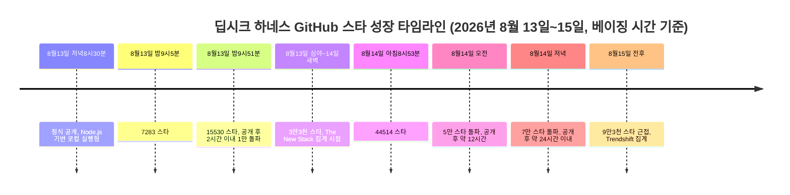
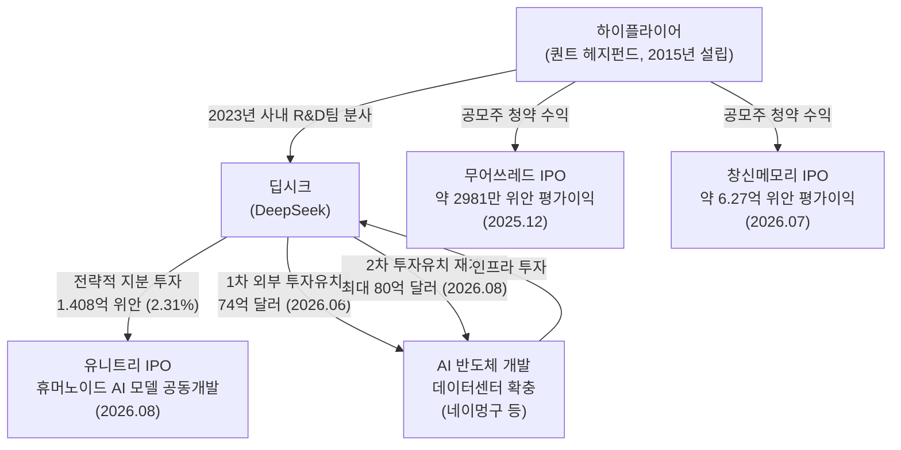
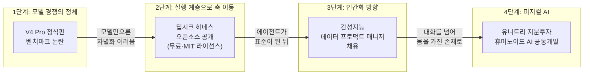

> 
> 바보야 삼촌이 그러잖아 
> 
> 문제는 모델이 아니라 에이전트래 
> 
> 중국AI 를 이끌고 있는 2030 개발자들은 딥시크 창업자 량원펑을 삼촌이라 부른다. 85년생 그도 이제 막 41살인데. 어제와 오늘 중국AI모델 업계는 폭풍이 몰아쳤다. DeepSeek V4 Pro 를 실제 사용해보니 발표한 벤치마크에 훨씬 못미쳐서 모델이 내려가는 소동이 벌어졌고 동시에 DeepSeek Harness는 오픈소스 커뮤니티에서 폭발적인 호응을 얻었다. 42시간 만에 깃허브 스타10만 개, 4000여개의 프로젝트가 올라왔다. 그러는 사이에 Fable 운운하며 GLM-5.3이 발표되었는데 어찌 조용히 묻히는 분위기다. 
> 
> 량원펑은 모델로 토큰을 팔아 돈 벌 생각은 없는 것 같다. 딥시크 자체가 퀀트투자를 하기 위해 투자회사의 사내 R&D 팀에서 탄생한 모델이고 올해만 해도 무어쓰레드, 창신메모리에서 막대한 수익을 얻었으며 이제 유니트리 까지 투자한 상태다. 그리고 1차 2차 딥시크 투자유치까지 성공적으로 이끌어 내는 중이다. 그 돈을 AI칩 개발과 데이터센터에 투입한다는 계획이다. 
> 
> 모델 회사가 모델을 갈아 끼우는 부품으로 전환시켰다. 
> 
> 그리고 오픈소스로 하네스를 풀었다. 이에 커뮤니티는 모델이 좀 부족하면 어떠냐 이젠 에이전트 개발에 열중하자 라고 경쟁의 축이 순식간에 바뀌는 순간. 
> 
> 여기에 딥시크는 새로운 대규모 채용공고로 다음 방향성을 제시했다. 
> 
> 해당 직무는 감성 지능 데이터 프로덕트 메니저. 
> 
> 모델의 감정적인 상호작용 능력을 개선하고 대화의 현실감과 몰입도를 높이며 역할극에 능하고 사람과의 대화에서 감정 교류에 실패하는 지점을 수학적으로 분석하고 개선하는 일이다. 
> 
> 이제 모델이 컴퓨터나 모바일에서 내려와 사람에게로 가려는 순간인 듯 하다. 그리고 같은 고향 친한 동생 유니트리를 통해 피지컬AI 모델도 딥시크가 해결하지 않을까. 그래서 개발자들은 열광하는 것 같다.
> 
> https://www.facebook.com/share/p/1GtUi59B4C/
> 

## 들어가며: 2026년 8월 12일부터 15일까지, 무슨 일이 있었나

2026년 8월 12일 밤부터 15일까지 나흘 사이, 중국 AI 업계에서는 한 회사가 연속으로 세 발의 탄환을 쐈다. 딥시크(DeepSeek)다. 먼저 8월 12일 밤, 예고 없이 플래그십 모델 V4 Pro의 정식판인 V4-Pro-0813을 조용히 배포했다. 그런데 실제 사용자들의 체감 성능이 자체 발표 벤치마크에 크게 못 미친다는 반응이 쏟아지면서 하루 만에 잡음이 커졌다. 바로 다음 날인 8월 13일 저녁 8시 30분(베이징 시간), 이번에는 완전히 다른 성격의 제품을 내놓았다. 오픈소스 에이전트 프레임워크 '딥시크 하네스(DeepSeek Harness)'다. 이 제품은 공개된 지 1시간 30분 만에 스타 2만 2000개를 넘기며 깃허브 역사상 가장 빠른 성장 속도를 기록했고, 이틀 사이 9만 개에 가까운 스타를 모았다. 그리고 같은 주, 중국의 또 다른 AI 기업 즈푸(Zhipu AI)가 GLM-5.3을 발표했지만 딥시크발(發) 뉴스의 파고에 상대적으로 묻히는 모양새가 됐다.

이 세 가지 사건은 따로 벌어진 우연이 아니다. 그 뒤에는 딥시크 창업자 량원펑(梁文鋒, 1985년생, 만 41세)의 일관된 전략이 있다. 모델 자체의 성능 경쟁에서 한 걸음 물러나 에이전트 실행 환경(하네스)을 공개하고, 그 대신 벌어들인 막대한 투자 수익을 반도체와 데이터센터, 그리고 로봇에 쏟아붓는 그림이다. 이 문서는 이 모든 사건을 하나씩 검증된 사실 위주로 짚어보고, 그 안에 담긴 전략적 함의를 정리한다.

---

## 1. 량원펑은 누구인가 — '삼촌'이라 불리는 41세 창업자

량원펑은 1985년 중국 광둥성 잔장시의 평범한 가정에서 태어났다. 부모는 초등학교 교사였고, 어릴 때부터 수학에 재능을 보여 중학생 때 이미 대학 수준의 수학을 독학했다고 알려져 있다. 2002년 가오카오(중국의 대입 수능)에서 우수한 성적으로 저장대학교 전자정보공학과에 입학했고, 이 학교에서 학사와 석사 학위를 받았다.

그의 커리어는 AI가 아니라 금융에서 시작됐다. 2013년 대학 동문과 함께 항저우에서 투자관리회사를 세웠고, 2015년에는 대학 동기들과 AI 기반 헤지펀드 하이플라이어(High-Flyer, 幻方量化)를 설립했다. 컴퓨터 트레이딩에 딥러닝을 접목하는 방식으로 빠르게 성장한 하이플라이어는 2021년 무렵 운용자산 규모가 1000억 위안(약 20조 원)에 달하며 중국 4대 퀀트 헤지펀드 중 하나로 자리 잡았다. 바로 이 하이플라이어의 사내 R&D 조직에서 2023년 딥시크가 분사되어 나왔다. 즉 딥시크는 처음부터 별도의 스타트업이 아니라, 퀀트 투자로 쌓은 자본과 GPU 인프라를 기반으로 태어난 회사라는 뜻이다.

흥미로운 지점은 그의 별명 변천사다. 중국 개발자 커뮤니티와 소셜미디어에서는 량원펑을 상황에 따라 '량성(梁圣, 량 성인)', '량숙(梁叔, 량 삼촌)', '량쯔(梁子, 량 형)', '라오량(牢梁, 옥살이하는 량)' 등으로 부르며 평판이 널뛰기를 거듭해왔다(소후닷컴·펑황망, 2026년 8월 초 보도). R1 발표 이후 세계적 주목을 받으며 '량성'으로 떠받들여졌다가, V4 정식판 출시가 계속 미뤄지자 '량쯔'로 격하되고, API 가격 인상 소식이 나올 때마다 다시 깎아내려지는 식이다. '삼촌'이라는 애칭 자체는 실제로 커뮤니티에서 쓰이는 표현이 맞지만, 존경과 조롱이 뒤섞인 밈에 가깝다는 점은 짚어둘 필요가 있다.

---

## 2. 첫 번째 탄환: V4 Pro 정식판, 발표만큼의 실력을 보여주지 못하다

### 무슨 일이 있었나

딥시크는 지난 4월 24일 V4 Pro와 V4 Flash를 프리뷰 형태로 처음 공개했고, 넉 달 가까이 지난 8월 12일 밤 별도의 블로그 포스트나 공식 발표 없이 API 모델 페이지만 조용히 업데이트하는 방식으로 V4-Pro-0813을 정식판으로 전환했다. 사우스차이나모닝포스트(SCMP)에 따르면, 딥시크 공식 홈페이지에는 "에이전트 능력이 크게 향상됐다"는 짧은 소개 문구가 붙었으나 이 문구는 다음 날 목요일 오후에 삭제됐다. 모델 자체가 서비스에서 내려가거나 철회된 것은 아니고, API 엔드포인트는 계속 살아있었지만, 자신감 있게 내세웠던 홍보 문구를 하루 만에 거둬들인 점은 이례적으로 해석됐다.

### 벤치마크 논란의 실체

문제는 성능이었다. 제3자 벤치마크 사이트 아티피셜 애널리시스(Artificial Analysis)의 지능 지수에서 V4-Pro-0813은 53점을 기록했는데, 이는 지난 6월 나온 즈푸의 GLM-5.2와 비슷한 수준이었고 오픈AI의 GPT-5.6 시리즈 중 중급 모델인 테라(Terra)보다도 4점 낮았다(SCMP, 2026년 8월 14일 보도). 반면 딥시크가 자체 공개한 성적표에는 외부에서 검증되지 않은 자체 벤치마크(DSBench-FullStack, DSBench-Hard)가 포함돼 있었는데, 프리뷰 버전 대비 최대 49.9%포인트 향상됐다는 수치를 내세웠지만 어떤 제3자 평가기관도 이 수치를 재현하지 못했다는 지적이 나왔다(테크타임스, 2026년 8월 13일).

특히 눈길을 끈 부분은 바로 며칠 전인 7월 31일 출시된 저가형 모델 V4 Flash가 아홉 개 에이전트 벤치마크에서 형(V4 Pro)의 프리뷰 버전을 앞질렀다는 보도가 있었다는 점이다. 즉 이번 V4 Pro 정식판 출시는 "동생에게 뒤처진 형의 자존심 회복전"이라는 성격이 강했는데, 정작 그 결과가 신통치 않았던 셈이다.

### 가격 인상이라는 또 다른 뇌관

V4 Pro 정식판 출시와 거의 동시에 딥시크는 API 요금 체계 개편을 발표했다. 8월 17일 자정(베이징 시간)부터 피크 시간대(오전 9~12시, 오후 2~6시)와 비피크 시간대를 구분하는 요금제를 도입하는데, V4 Pro 기준 캐시 히트 입력 요금이 피크 시간대에 최대 12배까지 오른다(1백만 토큰당 0.025위안 → 0.30위안). 출력 토큰 요금도 최대 4.5배 인상된다. 그동안 딥시크의 최대 무기가 '압도적으로 저렴한 가격'이었다는 점을 감안하면, 이는 개발자 커뮤니티 사이에서 상당한 동요를 낳았다.

### 정리하면

원문 게시글에서 "실제 사용해보니 발표한 벤치마크에 훨씬 못미쳐서 모델이 내려가는 소동이 벌어졌다"고 표현한 부분은, 정확히는 (1) 자체 벤치마크와 제3자 벤치마크 사이의 괴리에 대한 실망감이 커뮤니티에 확산됐고 (2) 자신감 있던 홍보 문구가 하루 만에 삭제됐으며 (3) 거의 동시에 대폭적인 가격 인상이 예고된 사건들의 조합으로 보는 것이 정확하다. 모델 자체가 서비스에서 완전히 내려간 것은 아니었다.

---

## 3. 두 번째 탄환: 딥시크 하네스, 깃허브 역사를 새로 쓰다

### 하네스란 무엇인가

딥시크가 공식적으로 제시한 공식은 간명하다. "모델(Model) + 하네스(Harness) = 에이전트(Agent)." 모델이 '생각하는 두뇌'라면, 하네스는 그 생각을 파일 시스템 읽기, 터미널 명령 실행, 웹 탐색, 도구 호출 같은 실제 행동으로 옮기는 '손과 발'에 해당한다. 챗봇이 한 번의 대화로 끝나는 반면, 에이전트는 실제로 작업 하나를 끝까지 완수해서 전달한다는 차이가 있다.

[딥시크 하네스(줄여서 dsh)](https://github.com/deepseek-ai/deepseek-harness)는 "모든 것이 플러그인(Everything is a Plugin)"이라는 철학 아래 만들어졌다. 모델을 어떤 것으로든 교체할 수 있고, 메모리·도구·화면(UI)·심지어 에이전트의 실행 루프 자체까지도 플러그인으로 갈아 끼울 수 있는 구조다. 이 아키텍처는 '코디스(Cordis)'라는 마이크로커널 프레임워크 위에 만들어졌는데, 이는 커뮤니티 플러그인 4000여 개를 보유한 챗봇 프레임워크 '코이시(Koishi)' 생태계에서 파생된 기술이다(딥시크 팀과 베이징대학교 공동 연구 논문 「A Programming Paradigm for Spatiotemporal Composability」). 다만 이 4000개라는 숫자는 코이시라는 기존 프로젝트의 플러그인 수이지, 딥시크 하네스 자체의 플러그인 수는 아니라는 점을 구분할 필요가 있다.

### 폭발적인 성장 속도, 시간대별 기록

깃허브 저장소는 정식 발표 30분 전에 이미 조용히 공개되어 있었는데, 이후의 성장 곡선은 다음과 같이 실측 기록됐다(지커우 공위안·소후 등 중국 매체의 현장 추적 기준).

비교 대상도 뚜렷하다. 그동안 '역사상 가장 빠르게 성장한 저장소'로 불리던 오픈소스 에이전트 프로젝트 OpenClaw는 84일 동안 20만 스타를 모아 시간당 평균 약 99개의 속도를 보였는데, 딥시크 하네스는 첫 2시간 동안 이보다 약 80배 빠른 속도로 스타를 모았다(지커우 공위안, 2026년 8월 14일). 앞서 '역대 최속 2만 스타' 기록은 xAI의 Grok-1(약 1.2일)과 딥시크 자신의 R1(약 5.7일)이 보유하고 있었는데, 이번 하네스는 그 기록을 1시간대에 갈아치웠다.

원문에서 언급한 "42시간 만에 스타 10만 개"라는 수치를 정확히 그 시각까지 못 박아 확인해주는 개별 기사는 찾지 못했다. 다만 실측된 성장 곡선(공개 후 12시간에 5만, 24시간에 7만, 이틀 차에 9만 3천 근접)을 이어보면, 40시간 안팎에 10만 스타에 도달했다는 것은 매우 개연성이 높은 추정치다. 이 부분은 정확한 시각까지 단정하기보다 "이틀 사이 10만 스타에 근접했거나 도달했다"는 수준으로 이해하는 것이 안전하다.

### 커뮤니티 프로젝트 규모

플러그인 생태계 역시 빠르게 불어났다. 깃허브에서 'dsh-plugin' 태그를 단 저장소는 발표 이틀 만에 900여 개(V2EX 집계)에서 2000여 개(커뮤니티 큐레이션 목록 'awesome-dsh-plugin' 집계)까지 다양하게 보고됐고, 한 생태계 지도 시각화 자료에는 1761개라는 숫자도 등장한다. 원문의 "4000여 개 프로젝트"라는 표현은 이 플러그인 생태계 전체의 규모감을 가리키는 것으로 보이는데, 검색 시점 기준으로는 900~2000개대가 다수 소스에서 확인되는 수준이었고, 4000개까지 도달했는지는 독립적으로 확인하지 못했다(다만 폭발적인 증가 추세 자체는 뚜렷하다).

### 왜 이렇게까지 열광했나

가격 경쟁력이 첫 번째 이유다. 하네스 자체는 무료이고 MIT 라이선스로 완전히 개방됐으며, 결합해 쓰는 V4 모델의 토큰 비용도 서구 모델 대비 매우 저렴하다. 두 번째는 압도적인 모듈성이다. 모델, 메모리, 도구, 심지어 UI까지 자유롭게 갈아 끼울 수 있다는 설계 철학이 개발자들의 실험 욕구를 자극했다. 벤처비트(VentureBeat)는 이번 발표를 두고 "기업 개발자 입장에서는 V4 모델 자체보다 하네스 쪽이 더 중요한 소식일 수 있다"고 평가했는데, 이는 모델의 성능 차이가 갈수록 줄어드는 상황에서 그 모델을 실제 업무에 붙이는 '실행 계층'을 누가 표준으로 만드느냐가 다음 경쟁 무대가 되고 있다는 뜻이다.

물론 장밋빛 반응만 있었던 것은 아니다. 발표 다음 날부터 개발자 커뮤니티에서는 비개발자에게 불친절한 사용자 경험, 플러그인 생태계에 의존하는 구조의 장기적 유지보수 가능성에 대한 우려도 함께 제기됐다. 실제로 해커뉴스에서는 "커뮤니티 플러그인에 의존하는 제품은 처음 6개월은 잘 굴러가다가 이후 호환성 붕괴와 거버넌스 부재의 악몽이 시작된다"는 냉정한 지적도 나왔다.

---

## 4. 조용히 묻힌 GLM-5.3 — 타이밍의 희생자

딥시크의 이틀 연속 폭탄 발표 바로 다음 날인 8월 14일, 즈푸(Zhipu AI)는 신형 오픈웨이트 모델 GLM-5.3을 공개했다. 이 모델은 전작 GLM-5.2와 동일한 약 7430억 파라미터 기반(Mixture-of-Experts)을 그대로 쓰면서, 순전히 후속 강화학습(post-training)만으로 코딩 및 에이전트 능력을 전작 대비 약 50% 끌어올렸다는 점이 핵심이었다. 코딩 벤치마크에서는 Claude Fable 5에 근접한 수준까지 따라붙었다는 평가를 받았고, 사이버보안 취약점 탐지 벤치마크(CyberGym)에서는 84.5점을 기록해 Fable 5(83.8점)와 GPT-5.6 Sol(83.6점)을 근소하게 앞서기도 했다. 즈푸는 이 모델을 통해 1981년까지 거슬러 올라가는, 평균 26.6년간 발견되지 않았던 취약점들을 찾아냈다고 밝히며 269개 오픈소스 프로젝트에서 2436건의 보안 이슈(그중 1097건이 심각·높음 등급)를 발견했다는 감사 결과도 함께 공개했다.

이 모델은 발표 직후 X(옛 트위터) 등에서 상당한 화제를 모았고 중국 기술 매체들도 비중 있게 다뤘다는 점에서 완전히 "조용히 묻혔다"고 단정하기는 어렵다. 다만 하루 전날 V4 Pro 정식판과 하네스 오픈소스라는 두 개의 대형 뉴스가 이미 전 세계 개발자 커뮤니티의 관심을 흡수한 상태였고, 그다음 날 곧바로 GLM-5.3이 나오면서 국제 뉴스 사이클에서는 상대적으로 주목도가 낮아진 측면이 있다. 즉 "묻혔다"기보다는 "타이밍상 딥시크의 그림자에 가려졌다"는 표현이 더 정확한 서술에 가깝다.

---

## 5. 량원펑의 실탄: 무어쓰레드, 창신메모리, 그리고 유니트리

원문에서 가장 흥미로운 대목은 "량원펑은 모델로 토큰을 팔아 돈 벌 생각이 없어 보인다"는 관찰이다. 이 부분은 실제 자금 흐름을 보면 상당히 근거가 있다.

### 하이플라이어의 '공모주 재테크'

량원펑이 이끄는 하이플라이어(닝보 하이플라이어 콴트화 투자관리 유한파트너십)는 2025년 말부터 2026년 여름까지 중국 반도체·로봇 기업들의 IPO 공모주 청약(打新)에서 두각을 나타냈다.

- **무어쓰레드(摩爾線程, Moore Threads)**: 국산 GPU 대표주자로 불리는 이 회사가 2025년 12월 5일 상하이 커촹반에 상장했을 때, 하이플라이어는 사모펀드 기관 중 최다 물량인 6만 1300주를 배정받았다(배정 금액 약 700만 위안). 상장 당일 종가 기준으로 발행가(114.28위안) 대비 468.78% 급등하면서, 하이플라이어의 장부상 평가이익은 약 2981만 위안(약 42억 원)에 달했다(둥팡차이푸왕 등 중국 금융매체, 2025년 12월).
- **창신메모리(長鑫科技, CXMT)**: 2026년 7월 27일 상장한 이 D램 제조사는 중국 A주 역사상 최대 규모급 IPO 중 하나로 꼽히는데, 하이플라이어는 사모펀드 중 최대 배정 물량을 받은 기관이었다. 상장 당일 주가가 공모가 대비 465.82% 폭등하면서 하이플라이어의 장부상 평가이익은 개장가 기준 약 6억 2700만 위안(약 870억 원 이상)으로 집계됐다(신랑차이징, 2026년 7월).
- **유니트리(宇樹科技, Unitree)**: 세계 1위 휴머노이드 로봇 제조사인 유니트리가 2026년 8월 10일 상하이 커촹반에 상장할 때는, 이번에는 하이플라이어가 아니라 딥시크 본사(항저우 딥시크 AI 기초기술연구유한공사)가 직접 전략적 투자자로 참여했다. 딥시크는 1억 4080만 위안(약 2100만 달러)을 투입해 신주 93만 3399주(지분율 2.31%)를 확보했으며, 이 지분에는 36개월의 락업(보호예수) 조건이 붙었다. 두 회사는 동시에 딥시크의 언어모델과 유니트리의 로봇 하드웨어·모션 제어 기술을 결합해 휴머노이드 로봇용 AI 모델을 공동 개발하기로 발표했다(유나이트닷AI·SCMP, 2026년 8월). 딥시크와 유니트리 모두 항저우에 본사를 둔 회사라는 공통점이 있고, 두 창업자는 2025년 2월 시진핑 주석이 주재한 좌담회에 나란히 참석한 바 있다.

정리하자면, "무어쓰레드와 창신메모리에서 막대한 수익을 얻었다"는 원문의 서술은 딥시크라는 회사 자체가 아니라 량원펑이 실소유주인 자매 회사 하이플라이어의 공모주 투자 수익을 가리키는 것으로 이해하는 것이 정확하며, 실제로 상당한 규모의 장부상 이익이 발생한 것은 중국 금융매체를 통해 확인된다. 반면 유니트리의 경우는 량원펑 개인이나 하이플라이어가 아니라 딥시크 법인 명의로 직접 지분 투자와 기술 제휴를 맺었다는 점에서 성격이 조금 다르다.

### 딥시크의 대규모 자금 조달

딥시크는 창업 이후 처음으로 2026년 6월 외부 자금 74억 달러(약 10조 원 이상)를 유치했으며, 이때 기업가치는 500억 달러를 넘어선 것으로 알려졌다(포춘, 2026년 7월 보도). 이후 유니트리 지분 투자 발표와 비슷한 시기에 딥시크는 최대 80억 달러 규모, 기업가치 740억 달러 수준의 후속 라운드를 재개한 것으로 전해진다(소프토닉 등, 2026년 8월). 원문에서 언급한 "1차 2차 딥시크 투자유치"는 이 두 차례의 외부 자금 조달을 가리키는 것으로 보인다. 딥시크는 2027년 2분기를 목표로 상하이 커촹반(과창반) 상장까지 추진하고 있으며, 조달한 자금은 AI 반도체 개발과 네이멍구(내몽골) 등지의 데이터센터 확충에 투입될 계획이라고 알려져 있다.

---

## 6. 세 번째 전선: 모델이 사람에게 다가가려 한다 — 감성지능 데이터 프로덕트 매니저

원문에서 언급한 대규모 채용 공고 역시 사실로 확인된다. 딥시크는 2026년 6월 25일 저녁, 소셜미디어를 통해 33개 직무를 한꺼번에 공개하는 대규모 채용 공고를 냈다. 회사는 채용 공고에서 "모든 부서의 규모를 최소 두 배로 확대하겠다"고 밝혔는데, 그 직무 구성이 의미심장하다.

채용 부문은 크게 일곱 개로 나뉜다. 풀스택 개발·알고리즘, AI 핵심 시스템 연구개발, 운영(옵스), 제품, 모델 데이터 전략, 딥러닝 연구원, 그리고 직능 부서다. 이 중 '모델 데이터 전략' 부문에 다섯 개의 세부 직무가 개설됐는데, 코드 에이전트 데이터 엔지니어, 범용 에이전트 데이터 프로덕트 매니저, 전문 영역(소수 언어·의학·법률 등) 데이터 프로덕트 매니저, AI 창작 데이터 프로덕트 매니저, 그리고 **감성지능(정서지능) 데이터 프로덕트 매니저**가 그것이다(관차저·전자공정전집 등 중국 매체, 2026년 6월 26일 보도).

이 직무의 정확한 세부 업무 기술서(JD) 전문까지는 공개적으로 확인하지 못했지만, 딥시크가 스스로 밝힌 채용 배경 설명에 따르면 회사의 전체적인 방향성은 분명하다. "모델 능력이 점차 비슷해지는 상황에서, 딥시크는 경쟁의 초점을 더 세분화되고 전문화된 제품 경험과 산업 응용 쪽으로 옮기고 있다"는 것이다. 같은 채용 공고에서 딥시크는 에이전트 관련 직무의 팀 미션을 이렇게 설명하기도 했다. "문자는 기억을 확장했고, 인쇄술은 지식 전파를 확장했으며, 인터넷은 감각과 연결을 확장했다. 우리는 에이전트가 인간 자신에 대한 또 하나의 확장이 될 것이라고 믿는다."

원문에서 서술한 "역할극에 능하고, 사람과의 대화에서 감정 교류에 실패하는 지점을 수학적으로 분석하고 개선하는 일"이라는 구체적 업무 묘사는, 직무명과 회사의 방향성을 근거로 한 합리적인 해석으로 보이지만 딥시크가 공개한 원문 그대로의 문구인지는 확인되지 않았다는 점을 밝혀둔다. 다만 확실한 것은, 코딩·수학 같은 정량적 벤치마크 경쟁에서 감성적 상호작용이라는 정성적 영역으로 딥시크의 인재 투자 방향이 명백히 넓어지고 있다는 사실이다.

---

## 7. 종합: 모델에서 에이전트로, 그리고 사람과 몸으로

지금까지 확인한 사실들을 하나의 그림으로 이어보면 다음과 같은 흐름이 드러난다.

첫째, 모델 성능만으로는 더 이상 확실한 우위를 만들기 어려운 국면에 접어들었다는 인식이 딥시크 내부에서도 감지된다. V4 Pro의 벤치마크 논란과, 같은 시기 GLM-5.3이 유사한 성능대에 빠르게 진입한 사실은 이를 뒷받침한다.

둘째, 그래서 딥시크는 무료·오픈소스 하네스를 풀어 실행 계층의 표준을 선점하는 전략으로 무게중심을 옮겼다. 벤처비트가 지적했듯, 모델은 갈아 끼울 수 있는 부품이 되어가고 있고, 그 부품들을 조립해 실제 업무에 연결하는 하네스야말로 다음 경쟁의 무대라는 것이다. 이는 원문에서 말한 "모델 회사가 모델을 갈아 끼우는 부품으로 전환시켰다"는 관찰과 정확히 일치한다.

셋째, 감성지능 데이터 프로덕트 매니저 채용은 이 경쟁이 컴퓨터·모바일 화면 안에서의 텍스트 상호작용을 넘어, 사람과의 정서적 관계로 확장되고 있음을 시사한다.

넷째, 유니트리와의 지분 투자 및 기술 제휴는 이 확장이 결국 물리적인 몸(피지컬 AI)으로까지 이어지고 있음을 보여주는 실질적 증거다. 같은 항저우 출신의 두 회사가 손을 잡았다는 점, 그리고 하이플라이어가 반도체(무어쓰레드, 창신메모리) 투자로 벌어들인 자본이 이 모든 확장을 뒷받침하는 실탄이 되고 있다는 점에서, 개발자들이 열광하는 이유를 이해할 수 있다. 모델 하나를 잘 만드는 회사가 아니라, 자본·오픈소스 생태계·감성 AI·로봇 하드웨어를 동시에 쥔 플레이어가 되어가고 있다는 그림이기 때문이다.

다만 이 모든 것은 아직 진행형이라는 점도 함께 짚어야 한다. V4 Pro의 벤치마크 신뢰성 논란은 제3자 재현 검증이 이뤄지지 않은 채 남아있고, 하네스 생태계의 장기적 지속가능성에 대한 우려도 커뮤니티 내에서 제기되고 있으며, 유니트리와의 파트너십이 실제 제품으로 이어질지도 지켜봐야 할 대목이다.

---

## 8. 팩트체크 요약표

| 구분 | 내용 | 검증 상태 |
|---|---|---|
| V4 Pro 벤치마크 미달 논란 | 제3자 평가(Artificial Analysis)에서 GLM-5.2와 유사한 53점, GPT-5.6 계열 중급 모델보다 낮은 성적. 자체 벤치마크는 제3자 재현 안 됨 | 검증됨 (SCMP, 테크타임스 등 복수 매체) |
| "모델이 내려가는 소동" | 모델 자체가 서비스 중단된 것은 아니며, 홍보 문구가 하루 만에 삭제된 사건. 원문 표현은 다소 과장된 뉘앙스 | 부분 검증 / 표현 보정 필요 |
| 하네스 42시간 만에 스타 10만 개 | 정확한 시각까지의 10만 스타 도달은 개별 확인 불가. 다만 12시간 5만, 24시간 7만, 이틀 차 9만 3천이라는 실측치로 볼 때 개연성 높음 | 정황상 합리적 추정 (정확한 시각 미확인) |
| 하네스 프로젝트 4000여 개 | 확인된 dsh-plugin 태그 저장소는 900~2000여 개 수준(집계 시점 상이). 4000개라는 구체적 수치는 확인 안 됨. 4000개는 원조 프레임워크 코이시(Koishi)의 플러그인 수 | 부분 검증 / 수치 과장 가능성 |
| GLM-5.3, Fable 5 근접 | 다수 코딩·에이전트 벤치마크에서 Fable 5에 근접, 일부 보안 벤치마크에서는 근소 우위 | 검증됨 |
| GLM-5.3이 조용히 묻힘 | 중국 매체에서는 비중 있게 다뤄졌고 SNS 화제성도 있었음. 완전히 묻혔다기보다 타이밍상 딥시크 뉴스에 가려진 것에 가까움 | 부분 검증 / 표현 보정 필요 |
| 량원펑, 토큰 판매보다 딥시크 자체가 퀀트 투자에서 출발 | 하이플라이어 사내 R&D팀에서 2023년 분사한 것이 딥시크 | 검증됨 |
| 무어쓰레드·창신메모리에서 막대한 수익 | 하이플라이어가 두 IPO 공모주 청약에서 각각 약 2981만 위안, 약 6.27억 위안의 장부상 평가이익 | 검증됨 (단, 딥시크 법인이 아닌 자매회사 하이플라이어의 수익) |
| 유니트리 투자 | 딥시크 법인이 1.408억 위안으로 2.31% 지분 확보, 36개월 락업, 휴머노이드 AI 모델 공동개발 발표 | 검증됨 |
| 1차·2차 투자유치 | 2026년 6월 74억 달러(기업가치 500억 달러 이상), 이후 최대 80억 달러(기업가치 740억 달러) 라운드 재개 보도 | 검증됨 |
| 감성지능 데이터 프로덕트 매니저 채용 | 2026년 6월 25일 대규모 채용에 실제 포함된 직무명 | 검증됨 (단, "역할극·수학적 분석" 등 구체적 업무 묘사는 원문 JD 전체 확인 안 됨) |
| 량원펑 '삼촌' 별명 | 실제로 커뮤니티에서 '량숙(梁叔)' 등으로 불리나, 존경과 조롱이 뒤섞인 밈으로 평판이 수시로 바뀜 | 검증됨 (뉘앙스 보정 필요) |

---

## 9. 참고자료

- The Information, "DeepSeek's Flagship V4-Pro Model Gets Mixed Reviews" (2026.08)
- South China Morning Post, "DeepSeek's updated V4 Pro AI model struggles on benchmarks, shines in cybersecurity" (2026.08.14)
- TechTimes, "DeepSeek V4 Pro 0813 Goes GA: Benchmark Claims Await Independent Proof" (2026.08.13)
- VentureBeat, "DeepSeek Harness launches as open source rival to Claude Code, alongside V4-Pro on API with higher prices" (2026.08.13)
- The New Stack, "DeepSeek open sources an agent harness where everything is a plugin" (2026.08.12)
- 极客公园(지커우 공위안), "DeepSeek Harness 실측: 하룻밤 5만 스타" (2026.08.14)
- CSDN, "DeepSeek Harness 오픈소스: 모든 것이 플러그인" (2026.08)
- Trendshift, deepseek-harness 저장소 통계 페이지
- PC Watch, "Fable 5とも戦える「GLM-5.3」登場" (2026.08.14)
- WCCFTech, "Zhipu's GLM-5.3 Matches Fable 5 On Coding Using Only Post-Training" (2026.08.14)
- 나무위키 '량원펑' 항목; 한국경제·아시아경제·SBS, 량원펑 관련 보도 (2025.01~02)
- 搜狐(소후닷컴)·凤凰网(펑황망), "梁文锋，置身舆内 / 从'梁圣'到'梁子'，梁文锋风评演进史" (2026.08)
- Fortune, "Moonshot, DeepSeek, and the Great Chinese AI IPO Rush" (2026.07.23)
- Unite.AI, "DeepSeek Buys Into Unitree's Shanghai IPO in Humanoid AI Pact" (2026.08)
- BigGo Finance, "China's DeepSeek Bets approximately $21.3 Million on Unitree IPO" (2026.08)
- 东方财富网, "摩尔线程中一签赚28.68万元，幻方量化收益颇丰" (2025.12)
- 新浪财经, "梳理长鑫科技万亿IPO的财富分配" (2026.07.29)
- 观察者网(관차저), "DeepSeek开启大规模招聘，团队负责人否认'不招外国人'" (2026.06.26)
- 电子工程专辑, "DeepSeek全员扩招一倍！33个岗位全开" (2026.06.26)
- 证券时报(증권시보), "DeepSeek启动大规模招聘，计划将所有部门的规模扩大至少一倍" (2026.06.26)

---

작성일: 2026년 08월 16일
