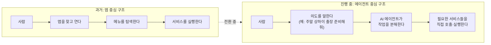
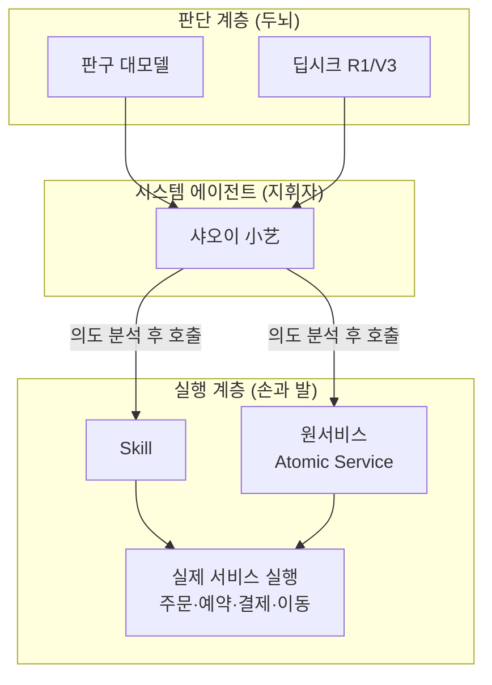
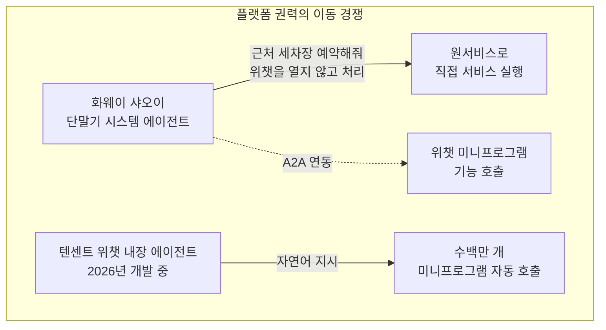

**부제: 원서비스, 샤오이, 그리고 슈퍼앱과 슈퍼에이전트의 전쟁 (2026년 8월 기준 팩트체크 리포트)**

## 관련글

[**앱의 종말, 화웨이는 스마트폰을 AI폰으로 바꾸고 있다**](https://www.facebook.com/share/p/14mefePGZYG/)

---

## 이 문서의 목적

이 문서는 SNS에서 유통된 "중국 AI 미래지도" 게시물이 다룬 화웨이 하모니OS의 AI 에이전트 전략을 원문 그대로 옮기지 않고, 화웨이 공식 발표, 개발자 커뮤니티 문서, 카운터포인트리서치 등 시장조사기관 자료, 그리고 애플·구글·텐센트의 공식 뉴스룸 자료를 교차 검증하여 다시 작성한 것입니다. 원문이 작성된 시점 이후에도 관련 산업은 빠르게 움직였습니다. 특히 2026년 5~6월에 구글 I/O, 애플 WWDC, 화웨이 HDC(개발자대회)가 연달아 열리면서 "앱에서 에이전트로"라는 흐름이 추측이 아니라 각 사의 공식 로드맵으로 확정되었습니다. 이 문서는 그 최신 진행 상황까지 포함합니다.

먼저 결론부터 말씀드리면, 원문의 핵심 주장 — 모바일 인터페이스의 무게중심이 앱에서 AI 에이전트로 이동하고 있고 화웨이가 그 최전선에 있다는 것 — 은 사실관계 측면에서 대체로 타당합니다. 다만 몇 가지 구체적 수치나 일화성 사례는 화웨이 측 홍보 자료나 파트너사의 보도자료에 기반한 것이어서, 독립적인 제3자 검증이 어려운 부분도 있습니다. 이 문서에서는 어떤 내용이 공식 발표로 확인되는지, 어떤 내용이 업계 추정이나 홍보성 서술에 가까운지를 구분해서 전달합니다.

---

## 1. 왜 "앱이 사라진다"는 말이 나오는가

지난 이십 년 동안 스마트폰이라는 기기는 사실상 앱의 집합체였습니다. 쇼핑을 하려면 쇼핑 앱을 열고, 택시를 부르려면 모빌리티 앱을 찾고, 호텔을 예약하려면 여행 앱에 들어가야 했습니다. PC 시대에는 사람이 웹사이트를 직접 찾아 들어가 서비스를 이용했고, 스마트폰 시대에는 그 창구가 앱으로 바뀌었을 뿐, 어떤 서비스를 쓸지 판단하고 화면을 조작하는 주체는 언제나 사람이었습니다.

최근 각 플랫폼 기업들이 동시에 추진하는 변화는 이 구조 자체를 재편하려는 시도입니다. 사람이 앱 아이콘을 눌러 서비스를 찾아가는 대신, AI 에이전트가 사람의 의도를 이해하고 필요한 서비스를 찾아 대신 실행하는 구조로 옮겨가고 있습니다. 이 변화를 도식으로 정리하면 다음과 같습니다.

이런 흐름 속에서 화웨이, 애플, 구글, 텐센트가 각자 다른 출발점에서 비슷한 방향으로 움직이고 있다는 것이 2026년 상반기까지 확인된 사실입니다. 아래에서 기업별로 무엇이 확인된 사실이고 무엇이 진행형인지 짚어보겠습니다.

---

## 2. 화웨이가 그리는 그림: 스마트폰을 넘어선 하나의 운영체제

### 2.1 중국 스마트폰 시장에서 화웨이의 위치 (검증된 수치)

원문은 "2026년 상반기 중국 스마트폰 시장 점유율 1위는 화웨이"라고 서술했는데, 이는 시장조사기관 카운터포인트리서치의 발표와 일치합니다. 카운터포인트에 따르면 화웨이는 2026년 1분기에도 중국 시장 1위를 지켰고, 2분기에는 점유율 23%를 기록하며 2020년 4분기 이후 가장 높은 수준까지 올라섰습니다. 이는 전년 동기 대비 24% 늘어난 수치로, 저가형 모델인 Enjoy 90 Pro Max의 수요와 폴더블 라인업 Pura X Max의 흥행이 견인차 역할을 했습니다.

다만 오해하기 쉬운 부분이 있어 짚어드립니다. 이 1위는 **중국 내수 시장**에 한정된 순위입니다. 글로벌 시장 전체로 보면 2026년 1분기에는 오히려 애플이 처음으로 분기 기준 세계 1위를 차지했는데, 이는 아이폰17 수요와 반도체 공급망 관리 전략이 맞물린 결과였습니다. 즉 "화웨이가 애플과 삼성을 제치고 세계 1위가 됐다"는 식으로 확대 해석하면 부정확하며, 정확히는 "중국이라는 안방 시장에서 화웨이가 압도적 1위를 지키고 있다"는 의미로 이해하는 것이 맞습니다.

| 구분 | 2026년 1분기 | 2026년 2분기 |
|---|---|---|
| 중국 내수 시장 1위 | 화웨이 | 화웨이 (점유율 23%) |
| 중국 내수 시장 2위 | 애플 (아이폰17 호조) | 애플 (전년比 23%↑) |
| 글로벌 시장 1위 | 애플 (사상 최초 분기 1위) | — |
| 중국 시장 전체 흐름 | 전년比 5%↓ (수요 위축) | 상반기 누적 전년比 3%↓ |

*출처: 카운터포인트리서치 중국·글로벌 스마트폰 분기 트래커*

### 2.2 하모니OS와 '원서비스(元服务, Atomic Service)'란 무엇인가

하모니OS(HarmonyOS)는 화웨이가 안드로이드와 결별한 뒤 독자적으로 키워온 분산형 운영체제입니다. 스마트폰뿐 아니라 태블릿, PC, 워치, 자동차, TV, 가전까지 하나의 운영체제 계열로 묶으려 한다는 원문의 설명은 사실과 부합합니다. 최신 화웨이 개발자대회(HDC 2026, 2026년 6월 개최) 발표에 따르면 오픈하모니 기반 생태계 기기 수는 13억 대를 넘어섰고, 하모니OS6 기기만 놓고 봐도 6,600만 대를 돌파했습니다.

이 생태계의 핵심 개념이 '원서비스(元服务)', 영문으로는 아토믹 서비스(Atomic Service)입니다. 쉽게 설명하면, 기존에는 주문·예약·결제·멤버십 같은 기능이 각각의 앱 안에 통째로 갇혀 있었습니다. 원서비스는 이런 기능 하나하나를 별도로 설치할 필요 없는 독립된 조각으로 쪼개서, 사용자가 필요한 순간에 카드 형태로 바로 불러 쓸 수 있게 만든 구조입니다. 화면 맨 왼쪽의 '네거티브 원 스크린'이라 불리는 영역이나 시스템 검색을 통해 앱을 설치하지 않고도 해당 기능만 즉시 실행할 수 있습니다.

기업들이 기존에 만들어둔 미니프로그램(위챗 미니앱과 유사한 형태) 자산을 원서비스로 쉽게 옮길 수 있도록 화웨이가 제공하는 전환 도구가 ASCF(Atomic Service Cross Framework)입니다. 이는 실제로 존재하는 화웨이의 공식 개발자 프레임워크로, 기존 미니프로그램과 유사한 개발 방식을 그대로 쓸 수 있게 해 전환 비용을 낮추는 것이 목적입니다. 화웨이 내부에서는 이 프레임워크를 두고 "주방은 바뀌었지만 손맛은 그대로 가져올 수 있다"는 비유를 쓴다고 알려져 있습니다.

### 2.3 실제 적용 사례 — 검증된 두 가지 케이스

**징둥(JD.com)의 200여 개 카드화 사례**
원문에서 언급한 "징둥이 쇼핑 과정을 200개가 넘는 상황별 카드로 분해했다"는 내용은 2026년 8월 초 공개된 화웨이 생태계 관련 보도를 통해 확인됩니다. 징둥은 ASCF 프레임워크를 활용해 상품 진열, 프로모션, 혜택 분배, 멤버십 등 복잡한 쇼핑 과정을 200개 이상의 장면별(scenario-based) 카드로 해체하여 하모니OS의 네거티브 원 스크린에 연결했습니다. 이 과정에서 화웨이의 AI 코딩 보조 도구가 코드 오류 121건을 자동으로 찾아 수정했다는 내용도 함께 보도되었습니다.

**선전 만샹청(万象城) 주차 서비스 사례**
원문의 "선전 쇼핑몰 주차장" 사례도 실제로 존재하는 프로젝트입니다. 정식 명칭은 '이디엔완샹(一点万象)' 원서비스로, 화룬만샹생활(华润万象生活)이 화웨이와 협력해 만든 서비스입니다. 차량이 매장에 접근하면 입장 안내 카드가 자동으로 뜨고, 주차 후에는 네거티브 원 스크린의 '서비스 다이내믹' 기능으로 주차 위치가 기록되며, 출차 시에는 화웨이페이 소액 무비밀번호 결제로 줄을 서지 않고 바로 정산할 수 있습니다. 이 서비스는 2026년 6월 기준으로 선전 지역 11개 쇼핑몰에 이미 확대 적용되었고, 선전 뤄후구(罗湖区)는 이 서비스를 시작으로 중국 최초의 '하모니 상권'으로 지정되어 화웨이 개발자대회에서 우수 사례로 소개되었습니다. 다른 주차 서비스 업체인 지에팅처(捷停车)의 경우에도 원서비스 도입 후 페이지뷰가 22.45%, 체류시간이 30.75% 늘었다는 수치가 공개되었습니다. 다만 이 수치들은 화웨이 및 협력사 측이 발표한 것으로, 독립된 제3의 조사기관이 별도로 검증한 자료는 아니라는 점은 참고할 필요가 있습니다.

---

## 3. 원서비스의 '두뇌'는 무엇인가 — 판구, 딥시크, 그리고 샤오이

### 3.1 두 개의 모델이 함께 작동하는 구조

원문은 화웨이의 AI 에이전트 샤오이(小艺, Xiaoyi)가 화웨이 자체 모델 판구(Pangu)를 기반으로 하면서 딥시크의 추론 능력까지 결합했다고 설명했는데, 이는 시점을 명확히 하면 사실입니다. 화웨이는 2024년 10월 원생 하모니(HarmonyOS NEXT) 발표 행사에서 판구 대모델을 탑재한 샤오이를 먼저 공개했고, 이후 2025년 2월 5일 딥시크(DeepSeek)가 R1 모델로 전 세계적 주목을 받자, 같은 날 샤오이 앱에 딥시크-R1 베타 버전을 통합했습니다. 사용자는 샤오이 앱의 '지능체 광장(智能体广场)'에서 판구 기반 기본 대화와 딥시크 R1을 선택적으로 오갈 수 있는 구조입니다. 즉 "판구와 딥시크가 완전히 하나의 모델처럼 융합되어 있다"기보다는, 샤오이라는 인터페이스 안에 두 모델이 나란히 배치되어 사용자가 상황에 맞게 호출하는 방식에 가깝습니다.

### 3.2 지휘자와 손발이라는 비유

원문이 사용한 비유 — 판구·딥시크는 사고하는 두뇌이고, 샤오이는 어떤 서비스를 어떤 순서로 쓸지 결정하는 지휘자이며, Skill과 원서비스는 그 판단을 실제 행동으로 옮기는 손발이라는 구조 — 는 화웨이가 실제로 자사 문서에서 쓰는 설명 방식과 상당히 유사합니다. 이를 도식으로 나타내면 다음과 같습니다.

---

## 4. 2026년 상반기, 이 구상이 실제로 얼마나 진전됐는가

원문 게시물이 작성된 이후 상황은 한 단계 더 나아갔습니다. 2026년 6월에 열린 화웨이 개발자대회(HDC 2026)에서 화웨이는 하모니OS 전체를 '에이전트 아키텍처'로 전환하겠다는 로드맵을 공식화했습니다. 핵심은 다음과 같습니다.

- **HMAF 2.0(하모니 지능체 프레임워크 2.0)** 이 공개되면서 샤오이가 단순한 음성비서에서 시스템 전체의 '지능 두뇌' 역할로 재정의되었습니다. 화웨이는 이를 "명령을 수행하는 존재"에서 "의도를 이해하는 존재"로의 전환이라 표현하며, "의도가 곧 서비스(意图即服务)"라는 슬로건을 내걸었습니다.
- 하모니OS 안의 메모, 캘린더, 갤러리, 블루투스 같은 시스템 기본 앱들이 전부 'Skill화'되었고, 여기에 더해 운동·건강, 이동, 사무, 교육 등 분야에서 엄선된 500여 개의 생태계 Skill이 추가로 연결되었습니다.
- 공식 발표에 따르면 샤오이의 일일 활성 사용자 수는 1.8억 명, 하루 평균 호출 횟수는 30억 회에 달합니다. 다만 이는 화웨이가 자체 공개한 수치로, 외부 감사기관의 검증을 거친 지표는 아닙니다.
- 노트북이 덮개를 닫고 대기 상태여도 사용자가 샤오이에게 말을 걸면 휴대폰과 PC가 함께 파일을 찾아 정리해 전송하는 등, 여러 기기를 넘나드는 협업 시나리오도 시연되었습니다.

이 발표는 원문의 예측이 단순한 추측이 아니라 화웨이의 공식 전략으로 이미 구체화되고 있음을 보여줍니다. 다만 "일상의 모든 것을 에이전트가 처리한다"는 수준까지는 아직 시연 단계이며, 실제 대중적 사용률이나 오작동률에 대한 독립적 검증 자료는 아직 부족하다는 점도 함께 알려드립니다.

---

## 5. 애플과 구글도 같은 방향으로 움직이고 있다 — 오히려 원문보다 더 빨리

원문은 애플과 구글의 움직임을 비교적 조심스럽게 "같은 방향으로 움직이고 있다"는 정도로만 서술했는데, 실제로는 두 회사 모두 원문 작성 이후 훨씬 구체적인 발표를 내놓았습니다.

### 5.1 애플: 앱 인텐트에서 '시리 AI'로

애플은 개발자들이 앱의 기능을 시스템에 노출시킬 수 있게 하는 앱 인텐트(App Intents) 프레임워크를 이미 운영해 왔고, 이를 통해 시리와 스포트라이트, 단축어가 앱 내부 기능을 호출할 수 있다는 원문의 설명은 정확합니다. 그런데 2026년 6월 8일 애플은 세계개발자회의(WWDC26)에서 이를 한 단계 끌어올린 '시리 AI(Siri AI)'를 공식 발표했습니다. 이는 기존 시리를 대체하는 완전히 새로운 버전으로, 사용자의 개인적 맥락(메시지·이메일·사진 등)과 화면에 보이는 정보를 함께 이해하고, 앱 인텐트 프레임워크를 통해 앱의 기능을 더 깊게 실행할 수 있도록 설계되었습니다. 애플은 이 기능이 우선 영어로 올해 안에 제공될 예정이라고 밝혔으며, 규제 문제로 인해 중국에서는 당분간 제공되지 않는다는 점도 함께 명시했습니다.

### 5.2 구글: 안드로이드를 '인텔리전스 시스템'으로 재정의

구글의 움직임은 원문이 서술한 것보다 더 구체적입니다. 2026년 5월 12일 '안드로이드 쇼'에서 구글은 안드로이드를 전통적인 운영체제에서 '인텔리전스 시스템(Intelligence System)'으로 재정의하겠다고 발표했고, 이어진 구글 I/O 2026에서 이를 '제미나이 인텔리전스(Gemini Intelligence)'라는 이름으로 구체화했습니다. 핵심 기술인 앱펑션스(AppFunctions)는 앱이 자신의 도구와 서비스, 데이터를 시스템에 노출하는 방식으로, 구글은 이를 '안드로이드 MCP(Model Context Protocol)'라고 부르며 온디바이스 MCP 서버 역할을 하도록 설계했습니다.

실제 사례로 삼성 갤럭시 S26 시리즈에서는 사용자가 "삼성 갤러리에서 우리 고양이 사진 보여줘"라고 말하면 제미나이가 갤러리 앱을 직접 열지 않고도 사진을 찾아 대화창에 바로 띄워주는 기능이 이미 구현되어 있습니다. 구글은 갤럭시 S26과 일부 픽셀10 기기에서 전원 버튼을 길게 누르는 것만으로 여러 단계의 작업(예: 카페에서 라떼 주문하기, 메모 앱의 장보기 목록으로 장바구니 구성하기)을 제미나이에게 위임할 수 있는 기능도 시범 운영 중이라고 밝혔습니다. 이 기능은 향후 폴더블, 워치, 자동차, XR 기기로 확장될 예정입니다.

두 회사의 발표를 비교하면 아래와 같습니다.

| 구분 | 화웨이 | 애플 | 구글 |
|---|---|---|---|
| 시스템 명칭 | HMAF 2.0 (하모니 지능체 프레임워크) | 시리 AI + 앱 인텐트 | 제미나이 인텔리전스 |
| 발표 시점 | 2026년 6월 (HDC 2026) | 2026년 6월 (WWDC26) | 2026년 5월 (Google I/O) |
| 앱-시스템 연결 기술 | Skill / 원서비스(ASCF) | App Intents 프레임워크 | AppFunctions (Android MCP) |
| 지휘자 역할 AI | 샤오이 (판구 + 딥시크) | 시리 AI (애플 인텔리전스) | 제미나이 |
| 특이사항 | 중국 내 独자 생태계, 자동차·가전까지 확장 | 중국에서는 규제로 미출시 | 삼성 등 타사 기기까지 연동 |

---

## 6. 슈퍼앱 위챗은 정말 위협받고 있는가 — 이 부분이 가장 중요한 최신 업데이트입니다

원문에서 가장 흥미로운 대목은 "AI 에이전트가 위챗이라는 슈퍼앱을 우회할 수 있다"는 전망이었는데, 이 예측은 2026년 상반기 실제로 벌어진 사건을 통해 상당 부분 현실이 되었습니다.

위챗이 중국 모바일에서 절대적 지위를 가진 이유는 메신저 기능 때문만이 아니라, 미니프로그램을 통해 쇼핑·배달·택시·병원·금융·공공서비스·결제까지 수백만 개의 서비스를 하나의 입구로 끌어들였기 때문이라는 원문의 분석은 정확합니다. 그런데 화웨이 같은 단말기 제조사의 시스템 에이전트가 사용자의 의도를 먼저 받아 처리하기 시작하면, 위챗이 그동안 독점해온 '서비스 입구'로서의 지위가 흔들릴 수 있다는 우려가 실제로 텐센트 내부에서도 감지되고 있습니다.

**파이낸셜타임스와 디인포메이션의 보도(2026년 3월, 6월)** 에 따르면, 텐센트는 위챗 생태계 안에 수백만 개의 미니프로그램을 직접 연결하는 새로운 AI 에이전트를 극비리에 개발해 왔습니다. 이 프로젝트는 최소 2025년 상반기부터 시작되었으며, 회사 내 최고 전략 우선순위 프로젝트로 지정되어 있습니다. 사용자가 자연어로 지시하면 AI가 이를 하위 작업으로 쪼개 관련 미니프로그램을 자동으로 호출하여 검색·비교·주문·결제까지 위챗 안에서 매듭짓는 방식으로 설계되었습니다. 인터페이스는 위챗 메인 화면에서 오른쪽으로 밀면 나타나는 대화창 형태로 알려져 있습니다. 이 소식이 2026년 6월 2일 보도되자 텐센트 주가는 하루 만에 10% 넘게 급등해 2021년 1월 이후 최대 상승폭을 기록했고, 시가총액이 하루 만에 약 4,100억 홍콩달러 늘었습니다.

더 흥미로운 지점은, 텐센트가 이미 화웨이·아너·샤오미·오포 등 단말기 제조사들과 'A2A(에이전트 투 에이전트)' 연동 기능을 계약해 두었다는 사실입니다. 즉 사용자가 스마트폰 제조사의 AI 에이전트(예: 샤오이)에게 지시를 내리면, 그 에이전트가 위챗의 음성·영상통화를 걸거나 친구에게 메시지를 보내는 것까지 대신 처리할 수 있는 구조를 준비하고 있는 것입니다. 이는 원문이 그린 "슈퍼앱이 우회당한다"는 시나리오와, "슈퍼앱 스스로 슈퍼에이전트가 된다"는 시나리오가 동시에, 그리고 서로 얽힌 형태로 진행되고 있음을 보여줍니다.

다만 텐센트의 독자 AI 에이전트 '위안바오(元宝)'는 2026년 3월 기준 월간활성사용자(MAU)가 약 5,700만~1억 명 수준으로, 바이트댄스의 더우바오(3.45억 명)나 알리바바의 첸원(1.66억~2억 명)에 크게 못 미치는 상황입니다. 이 때문에 텐센트는 독자 앱으로 정면 승부하기보다, 위챗이라는 14억 3천만 월간활성사용자를 보유한 압도적 유통망 안에 에이전트 기능을 심어 넣는 전략으로 방향을 튼 것으로 분석됩니다. 정식 출시일은 2026년 8월 현재까지 공식 확정되지 않았으며, 생성형 AI 서비스에 대한 중국 정부의 등록·심사 절차를 통과해야 하는 과제가 남아 있습니다.

---

## 7. 원문에서 표현을 완화하거나 보완할 필요가 있는 부분

이 문서는 원문의 논지를 대체로 지지하지만, 독자의 정확한 이해를 위해 다음 몇 가지는 짚고 넘어가야 합니다.

첫째, "화웨이가 중국 스마트폰 1위"라는 표현은 정확히는 중국 내수 시장 한정이며, 글로벌 순위와 혼동하지 않아야 합니다.

둘째, 샤오이가 판구와 딥시크를 "결합"했다는 표현은 두 모델이 하나로 융합됐다기보다, 사용자가 상황에 따라 전환해 쓸 수 있는 병렬 구조에 가깝습니다.

셋째, 징둥의 200여 개 카드, 선전 만샹청 주차 사례, 샤오이 일일활성 1.8억 명 같은 구체적 수치는 모두 화웨이 및 협력사가 직접 공개한 자료에 근거한 것으로, 언론이나 정부 등 완전히 독립적인 제3자가 별도로 재검증한 수치는 아닙니다. 사실 자체는 확인되지만, 수치의 객관성에는 일정한 한계가 있다는 뜻입니다.

넷째, 위챗을 우회하는 미래에 대한 원문의 전망은 방향성 면에서는 타당하지만, 실제로는 텐센트가 손 놓고 당하는 쪽이 아니라 이미 자체적으로 대응 프로젝트를 가동 중이라는 사실이 최근 몇 달 사이 드러났습니다. 따라서 "위챗이 무너진다"보다는 "위챗도 스스로 에이전트가 되기 위해 사활을 걸고 있다"는 쪽이 더 정확한 묘사입니다.

---

## 8. 용어 정리

| 용어 | 설명 |
|---|---|
| 원서비스 (元服务, Atomic Service) | 하모니OS에서 앱 설치 없이 필요한 순간에 바로 불러 쓸 수 있는 경량 서비스 단위 |
| ASCF (Atomic Service Cross Framework) | 기존 미니프로그램 자산을 원서비스로 전환할 수 있도록 화웨이가 제공하는 개발 프레임워크 |
| 샤오이 (小艺, Xiaoyi) | 화웨이의 시스템 레벨 AI 에이전트. 판구와 딥시크 모델을 기반으로 사용자 의도를 해석하고 서비스를 호출 |
| HMAF (하모니 지능체 프레임워크) | 하모니OS 전체를 에이전트 아키텍처로 전환하기 위해 화웨이가 도입한 프레임워크. 2026년 HDC에서 2.0 버전 공개 |
| 판구 (Pangu) | 화웨이 자체 개발 대규모언어모델. 산업 특화 응용에 강점 |
| 딥시크 (DeepSeek) | 2025년 초 저비용·고성능으로 주목받은 중국 AI 스타트업의 추론 모델 |
| App Intents | 애플 개발자가 앱의 기능을 시스템(시리 등)에 노출시키는 프레임워크 |
| 시리 AI (Siri AI) | 2026년 6월 애플이 발표한 차세대 시리. 개인 맥락 이해와 화면 인식 기능 탑재 |
| AppFunctions (Android MCP) | 구글이 안드로이드 앱을 온디바이스 MCP 서버처럼 동작하게 하는 API |
| 제미나이 인텔리전스 | 구글이 안드로이드를 '인텔리전스 시스템'으로 재정의하며 내놓은 AI 프레임워크 |
| GUI → LUI → 에이전트 인터페이스 | 그래픽 사용자 인터페이스에서 언어 사용자 인터페이스, 다시 에이전트가 작업을 대행하는 인터페이스로의 이동을 뜻하는 표현 |
| 미니프로그램 (小程序) | 위챗 등 슈퍼앱 안에서 별도 설치 없이 실행되는 경량 애플리케이션 |

---

## 9. 팩트체크 등급 요약

아래는 이 문서에서 다룬 핵심 주장들을 근거의 성격에 따라 나눈 것입니다.

**1차 자료·공식 발표로 확인됨**
- 화웨이의 중국 내수 스마트폰 시장 점유율 1위 및 2026년 2분기 23% 점유율 (카운터포인트리서치)
- 샤오이의 판구·딥시크 순차적 통합 (화웨이 공식 지원 페이지, 발표 보도자료)
- ASCF 프레임워크의 존재와 기능 (화웨이 개발자 문서)
- 애플의 '시리 AI' 발표 및 앱 인텐트 확장 (애플 뉴스룸, WWDC26)
- 구글의 '제미나이 인텔리전스'와 앱펑션스 발표 (구글 안드로이드 개발자 블로그)
- 화웨이 HDC 2026에서의 HMAF 2.0 및 하모니OS7 공개 (다수 IT 매체의 현장 보도)

**복수의 독립 매체가 교차 검증함**
- 텐센트의 비밀 위챗 AI 에이전트 개발 프로젝트 (파이낸셜타임스, 디인포메이션 원 보도를 IT즈지아·신랑재경 등 다수 매체가 인용·교차 확인)
- 위챗과 화웨이·아너·샤오미·오포 간 A2A 연동 계약

**화웨이 및 협력사 발표에 근거하며 제3자 재검증은 제한적임**
- 징둥의 원서비스 200여 개 카드화 수치
- 선전 만샹청 주차 서비스의 세부 운영 방식과 11개 매장 확대 수치
- 샤오이의 일일활성 1.8억 명, 하루 30억 회 호출이라는 수치

**추정 또는 해석의 영역**
- "위챗이 결국 우회당할 것"이라는 결론 자체는 예측이며, 실제로는 텐센트가 자체 대응에 나서고 있어 승부는 아직 정해지지 않았습니다.
- "AI폰 시대가 곧 인터페이스의 종말을 의미한다"는 표현은 산업 전체의 방향성을 요약한 해석적 진술로, 검증 가능한 사실 명제라기보다 업계의 전망에 가깝습니다.

---

## 10. 참고자료

- 카운터포인트리서치, "중국 스마트폰 출하량 전년 동기 대비 2% 감소…애플은 23% 성장" (2026)
- 카운터포인트리서치, "중국 스마트폰 판매량 노동절 주간 16% 급감…화웨이 1위 독주 속 애플 3% 성장" (2026.05)
- 카운터포인트리서치, "애플, 화웨이·비보 꺾고 2025년 4분기 중국 스마트폰 출하량 1위 달성" (2026.01)
- 腾讯云开发者社区, "ASCF框架开发元服务"
- 量子位(qbitai.com), "高效低成本开发，商业增长回报高，鸿蒙元服务背后的'开发厨房'让开发者按时吃饭！" (2026.08)
- 中华网/CCTIME, "一点万象元服务上线|全面升级鸿蒙用户停车效率与体验" (2026.06)
- 华为消费者官网, "小艺DeepSeek能力常见问题"
- 观察者网, "华为小艺、联想小天等接入DeepSeek" (2025.02)
- IT之家, "HDC 2026 开幕，华为 HarmonyOS 7 全新亮相" (2026.06)
- 爱范儿(ifanr), "HDC 2026 深度解构：鸿蒙全面向 Agent 架构演进，小艺做了这三件事" (2026.06)
- Apple Newsroom, "Apple introduces Siri AI, a profoundly more capable and personal assistant" (2026.06.08)
- Apple Newsroom, "Apple aids app development with new intelligence frameworks and advanced tools" (2026.06)
- Android Developers Blog, "The Intelligent OS: Making AI agents more helpful for Android apps" (2026.02)
- Android Developers Blog, "Building for the Intelligence System on Android" (2026.05)
- Android Developers Blog, "Top AI on Android updates... from Google I/O '26" (2026.05)
- The Information / Financial Times 보도를 인용한 腾讯新闻, 虎嗅(huxiu.com), 钛媒体(tmtpost.com) 등 다수 매체, "微信绝密 AI Agent 项目" 관련 보도 (2026.03~06)
- 财联社(cls.cn), "微信AI生态正式对外开放 多家头部企业抢先接入内测" (2026.06)

---

*본 문서는 SNS에 게시된 1차 원문 내용을 화웨이·애플·구글·텐센트의 공식 발표 및 시장조사기관 자료와 대조하여 재구성한 것입니다. 인용된 수치와 발표 시점은 2026년 8월 16일 기준으로 확인 가능한 최신 정보를 반영했으며, 이후 각 사의 공식 발표에 따라 변경될 수 있습니다.*
