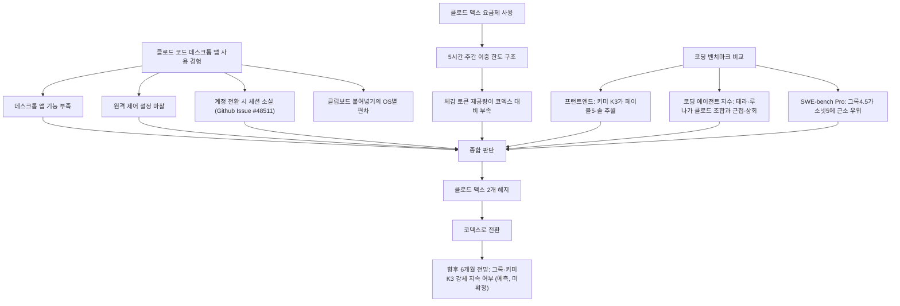

> 
> 클로드코드 이제 안쓰는 이유
> 
> - 데스크탑 앱의 기능이 안좋음.
> - 원격 연결도 안좋음.
> - 아이디 바꾸면 세션 다 날라가는거도 안좋음.
> - 이미지 내장 없음.
>
> - 토큰 양 - 리셋 고려시 몇배 차이남. 
> - 프론트도 솔 5.6 부터는 딸림 (약간 주관적) 
> - 백엔드는 주관적. (만약 이게 클로드가 좀 우세하다 쳐도 나머지가 너무 딸림.)
>
> 클로드 맥스 2개 다 해지하고, 코덱스로 옮겨 탐. 
> 
> 앞으로 6개월후- 클로드는 그록, 키미3 한테도 따일것같은데?
> 
> 이미 가격대비로는 클로드는 쓸 이유가 없음.
> 
> 소넷5 는 이미 그록, 코덱스 테라, 루나 등등 여러 모델한테 따라잡힘.
> 
>  https://www.threads.com/share/BAb6BKPw3q/
> 

---

## 1. 들어가며

이 문서는 스레드(Threads)에 게시된 "클로드 코드 이제 안 쓰는 이유"라는 글의 주장을 하나씩 짚어보고, 2026년 8월 중순 현재 시점에서 확인 가능한 공식 문서, 개발자 커뮤니티 게시글, 벤치마크 자료를 바탕으로 사실관계를 검증한 자료다. 원문이 게시된 스레드 페이지는 자동 접근이 차단되어 있어 직접 열람하지는 못했고, 사용자가 전달한 요약 문구를 기준으로 각 주장을 재구성했다. 따라서 원문의 뉘앙스나 맥락이 일부 생략되었을 가능성은 있다는 점을 먼저 밝혀둔다.

원문의 골자는 크게 세 갈래로 나뉜다. 첫째는 클로드 코드 데스크톱 앱과 원격 작업 환경의 완성도에 대한 불만이다. 둘째는 클로드 맥스(Claude Max) 요금제의 토큰 제공량이 경쟁 서비스인 코덱스(Codex)에 비해 실질적으로 부족하다는 지적이다. 셋째는 모델 성능, 특히 프런트엔드 코딩 영역에서 클로드가 그록(Grok), 키미(Kimi) K3, GPT-5.6 계열에 뒤처지기 시작했다는 판단이다. 이 세 갈래 주장을 항목별로 검증한 뒤, 글쓴이가 내린 "클로드 맥스 두 개 해지 후 코덱스로 전환"이라는 결론과 "향후 6개월 전망"까지 순서대로 살펴본다.

---

## 2. 데스크톱 앱과 작업 환경: 불편함의 실체

### 2-1. 데스크톱 앱 자체의 기능 부족

클로드의 데스크톱 앱은 2026년 1월 macOS 리서치 프리뷰로 처음 등장한 뒤 Windows로 확대되었고, 같은 해 7월부터는 웹과 모바일까지 코워크(Cowork) 기능이 확장되는 등 빠르게 형태를 바꿔온 제품이다. 채팅과 코워크가 하나의 화면(홈)에서 전환되는 구조로 통합되었고, 세션이 클라우드에서 실행되어 노트북을 닫아도 작업이 이어지는 방식으로 설계되어 있다. 다만 내 컴퓨터에 있는 로컬 파일을 직접 읽고 쓰려면 데스크톱 앱이 열려 있어야 한다는 제약이 남아 있다.

문제는 순수한 터미널 기반 클로드 코드 사용자 입장에서 데스크톱 앱이 아직 보완재에 가깝다는 점이다. 실제로 개발자 커뮤니티에서는 클로드 코드 자체의 터미널 UI가 불편하다는 지적이 꾸준히 나왔고, 이를 해결하기 위한 완전 그래픽 기반의 오픈소스 대안 앱(Craft Agents 등)이 2026년 중반에 별도로 등장하기도 했다. 이 대안 앱을 만든 개발자는 기존 클로드 코드의 문제로 작업 계획을 검토하기 어렵다는 점, 변경 이유를 파악하기 힘들다는 점, 여러 작업을 동시에 처리하기 어렵다는 점, 비개발자의 진입 장벽이 높다는 점을 꼽았다. 즉 "데스크톱 앱의 기능이 안 좋다"는 원문의 지적은 완전히 근거 없는 주장이 아니라, 실제로 커뮤니티 안에서 반복적으로 제기되어 온 불만과 맥이 닿아 있다.

### 2-2. 원격 제어(Remote Control)의 한계

클로드 코드는 리모트 컨트롤(Remote Control) 기능을 통해 터미널에서 시작한 작업을 휴대폰이나 다른 컴퓨터에서 이어갈 수 있도록 지원한다. 컴퓨터에서 원격 제어 세션을 시작하면 실제 코드 실행과 파일 시스템 접근은 계속 원래 컴퓨터에서 이루어지고, 모바일 기기는 그 진행 상황을 보고 승인·조작만 하는 구조다. 이 기능은 Pro, 맥스, 팀, 엔터프라이즈 플랜에서 별도 추가 요금 없이 쓸 수 있고, 2026년 4월 업데이트 이후 v2.1.51부터 정식으로 제공되었다.

다만 실제 사용기를 보면 마찰이 적지 않다. API 키 인증만으로는 원격 제어가 동작하지 않아 반드시 계정 로그인이 필요하고, 팀·엔터프라이즈 환경에서는 조직 관리자가 별도로 이 기능을 켜야 사용할 수 있으며, 방화벽이 아웃바운드 HTTPS 요청을 막고 있으면 접속 자체가 실패하는 등 설정 단계에서 걸리는 지점이 여러 개다. 계정을 전환하는 과정에서 자격 증명 캐시가 최대 30초가량 지연되어 "분명히 전환했는데 이전 계정으로 계속 붙는" 현상을 겪는 사용자도 확인된다. 이런 구조적 특성 때문에 "원격 연결이 매끄럽지 않다"는 체감은 원문 작성자만의 개인적인 인상이라기보다, 실제 설정 난이도와 관련된 보편적인 불만에 가깝다고 볼 수 있다.

### 2-3. 계정을 바꾸면 세션이 통째로 사라지는 문제

원문에서 가장 구체적으로 검증되는 대목이 바로 이 부분이다. 앤트로픽 공식 깃허브 저장소에는 2026년 4월 15일에 등록된 이슈가 있는데, 제목 그대로 데스크톱 앱에서 계정을 전환하면(예를 들어 한 계정의 사용량이 소진되어 다른 계정으로 넘어갈 때) 이전 세션 기록이 통째로 사라진다는 내용이다. 이 문제는 코워크 모드뿐 아니라 로컬에서 완전히 동작하는 코드 모드에서도 동일하게 발생한다는 점이 지적되어 있는데, 로컬에서 실행되는 작업의 기록이 계정 전환과 무관하게 남아 있어야 자연스러움에도 클라우드 계정에 종속되어 있어 함께 사라진다는 것이 보고자의 핵심 불만이었다.

흥미로운 점은 같은 문제가 CLI(순수 터미널) 버전에서는 발생하지 않는다는 사실이다. CLI는 세션 데이터를 계정과 무관하게 로컬 폴더(~/.claude/)에 저장하기 때문이다. 즉 데스크톱 앱에서만 발생하는 구조적인 결함이라는 뜻이 된다. 이 때문에 커뮤니티에서는 계정별로 설정 폴더를 분리하거나, 자격 증명만 별도로 백업했다가 필요할 때 바꿔 끼우는 방식의 우회 도구(claude-swap 등)를 직접 만들어 쓰는 경우가 늘어났다. 여러 클로드 맥스 계정을 동시에 운용하는 사용자에게는 이 문제가 특히 크게 다가올 수밖에 없는데, 계정을 오갈 때마다 대화 맥락이 끊기면 장시간 이어지는 개발 작업의 연속성이 깨지기 때문이다. 다만 이 이슈가 검색 시점 기준으로 아직 열려 있는 상태인지, 이후 패치로 해결되었는지는 확인 시점의 자료만으로는 단정하기 어려워, 현재 상태는 깃허브 이슈 트래커에서 직접 확인하는 편이 정확하다.

### 2-4. 그림 파일 전달 방식의 불편함

원문은 "그림 파일을 자체적으로 다루는 기능이 없다"는 취지로 클로드 코드를 지적하고 있는데, 이 부분은 사실관계를 좀 더 세밀하게 나눠볼 필요가 있다. 결론부터 말하면 클로드 코드는 그림 파일을 다루는 공식 방법을 세 가지 제공한다. 파일을 끌어다 놓는 방식, 파일 경로를 프롬프트에 직접 적어 넣는 방식, 그리고 클립보드에 복사한 뒤 붙여넣는 방식이다. 이 가운데 끌어다 놓는 방식과 경로 입력 방식은 운영체제와 무관하게 항상 작동한다. 지원 형식은 JPEG, PNG, GIF, WebP이며 한 번에 최대 100장, 로컬 기준 장당 5MB까지 처리할 수 있다.

문제는 세 번째 방식인 클립보드 붙여넣기의 완성도가 운영체제마다 다르다는 데 있다. macOS에서는 안정적으로 동작하지만, Windows 네이티브 환경에서는 캡처 도구로 복사한 자료가 조용히 실패하는 사례가 있고 이는 2026년 6월 기준으로도 열려 있는 이슈로 남아 있었다. WSL(Windows Subsystem for Linux) 환경은 한동안 클립보드 형식 문제로 아예 붙여넣기가 되지 않았는데, 2026년 5월 29일 배포된 v2.1.157부터 별도의 단축키(Alt+V)가 추가되며 해결되었다. 즉 "자체적으로 그림을 다루는 기능이 아예 없다"는 표현은 다소 과장된 측면이 있고, 정확히는 "끌어다 놓기·경로 입력은 항상 되지만, 클립보드 붙여넣기는 운영체제에 따라 완성도 차이가 있다"는 쪽이 사실에 가깝다. 다만 평소 캡처 도구로 그림을 복사해 바로 붙여넣는 작업 흐름에 익숙한 사용자라면, 이 운영체제별 편차를 불편함으로 느낄 소지는 충분하다.

---

## 3. 토큰 제공량과 리셋 구조: "몇 배 차이"의 실제 내용

클로드 맥스 요금제는 두 단계로 나뉘는데, 월 100달러의 5배 요금제와 월 200달러의 20배 요금제다. 여기서 "5배·20배"는 어디까지나 Pro 요금제 사용량을 기준으로 한 배수이며, 앤트로픽 공식 고객센터 문서에 따르면 5시간 단위로 사용량이 초기화되는 구조를 갖고 있다. 이 5시간 단위를 앤트로픽은 "세션"이라 부르며, 대화가 비교적 짧다면 5배 요금제는 5시간마다 최소 225개, 20배 요금제는 최소 900개의 메시지를 보낼 수 있다고 안내하고 있다. 여기에 더해 월 50회 세션을 넘기면 접근이 제한될 수 있다는 별도의 상한도 존재한다.

다만 실사용자 커뮤니티에서는 이 배수 표기와 체감 사용량 사이에 간극이 있다는 보고가 이어진다. 한 국내 커뮤니티 게시글에서는 5배 요금제와 20배 요금제의 5시간 한도는 4배 차이가 나지만, 별도로 존재하는 주간 상한은 2배 차이에 그쳐 실제로 상위 모델(오퍼스 계열)을 오래 쓸 수 있는 시간은 광고된 배수만큼 늘어나지 않는다는 경험담이 올라와 있다. 같은 글에서는 오퍼스 모델에 확장된 추론(효과가 큰 만큼 토큰도 많이 쓰는 모드)을 걸어두고 검토 용도로만 며칠 사용했는데도 주간 한도의 상당 부분이 순식간에 소진되었다는 사례와 함께, 코덱스와 비교했을 때 제공되는 토큰량이 상대적으로 적거나 소모 속도가 빠르게 느껴진다는 평가도 함께 제기되어 있다. 이런 정황은 원문이 말하는 "리셋을 고려하면 몇 배씩 차이가 난다"는 주장이 근거 없는 추측이 아니라, 실제 다수 사용자가 체감하는 문제라는 점을 뒷받침한다.

여기에 더해 클로드 소넷 5는 이전 세대인 소넷 4.6과 다른 토크나이저를 쓰기 때문에, 같은 입력이라도 내용에 따라 최대 1.35배 더 많은 토큰으로 환산될 수 있다는 점도 확인된다. 또한 소넷 5는 작업 하나를 처리할 때 오퍼스 4.8보다 약 2배 많은 출력 토큰을 생성하는 경향이 관찰되었는데, 이는 토큰당 단가는 낮아도 작업당 실제 비용은 오히려 오퍼스보다 높게 나오는 역설적인 결과로 이어진다. 결과적으로 "토큰이 몇 배씩 차이 난다"는 체감은 요금제 구조상의 특성(세션·주간 이중 상한)과 모델 자체의 토큰 소모 성향이 겹쳐 나타나는 현상으로 이해할 수 있다.

---

## 4. 모델 성능 비교: 프런트엔드가 밀린다는 주장

### 4-1. Frontend Code Arena 결과

원문에서 가장 인상적으로 짚은 대목은 프런트엔드 코딩 성능이다. 2026년 7월 중순, 프런트엔드 코딩만 따로 평가하는 블라인드 테스트 무대인 Frontend Code Arena에서 문샷AI의 키미 K3가 1위에 올랐다. 직전 버전인 키미 K2.6이 같은 순위표에서 18위에 머물러 있었던 것과 비교하면 한 세대 만에 17계단을 뛰어오른 이례적인 결과였다. 세부적으로는 일곱 개 프런트엔드 하위 항목 가운데 여섯 개에서 키미 K3가 1위를 차지했고, 이 과정에서 클로드 페이블(Fable) 5와 GPT-5.6 솔(Sol)을 모두 앞질렀다고 여러 매체가 보도했다. 페이블 5는 현재 앤트로픽이 내놓은 모델 가운데 지능 지수 기준 최상위 모델이라는 점을 감안하면, 프런트엔드라는 특정 영역에서만큼은 클로드 계열이 더 이상 절대 우위를 점하지 못하고 있다는 근거로 볼 수 있다.

다만 관련 분석 기사들은 이 결과에 한 가지 단서를 붙인다. 키미 K3가 프런트엔드·코딩·장기 에이전트 작업 등 특정 벤치마크군에서는 최상위권에 근접하거나 앞서지만, 창작 글쓰기나 철학적 대화, 다국어 처리 같은 범용 언어 능력에서는 여전히 클로드 최상위 모델과 격차가 있다는 지적이다. 또한 키미 K3는 항상 최대 강도의 추론 모드로 동작하고 이를 끌 수 있는 옵션이 없어, 간단한 이미지 생성 작업에도 만 자리 단위의 추론 토큰을 소모하는 경우가 확인되는 등 속도와 비용 면에서는 트레이드오프가 분명하다.

### 4-2. Artificial Analysis 지능 지수·코딩 에이전트 지수

독립 벤치마크 집계 기관인 Artificial Analysis가 2026년 7월 발표한 지능 지수(Intelligence Index)에서는 클로드 페이블 5가 60점으로 1위, GPT-5.6 솔이 59점으로 근소하게 뒤를 이었다. 이어 클로드 오퍼스 4.8이 56점, GPT-5.6 테라(Terra)가 55점, 클로드 소넷 5가 53점, GPT-5.6 루나(Luna)가 51점 순으로 나타났다. 즉 종합 지능 지수만 놓고 보면 소넷 5는 테라보다는 낮지만 루나보다는 여전히 높은 위치에 있어, "소넷 5가 루나에게까지 따라잡혔다"는 표현은 이 지표 기준으로는 다소 과장된 셈이다.

반면 실제 코딩 도구에 모델을 물려 개발 작업을 수행시키는 코딩 에이전트 지수(Coding Agent Index)에서는 사정이 조금 다르다. 일본어권 코딩 매체가 벤더(Vellum)의 벤치마크 해석을 인용해 정리한 자료에 따르면 코덱스와 짝을 이룬 GPT-5.6 솔이 80점으로 1위, 테라가 77.4점, 루나가 74.6점으로 뒤를 이었고, 이 루나 점수는 클로드 오퍼스 4.8을 웃도는 수치라고 명시되어 있다. 같은 자료의 터미널벤치(Terminal-Bench) 2.1 결과에서는 솔이 88.8퍼센트(솔 울트라는 91.9퍼센트)를 기록한 반면 클로드 소넷 5는 80.4퍼센트에 그쳤다. 국내의 다른 집계에서도 테라가 클로드 코드와 페이블 5 조합과 동일한 77점을 받았고, 루나가 클로드 코드와 오퍼스 4.8 조합의 73점보다 높은 75점을 받았다는 결과가 확인된다. 다만 "클로드 코드와 소넷 5를 조합했을 때"의 코딩 에이전트 지수 수치는 검색 시점 기준으로 별도 공개된 자료를 찾지 못했으며, 소넷 5 단독 벤치마크(에이전틱 코딩 63.2퍼센트, 오퍼스 4.8은 69.2퍼센트)로 미루어 볼 때 테라나 루나 수준과 비슷하거나 낮을 가능성은 있지만 이는 추정에 머무는 부분이라는 점을 밝혀둔다.

아래는 위에서 확인한 수치를 한데 모은 표다.

| 구분 | 모델(조합) | 점수 | 비고 |
|---|---|---|---|
| 지능 지수 | 클로드 페이블 5 | 60 | 1위 |
| 지능 지수 | GPT-5.6 솔 | 59 | 2위 |
| 지능 지수 | 클로드 오퍼스 4.8 | 56 | |
| 지능 지수 | GPT-5.6 테라 | 55 | |
| 지능 지수 | 클로드 소넷 5 | 53 | |
| 지능 지수 | GPT-5.6 루나 | 51 | |
| 코딩 에이전트 지수 | 코덱스 + GPT-5.6 솔 | 80 | 1위 |
| 코딩 에이전트 지수 | GPT-5.6 테라 | 77~77.4 | 클로드 코드+페이블5와 동률 수준 |
| 코딩 에이전트 지수 | GPT-5.6 루나 | 74.6~75 | 클로드 코드+오퍼스4.8(73)보다 높음 |
| 프런트엔드 코드 아레나 | 키미 K3 | 1679 | 1위, 7개 항목 중 6개 1위 |

(출처: Artificial Analysis Intelligence Index 및 Coding Agent Index 2026년 7월 집계, 준이아빠블로그·Hexabase 재정리, PANews·패트론타임스 보도, 2026년 7~8월)

### 4-3. 그록과의 코딩 벤치마크 비교

원문은 소넷 5가 그록에게도 따라잡혔다고 언급하는데, 이 부분 역시 근거가 되는 자료가 존재한다. SWE-bench Pro라는 실전 코드 수정 벤치마크에서 그록 4.5는 64.7퍼센트, 소넷 5는 63.2퍼센트를 기록해 근소하지만 그록이 앞섰다는 비교 자료가 확인된다. 한편 별도의 민간 벤치마크(AlphaSignal)에서는 그록 4.5와 소넷 5가 아홉 개 과제 중 아홉 개를 모두 해결하며 동률을 이뤘는데, 그록 쪽이 건당 비용은 절반 수준(0.063달러 대 0.134달러), 처리 속도는 조금 더 빨랐고(60초 대 70초), 소넷 5는 추론 토큰을 전혀 쓰지 않고도 같은 결과를 냈다는 점에서 예측 가능성 측면의 강점으로 평가되었다. 즉 순수 정답률만 보면 두 모델은 사실상 대등하거나 그록이 근소 우위인 구간이 존재하고, 비용·속도에서는 그록이, 일관성·예측 가능성에서는 소넷 5가 강점을 보이는 구도로 정리할 수 있다. "이미 확실하게 따라잡혔다"기보다는 "우위를 장담하기 어려운 접전 구간에 들어섰다"는 표현이 여러 벤치마크의 결과와 더 가깝다.

---

## 5. 결론: 클로드 맥스 두 개 해지, 코덱스로 전환

원문 작성자는 이런 불편함과 성능 역전 현상을 근거로 클로드 맥스 구독 두 개를 모두 해지하고 코덱스로 옮겨갔다고 밝히고 있다. 이 결정 자체는 검증 대상이 아닌 개인의 선택이지만, 비슷한 흐름이 개발자 커뮤니티 전반에서도 관찰된다는 점은 짚어볼 만하다. 한 국내 강의 플랫폼의 정리 글에 따르면 코덱스의 주간 활성 개발자 수는 2026년 1월 60만 명에서 4월 초 300만 명, 4월 21일 기준 400만 명 이상으로 석 달 만에 다섯 배 넘게 늘었다고 소개되어 있다. 같은 시기 코덱스는 터미널 도구를 넘어 데스크톱을 직접 조작하는 형태로 기능을 확장하며 클로드 코드와의 경쟁 구도를 한층 부각시켰다. 다만 이 수치는 코덱스 쪽에서 발표한 성장세를 보여줄 뿐, 클로드 코드 사용자가 실제로 얼마나 이탈했는지를 직접 증명하는 자료는 아니라는 점에는 유의할 필요가 있다.

---

## 6. 향후 6개월 전망 — 예측과 근거

원문은 "6개월 후에는 클로드가 그록, 키미 K3에게도 따라잡힐 것 같다"는 전망을 덧붙이고 있다. 이 부분은 성격상 미래에 대한 개인적 예측이며, 현재로서는 사실 여부를 확인할 수 있는 대상이 아니라는 점을 분명히 해둔다. 다만 이 전망이 나온 배경이 되는 현재 시점의 추세는 짚어볼 수 있다. 키미 K3는 2026년 7월 16일 출시 직후 지능 지수 기준으로 페이블 5, GPT-5.6 솔에 이어 3위권에 안착했고, 프런트엔드 코딩이라는 특정 영역에서는 이미 두 모델을 앞섰다. 전체 가중치 공개도 7월 27일로 예고되어 있어, 오픈 웨이트 모델의 접근성과 커스터마이징 자유도까지 고려하면 실무 채택이 더 늘어날 여지가 있다. 그록 진영 역시 4.5 버전을 기준으로 소넷 5와 대등하거나 근소 우위인 벤치마크 결과를 이미 여럿 확보한 상태다. 이런 흐름이 향후 6개월간 그대로 이어질지, 혹은 앤트로픽이 다음 세대 모델로 격차를 다시 벌릴지는 현재 시점에서 단정할 수 없는 영역이며, 이 문서 역시 그 결과를 예단하지 않는다.

가격 측면에서 한 가지 시점상의 변수도 있다. 클로드 소넷 5는 2026년 8월 31일까지 입력 100만 토큰당 2달러, 출력 100만 토큰당 10달러의 도입 가격이 적용되고, 9월 1일부터는 정가인 3달러·15달러로 오른다. 이 문서가 작성되는 시점(8월 16일)은 가격 인상을 앞둔 시기이며, 인상 이후에는 GPT-5.6 테라(2.5달러·15달러)나 키미 K3(3달러·15달러)와의 가격 격차가 지금보다 좁아진다는 점도 "가격 대비 매력이 줄어든다"는 원문의 주장과 맞닿아 있는 사실관계다.

---

## 7. 전체 흐름 요약

---

## 8. 사실 확인 표

| 원문 주장 | 확인 결과 | 근거 |
|---|---|---|
| 데스크톱 앱 기능이 안 좋다 | 부분적으로 사실. 터미널 UX 개선을 위한 별도 오픈소스 대안 앱이 등장할 정도로 커뮤니티 내 불만이 존재 | 뉴스 아카이브(news.hada.io), Craft Agents 관련 보도 |
| 원격 연결이 안 좋다 | 부분적으로 사실. 기능 자체는 제공되나 인증·방화벽·계정 전환 관련 설정 마찰이 다수 보고됨 | 앤트로픽 공식 문서(code.claude.com), 커뮤니티 후기 |
| 아이디(계정)를 바꾸면 세션이 다 날아간다 | 사실로 확인됨. 데스크톱 앱에서만 발생하는 공식 등록 결함(2026년 4월 15일 등록, 검색 시점 기준 해결 여부 불명확) | 앤트로픽 공식 깃허브 이슈 #48511 |
| 그림 파일을 내장(자체 처리)하지 못한다 | 과장된 주장. 끌어다 놓기·경로 입력은 항상 지원되며, 클립보드 붙여넣기만 운영체제별로 완성도 차이가 있음 | 클로드 코드 공식 기능 정리 자료, 깃허브 이슈 |
| 리셋 고려 시 토큰량이 몇 배 차이 난다 | 근거 있는 체감. 5시간 세션 한도와 주간 상한이 이중으로 존재해 광고된 배수만큼 체감되지 않는다는 사용자 보고 다수 | 앤트로픽 공식 사용량 안내, 국내 커뮤니티(클리앙) 후기 |
| 프런트엔드는 (GPT-5.6) 솔부터 밀린다 | 사실에 가까움. 2026년 7월 프런트엔드 전용 블라인드 평가에서 키미 K3가 클로드 페이블5와 GPT-5.6 솔을 모두 추월 | Frontend Code Arena 결과 보도(PANews, 패트론타임스) |
| 백엔드는 주관적이나 나머지가 딸린다 | 근거는 있으나 단정은 어려움. 종합 지능 지수에서는 소넷5가 여전히 GPT-5.6 루나보다 높으나, 일부 코딩 에이전트 지수·터미널벤치에서는 경쟁 모델이 근접하거나 앞서는 항목이 존재 | Artificial Analysis 관련 집계 자료 |
| 소넷 5가 그록·코덱스 테라·루나에게 따라잡혔다 | 지표별로 엇갈림. SWE-bench Pro는 그록이 근소 우위, 민간 벤치마크는 동률, 종합 지능 지수는 소넷5가 루나보다 여전히 높음 | SWE-bench Pro 비교 자료, AlphaSignal 벤치마크, Artificial Analysis 지능 지수 |
| 클로드 맥스 두 개 해지 후 코덱스로 전환 | 개인의 선택으로 검증 대상 아님. 다만 코덱스 주간 활성 사용자가 2026년 1~4월 사이 큰 폭으로 증가한 것은 별도 자료로 확인됨 | 인프런 정리 자료(2026년 4월 30일) |
| 향후 6개월 후 그록·키미K3에게 완전히 따라잡힐 것 | 미래 예측으로 현재 검증 불가. 다만 키미 K3의 최근 상승세, 그록의 벤치마크 접전은 현재 시점 사실로 확인됨 | 위 각 항목 근거 종합 |

---

## 9. 참고자료

- 앤트로픽 공식 문서, "모든 기기에서 로컬 세션 계속하기(Remote Control)", code.claude.com
- 앤트로픽 고객센터, "Claude의 Max 플랜 사용량에 대하여" / "Max 요금제는 얼마인가요" / "Pro 또는 Max 플랜으로 Claude Code 사용하기", support.anthropic.com
- 깃허브 이슈, "Desktop app: session history lost when switching accounts", anthropics/claude-code #48511 (2026년 4월 15일)
- 깃허브 이슈, "/login does not switch accounts when already logged in", anthropics/claude-code #23906
- felloai.com, "Claude Code Images: How to Paste, Upload, and Use Them" (2026년 4월 28일)
- panewslab.com, 키미 K3 프런트엔드 코드 아레나 관련 보도 (2026년 7월)
- patrontimes.co.kr, 키미 K3 성능 분석 (2026년 7월)
- digitalmarketer.co.kr, "GPT-5.6 Sol, Terra, Luna 모델과 Claude, Gemini 사용법 비교" (2026년 7월)
- hexabase.com, "コーディングAI戦争2026年7月版" (2026년 7월 12일)
- artificialanalysis.ai, "Opus 5: Fable 5 level intelligence at a lower cost per task"
- datacamp.com, caylent.com, claudeai.dev, alphasignalai.substack.com — Claude Sonnet 5 벤치마크·가격 관련 정리 (2026년 6~7월)
- aimadetools.com, "Grok 4.5 vs Claude Sonnet 5: Which Coding Agent Is Better Value?" (2026년 7월 11일)
- alphasignalai.substack.com, "We Ran Grok 4.5 Against Sonnet 5 and GLM 5.2" (2026년 7월 10일)
- inflearn.com, "클로드 코드 VS 코덱스 비교" (2026년 4월 30일)
- 클리앙, "클로드 맥스 (월30만원) 진지하게 구독생각중입니다" 게시글 및 댓글 (2026년 4월 22일)

---

작성일: 2026년 08월 16일
