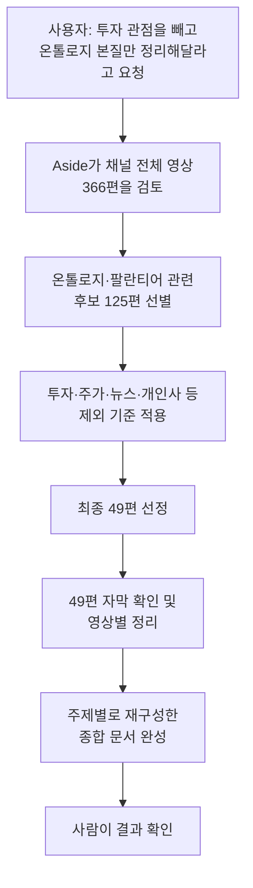
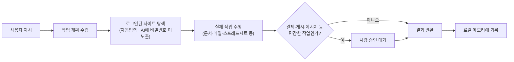

>
>https://www.threads.com/share/BAYAZrMOKt/
>
>Aside 개쩐다. 어케한거임?
>
>딥식이 물려놓고 빅데이터닥터 유튜브 채널 전체에서 투자관점 빼고 온톨로지에 대한 본질적인 부분들만 추려서 정리해달라고 하니까 49개 알아서 찾아다가 정리해줌 ㄷ; 
>
>Comet보다 훨 빠릿하고 일을 확실하게 끝내준다는 면에서 확실히 Agent workflow 중심으로 설계했다는 게 느껴짐.
>
>브라우저라기보다 브라우저 전문 Agent라는 느낌
>
>Orca로 이런거 하려면 브라우저에서의 온갖 엣지케이스 대응해야함. 
>
>Orca에게 브라우저는 여러 옵션 중 1 느낌이라, 
>
>단적으로 Orca 인 앱 브라우저로는 구글 로그인도 안됨ㅋㅋ;
>
>유튜브 추출 하려면 또 온갖 잡기술 드가야하는데 Aside에서 쓰는 방법론 역공학 하려다가 '아 그냥 Aside를 쓰고 말지' 싶어짐 Aside CLI나 MCP도 있음 (아직 안써봄)
>
>디자인 UI UX도 타협 전혀 안본 티가 나는데 한국인 4명이서 이런 브라우저 유지보수업데이트 하려면 진짜 개바쁘시겠다.. 제발 안망했으면 ㅋㅋ
>

## 이 문서에 대하여

이 문서는 Threads 이용자 5hyeons가 올린 게시물(2026년 8월 16일, "Aside 개쩐다. 어케한거임?")과 그에 달린 여러 댓글을 바탕으로, 등장하는 제품인 AI 브라우저 'Aside'가 무엇이고 스레드에서 오간 이야기가 무엇을 의미하는지를 웹 검색으로 확인한 정보와 함께 정리한 것이다. 원 게시물은 특정 유튜브 채널의 영상 366편 가운데 온톨로지(ontology)와 관련된 49편을 Aside가 스스로 찾아 정리해 준 경험을 공유하면서 시작되었고, 댓글에서는 Aside의 개발팀 구성, 경쟁 제품인 Comet·Orca와의 차이, 요금제, 윈도우 버전 출시 시점 등으로 이야기가 확장되었다.

## Aside란 무엇인가

Aside는 크로미움(Chromium)을 기반으로 새로 만든 AI 네이티브 브라우저로, 2026년 6월 23일 정식 공개되었다. Y Combinator 2025년 가을(F25) 배치 출신 스타트업인 Aside Computer가 만들었으며, 공식 소개 문구는 "겉보기엔 브라우저지만 사실은 가장 똑똑한 AI 비서(The most intelligent AI assistant, but it's a browser)"다. 회사 측 설명에 따르면 Aside는 별도 API 연동에 의존하지 않고, 사람이 쓰듯이 로그인된 웹사이트·계정을 그대로 이용해 이메일, 대시보드, 사내 도구, 문서, 스프레드시트 같은 실제 업무를 처리하는 것을 목표로 만들어졌다. 출시 당시 홍보 문구는 "오늘날의 AI 브라우저는 작업을 끝까지 완료하지 못하고 매번 '할 수 없다'고 말하며 멈춘다"는 문제의식을 전면에 내세웠다.

이전에도 웹사이트를 브라우징할 수 있는 AI 도구는 여럿 있었지만, 스레드의 반응들이 공통적으로 강조하는 점은 Aside가 '검색 보조'가 아니라 '작업을 끝까지 완료하는 에이전트'로 설계되었다는 인상이다. 실제로 공식 홈페이지에도 로그인, 커뮤니케이션 응대, 문서·스프레드시트 작업까지 전 과정을 대신 처리한다는 점이 핵심 가치로 제시되어 있다.

## 스레드에서 소개된 사용 사례: 온톨로지 49편 정리

게시물 작성자는 "빅데이터닥터"라는 유튜브 채널 전체 영상 가운데 투자 관점을 제외하고 온톨로지 개념의 본질만 담긴 영상을 추려 정리해 달라고 Aside에 요청했다. Aside는 이 요청을 받아 별도의 세부 지시 없이도 채널 영상 366편을 검토해 팔란티어·온톨로지 관련 후보 125편을 추리고, 그중에서 투자·주가·실적·뉴스·이벤트·개인사 관련 내용을 제외한 온톨로지 개념·철학·기술·활용 관련 영상 49편을 최종적으로 선별했다. 이후 이 49편의 자막(총 68만 자 분량으로 언급됨)을 읽어 영상별로 정리한 뒤, 온톨로지의 본질을 이해할 수 있도록 주제별로 재구성한 종합 문서를 만들어냈다. 결과물에는 온톨로지 개념의 철학적 기원(아리스토텔레스까지 거슬러 올라가는 정의)부터 1990년대 컴퓨터과학 도입 배경, 팔란티어가 이 개념을 기업 데이터에 어떻게 구현했는지에 이르는 내용이 목차 형태로 구성되어 있었다.

이 결과물 자체의 세부 서술이 사실관계상 얼마나 정확한지는 이 문서에서 별도로 검증하지 않았다는 점을 밝혀둔다. 이 문서가 확인한 것은 어디까지나 "Aside라는 제품이 실제로 그런 종류의 다단계 리서치·정리 작업을 스스로 계획하고 수행하는 형태의 브라우저 에이전트로 소개되고 있다"는 사실이며, 결과물 문서 내용의 학술적 정확성은 별개의 문제다.

작성자는 이 경험을 두고 "Comet보다 훨씬 빠릿하고 일을 확실하게 끝내준다"며 "브라우저라기보다 브라우저 전문 에이전트라는 느낌"이라고 평가했다. 여기서 비교 대상으로 언급된 Comet은 Perplexity가 2025년 7월 출시한 AI 브라우저로, 사이드바에 탑재된 AI 비서가 요약·자동화·일정 관리 등을 지원하는 제품이다. Comet은 Perplexity의 AI 검색 엔진을 기본 검색 엔진으로 사용하며 리서치 보조 성격이 강한 반면, Aside는 다단계 작업을 브라우저가 대신 끝까지 수행하는 데 더 무게를 둔 제품으로 소개되고 있다는 점에서 두 제품의 지향점에 차이가 있다.

## 왜 "브라우저 전문 에이전트"인가: 기술적 특징

Aside를 만든 팀이 직접 밝힌 설명에 따르면, Aside는 기존 브라우저에 확장 프로그램을 얹는 방식이 아니라 크로미움 자체를 포크(fork)해서 만들어졌다. 이 덕분에 일반적인 크롬 기능을 그대로 쓸 수 있는 것은 물론, 브라우저 자동화가 웹사이트에 의해 차단되거나 캡차(CAPTCHA)에 걸리는 문제를 우회할 수 있도록 설계했다고 한다. 또한 AI가 브라우징할 때는 화면 표시 영역(뷰포트) 크기를 렌더링 엔진 단계에서 고정시켜, 에이전트가 화면 구성이 흔들리는 문제 없이 안정적으로 작업을 이어갈 수 있게 만들었다고 설명한다. 이 제품을 만든 팀은 이전에 AI 회의록 작성 도구인 '캐럿(Carrot)'을 만든 적이 있으며, Aside는 그 경험을 바탕으로 5개월간 매일 12시간 이상 개발에 매달려 완성했다고 출시 게시물에서 밝혔다.

## Aside와 Orca는 다른 제품이다

스레드의 다른 댓글에서는 "Orca로 연결이 되느냐"는 질문과 함께 Orca와의 비교가 등장하는데, 여기서 혼동하기 쉬운 지점이 있다. Orca는 Y Combinator의 지원을 받은 오픈소스 프로젝트로, Claude Code·Codex·Cursor 같은 여러 코딩 에이전트를 한 화면에서 동시에 실행하고 관리하는 '에이전트 개발 환경(ADE, Agent Development Environment)'이다. Orca에도 크로미움 기반의 내장 브라우저가 포함되어 있지만, 이는 개발 중인 웹 애플리케이션의 화면을 확인하고 요소를 클릭해 코드 맥락을 에이전트에 전달하는 등 코딩 작업을 보조하기 위한 부가 기능에 가깝다. 즉 Orca에게 브라우저는 여러 도구 중 하나일 뿐, Aside처럼 웹사이트 로그인·구글 인증·실제 업무 사이트 탐색을 전문적으로 처리하도록 설계된 것은 아니다. 게시물 작성자가 "Orca 안의 앱 브라우저로는 구글 로그인도 안 된다"고 지적한 것도 이런 제품 성격의 차이에서 비롯된 것으로 볼 수 있다. 다만 게시물 작성자는 이후 별도 실험을 통해 Orca에서도 자신의 Threads 프로필의 최신 게시물을 읽어오는 읽기 전용 작업 자체는 가능했다고 공유했는데, 이는 Orca가 아예 웹 작업을 못 한다는 뜻이 아니라 Aside만큼 브라우징에 특화되어 있지는 않다는 맥락으로 이해하는 것이 정확하다.

두 제품의 성격을 표로 정리하면 다음과 같다.

| 구분 | Aside | Orca |
|---|---|---|
| 제품 성격 | 크로미움을 포크해 만든 AI 네이티브 브라우저 그 자체 | 여러 코딩 에이전트를 동시에 운영하는 오픈소스 개발 환경(ADE) |
| 핵심 기능 | 로그인 상태 유지, 로컬 메모리, 비밀번호 자동입력, 승인 게이트 | Git worktree 기반 병렬 작업, 터미널·브라우저·diff 통합 관리 |
| 브라우저의 위치 | 제품의 본체 | 코딩 작업 확인을 돕는 보조 기능 중 하나 |
| 공개 형태 | 상용 서비스(무료/유료 플랜) | MIT 라이선스 오픈소스(GitHub 공개) |
| 개발 주체 | Aside Computer (YC F25) | Stably AI 계열 팀(YC 지원) |

## 핵심 기능 상세

공식 홈페이지와 여러 소개 글을 종합하면 Aside의 기능은 크게 네 갈래로 나뉜다.

첫째는 로그인이 필요한 실제 업무 처리다. Aside는 이메일, 대시보드, 사내 도구에 로그인한 상태로 작업을 이어가며, 댓글·답장·후속 조치 같은 커뮤니케이션 업무와 로컬 파일의 문서·스프레드시트 작업까지 처리한다고 소개된다.

둘째는 로컬 메모리 기능이다. 방문 기록을 기기 안의 메모리로 전환해, 어떤 작업에 어떤 사이트를 써야 하는지 매번 다시 설명하지 않아도 되도록 만들었다고 한다. 이 메모리는 기기 로컬에만 저장되며 외부로 공유되지 않는다고 안내되어 있다.

셋째는 에이전트 전용 비밀번호 관리자다. 자격 증명은 웹사이트에 자동 입력되기만 할 뿐 AI 모델 자체에는 노출되지 않으며, 결제나 게시물 작성, 메시지 전송처럼 민감한 작업은 항상 사람의 최종 승인을 기다리도록 설계되어 있다. 모든 자격 증명 사용 이력은 기록되어 사용자가 나중에 확인할 수 있다.

넷째는 벤치마크 성적이다. 공식 홈페이지에는 Online-Mind2Web, BU-Bench-v1, Odyssey라는 세 가지 브라우저 에이전트 벤치마크 명칭이 제시되어 있고, 그 아래 에이전트별 성적으로 Aside 99.0%, Browser Use 97.7%, GPT-5.4 92.8%, Claude Opus 4.8 84.0%, ChatGPT Atlas 70.0%가 나열되어 있다. 다만 이 수치가 세 벤치마크의 평균값인지 특정 한 벤치마크의 결과인지는 페이지 본문에 명확히 구분되어 있지 않으며, 어디까지나 제조사가 자체적으로 공개한 결과라는 점은 감안할 필요가 있다.

이 밖에 데이터는 하드웨어 기반 종단간 암호화와 포스트 퀀텀 암호화로 보호되며, 파일시스템·네트워크 접근을 작업 단위로 제한하는 샌드박스 구조를 갖췄다고 설명되어 있다.

## 요금제

2026년 7월 말 기준으로 확인된 정보에 따르면 Aside는 세 단계 요금제를 운영한다. 무료 플랜은 월 500 크레딧과 최대 3개의 반복 작업(루틴)을 제공하며, Pro 플랜은 월 20달러, Max 플랜은 월 200달러다. 자체 모델을 쓰는 대신 사용자가 보유한 ChatGPT나 Claude 구독을 그대로 연결하거나, API 키를 등록해 다른 모델을 쓰는 것도 가능하다고 안내되어 있다. 다만 크레딧 한도나 플랜 구성은 서비스 초기 단계에서 자주 바뀔 수 있는 정보이므로, 정확한 최신 가격은 공식 요금제 페이지에서 확인하는 편이 안전하다.

## CLI, MCP, 그리고 코딩 도구와의 연결

댓글에서 언급된 것처럼 Aside는 브라우저 앱 형태 외에도 CLI(명령줄 도구)와 MCP(Model Context Protocol) 연동을 함께 제공하는 것으로 확인된다. 실제로 Aside 홈페이지 초기 화면에는 "Aside를 Codex에 연결하기: Aside의 강력한 브라우징 에이전트를 Codex에서 그대로 사용하세요"라는 안내 문구가 노출되어 있어, Codex 같은 코딩 에이전트 도구에서 Aside의 브라우징 능력을 도구처럼 호출해 쓸 수 있는 구조를 열어두고 있음을 알 수 있다. 다만 게시물 작성자 본인도 이 기능은 아직 직접 써보지 않았다고 밝혔으므로, 실제 사용성에 대한 평가는 유보적으로 볼 필요가 있다.

## 만든 사람들과 회사 정보

Y Combinator 공식 소개에 따르면 Aside는 2024년 Jun Kim, Chanhee Lee, Sanghun Lee 세 사람이 공동 창업했으며, 현재 샌프란시스코를 기반으로 5명의 직원이 함께 일하고 있다. 스레드에서는 "한국인 3명이 만든 AI 브라우저"라는 표현과 "한국인 4명이서 유지보수하려면 바쁘겠다"는 표현이 함께 등장하는데, 공식적으로 확인되는 숫자는 창업자 3인·전체 인원 5인이며, "4명"이라는 언급은 게시물 작성자 개인의 어림짐작으로 보인다. 이 팀은 Aside 이전에 AI 회의록 작성 도구 '캐럿'을 만든 경험이 있고, 이번 제품은 그 경험을 발전시켜 5개월 동안 집중적으로 개발한 결과물이라고 밝혔다.

스레드에는 스스로를 "어사이드팀 CTO 이상훈"이라고 소개하는 계정의 답글도 포함되어 있다. 이 이름은 Y Combinator가 공개한 공동창업자 명단의 'Sanghun Lee'와 일치하지만, 해당 계정이 실제로 본인인지, 그리고 정확한 직함이 CTO인지는 이 문서에서 별도로 공식 확인하지 않았다는 점을 밝혀둔다. YC 소개 페이지에는 세 창업자의 이름만 나열되어 있을 뿐 각자의 역할까지는 명시되어 있지 않다.

## EO 다큐멘터리 소개

댓글 중에는 유튜브 채널 EO가 만든 '아메리칸드림 2.0' 시리즈에서 Aside 편을 다뤘다는 소개도 있다. 해당 영상의 제목은 "오픈AI보다 똑똑한 AI브라우저 만든 20대 천재 한국인의 미친 집념"이며, 샌프란시스코 해커하우스에 모인 20대 한국인 창업가들이 실리콘밸리에서 제품을 만들어가는 과정을 다루는 다큐멘터리 형식의 영상이다. 제목의 "오픈AI보다 똑똑하다"는 표현은 언론 보도의 사실 확인을 거친 문구라기보다, 앞서 설명한 자체 벤치마크 결과를 근거로 한 홍보성 제목이라는 점을 감안하고 볼 필요가 있다.

## 윈도우 버전 출시 계획

댓글에서 여러 사용자가 macOS 전용인 Aside의 윈도우 버전을 언제 쓸 수 있느냐고 물었고, 이에 대해 앞서 언급한 CTO 자칭 계정이 "윈도우는 제가 한창 만들고 있고, 빠르면 8월 말 중에 출시 가능할 것으로 보인다"고 답했다. 이는 회사의 공식 로드맵 발표가 아니라 소셜미디어 댓글에서 나온 개인적인 답변이므로, 실제 출시 시점은 이보다 늦어지거나 앞당겨질 수 있다는 점을 감안해야 한다. 정확한 지원 플랫폼 현황은 Aside 공식 다운로드 페이지에서 수시로 확인하는 것이 가장 정확하다.

## 커뮤니티 반응 요약

원 게시물은 게시 후 18시간 만에 좋아요 173개, 댓글 33개, 리포스트 29회, 공유 51회를 기록했으며, 이후 이어진 답글들에서도 "레전드이긴", "aside는 진짜 개쩝니다"처럼 대체로 긍정적인 반응이 이어졌다. 동시에 "한국인 4명이서 유지보수하려면 바쁘겠다", "제발 안 망했으면"과 같이 소규모 팀이 빠르게 성장하는 제품을 지속적으로 유지·개선할 수 있을지에 대한 우려 섞인 댓글도 함께 눈에 띈다. 디자인과 UI·UX 완성도에 대해서는 "타협을 전혀 안 본 티가 난다"는 호평이 나왔고, 온톨로지 정리 사례에 대해서는 "49개를 한 번에 찾았다는 것보다, 투자 관점을 빼고도 본질만 남길 수 있었다는 점이 더 궁금하다"는 기술적인 질문도 이어졌다. 이에 대해 게시물 작성자는 여러 영상에 흩어진 개념을 에이전트가 스스로 같은 기준으로 추려낸 것이라고 답했다.

## 작업 흐름 요약

원 게시물에서 설명된 작업 방식을 도식으로 정리하면 다음과 같다.

Aside가 브라우저 안에서 로그인부터 작업 완료, 민감 행동 승인까지 처리하는 전체 구조는 다음과 같이 요약할 수 있다.

## 사실관계 확인 표

| 구분 | 내용 |
|---|---|
| 확인된 사실 | Aside는 2026년 6월 23일 공개된 크로미움 기반 AI 브라우저이며, Y Combinator F25 배치 소속이다. 창업자는 Jun Kim, Chanhee Lee, Sanghun Lee 3인이며 현재 직원 5명 규모다. 이전 제품은 AI 회의록 도구 '캐럿'이다. 무료 플랜(월 500크레딧, 루틴 3개)과 Pro($20/월)·Max($200/월) 유료 플랜이 존재하며, ChatGPT·Claude 구독 연결 및 API 키 등록을 지원한다. Orca는 Aside와 별개로, 여러 코딩 에이전트를 동시 운영하는 오픈소스 개발 환경(ADE)이며 브라우저는 부가 기능이다. |
| 뉘앙스가 필요한 주장 | "오픈AI·앤트로픽보다 똑똑하다"는 표현과 벤치마크 1위 주장은 모두 Aside가 자체 공개한 결과이며 제3자 검증 기관의 결과가 아니다. 벤치마크 표에 제시된 수치가 세 벤치마크의 평균인지 개별 결과인지는 공식 페이지에도 명확히 설명돼 있지 않다. "한국인 4명" 등 인원수 표현은 게시물 작성자의 짐작이며 공식 확인된 숫자(창업자 3인, 직원 5인)와 다를 수 있다. |
| 확인 불가능·추측 영역 | 답글 작성자가 실제로 Aside팀 CTO 이상훈 본인인지, 그리고 정확한 직함이 무엇인지는 이 문서에서 독립적으로 확인하지 못했다. 윈도우 버전의 "8월 말 출시"는 비공식 개인 답변으로, 확정된 일정이 아니다. Aside가 생성한 온톨로지 정리 문서 자체의 내용이 얼마나 정확한지는 별도로 검증되지 않았다. |

## 참고자료

- Threads, 5hyeons 외 게시물 및 답글 스레드 (2026년 8월 16일)
- Aside 공식 홈페이지, https://aside.com/
- Y Combinator, Aside 회사 소개 페이지
- Threads, yeon.gyu.kim, Aside 출시 소개 게시물 (2026년 6월 24일)
- X(트위터), 요즘IT 계정, Aside 소개 게시물 (2026년 6월 25일)
- 유튜브, EO, "오픈AI보다 똑똑한 AI브라우저 만든 20대 천재 한국인의 미친 집념 | 아메리칸 드림 2.0"
- Tabbit, "Aside 브라우저란? 기능·가격과 Tabbit 비교" (2026년 7월 31일 기준 정보)
- 이랜서 블로그·테크버킷 블로그·openapps.pro, Orca(ADE) 소개 자료
- Perplexity, Comet 브라우저 공식 소개 페이지 및 관련 리뷰 자료

---

작성일자: 2026년 8월 17일
