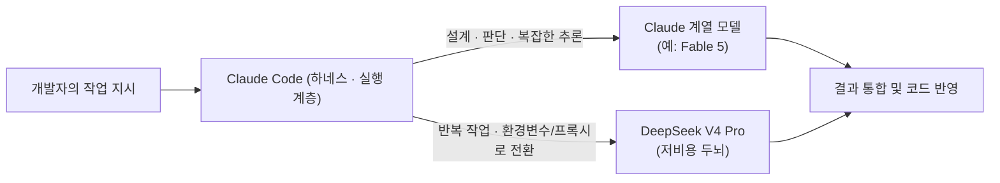
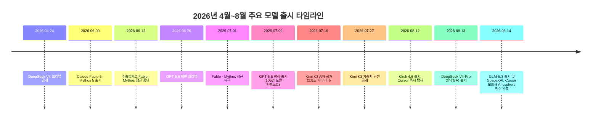

- **대상 게시물**: 스레드(Threads) 계정 `unclejobs.ai`가 올린 게시물과 그에 달린 댓글창, 그리고 함께 첨부된 API 사용 내역 화면
- **작성 기준일**: 2026년 8월 18일
- **작성 방식**: 게시물 원문을 원자료로 삼되, 그 안에 등장하는 모델명·수치·주장은 전부 별도로 웹 검색을 통해 재확인한 뒤 작성했습니다.

```
요즘 DeepSeek V4 Pro로 작업합니다.
GLM 5.3이랑 Kimi K3도 번갈아 씁니다.

이전이랑 차원이 달라요.
중국 모델이 상향 평준화됐습니다.

GPT 5.6은 컨텍스트 1M을 들고 나오고
Grok 4.6은 커서에 올라탔습니다.

그래도 저는 클로드 코드를 씁니다.
페이블이 비싸긴 한데 여전히 똑똑하고
한번 맞춰놓으면 안 바꾸게 돼요.

어떻게 이렇게 잘 쓰냐구요?
저는 뭐든 잘 쓰거든요.
잘 시켜서 그래요.

제 방식대로 만들어서 쓰고
다른 도구도 붙여 씁니다.

누구나 잘 시킬 수 있습니다.
시키는 기술, AI시대 생존전략이죠.
한번 매수하면 계속 업데이트 됩니다.

https://www.threads.com/@unclejobs.ai/post/DcINP8ojGd9

```

---

## 1. 이 문서에서 다루는 것

여러분이 캡처해 주신 자료는 두 부분으로 나뉩니다.

첫째, API 사용 내역을 보여주는 콘솔 화면입니다. 지난 30일 기준 총비용 4.89달러, API 요청 837건, 토큰 사용량 2억 9,377만 8,528개가 표시되어 있고, 하단 그래프를 보면 8월 16~17일 이틀 사이에 비용이 급격히 튀어 오른 것을 확인할 수 있습니다.

둘째, 스레드 댓글창입니다. `unclejobs.ai`라는 계정이 올린 게시물에 여러 사람이 댓글을 달았고, 그 중 "3억 토큰 5달러ㅋㅋㅋㅋㅋ"라는 댓글에 게시물 작성자 본인이 "딥시기(딥시크) 하네스가 아주 맛도리 ㅋㅋ"라고 답하며, 위 사용 내역 화면이 DeepSeek 기반 작업 결과임을 스스로 밝히고 있습니다. 또 다른 댓글에서는 "딥시크는 클로드가 메인이면 어떤 용도로 쓰냐"는 질문에 "반복 작업은 딥시크로 돌립니다. 설계하고 판단하는 건 클로드 몫이에요"라고 답했습니다.

그리고 게시물 본문에는 DeepSeek V4 Pro, GLM 5.3, Kimi K3, GPT 5.6, Grok 4.6, 클로드 코드(Claude Code)와 Fable이라는 모델·도구 이름이 나열되어 있고, 마지막에는 "시키는 기술"이라는 표현과 함께 `latpeed.com`으로 연결되는 판매 링크가 붙어 있습니다.

이 문서는 이 게시물이 다루는 6개 모델·도구의 실제 사실관계를 하나하나 확인하고, 사용 내역 화면의 숫자가 기술적으로 어떻게 나올 수 있는지를 설명하며, 마지막으로 게시물의 성격(정보 공유 글인지, 상품 판매를 위한 마케팅 글인지)까지 정리합니다.

---

## 2. 게시물 본문 요약

작성자는 원문에서 대략 이런 흐름으로 이야기합니다.

요즘은 DeepSeek V4 Pro로 작업하고, GLM 5.3과 Kimi K3도 번갈아 쓴다고 밝힙니다. 예전과는 "차원이 다르다"면서 중국 모델들이 전반적으로 상향 평준화됐다고 평가합니다. 이어서 GPT 5.6이 100만 토큰급 컨텍스트를 들고 나왔고, Grok 4.6이 커서(Cursor)에 올라탔다는 최근 업계 동향을 짚습니다. 그럼에도 본인은 여전히 클로드 코드(Claude Code)를 쓰고 있다고 말하며, Fable이 비싸긴 하지만 똑똑하고 한 번 세팅해 두면 잘 안 바꾸게 된다고 덧붙입니다.

그다음부터는 어조가 바뀌어, "어떻게 이렇게 잘 쓰냐"는 질문에 스스로 답하는 형식으로 "저는 뭐든 잘 시켜서 그렇다"며 "제 방식대로 만들어서 쓰고 다른 도구도 붙여 쓴다"고 말합니다. "누구나 잘 시킬 수 있다", "시키는 기술이 AI 시대 생존전략"이라는 문구와 함께 "한번 매수하면 계속 업데이트된다"는 안내를 달고, `latpeed.com/products/JWpYg`라는 판매 페이지 링크로 마무리됩니다.

즉 앞부분(모델 트렌드 요약)은 정보성 콘텐츠이고, 뒷부분은 유료 디지털 상품(프롬프트·워크플로 노하우류로 추정되는 자료)으로 연결되는 판매 유도 문구라는 두 겹 구조로 되어 있습니다. 이 구조 자체는 지식창업 마케팅에서 흔히 쓰이는 "정보로 신뢰를 쌓고 상품으로 전환한다"는 전형적인 퍼널(funnel) 방식입니다.

---

## 3. 사용 내역 화면 숫자 다시 읽기


화면에 나온 숫자를 그대로 정리하면 다음과 같습니다.

| 항목 | 값 |
|---|---|
| 충전 잔액(Topped-up balance) | 15.10달러 |
| 총비용(Total cost) | 4.89달러 |
| 조회 기간 | 최근 30일 (7/19 ~ 8/17) |
| API 요청 수 | 837건 |
| 총 토큰 수 | 293,778,528개 (약 2억 9,378만) |
| 그래프상 비용 급증 시점 | 8월 16~17일 |

토큰당 평균 단가를 계산해 보면 4.89달러 ÷ 293.78(백만 토큰) ≈ **토큰 100만 개당 약 1.66센트**라는, 상용 프론티어 모델로는 나오기 매우 어려운 초저가 수치가 나옵니다. 참고로 같은 시기 Claude Fable 5의 정가는 입력 100만 토큰당 10달러, 출력 100만 토큰당 50달러이고, 가장 저렴한 축인 Claude Haiku 4.5도 입력 1달러·출력 5달러 수준입니다. 즉 이 화면의 단가는 Claude API 자체 요금표로는 설명이 되지 않습니다.

반면 댓글에서 작성자 본인이 "딥시크 하네스"라고 명시했고, 실제로 DeepSeek는 2026년 8월 13일 정식 출시(GA)된 V4-Pro 모델의 캐시 히트(반복 컨텍스트 재사용) 입력 단가를 100만 토큰당 0.3625센트 수준으로 책정해 두고 있습니다. 코딩 에이전트 작업은 시스템 프롬프트·저장소 코드 등 동일한 컨텍스트를 매 턴 반복해서 읽는 구조라 캐시 히트 비율이 매우 높아지는 경향이 있고, 이 경우 블렌디드(평균) 단가가 100만 토큰당 1~2센트대까지 떨어지는 것이 기술적으로 충분히 가능합니다. 그래프에서 비용이 급증한 시점이 DeepSeek V4-Pro가 정식 출시된 8월 13일 직후인 8월 16~17일과 겹치는 것도 이 해석과 앞뒤가 맞습니다.

다만 한 가지는 분명히 구분해서 말씀드려야 합니다. 첨부된 사용 내역 화면의 디자인(충전 잔액·Top up 버튼·비용/요청/토큰 3분할 카드·Export 버튼 배치)은 Anthropic 자체 콘솔(Claude 개발자 플랫폼)의 화면 구성과 매우 흡사합니다. 그런데 Anthropic 공식 콘솔은 DeepSeek 요청을 청구하지 않습니다. 그래서 가능한 설명은 두 가지입니다.

첫째, DeepSeek가 공식 문서에서 안내하는 방식대로 클로드 코드(하네스)는 그대로 두고 `ANTHROPIC_BASE_URL` 등 환경변수만 DeepSeek의 API 엔드포인트로 바꾸는 방법입니다. DeepSeek 공식 문서는 이렇게 연결했을 때 `claude-opus`로 시작하는 모델명은 `deepseek-v4-pro`로, `claude-sonnet`·`claude-haiku`로 시작하는 모델명은 `deepseek-v4-flash`로 자동 매핑된다고 명시하고 있습니다. 이 경우 실제 비용 집계는 DeepSeek 자체 콘솔(또는 그와 비슷하게 만들어진 서드파티 라우터 대시보드)에서 이뤄지는데, 일부 중계 서비스들은 Claude Code 이용자에게 익숙하도록 Anthropic 콘솔과 유사한 화면 레이아웃을 그대로 채택하는 경우가 흔합니다.

둘째, `claude-code-router`(CCR)처럼 여러 백엔드(OpenRouter, DeepSeek, Moonshot, Z.AI 등)를 자유롭게 전환할 수 있게 해주는 로컬 프록시 도구를 썼을 가능성입니다. 이런 도구들은 요청을 가로채 원하는 제공사로 라우팅하면서 토큰 사용량과 비용을 실시간으로 집계해 주는 자체 대시보드를 제공합니다.

두 경우 모두 "클로드 코드라는 하네스(작업 실행 틀)는 그대로 쓰고, 그 안에서 실제로 추론을 담당하는 모델(두뇌)만 저렴한 DeepSeek로 바꿔치기한다"는 점에서 원리는 동일합니다. 다만 이 화면 하나만으로 정확히 어느 서비스인지까지는 특정할 수 없으며, 이는 작성자 본인의 댓글 진술에 근거한 해석이라는 점을 밝혀둡니다.



이 구조는 여러분이 이전에 정리하셨던 "하네스 계층은 모델에 흡수되지만, 도구 실행·인프라 계층은 여전히 중요하다"는 원칙과 정확히 맞닿아 있는 실사례입니다. Claude Code라는 하네스는 그대로 유지한 채, 그 아래에서 돌아가는 모델만 작업 성격에 따라 교체하는 방식이기 때문입니다.

---

## 4. 게시물에 등장한 6개 모델·도구 전수 검증

아래는 게시물이 언급한 순서대로, 각 모델의 실제 출시 시점과 스펙을 확인한 결과입니다. 모두 2026년 8월 18일 기준 최신 검색으로 재확인했습니다.

### 4-1. DeepSeek V4 Pro

DeepSeek V4 Pro는 2026년 4월 24일 프리뷰로 처음 공개되었고, 이후 4개월 가까운 다듬기를 거쳐 2026년 8월 13일 앱·웹·API 전체에 정식 출시(GA, 빌드명 V4-Pro-0813)되었습니다. 1.6조 개 총 파라미터에 토큰당 약 490억 개만 활성화되는 MoE(전문가 혼합) 구조이며, 100만 토큰 컨텍스트와 최대 38.4만 토큰 출력을 지원합니다. 이번 GA는 특히 에이전트 능력(도구 사용, 코드 실행, 다단계 작업 수행)에 초점을 맞췄다고 회사 측이 밝혔고, Terminal-Bench 2.1에서 87.9점을 기록했습니다. 가격은 정식 출시 시점 기준 입력 100만 토큰당 0.435달러, 출력 100만 토큰당 0.87달러이며 캐시 히트 입력은 0.3625센트까지 낮아집니다. 다만 이 요금은 2026년 8월 16일 16시(UTC)부터 피크·오프피크 이원 요금제로 개편되어 인상되었습니다. 가중치는 MIT 라이선스로 공개되어 자체 서버에 직접 올려 쓰는 것도 가능합니다.

### 4-2. GLM-5.3 (Zhipu / Z.ai)

베이징 소재 Zhipu AI(Z.ai)는 2026년 8월 14일 GLM-5.3을 공개했습니다. 흥미로운 점은 이번 버전이 완전히 새로운 베이스 모델이 아니라 GLM-5.2와 동일한 약 7,430억~7,440억 파라미터 MoE 베이스를 그대로 두고, 후속 학습(post-training)만으로 성능을 끌어올렸다는 것입니다. 회사 측은 GLM-5.2 대비 50% 성능 향상을 주장하며 "현존 최강의 오픈웨이트 코딩 모델"이라 자평했고, 특히 사이버 보안 관련 벤치마크(CyberGym)에서 84.5%를 기록해 Anthropic Mythos 5(83.8%)와 OpenAI GPT-5.6 Sol(83.6%)을 근소하게 앞섰다고 발표했습니다. 다만 이 수치는 아직 독립적인 제3자 검증을 거치지 않은 Zhipu 자체 발표치입니다. 특기할 점은, 학습 과정에서 모델의 사이버 보안(취약점 탐지) 능력이 회사가 원래 의도한 수준을 넘어서 다단계 익스플로잇 체인까지 스스로 구성할 수 있는 수준으로 발전한 것이 확인되어, GLM 시리즈 사상 처음으로 안전성 검토를 이유로 가중치(오픈웨이트) 공개가 약 2주간 지연되었다는 점입니다. 현재는 GLM Coding Plan과 자체 코딩 도구 ZCode를 통해서만 이용할 수 있고, API·오픈웨이트 공개는 단계적으로 진행 중입니다.

### 4-3. Kimi K3 (Moonshot AI)

Moonshot AI는 2026년 7월 16일 Kimi K3를 API로 공개했고, 7월 27일에는 가중치까지 완전히 오픈소스로 풀었습니다. 총 2.8조 개 파라미터로, 이는 당시 가장 컸던 오픈웨이트 모델인 DeepSeek V4 Pro(1.6조)보다도 약 75% 더 큰 규모이며, 회사는 이를 "세계 최초의 오픈 3T급 모델"이라 표현했습니다. Kimi Delta Attention(KDA)과 Attention Residuals 같은 구조적 개선을 통해 긴 시퀀스 처리 효율을 높였고, 100만 토큰 컨텍스트와 최대 약 97만 토큰 출력을 지원합니다. Moonshot 측은 K3를 Claude Fable 5, GPT-5.6 Sol과 직접 비교하며 일부 코딩·에이전트 벤치마크에서 Claude Opus 4.8과 GPT-5.5를 앞섰다고 발표했으나, 종합 성능에서는 여전히 Fable 5와 GPT-5.6 Sol에 못 미친다고 스스로 인정했습니다. API 가격은 입력 100만 토큰당 2.60달러, 출력 100만 토큰당 13달러 수준입니다.

### 4-4. GPT-5.6 Sol (OpenAI)

GPT-5.6은 2026년 6월 26일 소규모 파트너 대상 제한 프리뷰로 먼저 공개된 뒤 2026년 7월 9일 정식 출시되었습니다. Luna·Terra·Sol 세 등급으로 나뉘며, 게시물이 언급한 "100만 토큰 컨텍스트"는 최상위 등급인 Sol을 가리키는 것으로 보이고, 실제 Sol의 컨텍스트 창은 105만 토큰으로 확인되어 게시물의 서술과 정확히 일치합니다. 최대 출력은 12.8만 토큰이며, 지식 컷오프는 2026년 2월 16일입니다. 가격은 표준 구간(입력 27.2만 토큰 이하)에서 입력 100만 토큰당 5달러, 출력 100만 토큰당 30달러이고, 이보다 긴 프롬프트를 넣으면 전체 요청에 대해 입력은 2배, 출력은 1.5배로 할증됩니다. Artificial Analysis 코딩 에이전트 지수 최고 추론 설정 기준으로 80점을 기록해 당시 공개된 지표 중 상위권에 올랐습니다.

### 4-5. Grok 4.6과 Cursor 탑재 (xAI → SpaceXAI)

게시물의 "Grok 4.6은 커서에 올라탔습니다"라는 문장은 사실 그대로입니다. Grok 4.6은 2026년 8월 12일 xAI(이 시점에는 이미 스페이스X 산하로 편입되어 'SpaceXAI'로 불림)에 의해 공식 출시되었고, 출시 첫날부터 코드 편집기 Cursor와 자체 코딩 도구 Grok Build에 곧바로 탑재되어 사용할 수 있게 되었습니다. 1.5조 파라미터 규모이며 컨텍스트 창은 5만~50만 토큰 구간(짧은 프롬프트는 20만 토큰 이하 구간 요금, 이를 넘으면 요금이 2배로 뛰는 구조)입니다. 가격은 표준 기준 입력 100만 토큰당 2달러, 출력 100만 토큰당 6달러입니다. 흥미롭게도 이 게시물이 작성된 시점과 거의 동시인 2026년 8월 14일, SpaceXAI는 Cursor의 모회사인 Anysphere를 600억 달러 규모의 전액 주식 거래로 인수하는 절차를 완료했다고 발표했습니다. 즉 "Grok이 Cursor에 올라탔다"는 표현은 단순한 모델 통합 수준을 넘어, 실제로 Cursor 회사 자체가 xAI(SpaceXAI) 산하로 편입되는 지분 인수와 맞물려 있던 사건이었던 것으로 확인됩니다. 이는 게시물 작성자가 알았는지와 무관하게, 배경 사실로서 알아두면 유용한 맥락입니다.

### 4-6. Claude Fable 5 (Anthropic)

Claude Fable 5는 Anthropic의 최상위 등급인 Mythos 계열 모델로, 2026년 6월 9일 Claude Mythos 5와 함께 출시되었습니다. 다만 출시 직후인 6월 12일 미국 상무부의 수출통제 조치로 전 세계 접근이 중단되었다가, 해당 통제가 6월 30일 해제되면서 7월 1일 Anthropic이 접근을 복구한 이력이 있습니다. 게시물의 "페이블이 비싸긴 한데"라는 표현은 실제 요금표와 정확히 부합합니다. Fable 5의 API 가격은 입력 100만 토큰당 10달러, 출력 100만 토큰당 50달러로, 이는 같은 시기 Claude Opus 5(입력 5달러·출력 25달러)의 정확히 2배에 해당하는 프리미엄 가격입니다. 다만 여러 벤치마크 비교 자료에 따르면 단순 토큰당 가격이 아니라 "작업 하나를 끝내는 데 드는 총비용" 기준으로 보면 Fable 5가 오히려 더 저렴하게 끝나는 경우도 있고, 반대로 10배 이상 비싸게 끝나는 경우도 있어 작업 종류에 따라 편차가 크다는 점이 함께 보고되고 있습니다.

---

## 5. 모델 한눈에 비교하기

| 모델 | 개발사 | 공개/정식출시일 | 규모 | 컨텍스트 | API 가격(입력/출력, 100만 토큰당) | 비고 |
|---|---|---|---|---|---|---|
| DeepSeek V4 Pro | DeepSeek | 프리뷰 4/24, GA 8/13 | 1.6조(활성 490억) | 100만 | $0.435 / $0.87 (8/16부터 인상) | MIT 오픈웨이트, 캐시 히트 시 초저가 |
| GLM-5.3 | Zhipu(Z.ai) | 8/14 | 약 7,430억(GLM-5.2와 동일 베이스) | - | 코딩 플랜 구독제 | 오픈웨이트는 안전성 검토로 지연 공개 |
| Kimi K3 | Moonshot AI | API 7/16, 가중치 7/27 | 2.8조 | 100만 | $2.60 / $13 | 오픈웨이트 모델 중 최대 규모 |
| GPT-5.6 Sol | OpenAI | 프리뷰 6/26, GA 7/9 | 비공개 | 105만 | $5 / $30 (27.2만 토큰 이상은 할증) | Luna·Terra·Sol 3단계 중 최상위 |
| Grok 4.6 | xAI(SpaceXAI) | 8/12 | 1.5조 | 20만(초과 시 50만까지, 요금 2배) | $2 / $6 | 출시 즉시 Cursor 탑재 |
| Claude Fable 5 | Anthropic | 6/9(6/12~7/1 접근 중단) | 비공개 | 100만 | $10 / $50 | Mythos 등급, Opus 5의 정확히 2배 가격 |

이 표에서 확인할 수 있듯, 2026년 4월부터 8월 사이에만 6개 랩(연구소)이 사실상 릴레이로 신모델을 쏟아냈습니다. 특히 8월 둘째 주(8/12~8/14) 사흘 사이에 Grok 4.6, DeepSeek V4-Pro GA, GLM-5.3이 연달아 발표된 것은 이례적으로 밀집된 출시 주간이었습니다.



---

## 6. `latpeed.com`은 어떤 곳인가

게시물 끝에 붙은 링크가 향하는 `latpeed.com`(래피드)은 실제로 존재하는 한국의 지식 상품 판매 플랫폼입니다. 사업자 등록 없이도 PDF 전자책, 온라인 강의, 컨설팅, 오프라인 네트워킹 이벤트 티켓 등 무형의 콘텐츠를 카드 결제로 손쉽게 판매할 수 있도록 결제·정산·간단한 상세페이지 제작 기능을 묶어 제공하는 서비스로, 1인 창업가·프리랜서·크리에이터를 주 이용자층으로 삼고 있습니다. 신규 판매자는 초기 월 판매 한도가 10만 원으로 제한되며, 이를 넘기려면 판매자 인증과 별도 심사를 거쳐야 하는 구조입니다.

이런 맥락을 고려하면, 게시물 후반부의 "누구나 잘 시킬 수 있습니다", "시키는 기술, AI 시대 생존전략이죠", "한번 매수하면 계속 업데이트됩니다" 같은 문구는 실제 판매 페이지로 트래픽을 유도하기 위한 전형적인 지식창업형 마케팅 카피에 해당합니다. 앞부분의 모델 트렌드 요약이 신뢰도를 쌓는 역할을 하고, 뒷부분이 실제 상품(구체적으로 어떤 내용인지는 판매 페이지 안에서만 확인 가능하며, 이 문서에서는 확인하지 않았습니다) 구매로 연결되는 두 단계 구조라는 점은 분명해 보입니다.

---

## 7. 종합 정리 — 이 게시물에서 실제로 배울 수 있는 것

사실관계만 놓고 보면, 게시물이 언급한 6개 모델·회사 이름과 그 특징(DeepSeek V4 Pro의 저비용, GLM-5.3·Kimi K3의 급성장, GPT-5.6의 100만 토큰 컨텍스트, Grok 4.6의 Cursor 탑재, Fable의 높은 가격)은 모두 실제로 확인되는 사실이며 과장이나 오류가 없습니다. 2026년 여름 들어 중국계 오픈웨이트 모델들이 코딩·에이전트 벤치마크에서 서구 프론티어 모델과의 격차를 빠르게 좁힌 것도, 그리고 그 배경에는 막대한 후속 학습(post-training) 투자와 극단적인 캐시 최적화형 가격 정책이 있다는 것도 검색 결과로 뒷받침됩니다.

기술적으로 더 의미 있는 부분은, 이 게시물이 (의도했든 아니든) "하네스와 두뇌를 분리해서 쓴다"는 실전 패턴을 보여주고 있다는 점입니다. Claude Code라는 도구 실행 틀은 그대로 유지하면서, 설계·판단처럼 정확도가 중요한 작업은 여전히 비싼 Claude 계열 모델에 맡기고, 반복적이고 정형화된 작업은 환경변수나 프록시로 저렴한 DeepSeek로 빼내는 방식입니다. DeepSeek가 공식적으로 Claude Code 연동 가이드를 문서화해 두고 있을 만큼 이 조합은 이미 업계에서 하나의 정석적인 절약 패턴으로 자리 잡았습니다. 다만 이는 "하네스는 흡수되지 않고 오히려 여러 두뇌를 조율하는 역할로 더 중요해진다"는 방향을 보여주는 사례이지, "저가 모델이 고가 모델을 대체한다"는 단순한 결론으로 이어지지는 않습니다. 실제로 작성자 본인도 설계·판단은 여전히 Claude의 몫이라고 명확히 구분하고 있습니다.

반면 게시물 후반부의 판매 유도 문구와 그 안에 담긴 "누구나 잘 시킬 수 있다"는 자기계발적 수사는 검증 대상이 되는 사실 주장이 아니라 마케팅 카피이므로, 이 부분은 정보의 신뢰도와 별개로 판단하시는 것이 좋겠습니다.

---

## 8. 단계별 팩트체크 표

| 구분 | 내용 |
|---|---|
| **1차 출처로 확인됨** (공식 발표·공식 문서 기준) | DeepSeek V4 Pro GA 8/13, GLM-5.3 출시 8/14, Kimi K3 API 7/16·가중치 7/27, GPT-5.6 Sol GA 7/9(105만 토큰 컨텍스트), Grok 4.6 출시 8/12 및 Cursor 즉시 탑재, Claude Fable 5 가격($10/$50, Opus 5의 2배), DeepSeek 공식 문서의 Claude Code 연동(모델명 자동 매핑) 안내, latpeed.com이 실존하는 한국 지식상품 판매 플랫폼이라는 사실 |
| **복수 매체 교차 확인됨** | DeepSeek V4 Pro의 캐시 히트 초저가 요금 구조, GLM-5.3이 GLM-5.2와 동일 베이스에 후속 학습만으로 성능을 올렸다는 점, Kimi K3가 2.8조 파라미터로 당시 최대 오픈웨이트 모델이라는 점, SpaceXAI(xAI)의 Cursor 모회사 Anysphere 인수(600억 달러) 완료 |
| **단일 출처·작성자 본인 진술** | 첨부된 사용 내역 화면이 정확히 "DeepSeek 하네스" 결과라는 점(작성자 본인 댓글에 근거), "GLM 5.3·Kimi K3를 번갈아 쓴다"는 개인 사용 습관, "한 번 맞춰놓으면 안 바꾸게 된다"는 개인적 평가 |
| **분석적 해석(직접 확인되지 않음)** | 사용 내역 화면 UI가 Anthropic 콘솔과 유사한 이유(공식 DeepSeek-Claude Code 연동 또는 서드파티 라우터 대시보드일 가능성 — 정확한 서비스명은 특정 불가), 293,778,528 토큰·4.89달러라는 수치가 나온 정확한 워크로드 구성(캐시 히트 비율 등은 추정) |

---

## 9. 용어 설명

- **하네스(harness)**: AI 모델이 실제로 파일을 읽고 쓰고, 터미널 명령을 실행하고, 도구를 호출하도록 감싸는 실행 프레임워크. Claude Code, Cursor, Codex 등이 대표적입니다.
- **캐시 히트(cache hit)**: 이전에 이미 처리한 것과 동일한 입력(시스템 프롬프트, 반복되는 코드베이스 컨텍스트 등)을 다시 보낼 때, 처음부터 다시 계산하지 않고 저장된 결과를 재사용해 비용을 크게 낮추는 기법입니다.
- **MoE(Mixture of Experts, 전문가 혼합)**: 모델 전체 파라미터 중 입력마다 일부(전문가)만 선택적으로 활성화하는 구조로, 총 파라미터 수는 크지만 실제 연산량(활성 파라미터)은 훨씬 작게 유지할 수 있습니다.
- **GA(General Availability, 정식 출시)**: 제한된 프리뷰·베타 단계를 지나 누구나 제약 없이 사용할 수 있게 되는 공식 출시 단계를 말합니다.
- **오픈웨이트(open-weight)**: 모델의 학습된 파라미터(가중치) 파일 자체를 공개해, 사용자가 자신의 서버에 직접 올려 돌릴 수 있게 하는 방식입니다.

---

## 10. 참고 자료

- DeepSeek V4 정식 출시 안내, DeepSeek API 공식 문서 (api-docs.deepseek.com/news/news260813)
- DeepSeek Claude Code 연동 가이드, DeepSeek API 공식 문서 (api-docs.deepseek.com/quick_start/agent_integrations/claude_code)
- "DeepSeek officially launches V4-Pro AI model", Quartz, 2026-08-13
- "DeepSeek V4 Guide", CodersEra, 2026-08-13 갱신
- "Zhipu releases GLM-5.3 through its coding service", MLQ News, 2026-08-14
- "Zhipu launches flagship model GLM-5.3", South China Morning Post, 2026-08-14
- "Zhipu AI releases GLM-5.3, claims it's the strongest open-weights coding model", The Decoder, 2026-08-14
- "GLM-5.3: Post-Training Produced Exploit Chains Z.ai Never Planned", Tech Times, 2026-08-14
- "What Is Moonshot AI's Kimi K3 Model", Bloomberg, 2026-07-27
- "China's Moonshot AI unveils Kimi K3", CNBC, 2026-07-17
- Kimi K3 공식 API 문서 (platform.kimi.ai/docs/guide/kimi-k3-quickstart)
- Kimi K3 모델 카드, OpenRouter (openrouter.ai/moonshotai/kimi-k3)
- "GPT-5.6: Frontier intelligence that scales with your ambition", OpenAI 공식 발표, 2026-07-09
- GPT-5.6 Sol 모델 카드, OpenAI API 공식 문서 및 Amazon Bedrock 문서
- "Introducing Grok 4.6", Cursor 공식 블로그, 2026-08-12
- "Grok 4.6 | Cursor Docs", Cursor 공식 문서
- "SpaceXAI closes $60B Cursor deal", TBreak, 2026-08-14
- "Introducing Grok 4.6", SpaceXAI(xAI) 공식 발표 (x.ai/news/grok-4-6)
- Claude Fable 5 요금 및 접근 중단·복구 이력, ClaudeFast 블로그 (claudefa.st) 및 BenchLM.ai 2026년 8월 Claude API 요금표
- Claude Fable 5 모델 카드, OpenRouter (openrouter.ai/anthropic/claude-fable-5)
- "Claude Code의 두뇌만 DeepSeek으로 바꾸면 비용이 17분의 1이 된다?", 박재홍의 실리콘밸리, 2026-05-04
- claude-code-router(CCR) 공식 저장소, GitHub (github.com/musistudio/claude-code-router)
- 래피드(latpeed.com) 공식 사이트 및 스레드 계정(@latpeed)
- "래피드(Latpeed) 실전 가이드", Agentic30 Blog, 2026-04-05

---

*본 문서는 게시물 원문과 댓글, 첨부된 사용 내역 화면을 원자료로 삼아 2026년 8월 18일 기준 검색으로 재검증한 뒤 작성되었습니다. 위 "단일 출처" 및 "분석적 해석" 항목으로 표시된 부분은 작성자 본인의 진술 또는 정황적 추론에 근거한 것으로, 별도의 독립적 확인은 이루어지지 않았다는 점을 다시 한번 밝힙니다.*
