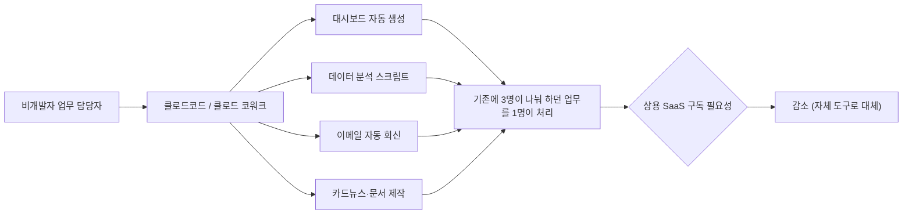
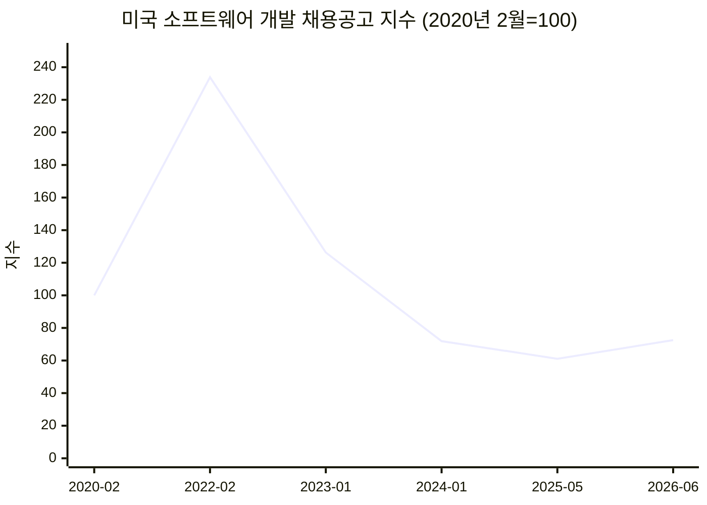
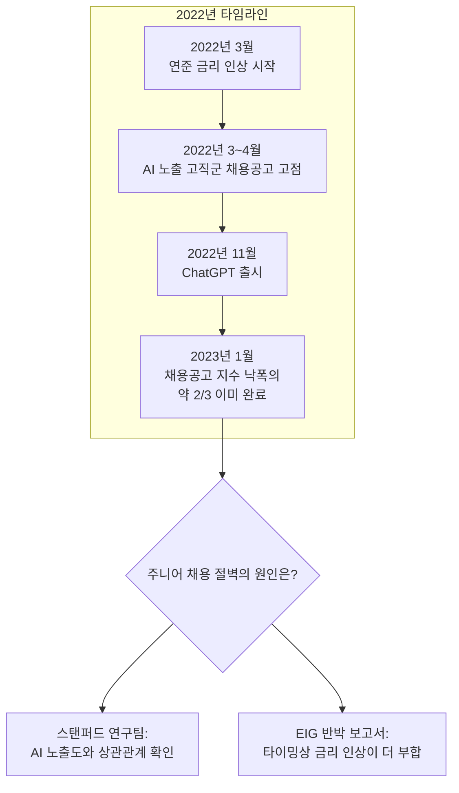
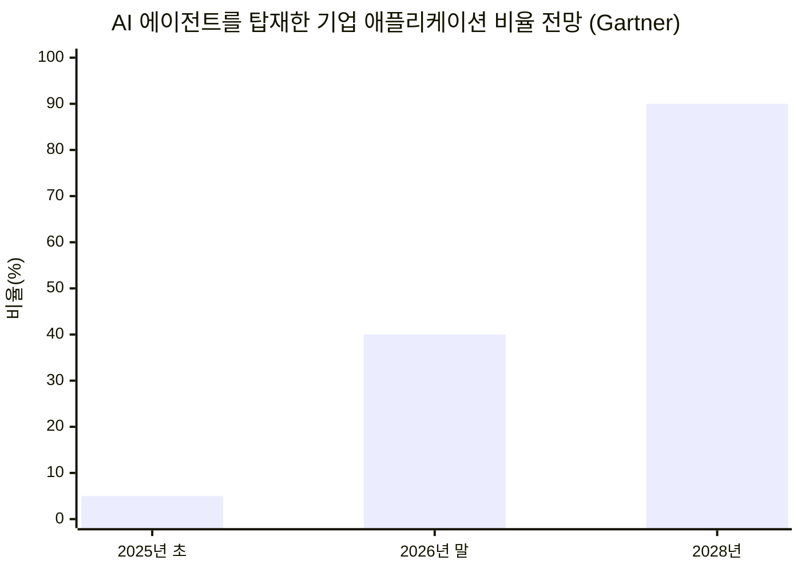

---

## 목차

1. 들어가며 — 두 개의 게시물, 하나의 질문
2. 첫 번째 게시물 요약 — 비개발자가 클로드코드로 회사 하나를 돌린다는 이야기
3. 두 번째 게시물 요약 — 채용 담당자가 목격한 "디자이너 다음은 개발자"라는 순환론
4. 검증 1 — 비개발자가 SaaS 없이 업무 전체를 AI 에이전트로 돌리는 사례는 실재하는가
5. 검증 2 — 개발자 채용시장은 실제로 "전멸" 상태인가: 숫자로 보는 2026년
6. 검증 3 — 주니어 채용 절벽의 원인은 AI인가, 금리인가: 아직 끝나지 않은 논쟁
7. 검증 4 — "15년 전 디자이너 붐 이후 도태"는 검증 가능한 사실인가
8. 검증 5 — "2년 안에 모든 기업이 이렇게 된다"는 예측은 어느 정도 근거가 있는가
9. 균형을 잡아주는 반론들 — 제번스의 역설과 수요 대폭발론
10. 종합 정리 — 두 게시물이 옳게 짚은 것과, 그렇지 않은 것
11. 참고 자료

---

## 1. 들어가며 — 두 개의 게시물, 하나의 질문

공유해주신 두 건의 Threads 게시물은 서로 다른 사람이 쓴, 서로 다른 이야기입니다. 하나는 유튜브에서 본 어느 비개발자가 회사의 거의 모든 업무를 클로드코드로 자동화해놓은 모습을 보고 느낀 충격을, 다른 하나는 15년간 IT 채용 실무를 지켜본 사람이 "디자이너 다음은 개발자 차례"라는 산업 순환의 패턴을 이야기하고 있습니다. 둘을 묶는 공통된 주장은 결국 하나입니다. **AI가 특정 직군의 노동력을 구조적으로 줄이고 있으며, 그 속도가 조직이 대응할 수 있는 속도보다 빠르다**는 것입니다.

이 문서는 이 주장을 곧이곧대로 받아들이지도, 무작정 반박하지도 않습니다. 대신 각 주장을 쪼개어 실제로 확인 가능한 통계, 시장조사기관의 전망치, 학계 논문, 그리고 검증되지 않은 개인의 체감을 구분해서 정리했습니다. 결론부터 말씀드리면, 두 게시물의 방향성은 상당 부분 데이터와 일치합니다. 다만 속도와 범위에 대한 부분, 특히 "2년 안에 모든 기업"이라는 표현은 실제 시장조사기관들의 전망보다 확실히 앞서 나간 주장입니다.

## 2. 첫 번째 게시물 요약 — 비개발자가 클로드코드로 회사 하나를 돌린다는 이야기

```
https://www.threads.com/share/BAXM488RVe/

진짜 세상이 어떻게될지모르겠다

개발자취업은 전멸상태고,

유튜브보는데 비개발자가 자기업무 모든곳에 클로드코드를 접목시켜서 
모든업무가 클로드코드의 도움을 받고 돌아가게끔 세팅을 했다

근데 saas를 전혀 쓰지않고 필요한건 다 자기가 만들어서 쓰고있었다
(대시보드, 데이터분석, 디자인, 이메일자동화, 등등)

복잡한기술이 들어가는건 아니지만 1명이 3명몫을 하고있는거같았다

근데 무서운건 이런 사람들이 한둘이 아니고 이제 시작이고
ai는 점점 더 발전할것이고

앞으로 2년안에 모든기업들이 이렇게 된다는거
```


작성자는 유튜브 영상을 보다가 목격한 사례를 전합니다. 어느 비개발자가 자신의 업무 전 영역 — 대시보드, 데이터 분석, 디자인, 이메일 자동화 등 — 을 클로드코드와 연결해서 돌아가도록 세팅해두었는데, 흥미로운 지점은 그 사람이 상용 SaaS 서비스를 거의 쓰지 않고 필요한 도구를 전부 직접 만들어 쓰고 있었다는 것입니다. 기술적으로 화려한 것은 아니었지만, 결과적으로 한 사람이 세 사람 몫의 업무를 처리하는 것처럼 보였다고 합니다. 작성자가 강조하는 부분은 이런 사례가 이미 한둘이 아니라는 것, 그리고 AI 성능이 계속 발전하는 추세를 감안하면 앞으로 2년 안에 모든 기업이 이런 식으로 운영될 것이라는 전망입니다.

## 3. 두 번째 게시물 요약 — 채용 담당자가 목격한 "디자이너 다음은 개발자"라는 순환론

```
https://www.threads.com/share/_roql_mro/

IT관련 채용업무를 담당했었습니다.
15년 전 디자이너 붐일 때
개발자 확충해야한다고했습니다.
자바개발자, 특히 스크립트

그 뒤로 1년 후 
진짜 상황이 바뀌어서 대기업 프로젝트도
디자이너는 정말 실력있는 일부를 제외하고
도태되거나 연봉을 대폭 삭감하고 취업하거나 했었습니다.
심지어 지금은 중소기업에서도
채용을 거의 안합니다. 

디자이너 15명씩 투입되던 프로젝트들도
나중에는 디자이너 4명도 많다고했으니까요. 그 돈으로 퍼블리셔 붙여달라고. . .

이제는 개발자가 그 차례입니다. . .
안타깝지만 시장은 계속 순환하고있고,
상승과 동떨어지거나 대체가 가능한 직종은
케파가 급격하게 줄어듭니다.

그렇다고 개발자가 망하진않습니다.
단, 철저하게 실력과 경력위주로
도태와 생존이 결정됩니다.
생존한 사람은 오히려 고수익자가됩니다.
```


두 번째 작성자는 자신을 과거 IT 관련 채용 실무자로 소개합니다. 15년 전, 디자이너 수요가 폭발하던 시기에 업계는 자바 개발자와 스크립트 개발자 확충을 외쳤는데, 그로부터 불과 1년 뒤 상황이 뒤집혀서 대기업 프로젝트에서조차 실력 있는 극소수를 제외한 디자이너들이 도태되거나 연봉이 크게 깎인 채로 재취업했다는 것입니다. 한때 15명씩 투입되던 디자이너 자리가 나중에는 4명도 많다는 말이 나오고, 그 예산으로 차라리 퍼블리셔(마크업 작업자)를 붙여달라는 요구로 바뀌었다는 개인적 경험담을 전합니다. 작성자는 이제 그 차례가 개발자에게 왔다고 진단하면서도, 개발자 직군 자체가 망하는 것은 아니고 실력과 경력을 기준으로 도태와 생존이 갈리며, 살아남은 사람은 오히려 고수익자가 될 것이라는 전망으로 글을 맺습니다.

## 4. 검증 1 — 비개발자가 SaaS 없이 업무 전체를 AI 에이전트로 돌리는 사례는 실재하는가

이 부분은 검색으로 비교적 명확하게 확인됩니다. 실제로 2026년 들어 비개발자가 클로드코드나 그 상위 버전 격인 클로드 코워크(Claude Cowork)를 이용해 엑셀, 보고서, 프레젠테이션, 이메일, 카드뉴스 제작, 콘텐츠 분석 등 업무 전반을 자동화하는 사례를 다루는 국내 콘텐츠가 다수 존재합니다. 한 사례에서는 앤트로픽 자체 성장마케팅팀을 포함해 여러 기업이 코딩 지식 없이도 웹훅과 콘텐츠 자동화를 구축했고, 연간 5,200시간이 들던 반복적 엑셀 작업을 대폭 단축했다는 내용이 소개되고 있습니다[13]. 클로드 코워크는 기존 채팅형 AI가 "답만 주고 실행은 사람이 하는" 방식이었던 것과 달리, 사용자의 컴퓨터 폴더에 직접 접근해 문서·캘린더·이메일을 스스로 정리하는 방식으로 설계되어 있으며, 국내 매체는 이를 "개발자만 쓸 수 있던 자동화가 모든 직장인에게 열리는" 전환점으로 설명합니다[7].

주목할 부분은 이 변화가 단순히 국내 콘텐츠 마케팅용 과장이 아니라는 점입니다. 클로드 코워크 출시 당시 CNN과 Fortune 등 해외 주요 매체는 이를 두고 AI가 기존 SaaS 비즈니스 모델을 위협하는 신호로 보도했으며, 동시에 "SaaS의 죽음은 시기상조"라는 반론도 함께 존재한다고 국내 매체는 전하고 있습니다[7]. 즉 "비개발자 한 명이 여러 사람 몫의 SaaS 없는 업무 자동화를 구축했다"는 게시물의 관찰 자체는 과장이 아니라 이미 상당히 보편화되고 있는 현상이며, 이를 정규 커리큘럼으로 가르치는 비개발자 대상 강의도 다수 개설되어 있는 상황입니다[8].



다만 이 현상을 "모든 비개발자가 이미 이렇게 일하고 있다"로 일반화하기는 이릅니다. 검색된 사례들은 얼리어답터, AX(AI Transformation) 담당자, 콘텐츠 크리에이터 등 상대적으로 AI 친화적인 직군에 집중되어 있고, 일반 사무직 전반의 보편적 현상이라는 통계적 근거까지는 확인되지 않았습니다. 즉 게시물이 묘사한 "무서운 신호"는 실재하지만, 그것이 "이미 다수"인지 "아직 소수의 선도 사례"인지는 별개의 질문이며, 후자에 더 가깝다고 보는 것이 현재로서는 더 정확합니다.

## 5. 검증 2 — 개발자 채용시장은 실제로 "전멸" 상태인가: 숫자로 보는 2026년

이 부분이 이번 문서에서 가장 풍부한 1차 통계로 확인되는 지점입니다. 국내 언론 보도에 따르면 2026년 2월 기준 '전문, 과학 및 기술 서비스업'과 '정보통신업' 취업자 수는 전년 동월 대비 각각 10만 5천 명, 4만 2천 명 감소했고, 채용 플랫폼 캐치 집계로는 2026년 3월 상반기 공채 시즌 기준 IT·통신 산업 대기업·중견기업의 신입 채용 공고 수가 전년 동월 대비 73% 급감했습니다[4]. 네이버의 한 개발자는 언론 인터뷰에서 AI로 코딩 생산성이 높아지면서 예전보다 적은 인원으로 개발이 가능해졌고, 신규 채용이 줄어드는 흐름을 체감하고 있다고 밝혔습니다[4].

미국 쪽 통계는 더 정밀하게 확인됩니다. 개발자 채용시장을 데이터 기반으로 정리한 한 분석글은 미국 노동통계국(BLS)의 공식 원자료, FRED의 Indeed 소프트웨어 개발 채용공고 지수(시리즈명 IHLIDXUSTPSOFTDEVE), 그리고 해고 추적 사이트 layoffs.fyi의 원자료를 직접 대조했습니다[5]. 이 지수는 2020년 2월을 100으로 놓았을 때 2022년 2월 233.87까지 치솟았다가, 2025년 5월 61.09까지 떨어진 뒤 2026년 6월 기준 72.51을 기록하고 있습니다. 이는 팬데믹 이전 대비로는 27.5% 낮은 수준이지만, 고점 대비로는 약 69% 감소한 수치입니다[5]. 해고 규모로 보면 2026년은 1월 5일부터 7월 13일까지 233개 기업에서 120,936명이 해고되어, 2025년 한 해 전체(278개 기업, 122,606명)에 거의 육박하는 속도로 진행되고 있습니다[5].



그런데 같은 시장에 대해 정반대 방향을 가리키는 공식 전망도 존재합니다. BLS의 직업전망서(2024~2034년 기준)는 소프트웨어 개발자 고용이 향후 10년간 15% 성장하며, 이는 전체 직종 평균보다 훨씬 빠른 속도라고 예측합니다. 순증 인원은 약 28만 7,900명, 연평균 신규 공석은 약 12만 9,200개로 추산됩니다[9][5]. 이 모순처럼 보이는 두 통계는 사실 서로 다른 시간축을 이야기하고 있습니다. **단기적으로는 시장이 위축되어 있지만, 장기적으로는 성장이 예정되어 있다**는 뜻입니다. 지금 구직 활동 중인 사람이 체감하는 것은 전자, 즉 단기 위축입니다.

한 가지 더 중요한 지점은, 채용 위축이 모든 개발 직군에 균등하게 일어나지 않는다는 것입니다. 같은 분석에 따르면 2025년 5월부터 2026년 5월 사이 소프트웨어 개발 채용공고 증가분의 71%가 시니어 직군에서 나왔고, 증가분의 37%는 공고 제목에 아예 "AI"가 들어가 있었습니다[5]. 반면 정보보안 분석가(+28.5%)와 데이터 사이언티스트(+33.5%)의 향후 10년 전망 성장률은 일반 소프트웨어 개발자(+15.8%)를 크게 웃돕니다[5]. 즉 시장이 "개발자를 덜 원하는" 것이 아니라, "검증 없이 맡길 수 없는 깊이 있는 일을 하는 개발자"를 원하는 방향으로 재편되고 있다는 해석이 설득력을 얻습니다.

## 6. 검증 3 — 주니어 채용 절벽의 원인은 AI인가, 금리인가: 아직 끝나지 않은 논쟁

첫 번째 게시물이 말한 "개발자 취업 전멸"이라는 표현이 특히 정확히 들어맞는 대상은 신입, 그중에서도 22~25세 주니어 개발자입니다. 이 부분의 원인을 두고는 두 개의 상반된 연구가 정면으로 부딪히고 있습니다.

스탠퍼드 대학 연구진(Brynjolfsson, Chandar, Chen)은 2025년 11월 발표한 논문에서 미국 급여처리업체 ADP의 원자료(월 350만~500만 명 규모, 2021년 1월~2025년 9월)를 분석해, AI 노출도가 가장 높은 직군에서 22~25세 고용이 기업 단위 충격을 통제한 이후에도 상대적으로 16% 감소했다고 보고했습니다. 특히 22~25세 소프트웨어 개발자만 놓고 보면 2022년 말 고점 대비 약 20% 감소한 것으로 나타났습니다[5].

반면 미국의 경제혁신그룹(EIG)이 2026년 1월 발표한 반박 보고서는 16%라는 수치 자체는 받아들이면서도 그 해석에는 동의하지 않습니다. AI 노출도가 높은 부문의 채용공고가 실제로는 챗GPT 등장(2022년 11월)보다 6개월 앞선 2022년 3~4월에 이미 고점을 찍었다는 점, 그 시점이 미국 연준의 금리 인상 시작 시점과 정확히 겹친다는 점, AI 노출 상위 5분위 노동자의 38%가 애초에 금리에 민감한 정보·금융·전문서비스 업종에 속해 있어 상관관계가 자연스럽게 발생할 수밖에 없는 구조라는 점을 근거로 제시합니다. 또한 2025년 3분기 기준 AI를 실제 프로덕션 환경에 도입한 미국 대기업은 12%에 불과해, 그렇게 짧은 기간에 대규모 인력 대체가 일어났다고 보기는 무리라는 지적도 덧붙입니다[5].



결론적으로 "주니어 채용시장이 무너졌다"는 사실 자체는 양측 모두 동의하는 합의된 사실이지만, "그 원인이 AI인가"는 2026년 8월 현재까지도 학계에서 결론이 나지 않은 진행형 논쟁입니다. 이 지점에서 첫 번째 게시물의 "개발자 취업은 전멸 상태"라는 표현은 체감 수준에서는 데이터와 부합하지만, 그 원인을 AI 하나로 단정하는 것은 아직 학술적으로 입증되지 않은 주장이라는 점을 짚어둘 필요가 있습니다.

## 7. 검증 4 — "15년 전 디자이너 붐 이후 도태"는 검증 가능한 사실인가

이 부분은 솔직하게 말씀드려야 할 지점입니다. 두 번째 게시물의 핵심 서사, 즉 "15년 전 자바 개발자 확충 붐이 일었던 시기에 디자이너 수요가 폭발했고, 1년 뒤 대기업 프로젝트에서 디자이너 인원이 15명에서 4명으로 줄고 그 예산으로 퍼블리셔를 요구하게 되었다"는 서술은 작성자 개인이 채용 실무 현장에서 겪은 경험담이며, 이를 뒷받침하는 별도의 통계나 업계 리포트는 검색을 통해 확인되지 않았습니다. 웹디자이너·UI/UX 디자이너의 최근 연봉 수준(2025년 기준 신입 2,600만~3,800만 원대, 대기업은 4,000만 원대부터 시작)이나 채용 동향에 대한 자료는 다수 존재하지만[14][15], 이는 현재 시점의 스냅샷일 뿐 "15년 전 대비 얼마나 축소되었는가"를 시계열로 증명해주는 공신력 있는 통계는 아닙니다.

따라서 이 부분은 사실 여부를 판정할 수 있는 성격의 내용이 아니라, 채용 실무를 오래 담당한 한 사람의 관찰과 기억으로 받아들이는 것이 정확합니다. 개인의 경험담이 틀렸다는 뜻은 아닙니다. 다만 "검증된 사실"과 "한 사람의 축적된 경험적 직관"은 서로 다른 층위이며, 이 문서는 둘을 섞지 않고 후자로 명확히 분류해 전달드립니다. 다만 구조적으로 보면 이 서사는 뒤에서 다룰 "AI 에이전트가 저숙련·반복 업무를 먼저 대체하고, 고숙련 인력의 몸값은 오히려 올라간다"는 패턴과 방향성 자체는 일치합니다.

## 8. 검증 5 — "2년 안에 모든 기업이 이렇게 된다"는 예측은 어느 정도 근거가 있는가

이 예측은 시장조사기관들의 실제 전망치와 비교했을 때 방향은 맞지만 속도와 표현의 절대성에서는 다소 앞서 나가 있습니다. 가트너는 2026년 말까지 전체 기업 애플리케이션의 40%가 특정 업무에 특화된 AI 에이전트를 통합할 것으로 전망했는데, 2025년 초 기준으로는 이 비율이 5% 미만이었다는 점에서 1년 만에 약 8배 증가하는 셈입니다. 더 나아가 2028년에는 90%의 기업 애플리케이션이 AI 에이전트를 통합할 것으로 전망됩니다[10]. 딜로이트는 2027년까지 생성형 AI를 사용하는 기업의 50%가 AI 에이전트를 배포할 것으로 예측했습니다[12]. 다만 같은 가트너는 2025년 6월 별도 보고서에서 불분명한 사업 가치와 비용 문제로 2027년 말까지 에이전트 프로젝트의 40% 이상이 중단될 것이라는 상반된 경고도 함께 내놓았습니다[11].

국내 상황을 보면 산업통상자원부가 의뢰한 2025년 조사에서 국내 기업 685곳 중 37.1%가 AI를 실제 업무에 활용 중이었고, 대기업만 놓고 보면 도입률이 65.1%에 달했습니다[11]. 마이크로소프트의 2025년 Work Trend Index 조사에서는 한국 리더의 77%가 향후 12~18개월 내 AI 기반 디지털 노동력으로 직원 역량을 확대하겠다고 응답했습니다[13].



이 수치들을 종합하면, "AI 에이전트가 빠른 속도로 확산되고 있고 그 속도가 가속화되고 있다"는 큰 그림은 정확합니다. 하지만 "2년 안에 모든 기업"이라는 표현은 두 가지 지점에서 시장조사기관의 전망보다 앞서갑니다. 첫째, 가트너의 90% 전망조차 2028년(현재로부터 약 2년 후가 아니라 그보다 조금 더 뒤) 시점의 "애플리케이션 통합률"이지 "모든 업무가 완전히 AI로 재편된 상태"를 의미하지 않습니다. 둘째, 같은 가트너가 에이전트 프로젝트의 40% 이상이 성과를 내지 못하고 중단될 것이라고 경고한 만큼, 도입과 성공적 정착은 별개의 문제입니다[11]. 따라서 게시물의 방향성은 데이터와 일치하지만, "2년 안에 모든 기업"이라는 절대적 표현은 다소 과장된 예측으로 보는 것이 현재 확인 가능한 전망치에 더 부합합니다.

## 9. 균형을 잡아주는 반론들 — 제번스의 역설과 수요 대폭발론

두 게시물 모두 AI가 일자리를 줄이는 방향으로만 서술하고 있지만, 이에 대한 반론도 함께 존재한다는 점을 균형있게 전달드립니다. 한 국내 기술 커뮤니티 글은 AI 도입으로 인한 생산성 향상이 단순 코딩 업무를 대체하면서 주니어 개발자 채용공고가 급감하는 "직무 양극화" 현상이 뚜렷해지고 있다는 점은 인정하면서도, 기술 발전이 비용을 낮추면 오히려 수요가 폭발적으로 늘어난다는 이른바 "제번스의 역설"에 따라 전체 소프트웨어 시장의 파이 자체는 더 커질 것이라는 낙관론도 함께 소개하고 있습니다[6]. 앞서 소개한 Indeed Hiring Lab의 2026년 7월 8일 자 분석 제목 자체도 "AI와 채용공고: 파괴에서 창조로?"라는 물음표를 달고 있어, AI가 일자리를 없애기만 하는지 새로운 형태로 재창조하는지에 대해 업계 내부에서도 결론을 유보하고 있음을 보여줍니다[5].

또한 실제 산업 현장 사례를 보면 AI 에이전트 도입이 반드시 인력 감축으로만 이어지지는 않는다는 보고도 있습니다. 한 제조업 사례에서는 에이전틱 AI 도입 이후 공정 다운타임이 40% 줄고 불량률이 15% 개선되었으며, 설문에 응한 직원의 79%가 AI 에이전트 도입이 개인 업무 성과를 향상시켰다고 답했습니다[11]. 이는 AI가 특정 인력을 밀어내는 도구가 아니라, 기존 인력의 생산성을 끌어올리는 도구로 작동하는 사례도 상당수 존재함을 시사합니다.

## 10. 종합 정리 — 두 게시물이 옳게 짚은 것과, 그렇지 않은 것

두 게시물을 검증한 결과를 정리하면 다음과 같습니다.

**데이터로 확인되는 부분**
- 비개발자가 클로드코드·클로드 코워크를 이용해 SaaS 없이 업무 전반을 자동화하는 사례는 실재하며, 이를 가르치는 교육 콘텐츠까지 시장에 형성되어 있습니다.
- 개발자, 특히 신입·주니어 채용시장이 단기적으로 크게 위축된 것은 미국·한국 양쪽에서 공식 통계로 확인됩니다.
- AI 에이전트의 기업 도입 속도는 가트너, 딜로이트 등 주요 조사기관 기준으로도 매우 가파르게 증가하고 있습니다.
- "저숙련·반복 업무는 대체되고, 실력을 갖춘 고숙련 인력의 몸값은 오히려 오른다"는 패턴은 시니어 개발자 채용공고 증가, 보안·데이터 직군의 높은 성장 전망 등 여러 지표에서 일관되게 관찰됩니다.

**아직 입증되지 않았거나, 과장된 부분**
- "주니어 채용 절벽의 원인이 AI"라는 단정은 스탠퍼드 연구와 EIG의 반박이 팽팽히 맞서는, 현재진행형 논쟁입니다.
- "15년 전 디자이너 붐 이후 도태"라는 서사는 개인의 채용 실무 경험담이며, 이를 뒷받침하는 공신력 있는 시계열 통계는 확인되지 않았습니다.
- "2년 안에 모든 기업이 이렇게 된다"는 표현은 주요 조사기관의 전망(2028년 기준 90% 애플리케이션 통합, 그마저도 프로젝트의 40% 이상은 중단 위험)보다 시점과 확실성 면에서 앞서 나간 주장입니다.

결국 두 게시물이 전하는 위기감의 방향 자체는 현재 확인 가능한 데이터와 상당 부분 일치합니다. 다만 그 위기감을 "모든 것이 정해진 미래"로 받아들이기보다는, 시니어·전문성·검증 가능한 성과라는 축으로 살아남는 사람과 조직이 갈리는 재편의 과정으로 이해하는 편이, 지금까지 확인된 근거에 더 가깝습니다.

## 11. 참고 자료

[1] 코드잇 블로그 — 2025 개발자 채용 시장 전망 (2025.11.05), https://sprint.codeit.kr/blog/developer-hiring-market-trends-ai-data

[2] CIO — "AI 시대, 프로그래머 역할이 바뀐다" 신입 개발자 수요는 급감 중 (2025.09.25), https://www.cio.com/article/4062887/

[3] 코드트리 블로그 — 2025년 개발자 채용 트렌드와 2026년 전망 (2025.11.09), https://www.codetree.ai/blog/2025%EB%85%84-%EA%B0%9C%EB%B0%9C%EC%9E%90-%EC%B1%84%EC%9A%A9-%ED%8A%B8%EB%A0%8C%EB%93%9C%EC%99%80-2026%EB%85%84-%EC%A0%84%EB%A7%9D-ai-%EC%8B%9C%EB%8C%80-%EC%B7%A8%EC%97%85-%EC%A4%80%EB%B9%84/

[4] 경향신문 — "해고 쉬워지면 개발자 다 잘릴걸요"…AI 시대 강해지는 안정 선호 (2026.05.05), https://www.khan.co.kr/article/202605051446001/

[5] Chaos and Order (Youngju Kim) — 2026년 개발자 채용 시장, 데이터가 말하는 것과 말하지 않는 것 (2026.07.12), https://www.youngju.dev/blog/2026-07-12-dev-job-market-2026

[6] 4P by nextvine (news.hada.io 게시) — AI 시대 개발자 수요 관련 경제학적 교차검증, https://news.hada.io/topic?id=27780

[7] 에이아이그라운드 — 클로드 코워크(Claude Cowork) 완전 가이드 (약 4주 전), https://www.aiground.co.kr/claude-cowork-beginners-guide/

[8] 패스트캠퍼스 — 일잘러를 위한 클로드 코드 입문 바이블, https://fastcampus.co.kr/biz_online_claudecodebible

[9] IEEE-USA InSight, BLS 2024–34 전망 인용 (2026.03.03) — youngju.dev 인용을 통해 확인

[10] SK AX — 2026 에이전트 AI 트렌드 (Gartner, Omdia 인용, 2026.01.16), https://www.skax.co.kr/insight/trend/3624

[11] MIT Technology Review Korea — 국내 기업의 AI 에이전트 도입과 레슨 (2026.07.01), https://www.technologyreview.kr/ai-%EC%97%90%EC%9D%B4%EC%A0%84%ED%8A%B8-%EB%8F%84%EC%9E%85%EC%97%90%EC%84%9C-%EC%96%BB%EC%9D%80-%EB%9C%BB%EB%B0%96%EC%9D%98-%EA%B5%90%ED%9B%88/

[12] Open Network System — 2026년 AI 에이전트의 진화: LLMOps에서 AgentOps로 (2026.03.12), https://blog.open-network.co.kr/ai-agent-evolution

[13] 이젠아카데미 — AI 에이전트 서비스란 무엇인가? 2026년 트렌드와 전망 (2026.06.22), https://blog.ezenac.co.kr/

[14] 프라임 커리어 — 신입 디자이너의 급여 수준과 업계별 연봉 차이, https://prime-career.com/article/7528

[15] Pixso — 2023년 UI/UX 디자이너 연봉 공개, https://pixso.net/kr/news/ui-ux-designer-salary/

---

*본 문서는 사용자가 공유한 Threads 게시물 두 건의 내용을 출발점으로 삼아, 2026년 8월 기준으로 검색 가능한 공개 자료를 교차 검증하여 작성되었습니다. 각주로 표시되지 않은 문장은 두 게시물 작성자의 개인적 진술이거나 일반적으로 통용되는 서술이며, 통계 수치는 원 출처의 발표 시점 기준임을 밝혀둡니다.*
