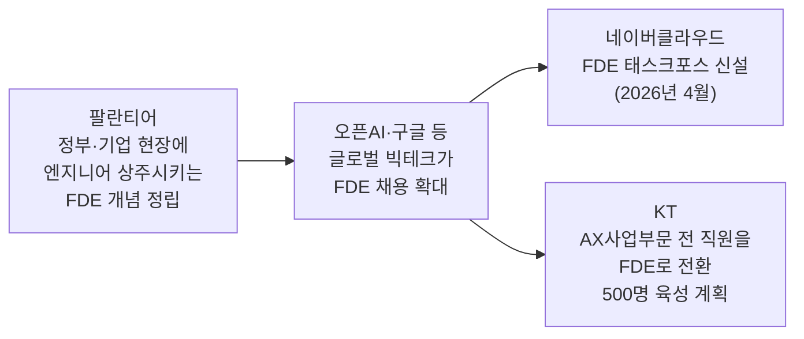
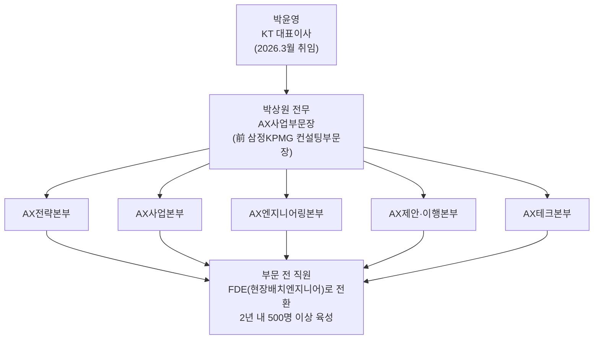
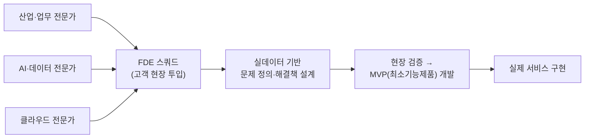
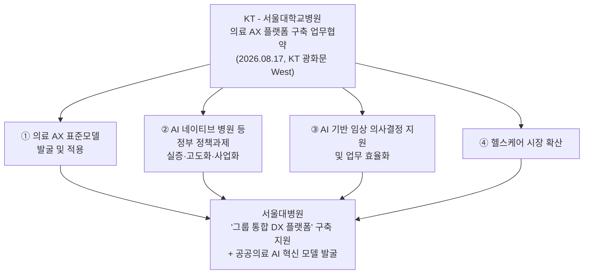

> 원문: 의약일보, 고진아 기자, [「KT, 대학병원 AX 난제 푼다…FDE 500명 육성」](https://www.medicaldaily.co.kr/post/22136), 2026.08.17
> 이 해설 문서는 원문 기사와 함께 아시아경제, 서울경제, 이투데이, 뉴스핌, 헤럴드경제, 뉴스웨이, 전자신문, 비즈니스포스트, 이투데이, 디일렉, 블로터 등 복수 언론사의 관련 보도를 교차 확인하여 작성했습니다. 마지막 부분에 문장별 사실확인 등급과 전체 출처 목록을 정리해 두었으니, 특정 문장의 근거가 궁금하면 그쪽을 참고하시면 됩니다.

---

## 이 글을 한 문장으로 요약하면

KT가 2026년 7월 6일 새 대표이사 박윤영 취임 100일 기자간담회에서 밝힌 "AX 플랫폼 컴퍼니" 비전의 실행 조치로, AX사업부문 소속 직원 전원을 '현장배치엔지니어(FDE)'로 전환하고 앞으로 2년 안에 500명 이상의 FDE를 길러내기로 했습니다. 이 인력들은 특히 환자 데이터를 외부로 반출하기 어려워 그동안 인공지능 도입이 더뎠던 대학병원 같은 의료 현장에 직접 투입되며, 그 첫 실증 사례로 KT는 2026년 8월 17일 서울대학교병원과 의료 AX 플랫폼을 공동으로 구축하는 업무협약을 체결했습니다.

---

## 1. 무슨 일이 있었는가 — 기사 핵심 내용 정리

KT는 인공지능 전환(AX, AI Transformation) 사업의 실행력을 끌어올리기 위해 AX사업부문 전 직원을 '현장배치엔지니어', 영어 약자로 FDE(Field/Forward Deployed Engineer)로 전환하는 방침을 공개했습니다. 목표는 앞으로 2년 안에 500명 이상의 FDE를 확보하는 것입니다. 이 결정은 박윤영 KT 대표이사가 직접 주도하는 핵심 전략으로 알려졌으며, 배경에는 AI 기술 자체의 수준이 기업 간에 상향 평준화되는 시대에는 결국 고객의 현장에서 실제로 문제를 풀어내는 실행력이 진짜 경쟁력이 된다는 판단이 깔려 있습니다.

FDE의 업무 범위는 단순한 기술 지원에 그치지 않습니다. 이들은 고객사의 사업 환경과 당면 과제를 기술·데이터 관점에서 직접 진단하고, AX 프로젝트의 제안 단계부터 실제 구축과 운영까지 전 과정을 현장에서 주도하는 역할을 맡습니다. 특히 KT가 이번 계획에서 콕 집어 강조한 대상이 대학병원 등 의료기관입니다. 환자 정보라는 민감한 데이터를 보안 문제로 병원 밖으로 반출할 수 없다 보니, 기존의 원격·비대면 방식 컨설팅이나 클라우드 기반 솔루션 공급만으로는 AX 도입 자체가 좀처럼 진척되지 않았던 영역입니다. KT는 FDE를 병원 현장에 상주시켜 이 구조적 문제를 정면으로 돌파하겠다는 구상입니다.

이들은 혼자 움직이지 않고 '스쿼드(squad)'라는 팀 단위로 협업합니다. 스쿼드는 해당 산업·업무에 대한 전문가와 AI·데이터·클라우드 기술 전문가가 한 팀을 이루는 구조로, 실제 현장 데이터를 근거로 해결책을 설계하고 최소기능제품, 즉 MVP(Minimum Viable Product)를 만들어 실제 서비스 구현까지 이어가는 것을 목표로 합니다. 이를 뒷받침하기 위해 KT는 AX사업부문 전 구성원을 대상으로 산업·기술·솔루션 역량을 진단하고, 그 결과를 바탕으로 개인별 경력개발경로(CDP, Career Development Path)를 설계했습니다. 또한 마이크로소프트(MS), 아마존웹서비스(AWS), 데이터브릭스(Databricks) 같은 글로벌 빅테크 기업들과 협력해 교육 프로그램을 강화하고 있습니다.

박상원 KT AX사업부문장(전무)은 결국 진짜 경쟁력은 고객의 문제를 실제로 해결하고 사업 성과로 이어지게 만드는 실행 인재에게서 나온다는 취지로 현장 실행력의 중요성을 재차 강조했습니다. KT는 이번 FDE 전환이 대학병원을 비롯한 의료기관이 안고 있는 환경적 제약, 특히 민감한 환자 데이터 보안 문제를 우회하지 않고 정면으로 풀어내면서 의료 데이터 활용의 새로운 길을 여는 계기가 될 것으로 내다보고 있습니다.

---

## 2. FDE(현장배치엔지니어)란 정확히 무엇인가

### 2-1. 팔란티어에서 시작된 개념

FDE라는 직무 자체는 KT가 처음 만든 개념이 아닙니다. 이 용어는 미국의 데이터 분석 기업 팔란티어(Palantir)가 정부 기관이나 대기업처럼 보안이 엄격하고 조직 구조가 복잡한 고객사에 자사 소프트웨어 플랫폼을 도입시키는 과정에서 처음 사용하기 시작한 것으로 알려져 있습니다. 팔란티어는 정보기관 같은 특수한 조직을 초기 고객으로 상대하다 보니, 본사에서 소프트웨어만 만들어 납품하는 전통적인 방식으로는 도입이 제대로 이뤄지지 않는다는 것을 일찍이 경험했습니다. 그래서 아예 엔지니어를 고객 조직 안에 상주시켜 매일 실무자들과 부대끼며 문제를 함께 정의하고 해결책을 설계하는 방식을 택했고, 이 인력들을 '전방 배치 엔지니어(Forward Deployed Engineer)'라고 불렀습니다.

FDE는 단순히 코드를 작성하는 개발자가 아니라, 기업의 복잡한 데이터와 업무 관계를 정리한 지식 체계(팔란티어 용어로는 '온톨로지')를 현장에서 직접 구축하고, 그 위에서 AI가 실제 업무에 녹아들도록 만드는 컨설턴트에 가까운 역할을 수행합니다. 요구사항 분석부터 설계, 구현, 시스템 통합, 배포에 이르는 시스템 개발 전 주기에 관여한다는 점이 특징입니다.

### 2-2. 왜 지금 전 세계 빅테크가 FDE를 앞다퉈 채용하나

최근 1~2년 사이 FDE는 미국 실리콘밸리에서 가장 뜨거운 직군 가운데 하나로 떠올랐습니다. 오픈AI(OpenAI)와 구글 등 선도적인 AI 기업들이 고가치 고객사의 플랫폼 도입을 촉진하기 위해 숙련된 FDE를 적극적으로 배치하고 있다는 점이 여러 매체를 통해 보도됐습니다. 배경에는 AI 모델 자체의 성능은 계속 상향 평준화되는 반면, 그 모델을 실제 업무 프로세스와 데이터, 보안·거버넌스 체계에 맞게 이식하는 '마지막 단계'는 여전히 사람의 현장 개입이 필요하다는 인식이 자리하고 있습니다. 다만 이 방식이 만능은 아니라는 지적도 있습니다. 지속적으로 변화하는 AI 기반 환경에서는 FDE가 현장 상황에 맞춰 실시간으로 조정하며 큰 효과를 내지만, 이미 안정적으로 운영되고 있고 엄격한 거버넌스·릴리스 절차를 갖춘 전통적인 시스템에서는 이런 접근이 오히려 위험 요소가 될 수 있다는 분석도 함께 제기되고 있습니다.

### 2-3. 한국 기업들로의 확산

이런 흐름은 국내 IT·AI 업계로도 빠르게 번지고 있습니다. 이미 2026년 4월 무렵 네이버클라우드가 FDE 태스크포스(TF)를 새로 만들고 사내외에서 인력을 모으기 시작했다는 보도가 나온 바 있으며, 팔란티어에서 출발한 FDE 모델이 국내 IT서비스·AI 기업 전반으로 확산되는 모습이라는 평가가 이어졌습니다. KT의 이번 500명 육성 계획도 이런 산업 전반의 흐름 속에서 나온 조치로 볼 수 있습니다. 다만 KT의 사례가 특히 눈에 띄는 지점은, 신규 채용이나 소수 정예 조직 신설 수준이 아니라 AX사업부문 소속 '전 직원'을 FDE 체계로 전환한다는 점에서 국내 대기업 중에서는 상당히 파격적인 규모와 방식이라는 점입니다.

---

## 3. KT는 왜 지금 이 카드를 꺼냈나 — 배경이 되는 큰 그림

### 3-1. 박윤영 대표의 'AX 플랫폼 컴퍼니' 선언

이번 FDE 육성 계획을 제대로 이해하려면, 그보다 앞서 2026년 7월 6일 있었던 박윤영 KT 대표이사의 취임 100일 기자간담회를 먼저 짚어볼 필요가 있습니다. 박윤영 대표는 지난 3월 말 정기 주주총회를 통해 KT 대표이사로 선임된 인물로, 서울 광진구 풀만 앰배서더 서울 이스트폴 호텔에서 열린 이 간담회에서 회사를 'AX 플랫폼 컴퍼니(AX Platform Company)'로 탈바꿈시키겠다는 새 비전을 처음으로 공식 제시했습니다. 그는 취임 후 100일 동안 전국의 정보보안·네트워크 시설과 영업 현장, 고객센터, 해저케이블, AI·연구개발 부문을 직접 점검한 뒤 이 전략을 마련했다고 설명했습니다.

이 자리에서 나온 숫자는 상당히 큽니다. KT는 향후 3년간 총 18조원 규모를 투자하겠다고 밝혔는데, 이 가운데 정보보안·IT와 네트워크 등 통신 본업 경쟁력 강화에 약 12조원(정보보안·IT 4조원, 네트워크 8조원), AI데이터센터(AIDC)와 해저케이블 등 AI 인프라 확충에 약 6조원을 투입한다는 구상입니다. 통신망 운영으로 쌓아온 초정밀 과금·정산 역량을 활용해 AI 이용에 따라 발생하는 토큰 비용을 최적화하는 '토큰 팩토리' 사업을 새로운 대표 AX 사업 모델로 키우겠다는 계획, 케이뱅크·BC카드 등 그룹사 역량을 결합해 스테이블코인 기반 디지털 금융 플랫폼 시장에 진출하겠다는 계획도 함께 공개됐습니다. FDE 500명 육성은 이처럼 훨씬 큰 그림인 'AX 플랫폼 컴퍼니' 전략 가운데, 실제 현장에서 고객 문제를 풀어낼 실행 인력을 어떻게 확보할 것인가에 대한 구체적 답으로 나온 조치라고 볼 수 있습니다.

### 3-2. KT의 최근 실적과 AX 사업의 위상

KT의 2026년 2분기 연결 기준 실적을 보면 매출은 6조6799억원, 영업이익은 6483억원으로 전년 동기 대비 각각 10.1%, 36.1% 감소했습니다. 다만 이 감소는 전년 2분기에 반영됐던 일회성 분양이익에 따른 기저효과와, 개인정보 유출 사고 이후 시행한 고객 보답 프로그램의 영향이 큰 것으로 설명되고 있으며, 직전 분기인 1분기와 비교하면 영업이익은 오히려 34.3% 늘었습니다. 주목할 부분은 AX 사업의 흐름입니다. 같은 2분기에 AX 사업 매출은 금융권을 중심으로 한 AI 도입 수요 확대에 힘입어 전년 동기 대비 22.3% 증가했고, 상반기에만 금융권에서 AX 관련 사업을 22건 수주한 것으로 나타났습니다. KT는 2026년 기업가치 제고 계획을 통해 AX 인프라·솔루션 사업을 핵심 성장축으로 삼아 2028년까지 AX 매출을 2025년의 두 배 이상으로 늘리고, 2031년까지 AI데이터센터 용량 1GW와 해저케이블 용량 90Tbps를 추가로 확보해 2028년까지 연결 기준 자기자본이익률(ROE) 9~10%를 달성하겠다는 목표도 제시했습니다. 통신 본업의 실적이 다소 주춤한 상황에서, AX 사업이 KT의 새로운 성장 엔진으로 빠르게 자리잡고 있는 흐름 속에 이번 FDE 육성 계획이 놓여 있는 셈입니다.

### 3-3. AX사업부문의 조직 구조와 박상원 부문장

FDE 전환의 대상이 되는 AX사업부문은 원래부터 있던 조직이 아니라, 박윤영 대표 취임 직후인 2026년 3월 31일 조직개편에서 새로 만들어진 부서입니다. 그전까지 여러 부서에 흩어져 있던 AX 관련 기능, 즉 전략 수립과 제안, 기술 개발, 제휴·협력, 서비스 확대 기능을 한 조직으로 모아 기업 고객을 대상으로 하는 AI 전환 사업을 전담하도록 설계됐습니다. KT는 이 부문 아래에 AX전략본부, AX사업본부, AX엔지니어링본부, AX제안·이행본부, AX테크본부 등 5개 본부를 두어 전략 수립부터 제안, 기술 개발, 제휴, 서비스 확대까지 이어지는 전 과정을 하나의 책임 체계로 묶었습니다.

이 조직을 이끄는 AX사업부문장 박상원 전무는 KT 내부 출신이 아니라 외부에서 영입된 인물입니다. 1968년생으로 연세대 경영학과를 졸업하고 서울대에서 경영학 석사 학위를 받았으며, 2007년부터 2008년까지 글로벌 컨설팅사 A.T.커니에서 금융부문 전략컨설턴트로 일한 뒤, 2008년부터 2026년 KT 합류 직전까지 약 18년간 삼정KPMG에서 제조·서비스·금융 분야 컨설팅부문장을 지낸 AX 컨설팅 전문가로 소개되고 있습니다. 업계에서는 KT가 공공·기업 AX 시장에서 입지를 다지기 위해 이런 컨설팅 전문가를 외부에서 영입한 것을, 정부의 독자 AI 파운데이션 모델 프로젝트에서 고배를 마시는 등 경쟁사 대비 뒤처졌다는 위기의식이 반영된 결과로 해석하기도 합니다.

---

## 4. FDE 500명 육성 계획, 구체적으로 어떻게 작동하나

KT가 밝힌 FDE 육성 방식을 요소별로 풀어보면 다음과 같습니다.

**규모와 기간**: AX사업부문 전 직원을 대상으로, 앞으로 2년 안에 500명 이상의 FDE를 확보하는 것이 목표입니다. 신규 채용만으로 채우는 것이 아니라 기존 부문 인력을 재교육·재배치하는 방식이 핵심입니다.

**업무 방식 — 스쿼드**: FDE는 개인 단위가 아니라 '스쿼드'라는 소규모 팀으로 현장에 투입됩니다. 스쿼드는 해당 산업이나 업무에 정통한 전문가와, AI·데이터·클라우드 기술을 다루는 전문가가 함께 묶인 혼합 조직입니다. 이들은 고객사의 실제 데이터를 근거로 문제를 정의하고 해결책을 설계한 뒤, 현장에서 검증을 거쳐 최소기능제품(MVP)을 개발하고 실제 서비스로 구현하는 흐름을 따릅니다.

**역량 진단과 경력 설계**: KT는 AX사업부문 전 구성원을 대상으로 산업·기술·솔루션 세 축에 걸친 역량을 진단하고, 그 결과를 바탕으로 개인별 경력개발경로(CDP)를 설계했습니다. 이후 교육, 실제 프로젝트 투입, 자격 인증을 서로 연계한 인재 육성 체계를 가동해, 시나리오 실습과 프로젝트 현장실습(OJT), 전문가 멘토링을 통해 문제 정의부터 MVP 구현, 고객 제안에 이르는 전 과정을 직접 경험하도록 지원하고 있습니다.

**빅테크와의 협업 교육**: 마이크로소프트(MS), 아마존웹서비스(AWS), 데이터브릭스 등 글로벌 빅테크 기업들과 협력해 최신 AI·클라우드 기술과 산업별 적용 사례를 교육 과정에 반영하고 있습니다. 이는 KT 혼자만의 힘으로 AX 인재를 키우기보다, 글로벌 빅테크의 기술·노하우를 빌려와 현장형 인재 양성 속도를 높이려는 접근으로 풀이됩니다.

---

## 5. 왜 하필 '대학병원'인가 — 의료 데이터가 갖는 특수성

이번 계획에서 KT가 유독 대학병원 같은 의료 현장을 콕 집어 언급한 데는 명확한 이유가 있습니다. 병원이 보유한 전자의무기록(EMR), 영상 데이터, 유전체 정보 같은 환자 데이터는 다른 산업의 데이터보다 훨씬 민감하고, 법적·윤리적 보호 수준도 높습니다. 이 때문에 많은 대학병원이 클라우드 기반 AI 솔루션을 도입하려 해도 환자 데이터를 병원 시스템 바깥으로 내보내는 것 자체가 규제·보안상 큰 장벽으로 작용해 왔습니다. 원격으로 컨설팅하거나 표준화된 소프트웨어 패키지를 공급하는 전통적인 IT 도입 방식으로는 이런 '데이터가 문 밖으로 나갈 수 없는' 환경에서 AX 프로젝트를 제대로 완수하기가 구조적으로 어려웠던 셈입니다.

KT의 접근법은 이 문제를 우회하지 않고, 아예 FDE를 병원 현장에 직접 투입해 데이터가 있는 곳에서 작업하도록 하는 방식입니다. 데이터를 밖으로 옮기는 대신 엔지니어와 팀이 병원 안으로 들어가 문제를 해결한다는 점에서, 앞서 살펴본 팔란티어식 FDE 모델의 문제의식과 상당히 닮아 있습니다. 팔란티어가 정보기관처럼 데이터를 절대 외부로 내보낼 수 없는 조직을 상대하며 FDE 개념을 발전시켰듯, KT 역시 데이터 보안이 최우선 순위인 의료기관을 상대로 비슷한 논리의 해법을 적용하고 있는 것으로 볼 수 있습니다.

---

## 6. 이미 시작된 첫 실증 — KT와 서울대학교병원의 협력

이 전략이 말뿐이 아니라는 것을 보여주는 실제 사례가 이 기사 바로 다음 날 나왔습니다. KT는 2026년 8월 17일 서울 종로구 KT 광화문 웨스트 빌딩에서 서울대학교병원과 '의료 AX 플랫폼' 구축을 위한 업무협약을 체결했습니다. 협약식에는 김봉균 KT Enterprise부문장(부사장)과 백남종 서울대학교병원장 등 양측 주요 관계자들이 참석했습니다.

이 협력의 핵심은 진료, 간호, 연구, 병원 운영이라는 의료 전 영역에 AI·클라우드·데이터를 결합해 혁신을 지원하는 플랫폼을 함께 만드는 것입니다. 양측이 공동으로 추진하기로 한 과제는 크게 네 가지로 정리됩니다. 첫째는 다른 의료기관에도 적용할 수 있는 의료 AX 표준모델을 발굴하고 실제로 적용하는 것이고, 둘째는 AI가 병원 운영 전 과정에 자연스럽게 녹아든 이른바 'AI 네이티브 병원' 같은 정부 정책과제를 실증하고 고도화·사업화하는 것입니다. 셋째는 AI 기반 임상 의사결정 지원 체계를 구축해 의료진의 업무 효율을 높이는 것이며, 넷째는 이렇게 개발한 의료 AI 솔루션을 헬스케어 시장 전반으로 확산시키는 것입니다.

역할 분담을 보면, KT는 AI·클라우드·데이터를 통합한 의료 AX 플랫폼의 기획부터 개발, 검증, 사업화에 이르는 전 과정에 참여하고, 서울대학교병원은 임상·진료·연구 현장에서 축적한 전문성을 바탕으로 실제 플랫폼에 적용할 과제를 발굴하고 의료적 자문과 유효성 평가를 맡습니다. 특히 서울대학교병원이 추진 중인 '그룹 통합 DX 플랫폼' 구축에도 KT가 힘을 보태기로 하면서, 연구개발과 현장 실증, 사업화가 하나의 흐름으로 이어지는 의료 AX 생태계를 함께 조성한다는 목표를 세웠습니다. 백남종 서울대학교병원장은 이번 협력이 의료기관 간 플랫폼 협력의 표준을 세우고, 공공 의료 전반에 적용할 수 있는 실질적인 AI 혁신 모델을 발굴·확산하는 계기가 되길 바란다는 취지로 소감을 밝혔습니다. 김봉균 KT Enterprise부문장 역시 검증된 AX 플랫폼 기술과 노하우를 바탕으로 여러 산업의 AX를 지원해 온 경험을 서울대학교병원과의 협력을 시작으로 공공 의료 시장에도 확장해 나가겠다는 뜻을 밝혔습니다.

이 협약이 원문 기사가 예고한 FDE 투입의 첫 사례로 명시적으로 지목된 것은 아니지만, 시점(하루 차이)과 내용(대학병원 대상 의료 AX 플랫폼 구축) 모두 원문 기사가 설명한 전략과 정확히 맞아떨어지는 만큼, 업계에서는 이를 KT의 '현장형 AX' 전략이 구체적인 실행 단계로 넘어간 상징적 사례로 보고 있습니다.

---

## 7. 이 전략이 갖는 의미와 앞으로 지켜볼 지점

정리하면 KT의 이번 조치는 세 겹의 맥락이 겹쳐 있는 결정입니다. 가장 넓은 층위에는 박윤영 대표가 취임 100일 만에 내놓은 'AX 플랫폼 컴퍼니' 비전과 3년간 18조원 투자 계획이 있고, 그 아래에 신설된 AX사업부문과 외부에서 영입된 컨설팅 전문가 박상원 부문장이 이끄는 5개 본부 조직이 있으며, 가장 실행에 가까운 층위에 이번 FDE 500명 육성 계획과 그 첫 실증인 서울대학교병원과의 협력이 자리합니다. 통신 본업의 실적이 지난해 일회성 이익 기저효과와 개인정보 유출 사고 여파로 주춤한 사이, AX 사업만큼은 22.3%라는 뚜렷한 성장세를 보이고 있다는 점도 KT가 이 영역에 힘을 싣는 이유를 설명해 줍니다.

의료 산업 관점에서 보면, 이 시도가 성공한다면 그동안 데이터 보안 문제로 AI 도입이 더뎠던 국내 대학병원들에 실질적인 물꼬가 트일 가능성이 있습니다. KT가 서울대학교병원과의 협력을 '표준모델'로 만들어 다른 의료기관에 확산하겠다고 밝힌 것도 이런 기대를 반영합니다. 다만 관련 보도들이 공통으로 짚는 관전 포인트도 있습니다. 하나의 병원에서 검증된 모델을 실제로 다른 의료기관에서도 재사용할 수 있는 '표준 플랫폼'으로 일반화할 수 있느냐가 이번 협력의 실질적인 성패를 가를 것이라는 지적입니다. 병원마다 시스템 환경과 데이터 구조, 내부 규정이 제각각인 만큼, 서울대학교병원이라는 한 사례의 성공이 곧바로 전국 대학병원으로의 확산을 보장하지는 않기 때문입니다.

인력 운영 측면에서도 지켜볼 대목이 있습니다. 500명이라는 숫자는 신규 채용만으로는 짧은 시간 안에 채우기 쉽지 않은 규모이기 때문에, 상당 부분은 기존 AX사업부문 인력의 재교육·재배치로 채워질 것으로 보입니다. 이 경우 실제 현장에서 산업 전문성과 AI·데이터 기술을 동시에 갖춘 '진짜' FDE로 성장하기까지 걸리는 시간과 교육의 질이 계획의 실효성을 좌우하는 변수가 될 수 있습니다. 아울러 앞서 살펴본 것처럼 FDE 모델 자체가 빠르게 변화하는 환경에서는 강점을 발휘하지만, 이미 안정적으로 자리 잡은 전통적 시스템·거버넌스 환경에서는 오히려 신중한 접근이 필요하다는 지적도 해외 사례를 통해 제기된 바 있어, KT가 이 모델을 병원처럼 규제와 절차가 엄격한 영역에 적용할 때 어떤 방식으로 리스크를 관리할지도 함께 지켜볼 만한 지점입니다.

---

## 8. 용어 해설

| 용어 | 설명 |
|---|---|
| **AX (AI Transformation)** | 인공지능을 활용해 기업이나 조직의 업무 방식·서비스 구조를 근본적으로 바꾸는 인공지능 전환. 국내에서는 흔히 'AI 전환'을 줄여 AX로 표기한다. |
| **FDE (현장배치엔지니어)** | Forward/Field Deployed Engineer의 약자로, 고객사 현장에 상주하거나 직접 투입돼 문제 정의부터 솔루션 설계, 구축, 운영까지 주도하는 엔지니어. 팔란티어가 처음 제도화한 직무로, 최근 오픈AI·구글 등 AI 기업과 국내 IT·통신사로 빠르게 확산되고 있다. |
| **스쿼드(Squad)** | 산업·업무 전문가와 AI·데이터·클라우드 기술 전문가가 함께 묶여 현장에 투입되는 소규모 협업 팀 단위. |
| **MVP (Minimum Viable Product, 최소기능제품)** | 핵심 기능만 우선 구현해 시장·현장에서 빠르게 검증하기 위한 초기 버전의 제품·서비스. |
| **CDP (Career Development Path, 경력개발경로)** | 구성원의 역량 진단 결과를 바탕으로 개인별로 설계하는 교육·경력 성장 경로. |
| **AX 플랫폼 컴퍼니 (AX Platform Company)** | 박윤영 KT 대표가 2026년 7월 6일 취임 100일 기자간담회에서 제시한 KT의 새로운 기업 비전. 통신 본업의 경쟁력을 다지는 동시에 AI데이터센터, 토큰 팩토리 등 AI 시대 신사업으로 성장하겠다는 구상을 담고 있다. |
| **AIDC (AI Data Center)** | 인공지능 연산에 특화된 데이터센터. KT는 2031년까지 전국에 총 1GW 규모의 AIDC 용량을 확보한다는 목표를 갖고 있다. |
| **AI 네이티브 병원** | AI가 진료·간호·연구·운영 등 병원의 모든 프로세스에 자연스럽게 내재된 형태의 병원 운영 모델을 가리키는 표현으로, KT-서울대학교병원 협력에서 정부 정책과제로 실증 대상에 포함됐다. |

---

## 9. 사실관계 확인 등급표

아래 표는 이 해설에 담긴 주요 사실들이 어느 수준으로 확인됐는지를 정리한 것입니다. (등급 1: 원문·1차 발표자료로 직접 확인 / 등급 2: 복수 언론사가 교차 보도 / 등급 3: 단일 매체·단일 인물 발언에 근거 / 등급 4: 업계 평가·전망 등 분석적 해석)

| 내용 | 등급 | 근거 |
|---|---|---|
| KT AX사업부문 전 직원 FDE 전환, 2년 내 500명 이상 육성 | 2 | 의약일보, 아시아경제 교차 확인 |
| FDE는 고객사 과제를 현장에서 파악해 제안·구축·운영을 주도 | 2 | 의약일보, 아시아경제 교차 확인 |
| 데이터 보안 문제로 외부 반출 어려운 대학병원에 FDE 투입 | 2 | 의약일보, 아시아경제 교차 확인 |
| 스쿼드(산업전문가+AI/데이터/클라우드 전문가) 구성 및 MVP 개발 | 2 | 의약일보, 아시아경제 교차 확인 |
| 전 구성원 역량진단·CDP 설계, MS·AWS·데이터브릭스 협업 교육 | 2 | 의약일보, 아시아경제 교차 확인 |
| 박상원 AX사업부문장의 '현장 실행력' 강조 발언 | 3 | 의약일보 단독 인용 (다른 매체에서 동일 발언 재확인되지 않음) |
| FDE 개념이 팔란티어에서 시작돼 오픈AI·구글 등으로 확산 | 2 | 위키피디아, CIO, 전자신문 등 복수 자료 교차 확인 |
| 네이버클라우드의 FDE 태스크포스 신설(2026년 4월) | 3 | 전자신문 단독 보도 기반 |
| 박윤영 대표의 'AX 플랫폼 컴퍼니' 비전 및 3년 18조원 투자 계획(2026.07.06) | 2 | 뉴스웨이, 헤럴드경제, 중앙이코노미뉴스 등 복수 매체 교차 확인 |
| KT 2026년 2분기 실적(매출·영업이익 등) 및 AX 매출 22.3% 성장 | 2 | 한국경제, 전자신문, 헤럴드경제, 비즈니스포스트, 더퍼블릭 등 복수 매체 교차 확인 |
| AX사업부문 5개 본부(전략/사업/엔지니어링/제안이행/테크) 및 박상원 전무 이력 | 2 | 이투데이, 디일렉, 블로터, 데일리안 등 복수 매체 교차 확인 |
| KT-서울대학교병원 의료 AX 플랫폼 업무협약(2026.08.17) 및 4대 협력분야 | 2 | 뉴스핌, 서울경제, 이투데이, 비즈니스포스트, 워크투데이, 더퍼블릭, 의약일보 등 복수 매체 교차 확인 |
| 서울대병원 사례가 원문 기사가 예고한 FDE 투입의 '공식적인 첫 사례'라는 서술 | 4 | 시점·내용상 정황적으로 일치하나, 어느 보도에서도 두 사안을 명시적으로 직접 연결 짓지는 않음. 이 문서의 분석적 해석임을 밝혀둠 |
| 표준 플랫폼 확산 가능성 및 인력 재교육 소요기간에 대한 전망·과제 | 4 | 업계 관계자 평가 및 이 문서의 분석적 종합 |

---

## 10. 참고 자료 및 출처

1. 고진아, 「KT, 대학병원 AX 난제 푼다…FDE 500명 육성」, 의약일보, 2026.08.17. (https://www.medicaldaily.co.kr/post/22136)
2. 노경조, 「KT, 현장 엔지니어 500명 육성…"AX 경쟁력은 현장"」, 아시아경제, 2026.08.17. (https://www.asiae.co.kr/article/2026081720095082542)
3. 김지헌, 「KT-서울대병원, 의료 AX 플랫폼 구축 맞손」, 뉴스핌, 2026.08.17. (https://www.newspim.com/news/view/20260816000058)
4. 「KT·서울대병원, 의료 AX 플랫폼 공동 구축…"공공의료 AI 표준 만든다"」, 서울경제, 2026.08.17. (https://www.sedaily.com/article/20079974)
5. 「KT, 서울대병원과 의료 AX 플랫폼 협력…공공 표준모델 만든다」, 이투데이, 2026.08.17. (https://www.etoday.co.kr/news/view/2615049)
6. 「KT-서울대병원, 의료 AX 혁신 플랫폼으로 'AI 네이티브 병원' 시대 연다」, 의약일보, 2026.08.17. (https://www.medicaldaily.co.kr/post/22137)
7. 「박윤영 KT 대표, 'AX Platform Company 도약' 발표」, 뉴스웨이, 2026.07.06. (https://newsway.co.kr/news/view?ud=2026070610461200456)
8. 「'취임 100일' 박윤영 KT 대표 "'AX 플랫폼 컴퍼니' 전환 18조 투자"(종합)」, 뉴스웨이, 2026.07.06. (https://www.newsway.co.kr/news/view?ud=2026070612445232706)
9. 고재우, 「통신 12조·AI 인프라 6조 '투자' 예고…KT 박윤영 "AX 플랫폼 회사 도약"」, 헤럴드경제, 2026.07.06. (https://biz.heraldcorp.com/article/10799071)
10. 「'3개월 숙고' 박윤영의 처방전…KT의 'AX 컴퍼니' 청사진 뜯어보니」, 뉴스웨이, 2026.07.07. (https://www.newsway.co.kr/news/view?ud=2026070716132653042)
11. 「KT 박윤영 대표, 임원 줄이고 부서장 교체 '대대적 쇄신'」, 디일렉(THE ELEC), 2026.03.31. (https://www.thelec.kr/news/articleView.html?idxno=54344)
12. 「[프로필] 박상원 KT AX사업부문장 전무」, 데일리안, 2026.03.31. (https://www.dailian.co.kr/news/view/1627735)
13. 「[단독] '정통 KT맨'의 외부수혈 승부수…241명 담당급 전보 인사」, 이투데이, 2026.04.06. (https://www.etoday.co.kr/news/view/2572715)
14. 「[KT AI 해부]③ B2B 본격 공략…컨설팅통 박상원에 거는 기대」, 블로터, 2026.07.03. (https://www.bloter.net/news/articleView.html?idxno=666930)
15. 「KT 2분기 영업이익 6483억 36% 감소, 지난해 일회성 분양이익 기저 영향」, 비즈니스포스트, 2026.08.12. (https://www.businesspost.co.kr/BP?command=article_view&num=444530)
16. 「KT, 2분기 영업익 36% 감소···AX 매출 2배 키우고 자사주 7500억원 소각」, 전자신문, 2026.08.12. (https://www.etnews.com/20260812000290)
17. 「KT, 직전 분기 대비 영업익 34.3% 증가…AX 사업 성장세 뚜렷」, 한국경제, 2026.08.12. (https://www.hankyung.com/article/202608126090g)
18. 「해킹 사태 수습 여파…KT 2분기 영업이익 6483억원, 36.1%↓」, 헤럴드경제, 2026.08.12. (https://biz.heraldcorp.com/article/10838416)
19. 「상주형 엔지니어 'FDE' 부상...AX현장, SW개발자 전진배치」, 전자신문, 2026.04.19. (https://www.etnews.com/20260417000277)
20. 「칼럼 | 기술을 넘어선 경쟁력, 뛰어난 FDE는 어떻게 다른가」, CIO Korea, 2026.05.07. (https://www.cio.com/article/4168196/)
21. "Forward Deployed Engineer", Wikipedia (영문판), 최종 열람 2026.08.19. (https://en.wikipedia.org/wiki/Forward_Deployed_Engineer)

---

*이 문서는 2026년 8월 19일 기준으로 검색·확인 가능한 공개 보도자료를 근거로 작성되었으며, 이후 KT의 계획이 변경되거나 서울대학교병원과의 협력 진행 상황이 달라질 수 있습니다.*
