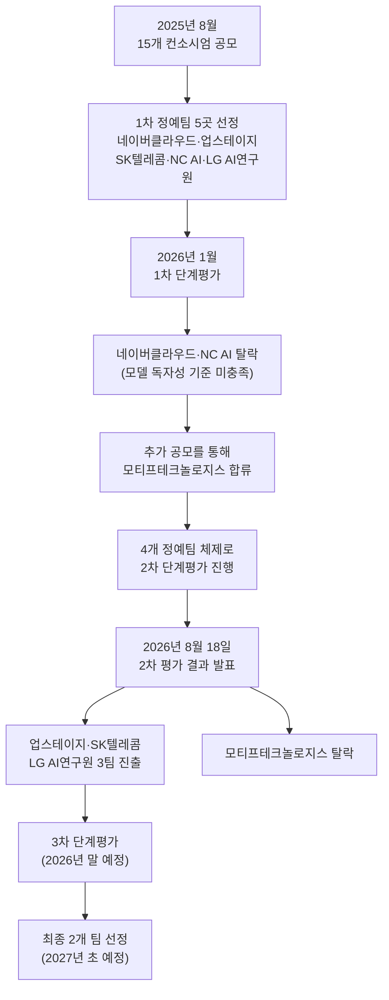
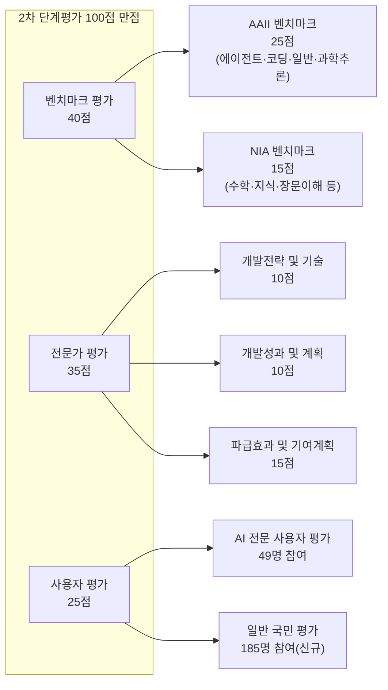

*작성 기준일: 2026년 8월 19일 / 출처: 과학기술정보통신부·정보통신산업진흥원(NIPA) 발표 및 국내 주요 언론 보도 교차 확인*

## 관련글

[**독파모 2차 평가 결과가 나왔습니다. 벤치마크 1위인 모티프테크놀로지스가 탈락하고 업스테이지, SKT, LG AI연구원이 통과했습니다.**](https://www.threads.com/share/BAWhIRf9A6/)

---

## 들어가며

2026년 8월 18일, 정부서울청사에서 열린 브리핑 하나가 국내 AI 업계를 술렁이게 했다. 정부가 국산 AI 파운데이션 모델을 육성하기 위해 추진해온 '독자 AI 파운데이션 모델(독파모)' 프로젝트의 2차 단계평가 결과가 발표된 것이다. 결과는 다소 뜻밖이었다. 글로벌 성능 지표에서 참가팀 중 가장 높은 점수를 받았던 스타트업 모티프테크놀로지스가 탈락하고, 업스테이지·SK텔레콤·LG AI연구원 세 팀이 다음 단계로 진출했다.

이 결과를 두고 "가장 성능 좋은 모델을 뽑는 경쟁이 아니었다"는 평가가 나온다. 이 글에서는 독파모 프로젝트의 배경부터 2차 평가의 세부 구조, 팀별 성과와 탈락 사유, 평가 방식을 둘러싼 논란, 그리고 이 경쟁이 놓인 국제적 맥락까지 순서대로 짚어본다. 모든 수치와 사실관계는 과학기술정보통신부의 공식 발표와 이를 보도한 복수의 언론사 기사를 대조해 확인한 내용이며, 확인이 어려운 부분은 그 사실을 명시했다.

---

## 1. 독파모 프로젝트란 무엇인가

독파모는 '독자 AI 파운데이션 모델(獨自 AI Foundation Model)'의 줄임말로, 과학기술정보통신부와 정보통신산업진흥원(NIPA)이 추진하는 정부 주도의 대규모언어모델(LLM) 개발 지원 사업이다. 목적은 단순하다. 미국과 중국이 주도하는 글로벌 AI 경쟁 구도 속에서, 한국이 외국 모델에 전적으로 의존하지 않고 국방·공공 등 주권이 걸린 분야에서 자체적으로 운용할 수 있는 AI 체계를 확보하는 것이다. 이런 성격의 사업을 흔히 '소버린 AI(Sovereign AI)'라고 부른다.

프로젝트는 단계별 평가를 거치며 참여팀을 압축해가는 구조로 설계됐다. 2025년 8월, 15개 컨소시엄이 지원한 가운데 정부는 네이버클라우드·업스테이지·SK텔레콤·NC AI·LG AI연구원 5개 정예팀을 1차로 선정했다. 그런데 2026년 1월 진행된 1차 단계평가에서 네이버클라우드와 NC AI가 모델의 독자성 기준을 충족하지 못했다는 이유로 탈락했다. 이 두 자리를 메우기 위해 추가 공모가 이뤄졌고, 이 과정에서 신생 스타트업 모티프테크놀로지스가 새롭게 합류하면서 4개 팀 체제로 2차 평가에 진입했다.

아래는 지금까지의 진행 과정을 정리한 흐름이다.

최종적으로 선정되는 2개 팀에는 국산 GPU 인프라 지원이 대폭 확대된다. 정부는 기존 상반기 수준이었던 B200 GPU 768장 지원 규모를, 3차 평가에 진출하는 팀들에게는 1,000장 수준까지 늘릴 계획이라고 밝혔다. 3차 평가를 위한 GPU 임차 예산은 팀당 약 400억 원, 3개 팀 합산 총 1,200억 원 규모로 알려졌다.

---

## 2. 2차 평가는 어떻게 이루어졌나

2차 평가의 가장 큰 특징은 평가 항목과 배점이 1차 평가와 상당히 달라졌다는 점이다. 평가는 크게 세 영역으로 나뉜다. 벤치마크 평가 40점, 전문가 평가 35점, 사용자 평가 25점, 총 100점 만점이다.

### 1차 평가에서 2차 평가로, 무엇이 바뀌었나

1차 평가와 비교했을 때 가장 눈에 띄는 변화는 두 가지다. 첫째, 벤치마크 평가에서 그동안 참여사들이 자율적으로 활용해온 '글로벌 공통·개별 벤치마크' 방식이 사라지고, 글로벌 AI 평가기관 아티피셜 애널리시스(Artificial Analysis)가 산출하는 AAII(Artificial Analysis Intelligence Index) 벤치마크로 전면 교체됐다. 이와 함께 한국지능정보사회진흥원(NIA)이 자체적으로 운영하는 NIA 벤치마크는 평가 분야를 지시이행·한국어 영역까지 확장했다.

둘째, 전문가 평가 내부의 배점 구조가 바뀌었다. 1차 평가에서는 '개발 성과 및 계획' 항목이 15점, '파급효과 및 기여계획' 항목이 10점이었는데, 2차 평가에서는 이 비중이 정확히 뒤바뀌어 각각 10점과 15점이 됐다. 다시 말해 모델을 어떻게 개발했는지보다, 그 모델이 실제로 얼마나 확산되고 사회적으로 기여할 수 있는지를 더 무겁게 보기 시작한 것이다.

셋째, 사용자 평가 영역에 1차 평가에는 없던 항목이 새로 추가됐다. 기존에는 AI 전문 사용자진의 평가만 반영됐지만, 2차 평가부터는 일반 국민 평가가 새로 포함됐다. 실제로 이번 사용자 평가에는 AI 전문 사용자 49명과, 최종 선정된 200명 중 185명이 참여를 완료한 일반 국민 평가단이 함께 점수를 매겼다.

아래 표는 이런 변화를 정리한 것이다.

| 구분 | 1차 단계평가 | 2차 단계평가 |
|---|---|---|
| 벤치마크 평가 | 글로벌 공통·개별 벤치마크 + NIA 벤치마크 | AAII 벤치마크(신규 도입) + NIA 벤치마크(분야 확장) |
| 전문가 평가 – 개발전략 및 기술 | 10점 | 10점 |
| 전문가 평가 – 개발 성과 및 계획 | 15점 | 10점 |
| 전문가 평가 – 파급효과 및 기여계획 | 10점 | 15점 |
| 사용자 평가 | AI 전문 사용자진 평가 | AI 전문 사용자진 평가 + 일반 국민 평가(신규 추가) |

과기정통부는 이런 변화의 취지를 "1차 평가 대비 대외 공신력 높은 고난도 글로벌 벤치마크 평가 도입, 현장 AX(AI 전환) 접목 및 확산 평가 확대, 국민 참여형 사용성 평가 신규 도입"이라고 설명했다. 요약하면 평가 체계 전체가 '모델 자체의 성능'에서 '모델이 실제로 쓰이고 확산될 수 있는가'로 무게중심을 옮긴 셈이다.

### 벤치마크 평가의 세부 구성

벤치마크 평가 40점은 AAII 벤치마크 평가 25점과 NIA 벤치마크 평가 15점으로 나뉜다. AAII 벤치마크 평가는 에이전트, 코딩, 일반, 과학적 추론 네 분야에 걸친 고난도 벤치마크 9종으로 구성됐으며, 이 평가는 아티피셜 애널리시스가 직접 진행했다. NIA 벤치마크 평가는 수학·지식·장문이해 등의 영역을 포함한다.

---

## 3. 2차 평가 결과: 숫자로 보는 결과

정부가 공개한 세부 평가 결과에 따르면, 영역별 점수 격차는 다음과 같았다.

| 평가 영역 | 배점 | 4개 팀 평균 | 1위-4위 격차 |
|---|---|---|---|
| 벤치마크 평가 | 40점 | 22.5점 | 4.0점 |
| 전문가 평가 | 35점 | 28.8점 | 2.4점 |
| 사용자 평가 | 25점 | 17.6점 | 5.0점 |

이 표에서 눈여겨봐야 할 지점은 명확하다. 배점이 가장 낮은 사용자 평가(25점)에서 오히려 팀 간 점수 격차가 가장 크게(5.0점) 벌어졌다는 사실이다. 벤치마크 평가(40점)의 격차는 4.0점, 전문가 평가(35점)의 격차는 2.4점에 그쳤다. 배점 비중과 실제 변별력이 반비례한 셈이다. 이런 구조에서는 배점이 작은 항목이라도 팀 간 격차가 벌어지면 최종 순위를 좌우할 수 있다.

실제로 이데일리가 별도로 확보해 보도한 세부 결과에 따르면, 모티프테크놀로지스는 벤치마크와 전문가 평가에서는 경쟁력을 보였지만 사용자 평가에서 상대적으로 낮은 점수를 받으면서 종합 65.8점에 그쳐 4개 팀 중 최하위로 탈락했다.

### 팀별 모델과 AAII 점수

4개 팀이 이번 평가에 제출한 모델과 규모, 그리고 평가 직전 공개된 AAII 점수는 다음과 같다.

| 팀 | 모델명 | 파라미터 규모 | AAII 점수 | AAII 순위 |
|---|---|---|---|---|
| 모티프테크놀로지스 | Motif 3 | 3,140억 개 | 47점 | 참가팀 중 1위 (글로벌 오픈웨이트 기준 4위) |
| 업스테이지 | Solar Open2 | 2,500억 개 | 37점 | 참가팀 중 2위 |
| SK텔레콤 | A.X K2 | 6,880억 개 | 35점 | 참가팀 중 3위 |
| LG AI연구원 | K-EXAONE 2.0 | 7,500억 개 | 31점 | 참가팀 중 4위 |

모티프의 '모티프 3'는 47점으로 글로벌 대형언어모델 중 10위, 오픈웨이트 모델 기준으로는 4위에 해당하는 점수를 받았다. 미국과 중국을 제외한 국가에서 개발된 모델 가운데는 최고 수준이었다. 그런데 흥미롭게도 이 AAII 순위와 2차 평가 최종 결과의 순위는 정반대로 뒤집혔다. 1차 평가에서 가장 높은 벤치마크 점수를 받았던 LG AI연구원의 K-EXAONE은 이번 AAII 평가에서는 4위로 밀려났지만, 최종적으로는 통과팀에 이름을 올렸다.

---

## 4. 왜 벤치마크 1위 모티프가 탈락했나

과기정통부 류제명 제2차관은 브리핑에서 이 결과를 이렇게 설명했다. "모티프테크놀로지스 모델의 기술력은 뛰어났지만, 사용성과 활용성 부분에서는 다른 기업에 비해 낮은 평가를 받았다"며 "특정 한 항목이 (탈락에) 결정적이었다기보다는 각 평가 항목 결과가 종합적으로 반영된 것"이라고 밝혔다.

모티프테크놀로지스 측도 이 결과에 이의제기를 하지 않기로 했다. 회사 관계자는 "독파모 결과에 대한 이의제기는 검토하고 있지 않다"고 밝혔고, 임정환 대표는 "결과에 상관없이 이번 독파모 프로젝트를 통해 기술력만으로 한국에서도 글로벌 프론티어 수준의 AI 모델 개발이 가능하다는 것을 증명했다는 점에서 매우 뜻깊었다"며 "앞으로도 지속적으로 글로벌 프론티어 모델 개발에 전력을 다하겠다"고 덧붙였다.

여기서 구조적으로 짚어볼 점이 있다. 모티프테크놀로지스는 원래 1차 정예팀 5곳에 포함되지 않았던 팀이다. 1차 평가에서 두 팀이 독자성 기준 미충족으로 탈락한 뒤, 추가 공모를 거쳐 뒤늦게 합류한 후발주자였다. 이 때문에 다른 세 팀보다 협력사를 확보하고 서비스 실증을 진행할 수 있는 시간이 구조적으로 짧았을 가능성이 있다. 다만 이는 정부의 공식 설명에 포함된 내용이 아니라, 시점의 차이에서 비롯된 합리적 추론이라는 점을 밝혀둔다.

---

## 5. 통과한 세 팀은 무엇으로 평가받았나

과기정통부가 공개한 정예팀별 성과 요약을 보면, 통과한 세 팀은 각기 다른 강점을 인정받았다.

### 업스테이지 — 포털과 하드웨어 생태계

업스테이지는 포털 '다음(Daum)'과 '타임리' 플랫폼 연계, 그리고 국산 AI 반도체 기업 퓨리오사AI의 NPU와의 협업을 통한 소프트웨어·하드웨어 결합 생태계를 제시해 좋은 평가를 받았다. 이 배경에는 실제로 일어난 큰 사건이 있다. 업스테이지는 2026년 1월 카카오와 주식교환 방식의 양해각서를 체결하고, 약 4개월간의 실사를 거쳐 같은 해 5월 카카오의 100% 자회사인 AXZ(포털 다음의 운영사) 지분 전량을 인수하는 본계약을 최종 체결했다. 이로써 2014년 카카오와 다음이 합병한 지 12년 만에 포털 다음의 소유주가 외부 AI 기업으로 바뀌게 됐다. 업스테이지는 이 인수를 계기로 자체 개발 LLM '솔라'를 다음의 검색엔진 및 방대한 콘텐츠 데이터와 결합해, 단순 키워드 검색을 넘어 사용자의 의도와 맥락을 이해하는 '콘텍스트 AI' 서비스로 전환하겠다는 계획을 세웠다. 이번 2차 평가에 제출한 Solar Open2는 최대 100만 토큰의 컨텍스트 창을 지원해 수백 페이지 분량의 문서를 한 번에 처리할 수 있다는 것도 강점으로 꼽혔다.

### SK텔레콤 — 수리 추론 성능과 산업 현장 실증

SK텔레콤의 A.X K2는 글로벌 수학·추론 평가에서 두드러진 성적을 냈다. 6,880억 개 파라미터 규모의 이 모델은 국제수학올림피아드(IMO) 2026 문제 평가에서 42점 만점에 29점을 받아 올해 금메달 기준을 충족했고, 고난도 수학 추론 능력을 평가하는 MathArena AIME 2026에서는 97.1%의 정확도로 공동 최고점을 기록했다. 한국어 벤치마크에서도 최상위 성능을 보였다.

무엇보다 SK텔레콤이 높은 평가를 받은 지점은 실제 산업 현장 적용 경험이었다. 과기정통부는 브리핑에서 "대규모 상용 서비스 탑재와 국방·제조·법무·세무 등 산업 특화 에이전트 적용 실증에서 SK텔레콤이 우수한 평가를 받았다"고 밝혔다. 구체적으로는 철강 제조 기업 KG스틸의 당진공장 냉간 압연 라인과 자동차 부품 기업 코넥의 주조·가공 공정에 제조 특화 AI 에이전트를 실증하고 있으며, 국방부에는 이미 이전 모델(A.X K1)을 FP8·FP4·INT4 세 가지 방식으로 양자화해 온프레미스(기관 내부 폐쇄망 구축) 방식으로 공급한 바 있다. 하반기에는 A.X K2 양자화 버전도 국방부에 공급할 예정이며, 법무·세무 분야에서도 시연을 진행했다.

### LG AI연구원 — 환각 억제와 국제 협력

LG AI연구원의 K-EXAONE 2.0은 국내 참가 모델 중 가장 큰 7,500억 개 파라미터 규모로 개발됐다. 이 모델은 아티피셜 애널리시스가 산출하는 AAII 세부 지표 중 하나인 'AI 모델 환각 최소화 지표'에서 전 세계 9위를 기록했다. 순수 종합 지능 지수(AAII 종합점수)에서는 4위에 그쳤지만, 환각을 억제해 신뢰할 수 있는 답변을 내놓는 능력에서는 오히려 상위권에 든 것이다. 이와 함께 국제기구와의 협업 전략 수립, 에이전틱 AI 기술의 차별성, 모델 안전성 관리 체계 등이 긍정적으로 평가됐다.

한 가지 덧붙이자면, LG AI연구원은 1차 평가 당시 일부 경쟁사를 둘러싸고 제기됐던 '해외 오픈소스 가중치 차용' 논란에서 비교적 자유로운 팀으로 꼽혀왔다. 업계에서는 아키텍처를 처음부터 독자 설계한 몇 안 되는 팀으로 평가받았는데, 이는 이번 2차 평가의 파급효과·기여계획 배점이 커진 것과는 별개로, 그 이전부터 이어져온 평판이라는 점을 밝혀둔다.

---

## 6. '벤치맥싱' 논란과 정부·평가기관의 해명

2차 평가 결과 발표를 전후해 업계에서는 '벤치맥싱(Benchmaxxing)' 의혹이 불거졌다. 벤치맥싱이란 벤치마크에서 취약한 항목을 집중적으로 학습시켜, 실제 활용 능력과 무관하게 점수만 끌어올리는 일종의 과적합 행위를 가리키는 업계 용어다.

이 의혹이 불거진 계기는 2026년 7월 서울 코엑스에서 열린 국제머신러닝학회(ICML 2026)였다. 이 자리에서 애프터쿼리, 스케일AI, 머코어(Mercor) 등 AI 모델의 사후학습용 데이터 제공과 성능 평가·개선을 전문으로 하는 미국 업체들이 일부 독파모 참여사와 접촉한 정황이 있다는 의문이 업계 일각에서 제기됐다. 이런 업체와의 협업이 특정 벤치마크에 대한 '맞춤형' 학습으로 이어져 점수를 부풀렸을 수 있다는 지적이었다.

이에 대해 SK텔레콤, LG AI연구원, 업스테이지, 모티프테크놀로지스 4개사는 모두 사실이 아니라고 공식 부인했다. SK텔레콤은 "이번에 A.X K2를 개발하면서 AI 모델의 성능을 객관적으로 평가하기 위해 벤치마크 오염 방지를 가장 중요하게 고려했다"고 밝혔다.

정부도 이 논란을 그냥 넘기지 않고 평가기관인 아티피셜 애널리시스에 직접 검토를 의뢰했다. 류제명 차관은 8월 18일 브리핑에서 "해당 평가기관에 벤치맥싱 우려를 의뢰한 결과, 평가를 위한 체계적인 암기나 과적합 문제가 입증될 만한 답변을 찾지 못했으며, 큰 문제가 없다는 답변을 받았다"고 밝혔다. 즉 정부와 평가기관 모두 공식적으로는 "문제없다"는 입장을 내놓은 상태다.

다만 업계 일각에서는 여전히 모티프의 AAII 점수와 실제 사용 체감 사이에 괴리가 있다는 의견이 존재하며, 벤치마크 1위라는 숫자가 곧 실사용 1위를 보장하지 않는다는 지적도 함께 나온다. 이는 한국만의 현상이 아니라 글로벌 AI 업계에서 반복적으로 제기돼온 문제이기도 하다.

---

## 7. LG AI연구원 체험판을 둘러싼 별도 의혹 — 신뢰도에 대한 유의사항

이번 논쟁 과정에서 또 하나 언급되는 사안이 있다. LG AI연구원의 K-EXAONE 체험 사이트에서, 일부 벤치마크형 질문에 대한 정답이 담긴 문서(흔히 'SKILL.md' 형태의 지침 파일로 지칭됨)가 모델에 사전 탑재돼 있었다는 지적이 온라인 커뮤니티를 중심으로 제기된 바 있다.

이 부분은 명확히 짚고 넘어가야 한다. 이 내용은 나무위키와 일부 커뮤니티 게시글에서만 확인되며, 이 문서 작성 시점까지 정식 언론사의 취재를 통한 독립적인 사실 확인 기사는 찾지 못했다. 즉 이 사안은 신뢰도 있는 단일 출처가 아니라 크라우드소싱 위키·커뮤니티발 주장에 머물러 있는 상태다. 다만 관련 업계 커뮤니티에서 이 논란이 화제가 됐다는 정황 자체는 여러 게시물에서 확인되며, LG AI연구원 측이 "체험판과 실제 정부 평가에 사용된 모델은 다르다"는 취지로 대응했다는 언급도 존재한다. 그러나 이 해명 내용 역시 공식 보도자료나 언론 인터뷰를 통해 별도로 확인되지는 않았다.

이런 이유로 이 사안은 확정된 사실이 아니라 '검증되지 않은 커뮤니티발 의혹'으로 분류하는 것이 정확하다. 이후 언론 보도나 공식 해명이 추가로 나온다면 그 내용으로 갱신할 필요가 있다.

---

## 8. 평가 구조를 둘러싼 근본적인 질문

이번 2차 평가 결과를 계기로, 평가 방식 자체에 대한 논의도 함께 떠올랐다. 소버린 AI 사업은 본래 국가 안보와 공공 서비스에 쓰일 모델을 선발하는 사업이다. 그런데 이번 사용자 평가는 일반 국민이 챗봇처럼 모델을 체험해보고 매기는 체감 점수 방식으로 진행됐고, 이 항목이 전체 100점 중 25점을 차지했다. 국방 시스템에 들어갈 AI의 당락을 상당 부분 일반 사용자의 체감 평가가 가른다는 점에 대해, "산업별로 특화된 별도의 평가 기준이 필요한 것 아니냐"는 문제 제기가 존재한다. 예컨대 국방 분야에는 국방 시나리오 기반 평가가, 법무 분야에는 법률 문서 처리 평가가 있어야 한다는 논리다.

이는 검증 가능한 사실이 아니라 분석적 견해에 해당하며, 정부 역시 공식적으로는 이런 문제의식을 인정하는 발표를 하지는 않았다. 다만 정부 스스로도 이번 결과를 계기로 "독파모 사업 구조를 전면 재편"하겠다는 뜻을 밝혔다는 점은 사실관계로 확인된다. 과기정통부 김경만 인공지능정책실장은 앞으로의 프런티어급 모델 개발 지원과 관련해 "여러 기업이 함께하는 특수목적법인(SPC)을 구성하는 방식뿐 아니라 특정 기업이 프로젝트를 주도하는 방식도 가능하다"고 밝혔다. 3차 단계평가는 기존 계획대로 2026년 말 진행하되, 2027년부터 선정팀을 어떤 방식으로 지원할지는 기존의 개발 주관사 중심 구도에서 벗어나 전면 재검토하기로 했다.

---

## 9. 글로벌 맥락: 미스트랄의 노선 전환이 시사하는 것

이 논의를 국내에 국한하지 않고 조금 더 넓혀보면, 흥미로운 비교 사례가 있다. 유럽의 대표적인 소버린 AI 기업으로 꼽혀온 프랑스의 미스트랄(Mistral AI)이 최근 노선을 상당히 바꾸었다는 점이다.

먼저 아키텍처 차원의 변화가 있었다. 2025년 12월 공개된 미스트랄의 플래그십 모델 '미스트랄 라지 3(Mistral Large 3)'는 675B(6,750억) 규모의 MoE(전문가 혼합) 구조를 채택했는데, 공개 직후 개발자 커뮤니티에서는 이 구조가 중국 딥시크의 DeepSeek-V3 계열과 매우 유사하다는 지적이 나왔다. 실제로 미스트랄 소속 엔지니어가 허깅페이스 토론 게시판에서 "DeepSeek-V3를 기반으로 학습한 것은 아니지만, 아키텍처 설계 면에서 깊은 영향을 받은 것은 분명하다"는 취지로 직접 답변한 사실이 확인된다. 이 사안을 두고 "누가 누구의 스승인가"를 놓고 업계에서 논쟁이 벌어지기도 했다.

두 번째는 더 결정적인 변화다. 2026년 8월 11일, 미스트랄은 유럽 인프라 확장 계획을 발표하면서 세 가지를 함께 공개했다. 지역별로 데이터 처리 위치를 선택할 수 있는 '지역 추론 엔드포인트', 가동시간을 보장하는 유료 등급 서비스 '프라이오리티 티어', 그리고 자사 모델이 아닌 제3자의 오픈모델을 자사 플랫폼에서 서비스하기 시작한다는 계획이었다. 그 첫 번째 대상이 바로 중국 지푸AI(Zhipu AI) 산하 Z.ai가 개발한 GLM-5.2였다. 미스트랄은 이 모델을 자사가 수정하지 않은 원본 그대로, 자사 모델과 동일한 인프라·지역 통제·서비스 약정 하에서 제공한다고 밝혔다.

이 결정이 시사하는 바는 명확하다. 그동안 '유럽의 소버린 AI'를 표방해온 미스트랄이, 자사가 직접 개발한 최고 성능 모델을 고수하는 대신 중국산 오픈웨이트 모델을 자사 플랫폼 위에 얹어 서비스하는 방향으로 사업 모델을 전환한 것이다. 이는 독자 프런티어 모델 개발 경쟁에서 벗어나, 유럽 인프라(데이터 주권·규제 준수·서비스 안정성) 위에서 다양한 모델을 골라 쓸 수 있게 하는 '인프라 사업자'로 정체성을 재정의한 것으로 해석할 수 있다.

한국의 독파모 참여사들, 특히 이번에 탈락한 모티프테크놀로지스도 비슷한 갈림길에 놓여 있다고 볼 수 있다. 독자 노선을 계속 유지할 수도 있고, 데이터를 보유한 대기업에 인수되거나 협력하는 경로를 택할 수도 있다. 다만 이는 특정 결과를 예측하는 진술이 아니라, 미스트랄 사례에 비춰본 구조적 유사성에 대한 해석이라는 점을 밝혀둔다.

---

## 10. 그럼에도, 한국 AI 모델의 글로벌 위치

독파모 2차 평가의 결과와는 별개로, 이번 프로젝트에 참여한 4개 팀의 모델은 모두 국제적으로 의미 있는 인정을 받았다는 사실도 함께 짚을 필요가 있다.

2026년 8월 11일, 과기정통부는 미국의 비영리 AI 연구기관 에포크AI(Epoch AI)가 독파모 4개 정예팀이 올해 상반기 개발한 AI 모델 전부를 '주목할 만한 모델(Notable Model)'로 등재했다고 밝혔다. 등재된 모델은 LG AI연구원의 K-EXAONE 2.0, SK텔레콤의 A.X K2, 업스테이지의 솔라 오픈2, 모티프테크놀로지스의 모티프 3 베타 등 4종이다.

에포크AI의 주목할 만한 모델 지표는 국가별 AI 기술 경쟁력을 살펴보는 대표적 척도로, 미국 스탠퍼드대 인간중심AI연구소(HAI)가 매년 발간하는 'AI 인덱스' 보고서에도 주요 지표로 인용된다. 스탠퍼드대의 'AI 인덱스 2026' 보고서에 따르면 지난해 기준 주목할 만한 모델을 보유한 국가는 미국이 59개로 가장 많았고, 중국이 35개, 한국이 8개로 그 뒤를 이었다. 현재까지 에포크AI가 주목할 만한 모델을 배출한 국가는 미국·중국·한국 3개국뿐이다. 류제명 차관은 이와 관련해 "전 세계 AI 모델 개발 기업 58개 중 미국과 중국을 제외하면 한국 기업이 7개로 가장 많다"고도 밝혔는데, 이는 AAII 리더보드 등재 기업 통계에 기반한 발언이다.

즉 독파모라는 하나의 국내 사업 안에서는 순위가 갈렸지만, 이 사업을 통해 만들어진 모델들이 이미 국제 무대에서 독자적으로 경쟁력을 인정받고 있다는 사실은 별개로 유효하다. 정부 사업 안에서의 탈락이 모티프테크놀로지스라는 기업의 기술 역량 자체를 부정하는 것은 아니라는 지적이 여러 언론에서 공통적으로 제기된 이유이기도 하다.

---

## 11. 이후 전개: 3차 평가와 '모두의 AI'

탈락한 모티프테크놀로지스는 독파모 무대를 떠나지 않았다. 정부가 별도로 추진 중인 '모두의 AI(AI for All)' 프로젝트—국민 누구나 비용이나 이용량 제한 없이 쓸 수 있는 범용 AI 챗봇과 공공 AI 에이전트를 구축하는 사업—의 사업자 공모에 KT 컨소시엄의 일원으로 참여했다. 흥미롭게도 이 공모에는 통과팀인 업스테이지 역시 같은 KT 컨소시엄에 이름을 올렸다. 2026년 8월 18일 마감된 이 공모에는 SK텔레콤, 카카오, KT, 이스트소프트, 엠케이디, 제논 등 총 6개 사업자(컨소시엄)가 지원했으며, KT 컨소시엄에는 업스테이지·모티프테크놀로지스·NC AI·다음·리벨리온 등 16개 기관이 참여했다. SK텔레콤은 굿닥·신한카드·티맵모빌리티 등 19개 기관과, 카카오는 LG AI연구원·LG전자·서울대병원 등 14개 기관과 각각 컨소시엄을 꾸렸다. 흥미로운 지점은 독파모에서는 경쟁 관계였던 기업들이 '모두의 AI'에서는 서로 다른 진영으로 재편되며 협력하고 있다는 점이다. 정부는 이달 말까지 서면·발표 평가를 거쳐 2~3개 사업자를 최종 선정할 예정이다. 참고로 하이퍼클로바X를 보유한 네이버는 기존 AI 사업에 역량을 집중하겠다는 이유로 이 공모에는 불참하기로 했다.

한편 독파모 본 사업의 3차 단계평가는 기존 일정대로 2026년 말 진행되며, 최종 2개 팀은 2027년 초 발표될 예정이다. 다만 앞서 언급했듯 정부는 이번 결과를 계기로 프런티어급 AI 모델 개발 지원 사업 구조 전반을 재검토하겠다고 밝힌 상태이므로, 지원 방식이나 평가 기준이 3차 평가를 앞두고 추가로 조정될 가능성은 남아 있다.

---

## 용어 해설

| 용어 | 설명 |
|---|---|
| 독파모 | '독자 AI 파운데이션 모델'의 줄임말. 과기정통부·NIPA가 추진하는 국산 AI 파운데이션 모델 개발 지원 사업 |
| 소버린 AI (Sovereign AI) | 특정 국가가 외국 기술에 의존하지 않고 자체적으로 개발·운용하는 AI 체계를 가리키는 개념 |
| AAII (Artificial Analysis Intelligence Index) | 글로벌 AI 평가기관 아티피셜 애널리시스가 여러 벤치마크를 종합해 산출하는 AI 모델 지능 지수 |
| NIA 벤치마크 | 한국지능정보사회진흥원이 자체 개발·운영하는 한국어 및 지시이행 중심 벤치마크 |
| 벤치맥싱 (Benchmaxxing) | 벤치마크에서 취약한 항목을 집중 학습시켜 실제 성능과 무관하게 점수만 끌어올리는 과적합 행위 |
| 오픈웨이트 (Open Weight) | 모델의 학습 완료 가중치(파라미터)를 누구나 내려받아 활용·수정할 수 있도록 공개하는 방식. 학습 데이터 등 핵심 개발 과정까지 공개하는 '오픈소스'와는 구분되는 개념 |
| MoE (Mixture of Experts) | 여러 개의 '전문가' 신경망 중 입력에 따라 일부만 선택적으로 활성화해 연산 효율을 높이는 모델 구조 |
| 파운데이션 모델 | 다양한 작업에 두루 적용할 수 있는 범용 대규모 AI 모델을 가리키는 용어 |
| 에포크AI 주목할 만한 모델 (Notable Model) | 미국 비영리 AI 연구기관 에포크AI가 국가별 AI 기술 경쟁력을 가늠하기 위해 선정하는 지표성 모델 목록 |

---

## 사실관계 검증 등급 표

이 문서에서 다룬 주요 주장들을 신뢰도에 따라 네 등급으로 구분했다.

**1등급 — 정부 공식 발표로 확인**
- 2차 평가 통과팀(업스테이지·SK텔레콤·LG AI연구원)과 탈락팀(모티프테크놀로지스)
- 평가 배점 구조(벤치마크 40점·전문가 35점·사용자 25점)와 영역별 평균·격차 수치
- 1차→2차 평가기준 변화 내용
- 벤치맥싱 의혹에 대한 아티피셜 애널리시스의 "문제없음" 회신
- 3차 평가 일정과 GPU 지원 규모 확대 계획

**2등급 — 복수 언론사 교차 확인**
- 각 팀의 AAII 점수와 파라미터 규모
- 업스테이지의 AXZ(다음) 인수 경과
- SK텔레콤의 국방·제조·법무·세무 분야 실증 사례
- LG AI연구원의 환각 억제 지표 세계 9위 기록
- 미스트랄의 GLM-5.2 파트너십 및 정책 전환
- 에포크AI 주목할 만한 모델 등재 사실
- '모두의 AI' 공모 참여 현황

**3등급 — 단일 출처 또는 미확정**
- LG AI연구원 체험판의 정답 사전 탑재 의혹(나무위키·온라인 커뮤니티 게시글에만 근거, 정식 언론 보도로 독립 확인되지 않음)
- 모티프테크놀로지스의 사용자 평가 부진 원인이 '후발주자로서의 시간 부족'이라는 해석(정부 공식 설명이 아닌 정황적 추론)

**4등급 — 분석적 견해·해석**
- 소버린 AI 평가가 산업별 특화 기준으로 세분화되어야 한다는 문제 제기
- 모티프테크놀로지스가 향후 독자 노선과 인수·합병 경로 사이의 갈림길에 있다는 전망
- 미스트랄 사례와 한국 사례 간의 구조적 유사성에 대한 해석

---

## 참고 자료

- 과학기술정보통신부·정보통신산업진흥원(NIPA), 2026년 8월 18일 독파모 2차 단계평가 결과 브리핑
- 바이라인네트워크, "독파모 2차 업스테이지·SKT·LG AI연구원 통과…모티프 탈락" (2026.8.18)
- ZDNet Korea, "[독파모 2차 발표] 예정대로 2곳 선정…AI 개발 지원책은 재검토" (2026.8.18)
- ZDNet Korea, "독파모 2차전 '모티프' 탈락…업스테이지·SKT·LG 진출" (2026.8.18)
- 이데일리, "[단독] 독파모 2차, 업스테이지·SKT·LG 통과…AAII 1위 모티프 탈락이유" (2026.8.18)
- 이비엔(EBN)뉴스센터, "'독파모 2차 탈락' 모티프 '이의제기 안한다'" (2026.8.18)
- 뉴스1, "'독파모 탈락' 모티프3, 이의제기 안 한다…'아쉽지만 결과 수용'" (2026.8.18)
- AI타임스, "독파모 4개사, '벤치맥싱' 의혹 일축…'평가 보완책으로 영향 미미'" (2026.8.12)
- 머니투데이, "'벤치맥싱' 논란 넘어… '독파모 2차 평가'가 한국에 남긴 것은" (2026.8.18)
- 스페셜타임스, "과기정통부 '독파모 2차 평가 벤치맥싱 없었다'…AAII 공식 답변 근거" (2026.8.18)
- 뉴시스, "SKT 독파모 개발 총괄 'A.X K2로 일하는 AI 본격화…국방부도 공급'" (2026.8.4)
- 위키리크스한국, "A.X K2 앞세운 SKT, 독파모 생존…이제 '실전 경쟁'" (2026.8.18)
- 아주경제, "[업스테이지 다음 인수] 업스테이지, 다음 품에 안았다" (2026.5.7)
- ZDNet Korea, "[AI는 지금] 다음 품은 업스테이지, B2B 넘어 '포털' 진출" (2026.5.7)
- 아시아경제, "독파모 4개 모델, 美 에포크 AI 선정 '주목할 만한 모델' 등재" (2026.8.11)
- ZDNet Korea, "독파모 4개 팀 모두 해냈다…美 에포크AI '주목할 모델' 선정" (2026.8.11)
- 아시아경제, "전국민 무료 '모두의 AI'에 SKT·KT·카카오 등 6개사 참여(종합)" (2026.8.18)
- ZDNet Korea, "KT, 한국 대표 AI 기업과 '모두의 AI' 사업 참여" (2026.8.19)
- Mistral AI 공식 발표, "In-region inference, open models, and new European infrastructure for sovereign AI" (2026.8.11)
- VentureBeat, "Mistral AI wants to build 1 gigawatt of European compute by 2030" (2026.8.12)
- Hugging Face, mistralai/Mistral-Large-3-675B-Instruct-2512 토론 게시판, 미스트랄 엔지니어 답변 (2025.12.9)
- Sebastian Raschka, "The Big LLM Architecture Comparison" (2026.4.3)
- 나무위키, '엑사원' 문서 (참고용, 3등급 신뢰도로 인용)

---

*이 문서는 원문 게시물(Threads, 2026년 8월 18일 게시)의 주요 주장을 독립적으로 재검증하고, 확인 가능한 사실과 확인되지 않은 주장을 구분해 재구성한 자료입니다. 정부의 3차 평가 및 사업 구조 재검토 결과가 발표되면 이 문서의 내용도 갱신이 필요합니다.*
