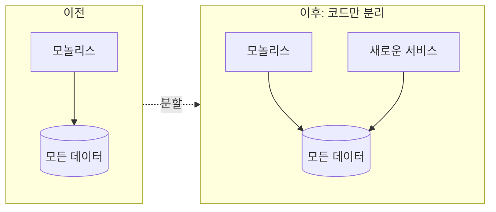
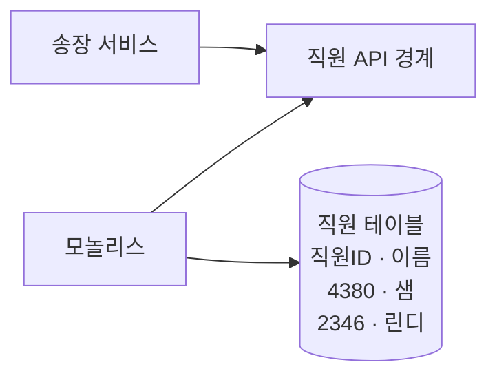
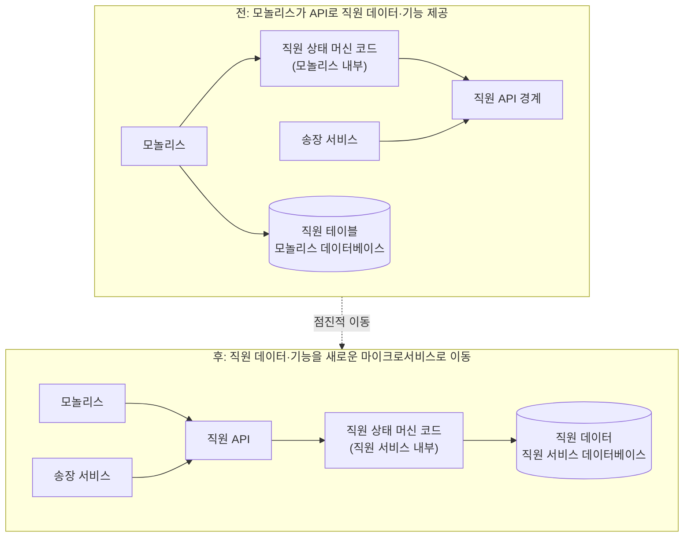
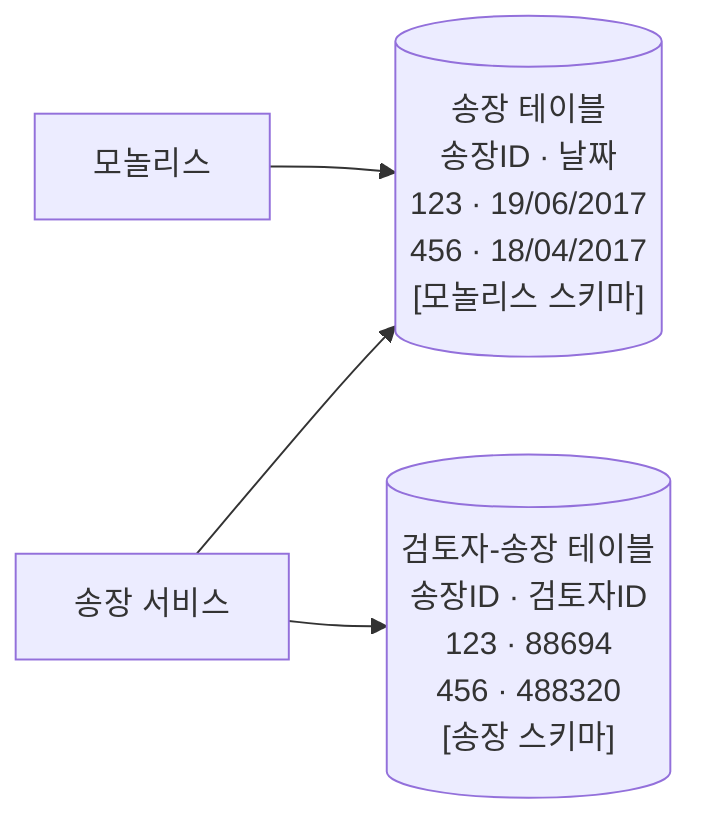
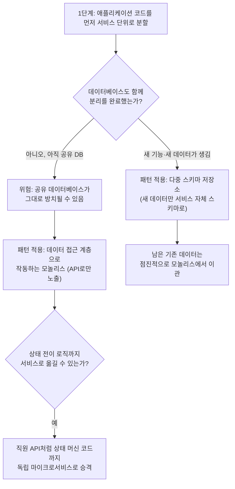

## 문서의 출처

이 글은 샘 뉴먼(Sam Newman)이 쓴 『마이크로서비스 도입, 이렇게 한다』(원제: *Monolith to Microservices: Evolutionary Patterns to Transform Your Monolith*, O'Reilly, 2019) 4장 "데이터베이스 분해" 중 204쪽부터 208쪽까지의 내용을 풀어서 정리한 것이다. 국내에는 박재호 번역, 책만 출판사를 통해 소개되었으며, 저자 샘 뉴먼은 소트웍스(ThoughtWorks)에서 오랫동안 아키텍트로 일했고 전작 『마이크로서비스 아키텍처 구축』으로도 잘 알려진 인물이다. 원서는 총 23가지의 마이크로서비스 마이그레이션 패턴을 다루는데, 이번에 살펴볼 두 가지 패턴, 즉 "데이터 접근 계층으로 작동하는 모놀리스"와 "다중 스키마 저장소"는 그중 데이터베이스를 안전하게 떼어내는 초반 단계에 해당한다.

이 구간이 다루는 핵심 질문은 단순하다. 모놀리스를 쪼갤 때 코드와 데이터베이스 중 무엇을 먼저 나눠야 하는가, 그리고 데이터베이스를 완전히 분리하기 전까지 마이크로서비스는 어떻게 데이터에 접근해야 하는가 하는 것이다.

---

## 1. 왜 대부분의 팀은 코드를 먼저 나누는가

샘 뉴먼은 자신이 관찰한 대다수 팀의 패턴을 이렇게 설명한다. 팀들은 애플리케이션 코드를 먼저 서비스 단위로 쪼갠 다음, 데이터베이스는 나중에 손을 댄다. 그림 4-29가 이 상황을 보여준다.

코드만 먼저 분리했을 때 남는 결과는 명확하다. 모놀리스와 새로 만든 서비스가 여전히 하나의 데이터베이스, 즉 "모든 데이터"가 담긴 단일 스키마를 함께 바라보는 구조가 되는 것이다. 애플리케이션 계층을 코드 수준에서 분리하는 작업 자체는 여러 이점을 준다. 새로운 서비스가 실제로 어떤 데이터를 필요로 하는지 훨씬 명확하게 파악할 수 있고, 독립적으로 배포 가능한 코드 산출물을 데이터베이스 분리보다 먼저 확보할 수 있다는 점도 실무적으로 매력적이다.

문제는 여기서 멈추는 팀이 많다는 데 있다. 코드는 나뉘었지만 데이터베이스는 여전히 공유 상태로 계속 운영되는 경우다. 이 상태로 방치하면 데이터 계층 분리라는 숙제를 미래로 미루는 셈이 되고, 저자는 이런 함정에 빠진 조직을 여러 번 목격했다고 밝힌다. 반면 이 단계를 제대로 완료한 사례도 있는데, 책에서는 저스트소셜(JustSocial)이라는 조직이 독자적인 마이크로서비스 마이그레이션 과정에서 이 접근 방식을 끝까지 밀어붙인 예로 소개된다. 코드 분리 단계에서 흔히 놓치는 또 다른 함정은, 원래 데이터베이스 조인으로 처리되던 연산을 애플리케이션 레벨로 옮기면서 예상하지 못한 성능 문제나 로직 누락이 뒤늦게 드러날 수 있다는 점이다.

그래서 저자는 이 방향을 택한 조직에게 스스로 냉정하게 되물을 것을 권한다. 코드 분리 이후 이어지는 단계에서, 마이크로서비스가 소유해야 할 데이터를 실제로 분리해낼 역량과 의지가 조직에 충분히 있는가 하는 질문이다.

---

## 2. 패턴: 데이터 접근 계층으로 작동하는 모놀리스

코드를 분리한 다음에도 데이터베이스가 아직 하나로 남아 있는 과도기 상태에서, 새로운 서비스가 모놀리스의 데이터베이스에 직접 접근하도록 두는 것은 바람직하지 않다. 이때 쓸 수 있는 첫 번째 패턴이 "데이터 접근 계층으로 작동하는 모놀리스"다. 핵심 아이디어는 모놀리스가 자신이 가진 데이터에 대한 직접 접근을 막고, 그 대신 API를 통해서만 데이터를 노출하도록 바꾸는 것이다.

책에서 드는 예시는 송장(청구서) 서비스다. 송장 서비스는 업무 처리 과정에서 직원에 대한 정보가 필요한데, 이때 모놀리스가 직원 데이터베이스 테이블에 직접 접근하는 대신 "직원 API"라는 창구를 새로 만들고, 송장 서비스는 오직 이 API를 통해서만 직원 정보를 조회한다.

이렇게 하면 송장 서비스는 모놀리스의 데이터베이스 스키마와 직접 결합되지 않는다. 저자는 이 패턴을 저스트소셜의 수잔 카이저(Susanne Kaiser)로부터 배웠다고 밝히며, 실제로 이 패턴을 기반으로 상당히 많은 실전 작업이 이뤄졌음에도 업계에서 예상보다 덜 알려져 있다는 점에 놀랐다고 적고 있다.

이 패턴이 널리 알려지지 않은 이유에 대해 저자는 흥미로운 해석을 내놓는다. 사람들은 이미 모놀리스를 벗어나고 싶어 하는 마음이 크기 때문에, 모놀리스를 조금이라도 "더 쓸모 있게" 만드는 방향의 해법에는 관심을 덜 갖는다는 것이다. 하지만 이 패턴의 긍정적인 면은 분명하다. 데이터 분해라는 어려운 작업과 아직 씨름하지 않아도, 정보 은닉 원칙만 지키면 새로운 서비스를 모놀리스로부터 격리시킬 수 있다는 점이다. 저자는 모놀리스의 데이터가 앞으로도 계속 그 자리에 남아 있을 것이라고 판단되는 경우에 이 패턴을 채택하라고 조언한다. 특히 새로운 서비스가 사실상 무상태(stateless)에 가깝게 설계된다면 이 모델은 특히 잘 작동한다.

**적용 대상**: 이 패턴은 데이터를 실제로 다루고 관리하는 코드가 여전히 모놀리스 안에 남아 있을 때 가장 효과적이다. 데이터 관점에서 마이크로서비스를 정의하면, 결국 상태(state)와 그 상태의 전이(transition)를 관리하는 코드를 캡슐화한 것이라고 볼 수 있다. 따라서 상태 전이 로직이 여전히 모놀리스 안에서 일어나고 있다면, 그 상태에 접근하거나 변경하려는 다른 마이크로서비스는 모놀리스를 거쳐 가야 한다. 반대로 모놀리스가 들고 있는 데이터를 사실은 새로운 마이크로서비스가 "소유"해야 하는 상황이라면, 저자는 이 패턴을 건너뛰고 곧바로 데이터 분리 방안을 제안하겠다고 밝힌다.

### 다음 단계: 직원 API를 독립 서비스로 승격시키기

이 패턴을 발판 삼아 다음 후보 서비스를 판별하는 일은 어렵지 않다. 그림 4-31이 보여주는 확장된 그림에서는, 모놀리스 안에 있던 "직원 상태 머신 코드"가 API 경계와 함께 통째로 떨어져 나와 독자적인 "직원 서비스"이자 마이크로서비스로 발전한다.

즉 "데이터 접근 계층으로 작동하는 모놀리스" 패턴은 최종 목적지가 아니라, 데이터를 소유한 코드와 상태 전이 로직을 모놀리스 밖으로 안전하게 옮기기 위한 중간 정거장 역할을 한다는 점이 이 패턴의 진짜 의미다.

---

## 3. 패턴: 다중 스키마 저장소

두 번째로 소개되는 패턴은 "다중 스키마 저장소"다. 이 패턴이 다루는 상황은 조금 다르다. 이미 상황이 좋지 않다면(즉 모놀리스와 새 서비스가 얽혀 있는 상태라면) 이를 더 악화시키지 않는 것이 우선이라는 전제에서 출발한다. 다만 기존 데이터베이스의 데이터를 여전히 직접 사용해야 한다고 해서, 마이크로서비스가 새로 저장해야 할 데이터까지 반드시 기존 데이터베이스에 함께 넣어야 하는 것은 아니라는 점이 이 패턴의 핵심이다.

책이 드는 사례는 다시 송장 서비스다. 송장의 핵심 데이터(송장 번호, 날짜 등)는 여전히 모놀리스 데이터베이스 안에 있고, 현재로서는 그곳이 접근 가능한 유일한 장소다. 그런데 송장에 검토(리뷰) 기능을 추가하는 새로운 요구사항이 생겼다고 가정해 보자. 이는 모놀리스에는 존재하지 않던 완전히 새로운 기능이다. 이 기능을 지원하려면 어떤 직원이 어떤 송장을 검토했는지 매핑하는 검토자 테이블이 필요하다.

이때 저자가 강조하는 것은, 이 새로운 테이블을 기존 모놀리스 데이터베이스에 그냥 추가해버리면 데이터베이스의 덩치만 키울 뿐이라는 점이다. 대신 이 새로운 데이터는 송장 서비스가 소유하는 자체적인 스키마에 저장한다.

결과적으로 송장 서비스는 두 개의 서로 다른 저장소를 동시에 다루는 모양이 된다. 하나는 자신이 새로 만든 검토자 관련 스키마이고, 다른 하나는 여전히 모놀리스가 관리하는 기존 송장 데이터다. 이렇게 하나의 서비스가 복수의 스키마(다중 스키마)를 오가며 데이터를 저장하고 조회한다는 뜻에서 "다중 스키마 저장소"라는 이름이 붙었다.

여기서 저자는 중요한 경고를 하나 남긴다. 이 예시에서 검토자 테이블이 송장 테이블의 송장ID를 참조하는 것처럼, 외래 키(foreign-key) 관계가 사실상 스키마 경계를 넘어 확장되는 문제가 발생할 수 있다는 점이다. 원래 관계형 데이터베이스 안에서만 존재하던 외래 키 제약이 이제는 서로 다른 스키마, 심지어 서로 다른 서비스 사이의 암묵적인 의존 관계로 바뀌는 셈이다. 저자는 이 문제를 4장 후반부에서 더 깊이 다루겠다고 예고하는데, 이는 마이크로서비스로의 데이터 분해 작업에서 반복적으로 등장하는 까다로운 주제이기도 하다.

이 패턴이 왜 실용적인가에 대한 설명도 이어진다. 모놀리스 데이터베이스에서 데이터를 통째로 꺼내 옮기는 작업은 시간이 오래 걸리고, 대개는 한 번에 끝낼 수 있는 일이 아니다. 따라서 마이크로서비스가 자신만의 로컬 저장소를 새로 관리하면서 동시에 필요할 때는 모놀리스 데이터베이스에도 접근할 수 있다면, 이는 실무적으로 매우 유용한 절충안이 된다. 이렇게 나머지 데이터를 점진적으로 끌어오는 방식으로 관리하면, 나중에 해당 테이블 전체를 새로운 스키마로 한 번에 마이그레이션하는 것도 가능해진다.

**적용 대상**: 이 패턴은 마이크로서비스에 완전히 새로운 기능이 추가되면서, 그 기능이 다뤄야 할 데이터 역시 새로 저장해야 하는 상황에서 특히 효과적으로 동작한다. 모놀리스 입장에서는 애초에 존재하지 않던 기능이자 데이터이므로, 처음부터 모놀리스에 얹지 않고 분리해서 시작하는 것이 자연스럽다. 또한 이 패턴은 기존에 모놀리스가 갖고 있던 데이터를 마이크로서비스의 자체 스키마로 서서히 옮겨오기 시작하는 국면에서도 의미가 있는데, 다만 이 이관 과정 자체는 시간이 꽤 걸릴 수 있다는 점을 감안해야 한다.

---

## 4. 두 패턴 비교

| 구분 | 데이터 접근 계층으로 작동하는 모놀리스 | 다중 스키마 저장소 |
|---|---|---|
| 데이터 소유권의 실질적 위치 | 모놀리스가 계속 소유, API로만 노출 | 새 데이터는 서비스가 소유, 기존 데이터는 모놀리스가 소유 |
| 새로운 저장소 신설 여부 | 없음 (모놀리스 DB 그대로 사용) | 있음 (서비스 자체 스키마 신설) |
| 가장 잘 맞는 상황 | 새로운 서비스가 사실상 무상태에 가깝고, 상태 전이 로직이 아직 모놀리스에 남아 있어도 무방할 때 | 서비스에 모놀리스에는 없던 완전히 새로운 기능·데이터가 추가될 때 |
| 남는 과제 | 언젠가 상태 전이 로직 자체를 서비스로 옮기는 작업(그림 4-31 방향) | 외래 키로 인한 스키마 경계 확장 문제, 이후 남은 데이터의 점진적 이관 |

두 패턴 모두 "데이터베이스를 한 번에 완전히 쪼개려 하지 말라"는 저자의 일관된 원칙 위에 서 있다. 코드는 먼저 나누되 데이터는 과도기 동안 모놀리스에 남겨두면서도, API 경계를 명확히 하거나 새로 생기는 데이터만이라도 별도 스키마로 분리함으로써 점진적으로 결합도를 낮춰가는 것이 이 구간 전체의 메시지다.

---

## 5. 전체 흐름 정리

두 패턴을 관통하는 저자의 태도는 신중함이다. 데이터베이스 분해는 코드 분해보다 되돌리기 어렵고 실패 시 파급 효과도 크기 때문에, 무리하게 한 번에 끝내려 하기보다는 API로 데이터 접근을 통제하거나 새로 생기는 데이터만 먼저 분리하는 식으로 위험을 조금씩 줄여가는 접근을 권한다는 점이 4장 이 구간의 결론이라 할 수 있다.

---

## 6. 확인한 사실 관계

아래는 이 글을 작성하면서 실제로 검색을 통해 교차 확인한 항목이다.

| 항목 | 확인 내용 | 상태 |
|---|---|---|
| 원서 정보 | 샘 뉴먼, *Monolith to Microservices: Evolutionary Patterns to Transform Your Monolith*, O'Reilly Media, 2019년 출간 | 확인됨 |
| 국내 번역서 정보 | 『마이크로서비스 도입, 이렇게 한다』, 박재호 옮김, 책만 출판 | 확인됨 (교보문고·예스24·표지 이미지 일치) |
| "데이터 접근 계층으로 작동하는 모놀리스" 패턴명 | 원서의 "Monolith as Data Access Layer" 패턴과 동일 개념으로 확인 | 확인됨 |
| "다중 스키마 저장소" 패턴명 | 원서의 "Multischema Storage" 패턴과 동일 개념으로 확인 | 확인됨 |
| 저스트소셜(JustSocial), 수잔 카이저 관련 언급 | 책 본문 내 저자 서술로, 별도 외부 자료로 재검증하지는 못함 | 책 본문 근거, 외부 교차검증 없음 |
| 4장 전체 주제(데이터베이스 분해) 및 후반부 외래 키 문제 예고 | 해당 챕터가 데이터베이스 분해를 다루며 참조 무결성 문제를 후속으로 다룬다는 점을 외부 요약 자료에서도 확인 | 확인됨 |

---

작성일자: 2026년 8월 19일
