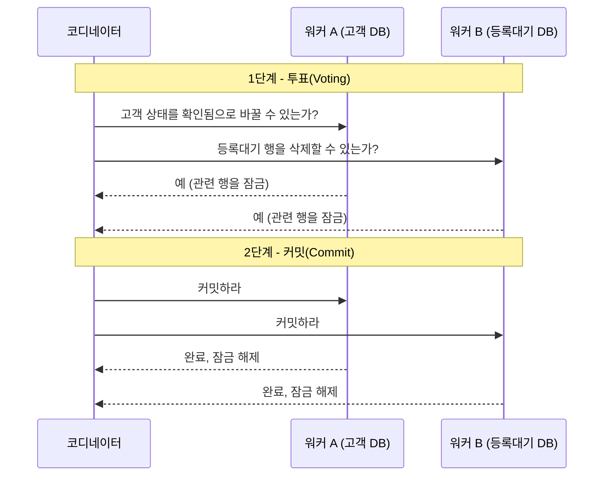
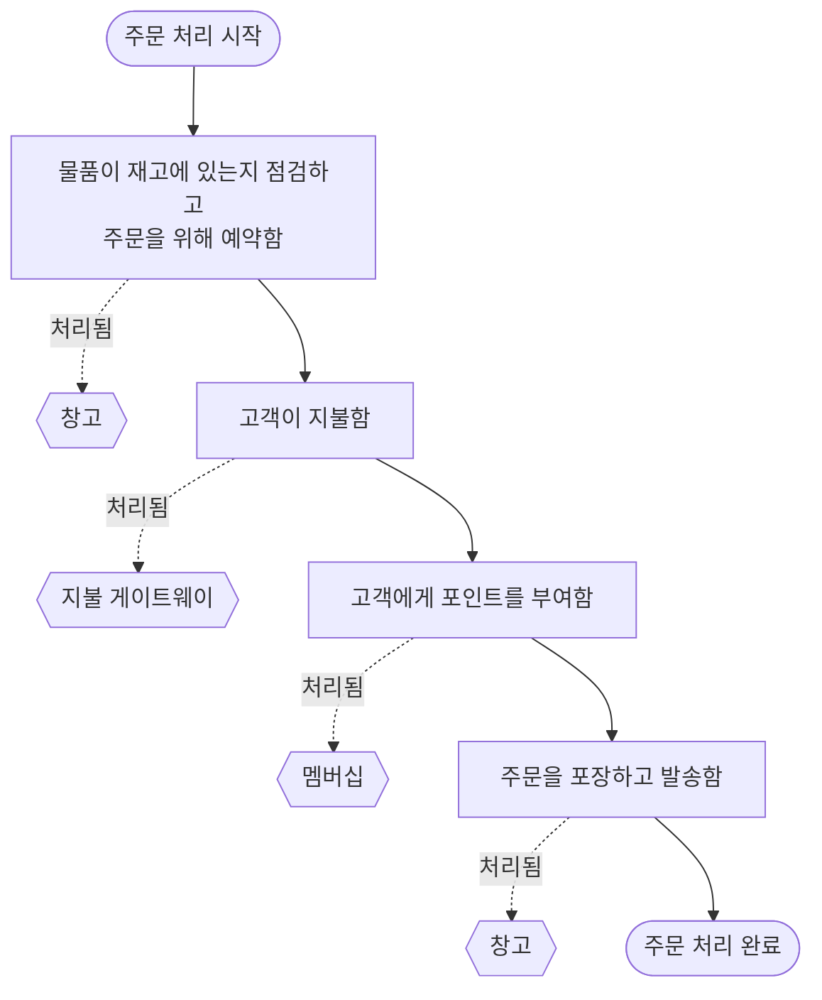
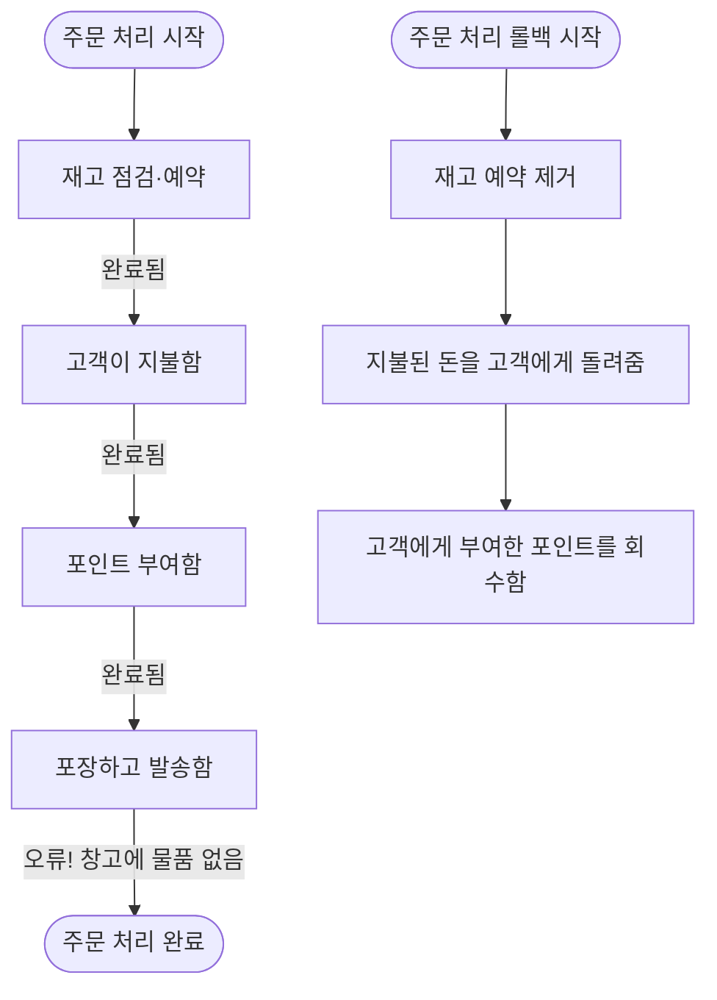
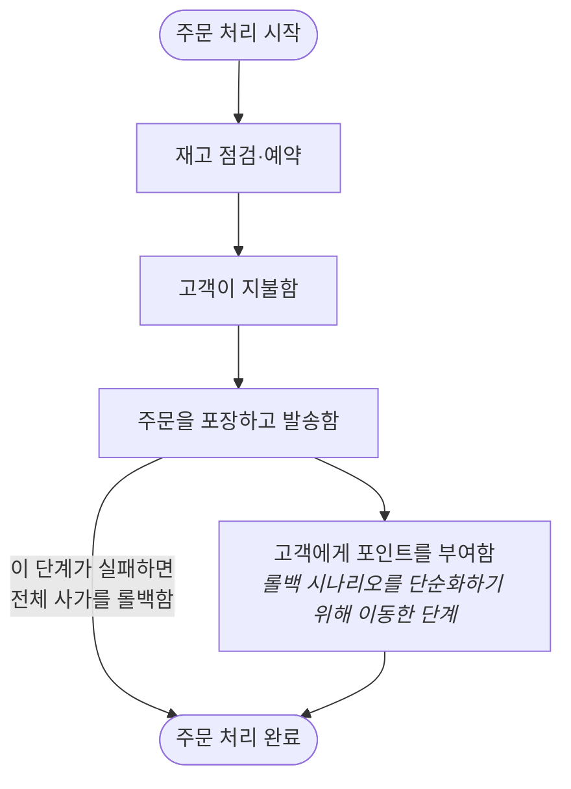
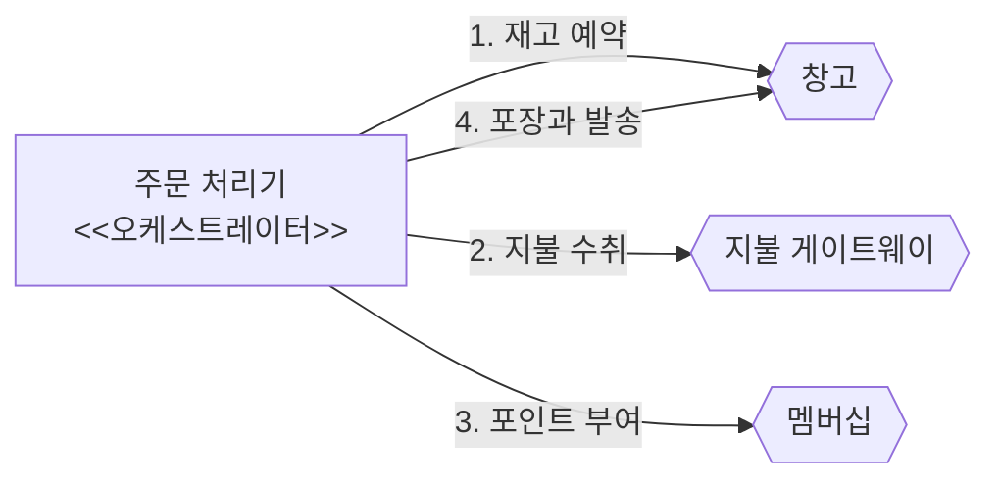
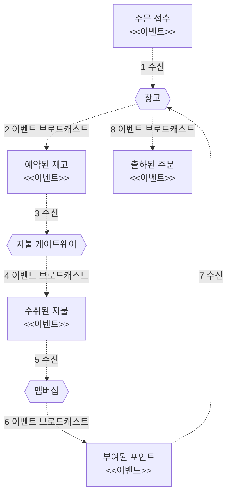
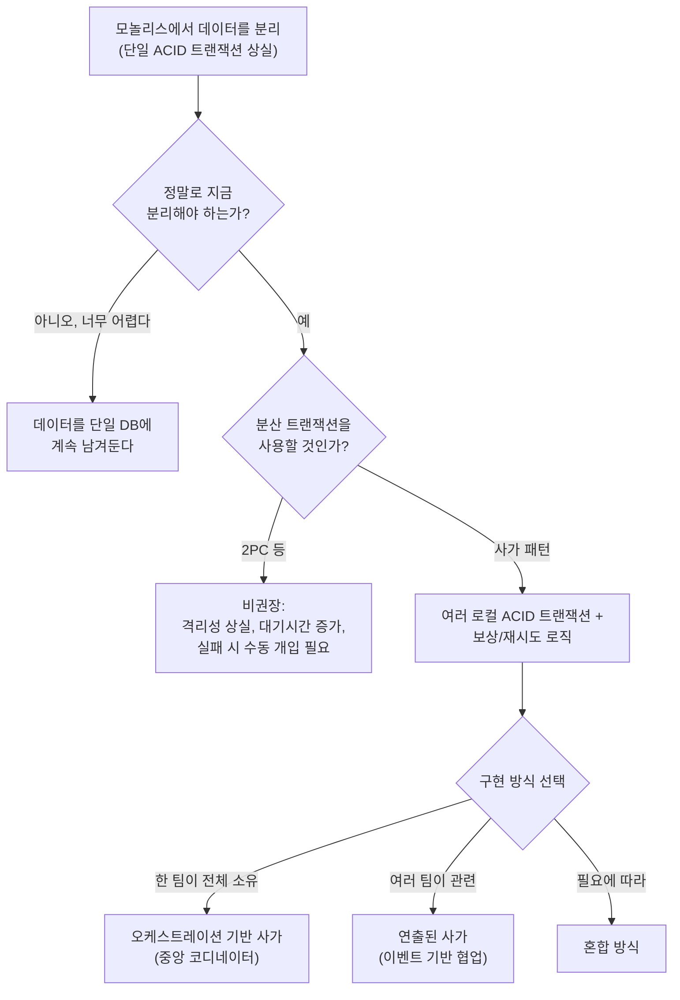
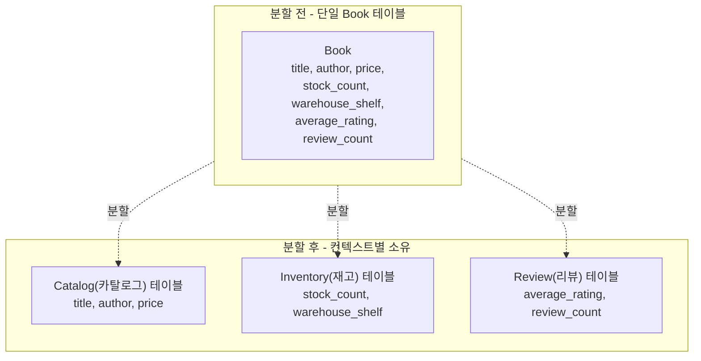

> 정리 대상: 샘 뉴먼(Sam Newman) 지음, 박재호 옮김, 『마이크로서비스 도입, 이렇게 한다(Monolith to Microservices)』, 책만, 2021년 1월 출간 (원제: *Monolith to Microservices: Evolutionary Patterns to Transform Your Monolith*, O'Reilly) 4장 "데이터베이스 분해" 중 230~248쪽, "여전히 ACID이지만 원자성이 부족한가?"부터 "정리"까지의 내용입니다. 아래 설명은 해당 페이지의 논지를 그대로 따라가면서, 필요한 부분은 현재 시점(2026년) 기준으로 사실관계를 다시 확인해 덧붙였습니다.

---

## 1. 문제의 출발점 — 데이터베이스를 나누면 무엇을 잃는가

모놀리스 애플리케이션에서는 데이터베이스가 하나뿐이기 때문에, 여러 테이블에 걸친 변경도 단 하나의 ACID 트랜잭션 안에서 처리할 수 있습니다. 책에서 드는 예시는 이렇습니다. 새로운 고객을 시스템에 등록시키는 과정에서, 고객의 상태를 "보류 중(PENDING)"에서 "확인됨(VERIFIED)"으로 바꾸는 작업과, 등록이 끝났으니 등록대기 테이블에서 해당 고객의 행을 지우는 작업을 동시에 처리해야 합니다. 단일 데이터베이스 안에서는 이 두 가지 변경을 하나의 트랜잭션 경계 안에 묶을 수 있고, 그 결과 두 변경은 "둘 다 성공하거나 둘 다 실패하거나" 둘 중 하나로만 끝납니다. 이것이 ACID의 A, 즉 원자성(Atomicity)입니다.

그런데 고객 정보와 등록 정보를 서로 다른 서비스, 서로 다른 데이터베이스로 쪼개는 순간 상황이 달라집니다. 똑같은 두 가지 변경이 이번에는 서로 다른 데이터베이스에서 일어나게 되고, 이는 곧 고려해야 할 트랜잭션이 하나가 아니라 두 개로 늘었다는 뜻입니다. 각 트랜잭션은 서로 독립적으로 성공하거나 실패할 수 있습니다. 예를 들어 고객 테이블의 상태 변경은 성공했는데, 등록대기 테이블의 행 삭제는 네트워크 문제로 실패할 수 있다는 것입니다. 이렇게 되면 시스템은 어중간한 상태에 놓이게 되고, 원래 하나의 연산이었던 것이 두 개의 분리된 데이터베이스 트랜잭션으로 쪼개지면서 "연산 전체에 걸친 원자성"을 잃어버렸다는 사실을 받아들여야 합니다.

이 원자성 부족 문제는 특히 예전에 단일 트랜잭션에 의존했던 시스템을 마이크로서비스로 마이그레이션할 때 심각하게 불거집니다. 그래서 사람들이 가장 먼저 떠올리는 해법이 바로 분산 트랜잭션이고, 그중에서도 가장 널리 알려진 알고리즘이 2단계 커밋(Two-Phase Commit, 2PC)입니다.

---

## 2. 2단계 커밋(2PC) — 왜 널리 알려졌지만 권장되지 않는가

### 2.1 동작 원리

2PC는 이름 그대로 두 단계, 즉 투표(voting) 단계와 커밋(commit) 단계로 나뉩니다. 중앙에 코디네이터(coordinator)라는 조정자가 있고, 이 조정자가 트랜잭션에 참여하는 모든 워커(worker)에게 연락해서 "이 상태 변경을 수행할 수 있는가?"라고 묻는 것이 첫 번째 단계입니다.

책의 그림 4-48과 4-49가 보여주는 흐름이 정확히 이렇습니다. 워커 A는 고객 테이블에서 아이디 2346번 고객의 상태를 "확인됨"으로 바꿀 수 있는지 확인 요청을 받고, 워커 B는 등록대기 테이블에서 같은 고객의 행을 지울 수 있는지 요청을 받습니다. 중요한 점은, 워커가 "할 수 있다"고 답한다고 해서 그 순간 즉시 변경이 적용되는 것이 아니라는 점입니다. 워커는 "미래의 어느 시점에 이 변경을 반드시 수행할 수 있다"는 것을 보증하는 것이고, 그 보증을 지키기 위해 해당 레코드를 로컬에서 잠급니다. 다른 트랜잭션이 그 사이에 끼어들어 값을 바꿔버리면 보증이 깨지기 때문입니다.

모든 워커가 동의하면 코디네이터는 두 번째 단계로 넘어가 실제 커밋 요청을 보내고, 이때 비로소 변경이 실제로 적용되며 잠금이 풀립니다. 반대로 어느 워커든 하나라도 "할 수 없다"고 답하면 전체 연산은 중단되고, 이미 동의했던 워커들에게는 롤백 메시지를 보내 잠금을 풀게 만듭니다.

### 2.2 왜 문제가 되는가

책은 2PC를 "마이크로서비스 아키텍처로 전환하는 팀이 자신들이 직면한 문제를 해결하는 방법으로 자주 언급하지만, 실제로는 문제를 해결하지 못할뿐더러 시스템에 더 많은 혼란을 가져올 수도 있다"고 지적합니다. 이유는 다음과 같습니다.

첫째, 두 커밋이 정확히 동시에 일어난다는 보장이 어디에도 없습니다. 코디네이터가 여러 워커에게 커밋 요청을 보낼 때 그 메시지들은 서로 다른 시간에 도착해 처리될 수 있습니다. 그 결과 트랜잭션 코디네이터 바깥에서 시스템을 들여다보면, 어느 한 워커의 변경 사항은 이미 보이는데 다른 워커의 변경 사항은 아직 안 보이는 "불일치 구간"이 생깁니다. 코디네이터 사이의 대기 시간이 길어질수록, 그리고 워커가 응답을 처리하는 속도가 느릴수록 이 구간은 더 커집니다. ACID의 정의에서 격리(Isolation)란 트랜잭션이 진행되는 중간 상태를 다른 트랜잭션이 볼 수 없게 보장하는 속성인데, 2PC를 쓰는 순간 이 격리 속성은 사실상 사라져 버립니다.

둘째, 실패 처리 방식이 매우 까다롭습니다. 투표까지는 했지만 커밋 요청에 응답하지 않는 워커가 생기는 경우처럼 여러 가지 실패 모드가 존재하는데, 이 중 일부는 자동으로 처리할 수 있지만 몇몇은 시스템을 어중간한 상태로 만들어버려서 사람이 수동으로 개입해 상황을 해제해야 합니다.

셋째, 워커의 수가 많아지고 시스템의 대기 시간이 길어질수록 2PC로 인한 문제는 기하급수적으로 늘어납니다. 특히 잠금 범위가 크거나 트랜잭션 지속 시간이 길면, 2PC는 시스템 전체에 막대한 대기 시간을 유발하는 원인이 되어버립니다. 그래서 2PC는 일반적으로 수명이 매우 짧은 연산에만 제한적으로 사용되며, 연산에 걸리는 시간이 길어질수록 자원을 그만큼 더 오래 잠가둬야 한다는 근본적인 트레이드오프에서 벗어날 수 없습니다.

이런 이유로 책은 "마이크로서비스 전반에 걸친 상태 변화를 조정하기 위해 2단계 커밋 등의 분산 트랜잭션은 피할 것을 강력히 제안"합니다. 소제목 자체가 "분산 트랜잭션? 그냥 아니라고 말하자"일 정도로 단호합니다.

---

## 3. 그렇다면 대안은 무엇인가 — 두 가지 선택지

### 3.1 첫 번째 선택지: 애초에 데이터를 쪼개지 않는다

가장 먼저 검토해야 할 선택지는 역설적으로 "쪼개지 않는 것"입니다. 진짜로 원자적이고 일관되게 관리해야 하는 상태 조각이 있는데 ACID 트랜잭션 없이 이 특성을 영리하게 얻어낼 방법을 찾지 못했다면, 그 상태는 단일 데이터베이스에 남겨두고 단일 서비스(혹은 아직 쪼개지 않은 모놀리스) 안에서 계속 관리하는 편이 낫습니다. 모놀리스를 어디서부터 쪼갤지, 어떤 분해 작업이 쉽고 어떤 작업이 어려운지 판단하는 과정이라면, 지금 당장 이 데이터를 분리하는 일이 너무 어렵다고 결론 내리고 시스템의 다른 영역부터 먼저 작업한 뒤 나중에 다시 돌아오는 선택도 충분히 합리적입니다.

### 3.2 두 번째 선택지: 사가(Saga) 패턴

정말로 데이터를 쪼개야만 하고, 그러면서도 분산 트랜잭션 관리의 모든 고통은 원하지 않는 경우에 고려할 수 있는 대안이 바로 사가(Saga)입니다. 여러 서비스에서 작업을 수행하되, 잠금을 오래 걸어두지 않고 처리하는 방법을 찾는 것이 사가의 핵심 아이디어입니다.

---

## 4. 사가 패턴의 기원과 기본 개념

### 4.1 원래는 단일 데이터베이스를 위한 아이디어였다

사가라는 개념은 사실 마이크로서비스를 염두에 두고 만들어진 것이 아닙니다. 헥터 가르시아몰리나(Hector Garcia-Molina)와 케네스 세일럼(Kenneth Salem)이 1987년 학술지 *ACM SIGMOD Record* 16권 3호(249~259쪽)에 발표한 「Sagas」라는 논문에서 처음 제시한 개념으로, 원래는 단일 데이터베이스에서 아주 긴 시간이 걸리는 트랜잭션, 즉 LLT(Long Lived Transaction, 수명이 긴 트랜잭션)을 어떻게 처리할지에 대한 해법이었습니다. 여기서 "긴 시간"이란 몇 분, 몇 시간, 심지어 며칠이 걸릴 수도 있는 프로세스를 뜻합니다.

이런 LLT를 일반적인 데이터베이스 트랜잭션에 그대로 매핑하면, 단일 트랜잭션이 LLT의 전체 수명 동안 이어지게 됩니다. 그러면 그 긴 시간 동안 여러 행, 심지어 테이블 전체가 계속 잠긴 채로 남아 있을 수 있고, 다른 프로세스가 그 잠긴 자원을 읽거나 수정하려 할 때마다 심각한 병목이 생깁니다.

논문의 저자들이 제안한 해법은, 이 LLT를 일련의 짧은 트랜잭션으로 쪼개서 각각을 독립적으로 처리하자는 것이었습니다. 이렇게 하면 각 "하위" 트랜잭션의 수명은 훨씬 짧아지고, 그 과정에서 전체 LLT가 영향을 미치는 데이터 중 일부만 그때그때 수정하게 됩니다. 그 결과 잠금 범위와 지속 시간이 크게 줄어들어, 기반 데이터베이스에서의 경합이 훨씬 덜해집니다. 원래는 단일 데이터베이스에서 작동하는 메커니즘으로 구상되었지만, 여러 서비스에 걸친 변경을 조정하는 용도로도 그대로 효과적으로 적용할 수 있다는 점이 마이크로서비스 맥락에서 재조명받는 이유입니다.

### 4.2 사가는 원자성을 스스로 제공하지 않는다

여기서 반드시 짚고 넘어가야 할 점이 있습니다. LLT를 여러 개의 개별 트랜잭션으로 분해하고 나면, 사가 자체는 그 개별 트랜잭션들을 하나로 묶는 원자성을 제공하지 않습니다. 일반적인 데이터베이스 트랜잭션에서 익숙한 ACID 관점의 원자성은, 필요한 경우 각 하위 트랜잭션 수준에서만 보장됩니다. 사가가 우리에게 제공하는 것은, LLT 내부의 개별 하위 트랜잭션이 지금 어떤 상태에 있는지 추론할 수 있을 만큼의 정보이며, 이 정보의 의미를 해석하고 그에 따라 무엇을 할지 처리하는 책임은 어디까지나 개발자에게 남아 있습니다.

### 4.3 마이크로서비스 맥락의 사가 예시 — 주문 처리

마이크로서비스 아키텍처의 맥락에서 사가를 이해하기 위해 책이 드는 예시는 간단한 주문 처리 흐름입니다.

이 흐름에서 주문 처리 프로세스는 하나의 사가를 대표하며, 각 단계는 다른 서비스가 수행할 수 있는 연산을 나타냅니다. 각 서비스 내부의 모든 상태 변경은 로컬 ACID 트랜잭션 안에서 처리됩니다. 예를 들어 창고 서비스를 사용해서 재고를 확인하고 예약(reservation)할 때, 창고 서비스는 내부적으로 예약 상황을 기록하는 로컬 예약 테이블에 행을 하나 만들 것입니다. 이 변경은 창고 서비스 자신의 일반적인(단일 데이터베이스) 트랜잭션 안에서 처리됩니다. 즉, 사가를 구성하는 각 단계는 각자의 서비스 안에서는 원자적이지만, 전체 사가 차원에서 이 네 단계를 하나로 묶어주는 원자성은 존재하지 않는다는 것이 핵심입니다.

---

## 5. 사가가 실패했을 때 — 두 가지 복구 방식

사가를 개별 트랜잭션으로 쪼개려면 장애가 발생했을 때 어떻게 복구할지를 반드시 함께 설계해야 합니다. 앞서 언급한 최초의 사가 논문에는 장애 발생 시의 복구 유형이 두 가지 기술되어 있습니다.

- **역방향 복구(backward recovery)**: 장애가 발생하면 이미 커밋된 트랜잭션들을 취소할 수 있는 보상 조치(compensating action)를 실행해서 되돌리는 방식입니다. 이 조치 이후에 벌어지는 정리 작업이 바로 롤백입니다.
- **정방향 복구(forward recovery)**: 오류가 발생한 지점에서 데이터를 다시 가져와 처리를 계속 이어가는 방식입니다. 이를 위해서는 트랜잭션을 재시도할 수 있어야 하고, 이는 시스템이 재시도에 필요한 충분한 정보를 지속적으로 제공해 줘야 한다는 뜻이기도 합니다.

어떤 방식을 택할지는 모델링하려는 비즈니스 프로세스의 특성에 달려 있으며, 두 방식을 혼합해서 사용하는 것도 얼마든지 가능합니다.

### 5.1 사가 롤백 — 일반적인 롤백과는 다르다

일반적인 ACID 트랜잭션을 사용할 때 발생하는 롤백은 커밋에 앞서 일어나기 때문에, 롤백 이후에는 마치 아무 일도 일어나지 않은 것처럼 취급할 수 있습니다. 그런데 사가에는 관련된 여러 개의 트랜잭션이 있고, 그중 몇몇은 전체 연산을 롤백하기로 결정하기 전에 이미 커밋되어버렸을 수 있습니다. 이미 커밋된 트랜잭션을 어떻게 롤백할 수 있을까요?

앞서 살펴본 주문 처리 예시를 다시 가져와서, 물품을 포장하려 했지만 창고 선반 어디에도 그 물품이 없는 상황을 상상해 봅시다. 재고 예약, 지불, 포인트 부여까지는 모두 이미 완료된 상태에서 마지막 포장·발송 단계가 실패한 것입니다. 여기서 이미 결제까지 완료한 고객에게 그 주문에 대한 멤버십 포인트까지 지급해버렸다는 문제가 남습니다.

만약 이 모든 단계가 단일 데이터베이스 트랜잭션 안에서 수행됐다면 간단한 롤백 한 번으로 모든 처리 과정을 정리할 수 있었을 것입니다. 그러나 주문 처리 프로세스의 각 단계는 각기 다른 트랜잭션 범위에서 운영되는 각 서비스의 요청으로 처리되었기 때문에, 전체 연산을 한 번에 되돌릴 간단한 "롤백" 명령 같은 것은 존재하지 않습니다.

대신 롤백을 구현하려면 **보상 트랜잭션(compensating transaction)** 을 직접 구현해야 합니다. 보상 트랜잭션이란 이전에 커밋된 트랜잭션을 취소하는 연산으로, 위 그림처럼 이미 커밋된 사가에서 각 단계에 대응하는 보상 트랜잭션(재고 예약 제거, 결제 금액 환불, 포인트 회수)을 순서대로 일으키는 방식입니다.

이 보상 트랜잭션은 일반적인 데이터베이스 롤백과 정확히 동일한 동작을 수행하지 않는다는 점이 매우 중요합니다. 데이터베이스 롤백은 커밋 전에 일어나며, 롤백 후에는 그 트랜잭션이 아예 발생하지 않은 것처럼 취급할 수 있습니다. 하지만 사가 패턴을 적용한 상황에서는 이미 트랜잭션이 실제로 일어났습니다. 여기서 우리가 만드는 것은 원래 트랜잭션이 만든 변경을 되돌리는 "새로운" 트랜잭션이지, 시간을 거슬러 올라가 원래 트랜잭션이 전혀 일어나지 않은 것처럼 만드는 것이 아닙니다. 그래서 이런 보상 트랜잭션을 항상 깔끔하게 되돌릴 수는 없다는 의미에서 **의미론적(semantic) 롤백**이라고 부릅니다.

책은 재미있는 실제 사례를 각주로 덧붙입니다. 주문이 진행 중임을 알리기 위해 고객에게 이메일을 보내는 단계가 있었는데, 나중에 롤백하기로 결정했다고 해도 이미 전송된 이메일은 취소할 수 없습니다. 그 대신 할 수 있는 일은 문제가 생겨 주문이 취소되었음을 알리는 두 번째 이메일을 보내는 것뿐입니다. 완벽하게 "없었던 일"로 만들 수는 없지만, 사가의 맥락 안에서 상황을 정리할 수 있는 수준의 조치는 충분히 취할 수 있다는 뜻입니다.

### 5.2 롤백을 줄이기 위한 단계 재정렬

앞의 롤백 시나리오는 단계의 순서를 바꾸는 것만으로도 훨씬 단순해질 수 있습니다. 예를 들어 포인트를 지급하는 시점을 맨 앞이 아니라, 주문이 실제로 발송된 뒤로 미루면 어떨까요.

이렇게 순서를 바꾸면, 주문을 포장하고 발송을 준비하는 과정에서 문제가 발생하더라도 "포인트 회수"라는 보상 트랜잭션 자체가 아예 필요 없어집니다. 이런 식으로 프로세스가 실제로 실행되는 순서를 조율하는 것만으로도 롤백 연산 자체를 단순화할 수 있습니다. 실패할 가능성이 가장 높은 단계를 앞쪽에 배치하고, 프로세스가 더 빨리 실패하도록 만들면, 애초에 진행되지도 않은 뒷단계에 대해서는 나중에 보상 트랜잭션을 준비할 필요 자체가 사라집니다. 몇몇 단계에 대해서는 보상 트랜잭션을 아예 만들 필요가 없어지므로, 이는 특히 보상 트랜잭션을 구현하기 어려운 경우에 매우 유용한 전략입니다. 보상이 까다로운 단계는 아예 롤백이 필요 없는 프로세스의 뒷부분으로 옮겨 놓는 방법도 고려할 만합니다.

### 5.3 역방향 실패와 정방향 실패를 섞어 쓰기

장애 복구 모드를 섞어서 쓰는 것도 전적으로 바람직한 선택입니다. 롤백(역방향 복구)이 필요한 실패도 있고, 재시도(정방향 복구)가 필요한 실패도 있습니다. 예를 들어 주문 처리 과정에서 고객이 이미 결제하고 창고에서 물품까지 포장을 마쳤다면, 이제 남은 일은 포장된 택배를 발송하는 단계뿐입니다. 이 시점에서 어떤 이유로(예를 들어 오늘자 배송 차량에 해당 물품을 실을 공간이 부족한 경우) 배송이 안 됐다고 해서 지금까지의 전체 주문을 되돌리는 것은 매우 부자연스럽습니다. 그보다는 그냥 배송을 재시도하는 편이 합리적이고, 그래도 계속 실패한다면 그때는 사람이 개입해서 상황을 해결하는 편이 낫습니다. 즉 실패의 성격에 따라 롤백과 재시도를 유연하게 나눠 쓰는 것이 실전적인 사가 설계의 핵심입니다.

---

## 6. 사가를 실제로 구현하는 두 가지 방식

논리적인 모델을 살펴봤으니, 이제 사가를 실제 코드로 구현하는 방식을 살펴볼 차례입니다. 책은 두 가지 구현 방식, 즉 **오케스트레이션 기반 사가**와 **연출된 사가**를 소개합니다.

### 6.1 오케스트레이션 기반 사가 — 명령과 제어

오케스트레이션 기반 사가는 중앙 코디네이터, 즉 오케스트레이터(orchestrator)를 두고 이 오케스트레이터가 실행 순서를 정의하고 필요한 보상 조치를 트리거하는 방식입니다. 명령과 제어 방식(command-and-control approach)이라고 생각할 수 있습니다. 중앙 오케스트레이터가 어떤 일이 언제 일어나는지를 제어하기 때문에, 사가 안에서 지금 무슨 일이 벌어지고 있는지를 한눈에 충분히 파악할 수 있다는 장점이 있습니다.

여기서 오케스트레이터 역할을 담당하는 중앙 주문 처리기가 주문 처리 프로세스 전체를 조정합니다. 연산을 수행하는 데 어떤 서비스가 필요한지 알고 있고, 언제 그 서비스를 호출해야 할지도 결정합니다. 호출이 실패하면 그 결과에 따라 어떤 작업(재시도할지, 보상 트랜잭션을 실행할지 등)을 수행할지도 결정할 수 있습니다.

이 방식의 첫 번째 장점은, 주문 처리기 내부에서 비즈니스 프로세스를 명시적으로 모델링해두면 시스템의 한곳만 바라봐도 이 프로세스가 어떻게 작동하는지 이해할 수 있다는 점입니다. 새로운 팀원이 합류했을 때도 핵심 부분을 훨씬 쉽게 이해시킬 수 있습니다.

하지만 단점도 있습니다. 첫째, 태생적으로 결합도가 높은 접근 방식입니다. 주문 처리기는 관련된 모든 서비스에 대해 알아야 하므로 도메인 결합도가 높아집니다. 이것이 본질적으로 나쁜 것은 아니지만, 가능하다면 도메인 결합도는 최소로 유지하는 편이 바람직하다는 점에서 아쉬운 지점입니다. 둘째, 더 미묘한 문제로 서비스에 적용되어야 할 로직이 오케스트레이터 쪽으로 흡수되어 버릴 위험이 있습니다. 이렇게 되면 각 서비스는 오케스트레이터로부터 주문만 받고 자신의 행동은 거의 하지 않는 무기력한 상태가 되어버립니다. 오케스트레이션 기반의 흐름을 구성하는 서비스는 어디까지나 고유한 로컬 상태와 동작을 보유한 독자적인 엔티티로 남아야 합니다. 책은 이 위험성을 "비즈니스 로직을 중앙에 모을 수 있는 장소가 있다면, 중앙화가 일어날 것이다"라는 경고 문구로 강조합니다.

이런 과도한 중앙집중화를 피하는 한 가지 방법은, 하나의 흐름에 하나의 오케스트레이터만 두는 것이 아니라 각 흐름별로 전담 오케스트레이터 서비스를 여러 개 만드는 것입니다. 예를 들어 주문 처리를 담당하는 주문 처리 서비스, 반품과 환불을 담당하는 반품 서비스, 새로운 재고를 입고 처리하는 입고 서비스처럼 흐름마다 별도의 오케스트레이터를 두고, 그 아래에서 창고 서비스처럼 재사용 가능한 서비스는 여러 오케스트레이터가 공유해서 사용하는 모델입니다. 이렇게 하면 모든 흐름에 걸쳐 기능을 재사용할 수 있으면서도 로직이 한곳으로만 쏠리는 상황은 피할 수 있습니다.

#### 참고 — BPM(비즈니스 프로세스 모델링) 도구와 오케스트레이션 기반 사가

책에는 오케스트레이션 기반 사가와 관련해 BPM 도구를 다루는 짧은 보충 설명이 실려 있습니다. 대체로 BPM 도구는 비개발자가 드래그앤드롭 방식의 GUI로 비즈니스 프로세스 흐름을 정의하도록 설계되었고, 개발자가 단위 프로세스의 빌딩 블록을 만들면 비개발자가 이 블록들을 더 큰 흐름에 연결하는 방식으로 동작합니다. 저자 샘 뉴먼은 이런 BPM 도구를 상당히 회의적으로 바라봅니다. 비개발자가 비즈니스 프로세스를 스스로 정의할 수 있다는 도구 업체의 홍보 문구는 실제 현장에서 거의 사실이 아니었고, 결국 개발자가 그 도구를 떠맡게 되는 경우가 많았기 때문입니다. 워크플로우를 바꾸려면 GUI가 필요한 경우가 많고, 이렇게 만들어진 워크플로우는 버전 관리가 어렵거나 아예 불가능하며, 애초에 테스트를 염두에 두고 설계되지 않은 경우도 흔했다는 것이 저자의 경험입니다. 그래서 저자는 개발자가 비즈니스 프로세스를 구현하려 한다면 코드로 워크플로우를 구현하는 방식을 권장합니다.

다만 좀 더 개발자 친화적인 BPM 도구를 만들려는 시도도 있다고 언급하며, 책에서는 **카문다(Camunda)** 와 **지비(Zeebe)** 를 예로 듭니다. 책이 쓰인 시점에는 이 둘이 별도의 오픈소스 오케스트레이션 프레임워크로 소개되어 있는데, 현재(2026년) 기준으로 확인해 보면 이 관계는 이후 상당히 통합되었습니다. Zeebe는 원래 카문다가 별도로 개발하던 클라우드 네이티브 워크플로우 엔진이었는데, 이후 출시된 **카문다 8(Camunda 8)** 플랫폼의 핵심 실행 엔진으로 흡수되어, 지금은 "카문다 8을 구동하는 엔진이 곧 Zeebe"인 구조로 자리 잡았습니다. 즉 책에서 "둘 다 마이크로서비스 개발자를 대상으로 하는 오픈소스 오케스트레이션 프레임워크"라고 병렬로 소개했던 두 프로젝트가, 현재는 하나의 제품군(카문다 8) 안에서 서로 다른 계층을 맡는 형태로 정리되어 있다고 이해하면 됩니다. 최근에는 카문다 쪽에서 AI 기반 프로세스 모델링 보조 기능이나 에이전트 오케스트레이션 관련 기능도 추가로 발표하고 있어, BPM 도구 자체도 계속 진화하는 중입니다.

### 6.2 연출된 사가 — 신뢰하지만 검증된 아키텍처

오케스트레이션 기반 사가가 명령과 제어 방식이라면, **연출된 사가(choreographed saga)** 는 여러 협력 서비스 사이에 사가 운영에 대한 책임을 분산시키는 것을 목표로 하는, "신뢰하지만 검증된(trust but verify)" 아키텍처입니다. 중앙 조정자 없이, 서비스들이 이벤트를 통해 서로 협업하는 방식입니다.

이 서비스들은 저마다 자신이 관심 있는 이벤트에 반응합니다. 개념적으로 이벤트는 시스템 전체에 브로드캐스트되고, 관심 있는 서비스가 이를 수신할 수 있습니다. 특정 서비스에 직접 이벤트를 보내는 대신, 그저 이벤트를 뿌리고 그 이벤트에 관심 있는 서비스가 이를 받아서 스스로 판단해 동작하는 구조입니다. 예를 들어 창고 서비스는 "주문 접수" 이벤트를 수신하면 스스로 적절한 재고를 예약하고, 작업을 마치면 다시 "예약된 재고" 이벤트를 발생시키는 식입니다. 재고를 확보할 수 없는 경우에는 대신 "재고 부족" 같은 이벤트를 발생시켜서 주문을 중단시킵니다.

이런 방식은 대개 안정적인 메시지 브로드캐스트와 이벤트 전달을 관리해 주는 메시지 브로커를 필요로 합니다. 여러 서비스가 동일한 이벤트에 반응할 수 있도록 토픽(topic)을 사용하는데, 특정 유형의 이벤트에 관심 있는 서비스는 그 이벤트가 어디서 왔는지 신경 쓸 필요 없이 해당 토픽만 구독하면 되고, 브로커는 그 토픽의 이벤트가 구독자에게 안정적으로 전달되도록 보장합니다.

연출된 사가의 가장 큰 장점은 결합도가 상당히 낮은 아키텍처를 만들어낸다는 점입니다. 모든 서비스는 상대 서비스에 대해 전혀 알 필요가 없고, 특정 이벤트가 수신될 때 자신이 할 일만 파악하면 됩니다. 앞서 살펴본 오케스트레이션 기반 구현이 주문 처리기라는 중심 서비스로 집중되는 구조였다면, 연출된 사가에서는 로직이 창고, 지불 게이트웨이, 멤버십이라는 세 개의 개별 서비스로 분해되어 배포되므로 로직이 한곳으로 중앙집중화될 위험 자체가 사라집니다.

반면 단점은, 지금 무슨 일이 일어나고 있는지를 이해하기가 훨씬 더 어려워질 수 있다는 점입니다. 오케스트레이션 방식에서는 오케스트레이터라는 한곳에서 프로세스 전체를 명시적으로 모델링할 수 있었지만, 연출된 아키텍처에서는 프로세스에 대한 정신적 모델을 각 서비스의 동작을 하나하나 격리해서 살펴보고 머릿속에서 재구성해야만 파악할 수 있습니다. 아무리 간단한 비즈니스 프로세스라도 이 작업이 결코 단순하지 않습니다. 게다가 사가가 지금 어떤 상태에 있는지 파악할 중심이 되는 서비스가 없다는 점도 큰 문제입니다. 필요한 경우 보상 조치를 취할 기회조차 놓칠 수 있습니다.

이 문제를 해결하는 가장 손쉬운 방법 중 하나는, 뿌려지는 이벤트를 소비해서 사가의 상태에 대한 뷰를 기존 시스템 위에 투영하는 것입니다. 사가마다 고유 ID를 생성해서, 그 사가의 일부로 뿌려지는 모든 이벤트에 **상관관계 ID(correlation ID)** 라는 식별자를 함께 넣습니다. 그러면 모든 이벤트를 모아서 각 주문의 상태를 정리하고, 다른 서비스가 스스로 처리할 수 없는 경우 문제를 해결하기 위한 조치를 프로그래밍 방식으로 수행하는 별도의 감시 서비스를 만들 수 있습니다.

### 6.3 두 방식을 섞어 쓰는 혼합 방식

오케스트레이션 기반 사가와 연출된 사가는 사가를 구현하는 방식에 있어 정반대의 견해를 취하는 것처럼 보이지만, 이 둘을 혼합해서 사용하는 모델도 충분히 고려할 만합니다. 시스템 안에는 각 모델에 좀 더 잘 어울리는 여러 비즈니스 프로세스가 공존할 수도 있고, 심지어 하나의 사가 안에서도 혼합 방식을 쓸 수 있습니다. 예를 들어 주문 처리 사용 사례에서 창고 서비스의 경계 안에서 포장과 발송을 관리할 때는, 원래 요청이 규모가 더 큰 연출된 사가의 일부로 이뤄진 경우에도 그 내부에서는 오케스트레이션 기반 흐름을 사용할 수 있습니다. 다만 두 모델을 혼합하기로 결정한 경우에도, 사가의 일부로 어떤 일이 일어났는지 명확히 파악할 방법은 반드시 남아 있어야 합니다. 그렇지 않으면 실패 모드를 이해하고 실패에서 복구하는 일이 오히려 더 복잡해집니다.

### 6.4 두 방식 중 무엇을 선택해야 할까

저자는 개인적인 견해임을 전제로 하나의 일반적인 기준을 제시합니다. 한 팀이 사가 구현 전체를 소유하는 상황이라면 오케스트레이션 기반 사가가 훨씬 더 편안합니다. 본질적으로 결합된 아키텍처는 팀 경계 내부에서 관리하기가 훨씬 쉽기 때문입니다. 반대로 여러 팀이 관련된 경우에는 저자는 분리도가 높은 연출된 사가를 선호한다고 밝힙니다. 사가 구현에 대한 책임을 여러 팀에 분배하기가 더 쉽고, 느슨하게 결합된 아키텍처가 각 팀을 서로 격리된 상태에서도 더 많은 일을 할 수 있게 해주기 때문입니다. 다만 연출된 사가를 구현하려면 팀에 생소할 수도 있는, 일반적으로 널리 알려지지 않은 이벤트 기반 협업 방식에 대한 이해가 필요하고, 사가의 진행 상황을 추적하는 데서 생겨나는 복잡성이 이로 인한 이점을 상쇄해 버릴 수도 있다는 점은 유의해야 합니다.

---

## 7. 사가와 분산 트랜잭션을 다시 비교하기

지금까지 설명한 대로, 분산 트랜잭션에는 몇 가지 중요한 문제가 있으며 매우 구체적인 몇 가지 상황을 제외하면 저자는 분산 트랜잭션을 피하는 편이라고 밝힙니다. 이 대목에서 책은 분산 시스템의 개척자로 불리는 팻 헬런드(Pat Helland)가 쓴 「분산 트랜잭션을 넘어선 수명(Life Beyond Distributed Transactions)」이라는 글(*ACM Queue* 14권 5호)의 한 대목을 인용합니다. 대다수 분산 트랜잭션 시스템에서는 단일 노드에 장애가 발생하면 트랜잭션 커밋 전체가 중단되어 버리기 때문에, 시스템의 규모가 커질수록 오히려 취약해진다는 것이 요지입니다. 저자는 이를 비행기에 빗대어, 모든 엔진이 반드시 작동해야만 운항할 수 있는 비행기는 엔진을 하나 더 추가할 때마다 가용성이 오히려 떨어진다는 비유로 설명합니다.

저자는 이 경험을 바탕으로, 비즈니스 프로세스를 사가로 모델링하면 분산 트랜잭션으로 인한 다양한 문제를 피할 수 있을 뿐만 아니라, 사가를 사용하지 않을 경우 어차피 암묵적으로 모델링되어야만 하는 프로세스를 개발자 관점에서 훨씬 더 명확하게 만들 수 있는 부가적인 장점도 따라온다고 정리합니다. 시스템의 핵심 비즈니스 프로세스를 코드 안에 명시적으로 내재화하면 얻는 이점이 많다는 것입니다.

책은 오케스트레이션 기반과 연출 기반 구현에 대한 더 자세한 세부사항은 이 책의 범위를 벗어난다고 밝히며, 관련 주제를 더 깊이 다루는 책으로 같은 저자의 『마이크로서비스 아키텍처 구축』 4장과, 그레거 호프(Gregor Hohpe)·바비 울프(Bobby Woolf)의 『기업 통합 패턴(Enterprise Integration Patterns)』을 추천합니다. 흥미롭게도 저자는 각주에서, 정작 『마이크로서비스 아키텍처 구축』을 집필할 당시에는 자신이 사가라는 개념 자체를 몰랐다고 솔직하게 밝히고 있습니다.

---

## 8. 전체 흐름 요약

아래는 지금까지 다룬 논의 전체를 하나의 그림으로 정리한 것입니다.

정리하자면, 마이크로서비스로 시스템을 쪼갤 때 서비스 경계, 즉 이음매(seam)를 잘 찾아내는 작업은 한 번에 끝내야 하는 일이 아니라 점진적으로 수행해도 되는 작업입니다. 그 과정에서 지금까지 살펴본 것처럼 트랜잭션의 원자성이 깨지는 등 해결이 필요한 중대한 문제들이 등장할 수 있지만, 이 작업을 점진적으로 수행할 수 있다는 사실 자체가 이 여정을 두려워할 필요가 없다는 근거가 됩니다. 원자성 문제에 대한 가장 무난한 첫 대응은 "정말 지금 쪼개야 하는가"를 다시 묻는 것이고, 쪼개야 한다면 2단계 커밋류의 분산 트랜잭션보다는 사가 패턴으로 각 단계를 로컬 트랜잭션으로 유지하면서 보상 로직과 재시도 로직으로 전체 흐름을 관리하는 편이 실전에서 훨씬 다루기 쉬운 접근입니다.

---

## 부록 A. 테이블 분할(Split Table) 패턴 — 적용 대상

> 이 부록은 4장 "데이터베이스 분해" 안에서, 본문에서 다룬 "트랜잭션과 사가" 절보다 **앞쪽**에 나오는 대목입니다. 원서·번역서 구성상 저자는 먼저 모놀리스의 테이블을 서비스별로 쪼개는 구체적인 패턴들을 설명하고, 그 과정에서 생기는 부작용(트랜잭션 원자성 상실)을 나중에 4장 끝부분에서 "트랜잭션"과 "사가"로 깊이 있게 다루겠다고 예고합니다. 앞서 정리한 본문 1~8장이 바로 그 "나중"에 해당하는 내용이었던 셈입니다. 지금 확보한 페이지에는 이 패턴의 **문제의식과 적용 기준**만 담겨 있고, 저자가 실제로 제시하는 워크스루 사례(그림 포함)는 이어지는 페이지에 있을 것으로 보입니다. 아래 첫 번째 항목은 책의 서술을 그대로 옮긴 것이고, 두 번째 항목의 예시는 **책에 나온 사례가 아니라 이해를 돕기 위해 별도로 구성한 일반적인 예시**임을 분명히 밝혀둡니다.

### A.1 책에 서술된 내용 — 문제의식과 적용 기준

**테이블 분할의 근본적인 문제.** 모놀리스 안에서는 여러 테이블에 걸친 변경이 기존 데이터베이스 트랜잭션 덕분에 원자성·일관성을 보장받고 있었습니다. 그런데 테이블을 서비스 경계에 맞춰 물리적으로 쪼개고 나면, 지금까지 데이터베이스 트랜잭션이 대신 지켜주던 그 안정성을 잃어버릴 수 있다는 것이 이 패턴의 가장 큰 문제로 지적됩니다. 저자는 이 문제를 4장 끝부분의 "트랜잭션"과 "사가" 절에서 더 깊이 다루겠다고 예고하는데, 바로 앞서 정리한 2단계 커밋·사가 패턴 논의가 그 답에 해당합니다.

**적용 대상(언제 이 패턴을 써야 하는가).** 표면적으로 테이블 분할 패턴은 상당히 직관적으로 보입니다. 현재 모놀리스에서 하나의 테이블을 2개 이상의 코드베이스 컨텍스트(도메인 경계)가 함께 소유하고 있는 경우, 그 경계를 따라 테이블을 나누어야 한다는 것이 기본 원칙입니다. 판단 절차는 이렇습니다. 코드베이스의 여러 부분에서 업데이트할 것처럼 보이는 테이블에서 특정 열(column)이 발견되면, 그 열에 속한 데이터를 기존 도메인 개념 중 누가 "소유"할지를 먼저 결정해야 합니다. 이 소유권 판단이 곧 데이터를 어디로 옮길지를 결정하는 데 핵심 기준이 됩니다.

정리하면, 이 패턴을 적용할지 판단하는 질문은 결국 다음 하나로 압축됩니다 — **"지금 이 테이블을, 서로 다른 도메인 컨텍스트 여러 개가 각자의 이유로 건드리고 있는가?"** 그렇다면 그 컨텍스트 경계를 따라 테이블을 쪼개고, 각 열의 소유권을 명확한 도메인 개념 하나에 귀속시키는 것이 테이블 분할 패턴의 출발점입니다.

### A.2 이해를 돕기 위한 일반적인 예시 (책의 사례가 아님)

가상의 온라인 서점 모놀리스에 `Book`이라는 테이블 하나가 있고, 여기에 `title`, `author`, `price`, `stock_count`, `warehouse_shelf`, `average_rating`, `review_count` 같은 열이 뒤섞여 있다고 가정해 보겠습니다.

이 하나의 테이블을 실제로는 세 개의 서로 다른 도메인 컨텍스트가 건드리고 있습니다. 상품 정보를 노출하는 카탈로그 기능은 `title`·`author`·`price`를 갱신하고, 물류를 담당하는 재고 관리 기능은 `stock_count`·`warehouse_shelf`를 갱신하며, 고객 리뷰 기능은 `average_rating`·`review_count`를 갱신합니다. 겉으로는 "책 정보"라는 하나의 개념처럼 보이지만, 실제로는 세 컨텍스트가 각자의 이유로 같은 테이블을 계속 수정하고 있는 것이므로, 위 판단 기준에 따르면 이 테이블은 세 조각으로 나누는 것이 타당한 후보가 됩니다.

이렇게 나누고 나면, 각 열은 이제 명확히 하나의 도메인 개념(카탈로그, 재고, 리뷰)에 귀속되어 소유권 문제가 해소됩니다. 다만 바로 이 지점에서 본문에서 다룬 문제가 그대로 다시 등장합니다. 예전에는 "새 책을 등록하면서 초기 재고 수량도 함께 기록"하는 작업을 테이블 하나짜리 트랜잭션으로 처리할 수 있었지만, 분할 이후에는 카탈로그 테이블에 대한 쓰기와 재고 테이블에 대한 쓰기가 서로 다른 트랜잭션이 되어버립니다. 즉 테이블 분할 패턴을 적용하는 순간, 앞서 정리한 "원자성 상실 → 2PC는 비권장 → 사가로 보상·재시도 로직을 설계" 라는 흐름이 그대로 이어지게 됩니다.

> 이 예시는 어디까지나 패턴의 판단 기준을 실감하기 위해 임의로 구성한 것이며, 실제 책에 등장하는 사례(테이블·열 이름, 그림 번호 등)와는 다를 수 있습니다. 책에 실린 원래 사례를 정확히 반영하려면 이 절 이후에 이어지는 페이지(그림이 포함된 실제 워크스루 부분)를 추가로 확인해야 합니다.

---

### 참고 문헌 (책 본문 각주 기준)

1. Hector Garcia-Molina, Kenneth Salem, "Sagas," *ACM SIGMOD Record* 16, no. 3 (1987): 249–259. https://www.cs.cornell.edu/andru/cs711/2002fa/reading/sagas.pdf
2. Hector Garcia-Molina 외, "Modeling Long-Running Activities as Nested Sagas," *Data Engineering* 14, no. 1 (1991년 3월): 14–18.
3. Pat Helland, "Life Beyond Distributed Transactions," *ACM Queue* 14, no. 5.
4. 샘 뉴먼, 『마이크로서비스 아키텍처 구축』, 한빛미디어, 2017(및 전면 개정판).
5. Gregor Hohpe, Bobby Woolf, 『기업 통합 패턴(Enterprise Integration Patterns)』.
6. 샘 뉴먼, 박재호 옮김, 『마이크로서비스 도입, 이렇게 한다』, 책만, 2021년 1월 20일.

> ※ 6장의 "카문다·Zeebe 현재 상태" 관련 서술은 2026년 8월 기준으로 카문다 공식 문서 및 발표 자료를 확인해 반영한 것으로, 원서·번역서 본문(2021년 출간 기준)과는 별개로 최신화한 부분입니다. 나머지 내용은 모두 책 본문의 서술을 충실히 옮긴 것입니다.
