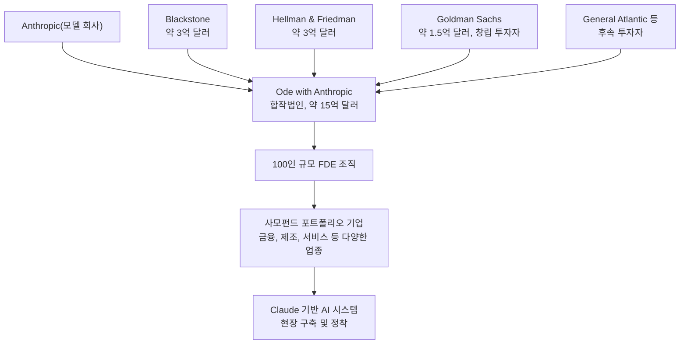
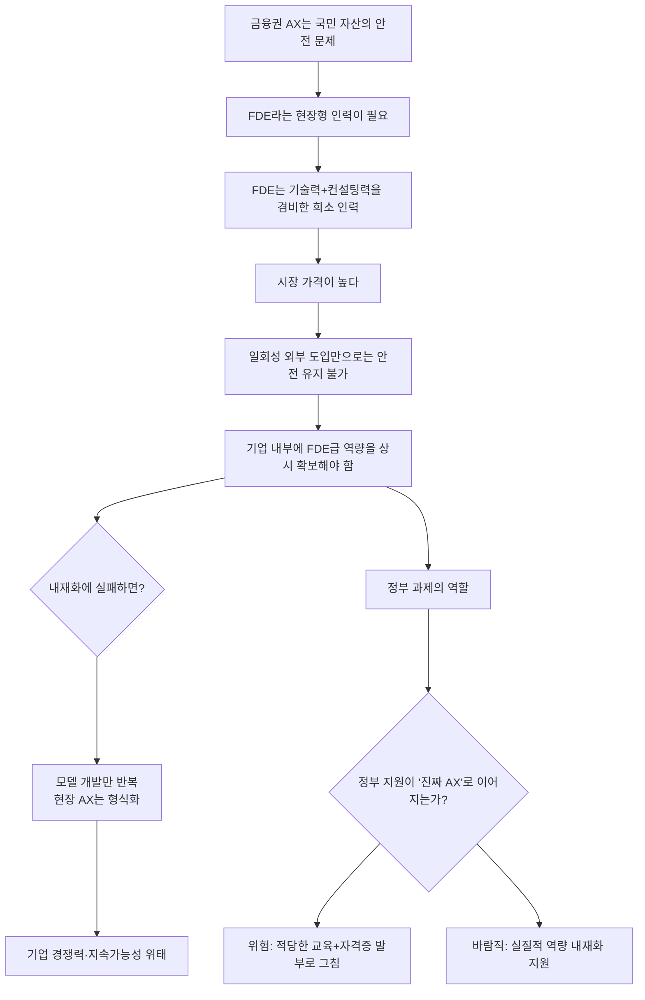
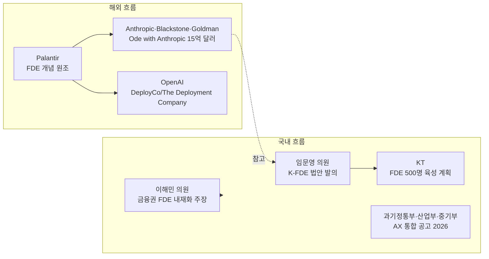

> 
> <FDE는 종합적 능력치를 필요로하는 직군입니다>
> 
> 제가 국회 정무위 상임위장에서 금융권에 FDE와 같은 직군이 빨리 도입되어서 국민의 자금을 안전하게 지킬 수 있도록 해야한다고 말씀드린 바 있습니다. 금융권의 AX, 인공지능 전환은 '안전'과 같은 급의 이야기이기 때문입니다.
> 
> 이때 필요한 FDE(forward deployed engineer)는 이미 앤트로픽과 골드만삭스 등의 관계 (합작법인 설립 포함)에서 보듯 상당 수준의 기술력과 컨설팅 능력을 겸해야 합니다. 이런 능력치를 가진 사람, 시장에 별로 없습니다. 
> 
> 그 말인즉슨, 비쌉니다.
> 
> 도입하는 회사도 한 번 도입하고 말면 안전은 물건너갑니다. 지속적으로 매 순간 그 상태를 유지 혹은 더 좋은 수준으로 끌어올릴 직군을 내부에 두어야 합니다. 
> 
> 그 말인즉슨, 각 회사 또한 자체 AX 능력치를 FDE 과정을 통해 확보해야 합니다.
> 
> 그렇지 않다면 모델만 주구장창 개발되고 실질적인 산업에서의 AX는 기대할 수 없게 되고 AX라는 것이 적당한 수준의 교육만 받고 끝나는, 현장에는 귀찮은 일만 되는 상황이 생기고 그렇게 AI 시대의 경쟁력을 잃어버리는 순간 그 기업의 지속가능성은 위태로와질 수 밖에 없습니다.
> 
> FDE는 종합적 능력치를 필요로하고 반드시 현 상황에서 필요한 직군입니다. 이제 과기정통부를 비롯한 정부 과제는 '진짜' AX를 이뤄낼 고민을 해야하고 FDE 확보는 그 키가 될 것입니다. 
> 
> 이 논의가 정부과제하에서 '적당한 교육'과 '자격증 발부'에 그치는 상황이 되면 안되기에 글을 남겨봅니다.
> 
> https://www.facebook.com/share/p/1arGCpKHbU/
> 

---

## 목차

1. 이 글은 무엇에 관한 이야기인가
2. 글을 쓴 이해민 의원은 누구인가
3. FDE(현장 배치형 엔지니어)란 정확히 무엇인가
4. "앤트로픽과 골드만삭스의 관계"는 사실인가 — 합작법인 오드(Ode) 팩트체크
5. 이해민 의원 주장의 논리 흐름
6. 한국의 FDE·AX 정책은 지금 어디까지 와 있는가
7. 이해민 의원이 우려하는 지점 — "적당한 교육과 자격증 발부"
8. 사실관계와 주장·의견의 구분
9. 참고자료

---

## 1. 이 글은 무엇에 관한 이야기인가

조국혁신당 소속 이해민 국회의원이 개인 페이스북 계정에 올린 글이다. 핵심 주장은 한 문장으로 요약하면 이렇다. 금융권처럼 국민의 자산과 안전이 걸린 산업에서 AI 전환(AX, AI Transformation)을 제대로 이뤄내려면 FDE(Forward Deployed Engineer, 현장 배치형 엔지니어)라는 직군이 반드시 필요한데, 이 직군은 기술력과 컨설팅 능력을 동시에 갖춰야 하는 희소하고 값비싼 인력이라서, 정부가 이를 지원하겠다며 추진하는 정책이 자칫 "적당한 교육을 받고 자격증만 발부하는" 형식적인 사업으로 끝나면 안 된다는 경고다.

글의 흐름을 그대로 따라가면 다음과 같은 순서로 논지가 전개된다. 먼저 자신이 국회 정무위원회에서 금융권에 FDE 같은 직군의 조기 도입이 필요하다고 이미 발언한 적이 있다는 사실을 밝힌다. 이어 FDE라는 개념 자체가 앤트로픽과 골드만삭스의 관계, 특히 합작법인 설립 사례에서 보듯 상당한 기술력과 컨설팅 역량을 동시에 요구하는 희소 직군이라고 설명한다. 그래서 비용이 비쌀 수밖에 없고, 기업이 이런 인력을 한 번만 도입하고 끝내면 안전성이 유지되지 않으므로 각 기업이 자체적으로 FDE급 역량을 내재화해야 한다고 주장한다. 마지막으로 이 흐름이 정부 지원 사업 안에서 형식적인 교육 프로그램과 자격증 발급으로 축소되는 것을 경계해야 한다고 못박는다.

이 문서는 이 글에 담긴 사실관계를 하나씩 검증하고, FDE라는 개념과 앤트로픽-골드만삭스 관계의 실체, 그리고 한국의 관련 정책 동향을 종합적으로 정리한 것이다.

---

## 2. 글을 쓴 이해민 의원은 누구인가

이해민 의원은 1973년생으로, 서강대학교에서 전자계산학 학사와 컴퓨터공학 석사를 마쳤다. 구글 본사와 구글코리아에서 약 15년간 시니어 프로덕트 매니저로 근무하며 검색과 지도 등 AI가 결합된 제품을 다뤘고, 이후 데이터 분석 기업 오픈서베이의 최고제품책임자(CPO)를 지냈다. 2024년 3월 조국혁신당의 영입 인재로 정치에 입문해 비례대표 3번을 받았고, 그해 4월 치러진 제22대 국회의원 선거에서 당선되어 초선 의원이 되었다[1][2].

국회의원이 된 이후 초반에는 과학기술정보방송통신위원회(과방위) 소속으로 활동하며 방송·통신, 정보보호, AI·과학기술, 우주·원자력 등을 담당했다. 그런데 22대 국회 후반기가 시작되면서 소속 상임위원회를 정무위원회로 옮겼다. 이 변화는 2026년 6월 무렵부터 반영된 것으로 확인된다[3]. 정무위원회로 옮긴 배경에 대해 이해민 의원은 언론 인터뷰에서 "인공지능 산업의 기반을 만드는 데 집중했던" 시기에서 "AI를 어떻게 사회에 적용할 것인가"로 정책의 무게중심을 옮기는 것이라고 설명했다. 과방위에서는 AI 산업을 키우는 제도적 틀을 다뤘다면, 정무위원회에서는 금융·개인정보·보안·플랫폼처럼 국민 생활과 직접 맞닿은 영역에서 AI 전환의 안전장치를 만드는 데 집중하겠다는 구상이다[4].

여기서 한 가지 짚고 넘어갈 부분이 있다. 이해민 의원은 글에서 "국회 정무위 상임위장에서" 발언했다고 적었는데, 확인 가능한 공식 자료들은 모두 그의 직함을 정무위원회 "위원"으로 기재하고 있을 뿐, 정무위원회의 "위원장(상임위원장)"으로 기재한 자료는 없다[3][23]. 정무위원회는 금융위원회와 금융감독원, 공정거래위원회 등을 소관하는 상임위원회로, 22대 국회 전반기에는 국민의힘 소속 윤한홍 의원이 위원장을 맡았다[6]. 후반기 원 구성은 여야 간 법제사법위원장 배분을 둘러싼 갈등으로 2026년 6월 말까지 지연되었다는 보도가 있었고[5], 이 시점을 전후해 이해민 의원이 정무위원회로 이동했다. 따라서 글에 쓰인 "상임위장"이라는 표현은 문맥상 정무위원회라는 상임위원회의 회의 자리에서 발언했다는 뜻으로 읽는 것이 정확하며, 그가 정무위원회의 위원장(의장) 직함을 갖고 있다는 의미로 받아들이면 사실관계와 어긋난다. 이 점은 과장이라기보다 일상적인 줄임말 사용에서 비롯된 표현으로 보이지만, 정확성을 기하기 위해 짚어둔다.

정무위원회가 금융위원회와 금감원을 직접 소관하는 위원회라는 사실 자체는 이해민 의원이 금융권 AX와 FDE에 대해 발언할 명분을 뒷받침한다. 실제로 금융위원회는 2026년 2월 정무위원회에 대한 업무보고에서 '생산적 금융, 포용적 금융, 신뢰받는 금융'이라는 세 가지 대전환을 추진 방향으로 제시한 바 있다[27][28].

---

## 3. FDE(현장 배치형 엔지니어)란 정확히 무엇인가

FDE, 즉 Forward Deployed Engineer는 원래 미국의 데이터 분석 기업 팔란티어(Palantir)가 만들어낸 직무 개념이다. 일반적인 소프트웨어 회사가 제품을 만들고 영업팀이 팔면 고객이 알아서 도입하는 방식과 달리, 팔란티어는 자사의 뛰어난 엔지니어를 고객 조직 내부에 직접 파견해 제품과 고객의 실제 업무 환경 사이의 마지막 구간을 코드로 이어주는 방식을 택했다[7][15]. 다시 말해 FDE는 본사가 아니라 고객사 현장에 상주하거나 하이브리드로 결합해, 그 고객의 시스템 안에서 실제로 작동하는 AI 시스템을 직접 설계하고 구축하며 그 결과에 책임을 지는 엔지니어를 뜻한다[8].

이 개념이 최근 다시 크게 주목받는 이유는 생성형 AI 도입의 현실적인 벽 때문이다. 여러 산업 보고서에 따르면 기업들이 시도하는 AI 파일럿 프로젝트의 상당수가 실제 도입까지 이어지지 못하고 좌초하는데, 그 원인은 대개 모델 성능이 아니라 그 모델을 고객의 지저분하고 복잡한 실제 업무 환경에 통합해내는 역량의 부족에 있다는 지적이 반복적으로 나온다[3][4]. 이런 맥락에서 최근에는 팔란티어뿐 아니라 오픈AI와 앤트로픽 같은 최전선 AI 모델 회사들, 그리고 딜로이트나 액센츄어 같은 대형 컨설팅 회사들까지 앞다투어 FDE라는 이름의 직군을 뽑고 있다[8][16]. 흥미로운 점은 같은 FDE라는 직함이라도 회사마다 실제 업무 내용은 상당히 다르다는 것인데, 어떤 곳은 컨설팅에 가깝고 어떤 곳은 순수 엔지니어링에 가깝다는 분석도 있다[5].

이해민 의원이 글에서 지적한 "상당 수준의 기술력과 컨설팅 능력을 겸해야 한다"는 설명은 이런 업계의 일반적인 이해와 일치한다. FDE는 리눅스, 네트워크, 데이터베이스, 보안 같은 기술적 기반 지식은 물론, 고객이 "요청한 것"과 "진짜 필요로 하는 것"을 구분해내는 요구사항 발굴 능력, 그리고 서로 다른 이해관계자들 사이에서 신뢰를 쌓아가는 대면 역량까지 함께 요구되는 복합 직군으로 설명된다[9]. 이 때문에 백엔드, 데브옵스, 데이터 엔지니어 등 인접 분야에서 FDE로 전환하려는 인력을 위한 로드맵 콘텐츠까지 등장할 만큼, 이 직군에 대한 관심과 수요가 빠르게 커지고 있다[10].

---

## 4. "앤트로픽과 골드만삭스의 관계"는 사실인가 — 합작법인 오드(Ode) 팩트체크

이해민 의원의 글에서 가장 구체적인 사실관계 주장은 "앤트로픽과 골드만삭스 등의 관계(합작법인 설립 포함)"라는 대목이다. 이 부분을 검증한 결과, 실제로 존재하는 사건에 근거한 서술로 확인된다. 다만 정확한 구조는 "앤트로픽과 골드만삭스"라는 양자 관계보다는 여러 금융·사모펀드 기관이 함께 참여한 다자간 합작법인이라는 점에서 조금 더 설명이 필요하다.

2026년 5월, 앤트로픽은 블랙스톤(Blackstone), 헬먼앤프리드먼(Hellman & Friedman), 골드만삭스를 창립 파트너로 하는 약 15억 달러(한화 약 2조 원) 규모의 합작법인을 결성한다고 발표했다[11][18]. 자금 구조를 보면 앤트로픽, 블랙스톤, 헬먼앤프리드먼이 각각 약 3억 달러씩을 출자하는 앵커 투자자 역할을 맡았고, 골드만삭스는 창립 투자자로서 약 1억 5천만 달러를 출자했다. 여기에 제너럴 애틀랜틱을 비롯해 아폴로 글로벌 매니지먼트, GIC, 레너드 그린, 세쿼이아 캐피털 등 여러 사모펀드와 헤지펀드가 후속 투자자로 참여했다[12][18].

이 합작법인은 2026년 7월 말 무렵 "오드 위드 앤트로픽(Ode with Anthropic)"이라는 정식 브랜드로 공개되었다. 오드의 핵심은 100명 규모의 현장 배치형 엔지니어(FDE) 조직으로, 참여 사모펀드들이 소유한 포트폴리오 기업들 내부에 직접 들어가 클로드(Claude) 기반의 AI 시스템을 설계하고 구축하며 실제 업무에 정착시키는 역할을 한다[13][14]. 이 조직은 블랙스톤이 이미 포트폴리오 기업 전반에 AI 도입 실험을 진행하며 우수한 성과를 보인 것으로 평가한 소규모 AI 엔지니어링 스타트업 프랙셔널 AI(Fractional AI)를 인수하며 만들어졌다[13][17]. 블랙스톤의 최고운영책임자 겸 사장인 존 그레이는 이 합작법인이 "고숙련 구현 파트너의 수를 늘림으로써 기업의 AI 도입을 가로막는 가장 큰 병목 중 하나를 해소하는 데 도움이 될 것"이라고 밝혔다[18].

정리하면, 이해민 의원이 언급한 "앤트로픽과 골드만삭스의 관계, 합작법인 설립"이라는 서술의 핵심 사실관계, 즉 앤트로픽이 골드만삭스를 포함한 금융 기관들과 함께 FDE 인력을 기업 현장에 배치하는 합작법인을 실제로 설립했다는 부분은 사실로 확인된다. 다만 정확히는 골드만삭스 단독 파트너십이 아니라 블랙스톤, 헬먼앤프리드먼, 골드만삭스 등이 함께 참여한 다자간 구조이며, 오드의 활동 대상도 금융업 자체에 한정되지 않고 이들 사모펀드가 소유한 다양한 업종의 포트폴리오 기업 전반을 아우른다는 점은 원문보다 조금 더 구체적으로 부연할 필요가 있다. 한 산업 분석 자료는 이 합작법인을 "금융 섹터를 우선 겨냥한 기업용 AI 구현 사업"으로 설명하기도 했는데[15], 이는 골드만삭스가 창립 파트너로 참여했고 금융권이 규제와 리스크 관리 요구가 커서 이런 구현 역량에 대한 수요가 특히 크다는 맥락에서 나온 해석으로 보인다.

한편 경쟁사인 오픈AI도 비슷한 구조의 합작법인을 추진하고 있다는 점도 함께 확인된다. TPG, 베인캐피털, 어드벤트 인터내셔널, 브룩필드 등이 참여하는 이 벤처는 오픈AI가 5억 달러를 투자하고 최대 10억 달러를 추가 투자할 수 있는 옵션을 갖는 구조로, 참여 사모펀드들의 투자액을 합치면 약 40억 달러 규모이며 최종적으로는 100억 달러 기업가치를 목표로 한다는 보도가 있다[11]. 즉 이해민 의원이 예로 든 앤트로픽-골드만삭스 사례는 업계 전반에서 벌어지고 있는 "모델 회사가 구현 역량까지 직접 확보하려는" 흐름의 한 사례이며, 결코 예외적인 일회성 사건이 아니라는 점도 함께 이해할 필요가 있다.

---

## 5. 이해민 의원 주장의 논리 흐름

글 전체를 하나의 논리 사슬로 재구성하면 다음과 같다. 먼저 금융권의 AI 전환은 국민 자산의 안전과 직결되는 문제이므로 일반적인 산업 전환과는 다른 무게로 다뤄야 한다는 전제에서 출발한다. 이어서 이런 안전을 실제로 담보하려면 모델을 도입하는 것만으로는 부족하고, 그 모델을 현장에 제대로 정착시키는 FDE라는 인력이 필요하다는 주장으로 이어진다. FDE는 기술력과 컨설팅 역량을 함께 갖춰야 하는 희소 인력이기 때문에 시장에서 매우 비싼 값에 거래될 수밖에 없고, 이 때문에 기업이 외부 인력을 일회성으로 들여오는 방식으로는 지속적인 안전성을 담보할 수 없다는 논리가 뒤따른다. 그래서 각 기업이 이런 역량을 내재화해야 하며, 이것이 안 될 경우 AI 모델 개발만 계속되고 실제 산업 현장에서의 AI 전환은 형식적인 수준에 머무를 것이라는 우려로 이어진다. 마지막으로 이 모든 논리는 정부 지원 사업이 자칫 "적당한 교육"과 "자격증 발급"이라는 손쉬운 방식으로 축소될 위험에 대한 경고로 마무리된다.

이 논리 사슬 자체는 앞서 확인한 산업 동향, 즉 AI 도입 실패의 상당수가 모델 성능보다 구현 역량 부족에서 비롯된다는 업계의 일반적 진단과 부합한다. 다만 이 글은 하나의 정치인이 자신의 정책적 관점에서 쓴 주장이라는 점, 그리고 "FDE 확보가 진짜 AX의 핵심 열쇠가 될 것"이라거나 "정부 과제가 자격증 발부에 그치면 안 된다"는 부분은 검증 가능한 사실 명제라기보다는 정책 방향에 대한 의견이자 경고라는 점을 구분해서 읽을 필요가 있다.

---

## 6. 한국의 FDE·AX 정책은 지금 어디까지 와 있는가

이해민 의원이 우려하는 "정부 과제 안에서의 형식화" 문제는 실제로 이미 한국 정치권과 산업계에서 구체적인 논의로 옮겨가고 있는 사안이다. 몇 가지 사례를 살펴보면 이 우려가 막연한 걱정이 아니라 현재 진행형의 정책 논쟁이라는 점을 알 수 있다.

첫째, 국회 차원에서는 더불어민주당 임문영 의원이 자신의 1호 법안으로 '산업디지털전환촉진법 일부개정안'을 발의했다. 이 법안은 청년 AI 전문인력을 제조업 현장에 배치해 숙련 인력과 협업하도록 하는 이른바 'K-FDE' 체계 구축을 골자로 하며, 법안 설명 자료에서 팔란티어가 운영해온 FDE 제도를 참고했다고 명시하고 있다[37][40]. 이 법안을 계기로 열린 정책개발간담회에서는 한국산업기술진흥원장과 대학 교수 등이 참여해 제조업 디지털 전환을 위한 K-FDE 구축 방안을 논의했다[37].

둘째, 산업계에서는 통신사 KT가 향후 2년 내 500명 이상의 FDE를 직접 육성하겠다는 계획을 발표했다. KT가 정의하는 FDE는 고객사의 업무 환경과 과제를 기술·데이터 기반으로 직접 파악하고, AX 프로젝트의 제안부터 구축·운영까지 전 과정을 현장에서 주도하는 엔지니어를 뜻하며, 이 인력들은 대학병원을 포함한 의료 현장의 AX 프로젝트에도 투입될 예정이라고 보도되었다[39][41].

셋째, 정부 차원에서는 과학기술정보통신부가 2026년 발표한 '대한민국 인공지능행동계획(2026~2028)'에서 AI 융합 인재 양성을 국가 전략의 핵심 축 가운데 하나로 제시하고 있으며, 대학과 대학원을 중심으로 한 고급 인재 양성 경로를 강조하고 있다[36]. 아울러 과기정통부, 산업통상부, 중소벤처기업부는 2026년 산업·제조 분야 AX 사업을 통합 공고하는 등 범부처 차원의 AX 지원을 확대하고 있다[42]. 다만 이들 자료에서 확인되는 정부 계획은 대학 중심의 장기 인재 양성이나 산업·제조업 전반에 대한 자금·컨설팅 지원에 방점이 찍혀 있으며, 이해민 의원이 글에서 구체적으로 지적한 "FDE 자격증 발부" 방식의 사업이 이미 확정되어 시행 중이라는 근거는 이번 조사에서 확인되지 않았다. 즉 이 부분은 향후 관련 논의가 어떤 방향으로 구체화될지에 대한 이해민 의원 본인의 우려 섞인 전망으로 이해하는 것이 정확하다.

넷째, 이런 정부 주도 FDE 정책에 대한 신중론도 이미 언론을 통해 제기되고 있다. 한 매체는 임문영 의원의 K-FDE 법안을 다루면서 "제도가 정부 재정에 의존하는 단기 인력지원 사업에 그칠 가능성은 경계할 필요가 있다"고 지적하며, "기업이 해결해야 할 구체적인 과제 없이 인력을 먼저 배치하거나 참여기업 수와 배치인원 자체를 성과로 평가할 경우 정책 취지와 달리 사업 효과가 제한될 수 있다"고 짚었다[40]. 이는 이해민 의원이 글에서 표현한 "적당한 교육과 자격증 발부에 그치는 상황"에 대한 우려와 사실상 같은 지점을 겨냥한 지적이며, 이 우려가 이해민 의원 개인만의 시각이 아니라 정책 현장에서 이미 공유되고 있는 문제의식이라는 점을 뒷받침한다.

---

## 7. 이해민 의원이 우려하는 지점 — "적당한 교육과 자격증 발부"

이해민 의원 글의 마지막 문장, "이 논의가 정부과제하에서 '적당한 교육'과 '자격증 발부'에 그치는 상황이 되면 안되기에 글을 남겨봅니다"는 이 글 전체의 실질적인 메시지에 가깝다. 이 우려를 이해하려면 한국의 여러 국가 자격·인증 제도가 실제 현장 역량과 괴리되는 경우가 있었다는 일반적인 정책 비판의 맥락, 그리고 앞서 살펴본 것처럼 FDE가 원래 "고객 현장에서 책임지고 결과를 만들어내는" 실전형 직무로 정의된다는 점을 함께 놓고 봐야 한다.

만약 정부 지원 사업이 단기간의 표준화된 교육과정을 이수한 사람에게 수료증이나 자격증을 발급하는 방식으로 설계된다면, 이는 FDE라는 직무가 본래 요구하는 복합적이고 현장 밀착적인 역량, 즉 기술 구현 능력과 이해관계자 조율 능력, 그리고 실제 결과에 대한 책임을 지는 경험치를 형식적인 이수 시간으로 대체하는 결과를 낳을 수 있다. 이렇게 되면 자격증을 가진 인력은 늘어나도 실제로 금융권 시스템 안에서 안전하게 AI를 정착시킬 수 있는 인력은 늘지 않는 괴리가 생길 수 있다는 것이 이해민 의원의 문제의식으로 읽힌다. 이런 우려가 완전히 새로운 것은 아니며, 앞서 6장에서 살펴본 것처럼 K-FDE 법안에 대한 언론의 신중론에서도 "참여기업 수와 배치인원 자체를 성과로 평가할 경우" 정책 효과가 제한될 수 있다는 유사한 지적이 이미 나온 바 있다[40].

---

## 8. 사실관계와 주장·의견의 구분

아래는 이 글에 담긴 서술들을 사실 확인이 가능한 부분과 이해민 의원 개인의 주장·의견인 부분으로 나누어 정리한 것이다.

**사실로 확인되는 부분**

이해민 의원이 국회의원이며 22대 국회 후반기에 정무위원회 소속으로 활동하고 있다는 점, 정무위원회가 금융위원회와 금융감독원을 소관한다는 점은 공식 자료로 확인된다[3][23][56]. FDE(Forward Deployed Engineer)라는 직무 개념이 팔란티어에서 시작되어 최근 오픈AI, 앤트로픽 등 AI 모델 회사들과 대형 컨설팅사, 그리고 한국의 통신사 등으로 빠르게 확산되고 있다는 점도 다수의 자료로 확인된다[7][8][39]. 앤트로픽이 블랙스톤, 헬먼앤프리드먼, 골드만삭스 등과 함께 약 15억 달러 규모의 합작법인(오드, Ode with Anthropic)을 설립해 FDE 인력을 기업 현장에 배치하고 있다는 점도 사실로 확인된다[11][13][18].

**의견 또는 주장으로 봐야 할 부분**

FDE 확보가 "정부 과제의 키가 될 것"이라는 전망, 그리고 각 기업이 FDE 역량을 자체적으로 내재화하지 않으면 "그 기업의 지속가능성이 위태로워질 수밖에 없다"는 단정적 서술은 검증 가능한 사실 명제가 아니라 이해민 의원 개인의 정책적 판단과 전망에 해당한다. 또한 향후 정부 지원 사업이 실제로 "적당한 교육과 자격증 발부"에 그칠 것이라는 서술은 아직 발생하지 않은 미래 상황에 대한 우려 섞인 예측이며, 현재까지 확인되는 정부의 공식 AX 인재 정책 자료에서 그런 형태로 사업이 확정되었다는 근거는 확인되지 않는다[36][42].

**표현상 다소 부정확할 수 있는 부분**

"국회 정무위 상임위장에서"라는 표현은 문맥상 정무위원회 회의 자리에서 발언했다는 뜻으로 해석되며, 확인 가능한 공식 자료들은 이해민 의원을 정무위원회의 "위원장"이 아니라 "위원"으로 기재하고 있다[3][23]. "앤트로픽과 골드만삭스 등의 관계"라는 서술은 실제로는 골드만삭스 단독이 아니라 블랙스톤, 헬먼앤프리드먼 등이 함께 참여한 다자간 합작법인 구조이며, 그 활동 대상도 금융업에 국한되지 않고 참여 사모펀드들의 다양한 포트폴리오 기업 전반을 아우른다는 점에서, 글의 서술은 대체로 정확하지만 세부 구조는 조금 더 넓게 이해할 필요가 있다[12][13][18].

---

## 9. 참고자료

[1] 위키백과, "이해민 (1973년)", https://ko.wikipedia.org/wiki/이해민_(1973년)

[2] 나무위키, "이해민", https://namu.wiki/w/이해민

[3] 국회도서관, "이해민 의원 - 국회의원 정책자료", https://ampos.nanet.go.kr/activityCongressDetail.do?congress_no=G1899977

[4] 블로터, "과방위서 정무위로 간 이해민 의원…금융·보안·플랫폼 AI 안전판 짠다", https://www.bloter.net/news/articleView.html?idxno=670590

[5] 나무위키, "상임위원회", https://namu.wiki/w/상임위원회

[6] 한국금융신문, "국회 정무위원회 위원장에 윤한홍…정무위 24명 구성 [22대 국회]", https://www.fntimes.com/html/view.php?ud=202406271540062175179ad43907_18

[7] Chaos and Order, "FDE(Forward Deployed Engineer)란 무엇인가", https://www.youngju.dev/blog/career/2026-08-12-fde-what-is-forward-deployed-engineer

[8] Chaos and Order, "FDE 완전 해부", https://www.youngju.dev/blog/2026-07-07-forward-deployed-engineer

[9] Chaos and Order, "Forward Deployed Engineer의 크래프트", https://www.youngju.dev/blog/2026-07-15-fde-craft-deep-dive

[10] Chaos and Order, "백엔드·데브옵스·데이터 엔지니어에서 FDE로", https://www.youngju.dev/blog/career/2026-08-12-fde-career-transition

[11] Yahoo Finance/Quartz, "Anthropic forms $1.5B joint venture with Blackstone, Goldman Sachs", https://finance.yahoo.com/sectors/technology/articles/anthropic-forms-1-5b-joint-123147935.html

[12] TechCrunch, "Anthropic and OpenAI are both launching joint ventures for enterprise AI services", https://techcrunch.com/2026/05/04/anthropic-and-openai-are-both-launching-joint-ventures-for-enterprise-ai-services/

[13] MarketScale, "Anthropic and Blackstone's $1.5B Ode bets enterprise AI value lives in implementation, not models", https://www.marketscale.com/industries/software-and-technology/anthropic-and-blackstones-15b-ode-bets-enterprise-ai-value-lives-in-implementation-not-models

[14] MarketScale, "Anthropic and Blackstone launch $1.5B AI implementation firm Ode", https://www.marketscale.com/industries/software-and-technology/anthropic-and-blackstone-launch-15b-ai-implementation-firm-ode-betting-enterprise-deployment-beats-model-building

[15] MindStudio, "Anthropic's $1.5B Enterprise JV: 6 Things You Need to Know About the Blackstone-Goldman Deal", https://www.mindstudio.ai/blog/anthropic-1-5b-enterprise-jv-blackstone-goldman-sachs

[16] MarketScale, "Anthropic and Blackstone's $1.5B Ode venture signals that AI implementation is the enterprise battleground", https://www.marketscale.com/industries/software-and-technology/anthropic-and-blackstones-15b-ode-venture-signals-that-ai-implementation-is-the-enterprise-battleground-not-model-quality

[17] MarketScale, "Anthropic and Blackstone's $1.5B venture Ode bets AI implementation beats model selection", https://www.marketscale.com/industries/software-and-technology/anthropic-and-blackstones-15b-venture-ode-bets-ai-implementation-beats-model-selection-for-enterprise-value

[18] Private Banker International, "Blackstone and Goldman back Anthropic's $1.5bn AI joint venture", https://www.privatebankerinternational.com/news/blackstone-goldman-anthropic-joint-venture/

[23] 국회도서관 AI시사분석 아르고스, 이해민 의원 프로필, https://argos.nanet.go.kr/main/mobile/personalizeGuest.do?deptCd=9771418&pageIndex=1

[27] 금융위원회, "보도자료 - 위원회 소식", https://www.fsc.go.kr/no010101

[28] 김·장 법률사무소, "2026년도 금융위원회 및 금융감독원 업무계획의 주요 내용 및 시사점", https://www.kimchang.com/ko/insights/detail.kc?sch_section=4&idx=34323

[36] 국가인공지능전략위원회·과학기술정보통신부, "대한민국 인공지능행동계획(2026~2028)", https://smartcity.go.kr/wp-content/uploads/2026/03/

[37] 이데일리, "임문영 1호 법안 'K-FDE'…청년 AI 전문인력 제조업 현장 배치", https://edaily.co.kr/News/Read?mediaCodeNo=257&newsId=06671526645547320

[39] 아시아경제, "KT, 현장 엔지니어 500명 육성…'AX 경쟁력은 현장'", https://view.asiae.co.kr/article/2026081720095082542

[40] 에너지데일리, "제조현장에 청년 AI 전문인력 배치 추진…숙련기술과 디지털 역량 연계", https://www.energydaily.co.kr/news/articleView.html?idxno=202289

[41] 의약일보, "KT, 대학병원 AX 난제 푼다…FDE 500명 육성", https://www.medicaldaily.co.kr/post/22136

[42] 산업통상부, "2026년도 과기정통부-산업부-중기부 주요 AX 사업 통합 공고", https://motir.go.kr

[56] 위키백과, "대한민국 국회 정무위원회", https://ko.wikipedia.org/wiki/대한민국_국회_정무위원회

*본 문서는 2026년 8월 19일 기준으로 검색·확인 가능한 공개 자료를 근거로 작성되었으며, 이후 국회 원 구성이나 관련 정책, 기업 계획이 변경될 수 있습니다.*
