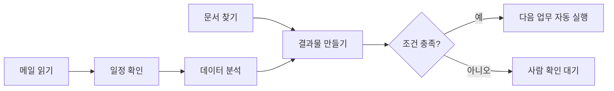
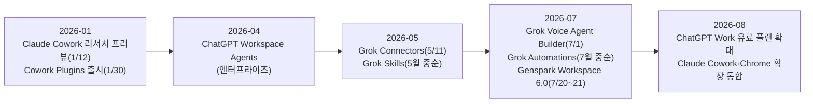

## 관련글

[**AI 에이전트의 변화 - 클로드 코드만이 답이 아니다.**](https://www.facebook.com/share/1ECNNSSNWP/)

## 1. 이 글은 무엇에 관한 이야기인가

원문은 Claude Cowork, ChatGPT Work, Grok, Genspark라는 네 가지 AI 업무 에이전트 서비스를 나란히 써보고 남긴 소감이다. 핵심 주장은 하나다. 얼마 전까지 "AI 에이전트를 만든다"고 하면 개발자가 코드를 짜는 일이었는데, 이제는 개발 지식이 없는 일반 사용자도 자신의 업무를 설명하고 회사 도구를 연결하는 것만으로 에이전트를 갖게 되는 국면으로 넘어가고 있다는 것이다. 즉 무게중심이 "개발"에서 "업무 설계"로 옮겨가고 있다는 진단이다.

이 글에서는 원문이 언급한 네 서비스 각각이 실제로 어떤 회사가 언제 무엇을 내놓았는지, 최신 발표 자료와 보도를 근거로 하나씩 짚어보고, 마지막에 네 서비스를 관통하는 공통 패턴과 그것이 시사하는 바를 정리한다. 확인되지 않은 수치나 추측은 담지 않았고, 출처가 갈리는 부분은 그 사실 자체를 밝혔다.

## 2. 핵심 변화: 개발자의 도구에서 현업 담당자의 도구로

과거의 에이전트 제작은 VSCode, Python, API 키 발급, 서버 구축, 데이터베이스 설계 같은 개발 인프라를 전제로 했다. 지금 등장한 서비스들은 출발점 자체가 다르다. 사용자는 자신이 어떤 일을 하는지 설명하고, 회사에서 이미 쓰고 있는 파일과 앱을 연결하고, 반복되는 업무 규칙을 알려주는 것으로 시작한다. 코드를 짜는 능력보다 자기 업무를 잘게 쪼개서 설명하는 능력, 그리고 AI에게 어떤 역할과 권한을 줄지 판단하는 능력이 더 중요해진 것이다.

네 서비스는 이 방향으로 가고 있다는 공통점을 가지면서도 접근 방식은 뚜렷하게 다르다. 아래에서 하나씩 살펴본다.

## 3. Claude Cowork — 업무 인수인계형 동료

Anthropic은 2026년 1월 12일 Claude Cowork를 리서치 프리뷰로 처음 공개했다. 초기에는 애플 실리콘 맥 중심이었으나, 이후 2월 중순 윈도우와 인텔 기반 맥까지 확장되면서 Pro, Max, Team, Enterprise 모든 유료 플랜에서 전체 기능을 동일하게 쓸 수 있게 됐다.

Cowork의 정체성은 "내 컴퓨터 안에서 같이 일하는 동료"에 가깝다. 사용자가 작업 폴더를 지정하면 Claude가 그 안의 파일과 문서를 읽고, 필요하면 브라우저를 열어 클릭·입력·탐색까지 직접 수행하며 결과물을 만든다. Max·Team 플랜과 순차 적용 중인 Pro 플랜, 그리고 관리자가 허용한 Enterprise 워크스페이스에서는 크롬 사이드패널 안에서 곧바로 Cowork 세션을 실행할 수도 있다. 세션은 Anthropic 클라우드의 격리된 환경(베타)에서 돌아가며 계정에 저장된다.

이 서비스를 "회사가 일하는 방식 자체를 가르치는 도구"로 만드는 핵심 장치가 Plugins다. Anthropic은 2026년 1월 30일 플러그인 지원을 정식 발표했는데, 플러그인은 스킬(Skill), 커넥터(MCP 서버), 슬래시 커맨드, 서브에이전트를 하나의 패키지로 묶어 Claude를 특정 직무의 전문가로 만드는 기능이다. 출시 당시 생산성·영업·법무·재무·인사·엔지니어링 등 11종의 오픈소스 플러그인이 공개됐고, 2월 24일에는 9종이 추가로, 4월 17일에는 프롬프트만으로 프로토타입과 슬라이드를 만드는 Claude Design 플러그인이 더해졌다. 여기에 더해 사용자는 Projects 기능으로 업무별 워크스페이스를 나눠 파일·맥락·지침·메모리를 따로 관리할 수 있고, Scheduled tasks로 정해진 시각에 자동 실행되는 반복 업무를 설정할 수 있다. 기본 내장 스킬로는 pdf, docx, pptx, xlsx, canvas-design 등이 있어 "워드 문서 만들어줘"라고 말하면 해당 스킬이 자동으로 로드된다.

가장 최근 소식으로는 Claude in Chrome 확장 프로그램에 Cowork 기능이 통합된 사례가 있다(2026년 8월 초 보도). 이제 브라우저 안에서도 별도 설정 없이 스킬·플러그인·커넥터가 그대로 작동해, Claude in Chrome이 리서치를 수행하면 Cowork가 그 결과를 엑셀 파일, 파워포인트 슬라이드, 보고서로 바로 정리해준다.

## 4. ChatGPT Work와 Workspace Agents — 범용 업무 운영형

OpenAI 쪽은 성격이 다른 두 기능이 함께 움직이고 있어 구분해서 볼 필요가 있다.

**ChatGPT Work**는 더 길고 복잡한 작업을 처리하는 범용 에이전트다. 웹에서 조사하고 분석하며, 연결된 앱과 파일을 넘나들면서 문서, 스프레드시트, 프레젠테이션, 보고서, 웹사이트(Sites)까지 완성된 결과물을 만들어낸다. 작업이 진행되는 동안 사용자는 진행 상황을 확인하고 질문에 답하거나 방향을 바꿀 수 있고, 중요한 행동은 승인을 거치게 되어 있다. 여기에 Scheduled Tasks를 붙이면 한 번 실행, 반복 실행, 특정 조건이 되면 실행, 변화를 계속 감시하는 방식까지 자동화할 수 있다. Work는 무료 플랜과 Go 플랜을 제외한 유료 플랜에 순차적으로 열리고 있으며, Pro·Pro Lite·Enterprise·Edu 사용자가 먼저 접근권을 받았고 Plus·Business 사용자는 뒤이어 확대되는 중이다(2026년 7월 말 기준). 참고로 과거에 있던 별도의 "ChatGPT agent" 기능은 종료됐고, 그 역할을 Work가 이어받았다.

**Workspace Agents**는 이와 별도로 기업 환경을 위해 만들어진 기능으로, 2026년 4월 무렵부터 엔터프라이즈 워크스페이스에 도입되기 시작해 이후 Business 워크스페이스로 순차 확대되고 있다. 관리자나 사용자가 에이전트 빌더에서 Google Drive, Google Calendar, Slack, SharePoint 같은 앱과 도구를 연결하고, 커스텀 MCP 서버와 스킬, 참고 파일을 추가해 특정 업무 전용 에이전트를 만든다. 완성된 에이전트는 미리보기로 점검한 뒤 게시하고, 워크스페이스 안에서 개인·링크·디렉터리 형태로 공유할 수 있으며, 정해진 일정으로 실행되거나 연동된 Slack 채널에 상주하며 직원 질문에 실시간으로 답하는 형태로도 쓰인다. 내부 시스템에서 예약 작업이나 지원 도구를 통해 API로 에이전트를 직접 호출하는 것도 가능하다. 관리자는 에이전트 제작·게시·Slack 사용 권한을 통제할 수 있다.

두 기능을 관통하는 배경에는 OpenAI의 Plugin Directory가 있다. 여기에는 Gmail, Slack, Salesforce 같은 서비스를 MCP 서버로 연결하는 앱과, 지침과 참고자료를 묶은 스킬이 결합된 형태로 1,000개가 넘는 플러그인이 등록되어 있다.

## 5. Grok — 스킬과 자동화 기반의 전문 에이전트형

xAI는 2026년 한 해 동안 짧은 간격으로 관련 기능을 연달아 내놓았다. 5월 11일에는 일상적으로 쓰는 앱을 Grok에 연결하는 Connectors가 출시됐고, 이어 5월 중순(매체별로 5월 13일에서 22일 사이로 보도되어 정확한 하루를 특정하기는 어렵다) Grok Skills가 정식 발표됐다. Skills는 마크다운 지침과 스크립트, 참고자료를 묶은 재사용 가능한 워크플로우 패키지로, 한 번 만들어두면 이후 모든 대화에서 그대로 불러 쓸 수 있고 .zip, .skill, .md 파일로 가져오기도 가능하다. 이 기능은 SuperGrok과 SuperGrok Heavy 구독자에게만 열려 있다. 같은 시기 Grok 4.3과 함께 워드, 파워포인트, 엑셀, PDF 파일을 대화 안에서 바로 만들어 내려받는 문서 생성 기능도 강화됐다.

7월에 들어서는 두 가지 기능이 추가됐다. 7월 1일에는 Voice Agent Builder가 베타로 공개됐는데, 자연어로 통화 흐름을 설명하면 약 2분 만에 실제로 전화를 받는 음성 에이전트가 만들어지는 노코드 도구다. 별도의 음성인식·언어모델·음성합성 세 단계를 이어붙이는 방식이 아니라 하나의 음성-음성 모델로 처리해 응답 속도가 1초 미만이라는 점을 특징으로 내세우며, 요금은 음성 포함 분당 0.05달러, 여기에 전화망을 쓰면 분당 0.01달러가 추가된다. 25개 이상 언어를 통화 중간에도 바꿔가며 지원하고, 80개 이상의 목소리와 2분 분량의 샘플만으로 만드는 음성 복제 기능도 제공하며, 전화 연결·지식 검색·외부 도구·안전 규칙·MCP 연결·통화 기록 검토까지 한 화면에서 설정한다. 다만 이 성능 비교 수치는 xAI가 자체적으로 설계하고 시행한 벤치마크(τ-voice Bench) 결과이며 독립적인 재현 검증은 아직 이뤄지지 않았다는 점은 짚어둘 필요가 있다.

7월 16일 전후로는 기존의 예약 실행 기능이던 Tasks가 Automations로 확장 개편됐다. 사용자가 지침을 한 번 설명한 뒤 한 번만·매일·평일에만·매주·매월·매년 같은 일정으로 실행하거나, 특정 조건의 이메일이 도착했을 때 실행하도록 트리거를 걸 수 있다. Automations는 Skills와 Connectors(Slack, Google Workspace, GitHub, Airtable, Salesforce 등)를 함께 붙일 수 있어, 예를 들어 Airtable에서 데이터를 가져와 요약한 뒤 Slack 채널에 올리는 흐름을 사람 개입 없이 돌릴 수 있다. 예약 실행 자체는 별도 결제 없이 모든 사용자에게 열려 있고, 이메일 트리거 기능만 SuperGrok 구독이 필요하다.

이 밖에 개발자를 겨냥한 터미널 기반 코딩 에이전트 Grok Build, 그리고 여러 앱을 넘나드는 클라우드 워크스페이스 성격의 Grok Bot도 최근 함께 출시되며 Grok 생태계를 넓히고 있다.

## 6. Genspark — 멀티 에이전트 결과물 제작형

Genspark는 하나의 AI에 모든 기능을 몰아넣기보다, 기억·판단·실행·협업을 층위별로 나누는 구조를 택했다. 이 구조는 2026년 7월 20일 뉴욕증권거래소에서 처음 공개되고 다음 날인 7월 21일 도쿄에서 정식 발표된 Genspark AI Workspace 6.0으로 구체화됐다.

가장 밑단에 있는 것이 SecondBrain이다. 이메일, 회의 내용, 메신저 대화, 문서, 연결된 앱의 정보를 하나의 지속적인 맥락으로 모으는 개인 메모리 계층으로, Genspark 안에서 작업하거나 연동된 도구를 쓸 때마다 자동으로 갱신된다. 이 소프트웨어를 보완하는 첫 하드웨어 제품도 함께 나왔는데, 이름은 SecondBrain Note로 카드 두께의 음성 녹음기다. 버튼 한 번으로 최대 35시간까지 녹음할 수 있고, 화면 밖에서 이뤄지는 대면 회의 내용을 자동으로 텍스트화해 SecondBrain에 반영한다. 가격은 199달러다.

이 메모리 위에서 판단하고 실행하는 주체가 Super Agent다. 연결된 앱과 데이터, 그리고 SecondBrain이 쌓아둔 맥락을 함께 참고해 리서치, 회의 준비, 반복 업무 같은 작업을 실제로 수행한다. 사용자가 워크플로우를 한 번 가르치면 이를 스킬로 저장해 이후에 재실행하거나 팀원과 공유할 수 있다. 실제 결과물은 그 위층에 있는 전문 스위트에서 나오는데, Slides, Sheets, Docs로 구성된 Office Suite와 이메일 클라이언트인 GenMail, 디자인 도구인 Genspark Design, 코드와 대시보드를 만드는 Genspark Code·AgentBase 등이 여기에 해당한다. GenMail은 사용자의 문체를 학습해 답장 초안을 작성하고 중요한 메일을 우선적으로 보여주며, 하루를 시작하기 전 아침 브리핑을 제공한다.

가장 위층은 협업 계층인 GenTeam이다. 슬랙과 비슷한 채널 기반 화면에서 사람과 AI 에이전트가 같은 대화 공간에 함께 들어가 일하는데, 특징적인 부분은 Genspark 자체 에이전트뿐 아니라 Codex나 Claude 같은 외부의 고성능 에이전트도 채널에 초대해 마케팅 담당, 디자인 담당 같은 역할과 전문성을 부여할 수 있다는 점이다. Workspace 6.0에서 새로 나온 기능 대부분은 무료 플랜에서도 쓸 수 있으며, SecondBrain Note 같은 하드웨어만 별도로 구매하면 된다. Genspark 측은 최근 일본 시장이 매출 성장을 이끌고 있다고 밝히며 향후 3년간 일본 시장에 1억 달러를 투자하겠다는 계획도 함께 내놓았다.

## 7. 네 서비스를 관통하는 공통점: Connectors, Plugins, Skills, MCP

이름은 서비스마다 다르지만 구조는 놀랍도록 닮았다. 반복되는 업무 지침을 한 번 가르쳐두면 이후에도 재사용되는 "스킬" 개념, 회사가 이미 쓰고 있는 도구(Drive, Gmail, Calendar, Slack, GitHub, SharePoint 등)를 표준화된 방식으로 연결하는 "커넥터·MCP" 개념, 그리고 정해진 시각이나 조건이 되면 사람 없이도 실행되는 "예약·자동화" 개념이 Claude Cowork, ChatGPT Work·Workspace Agents, Grok, Genspark 모두에 공통으로 들어 있다. MCP(Model Context Protocol)는 원래 Anthropic이 제안한 개방형 연결 규격인데, 지금은 경쟁사들도 이를 지원하거나 유사한 커넥터 구조를 갖추는 방향으로 수렴하고 있다.

이 변화의 의미는 단순하다. 예전에는 AI를 쓰려면 회사 데이터를 AI 쪽으로 옮겨야 했다면, 지금은 AI가 회사가 이미 일하고 있는 공간—문서함, 메일함, 일정, 협업 채널—으로 직접 들어온다. 아래 흐름은 이 변화를 단순화한 것이다.

업계 통계도 이 흐름을 뒷받침한다. 시장조사 업체 가트너는 2028년까지 기업용 소프트웨어의 33%에 에이전트형 AI가 포함될 것으로 내다봤는데, 이는 2024년 기준 1%에도 못 미치던 수준에서 크게 뛰는 것이다. 다만 같은 보도에서 인용된 조사에 따르면 2025년 중반 기준 기업의 79%가 에이전트형 AI를 실험해봤지만 실제로 완전한 프로덕션 단계까지 간 비율은 8.6%에 그쳐, 대다수가 아직 시범 운영 단계에 머물러 있다는 점도 함께 확인됐다(reworked.co, 2026년 2월 18일 보도).

## 8. 2026년 타임라인으로 보는 출시 흐름

## 9. 네 서비스 한눈에 비교하기

| 구분 | Claude Cowork | ChatGPT Work / Workspace Agents | Grok | Genspark AI Workspace 6.0 |
|---|---|---|---|---|
| 개발사 | Anthropic | OpenAI | xAI | Genspark |
| 첫 출시 시점 | 2026.1.12 리서치 프리뷰 | Work: 2026년 7월 말부터 유료 플랜 순차 확대 / Workspace Agents: 2026년 4월경 엔터프라이즈 시작 | Connectors 5/11, Skills 5월 중순, Voice Agent Builder 7/1, Automations 7월 중순 | 2026.7.20(뉴욕 프리뷰)~7.21(도쿄 발표) |
| 성격 | 업무 인수인계형 — 내 컴퓨터 안에서 함께 일하는 동료 | 범용 업무 운영형 — 리서치·실행·결과물·자동화를 한 흐름으로 | 스킬·자동화 기반 전문 에이전트형 | 멀티 에이전트 결과물 제작형(기억·판단·실행·협업 4계층) |
| 맞춤화 도구 | Projects, Global 성격의 지침, Skills, Plugins(스킬+커넥터+슬래시커맨드+서브에이전트) | Skills, Custom MCP, 앱 연결(Drive·Calendar·Slack·SharePoint) | Skills(.zip/.skill/.md 임포트 가능), Connectors | Skills(워크플로우를 가르치면 저장), SecondBrain 데이터 연결 |
| 자동화 | Scheduled tasks | Scheduled Tasks(1회·반복·트리거·모니터링), API 트리거 | Automations(예약 또는 이메일 트리거) | Workflows / AgentBase |
| 특이 기능 | 크롬 확장 통합, 클라우드 격리 환경에서 실행(베타) | Workspace Agents는 Slack 채널에 상주하며 응답, 버전 이력·분석 제공 | Voice Agent Builder(노코드 전화 상담원, 분당 0.05달러) | SecondBrain Note 하드웨어 녹음기(199달러), GenTeam(사람+외부 에이전트 채널 협업) |
| 이용 조건 | Pro 이상 유료 플랜 | Work는 무료·Go 제외 유료 플랜 / Workspace Agents는 Business·Enterprise | Skills·이메일 트리거는 SuperGrok, 예약 자동화는 무료 사용자도 가능 | 신규 기능 대부분 무료 플랜에서 이용 가능(하드웨어는 별도 구매) |

## 10. 시사점 — 앞으로 필요한 능력은 무엇인가

네 서비스를 나란히 보면 "어떤 모델이 가장 똑똑한가"보다 "무엇과 연결되는가, 어떤 데이터를 쓸 수 있는가, 어디까지 행동할 수 있는가, 회사의 업무 방식을 얼마나 쉽게 가르칠 수 있는가"가 경쟁의 축으로 자리 잡아가는 모습이 보인다. Claude Cowork는 플러그인으로 직무를, ChatGPT는 Workspace Agents로 조직 전체의 워크플로우를, Grok는 스킬과 자동화·음성 에이전트로 개인 생산성의 영역을, Genspark는 지속적인 기억 계층 위에서 여러 결과물 제작 도구를 동시에 확장하고 있다. 접근은 다르지만 목적지는 비슷하다. 사람이 매번 맥락을 설명하지 않아도 AI가 이미 회사가 일하는 공간 안에서 스스로 다음 일을 이어가는 것이다.

이런 흐름에서 예전에는 에이전트를 만드는 사람이 곧 개발자였다면, 지금은 자기 일을 가장 잘 아는 사람이 직접 자신의 에이전트를 설계하는 환경이 만들어지고 있다. 앞으로 요구되는 능력도 달라진다. 에이전트를 개발하는 기술적 능력보다 자기 업무를 잘게 나눠 설명하는 능력, AI에게 적절한 역할과 권한을 부여하는 판단력, 회사의 데이터와 도구를 안전하게 연결하는 감각, 그리고 AI가 만든 결과물을 검수하는 능력이 더 중요해지고 있다.

---

## 출처

- Anthropic, "Anthropic Rolls Out Plugins for Claude Cowork Workflows" 관련 보도(reworked.co, 2026-02-18)
- Claude Cowork 공식 안내(Anthropic Help Center, support.claude.com, 관련 문서 다수)
- "Customize Cowork with plugins"(claude.com/blog/cowork-plugins, 2026-01-30)
- "Anthropic brings Claude Cowork to its Chrome extension"(the-decoder.com, 2026-08 초)
- "ChatGPT Business - Release Notes"(OpenAI Help Center, help.openai.com)
- "ChatGPT Workspace Agents for Enterprise and Business"(OpenAI Help Center)
- "Introducing workspace agents in ChatGPT"(openai.com, OpenAI 공식 블로그)
- "Unpacking ChatGPT Work: the Agent for a Billion Users"(latent.space)
- "Grok Voice Agent Builder" 관련 보도(slator.com, datacamp.com, eesel.ai, explainx.ai, 2026-07 초)
- "Grok Skills: Teach Grok Once, It Remembers" 등(theplanettools.ai, infoq.com, basenor.com, 2026-05)
- "Grok Automations, Explained in 5 Points"(basenor.com), "Grok Automations Explained"(mindstudio.ai), "Grok Automations: Scheduled AI Tasks Explained"(aitoolhunt.co, 2026-07)
- "Introducing Genspark AI Workspace 6.0"(genspark.ai 공식 블로그)
- "Genspark Unveils AI Workspace 6.0"(businesswire.com / morningstar.com, 2026-07-21)
- "SecondBrain / Super Agent"(Genspark Help Center)
- "Genspark AI Workspace 6.0: SecondBrain Explained"(aitoolsreview.co.uk, 2026-07)

---

작성일자: 2026년 8월 20일
