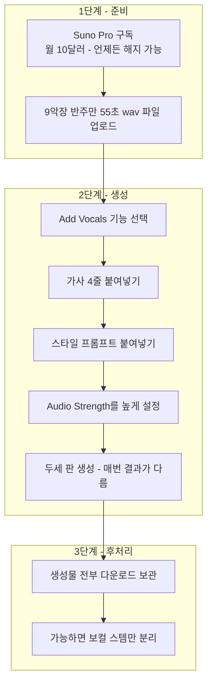
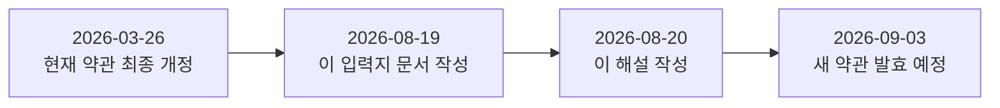

- **분석 대상**: [`k82022603/pictures-at-a-spanish-exhibition`](https://github.com/k82022603/pictures-at-a-spanish-exhibition) 저장소 [`산출물/20260818 - 목소리를 사러 가기 전에/Suno 입력지 - 붙여넣기만 하면 된다.md`](https://github.com/k82022603/pictures-at-a-spanish-exhibition/blob/1bf829e410f7444ab495e21a8d79b74887f19ef1/%EC%82%B0%EC%B6%9C%EB%AC%BC/20260818%20-%20%EB%AA%A9%EC%86%8C%EB%A6%AC%EB%A5%BC%20%EC%82%AC%EB%9F%AC%20%EA%B0%80%EA%B8%B0%20%EC%A0%84%EC%97%90/Suno%20%EC%9E%85%EB%A0%A5%EC%A7%80%20-%20%EB%B6%99%EC%97%AC%EB%84%A3%EA%B8%B0%EB%A7%8C%20%ED%95%98%EB%A9%B4%20%EB%90%9C%EB%8B%A4.md)
- **대상 문서 작성일**: 2026-08-19
- **이 해설 작성일**: 2026-08-20

---

## 1. 이 문서는 무엇인가

이 문서는 "Pictures at a Spanish Exhibition" 프로젝트의 9악장에 목소리를 입히기 위해, Suno AI의 `Add Vocals` 기능에 그대로 붙여넣을 수 있도록 만든 작업 지시서다. 08-14에 세운 계획의 B항목이었는데 그날은 만들지 못했고, 하루 늦은 08-19에 정리된 것으로 보인다.

핵심은 제목 그대로다 — 이 문서를 열어 필요한 부분을 그대로 복사해 Suno 화면에 붙여넣으면 작업이 끝나도록, 순서·가사·스타일 프롬프트·주의사항을 한 장에 압축해 놓았다.

## 2. 왜 지금 B판(Suno)을 먼저 쓰는가

원래 계획은 A판(Synthesizer V)으로 먼저 목소리를 만드는 것이었는데, 그 경로가 막혔다고 적혀 있다. Synthesizer V의 시험판(trial license)은 화면에서 재생은 되지만 실제 오디오 파일로 뽑아내는 렌더링 기능이 꺼져 있다는 안내(`"trial license. Rendering will be disabled"`)를 만난 것이다. 반면 Suno Pro 요금제에는 그런 제한이 없기 때문에, 순서를 바꿔 B판(Suno)을 먼저 시도하기로 한 것이 이 문서의 배경이다.

## 3. 작업 순서 — 7단계

문서가 제시하는 순서를 단계별로 묶으면 아래와 같다.



`Add Vocals`는 현재 Suno 도움말 센터에서도 "베타 기능이며 Pro·Premier 사용자에게만 열려 있다"고 명시하고 있어, 문서의 설명과 실제 서비스 상태가 일치한다. `Audio Strength` 슬라이더도 Suno가 실제로 제공하는 옵션 이름이며, 업로드한 반주를 얼마나 강하게 따라가게 할지를 정하는 값이라는 설명 역시 Suno 쪽 안내와 같다.

한 판만 뽑고 판정하지 말라고 못 박은 것도 눈여겨볼 부분이다. 생성형 음악 모델의 특성상 같은 입력을 넣어도 매번 다른 결과가 나오기 때문에, 최소 두세 판을 뽑아 비교하라는 지시다.

## 4. 가사 — 55초에 단 네 줄

가사는 의도적으로 아주 짧다.

```
[Verse] I count out every step under my own feet
[Verse] Now we walk, two of us, never in one step
[Verse] Now the light in the old picture holds you too
[Verse] Looking back, you were here always in my step
```

55초짜리 반주에 이 네 줄만 들어간다. 줄과 줄 사이가 많이 비는 것이 정상인데, 그 이유가 흥미롭다 — 이 대목은 노래가 반주를 뚫고 튀어나오는 자리가 아니라 **반주 위에 얹히는 자리**로 설계되었기 때문이다. 만약 Suno가 네 줄을 앞쪽에 몰아서 붙여버리면, 줄 사이에 `[Instrumental]` 태그를 끼워 넣어 억지로라도 간격을 벌리라고 안내한다.

원곡에서 이 네 줄이 있어야 할 정확한 위치도 표로 남겨 두었다.

| 줄 | 곡에서의 원래 시각 | 55초 파일 기준 시각 |
|---|---|---|
| 1 | 8:47 | 2.0초 |
| 2 | 8:58 | 13.0초 |
| 3 | 9:09 | 24.0초 |
| 4 | 9:16 | 31.0초 |

한 줄이 8.6초 간격이고, 3번과 4번 줄은 1.6초 겹치도록 원래 설계돼 있다. 다만 이 표는 참고용일 뿐, Suno가 이 타이밍을 정확히 맞출 필요는 없다고 적혀 있다. 자리가 어긋나도 소리 자체만 쓸 만하면 나중에 직접 잘라서 제자리에 붙이겠다는 전제다.

## 5. 스타일 프롬프트와 "가수 이름 금지" 원칙

Suno에 그대로 붙여넣을 스타일 지시문은 다음과 같다.

```
1970s British progressive rock male lead vocal.
Warm, straight tone with almost no vibrato.
Understated and conversational — speaking more than singing.
Chest voice, not belting. Soft consonant attacks.
Slightly behind the beat, unhurried.
Range F4 to F5. Dry, close, no heavy reverb.
```

빼달라고 요청할 항목(제외 칸이 있으면 입력)도 함께 준비돼 있다.

```
autotune, modern pop production, heavy vibrato, operatic,
female vocals, backing harmonies, rap, shouting, belting
```

여기서 가장 중요한 원칙은 **어떤 가수의 이름도 프롬프트에 넣지 않는다**는 것이다. 문서는 이 선을 `CLAUDE.md` 6절이 그은 것이라 설명한다 — 창법·음역·음색처럼 사실에 해당하는 성질은 참조해도 되지만, 편곡·가사·구성은 다른 사람의 저작물이므로 금지된다는 구분이다. 즉 위 스타일 프롬프트에 적힌 것은 전부 "소리의 성질"에 대한 서술이지, 특정 인물을 지목한 것이 아니라는 점을 문서 스스로 강조하고 있다.

## 6. 생성 후 반드시 할 일 두 가지

1. **파일을 전부 내려받아 보관한다.** Suno는 같은 결과물을 두 번 만들어내지 못하는 서비스 구조이므로, 마음에 든 판을 그 자리에서 받아두지 않으면 다시 구할 방법이 없다. 채택되지 않은 판까지 포함해 쓸 만해 보이는 것은 전부 내려받으라고 되어 있다(문서는 이를 `07` 문서 11장의 규칙 R11로 인용한다).
2. **가능하면 보컬만 따로 받는다.** Suno에 스템(요소별 분리) 기능이 있으면 보컬 트랙만 받아두고, 없으면 통합본만 받아도 로컬에 설치된 Demucs로 나중에 반주를 걷어낼 수 있다고 적혀 있다.

## 7. 무엇을 보내주면 되는지

작업을 대신 실행하는 사람에게 요청하는 산출물은 세 가지로 정리된다.

| 구분 | 내용 |
|---|---|
| 필수 | 생성된 파일 전부(두세 판) |
| 있으면 좋음 | 보컬만 분리된 파일 |
| 한 줄 코멘트 | 어느 판이 가장 나은지, 그리고 왜 그렇게 들리는지 |

받은 뒤에는 Demucs로 목소리를 분리하고, `창법실측.py`라는 자체 도구로 떨림 폭, 소리 여는 시간, 500~2000Hz 비중, 200~500Hz의 따뜻함, C5를 넘는 네 음 등 다섯 항목을 측정한 뒤, 쓸 만하면 네 줄을 잘라 8:47·8:58·9:09·9:16 자리에 붙여 전곡을 완성하겠다는 계획까지 적혀 있다.

## 8. 미리 적어둔 예상 — "소리는 좋은데 우리 노래가 아니다"

문서는 결과를 보기 전에 이미 예상을 세워 두었다.

| 항목 | 예상 |
|---|---|
| 소리 | A판(Synthesizer V)보다 나을 것 — 실제 사람 노래를 학습한 모델이라 몸통이 있다 |
| 음(멜로디) | 틀릴 가능성이 높음 — 원곡 선율을 그대로 부른다는 보장이 없다 |
| 타이밍 | 어긋날 것 |

한 문장으로 요약하면 "소리는 좋은데 우리 노래가 아니다"가 나올 가능성이 높다고 스스로 예측하고 있다. 이 경우에도 절반의 성공으로 보는데, 음이 틀려도 소리의 방향이 맞으면 그다음 A판을 그 방향에 맞추는 데 참고할 수 있기 때문이다.

한 가지 더 짚어둔 위험 요인이 있다. 9악장은 곡 전체에서 가장 편성이 꽉 찬 총주 대목인데, 참조 음원을 실측해 보니 그 반주는 가운데 대역이 비어 있는 반면 이 9악장 반주는 그 자리가 이미 채워져 있었다고 한다. 그러면 Suno가 목소리를 끼워 넣을 빈자리를 찾지 못할 수 있는데, 이는 Suno의 결함이 아니라 애초에 편곡 자체가 목소리를 전제하지 않고 만들어졌다는 뜻으로 받아들이겠다고 미리 정리해 두었다.

---

## 9. 권리 조항 — 문서의 주장과 2026-08-20 기준 실제 약관 대조

문서 7절은 이렇게 적고 있다.

> Suno 유료 약관은 「Suno가 소유한 Output」을 「유료 구독 기간 중」에 한해 넘긴다. AI 생성물에 애초에 권리가 붙는지가 정리 안 됐으므로 넘길 것이 없으면 넘어오는 것도 없고, 구독이 끊긴 뒤가 어떻게 되는지는 약관에 없다.

이 부분이 사실인지, 그리고 지금도 여전히 그러한지를 Suno의 실제 이용약관 원문(`suno.com/terms-of-service`)과 도움말 센터를 직접 대조해 확인했다.

### 9.1 현재(2026-03-26 개정판) 약관과의 대조 — 결론: 정확하다

지금 시점에 유효한 약관은 2026년 3월 26일에 마지막으로 개정된 판이다. 이 약관은 Pro·Premier 유료 구독자에 한해, Suno가 소유하고 있던 Output에 대한 권리 일체를 이용자에게 넘긴다고 규정하면서, 그 범위를 "유료 구독 기간 중에 생성된 것"으로 한정하고 있다. 그리고 바로 이어서, 머신러닝의 특성상 그 Output에 저작권이 실제로 성립한다는 보장은 하지 않는다는 문구가 붙어 있다. 문서가 요약한 두 문장 — "구독 기간 중 생성물에 한해 권리를 넘긴다"와 "저작권이 붙는다는 보장은 없다" — 은 이 약관 원문을 정확하게 옮긴 것이다.

무료(Basic) 등급 이용자는 생성물을 비상업적 용도로만 쓸 수 있다는 제한도 약관에 그대로 있어, 이 역시 업계 전반에 알려진 것과 일치한다.

### 9.2 문서가 비워둔 질문 — "구독이 끊긴 뒤"에 대한 보충 정보

문서는 구독 종료 후의 상태가 약관에 없다고 적었는데, 약관 **본문**만 놓고 보면 맞는 지적이다. 다만 Suno 도움말 센터(2026년 1월 7일 수정본)는 이 질문에 조금 더 실무적인 답을 주고 있다. Pro·Premier로 구독 중일 때 만든 곡이라면, 그 소유권과 상업적 이용권은 이후 구독을 해지하더라도 그대로 유지된다고 명시하고 있다. 다시 말해 "언제 만들었는가"가 기준이지 "지금도 구독 중인가"는 기준이 아니라는 뜻이다. 이는 법적 자산 양도의 성격상 자연스러운 해석이기는 하지만, 약관 본문에 명문화되어 있지 않았던 부분을 도움말 문서가 보충하고 있었던 셈이다.

### 9.3 ⚠ 가장 중요한 변수 — 2026년 9월 3일부터 약관 전체가 바뀐다

약관 페이지 최상단에 "새 약관이 곧 시행되며, 시행일은 2026년 9월 3일"이라는 공지가 걸려 있다. 이 문서가 작성된 08-19로부터 불과 보름 뒤, 그리고 이 해설을 쓰는 오늘(08-20)로부터도 2주 남짓 뒤에 약관 체계 자체가 바뀐다는 뜻이라 반드시 함께 알아둘 필요가 있다.



새 약관(2026년 8월 10일 최종 수정, 9월 3일 발효)에서 권리 관련 조항은 구조가 꽤 달라진다.

- **"유료 구독 기간 중"이라는 시간적 조건이 빠졌다.** 새 조항은 Pro·Premier 이용자가 만든 Output에 대한 권리를 넘긴다고 하면서, 더 이상 "구독 기간 중 생성된 것"이라는 문구를 쓰지 않는다.
- **대신 "다운로드"라는 새로운 단위가 생겼다.** 상업적으로 쓰려면 각 등급별로 매달 정해진 다운로드 허용치 안에서 정식 경로로 내려받은 Output이어야 한다고 규정한다. 스트리밍 리핑이나 녹음으로 사본을 얻는 것은 명시적으로 금지되고, Suno는 등급이나 다운로드 여부를 표시하는 워터마크·메타데이터를 붙일 권리를 갖는다.
- **가장 중요한 부분 — 한 번 성립한 권리는 구독이 끊겨도 유지된다는 문장이 새로 명문화됐다.** 새 약관은 이용자에게 넘어간 권리와, 정식으로 받은 다운로드에 대한 상업적 이용권이 "영구적(perpetual)"이며, 다운로드 한도 소진이나 요금제 변경, 구독의 만료·해지·강등·정지에 영향받지 않는다고 못 박고 있다. 이는 문서가 "약관에 없다"고 지적했던 바로 그 빈틈을, 새 약관이 직접 메우는 방향으로 개정된 것이다.

정리하면, 문서가 지적한 불확실성은 (1) 도움말 센터 수준에서는 이미 1월부터 보충되어 있었고, (2) 곧 시행될 새 약관에서는 계약 본문 차원에서 명문화된다. 다만 그 대가로 "다운로드 한도"라는 새 제약이 함께 들어온다는 점은 이 프로젝트의 작업 방식과 직결된다 — 문서 4절이 강조한 "생성물은 반드시 즉시 내려받아 보관한다"는 원칙이, 9월 3일 이후에는 상업적 이용권 성립의 전제조건 자체가 될 가능성이 크다는 뜻이다.

### 9.4 더 넓은 맥락

이 약관 변화는 진공에서 나온 것이 아니다. Suno는 2025년 11월 말 Warner Music Group과 소송을 종결하고 라이선스 파트너십을 맺었으며, 그 여파로 2026년 중 다운로드 제한 도입과 라이선스된 신규 모델 출시를 예고한 바 있다. 반면 Universal Music Group과 Sony Music은 2026년 현재도 소송을 이어가고 있어, Suno를 둘러싼 저작권 지형 자체가 아직 유동적이다. 또한 미국 저작권청은 여전히 인간의 창작 기여를 저작권 성립의 기본 요건으로 보고 있어, AI가 100% 생성한 결과물 자체는 원칙적으로 저작권 등록 대상이 되기 어렵다는 것이 여러 법률 자료가 공통으로 지적하는 부분이다. 즉 Suno의 계약상 권리 이전과, 그 결과물이 실제로 법적 저작권을 갖는지는 계속 별개의 문제로 남아 있다.

## 10. 종합 판단

문서 7절이 뽑기 전에 미리 알아두라고 적어놓은 두 문장은 검증 결과 사실에 부합했고, 지금도 유효하다. 다만 다음 두 가지는 이 시점에 추가로 알아둘 가치가 있다.

1. 구독 종료 후 권리가 유지되는지는 약관 본문에는 없었지만, Suno 도움말 센터는 이미 "구독 중 생성물은 해지 후에도 상업적 이용권이 유지된다"고 밝히고 있었다.
2. 2026년 9월 3일부터 적용되는 새 약관은 이 문제를 계약 본문 차원에서 명문화하는 대신, "다운로드 한도" 안에서 정식으로 내려받은 결과물만 상업적으로 쓸 수 있다는 새로운 조건을 함께 붙였다. 이 프로젝트가 이미 실천하고 있는 "생성물은 전부 즉시 내려받아 보관한다"는 원칙이 앞으로는 선택이 아니라 요건에 가까워질 수 있다.

---

## 참고 자료

- Suno 이용약관(현행, 2026-03-26 개정) — https://suno.com/terms-of-service
- Suno 이용약관(신규, 2026-09-03 발효 예정) — https://suno.com/terms-september-2026
- Suno 도움말 — "Does Suno own the music I make?" (2026-01-07 수정) — https://help.suno.com/en/articles/2416769
- Suno 도움말 — "What rights do I have with a paid subscription?" (2025-12-17 수정) — https://help.suno.com/en/articles/9601665
- Suno 도움말 — "Add Vocals" 기능 안내 — https://help.suno.com/en/articles/6882817
- Suno 도움말 — "Do I have the copyrights to songs I made?" — https://help.suno.com/en/articles/2746945

---

*작성 일자: 2026-08-20*
