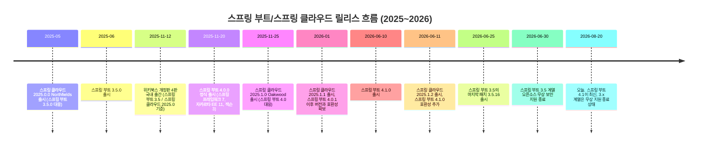
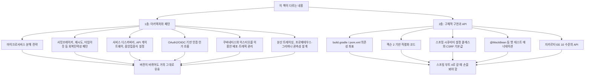

*— 위키북스 「스프링 부트 3와 스프링 클라우드를 활용한 마이크로서비스 구축」(개정판 4판)을 중심으로 —*

작성 기준일: 2026년 8월 20일

---

## 목차

1. 질문을 다시 정리하기
2. 이 책이 실제로 다루고 있는 기술 스택
3. 스프링 부트와 스프링 클라우드의 릴리스 구조 이해하기
4. 타임라인으로 보는 현재 위치
5. 스프링 부트 3.5는 지금 어떤 상태인가
6. 스프링 부트 4.0과 4.1이 가져온 변화
7. 스프링 클라우드 릴리스 트레인과 스프링 부트 버전의 대응 관계
8. 책의 내용을 두 층위로 나누어 보기: 아키텍처 패턴과 구현 API
9. 결론 — 공부할 가치가 있는가
10. 실천적인 학습 전략 제안
11. 참고자료

---

## 1. 질문을 다시 정리하기

질문의 핵심은 단순하다. 2025년 11월 12일에 위키북스에서 출간된 「스프링 부트 3와 스프링 클라우드를 활용한 마이크로서비스 구축」 개정판 4판은 스프링 부트 3.5와 스프링 클라우드 2025.0 계열(코드명 Northfields)을 기준으로 집필되었는데, 공교롭게도 이 책이 나온 지 여드레 만인 2025년 11월 20일에 스프링 부트 4.0이 정식 출시되었고, 2026년 6월에는 스프링 부트 4.1까지 나왔다. 게다가 2026년 6월 30일을 기점으로 스프링 부트 3.5 계열의 오픈소스 무상 보안 지원마저 종료되었다. 그렇다면 이미 한 세대 전 버전을 다루는 이 책으로 지금 공부하는 것이 시간 낭비는 아닐지, 라는 질문이다.

결론부터 방향을 잡자면, 이 질문에 대한 답은 "예" 또는 "아니오"로 딱 잘라 말할 수 있는 성격이 아니다. 책이 다루는 내용을 아키텍처적 지식과 구현 세부사항이라는 두 층위로 나누어 보면, 전자는 거의 그대로 유효하고 후자는 스프링 부트 4로 넘어가면서 상당 부분 손을 봐야 한다. 아래에서 이 판단의 근거가 되는 사실관계를 하나씩 검증해 나가겠다.

## 2. 이 책이 실제로 다루고 있는 기술 스택

먼저 이 책의 원서 정보부터 확인해 둘 필요가 있다. 위키북스판의 저본이 되는 마그누스 라르손의 영문 원서는 팩트출판사에서 나온 「Microservices with Spring Boot and Spring Cloud」시리즈로, 2021년 초판(스프링 부트 2 기준), 2023년 3판(스프링 부트 3, 스프링 클라우드 2022 기준)을 거쳐, 2025년에 4판이 새로 출간되었다. 팩트출판사와 서점 상세 페이지에 명시된 이 4판의 기술 스택은 자바 24, 스프링 부트 3.5, 스프링 클라우드 2025이며, AOT(Ahead-of-Time) 컴파일, 옵저버빌리티, 분산 트레이싱, 쿠버네티스 패키징을 위한 헬름(Helm) 등 최신 주제를 반영해 예제 코드와 API를 갱신했다고 소개되어 있다.[1][2] 위키북스판 표지에 적힌 "자바 24, 스프링 부트 3.5, 스프링 클라우드 2025 등 최신 기술 스택을 기반으로 마이크로서비스 구축 방법을 설명합니다"라는 문구도 이와 정확히 일치한다. 즉 이 책은 스프링 부트 4가 아니라 스프링 부트 3 계열의 마지막 세대인 3.5를 기준으로 쓰였다는 점이 출간사 측 설명으로 명확히 확인된다.

여기서 한 가지 짚어둘 사실이 있다. 자바 24는 2025년 3월에 나온 단기 지원(non-LTS) 버전이고, 이후 2025년 9월에 나온 자바 25가 새로운 장기 지원(LTS) 버전이다. 책이 집필되던 시점에는 자바 25가 아직 나오지 않았거나 막 나온 시점이었을 가능성이 높아, 자바 24가 "최신"으로 언급된 것으로 보인다. 이는 사소해 보이지만, 뒤에서 다룰 "기술서는 출간되는 순간 이미 한 발짝 뒤처져 있다"는 구조적 문제를 보여주는 작은 사례이기도 하다.

## 3. 스프링 부트와 스프링 클라우드의 릴리스 구조 이해하기

버전 격차 문제를 제대로 판단하려면 먼저 스프링 진영이 어떤 방식으로 버전을 관리하는지 이해할 필요가 있다.

스프링 부트는 2020년 5월부터 5월과 11월, 연 2회 정기 릴리스 체계를 유지해 왔다. 스프링 프레임워크가 메이저 버전을 올릴 때(예: 스프링 프레임워크 6 → 7) 스프링 부트도 함께 메이저 버전을 올리는데(스프링 부트 3 → 4), 이런 메이저 전환은 흔히 자카르타 네임스페이스 변경처럼 생태계 전체에 영향을 주는 큰 변화를 동반한다. 실제로 스프링 부트 4.0은 스프링 프레임워크 7.0과 함께 2025년 11월 20일에 정식 출시되었으며, 이는 스프링 부트 2에서 3으로 넘어가며 javax에서 jakarta로 패키지 네임스페이스가 바뀐 사건 이후 가장 큰 폭의 세대교체로 평가된다.[3][4]

한편 스프링 클라우드는 스프링 부트와는 별도의 프로젝트이며, "릴리스 트레인(Release Train)"이라는 방식으로 여러 하위 프로젝트(컨피그, 게이트웨이, 서킷브레이커, 서비스 디스커버리 등)를 하나의 버전 이름으로 묶어 배포한다. 각 릴리스 트레인은 연도.순번 형식의 코드로 불리며 알파벳 지명 코드네임이 붙는다. 스프링 공식 문서에 따르면 최신 릴리스 트레인인 2025.1.x(코드명 Oakwood)는 스프링 부트 4.0.x와 4.1.x를, 2025.0.x(코드명 Northfields)는 스프링 부트 3.5.x를, 2024.0.x(코드명 Moorgate)는 스프링 부트 3.4.x를 지원한다. 사용자가 원문 질문에 함께 인용한 스프링 공식 사이트의 표가 정확히 이 대응 관계를 보여준다.

이 구조를 이해하면 자연스러운 결론이 하나 나온다. 스프링 생태계에서 "메이저 버전 하나가 지나갔다"는 사실 자체는 특별한 사건이 아니라 연중행사에 가깝다는 점이다. 이 책만의 문제가 아니라, 스프링을 다루는 모든 기술서가 태생적으로 안고 있는 숙명이라고 보는 편이 정확하다.

## 4. 타임라인으로 보는 현재 위치

아래는 이 책의 기준 시점, 스프링 부트 4 계열의 등장, 그리고 오늘(2026년 8월 20일)까지의 흐름을 정리한 것이다.

이 타임라인에서 눈에 띄는 대목은 위키북스판이 출간된 지 정확히 8일 만에 스프링 부트 4.0이 나왔다는 점이다. 이는 저자나 번역자, 출판사의 잘못이 아니라 원서 집필과 번역, 편집, 인쇄, 유통에 소요되는 시간이 반년 주기의 스프링 릴리스 사이클보다 길기 때문에 벌어지는 구조적인 현상이다. 스프링 관련 서적은 출간되는 순간 이미 다음 버전을 마주하게 되는 경우가 흔하다.

## 5. 스프링 부트 3.5는 지금 어떤 상태인가

여기서 가장 실무적으로 중요한 사실을 짚고 넘어가야 한다. 스프링 부트 유지보수 현황을 추적하는 자료에 따르면, 스프링 부트 3.5 계열은 2026년 6월 25일에 나온 3.5.16을 마지막으로 더 이상 패치가 나오지 않으며, 오픈소스 무상 보안 지원은 2026년 6월 30일부로 종료되었다.[5][6] 즉 오늘(2026년 8월 20일) 기준으로 이 책이 다루는 스프링 부트 3.5 라인은 이미 커뮤니티 차원의 무상 지원이 끝난 버전이다. 앞으로 3.5 계열에서 새로운 보안 취약점이 발견되더라도, 브로드컴(옛 VMware Tanzu)의 유상 엔터프라이즈 지원을 구매하거나 HeroDevs 같은 서드파티의 유상 장기 지원(Never-Ending Support) 서비스를 이용하지 않는 한 공식 패치를 받을 수 없다.

이것이 학습 가치와 곧바로 직결되는 문제는 아니다. 학습 목적의 실습 환경, 즉 자기 컴퓨터에서 로컬 쿠버네티스 클러스터를 띄우고 예제 코드를 돌려보는 용도라면 보안 패치 종료 자체는 큰 문제가 되지 않는다. 하지만 "이 책의 스택 그대로 신규 프로덕션 서비스를 만들 계획"이라면 이야기가 다르다. 신규 프로젝트를 스프링 부트 3.5 기준으로 시작하는 것은 이미 지원이 끝난 라인 위에 서비스를 올리는 것이므로 권장되지 않는다. 반대로 기존에 스프링 부트 3.x로 운영 중인 시스템을 유지보수하거나 점진적으로 4.x로 전환하려는 목적이라면, 3.5에 대한 이해는 오히려 지금 당장 실무에서 더 요긴하게 쓰인다. 스프링 팀 스스로도 마이그레이션 가이드에서 "2.x나 3.x의 이전 버전에 있다면 반드시 먼저 3.5.x로 갈아탄 뒤 그 다음에 4.0으로 넘어가라"고 권고하고 있으며, 이는 3.5가 4.0으로 가는 필수 경유지 역할을 한다는 뜻이기도 하다.[7][8]

## 6. 스프링 부트 4.0과 4.1이 가져온 변화

책과 현재 최신판 사이의 실질적인 격차를 가늠하려면 스프링 부트 4가 구체적으로 무엇을 바꾸었는지 알아야 한다. 스프링 부트 4.0은 스프링 프레임워크 7과 자카르타 EE 11을 기반으로 하며, 다음과 같은 변화를 담고 있다.[3][9][10]

첫째, 코드베이스 전체가 70여 개의 세분화된 모듈로 쪼개졌다. 기존에는 spring-boot-autoconfigure라는 하나의 거대한 아카이브에 모든 기술의 자동 구성 코드가 들어 있었는데, 이제는 기술별로 독립된 모듈과 스타터로 나뉘어 빌드 속도와 애플리케이션 기동 속도, 네이티브 이미지 빌드 효율이 개선되었다.

둘째, JSON 처리 라이브러리의 기본값이 잭슨 2에서 잭슨 3으로 바뀌었다. 패키지 경로 자체가 com.fasterxml.jackson에서 tools.jackson으로 이동했고, 예외 계층 구조와 빌더 패턴, 날짜/시간 직렬화 기본 동작까지 달라졌다. 이 변화는 컴파일 오류 없이 조용히 런타임 동작만 바꾸는 경우가 많아 마이그레이션 과정에서 가장 많은 시간을 잡아먹는 항목으로 꼽힌다.

셋째, 자카르타 EE 기준선이 10에서 11로 올라가면서 하이버네이트 7, 톰캣 11, 빈 검증 3.1이 요구되고, 언더토우(Undertow) 서버 지원이 완전히 제거되었다. 언더토우를 쓰던 프로젝트는 톰캣이나 제티로 이전해야 한다.

넷째, 스프링 시큐리티 7의 기본값이 바뀌면서 CSRF 관련 기본 동작이 달라졌고, 이 역시 겉으로는 정상 기동되지만 실제로는 특정 API 호출이 조용히 막히는 형태로 문제를 일으킬 수 있다.

다섯째, 테스트 관련 애너테이션에도 변화가 있다. @MockBean과 @SpyBean이 제거되었고, @SpringBootTest가 더 이상 자동으로 MockMvc나 TestRestTemplate을 구성해주지 않는다.

여섯째, 자바 최소 요구 버전에 대해서는 정보가 다소 엇갈리는데, 스프링 공식 블로그는 "자바 17 호환성을 유지하면서 자바 25를 1급으로 지원한다"고 명시하고 있다.[3] 일부 서드파티 블로그에서는 "자바 21 이상이 필요하다"는 주장도 보이지만, 이는 스프링 팀의 공식 발표와 배치되는 내용으로, 적어도 4.0.x 시점에서는 자바 17 기준선이 유지된다는 공식 설명을 신뢰하는 편이 안전하다. 다만 자바 21 이상에서만 활성화되는 개별 기능(가상 스레드 등)이 있는 것은 사실이므로, 실무에서는 현재 LTS인 자바 25로 올리는 편이 권장된다.

이어서 2026년 6월 10일에 나온 스프링 부트 4.1은 4.0만큼 파괴적이지는 않은 점진적 개선 릴리스로, gRPC 자동 구성, HTTP 클라이언트의 SSRF(서버 측 요청 위조) 방어 기능, 코틀린 2.3 지원, 지연 로딩 데이터소스 연결, @Async 메서드의 비동기 컨텍스트 전파, 오픈텔레메트리 지원 강화 등을 추가했다.[4] 즉 큰 개념적 단절은 4.0에서 이미 일어났고, 4.1은 그 위에서 다듬어진 버전이라고 볼 수 있다.

정리하면, 스프링 부트 3.5에서 4.0/4.1로 넘어가는 과정은 문법 몇 개를 바꾸는 수준이 아니라 빌드 설정, 의존성 좌표, JSON 처리 코드, 보안 설정, 테스트 코드까지 손을 대야 하는 진짜 마이그레이션이다. 다행히 스프링 팀은 OpenRewrite 자동 리팩터링 레시피(UpgradeJackson_2_3, Migrate_To_Jakarta_EE_10 등)를 제공해 기계적인 변경은 상당 부분 자동화할 수 있게 해두었지만, 날짜 직렬화 기본값 변경이나 예외 처리 로직처럼 자동화 도구가 잡아내지 못하는 부분은 사람이 직접 검토해야 한다.[9][10]

## 7. 스프링 클라우드 릴리스 트레인과 스프링 부트 버전의 대응 관계

아래 표는 사용자가 제시한 스프링 공식 문서 내용과 이번 조사에서 확인한 내용을 종합한 것이다.

| 릴리스 트레인 | 코드명 | 대응 스프링 부트 | 비고 |
|---|---|---|---|
| 2025.1.x | Oakwood | 4.0.x, 4.1.x | 스프링 프레임워크 7 기반. 최신 릴리스 트레인 |
| 2025.0.x | Northfields | 3.5.x | 이 책이 기준으로 삼은 트레인 |
| 2024.0.x | Moorgate | 3.4.x | 한 세대 이전 |

실무적으로 흥미로운 점은, 2025.1.0(오크우드)이 처음 나왔을 때는 스프링 부트 4.0.0에만 대응했다가, 스프링 부트 쪽에서 4.0.1 이후 내부 변경이 생기면서 호환성이 깨졌고, 이를 스프링 클라우드 2025.1.1에서 다시 맞춰준 사례가 있었다는 사실이다.[11] 즉 스프링 부트와 스프링 클라우드는 별도 프로젝트이면서도 서로 긴밀하게 버전을 맞춰가야 하는 관계이며, 패치 버전 단위에서도 미묘한 호환성 이슈가 발생할 수 있다는 점을 보여준다. 이는 이 책이 다루는 마이크로서비스 아키텍처 전반이 "여러 독립 프로젝트를 조율해야 하는" 스프링 클라우드 생태계의 복잡성을 그대로 안고 있다는 사실을 다시 한번 확인시켜 준다.

한 가지 더 확인할 만한 사실은, 컨피그 서버(spring-cloud-starter-config), 유레카 서비스 디스커버리(spring-cloud-starter-netflix-eureka-client), 스프링 클라우드 게이트웨이 같은 이 책의 핵심 구성요소들이 스프링 클라우드 2025.1(오크우드)에서도 여전히 동일한 아티팩트 이름으로 존재한다는 점이다.[11][12] 게이트웨이 쪽은 일부 구식 아티팩트가 제거되고 spring-cloud-gateway-server-web{flux|mvc} 같은 새 이름으로 정리되었지만, "게이트웨이가 있고, 컨피그 서버가 있고, 서비스 디스커버리가 있다"는 구조 자체는 그대로 유지된다.

## 8. 책의 내용을 두 층위로 나누어 보기: 아키텍처 패턴과 구현 API

지금까지의 사실관계를 바탕으로, 책의 내용을 두 층위로 나누어 판단하는 것이 가장 합리적인 접근이라고 본다.

1층에 해당하는 내용, 즉 "왜 모놀리스를 마이크로서비스로 쪼개는가", "장애가 전파되지 않도록 서킷브레이커를 어떻게 설계하는가", "서비스 디스커버리와 API 게이트웨이를 어떻게 조합하는가", "OAuth2 인가 코드 흐름을 어떻게 마이크로서비스에 적용하는가", "이스티오로 사이드카 프록시를 어떻게 구성해 트래픽을 통제하는가", "분산 트레이싱과 지표 수집을 어떻게 설계하는가"와 같은 지식은 스프링 부트가 3이든 4이든 본질적으로 달라지지 않는다. 이런 지식은 특정 프레임워크 버전에 종속된 것이 아니라 분산 시스템 일반에 적용되는 소프트웨어 아키텍처 지식이기 때문이다. 실제로 저자인 마그누스 라르손은 1986년부터 IT 업계에 몸담아 온 스웨덴의 시스템 컨설턴트로, 이 책이 여러 판을 거치며 계속 개정되어 온 이유도 프레임워크 버전이 바뀔 때마다 예제 코드는 새로 짜되 핵심 아키텍처 서술은 유지해 왔기 때문이라고 볼 수 있다.

반면 2층에 해당하는 내용, 즉 실제로 IDE에 타이핑해서 돌려보는 코드 수준에서는 스프링 부트 4로 넘어가면서 손볼 곳이 분명히 생긴다. 빌드 파일의 스프링 부트 플러그인 버전과 스프링 클라우드 BOM 버전을 4.0.x/2025.1.x 계열로 바꿔야 하고, 잭슨 관련 커스텀 직렬화 코드가 있다면 패키지 경로와 예외 처리 방식을 점검해야 하며, 스프링 시큐리티 설정 클래스에서 CSRF 관련 동작이 달라졌는지 확인해야 하고, 테스트 코드에 @MockBean이 쓰였다면 대체 방법을 찾아야 한다.

## 9. 결론 — 공부할 가치가 있는가

이 두 층위 구분을 바탕으로 정리하면 다음과 같은 답이 나온다.

이 책은 여전히 공부할 가치가 충분하다. 다만 "이 책의 코드를 한 글자도 안 고치고 그대로 최신 프로덕션에 올릴 수 있는가"라는 기준으로 보면 답은 아니오이고, "이 책을 통해 마이크로서비스 아키텍처, 회복탄력성 패턴, 쿠버네티스·이스티오 운영, 관측성 설계, 보안 흐름 같은 실무 핵심 역량을 배울 수 있는가"라는 기준으로 보면 답은 그렇다이다.

몇 가지 근거를 덧붙이자면 다음과 같다.

먼저, 스프링 부트 4는 나온 지 아직 1년이 채 되지 않았다(2025년 11월 출시, 2026년 8월 현재 기준 약 9개월). 대규모 엔터프라이즈 시스템이 메이저 프레임워크 업그레이드를 완료하는 데는 통상 수년이 걸리며, 이는 스프링 생태계에서 반복적으로 관찰되어 온 패턴이다. 즉 지금 이 시점에도 실무 현장에서 스프링 부트 3.x, 심지어 2.x 기반 시스템을 유지보수하는 프로젝트가 스프링 부트 4.x 기반 신규 프로젝트보다 여전히 훨씬 많을 가능성이 높다. 이런 관점에서 보면 스프링 부트 3.5에 대한 이해는 "낡은 지식"이 아니라 "지금 당장 실무에서 마주칠 확률이 가장 높은 버전에 대한 지식"에 더 가깝다.

다음으로, 스프링 팀이 스스로 권고하는 마이그레이션 경로가 "먼저 3.5.x로 가서 모든 지원 중단 경고를 없앤 뒤 4.0으로 가라"는 것이라는 점도 눈여겨볼 만하다. 이는 3.5에 대한 숙련도가 4.0으로 가는 다리 역할을 한다는 것을 스프링 팀 스스로 인정하는 셈이다.

마지막으로, 이 책의 부제에 명시된 스프링 클라우드, 이스티오, 쿠버네티스, OAuth, 프로메테우스·그라파나, 분산 추적, 서비스 메시 같은 주제들은 프레임워크의 메이저 버전 전환과 무관하게 마이크로서비스 실무자가 반드시 갖춰야 할 기초 소양이다. 오히려 이런 폭넓은 주제를 한 권에서 계층적으로 다루는 책은 흔하지 않으며, 이 부분이 책의 핵심 가치라고 볼 수 있다.

다만 정직하게 짚어야 할 한계도 있다. 이 책을 따라가며 그대로 실습할 경우, 특히 잭슨 직렬화, 스프링 시큐리티 설정, 테스트 코드 작성 부분에서는 스프링 부트 4 환경에서 그대로 동작하지 않을 가능성이 있다. 학습자가 이 책의 예제를 스프링 부트 3.5 환경에 고정해서 학습용으로 돌리는 것은 문제가 없지만, 그 코드를 신규 프로덕션 시스템에 그대로 옮기는 것은 권장되지 않는다. 신규 시스템이라면 스프링 부트 4.1과 스프링 클라우드 2025.1을 기준으로 삼아야 한다.

## 10. 실천적인 학습 전략 제안

버전 격차를 오히려 학습 기회로 바꾸는 방법을 제안하자면 다음과 같은 순서가 합리적이다.

우선 이 책을 스프링 부트 3.5, 스프링 클라우드 2025.0(Northfields) 기준 그대로 따라가며 아키텍처와 패턴 중심으로 학습한다. 이 단계의 목표는 코드를 토씨 하나 안 틀리고 베끼는 것이 아니라, 왜 이런 구조로 설계했는지, 각 컴포넌트가 어떤 문제를 해결하는지를 이해하는 것이다.

그다음 책의 각 장에서 다룬 예제를 스프링 부트 4.1과 스프링 클라우드 2025.1(Oakwood)로 직접 포팅해 보는 것을 별도 과제로 삼는 것을 권한다. 이 과정에서 스프링 공식 마이그레이션 가이드와 OpenRewrite 레시피를 활용하면 기계적인 변경은 상당 부분 자동화할 수 있고, 자동화되지 않는 잭슨 3, 시큐리티 7 관련 부분을 직접 부딪히며 익히는 것 자체가 스프링 부트 3에서 4로 넘어가는 실질적인 마이그레이션 역량을 기르는 좋은 훈련이 된다. 이는 오히려 최신 스프링 부트 4 서적이 아직 충분히 나오지 않은 지금 시점에, 구세대 교재와 신세대 프레임워크 사이의 간극을 스스로 메워보는 실전 경험으로서 가치가 있다.

마지막으로, 스프링 클라우드 게이트웨이, 유레카, 컨피그 서버 등 핵심 컴포넌트의 아티팩트 이름과 설정 방식이 트레인마다 미묘하게 달라질 수 있으므로, 실습 중에는 항상 사용 중인 스프링 부트 버전에 정확히 대응하는 스프링 클라우드 BOM 버전을 spring.io 공식 릴리스 노트에서 확인하고 고정하는 습관을 들이는 것이 좋다.

## 11. 참고자료

[1] Packt — Microservices with Spring Boot and Spring Cloud, 2025 Edition 소개
https://www.packtpub.com/en-us/product/microservices-with-spring-boot-and-spring-cloud-9781801079150

[2] ThriftBooks — Microservices with Spring Boot and Spring Cloud (2025 Edition) 상세
https://www.thriftbooks.com/w/microservices-with-spring-boot-and-spring-cloud-build-resilient-and-scalable-microservices-using-spring-cloud-istio-and-kubernetes_magnus-larsson/56520253/

[3] Spring 공식 블로그 — Spring Boot 4.0.0 available now (2025-11-20)
https://spring.io/blog/2025/11/20/spring-boot-4-0-0-available-now/

[4] InfoQ — Spring Boot 4.1 Adds gRPC Auto-Configuration, SSRF Mitigation, and Kotlin 2.3 Support
https://www.infoq.com/news/2026/06/spring-boot-4-1/

[5] HeroDevs — Spring Boot Versions, EOL Dates, and Latest Releases
https://www.herodevs.com/blog-posts/spring-boot-versions-eol-dates-and-latest-releases-april-2026

[6] eosl.date — Spring Boot End of Life (EOL) Dates and End of Support (EOS) Dates
https://eosl.date/eol/product/spring-boot/

[7] Java Code Geeks — Spring Boot 3 → 4 Migration: The 7 Failures Nobody Warns You About
https://www.javacodegeeks.com/spring-ai-subagent-orchestration-guide.html-2

[8] JSBisht Labs — Spring Boot 3 to Spring Boot 4 migration guide
https://blogs.jsbisht.com/blog/spring-boot-3-to-4-migration-guide/

[9] Java Code Geeks — Spring Boot 4 vs. 3: What Actually Changed
https://www.javacodegeeks.com/2026/04/spring-boot-4-vs-3-what-actually-changed.html

[10] Ankur M. — Spring Boot 3 to 4 Migration Guide: What Actually Breaks, Why It Breaks, and How to Fix It
https://ankurm.com/spring-boot-3-to-4-migration-guide/

[11] Spring 공식 블로그 — Spring Cloud 2025.1.1 (aka Oakwood) Has Been Released
https://spring.io/blog/2026/01/29/spring-cloud-2025-1-1-aka-oakwood-has-been-released/

[12] Spring 공식 블로그 — Spring Cloud 2025.0.0 (aka Northfields) has been released
https://spring.io/blog/2025/05/29/spring-cloud-2025-0-0-is-abvailable/

[13] 알라딘 — 스프링 부트 3와 스프링 클라우드를 활용한 마이크로서비스 구축 (위키북스 오픈소스 & 웹 시리즈 124) 도서 정보
https://www.aladin.co.kr/shop/common/wseriesitem.aspx?SRID=12477

---

## 부록: 잭슨(Jackson) 2 → 3 마이그레이션 상세 정리

본문 6장에서 "예외 계층 구조와 빌더 패턴, 날짜/시간 직렬화 기본 동작까지 달라졌다"고 짧게 언급한 잭슨 관련 변화를 별첨으로 상세히 풀어서 정리한다. 이 부록은 스프링 부트 3.5(잭슨 2 기반)로 이 책을 학습한 뒤, 스프링 부트 4.1(잭슨 3 기반) 환경으로 예제를 옮겨보려는 독자를 염두에 두고 작성했다.

### A.1 잭슨 3가 왜 나왔는가

잭슨 3.0은 2025년 10월 3일에 정식 출시되었으며, 스프링 부트 4.0(2025년 11월 20일)보다 약 한 달 반 앞서 나왔다. 잭슨 1에서 2로 넘어간 것이 2012년이었으니, 13년 만의 두 번째 메이저 전환인 셈이다. 잭슨 팀은 이 개편의 목적을 "오랫동안 쌓인 기술 부채를 걷어내고, 아키텍처를 단순화하며, 마이너 릴리스 범위 안에서는 손댈 수 없었던 인체공학적 개선을 이루는 것"이라고 설명한다.[14] 즉 잭슨 3는 스프링 부트 4에 맞추기 위해 급조된 변화가 아니라, 잭슨 프로젝트 자체의 오랜 숙원이 마침 스프링 부트 4의 메이저 전환 시점과 맞물려 함께 도입된 것이라고 보는 편이 정확하다.

### A.2 패키지 경로와 메이븐 좌표 변경

가장 눈에 띄는 변화는 자바 패키지 루트가 com.fasterxml.jackson에서 tools.jackson으로 바뀐 것이다. 메이븐 groupId 역시 동일하게 tools.jackson 계열로 이동했다. 다만 여기에는 중요한 예외가 하나 있는데, @JsonProperty, @JsonIgnore처럼 데이터 클래스에 붙이는 애너테이션이 들어 있는 jackson-annotations 모듈만은 의도적으로 옛 패키지(com.fasterxml.jackson.annotation)와 옛 groupId(com.fasterxml.jackson.core)를 그대로 유지한다.[15][16] 이렇게 애너테이션 모듈만 남겨둔 이유는, 애너테이션은 잭슨 2와 3 양쪽에서 동일하게 재사용할 수 있어야 두 버전이 한 클래스패스에서 공존하며 점진적으로 이전하는 것이 가능해지기 때문이다. 실무적으로는 "엔티티 클래스에 붙인 @JsonProperty 같은 애너테이션 import는 고칠 필요가 없고, ObjectMapper·JsonSerializer처럼 직렬화 엔진을 직접 다루는 코드의 import만 고치면 된다"는 뜻이 된다.

### A.3 예외 계층 구조: 체크 예외에서 언체크 예외로

이 변화는 컴파일은 통과하지만 런타임에 조용히 동작이 바뀌는 대표적인 사례이므로 특히 주의가 필요하다.

잭슨 2에서는 최상위 예외인 JsonProcessingException이 자바의 체크 예외인 IOException을 상속했다. 그래서 objectMapper.readValue()나 writeValueAsString() 같은 메서드를 호출하는 코드는 반드시 IOException 또는 JsonProcessingException을 catch하거나 throws 선언을 해야 컴파일이 되었다. 잭슨 3에서는 최상위 예외의 이름 자체가 JacksonException으로 바뀌었을 뿐 아니라, 상속 관계도 IOException이 아니라 RuntimeException(언체크 예외)으로 바뀌었다.[17][18][19]

이로 인해 발생하는 가장 위험한 시나리오는 다음과 같다. 기존 코드에 catch (IOException e) { ... } 형태로 잭슨 오류를 함께 처리하던 블록이 있었다면, 잭슨 3로 넘어간 순간 이 catch 블록은 컴파일 오류 없이 조용히 잭슨 예외를 더 이상 잡지 못하게 된다. IOException은 여전히 다른 파일 입출력 예외를 잡아내므로 코드는 정상적으로 컴파일되고 겉보기에 잘 동작하는 것처럼 보이지만, 실제로 JSON 파싱이나 직렬화에서 오류가 나면 그 예외가 catch 블록을 통과해 상위로 그대로 전파되어 버린다. 반대로 이 특성 덕분에 얻는 이점도 있는데, 람다식이나 스트림 안에서 잭슨 메서드를 호출할 때 체크 예외 때문에 컴파일이 막히던 문제가 사라진다는 점이다.

세부 예외 클래스들의 이름도 다음과 같이 정리되었다.

| 잭슨 2.x | 잭슨 3.x | 비고 |
|---|---|---|
| JsonProcessingException (IOException 상속) | JacksonException (RuntimeException 상속) | 최상위 예외 |
| JsonParseException | StreamReadException | 스트리밍 파싱 오류 |
| JsonGenerationException | StreamWriteException | 스트리밍 생성 오류 |
| JsonMappingException | DatabindException | 데이터 바인딩 오류 |
| (해당 없음) | WrappedIOException | 순수 자바 IOException을 JacksonException 계열로 감쌀 때 사용되는 신규 클래스 |

참고로 순수한 파일·네트워크 입출력에서 발생한 실제 IOException을 잭슨 내부에서 다뤄야 하는 경우를 위해 WrappedIOException이라는 클래스가 새로 추가되었는데, 이는 JacksonException의 하위 클래스이지만 다른 잭슨 전용 예외들과는 계통이 다른 별도의 래퍼라는 점도 함께 알아두면 좋다.[17]

### A.4 ObjectMapper에서 JsonMapper로: 가변 설정에서 불변 빌더로

잭슨 2에서는 ObjectMapper 인스턴스를 만든 뒤에도 mapper.configure(...) 같은 세터성 메서드로 언제든 설정을 바꿀 수 있었다. 잭슨 3에서는 ObjectMapper와 그 하위 포맷별 구현체(JSON의 경우 JsonMapper)가 완전히 불변(immutable) 객체로 설계되었다. 설정은 인스턴스를 만들기 전, JsonMapper.builder()로 시작하는 빌더 체인에서 모두 끝내야 하며, 일단 build()로 만들어진 이후에는 세터로 설정을 바꿀 수 있는 메서드 자체가 존재하지 않는다.[20][21]

여기서 실무적으로 가장 자주 보고되는 함정은, 스프링이 자동 구성한 JsonMapper 빈을 어딘가에서 꺼내와 configure() 계열 메서드를 호출하던 기존 코드다. 잭슨 3에서는 이런 메서드 자체가 인터페이스에서 사라졌거나, 설령 비슷한 이름의 메서드가 남아 있더라도 이미 만들어진 인스턴스에는 부작용이 없는 무동작(no-op)이 되어버릴 수 있다. 즉 애플리케이션이 죽지 않고 조용히 의도한 설정이 반영되지 않은 채로 돌아가는, 앞서 본 예외 처리 문제와 유사한 성격의 함정이다.

이와 함께 클래스 이름 자체도 정리되었다. 데이터 바인딩을 담당하던 SerializerProvider는 DeserializationContext와 이름 체계를 맞추기 위해 SerializationContext로 개명되었고, 커스텀 직렬화·역직렬화를 작성할 때 상속하던 JsonSerializer와 JsonDeserializer는 각각 ValueSerializer, ValueDeserializer로 이름이 바뀌어 tools.jackson.databind 패키지 아래로 이동했다.[19] 스트리밍 API 쪽에서도 메서드 이름이 일부 정리되어, JsonGenerator.writeObject()는 writePOJO()로, JsonParser.getCurrentValue()는 currentValue()로 바뀌었다.

### A.5 날짜·시간 직렬화 기본값 변경 — 가장 눈에 띄는 무음(無音) 변화

여러 마이그레이션 사례에서 공통적으로 가장 먼저 발견된다고 보고되는 문제가 바로 날짜·시간 직렬화 기본값 변경이다. 잭슨 2에서는 SerializationFeature.WRITE_DATES_AS_TIMESTAMPS 기본값이 true였다. 즉 별도 설정을 하지 않으면 LocalDateTime 같은 필드가 1699257000000처럼 유닉스 타임스탬프(밀리초) 숫자로 직렬화되었다. 잭슨 3에서는 이 기능이 DateTimeFeature라는 새 설정 체계로 옮겨가면서 기본값이 false로 바뀌었고, 그 결과 같은 필드가 이제는 "2025-11-06T05:30:00"과 같은 ISO-8601 형식의 문자열로 직렬화된다.[22][23]

이 변경은 서버가 반환하는 JSON의 실제 형태(shape) 자체를 바꾸는 것이므로, 프런트엔드나 다른 마이크로서비스가 숫자 타임스탬프를 기대하고 파싱 로직을 짜 두었다면 계약(contract)이 깨지는 문제로 번질 수 있다. 컴파일 오류나 예외가 전혀 발생하지 않고 그냥 다른 형태의 JSON이 나가버리기 때문에, 자동화된 단위 테스트에서 응답 바디의 특정 필드 형식을 검증하고 있지 않다면 이 변경은 운영 환경에 배포되고 나서야 발견될 위험이 있다.

곁들여, 잭슨 2에서는 java.time 타입(LocalDate, LocalDateTime 등)을 다루려면 jackson-datatype-jsr310 모듈을 별도로 의존성에 추가하고 mapper에 등록해야 했다. 잭슨 3에서는 이 모듈과 java.util.Optional을 지원하는 jackson-datatype-jdk8, 생성자 파라미터 이름 자동 인식을 담당하던 jackson-module-parameter-names가 모두 jackson-databind 코어에 내장되어 별도 등록 없이 기본으로 동작한다.[16][24]

### A.6 그 밖에 조용히 동작이 바뀌는 세부 설정들

날짜·시간 외에도 잭슨 팀이 공식 마이그레이션 문서에서 "행동 변화를 일으킬 가능성이 가장 큰 항목"으로 직접 지목한 설정들이 있다.[24]

MapperFeature.ALLOW_FINAL_FIELDS_AS_MUTATORS는 3.0에서 기본적으로 비활성화되었다. 이 기능은 리플렉션을 이용해 final 필드에도 강제로 값을 밀어넣을 수 있게 해주던 예외적인 동작이었는데, 개발자가 "당연히 생성자를 통해서만 값이 들어갈 것"이라고 가정한 클래스에서 실제로는 이 기능이 조용히 개입해 값을 바꿔치기하고 있었던 경우가 적지 않았다. 잭슨 팀 스스로도 "이것이 버그인지 기능인지 애매했다"고 표현할 정도다.

MapperFeature.AUTO_DETECT_CREATORS를 비롯한 다섯 개의 AUTO_DETECT_xxx 계열 설정은 아예 제거되었다. 생성자나 팩터리 메서드를 잭슨이 자동으로 인식하게 하던 이 옵션들은 명시적인 설정 방식으로 대체되었다.

보안 측면에서는 enableDefaultTyping() 계열의 기본 타이핑 기능이 제거되었다. 이 기능은 역직렬화 시 JSON에 포함된 타입 정보를 신뢰해 임의의 클래스를 인스턴스화할 수 있게 해주었는데, 이는 원격 코드 실행으로 이어질 수 있는 잘 알려진 보안 취약점의 근원이었다. 잭슨 3는 이 위험한 탈출구 자체를 없애는 방향으로 설계되었다.

### A.7 잭슨 3의 최소 자바 버전

잭슨 3의 핵심 모듈(jackson-core, jackson-databind 등)은 자바 17 이상을 요구한다. 다만 앞서 언급한 jackson-annotations만은 예외적으로 낮은 자바 기준선과 2.x 좌표를 그대로 유지하는데, 바로 이 덕분에 하나의 애너테이션 모듈이 잭슨 2와 3 양쪽 애플리케이션에서 동시에 재사용될 수 있다.[25] 스프링 부트 4 자체의 자바 기준선(공식적으로는 17 유지, 25 1급 지원)과 맞물려 실무에서는 큰 걸림돌이 되지 않지만, 혹시 스프링과 무관하게 잭슨만 단독으로 쓰는 구형 자바 11 기반 프로젝트가 있다면 이 지점에서 막힐 수 있다.

### A.8 스프링 부트 4에서 잭슨 2와 3을 함께 쓰는 방법

스프링 팀은 이런 폭넓은 변화를 한 번에 강제하는 대신, 점진적 이전을 위한 다리를 여러 겹으로 마련해 두었다.[26][27][28]

첫째, spring.jackson.use-jackson2-defaults라는 설정 프로퍼티가 새로 도입되었다. 이 값을 true로 두면 스프링 부트 4가 자동 구성하는 JsonMapper(잭슨 3 기반)의 기본값을 스프링 부트 3.x, 즉 잭슨 2 시절의 기본값에 최대한 가깝게 맞춰준다. 예컨대 앞서 설명한 날짜 직렬화 기본값 같은 것을 되돌리는 역할을 한다.

둘째, 아예 잭슨 2를 그대로 쓰고 싶은 경우를 위해 spring-boot-jackson2라는 별도 모듈이 제공된다. 메이븐에 org.springframework.boot:spring-boot-jackson2 의존성을 추가하면 Jackson2AutoConfiguration을 통해 잭슨 2 기반 ObjectMapper가 자동 구성되며, 이때 설정 프로퍼티 이름공간도 spring.jackson이 아니라 spring.jackson2로 분리된다. 다만 스프링 팀은 이 모듈이 "임시 다리일 뿐이며 향후 릴리스에서 제거될 예정인 지원 중단(deprecated) 상태로 제공된다"고 명시하고 있으므로, 장기적으로 의지할 수단은 아니다.

셋째, 스프링이 제공하던 커스터마이저 인터페이스 이름도 바뀌었다. 잭슨 2 시절 Jackson2ObjectMapperBuilderCustomizer를 구현해 매퍼 설정을 커스터마이징하던 코드는 잭슨 3 환경에서 JsonMapperBuilderCustomizer로 옮겨가야 한다.

넷째, 스프링 시큐리티 7.0 역시 잭슨 3 지원을 새로 추가하면서 기존 잭슨 2 지원은 지원 중단으로 전환했다. 스프링 시큐리티의 세션 직렬화나 CSRF 토큰 저장 등에서 커스텀 잭슨 모듈을 등록해 쓰던 프로젝트라면 이 부분도 함께 점검해야 한다.

이 네 가지 장치를 종합하면, 스프링 부트 4로 넘어가는 프로젝트는 "한 번에 잭슨 3 방식으로 완전히 새로 작성"하거나 "spring-boot-jackson2 + use-jackson2-defaults로 당분간 잭슨 2 시절 동작을 그대로 유지하며 시간을 벌었다가 나중에 옮기는" 두 가지 전략 중 하나를 선택할 수 있다. 다만 두 번째 전략은 어디까지나 임시방편이므로, 프로젝트 로드맵에 잭슨 3로의 완전한 전환 일정을 별도로 잡아두는 편이 안전하다.

### A.9 마이그레이션 시 점검 체크리스트

지금까지의 내용을 실제 코드 점검 순서로 정리하면 다음과 같다.

먼저 프로젝트 전체에서 com.fasterxml.jackson으로 시작하는 import 문을 검색해, jackson-annotations에서 온 것(그대로 두어도 되는 것)과 ObjectMapper·JsonSerializer 등 직렬화 엔진 관련 클래스(tools.jackson으로 바꿔야 하는 것)를 구분한다.

다음으로 catch (IOException e) 블록 가운데 내부에서 잭슨의 readValue, writeValueAsString, writeValue 등을 호출하는 코드를 모두 찾아, 이제는 잭슨 예외를 잡지 못하게 된 블록에 catch (JacksonException e)를 별도로 추가하거나 예외 처리 순서를 조정한다.

이어서 ObjectMapper 빈을 어딘가에서 꺼내와 인스턴스 생성 이후에 configure류 메서드를 호출하는 코드가 있는지 찾아, 있다면 JsonMapper.builder() 체인으로 옮긴다.

날짜·시간 필드가 포함된 응답 JSON에 대해 실제 직렬화 결과를 비교하는 테스트를 만들어, 숫자 타임스탬프에서 ISO-8601 문자열로 형식이 바뀌어도 되는지, 바뀌면 안 된다면 spring.jackson.use-jackson2-defaults=true로 임시 방어할지 결정한다.

커스텀 (역)직렬화 클래스를 만들었다면 JsonSerializer/JsonDeserializer를 ValueSerializer/ValueDeserializer로, 필요하다면 SerializerProvider를 SerializationContext로 개명한다.

마지막으로 enableDefaultTyping()처럼 제거된 보안 관련 메서드를 사용하고 있었는지 확인하고, 있었다면 애초에 왜 그 기능이 필요했는지부터 재검토한다.

이 가운데 기계적으로 처리 가능한 항목(패키지 개명, 클래스 개명, 메서드 개명)은 OpenRewrite의 UpgradeJackson_2_3 레시피로 상당 부분 자동화할 수 있지만, 예외 처리 로직과 날짜 직렬화 기본값처럼 "코드는 그대로 컴파일되지만 의미가 달라지는" 항목은 사람이 직접 검토해야 한다는 점이 이 마이그레이션 전체를 관통하는 핵심 유의사항이다.[24][29]

### 부록 참고자료

[14] @cowtowncoder (Medium) — Jackson 3.0.0 (GA) released (October 3, 2025)
https://cowtowncoder.medium.com/jackson-3-0-0-ga-released-1f669cda529a

[15] Zenn — Key Changes in Jackson 3 and How to Adapt
https://zenn.dev/masatoshi_tada/articles/d9a6f1f7b8d9bd?locale=en

[16] FasterXML/jackson — MIGRATING_TO_JACKSON_3.md (공식 마이그레이션 가이드)
https://github.com/FasterXML/jackson/blob/main/jackson3/MIGRATING_TO_JACKSON_3.md

[17] FasterXML/jackson-databind — GitHub Discussion #4180, 예외 계층 설계에 관한 논의
https://github.com/FasterXML/jackson-databind/discussions/4180

[18] FasterXML/jackson-core — Issue #661, JsonProcessingException을 언체크 JacksonException으로 교체
https://github.com/FasterXML/jackson-core/issues/661

[19] datalakehousehub.com — The Jackson 3 Problem in Apache Iceberg, and What It Means for Your Code
https://datalakehousehub.com/blog/iceberg-jackson-3-migration/

[20] FasterXML/jackson Wiki — Jackson Release 3.0
https://github.com/FasterXML/jackson/wiki/Jackson-Release-3.0

[21] ankurm.com — Jackson 3 vs Jackson 2: Complete Comparison of API Changes, Performance, and New Features
https://ankurm.com/jackson-3-vs-jackson-2/

[22] Java Code Geeks — Spring Boot 4 vs. 3: What Actually Changed (날짜 직렬화 기본값 변경 부분)
https://www.javacodegeeks.com/2026/04/spring-boot-4-vs-3-what-actually-changed.html

[23] Dan Vega — Jackson 3 in Spring Boot 4: JsonMapper, JSON Views, and What's Changed
https://www.danvega.dev/blog/2025/11/10/jackson-3-spring-boot-4

[24] FasterXML/jackson — MIGRATING_TO_JACKSON_3.md, "행동 변화 가능성이 큰 설정" 절
https://github.com/FasterXML/jackson/blob/main/jackson3/MIGRATING_TO_JACKSON_3.md

[25] ankurm.com — Jackson 2 to Jackson 3 Migration Guide: Step-by-Step Upgrade for Java Projects
https://ankurm.com/jackson-3-migration-guide/

[26] Spring 공식 블로그 — Introducing Jackson 3 support in Spring
https://spring.io/blog/2025/10/07/introducing-jackson-3-support-in-spring/

[27] Spring Boot 공식 문서 — JSON :: Spring Boot (spring-boot-jackson2 관련 설명 포함)
https://docs.spring.io/spring-boot/reference/features/json.html

[28] spring-projects/spring-boot GitHub Wiki — Spring Boot 4.0 Migration Guide
https://github.com/spring-projects/spring-boot/wiki/Spring-Boot-4.0-Migration-Guide

[29] OpenRewrite Docs — Migrates from Jackson 2.x to Jackson 3.x (UpgradeJackson_2_3 레시피)
https://docs.openrewrite.org/recipes/java/jackson/upgradejackson_2_3
