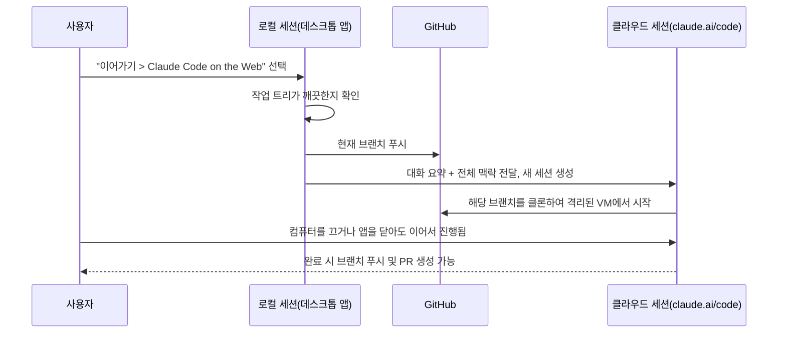
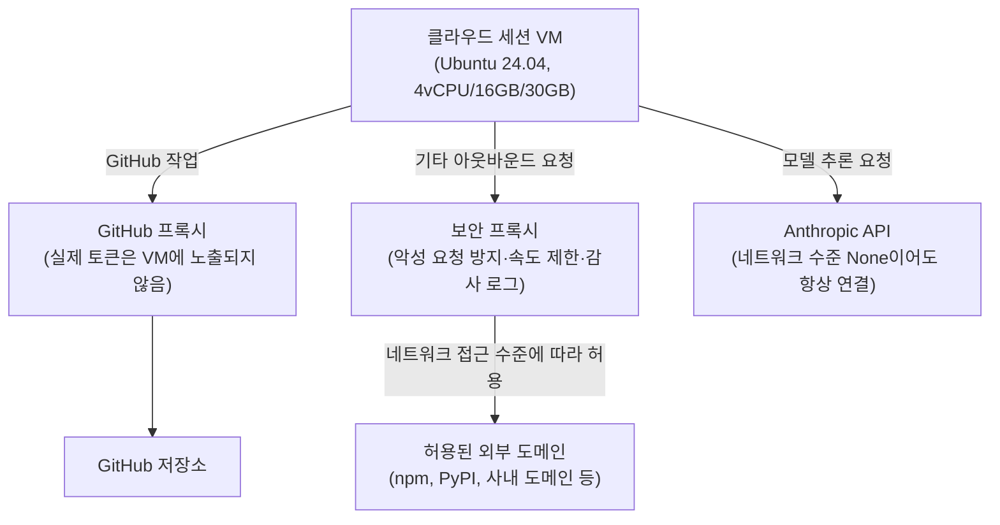
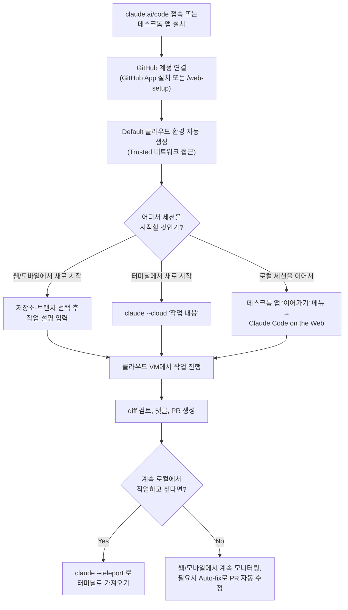

- 작성일: 2026년 8월 21일
- 근거 자료: Anthropic 공식 Claude Code 문서(code.claude.com/docs) 실시간 조회 결과
- 대상: AI바이브코딩기초클래스 강의/학습 자료

---

## 1. 무엇을 보고 있는가 — 전체 그림 먼저 잡기

첨부해 주신 첫 번째 화면은 Claude Code **데스크톱 앱**의 "코드(Code)" 탭에서 로컬 세션을 시작하려는 순간을 보여준다. 화면 상단에는 현재 실행 환경이 "로컬"로 설정되어 있고, 그 옆에 작업 대상 프로젝트 폴더 이름이 "MusicVideo", 그다음에 현재 브랜치가 "main", 마지막으로 "워크트리"라는 체크박스가 나란히 배치되어 있다. 그 아래에는 "이 세션을 클라우드에서 실행"이라는 제목의 안내 배너가 떠 있고, "Claude는 컴퓨터가 꺼져 있어도 계속 작업하며 검토를 위한 풀 리퀘스트를 열 수 있습니다. 클라우드의 복사본에서 작업하므로 커밋되지 않은 변경 사항은 이 컴퓨터에 그대로 유지됩니다"라는 설명과 "사용해보기" 버튼이 붙어 있다. 그 아래에는 실제 프롬프트 입력창("작업을 설명하거나 질문하세요")이 있고, 맨 아래 줄에는 권한 모드("자동"), 첨부/마이크 버튼, 그리고 오른쪽 끝에 현재 선택된 모델("Opus 4.6")과 추론 강도("높음")가 표시되어 있다.

두 번째로 첨부해 주신 화면은 이 기능을 검색했을 때 나오는 구글 검색 결과 목록으로, "Configure cloud environments – Claude Code Docs", "Use Claude Code on the web", "Claude Code on the web - Claude by Anthropic" 같은 공식 문서 페이지들이 상위에 노출되어 있다. 즉 두 화면을 종합하면, 사용자가 궁금해하는 대상은 **Claude Code 데스크톱 앱에서 로컬로 진행 중이던 세션을 클라우드로 넘겨 계속 실행하는 기능**, 그리고 그 기반이 되는 **"Claude Code on the web"(클라우드 세션)** 전체 시스템이라는 것을 알 수 있다. 이 문서는 이 둘을 순서대로, 그리고 화면에 등장한 다른 요소들(워크트리, 모델, 추론 강도, 자동 모드)까지 하나씩 짚어가며 설명한다.

아래 표는 이번 문서에서 다루는 핵심 소재를 한눈에 정리한 것이다.

| 화면 요소 | 정체 | 이 문서에서의 위치 |
|---|---|---|
| 로컬 / MusicVideo / main / 워크트리 | 데스크톱 앱 세션의 실행 환경·프로젝트·브랜치·격리 방식 표시줄 | 2장, 5장 |
| "이 세션을 클라우드에서 실행" 배너 | 데스크톱 앱의 "다른 표면으로 이어가기(Continue in)" 메뉴 중 "Claude Code on the Web" 기능 | 3장 |
| Claude Code on the web 자체 | claude.ai/code에서 동작하는 클라우드 세션 시스템 전체 | 4장 |
| Opus 4.6 / 높음 | 선택된 모델과 추론 강도(Effort level) | 6장 |
| 자동 | 권한 모드(Permission mode) 중 Auto 모드 | 7장 |

---

## 2. Claude Code 데스크톱 앱의 "코드" 탭 구조

Claude 데스크톱 앱은 대화형 챗을 위한 **Chat** 탭, 리서치·문서 작업 등 더 긴 호흡의 작업을 맡기는 **Cowork** 탭, 그리고 소프트웨어 개발 전용인 **Code** 탭, 이렇게 세 개의 탭으로 구성되어 있다. 이 중 Code 탭이 바로 캡처 화면에 나온 그 인터페이스다. Code 탭에서 대화 하나하나는 "세션"이라고 부르며, 세션은 각자 독립된 대화 기록과 프로젝트 폴더, 코드 변경 사항을 가진다. 사이드바에는 지금까지 만든 세션 목록이 나열되고, 여러 세션을 동시에 병렬로 돌릴 수 있다.

세션을 새로 시작할 때 사용자가 정해야 하는 것은 크게 네 가지다. 첫째는 **환경(Environment)** 으로, Claude가 어디에서 실행될지를 정한다. 내 컴퓨터에서 직접 돌리는 "로컬(Local)", 앱을 닫아도 계속 실행되는 "클라우드(Cloud)", 사용자가 직접 관리하는 원격 서버에 SSH로 접속해서 돌리는 "SSH 연결", 그리고 윈도우 사용자라면 "WSL 배포판" 중에서 고를 수 있다. 둘째는 **프로젝트 폴더**로, Claude가 작업할 저장소나 폴더를 지정한다(클라우드 세션은 여러 저장소를 동시에 추가할 수도 있다). 셋째는 **모델**이고, 넷째는 **권한 모드**다. 이 네 가지가 바로 캡처 화면 상단·하단 바에 나열되어 있던 항목들이다: "로컬"은 환경, "MusicVideo"는 프로젝트 폴더, "Opus 4.6"은 모델, "자동"은 권한 모드, 그리고 "main"과 "워크트리"는 프로젝트 폴더 설정에 딸린 부가 정보다.

---

## 3. 배너의 정체 — "다른 표면으로 이어가기(Continue in)" 기능

화면에 뜬 배너 "이 세션을 클라우드에서 실행"은 데스크톱 앱 세션 툴바의 **"이어가기(Continue in)" 메뉴** 기능을 안내 카드 형태로 미리 보여주는 것이다. 이 메뉴는 세션 툴바 오른쪽 아래의 VS Code 아이콘을 눌러서 열 수 있으며, 두 가지 선택지를 제공한다. 하나는 **"내 IDE에서 열기"** 로 현재 작업 디렉터리에서 지원되는 IDE(VS Code 등)를 여는 것이고, 다른 하나가 바로 **"Claude Code on the Web(웹에서 계속하기)"** 이다.

"웹에서 계속하기"를 선택하면 데스크톱 앱은 다음과 같은 순서로 동작한다. 먼저 현재 브랜치를 원격 저장소(GitHub)로 푸시하고, 지금까지 나눈 대화 내용을 요약해서, 그 요약과 전체 맥락을 담은 **새로운 클라우드 세션**을 claude.ai/code에 생성한다. 이 과정이 끝나면 로컬 세션을 그대로 보관할지 아니면 보관 처리(archive)할지 선택할 수 있다. 이 기능이 동작하려면 작업 트리(working tree)가 깨끗한 상태, 즉 커밋되지 않은 변경 사항이 없어야 하며, SSH 세션에서는 사용할 수 없다는 제약이 있다.

이 지점에서 배너에 적힌 문구가 정확히 설명된다. "클라우드의 복사본에서 작업하므로 커밋되지 않은 변경 사항은 이 컴퓨터에 그대로 유지됩니다"라는 문장은, 클라우드로 넘어가는 것은 **커밋된 상태(즉 브랜치에 반영된 코드)** 뿐이고, 아직 커밋하지 않은 로컬 작업 내용은 클라우드 VM으로 전송되지 않고 원래 컴퓨터에만 남는다는 뜻이다. 따라서 이 기능을 쓰기 전에는 진행 중이던 변경 사항을 먼저 커밋(또는 최소한 스테이징)해 두는 것이 안전하다.

아래 순서도는 이 흐름을 정리한 것이다.

---

## 4. Claude Code on the Web이란 무엇인가

이제 배너 뒤에 있는 더 큰 시스템, 즉 클라우드 세션 자체를 살펴볼 차례다. "Claude Code on the web"은 claude.ai/code라는 주소에서 웹 브라우저나 Claude 모바일 앱을 통해 접속할 수 있는, Anthropic이 관리하는 클라우드 인프라 위에서 작업을 실행하는 시스템이다. 공식 문서는 이 기능이 현재 Pro, Max, Team 사용자, 그리고 Enterprise 사용자 중 프리미엄 좌석 또는 Chat + Claude Code 좌석을 보유한 경우에 한해 "연구 프리뷰(research preview)" 단계로 제공된다고 명시하고 있다. 즉 아직 정식(GA) 기능이 아니라 베타에 가까운 상태다.

세션이 시작되는 흐름은 이렇다. 사용자가 작업을 요청하면 GitHub 저장소가 Anthropic이 관리하는 가상 머신(VM)에 새로 클론되고, 환경에 설정해 둔 준비 스크립트(있다면)가 실행된다. 그다음 환경의 네트워크 접근 수준에 따라 인터넷 접근이 설정되고, Claude가 코드를 분석하고 수정하고 테스트를 실행하며 작업한다. 이 과정은 사용자가 지켜보며 방향을 조정할 수도 있고, 자리를 비웠다가 나중에 결과만 확인할 수도 있다. 작업이 일단락되면 Claude는 변경 사항을 담은 브랜치를 GitHub에 푸시하고, 사용자는 그 변경 내용(diff)을 검토하고, 줄 단위로 댓글을 남기고, 풀 리퀘스트를 생성할 수 있다. 중요한 점은 브랜치를 푸시했다고 해서 세션이 끝나는 게 아니라는 것이다 — 같은 대화 안에서 PR을 만들고 추가 수정 요청을 계속 이어갈 수 있다.

같은 클라우드 세션 시스템은 웹 인터페이스뿐 아니라 여러 표면(surface)에서 공유된다. 터미널에서 `claude --cloud "작업 내용"` 명령으로 직접 클라우드 세션을 새로 만들 수도 있고, Slack 기반의 Claude Tag, 예약 실행 기능인 Routines, 그리고 지금 살펴보고 있는 데스크톱 앱과 모바일 앱에서도 모두 같은 클라우드 환경(cloud environment)을 사용한다.

### 4-1. GitHub 연동 방식

클라우드 세션이 저장소를 복제하고 브랜치를 푸시하려면 GitHub 접근 권한이 필요하다. 여기에는 두 가지 경로가 있다. 하나는 웹 온보딩 과정에서 **Claude GitHub App**을 설치하고 저장소 접근을 승인하는 방법이고, 다른 하나는 이미 로컬에서 GitHub CLI(`gh`)를 쓰고 있다면 터미널에서 `/web-setup` 명령 한 번으로 그 인증 토큰을 Claude 계정에 연결하는 방법이다. 어느 방법을 쓰든 클라우드 세션은 연결된 GitHub 계정이 접근할 수 있는 모든 저장소에 접근할 수 있으며, 이는 GitHub App이 설치된 저장소로 제한되는 것이 아니다(다만 PR에 대한 자동 반응 기능인 Auto-fix를 쓰려면 별도로 App을 해당 저장소에 설치해야 한다).

### 4-2. 클라우드 환경(Cloud Environment)이라는 설정 단위

세션이 실제로 돌아가는 "환경"은 사용자가 직접 만들고 편집할 수 있는 설정 묶음이다. 처음 온보딩을 마치면 **Default**라는 이름의 환경이 자동으로 만들어지는데, 이 환경은 별도 설정 없이 "신뢰됨(Trusted)" 수준의 네트워크 접근만 허용한다. 즉 npm, PyPI, GitHub 같은 잘 알려진 패키지 저장소나 개발 도구 사이트에는 접근할 수 있지만 그 외의 임의 도메인에는 접근하지 못한다.

네트워크 접근 수준은 총 네 가지로 나뉜다.

| 수준 | 허용되는 아웃바운드 연결 |
|---|---|
| None(없음) | 세션 네트워크를 통한 외부 연결 전혀 불가 |
| Trusted(신뢰됨, 기본값) | 패키지 저장소, GitHub, 주요 클라우드 SDK 등 사전 정의된 허용 목록만 |
| Full(전체) | 모든 도메인 |
| Custom(사용자 지정) | 직접 지정한 도메인 목록(기본 허용 목록 포함 여부 선택 가능) |

이 표에서 흥미로운 점은, 네트워크 접근이 "None"으로 설정되어 있어도 GitHub 관련 작업은 별도의 **GitHub 프록시**를 통해 항상 동작하고, Anthropic API와의 통신(즉 Claude 자체가 응답을 생성하는 통신)도 항상 유지된다는 것이다. 이는 보안과 편의성 사이의 균형을 잡기 위한 설계다.

환경에는 이 밖에도 `.env` 형식의 환경 변수와, 세션이 시작될 때 Claude가 작업을 시작하기 전에 한 번 실행되는 "설정 스크립트(setup script)"를 등록할 수 있다. 설정 스크립트는 루트 권한의 Ubuntu 24.04 환경에서 실행되며, 5분 이내에 종료되어야 하고, 성공적으로 끝나면 그 결과(설치된 패키지, 받아 놓은 컨테이너 이미지 등)가 파일시스템 스냅숏으로 캐싱되어 이후 세션들은 이 스크립트를 다시 실행하지 않고 곧바로 시작할 수 있다. 이 캐시는 대략 7일마다 새로 만들어진다.

### 4-3. 클라우드 VM에서 기본으로 제공되는 것들

Anthropic이 관리하는 클라우드 세션은 매번 Ubuntu 24.04(x86_64)로 새로 생성되는 가상 머신에서 실행되며, 자원 한도는 대략 다음과 같다.

| 자원 | 한도 |
|---|---|
| vCPU | 4개 |
| 메모리 | 16GB |
| 디스크 | 30GB |

이 VM에는 Python(pip, poetry, uv, pytest 등), Node.js 20/21/22, Ruby, PHP 8.4, Java(OpenJDK 21), Go, Rust, C/C++ 도구 체인, Docker, PostgreSQL 16과 Redis 7.0, 그리고 git·jq·ripgrep 같은 유틸리티가 미리 설치되어 있다. 다만 사용자가 자기 컴퓨터에만 설치해 둔 프로그램이나 개인 설정(`~/.claude/CLAUDE.md`, 사용자 범위 MCP 서버, 사용자 범위 플러그인 등)은 클라우드 세션에 그대로 이어지지 않는다 — 저장소에 커밋된 `CLAUDE.md`, `.claude/settings.json`, `.mcp.json` 등만 클라우드 세션에서도 그대로 유지된다. 이 지점 역시 배너 문구의 "클라우드의 복사본에서 작업"이라는 표현과 맞닿아 있다: 클라우드 세션은 로컬 컴퓨터 전체의 상태가 아니라 **저장소에 커밋된 내용의 사본**을 기준으로 새로 시작되는 독립된 실행 단위라는 뜻이다.

### 4-4. 보안과 격리

각 클라우드 세션은 여러 겹의 격리 장치를 통해 사용자의 컴퓨터 및 다른 세션들과 분리된다. 첫째, 세션마다 독립된 VM이 할당된다(조직이 자체 인프라에 구축한 "셀프 호스팅 환경"으로 라우팅하는 경우는 격리 책임이 해당 조직에 있다). 둘째, 위에서 설명한 네트워크 접근 수준으로 아웃바운드 연결이 제한된다. 셋째, GitHub 자격 증명이나 서명 키 같은 민감한 인증 정보는 VM 내부에 절대 들어가지 않고, 별도의 보안 프록시가 범위가 제한된 자격 증명으로 대신 처리한다. 넷째, 모든 아웃바운드 트래픽은 악성 요청 방지, 속도 제한, 콘텐츠 필터링, DNS 수준의 감사 기록을 제공하는 별도의 보안 프록시를 거친다.

아래는 이 구조를 정리한 그림이다.

### 4-5. 웹과 터미널 사이를 오가기: `--cloud`와 `--teleport`

지금까지 살펴본 흐름과 반대로, 터미널에서 클라우드 세션을 새로 만들 수도 있다. `claude --cloud "작업 내용"` 명령을 실행하면 현재 디렉터리의 GitHub 원격 저장소를 현재 브랜치 기준으로 클론해 새로운 클라우드 세션이 만들어지고, 이 작업은 로컬 작업과 별개로 백그라운드에서 진행된다. 반대로 이미 실행 중인 클라우드 세션을 터미널로 가져오고 싶다면 `claude --teleport`(또는 세션 안에서 `/teleport`)를 사용하면 된다. 이때는 로컬 작업 트리가 깨끗해야 하고, 정확히 같은 저장소의 체크아웃 상태여야 하며, 클라우드 세션에서 만들어진 브랜치가 원격에 푸시되어 있어야 하고, 같은 claude.ai 계정으로 로그인되어 있어야 한다는 네 가지 조건이 확인된다. 다만 이 흐름은 한 방향으로만 동작한다 — 즉 이미 진행 중인 터미널 세션을 그대로 클라우드로 밀어 올리는 기능은 없고, 데스크톱 앱의 "이어가기(Continue in)" 메뉴만이 로컬 세션을 클라우드로 보낼 수 있다.

### 4-6. 제한사항

클라우드 세션을 실무에 도입하기 전에 알아 두어야 할 제약도 있다. 먼저 클라우드 세션은 계정 전체의 사용량 한도(rate limit)를 로컬 세션과 함께 나눠 쓰며, 별도의 컴퓨트 요금은 부과되지 않는다. 또한 저장소를 클론하고 PR을 생성하는 기능은 GitHub 기반이어야 하며, GitLab이나 Bitbucket 같은 저장소는 로컬 번들 업로드 방식으로만 보낼 수 있고 결과를 다시 원격으로 푸시할 수는 없다. 마지막으로, 조직이 IP 허용 목록(IP allowlisting)을 켜 둔 경우 Anthropic이 관리하는 클라우드 세션은 조직 네트워크가 아니라 Anthropic 인프라에서 API를 호출하기 때문에 인증 오류가 발생할 수 있다.

---

## 5. 워크트리(Worktree)란 무엇인가

화면 상단 바의 "워크트리" 체크박스는 Git의 **워크트리(worktree)** 기능을 가리킨다. 일반적으로 하나의 Git 저장소는 한 번에 하나의 브랜치만 체크아웃할 수 있지만, `git worktree`를 쓰면 같은 저장소에서 여러 개의 독립된 작업 디렉터리를 동시에 만들어 각각 다른 브랜치를 체크아웃할 수 있다. Claude Code 데스크톱 앱은 여러 세션을 병렬로 돌릴 때 이 기능을 자동으로 활용한다 — 세션마다 별도의 워크트리를 만들어 주기 때문에, 한 세션에서의 변경 사항이 커밋되기 전까지는 다른 세션에 영향을 주지 않는다. 기본적으로 워크트리는 `<프로젝트-루트>/.claude/worktrees/` 아래에 저장되며, 이 위치나 브랜치 접두사는 설정에서 바꿀 수 있다. 화면의 체크박스는 현재 세션이 워크트리 격리를 사용할지 여부를 보여주는 표시로 볼 수 있다.

---

## 6. 모델과 추론 강도: "Opus 4.6"과 "높음"이 의미하는 것

화면 하단 오른쪽에 표시된 "Opus 4.6"은 이 세션이 사용하도록 선택된 모델의 이름이고, "높음"은 그 옆에 붙은 **추론 강도(Effort level)** 설정이다.

### 6-1. Opus 4.6은 어떤 모델인가

Claude Code의 모델 별칭 체계에서 `opus`라는 별칭은 시간이 지나며 계속 최신 버전을 가리키도록 갱신되어 왔다. 문서에 따르면 Anthropic API 기준으로 `opus` 별칭은 현재(2026년 8월) **Opus 5**를 가리키고 있으며, 그 이전에는 순서대로 Opus 4.8(2026년 2월경부터), 그 이전에는 플랫폼에 따라 Opus 4.7 또는 Opus 4.6을 가리켰다. 즉 **Opus 4.6은 Opus 계열의 이전 세대 모델**로, 지금은 최신 별칭이 가리키는 모델은 아니지만 Claude Code에서는 여전히 명시적으로 선택할 수 있는 모델로 남아 있다. 화면 속 세션은 이 이전 세대 모델을 사용자가 직접 지정해 두었거나, 혹은 조직·프로젝트 설정에서 기본값으로 고정해 둔 상태로 보인다.

참고로 Opus 4.6은 지금도 실무적으로 의미 있는 위치에 있다. 예를 들어 데스크톱 앱의 "자동(Auto)" 권한 모드는 "Claude Opus 4.6 이상, Sonnet 4.6 이상, 또는 Fable 5"를 요구 조건으로 명시하고 있어, 화면에서 "자동" 모드가 활성화되어 있다는 사실 자체가 Opus 4.6이 그 요구 조건을 충분히 만족한다는 것을 보여준다.

### 6-2. 추론 강도(Effort Level)란 무엇인가

Effort level은 모델이 각 단계에서 얼마나 깊이 "생각"할지(적응형 추론, adaptive reasoning)를 조절하는 설정이다. 낮은 강도는 단순한 작업에서 더 빠르고 저렴하게 응답하고, 높은 강도는 복잡한 문제에 더 깊은 추론을 투입한다. Opus 4.6과 Sonnet 4.6은 `low`, `medium`, `high`, `max` 네 단계를 지원하며(더 최신 모델인 Opus 5·Sonnet 5·Fable 5 등은 `xhigh` 단계가 하나 더 있다), 대부분의 모델에서 **기본값은 `high`("높음")** 다. 화면에 표시된 "높음"은 바로 이 기본 설정 그대로다.

| 강도 | 언제 쓰는가 |
|---|---|
| 낮음(low) | 짧고 범위가 명확하며 응답 속도가 중요한, 지적 난이도가 낮은 작업 |
| 보통(medium) | 비용에 민감하고 어느 정도 지능을 양보해도 되는 작업 |
| 높음(high, 기본값) | 토큰 사용량과 지능 사이의 균형 — 대부분의 코딩 작업에 적합 |
| 초고(xhigh, 신형 모델만) | 더 깊은 추론이 필요하지만 토큰을 더 많이 쓰는 작업 |
| 최대(max) | 가장 어려운 작업에 쓰되, 과도하게 생각해서 오히려 성능이 떨어질 수도 있어 신중히 테스트 후 사용 |

효과 수준은 세션 중 언제든 `/effort` 명령이나 모델 선택 메뉴의 좌우 화살표, 또는 데스크톱 앱이라면 모델 드롭다운 옆의 슬라이더로 바꿀 수 있다.

---

## 7. "자동" — 권한 모드(Permission Mode)

하단 왼쪽의 "자동"은 Claude가 파일을 수정하거나 명령을 실행하기 전에 매번 허락을 구할지 여부를 정하는 **권한 모드** 설정이다. Claude Code의 권한 모드는 크게 다섯 가지다: 매 변경마다 승인을 요구하는 **수동(Manual)**, 파일 편집과 흔한 파일시스템 명령은 자동 승인하되 그 외 터미널 명령은 물어보는 **편집 자동 수락(Accept edits)**, 소스 코드를 건드리지 않고 탐색과 계획 수립만 하는 **계획(Plan)**, 배경에서 안전성 검사를 수행하면서 대부분의 행동을 자동 실행하는 **자동(Auto)**, 그리고 거의 모든 승인 절차를 건너뛰는 **권한 우회(Bypass permissions)** 다. 이 중 자동 모드는 앞서 언급했듯 Opus 4.6 이상, Sonnet 4.6 이상, 또는 Fable 5에서만 나타나며, 승인 프롬프트를 줄이면서도 별도의 안전성 분류기가 각 행동을 검토하도록 설계되어 있다. 참고로 클라우드 세션에서는 수동 모드와 권한 우회 모드를 선택할 수 없고, 편집 자동 수락·계획·자동 세 가지만 지원된다는 점도 기억해 둘 만하다.

---

## 8. 실제로 이 기능을 쓰는 절차

지금까지 다룬 내용을 실제 사용 순서로 정리하면 다음과 같다.

---

## 9. 데스크톱 vs 웹 vs 터미널 vs Remote Control 비교

Claude Code는 어디서 실행하든 동일한 엔진이 동작하지만, 코드가 실제로 어디서 돌아가는지와 로컬 설정을 쓸 수 있는지가 다르다.

| 구분 | 웹(Claude Code on the web) | Remote Control | 터미널 CLI | 데스크톱 앱 |
|---|---|---|---|---|
| 코드 실행 위치 | 클라우드 VM(기본은 Anthropic 관리) | 사용자 컴퓨터 | 사용자 컴퓨터 | 로컬 또는 클라우드 VM 선택 |
| 대화 인터페이스 | claude.ai 또는 모바일 앱 | claude.ai 또는 모바일 앱 | 터미널 | 데스크톱 UI |
| 로컬 설정 사용 여부 | 아니오(저장소만) | 예 | 예 | 로컬 세션은 예, 클라우드 세션은 아니오 |
| GitHub 필요 여부 | 예(또는 로컬 번들 업로드) | 아니오 | 아니오 | 클라우드 세션에서만 필요 |
| 연결 끊겨도 계속 실행 | 예 | 터미널이 열려 있는 동안만 | 아니오 | 세션 종류에 따라 다름 |
| 지원 권한 모드 | 편집 자동 수락, 계획, 자동 | 수동, 편집 자동 수락, 계획 | 전체 모드 | 세션 종류에 따라 다름 |

---

## 10. 한국어 용어 정리

| 영문 용어 | 이 문서에서 쓰는 한국어 표현 | 의미 |
|---|---|---|
| Session | 세션 | 독립된 대화 기록과 프로젝트, 변경 사항을 가진 작업 단위 |
| Cloud session | 클라우드 세션 | Anthropic 관리 VM(또는 조직의 셀프 호스팅 환경)에서 실행되는 세션 |
| Cloud environment | 클라우드 환경 | 네트워크 접근 수준·환경 변수·설정 스크립트를 묶은 설정 단위 |
| Worktree | 워크트리 | 같은 저장소에서 여러 브랜치를 동시에 체크아웃해 세션 간 격리를 제공하는 Git 기능 |
| Effort level | 추론 강도 | 모델이 각 단계에서 얼마나 깊이 사고할지 정하는 설정(낮음~최대) |
| Permission mode | 권한 모드 | Claude가 파일 수정·명령 실행 전 승인을 구하는 방식(수동/자동수락/계획/자동/우회) |
| Auto mode | 자동 모드 | 배경 안전성 분류기가 검토하며 대부분의 행동을 자동 승인하는 권한 모드 |
| Teleport | 텔레포트 | 클라우드 세션을 터미널로 가져와 이어서 작업하는 기능 |
| Continue in | 이어가기 | 데스크톱 세션을 다른 표면(웹, IDE)으로 넘기는 메뉴 |
| Setup script | 설정 스크립트 | 클라우드 세션 시작 시 Claude 실행 전에 한 번 도는 준비용 Bash 스크립트 |
| GitHub proxy | GitHub 프록시 | 실제 GitHub 자격 증명을 VM 밖에 두고 대신 처리하는 보안 계층 |

---

## 11. 사실 확인 등급 부록

이 문서에 담긴 내용은 등급을 나누면 다음과 같다.

**1등급 — 공식 1차 자료로 직접 확인된 사실**
Claude Code 공식 문서(code.claude.com/docs, 2026년 8월 21일 기준 최신본)를 직접 조회하여 확인한 내용이다: Claude Code on the web의 연구 프리뷰 상태와 대상 플랜, 클라우드 세션의 VM 사양(4vCPU/16GB/30GB, Ubuntu 24.04), 네트워크 접근 수준 4단계, GitHub 인증 두 가지 경로, 데스크톱 앱의 "이어가기" 메뉴 동작 방식과 깨끗한 작업 트리 요구 조건, `--cloud`·`--teleport` 명령의 조건, 워크트리 저장 위치, 효과 수준(Effort level) 표와 기본값, 자동 모드의 모델 요구 조건, 클라우드 세션에서 지원되는 권한 모드 목록.

**2등급 — 여러 공식 문서 페이지에서 교차 확인된 내용**
모델 별칭 `opus`의 시대별 해석 변화(Opus 4.6 → 4.7 → 4.8 → 5)는 model-config 문서 한 페이지 안에서 여러 차례 언급된 내용을 종합한 것으로, 정확한 전환 시점(버전 번호 기준)까지 문서에 명시되어 있어 신뢰도가 높다.

**3등급 — 단일 진술 또는 화면 판독에 근거한 해석**
업로드된 화면 속 "자동", "높음", "워크트리" 체크박스가 정확히 어떤 하위 상태(예: 체크박스가 켜져 있는지 꺼져 있는지)를 나타내는지는 화면 해상도상 완전히 단정하기 어려운 부분이 있어, 이 문서에서는 각 UI 요소의 "기능적 정체"를 설명하는 데 집중했고 화면 속 정확한 온/오프 상태에 대한 단정적 서술은 피했다.

**4등급 — 명시적으로 다루지 않은 부분**
Opus 4.6의 정확한 출시일자나 Opus 4.7·4.8·5로의 전환이 이루어진 정확한 달력 날짜는 이번에 조회한 문서들에 명시되어 있지 않아 이 문서에서도 추정하지 않았다.

---

## 12. 참고 자료

- Claude Code 문서 전체 지도: https://code.claude.com/docs/en/claude_code_docs_map.md
- Claude Code on the web(클라우드 세션 레퍼런스): https://code.claude.com/docs/en/claude-code-on-the-web.md
- 클라우드 환경 설정: https://code.claude.com/docs/en/cloud-environments.md
- Claude Code on the web 시작 가이드: https://code.claude.com/docs/en/web-quickstart.md
- 데스크톱 애플리케이션 레퍼런스: https://code.claude.com/docs/en/desktop.md
- 모델 설정(모델 별칭·추론 강도·컨텍스트): https://code.claude.com/docs/en/model-config.md

---

*이 문서는 Anthropic 공식 문서를 2026년 8월 21일 기준으로 직접 조회하여 작성되었습니다. Claude Code on the web은 현재 연구 프리뷰 단계이므로, 세부 사양(리소스 한도, 지원 플랜, 네트워크 정책 등)은 이후 변경될 수 있습니다. 최신 내용은 위 참고 자료 링크에서 직접 확인하시길 권합니다.*
