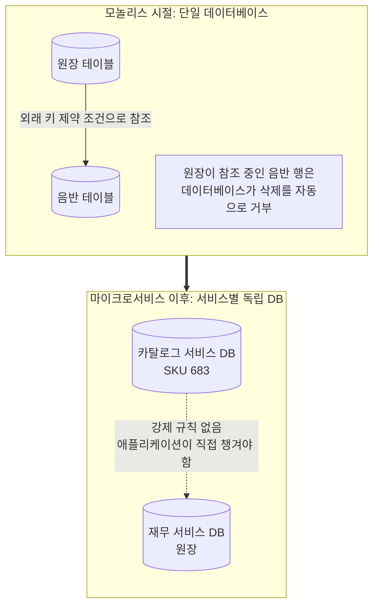
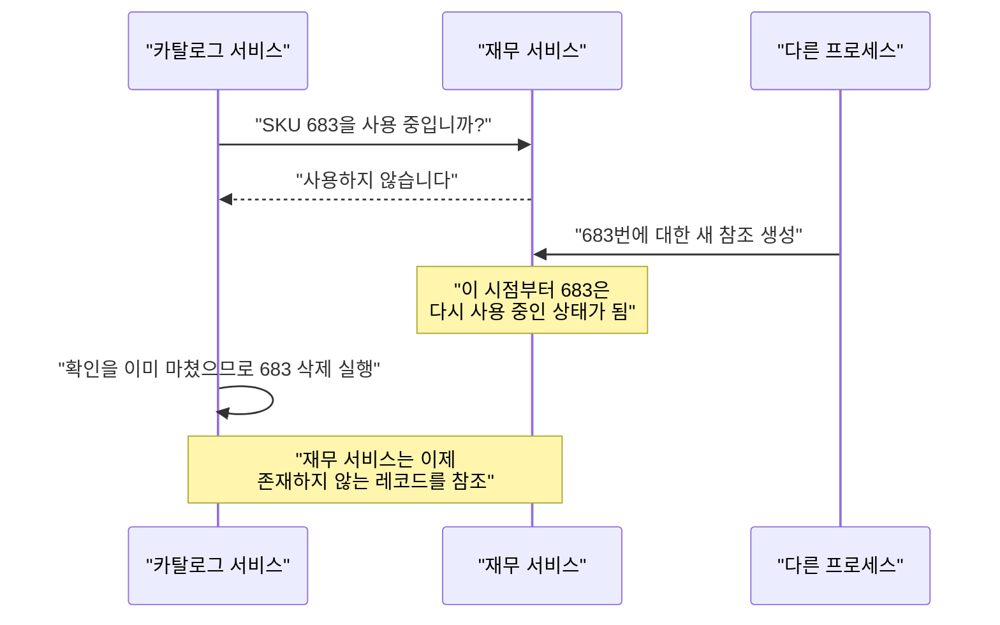
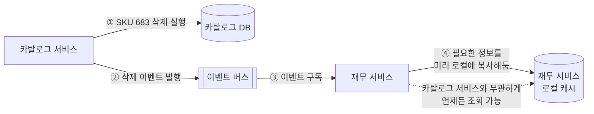
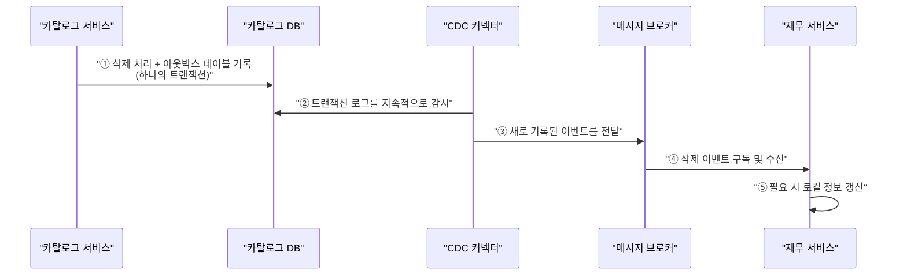
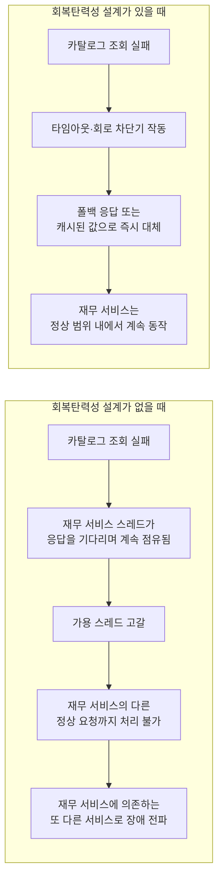
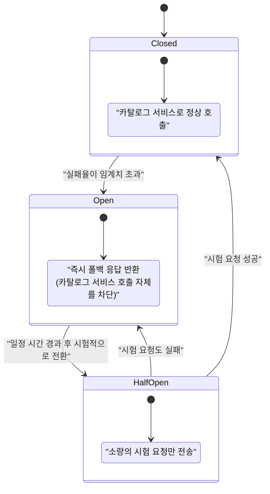

## 마이크로서비스에서 "삭제"라는 골치 아픈 문제 — 샘 뉴먼의 『마이크로서비스 도입, 이렇게 한다』 4장을 중심으로

---

### 이 문서를 읽기 전에 (자료 출처와 검증 범위)

이 문서는 업로드해주신 책 페이지 네 장을 바탕으로 작성되었다. 표지 페이지를 통해 확인한 서지 정보는 다음과 같다. 원서는 샘 뉴먼(Sam Newman)이 쓴 『Monolith to Microservices: Evolutionary Patterns to Transform Your Monolith』이며, 국내에는 박재호 번역, 책만 출판사를 통해 2021년 1월 20일 『마이크로서비스 도입, 이렇게 한다』라는 제목으로 출간되었다[1][2]. 저자 샘 뉴먼은 오라일리에서 출간한 『마이크로서비스 아키텍처 구축(Building Microservices)』의 저자이기도 하며, 소트웍스(ThoughtWorks)에서 12년간 근무한 뒤 마이크로서비스·클라우드·지속적 배포를 전문으로 하는 독립 컨설턴트로 활동해왔다[3].

나머지 세 장의 페이지는 이 책의 4장 "데이터베이스 분해" 중 216쪽과 217쪽, 그리고 이어지는 삭제 처리 관련 내용을 담고 있다. 이 문서의 2장부터 6장까지는 해당 페이지에 담긴 저자의 논지를 필자가 이해하기 쉽게 풀어쓰고 재구성한 것이며, 원문을 그대로 옮기지 않고 개념 단위로 다시 서술했다는 점을 밝혀둔다. 7장은 2026년 현재 시점에서 업계가 이 문제를 어떻게 보완하고 있는지를 웹 검색으로 확인한 내용을 바탕으로 정리했으며, 8장은 책의 논지와 최신 동향을 종합한 필자의 해석이다. 어느 부분이 책의 내용이고 어느 부분이 최신 보완 자료이며 어느 부분이 필자의 해석인지는 마지막 9장에 표로 명확히 구분해두었다.

참고로 원문 페이지 중 삭제 금지 방식을 다루는 부분에는 "휴지통 테이블"이라는 표현 옆에 각주 번호 7번이 붙어 있었으나, 촬영된 페이지 범위 안에는 그 각주의 실제 내용이 포함되어 있지 않았다. 따라서 이 문서에서는 해당 각주가 어떤 참고 자료를 가리키는지 추측하지 않고 그대로 남겨두었다.

---

### 목차

1. 들어가며 — 왜 "삭제"가 마이크로서비스에서 유독 큰 문제가 되는가
2. 문제의 배경 — 카탈로그 서비스와 재무 서비스가 갈라질 때 사라지는 것
3. 선택지 1 — "삭제하기 전에 확인해보자"와 그 함정
4. 선택지 2 — 우아하게 실패를 알리는 삭제 처리
5. 선택지 3 — 아예 삭제를 허용하지 않는다
6. 저자의 결론 — 두 가지 해법을 조합하라
7. 2026년 현재 시점에서 보는 이 문제 — 아웃박스, CDC, 사가, 톰스톤
8. 종합 정리 — 일관성과 성능은 왜 항상 씨름하는가
9. 검증된 사실 / 최신 보완 자료 / 필자 해석 구분표
10. 부록 — "실패를 정상적인 시나리오로 받아들이는 설계", 저자의 발언을 더 깊이 들여다보기
11. 참고 자료

---

## 1장. 들어가며 — 왜 "삭제"가 마이크로서비스에서 유독 큰 문제가 되는가

하나의 데이터베이스 안에서 모든 테이블이 살고 있을 때는 삭제라는 동작이 사실 그리 무섭지 않다. 관계형 데이터베이스의 외래 키 제약 조건이 알아서 지켜주기 때문이다. 예를 들어 원장 테이블이 앨범 테이블의 특정 행을 참조하고 있다면, 데이터베이스 엔진은 그 앨범 행을 삭제하려는 시도 자체를 거부한다. 개발자가 이 규칙을 몰라도, 심지어 깜빡 잊고 삭제 쿼리를 날려도 데이터베이스가 알아서 안전망 역할을 해준다.

문제는 마이크로서비스로 시스템을 쪼개는 순간 이 안전망이 통째로 사라진다는 데 있다. 카탈로그를 관리하는 서비스와 재무를 관리하는 서비스가 각자 자신만의 데이터베이스를 갖게 되면, 더 이상 데이터베이스 수준의 외래 키 제약이라는 것이 존재하지 않는다. 두 서비스는 네트워크로 분리된 완전히 다른 세계에 살게 되고, 한쪽에서 일어나는 삭제가 다른 쪽에 어떤 영향을 미치는지는 데이터베이스가 아니라 애플리케이션 개발자가 직접 설계해야 하는 문제가 된다.

책의 저자는 바로 이 지점을 이 책 4장 "데이터베이스 분해"에서 짚는다. 모놀리스를 마이크로서비스로 마이그레이션하는 작업은 단순히 코드를 옮기는 작업이 아니라, 데이터베이스가 공짜로 보장해주던 정합성 규칙들을 하나하나 애플리케이션 레벨에서 다시 만들어야 하는 작업이라는 것이다. 삭제 문제는 그중에서도 가장 까다로운 축에 속하는데, 조회나 생성과 달리 삭제는 "되돌릴 수 없는 상태 변화"이면서 동시에 "다른 서비스가 참조하고 있을 가능성"을 늘 동반하기 때문이다.

---

## 2장. 문제의 배경 — 카탈로그 서비스와 재무 서비스가 갈라질 때 사라지는 것

책에서 드는 예시는 음반 판매 시스템이다. 원래 하나의 스키마 안에 있던 시스템을 카탈로그(어떤 음반이 존재하는지)와 재무(그 음반이 실제로 얼마나 팔렸고 정산은 어떻게 되는지)라는 두 개의 서비스로 쪼갠 상황을 가정한다. 단일 스키마를 쓰던 시절에는 원장 테이블에서 특정 SKU(재고 관리 코드)에 대한 참조가 남아 있는 한, 음반 테이블에서 그 SKU에 해당하는 행을 지울 수 없었다. 이 강제 규칙 덕분에 두 데이터 사이의 일관성이 자동으로 지켜졌다.

그런데 카탈로그와 재무가 각각 독립된 스키마를 가진 별도의 서비스로 분리되고 나면, 이 강제 규칙은 더 이상 존재하지 않는다. 카탈로그 서비스는 재무 서비스가 자신이 관리하는 SKU를 참조하고 있는지 전혀 알 방법이 없고, 반대로 재무 서비스도 카탈로그 서비스의 데이터베이스에 직접 접근해 참조 무결성을 확인할 방법이 없다. 이 상태에서 카탈로그 서비스가 특정 SKU를 삭제하고 싶다면 어떻게 해야 하는가라는 질문이 이 장의 핵심 주제다.

아래는 이 변화를 도식으로 정리한 것이다.

이 그림에서 볼 수 있듯, 마이크로서비스로의 전환이 가져오는 것은 유연성과 확장성만이 아니다. 동시에 모놀리스에서는 아예 발생할 수 없었던 새로운 종류의 실패 모드를 함께 만들어낸다는 것이 저자의 핵심 주장이다. 책 217쪽에서 저자는 이 점을 분명히 짚으며, 마이크로서비스를 도입하는 팀이라면 이런 새로운 실패 모드가 생긴다는 사실 자체를 받아들이고, 각 상황에 맞는 해법을 구체적으로 이해한 뒤 선택해야 한다고 말한다.

---

## 3장. 선택지 1 — "삭제하기 전에 확인해보자"와 그 함정

가장 직관적으로 떠오르는 방법은 이것이다. 카탈로그 서비스가 SKU 683을 삭제하기 전에, 재무 서비스에게 "683번을 지금 사용하고 있습니까?"라고 먼저 물어보는 것이다. 재무 서비스가 "사용하지 않습니다"라고 응답하면 그제서야 카탈로그 서비스가 안심하고 레코드를 삭제한다는 흐름이다.

책은 이 방식을 두고 겉보기에는 합리적이지만 실제로는 강하게 비권장한다고 밝힌다. 문제는 크게 두 가지다.

첫 번째는 시점의 문제다. 재무 서비스가 "사용하지 않는다"고 응답한 바로 그 순간과, 카탈로그 서비스가 실제로 삭제를 실행하는 순간 사이에는 항상 시간차가 존재한다. 이 짧은 틈 사이에 다른 프로세스가 683번에 대한 새로운 참조를 만들어버리면, 카탈로그 서비스는 방금 확인했다는 이유로 삭제를 강행하고, 결과적으로 재무 서비스는 더 이상 존재하지 않는 레코드를 참조하는 상태에 놓이게 된다. 아래 순서도는 이 경쟁 상태(race condition)를 보여준다.

이 문제를 근본적으로 막으려면 삭제 작업이 끝날 때까지 683번에 대한 새로운 참조 생성 자체를 막아야 하는데, 이는 카탈로그 서비스 하나만이 아니라 그 레코드를 사용할 수 있는 모든 분산 시스템에 걸쳐 잠금(lock)을 걸어야 한다는 뜻이다. 책은 이런 종류의 분산 잠금과 분산 상태 머신 구현이 대단히 어렵고, 실무적으로 감당하기 힘든 복잡도를 가져온다고 지적한다.

두 번째 문제는 결합도의 문제다. "레코드가 이미 사용 중인지 확인하는" 이 단순해 보이는 동작은 사실 카탈로그 서비스가 자신의 데이터를 사용하는 다른 모든 서비스의 존재와 상태를 알아야 한다는 것을 의미한다. 정상적인 마이크로서비스 설계에서는 카탈로그 같은 상류(upstream) 서비스가 자신의 데이터를 누가 어떻게 쓰는지 몰라도 되는 것이 바람직하다. 그런데 삭제 전 확인 방식은 이 의존 방향을 거꾸로 뒤집어버린다. 카탈로그 서비스가 재무 서비스를 direct하게 알아야 하고, 만약 카탈로그 데이터를 참조하는 서비스가 하나가 아니라 여러 개로 늘어나면 확인해야 할 대상도 함께 늘어나면서 결합도는 기하급수적으로 나빠진다. 책은 이런 이유로 이 옵션을 아예 고려 대상에서 제외할 것을 강하게 권고한다고 명시하고 있다.

---

## 4장. 선택지 2 — 우아하게 실패를 알리는 삭제 처리

두 번째로 책이 제시하는 방법은 발상을 바꾸는 것이다. "삭제해도 되는지 미리 확인한다"는 접근 대신, "삭제는 그냥 하되, 나중에 그 데이터를 찾는 쪽에서 없다는 사실을 우아하게 알아차리게 만든다"는 접근이다.

가장 단순한 형태는 카탈로그 서비스가 존재하지 않는 SKU를 요청받았을 때 단순 오류를 던지는 대신, "이 음반 정보는 더 이상 사용할 수 없음"이라는 명확한 신호를 응답에 담아 돌려주는 것이다. 여기서 책은 HTTP를 예로 들며 404 Not Found와 410 Gone이라는 두 응답 코드의 차이를 활용할 것을 제안한다.

404는 "요청한 자원을 찾을 수 없다"는 의미로, 애초에 존재한 적이 없는 주소를 요청했을 때와 원래 있었지만 지금은 없어진 주소를 요청했을 때를 구분하지 않는다. 반면 410은 "이 자원은 예전에는 분명히 존재했지만 지금은 의도적으로, 그리고 영구적으로 사라졌다"는 훨씬 더 구체적인 의미를 전달한다. 실제로 HTTP 명세를 관리하는 문서에서도 서버가 자원이 영구적으로 사라졌다는 사실을 알고 있는 경우에는 404보다 410을 사용하는 것이 권장된다고 명시되어 있으며, 이 구분은 검색 엔진의 색인 관리뿐 아니라 API를 호출하는 클라이언트가 재시도 여부를 판단하는 데에도 실질적인 차이를 만든다[22][27]. 책은 데이터 불일치 문제를 추적할 때 이 두 응답 코드의 구분이 특히 중요할 수 있다고 강조한다. 재무 서비스 입장에서 "이 SKU는 애초에 존재한 적이 없다"와 "이 SKU는 있었는데 지워졌다"는 완전히 다른 의미를 가지며, 후자의 경우라면 재무 서비스가 삭제되기 전에 캐시해둔 정보를 활용하거나 별도의 예외 처리 로직을 태울 수 있기 때문이다.

여기서 한 걸음 더 나아간 방법도 책에 소개되어 있다. 카탈로그 서비스가 물품을 삭제할 때 그 사실을 알리는 이벤트를 발행하고, 재무 서비스처럼 그 정보가 필요한 다른 서비스가 이 이벤트를 미리 구독해서, 삭제되기 전에 필요한 정보를 자신의 로컬 데이터베이스로 복사해두는 방식이다. 이렇게 하면 재무 서비스는 카탈로그 서비스가 살아있는지, 그 레코드가 아직 존재하는지와 무관하게 자신이 필요한 정보를 항상 자기 데이터베이스에서 바로 조회할 수 있다. 책은 이 방식이 다소 과해 보일 수 있지만, 서비스 경계를 넘나드는 연쇄적인 삭제 처리가 필요한 시나리오에서는 충분히 유용하다고 설명한다.

---

## 5장. 선택지 3 — 아예 삭제를 허용하지 않는다

세 번째 방법은 앞선 두 방법과는 결이 다르다. 문제를 해결하려 애쓰는 대신, 문제가 발생할 수 있는 조건 자체를 없애버리는 것이다. 카탈로그 서비스에서 물리적인 삭제 자체를 아예 허용하지 않으면, "삭제된 레코드를 누군가 참조하고 있다"는 상황 자체가 원천적으로 발생하지 않는다.

책이 제안하는 구체적인 구현 방식은 논리적 삭제, 흔히 소프트 삭제(soft delete)라고 불리는 기법이다. 실제로 행을 지우는 대신 상태를 나타내는 열(column)을 두어 해당 행을 "사용 불가"로 표시하거나, 삭제 대상 레코드를 별도의 "휴지통" 성격의 테이블로 옮기는 방식이다. 이렇게 하면 카탈로그 서비스 관점에서 특정 음반은 더 이상 판매 목록에 노출되지 않지만, 그 음반의 원래 레코드 자체는 데이터베이스 어딘가에 여전히 남아 있다. 그 결과 재무 서비스는 언제든 필요할 때 그 음반의 레코드를 요청할 수 있고, 카탈로그 서비스는 데이터가 실제로 사라졌는지 걱정할 필요 없이 항상 응답을 돌려줄 수 있다.

이 방식의 장점은 명확하다. 앞서 다룬 삭제 전 확인이나 이벤트 구독 같은 복잡한 조정 로직이 전혀 필요 없다. 반면 대가도 있다. 삭제되었다고 표시된 레코드가 데이터베이스 안에 계속 쌓이기 때문에, 시간이 지날수록 테이블 크기가 커지고 조회 성능에 영향을 줄 수 있다. 또한 정상적으로 조회할 때는 "삭제 표시가 된 레코드"를 걸러내야 하므로, 카탈로그 서비스의 모든 조회 경로가 이 필터링 규칙을 빠짐없이 적용해야 한다는 새로운 부담이 생긴다. 이 부분은 이후 7장에서 2026년 현재의 실무 논의를 통해 조금 더 자세히 다룬다.

---

## 6장. 저자의 결론 — 두 가지 해법을 조합하라

책은 마지막으로 저자 본인이라면 이 상황에서 어떤 선택을 할지를 명확히 밝힌다. 저자는 두 가지 방법을 함께 쓰겠다고 말한다. 첫째, 카탈로그 서비스에서 음반 정보의 물리적 삭제를 허용하지 않는 것(5장에서 다룬 방식), 둘째, 재무 서비스가 카탈로그 정보를 조회하다가 원하는 레코드를 찾지 못하는 상황에 대비해 이를 견고하게 처리할 수 있도록 만드는 것(4장에서 다룬 우아한 실패 처리 방식)이다.

여기서 저자가 강조하는 대목이 인상 깊다. 카탈로그 서비스가 삭제를 아예 허용하지 않는다면 재무 서비스의 조회가 실패할 일이 없지 않겠냐고 반문할 사람도 있겠지만, 저자는 그렇게 낙관할 수 없다고 말한다. 데이터 손상이나 예기치 못한 장애로 카탈로그 서비스가 이전 상태로 복구되는 상황이 생기면, 재무 서비스가 찾고 있는 레코드가 실제로 더 이상 존재하지 않는 순간이 여전히 발생할 수 있다는 것이다. 이런 상황은 드물지만, 저자는 항상 회복탄력성(resilience)을 기본값으로 설계하고 "이 호출이 실패하면 어떻게 될 것인가"를 먼저 생각하는 습관을 강조한다. 재무 서비스가 이런 실패를 우아하게 처리하도록 만들어두는 것은 상대적으로 쉬운 해결책이면서도, 예상치 못한 상황까지 포괄하는 안전망이 되어준다.

이 결론은 단순히 삭제라는 하나의 기능에 대한 팁을 넘어, 마이크로서비스 설계 전반에 적용되는 원칙을 담고 있다. 어떤 서비스도 다른 서비스가 항상 완벽하게 응답해줄 것이라 가정해서는 안 되며, 실패는 예외가 아니라 분산 시스템의 정상적인 일부로 받아들이고 설계해야 한다는 것이다.

---

## 7장. 2026년 현재 시점에서 보는 이 문제 — 아웃박스, CDC, 사가, 톰스톤

책의 원서가 처음 출간된 것은 2019년이고, 국내 번역서는 2021년에 나왔다[2]. 이 장에서는 그로부터 몇 년이 지난 지금, 업계가 같은 문제를 어떤 도구와 패턴으로 다루고 있는지 최신 자료를 통해 확인한 내용을 정리한다.

### 7-1. 이벤트를 "확실하게" 발행하는 문제 — 트랜잭셔널 아웃박스 패턴과 CDC

4장에서 다룬 "삭제 이벤트를 발행해서 다른 서비스가 미리 정보를 복사해두게 한다"는 아이디어에는 사실 책에서 깊이 다루지 않은 함정이 하나 숨어 있다. 카탈로그 서비스가 자신의 데이터베이스에서 레코드를 삭제하는 것과, 그 사실을 알리는 이벤트를 메시지 브로커로 발행하는 것은 원래 서로 다른 두 개의 작업이다. 만약 데이터베이스 트랜잭션은 성공했는데 그 직후 이벤트 발행에 실패한다면, 삭제는 일어났지만 아무도 그 사실을 통보받지 못하는 상황이 벌어진다.

이 문제를 해결하기 위해 현재 널리 쓰이는 방법이 트랜잭셔널 아웃박스(Transactional Outbox) 패턴이다. 애플리케이션은 비즈니스 데이터를 변경하는 것과 동시에, 같은 데이터베이스 트랜잭션 안에서 "아웃박스"라는 별도의 테이블에 발행할 이벤트를 기록해둔다. 데이터베이스 트랜잭션은 원자적이므로 두 작업은 항상 함께 성공하거나 함께 실패한다. 이후 별도의 컴포넌트가 이 아웃박스 테이블을 감시하다가, 새로 기록된 이벤트를 실제 메시지 브로커로 안전하게 전달한다[7][9][10].

이 감시 작업을 수행하는 대표적인 방식이 CDC(Change Data Capture)다. CDC 도구는 데이터베이스가 자체적으로 기록하는 트랜잭션 로그(PostgreSQL의 WAL, MySQL의 binlog 등)를 직접 읽어서 변경 사항을 감지하고, 이를 이벤트로 변환해 카프카 같은 메시지 브로커로 라우팅한다. 이 분야에서 가장 널리 쓰이는 오픈소스 도구가 Debezium이며, 아웃박스 테이블의 변경을 감지해 도메인별 토픽으로 이벤트를 라우팅하는 구조가 2026년 현재 실무에서 보편적인 조합으로 자리잡았다[13]. 정리하면, 책이 제안한 "삭제 이벤트 구독" 아이디어의 신뢰성을 실제 운영 환경에서 보장하려면, 아웃박스 패턴과 CDC를 함께 쓰는 것이 현재의 표준적인 해법이라 할 수 있다.

삭제 이벤트를 CDC로 다룰 때는 "삭제"라는 이벤트 자체를 어떻게 표현할지도 별도로 설계해야 한다는 점이 최근 자료에서 강조되고 있다. 카프카처럼 로그 압축(log compaction)을 지원하는 브로커에서는 값이 없는 메시지, 즉 톰스톤(tombstone) 메시지를 특정 키에 대한 삭제 신호로 사용하는 방식이 일반적이며, 이는 다음 절에서 다루는 톰스톤 개념과 맞닿아 있다[16].

### 7-2. 여러 서비스에 걸친 삭제 — 사가 패턴

책의 예시는 카탈로그와 재무라는 두 서비스 사이의 단순한 관계를 다루지만, 실무에서는 삭제 하나가 세 개, 네 개 이상의 서비스에 연쇄적으로 영향을 미치는 경우도 흔하다. 이런 다단계 분산 트랜잭션을 다루기 위해 현재 널리 쓰이는 패턴이 사가(Saga) 패턴이다.

사가 패턴은 하나의 큰 트랜잭션을 여러 개의 로컬 트랜잭션으로 쪼개고, 각 단계가 순서대로 실행되도록 조율한다. 만약 중간 단계에서 실패가 발생하면, 이미 완료된 이전 단계들을 되돌리는 보상 트랜잭션(compensating transaction)을 실행해 전체 시스템을 일관된 상태로 되돌린다[30][31][34]. 사가를 구현하는 방식은 크게 두 가지로 나뉘는데, 중앙의 조정자 없이 각 서비스가 이벤트를 발행하고 구독하며 스스로 다음 행동을 결정하는 코레오그래피(choreography) 방식과, 별도의 오케스트레이터가 전체 흐름을 중앙에서 지휘하는 오케스트레이션(orchestration) 방식이다[37].

중요한 점은 사가 패턴이 전제하는 일관성 모델이 즉각적인 강한 일관성이 아니라 최종 일관성(eventual consistency)이라는 것이다. 사가가 진행되는 도중에는 시스템의 여러 부분이 서로 다른 상태를 잠깐 동안 보여줄 수 있으며, 사가가 끝까지 완료되었을 때 비로소 전체가 일관된 상태에 도달한다[30][34]. 이는 책이 예시로 든 카탈로그·재무 문제와 근본적으로 같은 트레이드오프를 다단계 트랜잭션으로 확장한 것이라 볼 수 있다.

### 7-3. 소프트 삭제의 그늘 — 톰스톤 누적과 성능 문제

5장에서 다룬 소프트 삭제 방식에 대해 최근 자료들은 한 가지 현실적인 경고를 덧붙인다. 소프트 삭제나 톰스톤 방식으로 "삭제되었지만 실제로는 남아있는" 레코드가 계속 쌓이면, 그 자체가 새로운 성능 문제를 만든다는 것이다.

이 문제는 Apache Cassandra 같은 분산 데이터베이스에서 특히 잘 알려져 있다. Cassandra는 데이터를 삭제할 때 실제로 즉시 지우는 대신 톰스톤이라는 삭제 표시를 기록하는데, 이 톰스톤이 과도하게 쌓이면 읽기 성능이 크게 저하될 수 있다는 점이 운영 사례를 통해 반복적으로 보고되고 있다[14][15]. 이 때문에 실무에서는 톰스톤을 주기적으로 압축·정리(compaction)하는 정책, 그리고 삭제가 잦은 데이터를 애초에 별도의 파티션으로 분리해 정리 대상을 좁히는 설계가 함께 권장된다[14].

이와 별도로 최근의 아키텍처 자문 자료들은 소프트 삭제를 도입할 때 "삭제됨"이라는 상태 하나만으로는 충분하지 않다는 점을 지적한다. 운영 데이터베이스, 이벤트 스트림, 분석 저장소, 검색 인덱스, 아카이브 저장소가 각각 "삭제"라는 개념을 서로 다르게 취급할 수 있기 때문에, 삭제 전략은 단순한 구현 디테일이 아니라 조회 모델과 인덱스, 그리고 서비스 간 계약까지 함께 고려해야 하는 아키텍처 결정이라는 것이다[17]. 이는 책이 소프트 삭제를 언급하며 짚었던 "모든 조회 경로가 삭제 표시를 걸러내야 한다"는 지적과 정확히 같은 맥락이며, 최신 자료는 여기에 더해 시간이 지날수록 이 부담이 여러 시스템으로 확산된다는 점을 추가로 경고하고 있다.

### 7-4. 서비스 소유권 원칙의 확장 — Database per Service와 CQRS

마지막으로, 카탈로그와 재무를 애초에 별도의 데이터베이스로 나눈다는 책의 전제 자체는 현재 Database per Service 패턴이라는 이름으로 정착되어 있다. 이 패턴은 각 마이크로서비스가 자신의 데이터 저장소를 배타적으로 소유하며, 다른 서비스는 그 데이터에 직접 접근하지 못하고 반드시 API 호출이나 이벤트 구독을 통해서만 접근해야 한다는 원칙을 강조한다[33]. 2026년 현재의 자료들은 이 패턴을 아웃박스, 사가, CQRS(명령과 조회의 책임을 분리하는 패턴)와 함께 "점진적으로 필요한 만큼만 복잡도를 더해가는 도구 모음"으로 묘사하며, 대부분의 서비스는 Database per Service와 아웃박스 패턴만으로 충분하고, 여러 서비스에 걸친 복잡한 조회가 필요할 때 비로소 CQRS나 사가로 넘어가는 것이 합리적이라고 조언한다[32]. 이는 책이 제시한 세 가지 선택지 중 왜 "삭제 금지 + 우아한 실패 처리"라는 비교적 단순한 조합이 여전히 실무에서 합리적인 출발점으로 평가받는지를 뒷받침해준다.

---

## 8장. 종합 정리 — 일관성과 성능은 왜 항상 씨름하는가

지금까지 살펴본 세 가지 선택지를 하나의 표로 정리하면 이 문제의 본질이 더 선명하게 드러난다.

| 구분 | 삭제 전 확인 | 우아한 실패 처리 + 이벤트 발행 | 삭제 금지(소프트 삭제) |
|---|---|---|---|
| 데이터 일관성 보장 수준 | 이론상 가장 강하지만 경쟁 상태에 취약 | 최종 일관성, 일시적 불일치 허용 | 참조 대상이 항상 남아있어 안정적 |
| 서비스 간 결합도 | 매우 높음 (역방향 의존성 발생) | 낮음 (이벤트로 느슨하게 연결) | 매우 낮음 |
| 구현 복잡도 | 분산 잠금까지 필요해 매우 높음 | 중간 (아웃박스·CDC까지 고려 시 상승) | 낮음 (필터링 규칙만 추가) |
| 지연시간·가용성 | 동기 호출로 인한 지연 발생 | 비동기 처리로 영향 적음 | 영향 없음 |
| 장기 운영 부담 | 낮음 (데이터는 실제로 삭제됨) | 낮음 | 데이터가 계속 쌓여 정리 정책 필요 |
| 책의 평가 | 강하게 비권장 | 권장(저자 조합안의 일부) | 권장(저자 조합안의 일부) |

이 표가 보여주는 흐름은 결국 하나의 근본적인 긴장 관계로 수렴한다. 데이터 일관성을 데이터베이스 수준에서, 그것도 즉각적으로 강하게 보장하려 할수록 서비스는 서로를 더 많이 알아야 하고, 더 자주 동기적으로 대화해야 하며, 그 결과 시스템 전체의 응답 속도와 가용성은 나빠진다. 반대로 성능과 가용성을 우선하면, 일시적인 불일치를 감수하는 최종 일관성 모델을 받아들여야 하고, 그 갭을 메우는 책임은 고스란히 애플리케이션 설계자에게 넘어온다. 우아한 실패 처리, 멱등성 있는 재처리, 아웃박스를 통한 신뢰성 있는 이벤트 발행, 사가의 보상 트랜잭션 같은 기법들은 모두 이 갭을 메우기 위한 도구들이다.

흥미로운 점은 삭제를 아예 금지하는 세 번째 선택지조차 이 긴장에서 완전히 자유롭지 않다는 것이다. 소프트 삭제는 단기적으로는 일관성 문제를 가장 깔끔하게 없애주지만, 장기적으로는 삭제 표시가 된 레코드가 계속 쌓이면서 조회 성능과 저장 비용이라는 또 다른 형태의 성능 문제로 되돌아온다. 결국 "일관성이냐 성능이냐"라는 질문에는 한 번의 선택으로 끝나는 정답이 없으며, 책의 저자가 마지막에 강조했듯 회복탄력성을 기본값으로 삼고, 실패를 정상적인 시나리오의 일부로 받아들이는 설계 태도가 이 긴장을 다루는 가장 현실적인 방법이라 할 수 있다.

---

## 9장. 검증된 사실 / 최신 보완 자료 / 필자 해석 구분표

| 구분 | 내용 | 근거 |
|---|---|---|
| 책의 서지 정보(검증됨) | 원저자 샘 뉴먼, 번역 박재호, 책만 출판사, 2021년 1월 20일 출간, 원제 Monolith to Microservices | 교보문고·알라딘·예스24 검색 결과[1][2] |
| 책 4장 216~217쪽 내용(파라프레이즈) | 카탈로그·재무 서비스 분리 예시, 삭제 전 확인 방식의 문제점, 404/410 구분, 소프트 삭제, 저자의 조합 결론 | 업로드해주신 책 페이지 |
| 각주 7번 내용 | 확인 불가 | 촬영된 페이지 범위에 각주 본문이 포함되어 있지 않음 |
| 아웃박스 패턴·CDC·Debezium(2025~2026 최신 자료) | 삭제 이벤트를 신뢰성 있게 발행하는 현재의 표준적 방법 | 웹 검색[7][9][10][13] |
| 사가 패턴 | 다단계 분산 트랜잭션과 보상 트랜잭션 개념 | 웹 검색[30][31][34][37] |
| 톰스톤 누적과 성능 저하 | Cassandra 등 분산 DB에서 실제로 보고되는 문제 | 웹 검색[14][15] |
| HTTP 410 vs 404 구분의 현재 유효성 | 2026년 현재도 MDN 등 표준 문서에서 동일하게 안내됨 | 웹 검색[22][27] |
| 8장의 종합 표와 트레이드오프 해석 | 책의 논지와 최신 자료를 필자가 종합해 구성 | 필자 해석 |

---

## 10장. 부록 — "실패를 정상적인 시나리오로 받아들이는 설계", 저자의 발언을 더 깊이 들여다보기

### 10-1. 저자가 실제로 어디서, 어떤 말을 했는가

먼저 사실관계부터 다시 확인해두는 것이 좋겠다. "회복탄력성을 기본값으로 삼는다"는 표현은 필자가 6장에서 요약한 문장이고, 그 근거가 된 것은 업로드해주신 네 번째 페이지, 즉 책 4장의 "그러면 삭제를 어떻게 처리해야 할까?" 절 마지막 부분이다. 그 대목에서 저자는 카탈로그 서비스에서 삭제를 금지하더라도 데이터 손상 등의 드문 상황에서는 재무 서비스가 찾는 레코드가 실제로 사라져 있을 수 있다는 점을 인정한 뒤, 이런 상황에서 재무 서비스가 통째로 무너지는 것을 원하지 않는다고 말한다. 그리고 이어서 스스로를 주어로 삼아, 이런 곤란한 상황은 드물겠지만 자신은 항상 회복탄력성을 구축하고 특정 호출이 실패하면 무슨 일이 벌어질지를 먼저 생각해본다고 밝힌다. 재무 서비스가 이런 실패를 우아하게 처리하도록 만드는 것이 오히려 쉬운 해결책이라는 문장으로 그 절이 마무리된다.

이 짧은 단락이 갖는 무게는 위치에서도 드러난다. 저자는 삭제 전 확인, 우아한 실패 처리, 삭제 금지라는 세 가지 선택지를 차례로 검토한 뒤, 마지막에 자신이라면 삭제 금지와 우아한 실패 처리를 조합하겠다고 결론 내린다. 그런데 그 결론 바로 다음에 굳이 "그래도 완벽하지 않을 수 있다"는 단서를 붙이고, 그 단서에 대한 해법으로 다시 한번 "회복탄력성을 먼저 생각한다"는 원칙을 꺼낸다. 즉 이 원칙은 세 가지 선택지 중 하나가 아니라, 세 가지 선택지 전체를 떠받치는 마지막 안전망으로 배치되어 있다.

### 10-2. 이 원칙이 저자 개인의 습관을 넘어서는 이유

이 문장을 그저 저자 개인의 습관 정도로 읽고 넘어갈 수도 있지만, 조금 더 조사해보면 이는 샘 뉴먼의 저작 전반을 관통하는 일관된 주제라는 것을 확인할 수 있다. 샘 뉴먼의 또 다른 대표작인 『마이크로서비스 아키텍처 구축(Building Microservices)』 2판에는 아예 "Resiliency(회복탄력성)"라는 제목의 별도 장(12장)이 있으며, 이 장은 예상 가능한 장애를 처리하는 기법을 넘어 회복탄력성을 문화적·행동적 차원까지 포함하는 개념으로 다룬다고 소개되어 있다[50]. 같은 자료는 이 장을 다양한 안정성 패턴(stability pattern)에 대한 심층적인 설명으로 이어간다고 밝히고 있으며, 이는 이번 문서의 원문 대상인 『마이크로서비스 도입, 이렇게 한다』 4장에서 저자가 짧게 던진 한 문장이, 사실은 저자가 자신의 다른 저서에서 훨씬 더 본격적으로 다루는 주제의 축약판이라는 것을 보여준다. 다시 말해 이 발언은 즉흥적인 조언이 아니라, 저자가 마이크로서비스 설계 전반에 걸쳐 일관되게 주장해온 철학이 삭제 문제라는 구체적인 상황에 적용된 사례로 보는 것이 더 정확하다.

### 10-3. 이 철학의 뿌리 — 회복탄력성 패턴의 계보

저자가 말하는 "회복탄력성을 구축한다"는 것이 실무에서 구체적으로 무엇을 뜻하는지 이해하려면, 이 개념이 소프트웨어 공학에서 어떻게 자리 잡아왔는지를 짚어볼 필요가 있다. 이 분야에서 가장 자주 인용되는 출발점은 마이클 나이가드(Michael Nygard)가 2007년에 쓴 『Release It!』이다. 나이가드는 대규모 트래픽을 견디는 프로덕션 시스템을 안정화해온 경험을 바탕으로, 국지적인 장애가 시스템 전체를 무너뜨리지 않도록 막는 일련의 안정성 패턴을 정리했다[41][43]. 이 책에서 제시된 개념 중 가장 널리 알려진 것이 회로 차단기(circuit breaker) 패턴이다. 전기 회로에서 과부하가 걸리면 차단기가 회로를 끊어 전체 시스템을 보호하듯, 소프트웨어에서도 특정 서비스 호출의 실패율이 일정 기준을 넘으면 그 서비스로의 호출 자체를 일시적으로 차단해, 이미 무너지고 있는 서비스에 계속 요청을 퍼부어 상황을 악화시키는 일을 막는다는 개념이다[38][41].

이와 짝을 이루는 개념이 격벽(bulkhead) 패턴이다. 배의 선체가 여러 개의 방수 구획으로 나뉘어 있어서 한 구획에 물이 차도 배 전체가 가라앉지 않는 것처럼, 시스템의 자원(스레드 풀, 커넥션 풀 등)을 미리 구획별로 분리해두면 한 영역의 장애가 다른 영역까지 끌고 들어가는 것을 막을 수 있다는 것이 이 패턴의 핵심이다[40]. 여기에 더해 모든 통합 지점에 명시적인 타임아웃을 설정하는 것, 실패한 호출을 무작정 반복하지 않고 지수 백오프(exponential backoff)를 적용해 재시도하는 것, 그리고 실패 시 대체 응답을 돌려주는 폴백(fallback)을 준비해두는 것까지가 하나의 세트로 묶여 오늘날 "회복탄력성 패턴"이라고 부르는 도구 모음을 이룬다[44][46].

흥미로운 점은 이 패턴들이 학계의 이론이 아니라 넷플릭스 같은 기업이 실제 대규모 서비스 운영 과정에서 검증하며 대중화시킨 결과물이라는 것이다. 넷플릭스는 2011년부터 Hystrix라는 오픈소스 라이브러리를 통해 회로 차단기와 격벽 패턴을 자사 스트리밍 인프라에 실전 적용했고, 이후 이 개념은 클라우드 업계 전반의 표준 설계 패턴으로 자리 잡았다[40]. 현재는 Hystrix가 유지보수 종료 상태에 들어간 뒤, Java·Spring 생태계에서는 Resilience4j가, 서비스 메시 환경에서는 Istio가 인프라 레벨에서 이런 회복탄력성 패턴을 대신 구현해주는 사실상의 표준 도구로 자리잡았다는 점도 최근 자료를 통해 확인할 수 있다[44].

### 10-4. "와르르 무너진다"는 것이 정확히 무슨 뜻인가 — 연쇄 장애

책 원문에서 저자가 쓴 "재무 서비스가 와르르 무너지기를 원하지는 않을 것"이라는 표현은, 소프트웨어 공학에서 흔히 연쇄 장애(cascading failure) 또는 눈덩이 효과(snowball effect)라고 부르는 현상을 가리킨다. 한 서비스에 대한 호출이 실패하기 시작하면, 그 호출을 기다리던 스레드나 커넥션이 계속 점유된 채로 쌓이고, 그 결과 정작 그 서비스와 무관한 다른 요청까지 처리할 자원이 바닥나면서 장애가 원래 문제와 상관없는 부분까지 번져나가는 현상이다[39]. 이 현상은 마치 도미노처럼 한 조각이 쓰러지면서 옆 조각을 연쇄적으로 쓰러뜨리는 모습과 닮아 있다.

책의 예시로 돌아가보면, 만약 재무 서비스가 카탈로그 서비스에 대한 조회 실패를 제대로 처리하지 못하고 그때마다 예외를 던지며 죽어버리는 방식으로 만들어져 있다면, 카탈로그 서비스의 아주 사소하고 드문 장애 하나가 재무 서비스 전체를, 그리고 재무 서비스에 의존하는 또 다른 서비스들까지 순차적으로 무너뜨릴 수 있다. 저자가 "우아하게 처리한다"고 표현한 것은 바로 이런 연쇄 반응의 첫 번째 도미노 조각이 쓰러지지 않도록 미리 막아두는 설계를 의미한다.

### 10-5. "우아한 처리"를 구체적인 코드 수준까지 내려보면

책은 "우아하게 처리하는 방식은 꽤 쉬운 해결책"이라고만 말하고 구체적인 구현까지는 다루지 않는다. 이 부분을 조금 더 실무적으로 풀어보면 대략 다음과 같은 조합으로 구현되는 경우가 많다. 카탈로그 서비스를 호출할 때는 반드시 명시적인 타임아웃을 걸어두어, 응답이 오지 않는 상황이 무한정 이어지지 않도록 한다. 연속된 실패가 임계치를 넘으면 회로 차단기가 열려(open) 카탈로그 서비스로의 호출 자체를 잠시 멈추고, 그 대신 재무 서비스는 즉시 폴백 로직으로 전환한다. 이 폴백은 4장에서 다룬 대로 미리 캐시해둔 마지막 정상 값을 돌려주거나, 혹은 "카탈로그 정보를 일시적으로 사용할 수 없음"이라는 명확한 안내를 담은 성능 저하(degraded) 상태의 응답을 돌려주는 형태를 취할 수 있다. 일정 시간이 지나면 회로 차단기는 반열림(half-open) 상태로 전환되어 카탈로그 서비스가 회복되었는지를 소량의 시험 요청으로 확인하고, 정상으로 판단되면 다시 닫힘(closed) 상태로 돌아가 정상 호출을 재개한다[38][41][44].

이런 관점에서 보면 4장에서 소개한 "이벤트를 미리 구독해 필요한 정보를 로컬에 복사해둔다"는 방법과 이 장에서 설명한 회로 차단기·폴백 조합은 사실 같은 목표를 서로 다른 시점에서 달성하는 방법이다. 이벤트 구독 방식이 애초에 실시간 조회 자체를 줄여서 실패할 기회를 원천적으로 줄이는 예방적 접근이라면, 회로 차단기와 폴백은 그럼에도 불구하고 실패가 발생했을 때 그 여파가 번지지 않도록 막는 사후적 접근이라 할 수 있다. 저자가 마지막에 강조한 "항상 실패를 먼저 생각한다"는 태도는 이 두 접근을 모두 포괄하는 상위 원칙인 셈이다.

### 10-6. 8장의 트레이드오프와의 연결고리

이 원칙을 8장에서 정리한 일관성과 성능의 트레이드오프와 나란히 놓고 보면 하나의 그림으로 합쳐진다. 8장에서는 강한 일관성을 데이터베이스 수준에서 강제하려 할수록 서비스 간 결합도와 지연시간이 늘어나고, 반대로 최종 일관성을 받아들이면 그 갭을 애플리케이션이 책임져야 한다고 정리했다. 이번 부록에서 살펴본 회복탄력성 원칙은 바로 그 "애플리케이션이 책임지는 부분"이 구체적으로 무엇을 뜻하는지를 보여준다. 최종 일관성을 받아들인다는 것은 단순히 "약간의 지연을 감수한다"는 수준의 이야기가 아니라, 데이터가 일시적으로 없거나 어긋나 있을 수 있다는 사실을 시스템이 정상적인 경우의 수로 인정하고, 그 상황에서도 서비스가 계속 동작하도록 명시적으로 설계해야 한다는 뜻이다. 저자가 삭제라는 좁은 주제를 다루다가 마지막에 회복탄력성이라는 더 큰 원칙으로 논의를 확장한 것은, 결국 분산 시스템에서 실패란 예외적으로 대비하는 대상이 아니라 애초에 설계의 출발점으로 삼아야 하는 대상이라는 것을 보여주기 위해서였다고 볼 수 있다.

---

[1] 교보문고, "마이크로서비스 도입, 이렇게 한다" 상품 페이지, http://www.kyobobook.co.kr/product/detailViewKor.laf?mallGb=KOR&ejkGb=KOR&barcode=9791189909253

[2] 알라딘, "마이크로서비스 도입, 이렇게 한다" 상품 페이지, https://www.aladin.co.kr/shop/wproduct.aspx?ItemId=260639815

[3] 교보 ebook, 샘 뉴먼·박재호 저역자 소개, https://ebook-product.kyobobook.co.kr/dig/epd/ebook/E000002986368

[7] Baeldung on Computer Science, "Outbox Pattern in Microservices", https://www.baeldung.com/cs/outbox-pattern-microservices

[9] velog(jhlee_), "MSA에서 서비스 간 원자성을 보장하는 트랜잭션 아웃박스 패턴", https://velog.io/@jhlee_/MSA에서-서비스-간-원자성을-보장하는-트랜잭션-아웃박스-패턴

[10] SK Devocean, "[MSA 패턴] SAGA, Transactional Outbox 패턴 활용하기", https://devocean.sk.com/blog/techBoardDetail.do?ID=165445&boardType=techBlog

[13] Chaos and Order, "Outbox 패턴과 CDC로 구현하는 마이크로서비스 데이터 동기화: Debezium 실전 가이드", https://www.youngju.dev/blog/architecture/2026-03-09-architecture-outbox-pattern-cdc-microservices-data-sync

[14] OneUptime, "How to Handle Tombstones in Cassandra", https://oneuptime.com/blog/post/2026-01-26-cassandra-tombstones/view

[15] Geoff Storbeck, "Tombstones, Timestamps, and Gossip: Cassandra's Way of Staying Consistent", https://www.storbeck.dev/posts/cassandra-tombstones-timestamps-compaction

[16] Streamkap, "CDC Soft Deletes and Tombstones: Handling Deletions in Streaming Pipelines", https://streamkap.com/resources-and-guides/cdc-soft-deletes-tombstones

[17] NILUS, "Soft Deletes vs Hard Deletes in Data Architecture", https://www.nilus.be/blog/soft_deletes_vs_hard_deletes_in_data_architecture/

[22] Hostwinds, "410 상태 코드 - 언제 및 사용 방법", https://www.hostwinds.com/blog/410-status-code-when-and-how-to-use-it

[27] MDN Web Docs, "410 Gone - HTTP", https://developer.mozilla.org/en-US/docs/Web/HTTP/Reference/Status/410

[30] Temporal, "Saga Pattern in Microservices: A Mastery Guide", https://temporal.io/blog/mastering-saga-patterns-for-distributed-transactions-in-microservices

[31] Chris Richardson, microservices.io, "Pattern: Saga", https://microservices.io/patterns/data/saga.html

[32] EaseCloud, "Data Persistence Patterns: Database Per Service, Saga & More", https://blog.easecloud.io/cloud-infrastructure/data-persistence-patterns/

[33] TheCodeForge, "Database per Service Pattern: Microservices Data Architecture", https://thecodeforge.io/java/microservices-database-per-service/

[34] Medium(Diego Pérez), "Saga Pattern: Ensuring Data Consistency in Microservices", https://medium.com/@dperez_/saga-pattern-ensuring-data-consistency-in-microservices-d01ca9c15ada

[37] Conduktor, "Saga Pattern for Microservices Explained", https://www.conduktor.io/glossary/saga-pattern-for-distributed-transactions

[38] Medium(CoVaib DeepLearn), "Day 43: System Design Concept: Circuit breaker", https://medium.com/@shivanimutke2501/day-43-system-design-concept-circuit-breaker-6063b3b754a6

[39] Medium(Thomas Pierrain), "Stability ANTI-patterns cheat sheet", https://medium.com/@tpierrain/stability-anti-patterns-cheat-sheet-08ce2a4feb9b

[40] Wikipedia, "Bulkhead pattern", https://en.wikipedia.org/wiki/Bulkhead_pattern

[41] Groundcover, "Circuit Breaker Pattern: How It Works, Benefits, Best Practices", https://www.groundcover.com/learn/performance/circuit-breaker-pattern

[43] Business Compass LLC, "Circuit Breaker Pattern Explained: Build Resilient Microservices", https://blogs.businesscompassllc.com/2025/11/circuit-breaker-pattern-explained-build.html

[44] Chaos and Order, "Circuit Breaker and Resilience Patterns Practical Guide — Resilience4j, Istio, Fault Isolation Strategies", https://www.youngju.dev/blog/architecture/2026-03-09-circuit-breaker-resilience-patterns-guide.en

[46] Wondel.ai Skills, "Release It! — AI Agent Skill", https://skills.wondel.ai/skills/release-it/

[50] O'Reilly Live Events, "Patterns for Building Resilient Microservices" (Sam Newman, Building Microservices 2nd edition 12장 소개 포함), https://www.oreilly.com/live-events/patterns-for-building-resilient-microservices/0636920089763/
