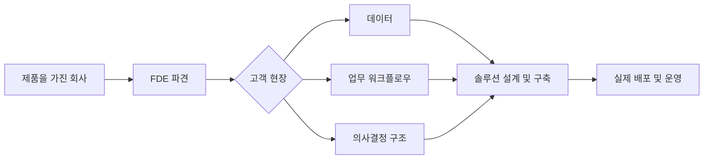
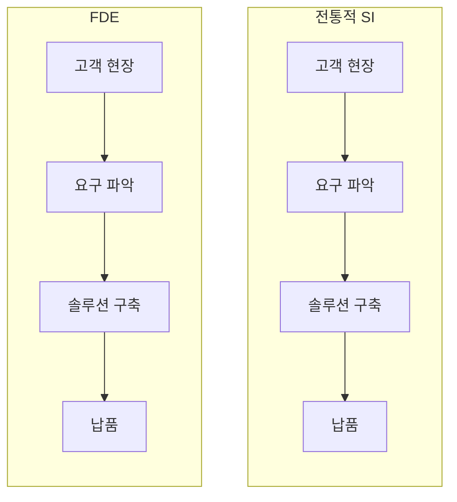
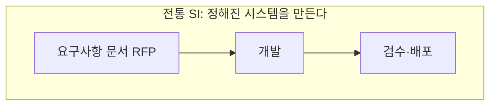
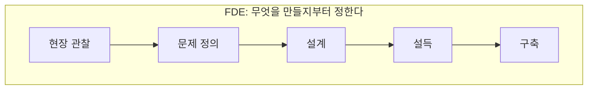
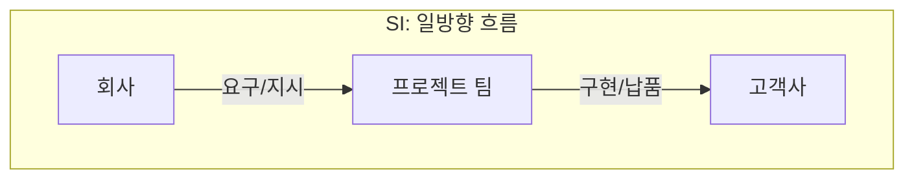
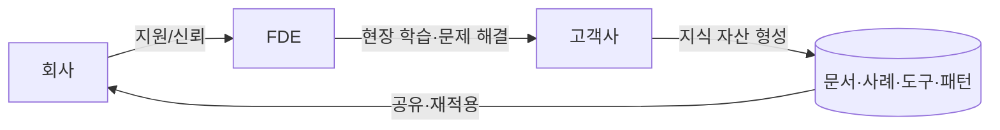

- 원본: 모두의AI 유튜브 채널, "FDE는 SI 잡부 맞습니다. 근데 왜 그렇게 비쌀까요? - 하이프 체크 EP.3" (2026.8.21 공개)
- https://www.youtube.com/watch?v=EO0LwUT-QpY

---

## 이 영상은 무엇을 다루는가

요즘 채용 공고를 보다 보면 FDE(Forward Deployed Engineer, 포워드 디플로이드 엔지니어)라는 직무명을 부쩍 자주 마주치게 된다. 토스를 비롯한 국내 기업은 물론이고 AWS, 마이크로소프트, 구글처럼 AI 솔루션을 고객사에 직접 구축해주는 사업 모델을 가진 회사라면 거의 예외 없이 FDE를 뽑고 있다고 봐도 무방한 상황이다. 그런데 막상 FDE가 실제로 어떤 일을 하는지 들여다보면, "이거 SI 엔지니어랑 뭐가 다르지?"라는 반문이 자연스럽게 따라붙는다. 이 영상은 바로 그 질문—FDE와 SI(System Integration)가 정말 다른 직무인지, 다르다면 어디에서 갈리는지—를 팔란티어(Palantir)의 실제 사례와 해외 업계 반응을 근거로 풀어낸 콘텐츠다.

영상을 진행한 채널은 현재 국내 대기업 AI PMO 프로젝트를 수행하고 있으며, 이 업무가 사실상 한국식 FDE에 가깝다는 전제 아래 자신의 경험을 기준으로 삼아 이야기를 전개한다. 결론을 미리 정해놓지 않고 근거가 이끄는 곳까지 따라가 보는 "하이프 체크" 시리즈의 세 번째 편이다.

---

## FDE란 어떤 직무인가

### 정의와 기원

FDE는 우리말로 옮기면 "전방 배치 엔지니어"에 가깝다. 제품을 만드는 회사가 자사 엔지니어를 고객사 현장에 직접 파견해서, 그 현장의 지저분한 데이터와 복잡한 업무 워크플로우, 여러 이해관계가 얽힌 의사결정 과정을 두 눈으로 보면서 자사 제품에 맞게 솔루션을 설계하고 개발하고 배포까지 책임지는 역할을 말한다. 영문 위키백과의 "Forward deployed engineer" 항목은 이 직무를 "고객사 안에서, 혹은 고객사와 함께 일하면서 소프트웨어를 개발하고 배포하는 고객 대면형 소프트웨어 엔지니어"라고 정의하고 있으며, 그 업무 범위가 솔루션 아키텍트, 세일즈 엔지니어, 커스터머 엔지니어, 프로페셔널 서비스 엔지니어, 시스템 통합 엔지니어(SI), IT 컨설턴트와 상당 부분 겹친다고 명시하고 있다.

이 직무 개념을 처음 만들고 유명하게 만든 회사가 팔란티어라는 점에는 이견이 없다. 다만 정확히 언제 이 개념이 시작됐는지는 출처마다 서술이 조금씩 다르다. CNBC(2026.6.30)는 팔란티어가 "10여 년 전"에 이 용어를 만들었다고 보도했고, Perspective AI의 2026년 리포트는 2005년에 팔란티어가 CIA, NSA, 미 육군 정보부대 등 초기 고객의 문제를 전통적인 컨설턴트로는 풀 수 없어서 이 역할을 발명했다고 서술한다. 반면 다른 매체는 "2010년대 초"라는 표현을 쓰기도 한다. 즉 팔란티어가 FDE 개념의 원조라는 사실 자체는 여러 자료에서 일관되게 확인되지만, 정확한 최초 도입 시점은 자료마다 미묘하게 엇갈리므로 특정 연도 하나로 단정하기는 어렵다.

영상에서는 팔란티어 내부에 소프트웨어 개발과 배포를 담당하는 "FDE(또는 FDSE)"와 좀 더 전략에 가까운 "디플로이먼트 스트래티지스트(Deployment Strategist)"라는 두 직군이 팀을 이뤄 고객사 문제를 함께 풀어간다고 설명한다. 진행자는 이 초기 인력을 팔란티어 내부에서 "에코델타"라고 불렀던 것 같다고 언급하지만 본인도 확신하지 못하는 뉘앙스로 말했다. 실제로 검색해 보면 팔란티어의 초기 FDE 인력을 "Deltas(델타스)"라고 불렀다는 서술은 외부 매체(MarkTechPost, 2026.5.21)에서 확인되며, 2016년까지는 팔란티어 내부에 소프트웨어 엔지니어보다 FDE 인력이 더 많았다는 설명도 함께 나온다. 다만 "에코델타"라는 정확한 표현 자체는 별도로 확인되지 않으므로, 이 부분은 영상 속 진행자의 불확실한 기억으로 이해하는 것이 정확하다.

### 최근 채용 시장의 움직임

FDE가 단순히 국내에서만 화제인 트렌드가 아니라는 점은 최근 몇 달 사이의 업계 동향으로도 뒷받침된다. 아마존웹서비스(AWS)는 2026년 6월 30일, 고객사에 AI 시스템 구축과 도입을 지원하는 신규 "Forward Deployed Engineering" 조직에 10억 달러를 투자한다고 발표했다(CNBC, 2026.6.30). 오픈AI와 앤트로픽 역시 2026년 들어 각각 자체 FDE 조직을 확대해왔고, The New Stack(2026.5.29) 보도에 따르면 FDE 관련 채용 공고는 2025년 1월부터 9월 사이에만 800% 넘게 증가했다. 위키백과 역시 2024년부터 2025년 사이 이 직무의 채용 공고가 크게 늘었다는 점을 명시하고 있다. 결국 FDE는 팔란티어라는 한 회사의 독특한 조직 문화를 넘어, AI 시대의 엔터프라이즈 소프트웨어 배포 방식 자체를 상징하는 직무로 확산되고 있다고 볼 수 있다.

---

## FDE의 몸값은 얼마나 될까

영상은 FDE라는 직무의 인기를 증명하는 근거로 해외 채용 플랫폼 파라폼(Paraform)의 보상 리포트를 인용하면서, 2026년 6월 기준 FDE 미드레벨의 총 보상(성과급 포함)이 약 5억 원, 시니어급은 약 7억 원 수준이라고 언급한다. 이 수치를 직접 검색으로 재확인해 보면, FDE 보상은 조사 기관과 조사 시점, 어느 회사를 기준으로 삼느냐에 따라 편차가 상당히 크다는 점이 먼저 눈에 띈다.

Paraform이 인용한 Perspective AI의 "2026 Forward Deployed Engineering Compensation Report"(1,200명의 실제 데이터 기반, 2026.5.21 공개)는 2026년 미드레벨 FDE의 중위 총 보상을 약 38.5만 달러, 스태프급은 약 61만 달러, 프론티어 랩(오픈AI·앤트로픽 등)의 프린시펄급은 120만 달러를 넘어선다고 밝히고 있다. 원화로 환산하면 미드레벨은 대략 5억~5억 5천만 원, 스태프급은 8억 원대에 달하는 수준이어서, 영상이 언급한 "미드레벨 5억, 시니어 7억"이라는 수치와 큰 틀에서는 비슷한 범위에 놓인다.

다만 다른 조사는 사뭇 다른 숫자를 제시한다. 같은 파라폼이 자사 플랫폼에 올라온 실제 채용 공고를 분석한 결과(2026.4.22)에서는 FDE 기본급 중위값이 약 18만 3천 달러, 업계 전체 중위값은 17만 3,816달러 수준이라고 밝혔다. 레벨스닷파이(Levels.fyi) 데이터를 인용한 다른 파라폼 게시물은 팔란티어 FDE의 평균 총 보상이 약 23만 8천 달러이고, 스태프급이 63만 달러 이상이라고 설명한다. 반면 오픈AI·앤트로픽 같은 AI 랩은 팔란티어 중위 보상 대비 60~150% 프리미엄을 얹어주는 것으로 나타나며, 앤트로픽의 어플라이드 AI 엔지니어(FDE 트랙)는 레벨에 따라 총 보상이 30만~120만 달러까지 벌어진다는 서술도 있다.

정리하면, FDE의 보상 수준이 업계 최상위권이라는 방향성 자체는 여러 독립적인 자료에서 일관되게 확인되지만, "정확히 얼마"라는 단일 숫자는 조사 기관·조사 시점·회사 등급에 따라 크게 달라지므로 하나의 확정된 값으로 받아들이기보다는 범위로 이해하는 편이 정확하다.

| 조사/보고서 | 미드레벨 총 보상 | 시니어/스태프급 총 보상 | 비고 |
|---|---|---|---|
| Perspective AI (2026.5.21, n=1,200) | 약 38.5만 달러 | 스태프 약 61만 달러 | 팔란티어~프론티어 랩 전체 평균 |
| Paraform 채용 공고 분석 (2026.4.22) | 기본급 중위 약 18.3만 달러 | 파운딩/스태프 기본급 약 28.8만 달러 | 기본급 기준, 지분 별도 |
| Levels.fyi 기반 (2026.4) | 팔란티어 평균 약 23.8만 달러 | 스태프 63만 달러 이상 | 팔란티어 한정 |
| 오픈AI 자체 데이터 (GetPerspective, 2026.6.12) | 35만~55만 달러(미드~시니어) | — | 팔란티어 대비 60~150% 프리미엄 |

---

## FDE와 SI, 구조적으로는 같다

영상이 강조하는 첫 번째 논지는 "FDE와 SI가 다르다는 주장은 절반만 맞다"는 것이다. 실제로 하는 일의 뼈대만 놓고 보면 두 직무는 놀랍도록 닮아 있다. 둘 다 고객 현장에 나가서 요구를 파악하고, 그에 맞는 솔루션을 구축하고, 최종적으로 납품하는 흐름을 따른다는 점에서 구조적으로는 동일하다고 볼 수 있다.

이 지점에서 진행자는 "직접 들어가서 구축하고 나온다는 점에서는 SI와 FDE가 다를 게 없다"고 솔직하게 인정한다. 자신이 현재 수행 중인 업무 역시 이름만 붙이면 FDE라고 부를 수 있을 정도로 겹치는 부분이 많다는 것이다. 다만 그는 "FDE라는 이름을 스스로 붙인다고 해서 FDE가 되는 것이 아니라, 일하는 태도와 얼마나 적극적으로 문제에 개입하느냐가 진짜 기준"이라고 짚는다. 즉 FDE라는 롤을 부여받고 입사했더라도 실제 업무 방식이 전통적인 SI와 다르지 않다면, 직함과 무관하게 사실상 SI 엔지니어와 다를 바 없다는 것이 이 영상의 핵심 주장 중 하나다.

---

## 해외에서도 나오는 "컨설팅 리브랜딩" 비판

FDE와 SI(혹은 컨설팅)의 경계가 모호하다는 지적은 한국만의 현상이 아니다. 영상은 이 지점에서 해커뉴스(Hacker News)의 스레드를 근거로 든다. 팔란티어에 면접을 봤던 한 개발자는 자신이 소프트웨어 개발 엔지니어(SDE) 역할을 기대했는데, 실제로는 세일즈 컨설턴트에 가까운 일을 제안받았다는 취지로 술회했다고 소개된다. 이 발언은 팔란티어가 세상에 자신들을 "테크 유니콘"으로 각인시키려 했을 뿐, 실질적으로는 컨설팅 회사에 가깝다는 인상을 받았다는 뉘앙스를 담고 있다.

이런 시선은 The Pragmatic Engineer 뉴스레터나 미디엄(Medium)에 게재된 "FDE in AI Era: A Rebranding of the Old Consulting Trope?"라는 제목의 글에서도 반복해서 등장한다. 결국 솔루션 아키텍트, 컨설턴트, FDE, 그리고 한국식 SI 엔지니어라는 네 개의 원이 서로 크게 겹치는 벤 다이어그램을 그릴 수 있을 정도로, 직무 간 경계가 흐려지고 있다는 것이 해외 업계의 공통된 인식이라고 영상은 정리한다.

---

## 진짜 차이는 요구사항을 받느냐, 문제를 정의하느냐

그렇다면 이름값에 걸맞은 실질적인 차이는 어디에서 갈리는가. 영상이 제시하는 답은 "요구사항을 전달받아 구현하느냐, 아니면 요구사항 이전 단계인 문제 자체를 정의하느냐"라는 프로세스상의 출발점 차이다.

전통적인 SI 프로젝트에서는 고객사가 RFP(제안요청서)라는 형태로 화면 구성, 필요한 기능, 원하는 결과물을 상세하게 기술한 요구사항 문서를 먼저 제공한다. 개발자는 이 문서를 기반으로 개발하고, 검수를 거쳐 배포하는 정해진 시스템을 만드는 역할을 맡는다. 영상은 이 과정에서 컨설팅 펌이 고객사와 SI 사이에 끼어 요구사항을 구체화하는 경우가 많은데, 이 구체화 과정에서 고객사 스스로도 인지하지 못한 문제나 실제로는 중요하지 않은 요구사항이 뒤섞여 개발 단계로 넘어오는 일이 잦다는 점을 지적한다. 이미 확정된 요구사항 문서를 받아 든 개발자 입장에서는, 설령 그 기획에 의문이 들더라도 처음부터 문제를 다시 진단할 여유나 권한이 주어지지 않는다는 것이다.

반면 FDE는 요구사항이 완성되어 전달되기를 기다리지 않고, 엔지니어가 먼저 현장에 들어가 사람들이 실제로 어떤 데이터를 보고, 어떤 순서로 업무를 처리하며, 어느 지점에서 의사결정이 막히는지를 직접 관찰한다. FDE의 첫 번째 업무는 개발이 아니라 관찰과 문제 정의, 그리고 이 문제가 정말로 풀 만한 가치가 있는지를 판단하는 일이라는 것이 영상의 설명이다. 예를 들어 고객사가 "대시보드를 만들어달라"고 요청했을 때, 현장에 들어가 보면 실제 문제는 예쁜 대시보드가 아니라 부서마다 동일한 지표를 서로 다르게 해석하고 있어서 의사결정에 시간이 오래 걸리는 것일 수 있다는 사례를 든다. 이런 근본 원인을 찾아내는 작업 자체가 FDE라는 롤의 본래 의도라는 것이다.

---

## 팔란티어의 세 가지 실제 사례

영상은 팔란티어 공식 임팩트(Impact) 사례 페이지를 근거로 세 가지 실제 프로젝트를 소개하며, 위에서 설명한 "문제 정의부터 시작하는" FDE의 작동 방식을 구체적으로 보여준다. 세 사례 모두 팔란티어가 공개적으로 발표한 성과 지표이며, 회사 측 발표 자료를 기준으로 한 수치라는 점은 감안해서 볼 필요가 있다.

### 탬파 제너럴 병원 — 재난 대응에서 일상 운영까지

미국 플로리다의 탬파 제너럴 병원(Tampa General Hospital)은 2022년 허리케인 이안이 접근하면서 환자 수, 중증도, 의료진 배치, 수술 일정, 병상 상태가 시간 단위로 급변하는 상황을 맞았다. 이런 재난 상황에서는 애초에 미리 정의된 요구사항 문서가 존재할 수 없었다는 것이 영상의 설명이다. "재난 대응 시스템을 만들어달라"는 한 문장은 가능하지만, 어떤 화면이 필요하고 어떤 데이터를 어떤 우선순위로 연결해야 하는지는 현장을 보지 않으면 알 수 없는 영역이었다.

팔란티어는 병원 곳곳에 흩어져 있던 환자 정보, 인력 정보, 수술 일정, 병상 정보를 하나로 통합해 실시간으로 의사결정을 지원하는 애플리케이션을 24시간 이내에 배포했다. 팔란티어 공식 임팩트 페이지와 탬파 제너럴 병원의 보도자료(2025.6.20, 2025.9.24, 2025.12.3)를 종합하면, 이 협업을 통해 마취 후 회복실(PACU) 대기시간이 28% 줄었고, 환자 배치를 관리하는 데 드는 시간은 83% 감소했다. 2025년 말 기준으로는 여기에 더해 MRI 영상 판독 소요시간이 30% 개선됐고, 패혈증 허브(Sepsis Hub)를 통해 700명이 넘는 환자의 생명을 구하는 데 기여했다는 내용도 추가로 발표됐다.

영상이 강조하는 지점은 개발 속도 자체가 아니라, 재난이 지나간 뒤에도 이 시스템이 폐기되지 않고 병원의 일상적인 운영에 재사용됐다는 사실이다. 재난 상황에서 파악한 데이터 구조와 의사결정 방식이 그대로 평상시 운영에도 적용될 수 있었다는 것이며, 이는 FDE가 만들어낸 결과물이 단발성 프로젝트로 끝나지 않고 조직의 자산으로 축적되는 구조를 보여주는 사례로 제시된다.

### 파나소닉 에너지 북미 — 흩어진 도메인 지식을 자산으로

두 번째 사례는 파나소닉 에너지 북미(Panasonic Energy of North America, PENA)다. 제조 현장에서는 장비가 멈췄을 때 얼마나 빨리 원인을 찾아 복구하느냐가 핵심인데, 이런 노하우는 대개 숙련된 기술자 개개인의 머릿속이나 개인 메모, 과거 작업 기록에 흩어져 있는 경우가 많다. 새로운 기술자가 이런 암묵지를 몸으로 체득하기까지는 통상 3개월에서 6개월이 걸린다는 것이 팔란티어 공식 임팩트 페이지에 소개된 내용이다.

팔란티어는 장비 이력, 센서 데이터, 작업 문서를 연결하고 "Ask Atom"이라는 챗봇형 인터페이스를 통해 기술자가 필요한 정보를 즉시 찾고 조치할 수 있도록 만들었다. 팔란티어 임팩트 페이지의 인용에 따르면 Ask Atom은 신입은 물론 베테랑 기술자에게도 핵심적인 훈련 도구 역할을 하며, 기존 3~6개월 걸리던 학습 곡선을 단 몇 주로 단축시켰다고 설명된다. 기술자가 현장에서 문제를 해결하면 그 조치 내용이 다시 기록되고, 다음 기술자가 비슷한 문제를 만났을 때 이 기록을 재사용할 수 있는 구조다.

영상은 이 사례에서 두 가지를 짚는다. 첫째, 단순히 "RAG 챗봇을 만들었다"는 말로 뭉뚱그리기 쉽지만, 실제로 회사 안에 흩어진 지저분한 데이터를 정리해서 AI가 이해할 수 있는 형태로 가공하는 작업 자체가 결코 쉽지 않으며, 이 작업을 현장에서 직접 부딪히며 파악할 수 있었던 것이 FDE 방식의 강점이라는 점이다. 둘째, 챗봇을 사용하는 기술자들의 문제 해결 이력이 계속 쌓이면서, 별도의 정교한 자기 개선 파이프라인을 구축하지 않아도 현재의 기록 자체가 미래에 더 나은 답변을 만들어내는 학습 루프가 된다는 점이다. 이 루프를 어떻게 설계할 것인가가 많은 기업이 다음 단계 과제로 삼고 있는 지점이라고 영상은 덧붙인다.

### 에어버스 A350 — 하나의 현장 문제가 산업 플랫폼이 되기까지

세 번째는 항공기 제조사 에어버스(Airbus)의 A350 기종 생산 사례다. 생산 일정, 부품, 결함 데이터가 공장과 팀별로 흩어져 있어 기체 생산에 필요한 전체 그림을 한눈에 파악하기 어려웠다는 것이 문제의 출발점이었다. 팔란티어는 이 문제를 모든 산업에 적용할 거대한 플랫폼으로 처음부터 설계한 것이 아니라, 생산 데이터를 통합해서 부품 지연이 공정과 일정에 미치는 영향을 연결해 보여주는 구체적인 문제 해결에서 출발했다.

여러 산업 분석 자료(Klover.ai, 2025.7.20; 아랍항공사협회 발표자료 등)와 팔란티어 자체 임팩트 페이지를 종합하면, 이 작업을 통해 A350 생산량이 33% 향상됐다는 수치가 일관되게 확인된다. 이 성공 이후 팔란티어와 에어버스의 협업은 스카이와이즈(Skywise)라는 항공 산업 전체를 아우르는 플랫폼으로 확장됐다. 항공기 연결 대수는 발표 시점에 따라 9,000대에서 12,000대 이상까지 점진적으로 늘어난 것으로 팔란티어 연례보고서(2021~2022년)와 최근 산업 분석 자료들에서 확인되며, 2026년 기준으로는 140개 이상의 항공사, 11,900대 이상의 항공기가 연결되어 있고 전체 에어버스 기단의 49%가 스카이와이즈에 연결됐다는 분석도 나온다.

영상은 이 사례를 통해 팔란티어의 접근 방식이 스타트업 조언에서 흔히 듣는 "뾰족한 문제 하나를 잡아 시장을 확보한 뒤 확장하라"는 원칙과 정확히 일치한다고 짚는다. B2B 비즈니스는 고객 기업 내부에 직접 들어가지 않으면 진짜 문제를 볼 수 없는데, FDE가 기업 내부에 들어가 실제로 무슨 일이 일어나는지 보고 이를 확장 가능한 형태로 학습해내는 것이 가장 큰 가치라는 것이 영상의 결론이다.

| 사례 | 핵심 문제 | 팔란티어의 접근 | 공식 발표 성과 지표 | 출처 |
|---|---|---|---|---|
| 탬파 제너럴 병원 | 허리케인 대응 중 환자·의료진 배치가 시간 단위로 변동 | 흩어진 데이터 통합, 24시간 내 배포 | PACU 대기시간 28%↓, 환자 배치 관리시간 83%↓ | Palantir Impact, TGH 보도자료(2025) |
| 파나소닉 에너지 북미 | 장비 정비 노하우가 개인 지식으로만 존재 | 장비 이력·센서·문서 연결, Ask Atom 챗봇 구축 | 기술자 학습기간 3~6개월 → 몇 주 | Palantir Impact |
| 에어버스 A350 | 생산 일정·부품·결함 데이터가 공장·팀별로 분산 | Foundry로 데이터 통합, 이후 Skywise로 확장 | A350 생산량 33%↑ | Palantir/Airbus 자료, 업계 분석(2025) |

---

## 현업 FDE는 실제로 어떻게 일하는가 — 랜덜 도린의 사례

영상은 팔란티어의 전직 FDSE였던 랜덜 도린(Randall Dorin)의 인터뷰(Built In NYC, "A Day in the Life of a Palantir Engineer")도 함께 소개한다. 그는 3개월짜리 에너지 관련 파일럿 프로젝트에 투입됐을 때, 처음 한 일이 코딩이 아니었다고 회고한다. 먼저 고객 인터뷰를 진행하고 에너지 시장 자체를 학습한 뒤, 주어진 90일 안에 어떤 문제를 풀어야 실제 가치가 생길지를 선택하는 작업이 가장 먼저였다는 것이다. 문제를 선택한 다음에는 원격 전력 제어와 배터리 관련 프로토타입을 만들며 가설을 검증하는 방식으로 작업을 진행했다.

이 사례가 보여주는 핵심은, 처음부터 거대한 시스템을 완성하려 하지 않고 주어진 시간 안에서 가장 중요한 문제의 우선순위를 정한 뒤 작은 실험을 통해 현장에 실질적인 가치를 만들어내는 방식이다. 영상은 이를 두고 "SI가 거대한 시스템을 차곡차곡 쌓아 올리는 워터폴 방식에 가깝다면, FDE는 진짜 문제를 해결하는 데 필요한 MVP를 빠르게 만들어 나가는 방식에 가깝다"고 정리한다. 이상적인 흐름은 완벽한 서비스를 만들기 전에 POC(개념 증명)로 먼저 보여주고, 고객과 합의 과정을 거친 뒤 실제 서비스로 키워내는 순서다. 그리고 이 과정에서 FDE가 습득한 산업 지식과 학습은 개인의 경험에 머물지 않고 회사의 자산으로 축적될 때 진짜 가치를 갖는다는 점을 강조한다.

---

## AI 시대, SI가 죽었다는 말이 놓치고 있는 것

생성형 AI의 발전과 함께 "SI는 죽었다"는 식의 담론이 확산되고 있는 것도 사실이다. 영상은 이 주장에 대해 완전히 동의하지는 않으면서도, 코드를 작성하고 화면을 구현하는 작업의 비용 자체가 크게 낮아지면서 이 영역에서의 차별적 경쟁력이 줄어든 것은 분명한 흐름이라고 짚는다. 요구사항이 이미 명확하게 정해져 있다면 고객사 내부에 있는 AI 팀이 직접 처리할 수 있는 시대가 됐기 때문이다.

반대로 요구사항을 만드는 일, 즉 정확한 문제를 진단하고 이를 어떻게 풀어나갈지 설계하는 기획 단계는 오히려 더 중요해지고 있다는 것이 영상의 전망이다. 고객사가 기획과 개발을 모두 AI를 활용해 스스로 처리한다 해도, 문제 자체가 잘못 정의되면 잘못된 결과물이 더 빠른 속도로 양산될 뿐이라는 것이다. 실제로 국내 IT 업계에서도 비슷한 흐름이 관찰된다. LG CNS는 2026년 6월 자연어 기반 바이브 코딩과 차별화된 "AIND"라는 플랫폼을 통해 대형 SI 사업을 AI 네이티브 방식으로 전환하려는 움직임을 보이고 있으며, 이는 기업 시스템이 단순 코드 생성을 넘어 개발 표준, 보안 규정, 기존 레거시 구조, 업무 프로세스까지 함께 반영해야 한다는 문제의식에서 출발한다(ZDNET Korea, 2026.6.8). 다만 영상 중 언급된 "SI는 죽었다…코딩 AI가 바꾼 개발 생태계" 제하의 ZDNET Korea 기사는 이번 검색 과정에서 원문을 다시 확인하지 못했다. 해당 내용은 영상 속 발표 자료 화면에 근거한 인용이며, 존재 자체를 의심할 근거는 없지만 별도의 재검증은 이뤄지지 못했다는 점을 밝혀둔다.

정리하면, 문제를 정확하게 정의하고 현장에서 검증하며 필요하다면 방향을 바꿀 수 있는 능력의 가치가 AI 시대에 오히려 커지고 있으며, 이것이 FDE라는 직무가 높은 몸값을 받고 주목받는 근본적인 이유라는 것이 영상의 진단이다.

---

## FDE가 성립하려면 필요한 두 가지 조건

영상은 "FDE"라는 이름을 붙인다고 해서 자동으로 그에 걸맞은 인력이나 조직 능력이 만들어지는 것은 아니라고 강조한다. FDE가 실질적으로 성립하려면 두 가지 조건이 필요하다.

첫째, FDE를 운영하는 회사 스스로 고객사와 계약할 때부터 "우리는 요구사항을 그대로 받아 구현하는 방식이 아니라 문제를 함께 정의하며 일한다"는 점을 명확히 인식시키고 프로젝트에 들어가야 한다. 둘째, FDE 개인 역시 "나는 고객이 말하는 것을 그대로 구현하는 사람"이라는 인식에서 벗어나야 한다. 고객이 계속해서 요구하는 것들이 근본적으로 어떤 문제를 해결하기 위한 것인지 파악할 수 있어야 하고, 그 요구사항을 그대로 따르는 것이 맞는지 아니면 다른 방식을 제안하는 것이 나은지를 빠르게 판단할 수 있어야 한다는 것이다.

결국 기획부터 솔루션 개발, 배포까지 모든 단계에 책임을 지는 롤이기 때문에, FDE는 그만큼 큰 책임감과 폭넓은 권한을 함께 가져야 하는 자리이며, 이것이 높은 보상으로 이어지는 이유이기도 하다.

---

## 결론: 이름이 아니라 지식이 순환하는가

영상이 최종적으로 정리하는 결론은, SI와 FDE의 진짜 차이가 직함 자체에 있지 않다는 것이다. 구조적으로 보면 둘 다 고객의 문제를 이해하고 시스템을 만들어 배포하는 역할이라는 점에서 동일하다. 진짜 차이는 현장에서 얻은 경험이 프로젝트가 끝난 뒤 조직의 자산으로 남아 다시 순환하느냐에 달려 있다.

전통적인 SI 프로젝트는 회사가 가진 인력과 기술을 프로젝트 현장에 투입해 고객의 요구사항을 구현하고 납품하는 순간 종료된다. 프로젝트가 성공적으로 끝나더라도 현장에서 새롭게 얻은 지식이 회사 전체로 돌아오지 않는 경우가 많은데, 애초에 그것이 프로젝트의 목적이 아니었기 때문이다. 반면 FDE 구조에서는 회사가 FDE에게 기획 권한까지 부여해야 하고, FDE는 고객과 함께 문제를 탐색하고 해결하면서 얻은 지식을 문서화하고 사례를 축적하며 도구와 데이터 구조, 제품 기능의 형태로 회사 내부에 가져와 반영한다. 이렇게 되면 고객 현장에서 회사로, 회사에서 다시 다른 고객 현장으로 지식이 순환하게 되고, 프로젝트가 끝날 때마다 회사가 조금씩 더 똑똑해지는 구조가 만들어진다. 도메인마다 이런 지식이 쌓여갈수록 이는 다른 기업이 쉽게 따라 할 수 없는 해자(moat)가 된다.

영상은 마지막으로 "SI냐 FDE냐"라는 이름 논쟁 자체가 오래가지 않을 것이라는 전망으로 마무리한다. 앞으로 개발자라는 직업 자체가, 회사나 고객사가 현재 안고 있는 문제가 무엇인지 파악해 이를 해결할 방법을 제안하고 개발하고 설득까지 할 수 있어야 하는 방향으로 수렴할 것이라는 이야기다. 결국 FDE라는 이름은 개발자가 앞으로 나아가야 할 미래상을 과도기적으로 표현한 이름일 뿐, 이름 자체가 본질은 아니라는 것이 이 영상이 전하고자 하는 핵심 메시지다.

---

## 사실 확인 표

아래 표는 영상 속 주요 주장들을 외부 자료로 재검증한 결과를 정리한 것이다.

| 항목 | 영상에서 언급된 내용 | 검증 결과 | 근거 자료 |
|---|---|---|---|
| FDE 보상 수준 | 2026년 6월 기준 미드레벨 총보상 약 5억 원, 시니어 약 7억 원 | 대체로 부합하나 조사기관별 편차가 큼(기본급 중위 18만 달러대~총보상 100만 달러대까지 자료마다 다름) | Paraform, Perspective AI 2026 리포트 등 다수 |
| 탬파 제너럴 병원 성과 | PACU 대기시간 28%↓, 환자 배치시간 83%↓ | 검증됨(공식 발표와 수치 일치) | Palantir Impact, TGH 보도자료(2025) |
| 파나소닉 에너지 학습기간 단축 | 3~6개월 걸리던 기술 습득이 몇 주로 단축 | 검증됨 | Palantir Impact |
| 에어버스 A350 생산량 향상 | 33% 향상 | 검증됨(다수 독립 자료에서 일치) | Klover.ai, 항공산업 분석자료, Palantir 자료 |
| FDE 개념의 유래 | 팔란티어가 처음 만든 개념 | 검증됨. 다만 정확한 최초 도입 연도는 자료마다 2005년/2010년대 초/"10여 년 전" 등으로 표현이 갈려 특정하기 어려움 | Wikipedia, CNBC, Perspective AI 등 |
| "에코델타"라는 초기 FDE 명칭 | 팔란티어 내부에서 그렇게 불렀던 것 같다(발표자 스스로 불확실하다고 언급) | 검증 불가. 다만 외부 자료에서는 초기 FDE를 "Deltas"라 불렀다는 서술이 확인됨 | MarkTechPost(2026.5.21) |
| "SI는 죽었다" ZDNET Korea 기사 | 2025.5.16자 기사로 화면에 인용됨 | 이번 검색으로 원문 재확인 불가. 존재를 부정할 근거는 없으나 별도 검증은 못함 | 영상 속 자료 화면(재검증 실패) |
| AI 랩들의 FDE 조직 확대 | (영상에는 직접 언급 없음, 배경 맥락으로 추가) AWS 10억 달러 투자, 오픈AI·앤트로픽 FDE 조직 확대 | 검증됨 | CNBC(2026.6.30), The New Stack(2026.5.29) |

---

## 참고 자료

- 모두의AI, "FDE는 SI 잡부 맞습니다. 근데 왜 그렇게 비쌀까요? - 하이프 체크 EP.3" (YouTube, 2026.8.21)
- Wikipedia, "Forward deployed engineer"
- CNBC, "AWS puts $1 billion into new AI unit to embed engineers with customers" (2026.6.30)
- The New Stack, "Why OpenAI and Anthropic are hiring forward deployed engineer teams" (2026.5.29)
- MarkTechPost, "What is a Forward Deployed Engineer" (2026.5.21)
- Perspective AI, "The 2026 Forward Deployed Engineering Compensation Report" (2026.5.21)
- Paraform 블로그 다수 게시물(2026.4~6)
- Palantir Impact, Tampa General Hospital / Panasonic Energy North America / Airbus 사례 페이지
- Tampa General Hospital 보도자료 (2025.6.20, 2025.9.24, 2025.12.3)
- Klover.ai, "Airbus' AI Strategy" (2025.7.20)
- Built In NYC, "A Day in the Life of a Palantir Engineer" (Randall Dorin 인터뷰)
- ZDNET Korea, "코드만 짜는 AI 그만…LG CNS, AI로 SI 체질 바꾼다" (2026.6.8)

---

작성일: 2026년 8월 21일
