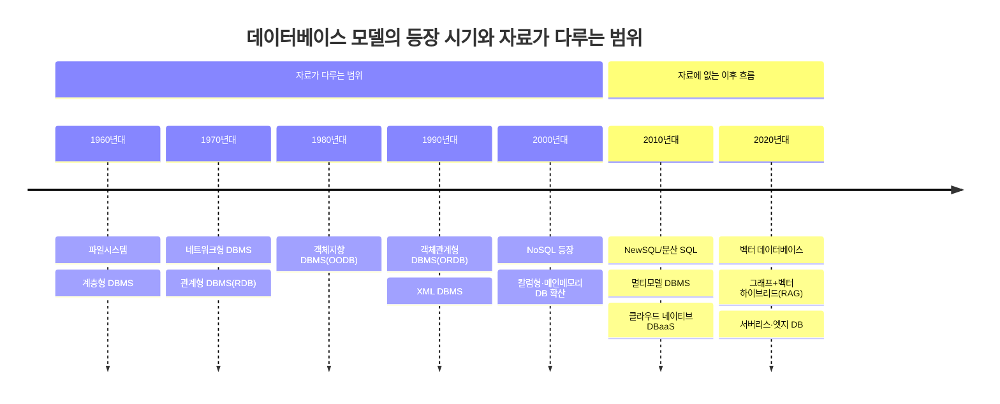

## 0. 정정: 자료의 출처 확인

최초 검토 당시에는 이 자료의 발간 주체를 자료 자체의 편집 양식과 참고문헌(SQL전문가 가이드 등)만으로 추정하여 'SQLD/SQLP·데이터아키텍처 전문가 계열 자격검정 학습교재일 가능성이 높다'고 판단했다. 이후 제공받은 출처 주소(topcit.or.kr)를 확인한 결과, 이 자료는 **TOPCIT(소프트웨어 역량 검정, Test Of Practical Competency in ICT)** 이 자체 제작해 무료로 배포하는 공식 학습교재 **'에센스(Essence)'**, 그 중 기술영역 M2 '데이터 이해와 활용' 모듈의 일부(파일명 02_데이터_이해와활용, 페이지 게시일 2021년 1월 5일)로 확인된다. 앞서의 '자격검정 계열' 추정은 방향은 맞았으나 발간 주체를 구체적으로 특정하지 못했던 것이므로, 이 자리에서 정정한다.

TOPCIT은 과학기술정보통신부 산하 정보통신기획평가원(IITP)이 연구개발·사업관리를 맡고 있는 국가 SW·ICT 역량 진단평가로, 2013~2014년 산업계와 학계가 공동으로 개발했다. 소프트웨어, 데이터베이스, 네트워크·보안, IT비즈니스, 테크니컬 커뮤니케이션, 프로젝트 관리 등 여섯 개 영역(M1~M6)에 걸쳐 총 1000점 만점으로 응시자의 수준을 5단계로 평가하며, 응시료는 무료이고 성적 유효기간은 2년이다. 원래 데이터베이스 영역으로 불리던 M2 영역은 개정을 거쳐 '데이터 이해와 활용'으로 이름이 바뀌면서 고전적인 데이터베이스 이론뿐 아니라 인공지능·딥러닝 등 최신 기술까지 함께 다루는 영역으로 확장되었다는 점이 여러 응시 후기와 정리 자료에서 공통적으로 확인된다. 다만 공기업 채용에서는 간혹 활용되지만 일반 사기업에서는 인지도가 낮다는 평가도 응시 후기에서 함께 나타난다.

이 확인은 앞으로 이어지는 '최신성 평가' 부분의 해석에 중요한 영향을 준다. M2 영역이 개정을 통해 인공지능·딥러닝까지 포괄하게 되었다는 점을 고려하면, 지금까지 검토한 Ⅰ~Ⅲ장에서 벡터 데이터베이스나 최신 AI 관련 데이터베이스 유형이 보이지 않았던 것은 이 자료 자체의 결함이라기보다, 같은 '데이터 이해와 활용' 모듈 안에 있을 것으로 추정되는 이후 장(빅데이터·인공지능·딥러닝을 다루는 장)에서 별도로 다루어지고 있을 가능성을 배제할 수 없다. 다만 이 부분은 실제로 확인한 것이 아니라 정황상의 추정이므로, 아래 최신성 평가는 이 가능성을 감안해 다소 완화된 어조로 다시 정리해 둔다.

## 1. 자료의 성격과 개요

첨부된 열 장의 슬라이드는 하나의 강의용 교재 중 두 개 장(章)에 해당한다. 앞부분(1~6페이지)은 'Ⅱ. 데이터베이스 종류 이해'라는 제목 아래 계층형·네트워크형·관계형·객체지향형·객체관계형 데이터베이스의 발전 과정을 다루고, 이어서 XML의 구조와 문법을 별도 절로 설명한 뒤, 멀티미디어·메인메모리·임베디드·모바일·공간·칼럼형 데이터베이스 등 특수 목적 데이터베이스를 정리한다. 뒷부분(7~10페이지)은 'Ⅲ. 데이터베이스 설계 및 구축절차'로, 요구사항 분석부터 개념적·논리적·물리적 데이터 모델링, DB 구축, 운영·유지보수에 이르는 표준적인 설계 프로세스와 프로젝트 라이프사이클상의 위치를 다룬다.

각 장의 도입부마다 '최근 동향 및 주요 이슈', '학습 목표', '핵심 키워드', '실무 미리보기'라는 네 가지 고정 항목이 반복되고, 본문은 번호 체계(가/나/다, ①②③, 표·그림 일련번호)로 촘촘하게 구조화되어 있다. 위 0절에서 확인했듯 이는 TOPCIT이 응시생에게 무료로 제공하는 공식 학습교재 '에센스'의 표준 편집 양식이며, 대학 교재라기보다 국가 SW역량 진단평가의 학습 콘텐츠에 맞게 설계된 형식이다.

## 2. 구성 체계 평가

두 장 모두 '왜 배워야 하는가(실무 미리보기) → 무엇을 배우는가(학습 목표) → 어떤 용어를 다루는가(핵심 키워드) → 본문 설명 → 참고문헌' 순서를 일관되게 따른다. 이 흐름 자체는 성인 학습자를 대상으로 한 자격증·직무교육 자료의 정석에 가깝고, 학습자가 사전에 학습 범위를 가늠할 수 있게 해준다는 점에서 설계가 잘 되어 있다.

내용 전개 방식도 시간 순서(발전사)와 유형별 분류를 함께 사용해 이해를 돕는다. 특히 [그림 4]의 '데이터베이스의 시대별 응용분야' 막대그래프는 파일시스템부터 NoSQL까지의 등장 시점을 한눈에 보여주는 효과적인 시각 자료이며, [그림 8]·[그림 9]의 '현실세계 → 개념세계 → 물리세계' 변환 구조나 [그림 10]의 '프로젝트 라이프사이클과 데이터베이스 설계 영향도'는 추상적인 모델링 개념을 실제 프로젝트 단계와 연결해 설명한다는 점에서 수준이 높다. 표를 활용한 비교(객체관계형 DB 특징, XML Schema와 DTD 비교, 로우형과 칼럼형 DB 비교, 데이터 모델링 종류 비교 등)도 정보 밀도를 적절히 관리하는 장치로 기능한다.

다만 XML 관련 절(3~4페이지)은 XML DTD·XML Schema·XPath·XQuery·XSL/XSLT·XLL을 한 화면 안에 나열하면서 각 구성요소의 정의를 압축적으로 제시하는데, 이 부분은 사전 지식이 없는 학습자에게는 정보량이 갑자기 많아지는 구간으로 느껴질 수 있다. 앞뒤 절의 서술 밀도와 비교하면 XML 부분만 유독 개념어 밀도가 높다.

## 3. 내용 수준 평가

전반적인 난이도는 IT 실무 경험이 있거나 데이터베이스 기초 이론을 한 번 이상 학습한 사람을 대상으로 한 '중급' 수준에 해당한다. 관계형 모델의 수학적 기반(집합론), 트랜잭션·동시성 제어, DBMS 벤더별 상용 제품명(Oracle, DB2, SQL Server, Sybase 등), R-Tree 인덱스, Hashing과 T-Tree 알고리즘 같은 용어가 별도의 부연 설명 없이 등장하는 것을 보면, 완전한 입문자보다는 정보처리 관련 자격증을 준비하거나 데이터 모델링 실무를 시작하는 학습자를 염두에 둔 자료로 판단된다.

동시에 각 절 말미마다 특징을 불릿으로 요약하고, 표를 통해 개념을 대비시키는 구성은 시험 대비용 암기·정리에 최적화되어 있다. 즉 '이해를 위한 자료'라기보다 '이미 한 번 배운 내용을 체계적으로 정리하고 확인하는 자료'에 가깝다. 이 점에서 완전한 비전공 입문자에게 그대로 사용하기에는 다소 부담스러울 수 있고, 실무자나 자격시험 준비생에게는 적합한 난이도로 볼 수 있다.

## 4. 기술적 정확성 검토

이론적으로 크게 틀린 서술은 발견되지 않았다. 몇 가지 구체적으로 짚어볼 부분은 다음과 같다.

**데이터베이스 발전사와 분류.** 계층형(1960년대)→네트워크형(1970년대 초)→관계형(1970년 E.F. Codd)→객체지향형(1980년대 중반)→객체관계형→XML→NoSQL로 이어지는 흐름은 데이터베이스 역사 서술에서 통용되는 표준적인 설명과 일치한다. 관계형 모델이 집합론에 기반한다는 설명, 객체지향 데이터베이스가 트랜잭션 처리·백업/복구 등 기본 관리 기능이 취약해 시장에서 확대되지 못했다는 설명도 학계와 업계에서 널리 인정되는 평가다.

**메인 메모리 데이터베이스(MMDB).** '모든 연산을 메인 메모리에서 수행하므로 디스크 I/O가 발생하지 않는다'는 설명 바로 뒤에 '백업 및 로그 생성을 위하여 디스크를 이용한다'는 단서를 붙여 놓은 점은 정확하다. 실제 상용 인메모리 데이터베이스(SAP HANA, Redis, VoltDB 등)도 질의 처리 자체는 메모리에서 수행하되 내구성 보장을 위한 로그·스냅샷은 디스크에 기록하므로, 이 자료의 설명은 지나친 단순화 없이 균형 잡혀 있다.

**칼럼형 데이터베이스.** 로우형과 칼럼형의 물리적 저장구조 차이, 트랜잭션 특징, 압축 효율, 적용 SQL 패턴(SELECT * vs SELECT AVG(COL))에 대한 비교표는 오늘날의 분석형 데이터베이스(ClickHouse, Snowflake, SAP HANA 등)의 동작 원리와도 부합하는 정확한 설명이다.

**XML 구성요소.** DTD, XML Schema, XPath, XQuery, XSL/XSLT, XLL에 대한 정의와 [그림 5]의 구성도는 W3C 표준 문서의 정의와 일치하며 기술적으로 오류가 없다.

## 5. 최신성 평가 (2026년 8월 기준)

이 부분이 이번 평가에서 가장 주의 깊게 볼 지점이다. 자료가 다루는 이론 자체는 여전히 유효하지만, 오늘날의 데이터베이스 생태계와 비교하면 몇 가지 뚜렷한 공백이 있다. 다만 0절에서 확인했듯 TOPCIT의 해당 영역(M2)은 개정을 통해 인공지능·딥러닝 같은 최신 기술까지 포괄하도록 범위가 넓어졌으므로, 아래에서 지적하는 공백 중 일부(특히 벡터 데이터베이스·최신 AI 관련 데이터 저장 기술)는 지금 검토한 Ⅰ~Ⅲ장이 아니라 같은 '데이터 이해와 활용' 모듈의 다른 장에서 다루어지고 있을 가능성이 있다. 이 점을 감안해 아래 지적은 '이 세 개 장 안에서는 확인되지 않는다'는 의미로 한정해서 읽는 것이 정확하다.

첫째, **벡터 데이터베이스(Vector Database)가 전혀 언급되지 않는다.** 생성형 AI와 RAG(검색 증강 생성) 애플리케이션이 확산되면서 벡터 데이터베이스는 이제 데이터베이스 순위 사이트인 DB-Engines에서도 '관계형', '문서형', '그래프형'과 나란히 별도 카테고리로 집계될 만큼 독립적인 분류로 자리잡았다. PostgreSQL의 pgvector 확장, Pinecone, Milvus, Qdrant처럼 임베딩 유사도 검색에 특화된 데이터베이스가 AI 서비스의 핵심 구성요소가 된 흐름은 이 자료가 작성된 시점 이후에 본격화된 것으로 보이며, 그 결과 완전히 빠져 있다.

둘째, **그래프 데이터베이스가 실질적으로 다루어지지 않는다.** 첫 페이지의 '핵심 키워드' 목록에는 '그래프 DB'가 나열되어 있지만, 제공된 페이지들 안에서는 이에 대한 별도 설명 절이 확인되지 않는다(다른 페이지에 있을 가능성은 배제할 수 없으나, 제공된 범위 안에서는 본문 설명이 없다). 그래프 데이터베이스는 소셜 네트워크, 추천 시스템, 지식 그래프, 최근에는 벡터 검색과 결합한 그래프-RAG 구조에서까지 활용도가 높아진 모델이므로, 목록에만 존재하고 본문이 비어 있다면 아쉬운 지점이다.

셋째, **NewSQL(분산 SQL) 계열이 언급되지 않는다.** CockroachDB, TiDB, Google Spanner처럼 관계형 모델의 일관성과 NoSQL의 수평 확장성을 함께 제공하는 분산 SQL 데이터베이스는 최근 수년간 클라우드 환경에서 중요도가 커진 카테고리인데, 자료의 발전사 다이어그램([그림 4])에는 반영되어 있지 않다.

넷째, **XML을 설명하면서 JSON과의 비교가 없다.** 이 자료가 작성된 시점에는 XML이 데이터 교환 표준으로서 위상이 더 컸을 수 있으나, 현재는 웹 API·NoSQL 문서 저장소의 사실상 표준이 JSON으로 넘어간 지 오래다. XML은 SOAP 기반 레거시 연동, 문서 포맷(오피스 파일의 내부 구조 등), 특정 산업 표준 문서에서는 여전히 쓰이지만, '데이터 교환을 위한 표준 마크업 언어'라는 자료의 설명만 보면 학습자가 현재 산업 현장의 무게중심을 오해할 소지가 있다.

다섯째, **참고문헌의 연도가 오래되었다.** 인용된 문헌은 1998년, 2005년, 2008년, 2010~2014년에 발간된 것들이다. 이는 본문 이론(관계형 모델, XML 구조, 객체지향 DB 등) 자체가 시간이 지나도 크게 변하지 않는 기초 이론이라는 점에서 치명적인 결함은 아니지만, 최신 사례나 시장 통계가 반영되기 어려운 구조라는 점은 분명하다.

다만 긍정적으로 볼 부분도 있다. 메인메모리 데이터베이스와 칼럼형 데이터베이스, 임베디드 데이터베이스를 설명하면서 '상용 제품 목록은 위키백과 특정 문서에서 지속적으로 갱신되고 있다'는 식으로 외부 링크를 안내한 것은, 정적인 교재가 시간이 지나 정보가 낡아 보이는 문제를 피하기 위한 나름의 장치로 보인다. 다만 이 방식이 실제로 효과를 내려면 학습자가 그 링크를 직접 확인하는 습관이 있어야 하고, 링크 자체의 생존 여부(사이트 개편, 폐쇄 등)에 의존한다는 한계는 남는다.

## 6. 편집·자료 품질

표와 그림에 일관된 일련번호(〈표 11〉~〈표 19〉, [그림 4]~[그림 10])를 부여하고 참고문헌을 각주 형태로 정리한 점은 공식 교재로서의 완성도를 보여준다. 서술형 문단과 불릿형 요약을 번갈아 사용한 구성도 읽는 흐름과 암기 편의성을 동시에 잡으려는 시도로 볼 수 있다. [그림 6]의 XML Processor 구조도, [그림 8]·[그림 9]의 개념·논리·물리 모델링 변환 과정도, [그림 10]의 프로젝트 라이프사이클 다이어그램은 텍스트만으로 설명하기 어려운 흐름을 시각적으로 잘 정리한 사례다.

아쉬운 점은 XML 절의 정보 밀도가 앞뒤 절보다 급격히 높아진다는 점, 그리고 발전사를 보여주는 [그림 4]의 시간축이 2000년대에서 멈춰 있어 그 이후의 흐름(NewSQL, 멀티모델, 벡터 DB)을 반영할 여지가 없다는 점이다. 또한 '핵심 키워드'에 나열되었지만 본문에서 상세히 다루어지지 않는 용어(그래프 DB 등)가 존재해, 목차와 본문 간의 정합성 측면에서 보완 여지가 있다.

## 7. 종합 평가

| 평가 항목 | 평가 | 근거 |
|---|---|---|
| 구성 체계 | 상 | 학습목표·핵심키워드·실무미리보기·본문·참고문헌의 반복 구조가 명확하고, 표·그림 번호 체계가 일관됨 |
| 이론적 정확성 | 상 | 관계형·객체지향·메인메모리·칼럼형 DB 등 핵심 개념 설명에 오류가 발견되지 않음 |
| 최신성 (2026년 기준, 이 두 장 범위 내) | 중하 | 벡터 데이터베이스·NewSQL·XML-JSON 비교가 이 두 장 안에는 없음. 다만 같은 TOPCIT 모듈의 다른 장에서 다루어질 가능성 있음(0절 참고) |
| 실무 적용성 | 중 | 설계 절차(요구분석-개념/논리/물리 모델링-구축-운영)는 현재도 유효한 표준 방법론이나, DB 유형 선택 판단 기준은 최신 사례로 보완 필요 |
| 편집·자료 품질 | 중상 | 시각 자료와 비교표 활용은 우수하나 절별 정보 밀도 편차가 있음 |

전체적으로 이 자료는 데이터베이스의 고전적 분류 체계와 표준 설계 방법론을 다루는 부분에서는 이론적으로 탄탄하고 구성도 체계적이다. 검토한 Ⅱ·Ⅲ장 범위 안에서는 생성형 AI·RAG 확산과 함께 부상한 벡터 데이터베이스, 그래프 데이터베이스의 실질적 확대, NewSQL·멀티모델 DBMS 같은 최근 흐름이 확인되지 않았다. 다만 0절에서 밝혔듯 TOPCIT M2 영역 자체는 개정을 통해 인공지능·딥러닝을 포괄하도록 범위가 넓어졌으므로, 이런 최신 흐름이 같은 모듈의 다른 장에서 다루어지고 있을 가능성은 남아 있다. 검토 범위 안에서 결론을 내리면, 데이터베이스의 '고전적 분류와 설계 방법론'을 익히는 데는 신뢰할 수 있는 수준이며, 최신 AI·데이터 기술 관련 내용이 궁금하다면 같은 TOPCIT 에센스 모듈 안에 해당 장이 별도로 있는지 먼저 확인해 보는 것이 합리적이다.

---

# 추가 평가: Ⅰ. 데이터와 데이터베이스의 이해

이후 추가로 검토한 다섯 장의 슬라이드는 'Ⅰ. 데이터와 데이터베이스의 이해'라는 제목의 장으로, 앞서 평가한 'Ⅱ. 데이터베이스 종류 이해', 'Ⅲ. 데이터베이스 설계 및 구축절차'보다 앞에 위치하는 도입 장에 해당한다. 편집 양식(최근 동향 및 주요 이슈-학습 목표-핵심 키워드-실무 미리보기-본문-참고문헌)이 완전히 동일하므로 동일한 학습교재의 연속된 장으로 판단된다. 다루는 내용은 데이터·정보·지식의 개념 구분, 일괄·온라인·분산 처리 시스템, 파일처리 시스템의 한계, 데이터베이스와 데이터베이스 시스템(DBS)의 개념, ANSI-SPARC 3단계 아키텍처와 데이터 독립성, DBA·데이터아키텍트(DA)의 역할, DBMS의 개념과 내부 구성요소까지로, 데이터베이스론의 가장 기초가 되는 이론 전체를 한 장에 담고 있다.

참고로 이번 장의 참고문헌 중 하나로 '한국데이터베이스진흥원, "SQL전문가 가이드(데이터 모델링의 이해 part)", 2013'이 명시되어 있다. 0절에서 확인했듯 이 자료 자체는 TOPCIT 에센스이며, 그 제작 과정에서 국내 SQLD/SQLP 계열 자격검정의 공식 가이드북인 'SQL전문가 가이드'를 참고문헌으로 삼아 내용을 구성한 것으로 보인다. 즉 TOPCIT 에센스가 SQL전문가 가이드와 완전히 동일한 문서는 아니지만, 같은 국내 데이터 모델링 이론 계보(한국데이터산업진흥원 계열 공식 가이드)를 공유하고 있다고 볼 수 있다.

## 8. 구성 체계 평가

이 장 역시 개념 정의 → 표를 통한 정리 → 그림을 통한 구조화 → 다음 절로의 연결이라는 흐름을 일관되게 유지한다. 특히 데이터-정보-지식-지혜로 이어지는 위계를 정의한 〈표 1〉, 통합/저장/운영/공용 데이터로 데이터베이스의 성격을 구분한 〈표 2〉, 외부/개념/내부 스키마를 비교한 〈표 5〉, 논리적/물리적 독립성을 비교한 〈표 6〉, DBA와 DA의 직무를 표로 나란히 정리한 〈표 8〉·〈표 9〉는 서로 헷갈리기 쉬운 개념을 대비시켜 이해를 돕는 좋은 장치다. [그림 1]의 DBS 구성요소, [그림 2]의 3단계 아키텍처, [그림 3]의 DBMS 개념도는 모두 텍스트만으로 설명하면 추상적으로 느껴질 수 있는 구조를 도식으로 명확히 보여준다는 점에서 완성도가 높다.

다만 4페이지(DBA·DA 관련 절)에서는 데이터독립성의 배경, 사상(Mapping), DBA 직무표, DA 역할표가 연달아 배치되어 한 화면에 다루는 개념의 수가 다른 페이지보다 많다. 이 부분은 III장 평가에서 지적한 XML 절과 마찬가지로, 앞뒤 절보다 정보 밀도가 높아지는 구간으로 볼 수 있다.

## 9. 내용 수준 평가

이 장은 데이터베이스론의 '입문' 개념(데이터/정보/지식의 구분, 파일처리 시스템의 문제점)에서 출발해 '중급' 개념(ANSI-SPARC 아키텍처, 데이터 독립성, DBMS 내부 구성요소인 DDL/DML 컴파일러·런타임 데이터베이스 처리기·트랜잭션 관리자)까지 단계적으로 난이도를 높여가는 구성을 취하고 있다. 그런 의미에서 이 장은 II·III장보다 상대적으로 진입 장벽이 낮게 설계되어 있으며, 데이터베이스를 처음 접하는 학습자가 전체 교재의 도입부로 삼기에 무리가 없는 수준이다. 다만 후반부의 DBMS 내부 구성요소(질의어 처리기, DML 예비컴파일러, 저장 데이터관리자 등)는 실제로 DBMS를 구현하거나 깊이 있게 튜닝해 본 경험이 없으면 각 구성요소의 역할을 실감하기 어려운 추상적인 내용이어서, 이 부분만 놓고 보면 중급 이상의 개념으로 다시 올라간다.

## 10. 기술적 정확성 검토

**데이터-정보-지식 위계.** DIKW(Data-Information-Knowledge-Wisdom) 피라미드로 널리 알려진 위계 구조를 데이터·정보·지식·지혜 순으로 설명한 부분은 정보학에서 통용되는 정의와 일치한다.

**파일처리 시스템의 문제점.** 데이터 독립성 미흡, 데이터 일관성·무결성 보장의 어려움, 낮은 공유성이라는 네 가지 문제점은 데이터베이스가 파일 시스템을 대체하게 된 이유로 교과서에서 일관되게 제시되는 논거이며, 오늘날에도 여전히 유효한 설명이다.

**ANSI-SPARC 3단계 아키텍처.** 슬라이드에는 '1978년에 DBMS와 그 인터페이스를 위해 제안한 Three-schema Architecture'라고 되어 있다. 이 구조는 ANSI/X3/SPARC 연구그룹이 1975년에 잠정 보고서(Interim Report)를 먼저 냈고, 이를 체계화한 최종 보고서가 1977~1978년 사이에 발표되었다. Tsichritzis와 Klug가 정리한 최종 보고서가 1978년 논문으로 출판되어 학계에서 가장 널리 인용되는 판본이므로, 슬라이드의 '1978년'이라는 서술은 부정확하다고 보기는 어렵고, 다만 최초 제안 시점(1975년)과 최종 정리 시점(1978년)을 구분해서 설명했다면 더 정확했을 것이다.

**DBMS 개념도와 구성요소.** DDL 컴파일러, 질의어 처리기, DML 예비컴파일러/컴파일러, 런타임 데이터베이스 처리기, 트랜잭션 관리자, 저장 데이터관리자로 이어지는 [그림 3]의 구조는 전통적인 관계형 DBMS(예: Oracle, PostgreSQL 계열)의 내부 아키텍처를 설명할 때 가장 널리 쓰이는 표준적인 모델이며 오류가 없다.

## 11. 최신성 평가 (2026년 8월 기준)

이 장에서 다루는 데이터/정보/지식의 개념, 파일처리 시스템의 한계, ANSI-SPARC 아키텍처, 데이터 독립성 같은 이론은 수십 년째 변하지 않는 컴퓨터과학의 기초 이론이므로 최신성 문제에서 비교적 자유롭다. 다만 DBA와 데이터아키텍트(DA)의 역할을 다루는 부분은 상황이 다르다.

〈표 8〉은 DBA의 직무를 데이터 모델링, DB 물리설계(인덱스·스토리지·클러스터링·파티션 설계), 튜닝, DB 구축, DB 운영(백업/복구, 모니터링), DB 표준화로 정리하고 있는데, 이는 온프레미스 환경을 기준으로 한 전통적 DBA의 업무 범위를 정확하게 반영한 설명이다. 그러나 최근 수년 사이 AWS RDS·Aurora, Azure SQL, Google Cloud SQL, Oracle Autonomous Database 같은 완전관리형 데이터베이스 서비스(DBaaS)가 널리 보급되면서, 이 표에서 다루는 물리설계·튜닝·백업·복구·패치 적용 같은 업무의 상당 부분이 클라우드 플랫폼에 의해 자동화되는 추세다. 오늘날의 DBA는 여전히 이런 업무를 이해하고 있어야 하지만, 실제 업무 비중은 여러 이종 데이터베이스(관계형·NoSQL·벡터 DB 등)를 아우르는 거버넌스, 비용 최적화(FinOps), 보안 설계, AI 기반 운영도구 활용 쪽으로 옮겨가고 있다는 점에서, 이 표는 DBA 업무의 '기술적 실체'는 정확하게 짚고 있지만 '업무 비중의 최신 흐름'까지는 반영하지 못하고 있다.

데이터아키텍트(DA)의 역할을 다룬 〈표 9〉(데이터 관리체계 수립, 데이터 표준수립, 데이터 모델링, 데이터 보안체계 수립)는 조직 차원의 데이터 거버넌스를 다루는 내용이라 클라우드 전환의 영향을 상대적으로 덜 받으며, 지금도 유효한 설명으로 볼 수 있다.

## 12. 편집·자료 품질

표와 그림의 번호 체계, 참고문헌 표기 방식은 앞서 검토한 II·III장과 동일한 수준으로 일관성 있게 유지되고 있다. 개념을 정의한 뒤 곧바로 표로 요약하는 패턴이 반복되어 학습자가 각 절의 핵심을 빠르게 파악할 수 있도록 돕는다는 점은 이 자료 전체에 공통되는 강점으로 볼 수 있다.

## 13. 세 개 장 종합 평가

Ⅰ~Ⅲ장을 모두 검토한 결과를 종합하면 다음과 같다.

| 평가 항목 | Ⅰ장(데이터와 DB 이해) | Ⅱ장(DB 종류) | Ⅲ장(설계·구축절차) |
|---|---|---|---|
| 구성 체계 | 상 | 상 | 상 |
| 이론적 정확성 | 상 | 상 | 상 |
| 최신성(검토한 장 범위 내) | 중(DBA 역할 부분만 보완 필요) | 중하(벡터 DB·그래프 DB·NewSQL 공백, 단 다른 장에 있을 가능성) | 중(방법론 자체는 유효) |
| 실무 적용성 | 중상(개념적 기반으로 유용) | 중 | 중 |
| 난이도 | 입문~중급 | 중급 | 중급 |

세 개 장은 하나의 일관된 체계 아래 데이터베이스 이론의 기초(Ⅰ장)에서 유형론(Ⅱ장), 설계 방법론(Ⅲ장)으로 단계적으로 심화되는 잘 짜인 커리큘럼을 이루고 있다. 이론적 정확성과 구성의 완성도는 세 장 모두 높은 수준을 유지하고 있어, 데이터베이스 기초 이론과 고전적 설계 방법론을 체계적으로 학습하거나 TOPCIT M2 영역을 준비하는 목적에는 신뢰할 수 있는 자료로 평가된다.

다만 검토한 세 장 범위 안에서 공통적으로 나타나는 특징은 '고전적 데이터베이스 이론 중심'이라는 점이다. Ⅰ장의 DBA 직무 범위, Ⅱ장의 데이터베이스 유형 분류, Ⅲ장의 설계 절차 모두 관리형 DBaaS, 벡터 데이터베이스, 멀티모델 DBMS, 분산 SQL 같은 최근 흐름을 다루지 않는다. 0절에서 확인했듯 TOPCIT M2 영역 자체는 개정을 통해 인공지능·딥러닝까지 포괄하도록 범위가 넓어졌으므로, 이 부분은 같은 '데이터 이해와 활용' 모듈의 다른 장(예: 빅데이터·인공지능 관련 장)에서 다루어지고 있을 가능성이 있다. 따라서 이를 자료의 '결함'으로 단정하기보다는, 지금 검토한 세 장이 그 모듈 전체 중 고전 이론 파트에 해당할 가능성을 열어 두고, 나머지 장의 존재 여부와 내용을 직접 확인해 보는 것을 권한다.

---

# 별첨: 의견 (참고용)

이 항목은 앞의 객관적 평가와 성격이 다르다. 검토한 내용을 바탕으로 판단한 개인적인 의견이므로, 참고용으로만 활용하는 것이 좋다.

제공된 15장(Ⅰ~Ⅲ장) 범위 안에서는 명백한 사실관계 오류를 발견하지 못했다. 다만 이 판단에는 두 가지 전제가 따른다. 첫째, 제공된 페이지만 확인했을 뿐 전체 교재를 본 것이 아니므로 다른 장이나 페이지에 오류가 없다고 보장할 수는 없다. 둘째, '틀리지 않았다'는 것과 '다른 곳에서 배운 것과 똑같다'는 것은 별개의 문제다.

대학·학원·독학으로 배운 내용과 이 자료의 내용이 다르게 느껴진다면, 실제로는 서로 다른 세 가지 이유가 섞여 있을 가능성이 높다.

첫째는 **용어와 표기법의 차이**다. 데이터 모델링 분야는 같은 개념이라도 저자나 교재 계열에 따라 번역어, 표기 순서, ERD 표기법(IE 표기법과 Barker 표기법 등)이 조금씩 다르다. 0절에서 확인했듯 이 자료는 TOPCIT이 만든 공식 학습교재 '에센스'이며, 그 내용은 국내 SQLD/SQLP 계열 자격검정의 공식 가이드북(SQL전문가 가이드) 등 국내 데이터 모델링 이론 계보를 바탕으로 구성된 것으로 보인다. 이 계보는 국내 자격검정 특유의 용어 체계를 갖고 있어, 해외 교과서를 직역한 대학 강의나 실무 현장에서 통용되는 표현과는 다르게 느껴질 수 있다.

둘째는 **강조점의 차이**다. 같은 개념이라도 학술적으로 정확한 정의와 시험에서 정답으로 채점되는 정의는 다룰 수 있는 범위가 다를 수 있다. 예를 들어 이 자료의 DBA 직무표처럼 이론적으로 깔끔하게 정리된 내용은 실제 실무 현장의 복잡한 실상(클라우드 자동화, 역할 중첩 등)을 단순화한 것일 수 있는데, 시험은 대개 이렇게 정리된 이론적 버전을 기준으로 채점된다.

셋째는 **자료 자체의 시점 차이**다. 앞서 지적한 대로 이 자료의 참고문헌은 대부분 2000년대 후반에서 2010년대 초반 문헌이고, 확인된 자료 자체의 게시일도 2021년 1월로 지금 시점(2026년 8월)보다는 앞서 있다. 최근에 나온 책이나 온라인 강의로 개인 공부를 했다면, 그 사이 업계 용어나 분류 방식이 자연스럽게 갱신되었을 가능성도 있다.

이번 확인으로 실용적인 조언은 오히려 더 명확해졌다. 이 자료가 다른 사람이 재구성한 참고서가 아니라 TOPCIT이 직접 만들어 배포하는 공식 학습교재라는 점이 확인되었으므로, TOPCIT 시험을 준비하는 상황이라면 이 자료의 정의와 표현을 정답의 기준으로 우선 따르는 편이 가장 안전하다. 다른 경로로 배운 지식과 충돌한다고 느껴지는 부분은 '틀린 지식'이 아니라 '같은 개념을 보는 또 다른 관점'으로 구분해 두고, 시험 답안에는 이 자료의 표현을 쓰는 것이 유리하다. 다만 M2 영역이 개정을 통해 인공지능·딥러닝까지 다루도록 확장되었다고 하니, 지금 가진 자료가 그 영역 전체(모든 장)를 포함하고 있는지도 한 번 확인해 볼 필요가 있다. 구체적으로 어떤 항목이 이전에 배운 것과 충돌하는지 알려주면, 하나씩 비교해서 정리해 줄 수 있다.

---
작성일자: 2026년 8월 21일
