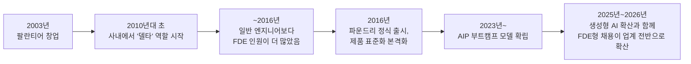
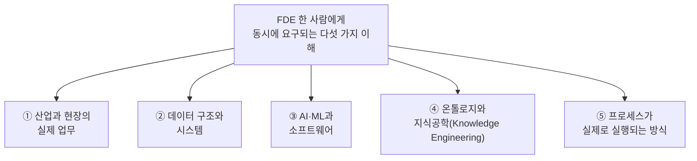
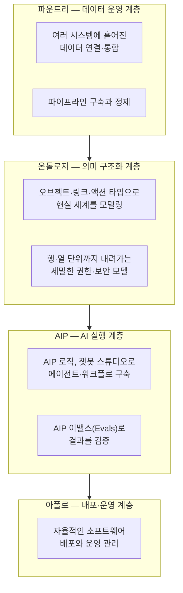
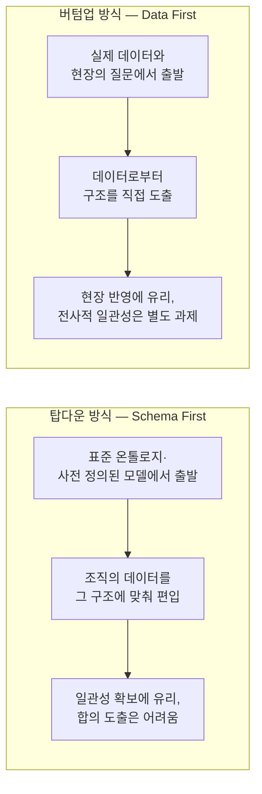

## — 스레드 두 편을 근거로 다시 정리한 상세 해설

> 
> https://www.threads.com/share/BAXvYjDKqR/
> 
> 한국에서는 FDE를 너무 이상하게 이해한다.
> 
> FDE는 고객사에 파견돼 AI 기능 몇 개 만들어주는 개발자가 아니다. 팔란티어급의 복잡한 엔터프라이즈 문제를 다루려면 FDE 한 명이 다음을 모두 알아야 한다.
> 
> 산업과 현장의 실제 업무,
> 데이터 구조와 시스템,
> AI·ML과 소프트웨어,
> 온톨로지와 Knowledge Engineering,
> 프로세스가 실제로 실행되는 방식까지.
> 기업 사정상 친절하게 현업 분들이 과외 시켜 주지도 않는다
> 
> 그 산업에 대한 실전 경험과 해박한 전문지식이 없으면
> 고객이 말하는 문제 자체를 제대로 정의할 수도 없다.
> 
> Knowledge Engineer도 마찬가지다. 지식그래프를 그리는 사람이 아니다.
> 
> 기업 안에 흩어진 데이터와 업무 규칙을 연결하고,
> 사람이 암묵적으로 알고 있던 판단 구조를
> AI가 이해하고 실행할 수 있는 형태로 만들어야 한다.
> 
> 이런 사람은 거의 없다. 그래서 FDE와 Knowledge Engineer가 희소한 것이다.
> 
> 하지만 뛰어난 사람만 데려온다고 끝나는 것도 아니다. 뒤에 강력한 플랫폼이 반드시 있어야 한다.
> 
> 데이터 연결, 의미 구조화, 권한관리,
> 워크플로, 모델 실행, 검증, 배포까지
> 플랫폼에 이미 제품화돼 있어야 한다.
> 
> 팔란티어가 일주일 만에 할 수 있는 일을
> 일반 SI가 몇 달을 줘도 못하는 이유가 여기에 있다.
> 
> 결국 SI 가격이 싼 것도, 왜 만만한 지식형(?) 문서 + 챗봇 위주인지도, 팔란티어가 왜 비싼지도 이해간다.
> 
> 기업의 규모나 수준에 따라 다르겠지만, 큰 회사는 왠만한 수준의 자동화는 되어있고 상당한 최적화도 이루어져있는 경우가 많습니다. 업무에 경미한(?) 개선은 ROI가 안나옵니다. 그동안 자기들도 해결하지 못했던, 접근하기 어려운 복잡한 과제를 해결해주기를 원한다면, 인원의 문제보다는 총체적으로 잘 이해하고 높은 수준의 인공지능적 접근과 실제 해결할 수 있는 탤런트가 필요해집니다.
> 
> 
> https://www.threads.com/share/_vtQFfq3l/
> 
> 탑다운 방식으로 할 수밖에 없어서 생기는 문제입니다. 어째서 기업 내부의 업무를 외부에서 온 FDE가 더 잘 알아야 할까요? 업무를 다루는 기업내부의 실무자의 업무를 증류하고 라벨링해서 버텀업하고 쌓아가면 한 기업에 수십명의 FDE가 투입될 필요가 없습니다. 팔란티어라는 솔루션에 맞추다보니 생긴 기현상이라고 봅니다. 그리스로마 신화에 등장하는 프로크루스테스의 침대를 연상하게 합니다. 물론 팔란티어 방식의 탑다운도 필요하지만 너무 과도하지요. 버텀업과 적절히 론합 운영될 때 온전하게 기업의 지식자산이 축적되는게 아닌가 하고 의견을 드려봅니다.
> 

---

## 목차

1. 이 문서를 쓰는 이유
2. 원문 개요 — 두 편의 스레드는 각각 무엇을 말하고 있는가
3. FDE(Forward Deployed Engineer)란 정확히 무엇인가
4. FDE에게 동시에 요구되는 다섯 가지 역량
5. 지식엔지니어(Knowledge Engineer)란 무엇인가
6. 팔란티어의 온톨로지 시스템 — 플랫폼이 하는 일
7. "왜 플랫폼 없이는 안 되는가" — 원문의 핵심 주장 검증
8. FDE라는 직무의 희소성과 몸값
9. 팔란티어의 사업 실적이 보여주는 것
10. 한국에서 실제로 벌어지고 있는 일 — LG CNS와 팔란티어
11. 두 번째 글 — 탑다운 방식에 대한 문제 제기
12. 탑다운과 버텀업, 실제로 존재하는 오래된 논쟁
13. 업계에서 이미 나온 비슷한 비판들
14. 두 시각을 종합하면
15. 정리
16. 참고문헌

---

## 1. 이 문서를 쓰는 이유

이 문서는 두 편의 스레드 게시물을 원문 그대로 옮기는 대신, 그 안에 담긴 주장 하나하나를 풀어서 설명하고, 팔란티어(Palantir Technologies)의 공식 자료와 외부 취재, 학술 문헌, 국내 보도를 근거로 사실관계를 확인하는 데 목적을 둔다. 두 글은 모두 필자 본인의 의견과 분석을 담은 에세이 형식의 글이며, 이 문서는 그 의견을 "맞다/틀리다"로 재단하지 않는다. 다만 어떤 부분이 팔란티어가 공식적으로 밝힌 사실이고, 어떤 부분이 업계 관찰자들의 분석이며, 어떤 부분이 필자 개인의 해석과 주장인지를 구분해서 표시한다. 이렇게 구분하는 이유는 간단하다. FDE(포워드 디플로이드 엔지니어)라는 직무는 지금 한국에서도 빠르게 화제가 되고 있는데, 정작 이 개념이 정확히 무엇을 가리키는지, 팔란티어라는 회사가 실제로 어떤 구조로 움직이는지에 대한 오해가 적지 않기 때문이다.

---

## 2. 원문 개요 — 두 편의 스레드는 각각 무엇을 말하고 있는가

첫 번째 글의 요지는 이렇다. 한국에서는 FDE를 고객사에 파견되어 AI 기능 몇 개를 만들어주는 개발자 정도로 오해하는 경우가 많지만, 실제로 팔란티어급의 복잡한 엔터프라이즈 문제를 다루려면 한 사람이 산업 현장의 실제 업무, 데이터 구조와 시스템, AI·ML과 소프트웨어, 온톨로지와 지식공학, 그리고 프로세스가 실제로 실행되는 방식까지를 동시에 이해해야 한다는 것이다. 이런 실전 경험과 전문지식 없이는 고객이 말하는 문제 자체를 제대로 정의할 수조차 없다는 것이 필자의 핵심 주장이다. 지식엔지니어 역시 단순히 지식그래프를 그리는 사람이 아니라, 기업 안에 흩어진 데이터와 업무 규칙을 연결하고 사람이 암묵적으로 알고 있던 판단 구조를 AI가 이해하고 실행할 수 있는 형태로 만드는 사람이라는 점을 강조한다. 그리고 이런 인재가 뛰어나다고 해도 그 뒤를 받쳐주는 강력한 플랫폼, 즉 데이터 연결, 의미 구조화, 권한관리, 워크플로, 모델 실행, 검증, 배포까지 이미 제품화되어 있는 플랫폼이 없으면 성과를 내기 어렵다는 점이 이 글의 결론이다. 필자는 이 지점에서 왜 일반 SI(시스템 통합) 업체의 가격이 상대적으로 저렴한지, 왜 그들의 결과물이 문서형 산출물이나 챗봇 위주에 머무르는 경우가 많은지, 그리고 왜 팔란티어의 몸값이 비싼지가 함께 설명된다고 본다.

두 번째 글은 첫 번째 글에 대한 반론 성격의 후속 게시물이다. 필자는 팔란티어 방식이 본질적으로 탑다운(top-down) 접근이기 때문에 구조적인 문제가 생긴다고 지적한다. 기업 내부의 업무를 정작 외부에서 온 FDE가 내부 실무자보다 더 잘 알아야 하는 상황 자체가 기이하다는 것이다. 대안으로 필자는, 업무를 다루는 기업 내부 실무자의 업무를 증류하고 라벨링해서 버텀업(bottom-up) 방식으로 지식을 쌓아 올리면 한 기업에 수십 명의 FDE를 투입할 필요가 없어질 것이라고 주장한다. 그리고 이런 현상이 팔란티어라는 솔루션에 맞추다 보니 생긴 기현상이라고 진단하면서, 그리스로마 신화 속 프로크루스테스의 침대(지나가는 나그네를 억지로 침대 길이에 맞춰 늘이거나 잘라버렸다는 인물)에 비유한다. 팔란티어식 탑다운 접근도 필요는 하지만 과도하며, 버텀업과 적절히 조합되어 운영될 때 비로소 기업의 지식자산이 온전하게 축적된다는 것이 두 번째 글의 결론이다.

두 글 모두 필자 개인의 분석과 주장이며, 이는 사실 보도가 아니라 의견 에세이라는 점을 먼저 밝혀둔다. 아래 3장부터는 이 주장들이 딛고 있는 개념적 토대, 즉 FDE라는 직무가 실제로 어떻게 정의되고 운영되는지, 지식공학이라는 용어가 어디에서 왔는지, 팔란티어의 플랫폼이 실제로 어떤 구조인지를 하나씩 검증한다.

---

## 3. FDE(Forward Deployed Engineer)란 정확히 무엇인가

FDE라는 직무는 팔란티어가 2003년 창업 이후, 정확히는 2010년대 초에 만들어낸 것으로 알려져 있다. 당시 팔란티어 내부에서는 이 역할을 "델타(Delta)"라는 코드명으로 불렀다고 전해진다[5]. 팔란티어는 정부·정보기관·군 등을 상대로 민감하고 복잡한 데이터를 다루는 소프트웨어를 공급했는데, 이 소프트웨어가 고객이 스스로 설치해서 쓰기에는 너무 복잡했기 때문에, 아예 엔지니어를 고객 조직 안에 상주시켜서 문제를 직접 풀게 하는 방식을 택했다는 것이 이 역할의 기원에 대한 일반적인 설명이다[5][4].

팔란티어가 공식 채용 페이지에서 설명하는 FDE(정확한 사내 직함은 Forward Deployed Software Engineer, FDSE)의 정의는 이렇다. FDE는 단순한 소프트웨어 엔지니어가 아니라 고객 조직 안에 직접 들어가서 가장 시급한 문제를 정면으로 다루는 사람이며, 실제 업무 환경과 비즈니스에 핵심적인 데이터를 활용해 문제를 빠르게 이해하고 해결책을 설계·구축한다고 소개하고 있다[1]. 2022년 팔란티어가 공개한 사내 인터뷰에서는, 전통적인 소프트웨어 엔지니어("Dev")가 여러 고객에게 두루 쓰일 수 있는 하나의 기능을 만드는 데 집중한다면, FDSE는 한 고객을 위해 여러 기능을 동시에 가능하게 만드는 데 집중한다는 점에서 역할이 구분된다고 설명한다[3]. 생성형 AI 시대에 새로 생긴 "Forward Deployed AI Engineer" 포지션의 경우, 팔란티어는 이 역할의 일상 업무가 스타트업의 현장형 CTO(hands-on startup CTO)와 비슷하다고 설명하면서, 작은 팀 단위로 움직이며 고위험·고비중 프로젝트를 처음부터 끝까지 책임진다고 밝히고 있다[2].

팔란티어의 이런 인력 운용 방식을 취재한 외부 매체들의 분석을 종합하면, 이 조직은 크게 두 축으로 움직인다. 하나는 도메인 전문성을 가진 "에코(Echo)" 팀으로, 이들은 실제로 고객과 같은 업계(군, 헬스케어, 금융 등) 출신이거나 그에 준하는 이해도를 가진 사람들로 구성되어 현장의 진짜 문제를 파악하는 역할을 한다. 다른 하나는 그 문제를 실제 소프트웨어로 구현하는 엔지니어링 축이다[74]. 이 두 축이 만나 고객사에서 얻은 통찰이 팔란티어의 제품(파운드리, AIP 등)에 다시 반영되고, 그 제품이 다음 고객사를 더 빠르게 도와주는 식의 순환 구조를 만든다는 것이 여러 분석에서 공통적으로 지적하는 지점이다[74][6].

한 가지 분명히 해둘 시점이 있다. 2016년 팔란티어의 통합 데이터 플랫폼인 파운드리(Foundry)가 정식 출시되기 전까지는 회사 내에 일반 소프트웨어 엔지니어보다 FDE가 더 많았을 정도로 이 직무가 회사 전체를 대표하는 인력 구조였다는 점이다[5]. 파운드리 출시 이후에는 많은 FDE 출신 인력이 다시 코어 제품 엔지니어링 조직으로 옮겨가면서, 현장에서 반복적으로 부딪힌 문제들을 표준 플랫폼 기능으로 녹여 넣는 흐름이 강화되었다[5]. 즉 FDE는 "일회성으로 고객을 도와주고 떠나는 컨설턴트"가 아니라, 현장의 경험을 다시 제품으로 승화시키는 순환 고리의 한 축이라는 것이 팔란티어와 여러 외부 분석가들이 공통적으로 강조하는 부분이다[71][72].

아래는 이 직무가 걸어온 흐름을 정리한 것이다.

이 마지막 흐름, 즉 2025년 이후의 확산은 팔란티어만의 이야기가 아니다. 오픈AI는 자체적으로 "Forward Deployed Engineer" 성격의 채용을 확대하고 있고, 앤트로픽 역시 고객사와 직접 결합해 배포하는 조직을 강화하는 움직임을 보이고 있다는 것이 여러 산업 보도에서 공통적으로 확인된다[76][78]. 다만 이 부분은 각 회사의 조직 개편이 진행 중인 사안이라 세부 조직명이나 규모는 시점에 따라 달라질 수 있다는 점은 밝혀둔다.

---

## 4. FDE에게 동시에 요구되는 다섯 가지 역량

원문 필자는 팔란티어급의 복잡한 문제를 다루는 FDE 한 사람에게 다섯 가지 영역의 이해가 동시에 요구된다고 정리했다. 이는 팔란티어의 공식 채용 요건이나 외부 분석과도 상당 부분 겹친다. 아래는 원문의 구조를 그대로 살려 정리한 것이다.

이 다섯 가지는 실제 팔란티어의 채용 공고에서도 비슷한 결로 확인된다. 예를 들어 컨설팅 파트너사를 통한 FDE 채용 공고에서는 소프트웨어·데이터·분석 엔지니어링 3년 이상의 실무 경험을 요구하면서 동시에, 임원급 이해관계자에게 기술적 개념을 명확하고 설득력 있게 설명할 수 있는 소통 능력을 별도로 강조한다[9]. 팔란티어 본사가 직접 올리는 FDSE 공고 역시 세계를 바꾸는 문제와 실질적인 기술이 만나는 지점에서 일하게 될 것이라고 소개하면서, 고객과 나란히 서서 가장 어려운 문제를 빠르게 파악하고, 비즈니스에 핵심적인 데이터와 최신 AI 기술을 결합해 해결책을 설계·구축하는 역할이라고 설명한다[7]. 즉 기술 역량만으로는 부족하고, 그 기술을 실제 업무 맥락과 조직의 의사결정 구조에 맞춰 넣을 수 있는 능력이 함께 요구된다는 점에서 원문의 주장은 팔란티어가 공식적으로 밝히는 채용 기준과 결을 같이한다.

여기서 원문이 덧붙인 문장, 즉 "기업 사정상 친절하게 현업 분들이 과외 시켜 주지도 않는다"는 팔란티어의 공식 자료에서 확인되는 사실은 아니며, 필자가 현장 경험을 바탕으로 관찰한 개인적 진단으로 보아야 한다. 다만 이 진단은 뒤에서 다룰 업계 비판(13장)과 맥락이 통하는 지점이 있다.

---

## 5. 지식엔지니어(Knowledge Engineer)란 무엇인가

"지식엔지니어"라는 말은 팔란티어가 처음 만든 용어가 아니다. 이 용어의 뿌리는 1970~80년대 인공지능 연구, 특히 스탠퍼드 대학의 에드워드 파이겐바움(Edward Feigenbaum)이 이끈 전문가 시스템(expert system) 연구로 거슬러 올라간다. 파이겐바움은 화학 물질의 분자 구조를 추론하는 덴드럴(DENDRAL) 프로젝트와 감염성 혈액 질환을 진단하는 마이신(MYCIN) 프로젝트를 통해, 전문가의 암묵적인 판단 규칙("경험 법칙")을 컴퓨터가 다룰 수 있는 형태로 옮기는 작업을 가리켜 "지식공학(Knowledge Engineering)"이라는 용어를 처음 사용했고, 이 작업을 수행하는 사람을 지식엔지니어라고 불렀다[11][12][13][38]. 파이겐바움은 1983년 강연에서 이 지식이 "그 분야의 우수한 실무 규칙, 판단의 규칙, 그럴듯한 추론의 규칙"이며, 이런 종류의 지식은 분야의 단순한 사실과 달리 문서로 잘 남아있지 않다는 점을 지적한 바 있다[35]. 이 정의는 원문 필자가 말한 "사람이 암묵적으로 알고 있던 판단 구조를 AI가 이해하고 실행할 수 있는 형태로 만드는 일"이라는 설명과 정확히 같은 맥락에 있다.

다만 여기서 정확히 짚어야 할 점이 하나 있다. 현재 팔란티어의 채용 페이지나 공식 문서를 살펴보면, "Knowledge Engineer"라는 명칭이 팔란티어 본사의 표준 직함으로 널리 쓰이고 있지는 않다. 팔란티어 생태계 안에서 이 역할에 가장 가깝게 대응하는 공식 직함은 "온톨로지 엔지니어(Ontology Engineer)" 또는 "온톨로지 아키텍트"이며, 이는 팔란티어 본사뿐 아니라 부즈 앨런 해밀턴(Booz Allen Hamilton), 딜로이트, 액센츄어 같은 팔란티어 공인 파트너사들의 채용 공고에서 반복적으로 등장하는 명칭이다[10][11][12][13][17]. 이 직무의 설명을 보면, 파운드리 플랫폼 안에서 프로덕션급 데이터 파이프라인과 온톨로지를 구축·유지하는 일, 조직의 데이터 조직 방식을 파악해 이를 팔란티어 온톨로지 표현으로 변환하는 일, 시맨틱 오브젝트 연결(온톨로지)을 활용해 데이터 통합·분석·시각화 역량을 강화하는 백엔드 로직을 개발하는 일 등이 핵심 업무로 제시된다[10][11]. 즉 원문에서 말하는 "지식엔지니어"가 하는 일의 실체는, 팔란티어 생태계 안에서는 대체로 온톨로지 엔지니어라는 이름으로 수행되고 있으며, "지식엔지니어"라는 표현 자체는 1970~80년대 AI 연구에서 온 더 오래되고 포괄적인 개념어에 가깝다고 보는 것이 정확하다. 이 구분을 밝히는 이유는, 원문의 주장 자체가 틀렸다는 뜻이 아니라 — 실제로 이 역할이 하는 일의 본질은 원문의 설명과 거의 일치한다 — 용어 사용의 정확한 계보를 분명히 해 두는 것이 이해에 도움이 되기 때문이다.

흥미로운 점은, 이 오래된 개념이 최근 다시 학술적으로 주목받고 있다는 사실이다. 2023년의 한 연구는 지식공학을 "지식을 생성하고 적용하는 자동화된 과정을 개발하고 유지하는 학문"으로 재정의하면서, 1990년대 초반 전문가 시스템 방식이 수작업 지식 습득과 규칙 기반 표현에 의존한 탓에 유지보수 비용이 크고 변화하는 요구에 적응하기 어려웠다는 한계를 지적하고, 이후 웹과 링크드 데이터, 표준 온톨로지가 이 문제를 해결하는 방향으로 발전해왔다고 설명한다[39]. 이 흐름의 연장선에 팔란티어의 온톨로지 플랫폼과, 최근에는 거대언어모델을 온톨로지 구축에 활용하는 새로운 연구들이 자리잡고 있다.

---

## 6. 팔란티어의 온톨로지 시스템 — 플랫폼이 하는 일

원문이 강조한 "뒤에 강력한 플랫폼이 반드시 있어야 한다"는 주장을 검증하려면, 팔란티어의 플랫폼이 실제로 어떤 구조인지를 살펴볼 필요가 있다. 팔란티어는 자사의 온톨로지를 "조직의 운영 계층(operational layer)"이라고 설명한다. 온톨로지는 파운드리에 통합된 데이터셋, 가상 테이블, 모델 같은 디지털 자산 위에 놓여서, 이를 공장·장비·제품 같은 물리적 자산부터 고객 주문이나 금융 거래 같은 개념에 이르기까지 현실 세계의 대응물과 연결한다. 팔란티어는 많은 환경에서 온톨로지가 조직의 "디지털 트윈" 역할을 하며, 의미적 요소(오브젝트, 속성, 링크)와 실행적 요소(액션, 함수, 동적 보안)를 모두 포함해 다양한 유스케이스를 가능하게 한다고 설명한다[7].

이 구조를 실제로 도입한 사례로 확인되는 곳이 리오틴토(Rio Tinto)다. 세계적인 광산·금속 기업인 리오틴토는 파운드리를 조기에 도입해 온톨로지, 즉 디지털 트윈을 구축했고, 이를 기반으로 공장 운영 관리부터 지질기술 리스크 모니터링, 무인 열차 운영 조율까지 수행하고 있다고 팔란티어와 리오틴토가 공동으로 밝힌 바 있다[10]. 리오틴토의 최고상무책임자는 온톨로지 덕분에 구조화된 데이터에 대한 접근성이 좋아졌고, AIP는 비정형 데이터에 대해서도 같은 역할을 하면서 이전에는 너무 복잡하다고 여겨졌던 문제들에 빠르게 대응할 수 있게 해주었다고 언급했다[10].

팔란티어의 전체 플랫폼 스택은 크게 네 층으로 나눠 이해할 수 있다. 데이터를 연결하고 정제하는 파운드리, 그 데이터를 현실 세계의 개념과 규칙으로 구조화하는 온톨로지, 그 온톨로지 위에서 생성형 AI 기능을 실행하는 AIP, 그리고 이 모든 결과물을 실제 운영 환경에 안전하게 배포·관리하는 아폴로(Apollo)다. 팔란티어는 이 셋(파운드리·AIP·아폴로)이 합쳐져 하나의 운영체제처럼 작동하며, LLM 기반 웹 애플리케이션부터 비전-언어 모델을 쓰는 모바일 앱, 로컬 AI를 내장한 엣지 애플리케이션까지 폭넓은 AI 기반 제품을 만들어낼 수 있다고 설명한다[9].

이 구조에서 특히 눈여겨볼 부분은 보안 모델이다. 팔란티어는 공급망 분석가, 생산 엔지니어, 창고 근무자 등 서로 다른 역할을 가진 사용자들이 온톨로지에 접근할 때, 전역적인 설비 원격측정 데이터를 볼 수 있는 권한부터 지역 단위로 제한된 권한, 특정 사용자에 한해 행·열 단위로 세분화된 권한까지 각기 다른 접근 범위가 필요하다고 설명한다. 그리고 이런 팀들이 AI 에이전트를 만들 때조차, 그 에이전트는 사람 사용자로부터 권한을 상속받거나 프로젝트 단위로 정의된 권한 구조를 따라야 한다는 점을 강조한다[8]. 즉 "권한관리"는 부수적인 기능이 아니라 온톨로지 설계 자체에 깊이 얽혀 있는 요소라는 것이다.

이런 구조를 두고 팔란티어 온톨로지를 분석한 한 기술 블로그는, 이 시스템의 학습 난이도가 상당히 높다는 점도 함께 지적한다. 오브젝트 타입, 링크 타입, 액션 타입, 함수, 인터페이스, 역할, 온톨로지 매니저, 워크숍, OSDK, AIP 로직, AIP 챗봇 스튜디오, 오브젝트 뷰 등 익혀야 할 용어 자체가 방대해서, 많은 조직이 자체 교육에 투자하거나 팔란티어의 현장 엔지니어에게 의존하게 된다는 것이다[26]. 이 지적은 원문이 말한 "SI가 몇 달을 줘도 못하는 이유"와 정확히 맞닿아 있다. 플랫폼 자체의 개념 체계가 방대하고, 그 개념 체계를 능숙하게 다루는 사람이 원래도 드물다는 것이다.

---

## 7. "왜 플랫폼 없이는 안 되는가" — 원문의 핵심 주장 검증

원문은 뛰어난 사람만 데려온다고 끝나는 것이 아니라 데이터 연결, 의미 구조화, 권한관리, 워크플로, 모델 실행, 검증, 배포까지 이미 제품화된 플랫폼이 필요하다고 주장했다. 이 주장은 앞서 6장에서 확인한 파운드리-온톨로지-AIP-아폴로 구조와 정확히 대응한다. 즉 원문이 나열한 일곱 가지 기능(데이터 연결, 의미 구조화, 권한관리, 워크플로, 모델 실행, 검증, 배포)은 실제 팔란티어 플랫폼의 구성 요소들과 거의 1:1로 대응된다고 볼 수 있다. 이는 원문 필자의 주장이 막연한 추측이 아니라 팔란티어의 실제 제품 구조를 정확히 짚고 있다는 뜻이다.

다만 이 지점에서 균형을 잡을 필요가 있는 대목도 있다. 팔란티어의 FDE 모델을 비판적으로 바라보는 외부 시각도 존재한다. 공급망 관리 소프트웨어 업체 아나플랜(Anaplan)의 CEO 찰리 갓디너는 FDE 방식이 빠른 개념검증(PoC)을 보여주는 효과적인 영업 전술이기는 하지만, 장기적인 전략으로는 부족하다고 평가하면서 고객이 특정 벤더에 종속되고 기능이 제한되는 결과로 이어질 수 있다고 지적한 바 있다[18]. 또 팔란티어 출신 임원이 이끄는 경쟁사 키낙시스(Kinaxis)의 마닉 샤르마는 FDE 방식의 잠재력은 인정하면서도, 정작 팔란티어의 실행 과정에서 엔지니어들이 해당 산업 도메인 지식이 부족한 경우가 있다는 점을 비판했다고 미국 매체 포브스가 2026년 7월 보도했다[18]. 이 비판은 정확히 원문 필자가 첫 번째 글에서 강조한 "그 산업에 대한 실전 경험과 해박한 전문지식이 없으면 문제 자체를 제대로 정의할 수 없다"는 지점과 맞닿아 있으며, 동시에 두 번째 글에서 제기한 "외부 FDE가 내부 실무자보다 업무를 더 잘 알아야 하는 상황 자체가 기이하다"는 문제의식과도 통한다. 즉 팔란티어 모델 자체가 이론적으로는 완결적이라 해도, 실제 실행 단계에서는 개별 FDE의 도메인 이해도 편차라는 현실적인 한계가 존재한다는 점은 업계에서도 이미 지적되고 있는 사안이다.

---

## 8. FDE라는 직무의 희소성과 몸값

원문은 이런 인재가 "거의 없다"고 표현했는데, 이는 최근의 채용 시장 데이터로도 뒷받침된다. 2025년 11월 파이낸셜타임스와 인디드 하이어링랩의 공동 보고서에 따르면, 고객 맞춤형 AI 엔지니어로 불리는 FDE 채용 공고가 2025년 1월부터 9월까지 800퍼센트 이상 급증했으며, 오픈AI·앤트로픽·코히어 등 주요 AI 기업들이 이 인력을 적극적으로 채용하면서 연구 중심에서 상용화 중심으로 인력 구조가 바뀌고 있다고 ZDNet Korea가 보도했다[21].

보상 수준을 보면 이 직무의 희소성이 더 분명히 드러난다. 급여 정보 플랫폼 레벨스에프와이아이(Levels.fyi)의 2026년 8월 기준 자료에 따르면, 미국 내 팔란티어 FDE의 연간 총보상은 최저 18만 5천 달러에서 최고 63만 1천 달러 이상까지 분포하며 중위값은 약 26만 달러 수준이다[14]. 다만 이 수치는 자발적으로 제출된 신고 데이터를 집계한 것이라는 한계가 있으며, 다른 조사기관인 글래스도어의 집계는 이보다 낮은 평균값(약 15만 6천 달러)을 보이는 등 출처에 따라 편차가 있다는 점은 밝혀둔다[15]. 한편 오픈AI나 앤트로픽 같은 프론티어 AI 랩에서는 이보다 훨씬 높은 수준의 보상이 형성되어 있다는 분석도 나온다. 한 급여 분석 보고서는 프론티어 랩 기준으로 중간급 FDE의 총보상이 약 38만 5천 달러, 스태프급은 약 61만 달러, 프린시펄급은 100만 달러를 넘어서는 수준이라고 추산했는데[47], 이 수치는 개별 조사기관의 추산치로서 공식 발표 자료가 아니므로 참고치로 이해하는 것이 적절하다.

국내에서도 이 직무의 몸값이 화제가 되고 있다. 교육 플랫폼 패스트캠퍼스가 게재한 소개 글에서는 FDE를 "고객사 현장에 상주하며 AI 솔루션을 직접 설계하고 비즈니스 병목을 해결하는 엔지니어이자 컨설턴트"로 정의하면서, 오픈AI 등 글로벌 기업이 억대 연봉(원문 표현으로는 4억 원대)을 제시하는 핵심 직무라고 소개하고 있다[79]. 이 금액은 마케팅 목적의 소개 자료에서 나온 수치라는 점에서 업계 전반의 평균으로 일반화하기는 조심스럽지만, 최상위 수준의 FDE가 상당한 고액 연봉 대상이 되고 있다는 방향성 자체는 앞서 확인한 해외 급여 데이터와도 부합한다.

---

## 9. 팔란티어의 사업 실적이 보여주는 것

원문이 말한 "왜 팔란티어가 비싼지"를 이해하려면 회사의 최근 실적을 살�펴볼 필요가 있다. 팔란티어는 2026년 8월 3일 발표한 2026년 2분기 실적에서 매출이 전년 동기 대비 93퍼센트 증가한 19억 4천만 달러를 기록했다고 밝혔는데, 이는 회사 역사상 가장 빠른 분기 매출 성장률이었다[54][57]. 특히 미국 상업 부문 매출은 전년 대비 149퍼센트 증가한 7억 6천 4백만 달러를 기록했고, 회사는 2026년 연간 매출 가이던스를 기존 76억 5천만~76억 6천만 달러에서 81억 5천만~81억 6천만 달러 수준으로 상향 조정했다[55][54]. 알렉스 카프 최고경영자는 실적 발표에서 이번 분기를 "비정상적으로 좋았다(otherworldly)"고 평가하며, "AI 주권(AI sovereignty)에 대한 수요가 이제 본격적으로 풀려나오고 있다"고 언급했다[56].

이 실적은 원문이 말한 "SI 가격이 싼 이유, 팔란티어가 비싼 이유"에 대한 하나의 답이 될 수 있다. 팔란티어는 단순히 인력을 파견하는 서비스가 아니라, 조정 이익률(adjusted operating margin) 62퍼센트, 성장률과 이익률을 더한 이른바 "Rule of 40" 점수가 155퍼센트에 달하는 소프트웨어 기업으로서의 수익성을 함께 보여주고 있다[54]. 다만 이런 고성장은 동시에 매우 높은 밸류에이션 부담을 동반하고 있다는 지적도 있다. 한 시장 분석은 2026년 8월 기준 팔란티어 주가가 실적 대비 약 107배의 주가수익비율(PER)에 거래되고 있다는 점을 짚으며, 향후 시장 포화나 밸류에이션 한계에 대한 우려도 함께 존재한다고 분석했다[61]. 즉 팔란티어의 사업 모델이 강력한 성과를 내고 있는 것은 사실이지만, 이것이 곧 이 모델의 지속가능성이나 주가의 적정성까지 보장한다는 뜻은 아니라는 점은 균형 있게 짚어둘 필요가 있다.

---

## 10. 한국에서 실제로 벌어지고 있는 일 — LG CNS와 팔란티어

원문에서 다룬 논의가 추상적인 이야기가 아니라는 것은 최근 한국 시장의 움직임에서도 확인된다. LG CNS는 2026년 3월 11일(현지시간) 미국에서 열린 팔란티어의 연례 행사 AIPCon에 앞서 팔란티어와 전략적 파트너십 계약을 체결했다고 밝혔다. 이 자리에는 현신균 LG CNS 대표이사와 알렉스 카프 팔란티어 CEO가 함께 참석했다[87][88]. 팔란티어는 기업 내 분산된 데이터를 통합·정제하는 파운드리와, 통합된 데이터 환경에 생성형 AI를 결합해 실시간 의사결정을 지원하는 AIP라는 두 축의 플랫폼을 갖추고 있으며, LG CNS는 이미 LG 계열사 한 곳의 품질 관리 영역에 파운드리와 AIP를 적용하는 개념검증(PoC)을 성공적으로 마치고 본 사업 계약까지 체결했다고 보도되었다[87]. LG CNS는 이 파트너십을 계기로 사업 전담 조직을 신설했다고 알려져 있다[89].

이후 2026년 4월 30일 LG CNS의 1분기 실적 콘퍼런스콜에서는 그룹 내 특정 업무 영역에 팔란티어를 실제로 도입했다는 점이 공식 확인되었고, 여러 계열사와 추가 개념검증을 논의 중이어서 향후 확산이 본격화될 전망이라고 알려졌다[91]. LG CNS 경영진은 이 자리에서 방산과 제조 부문에서의 AX(AI 전환) 수요가 빠르게 늘고 있다고 언급했다고 보도되었다[91]. 팔란티어의 한국 진출 동향을 정리한 한 기술 블로그는 LG CNS의 접근 방식이 "스스로 먼저 써보고, 검증하고, 그 역량을 외부에 판매하겠다"는 방향으로 요약될 수 있다고 분석하면서, 이 회사가 온톨로지를 설계할 수 있는 엔지니어를 자체적으로 키우고 제조·에너지·물류 산업 전반에 걸쳐 AX 프로젝트를 실행하는 포지션을 잡고 있다고 설명한다[92]. 다만 이 분석은 개별 블로그의 해석이라는 점에서, LG CNS의 공식 입장과 완전히 일치하지 않을 가능성은 열어두어야 한다.

이와 별도로 ZDNet Korea는 2026년 4월 팔란티어 관계자의 발언을 인용해, 국내 기업들의 AI 전환 실패율이 높은 상황에서 팔란티어가 제시하는 해법이 온톨로지에 있다고 보도했다. 이 기사에서 팔란티어 측 담당자는 기업의 AX가 단순한 기술 도입이 아니라 조직과 운영 방식의 변화이며, AI가 이해할 수 있는 기업 구조를 만드는 것이 성공의 출발점이라고 강조했다고 전해진다[22]. 이런 흐름은 첫 번째 원문 글이 지적한 "큰 회사는 상당한 최적화가 이미 이루어져 있어서, 경미한 개선은 ROI가 나오지 않는다"는 진단과도 통하는 지점이 있다. 한국의 대기업들이 팔란티어 같은 고비용 솔루션에 관심을 갖는 이유가, 이미 웬만한 자동화는 끝낸 상태에서 그동안 손대지 못한 복잡한 과제를 풀어줄 파트너를 찾고 있기 때문이라는 해석과 자연스럽게 이어진다.

---

## 11. 두 번째 글 — 탑다운 방식에 대한 문제 제기

두 번째 스레드 글은 첫 번째 글에 대한 응답 성격의 후속 글로, 필자는 팔란티어 방식이 본질적으로 탑다운일 수밖에 없기 때문에 생기는 문제를 지적한다. 논리는 다음과 같이 이어진다. 기업 내부의 업무를, 그 기업에서 일해본 적 없는 외부의 FDE가 내부 실무자보다 더 잘 알아야 한다는 것 자체가 이상하다는 것이다. 대신 그 업무를 실제로 다루는 기업 내부 실무자의 업무를 증류하고 라벨링해서 버텀업 방식으로 쌓아 올리면, 한 기업에 수십 명의 FDE를 투입할 필요가 없어진다는 것이 필자의 대안이다. 필자는 이런 현상이 팔란티어라는 특정 솔루션에 조직을 억지로 맞추다 보니 생긴 기현상이라고 진단하면서, 이를 그리스로마 신화의 프로크루스테스의 침대에 비유한다. 프로크루스테스는 지나가는 나그네를 자신의 침대에 눕혀 침대보다 다리가 길면 잘라내고, 짧으면 늘여서 죽였다는 전설 속 인물로, "정해진 틀에 대상을 억지로 맞추는 행위"를 가리키는 비유로 널리 쓰인다. 필자는 팔란티어식 탑다운 접근도 필요는 하지만 과도하다고 보며, 버텀업과 적절히 조합되어 운영될 때 비로소 기업의 지식자산이 온전하게 축적된다고 결론짓는다.

---

## 12. 탑다운과 버텀업, 실제로 존재하는 오래된 논쟁

이 두 번째 글이 제기하는 문제의식은 개인적인 직관에 그치는 것이 아니라, 지식공학과 온톨로지 연구 분야에서 오랫동안 논의되어온 실제 방법론적 대립과 정확히 일치한다. 온톨로지나 지식그래프를 구축하는 방식은 학술적으로 크게 두 갈래로 나뉜다는 것이 정설이다.

탑다운 방식은 "스키마 우선, 데이터는 나중"이라는 표현으로 요약된다. 이미 정립된 상위 수준의 도메인 모델, 즉 조직 내부에서 설계했거나 업계 표준으로 존재하는 온톨로지에서 출발해, 이 구조를 조직의 구체적인 데이터에 맞춰 적용해나가는 방식이다. 이 방식은 업계 표준에 맞춰야 할 필요가 있거나 팀·시스템 전반에 걸쳐 처음부터 일관성을 확보하고자 할 때 유리하다고 설명된다[64]. 반대로 버텀업 방식은 "데이터 우선, 스키마는 나중"이다. 조직이 이미 가지고 있는 데이터 소스와 실제 분석·조사 질문으로부터 온톨로지를 직접 도출해나가는 방식으로, 명확하게 정의된 사전 온톨로지가 없는 범용적인 지식그래프 구축에 주로 쓰인다는 것이 여러 학술 문헌의 공통된 설명이다[64][65].

이 구분은 최근 거대언어모델(LLM)을 활용한 온톨로지·지식그래프 구축 연구에서도 그대로 이어지고 있다. 2025년의 한 서베이 논문은 LLM을 활용한 온톨로지 구축 연구가 크게 두 방향으로 나뉜다고 정리한다. 하나는 LLM을 형식적인 온톨로지 모델링을 돕는 지능형 보조자로 활용하는 탑다운 접근이고, 다른 하나는 온톨로지를 활용해 LLM 자체의 추론·표현 능력을 강화하는 버텀업 접근이다[63]. 또 다른 연구는 지식그래프 구축의 전통적인 두 갈래를 설명하면서, 탑다운 방식은 잘 정립된 온톨로지가 이미 존재하는 특정 도메인 지식그래프에 주로 쓰이고, 버텀업 방식은 명확한 사전 온톨로지가 부족한 범용 지식그래프에 주로 적용된다고 정리한다[65]. 실제로 구글의 지식볼트(Knowledge Vault)나 마이크로소프트의 사토리(Satori) 지식베이스처럼 공개적으로 수집된 방대한 웹 데이터를 기반으로 자동으로 자원을 추출해 지식베이스를 구축한 사례들이 버텀업 방식의 대표적인 예로 꼽힌다[68].

흥미로운 것은, 이 두 접근을 놓고 어느 한쪽이 절대적으로 옳다고 결론짓는 학술 문헌은 찾기 어렵다는 점이다. 한 온톨로지 공학 관련 블로그는 2009년에 이미, 단일한 표준 온톨로지(탑다운)를 쓸 것이냐 지역적·개별적인 온톨로지(버텀업)를 쓸 것이냐를 두고 한쪽의 장점이 곧 다른 쪽의 위험이 된다고 짚은 바 있다. 단일한 표준 온톨로지는 번역이나 누락의 오류를 허용하지 않는 대신, 그 표준에 대한 합의를 이루는 일이 어렵거나 거의 불가능에 가까워서 정의 과정에서 많은 타협이 불가피하다는 것이다[69]. 버텀업 방식의 학술 논문 저자 역시, 버텀업 구축이 모든 상황에 적용 가능한 만능 해법이라고 주장하는 것이 아니라 온톨로지 개발자의 도구상자를 풍부하게 만드는 것이 목적이라고 명시하고 있다[67]. 즉 학술적으로 정리하면, 두 번째 글의 필자가 제기한 문제의식—탑다운 일변도의 접근이 갖는 한계와 버텀업 요소를 조합해야 할 필요성—은 개인적인 인상비평이 아니라, 온톨로지 공학 분야에서 반세기 가까이 이어져 온 정당한 방법론적 쟁점을 정확히 짚어낸 것이라고 평가할 수 있다.

---

## 13. 업계에서 이미 나온 비슷한 비판들

두 번째 글의 문제의식은 학술 논쟁뿐 아니라 실제 산업 현장의 비판과도 겹친다. 앞서 7장에서 인용한 것처럼, 팔란티어의 경쟁사인 키낙시스의 임원은 팔란티어의 FDE 방식이 이론적으로는 우수하지만 실제 실행 단계에서 엔지니어들이 도메인 지식을 충분히 갖추지 못한 경우가 있다고 비판했다[18]. 이는 결국 "왜 외부인이 내부 실무자보다 업무를 더 잘 알아야 하느냐"는 두 번째 글의 문제의식과 사실상 같은 지적이다. 아무리 뛰어난 FDE라 해도 결국은 외부인이며, 그 조직에서 수십 년간 일해온 실무자가 가진 암묵지를 단기간에 완전히 습득하기는 구조적으로 어렵다는 것이다.

또한 아나플랜 CEO의 비판, 즉 FDE 방식이 빠른 개념검증에는 강하지만 장기적으로는 특정 벤더에 대한 종속과 기능적 한계로 이어질 수 있다는 지적[18] 역시, 두 번째 글이 말한 "팔란티어라는 솔루션에 맞추다 보니 생긴 기현상"이라는 진단과 맥이 닿아있다. 다만 이 비판들은 모두 팔란티어의 직접적인 경쟁사 관계자들의 발언이라는 점은 유의할 필요가 있다. 경쟁 관계에 있는 기업의 임원이 상대 회사의 방법론을 비판하는 것은 그 자체로 이해관계가 얽힌 발언일 수 있으므로, 이 비판을 객관적 사실로 받아들이기보다는 업계 내에 존재하는 하나의 시각으로 참고하는 것이 합리적이다.

한편 팔란티어를 옹호하는 분석들은 다른 근거를 제시한다. 팔란티어의 FDE 모델을 분석한 한 매체는, 이 모델이 엔지니어의 숫자를 늘려서 확장하는 것이 아니라 "제도적 이해(institutional understanding)"를 확장하는 방식으로 지속가능성을 확보한다고 설명한다. 즉 팔란티어는 컨설팅 업체처럼 매번 새로운 프로젝트에 처음부터 다시 뛰어드는 것이 아니라, 현장에서 반복적으로 확인한 문제들을 파운드리나 온톨로지 같은 표준 플랫폼 기능으로 흡수시켜서, 다음 고객에게는 훨씬 적은 인력으로도 더 빠르게 대응할 수 있게 만드는 구조를 갖고 있다는 것이다[72][71]. 이 설명대로라면, 초기 도입 단계에서는 탑다운식 FDE 투입이 불가피해 보이더라도, 시간이 지나면서 그 조직 고유의 지식이 플랫폼 안에 누적되어 결국 외부 FDE에 대한 의존도가 낮아지는 방향으로 수렴할 수 있다는 뜻이 된다. 다만 이 역시 팔란티어를 옹호하는 분석가의 해석이라는 점에서, 실제 개별 고객사에서 이런 수렴이 얼마나 빠르게, 얼마나 완전하게 일어나는지는 사례별로 다를 수 있으며 일반화하기는 조심스럽다.

---

## 14. 두 시각을 종합하면

두 편의 원문 글을 나란히 놓고 보면, 사실 서로 모순되는 주장이라기보다는 하나의 현상을 서로 다른 층위에서 바라보고 있다고 이해하는 편이 정확하다. 첫 번째 글은 "왜 지금 FDE와 지식엔지니어라는 인재가 희소하고 비싼가"라는, 현재 시장에서 관측되는 현상에 대한 설명이다. 이 설명은 팔란티어의 공식 자료, 급여 데이터, 실적 자료로 상당 부분 뒷받침된다. 두 번째 글은 "이 현상이 지금의 방식대로 계속되는 것이 최선인가"라는, 방법론에 대한 문제 제기다. 이 문제 제기 역시 온톨로지 공학의 오래된 학술 논쟁, 그리고 팔란티어의 경쟁사들이 실제로 제기해온 비판과 맥을 같이한다.

정리하면, 팔란티어식 탑다운 접근이 현재 시장에서 압도적인 성과(93퍼센트의 매출 성장, LG CNS 같은 대기업과의 전략적 파트너십)를 내고 있다는 사실과, 이 접근 방식이 구조적으로 안고 있는 한계(외부인이 내부 지식을 완전히 대체하기 어렵다는 문제, 벤더 종속 우려)가 동시에 존재한다는 것이 현재까지 확인 가능한 사실관계에 가장 가깝다. 두 번째 글이 제안한 "버텀업과의 조합"이라는 대안이 실제로 얼마나 효과적인지, 혹은 팔란티어 스스로도 시간이 지나면서 특정 고객사 내부의 버텀업 지식을 온톨로지 안에 흡수해나가는 과정을 거치고 있는지에 대해서는, 이 문서가 검토한 공개 자료만으로는 확정적으로 판단하기 어렵다. 이 부분은 특정 기업의 도입 사례를 장기간에 걸쳐 추적해야 검증할 수 있는 영역이며, 현재로서는 필자 개인의 통찰력 있는 가설로 받아들이는 것이 정확하다.

---

## 15. 정리

이 문서는 두 편의 스레드 게시물이 던진 주장들을 하나씩 짚어보았다. FDE는 팔란티어가 2010년대 초 만들어낸, 고객사에 직접 상주하며 산업 지식·데이터 시스템·AI 기술·지식공학·조직 프로세스 이해를 동시에 요구받는 직무이며, 이는 팔란티어의 공식 채용 자료와 외부 취재를 통해 확인되는 사실이다. 지식엔지니어라는 용어는 1970~80년대 전문가 시스템 연구에서 유래했고, 오늘날 팔란티어 생태계 안에서는 대체로 "온톨로지 엔지니어"라는 직함으로 그 기능이 수행되고 있다. 팔란티어의 플랫폼(파운드리·온톨로지·AIP·아폴로)은 원문이 언급한 데이터 연결·의미 구조화·권한관리·워크플로·모델 실행·검증·배포 기능을 실제로 갖추고 있으며, 이것이 왜 일반 SI 업체가 짧은 기간에 따라잡기 어려운지를 설명해준다. 동시에 이 탑다운 방식은 외부 인력이 내부 도메인 지식을 완전히 대체하기 어렵다는 구조적 한계를 안고 있으며, 이는 팔란티어의 경쟁사들도 실제로 지적해온 문제이자 온톨로지 공학 분야에서 오랫동안 논의되어온 탑다운·버텀업 방법론 논쟁과 정확히 맞닿아 있다. 한국에서는 LG CNS가 2026년 3월 팔란티어와 전략적 파트너십을 맺고 자체 FDE 조직을 꾸리는 등, 이 논의가 더 이상 해외 사례에 그치지 않고 국내 대기업의 실제 사업 전략으로 옮겨오고 있다는 점도 함께 확인된다.

---

## 16. 참고문헌

[1] Palantir Technologies, "Forward Deployed Software Engineer" 공식 채용 페이지 — https://jobs.lever.co/palantir/dab396d4-2f14-4796-aac0-0d82883dccf0

[2] Palantir Technologies, "Forward Deployed AI Engineer" 공식 채용 페이지 — https://jobs.lever.co/palantir/636fc05c-d348-4a06-be51-597cb9e07488

[3] Palantir Blog(Medium), "A Day in the Life of a Palantir Forward Deployed Software Engineer" (2022.6.6) — https://blog.palantir.com/a-day-in-the-life-of-a-palantir-forward-deployed-software-engineer-45ef2de257b1

[4] Wikipedia, "Forward Deployed Engineer" — https://en.wikipedia.org/wiki/Forward_Deployed_Engineer

[5] Gergely Orosz, The Pragmatic Engineer, "What are Forward Deployed Engineers, and why are they so in demand?" (2025.11.3) — https://newsletter.pragmaticengineer.com/p/forward-deployed-engineers

[6] Everest Group, "Palantir: Inside the category of one – forward deployed software engineers" (2026.2.26) — https://www.everestgrp.com/palantir-inside-the-category-of-one-forward-deployed-software-engineers-blog/

[7] Palantir 공식 문서, "Overview • Ontology" — https://www.palantir.com/docs/foundry/ontology/overview

[8] Palantir 공식 문서, "The Ontology system" (Architecture Center) — https://www.palantir.com/docs/foundry/architecture-center/ontology-system

[9] Palantir 공식 문서, "Overview • AIP" — https://www.palantir.com/docs/foundry/aip/overview

[10] Business Wire, "Palantir and Rio Tinto Renew Enterprise Contract and Extend Access to Palantir's AI Platform" (2024.11.12) — https://www.businesswire.com/news/home/20241112799701/en/

[11] Gil Press, Forbes, "History Of AI In 33 Breakthroughs: The First Expert System" (2022.10.29) — https://www.forbes.com/sites/gilpress/2022/10/29/history-of-ai-in-33-breakthroughs-the-first-expert-system/

[12] Wikipedia, "Knowledge engineering" — https://en.wikipedia.org/wiki/Knowledge_engineering

[13] ACM Turing Award, "Edward A Feigenbaum" — https://amturing.acm.org/award_winners/feigenbaum_4167235.cfm

[14] Levels.fyi, "Palantir Forward Deployed Engineer Salary" (2026.8.21 업데이트) — https://www.levels.fyi/companies/palantir/salaries/software-engineer/title/forward-deployed-engineer

[15] Glassdoor, "Palantir Technologies Forward Deployed Engineer Salaries" — https://www.glassdoor.com/Salary/Palantir-Technologies-Forward-Deployed-Engineer-Salaries-E236375_D_KO22,47.htm

[16] Business Wire, "Palantir Reports Q2 2026..." (2026.8.3) — https://www.businesswire.com/news/home/20260802523449/en/

[17] Accenture / Deloitte 등 파트너사 채용 공고(Forward Deployed Engineer – Palantir) — https://www.accenture.com/us-en/careers/jobdetails?id=R00324743_en , https://apply.deloitte.com/en_US/careers/JobDetail/Forward-Deployed-Engineer-Palantir/329094

[18] Steve Banker, Forbes, "Palantir And Forward Deployed Engineering: What Should We Believe?" (2026.7.10) — https://www.forbes.com/sites/stevebanker/2026/07/10/palantir-and-forward-deployed-engineering-what-should-we-believe/

[21] ZDNet Korea, "AI 시대 새 주인공, '현장 배치 엔지니어'…올해 채용 800% 급증" (2025.11.3) — https://zdnet.co.kr/view/?no=20251103130646

[22] ZDNet Korea, "[현장] 실패율 높은 AI 전환…팔란티어 '해법은 온톨로지'" (2026.4.17) — https://zdnet.co.kr/view/?no=20260417121648

[26] PuppyGraph, "Palantir Ontology: Architecture & Benefits" — https://www.puppygraph.com/blog/palantir-ontology

[35] Gil Press, Forbes, 위 자료([11])와 동일 기사 — 파이겐바움의 1983년 강연 인용 부분

[38] ACM Turing Award, 위 자료([13])와 동일

[39] arXiv, "Knowledge Engineering using Large Language Models" — https://arxiv.org/pdf/2310.00637

[47] Perspective AI, "The 2026 Forward Deployed Engineering Compensation Report" (2026.5.21) — https://getperspective.ai/blog/2026-forward-deployed-engineering-compensation-report-1200-fdes

[54][55][56][57][58][59][60][61] Palantir 2026년 2분기 실적 관련 보도 — 24/7 Wall St., CNBC, Yahoo Finance, Business Wire, Seeking Alpha, TradingKey (2026.8월)

[63] arXiv, "LLM-empowered knowledge graph construction: A survey" — https://arxiv.org/pdf/2510.20345

[64] DataWalk, "Ontologies and Knowledge Graphs: Making Enterprise Data Easy to Understand" — https://datawalk.com/ontologies-and-knowledge-graphs-making-enterprise-data-easy-to-understand/

[65] arXiv, "Are Large Language Models Effective Knowledge Graph Constructors?" — https://arxiv.org/pdf/2510.11297

[67] ResearchGate, "Bottom-up construction of ontologies", IEEE Transactions on Knowledge and Data Engineering — https://www.researchgate.net/publication/3296767_Bottom-up_construction_of_ontologies

[68] arXiv, "A Novel Paper Recommendation Method Empowered by Knowledge Graph" — https://arxiv.org/pdf/2103.08819

[69] Organizing Knowledge (블로그), "Top Down or Bottom Up Ontologies" (2009.4.15) — http://organizingknowledge.blogspot.com/2009/04/top-down-or-bottom-up-ontologies.html

[71] Diogo Silva Santos, Medium(Activated Thinker), "A Comprehensive Analysis of Palantir's Forward Deployed Engineering Model" (2026.4.8) — https://medium.com/activated-thinker/a-comprehensive-analysis-of-palantirs-forward-deployed-engineering-model-4502a036b5e4

[72] Balaji Bal, Medium, "Understanding Palantir: Forward-Deployed Engineers and the Making of an Unusual Platform Company" (2026.3.23) — https://medium.com/@balajibal/understanding-palantir-forward-deployed-engineers-and-the-making-of-an-unusual-platform-company-494dc7812f24

[74] fde.academy, "How Palantir Invented the Forward Deployed Engineer Model" (2026.3.25) — https://fde.academy/blog/how-palantir-invented-the-forward-deployed-engineer-model

[76][78] MindStudio / Revolution in AI, 오픈AI·앤트로픽의 FDE 모델 확산 관련 분석 (2026.5월) — https://www.mindstudio.ai/blog/palantir-forward-deployed-engineer-model-anthropic-openai , https://www.revolutioninai.com/2026/05/forward-deployed-engineer-ai-anthropic-openai-explained.html

[79] 패스트캠퍼스, "FDE : AX 시대를 지배하는 엔지니어, 오픈AI와 팔란티어가 찾는 핵심 직무!" — https://fastcampus.co.kr/story_article_fde

[87][88][89] 헤럴드경제 / 아시아에이 / LG 공식 뉴스룸, "LG CNS, 美 AI 팔란티어와 '맞손'" (2026.3.12) — https://biz.heraldcorp.com/article/10692752 , https://www.asiaa.co.kr/news/articleView.html?idxno=243178 , https://www.lg.co.kr/media/release/29938

[91] 더벨, "[IR Briefing] LG CNS '그룹 업무에 팔란티어 실제 도입'" (2026.4.30) — https://www.thebell.co.kr/front/newsview.asp?key=202604301439584520107525

[92] Cliwant 블로그, "팔란티어 한국 상륙: LG CNS·HD현대가 선택한 AX 플랫폼" (2026.4.15) — https://blog.cliwant.com/palantir-korea-landing/

---

*이 문서는 사용자가 공유한 두 편의 스레드 게시물(원문은 필자 개인의 의견 및 분석 에세이)을 바탕으로, 공개된 팔란티어 공식 자료·학술 문헌·국내외 보도를 2026년 8월 기준으로 조사해 작성한 해설 자료입니다. 원문 필자의 개인적 진단이나 아직 검증되지 않은 예측은 본문에서 별도로 표시했습니다.*
