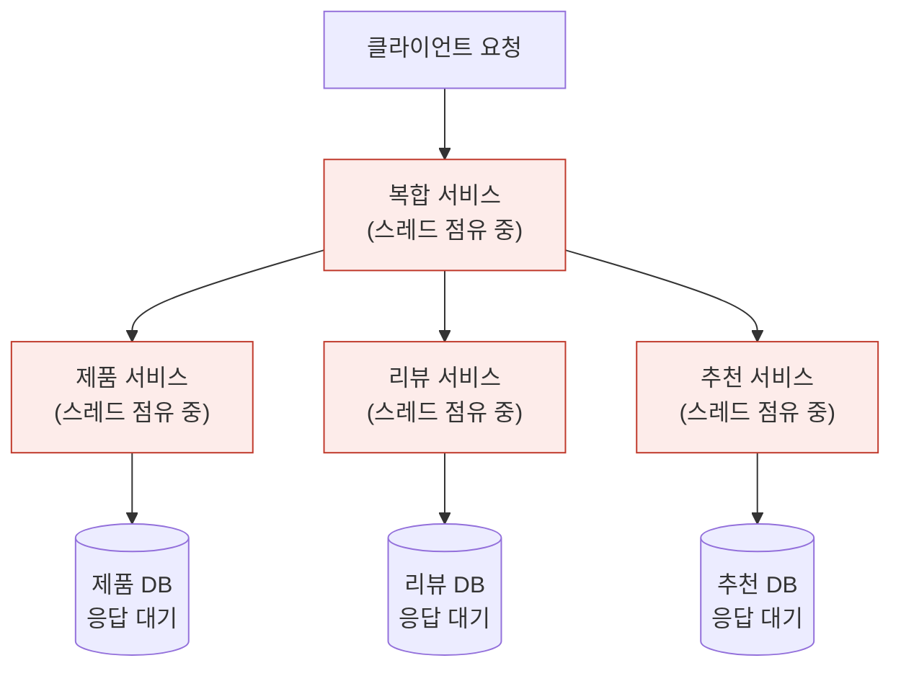
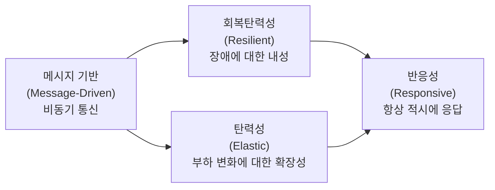
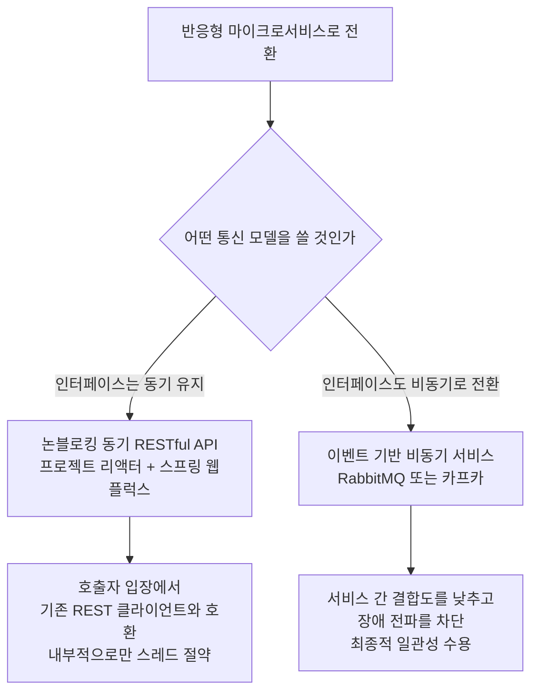
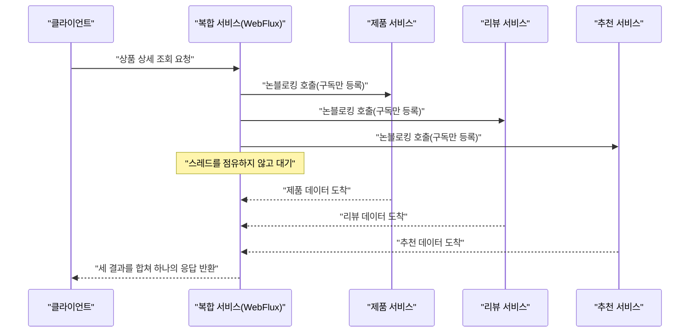
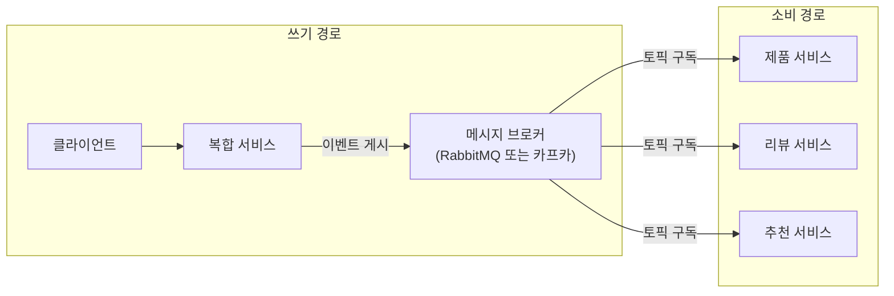
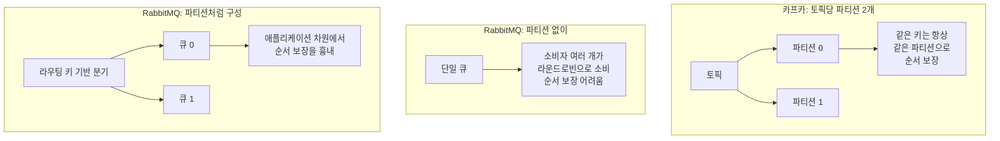

## 《스프링 부트 3와 스프링 클라우드를 활용한 마이크로서비스 구축》 7장 해설

---

## 목차

1. 이 책에 대하여
2. 7장이 책 전체 구조에서 차지하는 위치
3. 문제의 출발점 — 블로킹 I/O가 마이크로서비스에서 왜 특히 위험한가
4. 해결의 사상적 뿌리 — 리액티브 선언문과 네 가지 원칙
5. 리액티브 마이크로서비스로 가는 두 갈래 길
6. 첫 번째 길 — 논블로킹 동기 RESTful API 만들기
7. 두 번째 길 — 이벤트 기반 비동기 서비스 만들기
8. 반응형 환경을 검증하는 테스트 전략
9. 책 전체를 관통하는 디자인 패턴과 오픈소스 도구 지도
10. 정리 — 실무자 입장에서 무엇을 얻어갈 것인가
참고 자료 및 출처 신뢰도

---

## 1. 이 책에 대하여

이번에 살펴보는 책은 마그누스 라르손(Magnus Larsson)이 쓰고 위키북스가 2025년 11월 오픈소스 & 웹 시리즈 124번째 도서로 펴낸 《스프링 부트 3와 스프링 클라우드를 활용한 마이크로서비스 구축》이다. 번역은 트랜스메이트가 맡았고 정가는 35,000원으로 확인된다.[1][2] 원서는 Packt 출판사가 2023년 8월 31일에 낸 《Microservices with Spring Boot 3 and Spring Cloud, Third Edition》이며 분량은 706쪽에 이른다.[3][4] 저자 마그누스 라르손은 1986년부터 IT 업계에 몸담아 온 스웨덴의 베테랑 컨설턴트로, 볼보(Volvo)와 에릭슨(Ericsson), 아스트라제네카(AstraZeneca) 같은 대기업을 상대로 분산 시스템 컨설팅을 해 왔고 최근 여러 해 동안은 스프링 클라우드와 쿠버네티스, 이스티오를 활용해 고객사의 마이크로서비스 전환을 도와 온 인물이다.[3][4]

원서 3판은 자바 17과 스프링 부트 3, 스프링 클라우드 2022 버전 계열을 기준으로 새로 쓰였고, 예전 자바 EE 패키지 표기(javax)를 최신 자카르타 EE 표기(jakarta)로 교체했으며, 스프링의 AOT(Ahead-Of-Time) 컴파일 모듈이나 마이크로미터 트레이싱을 이용한 관측성(observability), 쿠버네티스 패키징 도구인 Helm 3 같은 최신 주제를 새로 담았다.[5] 책의 큰 흐름은 도커 컴포즈로 데이터베이스와 메시징 서비스를 갖춘 마이크로서비스를 로컬에서 띄워 보는 단계에서 시작해, 영속성과 복원력, 반응형 마이크로서비스, OpenAPI를 이용한 API 문서화를 거쳐 넷플릭스 유레카를 이용한 서비스 디스커버리와 스프링 클라우드 게이트웨이를 이용한 에지 서버, 프로메테우스·그라파나·EFK 스택을 이용한 모니터링, 마지막으로 쿠버네티스와 이스티오를 이용한 배포로 이어진다.[5]

이번 문서에서 집중적으로 다루는 부분은 목차 사진에 담긴 7장 "반응형 마이크로서비스 개발"(182쪽부터 시작)이며, 아울러 책의 앞부분에서 반응형 마이크로서비스라는 디자인 패턴 자체를 소개하는 대목과, 이 패턴을 포함한 여러 마이크로서비스 패턴을 어떤 오픈소스 도구로 구현할 것인지 정리한 지원 도구 표도 함께 풀어서 설명한다.

---

## 2. 7장이 책 전체 구조에서 차지하는 위치

이 책은 처음 몇 장에서 평범한 블로킹 방식의 동기식 RESTful 마이크로서비스 세 개(제품, 리뷰, 추천)와 이들을 조합하는 복합 서비스 하나를 만들고, 이를 데이터베이스와 연동하고 복원력 패턴을 입히는 과정을 다룬다. 7장은 바로 그렇게 만들어 둔 마이크로서비스 세트를 리팩터링해서 반응형(reactive) 방식으로 바꾸는 장이다. 즉 이 장의 목표는 새로운 마이크로서비스를 처음부터 만드는 것이 아니라, 이미 존재하는 블로킹 방식의 서비스 묶음을 두 가지 서로 다른 반응형 접근 방식으로 전환해 보는 실습이다.

목차에 나온 절 구성을 표로 정리하면 다음과 같다. 쪽수는 사진 속 목차에 표기된 값을 그대로 옮긴 것이다.

| 절 | 시작 쪽수 |
|---|---|
| 7장. 반응형 마이크로서비스 개발 | 182 |
| 기술적 요구사항 | 183 |
| 논블로킹 동기 API와 이벤트 기반 비동기 서비스 중에서 선택하기 | 183 |
| 논블로킹 동기 RESTful API 개발 | 184 |
| ㄴ 프로젝트 리액터 소개 | 185 |
| ㄴ 스프링 데이터 MongoDB를 활용한 논블로킹 영속성 | 187 |
| ㄴ 핵심 서비스의 논블로킹 RESTful API | 189 |
| ㄴ 복합 서비스의 논블로킹 RESTful API | 194 |
| 이벤트 기반 비동기 서비스 개발 | 198 |
| ㄴ 메시징 관련 문제 처리 | 199 |
| ㄴ 토픽과 이벤트 정의 | 204 |
| ㄴ 그레이들 빌드 파일 변경 | 206 |
| ㄴ 핵심 서비스에서 이벤트 소비하기 | 207 |
| ㄴ 복합 서비스에서 이벤트 게시하기 | 213 |
| 반응형 마이크로서비스 환경에 대한 수동 테스트 실행 | 218 |
| ㄴ 이벤트 저장 | 219 |
| ㄴ 상태 API 추가 | 219 |
| ㄴ 파티션을 사용하지 않고 RabbitMQ 사용하기 | 223 |
| ㄴ 파티션과 함께 RabbitMQ 사용하기 | 227 |
| ㄴ 토픽당 두 개의 파티션과 함께 카프카 사용하기 | 229 |
| 반응형 마이크로서비스 환경에 대한 자동화된 테스트 실행 | 232 |
| 정리 | 233 |
| 문제 | 233 |

이 구성을 보면 7장은 크게 세 덩어리로 나뉜다는 것을 알 수 있다. 첫째는 왜 반응형으로 바꿔야 하는지, 그리고 반응형으로 가는 두 가지 서로 다른 전략 중 무엇을 고를지 판단하는 대목이다. 둘째는 그 두 전략을 각각 실제 코드로 구현하는 대목으로, 프로젝트 리액터와 스프링 웹플럭스를 이용한 논블로킹 동기 API 구현, 그리고 RabbitMQ와 카프카를 이용한 이벤트 기반 비동기 서비스 구현이다. 셋째는 이렇게 완성한 반응형 환경을 수동으로, 그리고 자동화된 테스트로 검증하는 대목이며 특히 메시징 브로커를 RabbitMQ로 쓸 때와 카프카로 쓸 때 파티션을 다루는 방식의 차이를 실습으로 확인하는 부분이 눈에 띈다.

---

## 3. 문제의 출발점 — 블로킹 I/O가 마이크로서비스에서 왜 특히 위험한가

책의 앞부분에서 반응형 마이크로서비스 패턴을 소개하는 대목은 "문제"와 "해결책", "해결책 요구사항"이라는 세 단계로 구성되어 있다. 문제 진단의 핵심은 이렇다. 전통적으로 자바 개발자는 HTTP를 통한 RESTful JSON API처럼 블로킹 I/O를 사용해 동기식 통신을 구현하는 데 익숙하다. 블로킹 I/O 방식에서는 하나의 요청을 처리하는 동안 운영체제 스레드 하나가 그 요청 전용으로 묶여 있다가, 데이터베이스 응답이나 다른 서비스의 응답이 돌아와야 비로소 풀려난다. 문제는 동시 요청 수가 늘어날수록 이렇게 묶이는 스레드 수도 함께 늘어난다는 데 있다. 운영체제가 감당할 수 있는 스레드 수에는 한계가 있으므로, 어느 순간부터는 새로 들어오는 요청을 처리할 스레드가 부족해지고, 그 결과 응답 시간이 길어지거나 최악의 경우 서버 자체가 다운되는 상황으로 이어진다.

이 문제는 마이크로서비스 아키텍처에서 유독 심각해진다. 하나의 사용자 요청을 처리하기 위해 여러 마이크로서비스가 연쇄적으로 협력하는 구조에서는, 요청을 처리하는 데 관여하는 서비스가 많아질수록 그만큼 여러 단계에서 스레드가 동시에 블로킹되기 때문에 사용 가능한 스레드가 훨씬 더 빨리 고갈된다. 예를 들어 사용자 한 명의 요청이 복합 서비스(composite service)를 거쳐 제품 서비스, 리뷰 서비스, 추천 서비스라는 세 개의 핵심 서비스를 동시에 호출한다고 가정하면, 이 요청 하나가 응답을 기다리는 동안 최소 네 개 서비스에서 각각 스레드가 점유된 채로 대기하게 된다. 트래픽이 늘어나면 이 대기 스레드 수가 기하급수적으로 늘어나면서 시스템 전체가 서서히 무너지는 연쇄 장애로 번질 위험이 있다.

아래 그림은 이 문제 상황을 개념적으로 정리한 것이다. 화살표를 따라가면 요청 하나가 복합 서비스를 거쳐 세 개의 핵심 서비스로 퍼져 나가는데, 이 과정에서 관여하는 서비스마다 스레드가 하나씩 소모되는 구조를 볼 수 있다.

이처럼 블로킹 I/O 자체가 나쁜 기술은 아니지만, 요청 하나를 처리하기 위해 여러 서비스가 순차적 혹은 병렬적으로 얽혀 있는 마이크로서비스 환경에서는 트래픽이 늘어날수록 스레드 자원이라는 병목이 시스템 전체의 확장성을 좌우하는 결정적 요인이 되어 버린다는 것이 책이 짚는 핵심 문제의식이다.

---

## 4. 해결의 사상적 뿌리 — 리액티브 선언문과 네 가지 원칙

책은 이 문제를 풀기 위한 해결책의 뿌리를 2013년에 발표된 리액티브 선언문(Reactive Manifesto, reactivemanifesto.org)에서 찾는다.[6] 이 선언문은 요나스 보네르(Jonas Bonér), 빅토르 클랑(Viktor Klang), 롤런드 쿤(Roland Kuhn) 세 사람이 아카(Akka) 기반 시스템을 오랫동안 운영해 온 경험을 정리하면서 만든 문서로, 현대적인 시스템 아키텍처가 갖춰야 할 공통된 원칙을 언어화하자는 취지에서 출발했다.[7][8]

선언문이 제시하는 핵심 개념은 반응성(Responsive), 회복탄력성(Resilient), 탄력성(Elastic), 메시지 기반(Message-Driven)이라는 네 가지 속성이며, 이 네 가지를 모두 갖춘 시스템을 리액티브 시스템이라고 부른다.[8][9] 이 네 가지 속성은 서로 독립적인 항목의 나열이 아니라 인과관계로 엮여 있다. 최종 목표는 반응성, 즉 시스템이 언제나 시간 내에 응답할 수 있어야 한다는 것이다. 사용성의 근간이 되는 이 반응성을 지키려면 두 가지 도전 과제를 넘어야 하는데, 하나는 장애가 발생한 상황에서도 반응성을 지키는 회복탄력성이고 다른 하나는 부하가 몰리는 상황에서도 반응성을 지키는 탄력성이다.[7] 그리고 이 두 가지를 동시에 달성하기 위한 기술적 토대로 선언문이 제시하는 방법이 바로 메시지 기반 통신, 즉 비동기 메시지 전달이다.[7][8]

책에서 사진으로 담긴 설명도 이와 정확히 같은 맥락을 짚는다. 책은 리액티브 시스템의 근간이 메시지 기반이라는 점, 즉 비동기식 통신을 사용한다는 점이라고 요약하면서, 이를 통해 탄력성(확장성)과 복원력(장애에 대한 내성)을 갖출 수 있고, 이 둘을 모두 갖춘 리액티브 시스템은 항상 적시에 응답할 수 있다고 설명한다. 아래 다이어그램은 이 네 가지 개념이 어떻게 서로 연결되는지를 정리한 것이다.

이 원칙을 실제 자바 마이크로서비스 코드로 옮기면 무엇을 뜻하게 될까. 책이 제시하는 해결책은 다른 서비스나 데이터베이스가 처리를 마칠 때까지 기다리는 동안 운영체제 스레드가 블로킹되지 않도록 논블로킹 I/O를 사용하는 것이다. 이를 구현하는 대표적인 방법으로 프로젝트 리액터(Project Reactor) 같은 반응형 프로그래밍 모델을 쓰는 방법과, 자바 21부터 정식으로 도입된 가상 스레드(virtual thread)를 활용하는 방법 두 가지를 함께 언급하고 있다. 다만 7장에서 실제로 구현 대상으로 삼는 것은 프로젝트 리액터 기반의 반응형 프로그래밍이다.

책이 정리하는 해결책 요구사항은 두 갈래로 나뉜다. 첫째, 가능하다면 비동기 프로그래밍 모델을 사용해서 수신자가 메시지를 처리할 때까지 송신자가 기다리지 않고 메시지를 곧바로 보내도록 만드는 것이다. 둘째, 그럼에도 동기식 프로그래밍 모델을 선호하는 경우라면 응답을 기다리는 동안 스레드를 점유하지 않고 논블로킹 I/O로 동기식 요청을 처리할 수 있는 리액티브 프레임워크를 사용하는 것이다. 여기에 더해 마이크로서비스는 복원력과 자가 복구(self-healing) 능력도 함께 갖춰야 하는데, 복원력은 종속된 서비스 중 하나에 장애가 나더라도 어떻게든 응답을 만들어 낼 수 있어야 한다는 의미이고, 자가 복구는 장애가 났던 서비스가 다시 정상화되면 마이크로서비스가 그 서비스 사용을 스스로 재개할 수 있어야 한다는 의미다.

---

## 5. 리액티브 마이크로서비스로 가는 두 갈래 길

7장 본문의 첫 실질적 갈림길은 "논블로킹 동기 API와 이벤트 기반 비동기 서비스 중에서 선택하기"라는 절에서 등장한다. 앞서 정리한 해결책 요구사항의 두 문장이 그대로 이 절의 구조가 된다. 즉 반응형 마이크로서비스를 만드는 방법은 근본적으로 두 가지로 나뉘는데, 하나는 API 인터페이스 자체는 기존처럼 동기식 요청-응답 형태를 유지하되 내부 구현만 논블로킹으로 바꾸는 방법이고, 다른 하나는 API 인터페이스 자체를 비동기 메시지 기반으로 완전히 바꾸는 방법이다.

첫 번째 길인 논블로킹 동기 API는 클라이언트 입장에서는 여전히 HTTP 요청을 보내고 응답을 기다리는 익숙한 방식이지만, 서버 내부에서는 요청을 처리하는 동안 스레드를 점유하지 않고 이벤트 루프 방식으로 처리한다. 이 접근은 기존 REST 기반 클라이언트나 다른 시스템과의 호환성을 유지하면서도 스레드 자원 소모 문제를 해결할 수 있다는 장점이 있다.

두 번째 길인 이벤트 기반 비동기 서비스는 서비스 간의 통신 자체를 메시지 브로커를 거치는 비동기 이벤트로 바꾸는 방식이다. 이 방식은 서비스 간 결합도를 훨씬 더 느슨하게 만들고 한 서비스에 장애가 나더라도 다른 서비스가 곧바로 영향받지 않도록 격리할 수 있다는 장점이 있지만, 대신 최종적 일관성(eventual consistency)을 받아들여야 하고 메시징 인프라 자체를 운영해야 하는 복잡성이 늘어난다는 트레이드오프가 따른다. 7장은 이 두 가지 방식을 택일하라고 요구하지 않고, 실습을 통해 두 가지를 모두 구현해 보게 함으로써 각 방식이 어떤 상황에 더 어울리는지 체감하도록 구성되어 있다.

---

## 6. 첫 번째 길 — 논블로킹 동기 RESTful API 만들기

### 6.1 프로젝트 리액터란 무엇인가

논블로킹 동기 API 구현의 토대가 되는 것이 프로젝트 리액터(Project Reactor)다. 프로젝트 리액터는 리액티브 스트림(Reactive Streams) 명세를 자바 위에서 구현한 라이브러리로, 스프링 5부터 스프링 프레임워크의 반응형 프로그래밍 모델 전체의 기반이 되어 왔다. 리액터가 제공하는 두 가지 핵심 타입은 Mono와 Flux다. Mono는 0개 또는 1개의 결과를 비동기적으로 만들어 내는 발행자(Publisher)를 표현하고, Flux는 0개부터 다수 개까지의 결과를 비동기 스트림 형태로 만들어 내는 발행자를 표현한다. 예를 들어 상품 하나를 조회하는 API라면 반환 타입이 `Mono<Product>`가 되고, 리뷰 목록을 조회하는 API라면 `Flux<Review>`가 되는 식이다.

### 6.2 스프링 데이터 MongoDB를 활용한 논블로킹 영속성

API 계층만 논블로킹으로 바꾼다고 해서 전체 요청 처리 경로가 논블로킹이 되는 것은 아니다. API가 데이터베이스를 호출하는 지점에서 블로킹 I/O를 사용한다면 그 지점에서 다시 스레드가 묶여 버리기 때문이다. 그래서 7장은 데이터 접근 계층도 반응형으로 바꾸는데, 이때 사용하는 것이 스프링 데이터 MongoDB의 반응형(Reactive) 지원이다. 몽고DB 드라이버가 논블로킹 방식의 비동기 드라이버를 제공하기 때문에, 스프링 데이터 리포지토리를 `ReactiveCrudRepository` 계열 인터페이스로 정의하면 데이터베이스 조회 결과 역시 Mono나 Flux로 반환되어, API 계층에서 데이터 계층까지 파이프라인 전체가 논블로킹으로 이어지게 된다.

### 6.3 핵심 서비스와 복합 서비스의 논블로킹 RESTful API

이렇게 마련한 반응형 데이터 접근 계층 위에서, 책은 먼저 제품, 리뷰, 추천이라는 핵심 서비스(core service) 각각의 REST 컨트롤러를 논블로킹 방식으로 다시 작성한다. 이어서 이 세 핵심 서비스를 호출해 하나의 응답으로 합쳐 주는 복합 서비스(composite service)의 API도 논블로킹으로 다시 작성하는데, 이 부분이 기술적으로 특히 흥미로운 지점이다. 복합 서비스는 세 개의 핵심 서비스를 동시에 호출한 뒤 그 결과를 모두 모아서 하나의 통합 응답으로 만들어야 하는데, 리액터의 연산자를 사용하면 세 개의 Mono 또는 Flux를 병렬로 구독하면서 스레드를 블로킹하지 않고 결과가 모두 도착하는 시점에 자동으로 하나의 결과로 합칠 수 있다. 즉 예전에는 스레드 세 개를 나란히 점유한 채 순차적으로 기다려야 했던 작업이, 반응형 방식에서는 스레드를 거의 점유하지 않으면서 병렬로 처리된다.

---

## 7. 두 번째 길 — 이벤트 기반 비동기 서비스 만들기

### 7.1 메시징이라는 새로운 문제 영역

두 번째 길은 API 통신 방식 자체를 메시지 브로커를 통한 비동기 이벤트 교환으로 바꾸는 것이다. 목차의 "메시징 관련 문제 처리"라는 절 제목에서 짐작할 수 있듯, 이 절은 이벤트 기반 아키텍처를 도입할 때 새로 등장하는 문제들, 예컨대 메시지의 순서 보장, 중복 처리, 메시지 손실 방지 같은 주제를 먼저 짚은 뒤 실제 구현으로 들어간다. 뒤이어 "토픽과 이벤트 정의" 절에서는 제품, 리뷰, 추천 각 도메인에 대한 이벤트를 어떤 토픽으로 나누고 이벤트 메시지의 구조를 어떻게 설계할지를 다룬다.

### 7.2 스프링 클라우드 스트림과 메시지 브로커 연동

"그레이들 빌드 파일 변경" 절에서는 메시징 기능을 추가하기 위해 필요한 의존성을 빌드 스크립트에 반영하는 작업을 다루며, 이어지는 "핵심 서비스에서 이벤트 소비하기"와 "복합 서비스에서 이벤트 게시하기" 절에서 실질적인 구현이 이루어진다. 복합 서비스가 상품 생성이나 수정 요청을 받으면 그 요청을 곧바로 각 핵심 서비스에 동기 호출로 전달하는 대신, 이벤트를 메시지 브로커에 게시(publish)만 하고 즉시 응답을 반환한다. 그러면 각 핵심 서비스는 자신이 구독하는 토픽에서 이벤트를 소비(consume)하여 비동기적으로 자신의 데이터베이스에 반영한다. 이렇게 하면 복합 서비스와 핵심 서비스 사이의 시간적 결합(temporal coupling)이 사라지고, 핵심 서비스 중 하나가 일시적으로 느려지거나 멈추더라도 복합 서비스의 쓰기 요청 자체는 영향을 받지 않는다.

### 7.3 RabbitMQ와 카프카, 두 브로커의 차이를 몸으로 익히기

7장에서 가장 실습적인 대목은 "반응형 마이크로서비스 환경에 대한 수동 테스트 실행" 절 아래에 배치된 세 개의 소절, 즉 파티션 없이 RabbitMQ를 사용하는 경우, 파티션과 함께 RabbitMQ를 사용하는 경우, 그리고 토픽당 두 개의 파티션을 둔 카프카를 사용하는 경우를 차례로 실습하는 부분이다. 이 구성이 의미하는 바를 정리하면 다음과 같다.

카프카는 애초에 하나의 토픽을 여러 개의 파티션으로 나누어 저장하도록 설계된 분산 로그 시스템이다. 같은 파티션 안에서는 메시지 순서가 보장되지만, 서로 다른 파티션 사이에서는 순서가 보장되지 않는다. 그래서 같은 엔터티(예를 들어 같은 상품 ID)에 대한 이벤트들이 항상 같은 파티션으로 들어가도록 파티션 키를 설계하는 것이 중요하며, 책이 "토픽당 두 개의 파티션과 함께 카프카 사용하기"를 실습으로 배치한 이유도 파티션이 둘 이상일 때 순서 보장이 어떻게 유지되고 또 어떻게 깨질 수 있는지를 직접 눈으로 확인시키기 위함으로 볼 수 있다.

반면 RabbitMQ는 카프카와 같은 개념의 파티션을 기본으로 제공하지 않는 메시지 큐 브로커다. 그래서 "파티션을 사용하지 않고 RabbitMQ 사용하기" 절에서는 큐 하나로 단순하게 메시지를 주고받는 기본형 구성을 다루고, "파티션과 함께 RabbitMQ 사용하기" 절에서는 이러한 RabbitMQ의 기본 구조 위에서 카프카의 파티션 개념과 비슷한 효과, 즉 특정 키를 가진 메시지들이 항상 같은 소비자 인스턴스로 전달되도록 라우팅을 설계하는 방법을 다룬다. 이는 RabbitMQ가 카프카처럼 파티션을 브로커 차원에서 자동으로 제공한다는 뜻이 아니라, 라우팅 키와 큐 구성을 응용해서 파티션과 비슷한 순서 보장 효과를 애플리케이션 계층에서 구현하는 기법에 가깝다는 점을 분명히 해 둘 필요가 있다.

이 세 가지 실습을 순서대로 밟다 보면, "메시지 브로커를 무엇으로 고르느냐"라는 결정이 단순한 기술 선호의 문제가 아니라 이벤트 순서 보장이 얼마나 중요한 도메인인지, 그리고 팀이 얼마나 정교한 라우팅 로직을 직접 구현할 여력이 있는지에 따라 달라지는 아키텍처 결정이라는 점을 체감하게 된다.

### 7.4 상태를 확인하는 API

이벤트 기반 비동기 구조로 바뀌면 클라이언트 입장에서 "내가 방금 보낸 쓰기 요청이 실제로 반영됐는지"를 곧바로 알기 어려워진다는 새로운 문제가 생긴다. 목차에 있는 "상태 API 추가" 절은 바로 이 문제를 다루는 대목으로, 최종적 일관성 모델 아래에서 클라이언트가 별도의 상태 확인용 엔드포인트를 통해 자신이 보낸 이벤트가 각 핵심 서비스에 실제로 반영됐는지를 조회할 수 있도록 API를 보강하는 내용을 담고 있다.

---

## 8. 반응형 환경을 검증하는 테스트 전략

7장의 마지막 실질적인 축은 테스트다. 목차는 "반응형 마이크로서비스 환경에 대한 수동 테스트 실행"과 "반응형 마이크로서비스 환경에 대한 자동화된 테스트 실행"이라는 두 절로 테스트를 나누고 있다. 수동 테스트 절에서는 앞서 설명한 이벤트 저장, 상태 API, 그리고 RabbitMQ와 카프카 각각의 파티션 구성을 사람이 직접 명령을 실행해 가며 눈으로 확인하는 절차를 안내하는 것으로 보이며, 이어지는 자동화된 테스트 절에서는 이 수동 검증 과정을 통합 테스트나 종단 간(end-to-end) 테스트 스크립트로 자동화하는 방법을 다루는 것으로 구성되어 있다. 반응형 비동기 시스템은 전통적인 동기식 시스템보다 테스트 작성이 까다로운 편인데, 이벤트가 언제 처리될지 확정적으로 알 수 없는 상황에서 결과를 검증해야 하기 때문이다. 이런 이유로 책이 별도의 절을 할애해 자동화된 테스트 전략을 다룬다는 점은, 반응형 전환이 단순히 코드를 논블로킹으로 바꾸는 작업에 그치지 않고 검증 방법론 자체도 함께 바꿔야 하는 작업임을 보여 준다.

---

## 9. 책 전체를 관통하는 디자인 패턴과 오픈소스 도구 지도

7장을 제대로 이해하려면 이 책이 서두에서 제시하는 큰 그림, 즉 마이크로서비스가 안고 있는 여러 문제와 그에 대응하는 디자인 패턴들, 그리고 각 패턴을 실제로 구현하는 데 쓰이는 오픈소스 도구들을 짝지어 놓은 지도를 함께 봐야 한다. 책은 이 지도를 만들기 위해 다섯 가지 축의 오픈소스 도구군을 소개한다. 애플리케이션 프레임워크 역할을 하는 스프링 부트, 애플리케이션 프레임워크와 즉시 사용 가능한 서비스들을 조합해 주는 스프링 클라우드 및 넷플릭스 OSS 계열, 단일 서버에서 컨테이너를 실행하는 도커, 컨테이너가 실행되는 서버 클러스터를 관리하는 컨테이너 오케스트레이터 쿠버네티스, 그리고 서비스 메시를 구현하는 이스티오다.

이 다섯 가지 도구군이 책에서 다루는 디자인 패턴 각각과 어떻게 짝지어지는지를 정리하면 다음과 같다.

| 디자인 패턴 | 스프링 부트 | 스프링 클라우드 | 쿠버네티스 | 이스티오 |
|---|---|---|---|---|
| 서비스 디스커버리 | — | 넷플릭스 유레카, 스프링 클라우드 로드밸런서 | 쿠버네티스 kube-proxy 및 서비스 리소스 | — |
| 에지 서버 | — | 스프링 클라우드 게이트웨이, 스프링 시큐리티 OAuth | 쿠버네티스 인그레스 컨트롤러 | 이스티오 인그레스 게이트웨이 |
| 반응형 마이크로서비스 | 프로젝트 리액터, 스프링 웹플럭스 | — | — | — |
| 중앙 집중식 구성 | — | 스프링 컨피그 서버 | 쿠버네티스 컨피그맵, 시크릿 | — |
| 중앙 집중식 로그 분석 | — | — | 엘라스틱서치, 플루언트디, 키바나(쿠버네티스 자체 구성 요소는 아니지만 함께 배포하기 쉬움) | — |
| 분산 추적 | 마이크로미터 트레이싱, 집킨 | — | — | 예거 |
| 서킷 브레이커 | — | Resilience4j | — | 이상치 탐지(outlier detection) |

이 표에서 7장의 위치가 정확히 드러난다. "반응형 마이크로서비스" 행에는 스프링 부트 열에만 프로젝트 리액터와 스프링 웹플럭스가 채워져 있고 나머지 열은 비어 있는데, 이는 반응형 마이크로서비스 패턴이 스프링 클라우드나 쿠버네티스, 이스티오 같은 인프라 계층의 도구가 아니라 애플리케이션 프레임워크 계층, 즉 스프링 부트 자체가 제공하는 반응형 프로그래밍 모델로 구현되는 패턴이라는 점을 시각적으로 보여 준다. 서비스 디스커버리나 에지 서버, 서킷 브레이커 같은 다른 패턴들이 스프링 클라우드나 쿠버네티스, 이스티오라는 여러 인프라 계층에 걸쳐 중복으로 구현될 수 있는 것과 대조적이다.

아울러 이 표에서 분산 추적과 서킷 브레이커 행에 등장하는 도구들은 책이 쓰인 2023년 시점은 물론 지금까지도 실무에서 유효한 최신 구성이라는 점을 짚어 둘 만하다. 분산 추적에서 예전에 널리 쓰이던 스프링 클라우드 슬루스(Spring Cloud Sleuth)는 스프링 부트 3.0과 짝을 이루는 스프링 클라우드 2022.0(코드명 Kilburn) 버전부터 공식적으로 대체되었고, 그 후속 기술인 마이크로미터 트레이싱(Micrometer Tracing)이 브레이브(Brave)나 오픈텔레메트리(OpenTelemetry) 트레이서를 통해 집킨 같은 백엔드로 추적 정보를 보내는 표준 방식으로 자리 잡았다.[10][11] 책이 슬루스가 아니라 마이크로미터 트레이싱을 표에 올려 둔 것은 이런 최신 흐름을 정확히 반영한 결과다.

서비스 디스커버리 행에 등장하는 넷플릭스 유레카에 대해서도 짚어 둘 부분이 있다. 넷플릭스 OSS 계열 도구 중 히스트릭스(Hystrix)와 리본(Ribbon), 줄(Zuul) 같은 구성 요소는 이미 오래전부터 유지보수 모드로 전환되었거나 스프링 클라우드 릴리스 트레인에서 아예 빠졌지만, 유레카만큼은 예외적으로 지금도 스프링 클라우드 넷플릭스 프로젝트 안에서 계속 활발하게 유지보수되고 있는 유일한 구성 요소로 확인된다.[12][13] 책이 서킷 브레이커는 넷플릭스 히스트릭스가 아니라 Resilience4j로 표기하면서도 서비스 디스커버리는 여전히 넷플릭스 유레카로 표기한 것은, 넷플릭스 OSS 생태계 안에서도 구성 요소별로 유지보수 상태가 크게 갈린다는 실제 현황을 정확히 반영한 것이다.

---

## 10. 정리 — 실무자 입장에서 무엇을 얻어갈 것인가

7장을 관통하는 메시지를 한 문장으로 요약하면, 마이크로서비스에서 반응형 전환은 코드 몇 줄을 논블로킹 라이브러리로 바꿔치기하는 문제가 아니라 통신 모델 자체를 다시 설계하는 아키텍처 결정이라는 것이다. 논블로킹 동기 API는 기존 REST 인터페이스와의 호환성을 지키면서 스레드 자원 문제를 완화하고 싶을 때 적합한 선택이고, 이벤트 기반 비동기 서비스는 서비스 간 결합도를 근본적으로 낮추고 장애 전파를 차단하고 싶을 때 적합한 선택이지만 최종적 일관성이라는 새로운 복잡성을 팀이 감당할 준비가 되어 있어야 한다.

또한 이벤트 기반 방식을 택하더라도 메시지 브로커로 무엇을 고르느냐에 따라 순서 보장을 확보하는 방법이 완전히 달라진다는 점도 이 장의 중요한 교훈이다. 카프카는 파티션이라는 개념을 브로커 차원에서 기본 제공하지만 파티션 개수가 둘 이상이 되는 순간부터는 파티션 키 설계에 신경 써야 하고, RabbitMQ는 그런 개념을 기본으로 제공하지 않기 때문에 순서를 지켜야 하는 도메인이라면 라우팅 키와 큐 구성을 응용해 애플리케이션 계층에서 그 효과를 직접 만들어 내야 한다. 이 차이를 실습으로 직접 겪어 보는 것이 이 장의 실질적인 가치라고 할 수 있다.

마지막으로 이 장은 앞서 정리한 디자인 패턴 지도 안에서 반응형 마이크로서비스가 스프링 부트라는 애플리케이션 프레임워크 계층에 속하는 패턴이라는 사실을 다시 한번 확인시켜 준다. 이는 8장 이후에 이어질 서비스 디스커버리나 에지 서버, 중앙 집중식 구성, 서킷 브레이커 같은 다른 패턴들이 스프링 클라우드나 쿠버네티스, 이스티오라는 인프라 계층에서 구현되는 것과 뚜렷하게 대비되는 지점이며, 마이크로서비스 아키텍처를 설계할 때 "이 문제는 애플리케이션 코드로 풀 문제인가, 인프라로 풀 문제인가"를 구분해서 생각하는 습관을 길러 주는 대목이기도 하다.

---

## 참고 자료 및 출처 신뢰도

아래 표는 이 문서에서 인용한 사실들이 어떤 방식으로 확인됐는지를 구분한 것이다.

| 구분 | 내용 |
|---|---|
| 사용자가 제공한 1차 자료 | 7장 목차 구성과 쪽수, 반응형 마이크로서비스 패턴의 문제/해결책/해결책 요구사항 서술, 디자인 패턴과 오픈소스 도구 매핑 표, 책 표지 정보(제목, 저자, 번역자, 출판사, 시리즈 번호) |
| 웹 검색으로 교차 확인한 사실 | 원서 서지 정보(3판, Packt, 2023년 8월 31일, 706쪽), 저자 이력(1986년부터 IT 업계, 볼보·에릭슨·아스트라제네카 컨설팅), 한국어판 서지 정보(위키북스, 2025년 11월, 오픈소스&웹 시리즈 124, 35,000원), 리액티브 선언문(2013년, reactivemanifesto.org)의 정확한 정의, 스프링 클라우드 슬루스의 대체 시점과 마이크로미터 트레이싱으로의 전환, 넷플릭스 유레카의 현재 유지보수 상태 |
| 해석적 서술(저자 표기 없음) | RabbitMQ의 파티션 유사 구성 방식에 대한 일반적 설명, 한국어판이 교보문고에서 "개정판 4판"으로 표기된 배경에 대한 추정은 정확한 근거를 확인하지 못해 본문에서 단정하지 않음 |

**출처 목록**

[1] 교보문고, "스프링 부트 3와 스프링 클라우드를 활용한 마이크로서비스 구축" 상품 정보 — https://search.kyobobook.co.kr/search?keyword=%EC%8A%A4%ED%94%84%EB%A7%81%EB%B6%80%ED%8A%B8

[2] 예스24, 위키북스 오픈소스&웹 시리즈 목록 — https://www.yes24.com/product/category/series/001001003031001?SeriesNumber=104182

[3] Amazon.com, "Microservices with Spring Boot 3 and Spring Cloud" 상품 정보 — https://www.amazon.com/Microservices-Spring-Boot-Cloud-microservices/dp/1805128698

[4] Packt Publishing, "Microservices with Spring Boot 3 and Spring Cloud, Third Edition" — https://www.packtpub.com/en-us/product/microservices-with-spring-boot-3-and-spring-cloud-third-edition-9781805125556

[5] Barnes & Noble, "Microservices with Spring Boot 3 and Spring Cloud, Third Edition" 상세 설명 — https://www.barnesandnoble.com/w/microservices-with-spring-boot-3-and-spring-cloud-magnus-larsson/1143770154

[6] The Reactive Manifesto, 공식 문서 — https://www.reactivemanifesto.org/

[7] Akka, "Reactive programming vs. reactive systems" — https://akka.io/blog/reactive-programming-versus-reactive-systems

[8] Pradeep Loganathan's Blog, "Reactive Manifesto" — https://pradeepl.com/blog/reactive-manifesto/

[9] ITNEXT, "Reactive Manifesto — and why we commit to it" — https://itnext.io/reactive-manifesto-and-why-we-commit-to-it-3eabdf7a386a

[10] Medium(Dev's Spring Framework), "Why Spring Cloud Sleuth Was Deprecated and What to Use Instead" — https://medium.com/dev-spring/why-spring-cloud-sleuth-was-deprecated-and-what-to-use-instead-e98cecd70c86

[11] Spring 공식 문서, "Tracing :: Spring Boot" — https://docs.spring.io/spring-boot/reference/actuator/tracing.html

[12] ankurm.com, "Spring Cloud Netflix to Modern Alternatives: The Complete Migration Guide (2026)" — https://ankurm.com/spring-cloud-netflix-migration-guide/

[13] Spring 공식 문서, "Spring Cloud Netflix Features" — https://docs.spring.io/spring-cloud-netflix/reference/spring-cloud-netflix.html
