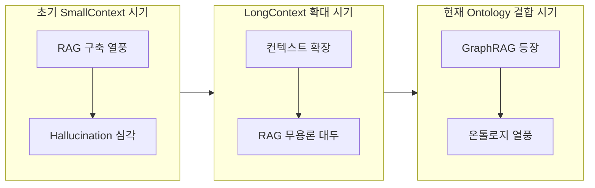
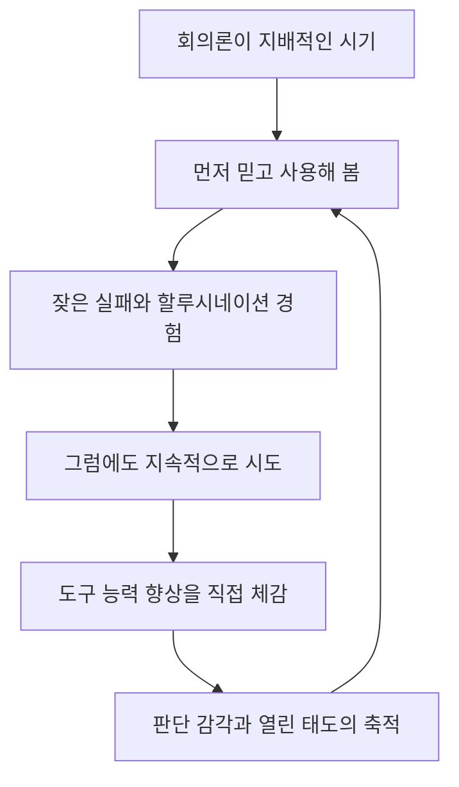

> https://www.threads.com/@hongso0921/post/Dce7Tx3kyBX
> 
> AI를 깊게 먼저 사용해왔던 주변사람들에게 느껴지는 조용한 불안:
> 1. 기술 자체는 이제 너무 쉬워져서 큰 해자가 아니겠다
> 2. 나는 이 기술이 앞서 있을 때 나에게 자산이 될 무언가를 이루지 못했고 이제는 이 해자가 의미없게 되었다.
> 
> 여기에 대한 생각
> 1. AI 도구 잘사용 자체는 해자 아니겠고 앞으로 더 아닐 것임 - 심지어 Agent까지도 큰 의미 아님 - "결과"를 더 낫게 믿을 수 있게 내는지 싸움인데 이건 이제 기술의 영역보다 원래 일머리와 센스 역량의 영역이 되었음. - 다만 AI의 특성을 알고 이해하는 건 여전히 중요함
> 2. 컨텍스트윈도우 작을 때 RAG 없으면 뭐가 안되었고 사람들 이 기술 엄청 팠었음. 할루시네이션도 심각했고. 지금은 온톨로지 이야기 하지만 잘 모르겠음. 나름 팠었는데, 회의적
> 
> 그러니 지금 AI 한계를 내가 풀지 말고 더 크게 파격적으로 봐도 될듯
> 
> 다만,
> 1. 회의적 시선이 팽배할 때 AI를 먼저 적극적으로 써본 "태도"는 어디 안감. AI가 그 할루시네이션 덩어리에 뭐 완수해내는게 없을 정도로 무능했을 때도 믿고 긍정적으로 써본 건 기본적으로 열린 태도와 역량이라는거. 그게 제일 중요할지도. 안됩니다 하는 사람이 뭐 되는 걸 본적이 없음
> 2. 키맨과의 미팅에선 어젠다를 안가져감. 이런저런 얘기 끝에, 사안과 무관한 인사이트를 툭 던질 때가 있는데 그게 다음 사업의 아이디어가 되거나 돌파구가 되기도 함. 인공지능을 사용한 경험이 활용되는 건 의외로 이렇게 꼭지 하나만 남을 수도 있을 것임. 노력이나 시간에 정비례해서 가치를 회수하는 건 사실 애초에 어느정도 허상임.
> 
> 인사이트가 날카롭고 산전수전 겪은 선배가 올해 초쯤 짚었던 포인트:
> - 지금은 사람들이 AI 쓴다고 하면 믿을 수 없고 저품질이고 하면서 거부감이 있지만, 1-2년 내로 AI 안쓴다고 하면 아무도 안 사줄 세상이 곧 올 것
> - 그 때를 대비해서 내부 역량은 최첨단으로 (시행착오 비용 다 괜찮음), 외부와의 소통은 시류에 맞춰서, 한방에 갈 리스크는 지지 않으면서.
> 
> 뭐 다 맞는 말인데 이런 큰 줄기 말 말고 그럼 오늘 하루 daily life에서, 어떤 사안에 어떤 결론을 내리는지의 누적이 방향일 듯. 그냥 내 나름의 나에 대한 프롬프팅임 - 써 놓으면 중력장이 기울어져, 비슷한 상황이나 새로운 상황에서 선택하고 몸과 마음이 움직이는 방향이 그리로 가게 됨. 하지만 절대 실용성과 테스트를 놓지 말고, 툴은 멀리해도 신모델은 계속 바꿔끼면서 6개월-1년 뒤, 2년 뒤를 봐야. 이 게임은 예측이 너무 어려움 - 기술 하나의 문제가 아니라 여러 개의 근본적 변화가 같이 오게 되므로. 욕망까지도 뒤흔들고 있어서 
> 

## 목차

1. 들어가며 — 이 글은 무엇에 관한 것인가
2. 조용한 불안의 두 축
3. 첫 번째 성찰 — "AI를 잘 쓴다"는 것은 애초에 해자가 아니었다
4. 두 번째 성찰 — RAG에서 온톨로지까지, 반복되는 유행과 회의론
5. 그래도 남는 것 (1) — 태도라는 복리 자산
6. 그래도 남는 것 (2) — 의제 없는 대화와 비선형적 가치 회수
7. 선배의 예측 검증 — "AI를 안 쓴다고 하면 안 사줄 세상"은 정말 오는가
8. 결론이 아니라 방향 — 하루의 축적, 자기 프롬프팅, 그리고 예측 불가능성 앞에서
9. 정리 — 이 글이 확인해 주는 것과 확인해 주지 않는 것
출처 및 근거 투명성
참고자료

---

## 1. 들어가며 — 이 글은 무엇에 관한 것인가

공유해 주신 스레드 게시물은 하나의 질문에서 출발한다. AI를 남들보다 먼저, 그것도 아주 깊게 파고들었던 사람들 사이에서 요즘 조용히 번지고 있는 불안감에 관한 이야기다. 이 불안은 겉으로는 잘 드러나지 않는다. 오히려 AI를 오래 다뤄온 사람일수록 주변에서는 "AI 전문가", "얼리어답터"로 대접받기 때문에 불안을 말하기가 더 어렵다. 하지만 정작 본인들끼리 모이면 비슷한 말이 나온다는 것이 글쓴이의 관찰이다.

이 문서는 그 게시물이 담고 있는 문제의식과 그에 대한 글쓴이 자신의 반박 및 성찰을 하나씩 풀어서 설명하고, 각 주장이 2026년 8월 현재 시점의 실제 AI 산업 동향과 얼마나 부합하는지를 웹 검색을 통해 교차 검증한 뒤, 검증된 사실과 개인적 견해를 구분해서 정리한 해설서다. 원문은 짧고 압축적인 문장으로 쓰여 있어서, 그 안에 담긴 논리 구조와 함의를 풀어내지 않으면 요점이 스쳐 지나가기 쉽다. 아래에서는 원문의 흐름을 따라가되, 각 대목마다 왜 그런 주장이 나왔는지, 그리고 그 주장을 뒷받침하거나 반박할 수 있는 최신 자료는 무엇인지를 함께 짚는다.

## 2. 조용한 불안의 두 축

글쓴이가 관찰한 불안은 두 개의 축으로 쪼갤 수 있다.

첫 번째 축은 "기술 자체가 이제 너무 쉬워져서 더 이상 큰 해자가 아니다"라는 인식이다. 해자(垓字)는 원래 성을 둘러싼 방어용 수로를 뜻하지만, 경영·전략 담론에서는 경쟁자가 쉽게 넘어올 수 없는 구조적 우위를 가리키는 말로 쓰인다. AI를 몇 년 앞서 깊게 다뤄본 사람들은 한때 이 어려운 도구를 능숙하게 다룬다는 사실 자체가 하나의 해자라고 느꼈을 것이다. 그런데 지금은 프롬프트 작성법, 도구 사용법, 에이전트 설정법 같은 것들이 유튜브 몇 편, 블로그 글 몇 편으로도 습득 가능한 상식이 되어가고 있다. 어렵게 축적한 숙련이 순식간에 대중화되는 것을 지켜보는 심정은 복잡할 수밖에 없다.

두 번째 축은 더 아프다. "기술이 앞서 있던 그 시기에, 정작 나에게 남을 자산을 만들지 못했다"는 후회다. 이것은 단순히 기술이 평준화되었다는 관찰이 아니라, 그 기간 동안의 개인적 선택에 대한 회고다. 시간을 앞서 투자했는데 그 시간이 축적으로 이어지지 않았다면, 기술의 평준화는 이중의 상실로 다가온다. 남들보다 앞서 있었다는 우위도, 그 우위를 발판 삼아 만들어 놓았어야 할 자산도 둘 다 손에 없다고 느끼는 것이다.

이 두 축은 서로를 강화한다. 기술 격차가 사라지는 속도가 빠를수록, 그 격차가 사라지기 전에 무언가를 남겼어야 한다는 압박도 함께 커진다. 글쓴이는 이 불안을 부정하지 않는다. 다만 이 불안이 근거하고 있는 전제, 즉 "AI 도구를 잘 다루는 능력 자체가 해자였다"는 전제를 다시 검토해 보자고 제안한다.

## 3. 첫 번째 성찰 — "AI를 잘 쓴다"는 것은 애초에 해자가 아니었다

글쓴이의 첫 번째 성찰은 도발적이다. AI 도구를 잘 사용하는 능력, 심지어 에이전트를 능숙하게 다루는 능력조차도 큰 의미가 없어질 것이라는 주장이다. 이유는 명확하다. 승부는 결국 "결과를 더 낫게, 더 믿을 수 있게 낼 수 있는가"의 싸움이고, 이 싸움은 이제 기술 숙련의 영역이 아니라 원래부터 일머리와 센스라고 불리던 역량의 영역으로 되돌아가고 있다는 것이다. 다만 AI라는 도구의 특성 — 무엇을 잘하고 무엇에서 자주 틀리는지 — 을 이해하는 일 자체는 여전히 중요하다는 단서를 달아둔다.

이 주장은 실제로 2026년 현재 AI 산업 담론에서 여러 갈래로 확인된다. 코딩 에이전트 도구들을 비교한 한 최신 분석글은 이 흐름을 한 문장으로 압축한다. 모델은 점점 상품(commodity)이 되어가고 있고, 그 모델을 어떻게 감싸서 실제 워크플로로 만드느냐를 뜻하는 "하니스(harness)"가 새로운 해자가 되어가고 있다는 것이다[5]. 이는 이 커뮤니티에서 이미 "Agent = Model + Harness"라는 원칙으로 공유되어 온 관점과도 정확히 맞닿아 있다. 모델 자체의 능력 차이는 좁혀지고 있지만, 그 모델을 어떤 실행 환경과 검증 체계 속에 배치하느냐에 따라 결과물의 신뢰도는 여전히 크게 갈린다.

같은 흐름은 벤치마크 수치에서도 뚜렷하다. 스탠퍼드 AI 인덱스 2026 보고서에 따르면 소프트웨어 공학 벤치마크인 SWE-bench Verified에서 AI의 최고 점수는 2024년 약 60%에서 2025년에는 거의 100%에 도달했다[13][15][28]. 실제 컴퓨터 환경에서 자율적으로 작업을 수행하는 능력을 측정하는 OSWorld 벤치마크에서는 성공률이 12%에서 약 66%로, 터미널 환경 작업 성공률을 측정하는 Terminal-Bench에서는 2025년 20%에서 2026년 77.3%로, 사이버보안 문제 해결 에이전트의 성공률은 2024년 15%에서 2026년 93%로 각각 뛰어올랐다[28]. 불과 1~2년 사이에 AI가 처음부터 끝까지 스스로 해낼 수 있는 작업의 범위가 급격히 넓어진 것이다. 아래 도표는 이 네 가지 벤치마크에서 나타난 변화 폭을 보여준다.

```mermaid
xychart-beta
    title "에이전트 벤치마크 성공률 변화 (%)"
    x-axis ["SWE-bench", "OSWorld", "Terminal-Bench", "CyberSecurity"]
    y-axis "성공률(%)" 0 --> 100
    bar [60, 12, 20, 15]
    bar [98, 66, 77, 93]
```

이 도표에서 앞의 막대는 2024~2025년 초반 수치, 뒤의 막대는 2025~2026년 수치를 나타낸다. 이런 속도로 도구 자체의 성능이 균질화되면, "이 도구를 남들보다 잘 다룬다"는 사실만으로 버틸 수 있는 기간은 구조적으로 짧아질 수밖에 없다.

흥미로운 것은 채용 시장과 기업 교육 현장에서 실제로 감지되는 변화다. 한 최근 보도는 이제 기업이 원하는 인재상이 "AI를 잘 쓰는 사람"에서 "AI를 검증하는 사람"으로 옮겨가고 있다고 전한다[38]. AI가 만들어낸 결과물의 사실 여부를 확인하는 능력, 여러 출처를 비교·분석하는 정보 판별력, 오류를 맥락에 맞게 고쳐내는 편집 능력, 그리고 AI와 협업하면서도 최종 책임을 질 수 있는 판단력이 새로운 평가 기준으로 떠오르고 있다는 것이다[38]. 워싱턴대의 한 교수는 이를 더 근본적으로 표현한다. AI가 스스로 판단하고 행동하는 시대의 핵심 경쟁력은 더 높은 성능이 아니라, "왜 그렇게 판단했는지"를 검증할 수 있는 능력이라는 것이다[33]. 정확도가 높다는 사실만으로 그 판단을 신뢰할 수는 없다는 그의 지적은, 글쓴이가 말한 "결과를 더 낫게, 더 믿을 수 있게 낼 수 있는가의 싸움"과 정확히 같은 지점을 가리킨다.

정리하면, 원문의 첫 번째 성찰은 근거가 탄탄하다. 모델과 도구의 숙련도는 빠르게 상품화되고 있고, 남는 차별화 지점은 결과물을 판단하고 검증하고 신뢰할 수 있게 다듬어내는 역량, 즉 기술 이전부터 존재했던 일머리와 센스의 영역이라는 관찰은 여러 독립적인 자료에서 반복적으로 확인된다. 다만 그 흐름 안에서도 "하니스", 즉 도구를 감싸는 워크플로 설계 능력은 완전히 사라진 해자라기보다는 판단력·검증 능력과 결합된 형태로 남아 있다는 점은 짚어둘 필요가 있다.

## 4. 두 번째 성찰 — RAG에서 온톨로지까지, 반복되는 유행과 회의론

두 번째 성찰은 조금 더 개인적인 경험담에서 출발한다. 컨텍스트 윈도우가 작았던 시절, RAG(검색 증강 생성) 없이는 많은 것이 제대로 작동하지 않았다. 할루시네이션도 지금보다 훨씬 심각했다. 그때 많은 사람들이 이 RAG 기술을 깊게 파고들었다. 그런데 지금은 온톨로지(ontology)라는 새로운 화두가 등장했고, 글쓴이는 이에 대해 회의적인 시선을 감추지 않는다. 나름 RAG를 깊게 파봤던 경험에 비추어 보면, 지금의 온톨로지 붐도 비슷한 패턴의 반복이 아닐까 하는 의구심이다.

이 관찰 역시 최신 자료로 상당 부분 뒷받침된다. 2026년 5월에 작성된 한 분석글은 데이터·AI 업계에서 "RAG는 죽고 온톨로지와 GraphRAG가 답이다"라는 말이 소셜미디어에서 자주 보인다고 지적하면서도, 실제 자료를 따라가 보면 RAG가 죽는 것이 아니라 온톨로지·지식그래프와 보완되는 쪽에 가깝다고 결론짓는다[7]. 즉 "이전 기술은 끝났고 새 기술이 이를 완전히 대체한다"는 식의 과장된 프레이밍이 이번에도 반복되고 있으며, 실상은 보완 관계에 가깝다는 것이다. 이는 글쓴이의 회의론과 상당히 일치하는 지점이다. 다만 온톨로지·지식그래프 자체가 무의미하다는 뜻은 아니다. 제조업 현장에 지식그래프를 도입한 한 사례 분석에 따르면, 표준작업절차와 기술표준 문서를 지식그래프로 통합한 프로젝트에서 현장 질의응답 정확도가 90.2%에 달했고, 생산 스케줄링 작업 시간이 1시간에서 5분 수준으로 줄어드는 성과가 보고되기도 했다[12]. 다시 말해 온톨로지·GraphRAG는 특정 도메인, 특정 데이터 구조를 가진 환경에서는 실질적인 효용이 확인되고 있지만, 그것이 "RAG는 이제 필요 없다"는 식의 전면적 세대교체 서사로 소비되는 것은 별개의 문제라는 것이다.

이 패턴을 시간순으로 정리하면 아래와 같은 흐름이 보인다. 컨텍스트 윈도우가 작고 할루시네이션이 심했던 시기에는 RAG 구축이 필수 기술처럼 여겨졌고, 컨텍스트 윈도우가 커지면서 문서 전체를 통째로 넣는 방식(CAG)이 가능해지자 RAG 무용론이 번졌으며, 지금은 GraphRAG와 온톨로지 결합이 새로운 화두로 떠오르고 있다.

이 흐름에서 확인할 수 있는 것은, "이전 기술은 끝났다, 새 기술이 정답이다"라는 식의 단절적 서사가 매 국면마다 반복되어 왔다는 사실이다. 실제로는 완전한 대체보다 누적적 보완에 가까운 경우가 많았다. 글쓴이가 "나름 팠었는데 회의적"이라고 말한 태도는, 기술적 실체보다 마케팅적 프레이밍이 앞서 나가는 이 업계의 오래된 패턴을 이미 한 번 몸으로 겪어본 사람의 반응으로 읽을 수 있다.

이 성찰이 이끄는 결론은 "지금 AI의 한계를 내가 직접 풀려고 애쓰지 말고, 더 크게 파격적으로 보아도 될 것 같다"는 태도다. 이는 개별 기술 유행을 좇아 매번 깊이 파고드는 대신, 한 걸음 물러서서 전체 판의 구조 변화를 보는 쪽으로 에너지를 재배치하자는 제안으로 읽힌다. 이 부분은 검증 가능한 사실이라기보다 글쓴이 개인의 전략적 판단이므로, 뒤에 나오는 출처 투명성 표에서 "개인적 해석" 항목으로 분류해 두었다.

## 5. 그래도 남는 것 (1) — 태도라는 복리 자산

두 성찰을 통해 "도구 숙련"과 "특정 기술 심화"라는 두 개의 기둥이 흔들린다면, 무엇이 남는가. 글쓴이는 여기서 방향을 튼다. 회의적 시선이 지배적이던 시기에 AI를 먼저 적극적으로 써본 "태도"는 사라지지 않는다는 것이다. AI가 할루시네이션 덩어리로 취급받으며 제대로 된 일을 완수해내지 못할 정도로 무능했던 시절에도, 그것을 믿고 긍정적으로 사용해 본 경험은 근본적으로 열린 태도와 역량의 발현이며, 어쩌면 그것이 가장 중요한 자산일지 모른다는 것이다. 글쓴이는 이를 뒷받침하는 관찰로 "안 됩니다 하는 사람이 뭐가 되는 걸 본 적이 없다"는 경험칙을 덧붙인다.

이 주장은 정량적으로 검증하기는 어려운 성격의 것이다. 다만 정황을 보여주는 자료는 존재한다. 앞서 3장에서 인용한 벤치마크 추이, 즉 사이버보안 에이전트의 성공률이 2024년 15%에서 2026년 93%로 뛰어오른 사례[28]는 이 논리를 구체적으로 보여준다. 2024년 시점에 이 기술을 사용해 본 사람이라면 열 번 중 여덟 번 이상 실패하는 도구를 마주했을 것이다. 그럼에도 그 시점에 도구를 놓지 않고 계속 사용하며 능력의 변화 곡선을 직접 관찰해 온 사람과, "아직 부족하다"는 이유로 손을 뗀 사람 사이에는, 지금 시점에서 도구의 한계와 가능성을 판단하는 감각의 차이가 누적되어 있을 가능성이 높다. 이는 실증 데이터라기보다 벤치마크 추이가 뒷받침하는 정황적 추론이라는 점을 분명히 해 둔다.

한국인의 AI 사용 태도를 조사한 한 리포트도 비슷한 결을 보여준다. AI를 실제로 사용해 본 사람과 그렇지 않은 사람 사이의 정서적 거리는 세대와 무관하게 크게 벌어진다는 것이다. 이 조사에 따르면 AI 사용률이 가장 낮은 60대조차, 실제로 AI를 써 본 사람의 81%가 AI를 친구나 조언자처럼 느낀 적이 있다고 답했고, 이는 오히려 20대(60%)보다 높은 수치였다[26]. 반대로 AI를 쓰지 않는 이유로 가장 많이 꼽힌 것은 거부감이 아니라 "필요성을 못 느껴서"(53.5%), 그리고 시작 방법을 모르거나 어려워 보인다는 정보·동기 부족이었다[26]. 즉 태도의 격차는 나이나 배경이 아니라 "일단 해봤는가, 안 해봤는가"에서 갈린다는 것이 이 조사가 시사하는 바다. 글쓴이가 강조한 "먼저 믿고 써본 태도"의 가치는 이런 자료들과 방향이 일치한다.

이 논리를 하나의 순환 구조로 표현하면 다음과 같다.

이 순환은 한 번 돌고 끝나는 것이 아니라, 새로운 기술이 등장할 때마다 반복되는 루프로 이해할 수 있다. 중요한 것은 이 루프 자체가 하나의 습관이자 자산으로 몸에 붙는다는 점이다. 특정 시점의 특정 기술 지식은 상품화되어 사라지지만, "낯설고 불완전한 것을 먼저 써보고 판단하는 능력"은 다음 기술이 등장할 때마다 다시 값을 발휘한다. 이 부분이 글쓴이가 말한 "그게 제일 중요할지도 모른다"는 문장의 실질적 의미로 읽힌다.

## 6. 그래도 남는 것 (2) — 의제 없는 대화와 비선형적 가치 회수

두 번째로 남는 것은 조금 더 미묘하다. 글쓴이는 키맨과의 미팅에서 의도적으로 어젠다를 가져가지 않는다고 말한다. 이런저런 이야기를 나누다 보면 사안과 무관해 보이는 인사이트를 툭 던지게 되는 순간이 있고, 그것이 오히려 다음 사업의 아이디어나 돌파구가 되는 경우가 있다는 것이다. AI를 오래 사용해 온 경험이 실제로 힘을 발휘하는 방식도 이와 비슷하게, 거창한 결과물 전체가 아니라 대화 중 남는 한 개의 꼭지로 나타날 수 있다는 관찰이다. 여기서 글쓴이는 더 일반적인 원칙 하나를 덧붙인다. 노력이나 시간을 들인 만큼 정비례해서 가치를 돌려받는다는 믿음은 애초에 어느 정도 허상이라는 것이다.

이 대목은 검증 가능한 통계나 벤치마크의 영역이 아니라, 경험에서 우러난 업무관과 전략적 태도에 관한 서술이다. 따라서 이 부분은 사실 검증의 대상이 아니라 글쓴이의 개인적 신념으로 다루는 것이 정확하다. 다만 이 관찰이 현재 AI 담론에서 강조되는 다른 개념과 접점을 가진다는 점은 짚어볼 만하다. 예컨대 판단력과 창의성이 AI 시대의 핵심 생산성 요인으로 부상하고 있다는 최근 분석은, 단순 구현 능력의 가치가 줄어드는 대신 정형화되지 않은 통찰과 연결짓기 능력의 가치가 상대적으로 커지고 있다고 설명한다[36]. 오마이뉴스에 실린 한 교육 담론 역시 "무엇을 아느냐"가 아니라 "어떻게 판단하느냐"가 핵심이 되는 시대라고 짚으면서, 이런 판단력은 단순한 문제 풀이가 아니라 질문하고 토론하고 실패를 경험하고 다시 성찰하는 과정에서 길러진다고 말한다[34]. 어젠다 없는 대화에서 나오는 통찰이라는 것도, 결국 정형화된 절차 바깥에서 발생하는 비선형적 사고의 한 형태로 볼 수 있다.

## 7. 선배의 예측 검증 — "AI를 안 쓴다고 하면 안 사줄 세상"은 정말 오는가

원문에는 산전수전을 겪은 한 선배가 올해 초 짚었다는 예측이 인용되어 있다. 지금은 사람들이 AI를 썼다고 하면 신뢰할 수 없다, 저품질이다 하는 거부감을 보이지만, 1~2년 안에는 반대로 AI를 안 쓴다고 하면 아무도 사주지 않는 세상이 올 것이라는 예측이다. 이에 대비해 내부 역량은 최첨단으로 끌어올려 시행착오 비용을 감수하고, 외부와의 소통은 시류에 맞추되, 한 번에 모든 것을 걸어버리는 리스크는 지지 말자는 원칙이 함께 제시된다.

이 예측을 검증하기 위해 현재 시점의 자료를 양쪽에서 살펴볼 필요가 있다. 먼저 예측을 지지하는 쪽의 데이터다. 스탠퍼드 AI 인덱스 2026에 따르면 조직의 AI 도입률은 2022년 50%대에서 2026년 88%로 크게 늘어났다[13]. AI 에이전트 도입이 국내 기업 현장에도 본격적으로 확산되는 원년이 2026년이라는 평가도 여러 산업 분석에서 반복적으로 나타난다[1][29][31]. 이런 흐름만 보면 "AI를 쓰지 않으면 도태된다"는 선배의 예측은 상당히 설득력 있어 보인다.

그러나 동시에 이 예측을 단순화해서는 안 된다는 것을 보여주는 자료도 존재한다. 최근 국내 콜센터 업계 사례를 다룬 보도는 AI 도입이 많은 기업일수록 오히려 소비자 이미지 평가가 낮게 나타났다고 전한다[23]. AI로 상담을 자동화할수록 상담사의 업무 강도는 높아지고 소비자 만족도는 낮아졌으며, 상담사의 60.8%가 노동조건 악화를 체감했다는 조사 결과도 함께 보도되었다[23]. 쇼핑 추천 영역에서도 비슷한 신뢰 문제가 확인된다. 광고가 섞인 AI 쇼핑 추천에 소비자의 75%가 거부감을 느낀다는 조사 결과가 있고[25], Adobe의 2026년 디지털 트렌드 보고서 역시 개인 AI 에이전트가 최종 구매 결정이나 개인정보 제공 같은 민감한 영역까지 대신하는 데 동의하는 소비자 비율은 여전히 낮다고 지적한다[24].

이 두 갈래 자료를 종합하면, 선배의 예측은 방향성 면에서는 상당히 타당하지만 무조건적인 단선적 예언으로 받아들이기는 어렵다는 것이 정직한 결론이다. AI를 "쓰고 있다"는 사실 자체는 빠르게 표준이 되어가고 있지만, 동시에 AI를 "티 나게, 서투르게, 신뢰를 깎아먹는 방식으로" 쓰는 것에 대한 소비자의 거부감도 함께 커지고 있다. 즉 다가오는 것은 "AI를 안 쓰면 안 팔리는 세상"이라기보다 "AI를 쓰되 그 활용의 품질과 신뢰도가 노출되는 세상"에 더 가까울 가능성이 있다. 이는 선배의 예측이 틀렸다는 뜻이 아니라, 예측의 방향은 맞되 그 실현 형태가 조건부라는 뜻이다. 이런 이유에서 원문에 담긴 "내부 역량은 최첨단으로, 외부와의 소통은 시류에 맞춰서, 한 방에 갈 리스크는 지지 않는다"는 원칙이 오히려 더 정교하게 들어맞는다. 내부적으로는 실패 비용을 감수하며 실력을 축적하되, 외부에 노출되는 방식은 신중하게 조율해야 한다는 논리가 앞의 상반된 데이터를 모두 설명해 주기 때문이다.

## 8. 결론이 아니라 방향 — 하루의 축적, 자기 프롬프팅, 그리고 예측 불가능성 앞에서

글쓴이는 마지막에 스스로 제동을 건다. 앞서 나열한 큰 흐름들은 다 맞는 말이지만, 정작 중요한 것은 그런 거대 담론이 아니라 오늘 하루 어떤 사안 앞에서 어떤 결론을 내리는지가 쌓여가는 방향이라는 것이다. 글쓴이는 이 글 자체를 "나름의 나에 대한 프롬프팅"이라고 규정한다. 무언가를 글로 써 놓으면 마음의 중력장이 그쪽으로 기울고, 비슷한 상황이나 새로운 상황에서 몸과 마음이 자연스럽게 그 방향으로 움직이게 된다는 것이다. 이는 목표 설정이나 다짐을 글로 남기는 행위가 실제 행동 방향에 영향을 준다는, 자기 규율에 관한 오래된 통찰과 맞닿아 있다.

다만 글쓴이는 이 태도가 실용성과 검증을 놓아버리는 것과는 다르다는 점을 분명히 한다. 특정 도구에 대한 애착은 내려놓더라도 신모델은 계속 갈아 끼우면서 6개월, 1년, 2년 뒤를 계속 내다봐야 한다는 것이다. 그리고 이 게임이 유독 예측하기 어려운 이유를 정확히 짚는다. 이것이 기술 하나의 문제가 아니라 여러 개의 근본적 변화가 동시에 밀려오는 상황이기 때문이며, 심지어 그 변화가 사람들의 욕망의 형태 자체까지 흔들고 있기 때문이라는 것이다.

이 마지막 문단은 검증의 대상이라기보다 하나의 실천적 태도 선언에 가깝다. 다만 이 문서 전체에서 확인한 자료들을 종합하면, 이 태도가 근거 없는 낙관이 아니라는 점은 뒷받침된다. 모델 자체의 격차가 좁혀지고 도구가 상품화되는 흐름[5][13][15], RAG에서 온톨로지로 이어지는 유행이 완전한 대체가 아니라 보완으로 귀결되어 온 패턴[7][12], 판단력과 검증 능력이 새로운 차별화 지점으로 떠오르는 채용·교육 담론[33][34][36][38], 그리고 AI 도입이 빠르게 표준화되는 동시에 신뢰 문제로 인한 반작용도 함께 커지는 이중적 현실[23][24][25][26] — 이 모든 흐름은 하나의 정답으로 수렴하지 않는다. 오히려 여러 방향의 변화가 동시에, 서로 다른 속도로 진행되고 있다는 사실 자체가 글쓴이가 마지막에 말한 "예측이 너무 어려운 게임"이라는 진단을 뒷받침한다.

## 9. 정리 — 이 글이 확인해 주는 것과 확인해 주지 않는 것

이 문서는 원문이 제기한 문제의식과 성찰을 하나씩 최신 자료와 대조해 보았다. 결론적으로, 도구 숙련도가 빠르게 상품화되고 있다는 관찰, RAG와 온톨로지를 둘러싼 유행이 완전한 세대교체보다는 반복적 보완에 가깝다는 관찰, 그리고 판단력과 검증 능력이 새로운 차별화 지점으로 떠오르고 있다는 관찰은 모두 2026년 현재 시점의 여러 독립적인 자료로 뒷받침된다. 반면 "먼저 믿고 써본 태도가 가장 중요한 자산"이라는 주장이나 "노력과 성과는 정비례하지 않는다"는 원칙, "어젠다 없는 대화에서 통찰이 나온다"는 경험칙은 검증 가능한 통계의 영역이 아니라 개인의 경험과 신념에 속하는 부분이며, 이 문서는 이를 사실인 것처럼 포장하지 않고 정황 자료로 방향성만 보조적으로 제시했다. "AI 안 쓰면 안 팔리는 세상이 온다"는 선배의 예측은 방향은 타당하지만, 실현 형태는 단순한 필수재화가 아니라 활용의 품질과 신뢰가 함께 요구되는 조건부 형태에 가깝다는 것이 현재까지의 자료가 보여주는 가장 정직한 그림이다.

---

## 출처 및 근거 투명성

아래 표는 이 문서에서 다룬 주요 주장을 세 가지 범주로 나누어 정리한 것이다.

| 구분 | 주장 | 근거 성격 |
|---|---|---|
| 검증된 사실 | 코딩·에이전트 벤치마크 성공률이 2024~2026년 사이 급격히 상승했다 | 스탠퍼드 AI 인덱스 2026 등 복수 보도 확인[13][15][28] |
| 검증된 사실 | "RAG가 죽고 온톨로지가 답이다"는 서사는 과장이며 실제로는 보완 관계에 가깝다 | 업계 분석글 및 실제 도입 사례로 확인[7][12] |
| 검증된 사실 | 기업이 요구하는 역량이 "AI 활용력"에서 "AI 검증력·판단력"으로 이동하고 있다 | 채용·교육 관련 복수 보도로 확인[33][34][36][38] |
| 검증된 사실 | AI 도입률은 늘고 있지만 신뢰·품질에 대한 소비자 반작용도 동시에 커지고 있다 | 소비자 조사 및 산업 보도로 확인[23][24][25][26] |
| 단일 출처 참고 | "모델은 상품화, 하니스가 새 해자"라는 표현 | 단일 블로그 분석 표현으로, 업계 전반의 합의라기보다 하나의 관점으로 인용[5] |
| 개인적 해석 | "먼저 믿고 써본 태도가 가장 중요한 자산일 수 있다" | 원문 글쓴이의 경험적 신념. 정황 자료(벤치마크 추이, 사용 태도 조사)로 방향성만 보조 제시 |
| 개인적 해석 | "노력과 시간에 정비례해 가치를 회수하는 것은 허상이다" / "어젠다 없는 대화에서 통찰이 나온다" | 원문 글쓴이의 경험칙이자 업무관. 검증 대상이 아님 |
| 개인적 해석 | "지금 AI 한계를 직접 풀지 말고 더 크게 봐도 된다"는 전략적 태도 | 원문 글쓴이의 개인적 판단 |

---

## 참고자료

[1] 이젠아카데미, "AI 에이전트 서비스란 무엇인가? 2026년 트렌드와 전망 완전 정리", blog.ezenac.co.kr, 2026.06.22

[5] Chaos and Order, "2026 AI 코딩 에이전트 정면 비교 — Claude Code·Cursor·GitHub Copilot·OpenAI Codex·Aider·OpenClaw 실전 바이어 가이드", youngju.dev, 2026.05.14

[7] Brunch(@uxn00b), "온톨로지, 지식 그래프, 그리고 GraphRAG", brunch.co.kr, 2026.05.29

[12] 퓨처워크랩, "온톨로지·지식그래프란? 제조 데이터를 잇는 층과 Triple-RAG 원리", futureworklab.co.kr, 2026.07.22

[13] Brunch(@silverag), "2026 AI Index Report 1부", brunch.co.kr, 2026.04.20

[15] 테크42, "스탠퍼드 2026 AI 인덱스 'AI, 사회보다 빠르게 질주'…벤치마크·일자리·규제 모두 뒤처져", tech42.co.kr, 2026.04.13

[23] 다음뉴스, "'사람 좀 바꿔주세요'…AI 상담 확대의 역설, 비용도 불만도 늘었다", v.daum.net, 2026.06.19

[24] Adobe, "2026년 AI 및 디지털 트렌드: 고객 행동과 AI", business.adobe.com, 2026.03.19

[25] 모비인사이드, "AI가 추천한 상품, 소비자 4명 중 3명은 믿지 않는다", mobiinside.co.kr, 2026.04.15

[26] AI매터스, "'AI 이미 포화됐다고?' 전 세계 84%는 AI를 한 번도 써본 적 없다", aimatters.co.kr, 2026.02.24

[28] AI매터스, "스탠퍼드 AI 인덱스 2026 (1) AI는 1년 만에 코딩 시험을 만점 받았지만 아날로그 시계는 못 읽는다", aimatters.co.kr, 2026.04.14

[29] SK AX, "2026 에이전트 AI 트렌드: 생성형 AI 이후, 에이전틱 AI가 기업 업무를 바꾸는 방식", skax.co.kr, 2026.01.16

[31] 경제인사이드, "'이제는 에이전트'… 2026년 'AI 대전환' 가속화", newscj.com, 2026.06.17

[33] MIT 테크놀로지 리뷰 코리아, "AI가 발견하고 인간이 증명하는 시대", technologyreview.kr, 2026.07.13

[34] 오마이뉴스, "AI 시대, 우리는 무엇을 가르쳐야 하는가?", ohmynews.com, 2026.03.26

[36] 클로브 블로그, "AI시대, 이제 생산성은 '판단력과 창의성'에 달려있다", clobe.ai, 2026.03.27

[38] 커리어온뉴스, "AI 잘 쓰는 사람보다 'AI를 검증하는 사람'이 경쟁력… 기업이 원하는 역량이 바뀌고 있다", careeronnews.kr, 2026년 8월(약 3주 전)

*원문 출처: 스레드 게시물(https://www.threads.com/share/_yGOaU2uI/) — 해당 플랫폼은 자동 접근을 허용하지 않아 직접 인용은 사용자가 제공한 텍스트를 기반으로 하였음.*
