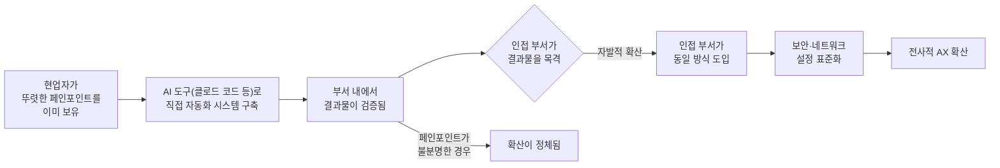
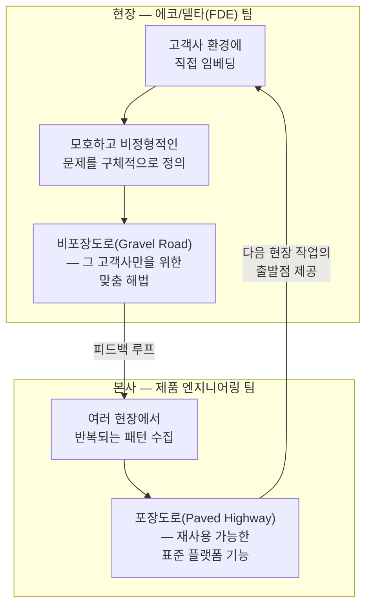
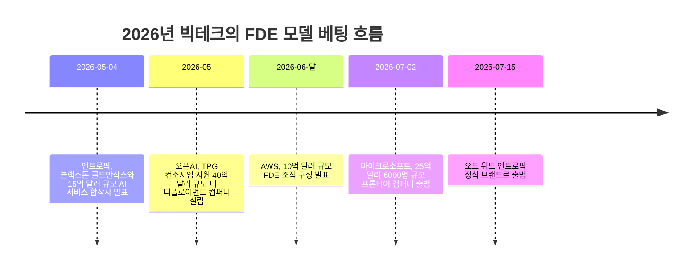

- **원문 출처:** https://www.threads.com/share/BAQbR2qbuX/
- **작성일:** 2026년 8월 26일
- **문서 성격:** 원문(스레드 게시글 및 답글) 해설 + 관련 최신 사실관계 교차검증 자료

> 
> https://www.threads.com/share/BAQbR2qbuX/
> 
> 요즘 한 기업의 전사적인 AX를 진행하고 있는데, 나갈 때마다 정말 놀라운 결과물들이 많이 나오는 것 같습니다.
> 
> MES부터 KPI 분석, ERD 시스템도 봐드리고 직무별 자동화 시스템 구축까지 함께 보고 있는데, 역시 현업에서 일하는 분들이 직접 회사 시스템에 맞춰 구축하다 보니 결과물이 정말 잘 나오더라구요.
> 
> 오히려 대기업보다 중소기업이 규모가 작고 대응이 빠르다 보니, 보안과 네트워킹 세팅만 잘 잡아드리면 사내에서 빠르게 확산되는 것 같습니다.
> 
> 결국 같은 회사 안에서 AI를 정말 잘 쓰는 한 사람, 한 부서가 생기면 그게 다른 부서로 퍼지면서 전사적인 확산을 만들어내는 것 같습니다.
> 
> FDE도 이런 식으로 부서 to 부서로 확장되는 방식이 훨씬 효율적이고 확산 속도도 빠른 것 같아서, 저도 이 과정에서 많은 데이터를 쌓고 있는 것 같네요.
> 
> **re:** 저도 새로운 회사에서 전사적인 AX를 진행하고 있는데, 확실히 기존에 명확한 페인포인트를 가지고 있던 분들이 결과물을 가장 빠르게 만들어내는 것 같더라고요.
> 
> 이제는 비개발자분들도 클로드 코드를 터미널 5~6개씩 띄워놓고 동시에 작업하시는데, 볼 때마다 신기하면서도 변화 속도가 정말 빠르다는 걸 체감합니다.
> 
> 가끔은 “이러다 내 자리도 위협받는 거 아닌가?” 싶어서
> 저는 반대로 현업의 도메인 지식을 더 열심히 흡수하고 있습니다.
> 

---

## 일러두기 — 이 문서를 어떻게 만들었는지

먼저 이 문서의 리서치 방식을 투명하게 밝혀 둡니다. 제시해주신 스레드(Threads) 링크는 로봇 접근을 차단하고 있어 페이지를 직접 불러오지 못했습니다. 대신 대화창에 직접 붙여넣어 주신 원문 게시글과 답글 텍스트를 1차 자료로 삼았고, 그 안에 등장하는 핵심 개념들 — AX(AI 전환), FDE(Forward Deployed Engineer), 클로드 코드 멀티세션 활용, 중소기업의 AI 확산 속도, AI 기본법에 따른 거버넌스 필요성 등 — 을 각각 별도로 웹 검색해 사실관계를 교차확인했습니다.

즉 원문 게시글의 "내용"은 작성자가 관찰하고 주장한 바를 그대로 정리한 것이고, 그 주장을 뒷받침하거나 반박하는 데 쓰인 통계·기업 사례·법령 정보는 모두 2026년 8월 기준 검색으로 확인된 별도의 출처에서 가져온 것입니다. 두 층위를 섞지 않도록 문서 뒷부분에 별도의 팩트체크 부록을 두었습니다.

---

## 1. 원문은 무엇을 이야기하고 있는가

원문은 하나의 게시글과 그에 달린 답글, 두 개의 글로 구성되어 있습니다. 두 글 모두 전사적 AX(AI Transformation, 인공지능 전환) 프로젝트를 진행 중인 실무자가 현장에서 관찰한 내용을 공유하는 형식입니다.

### 1-1. 원 게시글의 핵심 흐름

작성자는 현재 한 기업의 전사적 AX 프로젝트에 참여하고 있으며, MES(제조실행시스템), KPI 분석, ERD(개체-관계 다이어그램으로 표현되는 데이터베이스 설계) 검토, 직무별 업무 자동화 시스템 구축까지 폭넓은 영역을 함께 다루고 있다고 설명합니다. 이 과정에서 결과물의 품질이 높게 나오는 이유로, 현업에서 실제로 일하는 사람이 자기 회사의 시스템에 맞춰 직접 만들기 때문이라는 점을 꼽습니다.

이어서 규모에 대한 관찰이 나옵니다. 대기업보다 중소기업에서 오히려 확산이 빠른데, 그 이유는 조직 규모가 작아 의사결정과 대응이 빠르기 때문이며, 보안과 네트워크 설정만 적절히 잡아주면 사내 확산이 빠르게 일어난다는 것입니다.

마지막으로 확산의 메커니즘에 대한 결론을 제시합니다. 한 회사 안에서 AI를 잘 쓰는 한 사람, 혹은 한 부서가 생기면 그 성공 사례가 다른 부서로 퍼지면서 전사적 확산으로 이어진다는 것이 핵심 주장입니다. 그리고 이 관찰을 FDE(Forward Deployed Engineer, 현장 파견 엔지니어) 모델에 빗대어, 부서에서 부서로 확장되는 방식이 효율적이고 확산 속도도 빠르다고 평가하며, 이 과정에서 스스로도 많은 데이터를 축적하고 있다고 마무리합니다.

### 1-2. 답글의 핵심 흐름

답글을 쓴 사람 역시 새로운 회사에서 전사적 AX를 진행 중이라고 밝히며, 원 게시글의 관찰에 동의하는 취지로 자신의 경험을 덧붙입니다. 명확한 페인포인트(pain point, 업무상 불편함·비효율이 뚜렷하게 인식되는 지점)를 이미 갖고 있던 사람들이 가장 빠르게 결과물을 만들어낸다는 것이 첫 번째 관찰입니다.

두 번째로는 비개발자들이 클로드 코드(Claude Code) 터미널을 5~6개씩 동시에 띄워놓고 작업하는 모습을 보게 되었다는 현장 경험을 전합니다. 이를 지켜보며 변화 속도에 놀라는 동시에, "이러다 내 자리도 위협받는 것 아닌가"라는 위기감을 느꼈고, 그에 대한 대응으로 현업의 도메인 지식을 더 적극적으로 흡수하고 있다는 개인적 전략으로 글을 맺습니다.

### 1-3. 두 글을 관통하는 하나의 주장

두 글을 합쳐 보면 하나의 일관된 주장 구조가 보입니다.

> **페인포인트를 가진 현업자 → AI 도구로 직접 문제 해결 → 검증된 결과물 → 인접 부서로 자연 확산 → 보안·네트워크 표준화가 뒷받침 → 전사적 AX 완성**

이 흐름을 도식화하면 다음과 같습니다.

원문 작성자는 이 확산 패턴이 FDE 모델, 즉 한 회사의 엔지니어가 고객사에 파견되어 현장에서 문제를 해결하고 그 성과가 조직 전체로 퍼지는 방식과 구조적으로 닮아 있으며, 오히려 더 효율적이라고 평가하고 있습니다. 이 비유가 실제로 얼마나 타당한지 살펴보기 위해, 다음 장에서는 FDE 모델이 정확히 무엇인지부터 짚어보겠습니다.

---

## 2. FDE(Forward Deployed Engineer)란 무엇인가

### 2-1. 기원 — 팔란티어(Palantir)

FDE라는 개념을 처음 만들고 대중화한 회사는 데이터 분석 기업 팔란티어(Palantir)입니다. "포워드 디플로이드(forward-deployed)"라는 표현 자체가 군사 용어에서 왔는데, 최전선에 배치되어 현장 가까이에서 즉각 대응하는 군인을 가리키는 말입니다. 팔란티어는 이 개념을 소프트웨어 엔지니어에게 그대로 적용해, 고객사 환경에 직접 들어가 실제 운영 의사결결정을 지원하는 프로덕션 시스템을 만드는 정규직 소프트웨어 엔지니어라는 역할을 만들어냈습니다.

FDE가 하는 일은 전통적인 컨설턴트나 영업 엔지니어, 구현 전문가와는 다릅니다. 이들은 고객사의 실제 데이터를 다루며 코드를 작성하고, 운영 회의에 참석하며, 문제를 직접 디버깅합니다. 팔란티어 내부에는 이 역할을 지원하는 독특한 팀 구조가 있는데, 현장에서 문제를 발굴하는 "에코(Echo)" 팀과 그 문제에 대한 해법을 만드는 "델타(Delta)" 팀이 함께 움직이며 각 고객사 안에서 일종의 미니 스타트업처럼 작동합니다.

이 모델의 핵심은 현장에서 만들어진 맞춤형 해법("비포장도로", gravel road)이 반복적으로 나타나는 패턴을 중심으로 점차 표준화된 플랫폼 기능("포장도로", paved highway)으로 전환된다는 피드백 루프에 있습니다. 현장의 개별 해법이 제품의 일반 기능으로 승격되고, 그 기능이 다시 다음 현장 작업의 출발점이 되는 순환 구조입니다.

### 2-2. 2026년, FDE가 업계 전체의 표준 전략이 되다

원문 게시글이 FDE를 언급한 것은 결코 뜬금없는 비유가 아닙니다. 실제로 2026년 상반기부터 주요 AI 기업들이 일제히 FDE 모델을 자신의 사업 구조 안으로 끌어들이기 시작했습니다. 확인된 사실관계는 다음과 같습니다.

**앤트로픽(Anthropic)의 사례**가 특히 눈에 띕니다. 앤트로픽은 2026년 5월, 블랙스톤(Blackstone), 헬만앤프리드먼(Hellman & Friedman), 골드만삭스(Goldman Sachs)와 손잡고 약 15억 달러(한화 약 2조 원) 규모의 신규 AI 서비스 기업을 설립한다고 발표했습니다. 이 합작 법인은 이후 2026년 7월 15일, 정식 명칭인 "오드 위드 앤트로픽(Ode with Anthropic)"으로 공식 출범했으며, 2026년 5월에 인수한 응용 AI 서비스 기업 프랙셔널 AI(Fractional AI)의 팀과 앤트로픽 엔지니어들이 결합해 운영 핵심을 이룹니다. 골드만삭스 자산운용 부문 글로벌 총괄 마크 나크만은 이 벤처의 목적을 "포워드 디플로이드 엔지니어에 대한 접근을 민주화하는 것"이라고 설명했는데, 이는 중견기업들이 자체적으로는 확보하기 어려운 FDE급 인력을 이 합작사를 통해 활용할 수 있게 한다는 뜻입니다. 앤트로픽 내부에는 "포워드 디플로이드 엔지니어링, 아메리카 담당 책임자"라는 정식 직함을 가진 인물(가번 도일)도 확인됩니다.

**오픈AI(OpenAI)** 도 거의 같은 시기인 2026년 5월, TPG가 주도하는 사모펀드 컨소시엄으로부터 40억 달러 이상을 지원받는 별도 법인 "더 디플로이먼트 컴퍼니(The Deployment Company)"를 설립했습니다.

**아마존웹서비스(AWS)** 는 2026년 6월 말, FDE 모델을 명시적으로 표방하며 10억 달러 규모의 자체 조직 구성을 발표했습니다.

**마이크로소프트(Microsoft)** 는 그로부터 이틀 뒤인 2026년 7월 2일, 한층 더 큰 규모로 대응했습니다. 상업 부문 CEO 저드슨 알토프의 발표에 따르면, 마이크로소프트는 "마이크로소프트 프론티어 컴퍼니(Microsoft Frontier Company)"라는 새 사업 조직에 25억 달러를 투입하고, 기존 엔지니어링·현장 파견 인력을 중심으로 약 6,000명 규모의 전문 인력을 편성해 고객사 내부에 직접 배치하기로 했습니다. 알토프는 자사의 조직이 "포워드 디플로이드 엔지니어링이라 불려온 것을 넘어서는 것"이라고 선을 그었지만, 업계는 이를 사실상 FDE 모델의 초대형 버전으로 받아들이고 있습니다. 참고로 이 발표 시점에 마이크로소프트 주가는 2026년 들어 약 21% 하락한 상태였다는 점도 함께 보도되었는데, 이는 대규모 AI 구현 투자가 단순한 여유 자금 집행이 아니라 절박한 전략적 베팅에 가깝다는 점을 시사합니다.

이 흐름을 요약하면 다음과 같습니다.

| 기업 | 벤처명 | 발표 시점 | 규모 | 비고 |
|---|---|---|---|---|
| 팔란티어 | (FDE 모델 자체) | 2000년대 초반 | — | FDE 개념의 원조, 정보기관 대상으로 시작 |
| 앤트로픽 | 오드 위드 앤트로픽(Ode with Anthropic) | 2026년 5월 발표 / 7월 15일 정식 출범 | 약 15억 달러 | 블랙스톤·H&F·골드만삭스 등 컨소시엄, 중견기업 대상 |
| 오픈AI | 더 디플로이먼트 컴퍼니(The Deployment Company) | 2026년 5월 | 40억 달러 이상 | TPG 주도 사모펀드 컨소시엄 |
| AWS | (자체 FDE 조직) | 2026년 6월 말 | 10억 달러 | FDE 모델을 명시적으로 표방 |
| 마이크로소프트 | 마이크로소프트 프론티어 컴퍼니(Microsoft Frontier Company) | 2026년 7월 2일 | 25억 달러, 약 6,000명 | 기존 엔지니어링·FDE 인력 재편, 독자 법인 아님 |

이 타임라인을 시각화하면 다음과 같습니다.

이렇게 볼 때 2026년은 FDE 모델이 팔란티어 한 회사의 독특한 조직 전략에서, 사실상 AI 산업 전체의 표준 엔터프라이즈 공급 전략으로 전환된 해라고 볼 수 있습니다. 이유는 여러 기사에서 공통적으로 지적됩니다 — AI 시스템의 동작은 고객사의 실제 데이터와 운영상의 특이점에 의해 좌우되기 때문에, 설정 메뉴 하나로 조정할 수 있는 성격의 것이 아니라 현장에서 직접 동작 방식을 바꿀 수 있는 사람이 필요하다는 것입니다. 실제로 MIT 프로젝트 난다(Project NANDA)의 연구 결과, 기업 생성형 AI 파일럿의 95%가 손익에 측정 가능한 영향을 주지 못한다는 통계가 마이크로소프트 프론티어 컴퍼니 출범 보도에서 함께 인용되기도 했는데, 이는 "모델만 좋으면 된다"는 접근의 한계를 보여주는 배경으로 거론됩니다.

### 2-3. 원문의 "부서 to 부서 확산이 FDE보다 효율적"이라는 주장, 어떻게 봐야 하나

원문 작성자는 부서에서 부서로 퍼지는 방식이 FDE 모델보다 효율적이고 확산 속도도 빠르다고 평가했습니다. 이 주장을 구조적으로 뜯어보면 두 모델 사이에 흥미로운 유사점과 차이점이 동시에 존재합니다.

**유사점**은 두 모델 모두 "현장에 밀착한 사람이 문제를 발견하고 직접 해법을 만든 뒤, 그 해법이 검증되면 더 넓은 범위로 확산된다"는 동일한 논리 구조를 갖는다는 점입니다. 팔란티어의 "비포장도로 → 포장도로" 피드백 루프와, 원문이 말하는 "한 부서의 성공 사례가 다른 부서로 퍼진다"는 흐름은 본질적으로 같은 메커니즘입니다.

**차이점**은 확산의 매개체입니다. FDE 모델에서는 외부 공급업체(팔란티어, 앤트로픽, 마이크로소프트 등)의 전문 인력이 고객사 사이를 오가며 지식을 이전하는 반면, 원문이 설명하는 사내 부서 간 확산은 외부 인력 없이 조직 내부의 관찰과 모방만으로 이루어집니다. 이 차이는 실제로 비용과 속도 양쪽에 영향을 줍니다. 외부 FDE를 쓰지 않으므로 별도의 컨설팅 비용이 들지 않는다는 점에서는 원문의 "효율적"이라는 평가가 타당할 수 있습니다. 다만 동시에, 외부 FDE가 여러 고객사를 거치며 축적한 일반화된 노하우("포장도로")를 사내 확산 모델은 처음부터 스스로 쌓아야 한다는 한계도 있습니다. 즉 사내 확산 모델의 속도는 결국 "이미 사내에 얼마나 뛰어난 페인포인트 발견자가 있는가"에 크게 의존하는 구조이고, 이 조건이 FDE 벤처들이 최근 앞다투어 강조하는 지점 — 중견·중소기업은 이런 인재를 자체적으로 갖추기 어렵다는 문제의식과 정확히 맞닿아 있습니다. 골드만삭스 임원이 밝힌 "포워드 디플로이드 엔지니어에 대한 접근을 민주화한다"는 표현은, 바로 사내에 이런 인재가 없는 회사들을 겨냥한 것입니다.

정리하면, 원문의 관찰은 "사내에 이미 뛰어난 페인포인트 보유자가 있는 조직"에서는 확실히 유효하고 효율적인 확산 경로이지만, 모든 조직에 그대로 일반화하기는 어렵다는 균형 잡힌 시각이 필요합니다. 이 부분은 원문 작성자의 현장 경험에 기반한 주관적 평가이며, 정량적으로 "부서 간 확산이 FDE 모델보다 몇 배 빠르다"는 식의 비교 데이터는 확인되지 않았다는 점을 밝혀 둡니다.

---

## 3. 한국 중소기업의 AX 확산 속도, 실제 데이터로는 어떻게 나타나는가

원문은 "대기업보다 중소기업이 규모가 작고 대응이 빠르다 보니 확산이 빠르다"고 언급했습니다. 이 주장을 국내 조사 데이터와 비교해보면 다소 결이 다른 그림이 함께 나타납니다.

교육 기업 팀스파르타가 2026년 발간한 "2026 기업 AX 벤치마크 리포트"에 따르면, 기업 규모에 따른 AX 격차는 상당히 뚜렷합니다. AX 성숙도 점수는 IT 대기업이 68점으로 가장 높았던 반면 제조·생산 중소기업은 28점에 그쳤습니다. AI 도입 실행률 역시 대기업 76%, 중견기업 50%, 중소기업 46%로 규모가 작을수록 낮아지는 경향을 보였습니다. 업종별로 보면 IT 업종이 78%로 가장 높았고, 금융·보험 70%, 의료·바이오 61%, 유통·물류 55%, 제조·생산이 44%로 가장 낮았습니다.

흥미로운 지점은 대기업조차 AX가 "조직 전반에 정착했다"고 응답한 비율이 37%에 불과했다는 사실입니다. 즉 규모와 무관하게 전사적 정착 자체가 쉽지 않은 과제라는 뜻입니다. 투자 측면에서도 격차가 확인되는데, AI 교육 예산을 5,000만 원 이상 편성한 기업 비율이 대기업은 38%인 반면 중견기업은 14%에 그쳤습니다. 다만 챗GPT, 클로드 등 범용 생성형 AI의 활용률만 놓고 보면 규모와 무관하게 88%에 달해, 도구 자체의 보급은 이미 기업 규모와 거의 무관하게 보편화되었다는 점도 함께 확인됩니다.

이 통계를 원문의 주장과 겹쳐 보면 다음과 같이 정리할 수 있습니다.

- **"중소기업이 AI 도구를 더 많이 쓰고 있다"** 는 관찰은 범용 생성형 AI 활용률 88%라는 수치와 부합합니다. 도구 자체의 진입장벽은 이미 낮아졌습니다.
- **"중소기업 전체의 AX 성숙도나 실행률이 대기업보다 높다"** 는 식의 일반화는 팀스파르타 리포트의 수치와는 맞지 않습니다. 오히려 조사 데이터상으로는 대기업의 AX 성숙도·실행률이 여전히 더 높게 나타납니다.
- 다만 원문이 말하는 "확산 속도"는 성숙도의 절대적 수준이 아니라 **의사결정 사이클의 길이**를 가리키는 것으로 보이며, 이 부분은 별도의 정량 데이터로 직접 검증되지는 않았습니다. 조직 규모가 작을수록 결재 단계가 짧아 하나의 성공 사례가 전사 방침으로 이어지기까지의 시간이 짧을 수 있다는 것은 조직론적으로 개연성 있는 설명이지만, 이 리포트가 그 인과관계를 직접 측정한 것은 아닙니다.

한편 정책 측면에서도 이런 격차를 인식한 움직임이 확인됩니다. 2026년 5월 중소기업중앙회가 주최한 토론회에서는 대다수 중소기업이 AX 열풍에서 소외되어 있다는 문제의식이 제기되었고, 업종별 협동조합을 AX 확산의 허브로 활용하는 방안, 개별 기업 지원에서 업종 생태계 중심 지원으로 정책 방향을 전환해야 한다는 제언이 나왔습니다. 이는 원문이 언급한 "보안과 네트워킹 세팅만 잘 잡아주면 확산된다"는 관찰과도 연결되는데, 실제로 국내 정책 담론에서도 개별 기업의 자율적 확산보다 업종 단위의 공동 인프라·표준화 지원이 필요하다는 방향으로 논의가 모이고 있습니다.

아래는 팀스파르타 리포트 수치를 표로 정리한 것입니다.

| 구분 | AX 성숙도(점) | AI 도입 실행률 |
|---|---|---|
| IT 대기업 | 68점 (최고) | 대기업 전체 76% |
| 제조·생산 중소기업 | 28점 (최저) | 중견기업 50% |
| — | — | 중소기업 46% |

| 업종 | AI 도입 실행률 |
|---|---|
| IT | 78% |
| 금융·보험 | 70% |
| 의료·바이오 | 61% |
| 유통·물류 | 55% |
| 제조·생산 | 44% |

---

## 4. 비개발자의 클로드 코드 멀티세션 활용, 과장이 아니다

답글 작성자는 비개발자들이 클로드 코드 터미널을 5~6개씩 동시에 띄워놓고 작업하는 모습에 놀랐다고 전했습니다. 이 관찰이 실제 트렌드와 부합하는지 확인해보면, 상당히 일관된 근거가 확인됩니다.

클로드 코드는 하나의 터미널 세션에서만 동작하도록 설계된 도구가 아닙니다. `--worktree` 플래그를 사용하면 깃(Git) 저장소 안에서 격리된 작업 공간을 만들 수 있어, 여러 개의 클로드 코드 인스턴스가 파일 충돌 없이 동시에 작업을 진행할 수 있습니다. 예를 들어 하나의 세션에는 코드 작성을 맡기고, 다른 세션에는 그 코드에 대한 검토나 테스트를 맡기는 식으로 마치 여러 명의 엔지니어가 역할을 나눠 협업하는 것과 유사한 환경을 구성할 수 있습니다.

실제 사용자들의 공유 사례를 보면 이런 멀티세션 운용이 이미 하나의 실무 패턴으로 자리 잡고 있습니다. 터미널 탭에 번호를 붙여 여러 개의 클로드 세션을 동시에 실행하고, 각 세션이 사용자의 입력을 필요로 할 때만 알림으로 확인하며 병렬로 작업 속도를 끌어올리는 방식이 소개된 바 있으며, 로컬 터미널 세션과 병행해 웹 환경에서도 5~10개의 세션을 동시에 운영하는 사례도 확인됩니다. 다만 실무자들 사이에서는 같은 작업 디렉터리에서 세션을 무작정 여러 개 띄우면 파일 충돌이나 컨텍스트 오염(한 세션이 파일을 수정하는 순간 다른 세션이 갖고 있던 파일 상태에 대한 정보가 어긋나는 문제)이 발생할 수 있다는 점도 함께 지적되며, 이를 피하기 위해 앞서 언급한 워크트리 격리 기능을 제대로 활용하는 것이 중요하다는 조언이 널리 공유되고 있습니다.

즉 답글 작성자가 목격했다는 "비개발자가 터미널 5~6개를 동시에 운용하는 모습"은 특이한 사례가 아니라, 2026년 상반기 이후 클로드 코드 사용자 커뮤니티에서 이미 표준적인 고급 활용 패턴으로 자리 잡은 흐름과 일치합니다. 다만 비개발자가 이 정도 수준의 병렬 운용을 안정적으로 해내려면 워크트리 격리, 세션 간 역할 분담 같은 최소한의 구조화가 필요하다는 점도 함께 짚어둘 필요가 있습니다.

---

## 5. 왜 "보안과 네트워킹 세팅"이 확산의 전제조건인가 — AI 기본법이라는 배경

원문은 확산이 빠르게 일어나는 조건으로 "보안과 네트워킹 세팅만 잘 잡아주면"이라는 단서를 달았습니다. 이 표현이 단순한 기술적 조언을 넘어서는 이유는, 2026년 들어 한국에 AI 관련 포괄 규제가 실제로 시행되었기 때문입니다.

「인공지능 발전과 신뢰 기반 조성 등에 관한 기본법」, 약칭 AI 기본법은 2024년 12월 26일 국회 본회의를 통과했고, 1년의 유예 기간을 거쳐 2026년 1월 22일부터 전면 시행되었습니다. 유럽연합(EU)에 이어 세계 두 번째로 AI 관련 포괄 법률을 제정한 사례이며, EU가 고위험 AI 규제의 실제 적용 시점을 2027년 12월까지 단계적으로 늦춘 것과 비교하면, 한국이 실질적으로는 AI 규범을 가장 먼저 전면 적용한 국가가 될 가능성이 높다는 평가가 나옵니다.

이 법은 위험 기반 규제를 핵심 원리로 삼습니다. 채용, 대출 심사, 의료, 교육, 교통 등 국민의 권익과 안전에 큰 영향을 주는 영역에서 쓰이는 "고영향 인공지능"에 대해서는 사전 위험관리와 안전성 확보 의무를, 그 외 "생성형 인공지능"에 대해서는 결과물이 AI로 생성되었음을 표시하는 투명성(워터마킹) 의무를 부과합니다. AI를 직접 개발하는 기업뿐 아니라 외부 AI 모델을 가져와 자사 서비스에 활용하는 기업도 규제 대상에 포함된다는 점이 실무적으로 중요한 부분입니다. 다만 정부는 법 시행 초기 기업들의 혼란을 줄이기 위해 최소 1년 이상의 계도 기간을 두어 과태료를 실제로 부과하지는 않을 방침이라고 밝힌 바 있습니다.

이런 배경에서 보면 원문이 말한 "보안과 네트워킹 세팅"은 단순히 사내 IT 인프라의 기술적 정비만을 뜻하는 것이 아니라, 사내에서 자생적으로 퍼져나가는 AI 활용이 법적 의무(데이터 처리 기록 보관, 설명 의무, 고영향 여부 판단 등)를 벗어나지 않도록 하는 최소한의 거버넌스 장치로 이해하는 것이 정확합니다. 실제로 국내 AX 전략 관련 자료들에서도 "확산 단계에서는 AI를 쓰는 부서가 늘어나므로 부서별 자율에 맡기면 통제 수준이 제각각이 되고, AI 기본법 시행 이후에는 거버넌스가 확산의 전제조건으로 다뤄져야 한다"는 지적이 나오는데, 이는 원문의 관찰과 정확히 같은 방향을 가리킵니다. 확산이 자연스럽게 일어나되, 그 확산이 통제 불능 상태로 흩어지지 않도록 최소한의 표준(보안 접근 권한, 네트워크 분리, 데이터 취급 규정)을 먼저 깔아두는 것이 실무적으로 중요하다는 것입니다.

---

## 6. 종합 — 이 게시글이 시사하는 것과 남는 질문

두 게시글을 관통하는 메시지를 정리하면 다음과 같습니다.

첫째, AI 도구의 진입장벽이 낮아지면서 조직 내 병목이 "기술을 다룰 수 있는가"에서 "어떤 문제를 풀어야 하는지 아는가"로 옮겨가고 있다는 관찰은, 실제로 2026년 FDE 벤처들이 공통적으로 내세우는 논리와 정확히 일치합니다. 골드만삭스가 앤트로픽과의 합작사를 설명하며 "모델만으로는 워크플로우나 운영 방식이 바뀌지 않는다. 기술을 실제 사업 현장에서 벌어지는 일과 결합할 수 있는 사람이 필요하다"고 말한 부분은, 원문이 강조한 "현업자가 직접 만들기 때문에 결과물이 좋다"는 관찰과 사실상 같은 이야기입니다.

둘째, 확산이 톱다운 지시가 아니라 성공 사례의 자발적 모방으로 일어난다는 관찰은 조직 변화 관리 이론에서도 널리 받아들여지는 원리이며, 국내 AX 정책 논의에서도 "부문별 중간조직", "업종 단위 확산구조" 같은 형태로 유사하게 다뤄지고 있습니다.

셋째, 다만 "중소기업이 대기업보다 확산이 빠르다"는 주장은 실제 조사 데이터(팀스파르타 리포트)와는 다소 배치되는 지점이 있습니다. 도구 보급률은 규모와 무관하게 이미 보편화되었지만, AX의 성숙도나 조직 전반의 실행률 자체는 여전히 대기업이 앞서는 것으로 나타납니다. 원문의 관찰은 아마도 "확산 속도"와 "확산 총량"을 구분해서 봐야 할 개별 현장의 경험으로 이해하는 것이 정확할 것입니다.

넷째, 답글 작성자가 던진 "내 자리도 위협받는 것 아닌가"라는 위기감과, 그에 대한 대응으로 도메인 지식을 더 흡수하겠다는 전략은, 코딩이라는 실행 계층의 기술이 AI에 의해 상품화될수록 "무엇을 만들어야 하는지 판단하는" 역할의 가치가 상대적으로 올라간다는 최근의 일반적인 통찰과 부합합니다. 다만 이 도메인 지식 중에서도 문서화·매뉴얼화가 가능한 지식과, 조직 내 암묵지·정치적 맥락처럼 문서화가 어려운 지식은 AI에 흡수되는 속도가 다를 수 있다는 점은 여전히 열린 질문으로 남습니다.

---

## 7. 팩트체크 부록 — 신뢰도별 근거 정리

아래는 이 문서에서 다룬 주요 주장들을 근거의 성격에 따라 구분한 것입니다.

### 티어 1 — 사용자가 직접 제공한 1차 원문 (검증 대상이 아닌 출처 자체)
- 원 게시글과 답글의 전체 내용: 대화창에 직접 붙여넣어 주신 텍스트를 그대로 정리한 것으로, Threads 페이지 자체는 로봇 접근 차단으로 직접 확인하지 못했습니다. 작성자의 신원이나 소속 기업 등은 확인할 수 없었습니다.

### 티어 2 — 복수 매체로 교차확인된 사실
- 앤트로픽의 오드 위드 앤트로픽(15억 달러, 블랙스톤·H&F·골드만삭스 컨소시엄, 2026년 5월 발표·7월 15일 정식 출범): Yahoo Finance, Goldman Sachs Asset Management 공식 발표, CNBC, Fortune, BusinessWire, Blackstone 공식 발표, TechCrunch 등 다수 매체에서 일관되게 확인됨.
- 마이크로소프트 프론티어 컴퍼니(25억 달러, 약 6,000명, 2026년 7월 2일): TechCrunch, CNBC, GeekWire, Yahoo Finance, Let's Data Science 등 다수 매체에서 일관되게 확인됨.
- AI 기본법 2026년 1월 22일 시행: KB국민은행, 클로브 블로그, MS투데이, 피카부랩스 등 복수 출처에서 일관되게 확인됨.
- 팀스파르타 「2026 기업 AX 벤치마크 리포트」의 통계(스포츠경향 보도): 단일 언론사 보도이나, 조사 발간 기관(팀스파르타)이 명시되어 있고 수치가 구체적이며 다른 국내 AX 정책 논의(중소기업중앙회 토론회 등)와 방향성이 일치함.

### 티어 3 — 단일 출처 기반이나 업계 통념과 부합
- AWS의 10억 달러 규모 FDE 조직 구성(2026년 6월 말): 여러 매체가 마이크로소프트 발표를 다루며 "이틀 전 아마존의 발표"로 함께 언급하는 방식으로 간접 확인되었으며, AWS의 단독 발표 원문을 직접 확인하지는 못했습니다.
- 오픈AI 더 디플로이먼트 컴퍼니(40억 달러 이상, TPG 컨소시엄): GeekWire, Fortune 등의 보도에서 일관되게 언급되나, 본 문서에서 오픈AI의 공식 발표문을 직접 확인하지는 못했습니다.
- 클로드 코드 비개발자 멀티세션 활용 사례: 국내 실무자들의 블로그·SNS 공유 글을 근거로 삼았으며, 이는 개인 경험 공유이지 정량화된 통계는 아닙니다. 다만 클로드 코드의 워크트리 병렬 세션 기능 자체는 공식 기능이며, 여러 독립적인 실무 후기에서 일관되게 언급되고 있어 트렌드로서의 신빙성은 높다고 판단됩니다.

### 티어 4 — 분석적 해석 (원문 주장에 대한 평가)
- "부서 to 부서 확산이 FDE 모델보다 효율적"이라는 원문의 평가, "중소기업이 대기업보다 AX 확산이 빠르다"는 원문의 일반화는 모두 작성자 개인의 현장 경험에 기반한 주관적 판단이며, 본 문서에서 이를 뒷받침하거나 반박하기 위해 제시한 통계·사례와의 비교는 어디까지나 해석적 분석입니다. 정량적으로 두 확산 모델의 속도를 직접 비교한 연구는 확인되지 않았습니다.

---

## 8. 용어집

| 용어 | 설명 |
|---|---|
| AX (AI Transformation) | 인공지능 기술을 기업의 업무 프로세스, 조직 구조, 의사결정 방식에 결합해 전면적으로 재설계하는 전환 작업. DX(디지털 전환)의 다음 단계로 통용됨 |
| 페인포인트 (Pain Point) | 업무 수행 과정에서 반복적으로 느껴지는 불편함이나 비효율이 뚜렷하게 인식되는 지점 |
| FDE (Forward Deployed Engineer) | 고객사 환경에 직접 파견되어 실제 데이터와 운영 맥락 안에서 소프트웨어를 설계·구축·운영하는 엔지니어. 팔란티어가 처음 제도화함 |
| MES (Manufacturing Execution System) | 제조실행시스템. 공장의 생산 현장에서 설비 가동, 작업 지시, 품질 데이터를 실시간으로 관리하는 시스템 |
| ERD (Entity-Relationship Diagram) | 개체-관계 다이어그램. 데이터베이스 내 테이블(개체)과 테이블 간 관계를 시각적으로 표현한 설계도 |
| 워크트리 (Worktree) | 깃(Git) 저장소 하나에서 여러 개의 독립된 작업 디렉터리를 만들어, 여러 작업(혹은 여러 클로드 코드 세션)이 파일 충돌 없이 동시에 진행되도록 하는 기능 |
| 고영향 인공지능 | AI 기본법상 채용, 대출 심사, 의료, 교육, 교통 등 국민의 권익과 안전에 큰 영향을 미치는 10개 영역에서 활용되는 AI로, 사전 위험관리 의무가 부과됨 |
| 계도 기간 | 새로운 법 시행 초기, 위반 사항에 대해 즉시 과태료를 부과하지 않고 자율적 개선을 유도하는 유예 기간 |

---

## 9. 참고문헌 (전체 URL)

1. Palantir Forward Deployed Engineer (FDE) 개요 — Exponent, https://www.tryexponent.com/guides/palantir-forward-deployed-engineer-interview
2. Understanding Palantir: Forward-Deployed Engineers — Medium(balaji bal), https://medium.com/@balajibal/understanding-palantir-forward-deployed-engineers-and-the-making-of-an-unusual-platform-company-494dc7812f24
3. Forward Deployed Engineers — Silicon Valley Product Group, https://www.svpg.com/forward-deployed-engineers/
4. How Palantir Invented the Forward Deployed Engineer Model — fde.academy, https://fde.academy/blog/how-palantir-invented-the-forward-deployed-engineer-model
5. What is a Forward Deployed Engineer? — LynkAI, https://www.jediteck.com/resources/forward-deployed-engineer
6. What Is a Forward Deployed Engineer? — IIT, https://www.iit.edu/blog/forward-deployed-engineer
7. Microsoft launches its own AI deployment company with $2.5 billion commitment — TechCrunch, https://techcrunch.com/2026/07/02/microsoft-launches-its-own-ai-deployment-company-with-2-5-billion-commitment/
8. Microsoft commits $2.5 billion and 6,000 employees — CNBC, https://www.cnbc.com/2026/07/02/microsoft-commits-2point5-billion-6000-employees-ai-implementation-unit.html
9. Microsoft unveils $2.5B 'Frontier Company' — GeekWire, https://www.geekwire.com/2026/microsoft-announces-2-5b-frontier-company-to-embed-ai-engineers-inside-customers/
10. Microsoft Frontier Company: $2.5B and 6,000 Engineers — Tech Times, https://www.techtimes.com/articles/319642/20260703/microsoft-frontier-company-25b-6000-engineers-target-ai-pilot-failures.htm
11. Anthropic Partners with Blackstone, Hellman & Friedman, and Goldman Sachs — Goldman Sachs Asset Management, https://am.gs.com/en-us/advisors/news/press-release/2026/anthropic-partners-with-blackstone-hf-and-goldman-sachs-ai-services
12. Anthropic teams with Goldman, Blackstone on $1.5 billion AI venture — CNBC, https://www.cnbc.com/2026/05/04/anthropic-goldman-blackstone-ai-venture.html
13. Anthropic takes shot at consulting industry — Fortune, https://fortune.com/2026/05/04/anthropic-claude-consulting-industry-joint-venture-blackstone-goldman-sachs/
14. Anthropic, Blackstone, and Hellman & Friedman Introduce Ode with Anthropic — BusinessWire, https://www.businesswire.com/news/home/20260715205134/en/Anthropic-Blackstone-and-Hellman-Friedman-Introduce-Ode-with-Anthropic-an-Enterprise-AI-Services-Firm
15. Anthropic, Blackstone bet the next trillion-dollar AI business is implementation — TechCrunch, https://techcrunch.com/2026/07/15/anthropic-blackstone-bet-the-next-trillion-dollar-ai-business-is-implementation-not-models/
16. 팀스파르타, '2026 기업 AX 벤치마크 리포트' 발간 — 스포츠경향, https://sports.khan.co.kr/article/202608080534003/
17. 중소기업계, AX 확산 정책 논의 — 뉴스핌, https://www.newspim.com/news/view/20260518000500
18. 트렌드 코리아 2026: AX 조직이 주목할 4가지 키워드 — GS칼텍스 미디어허브, https://gscaltexmediahub.com/future/insight/trend-korea-2026-4-ax-organization-keywords/
19. AX 추진 전략과 로드맵 — MSAP.ai, https://www.msap.ai/ax/ax-strategy-roadmap/
20. 클로드 코드: 터미널 기반 코딩 에이전트 — Dale Seo Engineering Blog, https://daleseo.com/claude-code/
21. 클로드 창시자가 말하는 "Claude Code 실전 사용법" 13가지 — GPTers, https://www.gpters.org/dev/post/13-practical-ways-use-EcB0a8yBtR86FDI
22. Claude Code 세션 여러개 동시에 굴리는 법 — marketinkerbell, https://marketinkerbell.com/entry/Claude-Code-%EC%84%B8%EC%85%98-%EC%97%AC%EB%9F%AC%EA%B0%9C-%EB%8F%99%EC%8B%9C%EC%97%90-%EA%B5%B4%EB%A6%AC%EB%8A%94-%EB%B2%95-5%EA%B0%9C-%EB%B3%91%EB%A0%AC-%EB%A9%80%ED%8B%B0-%EC%84%B8%EC%85%98
23. AI 기본법 시행 — KB의 생각, https://kbthink.com/life/daily/ai-basic-act.html
24. 오늘부터 시행된 2026 AI 기본법 핵심 내용 총정리 — 클로브 블로그, https://clobe.ai/blog/korea-ai-basic-act-2026-key-rules
25. 2026년 1월 시행 앞둔 'AI 기본법' — MS투데이, https://www.mstoday.co.kr/news/articleView.html?idxno=99963
26. AI 기본법 완전 정리 — 피카부랩스 블로그, https://peekaboolabs.ai/blog/ai-basic-law-guide
27. 인공지능기본법 완벽 가이드 — 상상력집단, https://edu.imaginationgroup.co.kr/korea-ai-basic-law-guide-2026/

---

*이 문서는 2026년 8월 26일 기준으로 확인 가능한 정보를 토대로 작성되었습니다. 특히 FDE 관련 빅테크 동향과 AX 확산 통계는 시점에 따라 계속 갱신되는 영역이므로, 실제 의사결정에 활용하실 때는 각 참고문헌의 원문을 직접 확인하시길 권장합니다.*
