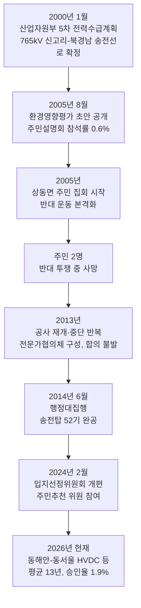
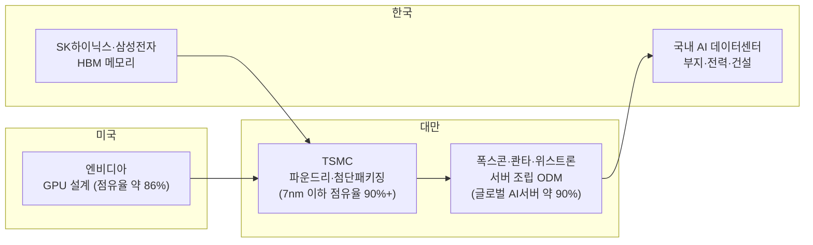

- 원문: borderless_hustler(@) "한국와서 느낀 현 AI실태" (Threads, 2026)
- 대댓글: bubjjang(@) "정부도 알고 해당 문제점 인지하고 있어요"
- 원문 링크: https://www.threads.com/share/BAIqHua5wO/

> 
> 한국와서 느낀 현 AI실태
> 
> 1. 데이터센터를 짓고싶은데 어떻게짓는지 모른다 - 미국/대만없이 불가능한 구조
> 2. 사모펀드/대기업들 돈들고 줄서있는데 정부가 전기, 물 허가 안준다
> 3. 데이터센터 프로젝트는 있는데 CSP가 없는게 많다
> 4. Physical AI는 다 로봇인줄 안다
> 
> re: 정부도 알고 해당 문제점 인지하고 있어요
> 
> 밀양 송전탑 사태 이후 송전선로 1개를 건설하는 데 10년 이상 걸리는 현실이 정부의 손발을 묶고 있는게지요
> 
> 몰라서가 아니라 알면서도 즉각 해결할 수 없는 물리적 한계와 제도적 딜레마가 큽니다.
> 
> 그와중에 부동산 투기성 '전력 알박기'세력도 넘쳐나구요. 정부와 한전이 그거 필터링하는것도 벅찰꺼에요.
> 

## 목차

0. 들어가며
1. 밀양 송전탑 사태와 "송전선로 10년" 주장 검증
2. 데이터센터를 어떻게 짓는지 모른다 — 미국·대만 의존 구조
3. 사모펀드·대기업은 줄서 있는데 정부가 전기·물을 안 준다
4. 데이터센터 프로젝트는 있는데 CSP가 없다 — 앵커테넌트 문제
5. "전력 알박기" 주장 검증
6. Physical AI는 다 로봇? — 개념 바로잡기
7. 종합 판단: 원문 주장은 얼마나 정확한가
8. 출처 및 신뢰도 표
9. 참고문헌

---

## 0. 들어가며

이 게시물은 해외에서 활동하다 한국을 방문한 작성자가 짧은 시간 동안 관찰한 내용을 네 줄로 요약한 것이다. 짧은 만큼 단정적으로 읽히지만, 실제로 검증해보면 상당 부분은 국내 정책 문서와 산업 보고서, 언론 보도로 뒷받침되는 사실에 가깝다. 다만 일부 표현은 과장되었거나, 한국이 아니라 미국 시장에서 주로 보고되는 현상을 한국에 그대로 적용한 것으로 보이는 대목도 있다. 아래에서는 항목별로 근거를 짚어가며 무엇이 사실이고 무엇이 단순화 혹은 과장인지 구분한다. 특히 대댓글에서 언급한 밀양 송전탑 사태는 실존하는 역사적 사건이며, 이후 한국의 송전망 건설 지연 문제의 상징으로 지금도 정책 논의에서 반복적으로 인용되고 있다.

---

## 1. 밀양 송전탑 사태와 "송전선로 10년" 주장 검증

결론부터 말하면 대댓글 작성자의 설명은 사실관계 면에서 정확하다. 밀양 송전탑 사태는 실제로 있었던 사건이고, 그로 인해 송전선로 건설이 오래 걸리게 된 것도 여러 정부 문서와 언론 보도가 일관되게 확인해주는 내용이다.

사건의 뿌리는 2000년 산업자원부의 제5차 장기전력수급계획으로 거슬러 올라간다. 이 계획에서 울산 신고리 원자력발전소에서 생산한 전기를 경남 창녕의 북경남 변전소로 보내기 위한 765킬로볼트급 초고압 송전선로 건설이 확정되었다[1][2]. 문제는 이 노선이 경남 밀양시의 여러 마을을 관통한다는 점이었다. 2005년 8월 한국전력이 환경영향평가 초안을 공개하고 주민 설명회를 열었지만, 경과지 5개 면 주민 2만 1069명 가운데 실제 참석자는 126명, 즉 0.6%에 불과했다[3]. 사업 초기부터 주민과의 소통이 형식적이었다는 뜻이다.

이후 2005년 상동면 주민들의 집회를 시작으로 반대 운동이 본격화되었고, 이 과정에서 송전탑 건설에 반대하던 주민 두 명이 스스로 목숨을 끊는 비극이 발생했다[2]. 2013년에는 한전과 밀양시가 공사 재개와 중단을 반복하며 전문가협의체를 통한 대안 모색을 시도했지만 합의에는 이르지 못했고, 결국 2014년 6월 대규모 경찰 병력이 투입된 행정대집행을 통해 농성장이 철거되고 부북·상동·단장·산외 4개 면에 송전탑 52기가 완공되었다[2][3]. 사업 착수부터 완공까지 약 14년, 주민 반발이 본격화된 시점부터는 약 9년이 걸린 셈이다.

이 사건 이후 한국전력은 입지선정 절차를 제도적으로 손보았다. 2024년 2월부터 구성되는 입지선정위원회는 한전이 임의로 노선을 정하는 대신, 지방자치단체장이 추천한 주민과 전문가로 구성된 위원회가 직접 경과지를 정하는 방식으로 바뀌었다[1]. 그러나 절차의 민주성을 높였다고 해서 소요 기간 자체가 크게 줄어든 것은 아니다. 2023년 보도에 따르면 한국전력이 독점적으로 운영하는 송·배전망은 재무위기로 인한 투자 여력 축소와 주민 수용성 저하가 겹치며 평균 13년이 걸리는 것으로 나타났다[4]. 2026년 8월 한국일보 보도 역시 "송전탑 갈등 이후에도 여전히 노선을 먼저 정하고 주민 의견을 나중에 듣는 방식이 반복되고 있다"고 지적하며, 이 문제가 용인 반도체클러스터처럼 국가적으로 시급한 산업단지 조성 일정에도 직접적인 차질을 주고 있다고 전했다[5].

가장 상징적인 사례가 '동해안~동서울 초고압직류송전(HVDC)' 사업이다. 강원 동해안의 발전소에서 생산한 전력을 수도권으로 보내는 이 사업은 한국전력이 수년간 79개 마을을 일일이 찾아다니며 주민을 설득해야 했다. 한전은 '빛으로 나눔쉼터'라는 주민 소통 공간을 만들고 직원들이 현장에 장기간 상주하며 주말도 반납한 채 농사일을 돕는 등 관계를 쌓아야 했다[6]. 그럼에도 2026년 8월 기준 이 사업을 포함한 주요 송전망 사업 54건 가운데 20건이 지연되고 있고, 10여 건은 추가 차질 가능성이 있는 것으로 파악됐다[6].

정부도 이 문제를 심각하게 받아들여 2023년 '국가기간 전력망 확충 특별법'을 발의해 인허가 절차를 단축하고 국무총리 산하 국가기간전력망위원회를 통해 중앙정부와 지자체 간 갈등을 조정할 수 있도록 했다[7][8]. 이 법의 목표 중 하나는 송전선로 건설 기간을 기존 대비 30% 단축하는 것이었다[4]. 그러나 2026년 8월 이데일리 보도는 특별법 시행에도 불구하고 "우리 동네는 안 된다"는 지역 반발에는 여전히 속수무책이라고 평가했다[6]. 데이터센터로 좁혀서 보면 이 병목은 더 뚜렷하게 드러난다. 2026년 3월 기준 수도권 데이터센터의 전력계통영향평가 1차 기술검토 신청은 522건, 총 3만 3592메가와트에 달했지만, 실제로 1차 검토를 통과한 것은 243건이었고 이 중 본심사 단계까지 간 사업은 24건, 최종적으로 전력 공급 승인을 받은 사업은 단 10건, 총 1010메가와트에 그쳤다. 신청 건수 기준 승인율은 1.9%, 전력 용량 기준으로도 3.0%에 불과했다[9][6].

정리하면 대댓글의 핵심 논지, 즉 "정부가 몰라서가 아니라 알면서도 즉각 해결하지 못하는 물리적 한계와 제도적 딜레마가 크다"는 설명은 문서와 통계로 뒷받침되는 정확한 진단이다. 다만 한전이 지난 10년간 마을에 지급한 합의금이 2649억 원에 달한다는 일부 온라인 자료의 수치는 나무위키라는 집단 편집 백과사전에서만 확인되며 정부 공식 통계로 교차 검증되지 않았으므로, 대략적인 규모를 짐작하는 참고 자료 이상으로 받아들이지 않는 것이 안전하다.

---

## 2. 데이터센터를 어떻게 짓는지 모른다 — 미국·대만 의존 구조

이 항목은 문자 그대로 "건물을 지을 줄 모른다"는 뜻이라기보다는, AI 데이터센터의 핵심 부품인 AI 가속기(GPU)와 서버 시스템을 한국이 독자적으로 만들 수 없는 공급망 구조를 지적한 것으로 읽는 것이 정확하다. 이 구조를 뜯어보면 실제로 미국과 대만 없이는 성립하지 않는다.

칩 설계 단계에서는 미국의 엔비디아가 전 세계 AI GPU 시장의 약 86%를 차지하고 있다[10]. 하지만 엔비디아는 칩을 직접 생산하지 않는다. 설계된 GPU는 대만 TSMC의 파운드리에서 위탁 생산되는데, TSMC는 2025년 전 세계 파운드리 시장의 72%를 차지했고 7나노미터 이하 첨단 공정에서는 점유율이 90%를 넘는다[10]. 즉 엔비디아 GPU는 사실상 전량이 대만의 반도체 공장에서 태어난다.

칩이 만들어진 뒤에는 서버로 조립되어야 하는데, 이 단계 역시 대만이 장악하고 있다. 폭스콘(혼하이정밀), 콴타컴퓨터, 위스트론 세 개의 대만 서버 제조업자개발생산(ODM) 기업이 전 세계 AI 서버의 약 90%를 만든다[10][11]. 이들은 엔비디아의 최신 플랫폼인 '베라 루빈' 공급망에도 핵심 파트너로 참여하고 있으며, 2026년 3월 기준 대만의 대미 수출 중 35.6%를 차지하는 최대 품목이 AI 서버로 추정될 정도로 이 산업이 대만 경제 자체를 견인하고 있다[12]. 한 국내 서버 업계 관계자는 대만 ODM 업체들이 대만 출신인 젠슨 황 엔비디아 CEO와의 네트워크 덕분에 GPU 확보 경쟁에서 앞서 있다고 설명했다[12].

한국의 위치는 이 사슬 중간에 있다. AI 가속기에 필수적인 고대역폭메모리(HBM)는 SK하이닉스와 삼성전자가 공급하지만, 완성된 칩 패키징은 대만에서 이뤄진다. 전문가들은 "TSMC의 첨단 패키징을 단기간에 대체할 업체는 사실상 없다"며, HBM 공급을 늘려도 TSMC 패키징에서 병목이 생기면 최종 제품 출하량 자체를 늘리기 어렵다고 지적한다[13]. 반대로 서버 완제품 시장에서는 한국 기업의 존재감이 미미하다. 2026년 5월 보도는 "대만 서버기업 하나 매출이 44조 원인데 변변한 국산 서버 기업 하나 없는 한국"이라는 제목으로 이 격차를 지적했다[12]. 실제로 대만의 컴퓨텍스 2026 전시장에는 TSMC, 폭스콘, 미디어텍, 에이수스, 기가바이트, 페가트론 등 주요 기업들이 총출동해 반도체부터 완제품 서버까지 이어지는 생태계를 선보였다[14].

물론 건설 자체의 경험이 전무한 것은 아니다. 현대건설은 2004년 금융결제원 분당센터를 시작으로 KT 목동 IDC, 네이버 '각 세종', 최근에는 용인 죽전의 하이퍼스케일급 데이터센터까지 국내 건설사 중 가장 많은 데이터센터 시공 실적을 쌓아왔고, 죽전 프로젝트는 착공 후 약 43개월 만에 준공됐다[15]. GS건설, 대우건설, 금호건설 등도 최근 데이터센터 전담 조직을 신설하며 설계·시공·전력 확보 역량을 키우는 중이다[16]. 다만 이는 '건물을 짓는' 물리적 시공 역량이고, 그 건물 안에 들어갈 AI 가속기와 서버 시스템의 설계·생산 역량은 여전히 미국과 대만에 절대적으로 의존하는 구조라는 점에서 원문의 지적은 대체로 타당하다.

---

## 3. 사모펀드·대기업은 줄서 있는데 정부가 전기·물을 안 준다

이 항목도 통계로 뚜렷하게 확인된다. 산업통상부의 제11차 전력수급기본계획에 따르면 한국전력에 접수된 데이터센터 전기 사용 신청 용량은 2023년 906메가와트에서 2027년 7343메가와트로 약 8배 늘어날 전망이지만, 실제 공급 가능한 전력은 그 절반에도 미치지 못한다[17]. 앞서 1장에서 확인했듯 수도권 데이터센터의 전력계통영향평가 승인율은 신청 건수 기준 1.9%에 불과하다[9]. 왜 이렇게 승인이 더딜까. 한국전력이 2023년 재무위기 극복을 위해 2026년까지 송·변전망 투자를 1조 3000억 원 줄이는 자구안을 내놓았기 때문이다[17]. 수요는 폭증하는데 공급 설비 투자는 오히려 억제되는 이중고인 셈이다.

한편 대기업과 사모펀드의 투자 대기 규모는 실제로 상당하다. 세계 최대 사모펀드 운용사 블랙스톤은 2025년 7월 약 34조 원 규모의 데이터센터 인프라 투자 계획을 발표했고[18], 국내에서도 이지스, 코람코, 퍼시픽자산운용, 마스턴투자운용 등 다수의 부동산 자산운용사가 데이터센터를 새로운 투자처로 삼아 뛰어들고 있다[19]. 2026년 6월 정부가 발표한 '대한민국 대도약 3대 메가프로젝트'에서도 삼성전자와 SK가 각각 광주 반도체 단지와 HBM 팹 등 대규모 투자 계획을 공개했다[20][21]. 즉 자본은 충분히 대기하고 있는데, 병목은 전력망이라는 물리적 인프라 쪽에 있다는 진단은 정확하다.

물 문제 역시 근거가 있다. 데이터센터는 서버 냉각을 위해 막대한 용수를 소비하는데, 2026년 8월 국민일보가 국내 최초로 전국 데이터센터의 향후 10년 물 수요를 추산한 결과, 신규 데이터센터가 예정된 지역에서는 지금보다 최대 45배 많은 물이 필요할 것으로 나타났다. 전남 장성의 경우 서버 냉각에만 하루 1만 톤이 넘는 물이 필요한데, 2035년 이 지역 주민이 쓰고 남는 생활용수는 하루 1257톤, 즉 필요량의 10분의 1 수준에 불과한 것으로 추산됐다. 평시에는 공급이 가능하더라도 냉각수 수요가 급증하는 폭염기에 물 부족을 겪을 가능성이 있는 데이터센터가 전국적으로 34개에 달한다는 분석도 함께 제시됐다[22][23].

이런 배경 속에서 2026년 6월 29일 이재명 대통령은 청와대에서 '대한민국 대도약 3대 메가프로젝트 국민보고회'를 열고 반도체, 피지컬 AI, AI 데이터센터를 3대 축으로 삼아 전력·용수·부지 인프라를 국가 차원에서 확충하겠다고 밝혔다[20][21]. 흥미로운 점은 세계적인 흐름과는 다소 엇갈린다는 점이다. 2026년 7월 경향신문 보도에 따르면 미국 뉴욕주는 50개 주 가운데 최초로 신규 대형 데이터센터에 대한 환경 인허가를 1년간 중단했고, 호주 등 여러 나라도 데이터센터 사업자에게 자체 전력원 확보와 전력망 접속 비용 부담을 지우는 규제를 도입하고 있다. 이런 흐름 속에서 한국 정부가 오히려 전력과 용수 공급을 '약속'하며 데이터센터 유치에 앞장서는 모습은 이례적이라는 것이 이 보도의 시각이다[23].

---

## 4. 데이터센터 프로젝트는 있는데 CSP가 없다 — 앵커테넌트 문제

이 항목은 부동산 개발 용어로 '앵커테넌트(anchor tenant)' 문제라고 부른다. 데이터센터를 짓겠다는 인허가와 부지, 심지어 전력 공급 계약까지 확보했더라도, 실제로 그 공간을 채워줄 클라우드서비스제공업체(CSP)나 대형 IT 기업과의 장기 임대 계약이 없다면 그 프로젝트는 서류상으로만 존재하는 셈이다.

2026년 3월 보도된 인베스트조선 기사는 이 문제를 정면으로 다뤘다. "물류센터 다음은 데이터센터"라는 제목처럼, 최근 데이터센터 시장이 과열되면서 브로커들이 활개 치고 있다는 것이다. 업계에서는 전력·입지·인허가 확보와 함께 안정적인 장기 수요자, 즉 앵커테넌트를 확보했는지 여부가 사업의 성패를 가르는 핵심 경쟁력으로 꼽힌다. 그런데 일부 브로커나 딜 제안자들은 실제로는 확정되지 않은 글로벌 대형 테크기업과의 계약을 "확보했다"는 식으로 앞세워 마케팅에 활용하는 사례가 있는 것으로 전해졌다[24].

건축 인허가는 받았지만 착공조차 못 하는 사례도 실제로 존재한다. 경기 부천시 오정구 내동에서는 2023년 5월 데이터센터 건축허가가 났지만, 2026년 2월 기준 3년 가까이 착공하지 못하고 있다. 이유는 15만 4000볼트의 특고압 전력 공급을 위한 지중선로 경과지 인근 주민의 반발과 도로관리 심의 등 구체적 협의가 마무리되지 않았기 때문이다. 전문가들은 대규모 전력수요시설은 건축허가 이전에 전력 공급 협의가 구체적으로 이뤄져야 하며, 절차적 완결성 없이 허가부터 내주는 방식이 오히려 더 큰 갈등과 행정 부담으로 돌아온다고 지적했다[25]. 서울 구로구 오류동의 옛 화창기공 부지에 들어설 예정이던 데이터센터도 2022년 부지 매입 이후 인근 주민 반대에 부딪혀 2026년 현재까지 건립하지 못하고 있으며, 2024년 9월 보도에 따르면 경기 고양·김포·용인 등에서도 데이터센터의 절반 이상이 지역 민원으로 공사가 중단됐고, 한 외국 기업은 4년간 부지를 찾다가 결국 투자를 포기한 것으로 알려졌다[26].

다만 시장 전체가 공실로 가득한 것은 아니다. 오히려 반대다. 2026년 8월 뉴스핌 보도에 따르면 수도권 데이터센터의 공실률은 2025년 하반기 6.9%에서 2026년 상반기 1.1%로 급락했다. 이미 전력과 인허가를 확보한 데이터센터는 오히려 희소 자산으로 평가받으며 자산가치가 오르는 추세다[27]. 즉 문제의 본질은 데이터센터가 전반적으로 남아돈다는 것이 아니라, 전력·인허가·앵커테넌트라는 세 조건을 모두 갖춘 '진짜' 프로젝트와 그렇지 못한 '서류상' 프로젝트 사이의 양극화가 심해지고 있다는 데 있다. 2026년 7월 KHARN 보도는 이 문제를 "2028년까지 예정된 공급은 대부분 전력과 인허가를 이미 확보했거나 개발이 진행 중인 사업"이지만, 그 이후로는 신규 변전소·송전망 확충이 지연되면서 2029년 이후 공급이 급격히 둔화하는 '공급절벽'이 나타날 수 있다고 경고했다[9].

---

## 5. "전력 알박기" 주장 검증

대댓글에서 언급한 "부동산 투기성 전력 알박기 세력"이라는 표현은 정확한 사실 확인이 필요한 부분이다. 결론부터 말하면, 이 용어와 현상은 현재까지 한국이 아니라 주로 미국 시장에서 구체적으로 보도된 사례다. 한국에도 유사한 양상이 나타나고 있지만, "알박기"라는 표현이 국내 데이터센터 시장에서 광범위하게 통용되는 공식 용어라고 보기는 어렵다.

2025년 12월 서울경제가 일본 니혼게이자이신문을 인용해 보도한 내용에 따르면, 미국에서는 생성형 AI 붐을 타고 실체 없이 전력 사용 신청만 남발하는 이른바 '유령 데이터센터(Ghost Data Center)'가 성행하고 있다. 전력 공급 조건이 좋은 부지를 선점하기 위해 실현 가능성이 낮은 계획안으로 일단 전력 사용권부터 확보해두는 투기적 행위가 사업자들 사이에서 나타났다는 것이다. 실제로 버지니아주의 전력회사 도미니언에너지가 체결한 원전 47기 분량의 전력 계약 가운데 절반 이상은 실제 건설 여부가 불투명한 초기 단계 사업이었고, 오하이오주의 한 전력회사가 데이터센터 전력 신청 요건을 강화하자 전체 신청 건수의 60%가 사라진 사례도 보도됐다[28].

한국의 상황은 이와 결이 조금 다르다. 국내에서도 데이터센터 부지 매입 비용이 최근 1~2년 사이 평당 2000만 원 이하에서 3000만 원을 넘는 수준으로 뛰었고, 한국전력의 전기사용통지 요건 강화와 분산에너지 특별법 시행으로 전력 사용계약을 이미 확보했거나 확보 가능성이 높은 부지의 가격이 더욱 비싸진 것은 사실이다[29]. 다만 이는 정부와 한전이 전력 공급 조건을 오히려 까다롭게 만들면서 나타난 부수 효과에 가깝고, 미국처럼 실체 없는 계획으로 전력망 신청 자체를 남발하는 사례가 대규모로 확인된 것은 아니다. 오히려 한국전력은 분산에너지 특별법과 전력계통영향평가를 통해 이런 투기적 신청을 사전에 걸러내려는 방향으로 규제를 강화하고 있다[9][29].

정리하면, 대댓글 작성자가 지적한 "부동산 투기성 전력 알박기 세력"이 넘쳐난다는 표현은 미국에서 실제로 보고된 현상을 한국 상황에 적용해 서술한 것으로 보이며, 한국에서도 전력 확보 부지를 둘러싼 투기적 가격 상승과 브로커의 과장 마케팅(4장 참고)은 실재하지만, "알박기"라는 표현이 지시하는 것처럼 실체 없는 유령 신청이 광범위하게 확인된 것은 아직 한국 사례로는 명확히 보도되지 않았다는 점에서 다소 과장이 섞인 진단으로 볼 수 있다. 그럼에도 "정부와 한전이 그것을 걸러내는 것도 벅찰 것"이라는 후반부의 지적 자체는, 승인율이 1.9%에 불과할 정도로 심사가 병목을 겪고 있는 현재 상황을 감안하면 방향성 면에서는 합리적인 우려다.

---

## 6. Physical AI는 다 로봇? — 개념 바로잡기

이 항목은 사실관계라기보다 개념 정리에 가깝다. 원문 작성자가 지적한 대로, 한국에서 '피지컬 AI'라는 용어가 언론과 대중적 논의에서 로봇과 거의 동의어처럼 쓰이는 경향이 있는 것은 사실이며, 이는 정확한 정의와는 다소 차이가 있다.

'피지컬 AI'라는 용어를 대중화한 것은 엔비디아의 젠슨 황 CEO다. 그는 2025년 1월 CES 기조연설에서 AI가 텍스트와 이미지를 생성하는 '디지털 세계'의 벽을 넘어 물리적 세계에서 작동하는 시대로 진입했다고 선언하며 이 개념을 제시했다[30]. 엔비디아가 정의하는 피지컬 AI는 카메라, 로봇, 자율주행차 같은 시스템이 환경을 인식하고 정보를 판단하며 현실 세계에 물리적으로 영향을 미치는 기술을 포괄한다[31]. 즉 로봇은 피지컬 AI의 가장 대표적이고 상징적인 구현 형태이지만, 개념 자체는 그보다 훨씬 넓다. 자율주행차, 산업 자동화 설비, 드론, 스마트팩토리의 디지털 트윈, 그리고 엔비디아가 함께 발표한 '코스모스'와 같은 물리 세계 시뮬레이션용 생성형 월드 파운데이션 모델까지 모두 피지컬 AI 범주에 들어간다[32][30].

한국 정부의 정책 문서에서도 이 구분은 분명하게 나타난다. 2026년 6월 발표된 '3대 메가프로젝트'에서 정부는 피지컬 AI를 반도체, AI 데이터센터와 나란히 하나의 독립된 축으로 설정했다. 세부 계획에는 피지컬 AI 부품 및 모델의 국산화를 위한 연구개발과 전문인력 양성, 교육·국방·재난대응 분야의 로봇 초기 수요 창출뿐 아니라, 향후 3년 안에 해외 기업 의존에서 벗어난 독자적인 '피지컬 AI 파운데이션 모델'을 개발하겠다는 목표가 포함되어 있다[33]. 파운데이션 모델은 로봇의 물리적 형태가 아니라 물리 세계를 이해하고 예측하는 소프트웨어 계층에 해당하므로, 정부 스스로도 피지컬 AI를 로봇이라는 하드웨어보다 넓은 개념으로 다루고 있는 셈이다.

이렇게 보면 원문의 지적은 "한국에서 피지컬 AI라는 단어가 언급될 때 일반적인 이해가 로봇 산업으로 좁혀지는 경향이 있다"는 관찰로는 타당성이 있다. 실제로 국내 로봇 관련 기업들의 주가나 정책이 '피지컬 AI 수혜주'라는 이름으로 자주 묶여 다뤄지는 것도 이런 인식을 강화하는 요인 중 하나로 보인다. 다만 이것이 정부나 산업계 전문가 집단의 오해라기보다는, 대중적 논의와 투자 담론에서 나타나는 단순화에 가깝다는 점은 구분해서 볼 필요가 있다.

---

## 7. 종합 판단: 원문 주장은 얼마나 정확한가

네 개 항목과 대댓글의 두 가지 논지를 종합하면, 이 게시물은 전반적으로 근거가 탄탄한 관찰에 가깝다. 첫째, 데이터센터의 핵심 부품인 AI 가속기와 서버가 미국의 설계와 대만의 파운드리·조립 생태계에 절대적으로 의존하는 구조라는 지적은 여러 산업 보고서와 무역 통계로 뒷받침된다. 둘째, 자본은 대기하고 있는데 전력과 물 공급 인허가가 병목이라는 지적 역시 산업통상부의 공식 전력수급계획과 전력계통영향평가 승인율(1.9%) 등 정량적 근거로 확인된다. 셋째, 인허가는 났지만 앵커테넌트가 없는 데이터센터 프로젝트가 실재한다는 지적도 부천 내동, 구로 오류동 등 구체적 사례로 확인된다. 넷째, 피지컬 AI가 로봇으로 좁게 인식되는 경향이 있다는 지적도 개념 정의상 타당하다.

대댓글의 밀양 송전탑 설명은 역사적 사실관계와 최근 통계 모두에서 정확하다. 다만 "전력 알박기"라는 표현은 미국에서 구체적으로 보고된 유령 데이터센터 현상을 한국 상황에 그대로 적용한 것으로, 한국에서도 전력 확보 부지를 둘러싼 투기적 가격 상승과 브로커의 과장 마케팅은 확인되지만 미국 수준의 대규모 '유령 신청' 현상이 한국에서 별도로 보도된 사례는 아직 없다는 점에서 다소 일반화된 서술로 볼 수 있다.

---

## 8. 출처 및 신뢰도 표

| 구분 | 내용 |
|---|---|
| 외부에서 검증 가능한 사실 | 밀양 송전탑 사태 경과(2000~2014), 송전선로 평균 건설기간(약 13년), 데이터센터 전력계통영향평가 승인율(1.9%), 전력 사용신청 용량 증가(2023년 906MW→2027년 7343MW 전망), 대만 ODM 3사의 글로벌 AI서버 생산 비중(약 90%), TSMC 파운드리 점유율, 부천 내동·구로 오류동 데이터센터 착공 지연 사례, 3대 메가프로젝트 발표(2026.6.29), 국가기간 전력망 확충 특별법 제정 및 시행 |
| 단일 출처·자기보고 성격이라 주의가 필요한 수치 | 한전의 10년간 마을 합의금 2649억 원(나무위키 단일 출처), 데이터센터 물 수요 10년 후 45배 증가 추산(국민일보 자체 분석, 국내 최초 시도로 교차검증 자료 부족) |
| 작성자의 해석·평가 | "전력 알박기" 현상이 미국 사례에 비해 한국에서는 아직 동일 규모로 확인되지 않았다는 판단, "피지컬 AI=로봇" 인식이 정부·전문가보다 대중 담론에서 두드러진다는 구분, 원문 게시물 전체에 대한 종합 타당성 평가 |

---

## 9. 참고문헌

[1] 대전CBS, "'밀양 송전탑' 이후 10여 년…갈등은 왜 반복되나", 2026.4.6, https://v.daum.net/v/20260406060616679

[2] 위키백과, "밀양 송전탑 사건", https://ko.wikipedia.org/wiki/밀양_송전탑_사건

[3] 시사인, "송전탑 갈등 10년, '밀양 할매'들은 답을 기다리고 있다", 2024.7.10, https://www.sisain.co.kr/news/articleView.html?idxno=53313

[4] 이데일리, "전력망 특별법 추진…'송전선로 건설기간 30% 단축'", 2023.12.4

[5] 한국일보, "전력망 없인 메가프로젝트도 없다", 2026.8.5, https://www.hankookilbo.com/news/article/A2026080523110000913

[6] 이데일리, "인허가 단축만 강조한 특별법…'우리 동네 안돼' 주민 반발엔 속수무책", 2026.8, https://edaily.co.kr/News/Read?mediaCodeNo=257&newsId=01426806645546008

[7] 전기신문, "'전력망 확충 특별법' 발의, 정부 주도 송전망 구축 힘 받는다", 2023.11.24

[8] ESG경제, "전력망 확충은 특별법 제정부터...송전선로 매설 갖가지 대안 눈길", 2024.6.25

[9] KHARN, "[KHARN칸] 수도권 데이터센터 전력승인률 '1.9%' 불과", 2026.7.14, https://www.kharn.kr/news/article.html?no=31267

[10] Taiwan.md, "대만 인공지능 발전과 미래 전략: 하드웨어 입장권은 얻었다, 다음 전장은 어디인가", 2026.5.3, https://taiwan.md/ko/technology/artificial-intelligence-development-strategy/

[11] 이투데이, "빅테크 자금 몰리는 대만…더 단단해진 AI 공급망 [컴퓨텍스2026]", 2026.5.31

[12] 다음뉴스, "대만 서버기업 하나 매출 44조원인데...변변한 국산 서버 기업 하나 없는 한국", 2026.5.8, https://v.daum.net/v/20260508141500941

[13] 글로벌이코노믹, "HBM은 한국서, AI칩 패키징은 대만서…TSMC가 쥔 공급망", 2026.7.28

[14] 이투데이, "데이터센터 넘어 로봇·차량으로…컴퓨텍스가 그린 AI 미래", 2026.6.4

[15] 현대자동차그룹, "현대건설, 국내 최대 규모 하이퍼스케일 데이터센터 시대를 열다", 2025.10.24

[16] 대한경제, "데이터센터로 몰리는 건설사…'전력·부지 확보가 승부처'"

[17] 파이낸셜뉴스, "'전기 먹는 하마' 데이터센터… 전력 인프라 확충 시급하다", 2026.1.5, https://www.fnnews.com/news/202601051811393187

[18] 삼정KPMG, "투자부터 운영까지 종합 고려한 중장기적 투자 전략 수립해야", https://kpmg.com/kr/ko/media/newsletter/202511/team-story.html

[19] 마스턴투자운용, "도심 속 새로운 인프라, 엣지 데이터센터의 시작", https://brunch.co.kr/@mastern/145

[20] 뉴스핌, "[3대 메가프로젝트] 李 '반도체·AI·데이터센터 삼각축, 초격차 강국 도약'", 2026.6.29, https://www.newspim.com/news/view/20260629001064

[21] 다음뉴스, "이재명 대통령 '반도체·AI·인공지능 데이터센터 삼각 축으로 초격차 산업 강국 도약'", 2026.6.29, https://v.daum.net/v/20260629145508244

[22] 국민일보, "[단독] 국내 최초 데이터센터 물 수요 예측... '물 부족' 온다", 2026.8.9, https://v.daum.net/v/20260809202254408

[23] 경향신문, "[뉴스분석] 세계는 데이터센터 규제하는데···한국은 전력·용수 공급 약속", 2026.7.22, https://www.khan.co.kr/article/202607220600111

[24] 인베스트조선, "'물류센터 다음은 데이터센터' 시장 호황에 브로커 활개...'옥석가리기' 과제로", 2026.3.25, https://www.investchosun.com/site/data/html_dir/2026/03/25/2026032580142.html

[25] 다음뉴스, "'선허가 후대책' 빈축…부천시 내동 데이터센터, 2년 넘게 착공도 못 해", 2026.2.21, https://v.daum.net/v/fPpGtmLxWF

[26] 나무위키, "데이터 센터"

[27] 뉴스핌, "빈자리 없는 수도권 데이터센터…공실률 1.1%로 '뚝'", 2026.8, https://www.newspim.com/news/view/20260811000594

[28] 서울경제, "전력 알박기? AI 붐에 美서 '유령 데이터센터' 문제라는데···[글로벌 왓]", 2025.12.4~5, https://www.sedaily.com/NewsView/2H1M1UVN24

[29] 브런치, "09화 데이터센터의 병목, Equity 확보와 운영수익", 2025.9.30, https://brunch.co.kr/@805b11de47c642c/44

[30] AI타임스, "[AI의 역사] 100 마침내 AI가 걸어온다 – 피지컬 AI 개념의 탄생과 계보", 2026.1.10

[31] Open Network System, "엔비디아 젠슨 황의 선택, 왜 한국인가?", 2026.1.8

[32] AHHA Labs, "Physical AI란? – 개념, 역사", 2025.10.29

[33] KHARN, "[KHARN칸] 반도체·AI·DC 중심 '3대 메가프로젝트' 청사진 공개", 2026.7.8, https://www.kharn.kr/mobile/article.html?no=31200

---

*이 문서는 2026년 8월 26일 기준으로 검색된 공개 자료를 바탕으로 작성되었습니다. 데이터센터 전력 승인 현황, 정책 시행 상황 등은 빠르게 변화하는 영역이므로 최신 수치는 원문 출처를 통해 재확인하시기 바랍니다.*
