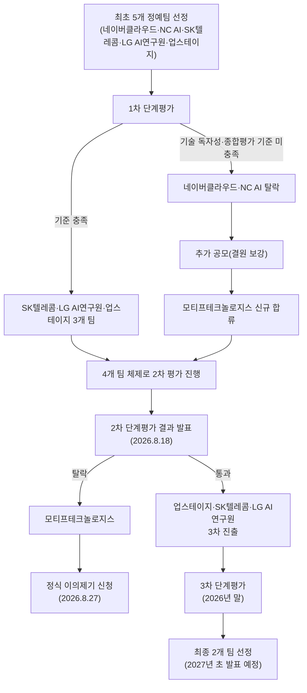
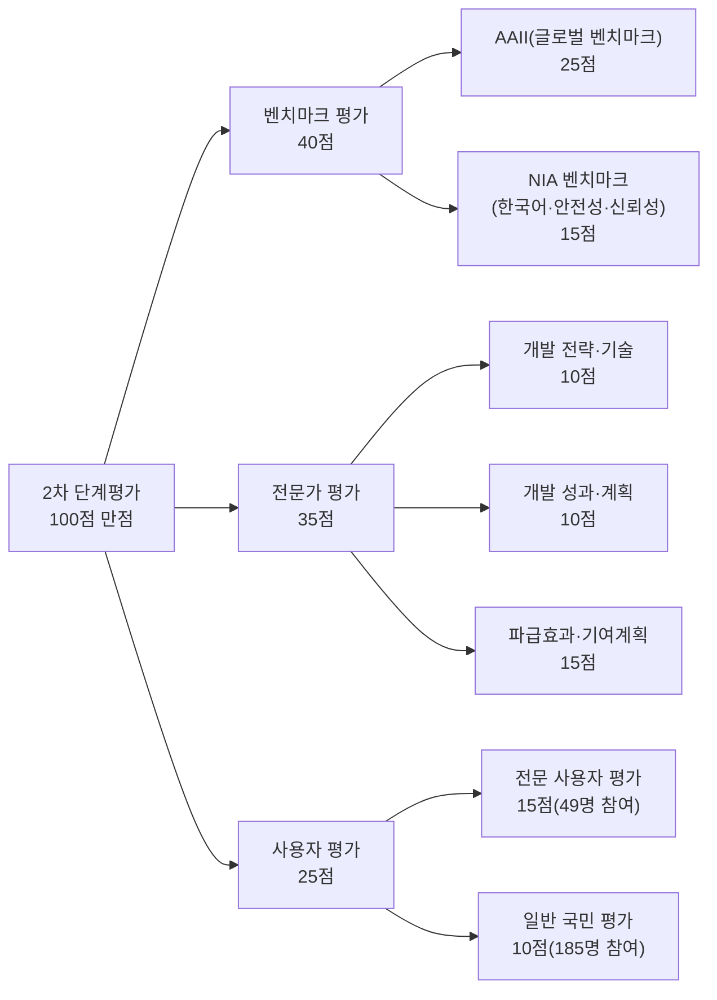
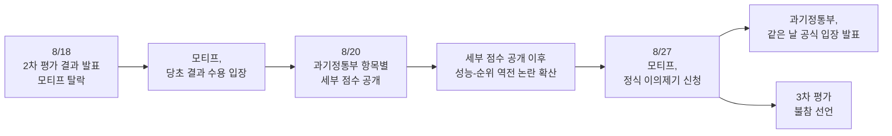
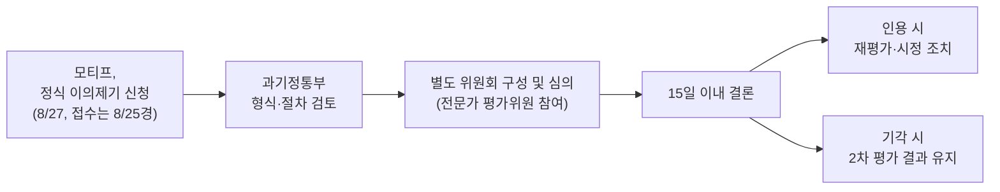

## 관련글

[**독파모 2차 평가, 벤치마크 1위가 왜 탈락했나 — 한국 소버린 AI 경쟁의 구조를 읽는다**](https://k82022603.github.io/posts/%EB%8F%85%ED%8C%8C%EB%AA%A8-2%EC%B0%A8-%ED%8F%89%EA%B0%80,-%EB%B2%A4%EC%B9%98%EB%A7%88%ED%81%AC-1%EC%9C%84%EA%B0%80-%EC%99%9C-%ED%83%88%EB%9D%BD%ED%96%88%EB%82%98-%ED%95%9C%EA%B5%AD-%EC%86%8C%EB%B2%84%EB%A6%B0-ai-%EA%B2%BD%EC%9F%81%EC%9D%98-%EA%B5%AC%EC%A1%B0%EB%A5%BC-%EC%9D%BD%EB%8A%94%EB%8B%A4/)

## 들어가며

2026년 8월 27일, 국내 AI 스타트업 모티프테크놀로지스가 정부의 '독자 AI 파운데이션 모델(이하 독파모)' 사업 2차 단계평가 결과에 정식으로 이의를 제기했다. 이 회사가 문제 삼은 지점은 명확하다. 자사가 개발한 모델 '모티프 3'가 글로벌 AI 성능 평가기관 아티피셜 애널리시스(Artificial Analysis)의 종합 지능지수인 AAII(Artificial Analysis Intelligence Index)에서 독파모 참여 기업 중 가장 높은 점수를 받았는데도, 정작 최종 종합평가에서는 가장 낮은 점수로 탈락했다는 것이다.

같은 날 오후, 과학기술정보통신부(이하 과기정통부)도 공식 입장을 내고 이의신청 처리 절차와 평가 기준의 배경을 설명했다. 정부는 벤치마크 점수가 전부는 아니라는 입장을 재확인하면서도, 탈락이 해당 기업의 기술력 전반에 대한 부정적 평가나 낙인으로 이어져서는 안 된다는 점을 강조했다.

이 문서는 독파모 사업이 무엇인지부터, 2차 평가가 어떤 구조로 진행됐는지, 모티프가 구체적으로 무엇을 문제 삼았는지, 그리고 정부가 어떻게 대응했는지까지 지금까지 공개된 사실관계를 바탕으로 정리한 것이다.

---

## 1. 독파모 사업이란 무엇인가

독파모는 과기정통부와 정보통신산업진흥원(NIPA), 한국지능정보사회진흥원, 정보통신기획평가원이 공동으로 추진하는 국책 사업으로, 정식 명칭은 '독자 AI 파운데이션 모델' 프로젝트다. 해외 빅테크의 AI 모델에 기술적으로 종속되지 않는, 국내 독자 기술로 개발된 프론티어급 파운데이션 모델을 확보하는 것이 사업의 취지다. 이른바 '소버린 AI(자국 AI 주권)' 전략의 핵심 사업 가운데 하나로 꼽힌다.

정부는 참여 기업(정예팀)에게 GPU, 데이터, 인재 세 가지 영역에서 지원을 제공한다. GPU는 2025년부터 2026년 상반기까지는 민간이 보유한 GPU를 임차해 지원하고, 이후에는 정부가 추가경정예산으로 구매한 물량(약 1만 장 규모)을 활용해 지원하는 방식이다. 데이터는 모든 정예팀에 공통으로 필요한 저작물 데이터를 공동구매 방식으로 지원하고, 개별 팀이 필요로 하는 데이터는 별도로 구축·가공을 지원한다. 인재 지원은 정예팀이 해외 우수 연구자(재외동포 포함)를 유치할 경우 인건비와 연구비, 체재비 등을 매칭 지원하는 구조다.

### 참여 기업의 변천

독파모는 처음부터 지금의 4파전 구도였던 것은 아니다. 사업 초기에는 네이버클라우드, NC AI, SK텔레콤, LG AI연구원, 업스테이지 등 5개 팀이 정예팀으로 선정돼 출발했다. 그런데 올해 초 진행된 1차 단계평가에서 네이버클라우드와 NC AI가 기술 독자성 검증 및 종합 평가 기준을 충족하지 못해 탈락했다. 정부는 결원을 보강하기 위해 탈락한 두 회사와 신규 사업자를 대상으로 추가 선발(이른바 '패자부활전')을 진행했으나, 네이버클라우드와 NC AI는 재도전하지 않겠다는 뜻을 밝혔고, 앞서 최종 5팀에 들지 못했던 카카오 역시 재도전을 포기했다. 이 과정에서 모티프테크놀로지스가 신규 정예팀으로 합류하면서, SK텔레콤·LG AI연구원·업스테이지·모티프테크놀로지스의 4개 팀 체제로 2차 평가가 치러지게 됐다.

독파모 사업이 처음 내걸었던 목표는 글로벌 프론티어 모델 대비 95% 수준의 성능을 갖춘 국산 파운데이션 모델을 확보하는 것이었다. 3차 평가를 거쳐 최종적으로 2개 팀이 선정되며, 그 결과는 2027년 초 발표될 예정이다. 다만 정부는 3차 평가 이후, 즉 2027년도 사업부터는 독파모 프로젝트 자체를 전면 재검토하겠다는 방침도 함께 밝혔다. 글로벌 프론티어 AI 모델의 발전 속도가 예상보다 훨씬 빠르게 진행되고 있어, 경쟁 방식과 지원 체계를 프론티어 모델 개발에 걸맞은 수준으로 재편해야 한다는 공감대가 있다는 설명이다.

---

## 2. 2차 단계평가는 어떻게 진행됐나

2차 단계평가는 100점 만점으로, 크게 세 영역을 합산해 순위를 매기는 방식으로 설계됐다. 벤치마크 평가가 40점, 전문가 평가가 35점, 사용자 평가가 25점이다. 이 배점 기준은 정부가 일방적으로 정한 것이 아니라 참여 기업들과의 협의를 거쳐 마련됐으며, 2026년 6월 17일자로 이미 공지된 내용이라는 것이 정부 측 설명이다.

벤치마크 평가 40점은 다시 두 갈래로 나뉜다. 하나는 아티피셜 애널리시스가 산출하는 글로벌 종합 지능지수인 AAII로, 25점이 배정됐다. 다른 하나는 한국지능정보사회진흥원(NIA)이 한국어 특성과 안전성, 신뢰성 등을 반영해 별도로 진행한 평가로, 15점이 배정됐다. 전문가 평가 35점은 개발 전략·기술(10점), 개발 성과 및 계획(10점), 파급효과 및 기여계획(15점)으로 구성되며 외부 AI 전문가들로 구성된 위원회가 심사했다. 사용자 평가 25점은 AI 스타트업 대표 등 현업 종사자 49명이 참여한 전문 사용자 평가(15점)와, 최종 선정된 200명 중 185명이 참여한 일반 국민 평가(10점)로 나뉜다.

### 2차 평가 결과 발표(2026년 8월 18일)

이렇게 치러진 2차 평가에서 업스테이지, SK텔레콤, LG AI연구원 3개 팀이 3차 단계로 진출했고, 모티프테크놀로지스가 탈락했다. 발표 직후 브리핑에서 류제명 과기정통부 제2차관은 모티프의 기술력 자체는 뛰어났지만, 이번 평가에서 비중이 컸던 사용성·활용성 부문에서 다른 기업에 비해 상대적으로 낮은 평가를 받았다는 취지로 설명했다.

발표 초기에는 항목별 세부 점수가 공개되지 않아 평가 과정이 불투명하다는 지적이 이어졌다. 1차 평가 때는 항목별 1위 기업을 공개했는데, 항목별 1위 공개가 해당 기업에는 점수 이상의 인지도 상승 효과를, 나머지 기업에는 낙인 효과를 줄 수 있다는 우려로 2차 평가에서는 처음에 이를 비공개했기 때문이다. 그러나 투명성 논란이 커지자 과기정통부는 이틀 뒤인 8월 20일, 평가 영역별 1위 기업과 점수, 4개 팀 평균 점수를 추가로 공개했다. 다만 이때도 기업별 총점과 최종 순위 그 자체는 끝내 공개하지 않았다.

### 항목별 세부 점수(2026년 8월 20일 공개 기준)

| 평가 영역 | 배점 | 1위 기업 | 1위 점수 | 4개 팀 평균 | 1위-4위 격차 |
|---|---|---|---|---|---|
| AAII(글로벌 벤치마크) | 25점 | 모티프테크놀로지스 | 11.9점 | 9.48점 | - |
| NIA 벤치마크(국내) | 15점 | SK텔레콤 | 비공개 | - | - |
| 벤치마크 전체 | 40점 | - | - | 22.5점 | 4.0점 |
| 전문가 평가 | 35점 | LG AI연구원 | 29.5점 | 약 28.8점 | 2.4점 |
| 전문 사용자 평가 | 15점 | SK텔레콤 | 비공개 | 10.53점 | - |
| 일반 국민 평가 | 10점 | LG AI연구원 | 7.6점 | 7.03점 | - |
| 사용자 평가 전체 | 25점 | - | - | 17.6점 | 5.0점(세 영역 중 최대) |

이 표에서 알 수 있듯, 업스테이지는 어느 항목에서도 1위를 기록하지는 못했지만 전 영역에서 고르게 상위권 점수를 받아 종합 순위에서 3차 진출권에 들었다. SK텔레콤은 국내 벤치마크와 전문 사용자 평가에서, LG AI연구원은 전문가 평가와 일반 국민 평가에서 각각 1위를 차지했다. 모티프테크놀로지스는 유일하게 글로벌 벤치마크인 AAII 한 항목에서만 1위였다.

### AAII 점수, '47점'과 '11.9점'은 왜 다른가

이 사건을 이해하는 데 있어 가장 헷갈리기 쉬운 지점이 바로 이 부분이다. 모티프 측이 강조하는 "AAII 47점 1위"라는 숫자와, 과기정통부가 공개한 "AAII 11.9점 1위"라는 숫자는 서로 다른 척도의 값이다.

47점은 아티피셜 애널리시스가 공개하는 AAII 원점수로, 100점 만점 체계에서 모티프 3가 받은 점수다. 이는 국내 기업 중 1위일 뿐 아니라, 미국·중국을 제외한 국가의 모델 가운데 최고 수준이라는 것이 모티프 측 설명이다. 참고로 독파모에 제출된 다른 모델들의 AAII 원점수는 업스테이지 37점, SK텔레콤 35점, LG AI연구원 31점이었다.

반면 11.9점은 이 원점수를 독파모 2차 평가의 25점 만점 배점 체계로 환산한 값이다. 원점수 100점을 25점 만점으로 단순 비례 환산하면 47점은 약 11.75점이 되는데, 실제 공개된 값인 11.9점과는 소수점 단위의 근소한 차이만 있어 대체로 비례식에 가까운 방식으로 환산됐을 것으로 추정된다. 같은 방식으로 계산하면 업스테이지·SK텔레콤·LG AI연구원의 환산 점수는 각각 9점대 초중반에서 형성되며, 이는 공개된 평균값(9.48점)과도 부합한다.

문제는 이 환산 과정에서 원점수 사이의 격차가 크게 줄어든다는 점이다. 모티프 측 설명에 따르면, 글로벌 1위 모델의 AAII 원점수는 63점인데 이를 25점 만점으로 환산하면 15.75점에 불과하다. 또 모티프(47점)와 4위인 LG AI연구원(31점) 사이의 원점수 차이는 16점이지만, 25점 만점 환산 이후에는 약 4점 차이로 줄어든다. 모티프테크놀로지스가 문제를 제기한 지점 중 하나가 바로 이 환산 방식이 실제 모델 간 성능 격차를 지나치게 축소시킨다는 것이다.

---

## 3. 모티프테크놀로지스와 '모티프 3'는 어떤 회사·모델인가

모티프테크놀로지스는 2025년 2월 인프라 소프트웨어 기업 모레에서 분사해 설립된 국내 AI 파운데이션 모델 전문 스타트업이다. 대규모 언어모델을 처음부터(from scratch) 자체 개발하고, 이를 실제 서비스로 구현·운영하는 것을 목표로 한다. 서울 서초구에 본사를 두고 있으며, 대표는 임정환 대표이사다.

이 회사는 2025년 12월 Motif-2-12.7B 모델을 공개하며 비슷한 규모의 오픈소스 모델 중 국내 최고 성능을 입증한 바 있다. 이후 독파모 2차 사업자로 합류한 지 약 5개월 만인 2026년 8월 13일, 자체 개발한 대규모 언어모델 '모티프 3(Motif-3)'를 허깅페이스를 통해 오픈소스로 공개했다. 모티프 3는 총 3,140억 개(314B) 파라미터에 토큰당 132억 개(13.2B) 파라미터가 활성화되는 전문가 혼합(MoE) 구조의 모델로, 엔비디아 B200 GPU 768장을 활용해 학습됐다. 회사는 독자 아키텍처와 기술보고서를 함께 공개하며 오픈소스 전략을 강조했다.

모티프 3는 공개 당시 AAII 종합 지능지수에서 47점을 기록해 국내 기업 중 1위, 글로벌 전체 순위로는 10위, 오픈 웨이트(공개 가중치) 모델 기준으로는 4위에 해당하는 성적을 냈다. 앞서 7월 21일 공개했던 프리뷰(베타) 버전은 AAII 44점을 기록해 당시 중국의 최신 모델과 동급 수준, 미국·중국을 제외한 국가 모델 중 최고 점수라는 평가를 받은 바 있다.

---

## 4. 모티프테크놀로지스, 무엇을 문제 삼았나

모티프테크놀로지스는 8월 27일 임정환 대표이사 명의의 입장문을 통해 이의제기 사실을 공식화했다. 회사는 이의제기가 탈락 결과 자체를 뒤집어 달라는 취지가 아니라, 독파모 사업이 애초의 목표에 맞게 평가되고 있는지, 그리고 글로벌 AI 경쟁에서 벤치마크와 실제 모델 성능을 어느 정도 비중으로 다뤄야 하는지를 공개적으로 재논의해야 한다는 취지라고 설명했다. 이의제기의 핵심 쟁점은 크게 다섯 갈래로 나눌 수 있다.

### 쟁점 1 — 성능지표와 최종 결과의 불일치

가장 근본적인 문제제기는 앞서 설명한 성능-순위 역전 현상이다. AAII에서 47점으로 참여 모델 중 1위를 기록한 모델이 종합평가에서는 최하위로 탈락했다는 것 자체가 납득하기 어렵다는 것이다. 모티프 측은 정부가 언론을 통해 벤치마크 점수는 높지만 전문가 평가와 사용자 평가에서 낮은 점수를 받아 탈락했다는 취지로 설명한 데 대해, 원점수 기준 16점이나 벌어졌던 성능 격차가 정반대의 결과로 이어졌다면 그 이유를 업계가 납득할 수 있도록 구체적으로 설명해야 한다는 입장이다.

### 쟁점 2 — 벤치마크 배점 환산 방식

두 번째는 벤치마크 점수를 최종 배점으로 환산하는 방식 자체에 대한 문제제기다. 모티프는 현행 환산 방식이 모델 간 실제 성능 차이를 충분히 반영하지 못한다고 주장했다. 다만 이 회사가 요구하는 것은 벤치마크의 비중 자체를 낮추라는 것이 아니라, 오히려 반대다. 글로벌 AI 업계에서 널리 활용되는 벤치마크의 중요성은 유지하되, 배점을 산정하는 과정에서 모델 간 실제 성능 격차가 지금보다 더 적절하게 반영돼야 한다는 것이 모티프의 주장이다. 아울러 AAII가 모든 것을 평가하는 절대적 기준은 아니라 하더라도, 업계에서 널리 쓰이는 9개 대표 벤치마크를 종합한 지표인 만큼 모델 간 성능 차이를 판단하는 중요한 참고 기준으로는 충분히 고려돼야 한다는 점도 강조했다.

### 쟁점 3 — 전문가 평가의 불투명성

세 번째 쟁점은 전문가 평가 과정의 공개 범위다. 모티프는 기술력과 개발 성과가 상당한 비중을 차지하는 전문가 평가에서, 벤치마크 점수가 가장 낮았던 모델이 오히려 높은 점수를 받았다면 그 판단에 어떤 기술적 근거가 작용했는지 설명이 필요하다고 주장했다. 특히 모델 성능이 상대적으로 낮음에도 파급효과나 국가 기여 가능성을 높게 평가한 것이라면, 그 판단 근거 역시 공개해야 한다는 입장이다. 회사 측은 또 전문가 평가 과정에서 컨소시엄 주관기업이나 참여기업에 외국계 자본이나 해외 법인이 의결권 있는 주요 주주로 참여하고 있는지를 묻는 질문을 받았다고 밝히면서, 이 질문이 기술적 평가 기준과 어떤 관련이 있는지 이해하기 어려웠다며 그 활용 목적과 기준을 밝혀 달라고 요구했다. 이에 따라 전문가 평가의 세부 기준과 항목별 결과, 업체별 점수를 공개해 달라고 요청했다.

### 쟁점 4 — 사용자 평가의 공정성(블라인드 여부)

네 번째는 사용자 평가의 공정성 문제다. 모티프는 평가에 앞서 사용자 평가를 블라인드 방식(모델 개발사를 알리지 않은 채 평가)으로 진행해 달라고 요청했다고 밝혔다. 유명 대기업이 만든 모델과 상대적으로 인지도가 낮은 스타트업이 만든 모델을 일반 사용자가 평가할 때, 개발사를 미리 알고 있으면 브랜드 인지도나 선입견이 평가 결과에 영향을 줄 가능성을 배제하기 어렵다는 이유에서다. AAII 벤치마크에서 나타난 성능 격차가 사용자 평가에서 크게 달라졌다면, 어떤 평가 방식과 조건이 이런 결과에 영향을 미쳤는지 납득할 수 있는 설명이 필요하다는 것이 모티프의 주장이다. 이와 함께 사용자 평가의 방법론과 세부 기준, 평가 환경, 업체별 결과 공개도 요청했다.

### 쟁점 5 — 독파모 사업의 목표와 방향

마지막 쟁점은 사업 자체의 방향성에 관한 것이다. 모티프는 파운데이션 모델의 가치를 단순한 챗봇으로서의 사용성만으로 판단해서는 안 되며, 여러 산업과 서비스로 확장할 수 있는 모델의 기반 성능이 우선돼야 한다고 주장했다. 독파모의 애초 목표가 글로벌 프론티어 모델 대비 95% 수준의 성능을 갖춘 독자 파운데이션 모델을 확보하는 것이었던 만큼, 글로벌 1위 모델의 AAII 점수가 63점인 현재 상황에서 모티프 3의 47점도 아직 75% 수준에 그친다는 점을 강조했다. 회사는 국내 모델의 성능이 이미 충분하다고 보고 평가의 중심을 사용성으로 옮기는 것은 시기상조이며, 현재 성능에 안주하기보다 모델의 본질적인 성능을 끌어올리는 것이 사업의 애초 취지에 더 부합한다고 주장했다. 이 때문에 3차 평가에서 벤치마크 비중을 낮추는 방향이 사업의 본래 목적과 맞는지 다시 검토해야 한다고도 했다.

### 3차 평가 불참 선언

모티프테크놀로지스는 이번 이의제기가 탈락 결과를 번복해 달라는 취지가 아니라는 점을 거듭 강조했다. 실제로 앞서 8월 18일 결과 발표 직후에는 이의를 제기하지 않고 결과를 받아들이겠다는 입장을 밝히기도 했으나, 이후 정부의 설명 과정에서 문제의식이 커지면서 9일 뒤인 8월 27일 정식으로 이의제기를 신청하게 됐다. 다만 회사는 이의제기 결과와 관계없이 독파모 3차 평가에는 참여하지 않겠다고 선언했다. 앞으로는 정부 사업 참여가 아니라 독자적인 힘으로 국내 최고 수준의 프론티어 모델을 만들어 글로벌 경쟁에서 승부를 보겠다는 방향을 택한 것이다. 회사는 3차 평가에 선정된 기업들에 축하의 뜻을 전하며, 앞으로도 선의의 경쟁을 이어가기를 기대한다는 입장도 함께 밝혔다.

---

## 5. 정부(과기정통부)의 대응

모티프의 이의제기가 알려진 8월 27일 오후, 과기정통부는 서울 프레지던트호텔에서 열린 '제2차 과학기술·인공지능 미래전략회의' 현장에서 김경만 AI정책실장 명의로 공식 입장을 밝혔다. 정부가 밝힌 대응의 방향은 크게 절차적 투명성 확보와 참여 기업 보호로 요약된다.

### 이의신청 처리 절차

김경만 실장은 이의신청을 접수한 지 이틀이 지났으며, 접수 형식과 절차를 우선 검토하고 있고, 내용에 대한 실질적 판단은 전문가 평가위원들의 몫이라고 설명했다. 이의신청은 15일 이내에 결론을 낼 예정이며, 관련 심의는 별도로 구성되는 위원회가 주관한다는 방침이다.

세부 점수의 전면 공개 여부에 대해서는 신중한 입장을 보였다. 제도의 공정성과 객관성에 최대한 가치를 두고 있다면서도, 세부 점수를 모두 공개할 경우 하위 평가를 받은 기업에 불필요한 낙인 효과가 생길 수 있다는 우려를 나타냈다. 다만 앞서 1차 평가 때와 비슷한 수준의 정보는 이미 2차 평가에서도 공개했다는 입장이며, 추가 공개 범위는 별도로 검토해 안내하겠다고 밝혔다.

### 사용성·활용성 평가에 대한 해명

이번 논란의 또 다른 축인 사용성·활용성 평가 비중에 대해서는 오해가 있다고 선을 그었다. 1차 평가 이후 독자성 기준을 명확히 해야 한다는 지적과, 모델을 만드는 것 못지않게 실제 활용이 중요하다는 지적이 함께 나왔고, 이를 반영해 2차 평가부터 모델의 독자성 합치 여부를 확인하는 한편 전문가 평가 내 활용 관련 배점을 기존 10점에서 15점으로 확대했다는 설명이다. 사업계획서상의 목적 자체에 성능 목표뿐 아니라 서비스 목표도 포함돼 있으며, 활용성 평가가 화면 디자인이나 사용자 인터페이스를 보겠다는 뜻은 아니라는 점도 분명히 했다. 오히려 인위적으로 꾸며진 결과물이 평가에 영향을 미치지 않도록, 평가자들에게는 프로토타입과 모델 자체를 중심으로 판단해 달라고 요청했다는 설명이다.

### AAII 위상에 대한 입장

정부는 모티프의 글로벌 벤치마크 성과 자체는 인정한다는 입장을 재확인했다. 모티프의 AAII 점수가 다른 참여 기업보다 높다는 점은 정부 발표에서도 계속 강조해 온 사실이며, 글로벌 평가에서 좋은 성과를 낸 것도 사실이라는 것이다. 실제로 과학기술정보통신부는 이보다 이틀 앞선 8월 25일 국무회의 대통령 보고에서도 독파모 모델이 AAII 47점을 기록한 성과를 글로벌 AI 3강 목표와 함께 언급한 바 있다.

다만 정부는 AAII 결과가 독파모 평가의 전부는 아니라는 입장이다. AAII의 공신력은 인정하지만, 한국어 특성과 안전성, 신뢰성 등을 반영한 별도의 성능평가도 함께 진행됐으며, 공개된 벤치마크 점수만으로 최종 순위를 판단하기는 어렵다는 설명이다. 모델을 잘 만드는 능력과 이를 실제로 활용하는 능력은 다를 수 있으며, 독파모가 국가대표급 모델 개발에 더해 AI를 개인과 기업 현장으로 확산하는 것까지 목표로 하는 만큼 활용성 역시 핵심 평가 요소라는 것이 정부 측 설명이다.

### 평가 기준 변경 논란에 대한 해명 — '무빙 타깃' 개념

평가 기준이 계속 바뀐다는 지적에 대해서는, 기준이 정부의 일방적 결정이 아니라 참여 업체와의 협의를 통해 만들어졌으며 이미 6월 17일자로 공지된 내용이라고 반박했다. 그러면서 독파모는 기획 단계부터 고정된 목표가 아니라 기술 흐름에 맞춰 목표와 평가 요소를 조정할 수 있는 '무빙 타깃(moving target)' 개념을 전제로 설계됐다고 설명했다. 에이전트형 AI, 추론 능력, 코딩 능력 등이 핵심 경쟁 요소로 빠르게 부상하는 환경에서 최신 버전의 AAII를 적용하는 과정에서 일부 기업의 점수 변화가 발생했다는 것이다.

### 낙인 효과와 다른 사업 불이익 우려에 대한 해명

김경만 실장은 이번 탈락 결과가 모티프의 기술력 전반에 대한 부정적 평가나 낙인으로 번져서는 안 된다는 점을 특히 강조했다. 경쟁형 평가의 특성상 순위와 탈락 기업이 나올 수밖에 없지만, 하위 평가를 받은 기업이 마치 역량이 부족한 기업처럼 받아들여지는 부작용은 경계해야 한다는 것이다. 모티프가 KT 컨소시엄으로 참여 중인 '모두의 AI' 등 다른 정부 사업에서 이번 탈락이 불이익으로 이어질 수 있다는 우려에 대해서도, 정부의 취지가 그렇게 받아들여지는 것은 우려스러운 일이라며 선을 그었다.

---

## 6. 이 사건이 던지는 질문들

이번 이의제기는 단순히 한 기업의 탈락에 얽힌 다툼을 넘어, 국가 AI 전략의 방향성을 둘러싼 몇 가지 근본적인 질문을 다시 던진다.

첫째는 벤치마크와 실사용성 가운데 무엇을 더 중시해야 하는가라는 질문이다. 모티프는 파운데이션 모델의 본질적 경쟁력은 결국 모델 자체의 성능이며, 아직 글로벌 최상위권과의 격차가 남아 있는 지금 시점에 사용성 중심으로 평가 축을 옮기는 것은 이르다고 본다. 반면 정부는 모델을 잘 만드는 능력과 이를 실제 산업 현장에서 활용하는 능력은 별개이며, 국민과 기업이 실제로 체감할 수 있는 확산까지가 독파모 사업의 목표라는 입장이다. 이 논쟁은 이번 이의제기 결과와 무관하게 3차 평가 설계와 2027년 이후 사업 재편 방향에도 계속 영향을 미칠 것으로 보인다.

둘째는 평가 과정의 투명성 문제다. 2차 평가는 처음에는 항목별 1위 기업조차 공개하지 않았다가, 논란이 커지자 뒤늦게 일부 정보를 추가로 공개하는 방식으로 진행됐다. 그럼에도 기업별 총점과 최종 순위, NIA 벤치마크의 구체적 점수, 전문가 평가의 항목별 세부 점수 등은 이번 이의제기 시점까지도 공개되지 않은 상태다. 국민 세금이 투입되는 국가대표 AI 선발 과정의 재현성과 설명책임을 어느 수준까지 요구할 수 있는지가 앞으로도 쟁점이 될 전망이다.

셋째는 국가 AI 사업에서 스타트업의 위치에 관한 질문이다. 모티프는 상대적으로 신생 기업이면서도 글로벌 벤치마크에서 대기업 컨소시엄들을 앞서는 성과를 냈다. 그럼에도 사용자 평가에서 브랜드 인지도가 영향을 미쳤을 가능성을 우려해야 했다는 점은, 국가 사업 안에서 신생 기업과 대기업이 동등한 조건으로 평가받고 있는지에 대한 물음으로 이어진다.

---

## 7. 앞으로의 일정

이번 이의제기와 별개로, 독파모 사업 자체의 일정은 다음과 같이 예정돼 있다. 업스테이지, SK텔레콤, LG AI연구원 3개 팀이 참여하는 3차 단계평가는 예정대로 2026년 말 진행되며, 이 가운데 2개 팀이 최종 선정돼 2027년 초 발표될 예정이다. 정부는 이의신청에 대해서는 접수일로부터 15일 이내에 결론을 낼 방침이라고 밝혔다. 한편 정부는 2027년도 사업부터는 독파모 프로젝트의 경쟁 방식과 지원 체계를 프론티어 모델 개발에 걸맞은 형태로 전면 재검토하겠다는 방침이며, 구체적인 개편안은 내년도 정부 예산이 확정된 이후 별도로 발표할 예정이다.

---

## 8. 타임라인 정리

| 시점 | 내용 |
|---|---|
| 2025년 초 | 독파모 사업 공모, 네이버클라우드·NC AI·SK텔레콤·LG AI연구원·업스테이지 5개 팀 선정 |
| 2026년 초 | 1차 단계평가에서 네이버클라우드·NC AI 탈락, 추가 공모로 모티프테크놀로지스 합류(4개 팀 체제) |
| 2026.7.21 | 모티프 3 프리뷰 버전 공개, AAII 44점 기록 |
| 2026.8.13 | 모티프 3 정식 버전 오픈소스 공개, AAII 47점(국내 1위, 글로벌 10위) |
| 2026.8.18 | 독파모 2차 단계평가 결과 발표. 업스테이지·SK텔레콤·LG AI연구원 3차 진출, 모티프테크놀로지스 탈락 |
| 2026.8.20 | 과기정통부, 투명성 논란에 따라 항목별 1위 기업과 점수 추가 공개(총점·순위는 비공개 유지) |
| 2026.8.25 | 국무회의 대통령 보고에서 독파모 모델 AAII 47점 성과 언급 |
| 2026.8.27 오전 | 모티프테크놀로지스, 정식 이의제기 신청 사실 공식화. 3차 평가 불참 선언 |
| 2026.8.27 오후 | 과기정통부, 제2차 과학기술·인공지능 미래전략회의에서 공식 입장 발표. 15일 이내 심의 방침 확인 |
| 2026년 말(예정) | 3차 단계평가 진행(3개 팀 중 2개 팀 선정) |
| 2027년 초(예정) | 독파모 최종 2개 팀 발표 |
| 2027년(예정) | 독파모 사업 구조 전면 재검토 |

---

## 출처

- 이데일리, [「대통령 앞서 "AI 성과" 자랑하더니…정작 그 모델은 탈락 왜?」](https://v.daum.net/v/20260827082752238), 2026.8.27
- 지디넷코리아, [「과기정통부, 독파모 평가 '공정성·기업 보호' 최우선…"투명한 절차로 이의신청 심의"」](https://v.daum.net/v/20260827132149087), 2026.8.27
- 이데일리, 「독파모 2차 평가, 세부 점수 공개 요구…"평가 과정 투명하게 알려야"」
- 비즈한국, 「독파모 2라운드, 성능 1위 '모티프' 탈락한 결정적 이유」
- 아이티데일리, 「독파모 2차 평가 '업스테이지·SKT·LG' 3강 확정…모티프 탈락」
- 이비엔뉴스, 「독파모 최종 2팀, 내년 초 발표…"내년 사업은 전면 재검토"」
- 머니투데이, 「'국가대표 AI' 뽑는 독파모, 내년 대대적 개편할까 [일문일답]」
- 뉴스천지, 「논란의 '독파모 성적표' 꺼냈으나 전체 점수·순위 끝내 비공개」
- 이투데이, 「투명성 논란에 '독파모' 세부 순위 공개…사용자는 SKT·LG 택했다」
- 비즈니스포스트, 「과기정통부 독파모 2차 평가 세부점수 공개, 모티프 글로벌평가·SKT 국내평가·LG AI연구원 전문가평가 1위」
- AI타임스, 「업스테이지·SKT·LG 독파모 3차 평가 진출...모티프 탈락」
- AI타임스, 「모티프, 독파모 프리뷰로 AAII 44점 달성…'딥시크-V4 프로'와 동급」
- 이코노미스트, 「모티프테크놀로지스, 독자 AI 모델 '모티프 3' 오픈소스 공개」
- 더에이아이, 「독파모 후발주자 모티프테크놀로지스, 5개월 만에 '모티프3' 공개」
- Artificial Analysis, 「Artificial Analysis Intelligence Index v4.1.1」 공식 페이지
- 기업마당(bizinfo.go.kr), 「독자 AI 파운데이션 모델 프로젝트 공고」

---

작성일: 2026년 8월 27일
