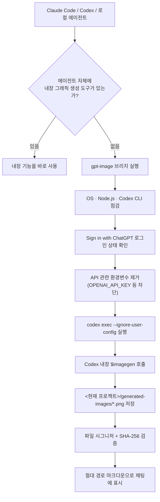
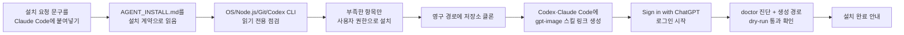

> 
> Claude Code 쓰신다면 이건 깔아두시는 게 좋습니다.
> 
> Claude Code에 없는 기능이 이미지 생성인데, 그걸 붙여주는 스킬입니다.
> 깔고 나면 이런 이미지 만들어달라고 말하는 것만으로 바로 나옵니다.
> 
> 챗GPT 구독으로 돌아갑니다.
> API 키를 발급받을 일도, 장당 요금이 나갈 일도 없는데요.
> 
> 레퍼런스 이미지를 넣어 스타일을 맞추거나, 뽑은 결과를 이어서 고치는 것도 됩니다.
> 결과물은 지금 작업 중인 폴더에 그대로 저장되고요.
> 
> 설치는 깃허브 주소를 Claude Code에 붙여넣고 설치해달라고 하면 끝납니다.
> 
> 1/ 주소 : http://github.com/GENEXIS-AI/gpt-image-skill
> 
> 설치는 저 주소를 Claude Code에 붙여넣고 설치해달라고 하면 됩니다. Node.js 22 이상, Codex CLI, 챗GPT 로그인이 필요하고, 없으면 설치하면서 알려줍니다
> 
> https://www.threads.com/@choi.openai/post/DcgNzrnCtnM
>


## 무엇에 관한 이야기인가

이번에 소개된 자료는 `GENEXIS-AI/gpt-image-skill`이라는 오픈소스 저장소를 설치·실행하는 과정을 보여준다. 이 저장소는 Claude Code, OpenAI의 Codex, 또는 이와 호환되는 로컬 코딩 에이전트에서 별도의 OpenAI Images API 결제 없이, 사용자가 이미 보유한 챗GPT 구독 계정의 로그인만으로 GPT 계열 그래픽 생성·편집 기능을 불러올 수 있게 해주는 "Agent Skill(에이전트 스킬)"이다. 실행 사례로는 커피 브랜드 광고용 포스터 시안 5종을 서로 다른 콘셉트(초고속 매크로 사진, 바우하우스 기하학, 아이소메트릭 클레이 렌더, 1950년대 빈티지 인쇄, 네온 나이트 시네마틱)로 한 번에 생성하도록 요청하고, Claude Code가 이를 처리해 5장 모두를 성공적으로 만들어 낸 흐름이 담겨 있다.

핵심만 요약하면 이렇다. Claude Code는 원래 자체적으로 그래픽을 만드는 모델을 내장하고 있지 않다. 반면 OpenAI의 Codex CLI는 챗GPT 구독 로그인 상태에서 내장된 `$imagegen` 기능을 통해 그래픽을 생성할 수 있다. `gpt-image-skill`은 이 둘 사이를 연결하는 다리 역할을 하는 작은 프로그램으로, Claude Code가 그래픽 생성 요청을 받으면 뒤에서 조용히 Codex CLI를 호출해 작업을 대신 처리하고, 그 결과물을 현재 작업 중인 프로젝트 폴더에 저장한 뒤 채팅창에 바로 띄워준다.

## 왜 이런 도구가 필요한가 — Claude Code의 빈틈

Anthropic은 Claude를 텍스트·코드·추론에 특화된 모델로 설계했으며, 자체적인 래스터(픽셀 기반) 그래픽 생성 모델을 붙이지 않았다. Claude Code 역시 코드를 읽고 쓰고 실행하는 에이전트일 뿐, 그림을 그려주는 기능은 내장되어 있지 않다. Claude가 할 수 있는 것은 SVG나 HTML 같은 코드 기반의 도표·차트를 그리거나, 사용자가 올린 그림을 분석하는 일까지다. 2026년 4월 공개된 Claude Design도 슬라이드나 프로토타입, 레이아웃을 코드로 조립해주는 도구이지, 사진 같은 결과물을 직접 만들어내는 기능은 아니다.

이 빈틈을 메우는 표준적인 방법은 MCP(Model Context Protocol) 서버를 통해 Replicate, Google Gemini, OpenAI 같은 외부 그래픽 생성 모델을 연결하는 것이다. 다만 이 방식들은 대체로 API 키를 발급받고, 호출할 때마다 별도로 과금되는 구조를 전제로 한다. `gpt-image-skill`이 제시하는 대안은 조금 다르다. API 키 대신 챗GPT 구독 계정으로 로그인한 Codex CLI를 그대로 활용해서, API 종량 과금 없이 이미 내고 있는 구독료 안에서 그래픽 생성 기능을 끌어다 쓰는 방식이다.

## 핵심 원리 — API가 아니라 로그인으로 우회한다

이 스킬이 하는 일은 크게 세 단계로 나뉜다.

1. Claude Code나 Codex에서 그래픽 생성 요청이 들어오면, 먼저 그 에이전트 자체에 기본 내장된 그래픽 생성 도구가 있는지 확인한다. 있다면 그것을 바로 사용한다.
2. 없다면 `gpt-image` 브리지가 개입한다. 운영체제, Node.js 버전, Codex CLI 설치 여부를 점검하고, "Sign in with ChatGPT" 방식으로 로그인이 되어 있는지 확인한 다음, `OPENAI_API_KEY`처럼 API 과금 경로로 이어질 수 있는 환경변수를 자식 프로세스에 전달되지 않도록 제거한다.
3. 그런 다음 `codex exec --ignore-user-config` 명령으로 Codex를 비대화형·일회성 모드로 실행해, 사용자의 기존 Codex 설정과 무관하게 예측 가능한 방식으로 내장된 `$imagegen` 기능을 호출한다. 결과 파일은 현재 작업 중인 프로젝트 아래 `generated-images/` 폴더에 PNG로 저장되고, 파일 서명(PNG/JPEG/WebP 시그니처)과 SHA-256 해시로 무결성을 검증한 뒤, 절대 경로를 포함한 마크다운 형태로 채팅창에 바로 표시된다.

이 구조를 도식으로 정리하면 다음과 같다.



여기서 눈여겨볼 부분은 "API를 쓰지 않는다"는 표현의 정확한 의미다. 저장소 설명에는 별도의 Images API 요청이나 API 키 과금 경로는 없다고 명시되어 있지만, 동시에 그래픽 한 장을 생성할 때마다 사용자가 이미 보유한 챗GPT·Codex 구독의 사용량과 한도는 그대로 소비된다는 점도 함께 밝히고 있다. 즉 완전히 공짜라는 뜻이 아니라, "장당 별도 청구"가 아니라 "이미 내고 있는 구독 한도 안에서 처리된다"는 의미로 이해하는 것이 정확하다.

## 어떤 기능을 제공하는가

저장소 설명을 기준으로 정리하면 이 스킬은 다음과 같은 기능을 제공한다.

- 챗GPT 구독으로 로그인한 Codex의 내장 `$imagegen`만 사용하며, `OPENAI_API_KEY`와 OpenAI Images API 호출 경로는 코드 수준에서 아예 차단되어 있다.
- Codex와 Claude Code 양쪽에 동일한 `gpt-image` 스킬을 설치할 수 있다.
- 결과물은 반드시 호출한 에이전트의 현재 작업 폴더(workspace) 내부에만 저장되며, 임의의 다른 경로에 쓰지 않는다.
- 로컬에 있는 여러 장의 참조 파일을 활용해 특정 스타일을 유지한 생성이나 부분 수정(편집)이 가능하다.
- 저장 전 PNG/JPEG/WebP 파일 시그니처, 파일 크기, SHA-256 해시를 검사해 손상되거나 위조된 결과물을 걸러낸다.
- 기본적으로 기존 파일을 덮어쓰지 않고 `-v2`, `-v3`처럼 버전을 늘려가며 새 파일을 만든다.
- macOS, Linux, Windows 네이티브, WSL2 환경을 모두 지원하며, 진단 스크립트가 공식 Codex 설치 절차와 자동으로 연결된다.
- `bootstrap` 명령 하나로 스킬 링크 생성, Codex 설치, 로그인, 상태 진단(`doctor`), 생성 경로 사전 점검(dry-run)까지 한 번에 이어서 처리한다.

## 설치 전에 준비해야 할 것 — 지원 환경과 요구사항

| 환경 | 지원 여부 | 비고 |
|---|---|---|
| macOS (Apple Silicon / Intel) | 지원 | macOS용 Node.js + 공식 Codex 설치 스크립트(`install.sh`) 사용 |
| Linux x64 / arm64 | 지원 | Linux용 Node.js + 공식 Codex 설치 스크립트 사용 |
| Windows 네이티브 | 지원 | Windows용 Node.js + 공식 Codex 설치 스크립트(`install.ps1`) + 디렉터리 정션(junction) 사용 |
| WSL2 | 지원 | Node.js, Codex, 저장소 클론, 스킬까지 전부 WSL2 안쪽에 설치해야 함 |
| WSL1 | 미지원 | WSL2로 전환하거나 Windows 네이티브 환경을 사용해야 함 |

브리지가 정상 동작하려면 다음 조건이 필요하다고 저장소는 명시하고 있다.

- Node.js 22 이상. 현재 지원되는 Node.js LTS 버전을 쓰는 것을 권장한다.
- GitHub 저장소를 내려받기 위한 Git.
- 그래픽 생성이 가능한 챗GPT/Codex 구독과 "Sign in with ChatGPT" 방식의 인증.
- Claude Code에서 호출한다면 Claude Code 자체를 실행할 수 있는 별도의 Claude 계정 로그인 또는 권한.

만약 Codex나 챗GPT 쪽 실행 환경이 이미 자체적인 그래픽 생성 도구(`image_gen`)를 직접 제공하고 있다면, 이 스킬은 Node.js나 중첩된 Codex CLI를 새로 설치하지 않고 그 내장 도구를 우선적으로 사용하도록 설계되어 있다.

## 설치는 실제로 어떻게 진행되는가

설치 방식은 두 갈래로 나뉜다. 하나는 에이전트에게 통째로 맡기는 방법이고, 다른 하나는 사람이 터미널에서 직접 명령어를 입력하는 방법이다.

### 에이전트에게 맡기는 방법

저장소 README에는 Claude Code나 Codex에 그대로 붙여넣을 수 있는 설치 요청 문구가 통째로 제공된다. 이 문구를 붙여넣으면, 에이전트는 읽기 전용 환경 점검부터 시작해 영구적인 사용자 경로에 저장소를 내려받고, Git·Node.js 22 이상·Codex CLI 중 없는 것만 골라 사용자 권한 범위 안에서 설치한 뒤, Codex와 Claude Code 양쪽에 `gpt-image` 스킬 링크를 만들고, 마지막으로 챗GPT 로그인 절차를 시작한다.

이 설치 요청 문구는 별도의 계약서 역할을 하는 `AGENT_INSTALL.md` 파일을 근거로 동작 범위가 엄격히 제한되어 있다. 다음과 같은 상황에서는 에이전트가 스스로 판단해 진행하지 않고 반드시 멈춘 뒤 사용자에게 이유와 다음 행동을 물어보도록 설계되어 있다.

- 관리자 권한이나 지원되지 않는 설치 경로가 필요한 경우
- 기존에 있던, 이 스킬과 무관한 파일·폴더·링크와 충돌하는 경우
- 기존에 API 키 방식으로 되어 있던 Codex 인증 정보를 로그아웃하거나 교체해야 하는 경우
- 실제 그래픽을 생성하거나, GitHub 저장소에 스타를 누르거나, 그 밖의 외부 작업이 필요한 경우

즉 "설치해줘"라는 한 마디 안에는 인증 시작까지만 포함되어 있을 뿐, 실제 결제성 행위나 파괴적인 변경까지 자동으로 허용하는 것은 아니다.



### 사람이 직접 명령어를 치는 방법

에이전트에게 맡기지 않고 직접 터미널에서 설치할 수도 있다. macOS·Linux·WSL2 환경에서는 다음 순서로 진행한다.

```bash
REPOSITORY_URL="https://github.com/GENEXIS-AI/gpt-image-skill"
INSTALL_DIR="${XDG_DATA_HOME:-$HOME/.local/share}/gpt-image-skill"

git clone "$REPOSITORY_URL" "$INSTALL_DIR"
cd "$INSTALL_DIR"
node ./gpt-image/scripts/validate_skill.mjs
node ./gpt-image/scripts/gpt_image.mjs bootstrap --target all --yes --json
```

Windows PowerShell에서는 다음과 같다.

```powershell
$RepositoryUrl = "https://github.com/GENEXIS-AI/gpt-image-skill"
$InstallDir = Join-Path $env:LOCALAPPDATA "gpt-image-skill"

git clone $RepositoryUrl $InstallDir
Set-Location $InstallDir
node .\gpt-image\scripts\validate_skill.mjs
node .\gpt-image\scripts\gpt_image.mjs bootstrap --target all --yes --json
```

설치가 끝나면 스킬은 다음 위치에 놓인다.

- Codex용: `~/.agents/skills/gpt-image`
- Claude Code용: `~/.claude/skills/gpt-image`
- Windows에서는 각각 `%USERPROFILE%\.agents\skills\gpt-image`, `%USERPROFILE%\.claude\skills\gpt-image`

macOS·Linux·WSL2에서는 심볼릭 링크로, Windows에서는 디렉터리 정션으로 연결된다. 예전 이름이었던 `gpt-image-workspace`라는 링크가 남아 있다면, 그것이 정확히 이 저장소가 만든 링크라고 확인될 때만 정리되며, 사용자가 직접 만든 일반 폴더나 다른 링크는 건드리지 않는다.

WSL2 환경에서 설치할 때는 클론 위치를 `/mnt/c` 같은 Windows 쪽 경로가 아니라 Linux 홈 디렉터리 아래에 두고, Windows용 Node.js·Codex와 뒤섞지 않는 것이 중요하다고 안내되어 있다.

## 설치 후 검증 절차와 확인 값

설치가 정상적으로 끝났는지는 `doctor --json` 명령의 결과값으로 판단한다. 정상 완료 시 다음과 같은 형태의 응답이 돌아온다.

```json
{
  "ok": true,
  "status": "ready",
  "doctor": {
    "platform_supported": true,
    "node_supported": true,
    "codex_available": true,
    "chatgpt_subscription_login": true,
    "api_environment_forwarded": false,
    "best_practice_pass": true
  },
  "generation_dry_run": {
    "ok": true,
    "dry_run": true
  }
}
```

여기서 `api_environment_forwarded`가 `false`로 나오는 것이 특히 중요한데, 이는 API 키 관련 환경변수가 실제 그래픽 생성 요청으로 전달되지 않았다는 것을 스스로 증명하는 값이다. `chatgpt_subscription_login`이 `true`여야 구독 기반 로그인이 정상적으로 인식되었다는 뜻이고, `generation_dry_run`은 실제로 결과물을 만들지는 않으면서 인증·경로·라우팅만 미리 점검하는 절차다.

## 실제로 사용하는 방법

설치가 끝나면 이후로는 README나 설치 계약 문서를 다시 읽을 필요 없이, 짧은 명령으로 바로 호출할 수 있다. 저장소 설명에 따르면 스킬은 "점진적 공개(progressive disclosure)" 방식으로 로드되도록 설계되어 있어서, 평소에는 이름과 짧은 설명만 에이전트의 발견 목록에 있다가, 실제로 그래픽 요청이 들어와 `gpt-image`가 선택될 때만 본문 지침을 읽고, 운영체제 설치나 인증 문제가 있을 때만 관련 참고 문서를 추가로 불러온다. 이런 방식은 매번 방대한 설명서를 전부 다시 읽지 않아도 되게 해, 불필요한 맥락 낭비를 줄이는 효과가 있다.

Codex에서는 다음과 같이 호출한다.

```
$gpt-image 미색 배경 위에 파란 유리 재질의 작은 로봇을 만들어줘. 현재 프로젝트에 저장하고 보여줘.
```

Claude Code에서는 다음과 같이 호출한다.

```
/gpt-image 미색 배경 위에 파란 유리 재질의 작은 로봇을 만들어줘. 현재 프로젝트에 저장하고 보여줘.
```

명령줄에서 직접 스크립트를 실행할 수도 있다.

```bash
node ./gpt-image/scripts/gpt_image.mjs generate \
  --prompt "미색 배경 중앙에 코발트 블루 카메라 조리개 심볼. 텍스트와 워터마크 없음." \
  --out "generated-images/camera-aperture.png" \
  --size "square" \
  --quality "final" \
  --background "opaque" \
  --json
```

로컬에 있는 특정 파일을 참조로 넣어 스타일이나 구도를 유지한 채 일부만 바꾸는 편집도 가능하다.

```bash
node ./gpt-image/scripts/gpt_image.mjs generate \
  --prompt "인물과 구도는 유지하고 배경만 따뜻한 노을로 바꿔줘." \
  --reference "/absolute/path/reference.png" \
  --out "generated-images/sunset-edit.png" \
  --json
```

실제로 결과물을 만들지 않고 인증·경로·라우팅 상태만 확인하고 싶다면 `--dry-run` 옵션을 붙이면 된다.

## 구독 계정 보호를 위한 안전장치

이 스킬이 강조하는 부분 중 하나는 "구독 전용"이라는 경계를 코드 수준에서 지키려는 설계다. 저장소 설명에 명시된 안전장치는 다음과 같다.

- `OPENAI_API_KEY`, `OPENAI_BASE_URL`, `OPENAI_ORG_ID`, `OPENAI_PROJECT_ID`, `CODEX_ACCESS_TOKEN` 같은 값을 하위 프로세스로 전달하지 않는다.
- 민감 정보가 가려진(redacted) `codex login status`와 `codex doctor --json` 결과를 통해 챗GPT 인증 증거만 확인한다.
- API 키 인증이 감지되거나 챗GPT 인증을 확인할 수 없으면, 결과물을 만들기 전 단계에서 중단한다.
- OpenAI Images API 엔드포인트나 `/v1/images` 호출 코드 자체를 포함하고 있지 않다.
- 인증 파일을 직접 읽지 않으며, 출력 결과는 반드시 현재 작업 폴더 내부로 제한한다.
- `--overwrite` 옵션 없이는 기존 파일을 덮어쓰지 않는다.

설치 계약 문서에는 이보다 더 구체적인 경계도 담겨 있다. 설치를 맡기는 문구 자체가 비밀번호·토큰·API 키·인증 파일을 읽는 것을 허용하지 않으며, 사용자가 브라우저나 기기 인증 절차를 스스로 완료해야 한다고 못박고 있다. 만약 기존에 API 키 방식 인증이 이미 되어 있다면, 에이전트가 임의로 로그아웃시키지 않고 반드시 사용자에게 교체 여부를 따로 확인해야 한다.

## 시연된 실행 흐름으로 보는 실제 사례

공개된 실행 기록에는 "사람들의 이목을 끌 수 있는 디자인의 커피 광고 포스터 5장을, 각각 다른 콘셉트와 프롬프트로 만들어 달라"는 요청을 Claude Code에 입력한 사례가 담겨 있다. Claude Code는 이 요청을 받아 Node 24, Codex CLI, `generated-images/` 폴더가 모두 준비되어 있음을 확인한 뒤, 5개의 독립된 콘셉트를 하나의 배치 작업으로 정리했다.

| 번호 | 콘셉트 | 방향 |
|---|---|---|
| 1 | Espresso Splash | 초고속 매크로 촬영, 공중에 정지한 에스프레소 스플래시, "PURE INTENSITY" |
| 2 | Bauhaus Geometric | 플랫 기하 도형과 스위스 타이포그래피, 실크스크린 질감, "DRINK BOLD" |
| 3 | Isometric Diorama | 거대한 라떼잔 위 소인국 콘셉트의 3D 클레이 렌더, "MADE BY HAND" |
| 4 | Vintage 1950s | 하프톤 인쇄 질감의 미드센추리 손그림 광고, "Always Fresh!" |
| 5 | Neon Night | 비 온 뒤 네온 거리, 아이스 커피 시네마틱 컷, "AFTER DARK" |

작업을 진행하며 Claude Code는 사진·그래픽·3D·일러스트·시네마틱이라는 서로 다른 표현 방식이 겹치지 않도록 콘셉트를 구분했고, 헤드라인 문구는 정확한 표현이 중요한 만큼 영문으로 넣은 뒤, 결과를 보고 한글 문구를 원하면 다시 만들어주겠다고 안내했다. 배치 작업은 동시에 4개씩 처리되었고, 최종적으로 5장 모두 실패 없이 완료되었다는 기록이 남아 있다. 이후 사용자가 특정 스타일(다섯 번째 네온 나이트 콘셉트)에 한글 문구를 넣어 다시 만들어 달라고 요청하는 후속 작업으로 이어졌다.

이 사례는 이 스킬이 단순히 한 장을 생성하는 데 그치지 않고, 서로 다른 프롬프트를 담은 배치 작업, 특정 결과물만 골라 재작업하는 반복 수정, 언어를 바꾼 재생성까지 하나의 대화 흐름 안에서 자연어만으로 처리할 수 있다는 점을 보여준다. 다만 이는 한 명의 사용자가 실제로 실행한 기록이며, 모든 환경에서 동일한 완성도나 속도가 보장된다는 공식 벤치마크는 아니라는 점은 감안할 필요가 있다.

## 비용 구조 — API 방식과 무엇이 다른가

| 구분 | 일반적인 Images API 연동 방식 | GPT Image Skill 방식 |
|---|---|---|
| 인증 수단 | OpenAI API 키 발급 | 챗GPT 구독 계정으로 로그인(Sign in with ChatGPT) |
| 과금 단위 | 호출 1건(또는 장당) 단위로 별도 청구 | 별도 청구 없음. 다만 챗GPT/Codex 구독의 사용량·한도를 소비 |
| 필요한 준비물 | API 키, 결제 수단 등록, 사용량 모니터링 | Node.js 22+, Codex CLI, 챗GPT 로그인 |
| 저장 위치 | 도구마다 상이 | 호출한 에이전트의 현재 작업 폴더 내부로 고정 |
| 대표 활용 주체 | 이미 OpenAI API 결제 체계를 구축한 개발팀 | 이미 챗GPT 유료 구독을 쓰고 있고 API 결제 체계는 따로 두고 싶지 않은 개인·소규모 사용자 |

즉 이 스킬의 실질적인 가치는 "완전 무료"가 아니라, API 키 발급과 별도 결제 관리라는 절차를 건너뛰고 이미 지불 중인 챗GPT 구독료 한 곳으로 비용 구조를 합치는 데 있다. 사용량이 많은 팀이라면 오히려 API 방식이 더 유리할 수도 있으므로, 자신의 사용 패턴에 맞는 방식을 선택하는 것이 합리적이다.

## 한계와 주의할 점

- 완전한 무과금이 아니라 구독 한도를 소비하는 구조이므로, 대량으로 반복 생성하면 챗GPT/Codex 쪽 사용량 제한에 걸릴 수 있다.
- WSL1은 지원하지 않으며, WSL2 사용 시에도 Windows 쪽 런타임과 Linux 쪽 런타임을 섞으면 오류가 발생할 수 있다.
- 이미 API 키 방식으로 Codex 인증이 되어 있는 환경에서는 자동으로 로그아웃시키지 않으므로, 두 인증 방식이 충돌하지 않도록 사용자가 직접 정리해야 하는 경우가 있다.
- CI(지속적 통합) 환경에는 실제 로그인 정보가 없기 때문에, 저장소의 자동 검증은 문법·설치 스크립트·링크 생성까지만 확인하고 실제 로그인과 결과물 생성은 검증하지 않는다.
- 이 프로젝트는 만들어진 지 오래되지 않은 소규모 오픈소스 저장소로, 특정 기업의 공식 제품이 아니라 커뮤니티 차원에서 유지·보수되는 도구라는 점을 감안해야 한다. 실제 운영 환경에 도입하기 전에는 스크립트 내용을 직접 검토하는 절차를 거치는 것이 안전하다.

## 팩트체크 — 검증된 내용과 확인이 더 필요한 내용

| 항목 | 내용 | 확인 상태 | 근거 |
|---|---|---|---|
| Node.js 22 이상 요구 | 브리지 실행을 위한 최소 요구 사항 | 검증됨 | GENEXIS-AI/gpt-image-skill 저장소 README (2026년 8월 확인) |
| Codex CLI 및 챗GPT 로그인 필요 | API 키 대신 "Sign in with ChatGPT" 인증 필요 | 검증됨 | 위 저장소 README, AGENT_INSTALL.md |
| OPENAI_API_KEY 및 Images API 코드 수준 차단 | 관련 환경변수를 자식 프로세스에 전달하지 않음 | 검증됨 (저장소 자체 설명 기준) | 위 저장소 README "구독 전용 안전장치" 항목 |
| 완전 무료가 아니라 구독 한도를 소비함 | 별도 청구는 없지만 사용량·한도는 소비된다고 명시 | 검증됨 | 위 저장소 README |
| Claude Code, Codex 양쪽에 동일 스킬 설치 지원 | `~/.claude/skills/gpt-image`, `~/.agents/skills/gpt-image` 경로에 링크 생성 | 검증됨 | 위 저장소 README |
| macOS/Linux/Windows/WSL2 지원, WSL1 미지원 | 지원 환경표에 명시 | 검증됨 | 위 저장소 README |
| Claude Code에 자체 그래픽 생성 모델이 내장되어 있지 않다는 전제 | Claude는 텍스트·코드 중심 모델이며 별도 도구 연결이 필요 | 검증됨 (2026년 최신 자료 기준) | 관련 업계 해설 자료 다수, 2026년 4월~8월 사이 확인 |
| 저장소의 인기도(스타·포크 수) | 조회 시점에 따라 수치가 변동해 특정 시점의 정확한 값을 단정하기 어려움 | 확인 어려움(변동 수치) | GitHub는 실시간으로 변하는 지표이므로 특정 숫자를 사실로 고정하지 않음 |
| 시연된 포스터 5종 생성 사례 | 실제 사용자가 실행한 기록으로, 공식 성능 지표나 보장된 결과는 아님 | 검증됨(실행 기록 자체), 다만 일반화는 불가 | 공유된 실행 로그 |

## 참고 자료

- GENEXIS-AI/gpt-image-skill GitHub 저장소 (README.md), 2026년 8월 확인
- 위 저장소의 AGENT_INSTALL.md (설치 계약 문서), 2026년 8월 확인
- OpenAI ChatGPT 개발자 문서, Codex CLI 소개 페이지 (learn.chatgpt.com/docs/codex/cli), 2026년 8월 확인
- Claude의 그래픽 생성 관련 업계 해설 자료 다수 (2026년 4월~8월 게재분)

---

작성일: 2026년 8월 27일
