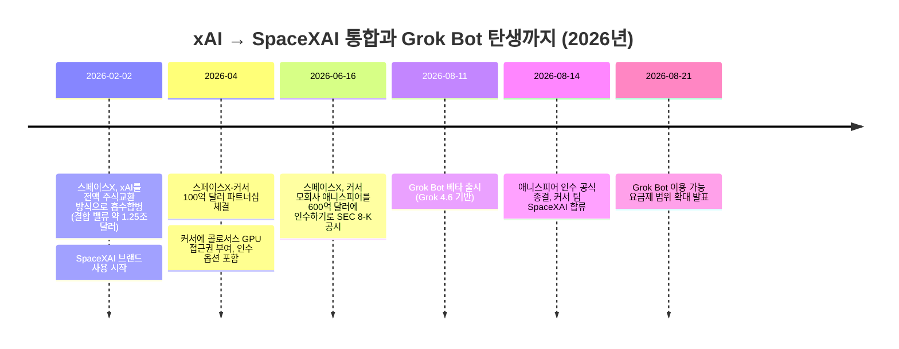
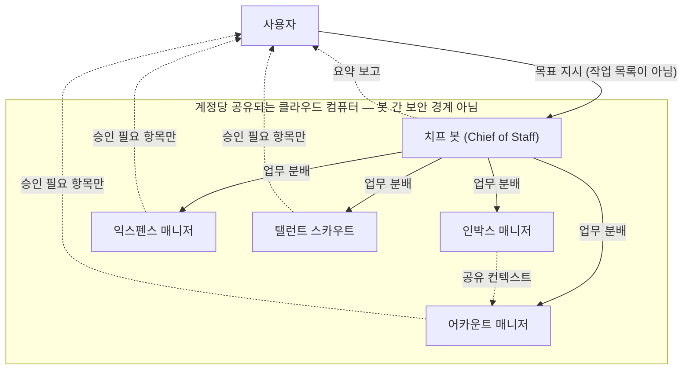

## 관련글

[**【AIエージェント時代、人間に必要なスキルが「プロンプトを書くこと」から「仕事を任せること」に変わる】**](https://x.com/paji_a/status/2092418942312820791)

[**SpaceXAI engineer (ex-Cursor)**](https://x.com/0xCodez/status/2091980766372639135)

[**Grok Bot Agents: how to automate your life in 10 Steps (Full-tutorial)**](https://x.com/0xCodez/status/2089676836619878567)

## 이 문서가 다루는 것

공유된 세 개의 X(트위터) 게시물은 서로 다른 사람이 올린 것이지만 하나의 흐름으로 연결되어 있다. 먼저 개발자 계정 0xCodez가 "Grok Bot Agents: how to automate your life in 10 Steps"라는 제목의 튜토리얼 스레드를 올렸고, 같은 계정이 이를 요약하며 "SpaceXAI 엔지니어가 GrokBot 에이전트 10~20개를 돌려 업무의 90%를 자동화하고 있다"는 팟캐스트 내용을 소개했다. 이어서 일본어 계정 paji.eth가 이 튜토리얼을 열 가지 원칙으로 재정리하며 "AI 에이전트 시대에 사람에게 필요한 스킬이 프롬프트 작성에서 업무 위임으로 바뀐다"는 해석을 덧붙였다.

세 게시물을 관통하는 주제는 하나다. xAI가 2026년 8월에 베타로 내놓은 새로운 제품 **Grok Bot**이 어떻게 작동하는지, 그리고 이 제품이 왜 "AI를 프롬프트로 조작하는 사람"에서 "AI 팀을 관리하는 사람"으로 역할이 바뀐다는 이야기까지 이어지는지다. 이 문서는 원문 트윗의 주장을 그대로 옮기지 않고, 최신 검색을 통해 사실관계를 하나하나 확인한 뒤 서술형으로 풀어 쓴 것이다. 확인되지 않은 수치나 확인이 어려운 개별 사례는 "원문 게시물의 주장"이라고 명시적으로 구분해 두었다.

---

## 1. 먼저 헷갈리는 이름부터 정리: "SpaceXAI"는 오타가 아니다

원문 게시물을 처음 읽으면 "SpaceXAI"라는 이름이 xAI의 오타처럼 보인다. 하지만 이는 오타가 아니라 2026년 상반기에 실제로 벌어진 기업 통합의 결과다.

2026년 2월 2일, 일론 머스크의 우주 기업 스페이스X가 자신의 AI 기업 xAI를 전량 주식 교환 방식으로 흡수합병했다. 이 합병으로 결합된 회사의 기업가치는 약 1조 2,500억 달러로 평가되었고, xAI 연구팀과 X(구 트위터) 소셜미디어 플랫폼이 스페이스X 내부의 AI 사업부로 편입되었다. 이때부터 "SpaceXAI"라는 브랜드가 xAI의 후신으로 쓰이기 시작했다. 다만 이 통합 과정에서 xAI의 원년 공동창업자 11명을 포함한 상당수 연구자가 연구 중심 조직 문화와 스페이스X 특유의 마일스톤 중심 실행 문화 사이의 충돌로 3월 말까지 회사를 떠났다는 보도도 있었다.

이후 2026년 4월, 스페이스X는 AI 코딩 에디터로 유명한 커서(Cursor)의 모회사 애니스피어(Anysphere)와 100억 달러 규모의 파트너십을 맺어 커서가 xAI의 대규모 GPU 클러스터 "콜로서스(Colossus)"에 직접 접근해 모델을 훈련할 수 있도록 했고, 이 파트너십에는 커서를 통째로 인수할 수 있는 옵션이 포함되어 있었다. 스페이스X는 6월 16일 이 옵션을 행사해 애니스피어를 600억 달러 규모의 전액 주식 교환 방식으로 인수하겠다고 미국 증권거래위원회(SEC)에 8-K 공시했으며, 이는 스타트업 인수 역사상 최대 규모 거래로 보도되었다. 이 거래는 규제 승인을 거쳐 8월 14일 공식 종결되었고, 커서 팀은 공식적으로 "SpaceXAI 팀"에 합류한다고 발표했다. 흥미로운 점은 이 튜토리얼의 주인공인 Grok Bot이 인수 종결(8월 14일)보다 사흘 앞선 8월 11일에 이미 베타로 출시되었다는 것이다. 즉 Grok Bot은 커서 인수가 완전히 마무리되기 전, 두 회사가 4월 파트너십 이후 긴밀하게 협업하던 시기에 나온 첫 결과물에 가깝다.

따라서 원문 게시물에서 "SpaceXAI engineer (ex-Cursor)"라는 표현이 등장하는 것도 자연스럽다. 커서 소속이었던 엔지니어가 인수 이후 SpaceXAI 소속이 된 상황을 정확히 반영한 표현이다.

---

## 2. Grok Bot이란 정확히 무엇인가

Grok Bot은 xAI(현 SpaceXAI)가 2026년 8월 11일 베타로 공개한 상시 구동형 AI 에이전트 제품이다. 기존의 Grok 챗봇, 즉 X 안에서 질문하면 답하는 대화형 AI와는 완전히 다른 제품 라인이다. 핵심 개념은 "봇마다 자신만의 클라우드 컴퓨터를 가진다"는 것이다. 사용자가 봇을 하나 만들면 그 봇은 실제 브라우저, 파일시스템, 터미널을 갖춘 클라우드 가상머신에 접속해, 사람이 웹사이트나 앱을 쓰듯 직접 클릭하고 입력하면서 작업을 처리한다. 이 작업은 사용자가 노트북을 덮고 자리를 떠나도 클라우드에서 계속 진행되며, 승인이 필요한 순간에만 사용자에게 되돌아온다.

기반 모델은 이 제품과 함께 공개된 Grok 4.6이다. API 가격은 입력 토큰 100만 개당 2달러, 출력 토큰 100만 개당 6달러(20만 토큰 이하 구간 기준, 그 이상 구간은 두 배로 오름)로, 경쟁 모델인 GPT-5.6 Sol 표준 모드(입력 5달러·출력 30달러)의 절반 이하 수준이며, AA Intelligence Index 벤치마크에서는 GPT-5.6 Sol Max와 비슷한 점수(61점)를 기록한 것으로 보도되었다.

이용 가능한 플랫폼은 macOS와 Windows용 데스크톱 앱, iOS용 동반 앱이며 안드로이드는 추후 지원 예정이다(리눅스 데스크톱 지원 여부는 매체마다 설명이 엇갈려 아직 확정적으로 정리하기 어렵다). 다운로드, 로그인, 결제는 모두 커서 계정 시스템을 통해 이뤄지는데, 이는 Grok Bot의 배포 인프라 자체가 커서 쪽에 있기 때문이다.

---

## 3. 원문 튜토리얼 10단계, 무엇을 말하는가

0xCodez가 올린 10단계 튜토리얼은 실제 xAI 공식 문서 및 다른 얼리 유저들의 사용기와 상당 부분 일치한다. 각 단계를 원문의 흐름을 살려 풀어보면 다음과 같다.

**1단계: 설치와 첫 봇, "치프(Chief)"와의 만남.** Grok Bot은 브라우저 탭이 아니라 별도의 데스크톱 앱으로 제공된다. 메신저 클라이언트와 비슷한 화면 구성으로, 왼쪽에 이름이 붙은 봇 목록이, 오른쪽에 대화창이 뜬다. 처음 만들어지는 범용 봇을 "치프(Chief)"라 부르며, 이 봇에게 어떤 전문 봇을 새로 만들지 판단을 맡기고 나중에는 여러 봇을 조율하는 역할을 준다. 첫 작업은 30초 안에 검증 가능한 실제 용무를 주는 것이 좋다는 것이 원문의 조언이다.

**2단계: 프롬프트가 아니라 직함을 부여하라.** 이 튜토리얼에서 가장 강조하는 대목이다. 한 번의 프롬프트는 요청에 그치지만, 이름이 붙은 봇은 하나의 역할로서 지속되고 기억을 축적하며 특정 영역을 전담한다. "인박스 매니저", "익스펜스 매니저", "탤런트 스카우트"처럼 실제 직함을 붙이고, 그 봇이 무엇을 담당하는지, 무엇을 성공으로 볼지, 그리고 가장 중요하게는 절대로 혼자 판단해선 안 되는 지점이 어디인지를 신입사원에게 브리핑하듯 적어주라는 것이다. 이 마지막 경계선이 바로 봇을 사람 없이도 안전하게 돌아가게 만드는 장치라는 설명이다.

**3단계: 도구 연결은 한 번만.** Grok Bot은 노션, 슬랙, 구글 드라이브, AWS Agents, AWS SageMaker, Composio, Context7 등을 원클릭으로 연결할 수 있는 플러그인 패널을 제공한다(실제 마켓플레이스에는 구글 캘린더, 미팅 노트 도구 그래놀라, 문서 캔버스, PR 리뷰 캔버스 등도 포함되어 있는 것으로 확인된다). 중요한 점은 이 연결이 봇 단위가 아니라 계정 단위로 공유된다는 것이다. 한 번 지메일이나 깃허브를 연결해두면 이후 새로 만드는 모든 봇이 같은 연결을 즉시 사용할 수 있다.

**4단계: 로그인은 넘겨주되 비밀번호는 넘기지 않는다.** API나 MCP 서버가 없는 대부분의 실무 도구에서 Grok Bot이 작동하는 핵심 메커니즘이다. 봇은 자신의 클라우드 브라우저에서 스스로 탐색하다가 로그인 화면을 만나면 그 화면의 제어권을 사용자에게 넘긴다. 사용자가 직접 인증하고 "완료"를 누르면, 봇은 같은 브라우저 세션에서 하던 작업을 이어간다. 이 흐름은 비밀번호, 2단계 인증 코드, 캡차, 결제 승인처럼 민감한 단계에서 항상 동일하게 적용되며, 실제로 xAI 문서와 복수의 리뷰에서도 "비밀번호를 모델에게 넘긴다는 비판은 사실과 다르다. 봇이 받는 것은 세션이지 비밀 정보가 아니다"라고 확인해준다.

**5단계: 한 번 보여주면 다시 설명할 필요가 없다.** "Teach a task" 기능으로, 사용자가 화면 녹화를 켠 채 원하는 작업을 한 번 직접 수행하면 봇이 그 시연을 분석해 재사용 가능한 스킬로 변환한다. 반복적이고, 두 개 이상의 도구를 넘나들며, 단계가 잘 바뀌지 않는 업무일수록 이 방식에 적합하다는 것이 원문의 조언이며, 실제로 다른 얼리 유저들의 후기에서도 이 시연 학습 기능이 가장 일관되게 호평받는 요소로 꼽힌다.

**6단계: 스케줄과 트리거로 무인 운영.** 저장된 스킬은 두 가지 방식으로 자동 실행된다. 하나는 매일 아침 7시처럼 정해진 일정(스케줄)이고, 다른 하나는 슬랙 메시지 도착이나 특정 패턴의 이메일 수신처럼 특정 사건(트리거)이다. 실제 xAI 공식 문서에도 이벤트 트리거 옵션이 최소 여섯 가지(슬랙 메시지, 깃 활동, 마이크로소프트 팀즈 메시지 등) 존재하는 것으로 확인된다. 다만 원문에 등장하는 "트리거 설정에 약 2분이 걸렸다"는 구체적 소요 시간은 이 튜토리얼 작성자 개인의 체감 후기이며 별도로 검증되지는 않는다.

**7단계: 제너럴리스트 한 명이 아니라 전문가 여러 명을 고용하라.** 여러 봇을 병렬로 운영하면 봇마다 기억과 맥락, 책임 범위가 분리된다. 영수증만 전담하는 익스펜스 매니저가 영수증, 채용, 아웃바운드 영업을 동시에 처리하는 제너럴리스트보다 훨씬 정교해진다는 논리다. SpaceXAI 내부에서도 실제로 인박스 관리, 채용, 경비, 운영, 버그 수정 등 기능별로 나뉜 전문 봇들 위에 치프 오브 스태프 봇을 두는 구조를 쓰고 있다고 밝힌 바 있어, 이는 회사가 실제로 자사 직원들에게 권장하는 사용 패턴과 일치한다.

**8단계: 그룹 채팅에 봇들을 모아라.** 여러 봇을 같은 스레드에 넣으면 봇끼리 메시지를 주고받으며 작업을 서로 넘기고, 소유권을 정하고, 사람의 판단이 필요한 지점에서만 사용자를 불러들인다. 실제 xAI의 공개 시연에서도 버그를 재현하고 티켓을 접수한 엔지니어링 봇이 그 이슈를 디버깅 담당 봇에게 넘기는 사례가 소개된 바 있다. 이때 작업 목록이 아니라 목표를 주는 것이 핵심이라는 원문의 조언은, 목표를 주면 봇들 스스로 작업을 쪼개고 나눠 맡을 여지가 생기기 때문이다.

**9단계: 승인 경계선을 그어라.** Grok Bot의 전제는 봇이 일을 끝까지 처리한 뒤 승인이 필요한 순간에만 돌아온다는 것이다. 원문은 이 경계선을 작업의 크기가 아니라 "되돌릴 수 있는가"를 기준으로 그으라고 제안한다. 조사, 요약, 분류, 초안 작성처럼 되돌릴 수 있는 일은 봇이 끝까지 처리하고, 외부에 노출되거나 돈이 움직이거나 되돌릴 수 없는 일(발송, 게시, 구매, 삭제 등)만 사람 앞에 세워두라는 것이다. 이는 실제 xAI 공식 문서의 승인 가이드라인, 즉 "발송, 게시, 구매, 삭제, 프로덕션 변경은 항상 승인 뒤에 두라"는 안내와 정확히 일치한다. 다만 원문에 나오는 "영업 아웃바운드 봇이 초안 36개를 만들고 0개를 발송했다"는 수치는 튜토리얼 저자가 제시한 예시 화면의 구체적 사례로, 별도의 공식 통계로 확인되지는 않는다.

**10단계: 매주 점검하고 가차없이 정리하라.** 자동화는 조용히 부패한다는 것이 원문의 경고다. 사이트 레이아웃이 바뀌거나 루틴이 조용히 엉망인 결과를 내기 시작해도, 봇이 사람이 잠든 사이에 돌아가기 때문에 몇 주간 아무도 눈치채지 못할 수 있다. 그래서 매주 각 루틴에 대해 "실행됐는가, 결과가 맞았는가, 없으면 아쉬운가"를 점검하라고 권한다. 이 세 번째 질문이 특히 중요한 이유는, 이런 도구를 쓰다 보면 자연스럽게 아무도 지울 용기를 못 내는 "반쯤 쓸모 있는 자동화 더미"가 쌓이는 경향이 있기 때문이라는 설명이다.

---

## 4. 얼마인가: 2026년 8월 26일 기준 요금 구조

원문 튜토리얼 어디에도 가격 이야기는 나오지 않는다. 실제로는 이 부분이 Grok Bot을 검토할 때 가장 자주 지적되는 대목이다. Grok Bot은 독립된 단일 요금제가 없고, 기존 SpaceXAI(xAI)와 커서의 구독 상품에 번들로 포함되는 방식이다.

| 요금제 | 월 비용 | 비고 |
|---|---|---|
| 커서 팀즈 스탠다드 | 좌석당 40달러 | 2026년 8월 21일 추가된 저가 접근 경로 |
| 커서 프로+ | 60달러 | 개인용 최저가 접근 경로 |
| 슈퍼그록 플러스 | 100달러 | |
| 슈퍼그록 헤비 | 300달러 | 최초 출시 시점부터 포함된 요금제 |
| 커서 울트라 | 200달러 | 최초 출시 시점부터 포함된 요금제 |
| 커서 팀즈 프리미엄 | 좌석당 약 120달러 | 최초 출시 시점부터 포함, 팀 단위로는 울트라보다 저렴 |

각 요금제에는 주간 사용량 한도가 포함되어 있지만 xAI는 이 한도의 구체적 수치를 공개하지 않고 있다. 한도를 넘기면 Grok 4.6의 토큰 단가(입력 100만 토큰당 2달러, 출력 100만 토큰당 6달러, 20만 토큰 초과 구간부터 두 배)로 추가 과금되며, 2026년 8월 기준 Grok Bot 전용 지출 상한선은 아직 제공되지 않는다. 8월 21일에는 제한된 사용량의 무료 체험판도 함께 발표되었다. 엔터프라이즈 고객은 별도 가격표 없이 대기자 명단을 통해 커서 영업팀과 개별 협의하는 구조다.

정리하면, 진입 장벽은 낮아지는 추세지만("40달러부터 접근 가능") 실제 무거운 작업을 시킬수록 청구서가 어떻게 나올지는 아직 예측하기 어려운 상태라는 것이 여러 리뷰의 공통된 지적이다.

---

## 5. 가장 많이 논쟁이 되는 지점: "공유 컴퓨터"

Grok Bot을 둘러싼 논쟁에서 가장 많이 인용되는 문장은 xAI 스스로 공식 문서에 적어놓은 한 줄이다.

> "별개의 봇들을 보안 경계로 취급하지 말 것(Do not use separate Bots as a security boundary)."

이 문장의 배경은 다음과 같다. Grok Bot에서 봇마다 별도의 "화면"은 있지만, 그 화면들이 돌아가는 클라우드 컴퓨터 자체는 계정 단위로 단 하나만 배정된다. 즉 한 사용자가 만든 모든 봇은 같은 브라우저 쿠키 저장소, 같은 파일시스템, 같은 커맨드라인 인증 정보를 공유한다. 이 설계 덕분에 봇 사이의 작업 인계가 매끄럽고, 한 번 로그인하면 팀 전체가 그 세션을 쓸 수 있다는 장점이 생기지만, 동시에 인박스를 관리하는 봇이 우연히 금융 시스템에 로그인된 세션을 물려받고 있다면 같은 계정의 다른 어떤 봇이든 원칙적으로 그 세션에 접근할 수 있다는 뜻이 된다. xAI는 이 구조를 "실질적인 폭발 반경(a real blast radius)"이라는 표현으로 스스로 설명하고 있다.

부가적으로 확인된 실무적 세부사항은 다음과 같다.

- 봇을 삭제해도 그 봇이 남긴 파일이나 로그인된 브라우저 세션은 공유 컴퓨터에서 자동으로 지워지지 않는다. 웹사이트에서 직접 로그아웃하고, 원본 서비스에서 연동을 해제하고, 작업 폴더의 민감한 파일을 지우는 등 6단계짜리 수동 정리가 필요하다.
- Grok Bot은 클라우드 데이터 저장이 필수라서 커서의 레거시 프라이버시 모드와는 함께 쓸 수 없다.
- 2026년 8월 기준으로 봇 활동에 대한 감사 로그(audit log) 기능은 아직 "제공 예정"으로만 안내되고 있어, 문제가 생겨도 원본 서비스 쪽의 로그에 의존해 사고를 재구성해야 하는 상황이다.
- Grok Bot 전용 지출 한도가 없다는 점도 앞서 언급한 가격 이슈와 맞물려 위험 요인으로 꼽힌다.

이에 대한 xAI의 공식 권고는 필요한 도구만 최소한으로 연결하고, 가능하면 권한이 제한된 서비스 계정을 쓰고, 읽기 전용 작업과 초안 작성부터 시작하며, 발송·게시·구매·삭제·프로덕션 변경은 항상 승인 뒤에 두라는 것이다. 이는 원문 튜토리얼의 9단계("가역성 기준으로 승인선을 그어라")와 사실상 같은 이야기이며, 이 튜토리얼이 단순한 홍보성 콘텐츠가 아니라 실제 제품의 위험 구조를 어느 정도 정확히 반영하고 있다는 뜻이기도 하다.

---

## 6. 실제로 써본 사람들의 평가

베타 출시 후 2주가 지난 시점의 리뷰들을 종합하면 평가는 분명하게 엇갈린다.

**긍정적으로 꼽히는 부분**
- 시연 한 번으로 스킬을 만드는 "Teach a task" 기능은 경쟁 제품을 비판하는 리뷰에서도 예외적으로 호평받는 요소다.
- API나 MCP 연동이 전혀 없는, 즉 지금까지 어떤 자동화 도구로도 손댈 수 없었던 사내 도구나 레거시 웹 인터페이스까지 컴퓨터 사용(computer use) 방식으로 다룰 수 있다는 점이 실질적인 차별점으로 꼽힌다.
- "모델 선택기가 없다"는 점, 즉 어떤 모델을 쓸지 고민할 필요 없이 그냥 일을 시키면 된다는 단순함이 코딩 에이전트에 거부감을 느끼던 일반 사용자층에게 오히려 진입장벽을 낮췄다는 평가도 나온다.

**부정적으로 꼽히는 부분**
- 주간 사용량 한도가 예상보다 빨리 소진된다는 불만이 반복적으로 보고된다. 한 리뷰에서는 6개 봇으로 구성된 소규모 자동화 구성이 첫날에만 주간 할당량의 42%를 소모한 사례가 보고되었다.
- 공유 컴퓨터 장애가 발생하면 계정에 속한 모든 봇이 함께 멈추는 사고가 실제로 있었다는 것이 업체 확인을 거쳐 보도되었다.
- 크롬 프로필이 매일 초기화되거나 봇이 멈춰서는 현상, 봇의 맥락(컨텍스트)이 계속 늘어나기만 하고 정리할 방법이 없다는 점도 반복적으로 지적된다.
- 앞서 설명한 보안 구조 자체가 여전히 미해결 논쟁으로 남아 있다.

한 매체는 이를 두고 "강점은 대체로 제품의 완성도이고, 반복적으로 드러나는 비용은 대체로 아키텍처(설계) 문제"라며, 완성도는 베타 기간에 개선되겠지만 계정당 컴퓨터 1대, 자문 수준의 메모리, 사용량 번들형 요금제 같은 것은 설계상의 결정이라 쉽게 바뀌지 않을 것이라고 평가했다.

---

## 7. paji.eth가 정리한 열 가지 원칙: 실제로 얼마나 타당한가

두 번째 원문 게시물은 이 튜토리얼을 읽고 "AI 에이전트 시대에 사람에게 필요한 역량이 프롬프트 작성에서 업무 위임으로 옮겨간다"는 해석을 열 가지로 정리한 것이다. 이는 xAI의 공식 발표가 아니라 게시물 작성자 개인의 통찰이자 재구성이라는 점을 먼저 밝혀둔다. 다만 앞서 확인한 사실관계와 대조해보면, 이 정리는 튜토리얼 원문의 핵심을 상당히 정확하게 압축하고 있다.

1. AI에 단발성 지시가 아니라 "경비 담당", "영업 담당" 같은 직함과 책임 범위를 준다 — 2단계와 일치.
2. 말로 길게 설명하는 대신 한 번 직접 시연해서 정형 업무로 기억시킨다 — 5단계와 일치.
3. 정기 실행뿐 아니라 "메일이 오면", "수치가 떨어지면" 같은 사건을 기점으로 스스로 움직이게 한다 — 6단계와 일치.
4. 만능 AI 하나가 다 하게 두지 않고 영역별 전문 AI로 나누며, 필요하면 AI끼리 업무를 인계하게 한다 — 7·8단계와 일치.
5. 무엇을 AI에 맡기고 어디서부터 사람이 승인할지를 가장 먼저 정하며, 그 기준으로 "가역성"을 쓴다 — 9단계와 정확히 일치하며, 실제 xAI 공식 승인 가이드라인과도 일치한다.
6. 비밀번호 자체를 AI에 주지 않고, 사람이 인증한 "로그인된 환경"을 넘겨 작업을 잇게 한다 — 4단계와 일치.
7. 업무 도구 연결을 한 번 정비해두면 이후 추가하는 전문 AI도 즉시 일을 시작할 수 있다 — 3단계와 일치.
8. 여러 AI에게 세세한 작업 목록 대신 "이번 달 해지율을 낮춰라" 같은 목표를 주고, 역할 분담은 AI 스스로 하게 한다 — 8단계와 일치.
9. AI끼리 맥락을 공유시켜 잘하는 AI에게 일을 넘기며, 사람 판단이 필요한 예외만 올라오게 만든다 — 8·9단계와 일치.
10. 한 번 자동화한 업무도 방치하지 않고 매주 점검해 쓸모없는 자동화는 가차없이 없앤다 — 10단계와 일치.

즉 이 게시물은 원문 튜토리얼을 왜곡 없이 잘 압축한 해석이라고 볼 수 있다. 다만 "이제 AI 활용을 잘하는 사람은 어려운 프롬프트를 쓰는 사람이 아니라 업무를 분해하고 권한을 넘기고 예외만 보고받는 사람이 될 것"이라는 마지막 전망은 검증 가능한 사실 진술이 아니라 이 트렌드에 대한 게시물 작성자 본인의 예측이라는 점은 구분해서 읽을 필요가 있다.

---

## 8. 팩트체크 요약표

| 원문의 주장 | 확인 결과 |
|---|---|
| Grok Bot은 브라우저가 아닌 데스크톱 앱이며 커서 계정으로 로그인한다 | 사실로 확인됨 |
| 봇마다 자신만의 클라우드 컴퓨터에서 실제 브라우저·터미널로 작동한다 | 사실로 확인됨 |
| 노션, 슬랙, 구글 드라이브, AWS Agents, AWS SageMaker, Composio, Context7 등 플러그인 제공 | 대부분 사실로 확인됨(정확한 목록은 마켓플레이스 업데이트에 따라 변동) |
| 도구 연결은 봇 단위가 아니라 계정 단위로 공유된다 | 사실로 확인됨 |
| 로그인 시 비밀번호가 아니라 사람이 인증한 세션 제어권만 넘어간다 | 사실로 확인됨. xAI 문서와 다수 리뷰가 "비밀번호를 모델에 넘긴다는 비판은 오해"라고 명시적으로 정정함 |
| "Teach a task" 시연 학습 기능이 존재한다 | 사실로 확인됨 |
| 스케줄·이벤트 트리거 기반 루틴 기능이 존재하며 이벤트 옵션이 다양하다 | 사실로 확인됨(공식 문서 기준 최소 6종 이벤트 트리거) |
| 트리거 설정에 약 2분, 프롬프트 한 줄이면 충분하다 | 튜토리얼 저자의 체감 후기로, 별도 검증되지 않음 |
| 여러 봇을 그룹 채팅에 넣으면 서로 업무를 인계하고 조율한다 | 사실로 확인됨(xAI 공식 시연 사례로도 소개됨) |
| 승인 기준을 "가역성"으로 나누라는 원칙 | xAI 공식 보안·승인 가이드라인과 사실상 동일한 내용 |
| "영업 봇이 초안 36개, 발송 0개"라는 구체적 수치 | 튜토리얼 저자가 제시한 예시로, 공식 통계는 아님 |
| 매주 15분 점검을 하라는 조언 | 저자 개인의 운영 팁이며 공식 기능은 아님 |
| "SpaceXAI 엔지니어가 팟캐스트에서 소개했다" | SpaceXAI(옛 xAI)라는 회사명 자체는 실재하며 커서 인수 이후 정확한 명칭. 다만 해당 팟캐스트의 정확한 러닝타임(50분)은 원문 게시물 주장으로만 확인되고 별도로 검증되지 않음 |
| "치프 오브 스태프 봇이 다른 봇을 전부 관리한다"는 사용 패턴 | 사실로 확인됨. SpaceXAI 스스로도 사내에서 이 패턴을 쓴다고 밝힘 |
| Grok Bot은 무료다 / 저렴하다 | 원문에 가격 언급 없음. 실제로는 독립 요금제가 없고 월 40~300달러대 구독 상품에 번들로 포함되며, 초과 사용량은 별도 과금됨 |
| 모든 봇이 완전히 독립된 보안 영역에서 작동한다 | 사실과 다름. xAI 공식 문서가 "봇을 보안 경계로 취급하지 말라"고 명시하고 있으며, 계정 내 모든 봇이 하나의 클라우드 컴퓨터와 로그인 세션을 공유한다 |

---

## 9. 정리하며

Grok Bot은 챗봇처럼 "묻고 답하는" 구조가 아니라 "일을 맡기고 승인만 하는" 구조를 표방한 xAI(SpaceXAI)의 새로운 에이전트 제품으로, 2026년 2월의 xAI-스페이스X 합병과 6월의 커서 인수라는 두 차례의 대형 기업 통합 직후에 나온 결과물이다. 튜토리얼이 소개하는 열 가지 사용법, 즉 봇에게 직함을 주고, 시연으로 학습시키고, 트리거로 무인 운영하고, 전문가별로 봇을 나누고, 가역성을 기준으로 승인선을 긋는다는 원칙은 실제 xAI의 공식 문서 및 다수의 독립 리뷰와 상당 부분 일치하는, 비교적 신뢰할 수 있는 실전 가이드로 확인된다.

다만 이 제품이 안고 있는 가장 근본적인 리스크는 튜토리얼에서 거의 언급되지 않는 지점, 즉 계정에 속한 모든 봇이 하나의 클라우드 컴퓨터와 로그인 세션을 공유하며 이것이 보안 경계로 작동하지 않는다는 사실이다. 이는 xAI 스스로 문서에 명시한 내용이며, 이 구조를 이해하지 못한 채 여러 봇에게 서로 다른 민감한 업무를 맡기는 것은 튜토리얼이 제안하는 "가역성 기준의 승인선"만큼이나 신중하게 다뤄야 할 문제로 보인다. 아울러 아직 독립된 요금제나 지출 상한선이 없다는 점도, 이 제품을 실제 업무에 도입하기 전에 반드시 소규모로 시범 운영해봐야 하는 이유로 꼽힌다.

---

작성일: 2026년 8월 27일
