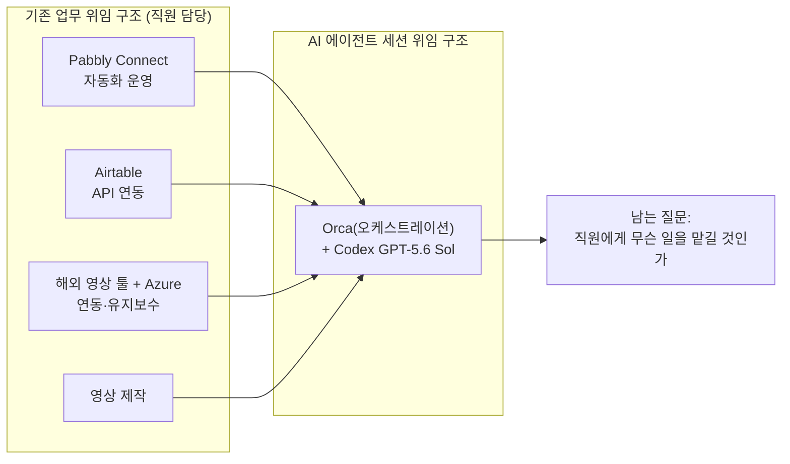
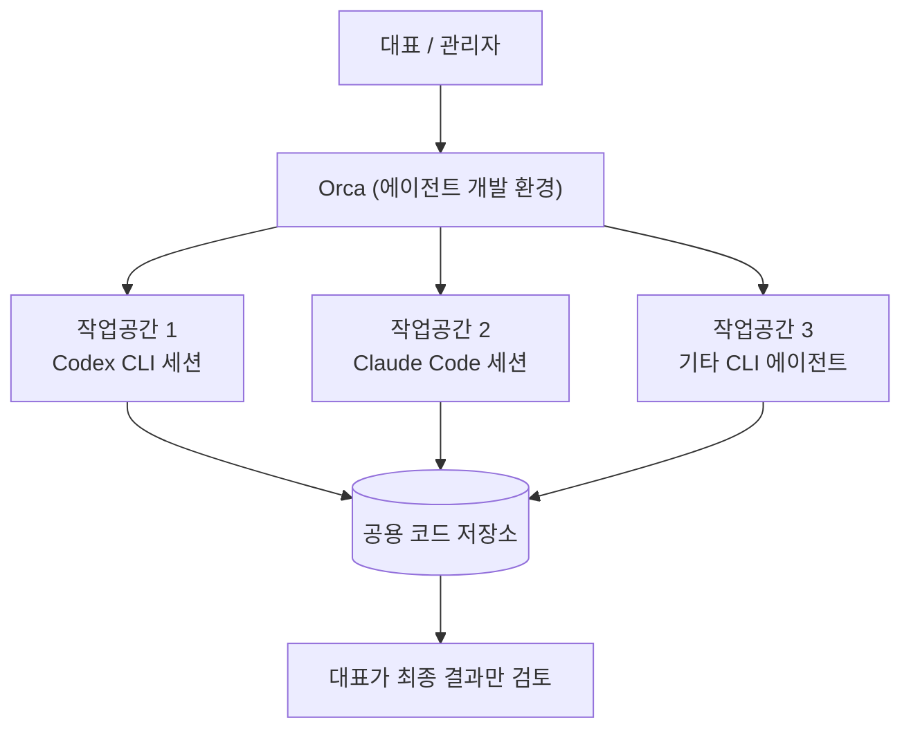

## 목차

1. 들어가며
2. 원문 게시물의 서술형 재구성
3. 언급된 도구들 심층 해설
   - 3.1 Pabbly Connect — 인도발 노코드 자동화 플랫폼
   - 3.2 Airtable — API 기반 협업 데이터베이스
   - 3.3 Orca — 여러 코딩 에이전트를 지휘하는 오케스트레이션 환경
   - 3.4 Codex CLI와 GPT-5.6 (Sol·Terra·Luna) — OpenAI의 에이전틱 코딩 도구
   - 3.5 Aside — "유료 결제"가 가리켰을 가능성이 있는 AI 브라우저
4. "직원에게 시킬 일이 없다"는 문장이 가리키는 구조 변화
5. 소수 정예 팀 담론과 산업 데이터로 보는 맥락
6. 출처 투명성 표
7. 정리하며
참고문헌

---

## 1. 들어가며

이 문서는 사용자가 공유한 Threads 게시물 한 편을 원문으로 삼아, 그 안에 등장하는 도구와 개념들을 웹 검색을 통해 확인하고, 이 게시물이 놓여 있는 더 넓은 산업적 맥락까지 함께 정리한 자료다. 원문은 자동화 링크(threads.com/share/BAL1ekbRZp) 형태로 전달되었으나, Threads는 로봇 접근을 차단하는 정책을 쓰고 있어 자동으로 열람할 수 없었다. 따라서 이 문서는 게시물의 원문 텍스트로 함께 전달된 내용을 1차 자료로 삼아 작성되었으며, 원문 자체에 대한 해석은 게시물에 실제로 적힌 문장에 근거하고, 그 안에 등장하는 고유명사(Pabbly, Airtable, Orca, Codex, Aside)에 대해서는 별도로 웹 검색을 진행해 사실관계를 확인했다.

게시물의 핵심은 한 문장으로 요약된다. "직원에게 시킬 일이 없다." 특정 업무 영역(자동화 툴 운영, API 연동, 해외 협업 툴 유지보수, 영상 제작)을 담당하던 직원의 역할을, AI 코딩 에이전트 조합이 대신 처리하게 되면서 생긴 조직 운영상의 고민을 적은 글이다. 아래에서는 이 상황을 하나씩 풀어서 설명한다.

---

## 2. 원문 게시물의 서술형 재구성

게시물을 쓴 사람은 자신의 조직에서 벌어지고 있는 변화를 다섯 개의 장면으로 나누어 기록했다. 첫 번째 장면은 Pabbly라는 자동화 프로그램이다. 이 프로그램은 인도에서 만들어진 것이라 국내에서 다룰 줄 아는 사람이 거의 없었고, 그래서 이 업무는 직원 한 명이 전담해서 처리해 왔다. 그런데 이제는 Orca와 Codex를 조합해서 쓰면 이 업무를 사람 없이도 끝낼 수 있게 되었다고 적었다.

두 번째 장면은 Airtable이다. 이 역시 API 연동이 핵심인 업무였는데, 마찬가지로 Orca와 Codex 조합으로 처리가 끝났다고 밝혔다.

세 번째 장면은 해외 영상 관련 툴과 Azure를 연동해서 쓰던 업무다. 이 조합도 국내에서 다룰 줄 아는 사람이 없어서, 원래 해외 개발자가 맡아서 처리하던 일이었다. 그런데 이 업무마저 Codex의 최신 버전(글쓴이는 이를 "codex 5.6 sol"이라고 표기했다)으로 대체되었고, 대체에 그치지 않고 유지보수까지 전부 이 조합으로 넘어갔다고 적었다.

네 번째 장면은 영상 제작 자체다. 이 역시 Codex로 다 끝났다고 짧게 언급했다.

이 네 가지 사례를 나열한 뒤, 글쓴이는 조직 운영자로서의 고민을 털어놓는다. 이제 직원 몇 명에게 맡길 일이 마땅히 없는데, 그렇다고 일을 안 줄 수도 없는 상황이라는 것이다. 그리고 이어서 매우 직설적인 비교를 한다. Orca에 세션을 만들어서 그 세션에 일을 주고받는 편이, 사람에게 일을 맡기는 것보다 훨씬 빠르다는 것이다. 그 이유로 사람은 응답에 시간이 걸리고(딜레이), 휴일도 있다는 점을 든다.

마지막으로 글쓴이는 자신의 다음 계획을 적었다. "aside"라는 것을 유료로 결제해서 생산성을 더 높이고, 이제는 자기 자신이 하는 일마저 AI로 대체해보겠다는 것이다. 그리고 글의 결론으로 "이제 소수의 팀으로 이루어진 회사가 득세하지 않을까"라는 전망을 덧붙였다.

이 흐름을 도식으로 정리하면 다음과 같다.

---

## 3. 언급된 도구들 심층 해설

### 3.1 Pabbly Connect — 인도발 노코드 자동화 플랫폼

Pabbly Connect는 서로 다른 웹 서비스들 사이에서 트리거(특정 이벤트 발생)와 액션(뒤이어 실행할 작업)을 연결해, 코드를 작성하지 않고도 반복 업무를 자동화하는 플랫폼이다. Zapier나 Make 같은 서비스와 같은 범주에 속하며, 여러 애플리케이션을 연결해 리드 관리, 이메일 발송, 스프레드시트 갱신 같은 업무를 자동으로 처리하도록 설계되어 있다[1][2]. 폼 작성, 이메일 마케팅, 결제 청구 등 부가 기능도 함께 제공하는 종합 자동화 스위트로 운영되고 있다[3]. 조건부 로직(If/Else)이나 반복 처리, 자체 코드 실행 단계까지 지원해 상당히 복잡한 업무 흐름도 구성할 수 있다는 점이 특징으로 소개된다[4].

이 회사는 실제로 인도 마디아프라데시주 보팔(Bhopal)에 본사를 둔 회사로, 2017년 네라지 아가르왈(Neeraj Agarwal)과 판카지 아가르왈(Pankaj Agarwal)이 공동 창업했다[5]. 즉 원문 게시물의 "인도 프로그램이니.."라는 표현은 실제 사실관계와 일치한다. 국내에 도입 사례나 한글 자료가 상대적으로 적다 보니, 실무에서 이 툴의 트리거-액션 구조와 오류 처리 방식을 능숙하게 다루려면 별도의 학습 시간이 필요했을 것으로 보이며, 이 부분을 담당 직원 한 명이 전담해 온 것으로 읽힌다.

### 3.2 Airtable — API 기반 협업 데이터베이스

Airtable은 스프레드시트처럼 보이지만 실제로는 관계형 데이터베이스에 가까운 구조를 가진 협업 도구다. 하나의 "베이스(Base)" 아래 여러 개의 "테이블(Table)"을 두고, 테이블 간에 관계를 연결해 데이터를 구조화할 수 있다[6]. 웹 화면에서 직접 데이터를 입력·수정할 수 있을 뿐 아니라, 자체 자동화 엔진과 REST API, 인터페이스 디자이너를 함께 제공해 백엔드 코드를 작성하지 않고도 가벼운 사내 도구를 만들 수 있다는 점이 강점으로 꼽힌다[7][8]. 다만 UI상에서는 단순해 보이는 자동화도 막상 안정적으로 구성하려면 필드 명명 규칙이나 테이블 관계 설계 같은 기술적인 정리가 필요하다는 지적도 있다[9].

원문에서 "이것도 api 관련"이라고 짧게 언급한 부분은, Airtable을 다른 서비스와 연동할 때 Airtable API(또는 PyAirtable 같은 래퍼 라이브러리)를 통해 데이터를 조회·추가·수정하는 개발 작업을 가리키는 것으로 보인다[10]. 이런 API 연동 스크립트를 직접 짜고 유지보수하는 일은 코딩 지식이 필요한 영역이라, 마찬가지로 담당 직원이 있었던 것으로 추정된다.

### 3.3 Orca — 여러 코딩 에이전트를 지휘하는 오케스트레이션 환경

Orca는 Stably AI(Y Combinator W22 배치 출신)가 만든 오픈소스 "에이전트 개발 환경(ADE, Agent Development Environment)"으로, MIT 라이선스로 공개되어 있다[11]. 이 도구의 핵심 개념은 한 가지다. Claude Code, Codex, Cursor CLI, Gemini, OpenCode 등 이미 존재하는 여러 CLI(터미널) 기반 코딩 에이전트를, 각각 독립된 깃 워크트리(Git worktree) 위에서 동시에 실행할 수 있게 해준다[12][13]. 즉 Orca 자체가 별도의 AI 모델을 갖고 있는 것이 아니라, 사용자가 이미 구독하고 있는 Claude Code나 Codex 같은 에이전트들을 "지휘하는 사령부" 역할을 한다. 40종이 넘는 CLI 에이전트를 지원하며, 작업마다 별도의 브랜치와 작업공간을 자동으로 만들어 여러 작업이 서로 코드를 덮어쓰지 않도록 격리하는 구조다[14].

실제로 같은 문제를 여러 에이전트에 동시에 맡겨 놓고 그중 가장 나은 결과를 채택하는 식의 사용법도 소개되어 있으며, 데스크톱 앱과 모바일 동행 앱, 헤드리스 리눅스 서버용 실행 방식까지 지원한다[15][16]. 다만 이 도구는 아직 비교적 최근에 나온 빠르게 발전 중인 프로젝트이고, 검토 기사들에서는 윈도우 환경의 미해결 보안 이슈가 언급되며 민감한 저장소에는 권한을 최소화해서 시범 도입할 것을 권고하고 있다[17].

원문에서 "orca, codex 조합으로 다 해냄"이라는 표현은, Orca라는 관제탑 위에 Codex라는 실행 엔진을 얹어서 자동화·API 연동 업무를 처리했다는 뜻으로 읽힌다. 이 구조를 도식으로 표현하면 다음과 같다.

### 3.4 Codex CLI와 GPT-5.6 (Sol·Terra·Luna) — OpenAI의 에이전틱 코딩 도구

원문에 등장하는 "codex 5.6 sol"이라는 표현은 정확히 말하면 두 가지가 합쳐진 것이다. "Codex CLI"는 터미널에서 실행하는 OpenAI의 에이전틱 코딩 도구 자체를 가리키는 이름이고, "GPT-5.6"은 그 안에서 돌아가는 모델의 이름이다. 실제로 한 국내 해설 자료는 이 둘을 혼동하지 말아야 한다고 짚으며, "Codex 5.6"이라는 제품은 존재하지 않고 정확히는 코딩 도구 Codex에 새 모델 GPT-5.6이 탑재된 것이라고 설명한다[18].

GPT-5.6은 단일 모델이 아니라 세 가지 등급으로 나뉘어 제공된다. Sol은 어렵고 규모가 큰 작업에 적합한 최고 성능 등급이고, Terra는 일상적인 실무에 두루 쓰이는 범용 등급, Luna는 명확하고 반복적인 작업을 빠르고 저렴하게 처리하는 경량 등급이다. 세 등급 모두 105만 토큰 수준의 컨텍스트 창을 제공한다고 안내되어 있다[18]. 다만 Codex CLI 공식 변경 이력에서는 Sol·Terra·Luna의 컨텍스트 창이 27만 2천 토큰으로 수정·정정된 바 있어, 등급별 구체적 수치는 시점에 따라 다르게 안내될 수 있다는 점도 함께 밝혀둔다[19].

Codex CLI는 단순한 코드 자동완성 도구를 넘어, 파일을 직접 열람하고 수정하며 사용자의 컴퓨터에 이미 설치된 도구를 실행하는 에이전트형 도구로 소개된다[20]. 2026년 8월 기준 최신 안정 버전에서는 여러 작업을 대시보드에서 검색·시작·이름변경·중지할 수 있는 기능, 세션을 포크(분기)해서 다른 방향으로 이어가는 기능, 실행 비용을 실시간으로 확인하는 기능 등이 정식으로 추가되었다[21]. 이런 기능들은 하나의 작업을 오래, 그리고 여러 갈래로 위임해 놓고 나중에 결과만 검토하는 사용 패턴을 뒷받침한다. 원문에서 "유지보수까지 다 끝"이라고 표현한 부분은, 이런 지속적인 세션 관리·재실행 기능을 활용해 초기 구축뿐 아니라 이후의 버그 수정이나 기능 추가까지 에이전트에게 맡겼다는 의미로 해석할 수 있다.

### 3.5 Aside — "유료 결제"가 가리켰을 가능성이 있는 AI 브라우저

원문 마지막 부분의 "aside 유료 결제해서 생산성을 더 높이고"라는 문장에서 "aside"가 정확히 무엇을 가리키는지는 원문만으로는 단정할 수 없다. 다만 문맥(생산성 도구, 유료 결제, 자신의 업무를 AI로 대체하려는 계획)과 함께 최근 등장한 동명의 제품을 살펴보면, 2026년 6월 하순 공개된 "Aside"라는 AI 브라우저일 가능성이 높아 보인다. 이 부분은 확정된 사실이 아니라 정황에 근거한 추정이라는 점을 먼저 밝혀둔다.

Aside는 샌프란시스코의 3인 팀 Aside Computer Inc.가 만든 제품으로, Y Combinator 2025년 가을(F25) 배치 출신이며, 이미 로그인되어 있는 웹사이트 위에서 실제 클릭과 입력을 대신 수행하는 "에이전틱 브라우저"로 소개된다[22]. 이 제품은 자체 AI 모델을 갖추는 대신 사용자가 이미 구독 중인 ChatGPT나 Claude, 또는 API 키를 연결해서 쓰는 이른바 "브링유어오운모델(BYOM)" 방식을 택하고 있다[23]. 로컬(내 컴퓨터에서 실행)과 클라우드(Aside 서버에서 실행) 중 실행 위치를 선택할 수 있고, 결제나 게시물 작성 같은 민감한 행동은 사용자 승인을 거치도록 설계되었다고 홍보하고 있다[24]. 2026년 8월 기준으로도 공식 가격표는 아직 공개되지 않았으며, 프라이버시 정책에 유료 요금제와 사용량 크레딧에 대한 언급이 있어 유료 등급이 준비되고 있는 단계로 파악된다[25]. 애플 앱스토어에는 이름이 같은 음성 메모 앱도 별도로 존재하지만, 개발사가 다르고 원문의 맥락(생산성·업무 대체)과는 부합하지 않아 이 문서에서는 별개의 제품으로 취급한다[26].

이 항목은 위에서 설명한 Pabbly·Airtable·Orca·Codex보다 훨씬 확실성이 낮다는 점을 다시 한번 강조한다. 글쓴이가 실제로 이 AI 브라우저를 지칭한 것인지, 혹은 전혀 다른 도구나 서비스를 줄여서 부른 것인지는 원문 게시물만으로는 확인할 수 없다.

---

## 4. "직원에게 시킬 일이 없다"는 문장이 가리키는 구조 변화

이 게시물이 흥미로운 지점은 단순히 "AI가 좋다"는 감상이 아니라, 조직 운영자의 입장에서 벌어지는 아주 구체적인 딜레마를 기록했다는 데 있다. 정리하면 세 가지 변화가 겹쳐 있다.

첫째, 희소 전문성을 요구하던 업무가 사라지고 있다. Pabbly나 해외 영상 툴+Azure 연동처럼 "국내에서 다룰 줄 아는 사람이 없다"는 이유로 특정 직원이나 해외 개발자에게 의존해야 했던 업무들이, 이제는 그 툴의 문서와 API 스펙을 스스로 읽고 코드를 작성할 수 있는 에이전트에게 맡겨지고 있다. 특정 개인의 희소한 지식에 의존하던 업무가, 에이전트가 문서를 읽고 실행하는 능력으로 대체되는 흐름이다.

둘째, 위임의 단위가 "사람"에서 "세션"으로 바뀌고 있다. 원문에서 가장 직접적으로 드러나는 문장은 "orca에게 세션을 만들어서, 그 세션에 일 주고 받는게 훨씬 빠르다"는 부분이다. 사람에게 일을 맡기면 그 사람의 근무 시간, 회신 속도, 휴일 여부에 맞춰 진행 속도가 결정되지만, 에이전트 세션은 그런 제약 없이 곧바로 작업을 시작하고 결과를 내놓는다는 것이 글쓴이가 체감한 차이다. 이는 앞서 3.3절에서 설명한 Orca의 워크트리 격리 구조, 그리고 3.4절에서 설명한 Codex의 세션 포크·재개 기능이 실제로 뒷받침하는 사용 경험이라고 볼 수 있다.

셋째, 대체의 범위가 직원에서 관리자 자신에게로 확장되고 있다. 글의 마지막 문장, 즉 "aside 유료 결제해서... 내가 하는 일 마저 대체시켜봐야겠다"는 부분은 이 변화가 실무 하위 업무에 그치지 않고, 대표 본인이 하던 의사결정이나 반복적 관리 업무로도 번지고 있음을 보여준다.

---

## 5. 소수 정예 팀 담론과 산업 데이터로 보는 맥락

원문의 마지막 결론, "이제 소수의 팀으로 이루어진 회사가 득세하지 않을까"라는 전망은 2026년 상반기 이후 국내외에서 반복적으로 제기되는 주장과 맞닿아 있다. 다만 아래 내용은 원문 게시물과는 별개로, 이 주장이 놓인 산업적 맥락을 보여주기 위해 추가로 조사한 자료이며, 원문 작성자의 발언이 아니라는 점을 분명히 해둔다.

국내 스타트업 생태계를 다루는 한 브런치 글에서는 "내 팀은 4명이지만, 실제로는 20명 규모로 일한다"고 말한 한 창업자의 사례를 소개하며, 그 차이를 메우는 "추가 인력"이 모두 AI 에이전트라고 서술한다[27]. 이는 원문 게시물의 정서와 상당히 유사한 사례로, 소규모 인원이 에이전트를 동원해 대규모 조직에 준하는 산출물을 내는 흐름이 여러 곳에서 관찰되고 있음을 시사한다.

산업 전반의 통계도 비슷한 방향을 가리킨다. 한 분석 기사는 마이크로소프트의 사티아 나델라 CEO가 실적 발표에서 MS 내부 코드의 상당 부분이 AI 지원으로 작성되고 있다고 밝혔다는 점을 인용하며, 이를 대규모 개발팀 대신 소수의 핵심 인력과 AI가 협업하는 구조로의 전환으로 해석한다[28]. 같은 기사는 실시간 해고 추적 사이트의 자료를 인용해, 최근 1년간 미국 테크 업계에서 십만 명대의 인력이 감원되었다는 수치를 전하며, 이 흐름을 단순한 경기 침체가 아니라 AI 중심의 조직 재편으로 봐야 한다는 시각을 제시한다[28].

국내 노동시장을 다룬 한 산업 리포트는 2026년 1월 기준 한국 노동시장이 AI 도입 단계를 지나 AI 에이전트가 조직 내 핵심 업무 프로세스에 실질적으로 침투하는 "확산기"에 접어들었다고 진단하며, 최근 3년간 청년층 일자리가 상당수 줄어들었다는 통계를 함께 제시한다[29]. 반면 중소기업을 대상으로 한 다른 리포트는 AI 에이전트 도입이 반드시 인력 감축으로 직결되기보다, 같은 인원으로 더 많은 업무를 처리하거나 신입 직원의 온보딩 시간을 단축하는 등 생산성 향상 쪽에 방점을 찍는 사례도 함께 소개하고 있어, 이 흐름을 "무조건적 인력 대체"로만 단순화하기는 어렵다는 점도 균형 있게 짚어둘 필요가 있다[30]. 실제로 AI 도입에 신중한 태도를 보이며 오히려 인력을 늘리기로 한 기업 사례를 다룬 보도도 존재한다[31].

이런 자료들을 종합하면, 원문 게시물이 보여주는 개인 사업장 단위의 경험담은 2026년 현재 업계 전반에서 관찰되는 "소수 정예화" 흐름의 한 사례로 위치지을 수 있다. 다만 이것이 모든 조직·업종에 동일한 강도로 적용되는 보편 법칙인지, 아니면 자동화·API 연동·영상 제작처럼 비교적 정형화된 반복 업무에 특히 두드러지는 현상인지는 이 문서의 조사 범위를 넘어서는 질문이며, 추가적인 산업별 데이터가 필요한 영역이다.

---

## 6. 출처 투명성 표

| 구분 | 내용 |
| --- | --- |
| 확인된 사실 (2차 자료로 교차 검증됨) | Pabbly가 인도 보팔에 본사를 둔 회사이며 2017년 네라지·판카지 아가르왈 형제가 창업한 자동화 플랫폼이라는 점 / Orca가 Stably AI가 만든 오픈소스 에이전트 개발 환경으로 여러 CLI 코딩 에이전트를 워크트리 단위로 동시 실행한다는 점 / Codex CLI가 GPT-5.6 모델(Sol·Terra·Luna 세 등급)을 탑재하고 있으며 "Codex 5.6"이라는 별도 제품명은 존재하지 않는다는 점 / Airtable이 관계형 데이터베이스 구조와 자체 자동화·API 기능을 제공하는 협업 도구라는 점 |
| 단일 출처 주장 (교차 검증이 제한적이거나 특정 매체 한 곳에서만 확인됨) | GPT-5.6 세 등급의 컨텍스트 창 크기(자료에 따라 105만 토큰 또는 27만 2천 토큰으로 다르게 안내됨) / Orca의 윈도우 환경 보안 이슈 관련 경고 / Aside의 벤치마크 성적(자체 보고 수치로, 제3자 재현 검증은 아직 이루어지지 않음) |
| 해석·추정 (원문에 명시되지 않아 문맥으로 추론한 부분) | 원문의 "aside"가 2026년 6월 공개된 AI 브라우저 Aside를 가리킨다는 판단 — 원문에는 이를 확정할 근거가 없으며, 문맥상 가장 유력한 후보로 제시한 것일 뿐임 / "codex 5.6 sol"이라는 표현을 Codex CLI + GPT-5.6 Sol 등급의 조합으로 해석한 것 |
| 원문 게시물에 근거한 서술 (검증 대상이 아닌, 글쓴이 본인의 경험담) | Pabbly·Airtable·해외 영상 툴 연동·영상 제작 업무를 Orca와 Codex 조합으로 대체했다는 서술 / 직원보다 에이전트 세션에 업무를 위임하는 것이 더 빠르다고 느꼈다는 서술 / 소수 정예 팀 시대가 오리라는 글쓴이의 전망 |

---

## 7. 정리하며

이 게시물은 거창한 산업 전망 리포트가 아니라, 실제로 자동화 툴과 API 연동, 영상 제작 업무를 운영해 온 한 사업 운영자가 짧은 기간 안에 자기 조직의 인력 배치를 다시 고민하게 된 경험을 담은 기록이다. 그 배경에는 Orca라는 다중 에이전트 오케스트레이션 환경과, GPT-5.6 모델을 탑재한 Codex CLI라는 구체적인 도구 조합이 있으며, 이 두 도구는 실제로 여러 CLI 코딩 에이전트를 격리된 작업공간에서 동시에 실행하고, 세션을 포크·재개하며 장시간 작업을 위임할 수 있는 기능을 갖추고 있다는 점이 공식 문서와 여러 리뷰를 통해 확인된다. 다만 "aside"가 정확히 어떤 도구를 가리키는지처럼 원문만으로 확정할 수 없는 부분도 있으며, 이 문서에서는 그런 지점을 추정으로 명확히 구분해 표기했다.

더 넓게 보면, 이 글이 던지는 "소수 정예 팀이 득세할 것"이라는 전망은 2026년 현재 국내외에서 반복적으로 제기되는 담론과 궤를 같이한다. 다만 이 흐름이 모든 업종·조직에 동일하게 적용될 보편 법칙인지, 아니면 정형화된 반복 업무에 국한된 현상인지는 앞으로도 계속 지켜봐야 할 질문으로 남는다.

---

## 참고문헌

[1] Pabbly, "Welcome to Pabbly Connect: Your Guide to Automation", https://www.pabbly.com/welcome-to-pabbly-connect-your-guide-to-automation/

[2] Wati, "Pabbly Connect | Automate Your Workflow Seamlessly", https://www.wati.io/pabbly-connect/

[3] Pabbly, "Create Multi-Step Automation Workflows with Pabbly Connect", https://www.pabbly.com/create-multi-step-automation-workflows-with-pabbly-connect/

[4] Pabbly, "Pabbly Connect - Automate All Your Integrations & Task", https://www.pabbly.com/connect/

[5] Tracxn, "Pabbly - 2026 Company Profile, Team, Competitors & Financials", https://tracxn.com/d/companies/pabbly/

[6] 테디노트, "에어테이블(airtable)의 table 조회, 추가, 업데이트, 삭제 Python API", https://teddylee777.github.io/python/airtable-python/

[7] ClickUp, "2026년 Airtable 프로젝트 관리 리뷰", https://clickup.com/blog/airtable-review/

[8] Lark Suite, "에어테이블 리뷰: 가격, 프로, 단점 및 대안", https://www.larksuite.com/ko_kr/blog/airtable-review

[9] ClickUp, 위 자료 동일

[10] 테디노트, 위 자료 동일

[11] GitHub - stablyai/orca, https://github.com/stablyai/orca

[12] Orca Docs, "What is Orca?", https://www.onorca.dev/docs

[13] daily.dev, "Orca: This Open Agent Orchestrator", https://daily.dev/posts/orca-you-re-missing-out-this-open-agent-orchestrator-is-crazy--qkygbkr0c

[14] AgentConn, "Orca - AI Agent Review", https://agentconn.com/agents/orca/

[15] onorca.dev, "Orca — The most powerful Agent Development Environment", https://www.onorca.dev/

[16] AgentConn, 위 자료 동일

[17] vibecodinghub.org, "Orca Review - MIT-licensed agent development environment", https://vibecodinghub.org/tools/orca

[18] Quantum Jump Club, "codex 5.6 업데이트! 각 모델의 차이와 사용 방법", https://qjc.app/en/blog/codex-5-6-update-guide

[19] Releasebot, "Codex Updates by OpenAI - August 2026", https://releasebot.io/updates/openai/codex

[20] OpenAI Developers, "Codex CLI", https://developers.openai.com/codex/cli

[21] Releasebot, 위 자료 동일

[22] BitsAndBucks, "Aside: The AI Browser That Actually Gets Work Done", https://bitsandbucks.de/blog/en/aside-ai-browser.html

[23] eesel AI, "Aside AI browser explained: what it is and how it works (2026)", https://www.eesel.ai/blog/aside-ai-browser

[24] eesel AI, "Aside AI browser review (2026): strengths, benchmarks, verdict", https://www.eesel.ai/blog/aside-ai-browser-review

[25] eesel AI, "Aside AI browser pricing (2026): the real cost explained", https://www.eesel.ai/blog/aside-ai-browser-pricing

[26] Apple App Store, "Aside - Voice Notes AI", https://apps.apple.com/us/app/aside-voice-notes-ai/id6758001568

[27] 브런치, "20화 2026년은 AI 에이전트 시작의 해", https://brunch.co.kr/@wineservice/464

[28] 언폴드, "AI 에이전트, 소프트웨어의 가격표를 바꾸다", https://blog.igisam.com/ai-agent-pricing-model/

[29] Korea Business Review, "AI 에이전트(AI Agent)의 확산과 일자리 지각변동", https://www.koreabizreview.com/articles/kbr-legacy-7527

[30] Windyflo, "2026년 중소기업 AI 에이전트 트렌드 가이드", https://blog.windyflo.com/blog/sme-ai-agent-trend-2026/

[31] Radio Seoul, "AI 대신, 사람을 더 뽑기로 한 AI 기업", https://www.radioseoul1650.com/archives/140276
