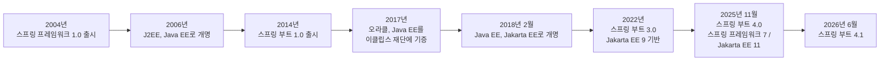
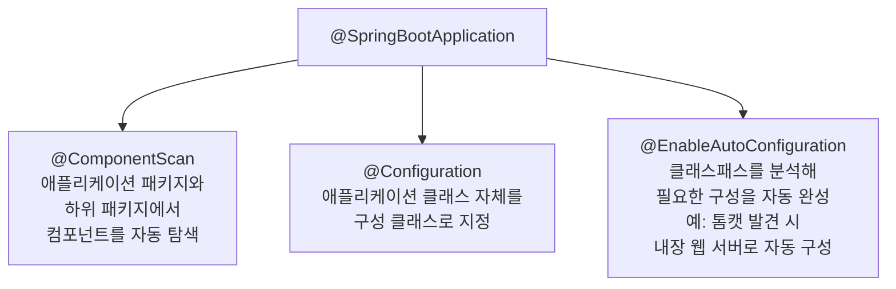
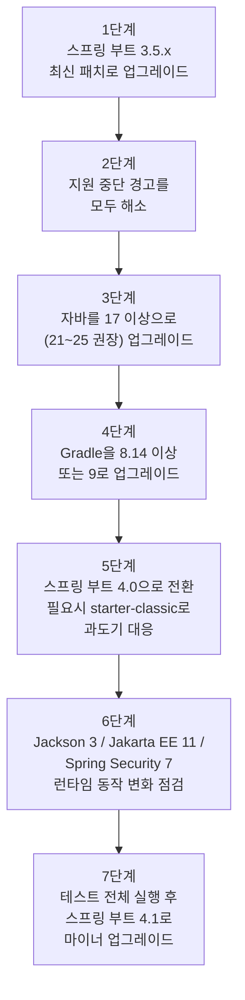

## 목차

1. 들어가며
2. 스프링 부트가 태어나기까지: J2EE의 악몽과 스프링 프레임워크
3. 이름이 세 번 바뀐 표준: J2EE에서 Java EE, 그리고 Jakarta EE로
4. '구성보다 관습'이라는 설계 철학
5. 팻(fat) JAR: 배포 방식의 발상 전환
6. @SpringBootApplication 애너테이션 속 세 가지 마법
7. 컴포넌트 스캔의 동작 원리
8. 자바 기반 구성: XML에서 애너테이션으로
9. 스프링 부트 3.0이 가져온 근본적 변화
10. 스프링 부트 3.1~3.5: 마이너 버전에 쌓인 실전 개선
11. 스프링 부트 3.x의 마지막 장: 구조화된 로깅과 예고된 퇴장
12. 스프링 부트 4.0: 새로운 세대의 시작 (2025년 11월)
13. 스프링 부트 4.0에서 실제로 깨지는 것들
14. 스프링 부트 4.1: 4.0 위에 쌓은 첫 번째 진화 (2026년 6월)
15. 3.x에서 4.x로: 언제, 어떻게 넘어가야 하는가
16. 지금 이 시점의 지원 현황과 선택
17. 마치며
18. 출처 및 참고자료
19. 정보 출처 투명성

---

## 1. 들어가며

이 문서는 마그누스 라르손(Magnus Larsson)이 쓴 『마이크로서비스 with 스프링 부트 3 & 스프링 클라우드』(위키북스, 4판, 2025)의 2장 "스프링 부트 소개" 앞부분을 바탕으로, 스프링 부트가 어떤 배경에서 태어났는지, 어떤 철학으로 설계됐는지, 그리고 3.0부터 3.5까지 각 버전이 무엇을 새로 가져왔는지를 풀어서 설명한다. 여기에 더해 원문 자료에는 없는 스프링 부트 4.0과 4.1의 최신 정보를 웹 검색을 통해 별도로 조사하고 교차 검증하여 추가했다. 책이 쓰인 시점에는 스프링 부트 4.0이 아직 출시되지 않아 "예정"으로만 언급되었지만, 실제로는 2025년 11월 20일에 정식 출시되었고 2026년 6월 10일에는 첫 마이너 버전인 4.1이 나왔다. 이 문서를 쓰는 현재 시점(2026년 8월)을 기준으로 가장 최근 패치는 4.1.1이다.

스프링 부트를 처음 접하는 사람이라면 "왜 이렇게 설정이 간단하지?"라는 인상을 받게 되는데, 그 간단함 뒤에는 20년 가까운 자바 엔터프라이즈 생태계의 시행착오가 쌓여 있다. 그 역사를 이해하면 스프링 부트가 왜 지금과 같은 모습을 하고 있는지, 그리고 4.0에서 왜 그렇게 큰 폭의 변화가 필요했는지도 자연스럽게 이해된다.

---

## 2. 스프링 부트가 태어나기까지: J2EE의 악몽과 스프링 프레임워크

스프링 부트를 이해하려면 먼저 스프링 프레임워크부터 짚어야 한다. 스프링 부트는 독립적인 신기술이 아니라 스프링 프레임워크 위에 얹힌 얇은 편의 계층이기 때문이다. 스프링 프레임워크는 2004년에 1.0 버전이 출시되었는데, 당시 자바 엔터프라이즈 개발자들이 가장 크게 불만을 가지던 대상은 J2EE(Java 2 Platform, Enterprise Edition)라는 표준이었다. J2EE는 애플리케이션을 배포할 때 배포 설명자(deployment descriptor)라는 무겁고 장황한 XML 파일을 요구했는데, 이 설명자에는 표준화된 방식으로 구성을 기술하는 표준 배포 설명자와, 각 애플리케이션 서버 공급업체가 자기 서버의 고유 기능에 맞춰 별도로 요구하는 공급업체별 배포 설명자라는 두 종류가 동시에 존재했다. 즉 개발자는 표준을 따르는 것만으로는 부족했고, 실제로 배포할 웹로직이나 웹스피어 같은 특정 서버의 방언까지 익혀야 하는 이중고를 겪었다.

스프링 프레임워크는 바로 이 문제를 정면으로 겨냥해 등장했다. 의존성 주입(dependency injection)이라는 개념을 도입해 J2EE의 표준 배포 설명자보다 훨씬 가벼운 XML 구성 파일만으로 애플리케이션을 조립할 수 있게 만든 것이다. 이는 당시로서는 획기적인 변화였고, 스프링 프레임워크가 급속히 인기를 얻는 계기가 되었다.

문제는 여기서 다시 시작되었다. 스프링 프레임워크가 널리 쓰이면서 기능이 계속 늘어났고, 한때는 "가볍다"고 평가받던 XML 구성 파일 자체가 점점 방대해지고 관리하기 어려워졌다. J2EE의 무거움을 벗어나기 위해 도입한 도구가 시간이 지나며 또 다른 형태의 무거움이 되어버린 셈이다. 이 두 번째 문제를 해결하기 위해 2014년에 등장한 것이 바로 스프링 부트 1.0이다.

아래 그림은 지금까지 설명한 흐름을 포함해 이 문서 전체에서 다룰 스프링 부트의 역사를 한눈에 정리한 것이다.



---

## 3. 이름이 세 번 바뀐 표준: J2EE에서 Java EE, 그리고 Jakarta EE로

스프링 부트의 역사를 따라가다 보면 반드시 마주치는 것이 자바 엔터프라이즈 표준의 이름이 계속 바뀌어 온 사연이다. 2006년에 J2EE는 Java EE(Java Platform, Enterprise Edition)로 이름이 바뀌었다. 그리고 2017년에는 오라클이 Java EE의 관리 권한을 이클립스 재단에 넘겼고, 그 결과 2018년 2월에 Java EE는 다시 Jakarta EE라는 이름으로 바뀌었다.

이 이름 변경은 단순한 브랜딩 문제가 아니었다. 상표권 문제로 인해 오라클이 소유한 "javax"라는 자바 패키지 이름을 이클립스 재단이 그대로 사용할 수 없었기 때문에, Jakarta EE로 넘어가면서 표준에서 정의하는 자바 패키지 이름 자체가 바뀌게 되었다. 이는 훗날 스프링 부트 2에서 3으로 넘어갈 때 개발자들이 코드 전체에서 `javax.*` 임포트를 `jakarta.*`로 일일이 바꿔야 했던 대규모 마이그레이션의 근본 원인이 된다. 뒤에서 살펴보겠지만, 스프링 부트 4.0은 이 네임스페이스를 다시 바꾸지는 않는다. Jakarta EE 11은 Jakarta EE 10 위에 완전히 추가적으로(additive) 얹히는 형태이기 때문에, 서블릿 6.1이나 JPA 3.2 같은 API 버전만 올라갈 뿐 패키지 이름을 또 바꿀 필요는 없다.

---

## 4. '구성보다 관습'이라는 설계 철학

스프링 부트는 스프링 프레임워크의 핵심 모듈과, 로깅이나 데이터베이스 연결에 쓰이는 서드파티 라이브러리를 설정하는 방식에 대해 독자적인 기본값을 제공함으로써 프로덕션에 곧바로 투입할 수 있는(production-ready) 애플리케이션을 빠르게 만드는 것을 목표로 한다. 이때 핵심이 되는 디자인 패턴이 '구성보다 관습(convention over configuration)'이다. 스프링 부트는 여러 관습을 기본으로 적용해 개발자가 직접 작성해야 하는 구성의 양을 최소화하고, 필요할 때만 그 관습을 재정의할 수 있도록 열어둔다.

구성이 정말 필요한 경우라면 XML보다는 자바 코드와 애너테이션으로 작성하는 것이 권장되는 방식이다. 스프링 부트가 도입되기 전보다는 XML 기반 구성의 비중이 크게 줄었지만, 완전히 사라진 것은 아니며 지금도 여전히 사용할 수 있다.

---

## 5. 팻(fat) JAR: 배포 방식의 발상 전환

'구성보다 관습'과 함께 스프링 부트를 스프링 프레임워크와 구분 짓는 또 하나의 큰 특징이 팻 JAR, 즉 독립 실행형 JAR 파일 기반의 런타임 모델을 기본으로 채택했다는 점이다. 스프링 부트가 나오기 전에는 아파치 톰캣 같은 별도의 Java EE 웹 서버에 WAR 파일을 배포하는 것이 스프링 애플리케이션을 실행하는 가장 흔한 방법이었다. WAR 파일 배포 방식은 지금도 스프링 부트에서 여전히 지원되지만, 스프링 부트는 그 대신 팻 JAR라는 새로운 모델을 선호한다.

팻 JAR에는 애플리케이션 자체의 클래스와 리소스뿐 아니라, 애플리케이션이 의존하는 모든 JAR 파일까지 통째로 포함된다. 다시 말해 애플리케이션을 실행하는 데 필요한 것은 이 팻 JAR 파일 하나뿐이며, 실행 환경으로 개별 JAR 파일과 의존성 목록을 따로 옮길 필요가 없다. 구동 방식도 단순해서, 별도로 설치된 Java EE 웹 서버 없이 `java -jar app.jar`라는 명령 한 줄로 애플리케이션을 띄울 수 있다. 이런 특성 덕분에 팻 JAR는 도커 컨테이너에서 실행하기에 특히 잘 맞는다. 예컨대 애플리케이션이 HTTP로 REST API를 노출하는 경우, 내장 웹 서버(임베디드 톰캣 등)까지 이 JAR 파일 하나에 함께 담긴다.

---

## 6. @SpringBootApplication 애너테이션 속 세 가지 마법

스프링 부트의 관습 기반 자동 구성 메커니즘은 애플리케이션 클래스, 즉 정적 `main` 메서드가 있는 클래스에 `@SpringBootApplication` 애너테이션 하나를 붙이는 것에서 시작한다.

```java
public class MyApplication {
  public static void main(String[] args) {
    SpringApplication.run(MyApplication.class, args);
  }
}
```

이 애너테이션 하나가 실제로는 세 가지 서로 다른 애너테이션을 합쳐놓은 것이다. 첫 번째는 컴포넌트 스캔을 활성화하는 역할로, 애플리케이션 클래스가 속한 패키지와 그 하위 패키지 전체에서 스프링 컴포넌트와 구성 클래스를 자동으로 찾아낸다. 두 번째는 애플리케이션 클래스 자체를 구성 클래스로 만드는 역할이다. 세 번째는 자동 구성(autoconfiguration)을 활성화하는 역할로, 스프링 부트가 클래스패스에 어떤 JAR 파일이 올라와 있는지를 살펴보고 그에 맞춰 자동으로 구성을 채워 넣는다. 예를 들어 클래스패스에 톰캣이 있으면 스프링 부트는 톰캣을 내장 웹 서버로 자동 구성해준다.

이 세 가지 역할을 그림으로 나타내면 다음과 같다.



---

## 7. 컴포넌트 스캔의 동작 원리

컴포넌트 스캔이 실제로 어떻게 동작하는지 예제로 살펴보자. 애플리케이션 클래스와 같은 패키지, 혹은 그 하위 패키지에 다음과 같은 컴포넌트가 있다고 가정한다.

```java
public class MyComponentImpl implements MyComponent { ... }
```

이 컴포넌트는 애플리케이션의 다른 컴포넌트에서 `@Autowired` 애너테이션을 통해 자동으로 주입받을 수 있다.

```java
public class AnotherComponent {

  private final MyComponent myComponent;

  @Autowired
  public AnotherComponent(MyComponent myComponent) {
    this.myComponent = myComponent;
  }
}
```

여기서 한 가지 주의할 점이 있다. 만약 애플리케이션 패키지 바깥에 선언된 컴포넌트, 예를 들어 여러 스프링 부트 애플리케이션이 공통으로 사용하는 유틸리티 컴포넌트를 가져다 쓰고 싶다면, 컴포넌트 스캔의 기본 범위가 애플리케이션 클래스의 패키지와 하위 패키지로 한정되어 있기 때문에 그 범위를 넓혀줘야 한다. 이때는 애플리케이션 클래스의 `@SpringBootApplication` 애너테이션을 `@ComponentScan` 애너테이션으로 보완하면 된다.

```java
package se.magnus.myapp;

public class MyApplication {
```

이렇게 하면 `se.magnus.util` 패키지에 있는 컴포넌트도 애플리케이션 코드에 자동 주입할 수 있게 된다. 예를 들어 다음과 같은 `MyUtility`라는 유틸리티 컴포넌트가 있다고 하자.

```java
package se.magnus.util;

public class MyUtility { ... }
```

이 컴포넌트는 다음과 같이 애플리케이션 컴포넌트에 자동 주입할 수 있다.

```java
package se.magnus.myapp.services;

public class AnotherComponent {
  private final MyUtility myUtility;

  @Autowired
  public AnotherComponent(MyUtility myUtility) {
    this.myUtility = myUtility;
  }
}
```

한 가지 실용적인 팁을 덧붙이자면, 클래스에 생성자가 단 하나만 정의되어 있는 경우에는 `@Autowired` 애너테이션이 굳이 필요하지 않다. 스프링이 생성자가 하나뿐이면 그것을 자동으로 주입 지점으로 인식하기 때문이다.

---

## 8. 자바 기반 구성: XML에서 애너테이션으로

스프링 부트의 기본 구성을 재정의하거나 새로운 구성을 직접 추가하고 싶을 때는 클래스에 `@Configuration` 애너테이션을 지정하면 된다. 이렇게 하면 앞서 설명한 컴포넌트 스캔 메커니즘에 의해 해당 클래스가 자동으로 선택된다.

예를 들어 HTTP 요청을 처리할 때 요청과 응답 메시지를 기록하는 로그 필터를 구성하고 싶다면 다음과 같이 작성할 수 있다.

```java
public class SubscriberApplication {
  @Bean
  public Filter logFilter() {
    CommonsRequestLoggingFilter filter = new CommonsRequestLoggingFilter();
    filter.setIncludeQueryString(true);
    filter.setIncludePayload(true);
    filter.setMaxPayloadLength(5120);
    return filter;
  }
}
```

구성을 반드시 별도의 클래스로 분리할 필요는 없다. 애플리케이션 클래스 자체에 구성을 직접 넣어도 되는데, 이는 `@SpringBootApplication` 애너테이션이 앞서 살펴봤듯 이미 `@Configuration` 애너테이션을 내포하고 있기 때문이다.

---

## 9. 스프링 부트 3.0이 가져온 근본적 변화

스프링 부트 3.0의 가장 중요한 새 기능은 크게 세 가지로 요약할 수 있다.

첫 번째는 관찰 가능성(observability)의 향상이다. 스프링 부트 3.0은 기존의 메트릭 및 로깅 지원 기능에 분산 추적 기능을 더함으로써 관찰 가능성을 한 단계 끌어올렸다. 이 새로운 분산 추적 기능은 스프링 프레임워크 6.0의 새로운 Observability API와, 마이크로미터 트레이싱(Micrometer Tracing)이라는 새로운 모듈을 기반으로 한다. 마이크로미터 트레이싱은 이전에 쓰이던 스프링 클라우드 슬루스(Spring Cloud Sleuth)를 대체하는 후속 기술이다.

두 번째는 네이티브 컴파일 지원이다. 스프링 부트 3.0부터는 GraalVM을 이용해 애플리케이션을 독립 실행형 실행 파일, 즉 네이티브 이미지로 컴파일할 수 있게 되었다. 네이티브 컴파일된 스프링 부트 애플리케이션은 일반적인 JVM 실행 방식보다 훨씬 빠르게 구동되고 메모리도 적게 소비한다.

세 번째는 가상 스레드(virtual thread)와 구조화된 동시성(structured concurrency)이다. OpenJDK의 프로젝트 룸(Project Loom)에서 개발된 가상 스레드는 프로젝트 리액터를 비롯한 다양한 스프링 컴포넌트에서 사용할 수 있는 경량 스레드다. 기존의 반응형 논블로킹 프로그래밍 모델과 비교했을 때, 가상 스레드는 동시성이 필요한 마이크로서비스를 훨씬 단순한 프로그래밍 모델로 개발할 수 있게 해준다는 기대를 받았다. 가상 스레드는 자바 21부터 정식으로 사용할 수 있다.

---

## 10. 스프링 부트 3.1~3.5: 마이너 버전에 쌓인 실전 개선

스프링 부트 3.0 이후 3.1부터 3.5까지 이어진 마이너 버전들에는 실무에서 체감할 수 있는 개선이 꾸준히 쌓였다.

스프링 부트 3.1에서는 Testcontainers 사용이 크게 간소화되었다. Testcontainers는 프로덕션 환경과 동일한 데이터베이스나 메시지 브로커를 컨테이너로 띄워 통합 테스트를 수행하게 해주는 도구인데, 그동안은 어떤 스프링 프로퍼티를 Testcontainers의 프로퍼티에 매핑해야 하는지 결정하는 일이 번거로웠다. 3.1에서 도입된 서비스 연결(Service Connection)이라는 개념은 여러 서비스에 대해 이 매핑을 자동으로 처리해준다. 같은 3.1 버전에서 SSL 번들이라는 개념도 새로 도입되었는데, 이는 SSL/TLS 보안 통신 구성을 서로 다른 라이브러리마다 제각각 설정해야 했던 복잡함을 줄이고 중앙에서 집중적으로 관리할 수 있게 해준다. 또한 3.1은 스프링 인가 서버(Spring Authorization Server)의 자동 구성을 지원함으로써 관련 의존성 선언을 간소화했다.

스프링 부트 3.2부터는 CRaC(Coordinated Restore at Checkpoint)를 사용해 구동 시간을 단축할 수 있게 되었다. 이는 학습 단계에서 한 번 구동된 자바 프로세스의 메모리를 디스크에 기록해두었다가, 나중에 그 메모리를 새로운 프로세스로 그대로 불러와 빠르게 재시작하는 방식이다. CRaC는 GraalVM 네이티브 컴파일보다 설정이 간단하다는 장점이 있지만, 모든 라이브러리가 이를 지원하는 것은 아니다. 예를 들어 몽고DB의 자바 클라이언트는 CRaC가 요구하는 일시정지 및 재개 기능을 아직 지원하지 않는다는 이슈가 있었다.

스프링 부트 3.3부터는 AppCDS를 이용한 빠른 시작이 도입되었다. AppCDS는 여러 JVM 인스턴스에서 전처리된 클래스 메타데이터를 공유할 수 있게 해주는 CDS(Class-Data Sharing)라는 JVM 기능을 애플리케이션 클래스와 서드파티 라이브러리까지 확장한 것이다. 다만 구동 시간 개선 폭은 최대 2배 정도로, GraalVM 네이티브 컴파일이 보여주는 10배에서 20배 수준의 개선에는 미치지 못한다.

---

## 11. 스프링 부트 3.x의 마지막 장: 구조화된 로깅과 예고된 퇴장

스프링 부트 3.4는 애플리케이션의 로그 출력을 엘라스틱서치 같은 검색 및 분석 엔진으로 손쉽게 수집할 수 있도록 구조화된 로깅을 지원했다. 이는 EFK(Elasticsearch, Fluentd, Kibana) 스택을 이용한 중앙 집중식 로깅 구성과 잘 맞물리는 기능이다. 같은 3.4 버전부터는 자바 24 지원도 추가되었다.

3.x 계열에서 특히 눈여겨봐야 할 대목은 3.1부터 3.5에 걸쳐 여러 클래스와 메서드가 지원 중단(deprecated)으로 표시되었고, 이 지원 중단된 요소들이 스프링 부트 4.0에서 실제로 제거될 예정이었다는 점이다. 이는 단순한 예고가 아니라 실제로 4.0 출시와 함께 그대로 실행되었으며, 3.x 시절 지원 중단 경고를 무시하고 방치한 코드는 4.0으로 넘어가는 순간 컴파일 오류를 일으키는 주된 원인이 되었다. 이 부분은 13장에서 다시 자세히 다룬다.

---

## 12. 스프링 부트 4.0: 새로운 세대의 시작 (2025년 11월)

여기서부터는 책의 집필 시점 이후에 실제로 일어난 일을 다룬다. 스프링 부트 4.0은 2025년 11월 20일에 정식 출시되었다. 스프링 팀은 이 릴리스를 두고 "앞으로 여러 해를 뒷받침할 견고한 기반을 마련하는, 새로운 스프링 부트 세대의 시작"이라고 표현했다[1]. 스프링 프레임워크 7과 Jakarta EE 11을 기반으로 하며, 6장에서 이미 예고되었던 것처럼 관찰 가능성과 네이티브 컴파일, 가상 스레드라는 3.0의 방향성을 이어받으면서도 그보다 훨씬 폭넓은 구조적 변화를 함께 가져왔다.

가장 먼저 꼽을 수 있는 변화는 코드베이스 전체의 모듈화다. 그동안 스프링 부트의 자동 구성 기능은 `spring-boot-autoconfigure`라는 하나의 거대한 모듈에 모여 있었는데, 4.0에서는 이것이 기능별, 라이브러리별로 잘게 쪼개진 여러 모듈로 나뉘었다[1][9]. 예를 들어 HTTP 클라이언트가 필요하다는 의도를 표현하려면 `spring-boot-starter-webclient`나 `spring-boot-starter-restclient` 같은 스타터를 명시적으로 선택하게 되었고, JDBC의 `JdbcClient`나 R2DBC의 `DatabaseClient`는 각각 `spring-boot-starter-jdbc`와 `spring-boot-starter-r2dbc`가, 몽고DB 클라이언트는 `spring-boot-starter-mongodb`가 담당하는 식으로 정리되었다[9][10]. 이렇게 나뉜 덕분에 애플리케이션이 실제로 필요로 하지 않는 자동 구성 클래스를 클래스패스에서 걷어낼 수 있게 되어, 결과적으로 더 가볍고 의도가 명확한 구성이 가능해졌다. 공식 스프링 스타터만 사용하는 일반적인 프로젝트라면 이 모듈화는 대체로 투명하게 처리되지만, 직접 의존성을 세밀하게 관리하던 프로젝트라면 이 변화가 체감될 수 있다[21].

두 번째 변화는 JSpecify를 이용한 널 안전성(null safety) 강화다. 스프링 포트폴리오 전반에 걸쳐 널 가능성을 명시적으로 표시하는 애너테이션 체계가 정비되면서, 정적 분석 도구가 널 포인터 관련 문제를 더 정확히 잡아낼 수 있게 되었다[35].

세 번째는 REST 기반 애플리케이션을 위한 API 버전 관리와 HTTP 서비스 클라이언트 지원이다[1][28]. API 버전 관리는 `spring.mvc.apiversion.*` 프로퍼티를 통해 헤더 기반 또는 경로 기반 방식으로 요청의 버전을 식별할 수 있게 해주는 기능으로, 이전처럼 개발자가 직접 커스텀 필터를 작성할 필요 없이 애너테이션과 프로퍼티만으로 버전 라우팅을 처리할 수 있다[11][27]. HTTP 서비스 클라이언트는 `@HttpExchange`와 `@ImportHttpServices`를 이용해 마치 파인(Feign) 클라이언트처럼 선언적으로 외부 REST API를 호출하는 인터페이스를 정의하는 기능이다[24][27].

이 밖에도 테스트 영역에서는 `RestTestClient`라는 새 도구가 추가되었다. 이는 실제 HTTP 통신 없이 빠르게 동작하는 `MockMvc`와, 실제 HTTP 통신을 사용하는 `WebTestClient`/`RestTemplate` 사이의 간극을 메워주는 역할을 한다[21]. Jackson 라이브러리는 2에서 3으로 넘어가면서 포맷별로 특화된 `JsonMapper`, `XmlMapper` 빈을 제공하게 되었다[24].

시스템 요구사항 측면에서는 자바 17이 여전히 최소 요구 버전으로 유지된다. 스프링 부트 공식 마이그레이션 가이드는 "스프링 부트 4.0은 자바 17 이상을 요구하며, 최신 LTS 버전 사용을 권장한다"고 명시하고 있다[3][32]. 다만 자바 25에 대한 퍼스트클래스 지원이 함께 발표되었고, 가상 스레드 같은 최신 JVM 기능을 온전히 활용하려면 자바 21 이상을 쓰는 편이 유리하다[8][36]. 참고로 일부 블로그 글에서는 "자바 21이 필수"라는 주장도 발견되는데, 이는 스프링 공식 블로그와 공식 문서(docs.spring.io), 그리고 공식 마이그레이션 가이드가 일관되게 명시한 "자바 17 최소 요구"와는 배치되는 내용이므로, 이 문서에서는 공식 출처를 기준으로 자바 17을 최소 요구 버전으로 서술한다. 코틀린을 사용하는 경우에는 2.2 이상이 필요하며, GraalVM 네이티브 이미지를 사용하는 경우에는 GraalVM 25 이상이 필요하다[3].

---

## 13. 스프링 부트 4.0에서 실제로 깨지는 것들

스프링 부트 4.0은 스프링 팀 스스로도 "3.0 때의 javax에서 jakarta로의 격변만큼은 아니다"라고 설명하지만[16], 실제로 여러 애플리케이션에서 눈에 띄지 않는 방식으로 동작이 달라지는 지점들이 보고되었다. 아래는 여러 마이그레이션 사례 글에서 공통으로 언급되는 주요 항목이다.

가장 파급력이 큰 변화는 Jackson 2에서 Jackson 3로의 전환이다. 패키지와 그룹 ID 자체가 바뀌어서 `com.fasterxml.jackson`이 `tools.jackson`으로 이동했다. 다만 예외가 하나 있는데, `jackson-annotations` 모듈만은 계속해서 `com.fasterxml.jackson.core` 그룹 ID와 `com.fasterxml.jackson.annotation` 패키지를 그대로 사용한다[14]. Jackson 2가 필요한 서드파티 라이브러리를 위해 Jackson 2에 대한 의존성 관리는 계속 유지되며, 필요하다면 Jackson 3 자동 구성과 Jackson 2 `ObjectMapper`를 함께 사용할 수도 있다[14]. 문제는 이 전환이 컴파일 오류 없이 조용히 JSON 직렬화 결과의 형태만 바꿔버리는 경우가 있다는 점이다. 예를 들어 날짜 직렬화 기본값이 달라지는 등의 변화는 컴파일러가 잡아주지 않기 때문에, JSON 문자열을 그대로 비교하는 방식의 테스트를 쓰고 있다면 마이그레이션 이후 테스트 실패를 겪을 가능성이 높다[16][17].

두 번째로 자주 보고되는 변화는 Undertow 웹 서버 지원이 완전히 제거되었다는 점이다. Undertow가 Jakarta EE 11을 지원할 계획이 없었기 때문에 나온 결정이며, Undertow를 쓰던 프로젝트는 다른 서버로 전환해야 한다. 같은 맥락에서 JAX-RS 4와 호환되는 릴리스가 아직 없다는 이유로 Jersey 지원도 함께 빠졌다[20].

세 번째는 스프링 시큐리티 7의 기본값 변경이다. 특히 API 엔드포인트에 대해 CSRF 보호가 기본적으로 활성화되면서, 토큰 없이 REST 엔드포인트에 POST 요청을 보내는 테스트 코드들이 403 오류로 실패하는 사례가 마이그레이션 후기 글마다 공통으로 등장한다[19][16].

네 번째는 3.x 시절 지원 중단된 API들의 실제 제거다. 스프링 팀은 "3.x 라이프사이클 동안 지원 중단된 API는 소프트하게 유지되는 것이 아니라 4.0에서 완전히 제거된다"는 원칙을 명확히 했다[12]. JUnit 4(빈티지) 지원도 이 과정에서 제거되었다[12].

이런 변화들을 감안해 스프링 팀과 커뮤니티가 공통으로 권하는 마이그레이션 절차는 다음과 같은 흐름으로 정리된다.



이 흐름에서 특히 강조되는 것은 3.x에서 4.x로 곧바로, 즉 3.4 이하 버전에서 한 번에 4.0으로 건너뛰지 말라는 조언이다. 3.5까지 순차적으로 올라가면서 지원 중단 경고를 미리 해소해두면, 4.0에서 마주치는 오류의 상당수는 이미 걸러진 상태가 된다[15][18]. 또한 대규모 코드베이스에서는 OpenRewrite 같은 자동 리팩터링 도구가 Jackson 패키지 변경이나 Jakarta 네임스페이스 정리 같은 기계적인 작업을 상당 부분 자동화해줄 수 있지만, 날짜 직렬화 기본값 변화나 예외 처리 로직처럼 맥락을 이해해야 하는 부분은 결국 사람이 직접 검토해야 한다[17].

---

## 14. 스프링 부트 4.1: 4.0 위에 쌓은 첫 번째 진화 (2026년 6월)

스프링 부트 4.1.0은 2026년 6월 10일 Maven Central에 공개되었다[2][4]. 흥미로운 점은 이 릴리스가 원래 계획보다 두 차례나 미뤄졌다는 사실이다. 애초 5월 11일에서 22일 사이로 예정되어 있었으나 6월 1일에서 5일 사이로 한 차례 연기되었고, 다시 6월 8일에서 12일 사이로 재조정된 끝에 6월 10일에 나왔다. 이는 스프링 부트가 2020년 5월부터 5월과 11월, 연 2회 릴리스 주기를 정착시킨 이후 처음 있었던 지연이라고 보도되었다[4].

4.1이 4.0 위에 추가한 기능 중 가장 눈에 띄는 것은 gRPC 자동 구성 지원이다[2][4][24]. 이 밖에 HTTP 클라이언트의 SSRF(서버 사이드 요청 위조) 공격을 완화하기 위한 `InetAddressFilter`가 추가되었고, 코틀린 2.3 지원, 데이터소스 연결을 지연 생성하는 lazy datasource connection, `@Async` 메서드에 대한 비동기 컨텍스트 전파, 그리고 오픈텔레메트리(OpenTelemetry) 연동을 포함한 관찰 가능성 개선이 함께 이뤄졌다[4][24]. Log4j에 대한 파일 로테이션 지원도 추가되었다[4].

4.1에서 자바 버전 요구사항은 기본적으로 4.0과 동일하게 17이 최소 기준으로 유지되지만, 단 하나의 예외가 있다. jOOQ 3.20 연동 기능만은 자바 21을 요구한다[4]. 스프링 생태계의 다른 프로젝트들도 4.1과 발맞춰 함께 새 버전을 냈는데, Spring AI 2.0, Spring Modulith 2.1.0, Spring Security 7.1.0, Spring LDAP 4.1.0, Spring Integration 7.1.0, Spring Data 2026.0.0, Spring for Apache Kafka 4.1.0, Spring AMQP 4.1.0, Spring Session 4.1.0, Spring Vault 4.1.0, Spring HATEOAS 3.1.0, Spring Cloud 2025.1.2가 함께 릴리스되었다[4].

이 문서를 작성하는 시점(2026년 8월 27일) 기준으로 가장 최신 패치는 4.1.1이며, 공식 시스템 요구사항 문서는 "4.1.1은 최소 자바 17을 요구하며 자바 26까지 호환되고, 스프링 프레임워크 7.0.9 이상이 필요하다"고 안내하고 있다[5].

---

## 15. 3.x에서 4.x로: 언제, 어떻게 넘어가야 하는가

이 질문에 대한 답은 결국 각 조직이 처한 지원 종료 일정과 리스크 감수 수준에 달려 있지만, 커뮤니티에서 반복적으로 나오는 원칙 몇 가지는 정리해볼 만하다.

먼저 스프링 부트는 어떤 릴리스도 공식적으로 LTS(장기 지원)로 지정하지 않는다는 점을 알아둘 필요가 있다. 모든 마이너 버전은 동일하게 12개월의 오픈소스 지원 주기를 따르며, 새 마이너 버전은 6개월마다 나온다[6]. 이는 스프링 부트를 도입한 조직이라면 정기적인 버전 업그레이드를 조직의 운영 루틴에 아예 포함시켜야 한다는 뜻이기도 하다.

다음으로, 3.x에서 4.x로의 전환은 3.0에서 있었던 javax에서 jakarta로의 네임스페이스 전면 변경만큼 파괴적이지는 않다는 점도 참고할 만하다[16][20]. Jakarta EE 11은 EE 10 위에 추가적으로 얹히는 구조라서 패키지 임포트를 또다시 전부 바꿀 필요는 없다[20]. 다만 Jackson 3, 모듈화된 스타터, 스프링 시큐리티 7의 기본값 변경이라는 세 가지는 규모와 무관하게 거의 모든 프로젝트에서 어떤 형태로든 영향을 준다고 보는 것이 안전하다.

전환을 서두를 필요가 없다고 느끼는 조직을 위한 과도기적 장치로 `spring-boot-starter-classic`이라는 스타터도 마련되어 있다. 이는 모듈화 이전의 넓은 범위 자동 구성과 유사한 동작을 제공해, 세분화된 신규 스타터로 전면 전환하기 전까지 시간을 벌어주는 브리지 역할을 한다[16][24][27].

---

## 16. 지금 이 시점의 지원 현황과 선택

2026년 8월 27일 현재를 기준으로 스프링 부트의 지원 상태를 정리하면 다음과 같다[6][7].

| 버전 | 상태 | 비고 |
|---|---|---|
| 3.5 | 오픈소스 지원 종료 (2026년 6월 30일) | 최종 패치는 3.5.16 (2026년 6월 25일) |
| 4.0 | 지원 중, 종료 예정일 2026년 12월 31일 | 최신 패치 4.0.7 |
| 4.1 | 현재 지원되는 최신 라인 | 최신 패치 4.1.1, 지원 종료 예정일 2027년 7월 31일 |

이 표에서 알 수 있듯, 2026년 8월 현재 아직 3.5 프로덕션 환경을 운영하고 있다면 이미 오픈소스 보안 패치가 끊긴 상태로 서비스를 운영하고 있는 셈이다. VMware Tanzu 등에서 제공하는 상용 확장 지원을 받지 않는 한, 가능한 한 빠르게 4.1로 이전하는 편이 안전하다[6][8]. 반대로 4.0을 이제 막 도입해 안정화 중인 조직이라면, 4.0의 지원 종료일인 2026년 12월 31일 이전에 4.1로 넘어가는 일정을 지금부터 계획해두는 것이 좋다.

---

## 17. 마치며

스프링 부트의 역사를 처음부터 따라가 보면, 이 프레임워크가 반복적으로 던진 질문은 결국 하나로 수렴한다. "지금 당장 쓰기 편한 것이, 몇 년 뒤에도 여전히 부담 없이 유지보수할 수 있는가?" J2EE의 배포 설명자는 표준화라는 명분으로 시작했지만 결국 개발자에게 과도한 복잡함을 떠안겼고, 스프링 프레임워크의 XML 구성도 인기를 얻으면서 같은 함정에 빠졌다. 스프링 부트는 관습이라는 무기로 그 함정을 피해 왔고, 4.0의 대대적인 모듈화와 Jackson 3 전환 역시 10년 넘게 쌓인 부채를 한 번에 정리하려는 같은 맥락의 시도로 볼 수 있다.

다만 이번 4.0의 변화는 3.0의 jakarta 전환보다는 체감 충격이 작다는 평가가 많은 만큼, 3.5까지 순차적으로 따라온 조직이라면 지레 겁먹을 필요는 없다. 중요한 것은 지원 종료 일정을 인지하고, 지원 중단 경고를 그때그때 해소하며, 큰 폭의 버전 점프 대신 단계적으로 올라가는 습관을 들이는 것이다.

---

## 18. 출처 및 참고자료

[1] Spring 공식 블로그, "Spring Boot 4.0.0 available now", 2025.11.20, https://spring.io/blog/2025/11/20/spring-boot-4-0-0-available-now/

[2] Spring 공식 블로그, "Spring Boot 4.1.0 available now", Andy Wilkinson, 2026.06.10, https://spring.io/blog/2026/06/10/spring-boot-4-1-0-available-now/

[3] Spring 공식 GitHub 위키, "Spring Boot 4.0 Migration Guide", https://github.com/spring-projects/spring-boot/wiki/Spring-Boot-4.0-Migration-Guide

[4] InfoQ, "Spring Boot 4.1 Adds gRPC Auto-Configuration, SSRF Mitigation, and Kotlin 2.3 Support", 2026.06, https://www.infoq.com/news/2026/06/spring-boot-4-1/

[5] Spring 공식 문서, "System Requirements", https://docs.spring.io/spring-boot/system-requirements.html

[6] HeroDevs Blog, "Spring Boot Versions, EOL Dates, and Latest Releases", 2026.07, https://www.herodevs.com/blog-posts/spring-boot-versions-eol-dates-and-latest-releases-april-2026

[7] eosl.date, "Spring Boot End of Life (EOL) Dates and End of Support (EOS) Dates", https://eosl.date/eol/product/spring-boot/

[8] Baeldung, "Spring Boot 4 & Spring Framework 7 – What's New", 2026.03, https://www.baeldung.com/spring-boot-4-spring-framework-7

[9] Hantsy, "Spring Boot v4 Modularization", Medium, 2026.06, https://hantsy.medium.com/spring-boot-v4-modularization-d2ba253d59ab

[10] Spring 공식 블로그, "The state of HTTP clients in Spring", 2025.09.30, https://spring.io/blog/2025/09/30/the-state-of-http-clients-in-spring/

[11] Piotr's TechBlog, "Spring Boot Built-in API Versioning", 2025.12, https://piotrminkowski.com/2025/12/01/spring-boot-built-in-api-versioning/

[12] Ankit Verma, "Spring Boot 4 Migration Guide: What Breaks and How to Fix It", Javarevisited/Medium, 2026.05, https://medium.com/javarevisited/spring-boot-4-migration-guide-what-breaks-and-how-to-fix-it-60373ca4683e

[13] Katyella, "Spring Boot 3 to 4 Migration Guide", 2026.04, https://katyella.com/blog/spring-boot-3-to-4-migration-guide/

[14] Spring 공식 GitHub 위키, "Spring Boot 4.0 Migration Guide" (Jackson 3 관련 항목), 2026.06.28 갱신, https://github.com/spring-projects/spring-boot/wiki/Spring-Boot-4.0-Migration-Guide

[15] Coding Steve, "The Ultimate Guide to Spring Boot 4 Migration", 2026.02, https://stevenpg.com/posts/ultimate-guide-spring-boot-4-migration/

[16] Java Code Geeks, "Spring Boot 4 Migration: Breaking Changes, New Defaults, and What Actually Broke", 2026.05, https://www.javacodegeeks.com/2026/05/spring-boot-4-migration-breaking-changes-new-defaultsand-what-actually-broke.html

[17] Java Code Geeks, "Spring Boot 4 vs. 3: What Actually Changed", 2026.04, https://www.javacodegeeks.com/2026/04/spring-boot-4-vs-3-what-actually-changed.html

[18] Loiane Groner, "Spring Boot 3 EOL to Spring Boot 4: A Production Upgrade Playbook", 2026.04, https://loiane.com/2026/04/spring-boot-3-eol-to-4-upgrade-playbook-jackson-3/

[19] Katyella, "Spring Boot 3 to 4 Migration Guide" (CSRF 관련 항목), 2026.04, https://katyella.com/blog/spring-boot-3-to-4-migration-guide/

[20] JSBisht Labs, "Spring Boot 3 to Spring Boot 4 migration guide", 2026.03, https://blogs.jsbisht.com/blog/spring-boot-3-to-4-migration-guide/

[21] Jatin Kansagara, "Spring Boot 4.0: Everything You Need to Know About the Next Generation of Java Development", Medium, 2025.11, https://medium.com/@jatinkansagara/spring-boot-4-0-everything-you-need-to-know-about-the-next-generation-of-java-development-3ffcee97347a

[24] Kellton, "Spring Boot 4 Migration Guide: New Features, Benefits & Upgrade Steps", https://www.kellton.com/kellton-tech-blog/spring-boot-4-migration-guide

[27] Matej Marconak, "[MM's] Boot Notes — Spring Boot 4", Medium, 2025.11, https://marconak-matej.medium.com/mms-boot-notes-spring-boot-4-95badef7f3e2

[28] Spring 공식 블로그, "Spring Boot 4.0.0 available now" (기능 목록), https://spring.io/blog/2025/11/20/spring-boot-4-0-0-available-now/

[32] Spring 공식 GitHub 위키, "Spring Boot 4.0 Migration Guide" (자바 버전 요구사항), https://github.com/spring-projects/spring-boot/wiki/Spring-Boot-4.0-Migration-Guide

[35] HeroDevs Blog, "Spring Boot Versions, EOL Dates, and Latest Releases" (4.0 헤드라인 변경사항), 2026.07, https://www.herodevs.com/blog-posts/spring-boot-versions-eol-dates-and-latest-releases-april-2026

[36] Moderne, "Spring Boot 4 Migration Guide: Faster, Safer, at Scale", 2025.11.20, https://moderne.ai/blog/spring-boot-4x-migration-guide

[원문] 마그누스 라르손(Magnus Larsson), 『마이크로서비스 with 스프링 부트 3 & 스프링 클라우드』, 위키북스 4판, 2025 (2장 "스프링 부트 소개" 참고)

---

## 19. 정보 출처 투명성

| 구분 | 내용 | 근거 |
|---|---|---|
| 원문에서 확인된 사실 | 2~11장 전체 (스프링 부트의 역사, 관습 기반 자동 구성, 팻 JAR, @SpringBootApplication, 컴포넌트 스캔, 자바 기반 구성, 3.0~3.5 신기능) | 마그누스 라르손, 『마이크로서비스 with 스프링 부트 3 & 스프링 클라우드』(위키북스 4판) 원문 |
| 웹 검색으로 교차 검증된 사실 | 스프링 부트 4.0/4.1 출시일, 신기능, 마이그레이션 이슈, 지원 종료 일정, 자바 버전 요구사항 | 스프링 공식 블로그, 공식 GitHub 위키, docs.spring.io, InfoQ, Baeldung, HeroDevs, eosl.date 등 다수 출처 교차 확인 |
| 출처 간 상충이 확인되어 공식 자료를 우선한 사항 | 스프링 부트 4.0의 자바 최소 요구 버전 | 스프링 공식 블로그와 공식 마이그레이션 가이드, docs.spring.io는 "자바 17 최소"로 일관되게 명시. 일부 제3자 블로그는 "자바 21 필수"라고 서술하나 공식 출처와 배치되어 이 문서에서는 채택하지 않음 |
| 해석 및 요약(개인 견해가 섞인 서술) | 17장 "마치며"의 평가성 문장 (예: 스프링 부트가 반복해서 마주해 온 질문에 대한 해석) | 여러 출처를 종합한 필자(어시스턴트)의 요약적 해석이며, 사실 명제가 아닌 평가에 해당 |

이 문서는 2026년 8월 27일 시점의 웹 검색 결과를 기준으로 작성되었다. 스프링 부트는 6개월 주기로 마이너 버전이 나오는 프로젝트이므로, 이후 시점에는 4.2 이상의 새로운 버전 정보나 지원 종료 일정이 갱신되어 있을 수 있다. 최신 상태는 스프링 공식 블로그(spring.io/blog)와 docs.spring.io/spring-boot/system-requirements.html에서 다시 확인하는 것을 권장한다.
