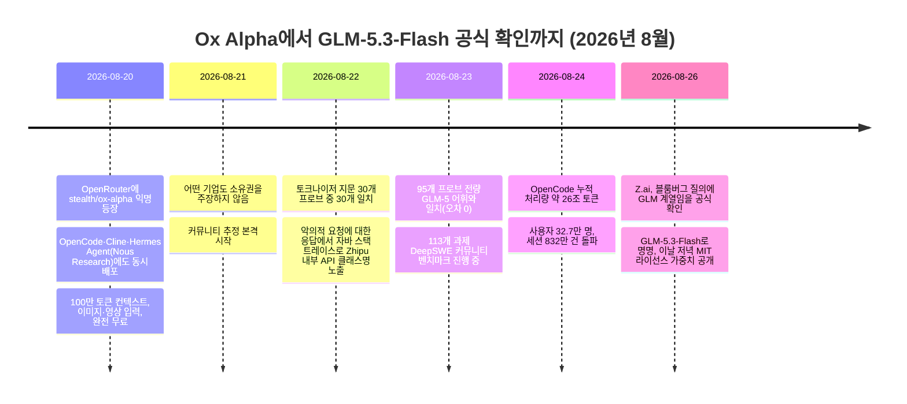
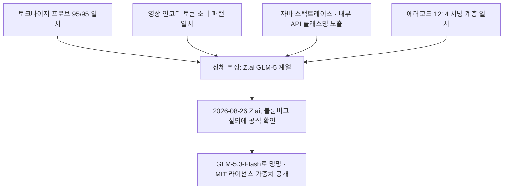

## 요약

2026년 8월 20일, OpenRouter라는 AI 모델 마켓플레이스에 "stealth/ox-alpha"라는 이름의 정체불명 모델이 아무런 소속 회사 표기 없이 등장했다. 100만 토큰이 넘는 컨텍스트 창, 텍스트·이미지·영상 입력 지원, 그리고 무엇보다 완전 무료라는 조건 덕분에 개발자들이 몰려들었고, 며칠 만에 OpenRouter 마켓플레이스 전체에서 사용량 1위에 올랐다. 커뮤니티는 토크나이저 지문, 영상 인코더 동작 방식, 그리고 결정적으로 서버가 스스로 뱉어낸 자바(Java) 오류 스택 트레이스를 근거로 이 모델이 중국 Z.ai(구 Zhipu AI, 智谱)의 GLM 계열이라는 결론에 점점 다가갔다. 그리고 8월 26일, Z.ai는 블룸버그통신의 질의에 답하며 이 추정이 사실이었음을 공식 확인했다. 정체는 GLM-5.3-Flash. 320억 개 활성 파라미터(총 3,200억 개)를 쓰는 네이티브 멀티모달 MoE(전문가 혼합) 모델로, MIT 라이선스로 가중치까지 공개됐다.

이 사건은 단순한 "미스터리 모델 정체 찾기" 해프닝을 넘어, 중국 AI 기업들이 신모델을 익명으로 먼저 실전에 풀어 사용자 반응과 벤치마크 신호를 모은 뒤 정식 출시하는 전략을 취하고 있다는 점, 그리고 미국의 수출 통제 속에서도 중국산 반도체만으로 프론티어급 모델을 훈련·서빙할 수 있는 인프라를 갖췄다는 점을 보여주는 사례로 읽힌다.

## 사건 전개: 6일간의 타임라인

### 8월 20일 — 이름도 회사도 없는 모델의 등장

Ox Alpha는 OpenRouter에 "stealth"라는 익명 제공자 이름으로, 모델 ID는 `stealth/ox-alpha`로 올라왔다. 같은 시각 오픈소스 터미널 코딩 에이전트인 OpenCode, 그리고 Cline과 Nous Research의 Hermes Agent 포털에도 동시에 풀렸다. OpenRouter 자체 설명에는 코딩과 장기 에이전트 작업을 위한 추론 모델이라고만 적혀 있었을 뿐, 개발사에 대한 언급은 없었다.

스펙은 화려했다. 컨텍스트 창은 1,048,576토큰(약 100만 토큰), 최대 출력은 131,072토큰이었고 텍스트뿐 아니라 이미지와 영상까지 입력받았다. 도구 호출(tool calling)과 추론 강도 조절 옵션도 지원했다. 가격은 입력·출력 모두 0달러. 하루 전날 OpenRouter를 인수한 스트라이프(Stripe) CEO 패트릭 콜리슨은 이 모델을 두고 상당히 인상 깊었다는 취지의 소감을 남기기도 했다(개발자 커뮤니티, 8월 20일 전후). 업계에서는 이를 OpenRouter 역사상 가장 큰 규모의 단일 모델 출시로 평가했다(블룸버그/야후 파이낸스, 8월 26일).

### 8월 21~23일 — 커뮤니티의 디지털 포렌식

정체가 공개되지 않은 채로 하루가 지나자 커뮤니티는 자체적으로 조사에 나섰다. 크게 네 갈래의 증거가 쌓였다.

**첫째, 토크나이저 지문.** 개발자 조셉 W. 엘스트너는 여러 언어와 코드 샘플, 유니코드 예외 문자열을 Ox Alpha에 넣어 토큰 분해 방식을 주요 AI 랩들의 공개 어휘집과 대조했다. 처음에는 Zhipu의 GLM 계열과 유사하다는 정도였지만, GLM-5의 공개된 어휘집을 추가로 대입하자 95개 테스트 프로브 전량이 오차 없이 일치했다(implicator.ai, 8월 23일). 다른 개발자 unclecode가 만든 지문 추적 도구 modelprint 역시 인프라 프로브 9개 중 6개에서 GLM-5.3과 일치한다는 결과를 냈다.

**둘째, 영상 인코더 동작.** Ox Alpha의 영상 토큰 소비 패턴, 즉 프레임 샘플링 방식과 초당 약 147토큰의 길이 스케일링 방식이 Zhipu의 GLM-5V-Turbo와 정확히 일치했다. 반대로 후보로 거론되던 샤오미의 MiMo v2.5는 이런 패턴에서 벗어났고, 음성 입력을 거부하는 방식도 GLM-5V와 동일했다(codersera.com, 8월 23일).

**셋째, 자바 스택 트레이스.** 가장 결정적인 증거는 8월 22일 개발자 Chetaslua가 찾아냈다. 그는 top_p 파라미터에 숫자 대신 문자열 "abc"를 넣는 등 일부러 잘못된 요청을 OpenCode의 Ox Alpha 라우트에 보냈고, 그 결과 자바 검증 오류가 그대로 노출됐다. 오류 메시지에는 `com.wd.paas.api.domain.v4.chat.ChatCompletionRequest`라는 내부 클래스 경로가 담겨 있었는데, 이는 Zhipu가 공개 문서에 명시한 API 경로 `/api/paas/v4/chat/completions`와 정확히 일치했다(X/Chetaslua, 8월 22일). 그는 이 발견의 신뢰도를 0.98로 평가하며, 이는 단순한 "지문 짐작"이 아니라 서버가 스스로 정체를 자백한 셈이라고 표현했다.

**넷째, 에러 코드 대조.** Chetaslua는 통제 실험도 병행했다. OpenRouter에서 Zhipu 소속으로 명시된 GLM-5.3, GLM-5.2, GLM-5V-Turbo 모델에 잘못된 역할(role) 값을 보내자 모두 동일한 오류 코드 `1214`("Incorrect role information")를 반환했다. 반면 같은 GLM-5.2 가중치를 DeepInfra라는 다른 업체가 호스팅한 경우에는 오류 형식이 달랐다. 즉 이 오류 코드 일치는 모델 가중치 자체가 아니라 Zhipu 고유의 서빙 인프라를 사용하고 있다는 뜻이었다(explainx.ai, 8월 22~25일 업데이트).

이 네 갈래 증거를 종합해 여러 매체는 8월 22~23일 시점에 "높은 확신도로 Zhipu/Z.ai의 GLM 계열로 추정된다"는 톤의 보도를 냈다(techtimes.com, ai-market-watch.com, 8월 23일). 다만 이 시점까지는 어디까지나 정황 증거였고, Zhipu 측의 공식 확인은 없었다.

이와 별개로 커뮤니티는 실전 성능도 테스트했다. 개발자 벤 데이비스는 코딩 에이전트 벤치마크인 DeepSWE 10개 과제 표본에서 Ox Alpha가 80%의 통과율을 기록해, 같은 조건에서 Claude Fable 5(65%)와 GPT-5.6 Sol(52%)을 앞섰다고 보고했다. 다만 이는 표본이 10개뿐인 예비 결과였고, 이후 113개 전체 과제로 확장한 커뮤니티 벤치마크에서는 통과율이 8월 23일 기준 약 63%로, 최종적으로는(8월 26일 기준) 58.4%로 조정됐다. 초기 80%라는 수치가 SNS에서 크게 회자됐지만, 실제로는 표본 수가 늘어날수록 수치가 낮아진 셈이어서 여러 매체는 이 숫자를 액면 그대로 받아들이지 말라고 당부했다(cellcog.ai, kie.ai).

### 8월 24일 — 사용량 폭증

OpenCode의 자체 대시보드에 따르면 8월 24일 기준 나흘간 누적 약 26조 토큰이 Ox Alpha를 통해 처리됐고, 순사용자는 32만 7,000명, 완료된 세션은 832만 8,244건에 달했다. 다만 OpenCode 자체 집계에서 Ox Alpha는 2위였다. 1위는 33조 토큰을 기록한 DeepSeek V4 Flash였고, 3위는 12조 토큰의 샤오미 MiMo-V2.5였다(runtimewire.com/Rick's Cafe AI, 8월 26일). 반면 OpenRouter 마켓플레이스 전체(558개 모델 대상)로 보면 8월 25일 03시 15분(UTC) 기준 Ox Alpha가 최근 1주일 토큰 처리량 기준 1위에 올랐다(llmrumors.com). OpenRouter 모델 페이지의 앱별 유입 순위로는 Claude Code(약 93억 2,000만 토큰)와 Hermes Agent(약 89억 8,000만 토큰)가 상위 유입원으로 나타나, 실제 코딩 에이전트 워크로드가 대거 몰렸음을 보여준다(explainx.ai). 두 집계(OpenCode 자체 통계와 OpenRouter 마켓 전체 통계)는 측정 범위가 다르므로 수치가 어긋나는 것은 자연스러운 일이다.

블룸버그는 8월 26일 보도에서 Ox Alpha가 OpenRouter 리더보드 1위에 올랐고 DeepSeek 사용량의 두 배를 넘어섰다고 전했다. 다만 이는 특정 시점·특정 지표(주간 토큰 처리량) 기준의 결과이며, OpenCode처럼 개별 플랫폼 단위로 보면 순위가 달라질 수 있다는 점은 감안할 필요가 있다.

한편 스텔스 기간 중 운영 주체 측이 밝힌(비공식, 검증되지 않은) 서빙 용량 주장으로 "하루 최대 100조 토큰 처리 가능"이라는 수치가 여러 매체에 언급됐다(implicator.ai, ai-market-watch.com). 이는 어디까지나 자체 주장이며 제3자가 독립적으로 검증한 수치는 아니다.

### 8월 26일 — Z.ai의 공식 확인

블룸버그통신의 문의에 대해 Z.ai는 Ox Alpha가 자사 GLM 계열의 신규 반복 모델이라는 소문을 사실로 확인했고, 그날 저녁 가중치를 공개하겠다고 밝혔다. 공식 명칭은 GLM-5.3-Flash. Z.ai는 블로그 게시물을 통해 이 모델이 중국산 AI 칩 위에서 구동된다고 설명했다(블룸버그, 8월 26일). 이로써 커뮤니티가 나흘에 걸쳐 축적한 네 갈래의 정황 증거는 모두 사실로 확인됐다.

## GLM-5.3-Flash 기술 사양

GLM-5.3-Flash는 Z.ai가 밝힌 바에 따르면 GLM-5 시리즈 최초의 '네이티브 멀티모달' 모델이다. 총 파라미터 3,200억 개 중 토큰당 180억 개만 활성화되는 전문가 혼합(MoE) 구조이며, 30조 토큰 규모의 멀티모달 코퍼스로 학습됐다. 컨텍스트 창은 스텔스 기간과 동일한 1,048,576토큰, 최대 출력은 131,072토큰이다. 아키텍처 측면에서 Z.ai는 이 모델이 오픈소스 프론티어 모델 중 최초로 '스파스+선형 결합 어텐션(hybrid sparse-plus-linear attention)' 구조를 적용했다고 설명했으며, 이 구조 덕분에 상위 모델인 GLM-5.3 대비 어텐션 연산량은 3.01배, KV 캐시 크기는 4.44배 줄었다고 밝혔다(cellcog.ai, marktechpost.com, 8월 26일). 이 KV 캐시 절감이 실질적으로 중요한 이유는, 100만 토큰급 컨텍스트를 자체 호스팅할 때 병목이 되는 것은 대개 연산량(FLOPs)이 아니라 장문 컨텍스트를 서빙하는 데 드는 메모리이기 때문이다.

가중치는 MIT 라이선스로 허깅페이스에 `zai-org/GLM-5.3-Flash`라는 이름으로 공개됐다. Z.ai의 자체 코딩 구독 상품인 'GLM 코딩 플랜'에도 GLM-5.3, GLM-5.2, GLM-5-Turbo와 함께 3배 할당량으로 포함됐다.

주의할 점도 있다. GLM-5.3-Flash에서는 사고(thinking) 모드를 끌 수 없다는 점이 실사용자 사이에서 운영상 제약으로 지적됐다(tosea.ai).

### GLM-5.3-Flash와 상위 플래그십 GLM-5.3의 관계

여기서 헷갈리기 쉬운 지점이 있다. GLM-5.3-Flash(=Ox Alpha)는 8월 14일 먼저 출시된 플래그십 모델 GLM-5.3과는 다른 모델이다. GLM-5.3은 GLM-5.2와 같은 약 7,400억~7,500억 파라미터(매체별 표기가 7,430억 혹은 7,530억으로 조금씩 다르다) 규모의 MoE 베이스를 그대로 쓰면서 대규모 후속 학습(post-training)과 강화학습 연산을 늘려 성능을 끌어올린 모델로, 멀티모달 입력은 지원하지 않는다. 반면 GLM-5.3-Flash는 새로 학습된 320B/18B 규모의 별도 베이스 모델에 네이티브 멀티모달 기능과 새 어텐션 구조를 얹은 경량·고효율 모델이다. 이번에 정체가 밝혀진 것은 후자, 즉 GLM-5.3-Flash 쪽이다.

## 가격 정책: 무료 프리뷰에서 유료 전환으로

스텔스 기간 동안 Ox Alpha는 입력·출력 모두 무료였다. 이 무료 구간은 2026년 8월 27일을 전후해 종료되도록 예정돼 있었다(local-ai-zone.github.io). 정식 공개와 함께 Z.ai가 발표한 정가는 100만 토큰당 입력 0.15달러, 캐시 입력 0.03달러, 출력 0.50달러다. 다만 2026년 9월 9일 자정(싱가포르 시각)까지는 50% 출시 할인이 적용돼 입력 0.075달러, 출력 0.25달러로 이용할 수 있다. OpenRouter의 가격도 이 할인가와 동일하게 맞춰졌다(cellcog.ai). 무료 구간에서 쓰던 `stealth/ox-alpha` 슬러그는 OpenRouter 카탈로그에서 사라졌고 별도의 리다이렉트 안내 없이 새 모델 ID `z-ai/glm-5.3-flash`로 대체됐다.

## 성능은 어느 정도인가

성능 수치를 볼 때는 출처를 반드시 구분해서 읽어야 한다. Z.ai가 자체 공개한 벤더 벤치마크와, 언론·독립 기관이 돌린 벤치마크, 그리고 개인 개발자가 소규모 표본으로 돌린 커뮤니티 테스트는 신뢰도가 서로 다르다.

### Z.ai 자체 발표 수치 (벤더 벤치마크)

Z.ai는 GLM-5.3-Flash가 이전 세대인 GLM-5.2를 모든 공개 벤치마크에서 앞선다고 밝혔다. DeepSWE에서 63.4%(GLM-5.2는 46.2%), AutomationBench에서 48.8%(GLM-5.2는 26.2%)를 기록했다는 것이다. 또한 자체 코딩 벤치마크에서는 Claude Opus 4.8과의 격차가 0.5점 이내라고 설명했다(marktechpost.com, 8월 26일). 독립 평가 기관인 Artificial Analysis는 자사의 Intelligence Index v4.1.1에서 GLM-5.3-Flash에 57점을 부여했으며, 할인 단가 기준 과제당 비용은 0.045달러로 집계했다.

### 상위 모델 GLM-5.3(플래그십)의 참고 비교

Ox Alpha 자체는 아니지만, 같은 시기 출시된 상위 모델 GLM-5.3의 벤치마크는 Z.ai의 전반적인 기술 수준을 가늠하는 참고 자료가 된다. 아래 표는 여러 출처에서 확인된 수치이며, 벤더 발표와 독립 평가를 구분해 표기했다.

| 벤치마크 | GLM-5.3 | Claude Opus 4.8 | Claude Opus 5 | GPT-5.6 Sol | 출처/성격 |
|---|---|---|---|---|---|
| Z.ai Code Bench (High) | 31.4% (약 5만 출력 토큰/과제) | 29.5% (약 12만 출력 토큰/과제) | — | — | Z.ai 자체 발표 |
| Terminal-Bench 3.0 | 28.3% | — | 42.7% | 34.6% | 언론 집계(codingfleet.com) |
| CyberGym | 84.5% (1위) | — | 78.2% | 83.6% | 언론 집계 |
| Artificial Analysis Intelligence Index | 59.5~60점, 182개 모델 중 8위 | — | — | — | 독립 평가(Artificial Analysis) |

Artificial Analysis는 GLM-5.3이 과제당 출력 토큰 소모가 많은, 이른바 '장황한(verbose)' 모델이라는 점도 함께 지적했다. 즉 동일한 성능이라도 실제 운영 비용은 출력 토큰 수에 좌우되므로, 정확도 수치만 보고 판단하기보다는 과제당 비용까지 함께 봐야 한다.

한편 GLM-5.3의 API 가격은 100만 토큰당 입력 1.40달러, 출력 4.40달러로, Claude Opus 5(입력 5달러, 출력 25달러)보다 입력 기준 3.6배, 출력 기준 5.7배 저렴하다(llm-stats.com, 8월 22일 기준). Claude Opus 5는 2026년 7월 24일 출시된 모델로, 이전 세대인 Opus 4.8과 동일한 가격을 유지하면서 성능을 끌어올린 것이 특징이다.

### 커뮤니티 테스트 수치 (표본 수 유의)

앞서 언급했듯 DeepSWE 벤치마크의 초기 10개 과제 표본에서는 Ox Alpha가 80%로 Claude Fable 5(65%), GPT-5.6 Sol(52%)을 앞섰다는 결과가 화제를 모았다. 그러나 표본을 113개 전체 과제로 확장한 커뮤니티 벤치마크에서는 최종 통과율이 58.4%로 낮아졌다. 이는 벤더가 공인한 리더보드 등재 결과가 아니라 개인 개발자들이 자체적으로 돌린 값이라는 점, 그리고 표본이 커질수록 초기의 극적인 수치가 완화되는 전형적인 패턴을 보였다는 점을 함께 기억할 필요가 있다.

사이버보안 관련 테스트에서도 상반된 보고가 나왔다. 한 테스터는 4시간 동안 40억 토큰을 처리하면서 눈에 띄는 보안 가드레일을 느끼지 못했다고 보고했고, 다른 테스터는 위협 분류(threat-triage) 벤치마크에서 양성(정상) 사례의 45.4%를 과도하게 '분석 필요'로 분류하는 과잉 탐지 경향을 발견했다(kie.ai). 두 결과 모두 소규모 개별 테스트이므로 일반화하기는 이르다.

## 데이터·보안 관련 유의사항

스텔스 기간 동안 OpenRouter의 모델 페이지에는 익명 제공자가 프롬프트와 완성 결과를 보관하지만 학습에는 사용하지 않는다는 조항이 명시돼 있었다. 그러나 보안 연구자들은 운영 주체가 공식적으로 검증되지 않은 제3자 서비스였던 만큼, 민감한 코드나 자격 증명(credential)을 무료 프리뷰 모델에 입력하지 말라고 경고했다(techtimes.com, 8월 23일). 무료라는 조건이 보안 정책을 대신할 수는 없다는 지적이다.

## Z.ai(Zhipu AI)는 어떤 회사인가

이번 사건의 당사자인 Z.ai를 이해하려면 회사의 배경을 짚어볼 필요가 있다. Z.ai는 원래 칭화대학교 지식공학연구실(KEG Lab)에서 출발한 연구팀을 모태로 2019년 설립된 Zhipu AI(智谱)다. 탕제(Tang Jie) 교수가 창업 배경 인물로 꼽히며, 현재 CEO는 장펑(Zhang Peng)이다. 중국의 대표적인 AI 스타트업 그룹인 이른바 '6소호(六小虎, Six Little Tigers)' 중 한 곳으로 분류된다. 2025년 7월 GLM-4.5 및 GLM-4.5-Air 출시를 전후해 대외적으로 'Z.ai'라는 이름으로 리브랜딩했다.

지정학적으로는 2025년 1월 미국 상무부가 베이징 즈푸화장기술(Zhipu 관계사)을 포함한 자회사들을 수출통제 명단(Entity List)에 올렸다. 중국의 군사적 AI 역량 강화를 도울 수 있다는 우려가 근거였다. Zhipu 측은 이 조치에 근거가 없다며 반발했고, 자사가 미국의 대형 모델 기술에 의존하지 않기 때문에 사업에 실질적 영향은 제한적이라고 밝혔다(theairankings.com). 이후 회사는 오픈 모델 전략과 국산 인프라 활용을 더욱 강화하는 쪽으로 방향을 잡았다.

기업 이력에서 특기할 만한 지점은 2026년 1월 8일 홍콩증권거래소 상장이다. 종목코드 02513, 법인명은 'Knowledge Atlas Technology'로, 중국 AI 파운데이션 모델 기업으로는 최초의 상장 사례이자 세계적으로도 최초로 상장한 대형언어모델 전문 기업으로 평가된다. 공모가는 주당 116.20홍콩달러로 시가총액은 약 51억 홍콩달러(약 66억 달러) 수준이었으나, 이후 주가가 급등해 한때 공모가 대비 약 1,700% 오른 시점(2026년 5월)에는 시가총액이 880억 홍콩달러(약 1,120억 달러)를 넘기기도 했다. 2026년 7월에는 약 40억 달러 규모의 추가 유상증자(H주)를 주당 1,588홍콩달러에 진행했고, 이 발행으로 시가총액이 1조 홍콩달러(약 1,280억 달러)를 넘어섰다(ventureatlas.org).

모델 계보로 보면 2026년 2월 11일 GLM-5를 출시했는데, 이는 엔비디아 칩 없이 훈련됐다고 보도됐다. 같은 해 2월 말에는 주가가 23% 급락하고 컴퓨팅 자원 부족으로 신규 가입을 제한하는 등 어려움을 겪기도 했다. 이후 3~4월 GLM-5.1을 구독자 대상으로 먼저 공개한 뒤 오픈소스로 전환했고, 6월에는 GLM-5.2를 출시하며 상하이 STAR 마켓 2차 상장 계획도 이사회에서 승인받았다. 그리고 2026년 7월에는 엔비디아 칩을 전혀 사용하지 않고 화웨이 어센드(Ascend), 무어스레즈(Moore Threads), 캠브리콘(Cambricon), 쿤룬신(Kunlunxin) 등 중국산 가속기만으로 클러스터당 1만 개 이상을 운용하는 약 1기가와트급 데이터센터를 부분 가동하기 시작했다. 이는 수출 통제 환경 속에서 순수 국산 하드웨어로 기가와트급 프론티어 학습 인프라를 구축한 초기 사례 중 하나로 꼽힌다(ventureatlas.org, comparativeai.org). 2026년 7월 20일에는 독립계 중국 AI 기업으로는 처음으로 연 매출 10억 달러에 근접했다는 보도도 나왔다. GLM-5.3-Flash가 중국산 AI 칩 위에서 구동된다고 밝힌 것도 이런 국산화 전략의 연장선으로 볼 수 있다.

## 종합해서 보면

이번 사건이 흥미로운 이유는 크게 세 가지로 정리할 수 있다.

첫째, 신모델을 정식 출시 전에 익명으로 시장에 풀어 실사용 트래픽과 벤치마크 반응을 모으는 전략이 이제 중국 AI 기업들 사이에서도 자리 잡고 있다는 점이다. OpenRouter는 2025년에도 'Optimus Alpha'라는 유사한 익명 모델을 호스팅한 적이 있어, 이런 방식 자체가 처음은 아니다(startupfortune.com). 다만 이번에는 규모 면에서 OpenRouter 역사상 최대 단일 출시로 평가될 만큼 반향이 컸다.

둘째, 커뮤니티 포렌식의 정교함이다. 벤치마크 점수나 말투 같은 간접 신호를 넘어, 의도적으로 오류를 유발해 서버 내부의 클래스명과 API 경로까지 끌어낸 방식은 모델 정체 추적이 이제 하나의 전문 영역으로 발전했음을 보여준다.

셋째, 인프라 자신감이다. Z.ai가 밝힌 대로 이 모델이 순수 중국산 AI 칩 위에서 구동됐다면, 이는 미국의 수출 통제에도 불구하고 최소한 GLM-5.3-Flash급의 프론티어 성능을 자국산 하드웨어만으로 안정적으로 서빙할 수 있다는 신호로 해석될 수 있다. 다만 이 부분은 Z.ai 측의 발표에 의존한 내용으로, 제3자가 독립적으로 검증한 사실은 아직 확인되지 않았다는 점은 짚어둘 필요가 있다.

동시에 벤치마크 수치 대부분이 벤더 자체 발표이거나 소규모 커뮤니티 테스트에 그친다는 한계도 뚜렷하다. 초기 80%로 화제를 모았던 DeepSWE 성적이 표본을 넓히자 58.4%로 내려앉은 사례는, 스텔스 모델을 둘러싼 초기 화제성과 실제 검증된 성능 사이에는 항상 간극이 있을 수 있다는 점을 잘 보여준다.

## 주요 출처

- Bloomberg, "China's Z.AI Made Ox Alpha Stealth Model That Rivals DeepSeek" (2026-08-26)
- MarkTechPost, "Z.ai Releases GLM-5.3-Flash" (2026-08-26)
- CellCog, "What Is Ox Alpha?" / "GLM-5.3-Flash Is Ox Alpha" (2026-08-26)
- Tosea.ai, "How to Use GLM-5.3-Flash" (2026-08-26)
- implicator.ai, "Ox Alpha Matches Zhipu's GLM Tokenizer in 95 Tests" (2026-08-23)
- Cryptopolitan, "Z.ai named as maker of Ox Alpha" (2026-08-26)
- explainx.ai, "Ox Alpha on OpenRouter" / "Ox Alpha: What We Know" (2026-08-22~25)
- codersera.com, "Ox Alpha Stealth Model: Who Made It and How to Use It" (2026-08-23)
- Turing Post, "Zhipu AI (Z.ai): Founders, GLM Models, and Hong Kong IPO"
- Venture Atlas, "Zhipu AI (Z.ai) - Company Profile"
- The AI Rankings, "Zhipu AI (Z.ai) in 2026"
- Anthropic, "Introducing Claude Opus 5" (2026-07-24)

---
작성일자: 2026년 8월 27일
