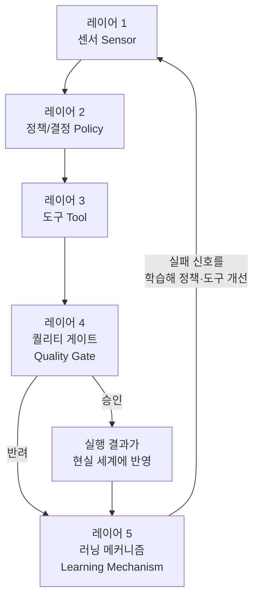
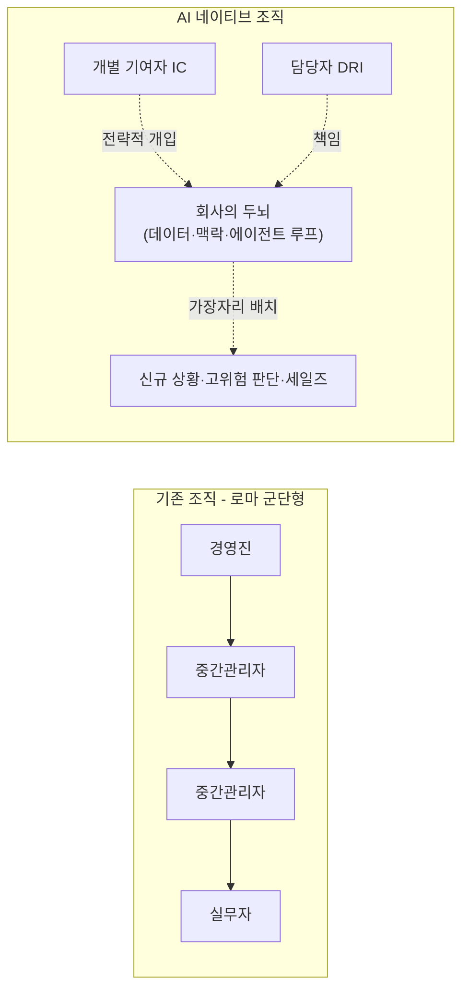

## 문서 개요와 원문 출처

> 
> 이제 AI가 생산성을 올려준다는 말도 철 지난 이야기다. 이제는 기업의 구조 자체가 변화하지 않으면 죽는 환경에 있다. 토큰을 얼마나 잘 쓰는지, 모두가 자동화 된 환경인지, 실무자들이 본인이 필요한걸 즉시 구현해서 테스트 가능한지 등
> 
> YC에서 얼마전에도 이야기한 기업 내 5개의 레어어 구축이 정말 중요하다.
> 
> 센서-> 정책 -> 도구 -> 퀄리티 게이트 -> 러닝 메카니즘.
> 
> 각종 Raw 데이터를 모아서 정책을 통해 도구가 실행되며 검수를 위한 퀄리티 게이트 그리고 이 과정에서 자가 개선이 진행되는 Loop를 구현해야 한다.
> 
> 지금 AI 기반의 신사업을 하면서, 저 Loop가 부분적으로 동작하게 구현해뒀다. 결국은 저 모든 과정이 자동으로 돌아가게 만들어야 됨.
> 
>  https://www.threads.com/share/BAS4z1Xw3F/
> 

이 문서는 사용자가 공유한 Threads 게시물에서 언급된 "센서 → 정책 → 도구 → 퀄리티 게이트 → 러닝 메커니즘"이라는 5단계 프레임워크의 원출처를 추적하여, 그 내용을 사실관계 확인을 거쳐 상세하게 정리한 것이다. Threads나 Facebook 게시물은 크롤러가 접근할 수 없는 경우가 많아 원문 링크 자체를 직접 인용하지는 못했지만, 게시물에서 언급된 핵심 문구("센서-정책-도구-퀄리티 게이트-러닝 메카니즘", "YC")를 단서로 웹 검색을 진행한 결과, 이 프레임워크의 원 출처를 명확히 특정할 수 있었다.

이 프레임워크는 Y Combinator(YC)의 그룹 파트너이자 몬조(Monzo)와 고카드리스(GoCardless)의 공동창업자인 톰 블롬필드(Tom Blomfield)가 2026년 5월 중순(19일~21일경) YC 배치(batch) 강연에서 발표한 내용이다. 이 강연은 YC 공식 X(트위터) 계정을 통해 공개되었고, 이후 여러 테크 매체와 개인 뉴스레터가 이를 요약·분석하는 글을 게재하면서 널리 퍼졌다. 원본 영상은 YC 유튜브 채널에 "How to Build a Self-Improving Company with AI"라는 제목으로 약 13분 분량으로 올라와 있다[7].

아래 내용은 YC 공식 X 게시물에 담긴 강연 챕터 구성[4], 이를 상세히 풀어 쓴 Towards AI의 해설 기사[2], 그리고 이를 인용·분석한 UX Collective[3], BigGo Finance[5], Product Market Fit 뉴스레터[6] 등 복수의 독립적인 출처를 교차 확인하여 작성했다.

---

## 1. 왜 이 강연이 나왔는가 — 배경이 된 다이애나 후의 "AI 네이티브 기업" 담론

톰 블롬필드의 강연을 이해하려면 그보다 약 한 달 앞서 나온 또 다른 YC 파트너 다이애나 후(Diana Hu)의 강연을 먼저 알아야 한다. 다이애나 후는 2026년 4월 하순 YC의 "Startup School" 시리즈에서 "How to Build a Company with AI from the Ground Up"이라는 강연을 통해 "AI는 도구가 아니라 회사의 운영체제(OS)가 되어야 한다"는 주장을 폈다[8][9][11].

다이애나 후의 핵심 주장은 이렇다. 기존 방식대로 AI를 코파일럿처럼 기존 워크플로우에 얹으면 그저 엔지니어를 조금 더 생산적으로 만드는 데 그친다. 반면 AI를 회사의 운영체제로 삼으면 조직도, 채용 계획, 예산 배분, 생산성을 측정하는 방식 자체가 바뀐다는 것이다[23]. 그는 회사를 "오픈 루프(open-loop)"와 "클로즈드 루프(closed-loop)" 시스템으로 구분했는데, 오픈 루프 조직에서는 의사결정과 실행이 이루어져도 그 결과가 체계적으로 측정되지 않고 사람이 수작업으로 상태를 취합해 위로 보고하는 반면, 클로즈드 루프 조직에서는 모든 의미 있는 행동이 구조화된 데이터를 만들어내고 에이전트가 그 데이터를 지속적으로 읽어 학습한다[21]. 이를 위해 다이애나 후는 회사를 "쿼리 가능(queryable)"하게 만들어야 한다고 강조했으며, 헤드카운트가 아니라 토큰 사용량을 극대화하는 이른바 "토큰맥싱(tokenmaxxing)"이 앞으로 조직의 핵심 지표가 될 것이라고 주장했다[18][22].

톰 블롬필드는 자신의 강연이 다이애나 후의 프레임워크, 그리고 잭 도시(Jack Dorsey)가 같은 시기 X에 올린 일련의 트윗, YC 사장 개리 탠(Garry Tan)과 파트너 하지 태거(Harj Taggar)가 YC 내부 인프라에 실제로 적용한 엔지니어링 작업에서 영감을 받았다고 밝혔다[13]. 즉 이번에 살펴볼 5단계 프레임워크는 어느 날 갑자기 나온 아이디어가 아니라, 2026년 상반기 YC 파트너 그룹 안에서 여러 사람이 동시다발적으로 수렴해 가던 논의의 결정판에 가깝다.

---

## 2. 핵심 비유 — "회사는 로마 군단처럼 조직되어 있다"

블롬필드는 강연을 잭 도시의 트윗에서 빌려온 비유로 시작한다. 로마 군단은 로마의 권력을 제국의 끝자락까지 투사하기 위해 만들어진 조직으로, 정해진 통솔 범위를 가진 개별 지휘관들이 중첩된 위계 구조를 이루며 위에서 아래로 명령을 전달하고 아래에서 위로 정보를 올려보내는 방식으로 작동했다[9](Towards AI 기사 기준, YC 공식 강연 요약).

블롬필드의 주장은 오늘날 대부분의 기업이 여전히 이 로마 군단과 똑같은 방식으로 조직되어 있다는 것이다. 사람이 정보가 오르내리는 통로 역할을 한다는 이 전제는 생산성의 문제가 아니라, 조직을 어떻게 사고할 것인가에 대한 구조적 전제 자체의 문제라는 것이 그의 지적이다. 그리고 AI는 이 구조를 단순히 개선하는 데 그치지 않고, 그 밑바탕에 깔린 전제 자체를 깨뜨린다고 그는 말한다.

이 대목에서 그는 현재 널리 퍼진 AI 도입 방식, 즉 기존 워크플로우 위에 AI 코파일럿을 얹어 엔지니어를 20% 더 생산적으로 만드는 접근을 강하게 비판한다. 그는 이를 "마차에 더 강력한 엔진을 얹는 것"에 비유했다. 기존의 일하는 방식은 그대로 둔 채 성능만 높이는 것이므로, 결국 마차는 여전히 마차일 뿐이라는 것이다. 그가 제안하는 새로운 사고방식은 "회사가 무엇인지 그 자체를 다시 설계하라"는 것이다.

---

## 3. 자가개선 루프의 5개 레이어 상세 해설

블롬필드가 제시하는 대안은, 회사를 AI가 얹혀진 조직이 아니라 "재귀적으로 자가개선하는 루프들의 집합(a set of recursive, self-improving AI loops)"으로 재정의하는 것이다. 각각의 루프는 다섯 개의 층으로 이루어지며, 이 다섯 단계를 사람의 개입 없이, 혹은 최소한의 개입만으로 끝까지 돌릴 수 있다면 그 시스템은 잠자는 동안에도 스스로 점점 나아진다는 것이 그의 핵심 주장이다[4][2].

아래 다이어그램은 이 다섯 개 레이어가 하나의 순환 구조로 어떻게 맞물리는지를 보여준다.

### 레이어 1 — 센서 레이어(Sensor Layer)

가장 아래층에는 현실 세계의 데이터가 들어오는 통로가 있다. 고객이 보낸 이메일, 고객지원 티켓, 코드 변경 내역, 구독을 해지하는 사람들, 제품 사용 로그(텔레메트리) 같은 것들이 여기에 해당한다. 블롬필드는 이를 조직이 바깥세상의 신호를 감지하는 "감각 기관"에 비유한다.

### 레이어 2 — 정책/결정 레이어(Policy Layer)

여기에는 규칙이 존재한다. 시스템이 무엇을 스스로 판단해 실행해도 되는지, 무엇을 반드시 기록으로 남겨야 하는지, 무엇에 대해서는 반드시 사람의 허락을 받아야 하는지를 정의하는 층이다. 즉 AI가 스스로 할 수 있는 일과 할 수 없는 일의 경계를 정하는 가드레일 역할을 한다.

### 레이어 3 — 도구 레이어(Tool Layer)

실제 코드가 실행되는 층이다. 데이터베이스를 조회하거나, 캘린더를 확인하거나, 이메일을 발송하거나, 레코드를 업데이트하는 등 확정적으로 동작하는 API들이 여기에 해당한다. 블롬필드는 이 층을 "스킬과 코드"의 층, 즉 AI가 실제로 무언가를 실행하는 메커니즘이라고 설명한다.

### 레이어 4 — 퀄리티 게이트(Quality Gate)

어떤 행동이든 실제로 반영(커밋)되기 전에 반드시 이 관문을 통과해야 한다. 평가(eval) 체크, 안전성 필터, 혹은 위험도가 높은 작업에 대한 사람의 검토가 여기에 해당할 수 있다. 이 레이어는 "AI가 무언가를 하기로 결정한 상태"와 "그 일이 실제로 일어난 상태" 사이를 가르는 체크포인트다.

### 레이어 5 — 러닝 메커니즘(Learning Mechanism)

전체 구조를 진짜로 "자가개선"하게 만드는 층이다. 시스템은 실제 세계와 상호작용한 뒤 무엇이 잘 안 되었는지를 포착해 다시 맨 위 단계로 되돌아간다. 실패는 그대로 다음 학습을 위한 신호가 되고, 이 루프는 돌 때마다 점점 더 정교해진다.

블롬필드는 이 다섯 단계를 사람의 개입 없이, 혹은 최소한의 감독만으로 전부 돌릴 수 있다면 시스템은 밤새 스스로 점점 더 나아진다고 강조한다. 참고로 이와 거의 동일한 5단계 구성(센서-정책-도구-퀄리티 게이트-러닝 에이전트)은 이 프레임워크를 실제 제품에 적용한 AGO라는 고객지원 AI 스타트업의 블로그 글에서도 별도로 확인된다[1]. 해당 글은 퀄리티 게이트 없는 자가개선 루프는 "그저 표류하는 피드백 루프"에 불과하다고 지적하며, 퀄리티 게이트를 고객 평가, 관리자 피드백, 문서 평가, LLM 심사관(judge)이라는 네 가지 각도에서 교차 검증하는 방식을 제안하고 있어, 다섯 번째 레이어가 실무에서 왜 필요한지를 보여주는 좋은 참고 사례가 된다.

---

## 4. YC 내부에서 실제로 일어난 "홀리 쉿 모먼트"

블롬필드는 이 개념이 자신에게 실제로 와닿았던 순간을 구체적으로 설명한다. YC는 내부적으로 파트너들이 "이 창업자와 마지막으로 미팅한 게 언제였지?" 같은 질문을 던지면 답을 찾아주는 간단한 내부 에이전트를 만들었다. 처음에는 그저 좀 더 똑똑한 사내 검색창 정도의 유용한 도구였을 뿐, 특별할 것은 없었다.

그런데 여기에 "모니터링 에이전트"를 하나 더 얹었다. 이 에이전트는 YC 직원 전원이 던지는 모든 질의를 지켜보며 어떤 질의가 성공했고 어떤 질의가 실패했는지를 추적했다. 질의가 실패하면 이 에이전트는 스스로에게 묻는다. 왜 실패했는가, 무엇이 있었다면 이 질의가 성공했을 것인가, 다른 확정적 도구가 필요한가, 새로운 데이터베이스 뷰가 필요한가, 아니면 다른 인덱스가 필요한가.

그러고 나서—사람이 개입하지 않은 채 밤사이에—이 에이전트는 스스로 수정 코드를 작성하고, YC 코드베이스에 풀 리퀘스트(PR)를 올리고, 다른 에이전트가 그 PR을 리뷰하도록 하고, 병합과 배포까지 마쳤다. 다음 날 아침 사람이 출근해 전날 실패했던 것과 같은 질의를 던지면, 그 질의는 이미 정상적으로 작동하고 있었다는 것이다[2][3].

블롬필드는 이 순간을 두고 이것이야말로 "AI가 여러분을 20~30% 더 가치 있게 만들어주는 수준의 이야기가 아니라, AI가 이 루프를 스스로 돌며 자가개선하는 방법을 알아낸 것"이라고 표현했다고 여러 매체가 전한다[2]. UX Collective의 분석 기사는 이 사례를 경영학자 스태포드 비어(Stafford Beer)의 생존가능시스템모델(Viable System Model)이 자연발생적으로 구현된 사례로 해석하며, 사람 조정자가 있어야만 완결되던 주기를 모니터링 함수가 불일치를 감지하고 스스로 교정 행동을 만들어내는 방식으로 대체했다고 설명한다[3].

---

## 5. 실제 적용 사례 — 제품 루프와 고객지원 루프

블롬필드는 이 구조가 YC 내부 사례에만 그치지 않고 기업의 거의 모든 기능에 적용될 수 있다고 설명하며 두 가지 예시를 든다.

첫 번째는 "자가최적화 제품 루프"다. 에이전트가 제품 분석 데이터를 훑어 세일즈 퍼널에서 마찰이 가장 큰 지점을 찾아내고, 관련된 모범 사례를 조사하고, A/B 테스트를 설계해 일주일간 돌린 뒤 가장 성과가 좋은 버전을 선택해 배포한다. 그리고 이 과정을 계속 반복한다. 제품 매니저가 매 주기마다 개입할 필요 없이 지속적으로 돌아가는 자가최적화 루프인 셈이다.

두 번째는 "자동화된 고객지원 루프"다. 고객이 제안하는 개선 요청은 끊임없이 들어온다. AI가 마치 최고제품책임자(CPO)나 최고기술책임자(CTO)처럼 판단을 내려, 로드맵에 맞지 않는 제안은 폐기하고, 맞는 제안은 코드를 작성해 배포까지 마쳐 고객에게 실제로 전달한다. 의사결정, 개발, 배포 어느 단계에도 사람이 개입하지 않고 루프가 밤사이에 완결된다.

블롬필드는 이것이 가상의 시나리오가 아니라 지금 YC 소속 기업들 안에서 실제로 존재하거나 만들어지고 있는 루프라고 강조했다고 전해진다[2].

---

## 6. 지금 당장 해야 할 네 가지

강연에서 블롬필드는 이 프레임워크를 실제로 적용하려는 창업자에게 네 가지 실천 과제를 제시한다.

첫째는 회사를 AI가 읽을 수 있도록 만드는 것이다. 어떤 상호작용이든 기록되지 않으면 AI 시스템 입장에서는 존재하지 않는 것과 같다. 모든 이메일이 검색 가능한 데이터베이스에 들어가야 하고, 모든 슬랙 메시지, 모든 회의, 모든 의사결정이 기록으로 남아야 한다. 실제로 YC는 지난 3개월간 녹음된 오피스아워 2,000시간 분량을 AI로 학습시켜 YC의 사용자 매뉴얼 전체를 새로 만들었으며, 이 문서는 새로운 조언이 나올 때마다 스스로 업데이트되는 살아있는 문서가 되었다고 한다[2][8]. 블롬필드는 이것이 "AI가 읽을 수 있는 회사"가 실제로 어떤 모습인지 보여주는 구체적 사례라고 소개한다.

둘째는 헤드카운트가 아니라 토큰을 태우라는 것이다. 조직의 제약 조건은 채용 한도보다 토큰 사용량 한도에 먼저 부딪히는 방향으로 이동하고 있다는 것이 그의 진단이다. 어떤 팀원이 실제로 얼마나 AI를 활용하고 있는지, 즉 누가 "토큰맥싱"을 하고 있는지가 고성과자를 가늠하는 방향성 지표가 된다는 것이다. 이는 앞서 소개한 다이애나 후의 "토큰맥싱, 헤드카운트맥싱 하지 말라"는 주장과 정확히 같은 맥락에 있다[18].

셋째는 중간관리 계층을 없애는 것이다. 중간관리자는 본래 정보를 조율하는 문제를 풀기 위해 존재했는데, AI가 이 조율 문제를 더 빠르고 잘 풀어낸다는 것이 그의 주장이다. 남는 것은 실제로 만들고 운영하는 개별 기여자(IC)와, 의미 있는 결과물 하나하나에 대해 책임을 지는 담당자(DRI, Directly Responsible Individual)뿐이라는 것이다.

넷째는 소프트웨어는 소모품으로, 맥락은 자산으로 취급하라는 것이다. 모델은 몇 달마다 개선되므로, 6개월 전에 만든 대시보드나 내부 도구는 최신 모델과 더 나은 지침으로 다시 만들면 그만이다. 반면 절대 버리면 안 되는 것은 그 기능이 어떻게 작동하는지에 대한 사람들의 머릿속 이해, 즉 비즈니스 맥락과 의사결정의 근거다. 그는 소프트웨어 위에 얹힌 것은 소모품이지만, 사람들 머릿속에 있는 이해(comprehension)야말로 진짜 가치가 있는 부분이라고 표현했다고 전해진다.

---

## 7. 그럼에도 사람이 여전히 중요한 영역

블롬필드는 사람이 사라진다고 말하지 않는다. 다만 사람의 위치가 조직의 중심부에서 "가장자리", 즉 지능 시스템이 현실 세계와 맞닿는 지점으로 옮겨간다고 설명한다. 그가 꼽은 사람이 여전히 필요한 영역은 다음과 같다.

모델이 아직 접해본 적 없는 새로운 상황, 공동창업자와의 결별을 고민하는 순간이나 까다로운 고객 협상처럼 이해관계와 감정이 크게 얽힌 순간, 진정한 윤리적 판단이 필요한 도덕적 의사결정, 그리고 세일즈 대화가 여기에 해당한다. 특히 세일즈 대화는 앞으로 20년간은 사람의 영역으로 남을 것이라고 그는 말했다고 전해진다.

즉 회사의 데이터, 이메일, DM, 스킬, 조직 지식이 모여 있는 "회사의 두뇌"는 중앙에 자리 잡고, 사람은 그 바깥을 감싸며 현실 세계와 접촉하는 방식으로 조직이 재편된다는 것이다. 로마 군단은 모든 곳에 사람이 있었지만, AI 네이티브 기업은 중간 대부분에 AI가 있고 사람은 정말로 필요한 가장자리에만 정밀하게 배치된다는 것이 그의 결론이다.

아래는 이러한 조직 구조 변화를 단순화해 나타낸 도식이다.

---

## 8. 아직 검증되지 않았거나 논쟁의 여지가 있는 지점

이 강연을 다룬 매체 가운데 BigGo Finance의 분석은 몇 가지 미해결 쟁점을 짚고 있다. 첫째, 직원 1인당 매출이 5배로 뛴다는 식의 배수가 조직 규모가 커져도 그대로 유지될지는 불확실하다. 둘째, "토큰을 태운 양"이 인사평가에 쓰이는 핵심성과지표(KPI)가 될 경우 실제 성과와 무관하게 토큰 소비 자체를 늘리려는 왜곡된 유인이 생길 수 있다. 셋째, 이 강연은 퀄리티 게이트라는 레이어를 언급하는 것 외에는 거버넌스나 안전성 문제를 깊이 다루지 않는다는 점도 지적되었다[5]. 이 세 가지는 어디까지나 이 강연을 취재한 매체 한 곳(BigGo Finance)의 해석과 논평이며, 블롬필드 본인이 직접 언급한 내용이라는 근거는 확인되지 않았으므로 별도의 분석적 견해로 구분해 둔다.

또한 이 문서가 주로 인용한 Towards AI의 해설 기사는 필자가 "AI 글쓰기 프로그램의 도움을 받아, 저자 본인의 메모와 톰 블롬필드 강연 분석을 바탕으로 작성했다"고 스스로 밝히고 있는 2차 해설 자료다. 즉 강연의 공식 대본이나 자막을 그대로 옮긴 것이 아니라 필자가 재구성한 요약이라는 점에 유의할 필요가 있다. 다만 이 문서에서 제시한 5단계 구조, YC 내부 사례, 4가지 실천 과제라는 핵심 골격은 YC 공식 X 계정이 공개한 강연 챕터 구성[4], AGO 블로그의 별도 인용[1], UX Collective와 idevie에 동시 게재된 독립적인 분석 기사[3][14]에서 공통적으로 확인되므로, 프레임워크의 골자 자체는 여러 독립 출처를 통해 교차 검증되었다고 볼 수 있다.

---

## 9. 출처 및 사실확인 투명성

| 구분 | 내용 | 확인 수준 |
|---|---|---|
| 5단계 프레임워크(센서-정책-도구-퀄리티 게이트-러닝 메커니즘) 존재 및 구성 | 톰 블롬필드가 YC 배치 강연에서 발표 | 복수 독립 출처 교차 확인[1][2][4] |
| 강연 시점(2026년 5월 19~21일경) | YC 공식 X 게시, 여러 매체 보도 | 복수 출처 일치[3][4][5][14] |
| "로마 군단" 비유, 코파일럿 비판 | Towards AI 해설 기사 | 2차 해설 자료(단일 상세 출처), YC 공식 챕터 구성과 정합 |
| YC 내부 "홀리 쉿 모먼트" 일화 | Towards AI, UX Collective가 동일 내용 서술 | 복수 출처 일치[2][3] |
| 제품 루프·고객지원 루프 예시 | Towards AI 해설 기사 | 단일 상세 출처(요지는 YC 공식 챕터 목록과 정합) |
| "4가지 실천 과제" 세부 내용 | Towards AI 해설 기사 | 단일 상세 출처, 다이애나 후 강연 내용과 부분적으로 정합 |
| 다이애나 후의 "AI 네이티브 기업" 선행 강연 | 다수 매체·YC 공식 라이브러리 보도 | 복수 출처 교차 확인[8][9][18][21][22][23] |
| 5배 매출 배수, 토큰 KPI 왜곡 가능성 등 비판적 논평 | BigGo Finance 자체 분석 | 단일 출처, 해당 매체의 해석으로 명시 |

---

## 참고 문헌

[1] AGO Blog, "Start building your Self-Improving company with AGO", useago.com  
[2] Naresh Idiga, "How to Build a Self-Improving Company with AI", Towards AI, 2026-06-03  
[3] Jay Acutt, "The forgotten science behind self-improving companies", UX Collective, 2026-06-08  
[4] Y Combinator 공식 X(트위터) 게시물, @ycombinator  
[5] "How to Build a Self-Improving Company with AI｜Y Combinator Startup Podcast", BigGo Finance  
[6] "Tom Blomfield (YC) on How to Build a Self-improving Company with AI", Product Market Fit 뉴스레터, 2026-07-13  
[7] "Tom Blomfield of GoCardless and Monzo is our newest Group Partner", Y Combinator 공식 블로그  
[8] "The Playbook For Building An AI Native Company", Apple Podcasts / Y Combinator Startup Podcast, 2026-04-24  
[9] "The Playbook For Building An AI Native Company", Y Combinator Library  
[14] "The forgotten science behind self-improving companies", idevie, 2026-06-08  
[18] "Y Combinator's guide to being an AI-native company: tokenmaxx, don't headcountmaxx", Yahoo Finance, 2026-05-03  
[21] "Watch This: Diana Hu on Building an AI-Native Company", vocap.vc, 2026-04-28  
[22] "The Playbook For Building An AI Native Company", BigGo Finance  
[23] "Diana Hu: AI-Native Companies Will Operate a Thousand Times Faster", BigGo Finance, 2026-04-24

원본 강연 영상: Y Combinator YouTube 채널, "How to Build a Self-Improving Company with AI" (약 13분)
