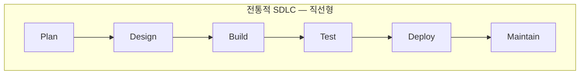
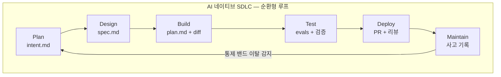
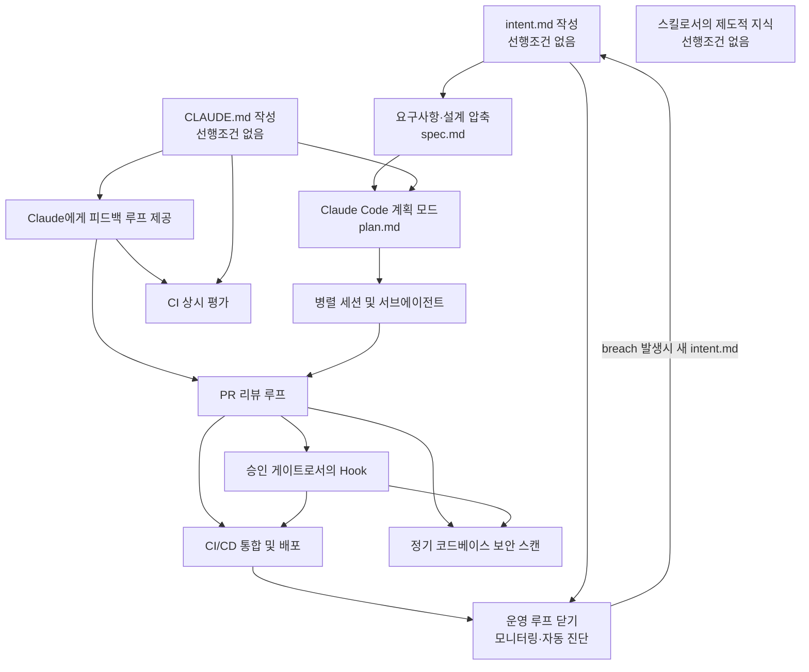
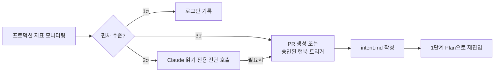
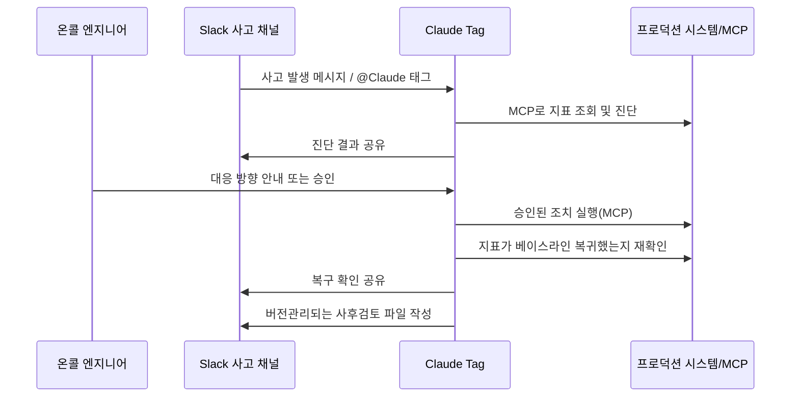

## 관련글

[**Anthropic 官方 AI 原生 SDLC 实战手册（六阶段改造路径）**](https://x.com/shao__meng/status/2092418532768362720)

## 문서 정보

| 항목 | 내용 |
|---|---|
| 원문 제목 | The AI-Native SDLC playbook |
| 부제 | How to transform your software development lifecycle with AI — stage by stage |
| 저자 | Louis Claxton (Anthropic) |
| 게시일 | 2026년 8월 21일 |
| 원문 예상 읽기 시간 | 5분 (원문 표기 기준이며, 실제로는 코드 예시와 세부 실행 지침까지 포함하면 훨씬 긴 분량) |
| 카테고리 | Enterprise AI, Claude Code |
| 관련 제품 | Claude Enterprise, Claude Code, Claude Tag |
| 원문 주소 | https://claude.com/blog/the-ai-native-sdlc-playbook |
| 공동 기여자(원문 표기) | Jim Blackhurst, Will Steuk, Jamal Arif |

이 글은 Anthropic의 Applied AI 팀이 실제 고객사들과 함께 현장에서 실행해온 방법론을 정리해 공개한 실전 가이드입니다. 소셜미디어에서 돌아다니는 요약본이 아니라 Anthropic 공식 블로그 원문을 직접 확인하고, 그 안에 담긴 표, 코드 예시, 거버넌스 조건, 측정 지표까지 포함해 최대한 상세하게 정리했습니다. 원문에 없는 내용은 추측해서 채우지 않았습니다.

---

## 1. 문제의식 — "코드를 쓰는 일은 더 이상 병목이 아니다"

Anthropic은 이 글을 하나의 관찰에서 시작합니다. 지난 1년 사이 조직들은 상상하기 어려운 속도로 AI를 이용해 코드를 작성하게 되었지만, 코드를 둘러싼 프로세스 자체는 그 속도를 따라가지 못했다는 것입니다. Claude Code 같은 에이전틱 코딩 도구가 만들어내는 생산성 향상에도 불구하고, 많은 엔지니어링 조직은 여전히 예전과 똑같은 승인 절차, 코드 리뷰, 인수인계, 정책을 그대로 유지하고 있습니다.

소프트웨어 개발 생명주기(SDLC, Software Development Lifecycle)는 아이디어가 실제 프로덕션 소프트웨어가 되기까지 거치는 전 과정을 말합니다. 대부분의 조직은 기획(Plan), 설계(Design), 구현(Build), 테스트(Test), 배포(Deploy), 운영/유지보수(Maintain)라는 여섯 단계의 어떤 변형을 따릅니다. 전통적인 방식에서는 각 단계가 서로 다른 역할이 담당하는 독립된 국면입니다. 제품 매니저가 요구사항을 쓰고, 테크니컬 아키텍트가 이를 설계로 옮기고, 엔지니어가 그 설계를 구현하고, 규제 산업의 QA 팀이 이를 검증하고, 릴리스 팀이 배포하고, 운영팀이 가동 중인 시스템을 모니터링합니다. 각 단계 사이의 작업 이전은 문서, 티켓, 승인 절차를 통해 이루어집니다.

전통적 SDLC가 이렇게 절차 중심으로 무거워진 이유는 각 단계에서 책임소재와 통제를 확실히 하기 위해서였습니다. 문제는 이 설계가 "코드를 작성하고 구현하는 단계가 가장 시간과 비용이 많이 드는 단계"였던 시대에 맞춰진 것이라는 점입니다. 이제는 그 전제가 더 이상 성립하지 않습니다. 요구사항 정의서(PRD), 견적 산정 의식, 제품 보안 리뷰는 모두 몇 주에서 몇 달, 혹은 몇 분기가 걸리던 개발 작업 동안 조직의 정렬을 강제하기 위해 존재했던 절차들입니다.

또한 전통적 SDLC는 모든 단계가 사람에 의해 수행된다는 것을 전제로 한 통제 장치들로 이루어져 있습니다. 가장 큰 가치를 만들어내고 있는 조직들은 이제 에이전틱 AI가 할 수 있게 된 일들을 중심으로 프로세스를 재구축하면서도, 사람이 여전히 루프 안에 남아 있도록 하고 있습니다.

구현 단계(build)가 더 이상 병목이 아니게 되고 전통적 SDLC가 감당할 수 있는 속도보다 빠르게 돌아가기 시작하면, 세 가지 현상이 나타납니다.

1. **병목이 구현 단계의 좌우로 이동합니다.** 주로 기획, 리뷰/테스트, 배포 단계인데, 이들은 여전히 사람의 속도로 돌아갑니다.
2. **기존 통제 장치가 현실과 어긋나며 감당 불가능해집니다.** 사람이 직접 코드를 짤 때는 한 줄 한 줄 검토하는 방식이 합리적이었지만, 에이전트가 diff의 대부분을 작성하는 상황에서는 이 방식이 더 이상 유지될 수 없습니다.
3. **거버넌스 비용이 상승합니다.** 예외 사항들은 여전히 매주 혹은 매달 열리는 회의와 위원회를 거쳐야 하기 때문입니다.

원문은 보안 팀을 예로 듭니다. 보안 팀의 인력 규모는 사람이 만들어내는 산출물 양에 맞춰져 있기 때문에, 에이전트가 코드 산출량을 배가시키면 리뷰 대기열이 쌓이거나, 코드가 충분히 검토되지 않은 채 배포되는 두 가지 상황 중 하나가 벌어집니다. 규제 산업에 속한 조직이라면 어느 쪽도 받아들일 수 없으므로, 보안·정책 점검 자체가 에이전트의 속도를 따라잡아야 한다는 것이 Anthropic의 주장입니다.

결론적으로 에이전틱 AI의 생산성 이득을 온전히 실현하고 안전하게 운영하려면, 전통적 SDLC 전체가 구현 단계가 이미 겪은 것과 같은 수준의 전환을 겪어야 한다는 것이 이 글의 출발점입니다.

---

## 2. "AI 네이티브 SDLC"란 무엇인가

Anthropic이 제시하는 AI 네이티브 SDLC는 기존의 통제 목표(누가 승인했는가, 무엇이 감사 가능한가)는 그대로 유지하면서 그 통제를 실행하는 방식만 새롭게 바꾼 프로세스입니다. 핵심은 **선형적인 흐름이 순환 고리(loop)로 바뀐다**는 점입니다. AI가 각 지점에 내장되어, 한 단계가 끝나면 자동으로 다음 단계로 인계되고 트리거됩니다. 이는 전통적 SDLC의 단계 간 인수인계가 수작업이고 번거로웠던 문제를 해결하기 위함입니다.

원문은 이 흐름을 "에이전틱 SDLC(agentic SDLC)", "AI SDLC", 또는 그냥 "에이전틱 소프트웨어 개발(agentic software development)"이라고도 부를 수 있다고 언급하며, 명칭은 다르지만 가리키는 대상은 동일하다고 설명합니다.

### 2.1 여섯 단계에 걸친 전통 방식과 AI 네이티브 방식의 대비

원문에 실린 비교표를 그대로 옮기면 다음과 같습니다. 대부분의 조직은 이 두 극단 사이 어딘가에 위치한다고 원문은 덧붙입니다.

| 단계 | 전통적 SDLC | AI 네이티브 SDLC (Claude 기반) |
|---|---|---|
| Plan (기획) | 위원회가 요구사항을 모으고, 워크숍과 승인을 거쳐 정제한 뒤 사람이 손으로 작성 | Claude가 소스로부터 곧바로 페인 포인트를 종합해 사람도 읽고 기계도 실행할 수 있는 `intent.md`에 담음 |
| Design (설계) | 분석가가 스펙을 쓰고, 디자이너가 이를 다시 해석 | 요구사항과 설계가 하나의 작업 세션으로 압축되며, 스킬(skills)로 인코딩된 표준의 안내를 받고 git으로 버전 관리됨 |
| Build (구현) | 테스트와 코드를 손으로 작성하고, 문서화는 주요 개발이 끝난 뒤에 작성 | 테스트와 코드를 AI가 생성하고, 조직 지식은 버전 관리되는 `CLAUDE.md` 파일과 스킬로 유지됨 |
| Test (테스트) | 단계 경계마다 QA 게이트 | 구현 과정 전반에 상시적인 평가(continuous evals)가 엮여 있음 |
| Deploy (배포) | 사람이 모든 코드 줄을 검토하고, 거버넌스는 종종 일관성 없이 리뷰 사이클 속에서 발생 | 에이전틱 리뷰가 여러 겹으로 이루어지고, 사람의 리뷰는 규제 대상 및 중요 코드에 집중됨. 거버넌스는 AI가 행동하는 순간 hook을 통해 승인 게이트로 강제됨 |
| Maintain (운영) | 사람이 프로덕션을 지켜보며 버그를 찾음 | 에이전트가 실제 배포 환경을 모니터링하며, 통제 밴드를 벗어나면 자동으로 진단되어 새로운 `intent.md`로 다시 루프에 기입됨 |

오른쪽 열을 관통하는 공통된 실은 **버전 관리되는 산출물(committed artifact)** 입니다. 각 단계는 산출물 하나를 버전 저장소에 커밋하는 것으로 끝나고, 다음 단계는 그 산출물을 읽는 것으로 시작합니다. 이 산출물들은 순서대로 `intent.md` → `spec.md` → `plan.md` → diff와 그 테스트 → 리뷰 결과가 담긴 PR → 사고(incident) 기록입니다. 초기 단계에서는 마크다운(.md) 파일이 지배적인 산출물 형태인데, 이는 제품 담당자와 에이전트 모두 같은 파일을 읽고 행동할 수 있기 때문입니다. Build 단계 이후부터는 산출물이 코드와 그에 대한 기록으로 바뀝니다. 이 커밋의 연쇄는 곧 감사 추적(audit trail)이기도 합니다 — 누가 무엇을 요청했는지, 에이전트가 무엇을 만들어냈는지, 누가 승인했는지가 모두 기록으로 남습니다.

사람은 판단력이 필요한 모든 결정에 대해 계속 책임을 집니다. 다만 에이전틱 SDLC 세계에서는 사람의 주의력이 검토해야 할 산출물을 따라 함께 이동합니다.

아래 다이어그램은 전통적인 선형 SDLC와 AI 네이티브 순환형 SDLC의 구조적 차이를 보여줍니다.

전통적 방식은 한 번의 릴리스 주기를 완주하고 나면 사람이 처음부터 다시 루프를 되돌려야 하지만, AI 네이티브 방식에서는 각 단계가 자동으로 다음 단계를 촉발하는 하나의 닫힌 고리를 이루며, 사람은 그 고리 "위에서" 시작을 지시하고, 방향을 조정하고, 거버넌스를 수행하는 역할을 맡습니다.

---

## 3. Play(실행 카드)라는 구성 단위

이 플레이북의 핵심 구성 요소는 "Play"라 불리는 실행 카드들입니다. 이 Play들은 Plan, Design, Build, Test, Deploy, Maintain이라는 여섯 개의 비선형적 단계로 묶여 있으며, 함께 전체 생명주기를 포괄합니다.

각 Play는 다음 다섯 가지 요소로 구성됩니다.

- **무엇이 바뀌는가(What changes)**
- **시작 방법(Getting started)** — 선행 조건(Prerequisites)과 인프라(Infrastructure)
- **구체적인 실행 단계(Concrete steps for implementation)**
- **거버넌스 고려사항(Governance considerations)**
- **성과 측정 방법(How you measure whether it worked)**

이 단계들은 모듈식으로 설계되어 있어서, 조직은 자신의 필요에 따라 서로 다른 단계를 서로 다른 시점에 우선적으로 전환할 수 있습니다. 각 Play는 "선행 조건(Prerequisites)" 항목 아래 자신의 의존성을 명시하며, 이는 의존성 그래프로도 시각화되어 있습니다.

한 단계는 산출물을 커밋하는 것으로 끝나며, 그 커밋이 다음 단계를 시작시킵니다. 승인된 `intent.md`는 요구사항·설계 패스를 촉발하고, 승인된 `spec.md`는 계획 모드(plan mode)를 촉발하며, 병합된 PR은 파이프라인을 촉발하고, 프로덕션에서 통제 밴드가 깨지면 다음 `intent.md`가 작성되며 루프가 이어집니다.

처음에는 각 단계를 사람이 수동으로 프롬프트하지만, 최종적으로 지향하는 상태는 승인된 산출물 하나하나가 다음 게이트를 자동으로 발동시키는 루프입니다. 사람의 주의는 게이트에 집중되며, 에이전트가 처음부터 다시 단계를 시작하는 대신 에이전트가 표시(flag)한 내용을 검토하는 데 쓰입니다.

원문은 Play들의 나열 순서(단계 순서)와 실제 도입해야 하는 순서(의존성 순서)가 다르다는 점을 특히 강조합니다. 아무것도 선행 조건이 없는 Play(예: `intent.md` 작성, `CLAUDE.md` 작성)는 어디서든 바로 시작할 수 있습니다. 반면 다른 Play들은 화살표로 표시된 선행 Play들을 먼저 도입해야 합니다.

---

## 4. 1단계 — Plan: `intent.md`로 의도를 포착하기

아이디어가 더 이상 누군가 대신 글로 옮겨줄 때까지 기다릴 필요가 없어집니다. 발상자가 자신의 언어로 의도를 한 번 포착하면, 그것이 버전 관리되는 산출물이 되어 다음 단계가 곧바로 실행할 수 있는 형태가 됩니다.

### 4.1 어떻게 시작되는가

`intent.md`는 소프트웨어 개발 프로세스를 개시하는 파일로, 여러 경로로 생성될 수 있습니다. 어떤 사람이 아이디어를 떠올렸거나, 티켓이 접수되었거나, 경보를 통해 사고가 감지되었을 수 있습니다(운영 단계인 6단계 참고).

사람이 아이디어를 떠올렸을 때는 Claude와 브레인스토밍을 진행해 마크다운 초안 스펙(proto-spec)을 만듭니다. 전통적 SDLC라면 같은 사람이 제품팀 구성원을 설득해 함께, 혹은 대신 아이디어를 문서화해달라고 해야 했습니다.

Claude가 생성한 초안 스펙은 사람이 읽을 수 있고, 버전 관리되며, 다음 단계에서 즉시 소비할 수 있는 형태입니다. 이 초안 스펙이 `intent.md`로 저장됩니다. 의도가 이벤트 트리거에서 왔든 에이전트에서 왔든 동일한 절차가 적용됩니다 — 제품 담당자가 커밋 전에 에이전트가 작성한 `intent.md`를 검토하고 수정합니다.

**전통 방식**에서는 아이디어가 백로그 항목, 유저 스토리, 스토리 포인트, 정제 회의를 거쳐야만 누군가 실제로 행동할 수 있었습니다. 각 인수인계마다 소유권이 이전되기 때문에, 엔지니어링에 도달하는 시점에는 원래 발상자가 의도한 바에서 여러 단계 멀어져 있습니다.

**AI 네이티브 방식**에서는 발상자가 Claude와 브레인스토밍하고 그 결과를 발상자 자신의 용어로 `intent.md`라는 초안 스펙으로 작성합니다. 이 산출물에는 무엇을 원하는지, 왜 원하는지, 어떤 제약 조건 아래서인지가 담깁니다. 반복되는 프로세스는 스킬로 인코딩됩니다.

### 4.2 시작 방법

- **선행 조건**: 없음.
- **인프라**: 엔지니어가 아닌 사람들도 쓸 수 있는 Claude 접근권(claude.ai 또는 Cowork), 합의된 `intent.md` 템플릿, 제품 담당자가 지켜보는 공유된 버전 관리 저장 공간이 필요합니다. 단일 제품이라면 가장 단순한 형태는 제품 저장소 안의 `intent/` 폴더입니다. 이렇게 하면 산출물 체인이 그로부터 파생된 코드 바로 옆에 있게 됩니다. 별도의 intent 전용 저장소는 의도가 여러 저장소에 걸쳐 있을 때만 관리 부담을 감수할 가치가 있으며, 모노레포에서는 그냥 하나의 디렉터리가 됩니다.

이 설정 작업 자체는 플랫폼 또는 엔지니어링 팀이 한 번만 하면 되는 일입니다. 기술적인 팀원 한 명이 intent 저장 공간을 세우고 누가 쓸 수 있는지를 정해야 하는데, 조직 전반에서 다양한 기여자가 참여할 것이기 때문입니다. 저장소가 만들어진 뒤로는 git 경험이 없는 기여자도 직접 git을 다룰 필요가 없습니다 — 버전관리 시스템(GitHub 등)에 대한 커넥터를 통해 Claude가 claude.ai나 Cowork에서 대신 마크다운 파일을 커밋할 수 있기 때문입니다.

### 4.3 실행 방법

1. 발상자가 Claude에게 자신의 언어로 문제를 설명합니다. 지금 무엇을 할 수 없는지, 누가 이 아이디어의 영향을 받는지, 더 나은 상태가 무엇인지, 범위 밖은 무엇인지를 설명할 수 있습니다. 형식을 갖춘 언어가 필요하지 않습니다.
2. 아이디어가 구체화될 때까지 브레인스토밍합니다. Claude는 분석가라면 물었을 법한 질문들 — 범위, 사용자, 제약, 성공의 모습 — 을 던집니다.
3. Claude에게 조직의 템플릿을 사용해 결과를 `intent.md`로 작성해달라고 요청합니다. 이 템플릿은 기술 팀원이 만들고 리더가 승인한 스킬로 인코딩될 수 있습니다. 문제, 제안된 결과, 영향을 받는 사용자와 시스템, 제약 조건, 미결 질문 등을 다룰 수 있습니다.
4. 발상자는 Claude가 오해한 부분을 수정합니다.
5. `intent.md`를 공유 저장 공간에 커밋합니다. 작성자와 타임스탬프가 기록에 합류하고, 제품 담당자가 그 아이디어를 이어받습니다.

원문에 실린 예시(보험 청구 처리 자가서비스 기능에 대한 `intent.md`)는 문제 정의, 제안된 결과, 영향받는 사용자·시스템, 제약 조건, 미결 질문이라는 다섯 개 섹션으로 구성되어 있습니다.

### 4.4 거버넌스

증거는 커밋된 `intent.md` 자체입니다. 여기에는 작성자, 타임스탬프, 전체 수정 이력이 담기며, intent 저장 공간의 git 히스토리에 기록됩니다. 제품 담당자가 승인하며, 승인/반려 결정은 2단계(Design)로 넘어가는 병합(merge) 또는 종료된 리뷰로 기록됩니다.

### 4.5 성과 측정

- **선행 지표(Leading indicator)**: 첫 대화부터 `intent.md`가 커밋될 때까지 걸린 시간. intent 저장 공간의 git 히스토리에서 작성자와 타임스탬프로 읽어냅니다. 목표는 몇 주가 걸리던 요구사항 도출·정제 주기를 몇 시간으로 줄이는 것입니다.
- **후행 지표(Lagging indicator)**: 생존율, 즉 제품 담당자가 종료하지 않고 2단계로 받아들인 `intent.md` 비율입니다. 승인/반려 여부는 산출물의 병합 또는 종료된 리뷰로 기록됩니다. 추가로, 같은 변경 건에 대해 첫 `spec.md` 커밋 이후에 `intent.md`가 수정된 횟수도 함께 봅니다.

---

## 5. 2단계 — Design: 요구사항과 설계가 한 세션으로 압축된다

요구사항 정의와 설계가 하나의 세션으로 합쳐집니다. 정책은 스펙이 작성되는 그 순간 적용되며, 몇 주 뒤 리뷰에서야 발견되는 일이 없어집니다.

### 5.1 요구사항과 설계

제품 담당자가 승인하고 나면, Claude는 승인된 `intent.md`를 받아 요구사항·설계 스펙을 작성합니다. 이 과정은 브랜드, 보안, 컴플라이언스, UX에 대한 조직의 [스킬](https://code.claude.com/docs/en/skills)에 의해 안내됩니다.

제품 담당자는 그 스펙을 검토하지만 직접 작성하지는 않습니다. 이 과정의 목표는 엔지니어링 팀이 계획을 세울 수 있는, 우려 지점이 표시된 스펙을 만드는 것입니다.

프런트엔드 작업이 가장 명확한 예시입니다. `intent.md`가 승인되면 제품 담당자는 [Claude Design](https://claude.com/product/design) (베타)에서 `intent.md`를 바탕으로 목업을 만들고, 목업을 반복 수정한 뒤, 이를 Claude Code로 내보내 실제로 구축합니다.

**전통 방식**에서는 요구사항과 설계가 서로 다른 팀이 운영하는 별개 국면입니다. 분석가가 아이디어를 요구사항으로 공식화하면, 디자이너가 그 요구사항을 다시 설계로 해석합니다. 이 분리는 책임소재를 위한 것이었지만 느리고 정보 손실이 있습니다.

**AI 네이티브 방식**에서는 두 국면이 한 번의 프롬프트 세션에서 이루어집니다. Claude가 `intent.md`를 받아 요구사항·설계 스펙을 만들며, 조직의 스킬이 이를 제약하고 우려 지점이 표시됩니다.

### 5.2 시작 방법

- **선행 조건**: `intent.md` 파일이 작성되어 있어야 하며, 브랜드·보안·컴플라이언스·UX 정책이 스킬로 작성되어 있어야 합니다.
- **인프라**: Claude 접근권을 가진 제품 담당자. 엔지니어링 역량은 필요하지 않습니다.

### 5.3 실행 방법

1. 제품 담당자가 조직의 스킬을 활성화한 세션을 열고 `intent.md`를 첨부합니다.
2. 제품 담당자의 프롬프트는 `intent.md`를 지목하고, 제약 조건을 명시하며, 우려 사항을 표시해달라고 요구합니다. 처음에는 수동으로 실행하고, 이후에는 조직 차원의 슬래시 커맨드로 정형화합니다. 그 다음에는 intent 저장 공간에서 `intent.md`가 승인되는 것을 트리거로 삼아, 병합 시점에 발동하는 비대화형(non-interactive) 작업이 조직의 스킬을 로드한 상태로 이 과정을 실행하고 `spec.md`를 풀 리퀘스트로 커밋하도록 만듭니다(플러밍 설정은 5단계의 CI/CD Play에서 다룹니다). 이 시점부터 제품 담당자의 첫 관여는 검토가 됩니다.
3. 같은 제품 담당자가 스펙을 원래 아이디어와 대조해 검토합니다. 스펙이 명시된 문제를 해결하는가, `intent.md`의 미결 질문들이 답변되었거나 그대로 이어지고 있는가를 확인합니다.
4. 표시된 우려 지점부터 먼저 처리합니다. 이는 분석가였다면 상부로 에스컬레이션했을 지점들입니다. 제품 담당자는 엔지니어링이 스펙을 보기 전에 각 우려 사항을 해당 정책 소유자와 함께 해결합니다.
5. `spec.md`를 `intent.md`와 나란히 커밋합니다. 이 두 파일 쌍은 무엇이 요청되었고 무엇이 결정되었는지를 기록합니다.
6. 제품 담당자가 스펙과 intent를 구현 단계로 넘길지 결정하며, 조직이 더 높은 위험으로 분류하는 사안에 대해서는 테크니컬 리드와 상의합니다. 이 판단은 항상 사람 팀원이 내리며, 스펙을 승인하는 것이 3단계(Build)의 계획 모드 Play를 시작시킵니다.

원문이 제시하는 프롬프트 예시는 다음과 같습니다(번역 및 요지):

> 첨부한 intent.md를 읽고, 이를 기존 코드베이스에 통합하기 위한 요구사항·설계 스펙을 작성해줘. 사용 가능한 스킬을 적용해서 브랜드 가이드라인, 보안 정책, UX 표준을 준수하도록 해줘. spec.md로 온전히 문서화해서 엔지니어링 팀에 바로 넘길 수 있게 해줘. 우려되는 지점, 특히 서로 상충하는 정책을 동시에 만족시킬 수 없는 경우를 명확히 설명해줘.

### 5.4 거버넌스

몇 주 뒤 리뷰에서 발견되는 대신, 살아있는 정책이 스펙 작성 시점에 바로 읽히고 적용됩니다. 조직의 스킬이 스펙에 대한 제약으로 적용됩니다. 스펙, 그것을 만든 프롬프트, 당시 적용되던 스킬 버전이 모두 버전 관리 시스템에 기록됩니다. 제품 담당자가 스펙에 서명(승인)하고, 표시된 우려 사항은 지정된 정책 소유자에게 전달됩니다.

### 5.5 성과 측정

- **선행 지표**: 같은 변경 건에 대해 `intent.md` 커밋과 `spec.md` 커밋 사이의 경과 시간(두 개의 git 타임스탬프)을, 예전의 요구사항+설계 주기와 비교합니다.
- **후행 지표**: 구현 시작 이후 발생하는 요구사항 재작업. 같은 변경 건에 대해 첫 `plan.md` 커밋 이후 날짜가 찍힌 `spec.md` 커밋 수를 셉니다. git 로그로 바로 확인 가능합니다.

---

## 6. 3단계 — Build: 승인된 계획 없이는 아무것도 구현되지 않는다

이 단계에서는 조직의 제도적 지식이 에이전트가 읽는 파일이 되고, 안전장치가 습관이 아니라 코드로 실행됩니다.

### 6.1 기본 출발점으로서의 Claude Code 계획 모드(plan mode)

엔지니어는 [계획 모드](https://code.claude.com/docs/en/permission-modes)에서 Claude Code 세션을 시작하고, 2단계에서 승인된 `spec.md`를 Claude에게 준 뒤, 엔지니어가 만족할 때까지 Claude가 질문하고 계획을 반복 수정하게 합니다.

**전통 방식**에서는 엔지니어가 설계를 읽고 바로 코드를 작성하기 시작합니다. 변경을 어떻게 할 것인지 — 어떤 파일을, 어떤 순서로, 어떤 테스트로 — 는 엔지니어의 머릿속에만, 잘해야 티켓 코멘트에만 남습니다. 다른 사람은 그것을 검토할 수 없습니다. 리뷰어가 처음 보는 것은 완성된 diff이고, 그 시점에서는 재작업이 느립니다.

**AI 네이티브 방식**에서는 작업이 문서화된 계획으로 시작됩니다. Claude는 계획 모드에서 코드베이스를 읽되 아무것도 변경하지 않은 채로 이 계획을 만듭니다. 엔지니어는 코드가 작성되기 전에 계획을 수정하고, 승인된 버전은 이후 단계들이 대조 확인할 수 있도록 `plan.md`로 커밋됩니다.

### 6.2 시작 방법

- **선행 조건**: 의도 산출물(`intent.md` 또는 `spec.md`)이 있으면 좋고, `CLAUDE.md` 파일이 도움이 됩니다.
- **인프라**: 저장소에 접근 권한이 있는 Claude Code.

### 6.3 실행 방법

1. 엔지니어가 계획 모드로 Claude와의 세션을 시작합니다.
2. 엔지니어가 Claude에게 `intent.md`와 `spec.md`를 주고, 어떤 파일이 바뀌는지, 작업 순서, 이를 증명할 테스트를 담은 구현 계획을 요청합니다.
3. 이 변경이 무엇을 망가뜨릴 수 있는지, 어떤 단계가 가장 위험한지, Claude가 선택하지 않은 다른 옵션은 무엇인지 물으며 계획을 심문합니다.
4. 이 대화를 한 번도 본 적 없는 엔지니어도 이 계획만으로 구현할 수 있을 때까지 반복 수정합니다.
5. 승인된 계획을 `plan.md`로 커밋합니다. 이 계획은 감사 추적에 합류하며, 5단계의 PR 리뷰 Play가 최종 diff를 이 계획과 대조 확인합니다.
6. 계획을 수락하고 Claude가 구현하게 합니다. 탄탄한 계획이 있으면 구현이 한 번의 패스로 끝나는 경우가 많습니다.
7. 구현이 계획에서 벗어나면 같은 커밋 안에서 `plan.md`를 업데이트합니다. 이 둘 사이의 동기화를 강제하는 hook을 쓰는 것도 고려할 수 있습니다.

### 6.4 자동 모드(auto mode)

Claude Code는 자동 모드로도 동작할 수 있습니다. 엔지니어가 계획을 승인하고 나면, 반복 수정을 거쳐 만족스러운 상태가 되었을 때 Claude가 편집마다 매번 프롬프트를 띄우지 않고 각 변경을 적용합니다. 이후 단계에서 다루는 안전장치들 — 잘 다듬어진 `CLAUDE.md`, 정책을 인코딩한 스킬, 안전하지 않은 행동을 막는 hook, Claude가 실행할 수 있는 테스트 스위트 — 이 성숙해질수록, 자동 승인은 촘촘한 `spec.md`, 작은 영향 범위(blast radius), 이미 테스트가 커버하는 코드를 다루는 일상적인 작업에서 기본값이 됩니다.

이러한 전환의 방향은 사용자가 에이전트의 편집을 지켜보고 행동 하나하나를 검토하는 방식에서, 오랜 자율 세션이 끝난 뒤 산출물을 검토하는 방식으로 옮겨가는 것입니다. 자동 승인 모드는 워크트리(worktree)와 함께 쓰일 때 개인과 팀 차원의 병렬화를 더욱 가능하게 하며, 6단계에서 설명하는 SDLC의 자율적 운영과 루프 닫기의 근본이 됩니다.

### 6.5 사이드바 — 레거시 시스템과 진실의 원천(source of truth)

*이 항목은 프로세스가 만들어내는 모든 산출물에 적용됩니다.*

기존 SDLC 프로세스는 이미 산출물들을 추적하고 있을 가능성이 높습니다. 다만 마크다운 파일 형태가 아닐 뿐입니다. 작업 항목은 Jira에, 요구사항은 규제 추적 기능이 내장된 도구에, 설계는 Figma에, 변경 승인은 변경관리위원회 기록에 있을 수 있습니다. 이런 시스템들은 감사관과 규제기관이 이미 받아들이고 있고 다른 팀들이 의존하고 있기 때문에 쉽게 대체할 수 없습니다. 따라서 AI 네이티브 SDLC는 기존 시스템에 맞춰 들어가야 합니다.

AI 네이티브 SDLC로 전환할 때, 프로세스가 만들어내는 각 산출물마다 하나의 시스템을 진실의 원천으로 지정하고, 나머지 시스템들은 원본의 사본이나 링크를 보유하도록 해야 합니다. 원문은 산출물별로 선택 가능한 세 가지 구성을 제시합니다.

- **저장소(repo)가 진실의 원천인 경우**: 마크다운 산출물이 공식 기록이며, 레거시 시스템은 커밋 안의 파일을 참조합니다. 모든 기록이 하나의 도구와 하나의 타임스탬프 권한 아래 있게 되므로, 엔지니어링 중심 조직에게는 가장 깔끔한 구성 중 하나가 될 수 있습니다.
- **레거시 시스템이 진실의 원천인 경우**: Jira, ServiceNow, 또는 요구사항 도구가 공식 기록을 보유하고, 마크다운 산출물은 작업용 사본이 됩니다. Claude는 세션 시작 시 [MCP](https://code.claude.com/docs/en/mcp) 커넥터를 통해 그 기록을 읽고, 스펙이나 계획을 만든 같은 세션 안에서 결과를 다시 써넣습니다.
- **최소 기준으로서의 연결(linkage)**: 모든 산출물이 레거시 시스템의 기록 ID를 명시하고, 모든 레거시 기록이 마크다운 파일의 커밋 SHA를 담습니다. 두 개의 진실의 원천이 존재한다는 것을 받아들이는 대신, AI 네이티브 SDLC로 전환할 때 시작하기 좋은 지점입니다.

레거시 시스템과 마크다운 우선 시스템은 둘 사이에 연결이 있거나 한쪽이 진실의 원천으로 선언되어 있는 한 공존할 수 있습니다.

### 6.6 `CLAUDE.md`

[`CLAUDE.md`](https://code.claude.com/docs/en/memory)는 신입 팀원이 필요로 할 만한 맥락 — 관례, 명령어, 아키텍처, 팀이 가장 자주 마주치는 실수 — 을 Claude에게 제공합니다. 예전에는 사람들의 머릿속과 위키에 흩어져 있던 지식이 매 세션 시작 시 에이전트가 읽는 하나의 파일이 되며, 팀 전체가 유지 관리하고 실수가 발생할 때마다 개선됩니다.

**시작 방법**: 선행 조건은 없습니다. 인프라로는 저장소, 설치된 Claude Code, 코드베이스를 잘 아는 엔지니어 한 명이 필요합니다.

**실행 방법**:

1. 저장소에서 `/init`을 실행합니다. Claude가 발견한 내용을 바탕으로 초기 `CLAUDE.md`를 생성합니다.
2. 생성된 파일을 신입 팀원이 첫날 필요로 할 내용만 남도록 잘라냅니다. 빌드·테스트·린트 명령어, 중요한 관례, Claude가 계속 틀리는 부분을 남깁니다.
3. `CLAUDE.md`를 저장소 루트에 git으로 커밋해서 팀 전체가 하나의 버전을 공유하고 변경 사항이 코드처럼 리뷰되도록 합니다.
4. 유용한 원칙 하나: Claude가 같은 실수를 두 번 하면, 그 교정 내용을 `CLAUDE.md`에 넣습니다.
5. 한 페이지 이내로 유지합니다. Claude는 세션 시작 시 전체를 다 읽기 때문에, 오래되어 쓸모없는 내용은 아무 이득 없이 컨텍스트만 잡아먹습니다.

**거버넌스**: `CLAUDE.md`는 버전 관리되기 때문에 에이전트가 따르는 지시사항을 검토하고 감사할 수 있습니다. 팀 관례는 이 파일을 통해 적용되고, 변경 사항은 git 히스토리에 기록되며, 코드 오너가 PR 리뷰에서 그 변경을 승인합니다.

**성과 측정**: 선행 지표는 `CLAUDE.md`가 잡아냈어야 할 실수를 Claude가 얼마나 자주 반복하는지이며, 이 파일에 대한 수정/변경은 git 히스토리로 추적해야 합니다. 후행 지표는 PR 히스토리를 기준으로, 팀에 새로 합류한 사람이 첫 PR을 병합하기까지 걸리는 시간입니다.

### 6.7 제도적 지식으로서의 스킬(Skills)

스킬은 조직이 자신의 제도적 지식을 실행 가능하게 만드는 방법입니다. 그 지시사항은 명시적이고, 버전 관리되고, 폭넓게 적용되며, 정책이 바뀌면 중앙에서 업데이트됩니다. 경험칙은 다음과 같습니다 — 일관되게 적용되어야 하는 제도적 지식에는 스킬을 작성하고, `CLAUDE.md`나 프롬프트에 들어가야 할 내용에는 스킬을 쓰지 않습니다.

**시작 방법**: 별도의 선행 조건은 필요 없습니다. `CLAUDE.md`가 있으면 에이전트의 작업 지식이 저장소 안에 머물게 되어 도움이 되지만, 스킬 자체가 이에 의존하지는 않습니다. 인프라로는 명확한 소유자가 있는 정책 하나와 그에 대한 공식 출처가 필요합니다.

**실행 방법**:

1. 오늘날 일관되지 않게 적용되고 있는 지식 하나를 고릅니다. 보안 표준, API 설계 관례, 브랜드 규칙 등이 될 수 있습니다.
2. 이를 스킬로 작성합니다. 스킬은 `SKILL.md`를 담은 폴더로, 프런트매터(frontmatter)에는 언제 트리거되는지가, 본문에는 무엇을 해야 하는지가 담깁니다. 엔지니어가 정책 소유자의 공식 출처를 바탕으로 Claude의 도움을 받아 작성합니다.
3. 스킬을 저장소의 `.claude/skills/<이름>/` 경로에 두어 코드와 함께 배포하거나, [플러그인](https://code.claude.com/docs/en/plugin-marketplaces)을 통해 조직 전체에 배포합니다.
4. 스킬이 실제로 트리거되는지 테스트합니다. Claude에게 여러 다른 방식으로 관련 작업을 시켜보고 매번 스킬이 로드되는지 확인합니다.
5. 정책이 바뀌면 스킬을 수정하고 정책 소유자가 그 변경을 승인하게 합니다.
6. 엔지니어들은 다음 세션에서 자동으로 새 버전을 받게 됩니다.

**거버넌스**: 스킬은 통제 장치이긴 하지만 어디까지나 권고적인 통제입니다. 코드가 작성될 때 정책이 지켜질 가능성을 높여줄 뿐, 세션이 반드시 이를 따르도록 강제하지는 않습니다. 예외 없이 항상 지켜져야 하는 정책이라면 스킬 뒤에 확정적인 장치, 즉 행동 자체를 차단하는 hook이나 PR 시점에 정책을 재확인하는 리뷰 패스가 필요합니다. **"스킬은 위반을 줄이고, hook은 위반을 거의 불가능하게 만든다"** 는 것이 원문의 표현입니다. 스킬 호출은 세션 추적 기록에 로그로 남고, 정책 소유자가 코드처럼 스킬 변경을 검토합니다.

**성과 측정**: 선행 지표는 정책 소유자가 정책 변경을 승인한 시점부터 업데이트된 스킬이 병합될 때까지 걸린 시간(스킬 폴더의 PR 기준)입니다. 후행 지표는 해당 정책을 인용하는 PR 리뷰 지적 사항의 수로, 스킬이 코드 작성 시점에 정책을 적용하고 있다면 점차 0에 가까워져야 합니다. 그렇지 않다면 스킬이 트리거되지 않고 있거나, 스킬의 내용이 공식 정책에서 벗어난 것입니다.

### 6.8 구현 단계의 안전장치로서의 Hook

스킬이 권고적 통제라면, [hook](https://code.claude.com/docs/en/hooks)은 그 뒤에 있는 확정적 계층입니다. Claude가 구현 과정에서 수행하는 대부분의 행동은 파일 편집과 셸 명령이기 때문에, 구현(Build) 단계는 hook이 가장 자주 발동하는 지점이 될 수 있습니다.

구현 단계의 hook은 다음과 같은 일을 할 수 있습니다.

- 생성된 클래스나 동결(frozen)된 패키지 등 보호된 경로에 대한 편집을 차단
- 파일 편집 후 자동으로 포매터와 린터를 실행해 드리프트가 쌓이지 않게 함
- 자격 증명(credential)이 diff에 들어가지 않도록 함

예외 없이 지켜져야 하는 정책을 가진 스킬은 반드시 hook으로 뒷받침해야 합니다. hook은 조건에 맞는 모든 행동마다 실행되므로, 구현 단계의 hook은 빠르고 변경된 파일 범위로 한정되어야 합니다. 전체 테스트 스위트처럼 무거운 검사는 커밋이나 PR 시점에 두어야 합니다.

사람의 승인을 요구하는 hook은 5단계(Deploy)의 게이트에 속합니다. 구현 도중 승인 프롬프트가 뜨면, 병렬로 돌아가는 모든 세션의 핵심 경로에 사람이 다시 끼어들게 되기 때문입니다.

### 6.9 병렬 세션과 서브에이전트

엔지니어 한 명이 여러 작업 흐름을 동시에 이끌 수 있습니다.

병렬 세션은 각각 독립된 [git worktree](https://code.claude.com/docs/en/worktrees)에서 별도의 작업을 처리하는, 또 하나의 완전한 Claude Code 인스턴스입니다. 각 독립 세션은 다른 세션에 대해 전혀 알지 못하며, 이들을 조종하는 엔지니어만이 공통점입니다.

[서브에이전트](https://code.claude.com/docs/en/sub-agents)는 하나의 세션 내부에서 자신만의 컨텍스트 윈도우와 도구 제한을 가진, 범위가 한정된 도우미로 동작합니다. 앱이 예상대로 동작하는지 검증하는 것처럼 여러 작업에서 반복적으로 등장하는 일에 적합합니다.

병렬 세션은 엔지니어가 동시에 진행할 수 있는 작업 수를 늘리고, 서브에이전트는 각 세션이 자신의 작업에 집중하도록 유지합니다. 엔지니어의 일은 이 모든 것을 조율하고 검토하는 것입니다.

**전통 방식**에서는 엔지니어 한 명이 한 번에 한 작업만 하며, 빌드·테스트·리뷰를 기다리는 데 하루 또는 한 주의 상당 부분을 씁니다. 대기 중에 다른 작업으로 전환할 수는 있지만, 그 맥락 전환이 피곤해서 많은 사람이 선택하지 않습니다.

**AI 네이티브 방식**에서는 엔지니어 한 명이 각각 자신의 워크트리에서 자신의 작업을 수행하는 여러 개의 Claude 세션을 동시에 운영합니다. 반복되는 작업은 자신만의 컨텍스트와 도구 제한을 가진 서브에이전트가 됩니다. 엔지니어의 역할은 오케스트레이션으로, 그리고 궁극적으로는 루프를 구축하고 모니터링하는 것으로 옮겨갑니다.

**시작 방법**: 선행 조건으로는 모든 세션이 읽게 될 `CLAUDE.md`가 필요합니다. 4단계의 피드백 루프도 이 지점에서 도움이 되는데, 세션이 자신의 작업을 스스로 검증할 수 있으면 엔지니어의 감독이 덜 필요하기 때문입니다. 인프라로는 워크트리를 통해 격리를 확보할 수 있는 git 저장소, 그리고 조직이 안전하다고 여기는 명령에 대해서는 세션이 승인 프롬프트를 기다리지 않도록 조정된 권한 설정이 필요합니다.

**실행 방법**:

1. 엔지니어는 계획 모드 Play에서 나온 계획을 바탕으로 어디가 독립적인 작업인지 파악해, 서로 다른 파일을 건드리는 작업으로 일을 쪼갭니다. 같은 파일을 공유하는 작업들은 한 세션에서 순차적으로 처리합니다.
2. 각 병렬 작업은 자신만의 워크트리를 갖습니다. 예를 들어 한 터미널에서는 `claude --worktree feature-auth`, 다른 터미널에서는 `claude --worktree fix-rate-limit`를 실행합니다. 워크트리는 자신만의 브랜치를 가진 별도의 체크아웃이므로 세션들이 파일 위에서 충돌하지 않습니다.
3. 두세 개의 세션이 합리적인 출발점입니다. 실질적인 상한선은 한 사람이 제대로 검토할 수 있는 흐름의 수이므로, 검토가 따라갈 수 있을 때만 세션을 추가합니다.
4. 반복되는 작업은 `.claude/agents/` 아래 마크다운 파일로 정의된 서브에이전트로 만듭니다. 각 서브에이전트는 이름, 언제 사용해야 하는지에 대한 설명, 접근 가능한 도구를 가집니다. 예시로는 주요 에이전트 작업이 끝난 뒤 불필요한 복잡성을 제거하는 코드 단순화 담당, 앱을 실행해 동작을 확인하는 검증 담당, 메인 컨텍스트를 채우지 않으면서 코드베이스를 탐색하고 보고하는 리서처 등이 있습니다. 이 정의들은 팀 전체가 공유할 수 있도록 git에 커밋해야 합니다.

**거버넌스**: 세션이 많아질수록 산출물도 많아지므로, 통제는 저장소 안의 설정에서 나와야 합니다. 그곳의 hook과 권한 설정이 모든 세션에 적용되고, 각 세션의 행동은 로그로 남아 그것을 실행한 엔지니어에게 귀속됩니다.

**성과 측정**: 선행 지표는 리뷰 품질을 유지하면서 엔지니어 한 명이 동시에 운영하는 세션 수(OpenTelemetry 내보내기 기준으로 집계)와, 대기하는 대신 조종하는 데 쓰는 하루 시간의 비율입니다. 후행 지표는 PR 히스토리로 산정한 재작업률과 함께 읽는, 엔지니어 1인당 주간 병합 변경 건수입니다.

---

## 7. 4단계 — Test: 사람이 보기 전에 스스로 검증한다

모든 세션은 사람이 보기 전에 자신의 작업을 스스로 확인하며, 에이전트를 조종하는 설정 자체도 그것이 작성하는 코드와 마찬가지로 회귀 테스트를 받습니다.

### 7.1 Claude에게 피드백 루프 제공하기

테스트든, 빌드든, 스크린샷 비교든, Claude에게 항상 자신의 작업을 검증할 수단을 주어야 합니다. 세션은 엔지니어가 보기 전에 스스로 작업을 확인하고 스스로 실수를 고칩니다.

이 피드백 루프는 3단계의 검증 서브에이전트와 혼동하면 안 됩니다. 피드백 루프는 작업이 필요로 하는 만큼 전체 태스크를 통해 여러 번 실행됩니다. 반면 검증 서브에이전트는 세션이 작업이 끝났다고 판단한 뒤, 새로운 컨텍스트 윈도우로 최종 확인을 패키징하는 하나의 방식입니다. 이렇게 하면 판정이 그 코드를 만들어낸 가정들에 물들지 않습니다.

**전통 방식**에서는 코드가 동작한다는 신호가 늦게 도착합니다. CI는 몇 분 뒤, 테스터는 며칠 뒤, 프로덕션은 몇 주 뒤입니다. 에이전트가 코드를 생산하는 상황에서 신호가 늦으면, 그 산출물 전체를 사람이 검토해야 하고, 그 사람이 병목이 됩니다.

**AI 네이티브 방식**에서는 사람이 보기 전에 세션 스스로 작업을 확인할 방법이 주어집니다. 테스트를 실행하고, 빌드를 실행하고, 스크린샷을 찍습니다. Claude는 검사를 통과할 때까지 반복하므로, 엔지니어에게 도달하는 시점에는 이미 검증을 통과한 상태입니다. 이 루프를 설정하는 것은 세션을 실행하는 엔지니어의 몫입니다.

**시작 방법**: 선행 조건은 없습니다. 인프라로는 각각 한 개의 명령으로 로컬에서 실행되는 테스트 스위트와 빌드가 필요합니다. UI 작업의 경우, 브라우저 도구든 MCP로 연결된 스크린샷 유틸리티든, Claude가 결과를 볼 수 있는 방법이 결정적으로 중요합니다.

**실행 방법**:

1. 오늘날 작업을 확인하는 데 여러 명령과 환경 지식이 필요하다면, 실패 시 0이 아닌 값을 반환하는 `make test`나 `npm test` 같은 단일 타겟으로 묶습니다.
2. `CLAUDE.md`의 Commands 섹션에 각 명령과 정상적인 출력 예시를 나열합니다.
3. 목표를 명시하고 수량화 가능하게 만들어 Claude가 묻지 않고도 스스로 확인할 수 있게 합니다. 예를 들면 "test_status.py의 모든 테스트가 통과한다", "스크린샷이 첨부된 목업과 일치한다", "엔드포인트가 새 필드와 함께 200을 반환한다" 같은 식입니다.
4. 버그 수정 시에는 실패하는 테스트를 먼저 작성합니다. Claude에게 버그를 테스트로 재현시키고, 실행해서 예상한 이유로 실패하는지 확인시킵니다. 그 테스트를 커밋합니다. 그런 다음에만 Claude에게 테스트를 편집하지 않고 통과시키라고 요청하며, 마지막 단계에서 만드는 hook으로 이 제약을 강제합니다. 수정 이전부터 존재했고 에이전트가 다시 쓸 수 없었던 테스트야말로 버그가 사라졌다는 증거입니다.
5. UI 작업이라면 시각적 확인으로 루프를 닫습니다. Claude에게 브라우저나 스크린샷 도구와 목업을 주고 반복시킵니다. 구현하고, 스크린샷을 찍고, 비교하고, 조정합니다. 두세 번 정도가 보통이며, 매 라운드마다 결과가 개선되어야 합니다.
6. 검증을 "완료"의 일부로 만듭니다. 이 지시는 `CLAUDE.md`에 있습니다. 작업 완료를 보고하기 전에 테스트를 실행하고 그 출력을 보여주도록 합니다.
7. 마지막으로, 루프 자체를 보호해야 합니다. 코드를 고치는 에이전트가 그 코드에 대한 검사를 약화시킬 수 있으면 안 됩니다. 수정 작업 중 테스트 파일 편집을 막는 hook이 이를 해결합니다. 대안은 리뷰에서 diff를 확인해 테스트를 건드린 변경은 모두 거부하는 것입니다.

### 7.2 CI 안의 상시 평가(Continuous evals)

평가(evals)는 단계 게이트 QA의 AI 네이티브 버전입니다. 실무적으로는 에이전트의 설정이 바뀔 때마다 실행되는 스위트를 의미합니다. 새 모델이 도입되거나 프롬프트가 다시 작성될 때, 평가 스위트는 에이전트가 여전히 같은 수준으로 작업을 수행하는지 알려줍니다.

평가는 살아있는 스위트로 봐야 합니다. 모델이 개선됨에 따라 한때 변별력이 있던 케이스는 더 이상 변별력을 갖지 못하게 되고, 지속적인 모니터링에서 나온 새로운 케이스가 추가되어야 합니다.

사용 사례에 따라 어떤 팀은 모든 변경마다가 아니라 정해진 주기로 오프라인에서 이 평가를 돌리는 것을 선호할 수도 있습니다. 아래 실행 단계는 상시 평가를 위한 것입니다.

**시작 방법**: 선행 조건은 `CLAUDE.md`와 4단계의 피드백 루프입니다. 인프라로는 Claude Code를 비대화형으로 실행할 수 있는 CI와, 평가 실행 예산이 있는 API 키가 필요합니다.

**실행 방법**:

1. 플랫폼 엔지니어가 최근 작업에서 예상/승인된 결과와 함께 실제 작업 20~50건을 수집합니다.
2. 각 작업을 평가로 작성합니다. 프롬프트와, 합격을 정의하는 검사(테스트 통과, 린트 클린, 동작 불변, 정책 준수)로 구성됩니다.
3. 이 스위트는 CI에서 일정 주기로, 그리고 `CLAUDE.md`, 스킬, hook의 어떤 변경이든 발생할 때마다 비대화형으로 실행됩니다. 이런 설정이 에이전트를 조종하기 때문에, 코드가 받는 것과 같은 회귀 테스트를 받을 자격이 있습니다.
4. 설정 변경을 결과에 따라 게이트합니다. 통과율을 떨어뜨리는 스킬 변경은 병합 전에 검토를 받습니다.
5. 모든 프로덕션 사고에 대해, 해당 사고를 겪은 팀이 평가를 작성하며, 이는 회귀 테스트로서 스위트에 계속 남습니다.

**거버넌스**: 평가는 QA에 에이전트 산출물을 따라잡을 수 있는 게이트를 제공합니다. 통과율 임계값은 병합 검사로 강제되고, 실행 결과는 시간에 따라 비교할 수 있도록 로그로 남으며, 설정 변경 소유 팀이 이를 승인합니다.

**성과 측정**: 선행 지표는 매 실행마다 스위트가 보고하는 평가 통과율의 추이와, 프로덕션 사고가 영구적인 평가가 되기까지 걸리는 시간입니다. 후행 지표는 CI에서 잡힌 회귀를 프로덕션에서 발견된 회귀와 사고 추적 시스템 기준으로 비교한 것입니다.

---

## 8. 5단계 — Deploy: 리뷰는 양방향으로, 거버넌스는 행동하는 순간 실행된다

리뷰가 양방향으로 이루어지며, 거버넌스는 에이전트가 행동하는 바로 그 순간 강제됩니다. 에이전트는 프로덕션 게이트 이전까지는 모든 것을 할 수 있지만, 그 게이트는 절대 넘지 못합니다.

### 8.1 PR 리뷰 루프 안의 AI

Claude는 리뷰를 주기도 하고 받기도 합니다. 조직의 정책에 따라 들어오는 PR을 검토하고, 자신이 낸 PR에 달린 리뷰 코멘트를 스스로 처리합니다. 이를 통해 엔지니어는 자신의 PR 리뷰에서 결국 의도와 위험을 판단하는 일에만 집중할 수 있습니다.

**전통 방식**에서는 리뷰 역량이 사람의 산출량에 맞춰 계획되었습니다. PR은 리뷰어가 전체를 다 읽을 때까지 기다리고, 리뷰 품질은 리뷰어의 업무량에 따라 들쭉날쭉하며, 작성자가 재촉하는 사이 백로그는 계속 쌓입니다.

**AI 네이티브 방식**에서는 모든 PR이 동일한 리뷰 패스를 받고, 발견 사항이 심각도별로 순위가 매겨집니다. 사람의 주의는 한 단계 위로 이동해, 그 변경이 계획한 대로 동작하는지, 위험이 수용 가능한지를 판단하는 데 집중됩니다.

**시작 방법**: 선행 조건으로는 3단계에서 업데이트된 `CLAUDE.md`가 필요하며, 리뷰 패스가 성문화된 정책을 강제한다면 스킬과 정의된 서브에이전트도 필요합니다. 인프라로는 Claude 통합이 설치된 저장소가 필요합니다 — 관리자가 활성화한 관리형 [코드 리뷰](https://code.claude.com/docs/en/code-review) 서비스(리서치 프리뷰)든, 자체 CI 안에서 실행되는 [claude-code-action](https://code.claude.com/docs/en/github-actions)이든 상관없으며, 필요하다면 모델 호출은 AWS Bedrock, Google Vertex, Microsoft Foundry를 거칠 수 있습니다(배포 옵션은 CI/CD Play에서 다룹니다). 코드 오너의 승인을 요구하는 브랜치 보호 정책도 가치가 있습니다.

**실행 방법**:

1. 관리형 코드 리뷰 서비스가 가장 빠른 출발점입니다. 관리자가 활성화하고 저장소를 선택하면 됩니다. 파이프라인을 직접 통제하고 싶거나 API 호출을 자체 클라우드 계약을 통해 라우팅하고 싶다면 자체 CI에서 claude-code-action으로 리뷰를 실행합니다(관련 배관 작업은 CI/CD Play에서 다룹니다).
2. 테크니컬 리드가 저장소 루트에 `REVIEW.md`로 리뷰 정책을 작성합니다. 조직이 중요하게 여기는 패스들 — 버그와 논리 오류, 보안과 취약점, 스펙(요구사항 Play의 `spec.md`)·구현 계획(계획 모드 Play의 `plan.md`)·설계 원칙 대비 컴플라이언스 — 로 나뉩니다. `REVIEW.md`는 또한 무엇이 Important(중요)이고 무엇이 Nit(사소한 것)인지, 무엇을 건너뛸지도 정의합니다.
3. 테크니컬 리드가 사람의 개입 임계값을 정합니다. 발견 사항 자체가 PR을 승인하거나 막지 않으며, 브랜치 보호는 여전히 코드 오너의 승인을 요구합니다. 발견 사항 기준으로 병합을 게이트하고 싶은 플랫폼 엔지니어는 체크 실행이 게시하는 심각도별 집계(기계가 읽을 수 있는 형태)를 확인할 수 있습니다.
4. 리뷰어나 작성자가 리뷰 코멘트에 `@claude`를 태그하면, Claude가 해당 코멘트를 처리하고 수정 사항을 푸시합니다. PR 스레드에는 요청과 변경 사항이 모두 기록됩니다. 이 수정 루프는 claude-code-action을 통해 실행됩니다. 관리형 서비스에서는 `@claude review`라고 코멘트하면 새 리뷰를 요청하게 됩니다. Claude가 연 PR에 대해서는 한 걸음 더 나아가, Claude가 PR을 병합까지 스스로 챙기게 할 수도 있습니다. 팀들은 PR에 남은 미해결 리뷰 코멘트와 실패한 체크를 훑어 처리하고 수정 사항을 푸시하는 작업을, PR이 초록불이 되어 코드 오너 승인만 남을 때까지 반복하는 커스텀 슬래시 커맨드로 이 루프를 감쌉니다.
5. 리뷰 발견 사항은 `CLAUDE.md`로 다시 피드백됩니다. 리뷰에서 같은 실수가 두 번째로 표시되면, 그 교정 내용이 해당 리뷰의 일부로 `CLAUDE.md`에 들어가며, 리뷰가 `CLAUDE.md`를 읽기 때문에 다음 PR부터는 그 실수가 잡힙니다. 리뷰는 또한 어떤 변경이 `CLAUDE.md`를 오래된 것으로 만들었을 때도 이를 표시합니다.
6. 한 달에 한 번, 테크니컬 리드가 발견 사항에 등급을 매겨 리뷰어를 개선하고 `REVIEW.md`에서 Nit 분량에 상한을 두는 방식으로 설정을 튜닝합니다. 생성된 경로와 CI가 이미 강제하는 것들은 제외합니다.

### 8.2 승인 게이트로서의 Hook

구현 단계에서는 hook이 사람의 개입 없이 행동을 허용하거나 차단하는 안전장치로 쓰였습니다. hook은 또한 "물어볼(ask)" 수도 있는데, 특정 인물이 승인할 때까지 행동을 일시 정지시키는 것이며, 이것이 릴리스 게이팅에 필요한 방식입니다.

이 Play가 5단계(Deploy)에 속하는 이유는 릴리스 게이트가 가장 명확한 사례이기 때문이지만, hook 자체는 배포 전용이 아니며 Claude가 행동하는 모든 곳에서 실행됩니다. 예를 들어 hook은 3단계(Build)에서 변경 티켓 없이 마이그레이션이나 인프라를 편집하는 것을 막을 수 있고, 4단계(Test)에서 수정 작업 중 에이전트가 테스트 파일을 편집하는 것을 막을 수도 있습니다.

**시작 방법**: 선행 조건은 없습니다. 인프라로는 변경 프로세스가 요구하는 승인 항목을 정리한 문서가 필요합니다.

**실행 방법**:

1. 엔지니어링 리더십이 변경관리 및 컴플라이언스와 함께, 반드시 존속시켜야 할 사람 승인 게이트 — 변경관리 승인, 릴리스 인가, 보호 경로에 대한 편집 등 — 을 나열합니다.
2. 플랫폼 엔지니어가 각 게이트를 hook으로 표현합니다. Claude가 행동하기 전에 실행되며 허용(allow), 확인 요청(ask), 차단(block) 중 하나를 반환하는 스크립트입니다.
3. 팀 단위 hook은 git 안의 `.claude/settings.json`에, 협상 불가능한 hook은 플랫폼이나 IT 관리자가 소유한 관리형 설정(managed settings)에 두어 개별 엔지니어가 끌 수 없도록 합니다.
4. 차단은 스스로를 설명해야 합니다. hook이 어떤 행동을 막으면, 그 이유와 승인을 받는 경로가 Claude의 출력에 나타나야 합니다.

### 8.3 규제 산업 기업을 위한 관리형 설정 예시

원문은 "플랫폼 팀이 MDM이나 관리자 콘솔을 통해 배포하며, 엔지니어는 이를 편집하거나 무효화할 수 없다"고 전제한 완전한 설정 예시(JSON)를 제공합니다. 이는 그대로 복사해 쓰라는 권장이 아니라, 저장소의 데이터 분류 등급에 맞춰 다듬어야 할 출발점으로 제시됩니다. 각 설정 항목이 실제로 어떤 통제를 사는지 원문은 다음과 같이 풀어 설명합니다.

- `permissions.deny`는 비밀 정보가 에이전트의 컨텍스트에 들어오지 못하게 막고, 도구를 통한 임의 네트워크 유출(egress)을 차단합니다. `permissions.allow`는 안전한 내부 루프를 미리 승인해서, 거부 목록이 승인 피로(prompt fatigue)로 이어지지 않게 합니다.
- `disableBypassPermissionsMode`와 `allowManagedPermissionRulesOnly`를 함께 쓰면, 어떤 엔지니어나 프로젝트 파일, 명령줄 플래그도 규칙을 넓힐 수 없습니다.
- `sandbox`는 권한 설정만으로는 막을 수 없는 틈을 닫습니다. 도구 수준에서 WebFetch를 거부해도 셸 명령이 네트워크에 접근하는 것을 막지는 못하지만, OS 수준의 도메인 허용목록은 유출 자체를 차단합니다.
- `failIfUnavailable`과 `allowUnsandboxedCommands`는 샌드박스를 진짜 게이트로 만듭니다. 샌드박스가 초기화될 수 없으면 Claude Code는 시작을 거부하며, 샌드박스 안에서 실패한 명령은 그 밖에서 재시도될 수 없습니다.
- `credentials` 블록은 거부 규칙이 남기는 틈을 닫습니다. `permissions.deny`는 Claude의 파일 도구를 통제하지만, 샌드박스 안의 셸 명령은 기본적으로 여전히 `~/.ssh`나 `~/.aws/credentials`를 읽을 수 있습니다. 이 블록은 그런 읽기를 거부하고, 지정된 비밀 정보를 모든 샌드박스 명령의 환경 변수에서 제거합니다.
- `allowManagedHooksOnly`는 이 Play에서 만든 승인 게이트만이 실행되는 hook이 되도록 하며, 로컬에서 아무것도 추가하거나 대체할 수 없습니다.
- `disableSideloadFlags`와 `strictKnownMarketplaces`는 엔지니어의 컴퓨터에 있는 모든 스킬, 에이전트, hook, MCP 서버가 조직이 승인한 플러그인 마켓플레이스를 통해서만 들어왔고 홈 디렉터리에서 나온 것이 아니도록 보장합니다.
- `allowManagedMcpServersOnly`는 에이전트의 도구 접근 범위를 플랫폼 팀이 소유한 허용목록으로 만듭니다.
- `requiredMinimumVersion`은 조직이 실제로 평가한 빌드에서만 통제가 강제되도록, 승인된 최소 버전 미만에서는 시작을 거부합니다.

거부 항목 하나하나는 기능과 트레이드오프 관계에 있으며, 올바른 균형점은 저장소의 데이터 분류 등급에 따라 달라집니다. 모든 설정 키(관리형 전용 키 포함)에 대한 참조 문서는 [code.claude.com/docs/en/settings](https://code.claude.com/docs/en/settings)에 있습니다.

**Hook 자체에 대한 성과 측정**: 선행 지표는 각 승인 게이트에서 대기한 시간입니다. 모든 hook 결정은 타임스탬프와 허용/차단 판정과 함께 OpenTelemetry 내보내기로 기록되므로, 게이트별 대기 시간을 볼 수 있습니다. 후행 지표는 hook 도입 전후로 사고 추적 시스템에서 확인되는, 프로덕션까지 도달한 게이트 위반 건수입니다.

### 8.4 CI/CD 통합과 배포

CI/CD 파이프라인 안에서 Claude Code를 비대화형으로 실행하고, 장시간 실행되는 에이전트가 안전하게 동작하도록 실행을 샌드박스화하며, MCP 통합을 통해 배포 기능을 노출하고, 에이전트가 실제로 필요로 하기 전에 롤백 경로를 미리 연습해둡니다.

**전통 방식**에서는 파이프라인이 결정론적 스크립트를 실행하고, 판단력이 필요한 일은 사람을 기다립니다. 예를 들어 불안정한(flaky) 테스트를 분류하거나, 변경 로그를 작성하거나, 빌드가 왜 깨졌는지 파악하는 일들입니다. 배포와 롤백은 사람이 압박 속에서 따르는 런북(runbook)입니다.

**AI 네이티브 방식**에서는 Claude가 판단이 필요한 단계에서 파이프라인 안에 비대화형으로 실행되며, 범위가 한정된 자격 증명을 가진 샌드박스 안에서 동작합니다. 배포 도구는 MCP를 통해 에이전트에 노출되므로, 변경을 작성하고 테스트한 워크플로가 그것을 배포하고 롤백할 수도 있으며, 이는 모두 조직이 환경별로 정의한 게이트 안에서 이루어집니다.

**시작 방법**: 선행 조건으로는 PR 리뷰 루프 안의 Claude와 승인 게이트로서의 hook이 필요합니다. 자동화가 무언가를 가속화하기 전에 게이트가 먼저 존재해야 하기 때문입니다. 인프라로는 claude-code-action이 설치된 CI 플랫폼(또는 `claude -p`를 호출할 수 있는 어떤 러너든), API를 통한 모델 접근(또는 트래픽이 조직의 클라우드 계약 안에 머물러야 할 경우 Bedrock, Foundry, Vertex), 배포 대상을 위한 MCP 서버, 상시 프로덕션 자격 증명이 없는 에이전트 작업용 샌드박스 프로필이 필요합니다.

**실행 방법**:

1. 플랫폼 엔지니어는 읽기 전용 판단 단계부터 시작합니다. 파이프라인 작업에서 `claude -p`를 사용해 실패한 빌드를 분류하고, 불안정한 테스트를 요약하고, 변경 로그 초안을 작성합니다.
2. 린트 수정, 생성된 문서 업데이트, `@claude` 멘션을 통한 리뷰 코멘트 처리 같은 작업에 대해서는 기존 게이트 뒤에서 쓰기 단계를 추가합니다. 에이전트가 쓰는 모든 것은 브랜치 보호를 거치는 PR로 도착하며, 에이전트는 main으로 직접 푸시할 경로를 갖지 않습니다.
3. 실행은 샌드박스화됩니다. 에이전트 작업은 네트워크 정책 아래 컨테이너 안에서, 짧은 수명의 범위 한정 토큰을 가지고 실행되며, 기본적으로 프로덕션 자격 증명을 보유하지 않습니다.
4. 배포를 MCP를 통해 노출합니다. 배포, 상태 확인, 롤백이 환경별로 범위가 정해진 도구가 되어, 에이전트의 배포 권한이 자격증명을 가진 셸 스크립트가 아니라 허용목록이 됩니다.
5. 환경별로 자율성을 단계화합니다. 개발 환경에서는 에이전트가 자유롭게 배포합니다. 프로덕션에서는 에이전트가 릴리스를 준비하고 릴리스 매니저가 이를 인가하며, hook이 프로덕션 게이트를 강제합니다. 스테이징은 그 중간 어딘가에 위치합니다.
6. 롤백은 파이프라인에서 가장 많이 연습된 경로여야 합니다 — 에이전트가 실행할 수 있고 스테이징에서 정기적으로 훈련되는 단일 명령이어야 합니다. 6단계(운영)의 루프 닫기 Play는 통제 밴드가 깨졌을 때 이 롤백을 호출하므로, 미리 검증되어 있어야 합니다.

**거버넌스**: 지배 원칙은 에이전트가 프로덕션 게이트 이전까지는 행동할 수 있지만 그 게이트는 절대 넘지 못한다는 것입니다. 브랜치 보호는 에이전트가 쓰는 모든 것을 main으로 가는 직접 경로가 없는 PR로 바꿉니다. 프로덕션 배포 hook은 지정된 릴리스 매니저가 인가할 때까지 릴리스를 막습니다. 각 비대화형 실행은 에이전트 자신의 신원으로 동작하므로, 파이프라인 로그는 에이전트가 한 일과 그것을 트리거한 엔지니어가 한 일을 구분합니다. 환경별 권한 계층이 게이트로 가는 길에 에이전트가 할 수 있는 일의 범위를 정합니다.

**성과 측정**: 선행 지표는 사람을 호출하지 않고 자동으로 분류된 파이프라인 실패의 비율(CI/CD 파이프라인 로그 기준)입니다. 후행 지표는 CI 시스템과 배포 도구가 이미 산출하고 있는 DORA(DevOps Research and Assessment) 지표입니다.

---

## 9. 6단계 — Maintain: 루프가 닫힌다

지금까지는 SDLC의 각 단계에 Claude를 추가하는 방법을 다루었으며, 각 단계는 사람이 초기 단계를 개시해야 했습니다. 이 마지막 단계에서는 초점이 루프를 닫기 위한 Claude의 자율적 운영으로 옮겨갑니다.

예를 들어 상시로 실행되는 모니터링 에이전트가 버그 티켓이 접수된 것을 계기로 `intent.md`를 만들고, 요구사항·계획·구현·테스트·리뷰 단계를 거쳐 흘러갈 수 있습니다. 6단계는 헤드리스(headless)로 실행되며, 각 단계 사이에는 독립적인 확신도 게이트(confidence gate) — 결정론적 검사이거나 적대적 검증 에이전트(adversarial reviewing agent) — 가 있어서, 이전 단계의 산출물이 계속 진행할지 사람에게 에스컬레이션될지를 결정합니다.

**전통 방식**에서 운영은 반응적인 국면입니다. 모든 티켓이나 사고는 사람이 그것을 처리하고 프로세스를 재개해줄 때까지 기다립니다. 새벽 3시에 경보가 울려도 놓칠 수 있고, 티켓은 누군가 집어 들 때까지 백로그에 앉아있을 수 있으며, 다른 화재가 시작되면 사후 검토(post-mortem)에서 나온 조치 사항이 코드베이스에 아예 반영되지 않을 수도 있습니다.

**AI 네이티브 방식**에서는 통제 밴드 이탈, 티켓, 채널 메시지, 일정 같은 트리거가 사람의 개입 없이 Claude를 호출합니다. Claude는 진단하고, 게이트가 설정된 경로를 통해서만 행동하며, 발견한 내용을 `intent.md`로 작성합니다. 그 `intent.md`는 이후 앞서 설명한 여러 단계를 거칩니다. 사람은 이 작업을 분류하고 검토할 뿐, 더 이상 직접 시작할 필요가 없습니다.

### 9.1 루프 닫기

결정론적 스크립트가 프로덕션을 감시하다가 통제 밴드가 깨지면 Claude를 호출합니다. 이러한 침해 감지는 루프가 자율적으로 실행되는 패턴의 유용한 예시이며, 단계 마지막의 Claude Tag 절에서는 다른 채널을 통해 작업이 도착하는 경우를 다룹니다.

**시작 방법**: 선행 조건으로는 루프에 재시작할 구조화된 출력을 제공하는 `intent.md`, Claude가 가속화한 PR 리뷰, 행동 경계로서의 hook, 그리고 (가장 높은 자율성 단계에서 호출되는) CI/CD의 롤백 경로가 필요합니다. 인프라로는 탐지 스크립트가 조회할 수 있는 메트릭 저장소(Prometheus, CI 시스템의 API 등), 저장소에 대한 읽기 접근, CI에서 Claude Code를 비대화형으로 실행할 방법 또는 웹훅을 받는 서비스를 위한 [Agent SDK](https://platform.claude.com/docs/en/agent-sdk/overview)가 필요합니다.

**실행 방법**:

1. 서비스 소유자나 플랫폼 엔지니어가 안정적인 롤링 베이스라인을 가진 메트릭 하나를 고릅니다. CI 테스트 실패율, 배포 후 5xx 비율, PR 사이클 타임 등입니다.
2. 탐지 스크립트를 작성합니다. 보통은 롤링 윈도우에 걸친 평균/표준편차에 Western Electric 규칙 같은 룰을 더해, 급격한 스파이크뿐 아니라 완만한 드리프트도 잡아낼 수 있도록 합니다. 이 스크립트는 버전 관리되고 유닛 테스트되며, 탐지 자체는 완전히 결정론적이고 모델이 개입하지 않습니다.
3. 대응 단계는 버전 관리되는 설정 파일(아래의 `bands.yaml`)에 정의됩니다. 1σ에서는 스크립트가 로그만 남기고, 2σ에서는 Claude를 읽기 전용으로 호출해 진단하며, 3σ에서만 Claude가 행동할 수 있는데, 그마저도 리뷰 게이트로 들어가는 PR을 열거나 사전 승인된 런북을 트리거하는 것으로 제한됩니다.
4. 트리거 계층은 GitHub나 GitLab의 예약된 워크플로, 기존 모니터링 스택의 웹훅, 네트워크 내부의 Cron Job이 될 수 있습니다. Claude는 상태 없이(stateless) 실행되며, CI 러너의 비대화형 단계로든 샌드박스 컨테이너 안의 Agent SDK 서비스로든 실행됩니다(배포 및 모델 접근 옵션은 CI/CD Play에서 다룹니다). 실행이 상태 없이 비대화형이기 때문에, 아무도 시작하지 않아도 루프가 시작되고 끝날 수 있습니다.
5. 에이전트는 자신의 진단을 1단계(Plan) 형식의 `intent.md`로 작성하며, 여기에는 이상 현상과 그 증거, 제안된 결과, 영향을 받는 시스템, 미결 질문이 담깁니다. 이때부터 이 발견 사항은 다른 모든 것과 마찬가지로 파이프라인을 거칩니다.
6. 서비스 소유자나 온콜 엔지니어가 대기열을 분류하며, 제품에 영향을 미치는 발견 사항은 제품 담당자에게 넘깁니다. 지금 고치거나, 일정을 잡거나, 기각합니다. 기각은 밴드를 튜닝하고 노이즈를 줄이는 데 도움이 됩니다.
7. 수정이 배포되면, 향후에도 같은 종류의 문제가 방지되도록 해당 사고에 대한 평가(continuous evals Play)를 추가합니다.

**거버넌스**: 단계 경계는 버전 관리되는 설정에서 강제되며, 권한 설정과 관리형 설정이 프로덕션 접근을 거부합니다. 호출, 발견 사항, 분류 결정은 모두 타임스탬프와 함께 로그로 남습니다. 서비스 소유자가 발견 사항을 분류하고 승인하며, 그 결과로 나온 변경은 일반적인 PR 리뷰 게이트를 거치고, 에이전트가 트리거할 수 있는 런북은 사전에 승인된 것들입니다.

**성과 측정**: 선행 지표는 밴드 이탈부터 대기열에 `intent.md`가 올라오기까지 걸린 시간을, 사고에서 사후 검토 조치까지 걸리던 예전 시간과 비교한 것입니다(탐지 스크립트 로그에 이탈 타임스탬프와 단계가 남습니다). 후행 지표는 병합된 수정으로 이어진 발견 사항의 비율(대기열 대비 실제 PR 히스토리)과, 평가 스위트에 케이스가 추가됨에 따라 줄어들어야 하는 동일 유형 사고의 재발률입니다.

원문이 제시하는 예시는 다음과 같습니다.

- CI 테스트 실패율이 3σ를 넘으면, 에이전트가 불안정한 테스트를 격리하거나 되돌리기(revert) PR을 열고, 리뷰 게이트가 결정합니다.
- 배포 창 안에서 배포 후 5xx 비율이 3σ를 넘으면, 에이전트가 기존 롤백 파이프라인을 트리거합니다.
- PR 사이클 타임이 드리프트 규칙을 건드리면, 에이전트가 엔지니어링 리더십을 위한 보고서를 작성합니다. 이는 이 프레임워크가 프로덕션 지표뿐 아니라 프로세스 지표에도 통한다는 것을 보여줍니다.

탐지는 계속 결정론적으로 유지됩니다. Claude는 밴드가 깨진 뒤에만 호출되며, 단계(tier)가 무엇을 할 수 있는지를 정합니다.

### 9.2 정기적인 코드베이스 스캔

보안 스캔은 특정 시점, 특정 모델 기준의 코드베이스에 대한 진술입니다. 그리고 이 둘은 모두 시간이 지나면 낡아집니다 — 코드는 매주 바뀌고, 각 세대의 모델은 이전 세대가 놓쳤던 취약점을 찾아냅니다. AI 네이티브 방식의 답은 사람의 개입 없이 일정에 따라 스캔을 실행하고, 그 결과를 코드베이스의 다른 어떤 변경과도 같은 게이트를 통해 흘려보내는 것입니다.

[Claude Security](https://claude.com/product/claude-security)는 예약 스캔의 호스팅된 형태입니다. GitHub 저장소를 연결하면 Anthropic의 인프라 안에서 Claude Mythos 5로 스캔이 실행되며, 각 발견 사항은 보고되기 전에 검증되고 신뢰도 등급이 부여됩니다. 제안된 패치는 웹의 Claude Code에서 검토되고 적용됩니다. 조직은 모델 자체에 접근하지 않고도 발견 사항을 받게 됩니다.

**전통 방식**에서 보안 스캐닝은 릴리스나 감사 전에 실행되는 하나의 이벤트입니다. 보고서는 추적 시스템으로 가고, 백로그는 다음 이벤트까지 사람이 손으로 해소합니다. 그 사이에 작성된 코드는 PR 리뷰가 잡아낸 것으로만 커버됩니다.

**AI 네이티브 방식**에서는 연결된 모든 저장소에 대해 가장 성능이 좋은 모델로 일정에 따라 스캔이 실행되며, 발견 사항은 누군가 읽기 전에 검증됩니다. 각 발견 사항은 통제 밴드 이탈과 같은 방식으로 처리됩니다 — 하나의 PR로 처리 가능한 수정은 리뷰 게이트를 거치고, 더 큰 것은 `intent.md`가 됩니다. 커버리지는 첫 실행이 아니라 마지막 실행 날짜를 기준으로 계산됩니다.

**시작 방법**: 선행 조건으로는 5단계의 PR 리뷰 게이트와 승인 게이트로서의 hook이 필요합니다. 발견 사항이 다른 변경과 마찬가지로 리뷰를 거치도록 하기 위함입니다. 단일 PR로 감당하기 어려운 발견 사항을 위해서는 1단계의 `intent.md` 형식이 필요합니다. 인프라로는, Claude Security는 현재 공개 베타로 Claude Enterprise 조직에게 제공되며, 대상 저장소(github.com에 호스팅된)에 Anthropic GitHub 앱 설치, 활성화된 Claude Code on the Web, 지출 한도가 설정된 Extra Usage 활성화, 스캔을 실행할 사람들을 위한 프리미엄 시트, `claude.ai/admin-settings/claude-code`에서 관리자가 켠 기능 스위치가 필요합니다. 스캔은 Mythos 5 요금으로 사용량에 따라 과금되므로, 지출 한도는 저장소의 규모와 수에 맞춰야 합니다.

**실행 방법**:

1. 보안 책임자가 저장소를 연결하고 저장소·서비스·팀 단위로 프로젝트로 정리해, 처음부터 발견 사항의 소유권을 명확히 합니다.
2. 가장 중요한 저장소부터 첫 전체 스캔을 실행합니다. 다른 도구나 이전 모델로 이미 스캔된 적이 있는 저장소도 포함합니다. 첫 스캔은 베이스라인으로 취급하며, 깨끗하다고 여겨졌던 코드에서도 발견 사항이 나올 가능성이 높습니다.
3. 프로젝트별로 일정을 정합니다. 활발히 개발 중인 서비스에는 매주가 합리적인 기본값이며, 저장소가 크거나 성격이 섞여 있으면 특정 디렉터리나 브랜치로 범위를 좁힙니다.
4. 신뢰도 등급을 참고해 발견 사항을 분류합니다. 이유와 함께 기각하면 그 기각이 기록되고, 다음 실행에서 같은 발견 사항이 새로운 것으로 다시 등장하지 않습니다.
5. 범위가 한정된 발견 사항은 웹의 Claude Code에서 제안된 패치를 열어 검토하고, 다른 변경과 마찬가지로 PR 리뷰 게이트를 통과시킵니다. 수정을 제안한 에이전트는 그것을 승인할 경로를 갖지 않습니다.
6. 아키텍처적 약점이나 여러 서비스에 걸쳐 반복되는 패턴처럼 하나의 패치보다 넓은 사안은 1단계 형식의 `intent.md`로 작성해 Plan 단계부터 시작합니다.
7. 수정이 프로덕션에 배포되면, 그 취약점 클래스에 대한 평가를 상시 평가 Play의 스위트에 추가합니다. 이렇게 하면 에이전트를 조종하는 설정이 그 이후로 그 클래스에 대해 테스트됩니다.
8. 발견 사항은 CSV나 마크다운으로 내보내거나 웹훅을 사용해, 감사관이 이미 기대하는 곳에서 조직의 기존 추적 시스템과 감사 시스템을 기록 시스템으로 유지합니다.

**거버넌스**: 스캔은 조직의 관리자 통제 아래 실행됩니다. 즉 어떤 저장소가 연결되어 있는지, 누가 스캔 시트를 보유하는지, 지출 한도가 얼마인지가 모두 중앙에서 설정됩니다. 모든 발견 사항에는 검증 결과와 신뢰도 등급이 있고, 모든 기각에는 이유가 있으므로, 스캔 히스토리는 무엇이 발견되고, 수정되고, 의식적으로 수용되었는지에 대한 감사 기록이 됩니다. 수정 사항은 스캔 자체가 아니라 PR 리뷰 게이트와 브랜치 보호를 통해 프로덕션에 도달합니다. Claude Security는 기존의 정적 분석 및 의존성 스캐닝을 보완합니다. 결정론적 검사는 계속 CI에 남고, 모델 기반 스캔은 그런 결정론적 검사가 찾도록 설계되지 않은 맥락 의존적 취약점을 커버합니다.

**성과 측정**: 선행 지표는 일정이 잡힌 연결 저장소의 비율과, 발견 사항이 보고된 시점부터 그 패치가 PR 리뷰 게이트에 들어가는 시점까지 걸린 시간(스캔 히스토리와 PR 메타데이터 기준)입니다. 후행 지표는 예약된 스캔이 발견한 취약점을, 프로덕션에서 발견되었거나 외부 보고로 알려진 취약점과 대조한 것(사고 추적 시스템 기준)이며, 여러 번의 실행을 거친 저장소에서 실행당 발견 건수가 수정과 평가가 쌓이면서 줄어드는 추세도 함께 봅니다.

### 9.3 Claude Tag를 통한 온콜(on-call) 대응

사고는 Slack이나 Teams 같은 업무용 협업 도구를 통해서도 접수될 수 있습니다. 사고는 밤 10시에 사고 채널에 올라오는 긴급 수정 요청 메시지처럼 보일 수 있으며, 이제는 즉시 조치될 수 있습니다. Claude Tag(현재 Slack에서 공개 베타)는 Claude를 그 채널의 정식 멤버로 만들어 자신만의 신원(identity)으로 참여하게 하므로, 새로운 사고마다 최초 대응자가 생기고 그 대응 자체가 미래 사고를 위한 루프와 기억(memory)의 일부가 됩니다.

대화와 제도적 지식은 채널 안에 남으며, 채널에 있는 누구든 대응을 안내하고 실행할 수 있습니다. 팀원 누구나 실시간으로 가설을 검증하고, 새로운 옵션을 탐색하고, 조사할 수 있으며 채널 히스토리 자체가 감사 가능성을 더합니다. MCP를 통한 접근으로 Claude는 지표가 베이스라인으로 돌아왔는지 확인해 스레드에서 알려주고, 향후 조사가 참조할 수 있는 버전 관리되는 교훈 파일(lessons file)에 사후 검토 내용을 작성합니다.

Claude Tag가 다루는 일은 사고에 국한되지 않습니다. MCP를 통해 티켓에 태그되거나 채널에서 요청받으면, Claude는 같은 방식으로 그 작업을 분류합니다. 작고 범위가 명확한 수정은 리뷰 게이트를 거치는 PR로 도착하고, 더 큰 사안은 1단계(Plan)를 위한 `intent.md`로 작성되며, 이 시점부터 루프가 스스로를 먹여 살리기 시작합니다.

---

## 10. 맺음말과 시사점

원문의 마무리는 다음과 같은 요지로 정리됩니다. 모델과 하니스(harness)가 더욱 정교해지면서, 조직은 코드를 만들어내는 방식뿐 아니라 소프트웨어 개발 생명주기 전체를 전환할 수 있게 되었습니다. 이 전환은 사람의 판단력을 프로세스의 중심에 계속 유지하면서도, 대규모 엔터프라이즈 조직의 거버넌스 및 규제 요구사항을 고려합니다.

이 가이드는 Anthropic의 Applied AI 팀이 매일 고객들을 대상으로 실행하고 있는 실제 모범 사례들을 정리한 것이며, 원문은 이를 실용적이고 실행 가능한 자료로 삼기를 바란다고 밝히고 있습니다. 원문의 마지막 문장은 이 글 전체의 철학을 한 줄로 요약합니다 — **"루프는 계속 돌아간다. 사람의 판단은 그 위에 남는다(The loop keeps running. Human judgement stays above it.)"**

원문은 또한 이 글에 기여한 Jim Blackhurst, Will Steuk, Jamal Arif에게 감사를 표하며, 이들의 기존 작업에서 영감을 받고 이를 바탕으로 이 가이드를 만들었다고 밝히고 있습니다.

---

## 11. 참고 자료 (원문에 명시된 공식 문서 링크)

원문은 플랫폼 팀이 이 통제 장치들을 실제로 갖추기 위해 필요한 문서들을, 대략 도입 순서대로 아래와 같이 정리해 제공합니다.

| 문서 | 용도 | 링크 |
|---|---|---|
| Claude Code 조직 설정 시작 지점(관리자 의사결정 지도) | 관리자 초기 세팅 | code.claude.com/docs/en/admin-setup |
| 설정 참조 및 우선순위(관리형 전용 키 포함) | 전체 설정 키 참조 | code.claude.com/docs/en/settings |
| 서버 관리형 설정 | Claude 관리자 콘솔 | code.claude.com/docs/en/server-managed-settings |
| 권한(Permissions) | 권한 체계 | code.claude.com/docs/en/permissions |
| 샌드박싱 | OS 수준 파일·네트워크 격리 | code.claude.com/docs/en/sandboxing |
| Hooks 가이드 | 실행 안내 | code.claude.com/docs/en/hooks-guide |
| Hooks 레퍼런스 | 상세 참조 | code.claude.com/docs/en/hooks |
| Skills | 스킬 문서 | code.claude.com/docs/en/skills |
| 플러그인 및 프라이빗 마켓플레이스 | 스킬·hook의 조직 전체 배포 | code.claude.com/docs/en/plugin-marketplaces |
| 관리형 MCP | 에이전트 도구 접근의 중앙 통제 | code.claude.com/docs/en/managed-mcp |
| 엔터프라이즈 배포 개요 | Bedrock, Vertex, Foundry | code.claude.com/docs/en/third-party-integrations |
| 엔터프라이즈 네트워크 설정 | 네트워크 구성 | code.claude.com/docs/en/network-config |
| 모니터링(OpenTelemetry) | 모니터링 설정 | code.claude.com/docs/en/monitoring-usage |
| 분석 대시보드 | 사용량·성과 분석 | code.claude.com/docs/en/analytics |
| 컴플라이언스 API | 엔터프라이즈 활동 피드, 대화 조회·삭제 | platform.claude.com/docs/en/manage-claude/compliance-api |
| 보안 모델 | 전체 보안 아키텍처 | code.claude.com/docs/en/security |

또한 원문은 배포 통제가 프로덕션 규모에서 어떻게 결합되는지 더 깊이 다루는 별도의 글로 [Anthropic이 자사의 AI 네이티브 소프트웨어 개발 생명주기를 보안하는 방법](https://claude.com/blog/how-anthropic-secures-its-ai-native-software-development-lifecycle)을, Claude Tag의 온콜 운영 사례로 [Anthropic에서 Claude Tag가 CI/CD 온콜을 수행하는 방법](https://claude.com/blog/ai-ci-cd-on-call)을 링크하고 있습니다. 이 두 글은 이번 문서 작성 시 원문 표면만 확인했으며, 본문 내용까지 검증이 필요하면 별도로 조사해 정리하겠습니다.

---

## 12. 핵심 개념 용어 해설

| 용어 | 설명 |
|---|---|
| SDLC (Software Development Lifecycle) | 소프트웨어가 아이디어에서 프로덕션까지 거치는 전체 개발 생명주기. 통상 기획·설계·구현·테스트·배포·운영의 여섯 단계로 구성 |
| Play | 이 플레이북을 구성하는 개별 실행 카드. "무엇이 바뀌는가, 시작 방법, 실행 단계, 거버넌스, 측정 방법"의 다섯 요소로 구성됨 |
| intent.md | 아이디어나 사고(incident)의 발상을 사람이 읽고 에이전트가 실행할 수 있는 형태로 담아낸, 파이프라인 최초의 버전관리 산출물 |
| spec.md | 승인된 intent.md를 바탕으로 조직의 스킬(브랜드·보안·컴플라이언스·UX 기준)의 제약을 받아 작성되는 요구사항·설계 산출물 |
| plan.md | Claude Code의 계획 모드에서 만들어지는, 어떤 파일을 어떤 순서로 바꿀지, 위험은 무엇인지, 어떻게 검증할지를 담은 구현 계획 산출물 |
| CLAUDE.md | 팀의 관례, 명령어, 아키텍처, 자주 발생하는 실수를 담아 매 세션 시작 시 에이전트가 읽는 조직 지식 파일 |
| Skills(스킬) | 일관되게 적용되어야 하는 제도적 지식(보안 표준 등)을 담은, 버전관리되고 중앙에서 업데이트 가능한 지시 문서 묶음. 권고적(advisory) 통제 |
| Hooks(훅) | Claude의 행동 전후에 실행되어 허용(allow)·확인요청(ask)·차단(block)을 결정하는 결정론적 스크립트. 확정적(deterministic) 통제 |
| 계획 모드(Plan mode) | Claude Code가 코드베이스를 읽기만 하고 아무것도 변경하지 않은 채 구현 계획을 세우는 모드 |
| 자동 모드(Auto mode) | 계획이 승인된 뒤 매 편집마다 프롬프트를 띄우지 않고 Claude가 각 변경을 자동 적용하는 모드 |
| Worktree(워크트리) | 독립된 브랜치에서 작업하는 별도의 git 체크아웃으로, 병렬 세션 간의 파일 충돌을 방지하는 데 쓰임 |
| 서브에이전트(Subagent) | 하나의 세션 안에서 자신만의 컨텍스트 윈도우와 도구 제한을 가지고 특정 역할(검증, 리서치 등)을 수행하는 범위 한정 도우미 |
| 상시 평가(Continuous evals) | CLAUDE.md, 스킬, hook, 모델이 바뀔 때마다 CI에서 실행되어 에이전트 설정의 회귀를 검증하는 평가 스위트 |
| REVIEW.md | PR 리뷰 시 어떤 패스(버그·보안·컴플라이언스)를 수행할지, 무엇이 중요(Important)하고 사소(Nit)한지를 정의하는 조직의 리뷰 정책 문서 |
| 관리형 설정(Managed settings) | 플랫폼·IT 관리자가 MDM이나 관리자 콘솔을 통해 배포하며 개별 엔지니어가 끌 수 없는 설정 계층 |
| 통제 밴드(Control band) / σ(시그마) 단계 | 롤링 평균·표준편차와 Western Electric 규칙 등을 이용해 정상 범위 이탈을 감지하는 결정론적 모니터링 기준. 1σ 로그, 2σ 진단, 3σ 행동으로 단계화 |
| Western Electric 규칙 | 통계적 공정관리(SPC)에서 쓰이는, 데이터가 정상 분포에서 벗어났다고 판단하는 일련의 규칙 |
| Claude Security | GitHub 저장소를 연결해 Claude Mythos 5로 예약된 보안 스캔을 수행하는 Anthropic의 호스팅 서비스(공개 베타) |
| Claude Tag | Claude가 Slack 등 협업 채널에 정식 멤버(자체 신원)로 참여해 온콜 대응이나 티켓 처리를 수행하는 제품(공개 베타) |
| MCP (Model Context Protocol) | 에이전트가 외부 시스템(배포 도구, 티켓 시스템 등)에 접근할 때 쓰는 커넥터 프로토콜 |
| DORA 지표 | DevOps Research and Assessment가 정의한, 배포 빈도·리드타임·변경 실패율·복구시간 등 소프트웨어 딜리버리 성과 측정 지표 |
| 감사 추적(Audit trail) | 누가 무엇을 요청했고, 에이전트가 무엇을 만들었으며, 누가 승인했는지를 기록한 커밋 이력. 이 플레이북에서는 커밋 체인 자체가 감사 추적 역할을 함 |

---

## 13. 확인 결과에 대한 정리 — 사실 확인(Fact-check) 메모

- 이 문서의 모든 내용은 2026년 8월 27일 기준으로 Anthropic 공식 블로그(claude.com/blog/the-ai-native-sdlc-playbook) 원문을 직접 불러와 확인한 뒤 작성되었습니다. **원문 신뢰도: 1차 출처 확인 완료.**
- 사용자가 제공한 중국어 요약(및 X/트위터 게시물)의 핵심 골격 — 6단계, "직선에서 순환 고리로", intent.md→spec.md→plan.md→diff/PR→사고 기록으로 이어지는 산출물 체인, "스킬은 위반을 줄이고 hook은 위반을 불가능하게 만든다"는 표현 등 — 은 원문과 대조한 결과 정확했습니다.
- 다만 중국어 요약에는 다음과 같은 세부 정보가 누락되어 있었으며, 이번 문서에서는 원문을 직접 확인해 보완했습니다: 저자명(Louis Claxton), 게시일(2026년 8월 21일), 각 단계별 구체적인 코드/설정 예시, 정량적 측정 지표(선행/후행 지표), 규제 기업용 관리형 설정 JSON 전문과 그 각 항목의 의미, Claude Security와 Claude Tag에 대한 구체적인 요건(예: Mythos 5 기반 과금, Slack 공개 베타 등).
- 원문에 등장하는 "Claude Mythos 5" 및 각종 제품 링크(Claude Design, Claude Cowork 등)는 원문 게시 시점(2026년 8월 21일) 기준의 Anthropic 제품 구성을 반영한 것으로, 원문 텍스트를 그대로 옮긴 것입니다.
- 이 문서에 포함된 코드/설정 예시(intent.md, plan.md, CLAUDE.md, SKILL.md, hooks 스크립트, YAML/JSON 설정 등)는 원문에 실린 예시를 기반으로 하되, 학습 자료로서의 가독성을 위해 일부 서술은 한국어로 번역·요약했습니다. 실제 프로덕션에 적용하기 전에는 반드시 원문의 전체 예시와 [code.claude.com/docs](https://code.claude.com/docs) 공식 문서를 함께 확인하시길 권장합니다.
- "how-anthropic-secures-its-ai-native-software-development-lifecycle"과 "ai-ci-cd-on-call" 두 개의 관련 글은 이번 조사에서 본문까지 확인하지 않았습니다(원문 안의 링크 존재만 확인). 이 두 글의 상세 내용이 필요하시면 별도로 요청해 주시면 원문을 직접 불러와 정리해드리겠습니다.

---

*이 문서는 Anthropic 공식 블로그 원문을 기반으로 AI바이브코딩기초클래스 교육 자료용으로 작성되었습니다.*
