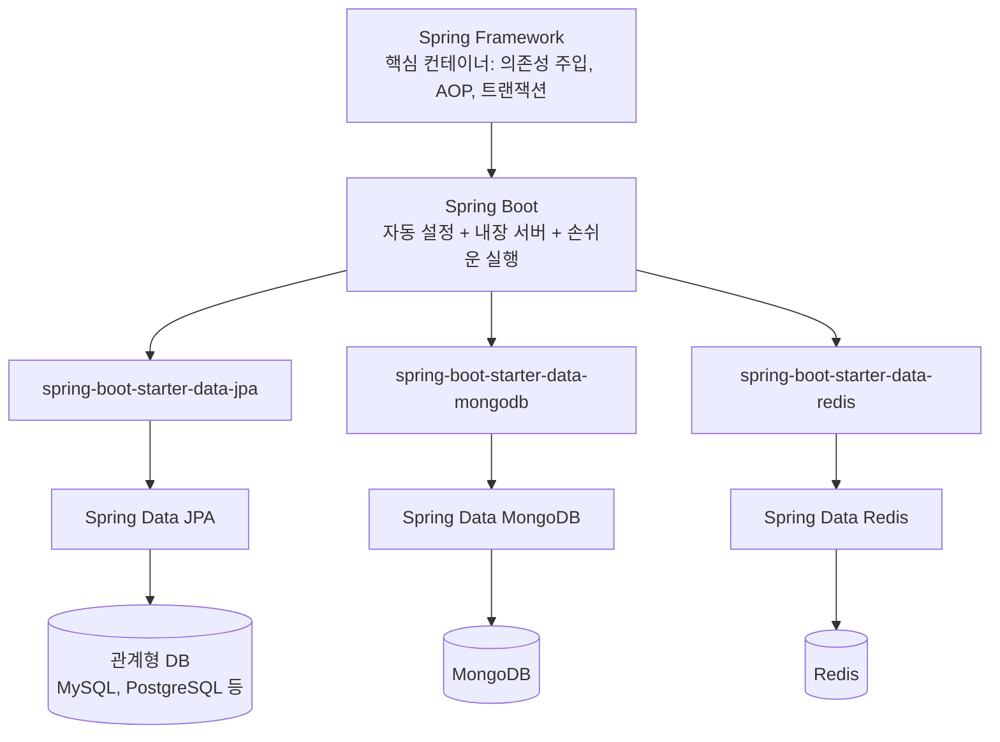
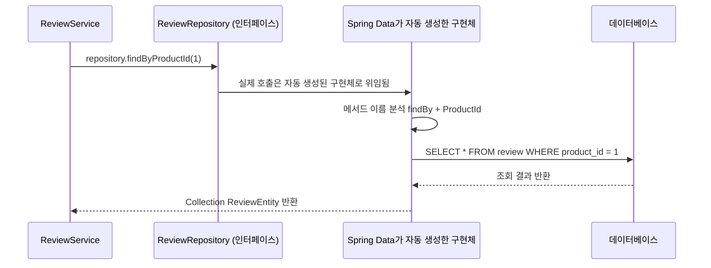
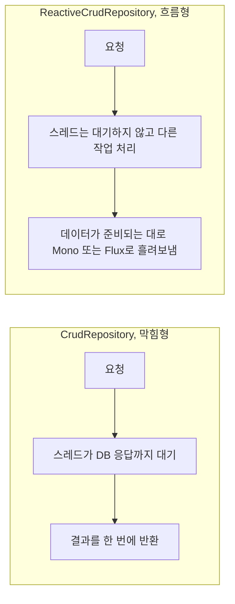
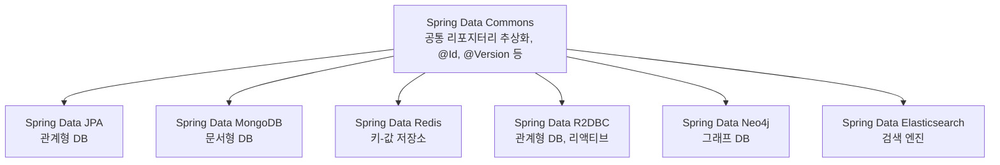

## 왜 자꾸 헷갈릴까: Spring과 Spring Boot와 Spring Data는 서로 다른 층위의 개념이다

Spring 공부가 잘 안 풀리는 가장 흔한 이유는, "Spring"과 "Spring Boot"와 "Spring Data"를 마치 같은 무게의 개념처럼 나란히 놓고 외우려 하기 때문이다. 이 셋은 서로 다른 층위에 있는 것들이라서, 층위를 나눠서 보면 훨씬 정리가 쉬워진다.

가장 아래층에는 **Spring Framework**가 있다. 이것은 자바 객체들을 어떻게 만들고 연결할지를 대신 관리해 주는 핵심 컨테이너다. 의존성 주입(DI), 관점 지향 프로그래밍(AOP), 트랜잭션 관리 같은 것들이 여기에 속한다. 비유하자면 자동차의 섀시와 엔진 같은, 눈에 잘 안 보이지만 모든 것의 토대가 되는 부분이다.

그 위층에는 **Spring Boot**가 있다. Spring Framework를 사람이 직접 설정하려면 XML 설정 파일을 수십 개 써야 할 정도로 번거로운데, Spring Boot는 "이런 상황이면 보통 이렇게 설정하지?" 하는 관례를 자동으로 적용해 주고, 내장 웹 서버까지 포함해서 `main` 메서드 하나로 애플리케이션을 바로 실행할 수 있게 해준다. 자동차에 비유하면, 섀시와 엔진을 조립해서 바로 몰고 나갈 수 있는 완성차를 만들어 주는 조립 라인에 가깝다.

그리고 **Spring Data**는 이 완성차에 들어가는 특정 부품, 그중에서도 "데이터를 저장하고 꺼내오는" 기능을 전담하는 부품군이다. 관계형 데이터베이스든, MongoDB 같은 문서형 데이터베이스든, Redis 같은 키-값 저장소든 상관없이 비슷한 방식으로 데이터를 다룰 수 있게 해주는 것이 Spring Data의 역할이다.



정리하면, Spring Boot는 "애플리케이션을 어떻게 쉽게 띄울까"를 담당하는 상위 프로젝트이고, Spring Data는 그 안에서 "데이터를 어떻게 쉽게 다룰까"만 전담하는 하위 프로젝트다. 둘은 경쟁하는 개념이 아니라, Spring Boot가 Spring Data를 부품처럼 가져다 쓰는 관계다.

## Spring Data를 한 문장으로 정의하면

공식 프로젝트 페이지는 Spring Data의 목표를 이렇게 설명한다. 근본이 되는 데이터 저장소마다 가진 고유한 특징은 그대로 살리면서도, 데이터에 접근하는 방식만큼은 스프링답게 익숙하고 일관된 프로그래밍 모델로 제공하는 것이 Spring Data의 미션이다(출처: spring.io/projects/spring-data, 2026년 8월 확인). 관계형 데이터베이스, 문서형 데이터베이스, 맵-리듀스 프레임워크, 클라우드 기반 데이터 서비스에 이르기까지 여러 종류의 데이터 접근 기술을 쉽게 쓸 수 있도록 도와주는 하나의 우산 같은 프로젝트이며, 그 아래에 데이터베이스별로 특화된 여러 하위 프로젝트가 딸려 있다(출처: spring.io/projects/spring-data, 2026년 8월 확인).

쉽게 풀어보면, Spring Data는 "여러 브랜드의 TV를 같은 리모컨으로 조작하게 해주는 통합 리모컨"과 비슷하다. TV 브랜드마다 내부 회로는 다르지만, 사용자는 "전원", "채널 변경" 같은 똑같은 버튼을 누르면 된다. 마찬가지로 MySQL이든 MongoDB든 Redis든, 개발자는 `save()`, `findById()` 같은 익숙한 메서드만 호출하면 되고, 그 뒤에서 각 데이터베이스에 맞는 실제 통신은 Spring Data가 알아서 처리해 준다.

## Spring Data가 없다면 어떤 일이 벌어질까

Spring Data JPA 프로젝트 페이지는 이 문제를 정확히 짚는다. 애플리케이션의 데이터 접근 계층을 직접 구현하는 일은 상당히 번거로운데, 아주 단순한 조회 쿼리 하나를 실행하는 데도 반복적인 코드를 너무 많이 작성해야 하고, 여기에 페이징이나 감사 로그(auditing) 같은 흔히 필요한 기능까지 더하면 순식간에 복잡도가 커진다는 것이다(출처: spring.io/projects/spring-data-jpa, 2026년 8월 확인).

전통적인 방식으로 데이터베이스에서 사용자 목록을 조회하려면, 개발자는 커넥션을 열고, SQL 문장을 문자열로 조립하고, 파라미터를 바인딩하고, 결과 집합(ResultSet)을 한 줄씩 순회하며 자바 객체로 변환하고, 마지막에 커넥션을 닫는 코드를 매번 반복해서 작성해야 한다. 조회할 조건이 조금만 바뀌어도 이 과정을 통째로 다시 손봐야 한다. Spring Data는 바로 이 반복 작업을 없애 준다. 개발자는 "무엇을 조회하고 싶은지"만 인터페이스로 선언하면, 실제 구현 코드는 Spring Data가 실행 시점에 자동으로 만들어 준다.

## 핵심 개념 하나: 엔티티(Entity)

엔티티는 데이터베이스에 저장될 데이터가 어떤 모양인지를 자바 클래스로 표현한 것이다. 책의 예제에 나오는 `ReviewEntity`를 보면 이 개념이 잘 드러난다.

```java
import jakarta.persistence.Entity;
import jakarta.persistence.Id;
import jakarta.persistence.IdClass;
import jakarta.persistence.Table;

public class ReviewEntity {
    @Id private int productId;
    @Id private int reviewId;
    private String author;
    private String subject;
    private String content;
}
```

이 코드에서 눈여겨볼 부분은 애너테이션이 두 가지 성격으로 나뉜다는 점이다. `@Entity`, `@Table`, `@IdClass`는 관계형 데이터베이스, 그중에서도 JPA(Jakarta Persistence API)라는 자바 표준 기술에 특화된 애너테이션이다. 반면 같은 책에 등장하는 MongoDB용 엔티티인 `RecommendationEntity`는 다른 애너테이션 조합을 쓴다.

```java
import org.springframework.data.annotation.Id;
import org.springframework.data.annotation.Version;
import org.springframework.data.mongodb.core.mapping.Document;

public class RecommendationEntity {
    @Id
    private String id;

    @Version
    private int version;

    private int productId;
    private int recommendationId;
    private String author;
    private int rate;
    private String content;
}
```

여기서 `@Id`와 `@Version`은 어떤 데이터베이스를 쓰든 공통으로 쓰이는 일반 Spring Data 애너테이션이고, `@Document`만 MongoDB 하위 프로젝트에 특화된 표시다. 이걸 구분하는 방법은 사실 코드 맨 위의 `import` 문을 보면 된다. `org.springframework.data.annotation` 패키지에서 가져온 것은 여러 데이터베이스에 공통인 애너테이션이고, `jakarta.persistence`나 `org.springframework.data.mongodb`처럼 특정 기술 이름이 들어간 패키지에서 가져온 것은 그 기술에만 쓰이는 애너테이션이다.

| 애너테이션 | 출처 패키지 | 성격 |
|---|---|---|
| `@Id` | `org.springframework.data.annotation` | Spring Data 공통 (모든 하위 프로젝트에서 사용) |
| `@Version` | `org.springframework.data.annotation` | Spring Data 공통, 낙관적 잠금(버전 충돌 감지)에 사용 |
| `@Entity`, `@Table`, `@IdClass` | `jakarta.persistence` | JPA(관계형 DB) 전용 |
| `@Document` | `org.springframework.data.mongodb.core.mapping` | Spring Data MongoDB 전용 |

이렇게 정리하면 "왜 어떤 프로젝트는 `@Entity`를 쓰고 어떤 프로젝트는 `@Document`를 쓰는지" 헷갈리지 않을 수 있다. 데이터가 어느 저장소에 들어가느냐에 따라 그 저장소 전용 애너테이션만 바뀌고, 공통 개념을 나타내는 애너테이션은 그대로 유지된다.

## 핵심 개념 둘: 리포지터리(Repository)

리포지터리는 데이터를 저장하고 조회하는 창구 역할을 하는 자바 인터페이스다. 여기서 가장 신기하면서도 처음 배울 때 가장 헷갈리는 지점이 나온다. 리포지터리는 **인터페이스만 선언하면 되고, 실제 구현 코드는 개발자가 작성하지 않는다.** Spring Data가 애플리케이션이 시작될 때 이 인터페이스를 보고 알아서 실제로 동작하는 클래스를 만들어 끼워 넣는다.

```java
import org.springframework.data.repository.CrudRepository;

public interface ReviewRepository extends
    CrudRepository<ReviewEntity, ReviewEntityPK> {
    Collection<ReviewEntity> findByProductId(int productId);
}
```

`CrudRepository`는 Spring Data가 기본으로 제공하는 인터페이스로, 이름 그대로 생성(Create), 조회(Read), 갱신(Update), 삭제(Delete) 작업을 위한 표준 메서드를 미리 다 만들어서 제공한다. 개발자는 이걸 상속만 하면 `save()`, `delete()`, `findById()` 같은 메서드를 별도 구현 없이 바로 쓸 수 있다.

그런데 위 코드에는 `CrudRepository`가 기본으로 제공하지 않는 `findByProductId`라는 메서드도 선언되어 있다. 이것이 Spring Data의 가장 강력한 기능 중 하나인 **메서드 이름 기반 쿼리 생성**이다. 개발자가 SQL을 한 줄도 쓰지 않았는데도, Spring Data는 `findByProductId`라는 이름 자체를 해석해서 "`productId`라는 속성값이 일치하는 데이터를 찾아 달라"는 의미로 받아들이고, 실행 시점에 실제 조회 쿼리를 자동으로 만들어 실행한다. 이 방식은 `findBy`, `readBy`, `queryBy`, `countBy`, `getBy` 같은 정해진 접두어로 시작해서, 그 뒤에 엔티티의 속성 이름을 이어 붙이는 규칙을 따른다(출처: docs.spring.io, Spring Data JPA 공식 문서, 2026년 8월 확인). 예를 들어 이메일과 성(姓)으로 동시에 조회하고 싶다면 `findByEmailAddressAndLastname`처럼 `And`나 `Or` 같은 키워드를 이어서 조합할 수 있다(출처: docs.spring.io, Spring Data JPA 공식 문서, 2026년 8월 확인). 다만 조건이 너무 많아지고 메서드 이름이 지나치게 길어지면 가독성이 떨어지므로, 그럴 때는 `@Query` 애너테이션으로 직접 쿼리를 작성하는 방식을 함께 쓰는 것이 권장된다(출처: docs.spring.io, Spring Data JPA 공식 문서, 2026년 8월 확인).

정리하면, "마법처럼 알아서 동작하는 것"이 아니라 "정해진 이름 규칙을 따르면 자동으로 구현해 주는 것"이라고 이해하면 된다. 규칙만 지키면 코드를 아예 쓸 필요가 없다는 점이 핵심이다.



책 예제에서 이 리포지터리를 실제로 쓰는 코드도 함께 살펴보면 이해가 더 쉬워진다.

```java
private final ReviewRepository repository;

public ReviewService(ReviewRepository repository) {
    this.repository = repository;
}

public void someMethod() {
    repository.save(entity);
    repository.delete(entity);
    repository.findByProductId(productId);
}
```

서비스 클래스는 리포지터리 "인터페이스"만 알면 되고, 그 뒤에서 실제로 어떤 데이터베이스와 통신하는지, SQL이 어떻게 생겼는지는 전혀 신경 쓰지 않는다. 생성자에 리포지터리를 주입받아서 그냥 메서드를 호출하기만 하면 된다.

## 막힘형과 흐름형: CrudRepository와 ReactiveCrudRepository

책 예제 후반부에는 `ReactiveCrudRepository`라는, 조금 다른 성격의 인터페이스도 등장한다.

```java
import org.springframework.data.repository.reactive.ReactiveCrudRepository;
import reactor.core.publisher.Flux;

public interface RecommendationRepository extends
    ReactiveCrudRepository<RecommendationEntity, String> {
    Flux<RecommendationEntity> findByProductId(int productId);
}
```

일반 `CrudRepository`는 메서드를 호출하면 결과가 준비될 때까지 그 스레드가 멈춰서 기다린다. 택배로 치면, 주문한 물건이 도착할 때까지 문 앞에 서서 기다리는 것과 같다. 이런 방식을 "막힘형(blocking)"이라고 부른다.

반면 `ReactiveCrudRepository`는 메서드가 객체나 컬렉션을 직접 돌려주지 않고, `Mono`나 `Flux`라는 특수한 객체를 돌려준다. 이 두 객체는 아직 도착하지 않은 데이터를 나타내는 일종의 "예약증"이다. 호출한 스레드는 결과를 기다리며 멈춰 있지 않고 곧바로 다른 일을 하러 가고, 데이터가 실제로 준비되면 그때 흘려보내(stream) 준다. 택배에 비유하면, 문 앞에서 기다리는 대신 다른 일을 보다가 벨이 울리면 그때 받으러 나가는 방식이다. `Mono`는 0개 또는 1개의 데이터를, `Flux`는 0개부터 여러 개까지의 데이터를 이런 방식으로 다룬다.



중요한 제약도 함께 알아 두면 좋다. 리액티브 방식의 인터페이스는 논블로킹 I/O를 지원하는 리액티브 데이터베이스 드라이버가 있는 하위 프로젝트에서만 쓸 수 있다. Spring Data MongoDB는 리액티브 리포지터리를 지원하지만, Spring Data JPA는 이를 지원하지 않는다. 즉, MySQL이나 PostgreSQL처럼 JPA로 다루는 관계형 데이터베이스에서는 `ReactiveCrudRepository`를 쓸 수 없고, `CrudRepository`(또는 이를 확장한 `JpaRepository`)를 써야 한다. 관계형 데이터베이스를 리액티브 방식으로 다루고 싶다면 JPA 대신 Spring Data R2DBC라는 별도의 하위 프로젝트를 사용해야 한다.

## Spring Data라는 우산 아래 있는 하위 프로젝트들

Spring Data는 그 자체로 하나의 라이브러리가 아니라, 데이터베이스 종류별로 나뉜 여러 하위 프로젝트를 한데 묶은 우산 프로젝트다. 공식 사이트가 정리한 주요 모듈은 다음과 같다(출처: spring.io/projects/spring-data, 2026년 8월 확인).

| 하위 프로젝트 | 다루는 대상 |
|---|---|
| Spring Data Commons | 모든 Spring Data 모듈이 공유하는 핵심 개념과 인프라 |
| Spring Data JPA | JPA 기반 리포지터리 (관계형 데이터베이스) |
| Spring Data Relational (JDBC/R2DBC) | JDBC 및 R2DBC 기반 리포지터리 (관계형 데이터베이스, R2DBC는 리액티브 방식) |
| Spring Data KeyValue | `Map` 기반 리포지터리, 키-값 저장소용 모듈을 만들기 위한 SPI |
| Spring Data LDAP | Spring LDAP 기반 리포지터리 |
| Spring Data MongoDB | MongoDB용 객체-문서 매핑 및 리포지터리 |
| Spring Data Redis | Redis에 손쉽게 접근하고 설정하는 기능 |
| Spring Data REST | Spring Data 리포지터리를 하이퍼미디어 기반 REST 리소스로 그대로 노출 |
| Spring Data for Apache Cassandra | 고가용성, 대규모 데이터 처리에 적합한 Cassandra 연동 |
| Spring Data Elasticsearch | Elasticsearch용 모듈 (커뮤니티 모듈) |
| Spring Data Neo4j | 그래프 데이터베이스 Neo4j용 객체-그래프 매핑 및 리포지터리 (커뮤니티 모듈) |
| Spring Data Couchbase | Couchbase용 모듈 (커뮤니티 모듈) |

이 표에서 눈여겨볼 점은, 모든 모듈이 결국 "Spring Data Commons"라는 공통 기반 위에 세워져 있다는 것이다. `@Id`, `@Version` 같은 공통 애너테이션이나 리포지터리를 다루는 기본 방식은 Commons에서 정의되고, 각 하위 프로젝트는 여기에 자기 데이터베이스만의 특화 기능(`@Entity`, `@Document` 같은 애너테이션이나 리액티브 지원 여부 등)을 얹는 구조다.



## 지금 이 시점의 버전 현황

Spring 생태계는 버전이 자주 바뀌기 때문에, 책이나 오래된 자료를 볼 때 지금 시점과 어떤 차이가 있는지 함께 확인해 두는 것이 안전하다. 아래 내용은 이 문서를 작성한 시점(2026년 8월)에 공식 자료를 직접 확인한 결과다.

| 항목 | 확인된 내용 | 출처 |
|---|---|---|
| Spring Boot 최신 버전 | 4.1.x 계열이 최신이며, 2026년 6월 10일에 4.1.0이 정식 출시됨 | spring.io 공식 블로그, 2026년 6월 10일 게시 |
| Spring Boot 4.0 출시일 | 2025년 11월 20일 정식 출시 | spring.io 공식 블로그, 2025년 11월 20일 게시 |
| Spring Boot 3.x 지원 상태 | 3.5 계열이 2026년 6월 30일부로 오픈소스 지원 종료(EOL) | endoflife.date, 2026년 8월 21일 갱신 기준 |
| Spring Data 릴리스 트레인 | 2026.0 계열이 현재 릴리스 트레인이며, CalVer(연도 기반 버전) 방식을 따름 | spring.io/projects/spring-data, 2026년 8월 확인 |
| Spring Data JPA 배포 방식 | Spring Boot를 쓰면 버전을 직접 지정하지 않아도 Spring Boot가 적절한 Spring Data 버전을 자동으로 선택해 줌 | docs.spring.io, Spring Data JPA 공식 문서, 2026년 8월 확인 |

여기서 짚어 둘 부분이 있다. 첨부된 책 예제는 `jakarta.persistence` 패키지를 사용하고 있어 Jakarta EE 9 이상, 즉 Spring Boot 3 계열을 기준으로 하고 있다. 이는 여전히 개념적으로 유효한 코드이며 지금도 정상적으로 동작하지만, 2026년 8월 현재 시점에서 새로 프로젝트를 시작한다면 이미 오픈소스 지원이 끝난 Spring Boot 3.x보다는 Spring Framework 7을 기반으로 하는 Spring Boot 4.1 계열을 선택하는 것이 유지보수 측면에서 더 안전하다. 다만 엔티티와 리포지터리라는 핵심 개념, `@Entity`·`@Document` 같은 애너테이션의 역할, `findByProductId` 같은 메서드 이름 기반 쿼리 생성 방식은 버전이 올라가도 바뀌지 않는 Spring Data의 근본 개념이므로, 책으로 이 개념을 익히는 데는 문제가 없다.

## 한 문장으로 다시 정리하면

Spring Data는 "어떤 데이터베이스를 쓰든, 인터페이스만 선언하면 저장하고 조회하는 코드는 알아서 만들어 주는 스프링의 데이터 접근 도구 모음"이다. 엔티티로 "무엇을 저장할지"를 정의하고, 리포지터리로 "어떻게 꺼내올지"를 선언하기만 하면, 나머지 반복적인 코드는 Spring Data가 대신 써 준다.

## 참고 자료

- Spring 공식 프로젝트 페이지, "Spring Data" (spring.io/projects/spring-data)
- Spring 공식 프로젝트 페이지, "Spring Data JPA" (spring.io/projects/spring-data-jpa)
- Spring Data JPA 공식 문서, "JPA Query Methods" (docs.spring.io/spring-data/jpa/reference/jpa/query-methods.html)
- Spring 공식 블로그, "Spring Boot 4.0.0 available now" (2025년 11월 20일)
- Spring 공식 블로그, "Spring Boot 4.1.0 available now" (2026년 6월 10일)
- endoflife.date, "Spring Boot" 지원 종료 일정 페이지 (2026년 8월 21일 갱신)
- 첨부된 책 예제: 《스프링 부트 3와 스프링 클라우드를 활용한 마이크로서비스 구축》 02장, 43~46쪽

---

작성일: 2026년 8월 28일
