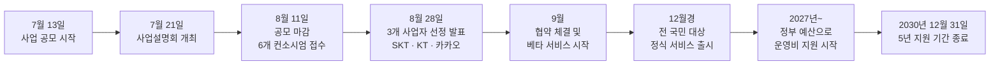

## 목차

1. 개요: '모두의 AI'란 무엇인가
2. 사업 추진 일정
3. 사업자 선정 결과와 심사 과정
4. 선정된 3개 컨소시엄 상세
   4.1 SK텔레콤 컨소시엄
   4.2 KT 컨소시엄
   4.3 카카오 컨소시엄
5. 정부 지원 내용: GPU와 예산
6. 국산 AI 모델 활용 조건과 외산 모델 제한
7. '무료'의 실제 범위: 기본 기능과 유료화 가능성
8. 네이버는 왜 참여하지 않았나
9. 종합 정리와 남은 과제
10. 출처 투명성 표
참고문헌


```
https://www.threads.com/share/BAXidGjgMs/

챗GPT에 매달 돈 내고 있으면
이건 알아야 함.
어제 정부가 전 국민 무료 AI
사업자를 확정했음.
6곳이 붙어서 SK텔레콤, 카카오,
KT 3곳이 남았음.
비용도, 이용량 제한도 없다고 함.
그런데 네이버는 지원조차 안 했음.
자체 모델 하이퍼클로바X를
갖고 있는데도.

사업 이름은 '모두의 AI'임.
국민 누구나 비용과
이용량 제한 없이 쓰는
범용 AI 챗봇과
공공 AI 에이전트를 만듦.

진입점은 이미 정해져 있음.
카카오는 카카오톡,
KT는 다음 포털,
SK텔레콤은 앱과 웹에
전화와 문자까지 붙임.
디지털 취약계층도 쓰라는 취지임.

9월에 협약을 맺고
베타를 거쳐 올해 안에
정식 서비스를 연다는 계획임.

정부가 대는 건 두 가지임.

엔비디아 B200 GPU 512장.
3사를 다 합쳐서 512장이고
한 곳당 256장 아니면 128장임.

돈은 내년부터 들어감.
2027년부터 전 국민 서비스
운영비를 정부 예산으로 댐.
협약일부터 2030년
12월 31일까지 5년임.

그러니까 무료라는 건
쓰는 사람이 안 낸다는 뜻이지
아무도 안 낸다는 뜻이 아님.

대신 조건이 붙었음.

서비스에 쓰는 AI 모델 중
자기 회사 국산 모델이 50% 이상,
다른 국내 기업의 국산 모델이
30% 이상이어야 함.

계산하면 20%가 남는데
과기정통부 인공지능정책과장이
못을 박았음.

"외산 모델을 최대 20%까지
쓸 수 있다는 의미는
절대 아니다."

외산을 쓴 만큼은
정부 지원을 주지 않음.

네이버가 빠진 자리가 여기임.

하이퍼클로바X라는
자체 모델이 있어도
남의 회사 국산 모델을
30% 이상 태워야 함.
짧은 구축 기간과 초기 투자 비용도
부담으로 꼽혔음.

네이버 관계자는 지난 18일
이렇게 말했음.

"모두의 AI 사업은
네이버클라우드에서 참여 검토를
하긴 했으나, 최종적으로
불참을 결정했다."

이미 하는 AI 사업에
역량을 더 집중하겠다는 이유였음.

'무료'의 범위도
이미 정해져 있음.

기본 기능은 무료로 주되
고도화·특화 기능은
유료화를 허용함.
정부가 사업설명회에서
직접 밝힌 방침임.

과기정통부 서기관은
이렇게 말했음.

"기업에 전략이 있다면
기본 기능을 넘어서는
유료 서비스는
당연히 허용해야 한다."

어디까지가 공짜인지는
서비스가 나와야 알 수 있음.

정리하면 이렇게 됨.

6곳이 붙어서 3곳이 남았고
네이버는 지원조차 하지 않았고
전 국민이 쓰게 될 AI의
절반 이상은 국산 모델이 돌림.

베타는 9월부터 회사별로,
정식 서비스는 올해 안.

잘 되면 챗GPT 구독료가
남의 얘기가 되고
안 되면 2030년까지 예산이
들어간 뒤에 정리됨.

둘 중 뭐가 될지는
연말에 처음 써보는 사람들이 정함.

🔗 https://www.yna.co.kr/view/AKR20260828050100017

AI 업계 흐름, 계속 정리해서 올릴 예정. 팔로우 해두면 놓치지 않음

```


---

## 1. 개요: '모두의 AI'란 무엇인가

'모두의 AI'는 과학기술정보통신부와 정보통신산업진흥원(NIPA)이 추진하는 사업으로, 국산 인공지능 모델을 기반으로 국민 누구나 비용이나 이용량 제한 없이 쓸 수 있는 범용 AI 챗봇과 공공 AI 에이전트를 만드는 것을 목표로 한다. 정식 명칭은 '전 국민 AI 서비스 보편적 활용 지원'이며, 줄여서 '모두의 AI'로 불린다.

과기정통부 인공지능정책기획과장은 사업설명회에서 이 사업의 취지를 이렇게 설명했다. 1446년 세종대왕이 한글을 창제한 이후 문맹률이 크게 낮아졌던 것처럼, 지금 시대에는 AI 활용 능력이 모든 국민이 갖춰야 할 기초 역량이 되었다는 것이다[12]. 즉 이 사업은 단순히 챗봇 하나를 무료로 푸는 것이 아니라, AI를 산수나 한글 읽기처럼 전 국민이 접근할 수 있는 기본 인프라로 만들겠다는 정책 목표를 담고 있다.

사업의 핵심 조건은 두 가지다. 하나는 서비스에 쓰이는 AI 모델의 대부분을 국산 모델로 채워야 한다는 것이고, 다른 하나는 정부가 GPU와 운영 예산을 지원하는 대신 기업은 국민 누구나 쓸 수 있는 형태로 서비스를 열어야 한다는 것이다. 이 두 조건이 사업 전체의 구조를 결정했다.

## 2. 사업 추진 일정

사업은 2026년 7월 13일 공모 시작으로 본격화됐다. 과기정통부는 이날부터 8월 11일 오후 5시까지 약 한 달간 사업 공모를 진행했고[14], 그 사이인 7월 21일 서울 마포구 프론트원에서 사업설명회를 열어 공모 세부 조건과 평가 방식을 공개했다[11]. 이 설명회에는 네이버·카카오와 통신 3사, 업스테이지·이스트소프트·솔트룩스·리벨리온 등 100여 개 기업이 참석했다[11].

공모 마감 결과 SK텔레콤, KT, 카카오, 이스트소프트, 제논, MKD 등 총 6개 컨소시엄이 제안서를 제출했다[7][8]. 과기정통부는 이 6곳을 대상으로 서면평가와 발표평가를 거쳐 8월 28일 SK텔레콤·KT·카카오 등 3개 컨소시엄을 최종 사업 수행기관으로 선정했다고 발표했다[1][4].

이후 일정은 9월 중 선정 기업과의 협약 체결, 기업별 준비 상황에 맞춘 베타 서비스 운영, 그리고 12월경 전 국민 대상 정식 서비스 출시로 이어진다[11][4]. 정부는 2027년 이후에는 이 서비스를 자산관리, 학습 코칭, 노후 설계 등을 담당하는 '전 국민 1인 1 에이전트' 체계로 단계적으로 고도화한다는 계획도 밝힌 바 있다[13].

아래는 전체 진행 흐름을 정리한 것이다.



## 3. 사업자 선정 결과와 심사 과정

과기정통부는 6개 컨소시엄을 대상으로 서면평가와 발표평가 두 단계로 심사를 진행했다. 서면평가에서는 AI 모델·서비스 경쟁력, GPU 활용 및 인프라 운영 계획 등 기술 적합성을 적합·부적합으로 가렸고, 발표평가에서는 프로토타입 시연과 함께 서비스 편의성, 이용자 확보 전략, 품질·안전성 확보 계획, 생태계 기여 계획을 종합 심사했다[4]. 평가 점수와 순위는 참여 기업들의 요청에 따라 공개되지 않았다[4].

이 심사에서 탈락한 곳은 이스트소프트 컨소시엄과 중소·중견 기업인 MKD, 제논이다[1]. 제논은 지난해부터 개발해 올해 5월부터 운영해온 통합 AI 포털 '제나(XENA)'를 내세웠고, MKD는 자체 업무자동화 플랫폼 '큐럴(Keural)'을 기반으로 온프레미스와 SaaS를 모두 지원한다는 점을 강점으로 제시했으나 선정되지 못했다[8]. 과기정통부는 최종 선정된 3곳이 대국민 접점과 공공 AI 에이전트 서비스 계획 등에서 더 높은 평가를 받았다고 설명했다[1].

한 가지 눈여겨볼 대목은 이번에 선정된 3개 컨소시엄이 정부의 또 다른 사업인 '독자 AI 파운데이션 모델(독파모)' 프로젝트와 깊이 얽혀 있다는 점이다. 독파모 프로젝트에 참여해온 정예팀 4곳이 이번 세 컨소시엄에 나뉘어 들어갔는데, SK텔레콤은 독파모 주관기관을 맡았고, LG AI연구원은 카카오 컨소시엄에, 업스테이지와 모티프테크놀로지스는 KT 컨소시엄에 각각 참여했다[4]. 독파모 2차 단계평가에서 탈락한 모티프테크놀로지스의 '모티프 3' 모델은 오히려 SK텔레콤과 KT 두 컨소시엄의 활용 모델에 모두 포함됐다[4]. 즉 모두의 AI는 독파모에서 검증된 국산 파운데이션 모델들이 실제 서비스로 나가는 통로 역할도 겸하고 있는 셈이다.

## 4. 선정된 3개 컨소시엄 상세

세 컨소시엄 모두 정부가 요구한 국산 AI 모델 활용 요건을 충족할 수 있는 기술·협력 기반을 갖췄다는 공통점이 있다[3]. 다만 서비스 콘셉트와 진입 전략은 각기 다르다.

### 4.1 SK텔레콤 컨소시엄

SK텔레콤 컨소시엄에는 신한카드, 엘리스그룹 등이 참여했다[1]. 이 컨소시엄이 내세운 개발 목표는 질문 하나만 던지면 나머지 일상 업무를 AI가 대신 끝내주는 서비스다[1]. 구체적으로는 정부24 등 공공서비스와 연계해 증명서 83종을 발급받는 기능을 구현할 계획이며, 이용자의 건강기록을 바탕으로 맞춤 진료 정보를 제안하는 기능도 준비하고 있다[1]. 접근성 측면에서는 앱과 웹뿐 아니라 전화와 문자로도 AI를 사용할 수 있도록 해 디지털 취약계층의 접근성을 높인다는 계획이다[1].

SK텔레콤은 자체 AI 서비스 '에이닷'과 자체 개발 모델 'A.X K2', 그리고 AI 데이터센터 등 인프라를 갖춘 '풀스택' 역량을 강점으로 내세우고 있다[2]. 활용 모델 조합으로는 자체 모델 A.X K2를 중심으로 업스테이지의 '솔라 오픈 2', 모티프테크놀로지스의 '모티프 3', LG AI연구원의 'K-엑사원 2.0'을 제시했다[3].

### 4.2 KT 컨소시엄

KT 컨소시엄에는 다음, 리벨리온, 무신사 등이 참여했다[1]. 이 컨소시엄의 방향은 하나의 연속된 대화 흐름 안에서 정보 탐색부터 공공·특화 서비스의 비교, 판단, 실행까지 지원하는 것이다[5]. 진입 채널로는 다음 포털 및 앱은 물론, 다나와·무신사·직방 등 파트너 서비스 접점에도 AI를 배치해 검색 수요를 AI 서비스로 연결하고, IPTV 등 KT의 통신·미디어 채널 전반과도 연계할 계획이다[5].

KT는 업스테이지, 모티프테크놀로지스와 함께 컨소시엄을 꾸렸으며[9], 활용 모델 조합은 자체 모델 '믿음 K 2.5 Pro'에 업스테이지의 '솔라 프로 4', 모티프테크놀로지스의 '모티프 3'를 더한 형태다[3].

### 4.3 카카오 컨소시엄

카카오는 이번 사업에 가장 적극적으로 임한 곳으로 꼽힌다. 최근 회사를 '카카오AI'와 '카카오X'로 나누는 등 AI 사업에 자원과 정체성을 온전히 걸겠다는 의지를 보여온 만큼, 이번 선정이 갖는 의미가 크다는 평가다[2]. 카카오의 가장 큰 강점은 국민 대다수가 쓰는 카카오톡 플랫폼이며, 자체 모델 '카나나'와 행정안전부와 함께 선보인 AI 국민비서 운영 경험을 바탕으로 컨소시엄을 총괄한다[2].

컨소시엄에는 LG유플러스가 통신 기반 이용 환경 실증을, LG AI연구원이 AI 모델 'K-엑사원'을 제공하는 역할로 참여하며, 서울대병원과 루닛, 신한은행 등 의료·교육·금융 분야 전문 기업이 각 영역의 서비스 완성도를 검증하는 구조다[2]. 활용 모델 조합은 자체 모델 카나나에 LG AI연구원의 '엑사원'과 'K-엑사원 2.0'을 결합하는 방식이다[3].

세 컨소시엄의 구성을 비교하면 다음과 같다.

| 구분 | SK텔레콤 컨소시엄 | KT 컨소시엄 | 카카오 컨소시엄 |
|---|---|---|---|
| 자체 모델 | A.X K2 | 믿음 K 2.5 Pro | 카나나 |
| 함께 쓰는 국산 모델 | 솔라 오픈 2(업스테이지), 모티프 3(모티프테크놀로지스), K-엑사원 2.0(LG AI연구원) | 솔라 프로 4(업스테이지), 모티프 3(모티프테크놀로지스) | 엑사원 · K-엑사원 2.0(LG AI연구원) |
| 주요 참여사 | 신한카드, 엘리스그룹 등 | 다음, 리벨리온, 무신사 등 | LG유플러스, 서울대병원, 루닛, 신한은행 등 |
| 서비스 콘셉트 | 질문 하나로 일상 업무를 대신 처리 | 대화 하나로 공공·생활 서비스를 통합 처리 | 카카오톡 기반 전 국민 접점 확대 |
| 주요 진입점 | 앱·웹, 전화·문자 | 다음 포털·앱, 파트너 서비스, IPTV | 카카오톡 |

## 5. 정부 지원 내용: GPU와 예산

정부 지원은 크게 두 갈래다.

첫째는 GPU다. 정부는 올해 확보한 엔비디아 B200 GPU 총 512장을 선정 기업에 지원한다[14]. 기업당 지원 규모는 256장 또는 128장으로, 기업별로 다르게 배정된다[13]. 다만 어느 기업이 256장을, 어느 기업이 128장을 받는지 구체적인 배분 내역은 별도로 공개되지 않았다.

둘째는 운영 예산이다. 2026년 사업 첫해에는 GPU 인프라만 지원되고 별도의 인건비는 지원되지 않는다[9]. 반면 2027년부터는 전 국민 서비스 운영에 필요한 비용을 정부 예산으로 지원한다[14][1]. 이 지원은 협약 체결일부터 2030년 12월 31일까지, 즉 5년간 이어진다[13][14]. 다시 말해 '무료'라는 표현은 이용자가 비용을 내지 않는다는 뜻이지, 아무도 비용을 부담하지 않는다는 뜻은 아니다. 그 비용은 최소 2027년부터 2030년 말까지 정부 예산, 즉 세금으로 충당된다.

## 6. 국산 AI 모델 활용 조건과 외산 모델 제한

'모두의 AI'에 참여하는 기업은 서비스에 쓰는 AI 모델 구성에서 두 가지 조건을 충족해야 한다. 독자 AI 파운데이션 모델(독파모) 프로젝트 기준에 부합하는 자사의 국산 AI 모델을 50% 이상 사용해야 하고, 여기에 더해 다른 국내 기업이 개발한 국산 AI 모델도 30% 이상 함께 활용해야 한다[7][10]. 이 요건 때문에 사실상 단독 참여가 아니라 복수 기업 간 컨소시엄 구성이 필수적인 구조가 됐다[10][7].

두 조건을 합치면 80%가 되고, 남은 20%를 두고 외산 모델을 자유롭게 쓸 수 있다는 것 아니냐는 해석이 나올 수 있다. 과기정통부는 이 해석을 명확히 부인했다. 인공지능정책기획과장은 사업설명회에서 "외산 모델을 최대 20%까지 쓸 수 있다는 의미는 절대 아니다"라고 못 박았다[11]. 원칙적으로 서비스는 국산 AI 모델로 제공하되, 국산 모델만으로는 구현하기 어려운 최소한의 기능에 한해서만 외산 모델을 제한적으로 허용한다는 취지다[12]. 외산 모델을 쓰려는 기업은 그 필요성과 활용 범위, 국산 모델로 대체하기 어려운 이유를 사업수행계획서에 명시해야 하며[12], 외산 모델을 이용한 부분에는 정부 지원이 적용되지 않는다[14][11]. 즉 외산 모델을 쓰는 만큼은 기업이 자기 비용으로 부담해야 한다.

## 7. '무료'의 실제 범위: 기본 기능과 유료화 가능성

'모두의 AI'가 내세우는 '무료'는 모든 기능이 영원히 공짜라는 뜻은 아니다. 정부는 사업설명회에서 국민에게 필요한 기본 AI 챗봇과 공공 AI 에이전트는 이용량 제한 없이 무료로 제공하되, 이를 넘어서는 고도화·특화 기능에 대해서는 기업이 유료 서비스를 운영할 수 있도록 길을 열어주겠다는 방침을 밝혔다[15]. 인공지능정책기획과 서기관은 그 이유를 이렇게 설명했다. "기업에 전략이 있다면 기본 기능을 넘어서는 유료 서비스는 당연히 허용해야 한다고 생각한다"[15]. 공공성을 해치지 않는 범위에서 기업에도 어느 정도 수익이 나야 서비스가 지속 가능한 생태계로 돌아갈 수 있다는 취지다[15][11].

다만 광고를 포함해 구체적으로 어떤 수익모델까지 허용할지에 대한 일률적인 기준은 아직 제시되지 않았다. 기업마다 서비스 제공 방식과 이용자 접점이 다른 만큼, 사업자 선정 이후 각 기업의 구체적 계획을 놓고 공공성을 해치지 않는 범위에서 개별적으로 협의하겠다는 입장이다[15]. 따라서 어디까지가 무료이고 어디서부터 유료인지 정확한 경계는 실제 서비스가 나와야 확인할 수 있다.

베타 서비스의 운영 방식도 기업마다 다르다. 준비가 끝난 기업은 전 국민을 대상으로 곧바로 서비스를 시작하고, 그렇지 않은 기업은 단계적으로 이용자를 확대하는 방식을 택할 수 있다[11].

## 8. 네이버는 왜 참여하지 않았나

가장 유력한 후보로 꼽혔던 네이버는 결국 이 사업에 참여하지 않았다. 자체 대규모 언어모델 '하이퍼클로바X'를 보유하고 오랜 기간 범용 포털 서비스를 운영해온 경험이 있었던 만큼, 업계에서는 네이버가 유리할 것이라는 전망이 많았다[6][9].

네이버 관계자는 공모 마감일인 8월 18일 이렇게 밝혔다. "모두의 AI 사업은 네이버클라우드에서 참여 검토를 하긴 했으나, 최종적으로 불참을 결정했다"[6]. 이미 추진 중인 AI 검색, 기업간거래(B2B) 인프라 등 다른 AI 사업에 역량을 더 집중하겠다는 것이 공식적으로 밝힌 이유다[6].

여기서 분명히 짚어야 할 것은, 이 공식 설명 외에 언론에서 거론된 여러 배경 요인들은 어디까지나 업계의 분석과 추정이라는 점이다. 예컨대 자사 모델을 50% 이상 쓰더라도 다른 기업의 국산 모델을 30% 이상 함께 써야 하는 컨소시엄 구조가 자체 모델과 플랫폼을 모두 가진 네이버에게는 서비스 설계의 자유도를 낮추는 부담으로 작용했을 수 있다는 분석이 있다[17]. 짧은 구축 기간과 초기 투자 비용 부담도 함께 거론된다. 다만 이런 요인들이 불참을 직접적으로 결정한 원인이라는 근거는 확인되지 않았으며[17], 네이버클라우드가 2026년 1월 독자 AI 파운데이션 모델(독파모) 1차 평가에서 탈락한 이력이 있다는 사실도 모두의 AI 불참과 직접 연결 짓기는 어렵다[17]. 요컨대 네이버의 불참 이유로 확인된 것은 "기존 사업에 집중하겠다"는 공식 입장뿐이며, 그 이상의 해석은 추측의 영역에 속한다.

네이버가 빠진 자리에서 통신 3사 중 SK텔레콤과 KT, 그리고 카카오가 최종 선정됐고, 나머지 이스트소프트와 제논, MKD는 탈락했다.

## 9. 종합 정리와 남은 과제

정리하면 '모두의 AI'는 6개 컨소시엄이 지원해 SK텔레콤·KT·카카오 3곳이 선정됐고, 유력 후보였던 네이버는 지원조차 하지 않았다. 선정된 기업들은 자사 국산 모델을 50% 이상, 타사 국산 모델을 30% 이상 조합해 서비스를 만들어야 하며, 외산 모델은 국산으로 대체하기 어려운 최소한의 경우에만 제한적으로 쓸 수 있다. 9월 협약과 베타 서비스를 거쳐 12월경 정식 서비스가 나올 예정이며, 기본 기능은 무료지만 고도화·특화 기능은 유료화될 수 있다. GPU는 올해 512장이 투입되고, 운영 비용은 2027년부터 2030년 말까지 정부 예산으로 지원된다.

남은 과제도 분명하다. 촉박한 개발 일정 안에서 국산 모델만으로 외산 최상위 모델 수준의 품질을 낼 수 있을지, GPU 지원 범위를 넘어서는 트래픽이 몰렸을 때 서비스 품질을 유지할 수 있을지, 그리고 5년의 정부 예산 지원이 끝나는 2030년 말 이후에도 서비스가 자생적으로 지속될 수 있을지는 아직 확인되지 않았다. 실제로 사업설명회에서도 한 참석 기업 대표는 모델 크기를 키우면 수용 가능한 트래픽이 줄고 모델을 작게 하면 품질 문제가 생긴다는 점, 서비스 출시 초기에 관심이 몰릴 경우 트래픽을 감당하지 못할 수 있다는 점을 우려로 제기한 바 있다[11]. 이 사업이 실제로 국민 다수가 체감할 수 있는 서비스로 자리 잡을지, 아니면 예산만 소진한 채 흐지부지될지는 12월 정식 서비스 출시 이후 실사용자들의 반응에 달려 있다.

## 10. 출처 투명성 표

| 구분 | 내용 |
|---|---|
| 정부 공식 발표·발언 기반 (1차 확인) | 사업자 선정 결과(SKT·KT·카카오), 국산 모델 50%+30% 요건, 외산 모델 관련 과기정통부 과장 발언, 유료화 관련 서기관 발언, GPU 512장 및 256/128장 배정, 2027~2030년 예산 지원 기간, 9월 협약·12월 정식 서비스 일정 |
| 복수 언론 보도로 교차 검증된 사실 (웹 검증) | 6개 컨소시엄 명단과 탈락 기업(이스트소프트·제논·MKD), 각 컨소시엄의 참여사 구성과 활용 모델 조합, 네이버 관계자의 불참 관련 발언, 독파모 프로젝트와의 연계 구조 |
| 업계 분석·추정으로 명시적으로 구분해야 하는 내용 | 네이버 불참의 구체적 배경(컨소시엄 구조 부담, 구축 기간·투자 비용 부담, 독파모 1차 탈락 이력과의 연관성) — 이는 공식적으로 확인되지 않은 업계의 해석이며, 네이버가 밝힌 공식 이유는 "기존 사업에 역량 집중"뿐임 |

---

## 참고문헌

[1] 한국경제, "모두의 AI 사업자에 SKT·KT·카카오 선정", 2026.08.28, https://www.hankyung.com/article/2026082801001

[2] 비즈워치, "'모델 아닌 확산'…SKT·KT·카카오, '모두의 AI' 승부수", 2026.08.26, https://news.bizwatch.co.kr/article/mobile/2026/08/26/0034

[3] 데일리안, "'모두의 AI' 가른 건 '서비스 확장성'…SKT·KT·카카오, 수천만 이용자 AI로 연결(종합)", 2026.08.28, https://www.dailian.co.kr/news/view/1683623

[4] 서울파이낸스, "'모두의 AI' 프로젝트 참가 사업자에 SKT·카카오·KT 선정", 2026.08.28, https://www.seoulfn.com/news/articleView.html?idxno=636694

[5] 파이낸스스코프, "모두의 AI 프로젝트, SKT·카카오·KT 선정", 2026.08.28, https://www.finance-scope.com/article/view/scp202608280014

[6] 데일리안, "네이버, '모두의 AI' 불참…AI 팩토리 등 기존 사업에 역량 집중", 2026.08.18, https://www.dailian.co.kr/news/view/1679521

[7] 데일리안, "'모두의 AI'에 SKT·KT·카카오 등 6곳 참여…네이버는 불참", 2026.08.18, https://m.dailian.co.kr/news/view/1679580

[8] 천지일보, "네이버 빠진 'AI 국민 서비스' 레이스, 6파전으로", 2026.08.18, https://www.newscj.com/news/articleView.html?idxno=3426148

[9] 파이낸셜뉴스, "[단독] '모두의 AI' 사업, 네이버는 참여 안한다", 2026.08.18, https://www.fnnews.com/news/202608181419062253

[10] 서울경제, "네이버, '모두의 AI' 사업 불참…통신 3사·카카오 참여", 2026.08.18, https://www.sedaily.com/article/20080432

[11] 유니콘팩토리, "'모두의 AI', 고도화 기능 유료 허용…외산 모델 최소화", 2026.07.21, https://www.unicornfactory.co.kr/article/2026072112012025760

[12] 뉴스후플러스, "[현장] 정부표 '모두의 AI' 연내 출격… 전 국민 '인공지능 에이전트' 보급 목표", 2026.07.21, https://www.newswhoplus.com/news/articleView.html?idxno=65040

[13] 연합뉴스(다음 재게재), "[AI픽] '모두의 AI' 본격 추진…정부 '필수 AI 무료 제공'", 2026.07.21, https://v.daum.net/v/UAvM0aLxXX

[14] 서울경제, "'모두의 AI' 공모 시작…GPU 512장 투입해 연내 서비스 출시", 2026.07.13, https://www.sedaily.com/article/20067084

[15] 뉴시스, "'기본 기능은 무료, 고도화는 유료'…'모두의 AI' 윤곽 나왔다", 2026.07.21, https://www.newsis.com/view/NISX20260721_0003716823

[16] 아이뉴스24, "이통3사·카카오 '모두의 AI' 출사표⋯네이버는 불참", 2026.08.18, http://www.inews24.com/view/1995974

[17] 와블라이프, "네이버가 정부의 무료 AI 사업을 거절한 이유 - 카카오·KT와 다른 AI 전략" (업계 분석 성격의 글, 공식 확인되지 않은 해석 포함), https://www.wablelife.com/2026/08/naver-ai-strategy.html
