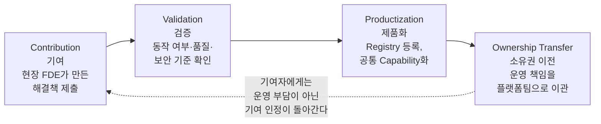
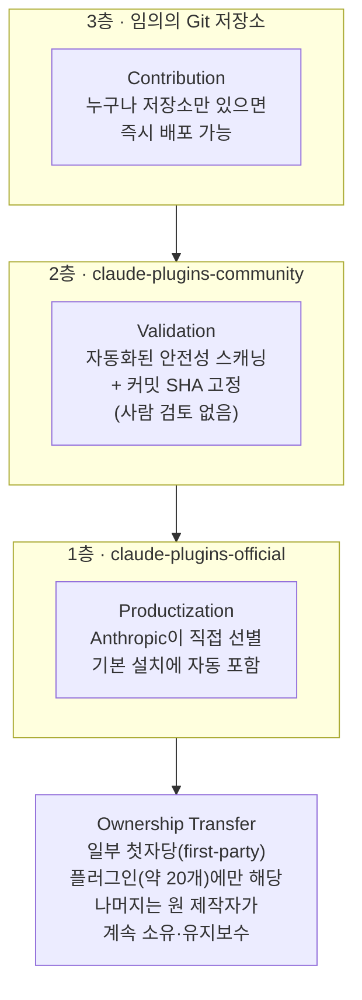
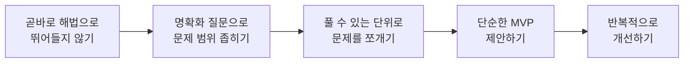

- 원문: Facebook 게시물 (2026), "단상 — 좋은 플랫폼은 FDE가 해결한 것을 먹어야 한다"
- 작성일: 2026년 8월 29일 (해설 문서)

```
단상

좋은 플랫폼은 FDE가 해결한 것을 먹어야 한다

요즘 FDE 이야기를 많이 한다.

현장에 들어가고,
문제를 이해하고,
Agent를 만들고,
업무를 바꾼다.

좋은 방향이다.

그런데 한 가지가 계속 마음에 걸린다.

FDE 한 명이 정말 좋은 문제 해결 방법을 만들었다고 하자.

Agent를 만들었고,
Tool을 연결했고,
Prompt를 다듬었고,
Workflow를 만들었고,
평가 기준까지 찾아냈다.

그 다음은 무엇인가.

좋은 플랫폼이라면 이것을 그대로 먹어야 한다.

Registry에 들어가고,
검증되고,
공통 Capability가 되고,
다른 조직에서는 다시 만들지 않고 사용해야 한다.

그렇지 않으면 이상한 일이 벌어진다.

FDE가 많아질수록
회사의 암묵지도 같이 늘어난다.

A팀의 FDE가 해결한다.

B팀에서는 또 다른 FDE가
같은 문제를 처음부터 해결한다.

이건 플랫폼의 확장이 아니라
사람으로 버티는 SI의 반복에 가깝다.

더 안타까운 경우도 있다.

누군가 정말 가치 있는 것을 만들었는데
공개했을 때 돌아올 반대급부가 무서운 경우다.

“공유하면 내가 계속 운영해야 하나?”

“장애 나면 결국 나를 찾는 것 아닌가?”

“표준으로 올렸다가 감사나 보안 이슈가 생기면?”

이 환경에서는 좋은 것을 숨기는 것이
오히려 합리적인 선택이 된다.

그래서 플랫폼에는 Registry만 필요한 것이 아니다.

Contribution
→ Validation
→ Productization
→ Ownership Transfer

이 흐름이 있어야 한다.

만든 사람에게 돌아가야 하는 것은
운영 책임이 아니라 기여에 대한 인정이어야 한다.

좋은 Agent Platform을 판단하는 질문은
의외로 단순할지도 모르겠다.

오늘 가장 잘하는 FDE 한 명이 해결한 것이
내일 얼마나 많은 사람의 기본 기능이 되는가.

그게 안 되면
지식은 플랫폼에 쌓이는 것이 아니라
사람에게 쌓였다가 사람과 함께 사라진다.

가치 있는 것이 부족해서 사라지는 것도 아쉽지만,

가치 있는 것이 반대급부가 무서워
그냥 묻혀버리는 것만큼 안타까운 일도 없다.

https://www.facebook.com/share/p/1JirQXBnVn/

```


---

## 1. 들어가며 — 이 글은 무엇을 이야기하는가

이 게시물은 짧은 개인적 성찰(단상)의 형식을 취하고 있지만, 그 안에는 지금 AI 업계에서 실제로 벌어지고 있는 매우 구체적인 구조적 문제가 담겨 있습니다. 바로 **FDE(Forward Deployed Engineer, 현장 배치 엔지니어)가 고객 현장에서 만들어내는 뛰어난 해결책이, 왜 그 사람 개인에게만 남고 조직 전체의 자산이 되지 못하는가**라는 질문입니다.

글쓴이의 주장을 한 문장으로 요약하면 이렇습니다.

> "오늘 가장 뛰어난 FDE 한 명이 해결한 문제가, 내일 얼마나 많은 사람의 기본 기능이 되는가 — 이것이 좋은 에이전트 플랫폼을 판단하는 기준이다."

그리고 이 흐름이 만들어지지 않으면 두 가지 나쁜 일이 벌어진다고 지적합니다.

1. **암묵지의 반복**: 같은 문제를 여러 팀의 FDE가 각자 처음부터 다시 푸는 것. 이는 플랫폼이 커지는 것이 아니라, 사람 숫자로 버티는 SI(시스템 통합) 사업의 반복 구조에 가깝습니다.
2. **가치 있는 것의 은폐**: 좋은 해결책을 공유했을 때 "내가 계속 그것을 운영해야 하는가", "장애가 나면 나를 찾지 않을까", "표준으로 올렸다가 감사·보안 문제가 생기면 어떡하나"라는 두려움 때문에, 합리적인 개인이 오히려 자신의 성과를 숨기게 되는 유인 구조입니다.

이 해설 문서는 이 주장이 근거 없는 개인 소감이 아니라, 실제로 엔터프라이즈 소프트웨어 업계와 2026년 현재의 AI 산업에서 반복적으로 관찰되어 온 패턴이라는 것을 최신 자료로 검증하고, 관련 배경지식을 체계적으로 정리하는 데 목적이 있습니다.

---

## 2. 배경지식 — FDE란 정확히 무엇인가

### 2.1 용어의 기원

FDE(Forward Deployed Engineer)라는 명칭 자체는 군사 용어에서 왔습니다. 최전방에 배치되는 병력을 뜻하는 "forward deployed"라는 표현을, 고객사 내부에 직접 들어가 상주하며 문제를 해결하는 엔지니어에게 그대로 가져다 쓴 것입니다.

이 모델을 산업계에 처음 정착시킨 회사는 데이터 분석 플랫폼 기업 **팔란티어(Palantir)** 입니다. 2010년대 초, 팔란티어는 정부 기관과 대기업 고객에게 자사의 데이터 플랫폼을 도입시키기 위해 이 모델을 만들었습니다. 팔란티어 내부에서는 엔지니어형 FDE를 "델타(Delta)", 전략가형 FDE를 "에코(Echo)"라고 부르는데, 델타는 실제로 동작하는 코드를 짜고 깨진 데이터를 다루는 역할을, 에코는 고객 조직의 정치적 역학과 실제 업무 방식을 이해하는 역할을 맡아 두 역할이 긴장 관계를 이루며 움직입니다.

### 2.2 "자갈길에서 고속도로로" — 팔란티어의 제품화 메커니즘

팔란티어의 FDE 모델에서 가장 중요한 부분은, 단순히 사람을 현장에 보내는 것이 아니라 **현장에서 반복적으로 나타나는 문제를 제품 기능으로 끌어올리는 피드백 루프**를 갖추고 있었다는 점입니다. 업계에서는 이를 "자갈길에서 포장된 고속도로로(gravel road to paved highway)"라는 비유로 설명합니다.

- FDE는 먼저 개별 고객을 위한 거칠고 임시적인 해결책, 즉 "자갈길"을 빠르게 만듭니다.
- 핵심 엔지니어링 팀은 여러 고객에게서 반복적으로 나타나는 구조적 패턴을 관찰합니다.
- 같은 구조의 문제가 정부 기관, 제약회사, 금융기관 등 서로 다른 산업에서 반복해서 나타나면, 이를 추상화하여 온톨로지, 권한 관리 체계, 워크플로우 엔진 같은 플랫폼의 표준 기능(원문의 표현을 빌리면 "고속도로")으로 흡수합니다.
- 이 과정이 반복되면서 팔란티어는 2016년경까지 정규 소프트웨어 엔지니어보다 FDE 숫자가 더 많은 조직이었고, 이후 Foundry라는 표준화된 플랫폼이 성숙하면서 다수의 FDE가 핵심 엔지니어링 조직으로 흡수되었습니다.

이 구조가 중요한 이유는, 오늘 해설하는 게시물이 제안하는 "Contribution → Validation → Productization → Ownership Transfer" 흐름이 사실 **팔란티어가 10년 넘게 실제로 운영해 온 메커니즘과 본질적으로 같은 문제의식을 공유**하고 있기 때문입니다. 다만 팔란티어의 사례는 하나의 기업이 자사 플랫폼을 대상으로 내부적으로 운영한 폐쇄형 모델이고, 원문 게시물은 이를 일반적인 "좋은 에이전트 플랫폼이라면 갖춰야 할 조건"으로 재구성해 제시하고 있다는 차이가 있습니다.

### 2.3 2026년, AI 업계 전체가 FDE를 재발견하다

FDE라는 개념 자체는 오래되었지만, 2026년 들어 이 역할은 AI 업계 전체의 화두가 되었습니다. 그 배경에는 명확한 실패 데이터가 있습니다. MIT의 NANDA 이니셔티브가 공개 AI 프로젝트 300건을 조사한 결과, 엔터프라이즈 AI 파일럿 프로젝트의 약 95%가 손익에 측정 가능한 영향을 주지 못했다는 결과가 나왔는데, 그 원인은 모델 성능이 아니라 기존 인프라·데이터·규정·업무 방식과의 통합 실패로 지목되었습니다.

이런 배경에서 2026년 5월, 채 며칠 간격을 두고 두 개의 대형 발표가 이어졌습니다.

- **2026년 5월 4일**, Anthropic은 Blackstone, Goldman Sachs, Hellman & Friedman 등이 참여하는 약 15억 달러 규모의 합작 회사(이후 "Ode"라는 이름으로 정식 출범)를 발표했습니다. 이 회사는 Anthropic의 엔지니어링 인력을 활용해 중견기업들에 AI를 실제 업무 워크플로우에 맞춰 도입하는 것을 목표로 합니다.
- **2026년 5월 11일**, OpenAI도 이에 대응하듯 "OpenAI Deployment Co."라는 별도의 AI 컨설팅·구축 자회사를 출범시켰고, 응용 AI 컨설팅 기업 Tomoro를 인수해 약 150명의 엔지니어를 이 조직에 합류시켰습니다.

이 두 발표 이후 팔란티어의 2026년 1분기 실적(매출 성장률 85%, 미국 상업 부문 성장률 133%)이 함께 회자되면서, "FDE 중심 모델이 실제로 규모 있게 작동한다는 가장 뚜렷한 증거"로 인용되고 있습니다. 채용 시장에서도 이 흐름이 뚜렷합니다. 한 채용 데이터 분석에 따르면 FDE 채용 공고는 2025년 4월부터 2026년 4월 사이 1년간 약 729% 증가했으며(643건 → 5,300건 이상), 애널리스트들은 FDE를 "2026년 가장 빠르게 성장하는 기술 직군"으로 부르고 있습니다. Anthropic과 OpenAI의 FDE는 중위 수준 기준 연 38만 달러 이상의 총보상을 받는 것으로 보도되고 있습니다.

즉, 오늘 해설하는 게시물이 "요즘 FDE 이야기를 많이 한다"고 적은 것은 결코 과장이 아니라, 2026년 현재 AI 업계에서 실제로 일어나고 있는 가장 뜨거운 조직·채용 트렌드를 정확히 짚은 것입니다.

---

## 3. 원문이 지적하는 구조적 문제 두 가지

### 3.1 문제 1 — "사람으로 버티는 SI의 반복"

원문은 FDE가 늘어날수록 회사의 암묵지도 함께 늘어난다고 지적합니다. A팀의 FDE가 어떤 문제를 해결해도, B팀의 FDE는 같은 문제를 처음부터 다시 푼다는 것입니다. 이는 실제로 FDE 모델을 다루는 여러 실무 자료에서도 반복적으로 경고하는 위험 요인과 정확히 일치합니다. 예를 들어 FDE 실무 가이드 자료들은 이 모델의 대표적인 함정으로 "범위 확장(scope creep)"과 더불어, **내부 팀으로의 지식 전수 없이 특정 현장 엔지니어 한 사람에게만 과도하게 의존하는 것**을 꼽습니다. 이 상태가 지속되면 자동화 시스템 전체가 외부에 있는 한 사람의 머릿속에 갇힌 "블랙박스"가 되어버릴 위험이 있다는 지적도 함께 나옵니다.

바꿔 말하면, FDE 모델은 잘 설계되면 "가장 빠르게 배우는 사람을 현장에 보내 문제의 본질을 파악한다"는 강력한 장점이 있지만, 그 학습 결과를 회수해 조직 전체의 자산으로 만드는 별도의 메커니즘이 없으면 오히려 조직은 **사람 의존도가 더 높은 상태**로 후퇴할 수 있다는 것입니다. 원문이 "이건 플랫폼의 확장이 아니라 사람으로 버티는 SI의 반복에 가깝다"고 표현한 부분이 정확히 이 위험을 가리키고 있습니다.

### 3.2 문제 2 — 공유를 막는 유인 구조

두 번째로 원문이 짚는 지점은 더 미묘하고, 어떤 의미에서는 더 근본적입니다. 좋은 해결책을 만든 사람이 그것을 공유하기를 "두려워하는" 상황입니다. 원문은 이 두려움을 세 가지 질문으로 구체화합니다.

- 공유하면 내가 그것을 계속 운영해야 하는 것 아닌가
- 장애가 나면 결국 나를 찾게 되는 것 아닌가
- 표준으로 올렸다가 감사나 보안 이슈가 생기면 어떻게 되는가

이것은 일반적인 소프트웨어 조직에서도 흔히 나타나는 "지식 은닉(knowledge hoarding)" 현상이지만, AI 에이전트 시대에는 그 위험이 더 커집니다. 왜냐하면 에이전트가 다루는 작업 범위가 넓어질수록 권한, 감사 로그, 신원 관리 같은 거버넌스 요소가 훨씬 복잡해지고, 표준화되지 않은 상태로 개인 소유의 에이전트가 늘어나면 조직 전체의 보안·컴플라이언스 리스크가 함께 커지기 때문입니다. 실제로 2026년 엔터프라이즈 AI 에이전트 플랫폼을 다루는 여러 산업 분석에서도 "부서별 데이터·에이전트 사일로(silo)가 오히려 애초에 에이전트가 해결하려 했던 파편화 문제를 다시 만들어낸다"는 점, 그리고 "한 부서에서는 허용되는 에이전트 동작이 다른 부서의 컴플라이언스 기준을 위반할 수 있다"는 거버넌스 격차 문제가 핵심 리스크로 지목되고 있습니다.

즉 원문이 말하는 "숨기는 것이 합리적 선택이 되는 환경"은 개인의 도덕성 문제가 아니라, **기여에 대한 보상 구조와 운영 부담의 배분이 잘못 설계된 조직·플랫폼 설계의 문제**라는 것이 이 글의 핵심 통찰입니다.

---

## 4. 원문이 제안하는 해법 — Contribution → Validation → Productization → Ownership Transfer

원문은 이 문제를 풀기 위해 플랫폼에 다음 네 단계로 이어지는 흐름이 필요하다고 제안합니다.



이 네 단계를 하나씩 풀어보면 다음과 같습니다.

| 단계 | 원문이 말하는 내용 | 핵심 질문 |
|---|---|---|
| **Contribution (기여)** | FDE가 현장에서 만든 Agent, Tool 연결, Prompt, Workflow, 평가 기준을 Registry에 제출 | 좋은 것이 만들어졌을 때, 그것을 담을 그릇이 있는가 |
| **Validation (검증)** | 제출된 것이 실제로 검증되는 과정 | 아무나 만든 것이 아니라, 신뢰할 수 있는 것인가 |
| **Productization (제품화)** | 검증된 것이 특정 팀의 자산이 아니라 조직 전체의 공통 Capability가 되는 것 | 다른 팀은 이것을 "다시 만들지 않고" 쓸 수 있는가 |
| **Ownership Transfer (소유권 이전)** | 제품화된 이후의 운영·유지보수 책임이 원래 만든 사람이 아니라 플랫폼(팀)으로 넘어가는 것 | 기여자에게 돌아가는 것이 "평생 A/S 의무"가 아니라 "인정"인가 |

이 네 단계 중에서 특히 **네 번째 단계, Ownership Transfer**가 원문의 논지에서 가장 독창적이고 중요한 지점입니다. 대부분의 조직에서 "공유 문화", "지식 관리", "Best Practice 공유"를 말할 때는 앞의 세 단계(Contribution, Validation, Productization)만 강조하고, 정작 "공유한 사람이 그 이후에도 계속 그것을 떠안아야 하는가"라는 운영 부담의 소유권 문제는 다루지 않는 경우가 많습니다. 원문은 바로 이 지점을 명시적으로 짚어내면서, "좋은 것을 숨기는 것이 합리적인 선택이 되는" 유인 구조를 근본적으로 바꾸려면 이 마지막 단계가 반드시 있어야 한다고 말하고 있습니다.

앞서 2.2절에서 살펴본 팔란티어의 "자갈길 → 고속도로" 모델과 비교하면, 팔란티어의 경우 자갈길을 고속도로로 바꾸는 주체가 애초에 핵심 엔지니어링 팀이었기 때문에 소유권 이전 문제가 상대적으로 자연스럽게 해소되는 구조였습니다. 반면 원문이 그리는 상황은 여러 조직·여러 팀에 흩어진 FDE들이 각자 만든 결과물을 어떻게 "회수"할 것인가에 대한 고민이라는 점에서, 팔란티어보다 훨씬 분산된 환경에 적용되는 일반화된 원칙에 가깝습니다.

---

## 5. 이런 시도가 실제로 업계에 존재하는가

원문이 제안하는 흐름이 이상론에 그치지 않는다는 것을 보여주는 사례들이 2026년 현재 실제로 확인됩니다.

### 5.1 Gartner의 "에이전트 관리 플랫폼(AMP)" 정의

리서치 기관 Gartner는 2026년 3월 보고서에서 **AMP(Agent Management Platform)** 라는 카테고리를 공식적으로 정의했습니다. Gartner는 이를 에이전트 실행 계층 위에 존재하는 운영 통제 계층(control plane)으로 설명하며, 거버넌스·관측성(observability)·재무적 통제가 한곳에 모이는 중심 허브라고 규정합니다. 이 정의 안에는 원문이 말하는 것과 매우 유사한 두 가지 구성 요소가 명시되어 있습니다.

- **Marketplace**: 에이전트를 조직 전체에서 목록화되고 재사용 가능한 자산으로 발견·게시·관리하는 메커니즘
- **Prebuilt Libraries**: 프롬프트, 툴, 스킬, 워크플로우 템플릿을 버전 관리가 된 상태로 카탈로그화해 거버넌스가 적용된 라이브러리에서 배포하는 기능

즉 원문이 말하는 "Registry"는 업계 리서치 기관이 이미 하나의 필수 카테고리로 공식화한 개념과 정확히 같은 방향을 가리키고 있습니다.

### 5.2 Microsoft의 Agent 365

Microsoft는 2026년, 조직 내 모든 에이전트를 관리하는 중앙 통제 계층으로 **Agent 365**를 선보였습니다. 여기에는 에이전트 레지스트리, 접근 통제, 통합 관측 대시보드, 상호운용성 도구, 그리고 Microsoft Entra Agent ID를 통한 신원 관리 기능이 포함되어 있습니다. 이는 대기업이 이미 "여러 곳에서 만들어진 에이전트를 어떻게 하나의 신뢰 가능한 목록으로 모을 것인가"라는 문제를 플랫폼 차원의 핵심 기능으로 다루기 시작했다는 뚜렷한 증거입니다.

### 5.3 Claude Code / Claude Cowork의 플러그인 마켓플레이스 — 다른 방향의 실험

흥미로운 점은, Anthropic이 Claude Code와 Claude Cowork에 도입한 플러그인·스킬 마켓플레이스는 원문이나 Gartner·Microsoft의 모델과는 다소 다른 방향을 취하고 있다는 사실입니다. Anthropic의 공식 마켓플레이스는 중앙 저장소가 아니라, **깃(Git) 저장소 자체가 곧 레지스트리 역할을 하는 분산형 구조**로 설계되어 있습니다. 누구나 자신의 GitHub 저장소를 `/plugin marketplace add` 명령으로 등록하기만 하면 그 자체로 하나의 마켓플레이스가 되고, 별도의 중앙 승인 과정 없이 배포할 수 있습니다. 이는 "하나의 중앙 레지스트리가 병목이 되는 것을 피하기 위한 의도적 설계"로 설명되고 있으며, 다만 신뢰가 필요한 팀 단위 배포에서는 여전히 검증·버전 관리(semver)·변경 이력 관리가 채택률을 좌우하는 요소로 작동하고 있습니다.

이 사례는 원문이 제안하는 4단계 흐름에 하나의 중요한 질문을 더합니다. **Registry는 반드시 중앙집중형이어야 하는가, 아니면 검증과 신뢰의 신호(버전, 변경 이력, 채택률)만 갖추면 분산형으로도 같은 목적을 달성할 수 있는가**라는 질문입니다. 원문 자체는 이 부분까지 다루고 있지는 않지만, 같은 회사(Anthropic) 안에서도 엔터프라이즈 서비스 조직(FDE, Ode)과 개발자 도구 조직(Claude Code 마켓플레이스)이 이 문제에 대해 서로 다른 실험을 하고 있다는 점은, 이 주제가 아직 업계 전체에서도 정답이 확정되지 않은 살아있는 논쟁이라는 것을 보여줍니다.

> 위 문단은 논의를 단순화한 요약입니다. 실제로는 "완전한 분산형"이라기보다 **세 개의 신뢰 계층이 공존하는 혼합형 구조**에 가깝습니다. 자세한 내용은 **별첨 A**를 참고하시기 바랍니다.

---

## 6. 이 글이 AI 바이브코딩 교육에 주는 시사점

이 원문은 표면적으로는 조직론·플랫폼론에 가깝지만, AI 바이브코딩을 가르치는 입장에서 볼 때 몇 가지 실질적인 함의를 끌어낼 수 있습니다.

- **개인의 생산성 향상과 조직의 자산화는 별개의 문제입니다.** 한 사람이 Claude Code나 에이전트를 활용해 아무리 뛰어난 워크플로우를 만들어도, 그것이 재사용 가능한 스킬·플러그인·문서(CLAUDE.md 등)로 등록되지 않으면 그 성과는 그 사람이 조직을 떠나는 순간 함께 사라집니다.
- **"검증(Validation)" 없는 공유는 오히려 위험할 수 있습니다.** 특히 에이전트에게 실행 권한을 부여하는 환경에서는, 검증되지 않은 스킬이나 훅(Hook)이 그대로 퍼지는 것이 보안 사고로 이어질 수 있다는 경고가 실제 업계 가이드에서도 반복적으로 나옵니다.
- **소유권 이전이 없는 공유 문화는 지속되기 어렵습니다.** 교육 현장에서 "함께 만든 프롬프트·워크플로우를 팀 자산으로 공유하자"고 독려할 때, 그 이후의 유지보수 책임을 누가 지는지에 대한 합의가 없다면 실제로는 아무도 공유하려 하지 않는 결과로 이어질 수 있습니다. 이는 원문이 지적한 핵심 문제와 정확히 같은 구조입니다.

---

## 7. 한국어 용어 정리

| 용어 | 의미 |
|---|---|
| FDE (Forward Deployed Engineer) | 고객사 현장에 직접 배치되어 문제를 발견하고 즉시 해결책을 구현·배포하는 엔지니어. 군사 용어에서 유래, 팔란티어가 산업계에 처음 정착시킴 |
| Delta / Echo | 팔란티어 내부에서 FDE를 부르는 두 가지 역할 구분. Delta는 엔지니어형(구현), Echo는 전략가형(조직·정치 이해) |
| Gravel road to paved highway | 현장에서 만든 임시 해결책("자갈길")이 여러 고객에게서 반복되는 패턴으로 확인되면 표준 플랫폼 기능("고속도로")으로 승격되는 팔란티어의 제품화 메커니즘 |
| Registry | 검증된 에이전트·스킬·워크플로우를 등록하고 조직 전체가 검색·재사용할 수 있게 하는 저장소/목록 |
| Productization | 개별적으로 만든 해결책을 다수가 사용할 수 있는 표준화된 제품·공통 기능으로 전환하는 과정 |
| Ownership Transfer | 제품화된 결과물의 운영·유지보수 책임을 원 제작자에서 플랫폼(팀)으로 넘기는 것 |
| AMP (Agent Management Platform) | Gartner가 2026년 3월 정의한 카테고리. 에이전트 실행 계층 위에서 거버넌스·관측성·재무 통제를 담당하는 운영 통제 계층 |
| 암묵지 (Tacit Knowledge) | 문서화되지 않고 특정 개인의 경험 속에만 존재하는 지식 |
| 지식 은닉 (Knowledge Hoarding) | 개인이 조직 내에서 자신이 가진 지식·성과를 의도적으로 공유하지 않는 현상 |

---

## 8. 사실 확인 부록 (신뢰도 계층 구조)

이 문서에서 다룬 사실관계를 확인 근거의 신뢰 수준에 따라 구분하면 다음과 같습니다.

**1단계 — 다수 매체·업계 데이터로 교차 검증된 사실**
- Anthropic이 2026년 5월 4일 Blackstone·Goldman Sachs 등과 함께 약 15억 달러 규모의 AI 구축 합작회사(이후 "Ode")를 발표한 사실
- OpenAI가 2026년 5월 11일 별도 자회사(OpenAI Deployment Co.)를 출범하고 Tomoro를 인수한 사실
- FDE 채용 공고가 2025년 4월~2026년 4월 사이 큰 폭(채용 데이터 분석 기준 약 729%)으로 증가한 사실
- 팔란티어가 FDE 모델을 창시했으며, 내부적으로 "Delta/Echo" 역할 구분과 "자갈길→고속도로" 제품화 메커니즘을 운영해 온 사실
- Gartner가 2026년 3월 보고서에서 AMP(Agent Management Platform) 카테고리를 정의하고 Marketplace·Prebuilt Libraries를 핵심 구성요소로 명시한 사실
- Microsoft가 Agent 365를 통해 에이전트 레지스트리·접근 통제·통합 관측 기능을 제공하는 사실
- Claude Code/Cowork 플러그인 마켓플레이스가 중앙 저장소가 아닌 분산형(Git 저장소 기반) 구조로 설계된 사실

**2단계 — 단일 출처 기반이나 해당 분야 전문 매체·1차 자료에 가까운 사실**
- MIT NANDA 이니셔티브의 "엔터프라이즈 AI 파일럿 95% 실패" 조사 결과 (여러 2차 매체가 인용하고 있으나 원 조사 자체는 특정 기관의 단일 연구)
- 팔란티어 2026년 1분기 매출 성장률(85%), 미국 상업 부문 성장률(133%) 수치
- FDE 총보상 수준(중위 기준 연 38만 달러 이상 등)에 대한 채용 시장 분석 수치 — 출처에 따라 편차가 있어 참고용으로만 활용 권장

**3단계 — 분석·해석의 영역 (사실이 아닌 관점)**
- "이 모델이 앞으로 FDE-Infrastructure, FDE-Eval, FDE-Agent 등으로 세분화될 것"이라는 전망은 업계 매체의 예측이지 확정된 사실이 아님
- 원문 게시물이 제안하는 "Contribution → Validation → Productization → Ownership Transfer" 4단계 프레임워크는 특정 학계·업계 표준 용어가 아니라, 글쓴이가 팔란티어식 제품화 메커니즘의 문제의식을 자신의 언어로 재구성한 개인적 통찰입니다. 이 프레임워크 자체를 인용된 기업이나 기관이 공식적으로 채택하고 있다는 근거는 확인되지 않았습니다.

---

## 9. 별첨 A — Claude Code 마켓플레이스의 3단계 신뢰 구조 상세 해설

본문 5.3절에서 "Claude Code 마켓플레이스는 중앙 레지스트리가 아닌 분산형(Git 저장소 기반) 구조"라고 설명했습니다. 이는 틀린 설명은 아니지만, 지나치게 단순화된 설명이기도 합니다. 실제로 들여다보면 Claude Code/Cowork의 플러그인 생태계는 **서로 다른 신뢰 수준을 가진 세 개의 계층이 함께 작동하는 혼합형(hybrid) 구조**이며, 이 구조를 자세히 뜯어보면 오히려 원문이 제안한 Contribution → Validation → Productization → Ownership Transfer 흐름과 상당히 정교하게 대응된다는 것을 확인할 수 있습니다. 아래에서 이 구조를 상세히 풀어보겠습니다.

### 9.1 세 개의 신뢰 계층

Claude Code 플러그인 생태계를 다루는 여러 실무 가이드들을 종합하면, 마켓플레이스는 신뢰 수준에 따라 아래 세 계층으로 뚜렷하게 나뉩니다.

| 계층 | 이름 | 등록 방식 | 검증 방식 | 규모 (2026년 8월 10일 스냅샷 기준) |
|---|---|---|---|---|
| **1층 — 공식(Official)** | `claude-plugins-official` | Claude Code 설치 시 자동으로 등록됨 | Anthropic이 사람이 직접 선별(curated)하여 포함 여부를 결정. 별도의 공개 신청 절차 없음 | 284개 |
| **2층 — 커뮤니티(Community)** | `claude-plugins-community` (`claude-community`) | 사용자가 `/plugin marketplace add anthropics/claude-plugins-community` 명령으로 수동 등록 | 사람이 아닌 **자동화된 검증과 안전성 스캐닝**을 통과해야 등록되며, 통과된 버전은 특정 커밋(SHA)에 고정됨 | 2,291개 |
| **3층 — 임의의 Git 저장소(Arbitrary)** | 제한 없음 | 누구나 자신의 GitHub 저장소를 `/plugin marketplace add owner/repo` 명령으로 등록 | 검증 절차 전혀 없음. Anthropic의 공식 문서는 "플러그인과 마켓플레이스는 사용자 컴퓨터에서 임의의 코드를 실행할 수 있는, 매우 높은 신뢰를 요구하는 구성요소이므로 신뢰할 수 있는 출처에서만 설치하라"고 명시적으로 경고 | 집계 불가 (오픈 생태계 전체) |

이 표에서 확인할 수 있듯, 회사 차원의 관여도는 계층이 올라갈수록 뚜렷하게 낮아집니다. 1층은 사람이 직접 고르고, 2층은 기계가 자동으로 걸러내며, 3층은 아무도 걸러내지 않고 "설치 명령을 입력하는 사용자 본인의 판단"에 전적으로 맡겨집니다.

### 9.2 세 계층을 원문의 4단계 프레임워크에 대입해보기

이제 이 구조를 원문이 제안한 네 단계에 하나씩 대응시켜 보겠습니다.



- **Contribution (기여)**: 3층에서 아무런 제약 없이 일어납니다. 원문이 말한 "Registry에 들어간다"의 가장 낮은 문턱에 해당합니다.
- **Validation (검증)**: 2층(`claude-plugins-community`)이 정확히 이 역할을 맡습니다. 다만 원문이 암묵적으로 전제하는 "사람에 의한 검증"이 아니라 **자동화된 스캐닝**이라는 점이 다릅니다. 통과한 플러그인은 임의 시점의 최신 버전이 아니라 검증된 특정 커밋에 고정되어 배포되는데, 이는 검증 시점 이후에 저장소가 변경되어도 사용자가 설치하는 버전은 안전성이 확인된 상태 그대로 유지되도록 하기 위한 장치입니다.
- **Productization (제품화)**: 1층(`claude-plugins-official`) 진입이 여기 해당합니다. Anthropic이 직접 선별한 플러그인은 Claude Code를 설치하는 모든 사용자에게 별도 등록 절차 없이 자동으로 제공됩니다. 이는 원문이 말한 "공통 Capability가 되어, 다른 조직에서는 다시 만들지 않고 사용"하는 상태와 정확히 일치합니다. 실제로 1층에는 코드 리뷰, 보안 점검(security-guidance — 최근 버전의 Claude Code에는 기본으로 활성화되어 있는 것으로 확인됨), 프런트엔드 디자인, 스킬 제작 도구, 다수의 언어 서버 같은 Anthropic 자체 제작 플러그인과 함께, GitHub·Supabase·Vercel·Figma·Linear·Sentry·Notion 등 외부 기업의 "검증된 파트너 통합"도 함께 포함되어 있습니다.
- **Ownership Transfer (소유권 이전)**: 바로 이 지점에서 흥미로운 차이가 드러납니다. 1층에 포함된 200개가 넘는 플러그인 가운데, Anthropic이 실제로 직접 소유하고 유지보수 책임을 지는 "퍼스트파티(first-party)" 플러그인은 코드 리뷰, 보안 점검, 프런트엔드 디자인, 스킬 제작 도구, 언어 서버 등 **약 20개 안팎**에 불과한 것으로 파악됩니다. 나머지 다수를 차지하는 외부 기업 파트너 통합(GitHub, Supabase, Vercel 등)은 "공식 목록에 올라 있다"는 의미에서는 검증·제품화가 되었지만, 그 플러그인의 실제 운영·유지보수 책임은 여전히 각 파트너 기업에 남아 있습니다. 즉 **"Registry에 등록되고 검증되는 것"과 "운영 책임이 실제로 플랫폼으로 넘어가는 것"은 이 생태계 안에서도 서로 다른 별개의 사건**이며, 후자는 회사가 "이것은 우리가 직접 책임지고 가져가겠다"고 명시적으로 결정한 극소수에게만 일어나고 있습니다.

### 9.3 이 사례가 원문의 문제의식에 주는 함의

이 구조를 자세히 들여다보면, 원문이 지적한 두려움 — "공유하면 내가 계속 그것을 운영해야 하는 것 아닌가" — 이 실제로 이 생태계에서도 구조적으로 남아있는 문제라는 것을 확인할 수 있습니다. 2층(커뮤니티)이나 3층(임의 저장소)에 자신의 스킬·워크플로우를 공개한 사람은, 그것이 아무리 널리 쓰이더라도 유지보수 책임에서 자동으로 벗어나지 못합니다. 실제로 한 보안 전문 매체는 2층 플러그인들에 대해 "72개가 넘는 커뮤니티 플러그인은 그 누구로부터도 실질적인 보안 검토를 받지 않은 상태"라고 지적했고(해당 기사가 작성된 2026년 4월 시점 기준 수치), 또 다른 실무 가이드는 "Anthropic이 마켓플레이스를 큐레이션한다는 것이 곧 여러분의 보안 요구 수준에 맞춰 감사(audit)했다는 뜻은 아니다"라고 명시적으로 경고하고 있습니다. 2026년 현재 플러그인에 대한 바이너리 서명 체계도 아직 없으며, "신뢰 여부에 대한 실질적 결정은 플러그인이 실행되는 순간이 아니라 설치 명령을 입력하는 바로 그 순간에 이미 내려진다"는 것이 여러 가이드가 공통적으로 강조하는 원칙입니다.

정리하면, Claude Code 마켓플레이스는 원문이 말한 4단계 흐름 가운데 **Contribution·Validation·Productization 세 단계에 대해서는 실제로 작동하는 인프라를 이미 갖추고 있는 좋은 사례**이지만, 가장 중요한 마지막 단계인 **Ownership Transfer는 회사가 선택적으로만 부여하는 예외적 조치**로 남아 있습니다. 이는 원문의 통찰 — "만든 사람에게 돌아가야 하는 것은 운영 책임이 아니라 기여에 대한 인정이어야 한다" — 이 실제 산업 현장에서 얼마나 구현하기 어려운 마지막 단계인지를 잘 보여주는 실증적 사례라고 할 수 있습니다.

### 9.4 별첨 A 관련 추가 참고자료

- Security Boulevard, "7 Claude Code Plugins From the Marketplace Worth Your Time" (2026-06-22 검증) — https://securityboulevard.com/2026/06/7-claude-code-plugins-from-the-marketplace-worth-your-time/
- The Cloud Codex, "Your Claude Plugin Marketplace Needs More Than a Git Repo" (2026-04-20) — https://www.mpt.solutions/your-claude-plugin-marketplace-needs-more-than-a-git-repo/
- Build to Launch, "Best Claude Code Plugins (2026): 11 Tested, 4 Worth Keeping" (2026-05-27) — https://buildtolaunch.substack.com/p/best-claude-code-plugins-tested-review
- Design Revision, "Official Claude Code Plugins: The Complete List (2026)" (2026-07-07) — https://designrevision.com/blog/official-claude-code-plugins
- Design Revision, "Awesome Claude Code Plugins: The Curated List (2026)" (2026-07-07) — https://designrevision.com/blog/awesome-claude-code-plugins
- Knightli, "Claude Code Plugins Guide: Official Plugin Directory, Install Steps, and Best Examples" (2026-05-23) — https://knightli.com/en/2026/05/23/claude-plugins-official-claude-code-plugin-directory/
- ClockedCode, "Claude Code Plugin Marketplace: How It Works" (2026년 8월 10일 스냅샷) — https://clockedcode.com/blog/claude-code-plugin-marketplace
- HeyClaude, "Claude Code Plugin Review Agent: Trust, Cost & Scope" (2026-07-22) — https://heyclau.de/entry/agents/claude-plugin-marketplace-reviewer-agent
- Geek Source Codes, "Best Claude Code Plugins & Marketplaces (2026)" (2026-07-23) — https://geeksourcecodes.com/best-claude-code-plugins-marketplaces-2026/

> **주의**: 위 수치(284개, 2,291개, "약 20개 안팎"의 퍼스트파티 플러그인 등)는 모두 특정 스냅샷 시점 기준입니다. Claude Code 마켓플레이스는 빠르게 성장하고 있어, 이 문서를 읽는 시점에는 수치가 달라져 있을 가능성이 높습니다. 정확한 최신 목록은 Claude Code 안에서 `/plugin` 명령을 실행해 직접 확인하는 것을 권장합니다.

---

## 10. 별첨 B — 클로드의 개인적 견해: 팔란티어 FDE 모델을 AI(AX)에 대입하는 것에 대하여

> 이 절은 지금까지의 절들과 성격이 다릅니다. 앞선 내용이 사실 확인에 기반한 해설이었다면, 이 절은 사용자께서 명시적으로 요청하신 **클로드 개인의 판단**입니다. 사실과 의견을 구분하기 위해, 근거가 되는 사실에는 출처를 밝히고 그 위에 얹은 판단은 "저는 ~라고 생각합니다"라는 문장으로 명확히 표시하겠습니다.

### 10.1 질문을 먼저 정확히 하기 — "AI"가 아니라 "AX"라는 지적에 대해

먼저 용어 지적부터 짚고 싶습니다. "AI"보다 "AX"가 더 정확하지 않느냐는 질문에, 저는 **동의합니다.** 국내에서 통용되는 정의를 보면, DX(디지털 전환)가 "일하는 수단"을 디지털로 바꾸는 것이었다면 AX(AI 전환)는 "판단하는 주체와 방식" 자체를 바꾸는 것으로 구분됩니다. 팔란티어의 FDE가 원래 하던 일도, 엄밀히 말하면 "AI를 도입하는 일"이 아니라 "조직이 데이터를 근거로 판단하는 방식 자체를 바꾸는 일"이었습니다. 그러니 지금 Anthropic·OpenAI의 FDE가 하는 일 역시 "AI 기능을 붙이는 일"이라기보다 "조직의 판단 구조를 바꾸는 일"에 훨씬 가깝습니다. 이 관점에서 보면 질문 자체가 이미 핵심을 짚고 있다고 생각합니다 — **FDE라는 모델이 원래 팔았던 것은 기술이 아니라 "판단권의 이전"이었고, 그 점에서 AI 시대에도 본질은 똑같이 이어지고 있습니다.**

### 10.2 대입이 설득력 있다고 생각하는 지점

솔직히 말하면, 저는 이 대입이 상당히 설득력 있다고 생각하는 쪽입니다. 근거는 세 가지입니다.

첫째, 팔란티어가 FDE 모델을 만든 근본 이유 — "엔터프라이즈 고객은 정돈된 아키텍처 다이어그램을 들고 오지 않는다"는 문제 — 는 AI 에이전트 도입에서 오히려 더 심해집니다. 데이터 통합 문제는 적어도 정답이 하나로 수렴하는 문제였지만, 에이전트는 "무엇을 자동화하고 무엇을 사람이 판단해야 하는가"라는, 정답이 조직마다 다르고 심지어 확률적으로만 판단 가능한 문제를 다룹니다. 이런 문제는 정의상 문서화된 스펙만으로는 풀리지 않고, 누군가 현장에 앉아서 애매함을 직접 흡수해야 합니다.

둘째, 2025~2026년에 반복적으로 나온 "엔터프라이즈 AI 파일럿의 95%가 손익에 유의미한 영향을 주지 못했다"는 MIT 조사 결과는, 팔란티어가 애초에 풀려고 했던 문제(좋은 기술이 있어도 배치 단계에서 실패한다)와 원인 구조가 거의 동일합니다. 이는 우연이 아니라, **"모델/제품 자체보다 배치 과정의 마찰이 병목"이라는 진단이 데이터 시대에도, AI 시대에도 똑같이 유효하다는 뜻**이라고 저는 봅니다.

셋째, 지금 다루고 있는 원문 게시물의 핵심 통찰 — "판단이 만들어진 곳에만 남고 조직 전체로 흡수되지 않는다" — 은 팔란티어의 "자갈길 → 고속도로" 메커니즘이 원래 해결하려던 문제와 정확히 같습니다. 즉 이 글쓴이가 팔란티어 모델을 명시적으로 언급하지 않았더라도, 팔란티어가 10년 넘게 실전에서 검증한 문제의식을 독자적으로 다시 발견해낸 것에 가깝다고 생각합니다. 그 자체가 이 대입의 타당성을 방증한다고 봅니다.

### 10.3 대입이 흔들린다고 생각하는 지점 — 이 부분이 제가 더 하고 싶은 이야기입니다

다만 저는 이 대입을 그대로 받아들이는 것에는 조심스러운 부분이 있습니다. 겉으로 보이는 "현장에 사람을 심어 문제를 푼다"는 형식은 같지만, 그 형식을 지탱하던 **경제적·조직적 하부구조**는 상당히 다르다고 생각하기 때문입니다.

**(1) 팔란티어는 자신이 완전히 통제하는 단일하고 고집스러운 플랫폼을 갖고 있었습니다.** Foundry와 Gotham은 팔란티어가 데이터 모델, 권한 체계, 워크플로우 엔진까지 전부 소유한 폐쇄적 스택이었습니다. 그래서 현장에서 반복되는 패턴을 발견하면 그것을 온톨로지나 권한 관리 시스템 같은 "플랫폼 원시 요소(primitive)"로 흡수할 자기 소유의 그릇이 있었습니다. 반면 지금 AI 랩의 FDE가 실제로 심는 결과물은 대부분 고객사의 기존 시스템(Snowflake, Salesforce, 사내 레거시 시스템) 위에, 상대적으로 얇은 범용 API 계층(모델 호출)을 결합한 것입니다. 저는 이 차이가 결정적이라고 생각합니다 — **팔란티어는 현장의 학습을 자신이 소유한 플랫폼의 살로 만들 수 있었지만, AI 랩은 그 학습의 상당 부분이 고객사의 스택이나 범용 프레임워크(LangChain 등) 안에 흩어져, 정작 회수해서 자기 제품에 붙일 수 있는 부분은 프롬프트 패턴, 평가셋, 스킬 정도로 상대적으로 얇을 가능성이 있습니다.**

**(2) 시간 지평과 자본의 성격이 다릅니다.** 팔란티어는 2003년 창업 이후 2016년 Foundry가 성숙하기까지 10년 넘게 낮은 마진과 불규칙한 매출을 견뎠습니다. 반면 지금 Anthropic의 Ode, OpenAI의 Deployment Co.는 대규모 사모펀드·금융기관 자본이 결합된 별도 합작법인 구조로 출범했습니다. 한 매체는 OpenAI 벤처의 사모펀드 투자자들에게 5년간 연 17.5%의 수익률이 보장되었다고 보도했는데, 이 수치는 OpenAI가 공식적으로 확인하지는 않았다는 점을 밝혀둡니다. 그럼에도 이런 구조 자체가 시사하는 바는 있다고 생각합니다. **금융 투자자가 개런티 수익률을 요구하며 참여하는 구조라면, 그 조직의 성공 지표는 "현장 학습이 제품에 얼마나 잘 흡수되었는가"가 아니라 "이번 분기 계약 마진이 얼마인가"에 가까울 가능성이 높습니다.** 이는 원문 게시물이 정확히 경고한 상황 — 플랫폼의 확장이 아니라 사람 머릿수로 버티는 SI의 반복 — 으로 흘러갈 유인이, 팔란티어 초창기보다 지금의 AI 랩 합작사 구조에서 오히려 더 크다고 저는 생각합니다.

**(3) 고객군의 폭이 훨씬 넓습니다.** 팔란티어는 정부·정보기관·일부 대기업이라는 비교적 좁고 동질적인 고객군에 집중했습니다. 반면 지금 "AX"라는 이름 아래 이야기되는 대상은 소규모 병원의 AI 문서화 도구부터 은행의 여신심사 파이프라인 재설계까지 스펙트럼이 극단적으로 넓습니다. 저는 FDE 모델이 후자(복잡하고, 리스크가 크고, 장기간 밀착이 필요한 사안)에는 여전히 유효하지만, 전자와 같은 사안에까지 "FDE를 심는다"는 프레임을 그대로 적용하는 것은 과잉이라고 생각합니다. 팔란티어 모델의 힘은 사실 "아무 데나 심지 않는 선택성" 자체에 있었는데, AX라는 유행어 아래 이 선택성이 희석될 위험이 있어 보입니다.

**(4) 락인(lock-in)의 성격이 다릅니다.** 팔란티어의 고객은 온톨로지와 워크플로우가 Foundry에 깊이 얽히고 나면 이탈 비용이 매우 커집니다. 반면 프론티어 모델 계층은 여러 회사가 비슷한 품질을 두고 경쟁하는, 상대적으로 상품화(commoditize)되어 가는 계층입니다. 그렇다면 한 AI 랩의 FDE가 현장에서 아무리 좋은 워크플로우를 만들어도, 그 학습이 경쟁사로도 흘러 들어가거나(같은 패턴을 경쟁사 FDE도 곧 재발견하거나), 고객이 모델 공급자를 비교적 쉽게 바꿀 수 있는 상황이라면, 팔란티어가 누렸던 "현장 학습의 복리 효과에 따른 독점적 우위"가 AI 랩에도 똑같이 쌓일지는 저는 아직 확신하지 못하겠습니다.

### 10.4 사용자께서 다뤄 오신 "판단 계층/실행 계층" 프레임으로 보면

이 주제를 하니스·판단 계층 대 실행 계층 구도로 놓고 보면 흥미로운 예측이 하나 나옵니다. 지금 FDE가 하는 일의 상당 부분은 사실 "판단 계층" 작업입니다 — 무엇을 자동화하고 무엇을 사람이 해야 하는지 애매함을 흡수하는 일입니다. 모델의 맥락 이해력과 에이전틱 추론 능력이 계속 좋아진다면, 이 판단 계층의 상당 부분은 결국 모델 자체가 흡수해 나갈 것이라고 저는 예상합니다. 실제로 한 업계 자료도 "FDE의 역할이 통합 코드를 직접 짜는 사람에서, 자율 시스템을 설계하고 거버넌스하는 사람으로 이동하고 있다"고 짚고 있는데, 이는 판단 계층이 서서히 모델로 흡수되고 있다는 신호로 읽을 수 있습니다.

다만 그렇다고 FDE라는 직군 자체가 사라질 것이라고는 생각하지 않습니다. 권한 설계, 감사 로그, 레거시 시스템과의 실제 배선, 보안·컴플라이언스 책임처럼 **실행 계층에 해당하는 부분은 모델이 아무리 똑똑해져도 저절로 없어지지 않는다**고 봅니다. 그래서 제 개인적인 전망은, FDE라는 하나의 직군이 "AI가 대체할 것인가 아닌가"의 이분법으로 갈리기보다, 판단 계층 쪽 업무는 점점 모델·플랫폼 도구로 흡수되고, 실행 계층 쪽 업무(정확히는 지금 팔란티어·Anthropic 채용 공고들이 공통으로 요구하는 클라우드·컨테이너·IaC·권한 관리 역량)만 사람에게 남는 방향으로 역할 자체가 재편될 가능성이 높다는 쪽입니다. 이는 예측이므로 확정된 사실이 아니라는 점을 분명히 밝힙니다.

### 10.5 종합 — 저의 결론

정리하면 저는 이렇게 생각합니다.

- **문제 정의 차원에서는 대입이 정확하다**: "현장의 애매함은 문서가 아니라 사람이 흡수해야 하고, 그 학습이 플랫폼으로 회수되지 않으면 조직은 사람 의존적인 상태로 남는다"는 팔란티어의 통찰은 AI/AX 시대에 오히려 더 절실하게 맞아떨어집니다.
- **해법의 메커니즘 차원에서는 대입에 낙관적이지 않습니다**: 팔란티어가 그 통찰을 실제로 작동시킬 수 있었던 것은 통찰 자체보다도 "자신이 완전히 소유한 단일 플랫폼 + 10년을 버틸 수 있는 인내 자본 + 좁고 선택적인 고객군"이라는 특수한 조건 덕분이었다고 생각합니다. 지금 AI 랩들이 사모펀드와 손잡고 만든 합작사 구조는 이 세 조건 중 어느 것도 충분히 갖추지 못한 상태로 출발하고 있다고 저는 봅니다.
- 그래서 저는, 원문 게시물이 경고한 "플랫폼의 확장이 아니라 사람으로 버티는 SI의 반복"이라는 위험이 **팔란티어 본가보다 지금의 AI 랩 FDE 조직에서 실제로 벌어질 확률이 더 높다**고 조심스럽게 예상합니다. 다만 이것은 2026년 8월 현재까지 공개된 정보에 근거한 저의 판단이며, Anthropic의 Ode나 OpenAI의 Deployment Co.가 실제로 몇 년 뒤 이 학습을 제품으로 얼마나 잘 회수해내는지는 지금 시점에서 검증된 사실이 아니라 앞으로 지켜봐야 할 문제라는 점을 분명히 하고 싶습니다.

### 10.6 별첨 B 관련 추가 참고자료

- 이글루코퍼레이션, "[보안 101] 인공지능 전환(AX)이란 무엇인가요?" (2026-04-30) — https://www.igloo.co.kr/security-information/%EB%B3%B4%EC%95%88-101-%EC%9D%B8%EA%B3%B5%EC%A7%80%EB%8A%A5-%EC%A0%84%ED%99%98ax%EC%9D%B4%EB%9E%80-%EB%AC%B4%EC%97%87%EC%9D%B8%EA%B0%80%EC%9A%94/
- MSAP.ai, "AX(AI 전환)란 무엇인가 — 정의부터 DX와의 차이, 추진 4단계까지" (약 1개월 전) — https://www.msap.ai/blog-home/blog/what-is-ax/
- MSAP.ai, "AX vs DX — 디지털 전환과 AI 전환, 무엇이 다른가" (약 1개월 전) — https://www.msap.ai/ax/ax-vs-dx/
- Vizney, "DX와 AX의 차이점" (약 3주 전) — https://kr.vizney.com/difference-between-dx-and-ax/

> **주의**: 이 절(10절)은 사실 확인 문서가 아니라 사용자께서 요청하신 클로드의 판단·전망을 담은 절입니다. 인용된 통계(예: 사모펀드 개런티 수익률 17.5%)는 출처가 있는 보도이되 발행 주체가 공식 확인하지 않은 수치이며, 3~4번 항목의 락인·시간 지평 관련 전망은 검증된 사실이 아니라 클로드의 추론이라는 점을 다시 한번 밝힙니다.

---

## 11. 별첨 C — FDE가 갖추어야 할 필수 역량

> 이 절은 "커뮤니케이션 능력", "적응력", "책임감" 같은 일반론적 소양이 아니라, 실제 채용 공고·현직자 실무 가이드·인터뷰 구조를 교차 검증해 확인한 **구체적이고 학습 가능한 역량**을 정리한 것입니다. 앞선 별첨 B에서 사용한 판단 계층/실행 계층 구분을 그대로 적용해, 어떤 역량이 모델 성능 향상과 무관하게 남는지, 어떤 역량이 사람의 판단에 의존하는지 나누어 정리했습니다.

### 11.1 실행 계층 역량 — 시간이 지나도 사라지지 않는 하드 스킬

**(1) 프로덕션 수준 소프트웨어 엔지니어링**
Python은 사실상 필수로 요구되며, 풀스택 구현을 위해 TypeScript/JavaScript 숙련도가 함께 요구됩니다. Java나 Go에 대한 익숙함도 우대 요건으로 자주 등장합니다. 여기서 핵심은 "프로토타입을 만들 수 있다"가 아니라 **"실제 운영 환경에 배포되는 코드를 짤 수 있다"** 는 기준입니다. 실무 가이드들은 이를 "'적당히 좋은 정도'로는 충분하지 않다"는 표현으로 강조합니다.

**(2) 데이터 인프라 역량**
SQL 활용 능력은 "최소 기준선"으로 취급되며, 그 위에 Spark 같은 대규모 데이터 처리, Airflow 같은 파이프라인 오케스트레이션 도구에 대한 이해가 요구됩니다. 특히 중요한 것은 SQL과 NoSQL, OLAP와 OLTP 사이의 트레이드오프처럼 **왜 특정 데이터 아키텍처를 선택하는지 판단할 수 있는 능력**입니다. 단순히 도구 사용법을 아는 것과, 고객 환경에 맞는 데이터 아키텍처를 설계할 수 있는 것은 다른 수준의 역량입니다.

**(3) 클라우드·시스템 운영(DevOps/MLOps) 역량**
AWS, GCP, Azure 중 최소 한 곳에 대한 깊은 이해, Docker와 Kubernetes를 이용한 컨테이너화, Terraform 같은 코드형 인프라(IaC) 도구 경험이 공통적으로 요구됩니다. FDE는 데모를 만드는 사람이 아니라 **고객의 운영 환경 안에 실제로 배포하고 그것이 계속 돌아가게 만드는 사람**이기 때문에, 이 계층의 역량은 "있으면 좋은 것"이 아니라 채용의 필수 관문으로 다뤄집니다.

**(4) 에이전틱 AI 특화 기술 스택 — 2026년형 FDE의 새로운 기준선**
전통적인 FDE 역량 위에, 2026년 AI FDE에게는 다음이 추가로 요구되는 것으로 확인됩니다.

- RAG(검색 증강 생성) 파이프라인 설계와 기본적인 파인튜닝 지식
- 에이전트 오케스트레이션 프레임워크(LangGraph, CrewAI 등) 실전 경험
- 평가(evaluation) 프레임워크를 직접 구축·운영하는 능력
- AI 관측성(observability)과 가드레일: LangFuse나 Arize Phoenix 같은 도구로 에이전트의 추론 과정(트레이스)을 들여다보고, 잘못된 추론 루프가 반복되는 지점을 찾아내는 능력
- 지연시간(latency), 토큰 비용, 환각(hallucination) 발생률 같은 관측 지표를 지속적으로 추적하며 프롬프트를 동적으로 조정하는 능력

이 네 번째 항목이 기존 FDE 역량과 가장 뚜렷하게 구분되는 지점입니다. 데이터 플랫폼 시대의 FDE가 "파이프라인이 깨지지 않게 만드는 사람"이었다면, AI 에이전트 시대의 FDE는 여기에 더해 **"모델이 왜 틀렸는지 추적하고 그 재발을 막는 사람"** 의 역할까지 겸해야 합니다.

### 11.2 판단 계층 역량 — "교양"이 아니라 구체적으로 훈련 가능한 방법론

여기서부터가 이 별첨의 핵심입니다. 아래 역량들은 흔히 "소프트 스킬"로 뭉뚱그려지지만, 실제로는 구체적인 절차와 평가 기준을 가진 훈련 가능한 방법론입니다.

**(1) 문제 분해(Decomposition) 방법론**
FDE 채용 인터뷰에서 가장 비중 있게 다뤄지는 관문이 이른바 "분해(decomposition) 케이스 스터디"입니다. 평가 기준은 다음과 같은 순서를 따르는지를 봅니다.



여기서 평가자가 실제로 보는 것은 정답 여부가 아니라, **생각의 과정을 소리 내어 설명하며 구조화된 1차 원칙(first-principles) 추론을 보여주는지**입니다. 이는 암기하거나 며칠 안에 습득할 수 있는 역량이 아니라, 애매한 문제를 반복적으로 다뤄 본 경험을 통해서만 몸에 붙는 역량입니다.

**(2) 비정형 대화를 스펙으로 전환하는 능력**
많은 FDE 조직은 사용자 리서치를 별도 기능 조직에 맡기지 않고, **고객과의 대화 자체를 핵심 엔지니어링 업무의 일부로 통합**합니다. FDE는 형식을 갖추지 않은 고객 인터뷰 내용을 곧바로 도메인 모델(어떤 엔티티가 존재하고, 그것들이 어떤 관계를 맺는지)이나 시스템 스펙으로 구조화할 수 있어야 합니다. 이는 "경청을 잘한다"는 일반론이 아니라, 비정형 정보를 구조화된 산출물로 즉시 변환하는 구체적인 모델링 기술입니다.

**(3) 자동화 범위 설계(Scope Design)**
현대 AI FDE에게 반복적으로 요구되는 핵심 질문은 "무엇을 시스템이 자동화하고, 무엇을 사람의 판단에 남겨야 하는가"입니다. 이는 단순한 감이 아니라, 실패했을 때의 비용, 되돌릴 수 있는지 여부(reversibility), 판단에 필요한 맥락의 양 같은 기준을 근거로 경계선을 설계하는 구체적인 작업입니다.

**(4) 거버넌스·감사 설계**
FDE의 역할은 점차 "통합 코드를 직접 짜는 사람"에서 **"자율 시스템을 설계하고 거버넌스하는 사람"** 으로 이동하고 있는 것으로 확인됩니다. 이는 여러 에이전트가 함께 작업할 때 책임 소재를 어떻게 나눌지, 감사 추적(audit trail)을 어떻게 남길지를 설계하는 역량으로, 데이터 플랫폼 시대의 FDE에게는 상대적으로 덜 중요했던 항목입니다.

### 11.3 습득 난이도로 다시 정리하기

| 구분 | 역량 | 습득에 걸리는 대략적 기간 |
|---|---|---|
| 실행 계층 | Python/SQL 기본기, 클라우드 서비스 사용법 | 수개월 (정규 교육·부트캠프 수준) |
| 실행 계층 | 컨테이너화(Docker), IaC(Terraform), 대규모 데이터 파이프라인 설계 | 6개월~1-2년 (실무 프로젝트 경험 필요) |
| 실행 계층 | RAG·에이전트 오케스트레이션·평가 프레임워크 구축 | 6개월~1년 (2026년 기준 생태계 자체가 빠르게 변하고 있어 지속 학습 필요) |
| 판단 계층 | 문제 분해, 자동화 범위 설계 | 수년 (다수의 서로 다른 현장 경험이 누적되어야 체화됨) |
| 판단 계층 | 비정형 대화를 스펙으로 전환하는 능력, 거버넌스 설계 | 수년 (특정 산업 도메인 지식과 결합되어야 실질적으로 작동) |

이 표에서 알 수 있듯, 기술 스택(1행~3행)은 상대적으로 빠르게 따라잡을 수 있지만, 판단 계층 역량(4행~5행)은 여러 현장을 거치며 실패와 성공을 반복해야 쌓이는 종류의 역량입니다. 채용 시장에서 시니어 FDE에게 프리미엄이 붙는 이유도 바로 이 판단 계층 역량의 희소성 때문인 것으로 보입니다.

### 11.4 2026~2027년 세분화 흐름과 역량의 분화

업계 채용 동향 분석에 따르면, 2027년 중반까지 FDE 직군 안에서 더 뚜렷한 세부 전문 분야 구분이 나타날 것으로 전망되고 있으며, Palantir·OpenAI·Mistral의 채용 공고에서 이미 다음과 같은 분화 조짐이 관찰되고 있습니다.

- **FDE-Infrastructure**: 클라우드·컨테이너·IaC 심화, 대규모 시스템 안정성에 특화
- **FDE-Eval**: 평가 프레임워크·관측성 도구 심화, 모델 품질을 지속적으로 측정·개선하는 역할에 특화
- **FDE-Agent**: 멀티 에이전트 오케스트레이션·에이전트 간 협업 설계에 특화
- **FDE-Sovereign**: 주권 AI(정부·공공 부문 등 온프레미스·국가 보안 요건이 얽힌 배포)에 특화

이 가운데 마지막 항목인 FDE-Sovereign은, 국내에서 진행되고 있는 독자 AI 파운데이션 모델(독파모) 관련 프로젝트들이 앞으로 인력을 구성할 때 참고할 만한 흐름이라고 생각합니다. 다만 이는 해외 채용 동향 분석에서 확인된 일반적 흐름이며, 국내 독파모 프로젝트가 실제로 이 역량 구분을 그대로 채택하고 있다는 근거는 확인되지 않았습니다.

한편, 이 세분화가 진행되는 지금도 2026년 현재 118개 기업이 이 역할을 두고 경쟁적으로 채용하고 있으며, 그중에서도 팔란티어 한 회사가 나머지 상위 두 회사를 합친 것보다 많은 FDE 채용 공고를 보유하고 있다는 점은, FDE 역량이 여전히 팔란티어의 핵심 경쟁 우위로 남아 있다는 것을 시사합니다.

### 11.5 별첨 C 관련 추가 참고자료

- Jobs by Culture, "Forward Deployed Engineer: The Fastest-Growing AI Role in 2026" (2026-07-14, 세분화 전망 및 118개 기업 채용 통계) — https://jobsbyculture.com/blog/forward-deployed-engineer-boom-2026

> 이 절에서 다룬 역량 목록은 여러 실무 가이드·채용 공고를 교차 검증한 것이지만, "습득 기간"에 대한 추정치(11.3절 표)는 업계 자료에 명시적으로 제시된 수치가 아니라 여러 자료의 서술을 근거로 클로드가 종합적으로 판단한 추정값입니다. 실제 습득 기간은 개인의 배경, 산업 도메인, 조직의 온보딩 체계에 따라 크게 달라질 수 있습니다.

---

## 12. 참고자료

- Rocketlane, "Forward Deployed Engineer (FDE): The Essential 2026 Guide" — https://www.rocketlane.com/blogs/forward-deployed-engineer
- Hashnode, "Tech's secret weapon: The complete 2026 guide to the forward deployed engineer" — https://hashnode.com/blog/a-complete-2026-guide-to-the-forward-deployed-engineer
- FDE Academy, "AI Workflow Automation with Forward Deployed Engineers" — https://fde.academy/blog/ai-workflow-automation-forward-deployed-engineers
- FDE Academy, "How Palantir Invented the Forward Deployed Engineer Model" — https://fde.academy/blog/how-palantir-invented-the-forward-deployed-engineer-model
- Kizzy Consulting, "Forward Deployed Engineers (FDE) Complete Guide 2026" — https://kizzyconsulting.com/forward-deployed-engineers-fde-complete-guide-2026/
- Jobs by Culture, "Forward Deployed Engineer: The Fastest-Growing AI Role in 2026" — https://jobsbyculture.com/blog/forward-deployed-engineer-boom-2026
- The JADA Squad, "Forward Deployed Engineer: Role, Skills & FDE Meaning (2026)" — https://www.jadasquad.com/blog/forward-deployed-engineer
- a16z, "The Palantirization of everything" — https://a16z.com/the-palantirization-of-everything/
- Medium (balaji bal), "Understanding Palantir: Forward-Deployed Engineers and the Making of an Unusual Platform Company" — https://medium.com/@balajibal/understanding-palantir-forward-deployed-engineers-and-the-making-of-an-unusual-platform-company-494dc7812f24
- Everest Group, "Palantir: Inside the category of one – forward deployed software engineers" — https://www.everestgrp.com/palantir-inside-the-category-of-one-forward-deployed-software-engineers-blog/
- Medium (Diogo Silva Santos), "A Comprehensive Analysis of Palantir's Forward Deployed Engineering Model" — https://medium.com/activated-thinker/a-comprehensive-analysis-of-palantirs-forward-deployed-engineering-model-4502a036b5e4
- Forbes (Steve Banker), "Palantir And Forward Deployed Engineering: What Should We Believe?" — https://www.forbes.com/sites/stevebanker/2026/07/10/palantir-and-forward-deployed-engineering-what-should-we-believe/
- AI Business, "OpenAI Launches AI Consulting Company, Following Anthropic" — https://aibusiness.com/generative-ai/openai-launches-ai-consulting-company-anthropic
- The New Stack, "Why OpenAI and Anthropic are hiring forward deployed engineer teams" — https://thenewstack.io/forward-deployed-engineers-ai/
- TechCrunch, "Anthropic and OpenAI are both launching joint ventures for enterprise AI services" — https://techcrunch.com/2026/05/04/anthropic-and-openai-are-both-launching-joint-ventures-for-enterprise-ai-services/
- Technology.org, "Ode with Anthropic launches at $1.5B" — https://www.technology.org/2026/07/16/ode-with-anthropic-blackstone-ai-implementation/
- Forbes (Janakiram MSV), "AI Giants Bet Billions On The Most Expensive Job In Enterprise" — https://www.forbes.com/sites/janakirammsv/2026/05/28/ai-giants-bet-billions-on-the-most-expensive-job-in-enterprise/
- MarkTechPost, "What is a Forward Deployed Engineer: The AI Role OpenAI, Anthropic, and Google Are Hiring in 2026" — https://www.marktechpost.com/2026/05/20/what-is-a-forward-deployed-engineer-the-ai-role-openai-anthropic-and-google-are-hiring-in-2026/
- Rasa, "10 Best AI Agent Platforms for Enterprise in 2026" — https://rasa.com/blog/10-best-ai-agent-platforms-for-enterprise-in-2026
- Kore.ai, "Best AI agent management platforms for enterprises in 2026" (Gartner AMP 정의 인용) — https://www.kore.ai/blog/best-ai-agent-management-platforms
- Kore.ai, "7 best agentic AI platforms in 2026" — https://www.kore.ai/blog/7-best-agentic-ai-platforms
- Databusinesscentral, "Top 11 Agentic AI Platforms Enterprises Deploy in 2026" (Microsoft Agent 365 관련) — https://databusinesscentral.com/top-top-11-agentic-ai-platforms-enterprises-are-deploying-right-now11-agentic-ai-platforms-enterprises-are-deploying-right-now/
- Airtable, "Best Enterprise AI Agent Platforms for 2026" — https://www.airtable.com/articles/best-enterprise-ai-agent-platforms-2026
- GitHub, anthropics/skills — https://github.com/anthropics/skills
- GitHub, anthropics/claude-plugins-official — https://github.com/anthropics/claude-plugins-official
- systemprompt.io, "Install Anthropic Marketplace Plugins in Claude Code" — https://systemprompt.io/guides/getting-started-anthropic-marketplace
- alexcloudstar.com, "Claude Code Plugin Marketplace & Skills Guide (2026)" — https://www.alexcloudstar.com/blog/claude-code-plugin-marketplace-skills-2026/
- 원문 게시물 (Facebook) — https://www.facebook.com/share/p/1JirQXBnVn/

---

*이 문서는 원문 게시물의 문제의식을 배경지식과 함께 상세히 풀어 설명하기 위해 작성되었으며, 원문의 저작권은 원저작자에게 있습니다. 인용된 외부 자료는 모두 2026년 8월 기준 웹 검색으로 확인한 최신 정보입니다.*
