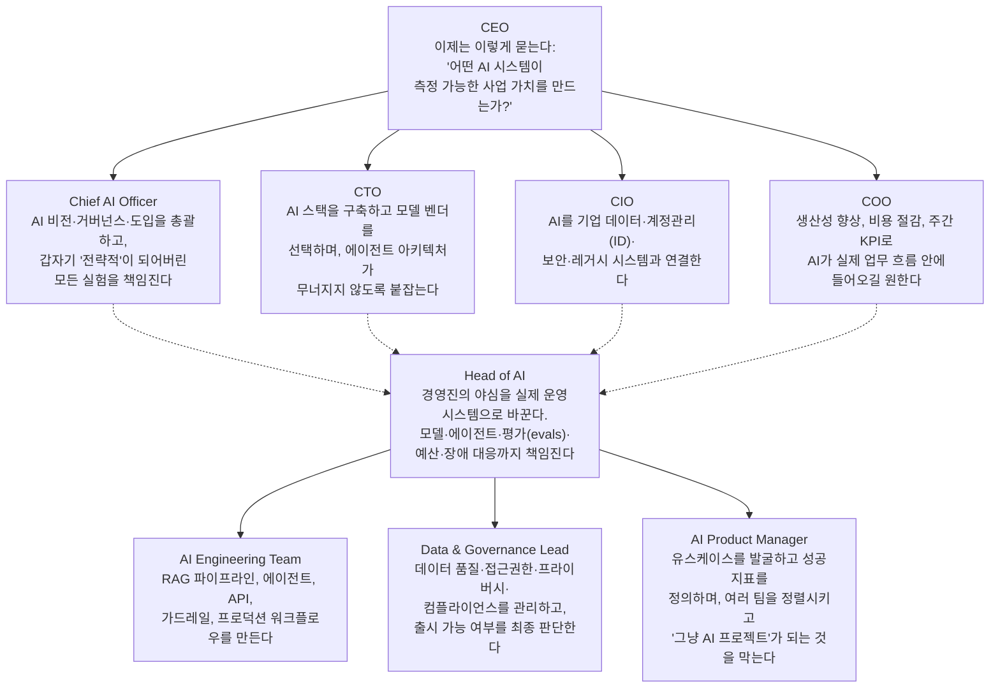

>
>갈 수 있는 조직과 그렇지 못한 조직으로 
>격차는 점점 더 벌어질 것이라 생각되네요.
>
>참고로 교육만 받는다가 AI가 다 할 수 있는 것은 아닙니다.
>플랫폼이 실행 할 수 있게 뒷받침해줘야 하더라구요.
>
>https://lnkd.in/p/giNWPzih
>
>https://www.facebook.com/share/p/199o6tqJ6p/
>

```
AI Org Chart 2026

𝗕𝗲𝗰𝗼𝗺𝗲 𝗮 𝗰𝗿𝗲𝗱𝗶𝗯𝗹𝗲 𝗖𝗵𝗶𝗲𝗳 𝗔𝗜 𝗟𝗲𝗮𝗱𝗲𝗿.
𝗘𝗮𝗿𝗻 𝘁𝗵𝗲 𝗔𝗜 𝗰𝗲𝗿𝘁𝗶𝗳𝗶𝗰𝗮𝘁𝗶𝗼𝗻𝘀 𝗯𝘂𝗶𝗹𝘁 𝗳𝗼𝗿 𝗹𝗲𝗮𝗱𝗲𝗿𝘀.
𝗚𝗲𝘁 𝗔𝗜 𝗰𝗲𝗿𝘁𝗶𝗳𝗶𝗲𝗱 𝗻𝗼𝘄 → [chiefaileader.com/bp](https://www.linkedin.com/redir/suspicious-page?url=http%3A%2F%2Fchiefaileader%2ecom%2Fbp)

Original post:
__________

AI needs an operating model.

By 2026, enterprise AI is no longer owned by one innovation team. It requires clear accountability across strategy, technology, data, operations, and product.

The CEO sets the standard by asking one question: which AI systems create measurable business value?

The Chief AI Officer owns the vision, governance, adoption, and portfolio of strategic experiments.

The CTO builds the AI stack, selects model vendors, and ensures the architecture can scale without collapsing.

The CIO connects AI to enterprise data, identity, security, and legacy systems.

The COO brings AI into real workflows, with clear expectations around productivity, cost savings, and weekly KPIs.

The Head of AI turns executive ambition into production systems. This role coordinates models, agents, evaluations, budgets, and incident response.

Below that, the AI Engineering team builds RAG pipelines, agents, APIs, guardrails, and production workflows.

The Data and Governance Lead owns data quality, access, privacy, compliance, and determines whether deployment is safe.

The AI Product Manager identifies valuable use cases, defines success metrics, aligns teams, and prevents every idea from becoming an AI project.

The lesson is simple: enterprise AI is not just a technology function.

It is an organizational capability that needs shared ownership, clear decisions, and measurable outcomes.

Which role is missing from this AI organization?

Credit to [Gautami Nadkarni](https://www.linkedin.com/in/gautaminadkarni/). Follow her for more.

https://lnkd.in/p/giNWPzih

```

## 0. 이 문서에 대하여

이 문서는 Gautami Nadkarni(가우타미 나드카르니)가 게시한 "AI Org Chart 2026" 조직도 게시물을 상세히 풀어 설명하기 위해 작성되었습니다. 다만 원 게시물이 올라온 LinkedIn과 Facebook 링크는 두 플랫폼 모두 로봇(자동 수집 프로그램) 접근을 차단하고 있어 직접 열람하지 못했습니다. 따라서 이 문서는 (1) 첨부해 주신 조직도 자체에 담긴 텍스트 내용을 있는 그대로 정리하고, (2) 그 내용이 왜 2026년 현재 현실과 맞아떨어지는지를 IBM, 맥킨지(McKinsey), WRITER 등 공신력 있는 기관의 2025~2026년 최신 조사 자료로 검증·보강하는 방식으로 구성했습니다.

작성자 소개, 통계 수치, 역할 정의 등 사실관계에 해당하는 내용은 모두 출처를 명시했으며, 문서 맨 끝에 출처의 신뢰도 등급(공식 1차 자료 / 복수 매체 교차 확인 / 기관·벤더 자체 조사 / 2차 편집 자료)을 구분해 정리했습니다. 확인이 안 되는 부분은 추측으로 채우지 않고 "확인 불가"로 명시했습니다.

---

## 1. 원본 조직도, 있는 그대로 옮기기

조직도의 제목은 "AI Org Chart 2026"이며, 작성자로 Gautami Nadkarni가 표기되어 있습니다. 구조는 크게 두 개의 층으로 나뉩니다. 위쪽은 경영진(C-suite) 층으로 CEO를 정점으로 네 명의 임원(Chief AI Officer, CTO, CIO, COO)이 나란히 배치되어 있고, 그 아래에 별도의 실행 층으로 Head of AI가 있고, 다시 그 아래에 세 개의 실무 조직(AI Engineering Team, Data & Governance Lead, AI Product Manager)이 이어집니다. 각 직책 박스 아래에는 그 직책이 지금 실제로 하는 일 혹은 요구받는 일을 한두 문장으로 압축한 설명이 달려 있는데, 이 설명들이 이 조직도의 핵심입니다. 전체 구조를 다이어그램으로 옮기면 다음과 같습니다.



원문 하단에는 "Follow For More Insights on Tech and Enterprise AI"라는 문구와 함께 작성자의 계정 표기(@gautaminadkarni)가 있어, 이 조직도가 기업용 AI 트렌드를 다루는 연재물 성격의 콘텐츠라는 점을 알 수 있습니다. 실제로 같은 계정에서는 "AI Roadmap 2026", "Anatomy of an Agent" 같은 제목의 게시물도 확인되어, 조직·에이전트 구조를 알기 쉬운 비유와 재치 있는 문구로 풀어내는 것이 이 작성자의 일관된 스타일로 보입니다. 다만 이 정황은 검색으로 확인된 다른 게시물 제목에서 유추한 것이며, 이번 조직도 게시물 자체의 조회수나 반응(댓글 수 등)은 링크 접근이 막혀 있어 확인하지 못했습니다.

---

## 2. 작성자는 누구인가 — Gautami Nadkarni

여러 독립적인 프로필(LinkedIn, WomenTech 컨퍼런스 연사 소개, Sessionize 연사 프로필, ResearchGate)이 일관되게 확인해 주는 내용을 정리하면 다음과 같습니다.

Gautami Nadkarni는 뉴욕 소재의 클라우드 아키텍트이자 Google의 시니어 AI/ML 고객 엔지니어(Senior Customer Engineer)입니다. 클라우드 업계에서 9년 이상, 그중 구글에서 6~7년 이상 일하며 대기업(Fortune 500)의 클라우드 전환 프로젝트를 자문해 온 이력을 가지고 있습니다. 최근 전문 분야는 자율 AI(autonomous AI)와 멀티에이전트 시스템으로, 기업들이 AI를 "실험 단계에서 실제 운영(프로덕션) 단계로" 옮기도록 돕는 일을 한다고 여러 연사 소개 자료에 공통적으로 기재되어 있습니다. 2025년 4월에는 도메인 특화 AI 에이전트를 설계하는 방법을 다룬 아티클을 발표하기도 했습니다. 2026년 1월 기준 자료에는 2026년 초 한 여성 기술인 컨퍼런스의 연사로 소개된 기록도 있습니다.

다만 한 홍보성 매체(TechBullion)에 실린 인물 소개 기사는 그녀를 "업계를 선도하는 인물", "Business Insider에도 소개됐다"는 식으로 다소 과장된 어조로 다루고 있어, 이 기사 자체는 사실관계 확인용 자료라기보다는 홍보 목적의 콘텐츠로 보고 참고 수준으로만 반영했습니다. 핵심 직함과 전문 분야(구글의 시니어 AI/ML 고객 엔지니어, 멀티에이전트 시스템 전문)는 서로 독립적인 여러 자료에서 일치하므로 신뢰도 있게 기술했습니다.

---

## 3. 왜 지금 이런 조직도가 나오는가 — 2026년 AI 리더십 재편의 실제 데이터

이 조직도가 단순한 재미용 그림이 아니라 실제 흐름을 반영한다는 점은 2026년 상반기에 발표된 대규모 조사들에서 뚜렷하게 확인됩니다.

가장 무게감 있는 자료는 IBM 기업가치연구소(IBM Institute for Business Value)가 옥스퍼드 이코노믹스(Oxford Economics)와 함께 2026년 2월부터 4월까지 33개국, 21개 산업에 걸쳐 CEO 2,000명을 대상으로 진행하고 2026년 5월 4일 발표한 조사입니다. 이 조사에 따르면 2026년 현재 조사 대상 기업의 76%가 최고AI책임자(CAIO, Chief AI Officer)를 두고 있다고 답했는데, 이는 불과 1년 전인 2025년의 26%에서 3배 가까이 늘어난 수치입니다. 같은 조사에서 CEO의 64%는 AI가 만들어낸 정보를 바탕으로 주요 전략적 의사결정을 내리는 데 편안함을 느낀다고 답했고, 83%는 'AI 주권(AI sovereignty)'이 기업 전략에 필수적이라고 답했습니다. 흥미로운 점은 86%의 CEO가 "우리 직원들은 AI와 협업할 역량이 있다"고 믿으면서도, 실제로 업무에 AI를 정기적으로 쓰는 직원 비율은 25%에 불과하다고 답했다는 것입니다. 이 간극에 대해 83%의 CEO는 "AI의 성공 여부는 기술 자체보다 사람들의 채택(adoption)에 더 크게 좌우된다"고 답했습니다. IBM은 이 조사에서 기술·재무·인사·운영·부서 간 협업이라는 다섯 가지 핵심 영역을 함께 재설계한 기업이 그렇지 않은 기업보다 사업 목표를 달성할 확률이 4배 높았다는 분석도 함께 내놓았습니다.

다만 CAIO 도입률에 대해서는 조사마다 수치 편차가 상당히 크다는 점도 정확히 짚고 넘어가야 합니다. 예를 들어 데이터·AI 리더십을 대상으로 한 별도의 2026년 벤치마크 조사(2026 AI & Data Leadership Executive Benchmark Survey)에서는 CAIO를 임명한 기업 비율이 전년 33.1%에서 38.5%로 늘었다고 보고했습니다. IBM 조사의 76%와 이 조사의 38.5%가 크게 차이 나는 이유는 표본이 다르기 때문으로 보입니다. IBM 조사는 전 세계 대기업 CEO 2,000명을 대상으로 한 것이고, 후자는 데이터·AI 리더십 커뮤니티를 중심으로 한 상대적으로 좁은 표본입니다. 즉 "몇 퍼센트의 기업이 CAIO를 두고 있는가"라는 질문 자체가 표본의 기업 규모, 업종, 지역에 따라 답이 크게 달라지는 질문이라는 점을 감안해서 봐야 합니다. 그럼에도 두 조사 모두 방향성만큼은 일치합니다. CAIO를 두는 기업의 비율이 빠르게 늘고 있다는 것입니다.

경영 컨설팅·임원 서치 업계에서도 비슷한 신호가 나옵니다. 임원 서치펌 Christian & Timbers는 2026년 1월 분석에서 기업들이 AI 지출이 여러 팀에 흩어져 있다면 CAIO를, 규제 당국이나 감사팀이 이미 문서화와 통제를 요구하고 있다면 'Head of AI Governance'를, 프로토타입은 나오는데 실제 운영 단계로 못 가고 있다면 AI 엔지니어링·MLOps 리더십을 우선 채용해야 한다는 순서를 제시했습니다. 업계 전망 매체 APMdigest에 실린 여러 임원들의 2026년 전망을 종합하면 "2026년 말이면 Head of AI 직책이 중견~대기업의 기본 사양이 될 것"이라는 예측(옴니사(Omnissa)의 프로덕트 매니지먼트 디렉터 발언)과, 사람과 자율 AI 시스템 간의 상호작용 규칙을 감사·관리하는 'Chief AI Agent Officer' 같은 새로운 직책이 부상할 것이라는 예측(로직모니터(LogicMonitor) CPO 발언)이 함께 등장합니다. 이는 실제 조사 결과라기보다는 업계 리더들의 전망(예측)이라는 점을 구분해서 받아들일 필요가 있습니다.

---

## 4. 경영진 층: CEO와 네 개의 C-suite 직책이 각자 던지는 질문

조직도의 상단부는 사실 하나의 메시지를 담고 있습니다. 같은 AI를 두고도 임원마다 완전히 다른 질문을 던진다는 것입니다.

**CEO**의 질문은 "어떤 AI 시스템이 측정 가능한 사업 가치를 만드는가"입니다. 이는 단순한 수사가 아니라 실제 데이터로 뒷받침되는 흐름입니다. 컨설팅사 PwC가 2026년 발표한 CEO 서베이(경영진 4,454명 대상, GoGloby의 정리 자료를 통해 재확인)에 따르면 매출 증가와 비용 절감을 AI로 동시에 달성했다고 답한 CEO는 12%에 불과했습니다. 즉 CEO 입장에서는 "AI를 쓰고 있는가"가 아니라 "AI가 실제로 숫자를 움직였는가"가 관건이 된 것이며, 조직도의 CEO 캡션은 이런 압박을 정확히 반영하고 있습니다.

**Chief AI Officer(CAIO)** 는 AI 비전, 거버넌스, 도입 전반을 소유하는 자리로 묘사됩니다. 원문 캡션에는 "갑자기 전략적이 되어버린 모든 실험을 책임진다"는 표현이 있는데, 이는 여러 산업 자료가 공통으로 짚는 CAIO의 딜레마를 잘 담고 있습니다. 즉 각 부서에서 개별적으로 벌이던 파일럿 프로젝트들이 어느 순간 이사회 안건이 되면서, 그 책임을 사후적으로 떠안는 자리가 CAIO라는 것입니다. IBM 조사에서도 CAIO의 역할은 단순 기술 관리가 아니라 AI를 기업 운영모델의 중심에 놓는 'AI-first' 전환의 총괄 책임자로 그려집니다.

**CTO**는 AI 스택을 구축하고 모델 벤더를 선정하며, 원문 표현을 빌리면 "에이전트 아키텍처가 무너지지 않도록" 붙잡는 역할입니다. 이는 실제로 2026년 조사에서 가장 빈번하게 보고되는 병목 지점과 일치합니다. 엔터프라이즈 기술 의사결정권자 142명을 대상으로 한 한 조사(Code Ninety, 2026년 2월)에서는 자율 워크플로우 에이전트가 현재 실제 운영 단계에 있는 비율은 14.1%에 그치지만, 2026년 계획된 도입률은 51.4%로 가장 가파르게 늘어날 것으로 예상되는 영역으로 나타났습니다. 즉 CTO가 지금 가장 부담을 느끼는 지점이 정확히 "에이전트 아키텍처를 무너뜨리지 않고 확장하는 일"이라는 것이 데이터로도 확인됩니다.

**CIO**는 AI를 기업의 데이터, 계정관리(ID), 보안, 그리고 레거시 시스템과 연결하는 역할로 그려집니다. 앞서 언급한 Code Ninety 조사에서도 데이터 프라이버시가 AI 도입의 가장 큰 걸림돌(61.3%가 1순위로 응답)로 꼽혔는데, 이는 CIO가 담당하는 영역과 정확히 겹칩니다. 새로운 AI 기능을 아무리 잘 만들어도 그것이 회사의 기존 시스템, 접근권한 체계, 보안 정책과 맞물리지 않으면 실제로 배포될 수 없기 때문에, CIO는 사실상 AI가 조직 안에서 "합법적으로 움직일 수 있는 통로"를 여는 사람입니다.

**COO**는 AI가 실제 업무 흐름(워크플로우) 안에 들어와 생산성 향상, 비용 절감, 주간 단위 핵심성과지표(KPI)로 나타나기를 바라는 사람으로 묘사됩니다. 이는 앞서 언급한 WRITER의 2026년 조사가 짚은 핵심 문제의식과 맞닿아 있습니다. WRITER의 조사(Workplace Intelligence와 공동 진행, 전 세계 임직원 및 C-레벨 2,400명 대상, 2026년 4월 발표)에 따르면, 조사 대상 기업의 97%가 지난 1년 사이 AI 에이전트를 배포했다고 답했지만, 실질적인 투자수익(ROI)을 체감하고 있다고 답한 기업은 29%에 그쳤습니다. 즉 COO가 원하는 "주간 KPI로 보이는 성과"와 실제 현실 사이에는 여전히 큰 간극이 있습니다.

---

## 5. 실행 층: Head of AI와 세 개의 실무 조직

경영진 층 아래에는 별도의 실행 층이 있습니다. 이 층이 바로 조직도에서 가장 눈여겨봐야 할 부분입니다.

**Head of AI**는 원문 표현으로 "경영진의 야심을 실제 운영 시스템으로 바꾸는" 자리이며, 모델, 에이전트, 평가(evals), 예산, 그리고 장애 대응(incident fire drills)까지 책임지는 것으로 묘사됩니다. 채용·인사 분야 자료들을 보면 이 직책은 2024~2025년 사이 급격히 늘어난 신생 직책으로, CAIO와 역할이 겹치면서도 성격이 다릅니다. 한 채용 전문 매체(Digital Waffle)의 정리에 따르면 Head of AI는 리서치·엔지니어링·MLOps에 걸친 팀을 관리하고, AI 모델을 실제 운영 환경에 배포하는 과정 전반을 총괄하며, AI 이니셔티브를 제품·사업 목표와 정렬시키는 역할을 맡습니다. 쉽게 말해 CAIO가 "회사 차원에서 AI를 왜, 어떤 원칙으로 할 것인가"를 정하는 자리라면, Head of AI는 "그것을 실제로 어떻게 돌아가게 만들 것인가"를 책임지는 자리에 가깝습니다. APMdigest에 인용된 업계 전망처럼 2026년 말이면 이 직책이 중견~대기업의 표준 편성이 될 것이라는 예측이 나오는 것도 이런 맥락입니다.

Head of AI 아래에는 세 개의 실무 조직이 배치되어 있습니다.

**AI Engineering Team**은 RAG(검색증강생성) 파이프라인, 에이전트, API, 가드레일, 그리고 실제 운영용 워크플로우를 만드는 조직으로 묘사됩니다. 여기서 나열된 항목들은 실제로 2026년 기업들이 가장 많이 실제 운영 단계로 옮긴 AI 활용 사례들과 일치합니다. Code Ninety의 조사에서는 개발자 생산성 코파일럿(68.3%), 고객 응대 자동 분류(52.1%), 사내 지식 검색·RAG(45.8%) 순으로 실제 운영 단계 도입률이 높게 나타났습니다.

**Data & Governance Lead**는 데이터 품질, 접근 권한, 프라이버시, 컴플라이언스를 관리하고 무엇보다 "출시 가능 여부(whether launch is possible)"를 최종 판단하는 자리로 그려집니다. 이 표현은 다소 과장처럼 들릴 수 있지만, 실제로 AI 거버넌스 인력에 대한 수요는 2026년 들어 규제 환경 변화와 맞물려 뚜렷하게 늘고 있습니다. 유럽연합의 AI법(EU AI Act)이 고위험 시스템에 대해 2026년 8월부터 전면 시행에 들어가고, 미국에서도 콜로라도주 AI법, 일리노이주의 AI 고용 관련법 등 주(州) 단위 규제가 속속 도입되면서, AI 거버넌스 책임자 채용 공고는 전문서비스·컨설팅(51%), 기술(15%), 금융서비스(9%) 순으로 늘고 있다는 분석(Axial Search의 AI 거버넌스 채용 공고 146건 분석)도 있습니다.

**AI Product Manager**는 유스케이스를 발굴하고, 성공 지표를 정의하고, 여러 팀을 정렬시키고, 그리고 "모든 것이 그냥 AI 프로젝트가 되어버리는 것을 막는" 역할로 묘사됩니다. 이 마지막 표현은 이 조직도 전체에서 가장 뼈 있는 문구라고 할 수 있습니다. 실제로 WRITER의 2026년 조사에서 조사 대상 기업 임원의 75%가 "우리 회사의 AI 전략은 실질적 지침이라기보다는 보여주기용에 가깝다"고 스스로 인정했다는 결과가 있는데, AI Product Manager가 막아야 한다고 표현된 바로 그 현상, 즉 명확한 비즈니스 목적 없이 "AI를 썼다"는 사실 자체가 목적이 되어버리는 함정을 정확히 가리키고 있습니다.

아래 표는 아홉 개 직책의 역할을 한눈에 정리한 것입니다.

| 계층 | 직책 | 핵심 역할 (원문 기준) |
|---|---|---|
| 경영진 | CEO | AI가 만드는 측정 가능한 사업 가치를 질문 |
| 경영진 | Chief AI Officer | AI 비전·거버넌스·도입 총괄, 실험의 전략적 책임 |
| 경영진 | CTO | AI 스택 구축, 모델 벤더 선정, 에이전트 아키텍처 유지 |
| 경영진 | CIO | AI를 데이터·ID·보안·레거시 시스템과 연결 |
| 경영진 | COO | 워크플로우 내 AI 내재화, 생산성·비용·주간 KPI |
| 실행 | Head of AI | 경영진의 구상을 실제 운영 시스템으로 전환 |
| 실행 | AI Engineering Team | RAG·에이전트·API·가드레일·운영 워크플로우 구축 |
| 실행 | Data & Governance Lead | 데이터 품질·프라이버시·컴플라이언스·출시 판단 |
| 실행 | AI Product Manager | 유스케이스 발굴, 성공지표 정의, 팀 간 정렬 |

---

## 6. "격차는 점점 더 벌어진다" — 실제로 그런가

댓글에서 짚어주신 것처럼, 이 조직도를 제대로 갖추고 운영할 수 있는 조직과 그렇지 못한 조직 사이의 격차가 벌어지고 있다는 진단은 최신 조사 데이터와 정확히 일치합니다.

WRITER의 2026년 조사는 이 격차를 가장 선명하게 수치로 보여줍니다. 조사 대상 기업의 79%가 AI 도입 과정에서 어려움을 겪고 있다고 답했는데, 이는 전년 대비 두 자릿수 늘어난 수치입니다. C-suite 임원의 54%는 "AI 도입이 회사를 갈라놓고 있다"고 답했을 정도입니다. 그런데 같은 조사에서 실질적인 ROI를 체감한다고 답한 기업은 29%에 불과했습니다. WRITER는 이 29%의 기업들이 공통으로 가진 네 가지 특징을 제시했습니다. 첫째, AI 활용을 매출 성과와 직접 연결한다. 둘째, IT가 통제권을 유지하면서도 현업 부서가 자율적으로 쓸 수 있는 플랫폼을 설계한다. 셋째, 확장하기 전에 거버넌스 체계부터 갖춘다. 넷째, AI 도입을 단순한 기술 도입이 아니라 조직 구조 자체의 재설계로 접근한다. 나머지 71%의 기업은 이 중 최소 한 가지를 놓치고 있다는 것이 WRITER의 진단입니다.

맥킨지의 2025년 State of AI 조사(전 세계 약 105개국, 응답자 1,993명, 연매출 10억 달러 이상 기업이 38% 포함, 2025년 11월 발표)도 비슷한 그림을 보여줍니다. 최소 한 개 업무 영역에서 AI를 정기적으로 사용한다고 답한 기업은 88%(전년 78%에서 상승)로 이미 보편화됐지만, 기업 전체 차원에서 에이전트형 AI를 '확장'하고 있다고 답한 비율은 23%에 그쳤고, 그마저도 대부분 한두 개 업무 영역에 국한되어 있었습니다. 어떤 업무 영역을 기준으로 보더라도 그 영역에서 AI 에이전트를 확장 중이라고 답한 응답자는 10%를 넘지 않았습니다. 응답자의 64%가 AI가 혁신에 도움이 된다고 답했지만, 정작 기업 전체 손익(EBIT) 차원에서 효과를 체감한다고 답한 비율은 39%에 그쳤습니다.

이 격차는 단순히 "아직 시간이 부족해서"라기보다 구조적인 이유가 있습니다. Forbes에 실린 분석(2026년 3월)이 인용한 WRITER의 별도 조사에 따르면, 공식적인 AI 전략을 갖춘 기업의 성공률은 80%인 반면, 그렇지 않은 기업의 성공률은 37%에 불과했습니다. 같은 조사에서 임원의 68%는 AI 도입 과정에서 IT 부서와 현업 부서 사이의 마찰을 경험했다고 답했습니다. 즉 "AI를 잘 쓰는 조직과 그렇지 못한 조직"을 가르는 것은 AI 모델의 성능 차이가 아니라, 전략의 명확성과 조직 내부의 협업 구조라는 것입니다.

---

## 7. "교육만으로는 AI가 다 할 수 있는 게 아니다" — 플랫폼이 뒷받침되어야 하는 이유

두 번째로 짚어주신 지점, 즉 교육만으로는 부족하고 실행할 수 있는 플랫폼이 뒷받침되어야 한다는 진단 역시 여러 자료가 뒷받침합니다.

가장 직접적인 근거는 앞서 언급한 IBM 조사의 다음 수치입니다. CEO의 86%는 "우리 직원들은 AI와 협업할 역량(스킬)을 갖추고 있다"고 믿고 있습니다. 즉 스킬, 다시 말해 교육의 결과물 자체는 이미 갖춰졌다고 보는 CEO가 대다수라는 뜻입니다. 그럼에도 실제로 업무에 AI를 정기적으로 활용하는 직원의 비율은 25%에 그쳤습니다. 이 둘 사이의 간극을 두고 IBM 조사에 참여한 CEO의 83%는 "AI 성공의 관건은 기술이 아니라 사람들의 채택(adoption)"이라고 답했는데, 이는 결국 교육으로 만들어진 역량이 실제 채택으로 이어지려면 그 역량을 실제로 발휘할 수 있는 업무 환경, 즉 플랫폼과 프로세스가 뒷받침되어야 한다는 뜻으로 해석할 수 있습니다.

WRITER의 조사가 제시한 'ROI를 내는 기업의 네 가지 특징' 중 두 번째 항목, 즉 "IT가 통제권을 유지하면서도 현업 부서가 자율적으로 쓸 수 있는 플랫폼을 설계한다"는 항목도 정확히 같은 지점을 가리킵니다. WRITER의 최고고객책임자(Chief Customer Officer)는 이를 두고 "개인 생산성 차원의 이득을 실제 사업 성과로 전환하려면 코파일럿(비서형 도구)만으로는 부족하며, 구조적 변화를 뒷받침하는 엔터프라이즈 AI 플랫폼이 필요하다"는 취지로 언급했습니다. 즉 개인이 챗봇이나 코파일럿을 능숙하게 다루는 법을 교육받는 것과, 조직 전체가 데이터·권한·거버넌스가 통합된 플랫폼 위에서 AI를 안전하게 실행할 수 있는 것은 완전히 다른 차원의 문제라는 것입니다.

이 지점에서 조직도의 구조 자체가 하나의 답을 제시하고 있다고 볼 수 있습니다. 조직도에서 CAIO를 비롯한 경영진 층이 '판단(judgment)'의 영역, 즉 무엇을 왜 할 것인가와 어떤 원칙으로 승인할 것인가를 결정하는 층이라면, Head of AI와 그 아래 세 팀은 '실행(execution)'의 영역, 즉 그 판단을 실제로 작동하는 시스템으로 구현하는 층입니다. 교육은 이 두 층 모두에 필요하지만, 교육만으로는 실행 층이 필요로 하는 파이프라인, 가드레일, 데이터 거버넌스 체계, 배포 인프라 자체가 저절로 생기지 않습니다. 다시 말해 사람이 AI 사용법을 배우는 것과, 그 사람이 배운 것을 실제로 발휘할 수 있는 시스템(플랫폼)이 회사 안에 구축되어 있는 것은 별개의 과제이며, 이 조직도에서 Head of AI 아래 세 팀이 별도로 존재하는 이유가 바로 그 실행 기반을 전담해서 만들기 위해서라고 볼 수 있습니다.

---

## 8. 정리

이 조직도가 그려내는 2026년 기업 AI 조직의 모습은 결국 두 가지 축으로 요약됩니다.

첫째, AI 리더십이 한 사람의 몫이 아니라 최소 네 개 이상의 경영진 직책과 최소 네 개의 실행 조직으로 분화되고 있다는 것입니다. 이는 추측이 아니라 IBM 조사가 보여주듯 CAIO 도입률이 1년 사이 26%에서 76%로 뛰어오른 현실, 그리고 Head of AI라는 직책이 2026년을 기점으로 빠르게 표준화되고 있다는 여러 채용·컨설팅 자료의 공통된 진단으로 뒷받침됩니다.

둘째, 그럼에도 불구하고 "AI를 조직에 들여놓는 것"과 "AI로 실제 성과를 내는 것" 사이에는 여전히 큰 간극이 있다는 것입니다. McKinsey 조사의 88%(AI를 쓰는 기업)와 23%(에이전트를 실제로 확장 중인 기업), WRITER 조사의 97%(에이전트를 배포한 기업)와 29%(ROI를 체감하는 기업) 사이의 간극이 이를 숫자로 보여줍니다. 그리고 이 간극을 메우는 조건은 대체로 비슷하게 수렴합니다. 명확한 전략, 부서 간 협업 구조, 확장에 앞선 거버넌스, 그리고 개인의 역량을 실제로 발휘하게 해주는 플랫폼입니다. 말씀하신 것처럼 "교육받는다고 AI가 다 되는 것이 아니라 플랫폼이 실행을 뒷받침해줘야 한다"는 진단은, 2026년 상반기에 나온 대규모 조사들이 공통으로 확인해 주는 결론과 정확히 일치합니다.

---

## 9. 출처 및 신뢰도 표기

**[1등급 · 공식 1차 자료]**
- IBM Institute for Business Value, "CEOs are Reshaping C-suite Roles for the AI Era" (2026.5.4, newsroom.ibm.com) — CEO 2,000명, 33개국·21개 산업, 2026년 2~4월 조사, Oxford Economics 공동 수행
- McKinsey & Company, "The state of AI in 2025: Agents, innovation, and transformation" (mckinsey.com, 2025.11) — 약 105개국 1,993명 응답

**[2등급 · 복수 매체 교차 확인 보도 (위 IBM 조사를 보도)]**
- StockTitan, PeopleMattersGlobal, TechIntelPro, Enterprise DNA, Metaintro, CXOvoice, Mexico Business News (2026.5) — 모두 동일한 IBM 조사 결과를 독립적으로 보도, 수치 일치 확인

**[3등급 · 기관/벤더 자체 조사 (이해관계 존재, 별도 유의)]**
- WRITER × Workplace Intelligence, "2026 AI Adoption in the Enterprise" (writer.com, 2026.4) — WRITER는 엔터프라이즈 AI 플랫폼을 판매하는 기업으로, 조사 결과가 자사 플랫폼형 솔루션의 필요성을 강조하는 방향으로 해석될 수 있음을 감안해야 함. 임직원·C-레벨 총 2,400명 대상
- Forbes 기고 칼럼, "Roughly 10% Of Enterprise Functions Use AI Agents, McKinsey Finds" (2026.3, WRITER 2025년 별도 조사 인용 포함)
- Code Ninety, "Enterprise AI Adoption Survey 2026" (codeninety.com, 2026.2) — 기술 의사결정권자 142명 대상 자체 조사
- 2026 AI & Data Leadership Executive Benchmark Survey (DataIQ 계열) — 데이터·AI 리더십 커뮤니티 대상 자체 조사
- Christian & Timbers, "Top AI Leadership Roles Expected in 2026" (2026.1) — 임원 서치펌의 자체 분석 및 전망
- Axial Search, AI 거버넌스 채용 공고 146건 분석 (Tech Jacks Solutions 재인용)
- GoGloby, PwC 2026 CEO 서베이(경영진 4,454명) 재인용 자료 — PwC 원문 미확인, 2차 인용으로 표기

**[4등급 · 업계 전망/2차 편집 자료]**
- APMdigest, "2026 AI Predictions: New Roles & Governance" — 여러 업계 임원의 전망(예측) 모음, 조사 데이터 아님
- Digital Waffle, Emeritus, Acceler8 Talent — Head of AI 직무 정의 관련 채용업계 해설 자료
- TechBullion, 작성자 소개 기사 (2026.5) — 홍보성 콘텐츠로 판단, 참고 수준으로만 반영

**[원본 출처 · 접근 제한]**
- LinkedIn 게시물 (lnkd.in/p/giNWPzih), Facebook 게시물(facebook.com/share/p/199o6tqJ6p) — 두 링크 모두 로봇 접근 차단 정책으로 자동 조회 불가. 이 문서의 조직도 내용은 첨부 자료에 담긴 텍스트를 직접 옮긴 것이며, 원 게시물의 게시일·반응(좋아요·댓글 수 등)은 확인하지 못했습니다.
- Gautami Nadkarni 프로필: LinkedIn, WomenTech Global Conference 연사 소개, Sessionize 연사 프로필, ResearchGate — 직함·경력 사항이 서로 독립적으로 일치함을 확인
