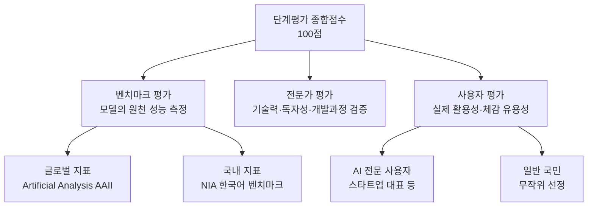
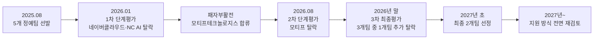

## 김진중 게시글로 보는 독자 AI 파운데이션 모델 사업 평가 논란

>
> 독파모 점수의 비중에서 모델 성능이 점수의 1/3 밖에 안되는거라면, 그게 “독자 파운데이션 모델” 사업이 맞는가라는 의문을 가지지 않을 수 없죠. 애플리케이션 사용성이 높은 점수를 받는 사업인 줄 알았다면 저희 팀도 참여해볼껄 그랬네요.. 😎
> 
> https://www.facebook.com/share/14nYFHLP7iM/
> 
>- 이 문서는 2026년 8월 말 개발자 커뮤니티에서 화제가 된 김진중(골빈해커)의 게시글 —
>- "독파모 점수의 비중에서 모델 성능이 점수의 1/3 밖에 안되는 거라면, 그게 '독자 파운데이션 모델' 사업이 맞는가라는 의문을 가지지 않을 수 없죠."
>- — 이 어떤 맥락에서 나온 말인지, 정부 발표 자료와 여러 언론 보도를 교차 검증하여 정리한 것입니다.

---

## 목차

1. 이 게시글을 쓴 사람은 누구인가
2. "독파모"란 무엇인가
3. 평가는 어떻게 이루어지는가 — 세 개의 축
4. 1차 평가: 네이버클라우드·NC AI가 떨어진 이유
5. 2차 평가: "성능 1위" 모티프가 탈락한 사건
6. 항목별 점수를 뜯어보면
7. 김진중이 짚은 지점 — "모델 성능이 1/3밖에 안 된다면"
8. 왜 정부는 성능 비중을 낮췄나 — 벤치맥싱 논란
9. 모티프의 이의제기와 정부의 전면 공개
10. 앞으로 일정과 사업 재검토
11. 정리
12. 출처 투명성 표
13. 참고문헌

---

## 1. 이 게시글을 쓴 사람은 누구인가

게시글의 작성자 김진중은 개발자 커뮤니티에서 "골빈해커"라는 이름으로 잘 알려진 인물이다[1]. 야놀자 개발 총괄, 네이버 클로바 AI 리더, 원티드랩 생성 AI팀 리더를 거쳐 현재는 AI 스타트업 플레이모어 AI의 창업자 겸 CTO로 활동하고 있으며, 2024년에는 「최고의 프롬프트 엔지니어링 강의」라는 책을 펴내기도 했다[1]. 패스트캠퍼스에서 프롬프트 엔지니어링과 바이브코딩을 주제로 한 강의를 운영하고 있어, 국내 AI 실무자 사이에서 발언의 무게가 있는 편이다. 이런 배경을 가진 인물이 정부의 국가 AI 프로젝트 평가 방식에 대해 공개적으로 의문을 제기했다는 점에서 이 게시글이 주목을 받았다.

## 2. "독파모"란 무엇인가

"독파모"는 "독자 AI 파운데이션 모델(獨自 AI Foundation Model)"의 줄임말로, 과학기술정보통신부가 추진하는 국가 전략 사업의 별칭이다. 해외 초거대 AI 모델에 대한 기술·경제·안보적 의존을 해소하고, 미국·중국에 버금가는 "AI 3강" 도약을 목표로 새 정부의 핵심 국정과제 중 하나로 추진되어 왔다[2].

사업의 핵심 조건은 "프롬 스크래치(From Scratch)"다. 즉 해외 모델을 가져다 미세조정(파인튜닝)한 파생 모델이 아니라, 데이터 수집, 모델 아키텍처 설계, 사전학습, 튜닝까지 전 과정을 국내 기업이 자체적으로 수행한 모델만을 "독자 AI 파운데이션 모델"로 인정한다는 원칙이다[3][2].

2025년 8월, 정부는 이 프로젝트에 참여할 5개 "정예팀"을 선발했다. 네이버클라우드, 업스테이지, SK텔레콤, NC AI, LG AI연구원이 그 주인공으로, 이들은 약 1년간 대규모 GPU 인프라를 지원받아 독자 파운데이션 모델 개발 경쟁을 벌여왔다[2]. 사업 전체 규모는 약 2,136억 원에 이르는 것으로 보도됐으며, 6개월 이내 출시된 최신 글로벌 AI 모델 대비 95% 이상의 성능을 구현하는 것을 목표로 삼았다[3].

이 사업은 한 번에 승자를 가리는 방식이 아니라, 일정 기간마다 단계평가를 거쳐 탈락 팀을 걸러내고 최종적으로 소수 팀만 남기는 토너먼트 구조로 설계되어 있다. 지금까지 1차 단계평가(2026년 1월)와 2차 단계평가(2026년 8월)가 진행됐고, 3차 최종평가가 2026년 말에서 2027년 초 사이에 예정되어 있다.

## 3. 평가는 어떻게 이루어지는가 — 세 개의 축

독파모의 단계평가는 처음부터 지금까지 일관되게 세 가지 축으로 구성되어 있다.

- **벤치마크 평가**: 표준화된 수치 지표로 모델의 원천 성능을 측정하는 항목이다. 전문지식, 추론, 코딩, 한국어 특화 등을 다루는 공통 벤치마크와, 기업별 모델 특성(멀티모달·옴니모달 등)을 반영한 개별 벤치마크로 구성된다[4].
- **전문가 평가**: 산업계·학계·연구계 인사로 구성된 평가위원회가 각 팀이 공개한 테크니컬 리포트와 훈련 로그(log) 파일을 분석해 기술개발 과정, 기술력, 독자성 여부 등을 심층적으로 검증하는 항목이다[5].
- **사용자 평가**: 각 팀이 개발한 모델로 실제 구축한 AI 서비스(웹사이트)를 놓고, 현장 활용 가능성과 추론 비용 효율성 등을 사용자가 직접 체감하며 평가하는 항목이다[5].

아래는 이 구조를 도식화한 것이다.

주목할 점은, 세 항목 중 순수하게 "모델이 얼마나 잘 답하는가"라는 원천 성능만을 재는 것은 벤치마크 평가뿐이라는 사실이다. 전문가 평가와 사용자 평가는 성능 자체보다는 기술 개발 과정의 진정성, 실제 서비스로 만들었을 때의 완성도와 체감 유용성을 본다. 바로 이 구조가 뒤에서 살펴볼 논란의 핵심이 된다.

## 4. 1차 평가: 네이버클라우드·NC AI가 떨어진 이유

2026년 1월 15일 발표된 1차 단계평가는 벤치마크 평가(40점), 전문가 평가(35점), 사용자 평가(25점), 총 100점 만점으로 진행됐다[6]. 결과는 다음과 같았다.

| 순위 | 팀 | 벤치마크(40) | 전문가(35) | 사용자(25) | 비고 |
|---|---|---|---|---|---|
| 1위 | LG AI연구원 | 33.6점 | 31.6점 | 25.0점(만점) | 전 부문 1위 |
| - | 업스테이지 | 상위권 | 상위권 | - | 2차 진출 |
| - | SK텔레콤 | 상위권 | 상위권 | - | 2차 진출 |
| 탈락 | 네이버클라우드 | 종합 상위 4위 포함 | - | - | 독자성 기준 미달로 탈락 |
| 탈락 | NC AI | - | - | - | 종합 점수 미달로 탈락 |

LG AI연구원은 벤치마크(33.6점, 평균 30.4점), 전문가(31.6점, 평균 28.56점), 사용자(25.0점 만점, 평균 20.76점) 세 항목 모두에서 최고점을 받아 "3관왕"을 차지했다[2]. LG의 파운데이션 모델 "K-EXAONE"은 13개 주요 벤치마크 평균 72.03점을 기록해, 알리바바 큐웬3 235B(69.37점) 대비 104%, 오픈AI GPT-OSS 120B(69.79점) 대비 103% 수준의 성능을 보였고, 민간 평가기관 아티피셜 애널리시스의 인텔리전스 지수에서는 오픈 웨이트 모델 기준 세계 7위, 국내 1위에 올랐다[3].

여기서 눈여겨볼 대목은 네이버클라우드의 탈락 사유다. 네이버클라우드는 종합 점수로는 상위 4개 팀 안에 들었지만, "독자성 기준"을 충족하지 못해 탈락했다[3]. 네이버클라우드의 모델이 중국 알리바바 "큐웬(Qwen)" 계열 모델의 비전 인코더(vision encoder)와 가중치 일부를 활용한 것으로 확인되면서, 정부가 정의한 "해외 모델 파인튜닝이 아닌 프롬 스크래치 국산 모델"이라는 요건에 부합하지 않는다는 판단을 받은 것이다[7][3]. 즉 1차 평가에서는 순수 성능이 아니라 "이게 정말 독자 개발 모델이 맞는가"라는 독자성 검증이 당락을 갈랐다.

## 5. 2차 평가: "성능 1위" 모티프가 탈락한 사건

이제 김진중의 게시글이 직접 겨냥한 사건, 즉 2026년 8월 18일 발표된 2차 단계평가로 넘어가 보자. 이 회차부터 평가 대상은 LG AI연구원("K-EXAONE 2.0"), SK텔레콤("A.X K2"), 업스테이지("Solar Open2"), 그리고 1차 평가에서 탈락한 네이버클라우드·NC AI 대신 "패자부활전"을 통해 새로 합류한 모티프테크놀로지스("Motif 3") 4개 팀으로 좁혀졌다[8][9].

2차 평가에는 두 가지 변화가 있었다. 첫째, 글로벌 AI 모델 성능을 비교하는 아티피셜 애널리시스의 "AAII(Artificial Analysis Intelligence Index)"가 벤치마크 평가에 새로 포함됐다. 둘째, 1차에는 없었던 일반 국민 185명의 사용자 평가가 추가됐고, 전문가 평가에서도 모델의 실제 활용과 국내외 AI 생태계 파급효과 비중이 확대됐다[9].

2026년 8월 27일, 과기정통부는 논란 끝에 4개 팀의 세부 점수를 전체 공개했다. 종합 점수는 다음과 같았다[10].

| 순위 | 팀 | 종합 점수(100점) | 결과 |
|---|---|---|---|
| 1위 | SK텔레콤 | 70.6점 | 3차 진출 |
| 2위 | 업스테이지 | 69.9점 | 3차 진출 |
| 3위 | LG AI연구원 | 69.0점 | 3차 진출 |
| 4위 | 모티프테크놀로지스 | 65.8점 | **탈락** |

주목할 것은 순수 성능을 재는 벤치마크 항목에서는 모티프가 1위였다는 점이다. 모티프는 벤치마크 평가에서 24.6점(40점 만점)을 받아 4개 팀 중 최고점이었고, 그중에서도 글로벌 지표인 AAII에서는 11.9점(25점 만점)으로 1위를 차지했다[10][11]. 실제로 모티프의 "Motif 3"는 아티피셜 애널리시스 평가에서 47점을 받아, 3차에 진출한 업스테이지(37점), SK텔레콤(35점), LG AI연구원(31점)을 모두 앞섰다[12]. 그런데도 모티프는 전문가 평가(27.1점, 최하위)와 사용자 평가(14.1점, 최하위)에서 크게 밀리며 종합 4위로 탈락했다[10]. 여러 언론이 이 사건을 "성능 1위 독파모 탈락"이라는 제목으로 다룬 이유가 여기에 있다[13][14].

정부 설명에 따르면, 4개 팀 사이의 격차는 크지 않았다. 항목별로 1위와 4위(꼴찌)의 점수 차이는 벤치마크 4.0점, 전문가 평가 2.4점, 사용자 평가 5.0점에 불과했다[15]. 즉 어느 한 항목이 압도적으로 갈랐다기보다, 성능에서 앞선 만큼을 사용성·활용성 평가에서 고르게 내주면서 종합 순위가 뒤바뀐 셈이다.

## 6. 항목별 점수를 뜯어보면

과기정통부가 2026년 8월 27일 공개한 세부 점수는 다음과 같다[10].

| 팀 | 벤치마크(40점) | 전문가(35점) | 사용자(25점) | 종합(100점) |
|---|---|---|---|---|
| 모티프테크놀로지스 | 24.6 (AAII 11.9 + NIA 12.7) | 27.1 | 14.1 (전문사용자 8.4 + 일반국민 5.7) | 65.8 |
| SK텔레콤 | — | 29.3 | 19.1 | 70.6 |
| 업스테이지 | — | 29.1 | 18.1 | 69.9 |
| LG AI연구원 | — | 29.5 (최고점) | — | 69.0 |

정부가 공식적으로 밝힌 것은 위 표에서 굵게 표시되지 않은 숫자들이며, SK텔레콤·업스테이지·LG AI연구원의 벤치마크 세부 점수와 LG AI연구원의 사용자 평가 점수는 개별적으로 명시되지 않았다. 다만 정부가 함께 밝힌 "1위와 4위의 점수 차이(벤치마크 4.0점, 사용자 평가 5.0점)"를 이용해 역산하면, 세 팀의 벤치마크 점수는 대략 20.6~22.7점 사이, LG AI연구원의 사용자 평가는 약 18.9점 안팎으로 추정된다. 이 부분은 정부가 직접 공개한 숫자가 아니라 공개된 수치들을 산술적으로 맞춰본 추정치이므로, 정확한 수치는 아닐 수 있다는 점을 밝혀둔다.

전문가 평가는 산업계 인사 3명, 학계 인사 5명, 연구계 인사 2명 등 총 10명으로 구성된 평가위원회가 5일간의 서면 평가와 질의응답을 거쳐 도출했다. 사용자 평가는 AI 스타트업 대표 등 49명의 전문 사용자와, 무작위로 선정된 일반 국민 185명이 나누어 참여했다[10].

## 7. 김진중이 짚은 지점 — "모델 성능이 1/3밖에 안 된다면"

이제 원래의 질문으로 돌아가 보자. 김진중은 게시글에서 "독파모 점수의 비중에서 모델 성능이 점수의 1/3 밖에 안 되는 거라면, 그게 '독자 파운데이션 모델' 사업이 맞는가"라고 물었다. 이 발언을 실제 배점과 맞춰 보면 다음과 같이 이해할 수 있다.

첫째, 숫자로만 보면 순수 성능(벤치마크 평가)의 배점은 100점 중 40점이다. 정확히 3분의 1은 아니고 5분의 2에 조금 못 미치는 비중이지만, "전체 평가 축이 벤치마크·전문가·사용자 세 가지로 나뉘어 있고, 그중 순수 성능을 재는 것은 하나뿐"이라는 구조로 보면 "세 축 중 하나", 즉 대략 1/3이라는 표현이 크게 틀린 말은 아니다. 특히 글로벌 성능 지표인 AAII만 떼어놓고 보면 배점은 25점, 즉 정확히 4분의 1 수준으로 더 낮아진다.

둘째, 더 중요한 것은 이 배점 구조가 실제로 결과를 좌우했다는 점이다. 2차 평가에서 모티프는 순수 성능 지표(벤치마크, 특히 AAII)에서 명백히 1위였음에도, 전문가 평가와 사용자 평가라는 나머지 60점 구간에서 밀리며 최종 탈락했다[13][14]. 만약 벤치마크 비중이 지금보다 컸다면, 혹은 세 항목의 가중치가 달랐다면 결과가 뒤바뀌었을 수 있다는 것이 업계 안팎의 문제 제기다.

셋째, 김진중은 "애플리케이션 사용성이 높은 점수를 받는 사업인 줄 알았다면 저희 팀도 참여해볼걸 그랬다"고 다소 냉소적으로 덧붙였다. 이는 사업의 명칭이 "독자 AI **파운데이션 모델**"임에도 불구하고, 실질적인 당락은 파운데이션 모델 자체의 원천 성능보다 그 모델을 얹은 애플리케이션·서비스의 완성도와 체감 유용성이 좌우한다는 데 대한 지적이다. 파운데이션 모델을 밑바닥부터 만드는 것은 막대한 GPU 자원과 고도의 연구 역량이 필요한 반면, 애플리케이션 사용성을 높이는 것은 상대적으로 다른 종류의 역량(제품 기획, UX, 서비스 운영)이 필요한 영역이라, "이 사업이 정말 파운데이션 모델 개발력을 겨루는 자리가 맞는가"라는 근본적인 물음으로 이어지는 것이다.

실제로 이 문제의식은 김진중 한 사람만의 생각이 아니라, 탈락한 모티프테크놀로지스가 정부에 공식적으로 제기한 이의제기의 핵심 내용과도 정확히 겹친다. 다음 장에서 이 부분을 살펴본다.

## 8. 왜 정부는 성능 비중을 낮췄나 — 벤치맥싱 논란

정부가 벤치마크 비중을 크게 두지 않는 데에는 나름의 논리가 있다. 바로 "벤치맥싱(Benchmaxxing)" 문제다. 벤치맥싱이란 모델이 실제 범용 성능을 높이기보다, 특정 벤치마크에서 좋은 점수를 받기 위해 해당 벤치마크의 취약 항목만 집중적으로 학습시켜 점수를 인위적으로 끌어올리는 과적합 행위를 뜻한다[16]. 오픈AI 공동창업자 출신으로 잘 알려진 안드레이 카파시(Andrej Karpathy)도 "벤치마크에 대한 신뢰를 잃었다"고 지적한 바 있다는 점이 국내 보도에서도 인용됐다[16].

이런 우려 때문에 벤치마크 평가에 포함된 글로벌 지표 AAII를 운영하는 아티피셜 애널리시스 측도 "벤치마크를 활용해 모델의 약점을 보완하는 것은 통상적인 개발 과정이지만, 특정 평가에 과도하게 최적화해 점수만 끌어올리는 방식은 경계해야 한다"는 입장을 밝히며, 모델의 답변뿐 아니라 추론 과정과 실행 로그, 점수 분포까지 함께 분석해 이런 이슈를 최소화하는 방법론을 연구하고 있다고 설명했다[17].

같은 맥락에서 2차 평가에서는 실제 활용성 평가 비중이 1차의 10점에서 15점으로 확대됐다[18]. 배경훈 부총리 겸 과학기술정보통신부 장관도 관련 간담회에서 "독파모도 지표·숫자 경쟁보다 산업과 생활 속에서 실제로 잘 쓰이도록 확산하는 게 중요하다"고 밝혀[18], 정부가 단순 벤치마크 점수보다 실사용 가치를 더 중시하는 방향으로 평가 철학을 조정해왔음을 확인할 수 있다.

즉 정부 입장에서는 "벤치마크 점수만으로 모델을 뽑으면 실제로는 쓸모없는 모델을 국가대표로 뽑을 위험이 있다"는 문제의식이 있고, 이 때문에 의도적으로 전문가·사용자 평가의 비중을 벤치마크와 비슷하거나 그보다 크게 설계한 것으로 보인다. 다만 이 설계가 이번 2차 평가에서 "글로벌 성능 1위 모델의 탈락"이라는 결과로 이어지면서, 그 반대급부 —즉 "그렇다면 굳이 막대한 자원을 들여 프런티어 수준의 원천 모델을 개발할 유인이 줄어드는 것 아니냐"— 라는 우려가 함께 불거진 것이다.

## 9. 모티프의 이의제기와 정부의 전면 공개

2차 평가 발표 직후 모티프테크놀로지스는 한동안 평가 결과를 존중하고 받아들인다는 입장이었다. 그러나 이후 언론을 통해 "모티프 3는 AAII 벤치마크 점수만 높았을 뿐 전문가 평가와 사용자 평가에서 문제가 있었다"는 취지의 정부 고위 관계자 발언이 보도되고, 특히 "벤치마크 점수에 비해 실제 추론 성능이 미흡하고 사용성과 활용성이 떨어진다"는 평가까지 언급되자, 모티프는 8월 27일 공식 이의제기에 나섰다[19].

모티프가 요구한 것은 크게 네 가지였다[19].

- 전체 평가 항목별·업체별 상세 점수 및 평가 내용 공개
- 벤치마크 평가 배점 산정 방식의 근거 제시
- 전문가 평가의 상세 기준 및 판단 근거 공개
- 사용자 평가 방법론과 블라인드 평가 적용 여부 공개

정부는 애초 "결과 공개에 따른 일부 기업의 직간접적 피해를 최소화"한다는 이유로 항목별 1위 기업과 평균 점수 정도만 공개했었는데[20], 모티프의 문제 제기와 다른 정예팀의 동의가 이어지자 같은 날(8월 27일) 저녁 4개 팀의 세부 점수 전체를 공개하는 쪽으로 방향을 틀었다[10]. 이번 문서의 5~6장에서 제시한 상세 점수표가 바로 이때 공개된 자료다.

다만 이 공개로 논란이 완전히 가라앉았다고 보기는 어렵다. 한 매체는 이를 두고 "논란의 독파모 성적표를 꺼냈으나 전체 점수·순위는 끝내 비공개"라고 평가했는데[18], 항목별 점수와 평균은 공개됐지만 4개 팀의 순위 매김 근거가 된 세부 가중치 산정식이나 전문가 평가위원 개개인의 채점 근거까지 전부 공개된 것은 아니었기 때문이다.

## 10. 앞으로 일정과 사업 재검토

류제명 과기정통부 제2차관은 2차 평가 발표 브리핑에서 3차 평가는 예정대로 2026년 연말에 진행되며, 3개 팀(SK텔레콤·업스테이지·LG AI연구원) 중 1개 팀을 추가로 탈락시켜 최종 2개 팀을 2027년 초에 선정할 계획이라고 밝혔다[21][22].

주목할 점은 정부가 3차 평가 이후, 즉 2027년도 사업부터는 독파모 프로젝트 자체를 전면 재검토하겠다고 예고했다는 것이다. 류 차관은 "글로벌 프런티어 기업들의 모델 성능 발전과 생태계 확장이 너무 빠르게 전개되고 있어 지금 독파모 프로젝트를 전면적으로 개편하지 않으면 우리가 따라잡기 어렵다"고 밝혔다[21]. 구체적으로는 범용인공지능(AGI) 프로젝트 등 기존 AI 지원 사업과의 연계성을 재점검하고, 여러 팀에 자원을 나눠 지원하는 현재 방식 대신 통합·집중형 사업 구조로 재편하는 방안 등이 검토되고 있다[23][22]. 다만 재검토의 구체적인 방향은 아직 확정되지 않았으며, 정부 예산이 확정되는 대로 구체적인 방안을 발표하겠다는 것이 8월 시점의 공식 입장이다[22].

## 11. 정리

김진중의 게시글은 짧지만, 그 안에는 독파모 사업의 평가 철학 전체에 대한 문제의식이 압축되어 있다. 정리하면 다음과 같다.

- 독파모는 100점 만점 중 벤치마크(순수 성능) 40점, 전문가 평가 35점, 사용자 평가 25점으로 팀을 평가해왔다.
- 2026년 8월 발표된 2차 평가에서, 글로벌 성능 지표(AAII)에서 1위였던 모티프테크놀로지스가 전문가·사용자 평가에서 밀리며 종합 4위로 탈락했다.
- 이 결과를 두고 "독자 파운데이션 모델을 뽑는 사업인데, 정작 파운데이션 모델 자체의 원천 성능 비중은 크지 않고 그 위에 얹은 서비스의 사용성·활용성이 당락을 가른다"는 비판이 나왔다. 김진중의 게시글, 그리고 탈락 당사자인 모티프의 공식 이의제기가 같은 문제의식을 공유한다.
- 정부는 벤치맥싱(벤치마크 과적합) 문제를 우려해 실사용 가치를 중시하는 방향으로 평가 비중을 설계해왔다는 입장이며, 논란이 커지자 세부 점수를 전면 공개하는 방식으로 대응했다.
- 3차 최종평가는 2026년 말 진행되고, 그 이후에는 사업 구조 자체가 전면 재검토될 예정이어서, 이번 논란이 향후 평가 기준 개편에 어떤 영향을 미칠지가 관전 포인트로 남아 있다.

---

## 12. 출처 투명성 표

| 구분 | 내용 |
|---|---|
| 1차 출처(정부 공식 발표) 확인 사실 | 1차·2차 단계평가 배점 구조(벤치마크 40·전문가 35·사용자 25), 1차 평가 팀별 점수, 2차 평가 세부 점수(과기정통부 8.27 보도참고자료 인용 보도 기준), 3차 평가 일정, 사업 재검토 방침 |
| 웹 검증(언론 보도) 사실 | 모티프테크놀로지스의 이의제기 경위와 요구사항, 벤치맥싱 논란과 아티피셜 애널리시스 입장, 배경훈 장관·류제명 차관 발언 |
| 해석·추론(계산 및 정리) | 벤치마크 배점을 "1/3"로 표현한 것에 대한 수치 해석, SK텔레콤·업스테이지·LG AI연구원의 개별 벤치마크·사용자 평가 세부 점수를 공개된 격차(1위-4위 차이)로 역산한 추정치, 김진중 게시글 문제의식과 모티프 이의제기 사이의 연관성 정리 |

## 13. 참고문헌

[1] 교보문고 · 예스24 · 리코멘드출판사 저자 소개, "김진중(골빈해커)" 프로필

[2] 인공지능신문, "대한민국 '독자 AI 파운데이션 모델' 1차 평가 결과 발표…LG AI연구원·SKT·업스테이지 2차 진출"

[3] 플래텀, "독자 AI 파운데이션 모델 1차 평가 결과…LG·SKT·업스테이지 2차 진출, 네이버·NC 탈락"

[4] ZDNet Korea, "정부, 독파모 1차 평가에 개별 벤치마크 추가…'모델별 성능 본다'"

[5] ktab.ktab.kr 게재, 「독자 AI 파운데이션 모델」 프로젝트 1차 단계평가 결과 발표 (과기정통부 보도자료)

[6] 대한민국 정책브리핑(korea.kr), 독자 AI 파운데이션 모델 프로젝트 1차 단계 평가 결과 브리핑

[7] 딜사이트, "'독파모' 1차 평가, 성능 넘어 독자성…네이버·NC 탈락"

[8] 바이라인네트워크, "독파모 2차 업스테이지·SKT·LG AI연구원 통과…모티프 탈락"

[9] EBN, "독파모 2차 발표 앞두고 스타트업이 대기업 제쳐…'벤치마크가 다가 아냐'"

[10] 머니투데이, "'독파모 탈락' 모티프 이의신청에 정부, 2차 점수 전체 공개" (2026.8.27)

[11] EBN, 위 기사 내 벤치마크 세부 점수 인용

[12] 한국경제, "모티프 독파모 평가 기준 공개하라"

[13] 브릿지경제, "(종합) '성능 평가 1위' 독파모 탈락⋯벤치맥싱 논란 속 '사용성'이 갈랐다"

[14] 비즈한국, "독파모 2라운드, 성능 1위 '모티프' 탈락한 결정적 이유"

[15] 파이낸셜뉴스, "국가대표 AI 3파전… LG·SKT·업스테이지로 압축"

[16] 이비엔(EBN), 위 기사 내 벤치맥싱·안드레이 카파시 인용 부분

[17] ZDNet Korea, "독파모 '벤치맥싱' 논란에 AAII 입장…'평가 방법론 지속 업데이트'"

[18] 천지일보, "논란의 '독파모 성적표' 꺼냈으나 전체 점수·순위 끝내 비공개"

[19] 한국경제, "독파모 탈락 모티프, 재심의·평가점수 상세 공개 요청"

[20] 뉴스토마토, "'독파모' 2차 결과 공개…모티프 탈락"

[21] EBN, "독파모 최종 2팀, 내년 초 발표…'내년 사업은 전면 재검토'"

[22] 파이낸셜뉴스, "LG·SKT·업스테이지 독파모 3차 진출…내년 초 2개팀 선정(종합)"

[23] 파이낸셜뉴스, "'최고모델 따라잡으려면 이대론 부족' '독파모' 지원규모·방식 등 새로 짠다"
